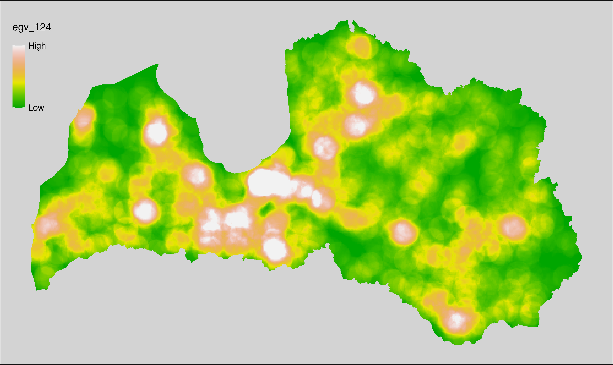
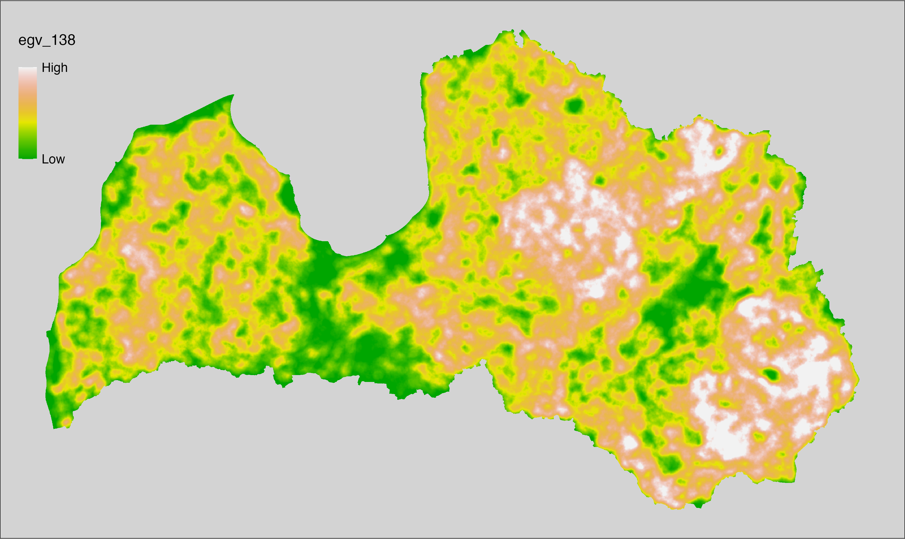
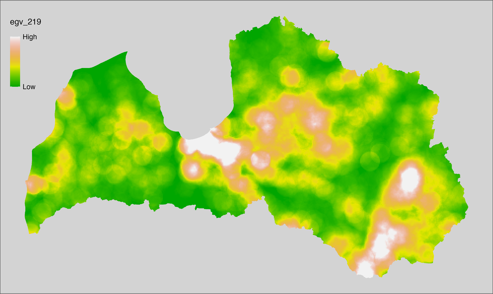
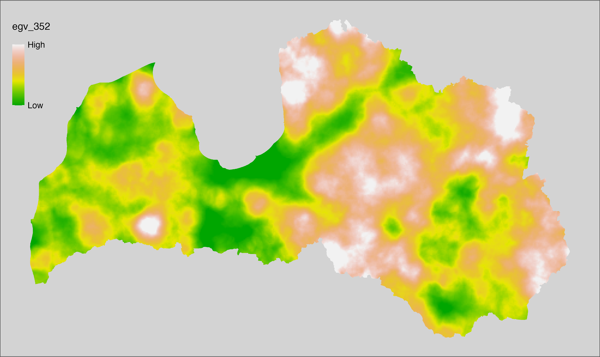
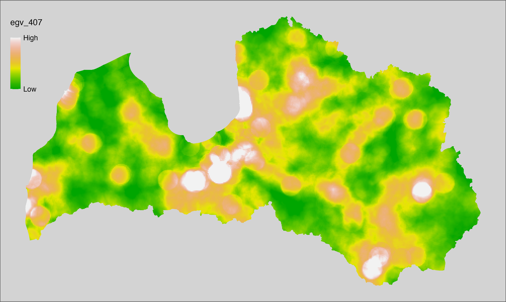
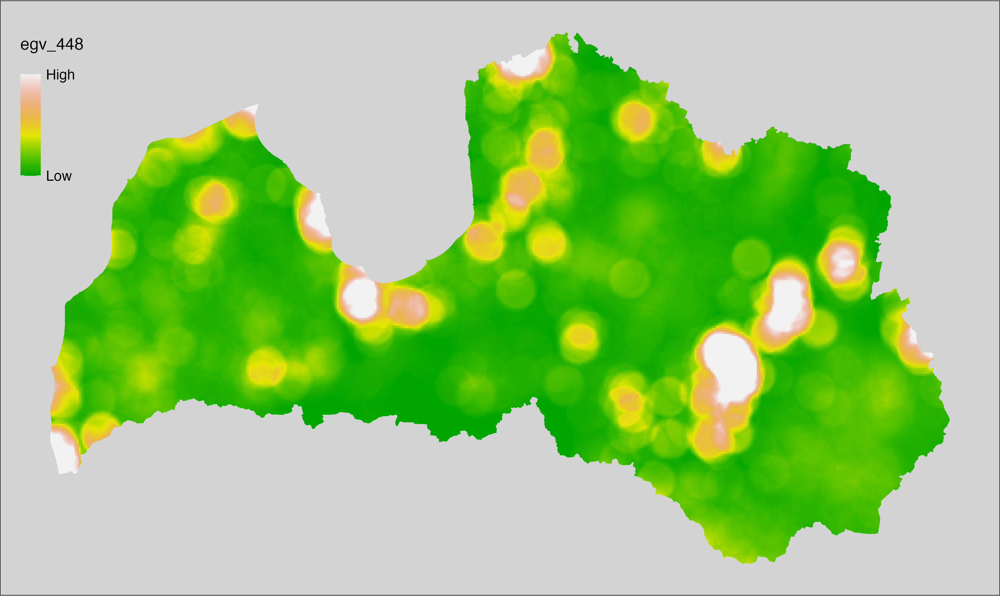
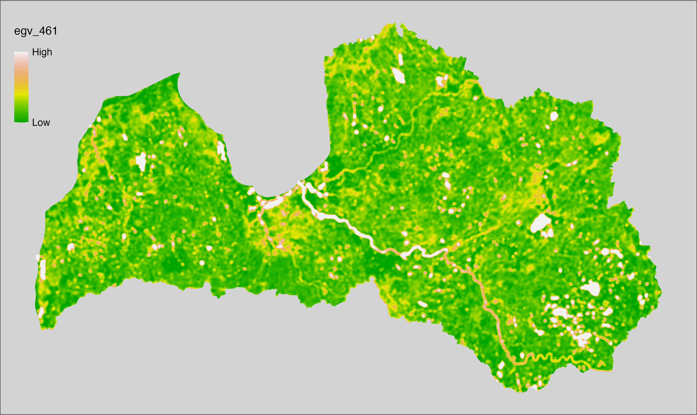

# Ecogeographical variables {#Ch06}

This section names and provides description (R code with its explanation in
procedure) of each of the 538 EGVs created.

For a better undestanding of the relatedness of these vairables, refer to the flowchart
below (Fig. \@ref(fig:flowchart)). The names used in figure correspond to EGV layer
names and follow naming convention: [group] _ [specific name] _ [scale], where:

-  group is a broader collection of EGVs describing the same phenomena or ecosystem,
  derived from the same source, etc.;

-  specific name briefly describes the landscape class and/or metrics used in
  the creation of the layer;

-  scale is one of: cell, 500, 1250, 3000, 10000 m around the centre of the 
  EGV-cell. The resolution of each EGV is 1 ha; larger scales are summarised
  to this resolution.

```{r flowchart, echo=FALSE, out.width = '100%', fig.cap='Relationships of ecogeographical variables created.'}
knitr::include_graphics("./Figures/EGV_FlowChartZ_17_11_25.png")
```

<br>

For cover fraction and edge variables, we first calculated values at the EGV-cell 
resolution and then used {exactextract} to summarise values from larger
scales. This package uses pixel area weights to calculate weighted summary
statistics, making the aggregation error negligible, particularly
at larger scales, but reduces computation time thousands up to even hundreds of
thousands times compared to input resolution (10 m). To further speed up the
procedures, we used "sparse" mode in the workflow `egvtools::radius_function()`, thus
summarising zonal statistics every 300 m for 3000 m radius buffers and every
1000 m for 10000 m buffers, obtaining near linear reduction in time relative to
the number of zones (ninefold and 100 fold further computation time reduction),
while loosing less than 0.001 % of variability overall.

We used a slightly different approach with diversity metrics. First, we calculated
Shanon's diversity index at 25 ha raster grid cells, as there was nearly no
variability of landscape classes at 1 ha grid cells. Next, we calculated
arithmetic mean as zonal statictics value (using the "sparse" mode with the workflow 
`egvtools::radius_function()`), but we did not create this EGV at the analysis
cells scale.

## Climate_CHELSAv2.1-bio1_cell {#ch06.001}

**filename:** `Climate_CHELSAv2.1-bio1_cell.tif`

**layername:** `egv_001`

**English name:** Mean annual daily mean air temperature (°C) (CHELSA v2.1)
within the analysis cell (1 ha)

**Latvian name:** Vidējā ikdienas gaisa temperatūra (°C) (CHELSA v2.1) analīzes
šūnā (1 ha)

**Procedure:** Directly follows [CHELSA v2.1](#Ch04.11). EGV is prepared using
the workflow `egvtools::downscale2egv()` with inverse distance weighted (power =
2) gap filling and soft smoothing (power = 0.5) over 5 km radius around each cell.
Finally, the layer is standardised by subtracting the arithmetic mean and
dividing by the root mean squared error.

```{r,eval=FALSE}
# libs ----
if(!require(egvtools)) {remotes::install_github("aavotins/egvtools"); require(egvtools)}

# job ----
localname="Climate_CHELSAv2.1-bio1_cell.tif"
layername="egv_001"
reading="./Geodata/2024/CHELSA/Climate_CHELSAv2.1-bio1_cell.tif"

df <- downscale2egv(
 template_path = "./Templates/TemplateRasters/LV100m_10km.tif",
 grid_path   = "./Templates/TemplateGrids/tikls1km_sauzeme.parquet",
 rawfile_path = reading,
 out_path   = "./RasterGrids_100m/2024/RAW/",
 file_name   = localname,
 layer_name  = layername,
 fill_gaps   = TRUE,
 smooth    = TRUE,
 smooth_radius_km = 5,
 plot_result  = TRUE)
print(df)

# standardisation ----
if(!require(terra)) {install.packages("terra"); require(terra)}
if(!require(tidyverse)) {install.packages("tidyverse"); require(tidyverse)}
nosaukums="Climate_CHELSAv2.1-bio1_cell.tif"
ielasisanas_cels=paste0("./RasterGrids_100m/2024/RAW/",nosaukums)
saglabasanas_cels=paste0("./RasterGrids_100m/2024/Scaled/",nosaukums)
slanis=rast(ielasisanas_cels)
videjais=global(slanis,fun="mean",na.rm=TRUE)
centrets=slanis-videjais[,1]
standartnovirze=terra::global(centrets,fun="rms",na.rm=TRUE)
merogots=centrets/standartnovirze[,1]
writeRaster(merogots,
      filename=saglabasanas_cels,
      overwrite=TRUE)
```

```{r, echo=FALSE, eval=TRUE, out.width = '100%'}
knitr::include_graphics("./Figures/maps4book/egv_1.png")
```

## Climate_CHELSAv2.1-bio10_cell {#ch06.002}

**filename:** `Climate_CHELSAv2.1-bio10_cell.tif`

**layername:** `egv_002`

**English name:** Mean daily mean air temperatures (°C) of the warmest quarter
(CHELSA v2.1) within the analysis cell (1 ha)

**Latvian name:** Gada siltākā ceturkšņa vidējā gaisa temperatūra (°C) (CHELSA
v2.1) analīzes šūnā (1 ha)

**Procedure:** Directly follows [CHELSA v2.1](#Ch04.11). EGV is prepared using
the workflow `egvtools::downscale2egv()` with inverse distance weighted (power =
2) gap filling and soft smoothing (power = 0.5) over 5 km radius around each cell.
Finally, the layer is standardised by subtracting the arithmetic mean and
dividing by the root mean squared error.

```{r,eval=FALSE}
# libs ----
if(!require(egvtools)) {remotes::install_github("aavotins/egvtools"); require(egvtools)}

# job ----

localname="Climate_CHELSAv2.1-bio10_cell.tif"
layername="egv_002"
reading="./Geodata/2024/CHELSA/Climate_CHELSAv2.1-bio10_cell.tif"

df <- downscale2egv(
 template_path = "./Templates/TemplateRasters/LV100m_10km.tif",
 grid_path   = "./Templates/TemplateGrids/tikls1km_sauzeme.parquet",
 rawfile_path = reading,
 out_path   = "./RasterGrids_100m/2024/RAW/",
 file_name   = localname,
 layer_name  = layername,
 fill_gaps   = TRUE,
 smooth    = TRUE,
 smooth_radius_km = 5,
 plot_result  = TRUE)
print(df)

# standardisation ----
if(!require(terra)) {install.packages("terra"); require(terra)}
if(!require(tidyverse)) {install.packages("tidyverse"); require(tidyverse)}

nosaukums="Climate_CHELSAv2.1-bio10_cell.tif"
ielasisanas_cels=paste0("./RasterGrids_100m/2024/RAW/",nosaukums)
saglabasanas_cels=paste0("./RasterGrids_100m/2024/Scaled/",nosaukums)
slanis=rast(ielasisanas_cels)
videjais=global(slanis,fun="mean",na.rm=TRUE)
centrets=slanis-videjais[,1]
standartnovirze=terra::global(centrets,fun="rms",na.rm=TRUE)
merogots=centrets/standartnovirze[,1]
writeRaster(merogots,
      filename=saglabasanas_cels,
      overwrite=TRUE)
```

```{r, echo=FALSE, eval=TRUE, out.width = '100%'}
knitr::include_graphics("./Figures/maps4book/egv_2.png")
```

## Climate_CHELSAv2.1-bio11_cell {#ch06.003}

**filename:** `Climate_CHELSAv2.1-bio11_cell.tif`

**layername:** `egv_003`

**English name:** Mean daily mean air temperatures (°C) of the coldest quarter
(CHELSA v2.1) within the analysis cell (1 ha)

**Latvian name:** Gada aukstākā ceturkšņa vidējā gaisa temperatūra (°C) (CHELSA
v2.1) analīzes šūnā (1 ha)

**Procedure:** Directly follows [CHELSA v2.1](#Ch04.11). EGV is prepared using
the workflow `egvtools::downscale2egv()` with inverse distance weighted (power =
2) gap filling and soft smoothing (power = 0.5) over 5 km radius around each cell.
Finally, the layer is standardised by subtracting the arithmetic mean and
dividing by the root mean squared error.

```{r,eval=FALSE}
# libs ----
if(!require(egvtools)) {remotes::install_github("aavotins/egvtools"); require(egvtools)}

# job ----

localname="Climate_CHELSAv2.1-bio11_cell.tif"
layername="egv_003"
reading="./Geodata/2024/CHELSA/Climate_CHELSAv2.1-bio11_cell.tif"

df <- downscale2egv(
 template_path = "./Templates/TemplateRasters/LV100m_10km.tif",
 grid_path   = "./Templates/TemplateGrids/tikls1km_sauzeme.parquet",
 rawfile_path = reading,
 out_path   = "./RasterGrids_100m/2024/RAW/",
 file_name   = localname,
 layer_name  = layername,
 fill_gaps   = TRUE,
 smooth    = TRUE,
 smooth_radius_km = 5,
 plot_result  = TRUE)
print(df)

# standardisation ----
if(!require(terra)) {install.packages("terra"); require(terra)}
if(!require(tidyverse)) {install.packages("tidyverse"); require(tidyverse)}

nosaukums="Climate_CHELSAv2.1-bio11_cell.tif"
ielasisanas_cels=paste0("./RasterGrids_100m/2024/RAW/",nosaukums)
saglabasanas_cels=paste0("./RasterGrids_100m/2024/Scaled/",nosaukums)
slanis=rast(ielasisanas_cels)
videjais=global(slanis,fun="mean",na.rm=TRUE)
centrets=slanis-videjais[,1]
standartnovirze=terra::global(centrets,fun="rms",na.rm=TRUE)
merogots=centrets/standartnovirze[,1]
writeRaster(merogots,
      filename=saglabasanas_cels,
      overwrite=TRUE)
```

```{r, echo=FALSE, eval=TRUE, out.width = '100%'}

```

## Climate_CHELSAv2.1-bio12_cell {#ch06.004}

**filename:** `Climate_CHELSAv2.1-bio12_cell.tif`

**layername:** `egv_004`

**English name:** Annual precipitation amount (kg m⁻² year⁻¹) (CHELSA v2.1)
within the analysis cell (1 ha)

**Latvian name:** Gada nokrišņu daudzums (kg m⁻² gadā) (CHELSA v2.1) analīzes
šūnā (1 ha)

**Procedure:** Directly follows [CHELSA v2.1](#Ch04.11). EGV is prepared using
the workflow `egvtools::downscale2egv()` with inverse distance weighted (power =
2) gap filling and soft smoothing (power = 0.5) over 5 km radius around each cell.
Finally, the layer is standardised by subtracting the arithmetic mean and
dividing by the root mean squared error.

```{r,eval=FALSE}
# libs ----
if(!require(egvtools)) {remotes::install_github("aavotins/egvtools"); require(egvtools)}

# job ----

localname="Climate_CHELSAv2.1-bio12_cell.tif"
layername="egv_004"
reading="./Geodata/2024/CHELSA/Climate_CHELSAv2.1-bio12_cell.tif"

df <- downscale2egv(
 template_path = "./Templates/TemplateRasters/LV100m_10km.tif",
 grid_path   = "./Templates/TemplateGrids/tikls1km_sauzeme.parquet",
 rawfile_path = reading,
 out_path   = "./RasterGrids_100m/2024/RAW/",
 file_name   = localname,
 layer_name  = layername,
 fill_gaps   = TRUE,
 smooth    = TRUE,
 smooth_radius_km = 5,
 plot_result  = TRUE)
print(df)

# standardisation ----
if(!require(terra)) {install.packages("terra"); require(terra)}
if(!require(tidyverse)) {install.packages("tidyverse"); require(tidyverse)}

nosaukums="Climate_CHELSAv2.1-bio12_cell.tif"
ielasisanas_cels=paste0("./RasterGrids_100m/2024/RAW/",nosaukums)
saglabasanas_cels=paste0("./RasterGrids_100m/2024/Scaled/",nosaukums)
slanis=rast(ielasisanas_cels)
videjais=global(slanis,fun="mean",na.rm=TRUE)
centrets=slanis-videjais[,1]
standartnovirze=terra::global(centrets,fun="rms",na.rm=TRUE)
merogots=centrets/standartnovirze[,1]
writeRaster(merogots,
      filename=saglabasanas_cels,
      overwrite=TRUE)
```

```{r, echo=FALSE, eval=TRUE, out.width = '100%'}
knitr::include_graphics("./Figures/maps4book/egv_4.png")
```

## Climate_CHELSAv2.1-bio13_cell {#ch06.005}

**filename:** `Climate_CHELSAv2.1-bio13_cell.tif`

**layername:** `egv_005`

**English name:** Precipitation amount (kg m⁻² month⁻¹) of the wettest month
(CHELSA v2.1) within the analysis cell (1 ha)

**Latvian name:** Slapjākā mēneša nokrišņu daudzums (kg m⁻² mēnesī) (CHELSA
v2.1) analīzes šūnā (1 ha)

**Procedure:** Directly follows [CHELSA v2.1](#Ch04.11). EGV is prepared using
the workflow `egvtools::downscale2egv()` with inverse distance weighted (power =
2) gap filling and soft smoothing (power = 0.5) over 5 km radius around each cell.
Finally, the layer is standardised by subtracting the arithmetic mean and
dividing by the root mean squared error.

```{r,eval=FALSE}
# libs ----
if(!require(egvtools)) {remotes::install_github("aavotins/egvtools"); require(egvtools)}

# job ----

localname="Climate_CHELSAv2.1-bio13_cell.tif"
layername="egv_005"
reading="./Geodata/2024/CHELSA/Climate_CHELSAv2.1-bio13_cell.tif"

df <- downscale2egv(
 template_path = "./Templates/TemplateRasters/LV100m_10km.tif",
 grid_path   = "./Templates/TemplateGrids/tikls1km_sauzeme.parquet",
 rawfile_path = reading,
 out_path   = "./RasterGrids_100m/2024/RAW/",
 file_name   = localname,
 layer_name  = layername,
 fill_gaps   = TRUE,
 smooth    = TRUE,
 smooth_radius_km = 5,
 plot_result  = TRUE)
print(df)

# standardisation ----
if(!require(terra)) {install.packages("terra"); require(terra)}
if(!require(tidyverse)) {install.packages("tidyverse"); require(tidyverse)}

nosaukums="Climate_CHELSAv2.1-bio13_cell.tif"
ielasisanas_cels=paste0("./RasterGrids_100m/2024/RAW/",nosaukums)
saglabasanas_cels=paste0("./RasterGrids_100m/2024/Scaled/",nosaukums)
slanis=rast(ielasisanas_cels)
videjais=global(slanis,fun="mean",na.rm=TRUE)
centrets=slanis-videjais[,1]
standartnovirze=terra::global(centrets,fun="rms",na.rm=TRUE)
merogots=centrets/standartnovirze[,1]
writeRaster(merogots,
      filename=saglabasanas_cels,
      overwrite=TRUE)
```

```{r, echo=FALSE, eval=TRUE, out.width = '100%'}
knitr::include_graphics("./Figures/maps4book/egv_5.png")
```

## Climate_CHELSAv2.1-bio14_cell {#ch06.006}

**filename:** `Climate_CHELSAv2.1-bio14_cell.tif`

**layername:** `egv_006`

**English name:** Precipitation amount (kg m⁻² month⁻¹) of the driest month
(CHELSA v2.1) within the analysis cell (1 ha)

**Latvian name:** Sausākā mēneša nokrišņu daudzums (kg m⁻² mēnesī) (CHELSA v2.1)
analīzes šūnā (1 ha)

**Procedure:** Directly follows [CHELSA v2.1](#Ch04.11). EGV is prepared using
the workflow `egvtools::downscale2egv()` with inverse distance weighted (power =
2) gap filling and soft smoothing (power = 0.5) over 5 km radius around each cell.
Finally, the layer is standardised by subtracting the arithmetic mean and
dividing by the root mean squared error.

```{r,eval=FALSE}
# libs ----
if(!require(egvtools)) {remotes::install_github("aavotins/egvtools"); require(egvtools)}

# job ----

localname="Climate_CHELSAv2.1-bio14_cell.tif"
layername="egv_006"
reading="./Geodata/2024/CHELSA/Climate_CHELSAv2.1-bio14_cell.tif"

df <- downscale2egv(
 template_path = "./Templates/TemplateRasters/LV100m_10km.tif",
 grid_path   = "./Templates/TemplateGrids/tikls1km_sauzeme.parquet",
 rawfile_path = reading,
 out_path   = "./RasterGrids_100m/2024/RAW/",
 file_name   = localname,
 layer_name  = layername,
 fill_gaps   = TRUE,
 smooth    = TRUE,
 smooth_radius_km = 5,
 plot_result  = TRUE)
print(df)

# standardisation ----
if(!require(terra)) {install.packages("terra"); require(terra)}
if(!require(tidyverse)) {install.packages("tidyverse"); require(tidyverse)}

nosaukums="Climate_CHELSAv2.1-bio14_cell.tif"
ielasisanas_cels=paste0("./RasterGrids_100m/2024/RAW/",nosaukums)
saglabasanas_cels=paste0("./RasterGrids_100m/2024/Scaled/",nosaukums)
slanis=rast(ielasisanas_cels)
videjais=global(slanis,fun="mean",na.rm=TRUE)
centrets=slanis-videjais[,1]
standartnovirze=terra::global(centrets,fun="rms",na.rm=TRUE)
merogots=centrets/standartnovirze[,1]
writeRaster(merogots,
      filename=saglabasanas_cels,
      overwrite=TRUE)
```

```{r, echo=FALSE, eval=TRUE, out.width = '100%'}
knitr::include_graphics("./Figures/maps4book/egv_6.png")
```

## Climate_CHELSAv2.1-bio15_cell {#ch06.007}

**filename:** `Climate_CHELSAv2.1-bio15_cell.tif`

**layername:** `egv_007`

**English name:** Precipitation seasonality (kg m⁻²) (CHELSA v2.1) within the
analysis cell (1 ha)

**Latvian name:** Nokrišņu sezonalitāte (kg m⁻²) (CHELSA v2.1) analīzes šūnā (1
ha)

**Procedure:** Directly follows [CHELSA v2.1](#Ch04.11). EGV is prepared using
the workflow `egvtools::downscale2egv()` with inverse distance weighted (power =
2) gap filling and soft smoothing (power = 0.5) over 5 km radius around each cell.
Finally, the layer is standardised by subtracting the arithmetic mean and
dividing by the root mean squared error.

```{r,eval=FALSE}
# libs ----
if(!require(egvtools)) {remotes::install_github("aavotins/egvtools"); require(egvtools)}

# job ----

localname="Climate_CHELSAv2.1-bio15_cell.tif"
layername="egv_007"
reading="./Geodata/2024/CHELSA/Climate_CHELSAv2.1-bio15_cell.tif"

df <- downscale2egv(
 template_path = "./Templates/TemplateRasters/LV100m_10km.tif",
 grid_path   = "./Templates/TemplateGrids/tikls1km_sauzeme.parquet",
 rawfile_path = reading,
 out_path   = "./RasterGrids_100m/2024/RAW/",
 file_name   = localname,
 layer_name  = layername,
 fill_gaps   = TRUE,
 smooth    = TRUE,
 smooth_radius_km = 5,
 plot_result  = TRUE)
print(df)

# standardisation ----
if(!require(terra)) {install.packages("terra"); require(terra)}
if(!require(tidyverse)) {install.packages("tidyverse"); require(tidyverse)}

nosaukums="Climate_CHELSAv2.1-bio15_cell.tif"
ielasisanas_cels=paste0("./RasterGrids_100m/2024/RAW/",nosaukums)
saglabasanas_cels=paste0("./RasterGrids_100m/2024/Scaled/",nosaukums)
slanis=rast(ielasisanas_cels)
videjais=global(slanis,fun="mean",na.rm=TRUE)
centrets=slanis-videjais[,1]
standartnovirze=terra::global(centrets,fun="rms",na.rm=TRUE)
merogots=centrets/standartnovirze[,1]
writeRaster(merogots,
      filename=saglabasanas_cels,
      overwrite=TRUE)
```

```{r, echo=FALSE, eval=TRUE, out.width = '100%'}
knitr::include_graphics("./Figures/maps4book/egv_7.png")
```

## Climate_CHELSAv2.1-bio16_cell {#ch06.008}

**filename:** `Climate_CHELSAv2.1-bio16_cell.tif`

**layername:** `egv_008`

**English name:** Mean monthly precipitation amount (kg m⁻² month⁻¹) of the
wettest quarter (CHELSA v2.1) within the analysis cell (1 ha)

**Latvian name:** Slapjākā ceturkšņa vidējais nokrišņu daudzums mēnesī (kg m⁻²
mēnesī) (CHELSA v2.1) analīzes šūnā (1 ha)

**Procedure:** Directly follows [CHELSA v2.1](#Ch04.11). EGV is prepared using
the workflow `egvtools::downscale2egv()` with inverse distance weighted (power =
2) gap filling and soft smoothing (power = 0.5) over 5 km radius around each cell.
Finally, the layer is standardised by subtracting the arithmetic mean and
dividing by the root mean squared error.

```{r,eval=FALSE}
# libs ----
if(!require(egvtools)) {remotes::install_github("aavotins/egvtools"); require(egvtools)}

# job ----

localname="Climate_CHELSAv2.1-bio16_cell.tif"
layername="egv_008"
reading="./Geodata/2024/CHELSA/Climate_CHELSAv2.1-bio16_cell.tif"

df <- downscale2egv(
 template_path = "./Templates/TemplateRasters/LV100m_10km.tif",
 grid_path   = "./Templates/TemplateGrids/tikls1km_sauzeme.parquet",
 rawfile_path = reading,
 out_path   = "./RasterGrids_100m/2024/RAW/",
 file_name   = localname,
 layer_name  = layername,
 fill_gaps   = TRUE,
 smooth    = TRUE,
 smooth_radius_km = 5,
 plot_result  = TRUE)
print(df)

# standardisation ----
if(!require(terra)) {install.packages("terra"); require(terra)}
if(!require(tidyverse)) {install.packages("tidyverse"); require(tidyverse)}

nosaukums="Climate_CHELSAv2.1-bio16_cell.tif"
ielasisanas_cels=paste0("./RasterGrids_100m/2024/RAW/",nosaukums)
saglabasanas_cels=paste0("./RasterGrids_100m/2024/Scaled/",nosaukums)
slanis=rast(ielasisanas_cels)
videjais=global(slanis,fun="mean",na.rm=TRUE)
centrets=slanis-videjais[,1]
standartnovirze=terra::global(centrets,fun="rms",na.rm=TRUE)
merogots=centrets/standartnovirze[,1]
writeRaster(merogots,
      filename=saglabasanas_cels,
      overwrite=TRUE)
```

```{r, echo=FALSE, eval=TRUE, out.width = '100%'}
knitr::include_graphics("./Figures/maps4book/egv_8.png")
```

## Climate_CHELSAv2.1-bio17_cell {#ch06.009}

**filename:** `Climate_CHELSAv2.1-bio17_cell.tif`

**layername:** `egv_009`

**English name:** Mean monthly precipitation amount (kg m⁻² month⁻¹) of the
driest quarter (CHELSA v2.1) within the analysis cell (1 ha)

**Latvian name:** Sausākā ceturkšņa vidējais nokrišņu daudzums mēnesī (kg m⁻²
mēnesī) (CHELSA v2.1) analīzes šūnā (1 ha)

**Procedure:** Directly follows [CHELSA v2.1](#Ch04.11). EGV is prepared using
the workflow `egvtools::downscale2egv()` with inverse distance weighted (power =
2) gap filling and soft smoothing (power = 0.5) over 5 km radius around each cell.
Finally, the layer is standardised by subtracting the arithmetic mean and
dividing by the root mean squared error.

```{r,eval=FALSE}
# libs ----
if(!require(egvtools)) {remotes::install_github("aavotins/egvtools"); require(egvtools)}

# job ----

localname="Climate_CHELSAv2.1-bio17_cell.tif"
layername="egv_009"
reading="./Geodata/2024/CHELSA/Climate_CHELSAv2.1-bio17_cell.tif"

df <- downscale2egv(
 template_path = "./Templates/TemplateRasters/LV100m_10km.tif",
 grid_path   = "./Templates/TemplateGrids/tikls1km_sauzeme.parquet",
 rawfile_path = reading,
 out_path   = "./RasterGrids_100m/2024/RAW/",
 file_name   = localname,
 layer_name  = layername,
 fill_gaps   = TRUE,
 smooth    = TRUE,
 smooth_radius_km = 5,
 plot_result  = TRUE)
print(df)

# standardisation ----
if(!require(terra)) {install.packages("terra"); require(terra)}
if(!require(tidyverse)) {install.packages("tidyverse"); require(tidyverse)}

nosaukums="Climate_CHELSAv2.1-bio17_cell.tif"
ielasisanas_cels=paste0("./RasterGrids_100m/2024/RAW/",nosaukums)
saglabasanas_cels=paste0("./RasterGrids_100m/2024/Scaled/",nosaukums)
slanis=rast(ielasisanas_cels)
videjais=global(slanis,fun="mean",na.rm=TRUE)
centrets=slanis-videjais[,1]
standartnovirze=terra::global(centrets,fun="rms",na.rm=TRUE)
merogots=centrets/standartnovirze[,1]
writeRaster(merogots,
      filename=saglabasanas_cels,
      overwrite=TRUE)
```

```{r, echo=FALSE, eval=TRUE, out.width = '100%'}
knitr::include_graphics("./Figures/maps4book/egv_9.png")
```

## Climate_CHELSAv2.1-bio18_cell {#ch06.010}

**filename:** `Climate_CHELSAv2.1-bio18_cell.tif`

**layername:** `egv_010`

**English name:** Mean monthly precipitation amount (kg m⁻² month⁻¹) of the
warmest quarter (CHELSA v2.1) within the analysis cell (1 ha)

**Latvian name:** Siltākā ceturkšņa vidējais nokrišņu daudzuma mēnesī (kg m⁻²
mēnesī) (CHELSA v2.1) analīzes šūnā (1 ha)

**Procedure:** Directly follows [CHELSA v2.1](#Ch04.11). EGV is prepared using
the workflow `egvtools::downscale2egv()` with inverse distance weighted (power =
2) gap filling and soft smoothing (power = 0.5) over 5 km radius around each cell.
Finally, the layer is standardised by subtracting the arithmetic mean and
dividing by the root mean squared error.

```{r,eval=FALSE}
# libs ----
if(!require(egvtools)) {remotes::install_github("aavotins/egvtools"); require(egvtools)}

# job ----

localname="Climate_CHELSAv2.1-bio18_cell.tif"
layername="egv_010"
reading="./Geodata/2024/CHELSA/Climate_CHELSAv2.1-bio18_cell.tif"

df <- downscale2egv(
 template_path = "./Templates/TemplateRasters/LV100m_10km.tif",
 grid_path   = "./Templates/TemplateGrids/tikls1km_sauzeme.parquet",
 rawfile_path = reading,
 out_path   = "./RasterGrids_100m/2024/RAW/",
 file_name   = localname,
 layer_name  = layername,
 fill_gaps   = TRUE,
 smooth    = TRUE,
 smooth_radius_km = 5,
 plot_result  = TRUE)
print(df)

# standardisation ----
if(!require(terra)) {install.packages("terra"); require(terra)}
if(!require(tidyverse)) {install.packages("tidyverse"); require(tidyverse)}

nosaukums="Climate_CHELSAv2.1-bio18_cell.tif"
ielasisanas_cels=paste0("./RasterGrids_100m/2024/RAW/",nosaukums)
saglabasanas_cels=paste0("./RasterGrids_100m/2024/Scaled/",nosaukums)
slanis=rast(ielasisanas_cels)
videjais=global(slanis,fun="mean",na.rm=TRUE)
centrets=slanis-videjais[,1]
standartnovirze=terra::global(centrets,fun="rms",na.rm=TRUE)
merogots=centrets/standartnovirze[,1]
writeRaster(merogots,
      filename=saglabasanas_cels,
      overwrite=TRUE)
```

```{r, echo=FALSE, eval=TRUE, out.width = '100%'}
knitr::include_graphics("./Figures/maps4book/egv_10.png")
```

## Climate_CHELSAv2.1-bio19_cell {#ch06.011}

**filename:** `Climate_CHELSAv2.1-bio19_cell.tif`

**layername:** `egv_011`

**English name:** Mean monthly precipitation amount (kg m⁻² month⁻¹) of the
coldest quarter (CHELSA v2.1) within the analysis cell (1 ha)

**Latvian name:** Aukstākā ceturkšņa vidējais nokrišņu daudzums mēnesī (kg m⁻²
mēnesī) (CHELSA v2.1) analīzes šūnā (1 ha)

**Procedure:** Directly follows [CHELSA v2.1](#Ch04.11). EGV is prepared using
the workflow `egvtools::downscale2egv()` with inverse distance weighted (power =
2) gap filling and soft smoothing (power = 0.5) over 5 km radius around each cell.
Finally, the layer is standardised by subtracting the arithmetic mean and
dividing by the root mean squared error.

```{r,eval=FALSE}
# libs ----
if(!require(egvtools)) {remotes::install_github("aavotins/egvtools"); require(egvtools)}

# job ----

localname="Climate_CHELSAv2.1-bio19_cell.tif"
layername="egv_011"
reading="./Geodata/2024/CHELSA/Climate_CHELSAv2.1-bio19_cell.tif"

df <- downscale2egv(
 template_path = "./Templates/TemplateRasters/LV100m_10km.tif",
 grid_path   = "./Templates/TemplateGrids/tikls1km_sauzeme.parquet",
 rawfile_path = reading,
 out_path   = "./RasterGrids_100m/2024/RAW/",
 file_name   = localname,
 layer_name  = layername,
 fill_gaps   = TRUE,
 smooth    = TRUE,
 smooth_radius_km = 5,
 plot_result  = TRUE)
print(df)

# standardisation ----
if(!require(terra)) {install.packages("terra"); require(terra)}
if(!require(tidyverse)) {install.packages("tidyverse"); require(tidyverse)}

nosaukums="Climate_CHELSAv2.1-bio19_cell.tif"
ielasisanas_cels=paste0("./RasterGrids_100m/2024/RAW/",nosaukums)
saglabasanas_cels=paste0("./RasterGrids_100m/2024/Scaled/",nosaukums)
slanis=rast(ielasisanas_cels)
videjais=global(slanis,fun="mean",na.rm=TRUE)
centrets=slanis-videjais[,1]
standartnovirze=terra::global(centrets,fun="rms",na.rm=TRUE)
merogots=centrets/standartnovirze[,1]
writeRaster(merogots,
      filename=saglabasanas_cels,
      overwrite=TRUE)
```

```{r, echo=FALSE, eval=TRUE, out.width = '100%'}
knitr::include_graphics("./Figures/maps4book/egv_11.png")
```

## Climate_CHELSAv2.1-bio2_cell {#ch06.012}

**filename:** `Climate_CHELSAv2.1-bio2_cell.tif`

**layername:** `egv_012`

**English name:** Mean diurnal air temperature range (°C) (CHELSA v2.1) within
the analysis cell (1 ha)

**Latvian name:** Diennakts temperatūru amplitūda (°C) (CHELSA v2.1) analīzes
šūnā (1 ha)

**Procedure:** Directly follows [CHELSA v2.1](#Ch04.11). EGV is prepared using
the workflow `egvtools::downscale2egv()` with inverse distance weighted (power =
2) gap filling and soft smoothing (power = 0.5) over 5 km radius around each cell.
Finally, the layer is standardised by subtracting the arithmetic mean and
dividing by the root mean squared error.

```{r,eval=FALSE}
# libs ----
if(!require(egvtools)) {remotes::install_github("aavotins/egvtools"); require(egvtools)}

# job ----

localname="Climate_CHELSAv2.1-bio2_cell.tif"
layername="egv_012"
reading="./Geodata/2024/CHELSA/Climate_CHELSAv2.1-bio2_cell.tif"

df <- downscale2egv(
 template_path = "./Templates/TemplateRasters/LV100m_10km.tif",
 grid_path   = "./Templates/TemplateGrids/tikls1km_sauzeme.parquet",
 rawfile_path = reading,
 out_path   = "./RasterGrids_100m/2024/RAW/",
 file_name   = localname,
 layer_name  = layername,
 fill_gaps   = TRUE,
 smooth    = TRUE,
 smooth_radius_km = 5,
 plot_result  = TRUE)
print(df)

# standardisation ----
if(!require(terra)) {install.packages("terra"); require(terra)}
if(!require(tidyverse)) {install.packages("tidyverse"); require(tidyverse)}

nosaukums="Climate_CHELSAv2.1-bio2_cell.tif"
ielasisanas_cels=paste0("./RasterGrids_100m/2024/RAW/",nosaukums)
saglabasanas_cels=paste0("./RasterGrids_100m/2024/Scaled/",nosaukums)
slanis=rast(ielasisanas_cels)
videjais=global(slanis,fun="mean",na.rm=TRUE)
centrets=slanis-videjais[,1]
standartnovirze=terra::global(centrets,fun="rms",na.rm=TRUE)
merogots=centrets/standartnovirze[,1]
writeRaster(merogots,
      filename=saglabasanas_cels,
      overwrite=TRUE)
```

```{r, echo=FALSE, eval=TRUE, out.width = '100%'}

```

## Climate_CHELSAv2.1-bio3_cell {#ch06.013}

**filename:** `Climate_CHELSAv2.1-bio3_cell.tif`

**layername:** `egv_013`

**English name:** Isothermality (ratio of diurnal variation to annual variation
in temperatures) (°C) (CHELSA v2.1) within the analysis cell (1 ha)

**Latvian name:** Izotermalitāte (attiecība starp diennakts un gada temperatūras
svārstībām) (°C) (CHELSA v2.1) analīzes šūnā (1 ha)

**Procedure:** Directly follows [CHELSA v2.1](#Ch04.11). EGV is prepared using
the workflow `egvtools::downscale2egv()` with inverse distance weighted (power =
2) gap filling and soft smoothing (power = 0.5) over 5 km radius around each cell.
Finally, the layer is standardised by subtracting the arithmetic mean and
dividing by the root mean squared error.

```{r,eval=FALSE}
# libs ----
if(!require(egvtools)) {remotes::install_github("aavotins/egvtools"); require(egvtools)}

# job ----

localname="Climate_CHELSAv2.1-bio3_cell.tif"
layername="egv_013"
reading="./Geodata/2024/CHELSA/Climate_CHELSAv2.1-bio3_cell.tif"

df <- downscale2egv(
 template_path = "./Templates/TemplateRasters/LV100m_10km.tif",
 grid_path   = "./Templates/TemplateGrids/tikls1km_sauzeme.parquet",
 rawfile_path = reading,
 out_path   = "./RasterGrids_100m/2024/RAW/",
 file_name   = localname,
 layer_name  = layername,
 fill_gaps   = TRUE,
 smooth    = TRUE,
 smooth_radius_km = 5,
 plot_result  = TRUE)
print(df)

# standardisation ----
if(!require(terra)) {install.packages("terra"); require(terra)}
if(!require(tidyverse)) {install.packages("tidyverse"); require(tidyverse)}

nosaukums="Climate_CHELSAv2.1-bio3_cell.tif"
ielasisanas_cels=paste0("./RasterGrids_100m/2024/RAW/",nosaukums)
saglabasanas_cels=paste0("./RasterGrids_100m/2024/Scaled/",nosaukums)
slanis=rast(ielasisanas_cels)
videjais=global(slanis,fun="mean",na.rm=TRUE)
centrets=slanis-videjais[,1]
standartnovirze=terra::global(centrets,fun="rms",na.rm=TRUE)
merogots=centrets/standartnovirze[,1]
writeRaster(merogots,
      filename=saglabasanas_cels,
      overwrite=TRUE)
```

```{r, echo=FALSE, eval=TRUE, out.width = '100%'}
knitr::include_graphics("./Figures/maps4book/egv_13.png")
```

## Climate_CHELSAv2.1-bio4_cell {#ch06.014}

**filename:** `Climate_CHELSAv2.1-bio4_cell.tif`

**layername:** `egv_014`

**English name:** Temperature seasonality (standard deviation of the monthly
mean temperatures) (°C/100) (CHELSA v2.1) within the analysis cell (1 ha)

**Latvian name:** Temperatūru sezonalitāte (mēneša vidējo temperatūru
standartnovirze) (°C/100) (CHELSA v2.1) analīzes šūnā (1 ha)

**Procedure:** Directly follows [CHELSA v2.1](#Ch04.11). EGV is prepared using
the workflow `egvtools::downscale2egv()` with inverse distance weighted (power =
2) gap filling and soft smoothing (power = 0.5) over 5 km radius around each cell.
Finally, the layer is standardised by subtracting the arithmetic mean and
dividing by the root mean squared error.

```{r,eval=FALSE}
# libs ----
if(!require(egvtools)) {remotes::install_github("aavotins/egvtools"); require(egvtools)}

# job ----

localname="Climate_CHELSAv2.1-bio4_cell.tif"
layername="egv_014"
reading="./Geodata/2024/CHELSA/Climate_CHELSAv2.1-bio4_cell.tif"

df <- downscale2egv(
 template_path = "./Templates/TemplateRasters/LV100m_10km.tif",
 grid_path   = "./Templates/TemplateGrids/tikls1km_sauzeme.parquet",
 rawfile_path = reading,
 out_path   = "./RasterGrids_100m/2024/RAW/",
 file_name   = localname,
 layer_name  = layername,
 fill_gaps   = TRUE,
 smooth    = TRUE,
 smooth_radius_km = 5,
 plot_result  = TRUE)
print(df)

# standardisation ----
if(!require(terra)) {install.packages("terra"); require(terra)}
if(!require(tidyverse)) {install.packages("tidyverse"); require(tidyverse)}

nosaukums="Climate_CHELSAv2.1-bio4_cell.tif"
ielasisanas_cels=paste0("./RasterGrids_100m/2024/RAW/",nosaukums)
saglabasanas_cels=paste0("./RasterGrids_100m/2024/Scaled/",nosaukums)
slanis=rast(ielasisanas_cels)
videjais=global(slanis,fun="mean",na.rm=TRUE)
centrets=slanis-videjais[,1]
standartnovirze=terra::global(centrets,fun="rms",na.rm=TRUE)
merogots=centrets/standartnovirze[,1]
writeRaster(merogots,
      filename=saglabasanas_cels,
      overwrite=TRUE)
```

```{r, echo=FALSE, eval=TRUE, out.width = '100%'}

```

## Climate_CHELSAv2.1-bio5_cell {#ch06.015}

**filename:** `Climate_CHELSAv2.1-bio5_cell.tif`

**layername:** `egv_015`

**English name:** Mean daily maximum air temperature (°C) of the warmest month
(CHELSA v2.1) within the analysis cell (1 ha)

**Latvian name:** Siltākā mēneša vidējā ikdienas augstākā gaisa temperatūra (°C)
(CHELSA v2.1) analīzes šūnā (1 ha)

**Procedure:** Directly follows [CHELSA v2.1](#Ch04.11). EGV is prepared using
the workflow `egvtools::downscale2egv()` with inverse distance weighted (power =
2) gap filling and soft smoothing (power = 0.5) over 5 km radius around each cell.
Finally, the layer is standardised by subtracting the arithmetic mean and
dividing by the root mean squared error.

```{r,eval=FALSE}
# libs ----
if(!require(egvtools)) {remotes::install_github("aavotins/egvtools"); require(egvtools)}

# job ----

localname="Climate_CHELSAv2.1-bio5_cell.tif"
layername="egv_015"
reading="./Geodata/2024/CHELSA/Climate_CHELSAv2.1-bio5_cell.tif"

df <- downscale2egv(
 template_path = "./Templates/TemplateRasters/LV100m_10km.tif",
 grid_path   = "./Templates/TemplateGrids/tikls1km_sauzeme.parquet",
 rawfile_path = reading,
 out_path   = "./RasterGrids_100m/2024/RAW/",
 file_name   = localname,
 layer_name  = layername,
 fill_gaps   = TRUE,
 smooth    = TRUE,
 smooth_radius_km = 5,
 plot_result  = TRUE)
print(df)

# standardisation ----
if(!require(terra)) {install.packages("terra"); require(terra)}
if(!require(tidyverse)) {install.packages("tidyverse"); require(tidyverse)}

nosaukums="Climate_CHELSAv2.1-bio5_cell.tif"
ielasisanas_cels=paste0("./RasterGrids_100m/2024/RAW/",nosaukums)
saglabasanas_cels=paste0("./RasterGrids_100m/2024/Scaled/",nosaukums)
slanis=rast(ielasisanas_cels)
videjais=global(slanis,fun="mean",na.rm=TRUE)
centrets=slanis-videjais[,1]
standartnovirze=terra::global(centrets,fun="rms",na.rm=TRUE)
merogots=centrets/standartnovirze[,1]
writeRaster(merogots,
      filename=saglabasanas_cels,
      overwrite=TRUE)
```

```{r, echo=FALSE, eval=TRUE, out.width = '100%'}
knitr::include_graphics("./Figures/maps4book/egv_15.png")
```

## Climate_CHELSAv2.1-bio6_cell {#ch06.016}

**filename:** `Climate_CHELSAv2.1-bio6_cell.tif`

**layername:** `egv_016`

**English name:** Mean daily minimum air temperature (°C) of the coldest month
(CHELSA v2.1) within the analysis cell (1 ha)

**Latvian name:** Aukstākā mēneša vidējā ikdienas zemākā gaisa temperatūra (°C)
(CHELSA v2.1) analīzes šūnā (1 ha)

**Procedure:** Directly follows [CHELSA v2.1](#Ch04.11). EGV is prepared using
the workflow `egvtools::downscale2egv()` with inverse distance weighted (power =
2) gap filling and soft smoothing (power = 0.5) over 5 km radius around each cell.
Finally, the layer is standardised by subtracting the arithmetic mean and
dividing by the root mean squared error.

```{r,eval=FALSE}
# libs ----
if(!require(egvtools)) {remotes::install_github("aavotins/egvtools"); require(egvtools)}

# job ----

localname="Climate_CHELSAv2.1-bio6_cell.tif"
layername="egv_016"
reading="./Geodata/2024/CHELSA/Climate_CHELSAv2.1-bio6_cell.tif"

df <- downscale2egv(
 template_path = "./Templates/TemplateRasters/LV100m_10km.tif",
 grid_path   = "./Templates/TemplateGrids/tikls1km_sauzeme.parquet",
 rawfile_path = reading,
 out_path   = "./RasterGrids_100m/2024/RAW/",
 file_name   = localname,
 layer_name  = layername,
 fill_gaps   = TRUE,
 smooth    = TRUE,
 smooth_radius_km = 5,
 plot_result  = TRUE)
print(df)

# standardisation ----
if(!require(terra)) {install.packages("terra"); require(terra)}
if(!require(tidyverse)) {install.packages("tidyverse"); require(tidyverse)}

nosaukums="Climate_CHELSAv2.1-bio6_cell.tif"
ielasisanas_cels=paste0("./RasterGrids_100m/2024/RAW/",nosaukums)
saglabasanas_cels=paste0("./RasterGrids_100m/2024/Scaled/",nosaukums)
slanis=rast(ielasisanas_cels)
videjais=global(slanis,fun="mean",na.rm=TRUE)
centrets=slanis-videjais[,1]
standartnovirze=terra::global(centrets,fun="rms",na.rm=TRUE)
merogots=centrets/standartnovirze[,1]
writeRaster(merogots,
      filename=saglabasanas_cels,
      overwrite=TRUE)
```

```{r, echo=FALSE, eval=TRUE, out.width = '100%'}

```

## Climate_CHELSAv2.1-bio7_cell {#ch06.017}

**filename:** `Climate_CHELSAv2.1-bio7_cell.tif`

**layername:** `egv_017`

**English name:** Annual range of air temperature (°C) (CHELSA v2.1) within the
analysis cell (1 ha)

**Latvian name:** Gada temperatūru amplitūda (°C) (CHELSA v2.1) analīzes šūnā (1
ha)

**Procedure:** Directly follows [CHELSA v2.1](#Ch04.11). EGV is prepared using
the workflow `egvtools::downscale2egv()` with inverse distance weighted (power =
2) gap filling and soft smoothing (power = 0.5) over 5 km radius around each cell.
Finally, the layer is standardised by subtracting the arithmetic mean and
dividing by the root mean squared error.

```{r,eval=FALSE}
# libs ----
if(!require(egvtools)) {remotes::install_github("aavotins/egvtools"); require(egvtools)}

# job ----

localname="Climate_CHELSAv2.1-bio7_cell.tif"
layername="egv_017"
reading="./Geodata/2024/CHELSA/Climate_CHELSAv2.1-bio7_cell.tif"

df <- downscale2egv(
 template_path = "./Templates/TemplateRasters/LV100m_10km.tif",
 grid_path   = "./Templates/TemplateGrids/tikls1km_sauzeme.parquet",
 rawfile_path = reading,
 out_path   = "./RasterGrids_100m/2024/RAW/",
 file_name   = localname,
 layer_name  = layername,
 fill_gaps   = TRUE,
 smooth    = TRUE,
 smooth_radius_km = 5,
 plot_result  = TRUE)
print(df)

# standardisation ----
if(!require(terra)) {install.packages("terra"); require(terra)}
if(!require(tidyverse)) {install.packages("tidyverse"); require(tidyverse)}

nosaukums="Climate_CHELSAv2.1-bio7_cell.tif"
ielasisanas_cels=paste0("./RasterGrids_100m/2024/RAW/",nosaukums)
saglabasanas_cels=paste0("./RasterGrids_100m/2024/Scaled/",nosaukums)
slanis=rast(ielasisanas_cels)
videjais=global(slanis,fun="mean",na.rm=TRUE)
centrets=slanis-videjais[,1]
standartnovirze=terra::global(centrets,fun="rms",na.rm=TRUE)
merogots=centrets/standartnovirze[,1]
writeRaster(merogots,
      filename=saglabasanas_cels,
      overwrite=TRUE)
```

```{r, echo=FALSE, eval=TRUE, out.width = '100%'}
knitr::include_graphics("./Figures/maps4book/egv_17.png")
```

## Climate_CHELSAv2.1-bio8_cell {#ch06.018}

**filename:** `Climate_CHELSAv2.1-bio8_cell.tif`

**layername:** `egv_018`

**English name:** Mean daily mean air temperatures (°C) of the wettest quarter
(CHELSA v2.1) within the analysis cell (1 ha)

**Latvian name:** Slapjākā ceturkšņa vidējā ikdienas vidējā gaisa temperatūra
(°C) (CHELSA v2.1) analīzes šūnā (1 ha)

**Procedure:** Directly follows [CHELSA v2.1](#Ch04.11). EGV is prepared using
the workflow `egvtools::downscale2egv()` with inverse distance weighted (power =
2) gap filling and soft smoothing (power = 0.5) over 5 km radius around each cell.
Finally, the layer is standardised by subtracting the arithmetic mean and
dividing by the root mean squared error.

```{r,eval=FALSE}
# libs ----
if(!require(egvtools)) {remotes::install_github("aavotins/egvtools"); require(egvtools)}

# job ----

localname="Climate_CHELSAv2.1-bio8_cell.tif"
layername="egv_018"
reading="./Geodata/2024/CHELSA/Climate_CHELSAv2.1-bio8_cell.tif"

df <- downscale2egv(
 template_path = "./Templates/TemplateRasters/LV100m_10km.tif",
 grid_path   = "./Templates/TemplateGrids/tikls1km_sauzeme.parquet",
 rawfile_path = reading,
 out_path   = "./RasterGrids_100m/2024/RAW/",
 file_name   = localname,
 layer_name  = layername,
 fill_gaps   = TRUE,
 smooth    = TRUE,
 smooth_radius_km = 5,
 plot_result  = TRUE)
print(df)

# standardisation ----
if(!require(terra)) {install.packages("terra"); require(terra)}
if(!require(tidyverse)) {install.packages("tidyverse"); require(tidyverse)}

nosaukums="Climate_CHELSAv2.1-bio8_cell.tif"
ielasisanas_cels=paste0("./RasterGrids_100m/2024/RAW/",nosaukums)
saglabasanas_cels=paste0("./RasterGrids_100m/2024/Scaled/",nosaukums)
slanis=rast(ielasisanas_cels)
videjais=global(slanis,fun="mean",na.rm=TRUE)
centrets=slanis-videjais[,1]
standartnovirze=terra::global(centrets,fun="rms",na.rm=TRUE)
merogots=centrets/standartnovirze[,1]
writeRaster(merogots,
      filename=saglabasanas_cels,
      overwrite=TRUE)
```

```{r, echo=FALSE, eval=TRUE, out.width = '100%'}

```

## Climate_CHELSAv2.1-bio9_cell {#ch06.019}

**filename:** `Climate_CHELSAv2.1-bio9_cell.tif`

**layername:** `egv_019`

**English name:** Mean daily mean air temperatures (°C) of the driest quarter
(CHELSA v2.1) within the analysis cell (1 ha)

**Latvian name:** Sausākā ceturkšņa vidējā ikdienas vidējā gaisa temperatūra
(°C) (CHELSA v2.1) analīzes šūnā (1 ha)

**Procedure:** Directly follows [CHELSA v2.1](#Ch04.11). EGV is prepared using
the workflow `egvtools::downscale2egv()` with inverse distance weighted (power =
2) gap filling and soft smoothing (power = 0.5) over 5 km radius around each cell.
Finally, the layer is standardised by subtracting the arithmetic mean and
dividing by the root mean squared error.

```{r,eval=FALSE}
# libs ----
if(!require(egvtools)) {remotes::install_github("aavotins/egvtools"); require(egvtools)}

# job ----

localname="Climate_CHELSAv2.1-bio9_cell.tif"
layername="egv_019"
reading="./Geodata/2024/CHELSA/Climate_CHELSAv2.1-bio9_cell.tif"

df <- downscale2egv(
 template_path = "./Templates/TemplateRasters/LV100m_10km.tif",
 grid_path   = "./Templates/TemplateGrids/tikls1km_sauzeme.parquet",
 rawfile_path = reading,
 out_path   = "./RasterGrids_100m/2024/RAW/",
 file_name   = localname,
 layer_name  = layername,
 fill_gaps   = TRUE,
 smooth    = TRUE,
 smooth_radius_km = 5,
 plot_result  = TRUE)
print(df)

# standardisation ----
if(!require(terra)) {install.packages("terra"); require(terra)}
if(!require(tidyverse)) {install.packages("tidyverse"); require(tidyverse)}

nosaukums="Climate_CHELSAv2.1-bio9_cell.tif"
ielasisanas_cels=paste0("./RasterGrids_100m/2024/RAW/",nosaukums)
saglabasanas_cels=paste0("./RasterGrids_100m/2024/Scaled/",nosaukums)
slanis=rast(ielasisanas_cels)
videjais=global(slanis,fun="mean",na.rm=TRUE)
centrets=slanis-videjais[,1]
standartnovirze=terra::global(centrets,fun="rms",na.rm=TRUE)
merogots=centrets/standartnovirze[,1]
writeRaster(merogots,
      filename=saglabasanas_cels,
      overwrite=TRUE)
```

```{r, echo=FALSE, eval=TRUE, out.width = '100%'}
knitr::include_graphics("./Figures/maps4book/egv_19.png")
```

## Climate_CHELSAv2.1-clt-max_cell {#ch06.020}

**filename:** `Climate_CHELSAv2.1-clt-max_cell.tif`

**layername:** `egv_020`

**English name:** Maximum monthly cloud area fraction (%) (CHELSA v2.1) within
the analysis cell (1 ha)

**Latvian name:** Maksimālais mēneša vidējais mākoņu segums (%) (CHELSA v2.1)
analīzes šūnā (1 ha)

**Procedure:** Directly follows [CHELSA v2.1](#Ch04.11). EGV is prepared using
the workflow `egvtools::downscale2egv()` with inverse distance weighted (power =
2) gap filling and soft smoothing (power = 0.5) over 5 km radius around each cell.
Finally, the layer is standardised by subtracting the arithmetic mean and
dividing by the root mean squared error.

```{r,eval=FALSE}
# libs ----
if(!require(egvtools)) {remotes::install_github("aavotins/egvtools"); require(egvtools)}

# job ----

localname="Climate_CHELSAv2.1-clt-max_cell.tif"
layername="egv_020"
reading="./Geodata/2024/CHELSA/Climate_CHELSAv2.1-clt-max_cell.tif"

df <- downscale2egv(
 template_path = "./Templates/TemplateRasters/LV100m_10km.tif",
 grid_path   = "./Templates/TemplateGrids/tikls1km_sauzeme.parquet",
 rawfile_path = reading,
 out_path   = "./RasterGrids_100m/2024/RAW/",
 file_name   = localname,
 layer_name  = layername,
 fill_gaps   = TRUE,
 smooth    = TRUE,
 smooth_radius_km = 5,
 plot_result  = TRUE)
print(df)

# standardisation ----
if(!require(terra)) {install.packages("terra"); require(terra)}
if(!require(tidyverse)) {install.packages("tidyverse"); require(tidyverse)}

nosaukums="Climate_CHELSAv2.1-clt-max_cell.tif"
ielasisanas_cels=paste0("./RasterGrids_100m/2024/RAW/",nosaukums)
saglabasanas_cels=paste0("./RasterGrids_100m/2024/Scaled/",nosaukums)
slanis=rast(ielasisanas_cels)
videjais=global(slanis,fun="mean",na.rm=TRUE)
centrets=slanis-videjais[,1]
standartnovirze=terra::global(centrets,fun="rms",na.rm=TRUE)
merogots=centrets/standartnovirze[,1]
writeRaster(merogots,
      filename=saglabasanas_cels,
      overwrite=TRUE)
```

```{r, echo=FALSE, eval=TRUE, out.width = '100%'}
knitr::include_graphics("./Figures/maps4book/egv_20.png")
```

## Climate_CHELSAv2.1-clt-mean_cell {#ch06.021}

**filename:** `Climate_CHELSAv2.1-clt-mean_cell.tif`

**layername:** `egv_021`

**English name:** Mean monthly cloud area fraction (%) (CHELSA v2.1) within the
analysis cell (1 ha)

**Latvian name:** Vidējais mākoņu segums (%) (CHELSA v2.1) analīzes šūnā (1 ha)

**Procedure:** Directly follows [CHELSA v2.1](#Ch04.11). EGV is prepared using
the workflow `egvtools::downscale2egv()` with inverse distance weighted (power =
2) gap filling and soft smoothing (power = 0.5) over 5 km radius around each cell.
Finally, the layer is standardised by subtracting the arithmetic mean and
dividing by the root mean squared error.

```{r,eval=FALSE}
# libs ----
if(!require(egvtools)) {remotes::install_github("aavotins/egvtools"); require(egvtools)}

# job ----

localname="Climate_CHELSAv2.1-clt-mean_cell.tif"
layername="egv_021"
reading="./Geodata/2024/CHELSA/Climate_CHELSAv2.1-clt-mean_cell.tif"

df <- downscale2egv(
 template_path = "./Templates/TemplateRasters/LV100m_10km.tif",
 grid_path   = "./Templates/TemplateGrids/tikls1km_sauzeme.parquet",
 rawfile_path = reading,
 out_path   = "./RasterGrids_100m/2024/RAW/",
 file_name   = localname,
 layer_name  = layername,
 fill_gaps   = TRUE,
 smooth    = TRUE,
 smooth_radius_km = 5,
 plot_result  = TRUE)
print(df)

# standardisation ----
if(!require(terra)) {install.packages("terra"); require(terra)}
if(!require(tidyverse)) {install.packages("tidyverse"); require(tidyverse)}

nosaukums="Climate_CHELSAv2.1-clt-mean_cell.tif"
ielasisanas_cels=paste0("./RasterGrids_100m/2024/RAW/",nosaukums)
saglabasanas_cels=paste0("./RasterGrids_100m/2024/Scaled/",nosaukums)
slanis=rast(ielasisanas_cels)
videjais=global(slanis,fun="mean",na.rm=TRUE)
centrets=slanis-videjais[,1]
standartnovirze=terra::global(centrets,fun="rms",na.rm=TRUE)
merogots=centrets/standartnovirze[,1]
writeRaster(merogots,
      filename=saglabasanas_cels,
      overwrite=TRUE)
```

```{r, echo=FALSE, eval=TRUE, out.width = '100%'}
knitr::include_graphics("./Figures/maps4book/egv_21.png")
```

## Climate_CHELSAv2.1-clt-min_cell {#ch06.022}

**filename:** `Climate_CHELSAv2.1-clt-min_cell.tif`

**layername:** `egv_022`

**English name:** Minimum monthly cloud area fraction (%) (CHELSA v2.1) within
the analysis cell (1 ha)

**Latvian name:** Minimālais mēneša vidējais mākoņu segums (%) (CHELSA v2.1)
analīzes šūnā (1 ha)

**Procedure:** Directly follows [CHELSA v2.1](#Ch04.11). EGV is prepared using
the workflow `egvtools::downscale2egv()` with inverse distance weighted (power =
2) gap filling and soft smoothing (power = 0.5) over 5 km radius around each cell.
Finally, the layer is standardised by subtracting the arithmetic mean and
dividing by the root mean squared error.

```{r,eval=FALSE}
# libs ----
if(!require(egvtools)) {remotes::install_github("aavotins/egvtools"); require(egvtools)}

# job ----

localname="Climate_CHELSAv2.1-clt-min_cell.tif"
layername="egv_022"
reading="./Geodata/2024/CHELSA/Climate_CHELSAv2.1-clt-min_cell.tif"

df <- downscale2egv(
 template_path = "./Templates/TemplateRasters/LV100m_10km.tif",
 grid_path   = "./Templates/TemplateGrids/tikls1km_sauzeme.parquet",
 rawfile_path = reading,
 out_path   = "./RasterGrids_100m/2024/RAW/",
 file_name   = localname,
 layer_name  = layername,
 fill_gaps   = TRUE,
 smooth    = TRUE,
 smooth_radius_km = 5,
 plot_result  = TRUE)
print(df)

# standardisation ----
if(!require(terra)) {install.packages("terra"); require(terra)}
if(!require(tidyverse)) {install.packages("tidyverse"); require(tidyverse)}

nosaukums="Climate_CHELSAv2.1-clt-min_cell.tif"
ielasisanas_cels=paste0("./RasterGrids_100m/2024/RAW/",nosaukums)
saglabasanas_cels=paste0("./RasterGrids_100m/2024/Scaled/",nosaukums)
slanis=rast(ielasisanas_cels)
videjais=global(slanis,fun="mean",na.rm=TRUE)
centrets=slanis-videjais[,1]
standartnovirze=terra::global(centrets,fun="rms",na.rm=TRUE)
merogots=centrets/standartnovirze[,1]
writeRaster(merogots,
      filename=saglabasanas_cels,
      overwrite=TRUE)
```

```{r, echo=FALSE, eval=TRUE, out.width = '100%'}
knitr::include_graphics("./Figures/maps4book/egv_22.png")
```

## Climate_CHELSAv2.1-clt-range_cell {#ch06.023}

**filename:** `Climate_CHELSAv2.1-clt-range_cell.tif`

**layername:** `egv_023`

**English name:** Annual range of monthly cloud area fraction (%) (CHELSA v2.1)
within the analysis cell (1 ha)

**Latvian name:** Gada mākoņu seguma amplitūda (%) (CHELSA v2.1) analīzes šūnā
(1 ha)

**Procedure:** Directly follows [CHELSA v2.1](#Ch04.11). EGV is prepared using
the workflow `egvtools::downscale2egv()` with inverse distance weighted (power =
2) gap filling and soft smoothing (power = 0.5) over 5 km radius around each cell.
Finally, the layer is standardised by subtracting the arithmetic mean and
dividing by the root mean squared error.

```{r,eval=FALSE}
# libs ----
if(!require(egvtools)) {remotes::install_github("aavotins/egvtools"); require(egvtools)}

# job ----

localname="Climate_CHELSAv2.1-clt-range_cell.tif"
layername="egv_023"
reading="./Geodata/2024/CHELSA/Climate_CHELSAv2.1-clt-range_cell.tif"

df <- downscale2egv(
 template_path = "./Templates/TemplateRasters/LV100m_10km.tif",
 grid_path   = "./Templates/TemplateGrids/tikls1km_sauzeme.parquet",
 rawfile_path = reading,
 out_path   = "./RasterGrids_100m/2024/RAW/",
 file_name   = localname,
 layer_name  = layername,
 fill_gaps   = TRUE,
 smooth    = TRUE,
 smooth_radius_km = 5,
 plot_result  = TRUE)
print(df)

# standardisation ----
if(!require(terra)) {install.packages("terra"); require(terra)}
if(!require(tidyverse)) {install.packages("tidyverse"); require(tidyverse)}

nosaukums="Climate_CHELSAv2.1-clt-range_cell.tif"
ielasisanas_cels=paste0("./RasterGrids_100m/2024/RAW/",nosaukums)
saglabasanas_cels=paste0("./RasterGrids_100m/2024/Scaled/",nosaukums)
slanis=rast(ielasisanas_cels)
videjais=global(slanis,fun="mean",na.rm=TRUE)
centrets=slanis-videjais[,1]
standartnovirze=terra::global(centrets,fun="rms",na.rm=TRUE)
merogots=centrets/standartnovirze[,1]
writeRaster(merogots,
      filename=saglabasanas_cels,
      overwrite=TRUE)
```

```{r, echo=FALSE, eval=TRUE, out.width = '100%'}

```

## Climate_CHELSAv2.1-cmi-max_cell {#ch06.024}

**filename:** `Climate_CHELSAv2.1-cmi-max_cell.tif`

**layername:** `egv_024`

**English name:** Maximum monthly climate moisture index (kg m⁻² month⁻¹)
(CHELSA v2.1) within the analysis cell (1 ha)

**Latvian name:** Maksimālais mēneša vidējais klimata mitruma indekss (kg m⁻²
month⁻¹) (CHELSA v2.1) analīzes šūnā (1 ha)

**Procedure:** Directly follows [CHELSA v2.1](#Ch04.11). EGV is prepared using
the workflow `egvtools::downscale2egv()` with inverse distance weighted (power =
2) gap filling and soft smoothing (power = 0.5) over 5 km radius around each cell.
Finally, the layer is standardised by subtracting the arithmetic mean and
dividing by the root mean squared error.

```{r,eval=FALSE}
# libs ----
if(!require(egvtools)) {remotes::install_github("aavotins/egvtools"); require(egvtools)}

# job ----

localname="Climate_CHELSAv2.1-cmi-max_cell.tif"
layername="egv_024"
reading="./Geodata/2024/CHELSA/Climate_CHELSAv2.1-cmi-max_cell.tif"

df <- downscale2egv(
 template_path = "./Templates/TemplateRasters/LV100m_10km.tif",
 grid_path   = "./Templates/TemplateGrids/tikls1km_sauzeme.parquet",
 rawfile_path = reading,
 out_path   = "./RasterGrids_100m/2024/RAW/",
 file_name   = localname,
 layer_name  = layername,
 fill_gaps   = TRUE,
 smooth    = TRUE,
 smooth_radius_km = 5,
 plot_result  = TRUE)
print(df)

# standardisation ----
if(!require(terra)) {install.packages("terra"); require(terra)}
if(!require(tidyverse)) {install.packages("tidyverse"); require(tidyverse)}

nosaukums="Climate_CHELSAv2.1-cmi-max_cell.tif"
ielasisanas_cels=paste0("./RasterGrids_100m/2024/RAW/",nosaukums)
saglabasanas_cels=paste0("./RasterGrids_100m/2024/Scaled/",nosaukums)
slanis=rast(ielasisanas_cels)
videjais=global(slanis,fun="mean",na.rm=TRUE)
centrets=slanis-videjais[,1]
standartnovirze=terra::global(centrets,fun="rms",na.rm=TRUE)
merogots=centrets/standartnovirze[,1]
writeRaster(merogots,
      filename=saglabasanas_cels,
      overwrite=TRUE)
```

```{r, echo=FALSE, eval=TRUE, out.width = '100%'}
knitr::include_graphics("./Figures/maps4book/egv_24.png")
```

## Climate_CHELSAv2.1-cmi-mean_cell {#ch06.025}

**filename:** `Climate_CHELSAv2.1-cmi-mean_cell.tif`

**layername:** `egv_025`

**English name:** Mean monthly climate moisture index (kg m⁻² month⁻¹) (CHELSA
v2.1) within the analysis cell (1 ha)

**Latvian name:** Vidējais klimata mitruma indekss (kg m⁻² month⁻¹) (CHELSA
v2.1) analīzes šūnā (1 ha)

**Procedure:** Directly follows [CHELSA v2.1](#Ch04.11). EGV is prepared using
the workflow `egvtools::downscale2egv()` with inverse distance weighted (power =
2) gap filling and soft smoothing (power = 0.5) over 5 km radius around each cell.
Finally, the layer is standardised by subtracting the arithmetic mean and
dividing by the root mean squared error.

```{r,eval=FALSE}
# libs ----
if(!require(egvtools)) {remotes::install_github("aavotins/egvtools"); require(egvtools)}

# job ----

localname="Climate_CHELSAv2.1-cmi-mean_cell.tif"
layername="egv_025"
reading="./Geodata/2024/CHELSA/Climate_CHELSAv2.1-cmi-mean_cell.tif"

df <- downscale2egv(
 template_path = "./Templates/TemplateRasters/LV100m_10km.tif",
 grid_path   = "./Templates/TemplateGrids/tikls1km_sauzeme.parquet",
 rawfile_path = reading,
 out_path   = "./RasterGrids_100m/2024/RAW/",
 file_name   = localname,
 layer_name  = layername,
 fill_gaps   = TRUE,
 smooth    = TRUE,
 smooth_radius_km = 5,
 plot_result  = TRUE)
print(df)

# standardisation ----
if(!require(terra)) {install.packages("terra"); require(terra)}
if(!require(tidyverse)) {install.packages("tidyverse"); require(tidyverse)}

nosaukums="Climate_CHELSAv2.1-cmi-mean_cell.tif"
ielasisanas_cels=paste0("./RasterGrids_100m/2024/RAW/",nosaukums)
saglabasanas_cels=paste0("./RasterGrids_100m/2024/Scaled/",nosaukums)
slanis=rast(ielasisanas_cels)
videjais=global(slanis,fun="mean",na.rm=TRUE)
centrets=slanis-videjais[,1]
standartnovirze=terra::global(centrets,fun="rms",na.rm=TRUE)
merogots=centrets/standartnovirze[,1]
writeRaster(merogots,
      filename=saglabasanas_cels,
      overwrite=TRUE)
```

```{r, echo=FALSE, eval=TRUE, out.width = '100%'}
knitr::include_graphics("./Figures/maps4book/egv_25.png")
```

## Climate_CHELSAv2.1-cmi-min_cell {#ch06.026}

**filename:** `Climate_CHELSAv2.1-cmi-min_cell.tif`

**layername:** `egv_026`

**English name:** Minimum monthly climate moisture index (kg m⁻² month⁻¹)
(CHELSA v2.1) within the analysis cell (1 ha)

**Latvian name:** Minimālais mēneša vidējais klimata mitruma indekss (kg m⁻²
month⁻¹) (CHELSA v2.1) analīzes šūnā (1 ha)

**Procedure:** Directly follows [CHELSA v2.1](#Ch04.11). EGV is prepared using
the workflow `egvtools::downscale2egv()` with inverse distance weighted (power =
2) gap filling and soft smoothing (power = 0.5) over 5 km radius around each cell.
Finally, the layer is standardised by subtracting the arithmetic mean and
dividing by the root mean squared error.

```{r,eval=FALSE}
# libs ----
if(!require(egvtools)) {remotes::install_github("aavotins/egvtools"); require(egvtools)}

# job ----

localname="Climate_CHELSAv2.1-cmi-min_cell.tif"
layername="egv_026"
reading="./Geodata/2024/CHELSA/Climate_CHELSAv2.1-cmi-min_cell.tif"

df <- downscale2egv(
 template_path = "./Templates/TemplateRasters/LV100m_10km.tif",
 grid_path   = "./Templates/TemplateGrids/tikls1km_sauzeme.parquet",
 rawfile_path = reading,
 out_path   = "./RasterGrids_100m/2024/RAW/",
 file_name   = localname,
 layer_name  = layername,
 fill_gaps   = TRUE,
 smooth    = TRUE,
 smooth_radius_km = 5,
 plot_result  = TRUE)
print(df)

# standardisation ----
if(!require(terra)) {install.packages("terra"); require(terra)}
if(!require(tidyverse)) {install.packages("tidyverse"); require(tidyverse)}

nosaukums="Climate_CHELSAv2.1-cmi-min_cell.tif"
ielasisanas_cels=paste0("./RasterGrids_100m/2024/RAW/",nosaukums)
saglabasanas_cels=paste0("./RasterGrids_100m/2024/Scaled/",nosaukums)
slanis=rast(ielasisanas_cels)
videjais=global(slanis,fun="mean",na.rm=TRUE)
centrets=slanis-videjais[,1]
standartnovirze=terra::global(centrets,fun="rms",na.rm=TRUE)
merogots=centrets/standartnovirze[,1]
writeRaster(merogots,
      filename=saglabasanas_cels,
      overwrite=TRUE)
```

```{r, echo=FALSE, eval=TRUE, out.width = '100%'}
knitr::include_graphics("./Figures/maps4book/egv_26.png")
```

## Climate_CHELSAv2.1-cmi-range_cell {#ch06.027}

**filename:** `Climate_CHELSAv2.1-cmi-range_cell.tif`

**layername:** `egv_027`

**English name:** Annual range of monthly climate moisture index (kg m⁻²
month⁻¹) (CHELSA v2.1) within the analysis cell (1 ha)

**Latvian name:** Gada klimata mitruma indeksa amplitūda (kg m⁻² month⁻¹)
(CHELSA v2.1) analīzes šūnā (1 ha)

**Procedure:** Directly follows [CHELSA v2.1](#Ch04.11). EGV is prepared using
the workflow `egvtools::downscale2egv()` with inverse distance weighted (power =
2) gap filling and soft smoothing (power = 0.5) over 5 km radius around each cell.
Finally, the layer is standardised by subtracting the arithmetic mean and
dividing by the root mean squared error.

```{r,eval=FALSE}
# libs ----
if(!require(egvtools)) {remotes::install_github("aavotins/egvtools"); require(egvtools)}

# job ----

localname="Climate_CHELSAv2.1-cmi-range_cell.tif"
layername="egv_027"
reading="./Geodata/2024/CHELSA/Climate_CHELSAv2.1-cmi-range_cell.tif"

df <- downscale2egv(
 template_path = "./Templates/TemplateRasters/LV100m_10km.tif",
 grid_path   = "./Templates/TemplateGrids/tikls1km_sauzeme.parquet",
 rawfile_path = reading,
 out_path   = "./RasterGrids_100m/2024/RAW/",
 file_name   = localname,
 layer_name  = layername,
 fill_gaps   = TRUE,
 smooth    = TRUE,
 smooth_radius_km = 5,
 plot_result  = TRUE)
print(df)

# standardisation ----
if(!require(terra)) {install.packages("terra"); require(terra)}
if(!require(tidyverse)) {install.packages("tidyverse"); require(tidyverse)}

nosaukums="Climate_CHELSAv2.1-cmi-range_cell.tif"
ielasisanas_cels=paste0("./RasterGrids_100m/2024/RAW/",nosaukums)
saglabasanas_cels=paste0("./RasterGrids_100m/2024/Scaled/",nosaukums)
slanis=rast(ielasisanas_cels)
videjais=global(slanis,fun="mean",na.rm=TRUE)
centrets=slanis-videjais[,1]
standartnovirze=terra::global(centrets,fun="rms",na.rm=TRUE)
merogots=centrets/standartnovirze[,1]
writeRaster(merogots,
      filename=saglabasanas_cels,
      overwrite=TRUE)
```

```{r, echo=FALSE, eval=TRUE, out.width = '100%'}
knitr::include_graphics("./Figures/maps4book/egv_27.png")
```

## Climate_CHELSAv2.1-fcf_cell {#ch06.028}

**filename:** `Climate_CHELSAv2.1-fcf_cell.tif`

**layername:** `egv_028`

**English name:** Frost change frequency (number of events in which tmin or tmax
go above or below 0°C) (CHELSA v2.1) within the analysis cell (1 ha)

**Latvian name:** Sasalšanas gadījumu biežums (zemākā vai augstākā temperatūra
šķērso 0°C) (CHELSA v2.1) analīzes šūnā (1 ha)

**Procedure:** Directly follows [CHELSA v2.1](#Ch04.11). EGV is prepared using
the workflow `egvtools::downscale2egv()` with inverse distance weighted (power =
2) gap filling and soft smoothing (power = 0.5) over 5 km radius around each cell.
Finally, the layer is standardised by subtracting the arithmetic mean and
dividing by the root mean squared error.

```{r,eval=FALSE}
# libs ----
if(!require(egvtools)) {remotes::install_github("aavotins/egvtools"); require(egvtools)}

# job ----

localname="Climate_CHELSAv2.1-fcf_cell.tif"
layername="egv_028"
reading="./Geodata/2024/CHELSA/Climate_CHELSAv2.1-fcf_cell.tif"

df <- downscale2egv(
 template_path = "./Templates/TemplateRasters/LV100m_10km.tif",
 grid_path   = "./Templates/TemplateGrids/tikls1km_sauzeme.parquet",
 rawfile_path = reading,
 out_path   = "./RasterGrids_100m/2024/RAW/",
 file_name   = localname,
 layer_name  = layername,
 fill_gaps   = TRUE,
 smooth    = TRUE,
 smooth_radius_km = 5,
 plot_result  = TRUE)
print(df)

# standardisation ----
if(!require(terra)) {install.packages("terra"); require(terra)}
if(!require(tidyverse)) {install.packages("tidyverse"); require(tidyverse)}

nosaukums="Climate_CHELSAv2.1-fcf_cell.tif"
ielasisanas_cels=paste0("./RasterGrids_100m/2024/RAW/",nosaukums)
saglabasanas_cels=paste0("./RasterGrids_100m/2024/Scaled/",nosaukums)
slanis=rast(ielasisanas_cels)
videjais=global(slanis,fun="mean",na.rm=TRUE)
centrets=slanis-videjais[,1]
standartnovirze=terra::global(centrets,fun="rms",na.rm=TRUE)
merogots=centrets/standartnovirze[,1]
writeRaster(merogots,
      filename=saglabasanas_cels,
      overwrite=TRUE)
```

```{r, echo=FALSE, eval=TRUE, out.width = '100%'}

```

## Climate_CHELSAv2.1-fgd_cell {#ch06.029}

**filename:** `Climate_CHELSAv2.1-fgd_cell.tif`

**layername:** `egv_029`

**English name:** First day of the growing season (TREELIM) (CHELSA v2.1) within
the analysis cell (1 ha)

**Latvian name:** Veģetācijas sezonas pirmā diena (TREELIM) (CHELSA v2.1)
analīzes šūnā (1 ha)

**Procedure:** Directly follows [CHELSA v2.1](#Ch04.11). EGV is prepared using
the workflow `egvtools::downscale2egv()` with inverse distance weighted (power =
2) gap filling and soft smoothing (power = 0.5) over 5 km radius around each cell.
Finally, the layer is standardised by subtracting the arithmetic mean and
dividing by the root mean squared error.

```{r,eval=FALSE}
# libs ----
if(!require(egvtools)) {remotes::install_github("aavotins/egvtools"); require(egvtools)}

# job ----

localname="Climate_CHELSAv2.1-fgd_cell.tif"
layername="egv_029"
reading="./Geodata/2024/CHELSA/Climate_CHELSAv2.1-fgd_cell.tif"

df <- downscale2egv(
 template_path = "./Templates/TemplateRasters/LV100m_10km.tif",
 grid_path   = "./Templates/TemplateGrids/tikls1km_sauzeme.parquet",
 rawfile_path = reading,
 out_path   = "./RasterGrids_100m/2024/RAW/",
 file_name   = localname,
 layer_name  = layername,
 fill_gaps   = TRUE,
 smooth    = TRUE,
 smooth_radius_km = 5,
 plot_result  = TRUE)
print(df)

# standardisation ----
if(!require(terra)) {install.packages("terra"); require(terra)}
if(!require(tidyverse)) {install.packages("tidyverse"); require(tidyverse)}

nosaukums="Climate_CHELSAv2.1-fgd_cell.tif"
ielasisanas_cels=paste0("./RasterGrids_100m/2024/RAW/",nosaukums)
saglabasanas_cels=paste0("./RasterGrids_100m/2024/Scaled/",nosaukums)
slanis=rast(ielasisanas_cels)
videjais=global(slanis,fun="mean",na.rm=TRUE)
centrets=slanis-videjais[,1]
standartnovirze=terra::global(centrets,fun="rms",na.rm=TRUE)
merogots=centrets/standartnovirze[,1]
writeRaster(merogots,
      filename=saglabasanas_cels,
      overwrite=TRUE)
```

```{r, echo=FALSE, eval=TRUE, out.width = '100%'}
knitr::include_graphics("./Figures/maps4book/egv_29.png")
```

## Climate_CHELSAv2.1-gdd0_cell {#ch06.030}

**filename:** `Climate_CHELSAv2.1-gdd0_cell.tif`

**layername:** `egv_030`

**English name:** Growing degree days heat sum above 0°C (CHELSA v2.1) within
the analysis cell (1 ha)

**Latvian name:** Aktīvo temperatūru summa no 0°C (CHELSA v2.1) analīzes šūnā (1
ha)

**Procedure:** Directly follows [CHELSA v2.1](#Ch04.11). EGV is prepared using
the workflow `egvtools::downscale2egv()` with inverse distance weighted (power =
2) gap filling and soft smoothing (power = 0.5) over 5 km radius around each cell.
Finally, the layer is standardised by subtracting the arithmetic mean and
dividing by the root mean squared error.

```{r,eval=FALSE}
# libs ----
if(!require(egvtools)) {remotes::install_github("aavotins/egvtools"); require(egvtools)}

# job ----

localname="Climate_CHELSAv2.1-gdd0_cell.tif"
layername="egv_030"
reading="./Geodata/2024/CHELSA/Climate_CHELSAv2.1-gdd0_cell.tif"

df <- downscale2egv(
 template_path = "./Templates/TemplateRasters/LV100m_10km.tif",
 grid_path   = "./Templates/TemplateGrids/tikls1km_sauzeme.parquet",
 rawfile_path = reading,
 out_path   = "./RasterGrids_100m/2024/RAW/",
 file_name   = localname,
 layer_name  = layername,
 fill_gaps   = TRUE,
 smooth    = TRUE,
 smooth_radius_km = 5,
 plot_result  = TRUE)
print(df)

# standardisation ----
if(!require(terra)) {install.packages("terra"); require(terra)}
if(!require(tidyverse)) {install.packages("tidyverse"); require(tidyverse)}

nosaukums="Climate_CHELSAv2.1-gdd0_cell.tif"
ielasisanas_cels=paste0("./RasterGrids_100m/2024/RAW/",nosaukums)
saglabasanas_cels=paste0("./RasterGrids_100m/2024/Scaled/",nosaukums)
slanis=rast(ielasisanas_cels)
videjais=global(slanis,fun="mean",na.rm=TRUE)
centrets=slanis-videjais[,1]
standartnovirze=terra::global(centrets,fun="rms",na.rm=TRUE)
merogots=centrets/standartnovirze[,1]
writeRaster(merogots,
      filename=saglabasanas_cels,
      overwrite=TRUE)
```

```{r, echo=FALSE, eval=TRUE, out.width = '100%'}
knitr::include_graphics("./Figures/maps4book/egv_30.png")
```

## Climate_CHELSAv2.1-gdd10_cell {#ch06.031}

**filename:** `Climate_CHELSAv2.1-gdd10_cell.tif`

**layername:** `egv_031`

**English name:** Growing degree days heat sum above 10°C (CHELSA v2.1) within
the analysis cell (1 ha)

**Latvian name:** Aktīvo temperatūru summa no 10°C (CHELSA v2.1) analīzes šūnā
(1 ha)

**Procedure:** Directly follows [CHELSA v2.1](#Ch04.11). EGV is prepared using
the workflow `egvtools::downscale2egv()` with inverse distance weighted (power =
2) gap filling and soft smoothing (power = 0.5) over 5 km radius around each cell.
Finally, the layer is standardised by subtracting the arithmetic mean and
dividing by the root mean squared error.

```{r,eval=FALSE}
# libs ----
if(!require(egvtools)) {remotes::install_github("aavotins/egvtools"); require(egvtools)}

# job ----

localname="Climate_CHELSAv2.1-gdd10_cell.tif"
layername="egv_031"
reading="./Geodata/2024/CHELSA/Climate_CHELSAv2.1-gdd10_cell.tif"

df <- downscale2egv(
 template_path = "./Templates/TemplateRasters/LV100m_10km.tif",
 grid_path   = "./Templates/TemplateGrids/tikls1km_sauzeme.parquet",
 rawfile_path = reading,
 out_path   = "./RasterGrids_100m/2024/RAW/",
 file_name   = localname,
 layer_name  = layername,
 fill_gaps   = TRUE,
 smooth    = TRUE,
 smooth_radius_km = 5,
 plot_result  = TRUE)
print(df)

# standardisation ----
if(!require(terra)) {install.packages("terra"); require(terra)}
if(!require(tidyverse)) {install.packages("tidyverse"); require(tidyverse)}

nosaukums="Climate_CHELSAv2.1-gdd10_cell.tif"
ielasisanas_cels=paste0("./RasterGrids_100m/2024/RAW/",nosaukums)
saglabasanas_cels=paste0("./RasterGrids_100m/2024/Scaled/",nosaukums)
slanis=rast(ielasisanas_cels)
videjais=global(slanis,fun="mean",na.rm=TRUE)
centrets=slanis-videjais[,1]
standartnovirze=terra::global(centrets,fun="rms",na.rm=TRUE)
merogots=centrets/standartnovirze[,1]
writeRaster(merogots,
      filename=saglabasanas_cels,
      overwrite=TRUE)
```

```{r, echo=FALSE, eval=TRUE, out.width = '100%'}
knitr::include_graphics("./Figures/maps4book/egv_31.png")
```

## Climate_CHELSAv2.1-gdd5_cell {#ch06.032}

**filename:** `Climate_CHELSAv2.1-gdd5_cell.tif`

**layername:** `egv_032`

**English name:** Growing degree days heat sum above 5°C (CHELSA v2.1) within
the analysis cell (1 ha)

**Latvian name:** Aktīvo temperatūru summa no 5°C (CHELSA v2.1) analīzes šūnā (1
ha)

**Procedure:** Directly follows [CHELSA v2.1](#Ch04.11). EGV is prepared using
the workflow `egvtools::downscale2egv()` with inverse distance weighted (power =
2) gap filling and soft smoothing (power = 0.5) over 5 km radius around each cell.
Finally, the layer is standardised by subtracting the arithmetic mean and
dividing by the root mean squared error.

```{r,eval=FALSE}
# libs ----
if(!require(egvtools)) {remotes::install_github("aavotins/egvtools"); require(egvtools)}

# job ----

localname="Climate_CHELSAv2.1-gdd5_cell.tif"
layername="egv_032"
reading="./Geodata/2024/CHELSA/Climate_CHELSAv2.1-gdd5_cell.tif"

df <- downscale2egv(
 template_path = "./Templates/TemplateRasters/LV100m_10km.tif",
 grid_path   = "./Templates/TemplateGrids/tikls1km_sauzeme.parquet",
 rawfile_path = reading,
 out_path   = "./RasterGrids_100m/2024/RAW/",
 file_name   = localname,
 layer_name  = layername,
 fill_gaps   = TRUE,
 smooth    = TRUE,
 smooth_radius_km = 5,
 plot_result  = TRUE)
print(df)

# standardisation ----
if(!require(terra)) {install.packages("terra"); require(terra)}
if(!require(tidyverse)) {install.packages("tidyverse"); require(tidyverse)}

nosaukums="Climate_CHELSAv2.1-gdd5_cell.tif"
ielasisanas_cels=paste0("./RasterGrids_100m/2024/RAW/",nosaukums)
saglabasanas_cels=paste0("./RasterGrids_100m/2024/Scaled/",nosaukums)
slanis=rast(ielasisanas_cels)
videjais=global(slanis,fun="mean",na.rm=TRUE)
centrets=slanis-videjais[,1]
standartnovirze=terra::global(centrets,fun="rms",na.rm=TRUE)
merogots=centrets/standartnovirze[,1]
writeRaster(merogots,
      filename=saglabasanas_cels,
      overwrite=TRUE)
```

```{r, echo=FALSE, eval=TRUE, out.width = '100%'}
knitr::include_graphics("./Figures/maps4book/egv_32.png")
```

## Climate_CHELSAv2.1-gddlgd0_cell {#ch06.033}

**filename:** `Climate_CHELSAv2.1-gddlgd0_cell.tif`

**layername:** `egv_033`

**English name:** Last growing degree day above 0°C (CHELSA v2.1) within the
analysis cell (1 ha)

**Latvian name:** Veģetācijas sezonas pēdējā diena no 0°C (CHELSA v2.1) analīzes
šūnā (1 ha)

**Procedure:** Directly follows [CHELSA v2.1](#Ch04.11). EGV is prepared using
the workflow `egvtools::downscale2egv()` with inverse distance weighted (power =
2) gap filling and soft smoothing (power = 0.5) over 5 km radius around each cell.
Finally, the layer is standardised by subtracting the arithmetic mean and
dividing by the root mean squared error.

```{r,eval=FALSE}
# libs ----
if(!require(egvtools)) {remotes::install_github("aavotins/egvtools"); require(egvtools)}

# job ----

localname="Climate_CHELSAv2.1-gddlgd0_cell.tif"
layername="egv_033"
reading="./Geodata/2024/CHELSA/Climate_CHELSAv2.1-gddlgd0_cell.tif"

df <- downscale2egv(
 template_path = "./Templates/TemplateRasters/LV100m_10km.tif",
 grid_path   = "./Templates/TemplateGrids/tikls1km_sauzeme.parquet",
 rawfile_path = reading,
 out_path   = "./RasterGrids_100m/2024/RAW/",
 file_name   = localname,
 layer_name  = layername,
 fill_gaps   = TRUE,
 smooth    = TRUE,
 smooth_radius_km = 5,
 plot_result  = TRUE)
print(df)

# standardisation ----
if(!require(terra)) {install.packages("terra"); require(terra)}
if(!require(tidyverse)) {install.packages("tidyverse"); require(tidyverse)}

nosaukums="Climate_CHELSAv2.1-gddlgd0_cell.tif"
ielasisanas_cels=paste0("./RasterGrids_100m/2024/RAW/",nosaukums)
saglabasanas_cels=paste0("./RasterGrids_100m/2024/Scaled/",nosaukums)
slanis=rast(ielasisanas_cels)
videjais=global(slanis,fun="mean",na.rm=TRUE)
centrets=slanis-videjais[,1]
standartnovirze=terra::global(centrets,fun="rms",na.rm=TRUE)
merogots=centrets/standartnovirze[,1]
writeRaster(merogots,
      filename=saglabasanas_cels,
      overwrite=TRUE)
```

```{r, echo=FALSE, eval=TRUE, out.width = '100%'}

```

## Climate_CHELSAv2.1-gddlgd10_cell {#ch06.034}

**filename:** `Climate_CHELSAv2.1-gddlgd10_cell.tif`

**layername:** `egv_034`

**English name:** Last growing degree day above 10°C (CHELSA v2.1) within the
analysis cell (1 ha)

**Latvian name:** Veģetācijas sezonas pēdējā diena no 10°C (CHELSA v2.1)
analīzes šūnā (1 ha)

**Procedure:** Directly follows [CHELSA v2.1](#Ch04.11). EGV is prepared using
the workflow `egvtools::downscale2egv()` with inverse distance weighted (power =
2) gap filling and soft smoothing (power = 0.5) over 5 km radius around each cell.
Finally, the layer is standardised by subtracting the arithmetic mean and
dividing by the root mean squared error.

```{r,eval=FALSE}
# libs ----
if(!require(egvtools)) {remotes::install_github("aavotins/egvtools"); require(egvtools)}

# job ----

localname="Climate_CHELSAv2.1-gddlgd10_cell.tif"
layername="egv_034"
reading="./Geodata/2024/CHELSA/Climate_CHELSAv2.1-gddlgd10_cell.tif"

df <- downscale2egv(
 template_path = "./Templates/TemplateRasters/LV100m_10km.tif",
 grid_path   = "./Templates/TemplateGrids/tikls1km_sauzeme.parquet",
 rawfile_path = reading,
 out_path   = "./RasterGrids_100m/2024/RAW/",
 file_name   = localname,
 layer_name  = layername,
 fill_gaps   = TRUE,
 smooth    = TRUE,
 smooth_radius_km = 5,
 plot_result  = TRUE)
print(df)

# standardisation ----
if(!require(terra)) {install.packages("terra"); require(terra)}
if(!require(tidyverse)) {install.packages("tidyverse"); require(tidyverse)}

nosaukums="Climate_CHELSAv2.1-gddlgd10_cell.tif"
ielasisanas_cels=paste0("./RasterGrids_100m/2024/RAW/",nosaukums)
saglabasanas_cels=paste0("./RasterGrids_100m/2024/Scaled/",nosaukums)
slanis=rast(ielasisanas_cels)
videjais=global(slanis,fun="mean",na.rm=TRUE)
centrets=slanis-videjais[,1]
standartnovirze=terra::global(centrets,fun="rms",na.rm=TRUE)
merogots=centrets/standartnovirze[,1]
writeRaster(merogots,
      filename=saglabasanas_cels,
      overwrite=TRUE)
```

```{r, echo=FALSE, eval=TRUE, out.width = '100%'}
knitr::include_graphics("./Figures/maps4book/egv_34.png")
```

## Climate_CHELSAv2.1-gddlgd5_cell {#ch06.035}

**filename:** `Climate_CHELSAv2.1-gddlgd5_cell.tif`

**layername:** `egv_035`

**English name:** Last growing degree day above 5°C (CHELSA v2.1) within the
analysis cell (1 ha)

**Latvian name:** Veģetācijas sezonas pēdējā diena no 5°C (CHELSA v2.1) analīzes
šūnā (1 ha)

**Procedure:** Directly follows [CHELSA v2.1](#Ch04.11). EGV is prepared using
the workflow `egvtools::downscale2egv()` with inverse distance weighted (power =
2) gap filling and soft smoothing (power = 0.5) over 5 km radius around each cell.
Finally, the layer is standardised by subtracting the arithmetic mean and
dividing by the root mean squared error.

```{r,eval=FALSE}
# libs ----
if(!require(egvtools)) {remotes::install_github("aavotins/egvtools"); require(egvtools)}

# job ----

localname="Climate_CHELSAv2.1-gddlgd5_cell.tif"
layername="egv_035"
reading="./Geodata/2024/CHELSA/Climate_CHELSAv2.1-gddlgd5_cell.tif"

df <- downscale2egv(
 template_path = "./Templates/TemplateRasters/LV100m_10km.tif",
 grid_path   = "./Templates/TemplateGrids/tikls1km_sauzeme.parquet",
 rawfile_path = reading,
 out_path   = "./RasterGrids_100m/2024/RAW/",
 file_name   = localname,
 layer_name  = layername,
 fill_gaps   = TRUE,
 smooth    = TRUE,
 smooth_radius_km = 5,
 plot_result  = TRUE)
print(df)

# standardisation ----
if(!require(terra)) {install.packages("terra"); require(terra)}
if(!require(tidyverse)) {install.packages("tidyverse"); require(tidyverse)}

nosaukums="Climate_CHELSAv2.1-gddlgd5_cell.tif"
ielasisanas_cels=paste0("./RasterGrids_100m/2024/RAW/",nosaukums)
saglabasanas_cels=paste0("./RasterGrids_100m/2024/Scaled/",nosaukums)
slanis=rast(ielasisanas_cels)
videjais=global(slanis,fun="mean",na.rm=TRUE)
centrets=slanis-videjais[,1]
standartnovirze=terra::global(centrets,fun="rms",na.rm=TRUE)
merogots=centrets/standartnovirze[,1]
writeRaster(merogots,
      filename=saglabasanas_cels,
      overwrite=TRUE)
```

```{r, echo=FALSE, eval=TRUE, out.width = '100%'}
knitr::include_graphics("./Figures/maps4book/egv_35.png")
```

## Climate_CHELSAv2.1-gdgfgd0_cell {#ch06.036}

**filename:** `Climate_CHELSAv2.1-gdgfgd0_cell.tif`

**layername:** `egv_036`

**English name:** First growing degree day above 0°C (CHELSA v2.1) within the
analysis cell (1 ha)

**Latvian name:** Veģetācijas sezonas pirmā diena no 0°C (CHELSA v2.1) analīzes
šūnā (1 ha)

**Procedure:** Directly follows [CHELSA v2.1](#Ch04.11). EGV is prepared using
the workflow `egvtools::downscale2egv()` with inverse distance weighted (power =
2) gap filling and soft smoothing (power = 0.5) over 5 km radius around each cell.
Finally, the layer is standardised by subtracting the arithmetic mean and
dividing by the root mean squared error.

```{r,eval=FALSE}
# libs ----
if(!require(egvtools)) {remotes::install_github("aavotins/egvtools"); require(egvtools)}

# job ----

localname="Climate_CHELSAv2.1-gdgfgd0_cell.tif"
layername="egv_036"
reading="./Geodata/2024/CHELSA/Climate_CHELSAv2.1-gdgfgd0_cell.tif"

df <- downscale2egv(
 template_path = "./Templates/TemplateRasters/LV100m_10km.tif",
 grid_path   = "./Templates/TemplateGrids/tikls1km_sauzeme.parquet",
 rawfile_path = reading,
 out_path   = "./RasterGrids_100m/2024/RAW/",
 file_name   = localname,
 layer_name  = layername,
 fill_gaps   = TRUE,
 smooth    = TRUE,
 smooth_radius_km = 5,
 plot_result  = TRUE)
print(df)

# standardisation ----
if(!require(terra)) {install.packages("terra"); require(terra)}
if(!require(tidyverse)) {install.packages("tidyverse"); require(tidyverse)}

nosaukums="Climate_CHELSAv2.1-gdgfgd0_cell.tif"
ielasisanas_cels=paste0("./RasterGrids_100m/2024/RAW/",nosaukums)
saglabasanas_cels=paste0("./RasterGrids_100m/2024/Scaled/",nosaukums)
slanis=rast(ielasisanas_cels)
videjais=global(slanis,fun="mean",na.rm=TRUE)
centrets=slanis-videjais[,1]
standartnovirze=terra::global(centrets,fun="rms",na.rm=TRUE)
merogots=centrets/standartnovirze[,1]
writeRaster(merogots,
      filename=saglabasanas_cels,
      overwrite=TRUE)
```

```{r, echo=FALSE, eval=TRUE, out.width = '100%'}

```

## Climate_CHELSAv2.1-gdgfgd10_cell {#ch06.037}

**filename:** `Climate_CHELSAv2.1-gdgfgd10_cell.tif`

**layername:** `egv_037`

**English name:** First growing degree day above 10°C (CHELSA v2.1) within the
analysis cell (1 ha)

**Latvian name:** Veģetācijas sezonas pirmā diena no 10°C (CHELSA v2.1) analīzes
šūnā (1 ha)

**Procedure:** Directly follows [CHELSA v2.1](#Ch04.11). EGV is prepared using
the workflow `egvtools::downscale2egv()` with inverse distance weighted (power =
2) gap filling and soft smoothing (power = 0.5) over 5 km radius around each cell.
Finally, the layer is standardised by subtracting the arithmetic mean and
dividing by the root mean squared error.

```{r,eval=FALSE}
# libs ----
if(!require(egvtools)) {remotes::install_github("aavotins/egvtools"); require(egvtools)}

# job ----

localname="Climate_CHELSAv2.1-gdgfgd10_cell.tif"
layername="egv_037"
reading="./Geodata/2024/CHELSA/Climate_CHELSAv2.1-gdgfgd10_cell.tif"

df <- downscale2egv(
 template_path = "./Templates/TemplateRasters/LV100m_10km.tif",
 grid_path   = "./Templates/TemplateGrids/tikls1km_sauzeme.parquet",
 rawfile_path = reading,
 out_path   = "./RasterGrids_100m/2024/RAW/",
 file_name   = localname,
 layer_name  = layername,
 fill_gaps   = TRUE,
 smooth    = TRUE,
 smooth_radius_km = 5,
 plot_result  = TRUE)
print(df)

# standardisation ----
if(!require(terra)) {install.packages("terra"); require(terra)}
if(!require(tidyverse)) {install.packages("tidyverse"); require(tidyverse)}

nosaukums="Climate_CHELSAv2.1-gdgfgd10_cell.tif"
ielasisanas_cels=paste0("./RasterGrids_100m/2024/RAW/",nosaukums)
saglabasanas_cels=paste0("./RasterGrids_100m/2024/Scaled/",nosaukums)
slanis=rast(ielasisanas_cels)
videjais=global(slanis,fun="mean",na.rm=TRUE)
centrets=slanis-videjais[,1]
standartnovirze=terra::global(centrets,fun="rms",na.rm=TRUE)
merogots=centrets/standartnovirze[,1]
writeRaster(merogots,
      filename=saglabasanas_cels,
      overwrite=TRUE)
```

```{r, echo=FALSE, eval=TRUE, out.width = '100%'}
knitr::include_graphics("./Figures/maps4book/egv_37.png")
```

## Climate_CHELSAv2.1-gdgfgd5_cell {#ch06.038}

**filename:** `Climate_CHELSAv2.1-gdgfgd5_cell.tif`

**layername:** `egv_038`

**English name:** First growing degree day above 5°C (CHELSA v2.1) within the
analysis cell (1 ha)

**Latvian name:** Veģetācijas sezonas pirmā diena no 5°C (CHELSA v2.1) analīzes
šūnā (1 ha)

**Procedure:** Directly follows [CHELSA v2.1](#Ch04.11). EGV is prepared using
the workflow `egvtools::downscale2egv()` with inverse distance weighted (power =
2) gap filling and soft smoothing (power = 0.5) over 5 km radius around each cell.
Finally, the layer is standardised by subtracting the arithmetic mean and
dividing by the root mean squared error.

```{r,eval=FALSE}
# libs ----
if(!require(egvtools)) {remotes::install_github("aavotins/egvtools"); require(egvtools)}

# job ----

localname="Climate_CHELSAv2.1-gdgfgd5_cell.tif"
layername="egv_038"
reading="./Geodata/2024/CHELSA/Climate_CHELSAv2.1-gdgfgd5_cell.tif"

df <- downscale2egv(
 template_path = "./Templates/TemplateRasters/LV100m_10km.tif",
 grid_path   = "./Templates/TemplateGrids/tikls1km_sauzeme.parquet",
 rawfile_path = reading,
 out_path   = "./RasterGrids_100m/2024/RAW/",
 file_name   = localname,
 layer_name  = layername,
 fill_gaps   = TRUE,
 smooth    = TRUE,
 smooth_radius_km = 5,
 plot_result  = TRUE)
print(df)

# standardisation ----
if(!require(terra)) {install.packages("terra"); require(terra)}
if(!require(tidyverse)) {install.packages("tidyverse"); require(tidyverse)}

nosaukums="Climate_CHELSAv2.1-gdgfgd5_cell.tif"
ielasisanas_cels=paste0("./RasterGrids_100m/2024/RAW/",nosaukums)
saglabasanas_cels=paste0("./RasterGrids_100m/2024/Scaled/",nosaukums)
slanis=rast(ielasisanas_cels)
videjais=global(slanis,fun="mean",na.rm=TRUE)
centrets=slanis-videjais[,1]
standartnovirze=terra::global(centrets,fun="rms",na.rm=TRUE)
merogots=centrets/standartnovirze[,1]
writeRaster(merogots,
      filename=saglabasanas_cels,
      overwrite=TRUE)
```

```{r, echo=FALSE, eval=TRUE, out.width = '100%'}

```

## Climate_CHELSAv2.1-gsl_cell {#ch06.039}

**filename:** `Climate_CHELSAv2.1-gsl_cell.tif`

**layername:** `egv_039`

**English name:** Length of the growing season (TREELIM) (CHELSA v2.1) within
the analysis cell (1 ha)

**Latvian name:** Veģetācijas sezonas garums (TREELIM) (CHELSA v2.1) analīzes
šūnā (1 ha)

**Procedure:** Directly follows [CHELSA v2.1](#Ch04.11). EGV is prepared using
the workflow `egvtools::downscale2egv()` with inverse distance weighted (power =
2) gap filling and soft smoothing (power = 0.5) over 5 km radius around each cell.
Finally, the layer is standardised by subtracting the arithmetic mean and
dividing by the root mean squared error.

```{r,eval=FALSE}
# libs ----
if(!require(egvtools)) {remotes::install_github("aavotins/egvtools"); require(egvtools)}

# job ----

localname="Climate_CHELSAv2.1-gsl_cell.tif"
layername="egv_039"
reading="./Geodata/2024/CHELSA/Climate_CHELSAv2.1-gsl_cell.tif"

df <- downscale2egv(
 template_path = "./Templates/TemplateRasters/LV100m_10km.tif",
 grid_path   = "./Templates/TemplateGrids/tikls1km_sauzeme.parquet",
 rawfile_path = reading,
 out_path   = "./RasterGrids_100m/2024/RAW/",
 file_name   = localname,
 layer_name  = layername,
 fill_gaps   = TRUE,
 smooth    = TRUE,
 smooth_radius_km = 5,
 plot_result  = TRUE)
print(df)

# standardisation ----
if(!require(terra)) {install.packages("terra"); require(terra)}
if(!require(tidyverse)) {install.packages("tidyverse"); require(tidyverse)}

nosaukums="Climate_CHELSAv2.1-gsl_cell.tif"
ielasisanas_cels=paste0("./RasterGrids_100m/2024/RAW/",nosaukums)
saglabasanas_cels=paste0("./RasterGrids_100m/2024/Scaled/",nosaukums)
slanis=rast(ielasisanas_cels)
videjais=global(slanis,fun="mean",na.rm=TRUE)
centrets=slanis-videjais[,1]
standartnovirze=terra::global(centrets,fun="rms",na.rm=TRUE)
merogots=centrets/standartnovirze[,1]
writeRaster(merogots,
      filename=saglabasanas_cels,
      overwrite=TRUE)
```

```{r, echo=FALSE, eval=TRUE, out.width = '100%'}
knitr::include_graphics("./Figures/maps4book/egv_39.png")
```

## Climate_CHELSAv2.1-gsp_cell {#ch06.040}

**filename:** `Climate_CHELSAv2.1-gsp_cell.tif`

**layername:** `egv_040`

**English name:** Accumulated precipitation amount (kg m⁻² year⁻¹) on growing
season days (TREELIM) (CHELSA v2.1) within the analysis cell (1 ha)

**Latvian name:** Veģetācijas sezonā (TREELIM) uzkrātais nokrišņu daudzums (kg
m⁻² year⁻¹) (CHELSA v2.1) analīzes šūnā (1 ha)

**Procedure:** Directly follows [CHELSA v2.1](#Ch04.11). EGV is prepared using
the workflow `egvtools::downscale2egv()` with inverse distance weighted (power =
2) gap filling and soft smoothing (power = 0.5) over 5 km radius around each cell.
Finally, the layer is standardised by subtracting the arithmetic mean and
dividing by the root mean squared error.

```{r,eval=FALSE}
# libs ----
if(!require(egvtools)) {remotes::install_github("aavotins/egvtools"); require(egvtools)}

# job ----

localname="Climate_CHELSAv2.1-gsp_cell.tif"
layername="egv_040"
reading="./Geodata/2024/CHELSA/Climate_CHELSAv2.1-gsp_cell.tif"

df <- downscale2egv(
 template_path = "./Templates/TemplateRasters/LV100m_10km.tif",
 grid_path   = "./Templates/TemplateGrids/tikls1km_sauzeme.parquet",
 rawfile_path = reading,
 out_path   = "./RasterGrids_100m/2024/RAW/",
 file_name   = localname,
 layer_name  = layername,
 fill_gaps   = TRUE,
 smooth    = TRUE,
 smooth_radius_km = 5,
 plot_result  = TRUE)
print(df)

# standardisation ----
if(!require(terra)) {install.packages("terra"); require(terra)}
if(!require(tidyverse)) {install.packages("tidyverse"); require(tidyverse)}

nosaukums="Climate_CHELSAv2.1-gsp_cell.tif"
ielasisanas_cels=paste0("./RasterGrids_100m/2024/RAW/",nosaukums)
saglabasanas_cels=paste0("./RasterGrids_100m/2024/Scaled/",nosaukums)
slanis=rast(ielasisanas_cels)
videjais=global(slanis,fun="mean",na.rm=TRUE)
centrets=slanis-videjais[,1]
standartnovirze=terra::global(centrets,fun="rms",na.rm=TRUE)
merogots=centrets/standartnovirze[,1]
writeRaster(merogots,
      filename=saglabasanas_cels,
      overwrite=TRUE)
```

```{r, echo=FALSE, eval=TRUE, out.width = '100%'}
knitr::include_graphics("./Figures/maps4book/egv_40.png")
```

## Climate_CHELSAv2.1-gst_cell {#ch06.041}

**filename:** `Climate_CHELSAv2.1-gst_cell.tif`

**layername:** `egv_041`

**English name:** Mean temperature of the growing season (TREELIM) (CHELSA v2.1)
within the analysis cell (1 ha)

**Latvian name:** Vidējā ikdienas gaisa temperatūra (°C) veģetācijas sezonā
(TREELIM) (CHELSA v2.1) analīzes šūnā (1 ha)

**Procedure:** Directly follows [CHELSA v2.1](#Ch04.11). EGV is prepared using
the workflow `egvtools::downscale2egv()` with inverse distance weighted (power =
2) gap filling and soft smoothing (power = 0.5) over 5 km radius around each cell.
Finally, the layer is standardised by subtracting the arithmetic mean and
dividing by the root mean squared error.

```{r,eval=FALSE}
# libs ----
if(!require(egvtools)) {remotes::install_github("aavotins/egvtools"); require(egvtools)}

# job ----

localname="Climate_CHELSAv2.1-gst_cell.tif"
layername="egv_041"
reading="./Geodata/2024/CHELSA/Climate_CHELSAv2.1-gst_cell.tif"

df <- downscale2egv(
 template_path = "./Templates/TemplateRasters/LV100m_10km.tif",
 grid_path   = "./Templates/TemplateGrids/tikls1km_sauzeme.parquet",
 rawfile_path = reading,
 out_path   = "./RasterGrids_100m/2024/RAW/",
 file_name   = localname,
 layer_name  = layername,
 fill_gaps   = TRUE,
 smooth    = TRUE,
 smooth_radius_km = 5,
 plot_result  = TRUE)
print(df)

# standardisation ----
if(!require(terra)) {install.packages("terra"); require(terra)}
if(!require(tidyverse)) {install.packages("tidyverse"); require(tidyverse)}

nosaukums="Climate_CHELSAv2.1-gst_cell.tif"
ielasisanas_cels=paste0("./RasterGrids_100m/2024/RAW/",nosaukums)
saglabasanas_cels=paste0("./RasterGrids_100m/2024/Scaled/",nosaukums)
slanis=rast(ielasisanas_cels)
videjais=global(slanis,fun="mean",na.rm=TRUE)
centrets=slanis-videjais[,1]
standartnovirze=terra::global(centrets,fun="rms",na.rm=TRUE)
merogots=centrets/standartnovirze[,1]
writeRaster(merogots,
      filename=saglabasanas_cels,
      overwrite=TRUE)
```

```{r, echo=FALSE, eval=TRUE, out.width = '100%'}
knitr::include_graphics("./Figures/maps4book/egv_41.png")
```

## Climate_CHELSAv2.1-hurs-max_cell {#ch06.042}

**filename:** `Climate_CHELSAv2.1-hurs-max_cell.tif`

**layername:** `egv_042`

**English name:** Maximum monthly near-surface relative humidity (%) (CHELSA
v2.1) within the analysis cell (1 ha)

**Latvian name:** Maksimālais mēneša vidējais gaisa mitrums (%) (CHELSA v2.1)
analīzes šūnā (1 ha)

**Procedure:** Directly follows [CHELSA v2.1](#Ch04.11). EGV is prepared using
the workflow `egvtools::downscale2egv()` with inverse distance weighted (power =
2) gap filling and soft smoothing (power = 0.5) over 5 km radius around each cell.
Finally, the layer is standardised by subtracting the arithmetic mean and
dividing by the root mean squared error.

```{r,eval=FALSE}
# libs ----
if(!require(egvtools)) {remotes::install_github("aavotins/egvtools"); require(egvtools)}

# job ----

localname="Climate_CHELSAv2.1-hurs-max_cell.tif"
layername="egv_042"
reading="./Geodata/2024/CHELSA/Climate_CHELSAv2.1-hurs-max_cell.tif"

df <- downscale2egv(
 template_path = "./Templates/TemplateRasters/LV100m_10km.tif",
 grid_path   = "./Templates/TemplateGrids/tikls1km_sauzeme.parquet",
 rawfile_path = reading,
 out_path   = "./RasterGrids_100m/2024/RAW/",
 file_name   = localname,
 layer_name  = layername,
 fill_gaps   = TRUE,
 smooth    = TRUE,
 smooth_radius_km = 5,
 plot_result  = TRUE)
print(df)

# standardisation ----
if(!require(terra)) {install.packages("terra"); require(terra)}
if(!require(tidyverse)) {install.packages("tidyverse"); require(tidyverse)}

nosaukums="Climate_CHELSAv2.1-hurs-max_cell.tif"
ielasisanas_cels=paste0("./RasterGrids_100m/2024/RAW/",nosaukums)
saglabasanas_cels=paste0("./RasterGrids_100m/2024/Scaled/",nosaukums)
slanis=rast(ielasisanas_cels)
videjais=global(slanis,fun="mean",na.rm=TRUE)
centrets=slanis-videjais[,1]
standartnovirze=terra::global(centrets,fun="rms",na.rm=TRUE)
merogots=centrets/standartnovirze[,1]
writeRaster(merogots,
      filename=saglabasanas_cels,
      overwrite=TRUE)
```

```{r, echo=FALSE, eval=TRUE, out.width = '100%'}
knitr::include_graphics("./Figures/maps4book/egv_42.png")
```

## Climate_CHELSAv2.1-hurs-mean_cell {#ch06.043}

**filename:** `Climate_CHELSAv2.1-hurs-mean_cell.tif`

**layername:** `egv_043`

**English name:** Mean monthly near-surface relative humidity (%) (CHELSA v2.1)
within the analysis cell (1 ha)

**Latvian name:** Vidējais ikmēneša gaisa mitrums (%) (CHELSA v2.1) analīzes
šūnā (1 ha)

**Procedure:** Directly follows [CHELSA v2.1](#Ch04.11). EGV is prepared using
the workflow `egvtools::downscale2egv()` with inverse distance weighted (power =
2) gap filling and soft smoothing (power = 0.5) over 5 km radius around each cell.
Finally, the layer is standardised by subtracting the arithmetic mean and
dividing by the root mean squared error.

```{r,eval=FALSE}
# libs ----
if(!require(egvtools)) {remotes::install_github("aavotins/egvtools"); require(egvtools)}

# job ----

localname="Climate_CHELSAv2.1-hurs-mean_cell.tif"
layername="egv_043"
reading="./Geodata/2024/CHELSA/Climate_CHELSAv2.1-hurs-mean_cell.tif"

df <- downscale2egv(
 template_path = "./Templates/TemplateRasters/LV100m_10km.tif",
 grid_path   = "./Templates/TemplateGrids/tikls1km_sauzeme.parquet",
 rawfile_path = reading,
 out_path   = "./RasterGrids_100m/2024/RAW/",
 file_name   = localname,
 layer_name  = layername,
 fill_gaps   = TRUE,
 smooth    = TRUE,
 smooth_radius_km = 5,
 plot_result  = TRUE)
print(df)

# standardisation ----
if(!require(terra)) {install.packages("terra"); require(terra)}
if(!require(tidyverse)) {install.packages("tidyverse"); require(tidyverse)}

nosaukums="Climate_CHELSAv2.1-hurs-mean_cell.tif"
ielasisanas_cels=paste0("./RasterGrids_100m/2024/RAW/",nosaukums)
saglabasanas_cels=paste0("./RasterGrids_100m/2024/Scaled/",nosaukums)
slanis=rast(ielasisanas_cels)
videjais=global(slanis,fun="mean",na.rm=TRUE)
centrets=slanis-videjais[,1]
standartnovirze=terra::global(centrets,fun="rms",na.rm=TRUE)
merogots=centrets/standartnovirze[,1]
writeRaster(merogots,
      filename=saglabasanas_cels,
      overwrite=TRUE)
```

```{r, echo=FALSE, eval=TRUE, out.width = '100%'}
knitr::include_graphics("./Figures/maps4book/egv_43.png")
```

## Climate_CHELSAv2.1-hurs-min_cell {#ch06.044}

**filename:** `Climate_CHELSAv2.1-hurs-min_cell.tif`

**layername:** `egv_044`

**English name:** Minimum monthly near-surface relative humidity (%) (CHELSA
v2.1) within the analysis cell (1 ha)

**Latvian name:** Minimālais mēneša vidējais gaisa mitrums (%) (CHELSA v2.1)
analīzes šūnā (1 ha)

**Procedure:** Directly follows [CHELSA v2.1](#Ch04.11). EGV is prepared using
the workflow `egvtools::downscale2egv()` with inverse distance weighted (power =
2) gap filling and soft smoothing (power = 0.5) over 5 km radius around each cell.
Finally, the layer is standardised by subtracting the arithmetic mean and
dividing by the root mean squared error.

```{r,eval=FALSE}
# libs ----
if(!require(egvtools)) {remotes::install_github("aavotins/egvtools"); require(egvtools)}

# job ----

localname="Climate_CHELSAv2.1-hurs-min_cell.tif"
layername="egv_044"
reading="./Geodata/2024/CHELSA/Climate_CHELSAv2.1-hurs-min_cell.tif"

df <- downscale2egv(
 template_path = "./Templates/TemplateRasters/LV100m_10km.tif",
 grid_path   = "./Templates/TemplateGrids/tikls1km_sauzeme.parquet",
 rawfile_path = reading,
 out_path   = "./RasterGrids_100m/2024/RAW/",
 file_name   = localname,
 layer_name  = layername,
 fill_gaps   = TRUE,
 smooth    = TRUE,
 smooth_radius_km = 5,
 plot_result  = TRUE)
print(df)

# standardisation ----
if(!require(terra)) {install.packages("terra"); require(terra)}
if(!require(tidyverse)) {install.packages("tidyverse"); require(tidyverse)}

nosaukums="Climate_CHELSAv2.1-hurs-min_cell.tif"
ielasisanas_cels=paste0("./RasterGrids_100m/2024/RAW/",nosaukums)
saglabasanas_cels=paste0("./RasterGrids_100m/2024/Scaled/",nosaukums)
slanis=rast(ielasisanas_cels)
videjais=global(slanis,fun="mean",na.rm=TRUE)
centrets=slanis-videjais[,1]
standartnovirze=terra::global(centrets,fun="rms",na.rm=TRUE)
merogots=centrets/standartnovirze[,1]
writeRaster(merogots,
      filename=saglabasanas_cels,
      overwrite=TRUE)
```

```{r, echo=FALSE, eval=TRUE, out.width = '100%'}
knitr::include_graphics("./Figures/maps4book/egv_44.png")
```

## Climate_CHELSAv2.1-hurs-range_cell {#ch06.045}

**filename:** `Climate_CHELSAv2.1-hurs-range_cell.tif`

**layername:** `egv_045`

**English name:** Annual range of monthly near-surface relative humidity (%)
(CHELSA v2.1) within the analysis cell (1 ha)

**Latvian name:** Gada gaisa mitruma amplitūda (%) (CHELSA v2.1) analīzes šūnā
(1 ha)

**Procedure:** Directly follows [CHELSA v2.1](#Ch04.11). EGV is prepared using
the workflow `egvtools::downscale2egv()` with inverse distance weighted (power =
2) gap filling and soft smoothing (power = 0.5) over 5 km radius around each cell.
Finally, the layer is standardised by subtracting the arithmetic mean and
dividing by the root mean squared error.

```{r,eval=FALSE}
# libs ----
if(!require(egvtools)) {remotes::install_github("aavotins/egvtools"); require(egvtools)}

# job ----

localname="Climate_CHELSAv2.1-hurs-range_cell.tif"
layername="egv_045"
reading="./Geodata/2024/CHELSA/Climate_CHELSAv2.1-hurs-range_cell.tif"

df <- downscale2egv(
 template_path = "./Templates/TemplateRasters/LV100m_10km.tif",
 grid_path   = "./Templates/TemplateGrids/tikls1km_sauzeme.parquet",
 rawfile_path = reading,
 out_path   = "./RasterGrids_100m/2024/RAW/",
 file_name   = localname,
 layer_name  = layername,
 fill_gaps   = TRUE,
 smooth    = TRUE,
 smooth_radius_km = 5,
 plot_result  = TRUE)
print(df)

# standardisation ----
if(!require(terra)) {install.packages("terra"); require(terra)}
if(!require(tidyverse)) {install.packages("tidyverse"); require(tidyverse)}

nosaukums="Climate_CHELSAv2.1-hurs-range_cell.tif"
ielasisanas_cels=paste0("./RasterGrids_100m/2024/RAW/",nosaukums)
saglabasanas_cels=paste0("./RasterGrids_100m/2024/Scaled/",nosaukums)
slanis=rast(ielasisanas_cels)
videjais=global(slanis,fun="mean",na.rm=TRUE)
centrets=slanis-videjais[,1]
standartnovirze=terra::global(centrets,fun="rms",na.rm=TRUE)
merogots=centrets/standartnovirze[,1]
writeRaster(merogots,
      filename=saglabasanas_cels,
      overwrite=TRUE)
```

```{r, echo=FALSE, eval=TRUE, out.width = '100%'}

```

## Climate_CHELSAv2.1-lgd_cell {#ch06.046}

**filename:** `Climate_CHELSAv2.1-lgd_cell.tif`

**layername:** `egv_046`

**English name:** Last day of the growing season (TREELIM) (CHELSA v2.1) within
the analysis cell (1 ha)

**Latvian name:** Pēdējā veģetācijas sezonas diena (TREELIM) (CHELSA v2.1)
analīzes šūnā (1 ha)

**Procedure:** Directly follows [CHELSA v2.1](#Ch04.11). EGV is prepared using
the workflow `egvtools::downscale2egv()` with inverse distance weighted (power =
2) gap filling and soft smoothing (power = 0.5) over 5 km radius around each cell.
Finally, the layer is standardised by subtracting the arithmetic mean and
dividing by the root mean squared error.

```{r,eval=FALSE}
# libs ----
if(!require(egvtools)) {remotes::install_github("aavotins/egvtools"); require(egvtools)}

# job ----

localname="Climate_CHELSAv2.1-lgd_cell.tif"
layername="egv_046"
reading="./Geodata/2024/CHELSA/Climate_CHELSAv2.1-lgd_cell.tif"

df <- downscale2egv(
 template_path = "./Templates/TemplateRasters/LV100m_10km.tif",
 grid_path   = "./Templates/TemplateGrids/tikls1km_sauzeme.parquet",
 rawfile_path = reading,
 out_path   = "./RasterGrids_100m/2024/RAW/",
 file_name   = localname,
 layer_name  = layername,
 fill_gaps   = TRUE,
 smooth    = TRUE,
 smooth_radius_km = 5,
 plot_result  = TRUE)
print(df)

# standardisation ----
if(!require(terra)) {install.packages("terra"); require(terra)}
if(!require(tidyverse)) {install.packages("tidyverse"); require(tidyverse)}

nosaukums="Climate_CHELSAv2.1-lgd_cell.tif"
ielasisanas_cels=paste0("./RasterGrids_100m/2024/RAW/",nosaukums)
saglabasanas_cels=paste0("./RasterGrids_100m/2024/Scaled/",nosaukums)
slanis=rast(ielasisanas_cels)
videjais=global(slanis,fun="mean",na.rm=TRUE)
centrets=slanis-videjais[,1]
standartnovirze=terra::global(centrets,fun="rms",na.rm=TRUE)
merogots=centrets/standartnovirze[,1]
writeRaster(merogots,
      filename=saglabasanas_cels,
      overwrite=TRUE)
```

```{r, echo=FALSE, eval=TRUE, out.width = '100%'}

```

## Climate_CHELSAv2.1-ngd0_cell {#ch06.047}

**filename:** `Climate_CHELSAv2.1-ngd0_cell.tif`

**layername:** `egv_047`

**English name:** Number of days at which 2m air temperature \> 0°C (CHELSA
v2.1) within the analysis cell (1 ha)

**Latvian name:** Dienu skaits, kurā gaisa temperatūra 2 m augstumā pārsniedz
0°C (CHELSA v2.1) analīzes šūnā (1 ha)

**Procedure:** Directly follows [CHELSA v2.1](#Ch04.11). EGV is prepared using
the workflow `egvtools::downscale2egv()` with inverse distance weighted (power =
2) gap filling and soft smoothing (power = 0.5) over 5 km radius around each cell.
Finally, the layer is standardised by subtracting the arithmetic mean and
dividing by the root mean squared error.

```{r,eval=FALSE}
# libs ----
if(!require(egvtools)) {remotes::install_github("aavotins/egvtools"); require(egvtools)}

# job ----

localname="Climate_CHELSAv2.1-ngd0_cell.tif"
layername="egv_047"
reading="./Geodata/2024/CHELSA/Climate_CHELSAv2.1-ngd0_cell.tif"

df <- downscale2egv(
 template_path = "./Templates/TemplateRasters/LV100m_10km.tif",
 grid_path   = "./Templates/TemplateGrids/tikls1km_sauzeme.parquet",
 rawfile_path = reading,
 out_path   = "./RasterGrids_100m/2024/RAW/",
 file_name   = localname,
 layer_name  = layername,
 fill_gaps   = TRUE,
 smooth    = TRUE,
 smooth_radius_km = 5,
 plot_result  = TRUE)
print(df)

# standardisation ----
if(!require(terra)) {install.packages("terra"); require(terra)}
if(!require(tidyverse)) {install.packages("tidyverse"); require(tidyverse)}

nosaukums="Climate_CHELSAv2.1-ngd0_cell.tif"
ielasisanas_cels=paste0("./RasterGrids_100m/2024/RAW/",nosaukums)
saglabasanas_cels=paste0("./RasterGrids_100m/2024/Scaled/",nosaukums)
slanis=rast(ielasisanas_cels)
videjais=global(slanis,fun="mean",na.rm=TRUE)
centrets=slanis-videjais[,1]
standartnovirze=terra::global(centrets,fun="rms",na.rm=TRUE)
merogots=centrets/standartnovirze[,1]
writeRaster(merogots,
      filename=saglabasanas_cels,
      overwrite=TRUE)
```

```{r, echo=FALSE, eval=TRUE, out.width = '100%'}
knitr::include_graphics("./Figures/maps4book/egv_47.png")
```

## Climate_CHELSAv2.1-ngd10_cell {#ch06.048}

**filename:** `Climate_CHELSAv2.1-ngd10_cell.tif`

**layername:** `egv_048`

**English name:** Number of days at which 2m air temperature \> 10°C (CHELSA
v2.1) within the analysis cell (1 ha)

**Latvian name:** Dienu skaits, kurā gaisa temperatūra 2 m augstumā pārsniedz
10°C (CHELSA v2.1) analīzes šūnā (1 ha)

**Procedure:** Directly follows [CHELSA v2.1](#Ch04.11). EGV is prepared using
the workflow `egvtools::downscale2egv()` with inverse distance weighted (power =
2) gap filling and soft smoothing (power = 0.5) over 5 km radius around each cell.
Finally, the layer is standardised by subtracting the arithmetic mean and
dividing by the root mean squared error.

```{r,eval=FALSE}
# libs ----
if(!require(egvtools)) {remotes::install_github("aavotins/egvtools"); require(egvtools)}

# job ----

localname="Climate_CHELSAv2.1-ngd10_cell.tif"
layername="egv_048"
reading="./Geodata/2024/CHELSA/Climate_CHELSAv2.1-ngd10_cell.tif"

df <- downscale2egv(
 template_path = "./Templates/TemplateRasters/LV100m_10km.tif",
 grid_path   = "./Templates/TemplateGrids/tikls1km_sauzeme.parquet",
 rawfile_path = reading,
 out_path   = "./RasterGrids_100m/2024/RAW/",
 file_name   = localname,
 layer_name  = layername,
 fill_gaps   = TRUE,
 smooth    = TRUE,
 smooth_radius_km = 5,
 plot_result  = TRUE)
print(df)

# standardisation ----
if(!require(terra)) {install.packages("terra"); require(terra)}
if(!require(tidyverse)) {install.packages("tidyverse"); require(tidyverse)}

nosaukums="Climate_CHELSAv2.1-ngd10_cell.tif"
ielasisanas_cels=paste0("./RasterGrids_100m/2024/RAW/",nosaukums)
saglabasanas_cels=paste0("./RasterGrids_100m/2024/Scaled/",nosaukums)
slanis=rast(ielasisanas_cels)
videjais=global(slanis,fun="mean",na.rm=TRUE)
centrets=slanis-videjais[,1]
standartnovirze=terra::global(centrets,fun="rms",na.rm=TRUE)
merogots=centrets/standartnovirze[,1]
writeRaster(merogots,
      filename=saglabasanas_cels,
      overwrite=TRUE)
```

```{r, echo=FALSE, eval=TRUE, out.width = '100%'}

```

## Climate_CHELSAv2.1-ngd5_cell {#ch06.049}

**filename:** `Climate_CHELSAv2.1-ngd5_cell.tif`

**layername:** `egv_049`

**English name:** Number of days at which 2m air temperature \> 5°C (CHELSA
v2.1) within the analysis cell (1 ha)

**Latvian name:** Dienu skaits, kurā gaisa temperatūra 2 m augstumā pārsniedz
5°C (CHELSA v2.1) analīzes šūnā (1 ha)

**Procedure:** Directly follows [CHELSA v2.1](#Ch04.11). EGV is prepared using
the workflow `egvtools::downscale2egv()` with inverse distance weighted (power =
2) gap filling and soft smoothing (power = 0.5) over 5 km radius around each cell.
Finally, the layer is standardised by subtracting the arithmetic mean and
dividing by the root mean squared error.

```{r,eval=FALSE}
# libs ----
if(!require(egvtools)) {remotes::install_github("aavotins/egvtools"); require(egvtools)}

# job ----

localname="Climate_CHELSAv2.1-ngd5_cell.tif"
layername="egv_049"
reading="./Geodata/2024/CHELSA/Climate_CHELSAv2.1-ngd5_cell.tif"

df <- downscale2egv(
 template_path = "./Templates/TemplateRasters/LV100m_10km.tif",
 grid_path   = "./Templates/TemplateGrids/tikls1km_sauzeme.parquet",
 rawfile_path = reading,
 out_path   = "./RasterGrids_100m/2024/RAW/",
 file_name   = localname,
 layer_name  = layername,
 fill_gaps   = TRUE,
 smooth    = TRUE,
 smooth_radius_km = 5,
 plot_result  = TRUE)
print(df)

# standardisation ----
if(!require(terra)) {install.packages("terra"); require(terra)}
if(!require(tidyverse)) {install.packages("tidyverse"); require(tidyverse)}

nosaukums="Climate_CHELSAv2.1-ngd5_cell.tif"
ielasisanas_cels=paste0("./RasterGrids_100m/2024/RAW/",nosaukums)
saglabasanas_cels=paste0("./RasterGrids_100m/2024/Scaled/",nosaukums)
slanis=rast(ielasisanas_cels)
videjais=global(slanis,fun="mean",na.rm=TRUE)
centrets=slanis-videjais[,1]
standartnovirze=terra::global(centrets,fun="rms",na.rm=TRUE)
merogots=centrets/standartnovirze[,1]
writeRaster(merogots,
      filename=saglabasanas_cels,
      overwrite=TRUE)
```

```{r, echo=FALSE, eval=TRUE, out.width = '100%'}
knitr::include_graphics("./Figures/maps4book/egv_49.png")
```

## Climate_CHELSAv2.1-npp_cell {#ch06.050}

**filename:** `Climate_CHELSAv2.1-npp_cell.tif`

**layername:** `egv_050`

**English name:** Net primary productivity (g C m⁻² year⁻¹) (CHELSA v2.1) within
the analysis cell (1 ha)

**Latvian name:** Neto primārā produkcija (g C m⁻² year⁻¹) (CHELSA v2.1)
analīzes šūnā (1 ha)

**Procedure:** Directly follows [CHELSA v2.1](#Ch04.11). EGV is prepared using
the workflow `egvtools::downscale2egv()` with inverse distance weighted (power =
2) gap filling and soft smoothing (power = 0.5) over 5 km radius around each cell.
Finally, the layer is standardised by subtracting the arithmetic mean and
dividing by the root mean squared error.

```{r,eval=FALSE}
# libs ----
if(!require(egvtools)) {remotes::install_github("aavotins/egvtools"); require(egvtools)}

# job ----

localname="Climate_CHELSAv2.1-npp_cell.tif"
layername="egv_050"
reading="./Geodata/2024/CHELSA/Climate_CHELSAv2.1-npp_cell.tif"

df <- downscale2egv(
 template_path = "./Templates/TemplateRasters/LV100m_10km.tif",
 grid_path   = "./Templates/TemplateGrids/tikls1km_sauzeme.parquet",
 rawfile_path = reading,
 out_path   = "./RasterGrids_100m/2024/RAW/",
 file_name   = localname,
 layer_name  = layername,
 fill_gaps   = TRUE,
 smooth    = TRUE,
 smooth_radius_km = 5,
 plot_result  = TRUE)
print(df)

# standardisation ----
if(!require(terra)) {install.packages("terra"); require(terra)}
if(!require(tidyverse)) {install.packages("tidyverse"); require(tidyverse)}

nosaukums="Climate_CHELSAv2.1-npp_cell.tif"
ielasisanas_cels=paste0("./RasterGrids_100m/2024/RAW/",nosaukums)
saglabasanas_cels=paste0("./RasterGrids_100m/2024/Scaled/",nosaukums)
slanis=rast(ielasisanas_cels)
videjais=global(slanis,fun="mean",na.rm=TRUE)
centrets=slanis-videjais[,1]
standartnovirze=terra::global(centrets,fun="rms",na.rm=TRUE)
merogots=centrets/standartnovirze[,1]
writeRaster(merogots,
      filename=saglabasanas_cels,
      overwrite=TRUE)
```

```{r, echo=FALSE, eval=TRUE, out.width = '100%'}
knitr::include_graphics("./Figures/maps4book/egv_50.png")
```

## Climate_CHELSAv2.1-pet-penman-max_cell {#ch06.051}

**filename:** `Climate_CHELSAv2.1-pet-penman-max_cell.tif`

**layername:** `egv_051`

**English name:** Maximum monthly potential evapotranspiration (kg m⁻² month⁻¹)
(CHELSA v2.1) within the analysis cell (1 ha)

**Latvian name:** Maksimālā mēneša potenciālā evapotranspirācija (kg m⁻²
month⁻¹) (CHELSA v2.1) analīzes šūnā (1 ha)

**Procedure:** Directly follows [CHELSA v2.1](#Ch04.11). EGV is prepared using
the workflow `egvtools::downscale2egv()` with inverse distance weighted (power =
2) gap filling and soft smoothing (power = 0.5) over 5 km radius around each cell.
Finally, the layer is standardised by subtracting the arithmetic mean and
dividing by the root mean squared error.

```{r,eval=FALSE}
# libs ----
if(!require(egvtools)) {remotes::install_github("aavotins/egvtools"); require(egvtools)}

# job ----

localname="Climate_CHELSAv2.1-pet-penman-max_cell.tif"
layername="egv_051"
reading="./Geodata/2024/CHELSA/Climate_CHELSAv2.1-pet-penman-max_cell.tif"

df <- downscale2egv(
 template_path = "./Templates/TemplateRasters/LV100m_10km.tif",
 grid_path   = "./Templates/TemplateGrids/tikls1km_sauzeme.parquet",
 rawfile_path = reading,
 out_path   = "./RasterGrids_100m/2024/RAW/",
 file_name   = localname,
 layer_name  = layername,
 fill_gaps   = TRUE,
 smooth    = TRUE,
 smooth_radius_km = 5,
 plot_result  = TRUE)
print(df)

# standardisation ----
if(!require(terra)) {install.packages("terra"); require(terra)}
if(!require(tidyverse)) {install.packages("tidyverse"); require(tidyverse)}

nosaukums="Climate_CHELSAv2.1-pet-penman-max_cell.tif"
ielasisanas_cels=paste0("./RasterGrids_100m/2024/RAW/",nosaukums)
saglabasanas_cels=paste0("./RasterGrids_100m/2024/Scaled/",nosaukums)
slanis=rast(ielasisanas_cels)
videjais=global(slanis,fun="mean",na.rm=TRUE)
centrets=slanis-videjais[,1]
standartnovirze=terra::global(centrets,fun="rms",na.rm=TRUE)
merogots=centrets/standartnovirze[,1]
writeRaster(merogots,
      filename=saglabasanas_cels,
      overwrite=TRUE)
```

```{r, echo=FALSE, eval=TRUE, out.width = '100%'}
knitr::include_graphics("./Figures/maps4book/egv_51.png")
```

## Climate_CHELSAv2.1-pet-penman-mean_cell {#ch06.052}

**filename:** `Climate_CHELSAv2.1-pet-penman-mean_cell.tif`

**layername:** `egv_052`

**English name:** Mean monthly potential evapotranspiration (kg m⁻² month⁻¹)
(CHELSA v2.1) within the analysis cell (1 ha)

**Latvian name:** Vidējā mēneša potenciālā evapotranspirācija (kg m⁻² month⁻¹)
(CHELSA v2.1) analīzes šūnā (1 ha)

**Procedure:** Directly follows [CHELSA v2.1](#Ch04.11). EGV is prepared using
the workflow `egvtools::downscale2egv()` with inverse distance weighted (power =
2) gap filling and soft smoothing (power = 0.5) over 5 km radius around each cell.
Finally, the layer is standardised by subtracting the arithmetic mean and
dividing by the root mean squared error.

```{r,eval=FALSE}
# libs ----
if(!require(egvtools)) {remotes::install_github("aavotins/egvtools"); require(egvtools)}

# job ----

localname="Climate_CHELSAv2.1-pet-penman-mean_cell.tif"
layername="egv_052"
reading="./Geodata/2024/CHELSA/Climate_CHELSAv2.1-pet-penman-mean_cell.tif"

df <- downscale2egv(
 template_path = "./Templates/TemplateRasters/LV100m_10km.tif",
 grid_path   = "./Templates/TemplateGrids/tikls1km_sauzeme.parquet",
 rawfile_path = reading,
 out_path   = "./RasterGrids_100m/2024/RAW/",
 file_name   = localname,
 layer_name  = layername,
 fill_gaps   = TRUE,
 smooth    = TRUE,
 smooth_radius_km = 5,
 plot_result  = TRUE)
print(df)

# standardisation ----
if(!require(terra)) {install.packages("terra"); require(terra)}
if(!require(tidyverse)) {install.packages("tidyverse"); require(tidyverse)}

nosaukums="Climate_CHELSAv2.1-pet-penman-mean_cell.tif"
ielasisanas_cels=paste0("./RasterGrids_100m/2024/RAW/",nosaukums)
saglabasanas_cels=paste0("./RasterGrids_100m/2024/Scaled/",nosaukums)
slanis=rast(ielasisanas_cels)
videjais=global(slanis,fun="mean",na.rm=TRUE)
centrets=slanis-videjais[,1]
standartnovirze=terra::global(centrets,fun="rms",na.rm=TRUE)
merogots=centrets/standartnovirze[,1]
writeRaster(merogots,
      filename=saglabasanas_cels,
      overwrite=TRUE)
```

```{r, echo=FALSE, eval=TRUE, out.width = '100%'}
knitr::include_graphics("./Figures/maps4book/egv_52.png")
```

## Climate_CHELSAv2.1-pet-penman-min_cell {#ch06.053}

**filename:** `Climate_CHELSAv2.1-pet-penman-min_cell.tif`

**layername:** `egv_053`

**English name:** Minimum monthly potential evapotranspiration (kg m⁻² month⁻¹)
(CHELSA v2.1) within the analysis cell (1 ha)

**Latvian name:** Minimālā mēneša vidējā potenciālā evapotranspirācija (kg m⁻²
month⁻¹) (CHELSA v2.1) analīzes šūnā (1 ha)

**Procedure:** Directly follows [CHELSA v2.1](#Ch04.11). EGV is prepared using
the workflow `egvtools::downscale2egv()` with inverse distance weighted (power =
2) gap filling and soft smoothing (power = 0.5) over 5 km radius around each cell.
Finally, the layer is standardised by subtracting the arithmetic mean and
dividing by the root mean squared error.

```{r,eval=FALSE}
# libs ----
if(!require(egvtools)) {remotes::install_github("aavotins/egvtools"); require(egvtools)}

# job ----

localname="Climate_CHELSAv2.1-pet-penman-min_cell.tif"
layername="egv_053"
reading="./Geodata/2024/CHELSA/Climate_CHELSAv2.1-pet-penman-min_cell.tif"

df <- downscale2egv(
 template_path = "./Templates/TemplateRasters/LV100m_10km.tif",
 grid_path   = "./Templates/TemplateGrids/tikls1km_sauzeme.parquet",
 rawfile_path = reading,
 out_path   = "./RasterGrids_100m/2024/RAW/",
 file_name   = localname,
 layer_name  = layername,
 fill_gaps   = TRUE,
 smooth    = TRUE,
 smooth_radius_km = 5,
 plot_result  = TRUE)
print(df)

# standardisation ----
if(!require(terra)) {install.packages("terra"); require(terra)}
if(!require(tidyverse)) {install.packages("tidyverse"); require(tidyverse)}

nosaukums="Climate_CHELSAv2.1-pet-penman-min_cell.tif"
ielasisanas_cels=paste0("./RasterGrids_100m/2024/RAW/",nosaukums)
saglabasanas_cels=paste0("./RasterGrids_100m/2024/Scaled/",nosaukums)
slanis=rast(ielasisanas_cels)
videjais=global(slanis,fun="mean",na.rm=TRUE)
centrets=slanis-videjais[,1]
standartnovirze=terra::global(centrets,fun="rms",na.rm=TRUE)
merogots=centrets/standartnovirze[,1]
writeRaster(merogots,
      filename=saglabasanas_cels,
      overwrite=TRUE)
```

```{r, echo=FALSE, eval=TRUE, out.width = '100%'}
knitr::include_graphics("./Figures/maps4book/egv_53.png")
```

## Climate_CHELSAv2.1-pet-penman-range_cell {#ch06.054}

**filename:** `Climate_CHELSAv2.1-pet-penman-range_cell.tif`

**layername:** `egv_054`

**English name:** Annual range of monthly potential evapotranspiration (kg m⁻²
month⁻¹) (CHELSA v2.1) within the analysis cell (1 ha)

**Latvian name:** Gada potenciālā evapotranspirācijas amplitūda (kg m⁻² month⁻¹)
(CHELSA v2.1) analīzes šūnā (1 ha)

**Procedure:** Directly follows [CHELSA v2.1](#Ch04.11). EGV is prepared using
the workflow `egvtools::downscale2egv()` with inverse distance weighted (power =
2) gap filling and soft smoothing (power = 0.5) over 5 km radius around each cell.
Finally, the layer is standardised by subtracting the arithmetic mean and
dividing by the root mean squared error.

```{r,eval=FALSE}
# libs ----
if(!require(egvtools)) {remotes::install_github("aavotins/egvtools"); require(egvtools)}

# job ----

localname="Climate_CHELSAv2.1-pet-penman-range_cell.tif"
layername="egv_054"
reading="./Geodata/2024/CHELSA/Climate_CHELSAv2.1-pet-penman-range_cell.tif"

df <- downscale2egv(
 template_path = "./Templates/TemplateRasters/LV100m_10km.tif",
 grid_path   = "./Templates/TemplateGrids/tikls1km_sauzeme.parquet",
 rawfile_path = reading,
 out_path   = "./RasterGrids_100m/2024/RAW/",
 file_name   = localname,
 layer_name  = layername,
 fill_gaps   = TRUE,
 smooth    = TRUE,
 smooth_radius_km = 5,
 plot_result  = TRUE)
print(df)

# standardisation ----
if(!require(terra)) {install.packages("terra"); require(terra)}
if(!require(tidyverse)) {install.packages("tidyverse"); require(tidyverse)}

nosaukums="Climate_CHELSAv2.1-pet-penman-range_cell.tif"
ielasisanas_cels=paste0("./RasterGrids_100m/2024/RAW/",nosaukums)
saglabasanas_cels=paste0("./RasterGrids_100m/2024/Scaled/",nosaukums)
slanis=rast(ielasisanas_cels)
videjais=global(slanis,fun="mean",na.rm=TRUE)
centrets=slanis-videjais[,1]
standartnovirze=terra::global(centrets,fun="rms",na.rm=TRUE)
merogots=centrets/standartnovirze[,1]
writeRaster(merogots,
      filename=saglabasanas_cels,
      overwrite=TRUE)
```

```{r, echo=FALSE, eval=TRUE, out.width = '100%'}
knitr::include_graphics("./Figures/maps4book/egv_54.png")
```

## Climate_CHELSAv2.1-rsds-max_cell {#ch06.055}

**filename:** `Climate_CHELSAv2.1-rsds-max_cell.tif`

**layername:** `egv_055`

**English name:** Maximum monthly surface downwelling shortwave flux in air (MJ
m⁻² d⁻¹) (CHELSA v2.1) within the analysis cell (1 ha)

**Latvian name:** Maksimālā mēneša vidējā Zemes virsmu sasniedzošā saules
radiācija (MJ m⁻² d⁻¹) (CHELSA v2.1) analīzes šūnā (1 ha)

**Procedure:** Directly follows [CHELSA v2.1](#Ch04.11). EGV is prepared using
the workflow `egvtools::downscale2egv()` with inverse distance weighted (power =
2) gap filling and soft smoothing (power = 0.5) over 5 km radius around each cell.
Finally, the layer is standardised by subtracting the arithmetic mean and
dividing by the root mean squared error.

```{r,eval=FALSE}
# libs ----
if(!require(egvtools)) {remotes::install_github("aavotins/egvtools"); require(egvtools)}

# job ----

localname="Climate_CHELSAv2.1-rsds-max_cell.tif"
layername="egv_055"
reading="./Geodata/2024/CHELSA/Climate_CHELSAv2.1-rsds-max_cell.tif"

df <- downscale2egv(
 template_path = "./Templates/TemplateRasters/LV100m_10km.tif",
 grid_path   = "./Templates/TemplateGrids/tikls1km_sauzeme.parquet",
 rawfile_path = reading,
 out_path   = "./RasterGrids_100m/2024/RAW/",
 file_name   = localname,
 layer_name  = layername,
 fill_gaps   = TRUE,
 smooth    = TRUE,
 smooth_radius_km = 5,
 plot_result  = TRUE)
print(df)

# standardisation ----
if(!require(terra)) {install.packages("terra"); require(terra)}
if(!require(tidyverse)) {install.packages("tidyverse"); require(tidyverse)}

nosaukums="Climate_CHELSAv2.1-rsds-max_cell.tif"
ielasisanas_cels=paste0("./RasterGrids_100m/2024/RAW/",nosaukums)
saglabasanas_cels=paste0("./RasterGrids_100m/2024/Scaled/",nosaukums)
slanis=rast(ielasisanas_cels)
videjais=global(slanis,fun="mean",na.rm=TRUE)
centrets=slanis-videjais[,1]
standartnovirze=terra::global(centrets,fun="rms",na.rm=TRUE)
merogots=centrets/standartnovirze[,1]
writeRaster(merogots,
      filename=saglabasanas_cels,
      overwrite=TRUE)
```

```{r, echo=FALSE, eval=TRUE, out.width = '100%'}
knitr::include_graphics("./Figures/maps4book/egv_55.png")
```

## Climate_CHELSAv2.1-rsds-mean_cell {#ch06.056}

**filename:** `Climate_CHELSAv2.1-rsds-mean_cell.tif`

**layername:** `egv_056`

**English name:** Mean monthly surface downwelling shortwave flux in air (MJ m⁻²
d⁻¹) (CHELSA v2.1) within the analysis cell (1 ha)

**Latvian name:** Vidējā Zemes virsmu sasniedzošā saules radiācija (MJ m⁻² d⁻¹)
(CHELSA v2.1) analīzes šūnā (1 ha)

**Procedure:** Directly follows [CHELSA v2.1](#Ch04.11). EGV is prepared using
the workflow `egvtools::downscale2egv()` with inverse distance weighted (power =
2) gap filling and soft smoothing (power = 0.5) over 5 km radius around each cell.
Finally, the layer is standardised by subtracting the arithmetic mean and
dividing by the root mean squared error.

```{r,eval=FALSE}
# libs ----
if(!require(egvtools)) {remotes::install_github("aavotins/egvtools"); require(egvtools)}

# job ----

localname="Climate_CHELSAv2.1-rsds-mean_cell.tif"
layername="egv_056"
reading="./Geodata/2024/CHELSA/Climate_CHELSAv2.1-rsds-mean_cell.tif"

df <- downscale2egv(
 template_path = "./Templates/TemplateRasters/LV100m_10km.tif",
 grid_path   = "./Templates/TemplateGrids/tikls1km_sauzeme.parquet",
 rawfile_path = reading,
 out_path   = "./RasterGrids_100m/2024/RAW/",
 file_name   = localname,
 layer_name  = layername,
 fill_gaps   = TRUE,
 smooth    = TRUE,
 smooth_radius_km = 5,
 plot_result  = TRUE)
print(df)

# standardisation ----
if(!require(terra)) {install.packages("terra"); require(terra)}
if(!require(tidyverse)) {install.packages("tidyverse"); require(tidyverse)}

nosaukums="Climate_CHELSAv2.1-rsds-mean_cell.tif"
ielasisanas_cels=paste0("./RasterGrids_100m/2024/RAW/",nosaukums)
saglabasanas_cels=paste0("./RasterGrids_100m/2024/Scaled/",nosaukums)
slanis=rast(ielasisanas_cels)
videjais=global(slanis,fun="mean",na.rm=TRUE)
centrets=slanis-videjais[,1]
standartnovirze=terra::global(centrets,fun="rms",na.rm=TRUE)
merogots=centrets/standartnovirze[,1]
writeRaster(merogots,
      filename=saglabasanas_cels,
      overwrite=TRUE)
```

```{r, echo=FALSE, eval=TRUE, out.width = '100%'}
knitr::include_graphics("./Figures/maps4book/egv_56.png")
```

## Climate_CHELSAv2.1-rsds-min_cell {#ch06.057}

**filename:** `Climate_CHELSAv2.1-rsds-min_cell.tif`

**layername:** `egv_057`

**English name:** Minimum monthly surface shortwave flux in air (MJ m⁻² d⁻¹)
(CHELSA v2.1) within the analysis cell (1 ha)

**Latvian name:** Minimālā mēneša vidējā Zemes virsmu sasniedzošā saules
radiācija (MJ m⁻² d⁻¹) (CHELSA v2.1) analīzes šūnā (1 ha)

**Procedure:** Directly follows [CHELSA v2.1](#Ch04.11). EGV is prepared using
the workflow `egvtools::downscale2egv()` with inverse distance weighted (power =
2) gap filling and soft smoothing (power = 0.5) over 5 km radius around each cell.
Finally, the layer is standardised by subtracting the arithmetic mean and
dividing by the root mean squared error.

```{r,eval=FALSE}
# libs ----
if(!require(egvtools)) {remotes::install_github("aavotins/egvtools"); require(egvtools)}

# job ----

localname="Climate_CHELSAv2.1-rsds-min_cell.tif"
layername="egv_057"
reading="./Geodata/2024/CHELSA/Climate_CHELSAv2.1-rsds-min_cell.tif"

df <- downscale2egv(
 template_path = "./Templates/TemplateRasters/LV100m_10km.tif",
 grid_path   = "./Templates/TemplateGrids/tikls1km_sauzeme.parquet",
 rawfile_path = reading,
 out_path   = "./RasterGrids_100m/2024/RAW/",
 file_name   = localname,
 layer_name  = layername,
 fill_gaps   = TRUE,
 smooth    = TRUE,
 smooth_radius_km = 5,
 plot_result  = TRUE)
print(df)

# standardisation ----
if(!require(terra)) {install.packages("terra"); require(terra)}
if(!require(tidyverse)) {install.packages("tidyverse"); require(tidyverse)}

nosaukums="Climate_CHELSAv2.1-rsds-min_cell.tif"
ielasisanas_cels=paste0("./RasterGrids_100m/2024/RAW/",nosaukums)
saglabasanas_cels=paste0("./RasterGrids_100m/2024/Scaled/",nosaukums)
slanis=rast(ielasisanas_cels)
videjais=global(slanis,fun="mean",na.rm=TRUE)
centrets=slanis-videjais[,1]
standartnovirze=terra::global(centrets,fun="rms",na.rm=TRUE)
merogots=centrets/standartnovirze[,1]
writeRaster(merogots,
      filename=saglabasanas_cels,
      overwrite=TRUE)
```

```{r, echo=FALSE, eval=TRUE, out.width = '100%'}
knitr::include_graphics("./Figures/maps4book/egv_57.png")
```

## Climate_CHELSAv2.1-rsds-range_cell {#ch06.058}

**filename:** `Climate_CHELSAv2.1-rsds-range_cell.tif`

**layername:** `egv_058`

**English name:** Annual range of monthly surface downwelling shortwave flux in
air (MJ m⁻² d⁻¹) (CHELSA v2.1) within the analysis cell (1 ha)

**Latvian name:** Gada amplitūda Zemes virsmu sasniedzošajai saules radiācijai
(MJ m⁻² d⁻¹) (CHELSA v2.1) analīzes šūnā (1 ha)

**Procedure:** Directly follows [CHELSA v2.1](#Ch04.11). EGV is prepared using
the workflow `egvtools::downscale2egv()` with inverse distance weighted (power =
2) gap filling and soft smoothing (power = 0.5) over 5 km radius around each cell.
Finally, the layer is standardised by subtracting the arithmetic mean and
dividing by the root mean squared error.

```{r,eval=FALSE}
# libs ----
if(!require(egvtools)) {remotes::install_github("aavotins/egvtools"); require(egvtools)}

# job ----

localname="Climate_CHELSAv2.1-rsds-range_cell.tif"
layername="egv_058"
reading="./Geodata/2024/CHELSA/Climate_CHELSAv2.1-rsds-range_cell.tif"

df <- downscale2egv(
 template_path = "./Templates/TemplateRasters/LV100m_10km.tif",
 grid_path   = "./Templates/TemplateGrids/tikls1km_sauzeme.parquet",
 rawfile_path = reading,
 out_path   = "./RasterGrids_100m/2024/RAW/",
 file_name   = localname,
 layer_name  = layername,
 fill_gaps   = TRUE,
 smooth    = TRUE,
 smooth_radius_km = 5,
 plot_result  = TRUE)
print(df)

# standardisation ----
if(!require(terra)) {install.packages("terra"); require(terra)}
if(!require(tidyverse)) {install.packages("tidyverse"); require(tidyverse)}

nosaukums="Climate_CHELSAv2.1-rsds-range_cell.tif"
ielasisanas_cels=paste0("./RasterGrids_100m/2024/RAW/",nosaukums)
saglabasanas_cels=paste0("./RasterGrids_100m/2024/Scaled/",nosaukums)
slanis=rast(ielasisanas_cels)
videjais=global(slanis,fun="mean",na.rm=TRUE)
centrets=slanis-videjais[,1]
standartnovirze=terra::global(centrets,fun="rms",na.rm=TRUE)
merogots=centrets/standartnovirze[,1]
writeRaster(merogots,
      filename=saglabasanas_cels,
      overwrite=TRUE)
```

```{r, echo=FALSE, eval=TRUE, out.width = '100%'}
knitr::include_graphics("./Figures/maps4book/egv_58.png")
```

## Climate_CHELSAv2.1-scd_cell {#ch06.059}

**filename:** `Climate_CHELSAv2.1-scd_cell.tif`

**layername:** `egv_059`

**English name:** Number of days with snow cover (TREELIM) (CHELSA v2.1) within
the analysis cell (1 ha)

**Latvian name:** Dienu ar sniega segu skaits (TREELIM) (CHELSA v2.1) analīzes
šūnā (1 ha)

**Procedure:** Directly follows [CHELSA v2.1](#Ch04.11). EGV is prepared using
the workflow `egvtools::downscale2egv()` with inverse distance weighted (power =
2) gap filling and soft smoothing (power = 0.5) over 5 km radius around each cell.
Finally, the layer is standardised by subtracting the arithmetic mean and
dividing by the root mean squared error.

```{r,eval=FALSE}
# libs ----
if(!require(egvtools)) {remotes::install_github("aavotins/egvtools"); require(egvtools)}

# job ----

localname="Climate_CHELSAv2.1-scd_cell.tif"
layername="egv_059"
reading="./Geodata/2024/CHELSA/Climate_CHELSAv2.1-scd_cell.tif"

df <- downscale2egv(
 template_path = "./Templates/TemplateRasters/LV100m_10km.tif",
 grid_path   = "./Templates/TemplateGrids/tikls1km_sauzeme.parquet",
 rawfile_path = reading,
 out_path   = "./RasterGrids_100m/2024/RAW/",
 file_name   = localname,
 layer_name  = layername,
 fill_gaps   = TRUE,
 smooth    = TRUE,
 smooth_radius_km = 5,
 plot_result  = TRUE)
print(df)

# standardisation ----
if(!require(terra)) {install.packages("terra"); require(terra)}
if(!require(tidyverse)) {install.packages("tidyverse"); require(tidyverse)}

nosaukums="Climate_CHELSAv2.1-scd_cell.tif"
ielasisanas_cels=paste0("./RasterGrids_100m/2024/RAW/",nosaukums)
saglabasanas_cels=paste0("./RasterGrids_100m/2024/Scaled/",nosaukums)
slanis=rast(ielasisanas_cels)
videjais=global(slanis,fun="mean",na.rm=TRUE)
centrets=slanis-videjais[,1]
standartnovirze=terra::global(centrets,fun="rms",na.rm=TRUE)
merogots=centrets/standartnovirze[,1]
writeRaster(merogots,
      filename=saglabasanas_cels,
      overwrite=TRUE)
```

```{r, echo=FALSE, eval=TRUE, out.width = '100%'}
knitr::include_graphics("./Figures/maps4book/egv_59.png")
```

## Climate_CHELSAv2.1-sfcWind-max_cell {#ch06.060}

**filename:** `Climate_CHELSAv2.1-sfcWind-max_cell.tif`

**layername:** `egv_060`

**English name:** Maximum monthly near-surface wind speed (m s⁻¹) (CHELSA v2.1)
within the analysis cell (1 ha)

**Latvian name:** Maksimālais mēneša vidējais piezemes slāņa vēja ātrums (m s⁻¹)
(CHELSA v2.1) analīzes šūnā (1 ha)

**Procedure:** Directly follows [CHELSA v2.1](#Ch04.11). EGV is prepared using
the workflow `egvtools::downscale2egv()` with inverse distance weighted (power =
2) gap filling and soft smoothing (power = 0.5) over 5 km radius around each cell.
Finally, the layer is standardised by subtracting the arithmetic mean and
dividing by the root mean squared error.

```{r,eval=FALSE}
# libs ----
if(!require(egvtools)) {remotes::install_github("aavotins/egvtools"); require(egvtools)}

# job ----

localname="Climate_CHELSAv2.1-sfcWind-max_cell.tif"
layername="egv_060"
reading="./Geodata/2024/CHELSA/Climate_CHELSAv2.1-sfcWind-max_cell.tif"

df <- downscale2egv(
 template_path = "./Templates/TemplateRasters/LV100m_10km.tif",
 grid_path   = "./Templates/TemplateGrids/tikls1km_sauzeme.parquet",
 rawfile_path = reading,
 out_path   = "./RasterGrids_100m/2024/RAW/",
 file_name   = localname,
 layer_name  = layername,
 fill_gaps   = TRUE,
 smooth    = TRUE,
 smooth_radius_km = 5,
 plot_result  = TRUE)
print(df)

# standardisation ----
if(!require(terra)) {install.packages("terra"); require(terra)}
if(!require(tidyverse)) {install.packages("tidyverse"); require(tidyverse)}

nosaukums="Climate_CHELSAv2.1-sfcWind-max_cell.tif"
ielasisanas_cels=paste0("./RasterGrids_100m/2024/RAW/",nosaukums)
saglabasanas_cels=paste0("./RasterGrids_100m/2024/Scaled/",nosaukums)
slanis=rast(ielasisanas_cels)
videjais=global(slanis,fun="mean",na.rm=TRUE)
centrets=slanis-videjais[,1]
standartnovirze=terra::global(centrets,fun="rms",na.rm=TRUE)
merogots=centrets/standartnovirze[,1]
writeRaster(merogots,
      filename=saglabasanas_cels,
      overwrite=TRUE)
```

```{r, echo=FALSE, eval=TRUE, out.width = '100%'}

```

## Climate_CHELSAv2.1-sfcWind-mean_cell {#ch06.061}

**filename:** `Climate_CHELSAv2.1-sfcWind-mean_cell.tif`

**layername:** `egv_061`

**English name:** Mean monthly near-surface wind speed (m s⁻¹) (CHELSA v2.1)
within the analysis cell (1 ha)

**Latvian name:** Vidējais piezemes slāņa vēja ātrums (m s⁻¹) (CHELSA v2.1)
analīzes šūnā (1 ha)

**Procedure:** Directly follows [CHELSA v2.1](#Ch04.11). EGV is prepared using
the workflow `egvtools::downscale2egv()` with inverse distance weighted (power =
2) gap filling and soft smoothing (power = 0.5) over 5 km radius around each cell.
Finally, the layer is standardised by subtracting the arithmetic mean and
dividing by the root mean squared error.

```{r,eval=FALSE}
# libs ----
if(!require(egvtools)) {remotes::install_github("aavotins/egvtools"); require(egvtools)}

# job ----

localname="Climate_CHELSAv2.1-sfcWind-mean_cell.tif"
layername="egv_061"
reading="./Geodata/2024/CHELSA/Climate_CHELSAv2.1-sfcWind-mean_cell.tif"

df <- downscale2egv(
 template_path = "./Templates/TemplateRasters/LV100m_10km.tif",
 grid_path   = "./Templates/TemplateGrids/tikls1km_sauzeme.parquet",
 rawfile_path = reading,
 out_path   = "./RasterGrids_100m/2024/RAW/",
 file_name   = localname,
 layer_name  = layername,
 fill_gaps   = TRUE,
 smooth    = TRUE,
 smooth_radius_km = 5,
 plot_result  = TRUE)
print(df)

# standardisation ----
if(!require(terra)) {install.packages("terra"); require(terra)}
if(!require(tidyverse)) {install.packages("tidyverse"); require(tidyverse)}

nosaukums="Climate_CHELSAv2.1-sfcWind-mean_cell.tif"
ielasisanas_cels=paste0("./RasterGrids_100m/2024/RAW/",nosaukums)
saglabasanas_cels=paste0("./RasterGrids_100m/2024/Scaled/",nosaukums)
slanis=rast(ielasisanas_cels)
videjais=global(slanis,fun="mean",na.rm=TRUE)
centrets=slanis-videjais[,1]
standartnovirze=terra::global(centrets,fun="rms",na.rm=TRUE)
merogots=centrets/standartnovirze[,1]
writeRaster(merogots,
      filename=saglabasanas_cels,
      overwrite=TRUE)
```

```{r, echo=FALSE, eval=TRUE, out.width = '100%'}

```

## Climate_CHELSAv2.1-sfcWind-min_cell {#ch06.062}

**filename:** `Climate_CHELSAv2.1-sfcWind-min_cell.tif`

**layername:** `egv_062`

**English name:** Minimum monthly near-surface wind speed (m s⁻¹) (CHELSA v2.1)
within the analysis cell (1 ha)

**Latvian name:** Minimālais mēneša vidējais piezemes slāņa vēja ātrums (m s⁻¹)
(CHELSA v2.1) analīzes šūnā (1 ha)

**Procedure:** Directly follows [CHELSA v2.1](#Ch04.11). EGV is prepared using
the workflow `egvtools::downscale2egv()` with inverse distance weighted (power =
2) gap filling and soft smoothing (power = 0.5) over 5 km radius around each cell.
Finally, the layer is standardised by subtracting the arithmetic mean and
dividing by the root mean squared error.

```{r,eval=FALSE}
# libs ----
if(!require(egvtools)) {remotes::install_github("aavotins/egvtools"); require(egvtools)}

# job ----

localname="Climate_CHELSAv2.1-sfcWind-min_cell.tif"
layername="egv_062"
reading="./Geodata/2024/CHELSA/Climate_CHELSAv2.1-sfcWind-min_cell.tif"

df <- downscale2egv(
 template_path = "./Templates/TemplateRasters/LV100m_10km.tif",
 grid_path   = "./Templates/TemplateGrids/tikls1km_sauzeme.parquet",
 rawfile_path = reading,
 out_path   = "./RasterGrids_100m/2024/RAW/",
 file_name   = localname,
 layer_name  = layername,
 fill_gaps   = TRUE,
 smooth    = TRUE,
 smooth_radius_km = 5,
 plot_result  = TRUE)
print(df)

# standardisation ----
if(!require(terra)) {install.packages("terra"); require(terra)}
if(!require(tidyverse)) {install.packages("tidyverse"); require(tidyverse)}

nosaukums="Climate_CHELSAv2.1-sfcWind-min_cell.tif"
ielasisanas_cels=paste0("./RasterGrids_100m/2024/RAW/",nosaukums)
saglabasanas_cels=paste0("./RasterGrids_100m/2024/Scaled/",nosaukums)
slanis=rast(ielasisanas_cels)
videjais=global(slanis,fun="mean",na.rm=TRUE)
centrets=slanis-videjais[,1]
standartnovirze=terra::global(centrets,fun="rms",na.rm=TRUE)
merogots=centrets/standartnovirze[,1]
writeRaster(merogots,
      filename=saglabasanas_cels,
      overwrite=TRUE)
```

```{r, echo=FALSE, eval=TRUE, out.width = '100%'}

```

## Climate_CHELSAv2.1-sfcWind-range_cell {#ch06.063}

**filename:** `Climate_CHELSAv2.1-sfcWind-range_cell.tif`

**layername:** `egv_063`

**English name:** Annual range of monthly near-surface wind speed (m s⁻¹)
(CHELSA v2.1) within the analysis cell (1 ha)

**Latvian name:** Gada amplitūda vidējam piezemes slāņa vēja ātrumam (m s⁻¹)
(CHELSA v2.1) analīzes šūnā (1 ha)

**Procedure:** Directly follows [CHELSA v2.1](#Ch04.11). EGV is prepared using
the workflow `egvtools::downscale2egv()` with inverse distance weighted (power =
2) gap filling and soft smoothing (power = 0.5) over 5 km radius around each cell.
Finally, the layer is standardised by subtracting the arithmetic mean and
dividing by the root mean squared error.

```{r,eval=FALSE}
# libs ----
if(!require(egvtools)) {remotes::install_github("aavotins/egvtools"); require(egvtools)}

# job ----

localname="Climate_CHELSAv2.1-sfcWind-range_cell.tif"
layername="egv_063"
reading="./Geodata/2024/CHELSA/Climate_CHELSAv2.1-sfcWind-range_cell.tif"

df <- downscale2egv(
 template_path = "./Templates/TemplateRasters/LV100m_10km.tif",
 grid_path   = "./Templates/TemplateGrids/tikls1km_sauzeme.parquet",
 rawfile_path = reading,
 out_path   = "./RasterGrids_100m/2024/RAW/",
 file_name   = localname,
 layer_name  = layername,
 fill_gaps   = TRUE,
 smooth    = TRUE,
 smooth_radius_km = 5,
 plot_result  = TRUE)
print(df)

# standardisation ----
if(!require(terra)) {install.packages("terra"); require(terra)}
if(!require(tidyverse)) {install.packages("tidyverse"); require(tidyverse)}

nosaukums="Climate_CHELSAv2.1-sfcWind-range_cell.tif"
ielasisanas_cels=paste0("./RasterGrids_100m/2024/RAW/",nosaukums)
saglabasanas_cels=paste0("./RasterGrids_100m/2024/Scaled/",nosaukums)
slanis=rast(ielasisanas_cels)
videjais=global(slanis,fun="mean",na.rm=TRUE)
centrets=slanis-videjais[,1]
standartnovirze=terra::global(centrets,fun="rms",na.rm=TRUE)
merogots=centrets/standartnovirze[,1]
writeRaster(merogots,
      filename=saglabasanas_cels,
      overwrite=TRUE)
```

```{r, echo=FALSE, eval=TRUE, out.width = '100%'}

```

## Climate_CHELSAv2.1-swb_cell {#ch06.064}

**filename:** `Climate_CHELSAv2.1-swb_cell.tif`

**layername:** `egv_064`

**English name:** Site water balance (kg m⁻² year⁻¹) (CHELSA v2.1) within the
analysis cell (1 ha)

**Latvian name:** Ūdens bilance (kg m⁻² year⁻¹) (CHELSA v2.1) analīzes šūnā (1
ha)

**Procedure:** Directly follows [CHELSA v2.1](#Ch04.11). EGV is prepared using
the workflow `egvtools::downscale2egv()` with inverse distance weighted (power =
2) gap filling and soft smoothing (power = 0.5) over 5 km radius around each cell.
Finally, the layer is standardised by subtracting the arithmetic mean and
dividing by the root mean squared error.

```{r,eval=FALSE}
# libs ----
if(!require(egvtools)) {remotes::install_github("aavotins/egvtools"); require(egvtools)}

# job ----

localname="Climate_CHELSAv2.1-swb_cell.tif"
layername="egv_064"
reading="./Geodata/2024/CHELSA/Climate_CHELSAv2.1-swb_cell.tif"

df <- downscale2egv(
 template_path = "./Templates/TemplateRasters/LV100m_10km.tif",
 grid_path   = "./Templates/TemplateGrids/tikls1km_sauzeme.parquet",
 rawfile_path = reading,
 out_path   = "./RasterGrids_100m/2024/RAW/",
 file_name   = localname,
 layer_name  = layername,
 fill_gaps   = TRUE,
 smooth    = TRUE,
 smooth_radius_km = 5,
 plot_result  = TRUE)
print(df)

# standardisation ----
if(!require(terra)) {install.packages("terra"); require(terra)}
if(!require(tidyverse)) {install.packages("tidyverse"); require(tidyverse)}

nosaukums="Climate_CHELSAv2.1-swb_cell.tif"
ielasisanas_cels=paste0("./RasterGrids_100m/2024/RAW/",nosaukums)
saglabasanas_cels=paste0("./RasterGrids_100m/2024/Scaled/",nosaukums)
slanis=rast(ielasisanas_cels)
videjais=global(slanis,fun="mean",na.rm=TRUE)
centrets=slanis-videjais[,1]
standartnovirze=terra::global(centrets,fun="rms",na.rm=TRUE)
merogots=centrets/standartnovirze[,1]
writeRaster(merogots,
      filename=saglabasanas_cels,
      overwrite=TRUE)
```

```{r, echo=FALSE, eval=TRUE, out.width = '100%'}

```

## Climate_CHELSAv2.1-swe_cell {#ch06.065}

**filename:** `Climate_CHELSAv2.1-swe_cell.tif`

**layername:** `egv_065`

**English name:** Snow water equivalent (kg m⁻² year⁻¹) (CHELSA v2.1) within the
analysis cell (1 ha)

**Latvian name:** Ūdens ekvivalents sniegā (kg m⁻² year⁻¹) (CHELSA v2.1)
analīzes šūnā (1 ha)

**Procedure:** Directly follows [CHELSA v2.1](#Ch04.11). EGV is prepared using
the workflow `egvtools::downscale2egv()` with inverse distance weighted (power =
2) gap filling and soft smoothing (power = 0.5) over 5 km radius around each cell.
Finally, the layer is standardised by subtracting the arithmetic mean and
dividing by the root mean squared error.

```{r,eval=FALSE}
# libs ----
if(!require(egvtools)) {remotes::install_github("aavotins/egvtools"); require(egvtools)}

# job ----

localname="Climate_CHELSAv2.1-swe_cell.tif"
layername="egv_065"
reading="./Geodata/2024/CHELSA/Climate_CHELSAv2.1-swe_cell.tif"

df <- downscale2egv(
 template_path = "./Templates/TemplateRasters/LV100m_10km.tif",
 grid_path   = "./Templates/TemplateGrids/tikls1km_sauzeme.parquet",
 rawfile_path = reading,
 out_path   = "./RasterGrids_100m/2024/RAW/",
 file_name   = localname,
 layer_name  = layername,
 fill_gaps   = TRUE,
 smooth    = TRUE,
 smooth_radius_km = 5,
 plot_result  = TRUE)
print(df)

# standardisation ----
if(!require(terra)) {install.packages("terra"); require(terra)}
if(!require(tidyverse)) {install.packages("tidyverse"); require(tidyverse)}

nosaukums="Climate_CHELSAv2.1-swe_cell.tif"
ielasisanas_cels=paste0("./RasterGrids_100m/2024/RAW/",nosaukums)
saglabasanas_cels=paste0("./RasterGrids_100m/2024/Scaled/",nosaukums)
slanis=rast(ielasisanas_cels)
videjais=global(slanis,fun="mean",na.rm=TRUE)
centrets=slanis-videjais[,1]
standartnovirze=terra::global(centrets,fun="rms",na.rm=TRUE)
merogots=centrets/standartnovirze[,1]
writeRaster(merogots,
      filename=saglabasanas_cels,
      overwrite=TRUE)
```

```{r, echo=FALSE, eval=TRUE, out.width = '100%'}
knitr::include_graphics("./Figures/maps4book/egv_65.png")
```

## Climate_CHELSAv2.1-vpd-max_cell {#ch06.066}

**filename:** `Climate_CHELSAv2.1-vpd-max_cell.tif`

**layername:** `egv_066`

**English name:** Maximum monthly vapor pressure deficit (Pa) (CHELSA v2.1)
within the analysis cell (1 ha)

**Latvian name:** Maksimālais mēneša vidējais iztvaikošanas spiediena deficīts
(Pa) (CHELSA v2.1) analīzes šūnā (1 ha)

**Procedure:** Directly follows [CHELSA v2.1](#Ch04.11). EGV is prepared using
the workflow `egvtools::downscale2egv()` with inverse distance weighted (power =
2) gap filling and soft smoothing (power = 0.5) over 5 km radius around each cell.
Finally, the layer is standardised by subtracting the arithmetic mean and
dividing by the root mean squared error.

```{r,eval=FALSE}
# libs ----
if(!require(egvtools)) {remotes::install_github("aavotins/egvtools"); require(egvtools)}

# job ----

localname="Climate_CHELSAv2.1-vpd-max_cell.tif"
layername="egv_066"
reading="./Geodata/2024/CHELSA/Climate_CHELSAv2.1-vpd-max_cell.tif"

df <- downscale2egv(
 template_path = "./Templates/TemplateRasters/LV100m_10km.tif",
 grid_path   = "./Templates/TemplateGrids/tikls1km_sauzeme.parquet",
 rawfile_path = reading,
 out_path   = "./RasterGrids_100m/2024/RAW/",
 file_name   = localname,
 layer_name  = layername,
 fill_gaps   = TRUE,
 smooth    = TRUE,
 smooth_radius_km = 5,
 plot_result  = TRUE)
print(df)

# standardisation ----
if(!require(terra)) {install.packages("terra"); require(terra)}
if(!require(tidyverse)) {install.packages("tidyverse"); require(tidyverse)}

nosaukums="Climate_CHELSAv2.1-vpd-max_cell.tif"
ielasisanas_cels=paste0("./RasterGrids_100m/2024/RAW/",nosaukums)
saglabasanas_cels=paste0("./RasterGrids_100m/2024/Scaled/",nosaukums)
slanis=rast(ielasisanas_cels)
videjais=global(slanis,fun="mean",na.rm=TRUE)
centrets=slanis-videjais[,1]
standartnovirze=terra::global(centrets,fun="rms",na.rm=TRUE)
merogots=centrets/standartnovirze[,1]
writeRaster(merogots,
      filename=saglabasanas_cels,
      overwrite=TRUE)
```

```{r, echo=FALSE, eval=TRUE, out.width = '100%'}
knitr::include_graphics("./Figures/maps4book/egv_66.png")
```

## Climate_CHELSAv2.1-vpd-mean_cell {#ch06.067}

**filename:** `Climate_CHELSAv2.1-vpd-mean_cell.tif`

**layername:** `egv_067`

**English name:** Mean monthly vapor pressure deficit (Pa) (CHELSA v2.1) within
the analysis cell (1 ha)

**Latvian name:** Vidējais iztvaikošanas spiediena deficīts (Pa) (CHELSA v2.1)
analīzes šūnā (1 ha)

**Procedure:** Directly follows [CHELSA v2.1](#Ch04.11). EGV is prepared using
the workflow `egvtools::downscale2egv()` with inverse distance weighted (power =
2) gap filling and soft smoothing (power = 0.5) over 5 km radius around each cell.
Finally, the layer is standardised by subtracting the arithmetic mean and
dividing by the root mean squared error.

```{r,eval=FALSE}
# libs ----
if(!require(egvtools)) {remotes::install_github("aavotins/egvtools"); require(egvtools)}

# job ----

localname="Climate_CHELSAv2.1-vpd-mean_cell.tif"
layername="egv_067"
reading="./Geodata/2024/CHELSA/Climate_CHELSAv2.1-vpd-mean_cell.tif"

df <- downscale2egv(
 template_path = "./Templates/TemplateRasters/LV100m_10km.tif",
 grid_path   = "./Templates/TemplateGrids/tikls1km_sauzeme.parquet",
 rawfile_path = reading,
 out_path   = "./RasterGrids_100m/2024/RAW/",
 file_name   = localname,
 layer_name  = layername,
 fill_gaps   = TRUE,
 smooth    = TRUE,
 smooth_radius_km = 5,
 plot_result  = TRUE)
print(df)

# standardisation ----
if(!require(terra)) {install.packages("terra"); require(terra)}
if(!require(tidyverse)) {install.packages("tidyverse"); require(tidyverse)}

nosaukums="Climate_CHELSAv2.1-vpd-mean_cell.tif"
ielasisanas_cels=paste0("./RasterGrids_100m/2024/RAW/",nosaukums)
saglabasanas_cels=paste0("./RasterGrids_100m/2024/Scaled/",nosaukums)
slanis=rast(ielasisanas_cels)
videjais=global(slanis,fun="mean",na.rm=TRUE)
centrets=slanis-videjais[,1]
standartnovirze=terra::global(centrets,fun="rms",na.rm=TRUE)
merogots=centrets/standartnovirze[,1]
writeRaster(merogots,
      filename=saglabasanas_cels,
      overwrite=TRUE)
```

```{r, echo=FALSE, eval=TRUE, out.width = '100%'}
knitr::include_graphics("./Figures/maps4book/egv_67.png")
```

## Climate_CHELSAv2.1-vpd-min_cell {#ch06.068}

**filename:** `Climate_CHELSAv2.1-vpd-min_cell.tif`

**layername:** `egv_068`

**English name:** Minimum monthly vapor pressure deficit (Pa) (CHELSA v2.1)
within the analysis cell (1 ha)

**Latvian name:** Minimālais mēneša vidējais iztvaikošanas spiediena deficīts
(Pa) (CHELSA v2.1) analīzes šūnā (1 ha)

**Procedure:** Directly follows [CHELSA v2.1](#Ch04.11). EGV is prepared using
the workflow `egvtools::downscale2egv()` with inverse distance weighted (power =
2) gap filling and soft smoothing (power = 0.5) over 5 km radius around each cell.
Finally, the layer is standardised by subtracting the arithmetic mean and
dividing by the root mean squared error.

```{r,eval=FALSE}
# libs ----
if(!require(egvtools)) {remotes::install_github("aavotins/egvtools"); require(egvtools)}

# job ----

localname="Climate_CHELSAv2.1-vpd-min_cell.tif"
layername="egv_068"
reading="./Geodata/2024/CHELSA/Climate_CHELSAv2.1-vpd-min_cell.tif"

df <- downscale2egv(
 template_path = "./Templates/TemplateRasters/LV100m_10km.tif",
 grid_path   = "./Templates/TemplateGrids/tikls1km_sauzeme.parquet",
 rawfile_path = reading,
 out_path   = "./RasterGrids_100m/2024/RAW/",
 file_name   = localname,
 layer_name  = layername,
 fill_gaps   = TRUE,
 smooth    = TRUE,
 smooth_radius_km = 5,
 plot_result  = TRUE)
print(df)

# standardisation ----
if(!require(terra)) {install.packages("terra"); require(terra)}
if(!require(tidyverse)) {install.packages("tidyverse"); require(tidyverse)}

nosaukums="Climate_CHELSAv2.1-vpd-min_cell.tif"
ielasisanas_cels=paste0("./RasterGrids_100m/2024/RAW/",nosaukums)
saglabasanas_cels=paste0("./RasterGrids_100m/2024/Scaled/",nosaukums)
slanis=rast(ielasisanas_cels)
videjais=global(slanis,fun="mean",na.rm=TRUE)
centrets=slanis-videjais[,1]
standartnovirze=terra::global(centrets,fun="rms",na.rm=TRUE)
merogots=centrets/standartnovirze[,1]
writeRaster(merogots,
      filename=saglabasanas_cels,
      overwrite=TRUE)
```

```{r, echo=FALSE, eval=TRUE, out.width = '100%'}
knitr::include_graphics("./Figures/maps4book/egv_68.png")
```

## Climate_CHELSAv2.1-vpd-range_cell {#ch06.069}

**filename:** `Climate_CHELSAv2.1-vpd-range_cell.tif`

**layername:** `egv_069`

**English name:** Annual range of monthly vapor pressure deficit (Pa) (CHELSA
v2.1) within the analysis cell (1 ha)

**Latvian name:** Gada iztvaikošanas spiediena deficīta amplitūda (Pa) (CHELSA
v2.1) analīzes šūnā (1 ha)

**Procedure:** Directly follows [CHELSA v2.1](#Ch04.11). EGV is prepared using
the workflow `egvtools::downscale2egv()` with inverse distance weighted (power =
2) gap filling and soft smoothing (power = 0.5) over 5 km radius around each cell.
Finally, the layer is standardised by subtracting the arithmetic mean and
dividing by the root mean squared error.

```{r,eval=FALSE}
# libs ----
if(!require(egvtools)) {remotes::install_github("aavotins/egvtools"); require(egvtools)}

# job ----

localname="Climate_CHELSAv2.1-vpd-range_cell.tif"
layername="egv_069"
reading="./Geodata/2024/CHELSA/Climate_CHELSAv2.1-vpd-range_cell.tif"

df <- downscale2egv(
 template_path = "./Templates/TemplateRasters/LV100m_10km.tif",
 grid_path   = "./Templates/TemplateGrids/tikls1km_sauzeme.parquet",
 rawfile_path = reading,
 out_path   = "./RasterGrids_100m/2024/RAW/",
 file_name   = localname,
 layer_name  = layername,
 fill_gaps   = TRUE,
 smooth    = TRUE,
 smooth_radius_km = 5,
 plot_result  = TRUE)
print(df)

# standardisation ----
if(!require(terra)) {install.packages("terra"); require(terra)}
if(!require(tidyverse)) {install.packages("tidyverse"); require(tidyverse)}

nosaukums="Climate_CHELSAv2.1-vpd-range_cell.tif"
ielasisanas_cels=paste0("./RasterGrids_100m/2024/RAW/",nosaukums)
saglabasanas_cels=paste0("./RasterGrids_100m/2024/Scaled/",nosaukums)
slanis=rast(ielasisanas_cels)
videjais=global(slanis,fun="mean",na.rm=TRUE)
centrets=slanis-videjais[,1]
standartnovirze=terra::global(centrets,fun="rms",na.rm=TRUE)
merogots=centrets/standartnovirze[,1]
writeRaster(merogots,
      filename=saglabasanas_cels,
      overwrite=TRUE)
```

```{r, echo=FALSE, eval=TRUE, out.width = '100%'}
knitr::include_graphics("./Figures/maps4book/egv_69.png")
```

## HydroClim_01-max_cell {#ch06.070}

**filename:** `HydroClim_01-max_cell.tif`

**layername:** `egv_070`

**English name:** Maximum per subcatchment upstream mean annual air temperature
(°C) (HydroClim) within the analysis cell (1 ha)

**Latvian name:** Sateces apakšbaseina maksimālā vidējā gaisa temperatūra
augštecē (°C) (HydroClim) analīzes šūnā (1 ha)

**Procedure:** Information from the [HydroClim
data](#Ch04.12) - including both basin and raster layers - is used. First, basin CRS is transformed to EPSG:3059. Then,
zonal statistics (per basin) using a layer specific summary function (max) are
calculated (`exactextractr::exact_extract()`), and the the results are rasterised with the workflow 
`egvtools::polygon2input()`. Once rasterised to input data, EGV is created using the workflow 
`egvtools::input2egv()`. To prevent from gaps at the edges, inverse distance
weighted (power = 2) gap filling is implemented. To save disk space,
the intermediate input layer is unlinked. Finally, the layer is standardised by
subtracting the arithmetic mean and dividing by the root mean squared error.

```{r,eval=FALSE}
# libs ----
if(!require(egvtools)) {remotes::install_github("aavotins/egvtools"); require(egvtools)}
if(!require(terra)) {install.packages("terra"); require(terra)}
if(!require(tidyverse)) {install.packages("tidyverse"); require(tidyverse)}
if(!require(sf)) {install.packages("sf"); require(sf)}
if(!require(sfarrow)) {install.packages("sfarrow"); require(sfarrow)}
if(!require(exactextractr)) {install.packages("exactextractr"); require(exactextractr)}

# basins ----
level12=st_read("./Geodata/2024/HydroClim/hybas_lake_eu_lev01-12_v1c/hybas_lake_eu_lev12_v1c.shp")
grid_1km=sfarrow::st_read_parquet("./Templates/TemplateGrids/tikls1km_sauzeme.parquet")
grid_1km=st_transform(grid_1km,crs=3059)
level12=st_transform(level12,crs=3059)
level12=level12[grid_1km,,]

level12=st_make_valid(level12)

# job ----

localname="HydroClim_01-max_cell.tif"
layername="egv_070"
summary_function="max"
 
slanis=rast(paste0("./Geodata/2024/HydroClim/",localname))
level12$Hydro_values=exact_extract(slanis,level12,fun=summary_function)
 
polygon2input(vector_data = level12,
       template_path = "./Templates/TemplateRasters/LV10m_10km.tif",
       out_path = "./RasterGrids_10m/2024/",
       file_name = localname,
       value_field = "Hydro_values",
       fun="first",
       value_type = "continuous",
       prepare=FALSE,
       project_mode = "auto",
       check_na = FALSE,
       plot_result=FALSE,
       plot_gaps = FALSE,
       overwrite=TRUE)
 
egvrez=input2egv(input=paste0("./RasterGrids_10m/2024/",localname),
         egv_template= "./Templates/TemplateRasters/LV100m_10km.tif",
         summary_function = "average",
         missing_job = "FillOutput",
         input_template = "./Templates/TemplateRasters/LV10m_10km.tif",
         outlocation = "./RasterGrids_100m/2024/RAW/",
         outfilename = localname,
         layername = layername,
         idw_weight = 2,
         plot_gaps = FALSE,plot_final = FALSE)
egvrez
 
unlink(paste0("./RasterGrids_10m/2024/",localname))

# standardisation ----
if(!require(terra)) {install.packages("terra"); require(terra)}
if(!require(tidyverse)) {install.packages("tidyverse"); require(tidyverse)}

nosaukums="HydroClim_01-max_cell.tif"
ielasisanas_cels=paste0("./RasterGrids_100m/2024/RAW/",nosaukums)
saglabasanas_cels=paste0("./RasterGrids_100m/2024/Scaled/",nosaukums)
slanis=rast(ielasisanas_cels)
videjais=global(slanis,fun="mean",na.rm=TRUE)
centrets=slanis-videjais[,1]
standartnovirze=terra::global(centrets,fun="rms",na.rm=TRUE)
merogots=centrets/standartnovirze[,1]
writeRaster(merogots,
      filename=saglabasanas_cels,
      overwrite=TRUE)
```

```{r, echo=FALSE, eval=TRUE, out.width = '100%'}

```

## HydroClim_02-max_cell {#ch06.071}

**filename:** `HydroClim_02-max_cell.tif`

**layername:** `egv_071`

**English name:** Maximum per subcatchment upstream mean diurnal air temperature
range (°C) (HydroClim) within the analysis cell (1 ha)

**Latvian name:** Sateces apakšbaseina maksimālā diennakts gaisa temperatūras
amplitūda augštecē (°C) (HydroClim) analīzes šūnā (1 ha)

**Procedure:** Information from the [HydroClim
data](#Ch04.12) - including both basin and raster layers - is used. First, basin CRS is transformed to EPSG:3059. Then,
zonal statistics (per basin) using a layer specific summary function (max) are
calculated (`exactextractr::exact_extract()`), and the the results are rasterised with the workflow 
`egvtools::polygon2input()`. Once rasterised to input data, EGV is created using the workflow 
`egvtools::input2egv()`. To prevent from gaps at the edges, inverse distance
weighted (power = 2) gap filling is implemented. To save disk space,
the intermediate input layer is unlinked. Finally, the layer is standardised by
subtracting the arithmetic mean and dividing by the root mean squared error.

```{r,eval=FALSE}
# libs ----
if(!require(egvtools)) {remotes::install_github("aavotins/egvtools"); require(egvtools)}
if(!require(terra)) {install.packages("terra"); require(terra)}
if(!require(tidyverse)) {install.packages("tidyverse"); require(tidyverse)}
if(!require(sf)) {install.packages("sf"); require(sf)}
if(!require(sfarrow)) {install.packages("sfarrow"); require(sfarrow)}
if(!require(exactextractr)) {install.packages("exactextractr"); require(exactextractr)}

# basins ----
level12=st_read("./Geodata/2024/HydroClim/hybas_lake_eu_lev01-12_v1c/hybas_lake_eu_lev12_v1c.shp")
grid_1km=sfarrow::st_read_parquet("./Templates/TemplateGrids/tikls1km_sauzeme.parquet")
grid_1km=st_transform(grid_1km,crs=3059)
level12=st_transform(level12,crs=3059)
level12=level12[grid_1km,,]

level12=st_make_valid(level12)

# job ----

localname="HydroClim_02-max_cell.tif"
layername="egv_071"
summary_function="max"
 
slanis=rast(paste0("./Geodata/2024/HydroClim/",localname))
level12$Hydro_values=exact_extract(slanis,level12,fun=summary_function)
 
polygon2input(vector_data = level12,
       template_path = "./Templates/TemplateRasters/LV10m_10km.tif",
       out_path = "./RasterGrids_10m/2024/",
       file_name = localname,
       value_field = "Hydro_values",
       fun="first",
       value_type = "continuous",
       prepare=FALSE,
       project_mode = "auto",
       check_na = FALSE,
       plot_result=FALSE,
       plot_gaps = FALSE,
       overwrite=TRUE)
 
egvrez=input2egv(input=paste0("./RasterGrids_10m/2024/",localname),
         egv_template= "./Templates/TemplateRasters/LV100m_10km.tif",
         summary_function = "average",
         missing_job = "FillOutput",
         input_template = "./Templates/TemplateRasters/LV10m_10km.tif",
         outlocation = "./RasterGrids_100m/2024/RAW/",
         outfilename = localname,
         layername = layername,
         idw_weight = 2,
         plot_gaps = FALSE,plot_final = FALSE)
egvrez
 
unlink(paste0("./RasterGrids_10m/2024/",localname))

# standardisation ----
if(!require(terra)) {install.packages("terra"); require(terra)}
if(!require(tidyverse)) {install.packages("tidyverse"); require(tidyverse)}

nosaukums="HydroClim_02-max_cell.tif"
ielasisanas_cels=paste0("./RasterGrids_100m/2024/RAW/",nosaukums)
saglabasanas_cels=paste0("./RasterGrids_100m/2024/Scaled/",nosaukums)
slanis=rast(ielasisanas_cels)
videjais=global(slanis,fun="mean",na.rm=TRUE)
centrets=slanis-videjais[,1]
standartnovirze=terra::global(centrets,fun="rms",na.rm=TRUE)
merogots=centrets/standartnovirze[,1]
writeRaster(merogots,
      filename=saglabasanas_cels,
      overwrite=TRUE)
```

```{r, echo=FALSE, eval=TRUE, out.width = '100%'}
knitr::include_graphics("./Figures/maps4book/egv_71.png")
```

## HydroClim_03-max_cell {#ch06.072}

**filename:** `HydroClim_03-max_cell.tif`

**layername:** `egv_072`

**English name:** Maximum per subcatchment upstream isothermality (ratio of
diurnal variation to annual variation in temperatures) (°C) (HydroClim) within
the analysis cell (1 ha)

**Latvian name:** Sateces apakšbaseina maksimālā izotermalitāte augštecē (°C)
(HydroClim) analīzes šūnā (1 ha)

**Procedure:** Information from the [HydroClim
data](#Ch04.12) - including both basin and raster layers - is used. First, basin CRS is transformed to EPSG:3059. Then,
zonal statistics (per basin) using a layer specific summary function (max) are
calculated (`exactextractr::exact_extract()`), and the the results are rasterised with the workflow 
`egvtools::polygon2input()`. Once rasterised to input data, EGV is created using the workflow 
`egvtools::input2egv()`. To prevent from gaps at the edges, inverse distance
weighted (power = 2) gap filling is implemented. To save disk space,
the intermediate input layer is unlinked. Finally, the layer is standardised by
subtracting the arithmetic mean and dividing by the root mean squared error.

```{r,eval=FALSE}
# libs ----
if(!require(egvtools)) {remotes::install_github("aavotins/egvtools"); require(egvtools)}
if(!require(terra)) {install.packages("terra"); require(terra)}
if(!require(tidyverse)) {install.packages("tidyverse"); require(tidyverse)}
if(!require(sf)) {install.packages("sf"); require(sf)}
if(!require(sfarrow)) {install.packages("sfarrow"); require(sfarrow)}
if(!require(exactextractr)) {install.packages("exactextractr"); require(exactextractr)}

# basins ----
level12=st_read("./Geodata/2024/HydroClim/hybas_lake_eu_lev01-12_v1c/hybas_lake_eu_lev12_v1c.shp")
grid_1km=sfarrow::st_read_parquet("./Templates/TemplateGrids/tikls1km_sauzeme.parquet")
grid_1km=st_transform(grid_1km,crs=3059)
level12=st_transform(level12,crs=3059)
level12=level12[grid_1km,,]

level12=st_make_valid(level12)

# job ----

localname="HydroClim_03-max_cell.tif"
layername="egv_072"
summary_function="max"
 
slanis=rast(paste0("./Geodata/2024/HydroClim/",localname))
level12$Hydro_values=exact_extract(slanis,level12,fun=summary_function)
 
polygon2input(vector_data = level12,
       template_path = "./Templates/TemplateRasters/LV10m_10km.tif",
       out_path = "./RasterGrids_10m/2024/",
       file_name = localname,
       value_field = "Hydro_values",
       fun="first",
       value_type = "continuous",
       prepare=FALSE,
       project_mode = "auto",
       check_na = FALSE,
       plot_result=FALSE,
       plot_gaps = FALSE,
       overwrite=TRUE)
 
egvrez=input2egv(input=paste0("./RasterGrids_10m/2024/",localname),
         egv_template= "./Templates/TemplateRasters/LV100m_10km.tif",
         summary_function = "average",
         missing_job = "FillOutput",
         input_template = "./Templates/TemplateRasters/LV10m_10km.tif",
         outlocation = "./RasterGrids_100m/2024/RAW/",
         outfilename = localname,
         layername = layername,
         idw_weight = 2,
         plot_gaps = FALSE,plot_final = FALSE)
egvrez
 
unlink(paste0("./RasterGrids_10m/2024/",localname))

# standardisation ----
if(!require(terra)) {install.packages("terra"); require(terra)}
if(!require(tidyverse)) {install.packages("tidyverse"); require(tidyverse)}

nosaukums="HydroClim_03-max_cell.tif"
ielasisanas_cels=paste0("./RasterGrids_100m/2024/RAW/",nosaukums)
saglabasanas_cels=paste0("./RasterGrids_100m/2024/Scaled/",nosaukums)
slanis=rast(ielasisanas_cels)
videjais=global(slanis,fun="mean",na.rm=TRUE)
centrets=slanis-videjais[,1]
standartnovirze=terra::global(centrets,fun="rms",na.rm=TRUE)
merogots=centrets/standartnovirze[,1]
writeRaster(merogots,
      filename=saglabasanas_cels,
      overwrite=TRUE)
```

```{r, echo=FALSE, eval=TRUE, out.width = '100%'}
knitr::include_graphics("./Figures/maps4book/egv_72.png")
```

## HydroClim_04-max_cell {#ch06.073}

**filename:** `HydroClim_04-max_cell.tif`

**layername:** `egv_073`

**English name:** Maximum per subcatchment upstream temperature seasonality
(standard deviation of the monthly mean temperatures) (°C/100) (HydroClim)
within the analysis cell (1 ha)

**Latvian name:** Sateces apakšbaseina maksimālā temperatūras sezonalitāte
augštecē (°C/100) (HydroClim) analīzes šūnā (1 ha)

**Procedure:** Information from the [HydroClim
data](#Ch04.12) - including both basin and raster layers - is used. First, basin CRS is transformed to EPSG:3059. Then,
zonal statistics (per basin) using a layer specific summary function (max) are
calculated (`exactextractr::exact_extract()`), and the the results are rasterised with the workflow 
`egvtools::polygon2input()`. Once rasterised to input data, EGV is created using the workflow 
`egvtools::input2egv()`. To prevent from gaps at the edges, inverse distance
weighted (power = 2) gap filling is implemented. To save disk space,
the intermediate input layer is unlinked. Finally, the layer is standardised by
subtracting the arithmetic mean and dividing by the root mean squared error.

```{r,eval=FALSE}
# libs ----
if(!require(egvtools)) {remotes::install_github("aavotins/egvtools"); require(egvtools)}
if(!require(terra)) {install.packages("terra"); require(terra)}
if(!require(tidyverse)) {install.packages("tidyverse"); require(tidyverse)}
if(!require(sf)) {install.packages("sf"); require(sf)}
if(!require(sfarrow)) {install.packages("sfarrow"); require(sfarrow)}
if(!require(exactextractr)) {install.packages("exactextractr"); require(exactextractr)}

# basins ----
level12=st_read("./Geodata/2024/HydroClim/hybas_lake_eu_lev01-12_v1c/hybas_lake_eu_lev12_v1c.shp")
grid_1km=sfarrow::st_read_parquet("./Templates/TemplateGrids/tikls1km_sauzeme.parquet")
grid_1km=st_transform(grid_1km,crs=3059)
level12=st_transform(level12,crs=3059)
level12=level12[grid_1km,,]

level12=st_make_valid(level12)

# job ----

localname="HydroClim_04-max_cell.tif"
layername="egv_073"
summary_function="max"
 
slanis=rast(paste0("./Geodata/2024/HydroClim/",localname))
level12$Hydro_values=exact_extract(slanis,level12,fun=summary_function)
 
polygon2input(vector_data = level12,
       template_path = "./Templates/TemplateRasters/LV10m_10km.tif",
       out_path = "./RasterGrids_10m/2024/",
       file_name = localname,
       value_field = "Hydro_values",
       fun="first",
       value_type = "continuous",
       prepare=FALSE,
       project_mode = "auto",
       check_na = FALSE,
       plot_result=FALSE,
       plot_gaps = FALSE,
       overwrite=TRUE)
 
egvrez=input2egv(input=paste0("./RasterGrids_10m/2024/",localname),
         egv_template= "./Templates/TemplateRasters/LV100m_10km.tif",
         summary_function = "average",
         missing_job = "FillOutput",
         input_template = "./Templates/TemplateRasters/LV10m_10km.tif",
         outlocation = "./RasterGrids_100m/2024/RAW/",
         outfilename = localname,
         layername = layername,
         idw_weight = 2,
         plot_gaps = FALSE,plot_final = FALSE)
egvrez
 
unlink(paste0("./RasterGrids_10m/2024/",localname))

# standardisation ----
if(!require(terra)) {install.packages("terra"); require(terra)}
if(!require(tidyverse)) {install.packages("tidyverse"); require(tidyverse)}

nosaukums="HydroClim_04-max_cell.tif"
ielasisanas_cels=paste0("./RasterGrids_100m/2024/RAW/",nosaukums)
saglabasanas_cels=paste0("./RasterGrids_100m/2024/Scaled/",nosaukums)
slanis=rast(ielasisanas_cels)
videjais=global(slanis,fun="mean",na.rm=TRUE)
centrets=slanis-videjais[,1]
standartnovirze=terra::global(centrets,fun="rms",na.rm=TRUE)
merogots=centrets/standartnovirze[,1]
writeRaster(merogots,
      filename=saglabasanas_cels,
      overwrite=TRUE)
```

```{r, echo=FALSE, eval=TRUE, out.width = '100%'}

```

## HydroClim_05-max_cell {#ch06.074}

**filename:** `HydroClim_05-max_cell.tif`

**layername:** `egv_074`

**English name:** Maximum per subcatchment upstream mean daily maximum air
temperature (°C) of the warmest month (HydroClim) within the analysis cell (1
ha)

**Latvian name:** Sateces apakšbaseina maksimālā augšteces dienas vidējā gaisa
temperatūra siltākajā mēnesī (°C) (HydroClim) analīzes šūnā (1 ha)

**Procedure:** Information from the [HydroClim
data](#Ch04.12) - including both basin and raster layers - is used. First, basin CRS is transformed to EPSG:3059. Then,
zonal statistics (per basin) using a layer specific summary function (max) are
calculated (`exactextractr::exact_extract()`), and the the results are rasterised with the workflow 
`egvtools::polygon2input()`. Once rasterised to input data, EGV is created using the workflow 
`egvtools::input2egv()`. To prevent from gaps at the edges, inverse distance
weighted (power = 2) gap filling is implemented. To save disk space,
the intermediate input layer is unlinked. Finally, the layer is standardised by
subtracting the arithmetic mean and dividing by the root mean squared error.

```{r,eval=FALSE}
# libs ----
if(!require(egvtools)) {remotes::install_github("aavotins/egvtools"); require(egvtools)}
if(!require(terra)) {install.packages("terra"); require(terra)}
if(!require(tidyverse)) {install.packages("tidyverse"); require(tidyverse)}
if(!require(sf)) {install.packages("sf"); require(sf)}
if(!require(sfarrow)) {install.packages("sfarrow"); require(sfarrow)}
if(!require(exactextractr)) {install.packages("exactextractr"); require(exactextractr)}

# basins ----
level12=st_read("./Geodata/2024/HydroClim/hybas_lake_eu_lev01-12_v1c/hybas_lake_eu_lev12_v1c.shp")
grid_1km=sfarrow::st_read_parquet("./Templates/TemplateGrids/tikls1km_sauzeme.parquet")
grid_1km=st_transform(grid_1km,crs=3059)
level12=st_transform(level12,crs=3059)
level12=level12[grid_1km,,]

level12=st_make_valid(level12)

# job ----

localname="HydroClim_05-max_cell.tif"
layername="egv_074"
summary_function="max"
 
slanis=rast(paste0("./Geodata/2024/HydroClim/",localname))
level12$Hydro_values=exact_extract(slanis,level12,fun=summary_function)
 
polygon2input(vector_data = level12,
       template_path = "./Templates/TemplateRasters/LV10m_10km.tif",
       out_path = "./RasterGrids_10m/2024/",
       file_name = localname,
       value_field = "Hydro_values",
       fun="first",
       value_type = "continuous",
       prepare=FALSE,
       project_mode = "auto",
       check_na = FALSE,
       plot_result=FALSE,
       plot_gaps = FALSE,
       overwrite=TRUE)
 
egvrez=input2egv(input=paste0("./RasterGrids_10m/2024/",localname),
         egv_template= "./Templates/TemplateRasters/LV100m_10km.tif",
         summary_function = "average",
         missing_job = "FillOutput",
         input_template = "./Templates/TemplateRasters/LV10m_10km.tif",
         outlocation = "./RasterGrids_100m/2024/RAW/",
         outfilename = localname,
         layername = layername,
         idw_weight = 2,
         plot_gaps = FALSE,plot_final = FALSE)
egvrez
 
unlink(paste0("./RasterGrids_10m/2024/",localname))

# standardisation ----
if(!require(terra)) {install.packages("terra"); require(terra)}
if(!require(tidyverse)) {install.packages("tidyverse"); require(tidyverse)}

nosaukums="HydroClim_05-max_cell.tif"
ielasisanas_cels=paste0("./RasterGrids_100m/2024/RAW/",nosaukums)
saglabasanas_cels=paste0("./RasterGrids_100m/2024/Scaled/",nosaukums)
slanis=rast(ielasisanas_cels)
videjais=global(slanis,fun="mean",na.rm=TRUE)
centrets=slanis-videjais[,1]
standartnovirze=terra::global(centrets,fun="rms",na.rm=TRUE)
merogots=centrets/standartnovirze[,1]
writeRaster(merogots,
      filename=saglabasanas_cels,
      overwrite=TRUE)
```

```{r, echo=FALSE, eval=TRUE, out.width = '100%'}
knitr::include_graphics("./Figures/maps4book/egv_74.png")
```

## HydroClim_06-min_cell {#ch06.075}

**filename:** `HydroClim_06-min_cell.tif`

**layername:** `egv_075`

**English name:** Minimum per subcatchment upstream mean daily minimum air
temperature (°C) of the coldest month (HydroClim) within the analysis cell (1
ha)

**Latvian name:** Sateces apakšbaseina minimālā augšteces dienas vidējā gaisa
temperatūra vēsākajā mēnesī (°C) (HydroClim) analīzes šūnā (1 ha)

**Procedure:** Information from the [HydroClim
data](#Ch04.12) - including both basin and raster layers - is used. First, basin CRS is transformed to EPSG:3059. Then,
zonal statistics (per basin) using a layer specific summary function (min) are
calculated (`exactextractr::exact_extract()`), and the the results are rasterised with the workflow 
`egvtools::polygon2input()`. Once rasterised to input data, EGV is created using the workflow 
`egvtools::input2egv()`. To prevent from gaps at the edges, inverse distance
weighted (power = 2) gap filling is implemented. To save disk space,
the intermediate input layer is unlinked. Finally, the layer is standardised by
subtracting the arithmetic mean and dividing by the root mean squared error.

```{r,eval=FALSE}
# libs ----
if(!require(egvtools)) {remotes::install_github("aavotins/egvtools"); require(egvtools)}
if(!require(terra)) {install.packages("terra"); require(terra)}
if(!require(tidyverse)) {install.packages("tidyverse"); require(tidyverse)}
if(!require(sf)) {install.packages("sf"); require(sf)}
if(!require(sfarrow)) {install.packages("sfarrow"); require(sfarrow)}
if(!require(exactextractr)) {install.packages("exactextractr"); require(exactextractr)}

# basins ----
level12=st_read("./Geodata/2024/HydroClim/hybas_lake_eu_lev01-12_v1c/hybas_lake_eu_lev12_v1c.shp")
grid_1km=sfarrow::st_read_parquet("./Templates/TemplateGrids/tikls1km_sauzeme.parquet")
grid_1km=st_transform(grid_1km,crs=3059)
level12=st_transform(level12,crs=3059)
level12=level12[grid_1km,,]

level12=st_make_valid(level12)

# job ----

localname="HydroClim_06-min_cell.tif"
layername="egv_075"
summary_function="min"
 
slanis=rast(paste0("./Geodata/2024/HydroClim/",localname))
level12$Hydro_values=exact_extract(slanis,level12,fun=summary_function)
 
polygon2input(vector_data = level12,
       template_path = "./Templates/TemplateRasters/LV10m_10km.tif",
       out_path = "./RasterGrids_10m/2024/",
       file_name = localname,
       value_field = "Hydro_values",
       fun="first",
       value_type = "continuous",
       prepare=FALSE,
       project_mode = "auto",
       check_na = FALSE,
       plot_result=FALSE,
       plot_gaps = FALSE,
       overwrite=TRUE)
 
egvrez=input2egv(input=paste0("./RasterGrids_10m/2024/",localname),
         egv_template= "./Templates/TemplateRasters/LV100m_10km.tif",
         summary_function = "average",
         missing_job = "FillOutput",
         input_template = "./Templates/TemplateRasters/LV10m_10km.tif",
         outlocation = "./RasterGrids_100m/2024/RAW/",
         outfilename = localname,
         layername = layername,
         idw_weight = 2,
         plot_gaps = FALSE,plot_final = FALSE)
egvrez
 
unlink(paste0("./RasterGrids_10m/2024/",localname))

# standardisation ----
if(!require(terra)) {install.packages("terra"); require(terra)}
if(!require(tidyverse)) {install.packages("tidyverse"); require(tidyverse)}

nosaukums="HydroClim_06-min_cell.tif"
ielasisanas_cels=paste0("./RasterGrids_100m/2024/RAW/",nosaukums)
saglabasanas_cels=paste0("./RasterGrids_100m/2024/Scaled/",nosaukums)
slanis=rast(ielasisanas_cels)
videjais=global(slanis,fun="mean",na.rm=TRUE)
centrets=slanis-videjais[,1]
standartnovirze=terra::global(centrets,fun="rms",na.rm=TRUE)
merogots=centrets/standartnovirze[,1]
writeRaster(merogots,
      filename=saglabasanas_cels,
      overwrite=TRUE)
```

```{r, echo=FALSE, eval=TRUE, out.width = '100%'}
knitr::include_graphics("./Figures/maps4book/egv_75.png")
```

## HydroClim_07-max_cell {#ch06.076}

**filename:** `HydroClim_07-max_cell.tif`

**layername:** `egv_076`

**English name:** Maximum per subcatchment upstream annual range of air
temperature (°C) (HydroClim) within the analysis cell (1 ha)

**Latvian name:** Sateces apakšbaseina maksimālā augšteces gada gaisa
temperatūru amplitūda (°C) (HydroClim) analīzes šūnā (1 ha)

**Procedure:** Information from the [HydroClim
data](#Ch04.12) - including both basin and raster layers - is used. First, basin CRS is transformed to EPSG:3059. Then,
zonal statistics (per basin) using a layer specific summary function (max) are
calculated (`exactextractr::exact_extract()`), and the the results are rasterised with the workflow 
`egvtools::polygon2input()`. Once rasterised to input data, EGV is created using the workflow 
`egvtools::input2egv()`. To prevent from gaps at the edges, inverse distance
weighted (power = 2) gap filling is implemented. To save disk space,
the intermediate input layer is unlinked. Finally, the layer is standardised by
subtracting the arithmetic mean and dividing by the root mean squared error.

```{r,eval=FALSE}
# libs ----
if(!require(egvtools)) {remotes::install_github("aavotins/egvtools"); require(egvtools)}
if(!require(terra)) {install.packages("terra"); require(terra)}
if(!require(tidyverse)) {install.packages("tidyverse"); require(tidyverse)}
if(!require(sf)) {install.packages("sf"); require(sf)}
if(!require(sfarrow)) {install.packages("sfarrow"); require(sfarrow)}
if(!require(exactextractr)) {install.packages("exactextractr"); require(exactextractr)}

# basins ----
level12=st_read("./Geodata/2024/HydroClim/hybas_lake_eu_lev01-12_v1c/hybas_lake_eu_lev12_v1c.shp")
grid_1km=sfarrow::st_read_parquet("./Templates/TemplateGrids/tikls1km_sauzeme.parquet")
grid_1km=st_transform(grid_1km,crs=3059)
level12=st_transform(level12,crs=3059)
level12=level12[grid_1km,,]

level12=st_make_valid(level12)

# job ----

localname="HydroClim_07-max_cell.tif"
layername="egv_076"
summary_function="max"
 
slanis=rast(paste0("./Geodata/2024/HydroClim/",localname))
level12$Hydro_values=exact_extract(slanis,level12,fun=summary_function)
 
polygon2input(vector_data = level12,
       template_path = "./Templates/TemplateRasters/LV10m_10km.tif",
       out_path = "./RasterGrids_10m/2024/",
       file_name = localname,
       value_field = "Hydro_values",
       fun="first",
       value_type = "continuous",
       prepare=FALSE,
       project_mode = "auto",
       check_na = FALSE,
       plot_result=FALSE,
       plot_gaps = FALSE,
       overwrite=TRUE)
 
egvrez=input2egv(input=paste0("./RasterGrids_10m/2024/",localname),
         egv_template= "./Templates/TemplateRasters/LV100m_10km.tif",
         summary_function = "average",
         missing_job = "FillOutput",
         input_template = "./Templates/TemplateRasters/LV10m_10km.tif",
         outlocation = "./RasterGrids_100m/2024/RAW/",
         outfilename = localname,
         layername = layername,
         idw_weight = 2,
         plot_gaps = FALSE,plot_final = FALSE)
egvrez
 
unlink(paste0("./RasterGrids_10m/2024/",localname))

# standardisation ----
if(!require(terra)) {install.packages("terra"); require(terra)}
if(!require(tidyverse)) {install.packages("tidyverse"); require(tidyverse)}

nosaukums="HydroClim_07-max_cell.tif"
ielasisanas_cels=paste0("./RasterGrids_100m/2024/RAW/",nosaukums)
saglabasanas_cels=paste0("./RasterGrids_100m/2024/Scaled/",nosaukums)
slanis=rast(ielasisanas_cels)
videjais=global(slanis,fun="mean",na.rm=TRUE)
centrets=slanis-videjais[,1]
standartnovirze=terra::global(centrets,fun="rms",na.rm=TRUE)
merogots=centrets/standartnovirze[,1]
writeRaster(merogots,
      filename=saglabasanas_cels,
      overwrite=TRUE)
```

```{r, echo=FALSE, eval=TRUE, out.width = '100%'}
knitr::include_graphics("./Figures/maps4book/egv_76.png")
```

## HydroClim_08-max_cell {#ch06.077}

**filename:** `HydroClim_08-max_cell.tif`

**layername:** `egv_077`

**English name:** Maximum per subcatchment upstream mean daily mean air
temperatures (°C) of the wettest quarter (HydroClim) within the analysis cell (1
ha)

**Latvian name:** Sateces apakšbaseina maksimālā augšteces dienas vidējā gaisa
temperatūra mitrākajā ceturksnī (°C) (HydroClim) analīzes šūnā (1 ha)

**Procedure:** Information from the [HydroClim
data](#Ch04.12) - including both basin and raster layers - is used. First, basin CRS is transformed to EPSG:3059. Then,
zonal statistics (per basin) using a layer specific summary function (max) are
calculated (`exactextractr::exact_extract()`), and the the results are rasterised with the workflow 
`egvtools::polygon2input()`. Once rasterised to input data, EGV is created using the workflow 
`egvtools::input2egv()`. To prevent from gaps at the edges, inverse distance
weighted (power = 2) gap filling is implemented. To save disk space,
the intermediate input layer is unlinked. Finally, the layer is standardised by
subtracting the arithmetic mean and dividing by the root mean squared error.

```{r,eval=FALSE}
# libs ----
if(!require(egvtools)) {remotes::install_github("aavotins/egvtools"); require(egvtools)}
if(!require(terra)) {install.packages("terra"); require(terra)}
if(!require(tidyverse)) {install.packages("tidyverse"); require(tidyverse)}
if(!require(sf)) {install.packages("sf"); require(sf)}
if(!require(sfarrow)) {install.packages("sfarrow"); require(sfarrow)}
if(!require(exactextractr)) {install.packages("exactextractr"); require(exactextractr)}

# basins ----
level12=st_read("./Geodata/2024/HydroClim/hybas_lake_eu_lev01-12_v1c/hybas_lake_eu_lev12_v1c.shp")
grid_1km=sfarrow::st_read_parquet("./Templates/TemplateGrids/tikls1km_sauzeme.parquet")
grid_1km=st_transform(grid_1km,crs=3059)
level12=st_transform(level12,crs=3059)
level12=level12[grid_1km,,]

level12=st_make_valid(level12)

# job ----

localname="HydroClim_08-max_cell.tif"
layername="egv_077"
summary_function="max"
 
slanis=rast(paste0("./Geodata/2024/HydroClim/",localname))
level12$Hydro_values=exact_extract(slanis,level12,fun=summary_function)
 
polygon2input(vector_data = level12,
       template_path = "./Templates/TemplateRasters/LV10m_10km.tif",
       out_path = "./RasterGrids_10m/2024/",
       file_name = localname,
       value_field = "Hydro_values",
       fun="first",
       value_type = "continuous",
       prepare=FALSE,
       project_mode = "auto",
       check_na = FALSE,
       plot_result=FALSE,
       plot_gaps = FALSE,
       overwrite=TRUE)
 
egvrez=input2egv(input=paste0("./RasterGrids_10m/2024/",localname),
         egv_template= "./Templates/TemplateRasters/LV100m_10km.tif",
         summary_function = "average",
         missing_job = "FillOutput",
         input_template = "./Templates/TemplateRasters/LV10m_10km.tif",
         outlocation = "./RasterGrids_100m/2024/RAW/",
         outfilename = localname,
         layername = layername,
         idw_weight = 2,
         plot_gaps = FALSE,plot_final = FALSE)
egvrez
 
unlink(paste0("./RasterGrids_10m/2024/",localname))

# standardisation ----
if(!require(terra)) {install.packages("terra"); require(terra)}
if(!require(tidyverse)) {install.packages("tidyverse"); require(tidyverse)}

nosaukums="HydroClim_08-max_cell.tif"
ielasisanas_cels=paste0("./RasterGrids_100m/2024/RAW/",nosaukums)
saglabasanas_cels=paste0("./RasterGrids_100m/2024/Scaled/",nosaukums)
slanis=rast(ielasisanas_cels)
videjais=global(slanis,fun="mean",na.rm=TRUE)
centrets=slanis-videjais[,1]
standartnovirze=terra::global(centrets,fun="rms",na.rm=TRUE)
merogots=centrets/standartnovirze[,1]
writeRaster(merogots,
      filename=saglabasanas_cels,
      overwrite=TRUE)
```

```{r, echo=FALSE, eval=TRUE, out.width = '100%'}

```

## HydroClim_09-min_cell {#ch06.078}

**filename:** `HydroClim_09-min_cell.tif`

**layername:** `egv_078`

**English name:** Minimum per subcatchment upstream mean daily mean air
temperatures (°C) of the driest quarter (HydroClim) within the analysis cell (1
ha)

**Latvian name:** Sateces apakšbaseina maksimālā augšteces dienas vidējā gaisa
temperatūra sausākajā ceturksnī (°C) (HydroClim) analīzes šūnā (1 ha)

**Procedure:** Information from the [HydroClim
data](#Ch04.12) - including both basin and raster layers - is used. First, basin CRS is transformed to EPSG:3059. Then,
zonal statistics (per basin) using a layer specific summary function (min) are
calculated (`exactextractr::exact_extract()`), and the the results are rasterised with the workflow 
`egvtools::polygon2input()`. Once rasterised to input data, EGV is created using the workflow 
`egvtools::input2egv()`. To prevent from gaps at the edges, inverse distance
weighted (power = 2) gap filling is implemented. To save disk space,
the intermediate input layer is unlinked. Finally, the layer is standardised by
subtracting the arithmetic mean and dividing by the root mean squared error.

```{r,eval=FALSE}
# libs ----
if(!require(egvtools)) {remotes::install_github("aavotins/egvtools"); require(egvtools)}
if(!require(terra)) {install.packages("terra"); require(terra)}
if(!require(tidyverse)) {install.packages("tidyverse"); require(tidyverse)}
if(!require(sf)) {install.packages("sf"); require(sf)}
if(!require(sfarrow)) {install.packages("sfarrow"); require(sfarrow)}
if(!require(exactextractr)) {install.packages("exactextractr"); require(exactextractr)}

# basins ----
level12=st_read("./Geodata/2024/HydroClim/hybas_lake_eu_lev01-12_v1c/hybas_lake_eu_lev12_v1c.shp")
grid_1km=sfarrow::st_read_parquet("./Templates/TemplateGrids/tikls1km_sauzeme.parquet")
grid_1km=st_transform(grid_1km,crs=3059)
level12=st_transform(level12,crs=3059)
level12=level12[grid_1km,,]

level12=st_make_valid(level12)

# job ----

localname="HydroClim_09-min_cell.tif"
layername="egv_078"
summary_function="min"
 
slanis=rast(paste0("./Geodata/2024/HydroClim/",localname))
level12$Hydro_values=exact_extract(slanis,level12,fun=summary_function)
 
polygon2input(vector_data = level12,
       template_path = "./Templates/TemplateRasters/LV10m_10km.tif",
       out_path = "./RasterGrids_10m/2024/",
       file_name = localname,
       value_field = "Hydro_values",
       fun="first",
       value_type = "continuous",
       prepare=FALSE,
       project_mode = "auto",
       check_na = FALSE,
       plot_result=FALSE,
       plot_gaps = FALSE,
       overwrite=TRUE)
 
egvrez=input2egv(input=paste0("./RasterGrids_10m/2024/",localname),
         egv_template= "./Templates/TemplateRasters/LV100m_10km.tif",
         summary_function = "average",
         missing_job = "FillOutput",
         input_template = "./Templates/TemplateRasters/LV10m_10km.tif",
         outlocation = "./RasterGrids_100m/2024/RAW/",
         outfilename = localname,
         layername = layername,
         idw_weight = 2,
         plot_gaps = FALSE,plot_final = FALSE)
egvrez
 
unlink(paste0("./RasterGrids_10m/2024/",localname))

# standardisation ----
if(!require(terra)) {install.packages("terra"); require(terra)}
if(!require(tidyverse)) {install.packages("tidyverse"); require(tidyverse)}

nosaukums="HydroClim_09-min_cell.tif"
ielasisanas_cels=paste0("./RasterGrids_100m/2024/RAW/",nosaukums)
saglabasanas_cels=paste0("./RasterGrids_100m/2024/Scaled/",nosaukums)
slanis=rast(ielasisanas_cels)
videjais=global(slanis,fun="mean",na.rm=TRUE)
centrets=slanis-videjais[,1]
standartnovirze=terra::global(centrets,fun="rms",na.rm=TRUE)
merogots=centrets/standartnovirze[,1]
writeRaster(merogots,
      filename=saglabasanas_cels,
      overwrite=TRUE)
```

```{r, echo=FALSE, eval=TRUE, out.width = '100%'}

```

## HydroClim_10-max_cell {#ch06.079}

**filename:** `HydroClim_10-max_cell.tif`

**layername:** `egv_079`

**English name:** Maximum per subcatchment upstream mean daily mean air
temperatures (°C) of the warmest quarter (HydroClim) within the analysis cell (1
ha)

**Latvian name:** Sateces apakšbaseina maksimālā augšteces dienas vidējā gaisa
temperatūra siltākajā ceturksnī (°C) (HydroClim) analīzes šūnā (1 ha)

**Procedure:** Information from the [HydroClim
data](#Ch04.12) - including both basin and raster layers - is used. First, basin CRS is transformed to EPSG:3059. Then,
zonal statistics (per basin) using a layer specific summary function (max) are
calculated (`exactextractr::exact_extract()`), and the the results are rasterised with the workflow 
`egvtools::polygon2input()`. Once rasterised to input data, EGV is created using the workflow 
`egvtools::input2egv()`. To prevent from gaps at the edges, inverse distance
weighted (power = 2) gap filling is implemented. To save disk space,
the intermediate input layer is unlinked. Finally, the layer is standardised by
subtracting the arithmetic mean and dividing by the root mean squared error.

```{r,eval=FALSE}
# libs ----
if(!require(egvtools)) {remotes::install_github("aavotins/egvtools"); require(egvtools)}
if(!require(terra)) {install.packages("terra"); require(terra)}
if(!require(tidyverse)) {install.packages("tidyverse"); require(tidyverse)}
if(!require(sf)) {install.packages("sf"); require(sf)}
if(!require(sfarrow)) {install.packages("sfarrow"); require(sfarrow)}
if(!require(exactextractr)) {install.packages("exactextractr"); require(exactextractr)}

# basins ----
level12=st_read("./Geodata/2024/HydroClim/hybas_lake_eu_lev01-12_v1c/hybas_lake_eu_lev12_v1c.shp")
grid_1km=sfarrow::st_read_parquet("./Templates/TemplateGrids/tikls1km_sauzeme.parquet")
grid_1km=st_transform(grid_1km,crs=3059)
level12=st_transform(level12,crs=3059)
level12=level12[grid_1km,,]

level12=st_make_valid(level12)

# job ----

localname="HydroClim_10-max_cell.tif"
layername="egv_079"
summary_function="max"
 
slanis=rast(paste0("./Geodata/2024/HydroClim/",localname))
level12$Hydro_values=exact_extract(slanis,level12,fun=summary_function)
 
polygon2input(vector_data = level12,
       template_path = "./Templates/TemplateRasters/LV10m_10km.tif",
       out_path = "./RasterGrids_10m/2024/",
       file_name = localname,
       value_field = "Hydro_values",
       fun="first",
       value_type = "continuous",
       prepare=FALSE,
       project_mode = "auto",
       check_na = FALSE,
       plot_result=FALSE,
       plot_gaps = FALSE,
       overwrite=TRUE)
 
egvrez=input2egv(input=paste0("./RasterGrids_10m/2024/",localname),
         egv_template= "./Templates/TemplateRasters/LV100m_10km.tif",
         summary_function = "average",
         missing_job = "FillOutput",
         input_template = "./Templates/TemplateRasters/LV10m_10km.tif",
         outlocation = "./RasterGrids_100m/2024/RAW/",
         outfilename = localname,
         layername = layername,
         idw_weight = 2,
         plot_gaps = FALSE,plot_final = FALSE)
egvrez
 
unlink(paste0("./RasterGrids_10m/2024/",localname))

# standardisation ----
if(!require(terra)) {install.packages("terra"); require(terra)}
if(!require(tidyverse)) {install.packages("tidyverse"); require(tidyverse)}

nosaukums="HydroClim_10-max_cell.tif"
ielasisanas_cels=paste0("./RasterGrids_100m/2024/RAW/",nosaukums)
saglabasanas_cels=paste0("./RasterGrids_100m/2024/Scaled/",nosaukums)
slanis=rast(ielasisanas_cels)
videjais=global(slanis,fun="mean",na.rm=TRUE)
centrets=slanis-videjais[,1]
standartnovirze=terra::global(centrets,fun="rms",na.rm=TRUE)
merogots=centrets/standartnovirze[,1]
writeRaster(merogots,
      filename=saglabasanas_cels,
      overwrite=TRUE)
```

```{r, echo=FALSE, eval=TRUE, out.width = '100%'}
knitr::include_graphics("./Figures/maps4book/egv_79.png")
```

## HydroClim_11-min_cell {#ch06.080}

**filename:** `HydroClim_11-min_cell.tif`

**layername:** `egv_080`

**English name:** Minimum per subcatchment upstream mean daily mean air
temperatures (°C) of the coldest quarter (HydroClim) within the analysis cell (1
ha)

**Latvian name:** Sateces apakšbaseina maksimālā augšteces dienas vidējā gaisa
temperatūra vēsākajā ceturksnī (°C) (HydroClim) analīzes šūnā (1 ha)

**Procedure:** Information from the [HydroClim
data](#Ch04.12) - including both basin and raster layers - is used. First, basin CRS is transformed to EPSG:3059. Then,
zonal statistics (per basin) using a layer specific summary function (min) are
calculated (`exactextractr::exact_extract()`), and the the results are rasterised with the workflow 
`egvtools::polygon2input()`. Once rasterised to input data, EGV is created using the workflow 
`egvtools::input2egv()`. To prevent from gaps at the edges, inverse distance
weighted (power = 2) gap filling is implemented. To save disk space,
the intermediate input layer is unlinked. Finally, the layer is standardised by
subtracting the arithmetic mean and dividing by the root mean squared error.

```{r,eval=FALSE}
# libs ----
if(!require(egvtools)) {remotes::install_github("aavotins/egvtools"); require(egvtools)}
if(!require(terra)) {install.packages("terra"); require(terra)}
if(!require(tidyverse)) {install.packages("tidyverse"); require(tidyverse)}
if(!require(sf)) {install.packages("sf"); require(sf)}
if(!require(sfarrow)) {install.packages("sfarrow"); require(sfarrow)}
if(!require(exactextractr)) {install.packages("exactextractr"); require(exactextractr)}

# basins ----
level12=st_read("./Geodata/2024/HydroClim/hybas_lake_eu_lev01-12_v1c/hybas_lake_eu_lev12_v1c.shp")
grid_1km=sfarrow::st_read_parquet("./Templates/TemplateGrids/tikls1km_sauzeme.parquet")
grid_1km=st_transform(grid_1km,crs=3059)
level12=st_transform(level12,crs=3059)
level12=level12[grid_1km,,]

level12=st_make_valid(level12)

# job ----

localname="HydroClim_11-min_cell.tif"
layername="egv_080"
summary_function="min"
 
slanis=rast(paste0("./Geodata/2024/HydroClim/",localname))
level12$Hydro_values=exact_extract(slanis,level12,fun=summary_function)
 
polygon2input(vector_data = level12,
       template_path = "./Templates/TemplateRasters/LV10m_10km.tif",
       out_path = "./RasterGrids_10m/2024/",
       file_name = localname,
       value_field = "Hydro_values",
       fun="first",
       value_type = "continuous",
       prepare=FALSE,
       project_mode = "auto",
       check_na = FALSE,
       plot_result=FALSE,
       plot_gaps = FALSE,
       overwrite=TRUE)
 
egvrez=input2egv(input=paste0("./RasterGrids_10m/2024/",localname),
         egv_template= "./Templates/TemplateRasters/LV100m_10km.tif",
         summary_function = "average",
         missing_job = "FillOutput",
         input_template = "./Templates/TemplateRasters/LV10m_10km.tif",
         outlocation = "./RasterGrids_100m/2024/RAW/",
         outfilename = localname,
         layername = layername,
         idw_weight = 2,
         plot_gaps = FALSE,plot_final = FALSE)
egvrez
 
unlink(paste0("./RasterGrids_10m/2024/",localname))

# standardisation ----
if(!require(terra)) {install.packages("terra"); require(terra)}
if(!require(tidyverse)) {install.packages("tidyverse"); require(tidyverse)}

nosaukums="HydroClim_11-min_cell.tif"
ielasisanas_cels=paste0("./RasterGrids_100m/2024/RAW/",nosaukums)
saglabasanas_cels=paste0("./RasterGrids_100m/2024/Scaled/",nosaukums)
slanis=rast(ielasisanas_cels)
videjais=global(slanis,fun="mean",na.rm=TRUE)
centrets=slanis-videjais[,1]
standartnovirze=terra::global(centrets,fun="rms",na.rm=TRUE)
merogots=centrets/standartnovirze[,1]
writeRaster(merogots,
      filename=saglabasanas_cels,
      overwrite=TRUE)
```

```{r, echo=FALSE, eval=TRUE, out.width = '100%'}
knitr::include_graphics("./Figures/maps4book/egv_80.png")
```

## HydroClim_12-max_cell {#ch06.081}

**filename:** `HydroClim_12-max_cell.tif`

**layername:** `egv_081`

**English name:** Maximum per subcatchment upstream annual precipitation amount
(kg m⁻² year⁻¹) (HydroClim) within the analysis cell (1 ha)

**Latvian name:** Sateces apakšbaseina maksimālais augšteces nokrišņu daudzums
gadā (kg m⁻² year⁻¹) (HydroClim) analīzes šūnā (1 ha)

**Procedure:** Information from the [HydroClim
data](#Ch04.12) - including both basin and raster layers - is used. First, basin CRS is transformed to EPSG:3059. Then,
zonal statistics (per basin) using a layer specific summary function (max) are
calculated (`exactextractr::exact_extract()`), and the the results are rasterised with the workflow 
`egvtools::polygon2input()`. Once rasterised to input data, EGV is created using the workflow 
`egvtools::input2egv()`. To prevent from gaps at the edges, inverse distance
weighted (power = 2) gap filling is implemented. To save disk space,
the intermediate input layer is unlinked. Finally, the layer is standardised by
subtracting the arithmetic mean and dividing by the root mean squared error.

```{r,eval=FALSE}
# libs ----
if(!require(egvtools)) {remotes::install_github("aavotins/egvtools"); require(egvtools)}
if(!require(terra)) {install.packages("terra"); require(terra)}
if(!require(tidyverse)) {install.packages("tidyverse"); require(tidyverse)}
if(!require(sf)) {install.packages("sf"); require(sf)}
if(!require(sfarrow)) {install.packages("sfarrow"); require(sfarrow)}
if(!require(exactextractr)) {install.packages("exactextractr"); require(exactextractr)}

# basins ----
level12=st_read("./Geodata/2024/HydroClim/hybas_lake_eu_lev01-12_v1c/hybas_lake_eu_lev12_v1c.shp")
grid_1km=sfarrow::st_read_parquet("./Templates/TemplateGrids/tikls1km_sauzeme.parquet")
grid_1km=st_transform(grid_1km,crs=3059)
level12=st_transform(level12,crs=3059)
level12=level12[grid_1km,,]

level12=st_make_valid(level12)

# job ----

localname="HydroClim_12-max_cell.tif"
layername="egv_081"
summary_function="max"
 
slanis=rast(paste0("./Geodata/2024/HydroClim/",localname))
level12$Hydro_values=exact_extract(slanis,level12,fun=summary_function)
 
polygon2input(vector_data = level12,
       template_path = "./Templates/TemplateRasters/LV10m_10km.tif",
       out_path = "./RasterGrids_10m/2024/",
       file_name = localname,
       value_field = "Hydro_values",
       fun="first",
       value_type = "continuous",
       prepare=FALSE,
       project_mode = "auto",
       check_na = FALSE,
       plot_result=FALSE,
       plot_gaps = FALSE,
       overwrite=TRUE)
 
egvrez=input2egv(input=paste0("./RasterGrids_10m/2024/",localname),
         egv_template= "./Templates/TemplateRasters/LV100m_10km.tif",
         summary_function = "average",
         missing_job = "FillOutput",
         input_template = "./Templates/TemplateRasters/LV10m_10km.tif",
         outlocation = "./RasterGrids_100m/2024/RAW/",
         outfilename = localname,
         layername = layername,
         idw_weight = 2,
         plot_gaps = FALSE,plot_final = FALSE)
egvrez
 
unlink(paste0("./RasterGrids_10m/2024/",localname))

# standardisation ----
if(!require(terra)) {install.packages("terra"); require(terra)}
if(!require(tidyverse)) {install.packages("tidyverse"); require(tidyverse)}

nosaukums="HydroClim_12-max_cell.tif"
ielasisanas_cels=paste0("./RasterGrids_100m/2024/RAW/",nosaukums)
saglabasanas_cels=paste0("./RasterGrids_100m/2024/Scaled/",nosaukums)
slanis=rast(ielasisanas_cels)
videjais=global(slanis,fun="mean",na.rm=TRUE)
centrets=slanis-videjais[,1]
standartnovirze=terra::global(centrets,fun="rms",na.rm=TRUE)
merogots=centrets/standartnovirze[,1]
writeRaster(merogots,
      filename=saglabasanas_cels,
      overwrite=TRUE)
```

```{r, echo=FALSE, eval=TRUE, out.width = '100%'}
knitr::include_graphics("./Figures/maps4book/egv_81.png")
```

## HydroClim_13-max_cell {#ch06.082}

**filename:** `HydroClim_13-max_cell.tif`

**layername:** `egv_082`

**English name:** Maximum per subcatchment upstream precipitation amount (kg m⁻²
year⁻¹) of the wettest month (HydroClim) within the analysis cell (1 ha)

**Latvian name:** Sateces apakšbaseina maksimālais augšteces nokrišņu daudzums
mitrākajā mēnesī (kg m⁻² year⁻¹) (HydroClim) analīzes šūnā (1 ha)

**Procedure:** Information from the [HydroClim
data](#Ch04.12) - including both basin and raster layers - is used. First, basin CRS is transformed to EPSG:3059. Then,
zonal statistics (per basin) using a layer specific summary function (max) are
calculated (`exactextractr::exact_extract()`), and the the results are rasterised with the workflow 
`egvtools::polygon2input()`. Once rasterised to input data, EGV is created using the workflow 
`egvtools::input2egv()`. To prevent from gaps at the edges, inverse distance
weighted (power = 2) gap filling is implemented. To save disk space,
the intermediate input layer is unlinked. Finally, the layer is standardised by
subtracting the arithmetic mean and dividing by the root mean squared error.

```{r,eval=FALSE}
# libs ----
if(!require(egvtools)) {remotes::install_github("aavotins/egvtools"); require(egvtools)}
if(!require(terra)) {install.packages("terra"); require(terra)}
if(!require(tidyverse)) {install.packages("tidyverse"); require(tidyverse)}
if(!require(sf)) {install.packages("sf"); require(sf)}
if(!require(sfarrow)) {install.packages("sfarrow"); require(sfarrow)}
if(!require(exactextractr)) {install.packages("exactextractr"); require(exactextractr)}

# basins ----
level12=st_read("./Geodata/2024/HydroClim/hybas_lake_eu_lev01-12_v1c/hybas_lake_eu_lev12_v1c.shp")
grid_1km=sfarrow::st_read_parquet("./Templates/TemplateGrids/tikls1km_sauzeme.parquet")
grid_1km=st_transform(grid_1km,crs=3059)
level12=st_transform(level12,crs=3059)
level12=level12[grid_1km,,]

level12=st_make_valid(level12)

# job ----

localname="HydroClim_13-max_cell.tif"
layername="egv_082"
summary_function="max"
 
slanis=rast(paste0("./Geodata/2024/HydroClim/",localname))
level12$Hydro_values=exact_extract(slanis,level12,fun=summary_function)
 
polygon2input(vector_data = level12,
       template_path = "./Templates/TemplateRasters/LV10m_10km.tif",
       out_path = "./RasterGrids_10m/2024/",
       file_name = localname,
       value_field = "Hydro_values",
       fun="first",
       value_type = "continuous",
       prepare=FALSE,
       project_mode = "auto",
       check_na = FALSE,
       plot_result=FALSE,
       plot_gaps = FALSE,
       overwrite=TRUE)
 
egvrez=input2egv(input=paste0("./RasterGrids_10m/2024/",localname),
         egv_template= "./Templates/TemplateRasters/LV100m_10km.tif",
         summary_function = "average",
         missing_job = "FillOutput",
         input_template = "./Templates/TemplateRasters/LV10m_10km.tif",
         outlocation = "./RasterGrids_100m/2024/RAW/",
         outfilename = localname,
         layername = layername,
         idw_weight = 2,
         plot_gaps = FALSE,plot_final = FALSE)
egvrez
 
unlink(paste0("./RasterGrids_10m/2024/",localname))

# standardisation ----
if(!require(terra)) {install.packages("terra"); require(terra)}
if(!require(tidyverse)) {install.packages("tidyverse"); require(tidyverse)}

nosaukums="HydroClim_13-max_cell.tif"
ielasisanas_cels=paste0("./RasterGrids_100m/2024/RAW/",nosaukums)
saglabasanas_cels=paste0("./RasterGrids_100m/2024/Scaled/",nosaukums)
slanis=rast(ielasisanas_cels)
videjais=global(slanis,fun="mean",na.rm=TRUE)
centrets=slanis-videjais[,1]
standartnovirze=terra::global(centrets,fun="rms",na.rm=TRUE)
merogots=centrets/standartnovirze[,1]
writeRaster(merogots,
      filename=saglabasanas_cels,
      overwrite=TRUE)
```

```{r, echo=FALSE, eval=TRUE, out.width = '100%'}
knitr::include_graphics("./Figures/maps4book/egv_82.png")
```

## HydroClim_14-max_cell {#ch06.083}

**filename:** `HydroClim_14-max_cell.tif`

**layername:** `egv_083`

**English name:** Maximum per subcatchment upstream precipitation amount (kg m⁻²
year⁻¹) of the driest month (HydroClim) within the analysis cell (1 ha)

**Latvian name:** Sateces apakšbaseina maksimālais augšteces nokrišņu daudzums
sausākajā mēnesī (kg m⁻² year⁻¹) (HydroClim) analīzes šūnā (1 ha)

**Procedure:** Information from the [HydroClim
data](#Ch04.12) - including both basin and raster layers - is used. First, basin CRS is transformed to EPSG:3059. Then,
zonal statistics (per basin) using a layer specific summary function (max) are
calculated (`exactextractr::exact_extract()`), and the the results are rasterised with the workflow 
`egvtools::polygon2input()`. Once rasterised to input data, EGV is created using the workflow 
`egvtools::input2egv()`. To prevent from gaps at the edges, inverse distance
weighted (power = 2) gap filling is implemented. To save disk space,
the intermediate input layer is unlinked. Finally, the layer is standardised by
subtracting the arithmetic mean and dividing by the root mean squared error.

```{r,eval=FALSE}
# libs ----
if(!require(egvtools)) {remotes::install_github("aavotins/egvtools"); require(egvtools)}
if(!require(terra)) {install.packages("terra"); require(terra)}
if(!require(tidyverse)) {install.packages("tidyverse"); require(tidyverse)}
if(!require(sf)) {install.packages("sf"); require(sf)}
if(!require(sfarrow)) {install.packages("sfarrow"); require(sfarrow)}
if(!require(exactextractr)) {install.packages("exactextractr"); require(exactextractr)}

# basins ----
level12=st_read("./Geodata/2024/HydroClim/hybas_lake_eu_lev01-12_v1c/hybas_lake_eu_lev12_v1c.shp")
grid_1km=sfarrow::st_read_parquet("./Templates/TemplateGrids/tikls1km_sauzeme.parquet")
grid_1km=st_transform(grid_1km,crs=3059)
level12=st_transform(level12,crs=3059)
level12=level12[grid_1km,,]

level12=st_make_valid(level12)

# job ----

localname="HydroClim_14-max_cell.tif"
layername="egv_083"
summary_function="max"
 
slanis=rast(paste0("./Geodata/2024/HydroClim/",localname))
level12$Hydro_values=exact_extract(slanis,level12,fun=summary_function)
 
polygon2input(vector_data = level12,
       template_path = "./Templates/TemplateRasters/LV10m_10km.tif",
       out_path = "./RasterGrids_10m/2024/",
       file_name = localname,
       value_field = "Hydro_values",
       fun="first",
       value_type = "continuous",
       prepare=FALSE,
       project_mode = "auto",
       check_na = FALSE,
       plot_result=FALSE,
       plot_gaps = FALSE,
       overwrite=TRUE)
 
egvrez=input2egv(input=paste0("./RasterGrids_10m/2024/",localname),
         egv_template= "./Templates/TemplateRasters/LV100m_10km.tif",
         summary_function = "average",
         missing_job = "FillOutput",
         input_template = "./Templates/TemplateRasters/LV10m_10km.tif",
         outlocation = "./RasterGrids_100m/2024/RAW/",
         outfilename = localname,
         layername = layername,
         idw_weight = 2,
         plot_gaps = FALSE,plot_final = FALSE)
egvrez
 
unlink(paste0("./RasterGrids_10m/2024/",localname))

# standardisation ----
if(!require(terra)) {install.packages("terra"); require(terra)}
if(!require(tidyverse)) {install.packages("tidyverse"); require(tidyverse)}

nosaukums="HydroClim_14-max_cell.tif"
ielasisanas_cels=paste0("./RasterGrids_100m/2024/RAW/",nosaukums)
saglabasanas_cels=paste0("./RasterGrids_100m/2024/Scaled/",nosaukums)
slanis=rast(ielasisanas_cels)
videjais=global(slanis,fun="mean",na.rm=TRUE)
centrets=slanis-videjais[,1]
standartnovirze=terra::global(centrets,fun="rms",na.rm=TRUE)
merogots=centrets/standartnovirze[,1]
writeRaster(merogots,
      filename=saglabasanas_cels,
      overwrite=TRUE)
```

```{r, echo=FALSE, eval=TRUE, out.width = '100%'}
knitr::include_graphics("./Figures/maps4book/egv_83.png")
```

## HydroClim_15-max_cell {#ch06.084}

**filename:** `HydroClim_15-max_cell.tif`

**layername:** `egv_084`

**English name:** Maximum per subcatchment upstream precipitation seasonality
(kg m⁻²) (HydroClim) within the analysis cell (1 ha)

**Latvian name:** Sateces apakšbaseina maksimālais augšteces nokrišņu daudzuma
sezonalitāte (kg m⁻²) (HydroClim) analīzes šūnā (1 ha)

**Procedure:** Information from the [HydroClim
data](#Ch04.12) - including both basin and raster layers - is used. First, basin CRS is transformed to EPSG:3059. Then,
zonal statistics (per basin) using a layer specific summary function (max) are
calculated (`exactextractr::exact_extract()`), and the the results are rasterised with the workflow 
`egvtools::polygon2input()`. Once rasterised to input data, EGV is created using the workflow 
`egvtools::input2egv()`. To prevent from gaps at the edges, inverse distance
weighted (power = 2) gap filling is implemented. To save disk space,
the intermediate input layer is unlinked. Finally, the layer is standardised by
subtracting the arithmetic mean and dividing by the root mean squared error.

```{r,eval=FALSE}
# libs ----
if(!require(egvtools)) {remotes::install_github("aavotins/egvtools"); require(egvtools)}
if(!require(terra)) {install.packages("terra"); require(terra)}
if(!require(tidyverse)) {install.packages("tidyverse"); require(tidyverse)}
if(!require(sf)) {install.packages("sf"); require(sf)}
if(!require(sfarrow)) {install.packages("sfarrow"); require(sfarrow)}
if(!require(exactextractr)) {install.packages("exactextractr"); require(exactextractr)}

# basins ----
level12=st_read("./Geodata/2024/HydroClim/hybas_lake_eu_lev01-12_v1c/hybas_lake_eu_lev12_v1c.shp")
grid_1km=sfarrow::st_read_parquet("./Templates/TemplateGrids/tikls1km_sauzeme.parquet")
grid_1km=st_transform(grid_1km,crs=3059)
level12=st_transform(level12,crs=3059)
level12=level12[grid_1km,,]

level12=st_make_valid(level12)

# job ----

localname="HydroClim_15-max_cell.tif"
layername="egv_084"
summary_function="max"
 
slanis=rast(paste0("./Geodata/2024/HydroClim/",localname))
level12$Hydro_values=exact_extract(slanis,level12,fun=summary_function)
 
polygon2input(vector_data = level12,
       template_path = "./Templates/TemplateRasters/LV10m_10km.tif",
       out_path = "./RasterGrids_10m/2024/",
       file_name = localname,
       value_field = "Hydro_values",
       fun="first",
       value_type = "continuous",
       prepare=FALSE,
       project_mode = "auto",
       check_na = FALSE,
       plot_result=FALSE,
       plot_gaps = FALSE,
       overwrite=TRUE)
 
egvrez=input2egv(input=paste0("./RasterGrids_10m/2024/",localname),
         egv_template= "./Templates/TemplateRasters/LV100m_10km.tif",
         summary_function = "average",
         missing_job = "FillOutput",
         input_template = "./Templates/TemplateRasters/LV10m_10km.tif",
         outlocation = "./RasterGrids_100m/2024/RAW/",
         outfilename = localname,
         layername = layername,
         idw_weight = 2,
         plot_gaps = FALSE,plot_final = FALSE)
egvrez
 
unlink(paste0("./RasterGrids_10m/2024/",localname))

# standardisation ----
if(!require(terra)) {install.packages("terra"); require(terra)}
if(!require(tidyverse)) {install.packages("tidyverse"); require(tidyverse)}

nosaukums="HydroClim_15-max_cell.tif"
ielasisanas_cels=paste0("./RasterGrids_100m/2024/RAW/",nosaukums)
saglabasanas_cels=paste0("./RasterGrids_100m/2024/Scaled/",nosaukums)
slanis=rast(ielasisanas_cels)
videjais=global(slanis,fun="mean",na.rm=TRUE)
centrets=slanis-videjais[,1]
standartnovirze=terra::global(centrets,fun="rms",na.rm=TRUE)
merogots=centrets/standartnovirze[,1]
writeRaster(merogots,
      filename=saglabasanas_cels,
      overwrite=TRUE)
```

```{r, echo=FALSE, eval=TRUE, out.width = '100%'}
knitr::include_graphics("./Figures/maps4book/egv_84.png")
```

## HydroClim_16-max_cell {#ch06.085}

**filename:** `HydroClim_16-max_cell.tif`

**layername:** `egv_085`

**English name:** Maximum per subcatchment upstream mean monthly precipitation
amount (kg m⁻² year⁻¹) of the wettest quarter (HydroClim) within the analysis
cell (1 ha)

**Latvian name:** Sateces apakšbaseina maksimālais augšteces nokrišņu daudzums
mitrākajā ceturksnī (kg m⁻² year⁻¹) (HydroClim) analīzes šūnā (1 ha)

**Procedure:** Information from the [HydroClim
data](#Ch04.12) - including both basin and raster layers - is used. First, basin CRS is transformed to EPSG:3059. Then,
zonal statistics (per basin) using a layer specific summary function (max) are
calculated (`exactextractr::exact_extract()`), and the the results are rasterised with the workflow 
`egvtools::polygon2input()`. Once rasterised to input data, EGV is created using the workflow 
`egvtools::input2egv()`. To prevent from gaps at the edges, inverse distance
weighted (power = 2) gap filling is implemented. To save disk space,
the intermediate input layer is unlinked. Finally, the layer is standardised by
subtracting the arithmetic mean and dividing by the root mean squared error.

```{r,eval=FALSE}
# libs ----
if(!require(egvtools)) {remotes::install_github("aavotins/egvtools"); require(egvtools)}
if(!require(terra)) {install.packages("terra"); require(terra)}
if(!require(tidyverse)) {install.packages("tidyverse"); require(tidyverse)}
if(!require(sf)) {install.packages("sf"); require(sf)}
if(!require(sfarrow)) {install.packages("sfarrow"); require(sfarrow)}
if(!require(exactextractr)) {install.packages("exactextractr"); require(exactextractr)}

# basins ----
level12=st_read("./Geodata/2024/HydroClim/hybas_lake_eu_lev01-12_v1c/hybas_lake_eu_lev12_v1c.shp")
grid_1km=sfarrow::st_read_parquet("./Templates/TemplateGrids/tikls1km_sauzeme.parquet")
grid_1km=st_transform(grid_1km,crs=3059)
level12=st_transform(level12,crs=3059)
level12=level12[grid_1km,,]

level12=st_make_valid(level12)

# job ----

localname="HydroClim_16-max_cell.tif"
layername="egv_085"
summary_function="max"
 
slanis=rast(paste0("./Geodata/2024/HydroClim/",localname))
level12$Hydro_values=exact_extract(slanis,level12,fun=summary_function)
 
polygon2input(vector_data = level12,
       template_path = "./Templates/TemplateRasters/LV10m_10km.tif",
       out_path = "./RasterGrids_10m/2024/",
       file_name = localname,
       value_field = "Hydro_values",
       fun="first",
       value_type = "continuous",
       prepare=FALSE,
       project_mode = "auto",
       check_na = FALSE,
       plot_result=FALSE,
       plot_gaps = FALSE,
       overwrite=TRUE)
 
egvrez=input2egv(input=paste0("./RasterGrids_10m/2024/",localname),
         egv_template= "./Templates/TemplateRasters/LV100m_10km.tif",
         summary_function = "average",
         missing_job = "FillOutput",
         input_template = "./Templates/TemplateRasters/LV10m_10km.tif",
         outlocation = "./RasterGrids_100m/2024/RAW/",
         outfilename = localname,
         layername = layername,
         idw_weight = 2,
         plot_gaps = FALSE,plot_final = FALSE)
egvrez
 
unlink(paste0("./RasterGrids_10m/2024/",localname))

# standardisation ----
if(!require(terra)) {install.packages("terra"); require(terra)}
if(!require(tidyverse)) {install.packages("tidyverse"); require(tidyverse)}

nosaukums="HydroClim_16-max_cell.tif"
ielasisanas_cels=paste0("./RasterGrids_100m/2024/RAW/",nosaukums)
saglabasanas_cels=paste0("./RasterGrids_100m/2024/Scaled/",nosaukums)
slanis=rast(ielasisanas_cels)
videjais=global(slanis,fun="mean",na.rm=TRUE)
centrets=slanis-videjais[,1]
standartnovirze=terra::global(centrets,fun="rms",na.rm=TRUE)
merogots=centrets/standartnovirze[,1]
writeRaster(merogots,
      filename=saglabasanas_cels,
      overwrite=TRUE)
```

```{r, echo=FALSE, eval=TRUE, out.width = '100%'}
knitr::include_graphics("./Figures/maps4book/egv_85.png")
```

## HydroClim_17-max_cell {#ch06.086}

**filename:** `HydroClim_17-max_cell.tif`

**layername:** `egv_086`

**English name:** Maximum per subcatchment upstream mean monthly precipitation
amount (kg m⁻² year⁻¹) of the driest quarter (HydroClim) within the analysis
cell (1 ha)

**Latvian name:** Sateces apakšbaseina maksimālais augšteces nokrišņu daudzums
sausākajā ceturksnī (kg m⁻² year⁻¹) (HydroClim) analīzes šūnā (1 ha)

**Procedure:** Information from the [HydroClim
data](#Ch04.12) - including both basin and raster layers - is used. First, basin CRS is transformed to EPSG:3059. Then,
zonal statistics (per basin) using a layer specific summary function (max) are
calculated (`exactextractr::exact_extract()`), and the the results are rasterised with the workflow 
`egvtools::polygon2input()`. Once rasterised to input data, EGV is created using the workflow 
`egvtools::input2egv()`. To prevent from gaps at the edges, inverse distance
weighted (power = 2) gap filling is implemented. To save disk space,
the intermediate input layer is unlinked. Finally, the layer is standardised by
subtracting the arithmetic mean and dividing by the root mean squared error.

```{r,eval=FALSE}
# libs ----
if(!require(egvtools)) {remotes::install_github("aavotins/egvtools"); require(egvtools)}
if(!require(terra)) {install.packages("terra"); require(terra)}
if(!require(tidyverse)) {install.packages("tidyverse"); require(tidyverse)}
if(!require(sf)) {install.packages("sf"); require(sf)}
if(!require(sfarrow)) {install.packages("sfarrow"); require(sfarrow)}
if(!require(exactextractr)) {install.packages("exactextractr"); require(exactextractr)}

# basins ----
level12=st_read("./Geodata/2024/HydroClim/hybas_lake_eu_lev01-12_v1c/hybas_lake_eu_lev12_v1c.shp")
grid_1km=sfarrow::st_read_parquet("./Templates/TemplateGrids/tikls1km_sauzeme.parquet")
grid_1km=st_transform(grid_1km,crs=3059)
level12=st_transform(level12,crs=3059)
level12=level12[grid_1km,,]

level12=st_make_valid(level12)

# job ----

localname="HydroClim_17-max_cell.tif"
layername="egv_086"
summary_function="max"
 
slanis=rast(paste0("./Geodata/2024/HydroClim/",localname))
level12$Hydro_values=exact_extract(slanis,level12,fun=summary_function)
 
polygon2input(vector_data = level12,
       template_path = "./Templates/TemplateRasters/LV10m_10km.tif",
       out_path = "./RasterGrids_10m/2024/",
       file_name = localname,
       value_field = "Hydro_values",
       fun="first",
       value_type = "continuous",
       prepare=FALSE,
       project_mode = "auto",
       check_na = FALSE,
       plot_result=FALSE,
       plot_gaps = FALSE,
       overwrite=TRUE)
 
egvrez=input2egv(input=paste0("./RasterGrids_10m/2024/",localname),
         egv_template= "./Templates/TemplateRasters/LV100m_10km.tif",
         summary_function = "average",
         missing_job = "FillOutput",
         input_template = "./Templates/TemplateRasters/LV10m_10km.tif",
         outlocation = "./RasterGrids_100m/2024/RAW/",
         outfilename = localname,
         layername = layername,
         idw_weight = 2,
         plot_gaps = FALSE,plot_final = FALSE)
egvrez
 
unlink(paste0("./RasterGrids_10m/2024/",localname))

# standardisation ----
if(!require(terra)) {install.packages("terra"); require(terra)}
if(!require(tidyverse)) {install.packages("tidyverse"); require(tidyverse)}

nosaukums="HydroClim_17-max_cell.tif"
ielasisanas_cels=paste0("./RasterGrids_100m/2024/RAW/",nosaukums)
saglabasanas_cels=paste0("./RasterGrids_100m/2024/Scaled/",nosaukums)
slanis=rast(ielasisanas_cels)
videjais=global(slanis,fun="mean",na.rm=TRUE)
centrets=slanis-videjais[,1]
standartnovirze=terra::global(centrets,fun="rms",na.rm=TRUE)
merogots=centrets/standartnovirze[,1]
writeRaster(merogots,
      filename=saglabasanas_cels,
      overwrite=TRUE)
```

```{r, echo=FALSE, eval=TRUE, out.width = '100%'}
knitr::include_graphics("./Figures/maps4book/egv_86.png")
```

## HydroClim_18-max_cell {#ch06.087}

**filename:** `HydroClim_18-max_cell.tif`

**layername:** `egv_087`

**English name:** Maximum per subcatchment upstream mean monthly precipitation
amount (kg m⁻² year⁻¹) of the warmest quarter (HydroClim) within the analysis
cell (1 ha)

**Latvian name:** Sateces apakšbaseina maksimālais augšteces nokrišņu daudzums
siltākajā ceturksnī (kg m⁻² year⁻¹) (HydroClim) analīzes šūnā (1 ha)

**Procedure:** Information from the [HydroClim
data](#Ch04.12) - including both basin and raster layers - is used. First, basin CRS is transformed to EPSG:3059. Then,
zonal statistics (per basin) using a layer specific summary function (max) are
calculated (`exactextractr::exact_extract()`), and the the results are rasterised with the workflow 
`egvtools::polygon2input()`. Once rasterised to input data, EGV is created using the workflow 
`egvtools::input2egv()`. To prevent from gaps at the edges, inverse distance
weighted (power = 2) gap filling is implemented. To save disk space,
the intermediate input layer is unlinked. Finally, the layer is standardised by
subtracting the arithmetic mean and dividing by the root mean squared error.

```{r,eval=FALSE}
# libs ----
if(!require(egvtools)) {remotes::install_github("aavotins/egvtools"); require(egvtools)}
if(!require(terra)) {install.packages("terra"); require(terra)}
if(!require(tidyverse)) {install.packages("tidyverse"); require(tidyverse)}
if(!require(sf)) {install.packages("sf"); require(sf)}
if(!require(sfarrow)) {install.packages("sfarrow"); require(sfarrow)}
if(!require(exactextractr)) {install.packages("exactextractr"); require(exactextractr)}

# basins ----
level12=st_read("./Geodata/2024/HydroClim/hybas_lake_eu_lev01-12_v1c/hybas_lake_eu_lev12_v1c.shp")
grid_1km=sfarrow::st_read_parquet("./Templates/TemplateGrids/tikls1km_sauzeme.parquet")
grid_1km=st_transform(grid_1km,crs=3059)
level12=st_transform(level12,crs=3059)
level12=level12[grid_1km,,]

level12=st_make_valid(level12)

# job ----

localname="HydroClim_18-max_cell.tif"
layername="egv_087"
summary_function="max"
 
slanis=rast(paste0("./Geodata/2024/HydroClim/",localname))
level12$Hydro_values=exact_extract(slanis,level12,fun=summary_function)
 
polygon2input(vector_data = level12,
       template_path = "./Templates/TemplateRasters/LV10m_10km.tif",
       out_path = "./RasterGrids_10m/2024/",
       file_name = localname,
       value_field = "Hydro_values",
       fun="first",
       value_type = "continuous",
       prepare=FALSE,
       project_mode = "auto",
       check_na = FALSE,
       plot_result=FALSE,
       plot_gaps = FALSE,
       overwrite=TRUE)
 
egvrez=input2egv(input=paste0("./RasterGrids_10m/2024/",localname),
         egv_template= "./Templates/TemplateRasters/LV100m_10km.tif",
         summary_function = "average",
         missing_job = "FillOutput",
         input_template = "./Templates/TemplateRasters/LV10m_10km.tif",
         outlocation = "./RasterGrids_100m/2024/RAW/",
         outfilename = localname,
         layername = layername,
         idw_weight = 2,
         plot_gaps = FALSE,plot_final = FALSE)
egvrez
 
unlink(paste0("./RasterGrids_10m/2024/",localname))

# standardisation ----
if(!require(terra)) {install.packages("terra"); require(terra)}
if(!require(tidyverse)) {install.packages("tidyverse"); require(tidyverse)}

nosaukums="HydroClim_18-max_cell.tif"
ielasisanas_cels=paste0("./RasterGrids_100m/2024/RAW/",nosaukums)
saglabasanas_cels=paste0("./RasterGrids_100m/2024/Scaled/",nosaukums)
slanis=rast(ielasisanas_cels)
videjais=global(slanis,fun="mean",na.rm=TRUE)
centrets=slanis-videjais[,1]
standartnovirze=terra::global(centrets,fun="rms",na.rm=TRUE)
merogots=centrets/standartnovirze[,1]
writeRaster(merogots,
      filename=saglabasanas_cels,
      overwrite=TRUE)
```

```{r, echo=FALSE, eval=TRUE, out.width = '100%'}
knitr::include_graphics("./Figures/maps4book/egv_87.png")
```

## HydroClim_19-max_cell {#ch06.088}

**filename:** `HydroClim_19-max_cell.tif`

**layername:** `egv_088`

**English name:** Maximum per subcatchment upstream mean monthly precipitation
amount (kg m⁻² year⁻¹) of the coldest quarter (HydroClim) within the analysis
cell (1 ha)

**Latvian name:** Sateces apakšbaseina maksimālais augšteces nokrišņu daudzums
vēsākajā ceturksnī (kg m⁻² year⁻¹) (HydroClim) analīzes šūnā (1 ha)

**Procedure:** Information from the [HydroClim
data](#Ch04.12) - including both basin and raster layers - is used. First, basin CRS is transformed to EPSG:3059. Then,
zonal statistics (per basin) using a layer specific summary function (max) are
calculated (`exactextractr::exact_extract()`), and the the results are rasterised with the workflow 
`egvtools::polygon2input()`. Once rasterised to input data, EGV is created using the workflow 
`egvtools::input2egv()`. To prevent from gaps at the edges, inverse distance
weighted (power = 2) gap filling is implemented. To save disk space,
the intermediate input layer is unlinked. Finally, the layer is standardised by
subtracting the arithmetic mean and dividing by the root mean squared error.

```{r,eval=FALSE}
# libs ----
if(!require(egvtools)) {remotes::install_github("aavotins/egvtools"); require(egvtools)}
if(!require(terra)) {install.packages("terra"); require(terra)}
if(!require(tidyverse)) {install.packages("tidyverse"); require(tidyverse)}
if(!require(sf)) {install.packages("sf"); require(sf)}
if(!require(sfarrow)) {install.packages("sfarrow"); require(sfarrow)}
if(!require(exactextractr)) {install.packages("exactextractr"); require(exactextractr)}

# basins ----
level12=st_read("./Geodata/2024/HydroClim/hybas_lake_eu_lev01-12_v1c/hybas_lake_eu_lev12_v1c.shp")
grid_1km=sfarrow::st_read_parquet("./Templates/TemplateGrids/tikls1km_sauzeme.parquet")
grid_1km=st_transform(grid_1km,crs=3059)
level12=st_transform(level12,crs=3059)
level12=level12[grid_1km,,]

level12=st_make_valid(level12)

# job ----

localname="HydroClim_19-max_cell.tif"
layername="egv_088"
summary_function="max"
 
slanis=rast(paste0("./Geodata/2024/HydroClim/",localname))
level12$Hydro_values=exact_extract(slanis,level12,fun=summary_function)
 
polygon2input(vector_data = level12,
       template_path = "./Templates/TemplateRasters/LV10m_10km.tif",
       out_path = "./RasterGrids_10m/2024/",
       file_name = localname,
       value_field = "Hydro_values",
       fun="first",
       value_type = "continuous",
       prepare=FALSE,
       project_mode = "auto",
       check_na = FALSE,
       plot_result=FALSE,
       plot_gaps = FALSE,
       overwrite=TRUE)
 
egvrez=input2egv(input=paste0("./RasterGrids_10m/2024/",localname),
         egv_template= "./Templates/TemplateRasters/LV100m_10km.tif",
         summary_function = "average",
         missing_job = "FillOutput",
         input_template = "./Templates/TemplateRasters/LV10m_10km.tif",
         outlocation = "./RasterGrids_100m/2024/RAW/",
         outfilename = localname,
         layername = layername,
         idw_weight = 2,
         plot_gaps = FALSE,plot_final = FALSE)
egvrez
 
unlink(paste0("./RasterGrids_10m/2024/",localname))

# standardisation ----
if(!require(terra)) {install.packages("terra"); require(terra)}
if(!require(tidyverse)) {install.packages("tidyverse"); require(tidyverse)}

nosaukums="HydroClim_19-max_cell.tif"
ielasisanas_cels=paste0("./RasterGrids_100m/2024/RAW/",nosaukums)
saglabasanas_cels=paste0("./RasterGrids_100m/2024/Scaled/",nosaukums)
slanis=rast(ielasisanas_cels)
videjais=global(slanis,fun="mean",na.rm=TRUE)
centrets=slanis-videjais[,1]
standartnovirze=terra::global(centrets,fun="rms",na.rm=TRUE)
merogots=centrets/standartnovirze[,1]
writeRaster(merogots,
      filename=saglabasanas_cels,
      overwrite=TRUE)
```

```{r, echo=FALSE, eval=TRUE, out.width = '100%'}
knitr::include_graphics("./Figures/maps4book/egv_88.png")
```

## Distance_Builtup_cell {#ch06.089}

**filename:** `Distance_Builtup_cell.tif`

**layername:** `egv_089`

**English name:** Distance to Built-Up features, average within the analysis
cell (1 ha)

**Latvian name:** Attālums līdz apbūvei, vidējais analīzes šūnā (1 ha)

**Procedure:** Derived from the [Landscape classification](#Ch05.03), with class 500
reclassified as 1 and others as 0. Processed using the workflow `egvtools::distance2egv()`. To
prevent potential data loss at edge cells, inverse distance weighted
(power = 2) gap filling is implemented. Finally, the layer is standardised
by subtracting the arithmetic mean and dividing by the root mean squared error.

```{r,eval=FALSE}
# libs ----
if(!require(terra)) {install.packages("terra"); require(terra)}
if(!require(egvtools)) {remotes::install_github("aavotins/egvtools"); require(egvtools)}

# Distance_Builtup_cell.tif	egv_89 ----
simple_landscape=rast("./RasterGrids_10m/2024/Ainava_vienk_mask.tif")
builtup=ifel(simple_landscape==500,1,0)
plot(builtup)
distegv=distance2egv(input = builtup,
           template_egv = template100,
           values_as_one = 1,
           fill_gaps = TRUE, idw_weight = 2,
           outlocation = "RasterGrids_100m/2024/RAW/",
           outfilename = "Distance_Builtup_cell.tif",
           layername = "egv_089")
distegv
plot(rast("RasterGrids_100m/2024/RAW/Distance_Builtup_cell.tif"))
rm(builtup)
rm(distegv)

# standardisation ----
if(!require(terra)) {install.packages("terra"); require(terra)}
if(!require(tidyverse)) {install.packages("tidyverse"); require(tidyverse)}

nosaukums="Distance_Builtup_cell.tif"
ielasisanas_cels=paste0("./RasterGrids_100m/2024/RAW/",nosaukums)
saglabasanas_cels=paste0("./RasterGrids_100m/2024/Scaled/",nosaukums)
slanis=rast(ielasisanas_cels)
videjais=global(slanis,fun="mean",na.rm=TRUE)
centrets=slanis-videjais[,1]
standartnovirze=terra::global(centrets,fun="rms",na.rm=TRUE)
merogots=centrets/standartnovirze[,1]
writeRaster(merogots,
      filename=saglabasanas_cels,
      overwrite=TRUE)
```

```{r, echo=FALSE, eval=TRUE, out.width = '100%'}
knitr::include_graphics("./Figures/maps4book/egv_89.png")
```

## Distance_ForestInside_cell {#ch06.090}

**filename:** `Distance_ForestInside_cell.tif`

**layername:** `egv_090`

**English name:** Distance to Forest Edge Inside Forests, average within the
analysis cell (1 ha)

**Latvian name:** Attālums līdz meža malai tā iekšienē, vidējais analīzes šūnā
(1 ha)

**Procedure:** Derived from the [Landscape classification](#Ch05.03), with values in
a range from 630 to 700 reclassified as 0 and others as 1. Processed 
using the workflow `egvtools::distance2egv()`. To
prevent potential data loss at edge cells, inverse distance weighted
(power = 2) gap filling is implemented. Finally, the layer is standardised
by subtracting the arithmetic mean and dividing by the root mean squared error.

```{r,eval=FALSE}
# libs ----
if(!require(terra)) {install.packages("terra"); require(terra)}
if(!require(egvtools)) {remotes::install_github("aavotins/egvtools"); require(egvtools)}

# Distance_ForestInside_cell.tif	egv_90 ----
simple_landscape=rast("./RasterGrids_10m/2024/Ainava_vienk_mask.tif")
trees_inside=ifel(simple_landscape>=630&simple_landscape<700,0,1)
plot(trees_inside)
distegv=distance2egv(input = trees_inside,
           template_egv = template100,
           values_as_one = 1,
           fill_gaps = TRUE, idw_weight = 2,
           outlocation = "RasterGrids_100m/2024/RAW/",
           outfilename = "Distance_ForestInside_cell.tif",
           layername = "egv_090")
distegv
plot(rast("RasterGrids_100m/2024/RAW/Distance_ForestInside_cell.tif"))
rm(trees_inside)
rm(distegv)

# standardisation ----
if(!require(terra)) {install.packages("terra"); require(terra)}
if(!require(tidyverse)) {install.packages("tidyverse"); require(tidyverse)}

nosaukums="Distance_ForestInside_cell.tif"
ielasisanas_cels=paste0("./RasterGrids_100m/2024/RAW/",nosaukums)
saglabasanas_cels=paste0("./RasterGrids_100m/2024/Scaled/",nosaukums)
slanis=rast(ielasisanas_cels)
videjais=global(slanis,fun="mean",na.rm=TRUE)
centrets=slanis-videjais[,1]
standartnovirze=terra::global(centrets,fun="rms",na.rm=TRUE)
merogots=centrets/standartnovirze[,1]
writeRaster(merogots,
      filename=saglabasanas_cels,
      overwrite=TRUE)
```

```{r, echo=FALSE, eval=TRUE, out.width = '100%'}
knitr::include_graphics("./Figures/maps4book/egv_90.png")
```

## Distance_GrasslandPermanent_cell {#ch06.091}

**filename:** `Distance_GrasslandPermanent_cell.tif`

**layername:** `egv_091`

**English name:** Distance to Permanent Grasslands, average within the analysis
cell (1 ha)

**Latvian name:** Attālums līdz ilggadīgiem zālājiem, vidējais analīzes šūnā (1
ha)

**Procedure:** Derived from the [Rural Support Service's information on declared
fields](#Ch04.02) where `PRODUCT_CODE=="710"` classified as 1 and the rest of the
country as 0. Processed using the workflow `egvtools::distance2egv()`. To
prevent potential data loss at edge cells, inverse distance weighted
(power = 2) gap filling is implemented. Finally, the layer is standardised
by subtracting the arithmetic mean and dividing by the root mean squared error.

```{r,eval=FALSE}
# libs ----
if(!require(terra)) {install.packages("terra"); require(terra)}
if(!require(sf)) {install.packages("sf"); require(sf)}
if(!require(sfarrow)) {install.packages("sfarrow"); require(sfarrow)}
if(!require(tidyverse)) {install.packages("tidyverse"); require(tidyverse)}
if(!require(readxl)) {install.packages("readxl"); require(readxl)}
if(!require(raster)) {install.packages("raster"); require(raster)}
if(!require(fasterize)) {install.packages("fasterize"); require(fasterize)}
if(!require(egvtools)) {remotes::install_github("aavotins/egvtools"); require(egvtools)}

# templates ----
template10=rast("./Templates/TemplateRasters/LV10m_10km.tif")
nulls10=rast("./Templates/TemplateRasters/nulls_LV10m_10km.tif")

rastra_pamatne=raster(template10)

# Distance_GrasslandPermanent_cell.tif	egv_91 ----
kodes=read_excel("./Geodata/2024/LAD/KulturuKodi_2024.xlsx")
lad=sfarrow::st_read_parquet("./Geodata/2024/LAD/Lauki_2024.parquet")
permgrass=lad %>% 
 filter(PRODUCT_CODE=="710") %>% 
 mutate(yes=1)
permgrass_r=fasterize(permgrass,rastra_pamatne,field="yes",fun="first")
permgrass_t=rast(permgrass_r)
permgrass_t2=cover(permgrass_t,nulls10)
plot(permgrass_t2)
distegv=distance2egv(input = permgrass_t2,
           template_egv = template100,
           values_as_one = 1,
           fill_gaps = TRUE, idw_weight = 2,
           outlocation = "RasterGrids_100m/2024/RAW/",
           outfilename = "Distance_GrasslandPermanent_cell.tif",
           layername = "egv_091")
distegv
plot(rast("RasterGrids_100m/2024/RAW/Distance_GrasslandPermanent_cell.tif"))
rm(distegv)
rm(kodes)
rm(lad)
rm(permgrass)
rm(permgrass_r)
rm(permgrass_t)
rm(permgrass_t2)

# standardisation ----
if(!require(terra)) {install.packages("terra"); require(terra)}
if(!require(tidyverse)) {install.packages("tidyverse"); require(tidyverse)}

nosaukums="Distance_GrasslandPermanent_cell.tif"
ielasisanas_cels=paste0("./RasterGrids_100m/2024/RAW/",nosaukums)
saglabasanas_cels=paste0("./RasterGrids_100m/2024/Scaled/",nosaukums)
slanis=rast(ielasisanas_cels)
videjais=global(slanis,fun="mean",na.rm=TRUE)
centrets=slanis-videjais[,1]
standartnovirze=terra::global(centrets,fun="rms",na.rm=TRUE)
merogots=centrets/standartnovirze[,1]
writeRaster(merogots,
      filename=saglabasanas_cels,
      overwrite=TRUE)
```

```{r, echo=FALSE, eval=TRUE, out.width = '100%'}
knitr::include_graphics("./Figures/maps4book/egv_91.png")
```

## Distance_Landfill_cell {#ch06.092}

**filename:** `Distance_Landfill_cell.tif`

**layername:** `egv_092`

**English name:** Distance to Landfills, average within the analysis cell (1 ha)

**Latvian name:** Attālums līdz atkritumu poligoniem, vidējais analīzes šūnā (1
ha)

**Procedure:** Directly follows [Waste and garbage disposal sites,
landfills](#Ch04.14). 

1. From the [attachaed
file](https://github.com/aavotins/HiQBioDiv_EGVs/blob/main/Data/Geodata/2024/GarbageWasteLandfills/Atkritumi.xlsx),
read sheet "Poligoni";

2. Create an `sf` object (EPSG:3059);

3. Rasterize and cover so that cells of interest are 1 and others are 0;

4. Create an EGV using the workflow `egvtools::distance2egv()`. Expect warning regarding
  nothing to do with aggregation. This occurs because `egvtools::distance2egv()`
  already operate at EGV template not the input template resolution. To prevent 
  potential data loss at edge cells, 
  inverse distance weighted (power = 2) gap filling is implemented. 
  Finally, the layer is standardised by subtracting the arithmetic mean 
  and dividing by the root mean squared error.

```{r,eval=FALSE}
# libs ----
if(!require(terra)) {install.packages("terra"); require(terra)}
if(!require(sf)) {install.packages("sf"); require(sf)}
if(!require(tidyverse)) {install.packages("tidyverse"); require(tidyverse)}
if(!require(readxl)) {install.packages("readxl"); require(readxl)}
if(!require(egvtools)) {remotes::install_github("aavotins/egvtools"); require(egvtools)}

# templates ----
template100=rast("./Templates/TemplateRasters/LV100m_10km.tif")
nulls100=rast("./Templates/TemplateRasters/nulls_LV100m_10km.tif")

# Distance_Landfill_cell.tif egv_92 ----

# reading coordinates
landfills=read_excel("./Geodata/2024/GarbageWasteLandfills/Atkritumi.xlsx",sheet="Poligoni")
#sf object
landfills_sf=st_as_sf(landfills,coords=c("X","Y"),crs=3059)
# rasterize
landfills_rast=rasterize(landfills_sf,template100)
# raster to 1=Cell of interest, 0=background
landfills_bg=cover(landfills_rast,nulls100)

# create an egv
distegv=distance2egv(input = landfills_bg,
       template_egv = template100,
       values_as_one = 1,
       fill_gaps = TRUE, idw_weight = 2,
       outlocation = "RasterGrids_100m/2024/RAW/",
       outfilename = "Distance_Landfill_cell.tif",
       layername = "egv_092")
distegv

# standardisation ----
if(!require(terra)) {install.packages("terra"); require(terra)}
if(!require(tidyverse)) {install.packages("tidyverse"); require(tidyverse)}

nosaukums="Distance_Landfill_cell.tif"
ielasisanas_cels=paste0("./RasterGrids_100m/2024/RAW/",nosaukums)
saglabasanas_cels=paste0("./RasterGrids_100m/2024/Scaled/",nosaukums)
slanis=rast(ielasisanas_cels)
videjais=global(slanis,fun="mean",na.rm=TRUE)
centrets=slanis-videjais[,1]
standartnovirze=terra::global(centrets,fun="rms",na.rm=TRUE)
merogots=centrets/standartnovirze[,1]
writeRaster(merogots,
      filename=saglabasanas_cels,
      overwrite=TRUE)


```

```{r, echo=FALSE, eval=TRUE, out.width = '100%'}
knitr::include_graphics("./Figures/maps4book/egv_92.png")
```

## Distance_Sea_cell {#ch06.093}

**filename:** `Distance_Sea_cell.tif`

**layername:** `egv_093`

**English name:** Distance to Sea, average within the analysis cell (1 ha)

**Latvian name:** Attālums līdz jūrai, vidējais analīzes šūnā (1 ha)

**Procedure:** Directly follows [Latvian Exclusive Economic Zone
polygon](#Ch04.16). 

1. Read layer as `sf` object (it already is EPSG:3059);

2. Rasterize and cover so that cells of interest are 1 and others are 0;

3. Create an egv with the workflow `egvtools::distance2egv()`. The {fasterize} package does not write
  CRS with `WKT` from the EPSG-string; therefore, it is better to use
  `project_to_template_input=TRUE` and define input-template. However, the
  only difference is in how the CRS is stored, therefore this can ignored -
  distance will be calculated on the input CRS and only resulting layer will
  be projected to match EGV template (faster due to 10x aggregation of
  resolution). To protect against possible data loss at edge cells, inverse
  distance weighted (power = 2) gap filling is implemented. Finally, the layer 
  is standardised by subtracting the arithmetic mean and dividing by the 
  root mean squared error.

```{r,eval=FALSE}
# libs ----
if(!require(terra)) {install.packages("terra"); require(terra)}
if(!require(sf)) {install.packages("sf"); require(sf)}
if(!require(egvtools)) {remotes::install_github("aavotins/egvtools"); require(egvtools)}
if(!require(raster)) {install.packages("raster"); require(raster)}
if(!require(fasterize)) {install.packages("fasterize"); require(fasterize)}


# templates ----
template10=rast("./Templates/TemplateRasters/LV10m_10km.tif")
nulls10=rast("./Templates/TemplateRasters/nulls_LV10m_10km.tif")
rastrs10=raster::raster(template10)


# Distance_Sea_cell.tif egv_93 ----

# sea layer, sf
sea=st_read("./Geodata/2024/LV_EEZ/LV_EEZ.shp")

# quick rasterisation
sea_r=fasterize(sea,rastrs10,field="LV_EEZ")
sea_rast=rast(sea_r)

# raster to 1=Cell of interest, 0=background
sea_bg=cover(sea_rast,nulls10)

# create an egv
distegv=distance2egv(input = sea_bg,
           template_egv = "./Templates/TemplateRasters/LV100m_10km.tif",
           values_as_one = 1,
           project_to_template_input=TRUE, # fasterize stores CRS differently
           template_input=template10,
           fill_gaps = TRUE, idw_weight = 2,
           outlocation = "RasterGrids_100m/2024/RAW/",
           outfilename = "Distance_Sea_cell.tif",
           layername = "egv_093")
distegv

# standardisation ----
if(!require(terra)) {install.packages("terra"); require(terra)}
if(!require(tidyverse)) {install.packages("tidyverse"); require(tidyverse)}

nosaukums="Distance_Sea_cell.tif"
ielasisanas_cels=paste0("./RasterGrids_100m/2024/RAW/",nosaukums)
saglabasanas_cels=paste0("./RasterGrids_100m/2024/Scaled/",nosaukums)
slanis=rast(ielasisanas_cels)
videjais=global(slanis,fun="mean",na.rm=TRUE)
centrets=slanis-videjais[,1]
standartnovirze=terra::global(centrets,fun="rms",na.rm=TRUE)
merogots=centrets/standartnovirze[,1]
writeRaster(merogots,
      filename=saglabasanas_cels,
      overwrite=TRUE)


```

```{r, echo=FALSE, eval=TRUE, out.width = '100%'}
knitr::include_graphics("./Figures/maps4book/egv_93.png")
```

## Distance_Trees_cell {#ch06.094}

**filename:** `Distance_Trees_cell.tif`

**layername:** `egv_094`

**English name:** Distance to Trees, average within the analysis cell (1 ha)

**Latvian name:** Attālums līdz kokiem, vidējais analīzes šūnā (1 ha)

**Procedure:** Derived from the [Landscape classification](#Ch05.03), with values in
a range from 630 to 700 reclassified as 1 and all others as 0. Processed using the workflow 
`egvtools::distance2egv()`. To prevent possible data loss at edge cells,
inverse distance weighted (power = 2) gap filling is implemented. Finally, the 
layer is standardised by subtracting the arithmetic mean and dividing by the 
root mean squared error.

```{r,eval=FALSE}
# libs ----
if(!require(terra)) {install.packages("terra"); require(terra)}
if(!require(egvtools)) {remotes::install_github("aavotins/egvtools"); require(egvtools)}

# Distance_Trees_cell.tif	egv_94 ----
simple_landscape=rast("./RasterGrids_10m/2024/Ainava_vienk_mask.tif")
trees=ifel(simple_landscape>=630&simple_landscape<700,1,0)
plot(trees)
distegv=distance2egv(input = trees,
           template_egv = template100,
           values_as_one = 1,
           fill_gaps = TRUE, idw_weight = 2,
           outlocation = "RasterGrids_100m/2024/RAW/",
           outfilename = "Distance_Trees_cell.tif",
           layername = "egv_094")
distegv
plot(rast("RasterGrids_100m/2024/RAW/Distance_Trees_cell.tif"))
rm(trees)
rm(distegv)

# standardisation ----
if(!require(terra)) {install.packages("terra"); require(terra)}
if(!require(tidyverse)) {install.packages("tidyverse"); require(tidyverse)}

nosaukums="Distance_Trees_cell.tif"
ielasisanas_cels=paste0("./RasterGrids_100m/2024/RAW/",nosaukums)
saglabasanas_cels=paste0("./RasterGrids_100m/2024/Scaled/",nosaukums)
slanis=rast(ielasisanas_cels)
videjais=global(slanis,fun="mean",na.rm=TRUE)
centrets=slanis-videjais[,1]
standartnovirze=terra::global(centrets,fun="rms",na.rm=TRUE)
merogots=centrets/standartnovirze[,1]
writeRaster(merogots,
      filename=saglabasanas_cels,
      overwrite=TRUE)
```

```{r, echo=FALSE, eval=TRUE, out.width = '100%'}
knitr::include_graphics("./Figures/maps4book/egv_94.png")
```

## Distance_Waste_cell {#ch06.095}

**filename:** `Distance_Waste_cell.tif`

**layername:** `egv_095`

**English name:** Distance to Waste disposal sites, average within the analysis
cell (1 ha)

**Latvian name:** Attālums līdz atkritumu šķirošanas un uzglabāšanas vietām,
vidējais analīzes šūnā (1 ha)

**Procedure:** Directly follows [Waste and garbage disposal sites,
landfills](#Ch04.14). 

1. From the [attachaed
file](https://github.com/aavotins/HiQBioDiv_EGVs/blob/main/Data/Geodata/2024/GarbageWasteLandfills/Atkritumi.xlsx),
read sheet "AtkritumuVietas" and clean names;

2. Create an `sf` object (EPSG:3059);

3. Filter to non-deposit collection locations;

4. Rasterize and cover so that cells of interest are 1 and others are 0;

5. Create an EGV using the workflow `egvtools::distance2egv()`. Expect warning regarding
  nothing to do with aggregation. That is because `egvtools::distance2egv()`
  already operate at EGV template not the input template resolution. To
  prevent possible data loss at edge cells, inverse distance weighted
  (power = 2) gap filling is implemented.
  
6. Finally, the layer is standardised by subtracting the arithmetic mean and 
dividing by the root mean squared error.

```{r,eval=FALSE}
# libs ----
if(!require(terra)) {install.packages("terra"); require(terra)}
if(!require(sf)) {install.packages("sf"); require(sf)}
if(!require(tidyverse)) {install.packages("tidyverse"); require(tidyverse)}
if(!require(readxl)) {install.packages("readxl"); require(readxl)}
if(!require(egvtools)) {remotes::install_github("aavotins/egvtools"); require(egvtools)}

# templates ----
template100=rast("./Templates/TemplateRasters/LV100m_10km.tif")
nulls100=rast("./Templates/TemplateRasters/nulls_LV100m_10km.tif")


# Distance_Waste_cell.tif egv_95 ----

# reading coordinates
waste=read_excel("./Geodata/2024/GarbageWasteLandfills/Atkritumi.xlsx",sheet="AtkritumuVietas")
# cleaning names
waste2=janitor::clean_names(waste)
#sf object
waste_sf=st_as_sf(waste2,coords=c("y_koordinata_lks92_tm","x_koordinata_lks92_tm"),crs=3059)
# filtering to non-deposit
table(waste_sf$pienemsanas_vietas_tips)
waste_sf2=waste_sf %>% 
 filter(!str_detect(pienemsanas_vietas_tips,"Depozīta"))
# rasterize
waste_rast=rasterize(waste_sf2,template100)
# raster to 1=Cell of interest, 0=background
wastw_bg=cover(waste_rast,nulls100)

# create an egv
distegv=distance2egv(input = wastw_bg,
           template_egv = template100,
           values_as_one = 1,
           fill_gaps = TRUE, idw_weight = 2,
           outlocation = "RasterGrids_100m/2024/RAW/",
           outfilename = "Distance_Waste_cell.tif",
           layername = "egv_095")
distegv

# standardisation ----
if(!require(terra)) {install.packages("terra"); require(terra)}
if(!require(tidyverse)) {install.packages("tidyverse"); require(tidyverse)}

nosaukums="Distance_Waste_cell.tif"
ielasisanas_cels=paste0("./RasterGrids_100m/2024/RAW/",nosaukums)
saglabasanas_cels=paste0("./RasterGrids_100m/2024/Scaled/",nosaukums)
slanis=rast(ielasisanas_cels)
videjais=global(slanis,fun="mean",na.rm=TRUE)
centrets=slanis-videjais[,1]
standartnovirze=terra::global(centrets,fun="rms",na.rm=TRUE)
merogots=centrets/standartnovirze[,1]
writeRaster(merogots,
      filename=saglabasanas_cels,
      overwrite=TRUE)
```

```{r, echo=FALSE, eval=TRUE, out.width = '100%'}
knitr::include_graphics("./Figures/maps4book/egv_95.png")
```

## Distance_Water_cell {#ch06.096}

**filename:** `Distance_Water_cell.tif`

**layername:** `egv_096`

**English name:** Distance to Waterbodies, average within the analysis cell (1
ha)

**Latvian name:** Attālums līdz ūdenstilpēm, vidējais analīzes šūnā (1 ha)

**Procedure:** Derived from the [Landscape classification](#Ch05.03), with class 200
reclassified as 1 and all others as 0. Processed using the workflow `egvtools::distance2egv()`. To
prevent possible data loss at edge cells, inverse distance weighted
(power = 2) gap filling is implemented. Finally, the layer is standardised
by subtracting the arithmetic mean and dividing by the root mean squared error.

```{r,eval=FALSE}
# libs ----
if(!require(terra)) {install.packages("terra"); require(terra)}
if(!require(egvtools)) {remotes::install_github("aavotins/egvtools"); require(egvtools)}

# Distance_Water_cell.tif	egv_96 ----
simple_landscape=rast("./RasterGrids_10m/2024/Ainava_vienk_mask.tif")
water=ifel(simple_landscape==200,1,0)
plot(water)
distegv=distance2egv(input = water,
           template_egv = template100,
           values_as_one = 1,
           fill_gaps = TRUE, idw_weight = 2,
           outlocation = "RasterGrids_100m/2024/RAW/",
           outfilename = "Distance_Water_cell.tif",
           layername = "egv_096")
distegv
plot(rast("RasterGrids_100m/2024/RAW/Distance_Water_cell.tif"))
rm(water)
rm(distegv)

# standardisation ----
if(!require(terra)) {install.packages("terra"); require(terra)}
if(!require(tidyverse)) {install.packages("tidyverse"); require(tidyverse)}

nosaukums="Distance_Water_cell.tif"
ielasisanas_cels=paste0("./RasterGrids_100m/2024/RAW/",nosaukums)
saglabasanas_cels=paste0("./RasterGrids_100m/2024/Scaled/",nosaukums)
slanis=rast(ielasisanas_cels)
videjais=global(slanis,fun="mean",na.rm=TRUE)
centrets=slanis-videjais[,1]
standartnovirze=terra::global(centrets,fun="rms",na.rm=TRUE)
merogots=centrets/standartnovirze[,1]
writeRaster(merogots,
      filename=saglabasanas_cels,
      overwrite=TRUE)
```

```{r, echo=FALSE, eval=TRUE, out.width = '100%'}
knitr::include_graphics("./Figures/maps4book/egv_96.png")
```

## Distance_WaterInside_cell {#ch06.097}

**filename:** `Distance_WaterInside_cell.tif`

**layername:** `egv_097`

**English name:** Distance to Waterbody Edge Inside Waterbody, average within
the analysis cell (1 ha)

**Latvian name:** Attālums līdz ūdenstilpes malai tās iekšienē, vidējais
analīzes šūnā (1 ha)

**Procedure:** Derived from the [Landscape classification](#Ch05.03), with class 200
reclassified as 0 and all others as 1. Processed using the workflow `egvtools::distance2egv()`. To
prevent possible data loss at edge cells, inverse distance weighted
(power = 2) gap filling is implemented. Finally, the layer is standardised
by subtracting the arithmetic mean and dividing by the root mean squared error.

```{r,eval=FALSE}
# libs ----
if(!require(terra)) {install.packages("terra"); require(terra)}
if(!require(egvtools)) {remotes::install_github("aavotins/egvtools"); require(egvtools)}

# Distance_WaterInside_cell.tif	egv_97 ----
simple_landscape=rast("./RasterGrids_10m/2024/Ainava_vienk_mask.tif")
water_outside=ifel(simple_landscape==200,0,1)
plot(water_outside)
distegv=distance2egv(input = water_outside,
           template_egv = template100,
           values_as_one = 1,
           fill_gaps = TRUE, idw_weight = 2,
           outlocation = "RasterGrids_100m/2024/RAW/",
           outfilename = "Distance_WaterInside_cell.tif",
           layername = "egv_097")
distegv
plot(rast("RasterGrids_100m/2024/RAW/Distance_WaterInside_cell.tif"))
rm(water_outside)
rm(distegv)

# standardisation ----
if(!require(terra)) {install.packages("terra"); require(terra)}
if(!require(tidyverse)) {install.packages("tidyverse"); require(tidyverse)}

nosaukums="Distance_WaterInside_cell.tif"
ielasisanas_cels=paste0("./RasterGrids_100m/2024/RAW/",nosaukums)
saglabasanas_cels=paste0("./RasterGrids_100m/2024/Scaled/",nosaukums)
slanis=rast(ielasisanas_cels)
videjais=global(slanis,fun="mean",na.rm=TRUE)
centrets=slanis-videjais[,1]
standartnovirze=terra::global(centrets,fun="rms",na.rm=TRUE)
merogots=centrets/standartnovirze[,1]
writeRaster(merogots,
      filename=saglabasanas_cels,
      overwrite=TRUE)

```

```{r, echo=FALSE, eval=TRUE, out.width = '100%'}
knitr::include_graphics("./Figures/maps4book/egv_97.png")
```

## Diversity_Farmland_r500 {#ch06.098}

**filename:** `Diversity_Farmland_r500.tif`

**layername:** `egv_098`

**English name:** Average farmland class α-diversity of 500 m grid cells within
the 0.5 km landscape

**Latvian name:** Vidējā lauku ainavas klašu 500 m šūnu α-daudzveidība 0,5 km
ainavā

**Procedure:** Derived from the [Landscape diversity](#Ch05.04), more precisely
[Farmland diversity](#Ch05.04.0). The average value of 25 ha cells diversity index
values is calculated using the workflow `egvtools::radius_function()`. To
prevent possible data loss at edge cells, inverse distance weighted
(power = 2) gap filling is implemented. File is written twice, to ensure 
layername. Finally, the layer is standardised
by subtracting the arithmetic mean and dividing by the root mean squared error.

```{r,eval=FALSE}
# libs ----
if(!require(egvtools)) {remotes::install_github("aavotins/egvtools"); require(egvtools)}
if(!require(terra)) {install.packages("terra"); require(terra)}

# templates ----
template100=rast("./Templates/TemplateRasters/LV100m_10km.tif")

# radii
radius_function(
 kvadrati_path = "./Templates/TemplateGrids/tiles/",
 radii_path   = "./Templates/TemplateGridPoints/tiles/",
 tikls100_path = "./Templates/TemplateGrids/tikls100_sauzeme.parquet",
 template_path = "./Templates/TemplateRasters/LV100m_10km.tif",
 input_layers  = c("./RasterGrids_500m/2024/Diversity_Farmland_500x.tif"),
 layer_prefixes = c("Diversity_Farmland"),
 output_dir   = "./RasterGrids_100m/2024/RAW/",
 n_workers   = 12,
 radii     = c("r500"),
 radius_mode  = "sparse",
 extract_fun  = "mean",
 fill_missing  = TRUE,
 IDW_weight   = 2,
 future_max_size = 5 * 1024^3)

# Diversity_Farmland_r500.tif	egv_98
slanis=rast("./RasterGrids_100m/2024/RAW/Diversity_Farmland_r500.tif")
names(slanis)="egv_098"
slanis2=project(slanis,template100)
writeRaster(slanis2,
      "./RasterGrids_100m/2024/RAW/Diversity_Farmland_r500.tif",
      overwrite=TRUE)

# standardisation ----
if(!require(terra)) {install.packages("terra"); require(terra)}
if(!require(tidyverse)) {install.packages("tidyverse"); require(tidyverse)}

nosaukums="Diversity_Farmland_r500.tif"
ielasisanas_cels=paste0("./RasterGrids_100m/2024/RAW/",nosaukums)
saglabasanas_cels=paste0("./RasterGrids_100m/2024/Scaled/",nosaukums)
slanis=rast(ielasisanas_cels)
videjais=global(slanis,fun="mean",na.rm=TRUE)
centrets=slanis-videjais[,1]
standartnovirze=terra::global(centrets,fun="rms",na.rm=TRUE)
merogots=centrets/standartnovirze[,1]
writeRaster(merogots,
      filename=saglabasanas_cels,
      overwrite=TRUE)
```

```{r, echo=FALSE, eval=TRUE, out.width = '100%'}
knitr::include_graphics("./Figures/maps4book/egv_98.png")
```

## Diversity_Farmland_r1250 {#ch06.099}

**filename:** `Diversity_Farmland_r1250.tif`

**layername:** `egv_099`

**English name:** Average farmland class α-diversity of 500 m grid cells within
the 1.25 km landscape

**Latvian name:** Vidējā lauku ainavas klašu 500 m šūnu α-daudzveidība 1,25 km
ainavā

**Procedure:** Derived from the [Landscape diversity](#Ch05.04), more precisely
[Farmland diversity](#Ch05.04.0). The average value of 25 ha cells diversity index
values is calculated using the workflow `egvtools::radius_function()`. To
prevent possible data loss at edge cells, inverse distance weighted
(power = 2) gap filling is implemented. File is written twice, to ensure 
layername. Finally, the layer is standardised
by subtracting the arithmetic mean and dividing by the root mean squared error.

```{r,eval=FALSE}
# libs ----
if(!require(egvtools)) {remotes::install_github("aavotins/egvtools"); require(egvtools)}
if(!require(terra)) {install.packages("terra"); require(terra)}

# templates ----
template100=rast("./Templates/TemplateRasters/LV100m_10km.tif")

# radii
radius_function(
 kvadrati_path = "./Templates/TemplateGrids/tiles/",
 radii_path   = "./Templates/TemplateGridPoints/tiles/",
 tikls100_path = "./Templates/TemplateGrids/tikls100_sauzeme.parquet",
 template_path = "./Templates/TemplateRasters/LV100m_10km.tif",
 input_layers  = c("./RasterGrids_500m/2024/Diversity_Farmland_500x.tif"),
 layer_prefixes = c("Diversity_Farmland"),
 output_dir   = "./RasterGrids_100m/2024/RAW/",
 n_workers   = 12,
 radii     = c("r1250"),
 radius_mode  = "sparse",
 extract_fun  = "mean",
 fill_missing  = TRUE,
 IDW_weight   = 2,
 future_max_size = 5 * 1024^3)

# Diversity_Farmland_r1250.tif	egv_99
slanis=rast("./RasterGrids_100m/2024/RAW/Diversity_Farmland_r1250.tif")
names(slanis)="egv_099"
slanis2=project(slanis,template100)
writeRaster(slanis2,
      "./RasterGrids_100m/2024/RAW/Diversity_Farmland_r1250.tif",
      overwrite=TRUE)

# standardisation ----
if(!require(terra)) {install.packages("terra"); require(terra)}
if(!require(tidyverse)) {install.packages("tidyverse"); require(tidyverse)}

nosaukums="Diversity_Farmland_r1250.tif"
ielasisanas_cels=paste0("./RasterGrids_100m/2024/RAW/",nosaukums)
saglabasanas_cels=paste0("./RasterGrids_100m/2024/Scaled/",nosaukums)
slanis=rast(ielasisanas_cels)
videjais=global(slanis,fun="mean",na.rm=TRUE)
centrets=slanis-videjais[,1]
standartnovirze=terra::global(centrets,fun="rms",na.rm=TRUE)
merogots=centrets/standartnovirze[,1]
writeRaster(merogots,
      filename=saglabasanas_cels,
      overwrite=TRUE)
```

```{r, echo=FALSE, eval=TRUE, out.width = '100%'}
knitr::include_graphics("./Figures/maps4book/egv_99.png")
```

## Diversity_Farmland_r3000 {#ch06.100}

**filename:** `Diversity_Farmland_r3000.tif`

**layername:** `egv_100`

**English name:** Average farmland class α-diversity of 500 m grid cells within
the 3 km landscape

**Latvian name:** Vidējā lauku ainavas klašu 500 m šūnu α-daudzveidība 3 km
ainavā

**Procedure:** Derived from the [Landscape diversity](#Ch05.04), more precisely
[Farmland diversity](#Ch05.04.0). The average value of 25 ha cells diversity index
values is calculated using the workflow `egvtools::radius_function()`. To
prevent possible data loss at edge cells, inverse distance weighted
(power = 2) gap filling is implemented. File is written twice, to ensure 
layername. Finally, the layer is standardised
by subtracting the arithmetic mean and dividing by the root mean squared error.

```{r,eval=FALSE}
# libs ----
if(!require(egvtools)) {remotes::install_github("aavotins/egvtools"); require(egvtools)}
if(!require(terra)) {install.packages("terra"); require(terra)}

# templates ----
template100=rast("./Templates/TemplateRasters/LV100m_10km.tif")

# radii
radius_function(
 kvadrati_path = "./Templates/TemplateGrids/tiles/",
 radii_path   = "./Templates/TemplateGridPoints/tiles/",
 tikls100_path = "./Templates/TemplateGrids/tikls100_sauzeme.parquet",
 template_path = "./Templates/TemplateRasters/LV100m_10km.tif",
 input_layers  = c("./RasterGrids_500m/2024/Diversity_Farmland_500x.tif"),
 layer_prefixes = c("Diversity_Farmland"),
 output_dir   = "./RasterGrids_100m/2024/RAW/",
 n_workers   = 12,
 radii     = c("r3000"),
 radius_mode  = "sparse",
 extract_fun  = "mean",
 fill_missing  = TRUE,
 IDW_weight   = 2,
 future_max_size = 5 * 1024^3)

# Diversity_Farmland_r3000.tif	egv_100
slanis=rast("./RasterGrids_100m/2024/RAW/Diversity_Farmland_r3000.tif")
names(slanis)="egv_100"
slanis2=project(slanis,template100)
writeRaster(slanis2,
      "./RasterGrids_100m/2024/RAW/Diversity_Farmland_r3000.tif",
      overwrite=TRUE)

# standardisation ----
if(!require(terra)) {install.packages("terra"); require(terra)}
if(!require(tidyverse)) {install.packages("tidyverse"); require(tidyverse)}

nosaukums="Diversity_Farmland_r3000.tif"
ielasisanas_cels=paste0("./RasterGrids_100m/2024/RAW/",nosaukums)
saglabasanas_cels=paste0("./RasterGrids_100m/2024/Scaled/",nosaukums)
slanis=rast(ielasisanas_cels)
videjais=global(slanis,fun="mean",na.rm=TRUE)
centrets=slanis-videjais[,1]
standartnovirze=terra::global(centrets,fun="rms",na.rm=TRUE)
merogots=centrets/standartnovirze[,1]
writeRaster(merogots,
      filename=saglabasanas_cels,
      overwrite=TRUE)
```

```{r, echo=FALSE, eval=TRUE, out.width = '100%'}
knitr::include_graphics("./Figures/maps4book/egv_100.png")
```

## Diversity_Farmland_r10000 {#ch06.101}

**filename:** `Diversity_Farmland_r10000.tif`

**layername:** `egv_101`

**English name:** Average farmland class α-diversity of 500 m grid cells within
the 10 km landscape

**Latvian name:** Vidējā lauku ainavas klašu 500 m šūnu α-daudzveidība 10 km
ainavā

**Procedure:** Derived from the [Landscape diversity](#Ch05.04), more precisely
[Farmland diversity](#Ch05.04.0). The average value of 25 ha cells diversity index
values is calculated using the workflow `egvtools::radius_function()`. To
prevent possible data loss at edge cells, inverse distance weighted
(power = 2) gap filling is implemented. File is written twice, to ensure 
layername. Finally, the layer is standardised
by subtracting the arithmetic mean and dividing by the root mean squared error.

```{r,eval=FALSE}
# libs ----
if(!require(egvtools)) {remotes::install_github("aavotins/egvtools"); require(egvtools)}
if(!require(terra)) {install.packages("terra"); require(terra)}

# templates ----
template100=rast("./Templates/TemplateRasters/LV100m_10km.tif")

# radii
radius_function(
 kvadrati_path = "./Templates/TemplateGrids/tiles/",
 radii_path   = "./Templates/TemplateGridPoints/tiles/",
 tikls100_path = "./Templates/TemplateGrids/tikls100_sauzeme.parquet",
 template_path = "./Templates/TemplateRasters/LV100m_10km.tif",
 input_layers  = c("./RasterGrids_500m/2024/Diversity_Farmland_500x.tif"),
 layer_prefixes = c("Diversity_Farmland"),
 output_dir   = "./RasterGrids_100m/2024/RAW/",
 n_workers   = 12,
 radii     = c("r10000"),
 radius_mode  = "sparse",
 extract_fun  = "mean",
 fill_missing  = TRUE,
 IDW_weight   = 2,
 future_max_size = 5 * 1024^3)

# Diversity_Farmland_r10000.tif	egv_101
slanis=rast("./RasterGrids_100m/2024/RAW/Diversity_Farmland_r10000.tif")
names(slanis)="egv_101"
slanis2=project(slanis,template100)
writeRaster(slanis2,
      "./RasterGrids_100m/2024/RAW/Diversity_Farmland_r10000.tif",
      overwrite=TRUE)

# standardisation ----
if(!require(terra)) {install.packages("terra"); require(terra)}
if(!require(tidyverse)) {install.packages("tidyverse"); require(tidyverse)}

nosaukums="Diversity_Farmland_r10000.tif"
ielasisanas_cels=paste0("./RasterGrids_100m/2024/RAW/",nosaukums)
saglabasanas_cels=paste0("./RasterGrids_100m/2024/Scaled/",nosaukums)
slanis=rast(ielasisanas_cels)
videjais=global(slanis,fun="mean",na.rm=TRUE)
centrets=slanis-videjais[,1]
standartnovirze=terra::global(centrets,fun="rms",na.rm=TRUE)
merogots=centrets/standartnovirze[,1]
writeRaster(merogots,
      filename=saglabasanas_cels,
      overwrite=TRUE)
```

```{r, echo=FALSE, eval=TRUE, out.width = '100%'}
knitr::include_graphics("./Figures/maps4book/egv_101.png")
```

## Diversity_Forest_r500 {#ch06.102}

**filename:** `Diversity_Forest_r500.tif`

**layername:** `egv_102`

**English name:** Average forest class α-diversity of 500 m grid cells within
the 0.5 km landscape

**Latvian name:** Vidējā mežu ainavas klašu 500 m šūnu α-daudzveidība 0,5 km
ainavā

**Procedure:** Derived from the [Landscape diversity](#Ch05.04), more precisely
[Forest diversity](#Ch05.04.02). The average value of 25 ha cells diversity index
values is calculated using the workflow `egvtools::radius_function()`. To
prevent possible data loss at edge cells, inverse distance weighted
(power = 2) gap filling is implemented. File is written twice, to ensure 
layername. Finally, the layer is standardised
by subtracting the arithmetic mean and dividing by the root mean squared error.

```{r,eval=FALSE}
# libs ----
if(!require(egvtools)) {remotes::install_github("aavotins/egvtools"); require(egvtools)}
if(!require(terra)) {install.packages("terra"); require(terra)}

# templates ----
template100=rast("./Templates/TemplateRasters/LV100m_10km.tif")

# radii
radius_function(
 kvadrati_path = "./Templates/TemplateGrids/tiles/",
 radii_path   = "./Templates/TemplateGridPoints/tiles/",
 tikls100_path = "./Templates/TemplateGrids/tikls100_sauzeme.parquet",
 template_path = "./Templates/TemplateRasters/LV100m_10km.tif",
 input_layers  = c("./RasterGrids_500m/2024/Diversity_Forests_500x.tif"),
 layer_prefixes = c("Diversity_Forest"),
 output_dir   = "./RasterGrids_100m/2024/RAW/",
 n_workers   = 12,
 radii     = c("r500"),
 radius_mode  = "sparse",
 extract_fun  = "mean",
 fill_missing  = TRUE,
 IDW_weight   = 2,
 future_max_size = 5 * 1024^3)

# Diversity_Forest_r500.tif	egv_102
slanis=rast("./RasterGrids_100m/2024/RAW/Diversity_Forest_r500.tif")
names(slanis)="egv_102"
slanis2=project(slanis,template100)
writeRaster(slanis2,
      "./RasterGrids_100m/2024/RAW/Diversity_Forest_r500.tif",
      overwrite=TRUE)

# standardisation ----
if(!require(terra)) {install.packages("terra"); require(terra)}
if(!require(tidyverse)) {install.packages("tidyverse"); require(tidyverse)}

nosaukums="Diversity_Forest_r500.tif"
ielasisanas_cels=paste0("./RasterGrids_100m/2024/RAW/",nosaukums)
saglabasanas_cels=paste0("./RasterGrids_100m/2024/Scaled/",nosaukums)
slanis=rast(ielasisanas_cels)
videjais=global(slanis,fun="mean",na.rm=TRUE)
centrets=slanis-videjais[,1]
standartnovirze=terra::global(centrets,fun="rms",na.rm=TRUE)
merogots=centrets/standartnovirze[,1]
writeRaster(merogots,
      filename=saglabasanas_cels,
      overwrite=TRUE)
```

```{r, echo=FALSE, eval=TRUE, out.width = '100%'}
knitr::include_graphics("./Figures/maps4book/egv_102.png")
```

## Diversity_Forest_r1250 {#ch06.103}

**filename:** `Diversity_Forest_r1250.tif`

**layername:** `egv_103`

**English name:** Average forest class α-diversity of 500 m grid cells within
the 1.25 km landscape

**Latvian name:** Vidējā mežu ainavas klašu 500 m šūnu α-daudzveidība 1,25 km
ainavā

**Procedure:** Derived from the [Landscape diversity](#Ch05.04), more precisely
[Forest diversity](#Ch05.04.02). The average value of 25 ha cells diversity index
values is calculated using the workflow `egvtools::radius_function()`. To
prevent possible data loss at edge cells, inverse distance weighted
(power = 2) gap filling is implemented. File is written twice, to ensure 
layername. Finally, the layer is standardised
by subtracting the arithmetic mean and dividing by the root mean squared error.

```{r,eval=FALSE}
# libs ----
if(!require(egvtools)) {remotes::install_github("aavotins/egvtools"); require(egvtools)}
if(!require(terra)) {install.packages("terra"); require(terra)}

# templates ----
template100=rast("./Templates/TemplateRasters/LV100m_10km.tif")

# radii
radius_function(
 kvadrati_path = "./Templates/TemplateGrids/tiles/",
 radii_path   = "./Templates/TemplateGridPoints/tiles/",
 tikls100_path = "./Templates/TemplateGrids/tikls100_sauzeme.parquet",
 template_path = "./Templates/TemplateRasters/LV100m_10km.tif",
 input_layers  = c("./RasterGrids_500m/2024/Diversity_Forests_500x.tif"),
 layer_prefixes = c("Diversity_Forest"),
 output_dir   = "./RasterGrids_100m/2024/RAW/",
 n_workers   = 12,
 radii     = c("r1250"),
 radius_mode  = "sparse",
 extract_fun  = "mean",
 fill_missing  = TRUE,
 IDW_weight   = 2,
 future_max_size = 5 * 1024^3)

# Diversity_Forest_r1250.tif	egv_103
slanis=rast("./RasterGrids_100m/2024/RAW/Diversity_Forest_r1250.tif")
names(slanis)="egv_103"
slanis2=project(slanis,template100)
writeRaster(slanis2,
      "./RasterGrids_100m/2024/RAW/Diversity_Forest_r1250.tif",
      overwrite=TRUE)

# standardisation ----
if(!require(terra)) {install.packages("terra"); require(terra)}
if(!require(tidyverse)) {install.packages("tidyverse"); require(tidyverse)}

nosaukums="Diversity_Forest_r1250.tif"
ielasisanas_cels=paste0("./RasterGrids_100m/2024/RAW/",nosaukums)
saglabasanas_cels=paste0("./RasterGrids_100m/2024/Scaled/",nosaukums)
slanis=rast(ielasisanas_cels)
videjais=global(slanis,fun="mean",na.rm=TRUE)
centrets=slanis-videjais[,1]
standartnovirze=terra::global(centrets,fun="rms",na.rm=TRUE)
merogots=centrets/standartnovirze[,1]
writeRaster(merogots,
      filename=saglabasanas_cels,
      overwrite=TRUE)
```

```{r, echo=FALSE, eval=TRUE, out.width = '100%'}
knitr::include_graphics("./Figures/maps4book/egv_103.png")
```

## Diversity_Forest_r3000 {#ch06.104}

**filename:** `Diversity_Forest_r3000.tif`

**layername:** `egv_104`

**English name:** Average forest class α-diversity of 500 m grid cells within
the 3 km landscape

**Latvian name:** Vidējā mežu ainavas klašu 500 m šūnu α-daudzveidība 3 km
ainavā

**Procedure:** Derived from the [Landscape diversity](#Ch05.04), more precisely
[Forest diversity](#Ch05.04.02). The average value of 25 ha cells diversity index
values is calculated using the workflow `egvtools::radius_function()`. To
prevent possible data loss at edge cells, inverse distance weighted
(power = 2) gap filling is implemented. File is written twice, to ensure 
layername. Finally, the layer is standardised
by subtracting the arithmetic mean and dividing by the root mean squared error.

```{r,eval=FALSE}
# libs ----
if(!require(egvtools)) {remotes::install_github("aavotins/egvtools"); require(egvtools)}
if(!require(terra)) {install.packages("terra"); require(terra)}

# templates ----
template100=rast("./Templates/TemplateRasters/LV100m_10km.tif")

# radii
radius_function(
 kvadrati_path = "./Templates/TemplateGrids/tiles/",
 radii_path   = "./Templates/TemplateGridPoints/tiles/",
 tikls100_path = "./Templates/TemplateGrids/tikls100_sauzeme.parquet",
 template_path = "./Templates/TemplateRasters/LV100m_10km.tif",
 input_layers  = c("./RasterGrids_500m/2024/Diversity_Forests_500x.tif"),
 layer_prefixes = c("Diversity_Forest"),
 output_dir   = "./RasterGrids_100m/2024/RAW/",
 n_workers   = 12,
 radii     = c("r3000"),
 radius_mode  = "sparse",
 extract_fun  = "mean",
 fill_missing  = TRUE,
 IDW_weight   = 2,
 future_max_size = 5 * 1024^3)

# Diversity_Forest_r3000.tif	egv_104
slanis=rast("./RasterGrids_100m/2024/RAW/Diversity_Forest_r3000.tif")
names(slanis)="egv_104"
slanis2=project(slanis,template100)
writeRaster(slanis2,
      "./RasterGrids_100m/2024/RAW/Diversity_Forest_r3000.tif",
      overwrite=TRUE)

# standardisation ----
if(!require(terra)) {install.packages("terra"); require(terra)}
if(!require(tidyverse)) {install.packages("tidyverse"); require(tidyverse)}

nosaukums="Diversity_Forest_r3000.tif"
ielasisanas_cels=paste0("./RasterGrids_100m/2024/RAW/",nosaukums)
saglabasanas_cels=paste0("./RasterGrids_100m/2024/Scaled/",nosaukums)
slanis=rast(ielasisanas_cels)
videjais=global(slanis,fun="mean",na.rm=TRUE)
centrets=slanis-videjais[,1]
standartnovirze=terra::global(centrets,fun="rms",na.rm=TRUE)
merogots=centrets/standartnovirze[,1]
writeRaster(merogots,
      filename=saglabasanas_cels,
      overwrite=TRUE)
```

```{r, echo=FALSE, eval=TRUE, out.width = '100%'}
knitr::include_graphics("./Figures/maps4book/egv_104.png")
```

## Diversity_Forest_r10000 {#ch06.105}

**filename:** `Diversity_Forest_r10000.tif`

**layername:** `egv_105`

**English name:** Average forest class α-diversity of 500 m grid cells within
the 10 km landscape

**Latvian name:** Vidējā mežu ainavas klašu 500 m šūnu α-daudzveidība 10 km
ainavā

**Procedure:** Derived from the [Landscape diversity](#Ch05.04), more precisely
[Forest diversity](#Ch05.04.02). The average value of 25 ha cells diversity index
values is calculated using the workflow `egvtools::radius_function()`. To
prevent possible data loss at edge cells, inverse distance weighted
(power = 2) gap filling is implemented. File is written twice, to ensure 
layername. Finally, the layer is standardised
by subtracting the arithmetic mean and dividing by the root mean squared error.

```{r,eval=FALSE}
# libs ----
if(!require(egvtools)) {remotes::install_github("aavotins/egvtools"); require(egvtools)}
if(!require(terra)) {install.packages("terra"); require(terra)}

# templates ----
template100=rast("./Templates/TemplateRasters/LV100m_10km.tif")

# radii
radius_function(
 kvadrati_path = "./Templates/TemplateGrids/tiles/",
 radii_path   = "./Templates/TemplateGridPoints/tiles/",
 tikls100_path = "./Templates/TemplateGrids/tikls100_sauzeme.parquet",
 template_path = "./Templates/TemplateRasters/LV100m_10km.tif",
 input_layers  = c("./RasterGrids_500m/2024/Diversity_Forests_500x.tif"),
 layer_prefixes = c("Diversity_Forest"),
 output_dir   = "./RasterGrids_100m/2024/RAW/",
 n_workers   = 12,
 radii     = c("r10000"),
 radius_mode  = "sparse",
 extract_fun  = "mean",
 fill_missing  = TRUE,
 IDW_weight   = 2,
 future_max_size = 5 * 1024^3)

# Diversity_Forest_r10000.tif	egv_105
slanis=rast("./RasterGrids_100m/2024/RAW/Diversity_Forest_r10000.tif")
names(slanis)="egv_105"
slanis2=project(slanis,template100)
writeRaster(slanis2,
      "./RasterGrids_100m/2024/RAW/Diversity_Forest_r10000.tif",
      overwrite=TRUE)

# standardisation ----
if(!require(terra)) {install.packages("terra"); require(terra)}
if(!require(tidyverse)) {install.packages("tidyverse"); require(tidyverse)}

nosaukums="Diversity_Forest_r10000.tif"
ielasisanas_cels=paste0("./RasterGrids_100m/2024/RAW/",nosaukums)
saglabasanas_cels=paste0("./RasterGrids_100m/2024/Scaled/",nosaukums)
slanis=rast(ielasisanas_cels)
videjais=global(slanis,fun="mean",na.rm=TRUE)
centrets=slanis-videjais[,1]
standartnovirze=terra::global(centrets,fun="rms",na.rm=TRUE)
merogots=centrets/standartnovirze[,1]
writeRaster(merogots,
      filename=saglabasanas_cels,
      overwrite=TRUE)
```

```{r, echo=FALSE, eval=TRUE, out.width = '100%'}
knitr::include_graphics("./Figures/maps4book/egv_105.png")
```

## Diversity_Total_r500 {#ch06.106}

**filename:** `Diversity_Total_r500.tif`

**layername:** `egv_106`

**English name:** Average combined landscape α-diversity of 500 m grid cells
within the 0.5 km landscape

**Latvian name:** Vidējā visu ainavas klašu 500 m šūnu α-daudzveidība 0,5 km
ainavā

**Procedure:** Derived from the [Landscape diversity](#Ch05.04), more precisely
[Overall landscape diversity](#Ch05.04.01). The average value of 25 ha cells diversity index
values is calculated using the workflow `egvtools::radius_function()`. To
prevent possible data loss at edge cells, inverse distance weighted
(power = 2) gap filling is implemented. File is written twice, to ensure 
layername. Finally, the layer is standardised
by subtracting the arithmetic mean and dividing by the root mean squared error.

```{r,eval=FALSE}
# libs ----
if(!require(egvtools)) {remotes::install_github("aavotins/egvtools"); require(egvtools)}
if(!require(terra)) {install.packages("terra"); require(terra)}

# templates ----
template100=rast("./Templates/TemplateRasters/LV100m_10km.tif")

# radii
radius_function(
 kvadrati_path = "./Templates/TemplateGrids/tiles/",
 radii_path   = "./Templates/TemplateGridPoints/tiles/",
 tikls100_path = "./Templates/TemplateGrids/tikls100_sauzeme.parquet",
 template_path = "./Templates/TemplateRasters/LV100m_10km.tif",
 input_layers  = c("./RasterGrids_500m/2024/Diversity_GeneralLandscape_500x.tif"),
 layer_prefixes = c("Diversity_Total"),
 output_dir   = "./RasterGrids_100m/2024/RAW/",
 n_workers   = 12,
 radii     = c("r500"),
 radius_mode  = "sparse",
 extract_fun  = "mean",
 fill_missing  = TRUE,
 IDW_weight   = 2,
 future_max_size = 5 * 1024^3)

# Diversity_Total_r500.tif	egv_106
slanis=rast("./RasterGrids_100m/2024/RAW/Diversity_Total_r500.tif")
names(slanis)="egv_106"
slanis2=project(slanis,template100)
writeRaster(slanis2,
      "./RasterGrids_100m/2024/RAW/Diversity_Total_r500.tif",
      overwrite=TRUE)

# standardisation ----
if(!require(terra)) {install.packages("terra"); require(terra)}
if(!require(tidyverse)) {install.packages("tidyverse"); require(tidyverse)}

nosaukums="Diversity_Total_r500.tif"
ielasisanas_cels=paste0("./RasterGrids_100m/2024/RAW/",nosaukums)
saglabasanas_cels=paste0("./RasterGrids_100m/2024/Scaled/",nosaukums)
slanis=rast(ielasisanas_cels)
videjais=global(slanis,fun="mean",na.rm=TRUE)
centrets=slanis-videjais[,1]
standartnovirze=terra::global(centrets,fun="rms",na.rm=TRUE)
merogots=centrets/standartnovirze[,1]
writeRaster(merogots,
      filename=saglabasanas_cels,
      overwrite=TRUE)
```

```{r, echo=FALSE, eval=TRUE, out.width = '100%'}
knitr::include_graphics("./Figures/maps4book/egv_106.png")
```

## Diversity_Total_r1250 {#ch06.107}

**filename:** `Diversity_Total_r1250.tif`

**layername:** `egv_107`

**English name:** Average combined landscape α-diversity of 500 m grid cells
within the 1.25 km landscape

**Latvian name:** Vidējā visu ainavas klašu 500 m šūnu α-daudzveidība 1,25 km
ainavā

**Procedure:** Derived from the [Landscape diversity](#Ch05.04), more precisely
[Overall landscape diversity](#Ch05.04.01). The average value of 25 ha cells diversity index
values is calculated using the workflow `egvtools::radius_function()`. To
prevent possible data loss at edge cells, inverse distance weighted
(power = 2) gap filling is implemented. File is written twice, to ensure 
layername. Finally, the layer is standardised
by subtracting the arithmetic mean and dividing by the root mean squared error.

```{r,eval=FALSE}
# libs ----
if(!require(egvtools)) {remotes::install_github("aavotins/egvtools"); require(egvtools)}
if(!require(terra)) {install.packages("terra"); require(terra)}

# templates ----
template100=rast("./Templates/TemplateRasters/LV100m_10km.tif")

# radii
radius_function(
 kvadrati_path = "./Templates/TemplateGrids/tiles/",
 radii_path   = "./Templates/TemplateGridPoints/tiles/",
 tikls100_path = "./Templates/TemplateGrids/tikls100_sauzeme.parquet",
 template_path = "./Templates/TemplateRasters/LV100m_10km.tif",
 input_layers  = c("./RasterGrids_500m/2024/Diversity_GeneralLandscape_500x.tif"),
 layer_prefixes = c("Diversity_Total"),
 output_dir   = "./RasterGrids_100m/2024/RAW/",
 n_workers   = 12,
 radii     = c("r1250"),
 radius_mode  = "sparse",
 extract_fun  = "mean",
 fill_missing  = TRUE,
 IDW_weight   = 2,
 future_max_size = 5 * 1024^3)

# Diversity_Total_r1250.tif	egv_107
slanis=rast("./RasterGrids_100m/2024/RAW/Diversity_Total_r1250.tif")
names(slanis)="egv_107"
slanis2=project(slanis,template100)
writeRaster(slanis2,
      "./RasterGrids_100m/2024/RAW/Diversity_Total_r1250.tif",
      overwrite=TRUE)

# standardisation ----
if(!require(terra)) {install.packages("terra"); require(terra)}
if(!require(tidyverse)) {install.packages("tidyverse"); require(tidyverse)}

nosaukums="Diversity_Total_r1250.tif"
ielasisanas_cels=paste0("./RasterGrids_100m/2024/RAW/",nosaukums)
saglabasanas_cels=paste0("./RasterGrids_100m/2024/Scaled/",nosaukums)
slanis=rast(ielasisanas_cels)
videjais=global(slanis,fun="mean",na.rm=TRUE)
centrets=slanis-videjais[,1]
standartnovirze=terra::global(centrets,fun="rms",na.rm=TRUE)
merogots=centrets/standartnovirze[,1]
writeRaster(merogots,
      filename=saglabasanas_cels,
      overwrite=TRUE)
```

```{r, echo=FALSE, eval=TRUE, out.width = '100%'}
knitr::include_graphics("./Figures/maps4book/egv_107.png")
```

## Diversity_Total_r3000 {#ch06.108}

**filename:** `Diversity_Total_r3000.tif`

**layername:** `egv_108`

**English name:** Average combined landscape α-diversity of 500 m grid cells
within the 3 km landscape

**Latvian name:** Vidējā visu ainavas klašu 500 m šūnu α-daudzveidība 3 km
ainavā

**Procedure:** Derived from the [Landscape diversity](#Ch05.04), more precisely
[Overall landscape diversity](#Ch05.04.01). The average value of 25 ha cells diversity index
values is calculated using the workflow `egvtools::radius_function()`. To
prevent possible data loss at edge cells, inverse distance weighted
(power = 2) gap filling is implemented. File is written twice, to ensure 
layername. Finally, the layer is standardised
by subtracting the arithmetic mean and dividing by the root mean squared error.

```{r,eval=FALSE}
# libs ----
if(!require(egvtools)) {remotes::install_github("aavotins/egvtools"); require(egvtools)}
if(!require(terra)) {install.packages("terra"); require(terra)}

# templates ----
template100=rast("./Templates/TemplateRasters/LV100m_10km.tif")

# radii
radius_function(
 kvadrati_path = "./Templates/TemplateGrids/tiles/",
 radii_path   = "./Templates/TemplateGridPoints/tiles/",
 tikls100_path = "./Templates/TemplateGrids/tikls100_sauzeme.parquet",
 template_path = "./Templates/TemplateRasters/LV100m_10km.tif",
 input_layers  = c("./RasterGrids_500m/2024/Diversity_GeneralLandscape_500x.tif"),
 layer_prefixes = c("Diversity_Total"),
 output_dir   = "./RasterGrids_100m/2024/RAW/",
 n_workers   = 12,
 radii     = c("r3000"),
 radius_mode  = "sparse",
 extract_fun  = "mean",
 fill_missing  = TRUE,
 IDW_weight   = 2,
 future_max_size = 5 * 1024^3)

# Diversity_Total_r3000.tif	egv_108
slanis=rast("./RasterGrids_100m/2024/RAW/Diversity_Total_r3000.tif")
names(slanis)="egv_108"
slanis2=project(slanis,template100)
writeRaster(slanis2,
      "./RasterGrids_100m/2024/RAW/Diversity_Total_r3000.tif",
      overwrite=TRUE)

# standardisation ----
if(!require(terra)) {install.packages("terra"); require(terra)}
if(!require(tidyverse)) {install.packages("tidyverse"); require(tidyverse)}

nosaukums="Diversity_Total_r3000.tif"
ielasisanas_cels=paste0("./RasterGrids_100m/2024/RAW/",nosaukums)
saglabasanas_cels=paste0("./RasterGrids_100m/2024/Scaled/",nosaukums)
slanis=rast(ielasisanas_cels)
videjais=global(slanis,fun="mean",na.rm=TRUE)
centrets=slanis-videjais[,1]
standartnovirze=terra::global(centrets,fun="rms",na.rm=TRUE)
merogots=centrets/standartnovirze[,1]
writeRaster(merogots,
      filename=saglabasanas_cels,
      overwrite=TRUE)
```

```{r, echo=FALSE, eval=TRUE, out.width = '100%'}
knitr::include_graphics("./Figures/maps4book/egv_108.png")
```

## Diversity_Total_r10000 {#ch06.109}

**filename:** `Diversity_Total_r10000.tif`

**layername:** `egv_109`

**English name:** Average combined landscape α-diversity of 500 m grid cells
within the 10 km landscape

**Latvian name:** Vidējā visu ainavas klašu 500 m šūnu α-daudzveidība 10 km
ainavā

**Procedure:** Derived from the [Landscape diversity](#Ch05.04), more precisely
[Overall landscape diversity](#Ch05.04.01). The average value of 25 ha cells diversity index
values is calculated using the workflow `egvtools::radius_function()`. To
prevent possible data loss at edge cells, inverse distance weighted
(power = 2) gap filling is implemented. File is written twice, to ensure 
layername. Finally, the layer is standardised
by subtracting the arithmetic mean and dividing by the root mean squared error.

```{r,eval=FALSE}
# libs ----
if(!require(egvtools)) {remotes::install_github("aavotins/egvtools"); require(egvtools)}
if(!require(terra)) {install.packages("terra"); require(terra)}

# templates ----
template100=rast("./Templates/TemplateRasters/LV100m_10km.tif")

# radii
radius_function(
 kvadrati_path = "./Templates/TemplateGrids/tiles/",
 radii_path   = "./Templates/TemplateGridPoints/tiles/",
 tikls100_path = "./Templates/TemplateGrids/tikls100_sauzeme.parquet",
 template_path = "./Templates/TemplateRasters/LV100m_10km.tif",
 input_layers  = c("./RasterGrids_500m/2024/Diversity_GeneralLandscape_500x.tif"),
 layer_prefixes = c("Diversity_Total"),
 output_dir   = "./RasterGrids_100m/2024/RAW/",
 n_workers   = 12,
 radii     = c("r10000"),
 radius_mode  = "sparse",
 extract_fun  = "mean",
 fill_missing  = TRUE,
 IDW_weight   = 2,
 future_max_size = 5 * 1024^3)

# Diversity_Total_r10000.tif	egv_109
slanis=rast("./RasterGrids_100m/2024/RAW/Diversity_Total_r10000.tif")
names(slanis)="egv_109"
slanis2=project(slanis,template100)
writeRaster(slanis2,
      "./RasterGrids_100m/2024/RAW/Diversity_Total_r10000.tif",
      overwrite=TRUE)

# standardisation ----
if(!require(terra)) {install.packages("terra"); require(terra)}
if(!require(tidyverse)) {install.packages("tidyverse"); require(tidyverse)}

nosaukums="Diversity_Total_r10000.tif"
ielasisanas_cels=paste0("./RasterGrids_100m/2024/RAW/",nosaukums)
saglabasanas_cels=paste0("./RasterGrids_100m/2024/Scaled/",nosaukums)
slanis=rast(ielasisanas_cels)
videjais=global(slanis,fun="mean",na.rm=TRUE)
centrets=slanis-videjais[,1]
standartnovirze=terra::global(centrets,fun="rms",na.rm=TRUE)
merogots=centrets/standartnovirze[,1]
writeRaster(merogots,
      filename=saglabasanas_cels,
      overwrite=TRUE)
```

```{r, echo=FALSE, eval=TRUE, out.width = '100%'}

```

## Edges_Bogs-Trees_cell {#ch06.110}

**filename:** `Edges_Bogs-Trees_cell.tif`

**layername:** `egv_110`

**English name:** Edge pixels of Bogs, Mires bordering with Trees within the
analysis cell (1 ha)

**Latvian name:** Purvu malu ar kokiem garums analīzes šūnā (1 ha)

**Procedure:** First, values from 620 to 700 from the [Landscape
classification](#Ch05.03) are coded as 0, and all other values as NA. Then bog and
transitional mire layers from the [EDI](#Ch04.17) are reclassified to presence-only
(value 1) and combined. Then, bog-and-mire layer (1 = presence) is covered over
tree layer (presence = 0) and written to file (matching the input). Then, with
the workflow `egvtools::landscape_function()` total edge between the two classes
is calculated. During the calculation of the landscape metric, inverse distance weighted
(power = 2) gap filling on the output is applied to ensure no missing values
at the edges. Finally, the layer is standardised by subtracting the arithmetic
mean and dividing by the root mean squared error.

```{r,eval=FALSE}
# libs ----
if(!require(terra)) {install.packages("terra"); require(terra)}
if(!require(egvtools)) {remotes::install_github("aavotins/egvtools"); require(egvtools)}

if(!require(sf)) {install.packages("sf"); require(sf)}
if(!require(sfarrow)) {install.packages("sfarrow"); require(sfarrow)}
if(!require(raster)) {install.packages("raster"); require(raster)}
if(!require(fasterize)) {install.packages("fasterize"); require(fasterize)}
if(!require(tidyverse)) {install.packages("tidyverse"); require(tidyverse)}


# Templates -----
template10=rast("./Templates/TemplateRasters/LV10m_10km.tif")
nulls10=rast("./Templates/TemplateRasters/nulls_LV10m_10km.tif")

# simple landscape ----
simple_landscape=rast("./RasterGrids_10m/2024/Ainava_vienk_mask.tif")

# Edges_Bogs-Trees_input.tif ----

trees_from620=ifel(simple_landscape>=620 & simple_landscape<700,0,NA)
plot(trees_from620)

bogs=rast("./RasterGrids_10m/2024/EDI_BogsYN.tif")
bogs=subst(bogs,0,NA)
plot(bogs)
mires=rast("./RasterGrids_10m/2024/EDI_TransitionalMiresYN.tif")
mires=subst(mires,0,NA)
plot(mires)
bogs_mires=cover(bogs,mires)
plot(bogs_mires)

bm_trees=cover(bogs_mires,trees_from620)
plot(bm_trees)

edge_bm_trees=project(bm_trees,template10,
           filename="./RasterGrids_10m/2024/Edges_Bogs-Trees_input.tif",
           overwrite=TRUE)

rm(edge_bm_trees)
rm(bm_trees)

# Edges_Bogs-Trees_cell.tif	egv_110

landscape_function(
 landscape   = "./RasterGrids_10m/2024/Edges_Bogs-Trees_input.tif",
 zones     = "./Templates/TemplateGrids/tikls100_sauzeme.parquet",
 id_field    = "id",
 tile_field   = "tks50km",
 template    = "./Templates/TemplateRasters/LV100m_10km.tif",
 out_dir    = "./RasterGrids_100m/2024/RAW",
 out_filename  = "Edges_Bogs-Trees_cell.tif",
 out_layername = "egv_110",
 what       = "lsm_l_te",
 lm_args     = list(count_boundary = FALSE),
 rasterize_engine = "fasterize",
 n_workers   = 12,
 future_max_size = 20 * 1024^3,
 fill_gaps   = TRUE,
 plot_gaps   = FALSE,
 plot_result  = FALSE
)

# standardisation ----
if(!require(terra)) {install.packages("terra"); require(terra)}
if(!require(tidyverse)) {install.packages("tidyverse"); require(tidyverse)}

nosaukums="Edges_Bogs-Trees_cell.tif"
ielasisanas_cels=paste0("./RasterGrids_100m/2024/RAW/",nosaukums)
saglabasanas_cels=paste0("./RasterGrids_100m/2024/Scaled/",nosaukums)
slanis=rast(ielasisanas_cels)
videjais=global(slanis,fun="mean",na.rm=TRUE)
centrets=slanis-videjais[,1]
standartnovirze=terra::global(centrets,fun="rms",na.rm=TRUE)
merogots=centrets/standartnovirze[,1]
writeRaster(merogots,
      filename=saglabasanas_cels,
      overwrite=TRUE)
```

```{r, echo=FALSE, eval=TRUE, out.width = '100%'}
knitr::include_graphics("./Figures/maps4book/egv_110.png")
```

## Edges_Bogs-Trees_r500 {#ch06.111}

**filename:** `Edges_Bogs-Trees_r500.tif`

**layername:** `egv_111`

**English name:** Edge pixels of Bogs, Mires bordering with Trees within the 0.5
km landscape

**Latvian name:** Purvu malu ar kokiem garums 0,5 km ainavā

**Procedure:** The total edge within a 500 m radius around the analysis grid cell is
calculated as the area-weighted sum of the [analysis cells](#ch06.110) inside the
buffer, using the workflow `egvtools::radius_function()`. During the calculation of the landscape metric,
inverse distance weighted (power = 2) gap filling on the output is applied
to ensure no missing values at the edges. Then the layer is rewritten to set
its name. Finally, the layer is standardised by subtracting the arithmetic
mean and dividing by the root mean squared error.

```{r,eval=FALSE}
# libs ----
if(!require(terra)) {install.packages("terra"); require(terra)}
if(!require(egvtools)) {remotes::install_github("aavotins/egvtools"); require(egvtools)}


# Templates -----
template100=rast("./Templates/TemplateRasters/LV100m_10km.tif")

# radii
radius_function(
 kvadrati_path = "./Templates/TemplateGrids/tiles/",
 radii_path   = "./Templates/TemplateGridPoints/tiles/",
 tikls100_path = "./Templates/TemplateGrids/tikls100_sauzeme.parquet",
 template_path = "./Templates/TemplateRasters/LV100m_10km.tif",
 input_layers  = c("./RasterGrids_100m/2024/RAW/Edges_Bogs-Trees_cell.tif"),
 layer_prefixes = c("Edges_Bogs-Trees"),
 output_dir   = "./RasterGrids_100m/2024/RAW/",
 n_workers   = 4,
 radii     = c("r500"),
 radius_mode  = "sparse",
 extract_fun  = "sum",
 fill_missing  = TRUE,
 IDW_weight   = 2,
 future_max_size = 20 * 1024^3)

# Edges_Bogs-Trees_r500.tif	egv_111
slanis=rast("./RasterGrids_100m/2024/RAW/Edges_Bogs-Trees_r500.tif")
names(slanis)="egv_111"
slanis2=project(slanis,template100)
writeRaster(slanis2,
      "./RasterGrids_100m/2024/RAW/Edges_Bogs-Trees_r500.tif",
      overwrite=TRUE)

# standardisation ----
if(!require(terra)) {install.packages("terra"); require(terra)}
if(!require(tidyverse)) {install.packages("tidyverse"); require(tidyverse)}

nosaukums="Edges_Bogs-Trees_r500.tif"
ielasisanas_cels=paste0("./RasterGrids_100m/2024/RAW/",nosaukums)
saglabasanas_cels=paste0("./RasterGrids_100m/2024/Scaled/",nosaukums)
slanis=rast(ielasisanas_cels)
videjais=global(slanis,fun="mean",na.rm=TRUE)
centrets=slanis-videjais[,1]
standartnovirze=terra::global(centrets,fun="rms",na.rm=TRUE)
merogots=centrets/standartnovirze[,1]
writeRaster(merogots,
      filename=saglabasanas_cels,
      overwrite=TRUE)
```

```{r, echo=FALSE, eval=TRUE, out.width = '100%'}
knitr::include_graphics("./Figures/maps4book/egv_111.png")
```

## Edges_Bogs-Trees_r1250 {#ch06.112}

**filename:** `Edges_Bogs-Trees_r1250.tif`

**layername:** `egv_112`

**English name:** Edge pixels of Bogs, Mires bordering with Trees within the
1.25 km landscape

**Latvian name:** Purvu malu ar kokiem garums 1,25 km ainavā

**Procedure:** The total edge within a 1250 m radius around the analysis grid cell is
calculated as the area-weighted sum of the [analysis cells](#ch06.110) inside the
buffer, using the workflow `egvtools::radius_function()`. During the calculation of the landscape metric,
inverse distance weighted (power = 2) gap filling on the output is applied
to ensure no missing values at the edges. Then the layer is rewritten to set
its name. Finally, the layer is standardised by subtracting the arithmetic
mean and dividing by the root mean squared error.

```{r,eval=FALSE}
# libs ----
if(!require(terra)) {install.packages("terra"); require(terra)}
if(!require(egvtools)) {remotes::install_github("aavotins/egvtools"); require(egvtools)}


# Templates -----
template100=rast("./Templates/TemplateRasters/LV100m_10km.tif")

# radii
radius_function(
 kvadrati_path = "./Templates/TemplateGrids/tiles/",
 radii_path   = "./Templates/TemplateGridPoints/tiles/",
 tikls100_path = "./Templates/TemplateGrids/tikls100_sauzeme.parquet",
 template_path = "./Templates/TemplateRasters/LV100m_10km.tif",
 input_layers  = c("./RasterGrids_100m/2024/RAW/Edges_Bogs-Trees_cell.tif"),
 layer_prefixes = c("Edges_Bogs-Trees"),
 output_dir   = "./RasterGrids_100m/2024/RAW/",
 n_workers   = 4,
 radii     = c("r1250"),
 radius_mode  = "sparse",
 extract_fun  = "sum",
 fill_missing  = TRUE,
 IDW_weight   = 2,
 future_max_size = 20 * 1024^3)

# Edges_Bogs-Trees_r1250.tif	egv_112
slanis=rast("./RasterGrids_100m/2024/RAW/Edges_Bogs-Trees_r1250.tif")
names(slanis)="egv_112"
slanis2=project(slanis,template100)
writeRaster(slanis2,
      "./RasterGrids_100m/2024/RAW/Edges_Bogs-Trees_r1250.tif",
      overwrite=TRUE)

# standardisation ----
if(!require(terra)) {install.packages("terra"); require(terra)}
if(!require(tidyverse)) {install.packages("tidyverse"); require(tidyverse)}

nosaukums="Edges_Bogs-Trees_r1250.tif"
ielasisanas_cels=paste0("./RasterGrids_100m/2024/RAW/",nosaukums)
saglabasanas_cels=paste0("./RasterGrids_100m/2024/Scaled/",nosaukums)
slanis=rast(ielasisanas_cels)
videjais=global(slanis,fun="mean",na.rm=TRUE)
centrets=slanis-videjais[,1]
standartnovirze=terra::global(centrets,fun="rms",na.rm=TRUE)
merogots=centrets/standartnovirze[,1]
writeRaster(merogots,
      filename=saglabasanas_cels,
      overwrite=TRUE)
```

```{r, echo=FALSE, eval=TRUE, out.width = '100%'}
knitr::include_graphics("./Figures/maps4book/egv_112.png")
```

## Edges_Bogs-Trees_r3000 {#ch06.113}

**filename:** `Edges_Bogs-Trees_r3000.tif`

**layername:** `egv_113`

**English name:** Edge pixels of Bogs, Mires bordering with Trees within the 3
km landscape

**Latvian name:** Purvu malu ar kokiem garums 3 km ainavā

**Procedure:** Total edge within a 3000 m radius around the analysis grid cell is
calculated as the area-weighted sum of the [analysis cells](#ch06.110) inside the
buffer, using the workflow `egvtools::radius_function()`. During the calculation of the landscape metric,
inverse distance weighted (power = 2) gap filling on the output is applied
to ensure no missing values at the edges. Then the layer is rewritten to set
its name. Finally, the layer is standardised by subtracting the arithmetic
mean and dividing by the root mean squared error.

```{r,eval=FALSE}
# libs ----
if(!require(terra)) {install.packages("terra"); require(terra)}
if(!require(egvtools)) {remotes::install_github("aavotins/egvtools"); require(egvtools)}


# Templates -----
template100=rast("./Templates/TemplateRasters/LV100m_10km.tif")

# radii
radius_function(
 kvadrati_path = "./Templates/TemplateGrids/tiles/",
 radii_path   = "./Templates/TemplateGridPoints/tiles/",
 tikls100_path = "./Templates/TemplateGrids/tikls100_sauzeme.parquet",
 template_path = "./Templates/TemplateRasters/LV100m_10km.tif",
 input_layers  = c("./RasterGrids_100m/2024/RAW/Edges_Bogs-Trees_cell.tif"),
 layer_prefixes = c("Edges_Bogs-Trees"),
 output_dir   = "./RasterGrids_100m/2024/RAW/",
 n_workers   = 4,
 radii     = c("r3000"),
 radius_mode  = "sparse",
 extract_fun  = "sum",
 fill_missing  = TRUE,
 IDW_weight   = 2,
 future_max_size = 20 * 1024^3)

# Edges_Bogs-Trees_r3000.tif	egv_113
slanis=rast("./RasterGrids_100m/2024/RAW/Edges_Bogs-Trees_r3000.tif")
names(slanis)="egv_113"
slanis2=project(slanis,template100)
writeRaster(slanis2,
      "./RasterGrids_100m/2024/RAW/Edges_Bogs-Trees_r3000.tif",
      overwrite=TRUE)

# standardisation ----
if(!require(terra)) {install.packages("terra"); require(terra)}
if(!require(tidyverse)) {install.packages("tidyverse"); require(tidyverse)}

nosaukums="Edges_Bogs-Trees_r3000.tif"
ielasisanas_cels=paste0("./RasterGrids_100m/2024/RAW/",nosaukums)
saglabasanas_cels=paste0("./RasterGrids_100m/2024/Scaled/",nosaukums)
slanis=rast(ielasisanas_cels)
videjais=global(slanis,fun="mean",na.rm=TRUE)
centrets=slanis-videjais[,1]
standartnovirze=terra::global(centrets,fun="rms",na.rm=TRUE)
merogots=centrets/standartnovirze[,1]
writeRaster(merogots,
      filename=saglabasanas_cels,
      overwrite=TRUE)
```

```{r, echo=FALSE, eval=TRUE, out.width = '100%'}

```

## Edges_Bogs-Trees_r10000 {#ch06.114}

**filename:** `Edges_Bogs-Trees_r10000.tif`

**layername:** `egv_114`

**English name:** Edge pixels of Bogs, Mires bordering with Trees within the 10
km landscape

**Latvian name:** Purvu malu ar kokiem garums 10 km ainavā

**Procedure:** The total edge within a 10000 m radius around the analysis grid cell is
calculated as the area-weighted sum of the [analysis cells](#ch06.110) inside the
buffer, using the workflow `egvtools::radius_function()`. During the calculation of the landscape metric,
inverse distance weighted (power = 2) gap filling on the output is applied
to ensure no missing values at the edges. Then the layer is rewritten to set
its name. Finally, the layer is standardised by subtracting the arithmetic
mean and dividing by the root mean squared error.

```{r,eval=FALSE}
# libs ----
if(!require(terra)) {install.packages("terra"); require(terra)}
if(!require(egvtools)) {remotes::install_github("aavotins/egvtools"); require(egvtools)}


# Templates -----
template100=rast("./Templates/TemplateRasters/LV100m_10km.tif")

# radii
radius_function(
 kvadrati_path = "./Templates/TemplateGrids/tiles/",
 radii_path   = "./Templates/TemplateGridPoints/tiles/",
 tikls100_path = "./Templates/TemplateGrids/tikls100_sauzeme.parquet",
 template_path = "./Templates/TemplateRasters/LV100m_10km.tif",
 input_layers  = c("./RasterGrids_100m/2024/RAW/Edges_Bogs-Trees_cell.tif"),
 layer_prefixes = c("Edges_Bogs-Trees"),
 output_dir   = "./RasterGrids_100m/2024/RAW/",
 n_workers   = 4,
 radii     = c("r10000"),
 radius_mode  = "sparse",
 extract_fun  = "sum",
 fill_missing  = TRUE,
 IDW_weight   = 2,
 future_max_size = 20 * 1024^3)

# Edges_Bogs-Trees_r10000.tif	egv_114
slanis=rast("./RasterGrids_100m/2024/RAW/Edges_Bogs-Trees_r10000.tif")
names(slanis)="egv_114"
slanis2=project(slanis,template100)
writeRaster(slanis2,
      "./RasterGrids_100m/2024/RAW/Edges_Bogs-Trees_r10000.tif",
      overwrite=TRUE)

# standardisation ----
if(!require(terra)) {install.packages("terra"); require(terra)}
if(!require(tidyverse)) {install.packages("tidyverse"); require(tidyverse)}

nosaukums="Edges_Bogs-Trees_r10000.tif"
ielasisanas_cels=paste0("./RasterGrids_100m/2024/RAW/",nosaukums)
saglabasanas_cels=paste0("./RasterGrids_100m/2024/Scaled/",nosaukums)
slanis=rast(ielasisanas_cels)
videjais=global(slanis,fun="mean",na.rm=TRUE)
centrets=slanis-videjais[,1]
standartnovirze=terra::global(centrets,fun="rms",na.rm=TRUE)
merogots=centrets/standartnovirze[,1]
writeRaster(merogots,
      filename=saglabasanas_cels,
      overwrite=TRUE)
```

```{r, echo=FALSE, eval=TRUE, out.width = '100%'}

```

## Edges_Bogs-Water_cell {#ch06.115}

**filename:** `Edges_Bogs-Water_cell.tif`

**layername:** `egv_115`

**English name:** Edge pixels of Bogs, Mires bordering with Water within the
analysis cell (1 ha)

**Latvian name:** Purvu malu ar ūdeni garums analīzes šūnā (1 ha)

**Procedure:** First, values 200 from the [Landscape classification](#Ch05.03) are
coded as 0, and all other values as NA. Then bog and transitional mire layers from
[EDI](#Ch04.17) are reclassified to presence-only (value 1) and combined. Then,
bog-and-mire layer (1 = presence) is covered over water layer (presence = 0) and
written to file (matching the input). Then, using the workflow 
`egvtools::landscape_function()` total edge between the two classes is
calculated. During the calculation of the landscape metric, inverse distance weighted
(power = 2) gap filling on the output is applied to ensure no missing values
at the edges. Finally, the layer is standardised by subtracting the arithmetic
mean and dividing by the root mean squared error.

```{r,eval=FALSE}
# libs ----
if(!require(terra)) {install.packages("terra"); require(terra)}
if(!require(egvtools)) {remotes::install_github("aavotins/egvtools"); require(egvtools)}

if(!require(sf)) {install.packages("sf"); require(sf)}
if(!require(sfarrow)) {install.packages("sfarrow"); require(sfarrow)}
if(!require(raster)) {install.packages("raster"); require(raster)}
if(!require(fasterize)) {install.packages("fasterize"); require(fasterize)}
if(!require(tidyverse)) {install.packages("tidyverse"); require(tidyverse)}


# Templates -----
template10=rast("./Templates/TemplateRasters/LV10m_10km.tif")
nulls10=rast("./Templates/TemplateRasters/nulls_LV10m_10km.tif")

# simple landscape ----
simple_landscape=rast("./RasterGrids_10m/2024/Ainava_vienk_mask.tif")

# Edges_Bogs-Water_input.tif ----
bogs=rast("./RasterGrids_10m/2024/EDI_BogsYN.tif")
bogs=subst(bogs,0,NA)
plot(bogs)
mires=rast("./RasterGrids_10m/2024/EDI_TransitionalMiresYN.tif")
mires=subst(mires,0,NA)
plot(mires)
bogs_mires=cover(bogs,mires)
plot(bogs_mires)

water=ifel(simple_landscape==200,0,NA)
plot(water)

bm_water=cover(bogs_mires,water)
plot(bm_water)

edge_bm_water=project(bm_water,template10,
           filename="./RasterGrids_10m/2024/Edges_Bogs-Water_input.tif",
           overwrite=TRUE)
rm(edge_bm_water)
rm(bm_water)


# Edges_Bogs-Water_cell.tif	egv_115 ----
landscape_function(
 landscape   = "./RasterGrids_10m/2024/Edges_Bogs-Water_input.tif",
 zones     = "./Templates/TemplateGrids/tikls100_sauzeme.parquet",
 id_field    = "id",
 tile_field   = "tks50km",
 template    = "./Templates/TemplateRasters/LV100m_10km.tif",
 out_dir    = "./RasterGrids_100m/2024/RAW",
 out_filename  = "Edges_Bogs-Water_cell.tif",
 out_layername = "egv_115",
 what       = "lsm_l_te",
 lm_args     = list(count_boundary = FALSE),
 rasterize_engine = "fasterize",
 n_workers   = 12,
 future_max_size = 20 * 1024^3,
 fill_gaps   = TRUE,
 plot_gaps   = FALSE,
 plot_result  = FALSE
)

# standardisation ----
if(!require(terra)) {install.packages("terra"); require(terra)}
if(!require(tidyverse)) {install.packages("tidyverse"); require(tidyverse)}

nosaukums="Edges_Bogs-Water_cell.tif"
ielasisanas_cels=paste0("./RasterGrids_100m/2024/RAW/",nosaukums)
saglabasanas_cels=paste0("./RasterGrids_100m/2024/Scaled/",nosaukums)
slanis=rast(ielasisanas_cels)
videjais=global(slanis,fun="mean",na.rm=TRUE)
centrets=slanis-videjais[,1]
standartnovirze=terra::global(centrets,fun="rms",na.rm=TRUE)
merogots=centrets/standartnovirze[,1]
writeRaster(merogots,
      filename=saglabasanas_cels,
      overwrite=TRUE)
```

```{r, echo=FALSE, eval=TRUE, out.width = '100%'}
knitr::include_graphics("./Figures/maps4book/egv_115.png")
```

## Edges_Bogs-Water_r500 {#ch06.116}

**filename:** `Edges_Bogs-Water_r500.tif`

**layername:** `egv_116`

**English name:** Edge pixels of Bogs, Mires bordering with Water within the 0.5
km landscape

**Latvian name:** Purvu malu ar ūdeni garums 0,5 km ainavā

**Procedure:** The total edge within a 500 m radius around the analysis grid cell is
calculated as the area-weighted sum of the [analysis cells](#ch06.115) inside the
buffer, using the workflow `egvtools::radius_function()`. During the calculation of the landscape metric,
inverse distance weighted (power = 2) gap filling on the output is applied
to ensure no missing values at the edges. Then the layer is rewritten to set
its name. Finally, the layer is standardised by subtracting the arithmetic
mean and dividing by the root mean squared error.

```{r,eval=FALSE}
# libs ----
if(!require(terra)) {install.packages("terra"); require(terra)}
if(!require(egvtools)) {remotes::install_github("aavotins/egvtools"); require(egvtools)}


# Templates -----
template100=rast("./Templates/TemplateRasters/LV100m_10km.tif")

# radii ----
radius_function(
 kvadrati_path = "./Templates/TemplateGrids/tiles/",
 radii_path   = "./Templates/TemplateGridPoints/tiles/",
 tikls100_path = "./Templates/TemplateGrids/tikls100_sauzeme.parquet",
 template_path = "./Templates/TemplateRasters/LV100m_10km.tif",
 input_layers  = c("./RasterGrids_100m/2024/RAW/Edges_Bogs-Water_cell.tif"),
 layer_prefixes = c("Edges_Bogs-Water"),
 output_dir   = "./RasterGrids_100m/2024/RAW/",
 n_workers   = 12,
 radii     = c("r500"),
 radius_mode  = "sparse",
 extract_fun  = "sum",
 fill_missing  = TRUE,
 IDW_weight   = 2,
 future_max_size = 20 * 1024^3)

# Edges_Bogs-Water_r500.tif	egv_116
slanis=rast("./RasterGrids_100m/2024/RAW/Edges_Bogs-Water_r500.tif")
names(slanis)="egv_116"
slanis2=project(slanis,template100)
writeRaster(slanis2,
      "./RasterGrids_100m/2024/RAW/Edges_Bogs-Water_r500.tif",
      overwrite=TRUE)

# standardisation ----
if(!require(terra)) {install.packages("terra"); require(terra)}
if(!require(tidyverse)) {install.packages("tidyverse"); require(tidyverse)}

nosaukums="Edges_Bogs-Water_r500.tif"
ielasisanas_cels=paste0("./RasterGrids_100m/2024/RAW/",nosaukums)
saglabasanas_cels=paste0("./RasterGrids_100m/2024/Scaled/",nosaukums)
slanis=rast(ielasisanas_cels)
videjais=global(slanis,fun="mean",na.rm=TRUE)
centrets=slanis-videjais[,1]
standartnovirze=terra::global(centrets,fun="rms",na.rm=TRUE)
merogots=centrets/standartnovirze[,1]
writeRaster(merogots,
      filename=saglabasanas_cels,
      overwrite=TRUE)
```

```{r, echo=FALSE, eval=TRUE, out.width = '100%'}
knitr::include_graphics("./Figures/maps4book/egv_116.png")
```

## Edges_Bogs-Water_r1250 {#ch06.117}

**filename:** `Edges_Bogs-Water_r1250.tif`

**layername:** `egv_117`

**English name:** Edge pixels of Bogs, Mires bordering with Water within the
1.25 km landscape

**Latvian name:** Purvu malu ar ūdeni garums 1,25 km ainavā

**Procedure:** The total edge within a 1250 m radius around the analysis grid cell is
calculated as the area-weighted sum of the [analysis cells](#ch06.115) inside the
buffer, using the workflow `egvtools::radius_function()`. During the calculation of the landscape metric,
inverse distance weighted (power = 2) gap filling on the output is applied
to ensure no missing values at the edges. Then the layer is rewritten to set
its name. Finally, the layer is standardised by subtracting the arithmetic
mean and dividing by the root mean squared error.

```{r,eval=FALSE}
# libs ----
if(!require(terra)) {install.packages("terra"); require(terra)}
if(!require(egvtools)) {remotes::install_github("aavotins/egvtools"); require(egvtools)}


# Templates -----
template100=rast("./Templates/TemplateRasters/LV100m_10km.tif")

# radii ----
radius_function(
 kvadrati_path = "./Templates/TemplateGrids/tiles/",
 radii_path   = "./Templates/TemplateGridPoints/tiles/",
 tikls100_path = "./Templates/TemplateGrids/tikls100_sauzeme.parquet",
 template_path = "./Templates/TemplateRasters/LV100m_10km.tif",
 input_layers  = c("./RasterGrids_100m/2024/RAW/Edges_Bogs-Water_cell.tif"),
 layer_prefixes = c("Edges_Bogs-Water"),
 output_dir   = "./RasterGrids_100m/2024/RAW/",
 n_workers   = 12,
 radii     = c("r1250"),
 radius_mode  = "sparse",
 extract_fun  = "sum",
 fill_missing  = TRUE,
 IDW_weight   = 2,
 future_max_size = 20 * 1024^3)

# Edges_Bogs-Water_r1250.tif	egv_117
slanis=rast("./RasterGrids_100m/2024/RAW/Edges_Bogs-Water_r1250.tif")
names(slanis)="egv_117"
slanis2=project(slanis,template100)
writeRaster(slanis2,
      "./RasterGrids_100m/2024/RAW/Edges_Bogs-Water_r1250.tif",
      overwrite=TRUE)

# standardisation ----
if(!require(terra)) {install.packages("terra"); require(terra)}
if(!require(tidyverse)) {install.packages("tidyverse"); require(tidyverse)}

nosaukums="Edges_Bogs-Water_r1250.tif"
ielasisanas_cels=paste0("./RasterGrids_100m/2024/RAW/",nosaukums)
saglabasanas_cels=paste0("./RasterGrids_100m/2024/Scaled/",nosaukums)
slanis=rast(ielasisanas_cels)
videjais=global(slanis,fun="mean",na.rm=TRUE)
centrets=slanis-videjais[,1]
standartnovirze=terra::global(centrets,fun="rms",na.rm=TRUE)
merogots=centrets/standartnovirze[,1]
writeRaster(merogots,
      filename=saglabasanas_cels,
      overwrite=TRUE)
```

```{r, echo=FALSE, eval=TRUE, out.width = '100%'}

```

## Edges_Bogs-Water_r3000 {#ch06.118}

**filename:** `Edges_Bogs-Water_r3000.tif`

**layername:** `egv_118`

**English name:** Edge pixels of Bogs, Mires bordering with Water within the 3
km landscape

**Latvian name:** Purvu malu ar ūdeni garums 3 km ainavā

**Procedure:** The total edge within a 3000 m radius around the analysis grid cell is
calculated as the area-weighted sum of the [analysis cells](#ch06.115) inside the
buffer, using the workflow `egvtools::radius_function()`. During the calculation of the landscape metric,
inverse distance weighted (power = 2) gap filling on the output is applied
to ensure no missing values at the edges. Then the layer is rewritten to set
its name. Finally, the layer is standardised by subtracting the arithmetic
mean and dividing by the root mean squared error.

```{r,eval=FALSE}
# libs ----
if(!require(terra)) {install.packages("terra"); require(terra)}
if(!require(egvtools)) {remotes::install_github("aavotins/egvtools"); require(egvtools)}


# Templates -----
template100=rast("./Templates/TemplateRasters/LV100m_10km.tif")

# radii ----
radius_function(
 kvadrati_path = "./Templates/TemplateGrids/tiles/",
 radii_path   = "./Templates/TemplateGridPoints/tiles/",
 tikls100_path = "./Templates/TemplateGrids/tikls100_sauzeme.parquet",
 template_path = "./Templates/TemplateRasters/LV100m_10km.tif",
 input_layers  = c("./RasterGrids_100m/2024/RAW/Edges_Bogs-Water_cell.tif"),
 layer_prefixes = c("Edges_Bogs-Water"),
 output_dir   = "./RasterGrids_100m/2024/RAW/",
 n_workers   = 12,
 radii     = c("r3000"),
 radius_mode  = "sparse",
 extract_fun  = "sum",
 fill_missing  = TRUE,
 IDW_weight   = 2,
 future_max_size = 20 * 1024^3)

# Edges_Bogs-Water_r3000.tif	egv_118
slanis=rast("./RasterGrids_100m/2024/RAW/Edges_Bogs-Water_r3000.tif")
names(slanis)="egv_118"
slanis2=project(slanis,template100)
writeRaster(slanis2,
      "./RasterGrids_100m/2024/RAW/Edges_Bogs-Water_r3000.tif",
      overwrite=TRUE)

# standardisation ----
if(!require(terra)) {install.packages("terra"); require(terra)}
if(!require(tidyverse)) {install.packages("tidyverse"); require(tidyverse)}

nosaukums="Edges_Bogs-Water_r3000.tif"
ielasisanas_cels=paste0("./RasterGrids_100m/2024/RAW/",nosaukums)
saglabasanas_cels=paste0("./RasterGrids_100m/2024/Scaled/",nosaukums)
slanis=rast(ielasisanas_cels)
videjais=global(slanis,fun="mean",na.rm=TRUE)
centrets=slanis-videjais[,1]
standartnovirze=terra::global(centrets,fun="rms",na.rm=TRUE)
merogots=centrets/standartnovirze[,1]
writeRaster(merogots,
      filename=saglabasanas_cels,
      overwrite=TRUE)
```

```{r, echo=FALSE, eval=TRUE, out.width = '100%'}
knitr::include_graphics("./Figures/maps4book/egv_118.png")
```

## Edges_Bogs-Water_r10000 {#ch06.119}

**filename:** `Edges_Bogs-Water_r10000.tif`

**layername:** `egv_119`

**English name:** Edge pixels of Bogs, Mires bordering with Water within the 10
km landscape

**Latvian name:** Purvu malu ar ūdeni garums 10 km ainavā

**Procedure:** The total edge within a 10000 m radius around the analysis grid cell is
calculated as the area-weighted sum of the [analysis cells](#ch06.115) inside the
buffer, using the workflow `egvtools::radius_function()`. During the calculation of the landscape metric,
inverse distance weighted (power = 2) gap filling on the output is applied
to ensure no missing values at the edges. Then the layer is rewritten to set
its name. Finally, the layer is standardised by subtracting the arithmetic
mean and dividing by the root mean squared error.

```{r,eval=FALSE}
# libs ----
if(!require(terra)) {install.packages("terra"); require(terra)}
if(!require(egvtools)) {remotes::install_github("aavotins/egvtools"); require(egvtools)}


# Templates -----
template100=rast("./Templates/TemplateRasters/LV100m_10km.tif")

# radii ----
radius_function(
 kvadrati_path = "./Templates/TemplateGrids/tiles/",
 radii_path   = "./Templates/TemplateGridPoints/tiles/",
 tikls100_path = "./Templates/TemplateGrids/tikls100_sauzeme.parquet",
 template_path = "./Templates/TemplateRasters/LV100m_10km.tif",
 input_layers  = c("./RasterGrids_100m/2024/RAW/Edges_Bogs-Water_cell.tif"),
 layer_prefixes = c("Edges_Bogs-Water"),
 output_dir   = "./RasterGrids_100m/2024/RAW/",
 n_workers   = 12,
 radii     = c("r10000"),
 radius_mode  = "sparse",
 extract_fun  = "sum",
 fill_missing  = TRUE,
 IDW_weight   = 2,
 future_max_size = 20 * 1024^3)

# Edges_Bogs-Water_r10000.tif	egv_119
slanis=rast("./RasterGrids_100m/2024/RAW/Edges_Bogs-Water_r10000.tif")
names(slanis)="egv_119"
slanis2=project(slanis,template100)
writeRaster(slanis2,
      "./RasterGrids_100m/2024/RAW/Edges_Bogs-Water_r10000.tif",
      overwrite=TRUE)

# standardisation ----
if(!require(terra)) {install.packages("terra"); require(terra)}
if(!require(tidyverse)) {install.packages("tidyverse"); require(tidyverse)}

nosaukums="Edges_Bogs-Water_r10000.tif"
ielasisanas_cels=paste0("./RasterGrids_100m/2024/RAW/",nosaukums)
saglabasanas_cels=paste0("./RasterGrids_100m/2024/Scaled/",nosaukums)
slanis=rast(ielasisanas_cels)
videjais=global(slanis,fun="mean",na.rm=TRUE)
centrets=slanis-videjais[,1]
standartnovirze=terra::global(centrets,fun="rms",na.rm=TRUE)
merogots=centrets/standartnovirze[,1]
writeRaster(merogots,
      filename=saglabasanas_cels,
      overwrite=TRUE)
```

```{r, echo=FALSE, eval=TRUE, out.width = '100%'}
knitr::include_graphics("./Figures/maps4book/egv_119.png")
```

## Edges_Farmland-Builtup_cell {#ch06.120}

**filename:** `Edges_Farmland-Builtup_cell.tif`

**layername:** `egv_120`

**English name:** Edge pixels of Farmland bordering with Built-Up areas within
the analysis cell (1 ha)

**Latvian name:** Lauksaimniecības zemju malu ar apbūvi garums analīzes šūnā (1
ha)

**Procedure:** First, values larger than 300 and smaller than 400 from
[Landscape classification](#Ch05.03) are coded as 1, and all other values as NA.
Then values 500 from the [Landscape classification](#Ch05.03) are coded as 0, and all 
other values as NA. Then, the first layer (1 = presence) is covered over the
second layer (presence = 0) and written to file (matching the input). Next,
using the workflow `egvtools::landscape_function()` total edge between the two
classes is calculated. During the calculation of the landscape metric, inverse distance
weighted (power = 2) gap filling on the output is applied to ensure no
missing values at the edges. Finally, the layer is standardised by
subtracting the arithmetic mean and dividing by the root mean squared error.

```{r,eval=FALSE}
# libs ----
if(!require(terra)) {install.packages("terra"); require(terra)}
if(!require(egvtools)) {remotes::install_github("aavotins/egvtools"); require(egvtools)}

if(!require(sf)) {install.packages("sf"); require(sf)}
if(!require(sfarrow)) {install.packages("sfarrow"); require(sfarrow)}
if(!require(raster)) {install.packages("raster"); require(raster)}
if(!require(fasterize)) {install.packages("fasterize"); require(fasterize)}
if(!require(tidyverse)) {install.packages("tidyverse"); require(tidyverse)}


# Templates -----
template10=rast("./Templates/TemplateRasters/LV10m_10km.tif")
nulls10=rast("./Templates/TemplateRasters/nulls_LV10m_10km.tif")

# simple landscape ----
simple_landscape=rast("./RasterGrids_10m/2024/Ainava_vienk_mask.tif")

# Edges_Farmland-Builtup_input.tif ----
farmland=ifel(simple_landscape>300 & simple_landscape<400,1,NA)
plot(farmland)

builtup=ifel(simple_landscape==500,0,NA)
plot(builtup)

farmland_builtup=cover(farmland,builtup)
plot(farmland_builtup)

edge_farmland_builtup=project(farmland_builtup,template10,
           filename="./RasterGrids_10m/2024/Edges_Farmland-Builtup_input.tif",
           overwrite=TRUE)
rm(edge_farmland_builtup)
rm(farmland_builtup)


# Edges_Farmland-Builtup_cell.tif	egv_120 ----
landscape_function(
 landscape   = "./RasterGrids_10m/2024/Edges_Farmland-Builtup_input.tif",
 zones     = "./Templates/TemplateGrids/tikls100_sauzeme.parquet",
 id_field    = "id",
 tile_field   = "tks50km",
 template    = "./Templates/TemplateRasters/LV100m_10km.tif",
 out_dir    = "./RasterGrids_100m/2024/RAW",
 out_filename  = "Edges_Farmland-Builtup_cell.tif",
 out_layername = "egv_120",
 what       = "lsm_l_te",
 lm_args     = list(count_boundary = FALSE),
 rasterize_engine = "fasterize",
 n_workers   = 12,
 future_max_size = 20 * 1024^3,
 fill_gaps   = TRUE,
 plot_gaps   = FALSE,
 plot_result  = FALSE
)

# standardisation ----
if(!require(terra)) {install.packages("terra"); require(terra)}
if(!require(tidyverse)) {install.packages("tidyverse"); require(tidyverse)}

nosaukums="Edges_Farmland-Builtup_cell.tif"
ielasisanas_cels=paste0("./RasterGrids_100m/2024/RAW/",nosaukums)
saglabasanas_cels=paste0("./RasterGrids_100m/2024/Scaled/",nosaukums)
slanis=rast(ielasisanas_cels)
videjais=global(slanis,fun="mean",na.rm=TRUE)
centrets=slanis-videjais[,1]
standartnovirze=terra::global(centrets,fun="rms",na.rm=TRUE)
merogots=centrets/standartnovirze[,1]
writeRaster(merogots,
      filename=saglabasanas_cels,
      overwrite=TRUE)
```

```{r, echo=FALSE, eval=TRUE, out.width = '100%'}
knitr::include_graphics("./Figures/maps4book/egv_120.png")
```

## Edges_Farmland-Builtup_r500 {#ch06.121}

**filename:** `Edges_Farmland-Builtup_r500.tif`

**layername:** `egv_121`

**English name:** Edge pixels of Farmland bordering with Built-Up areas within
the 0.5 km landscape

**Latvian name:** Lauksaimniecības zemju malu ar apbūvi garums 0,5 km ainavā

**Procedure:** The total edge within a 500 m radius around the analysis grid cell is
calculated as the area-weighted sum of the [analysis cells](#ch06.120) inside the
buffer, using the workflow `egvtools::radius_function()`. During the calculation of the landscape metric,
inverse distance weighted (power = 2) gap filling on the output is applied
to ensure no missing values at the edges. Then the layer is rewritten to set
its name. Finally, the layer is standardised by subtracting the arithmetic
mean and dividing by the root mean squared error.

```{r,eval=FALSE}
# libs ----
if(!require(terra)) {install.packages("terra"); require(terra)}
if(!require(egvtools)) {remotes::install_github("aavotins/egvtools"); require(egvtools)}


# Templates -----
template100=rast("./Templates/TemplateRasters/LV100m_10km.tif")

# radii ----
radius_function(
 kvadrati_path = "./Templates/TemplateGrids/tiles/",
 radii_path   = "./Templates/TemplateGridPoints/tiles/",
 tikls100_path = "./Templates/TemplateGrids/tikls100_sauzeme.parquet",
 template_path = "./Templates/TemplateRasters/LV100m_10km.tif",
 input_layers  = c("./RasterGrids_100m/2024/RAW/Edges_Farmland-Builtup_cell.tif"),
 layer_prefixes = c("Edges_Farmland-Builtup"),
 output_dir   = "./RasterGrids_100m/2024/RAW/",
 n_workers   = 12,
 radii     = c("r500"),
 radius_mode  = "sparse",
 extract_fun  = "sum",
 fill_missing  = TRUE,
 IDW_weight   = 2,
 future_max_size = 20 * 1024^3)


# Edges_Farmland-Builtup_r500.tif	egv_121 ----
slanis=rast("./RasterGrids_100m/2024/RAW/Edges_Farmland-Builtup_r500.tif")
names(slanis)="egv_121"
slanis2=project(slanis,template100)
writeRaster(slanis2,
      "./RasterGrids_100m/2024/RAW/Edges_Farmland-Builtup_r500.tif",
      overwrite=TRUE)

# standardisation ----
if(!require(terra)) {install.packages("terra"); require(terra)}
if(!require(tidyverse)) {install.packages("tidyverse"); require(tidyverse)}

nosaukums="Edges_Farmland-Builtup_r500.tif"
ielasisanas_cels=paste0("./RasterGrids_100m/2024/RAW/",nosaukums)
saglabasanas_cels=paste0("./RasterGrids_100m/2024/Scaled/",nosaukums)
slanis=rast(ielasisanas_cels)
videjais=global(slanis,fun="mean",na.rm=TRUE)
centrets=slanis-videjais[,1]
standartnovirze=terra::global(centrets,fun="rms",na.rm=TRUE)
merogots=centrets/standartnovirze[,1]
writeRaster(merogots,
      filename=saglabasanas_cels,
      overwrite=TRUE)
```

```{r, echo=FALSE, eval=TRUE, out.width = '100%'}
knitr::include_graphics("./Figures/maps4book/egv_121.png")
```

## Edges_Farmland-Builtup_r1250 {#ch06.122}

**filename:** `Edges_Farmland-Builtup_r1250.tif`

**layername:** `egv_122`

**English name:** Edge pixels of Farmland bordering with Built-Up areas within
the 1.25 km landscape

**Latvian name:** Lauksaimniecības zemju malu ar apbūvi garums 1,25 km ainavā

**Procedure:** The total edge within a 1250 m radius around the analysis grid cell is
calculated as the area-weighted sum of the [analysis cells](#ch06.120) inside the
buffer, using the workflow `egvtools::radius_function()`. During the calculation of the landscape metric,
inverse distance weighted (power = 2) gap filling on the output is applied
to ensure no missing values at the edges. Then the layer is rewritten to set
its name. Finally, the layer is standardised by subtracting the arithmetic
mean and dividing by the root mean squared error.

```{r,eval=FALSE}
# libs ----
if(!require(terra)) {install.packages("terra"); require(terra)}
if(!require(egvtools)) {remotes::install_github("aavotins/egvtools"); require(egvtools)}


# Templates -----
template100=rast("./Templates/TemplateRasters/LV100m_10km.tif")

# radii ----
radius_function(
 kvadrati_path = "./Templates/TemplateGrids/tiles/",
 radii_path   = "./Templates/TemplateGridPoints/tiles/",
 tikls100_path = "./Templates/TemplateGrids/tikls100_sauzeme.parquet",
 template_path = "./Templates/TemplateRasters/LV100m_10km.tif",
 input_layers  = c("./RasterGrids_100m/2024/RAW/Edges_Farmland-Builtup_cell.tif"),
 layer_prefixes = c("Edges_Farmland-Builtup"),
 output_dir   = "./RasterGrids_100m/2024/RAW/",
 n_workers   = 12,
 radii     = c("r1250"),
 radius_mode  = "sparse",
 extract_fun  = "sum",
 fill_missing  = TRUE,
 IDW_weight   = 2,
 future_max_size = 20 * 1024^3)


# Edges_Farmland-Builtup_r1250.tif	egv_122 ----
slanis=rast("./RasterGrids_100m/2024/RAW/Edges_Farmland-Builtup_r1250.tif")
names(slanis)="egv_122"
slanis2=project(slanis,template100)
writeRaster(slanis2,
      "./RasterGrids_100m/2024/RAW/Edges_Farmland-Builtup_r1250.tif",
      overwrite=TRUE)

# standardisation ----
if(!require(terra)) {install.packages("terra"); require(terra)}
if(!require(tidyverse)) {install.packages("tidyverse"); require(tidyverse)}

nosaukums="Edges_Farmland-Builtup_r1250.tif"
ielasisanas_cels=paste0("./RasterGrids_100m/2024/RAW/",nosaukums)
saglabasanas_cels=paste0("./RasterGrids_100m/2024/Scaled/",nosaukums)
slanis=rast(ielasisanas_cels)
videjais=global(slanis,fun="mean",na.rm=TRUE)
centrets=slanis-videjais[,1]
standartnovirze=terra::global(centrets,fun="rms",na.rm=TRUE)
merogots=centrets/standartnovirze[,1]
writeRaster(merogots,
      filename=saglabasanas_cels,
      overwrite=TRUE)
```

```{r, echo=FALSE, eval=TRUE, out.width = '100%'}

```

## Edges_Farmland-Builtup_r3000 {#ch06.123}

**filename:** `Edges_Farmland-Builtup_r3000.tif`

**layername:** `egv_123`

**English name:** Edge pixels of Farmland bordering with Built-Up areas within
the 3 km landscape

**Latvian name:** Lauksaimniecības zemju malu ar apbūvi garums 3 km ainavā

**Procedure:** The total edge within a 3000 m radius around the analysis grid cell is
calculated as the area-weighted sum of the [analysis cells](#ch06.120) inside the
buffer, using the workflow `egvtools::radius_function()`. During the calculation of the landscape metric,
inverse distance weighted (power = 2) gap filling on the output is applied
to ensure no missing values at the edges. Then the layer is rewritten to set
its name. Finally, the layer is standardised by subtracting the arithmetic
mean and dividing by the root mean squared error.

```{r,eval=FALSE}
# libs ----
if(!require(terra)) {install.packages("terra"); require(terra)}
if(!require(egvtools)) {remotes::install_github("aavotins/egvtools"); require(egvtools)}


# Templates -----
template100=rast("./Templates/TemplateRasters/LV100m_10km.tif")

# radii ----
radius_function(
 kvadrati_path = "./Templates/TemplateGrids/tiles/",
 radii_path   = "./Templates/TemplateGridPoints/tiles/",
 tikls100_path = "./Templates/TemplateGrids/tikls100_sauzeme.parquet",
 template_path = "./Templates/TemplateRasters/LV100m_10km.tif",
 input_layers  = c("./RasterGrids_100m/2024/RAW/Edges_Farmland-Builtup_cell.tif"),
 layer_prefixes = c("Edges_Farmland-Builtup"),
 output_dir   = "./RasterGrids_100m/2024/RAW/",
 n_workers   = 12,
 radii     = c("r3000"),
 radius_mode  = "sparse",
 extract_fun  = "sum",
 fill_missing  = TRUE,
 IDW_weight   = 2,
 future_max_size = 20 * 1024^3)


# Edges_Farmland-Builtup_r3000.tif	egv_123 ----
slanis=rast("./RasterGrids_100m/2024/RAW/Edges_Farmland-Builtup_r3000.tif")
names(slanis)="egv_123"
slanis2=project(slanis,template100)
writeRaster(slanis2,
      "./RasterGrids_100m/2024/RAW/Edges_Farmland-Builtup_r3000.tif",
      overwrite=TRUE)

# standardisation ----
if(!require(terra)) {install.packages("terra"); require(terra)}
if(!require(tidyverse)) {install.packages("tidyverse"); require(tidyverse)}

nosaukums="Edges_Farmland-Builtup_r3000.tif"
ielasisanas_cels=paste0("./RasterGrids_100m/2024/RAW/",nosaukums)
saglabasanas_cels=paste0("./RasterGrids_100m/2024/Scaled/",nosaukums)
slanis=rast(ielasisanas_cels)
videjais=global(slanis,fun="mean",na.rm=TRUE)
centrets=slanis-videjais[,1]
standartnovirze=terra::global(centrets,fun="rms",na.rm=TRUE)
merogots=centrets/standartnovirze[,1]
writeRaster(merogots,
      filename=saglabasanas_cels,
      overwrite=TRUE)
```

```{r, echo=FALSE, eval=TRUE, out.width = '100%'}
knitr::include_graphics("./Figures/maps4book/egv_123.png")
```

## Edges_Farmland-Builtup_r10000 {#ch06.124}

**filename:** `Edges_Farmland-Builtup_r10000.tif`

**layername:** `egv_124`

**English name:** Edge pixels of Farmland bordering with Built-Up areas within
the 10 km landscape

**Latvian name:** Lauksaimniecības zemju malu ar apbūvi garums 10 km ainavā

**Procedure:** The total edge within a 10000 m radius around the analysis grid cell is
calculated as the area-weighted sum of the [analysis cells](#ch06.120) inside the
buffer, using the workflow `egvtools::radius_function()`. During the calculation of the landscape metric,
inverse distance weighted (power = 2) gap filling on the output is applied
to ensure no missing values at the edges. Then the layer is rewritten to set
its name. Finally, the layer is standardised by subtracting the arithmetic
mean and dividing by the root mean squared error.

```{r,eval=FALSE}
# libs ----
if(!require(terra)) {install.packages("terra"); require(terra)}
if(!require(egvtools)) {remotes::install_github("aavotins/egvtools"); require(egvtools)}


# Templates -----
template100=rast("./Templates/TemplateRasters/LV100m_10km.tif")

# radii ----
radius_function(
 kvadrati_path = "./Templates/TemplateGrids/tiles/",
 radii_path   = "./Templates/TemplateGridPoints/tiles/",
 tikls100_path = "./Templates/TemplateGrids/tikls100_sauzeme.parquet",
 template_path = "./Templates/TemplateRasters/LV100m_10km.tif",
 input_layers  = c("./RasterGrids_100m/2024/RAW/Edges_Farmland-Builtup_cell.tif"),
 layer_prefixes = c("Edges_Farmland-Builtup"),
 output_dir   = "./RasterGrids_100m/2024/RAW/",
 n_workers   = 12,
 radii     = c("r10000"),
 radius_mode  = "sparse",
 extract_fun  = "sum",
 fill_missing  = TRUE,
 IDW_weight   = 2,
 future_max_size = 20 * 1024^3)


# Edges_Farmland-Builtup_r10000.tif	egv_124 ----
slanis=rast("./RasterGrids_100m/2024/RAW/Edges_Farmland-Builtup_r10000.tif")
names(slanis)="egv_124"
slanis2=project(slanis,template100)
writeRaster(slanis2,
      "./RasterGrids_100m/2024/RAW/Edges_Farmland-Builtup_r10000.tif",
      overwrite=TRUE)

# standardisation ----
if(!require(terra)) {install.packages("terra"); require(terra)}
if(!require(tidyverse)) {install.packages("tidyverse"); require(tidyverse)}

nosaukums="Edges_Farmland-Builtup_r10000.tif"
ielasisanas_cels=paste0("./RasterGrids_100m/2024/RAW/",nosaukums)
saglabasanas_cels=paste0("./RasterGrids_100m/2024/Scaled/",nosaukums)
slanis=rast(ielasisanas_cels)
videjais=global(slanis,fun="mean",na.rm=TRUE)
centrets=slanis-videjais[,1]
standartnovirze=terra::global(centrets,fun="rms",na.rm=TRUE)
merogots=centrets/standartnovirze[,1]
writeRaster(merogots,
      filename=saglabasanas_cels,
      overwrite=TRUE)
```

```{r, echo=FALSE, eval=TRUE, out.width = '100%'}

```

## Edges_Trees-Builtup_cell {#ch06.125}

**filename:** `Edges_Trees-Builtup_cell.tif`

**layername:** `egv_125`

**English name:** Edge pixels of Trees bordering with Built-Up areas within the
analysis cell (1 ha)

**Latvian name:** Koku malu ar apbūvi garums analīzes šūnā (1 ha)

**Procedure:** First, values larger than 630 and smaller than 700 from
[Landscape classification](#Ch05.03) are coded as 1, and other values as NA.
Then values 500 from the [Landscape classification](#Ch05.03) are coded as 0, and
other values as NA. Then, the first layer (1 = presence) is covered over the
second layer (presence = 0) and written to file (matching the input). Next,
using the workflow `egvtools::landscape_function()` total edge between the two
classes is calculated. During the calculation of the landscape metric, inverse distance
weighted (power = 2) gap filling on the output is applied to ensure no
missing values at the edges. Finally, the layer is standardised by
subtracting the arithmetic mean and dividing by the root mean squared error.

```{r,eval=FALSE}
# libs ----
if(!require(terra)) {install.packages("terra"); require(terra)}
if(!require(egvtools)) {remotes::install_github("aavotins/egvtools"); require(egvtools)}

if(!require(sf)) {install.packages("sf"); require(sf)}
if(!require(sfarrow)) {install.packages("sfarrow"); require(sfarrow)}
if(!require(raster)) {install.packages("raster"); require(raster)}
if(!require(fasterize)) {install.packages("fasterize"); require(fasterize)}
if(!require(tidyverse)) {install.packages("tidyverse"); require(tidyverse)}


# Templates -----
template10=rast("./Templates/TemplateRasters/LV10m_10km.tif")
nulls10=rast("./Templates/TemplateRasters/nulls_LV10m_10km.tif")

# simple landscape ----
simple_landscape=rast("./RasterGrids_10m/2024/Ainava_vienk_mask.tif")

# Edges_Trees-Builtup_input.tif ----
trees_from630=ifel(simple_landscape>=630 & simple_landscape<700,1,NA)
plot(trees_from630)

builtup=ifel(simple_landscape==500,0,NA)
plot(builtup)

trees630_builtup=cover(trees_from630,builtup)
plot(trees630_builtup)

edge_trees630_builtup=project(trees630_builtup,template10,
               filename="./RasterGrids_10m/2024/Edges_Trees-Builtup_input.tif",
               overwrite=TRUE)
rm(edge_trees630_builtup)
rm(trees630_builtup)


# Edges_Trees-Builtup_cell.tif	egv_125 ----
landscape_function(
 landscape   = "./RasterGrids_10m/2024/Edges_Trees-Builtup_input.tif",
 zones     = "./Templates/TemplateGrids/tikls100_sauzeme.parquet",
 id_field    = "id",
 tile_field   = "tks50km",
 template    = "./Templates/TemplateRasters/LV100m_10km.tif",
 out_dir    = "./RasterGrids_100m/2024/RAW",
 out_filename  = "Edges_Trees-Builtup_cell.tif",
 out_layername = "egv_125",
 what       = "lsm_l_te",
 lm_args     = list(count_boundary = FALSE),
 rasterize_engine = "fasterize",
 n_workers   = 12,
 future_max_size = 20 * 1024^3,
 fill_gaps   = TRUE,
 plot_gaps   = FALSE,
 plot_result  = FALSE
)

# standardisation ----
if(!require(terra)) {install.packages("terra"); require(terra)}
if(!require(tidyverse)) {install.packages("tidyverse"); require(tidyverse)}

nosaukums="Edges_Trees-Builtup_cell.tif"
ielasisanas_cels=paste0("./RasterGrids_100m/2024/RAW/",nosaukums)
saglabasanas_cels=paste0("./RasterGrids_100m/2024/Scaled/",nosaukums)
slanis=rast(ielasisanas_cels)
videjais=global(slanis,fun="mean",na.rm=TRUE)
centrets=slanis-videjais[,1]
standartnovirze=terra::global(centrets,fun="rms",na.rm=TRUE)
merogots=centrets/standartnovirze[,1]
writeRaster(merogots,
      filename=saglabasanas_cels,
      overwrite=TRUE)
```

```{r, echo=FALSE, eval=TRUE, out.width = '100%'}
knitr::include_graphics("./Figures/maps4book/egv_125.png")
```

## Edges_Trees-Builtup_r500 {#ch06.126}

**filename:** `Edges_Trees-Builtup_r500.tif`

**layername:** `egv_126`

**English name:** Edge pixels of Trees bordering with Built-Up areas within the
0.5 km landscape

**Latvian name:** Koku malu ar apbūvi garums 0,5 km ainavā

**Procedure:** The total edge within a 500 m radius around the analysis grid cell is
calculated as the area-weighted sum of the [analysis cells](#ch06.125) inside the
buffer, using the workflow `egvtools::radius_function()`. During the calculation of the landscape metric,
inverse distance weighted (power = 2) gap filling on the output is applied
to ensure no missing values at the edges. Then the layer is rewritten to set
its name. Finally, the layer is standardised by subtracting the arithmetic
mean and dividing by the root mean squared error.

```{r,eval=FALSE}
# libs ----
if(!require(terra)) {install.packages("terra"); require(terra)}
if(!require(egvtools)) {remotes::install_github("aavotins/egvtools"); require(egvtools)}


# Templates -----
template100=rast("./Templates/TemplateRasters/LV100m_10km.tif")

# radii ----
radius_function(
 kvadrati_path = "./Templates/TemplateGrids/tiles/",
 radii_path   = "./Templates/TemplateGridPoints/tiles/",
 tikls100_path = "./Templates/TemplateGrids/tikls100_sauzeme.parquet",
 template_path = "./Templates/TemplateRasters/LV100m_10km.tif",
 input_layers  = c("./RasterGrids_100m/2024/RAW/Edges_Trees-Builtup_cell.tif"),
 layer_prefixes = c("Edges_Trees-Builtup"),
 output_dir   = "./RasterGrids_100m/2024/RAW/",
 n_workers   = 12,
 radii     = c("r500"),
 radius_mode  = "sparse",
 extract_fun  = "sum",
 fill_missing  = TRUE,
 IDW_weight   = 2,
 future_max_size = 20 * 1024^3)


# Edges_Trees-Builtup_r500.tif	egv_126 ----
slanis=rast("./RasterGrids_100m/2024/RAW/Edges_Trees-Builtup_r500.tif")
names(slanis)="egv_126"
slanis2=project(slanis,template100)
writeRaster(slanis2,
      "./RasterGrids_100m/2024/RAW/Edges_Trees-Builtup_r500.tif",
      overwrite=TRUE)

# standardisation ----
if(!require(terra)) {install.packages("terra"); require(terra)}
if(!require(tidyverse)) {install.packages("tidyverse"); require(tidyverse)}

nosaukums="Edges_Trees-Builtup_r500.tif"
ielasisanas_cels=paste0("./RasterGrids_100m/2024/RAW/",nosaukums)
saglabasanas_cels=paste0("./RasterGrids_100m/2024/Scaled/",nosaukums)
slanis=rast(ielasisanas_cels)
videjais=global(slanis,fun="mean",na.rm=TRUE)
centrets=slanis-videjais[,1]
standartnovirze=terra::global(centrets,fun="rms",na.rm=TRUE)
merogots=centrets/standartnovirze[,1]
writeRaster(merogots,
      filename=saglabasanas_cels,
      overwrite=TRUE)
```

```{r, echo=FALSE, eval=TRUE, out.width = '100%'}
knitr::include_graphics("./Figures/maps4book/egv_126.png")
```

## Edges_Trees-Builtup_r1250 {#ch06.127}

**filename:** `Edges_Trees-Builtup_r1250.tif`

**layername:** `egv_127`

**English name:** Edge pixels of Trees bordering with Built-Up areas within the
1.25 km landscape

**Latvian name:** Koku malu ar apbūvi garums 1,25 km ainavā

**Procedure:** The total edge within a 1250 m radius around the analysis grid cell is
calculated as the area-weighted sum of the [analysis cells](#ch06.125) inside the
buffer, using the workflow `egvtools::radius_function()`. During the calculation of the landscape metric,
inverse distance weighted (power = 2) gap filling on the output is applied
to ensure no missing values at the edges. Then the layer is rewritten to set
its name. Finally, the layer is standardised by subtracting the arithmetic
mean and dividing by the root mean squared error.

```{r,eval=FALSE}
# libs ----
if(!require(terra)) {install.packages("terra"); require(terra)}
if(!require(egvtools)) {remotes::install_github("aavotins/egvtools"); require(egvtools)}


# Templates -----
template100=rast("./Templates/TemplateRasters/LV100m_10km.tif")

# radii ----
radius_function(
 kvadrati_path = "./Templates/TemplateGrids/tiles/",
 radii_path   = "./Templates/TemplateGridPoints/tiles/",
 tikls100_path = "./Templates/TemplateGrids/tikls100_sauzeme.parquet",
 template_path = "./Templates/TemplateRasters/LV100m_10km.tif",
 input_layers  = c("./RasterGrids_100m/2024/RAW/Edges_Trees-Builtup_cell.tif"),
 layer_prefixes = c("Edges_Trees-Builtup"),
 output_dir   = "./RasterGrids_100m/2024/RAW/",
 n_workers   = 12,
 radii     = c("r1250"),
 radius_mode  = "sparse",
 extract_fun  = "sum",
 fill_missing  = TRUE,
 IDW_weight   = 2,
 future_max_size = 20 * 1024^3)


# Edges_Trees-Builtup_r1250.tif	egv_127 ----
slanis=rast("./RasterGrids_100m/2024/RAW/Edges_Trees-Builtup_r1250.tif")
names(slanis)="egv_127"
slanis2=project(slanis,template100)
writeRaster(slanis2,
      "./RasterGrids_100m/2024/RAW/Edges_Trees-Builtup_r1250.tif",
      overwrite=TRUE)

# standardisation ----
if(!require(terra)) {install.packages("terra"); require(terra)}
if(!require(tidyverse)) {install.packages("tidyverse"); require(tidyverse)}

nosaukums="Edges_Trees-Builtup_r1250.tif"
ielasisanas_cels=paste0("./RasterGrids_100m/2024/RAW/",nosaukums)
saglabasanas_cels=paste0("./RasterGrids_100m/2024/Scaled/",nosaukums)
slanis=rast(ielasisanas_cels)
videjais=global(slanis,fun="mean",na.rm=TRUE)
centrets=slanis-videjais[,1]
standartnovirze=terra::global(centrets,fun="rms",na.rm=TRUE)
merogots=centrets/standartnovirze[,1]
writeRaster(merogots,
      filename=saglabasanas_cels,
      overwrite=TRUE)
```

```{r, echo=FALSE, eval=TRUE, out.width = '100%'}
knitr::include_graphics("./Figures/maps4book/egv_127.png")
```

## Edges_Trees-Builtup_r3000 {#ch06.128}

**filename:** `Edges_Trees-Builtup_r3000.tif`

**layername:** `egv_128`

**English name:** Edge pixels of Trees bordering with Built-Up areas within the
3 km landscape

**Latvian name:** Koku malu ar apbūvi garums 3 km ainavā

**Procedure:** The total edge within a 3000 m radius around the analysis grid cell is
calculated as the area-weighted sum of the [analysis cells](#ch06.125) inside the
buffer, using the workflow `egvtools::radius_function()`. During the calculation of the landscape metric,
inverse distance weighted (power = 2) gap filling on the output is applied
to ensure no missing values at the edges. Then the layer is rewritten to set
its name. Finally, the layer is standardised by subtracting the arithmetic
mean and dividing by the root mean squared error.

```{r,eval=FALSE}
# libs ----
if(!require(terra)) {install.packages("terra"); require(terra)}
if(!require(egvtools)) {remotes::install_github("aavotins/egvtools"); require(egvtools)}


# Templates -----
template100=rast("./Templates/TemplateRasters/LV100m_10km.tif")

# radii ----
radius_function(
 kvadrati_path = "./Templates/TemplateGrids/tiles/",
 radii_path   = "./Templates/TemplateGridPoints/tiles/",
 tikls100_path = "./Templates/TemplateGrids/tikls100_sauzeme.parquet",
 template_path = "./Templates/TemplateRasters/LV100m_10km.tif",
 input_layers  = c("./RasterGrids_100m/2024/RAW/Edges_Trees-Builtup_cell.tif"),
 layer_prefixes = c("Edges_Trees-Builtup"),
 output_dir   = "./RasterGrids_100m/2024/RAW/",
 n_workers   = 12,
 radii     = c("r3000"),
 radius_mode  = "sparse",
 extract_fun  = "sum",
 fill_missing  = TRUE,
 IDW_weight   = 2,
 future_max_size = 20 * 1024^3)


# Edges_Trees-Builtup_r3000.tif	egv_128 ----
slanis=rast("./RasterGrids_100m/2024/RAW/Edges_Trees-Builtup_r3000.tif")
names(slanis)="egv_128"
slanis2=project(slanis,template100)
writeRaster(slanis2,
      "./RasterGrids_100m/2024/RAW/Edges_Trees-Builtup_r3000.tif",
      overwrite=TRUE)

# standardisation ----
if(!require(terra)) {install.packages("terra"); require(terra)}
if(!require(tidyverse)) {install.packages("tidyverse"); require(tidyverse)}

nosaukums="Edges_Trees-Builtup_r3000.tif"
ielasisanas_cels=paste0("./RasterGrids_100m/2024/RAW/",nosaukums)
saglabasanas_cels=paste0("./RasterGrids_100m/2024/Scaled/",nosaukums)
slanis=rast(ielasisanas_cels)
videjais=global(slanis,fun="mean",na.rm=TRUE)
centrets=slanis-videjais[,1]
standartnovirze=terra::global(centrets,fun="rms",na.rm=TRUE)
merogots=centrets/standartnovirze[,1]
writeRaster(merogots,
      filename=saglabasanas_cels,
      overwrite=TRUE)
```

```{r, echo=FALSE, eval=TRUE, out.width = '100%'}
knitr::include_graphics("./Figures/maps4book/egv_128.png")
```

## Edges_Trees-Builtup_r10000 {#ch06.129}

**filename:** `Edges_Trees-Builtup_r10000.tif`

**layername:** `egv_129`

**English name:** Edge pixels of Trees bordering with Built-Up areas within the
10 km landscape

**Latvian name:** Koku malu ar apbūvi garums 10 km ainavā

**Procedure:** The total edge within a 10000 m radius around the analysis grid cell is
calculated as the area-weighted sum of the [analysis cells](#ch06.125) inside the
buffer, using the workflow `egvtools::radius_function()`. During the calculation of the landscape metric,
inverse distance weighted (power = 2) gap filling on the output is applied
to ensure no missing values at the edges. Then the layer is rewritten to set
its name. Finally, the layer is standardised by subtracting the arithmetic
mean and dividing by the root mean squared error.

```{r,eval=FALSE}
# libs ----
if(!require(terra)) {install.packages("terra"); require(terra)}
if(!require(egvtools)) {remotes::install_github("aavotins/egvtools"); require(egvtools)}


# Templates -----
template100=rast("./Templates/TemplateRasters/LV100m_10km.tif")

# radii ----
radius_function(
 kvadrati_path = "./Templates/TemplateGrids/tiles/",
 radii_path   = "./Templates/TemplateGridPoints/tiles/",
 tikls100_path = "./Templates/TemplateGrids/tikls100_sauzeme.parquet",
 template_path = "./Templates/TemplateRasters/LV100m_10km.tif",
 input_layers  = c("./RasterGrids_100m/2024/RAW/Edges_Trees-Builtup_cell.tif"),
 layer_prefixes = c("Edges_Trees-Builtup"),
 output_dir   = "./RasterGrids_100m/2024/RAW/",
 n_workers   = 12,
 radii     = c("r10000"),
 radius_mode  = "sparse",
 extract_fun  = "sum",
 fill_missing  = TRUE,
 IDW_weight   = 2,
 future_max_size = 20 * 1024^3)


# Edges_Trees-Builtup_r10000.tif	egv_129 ----
slanis=rast("./RasterGrids_100m/2024/RAW/Edges_Trees-Builtup_r10000.tif")
names(slanis)="egv_129"
slanis2=project(slanis,template100)
writeRaster(slanis2,
      "./RasterGrids_100m/2024/RAW/Edges_Trees-Builtup_r10000.tif",
      overwrite=TRUE)

# standardisation ----
if(!require(terra)) {install.packages("terra"); require(terra)}
if(!require(tidyverse)) {install.packages("tidyverse"); require(tidyverse)}

nosaukums="Edges_Trees-Builtup_r10000.tif"
ielasisanas_cels=paste0("./RasterGrids_100m/2024/RAW/",nosaukums)
saglabasanas_cels=paste0("./RasterGrids_100m/2024/Scaled/",nosaukums)
slanis=rast(ielasisanas_cels)
videjais=global(slanis,fun="mean",na.rm=TRUE)
centrets=slanis-videjais[,1]
standartnovirze=terra::global(centrets,fun="rms",na.rm=TRUE)
merogots=centrets/standartnovirze[,1]
writeRaster(merogots,
      filename=saglabasanas_cels,
      overwrite=TRUE)
```

```{r, echo=FALSE, eval=TRUE, out.width = '100%'}
knitr::include_graphics("./Figures/maps4book/egv_129.png")
```

## Edges_CropsFallow_cell {#ch06.130}

**filename:** `Edges_CropsFallow_cell.tif`

**layername:** `egv_130`

**English name:** Edge pixels of Cropland, Fallow land within the analysis cell
(1 ha)

**Latvian name:** Aramzemju malu garums analīzes šūnā (1 ha)

**Procedure:** First, values larger than or equal to 310 and smaller than 325
from the [Landscape classification](#Ch05.03) are coded as 1, and all other values as
NA. Then, the layer (1 = presence) is covered over the nulls layer (presence = 0)
and written to file (matching the input). Next, using the workflow 
`egvtools::landscape_function()` total edge between the two classes is
calculated. During the calculation of the landscape metric, inverse distance weighted
(power = 2) gap filling on the output is applied to ensure no missing values
at the edges. Finally, the layer is standardised by subtracting the arithmetic
mean and dividing by the root mean squared error.

```{r,eval=FALSE}
# libs ----
if(!require(terra)) {install.packages("terra"); require(terra)}
if(!require(egvtools)) {remotes::install_github("aavotins/egvtools"); require(egvtools)}

if(!require(sf)) {install.packages("sf"); require(sf)}
if(!require(sfarrow)) {install.packages("sfarrow"); require(sfarrow)}
if(!require(raster)) {install.packages("raster"); require(raster)}
if(!require(fasterize)) {install.packages("fasterize"); require(fasterize)}
if(!require(tidyverse)) {install.packages("tidyverse"); require(tidyverse)}


# Templates -----
template10=rast("./Templates/TemplateRasters/LV10m_10km.tif")
nulls10=rast("./Templates/TemplateRasters/nulls_LV10m_10km.tif")

# simple landscape ----
simple_landscape=rast("./RasterGrids_10m/2024/Ainava_vienk_mask.tif")

# Edges_CropsFallow_input.tif ----
cropsfallow=ifel(simple_landscape>=310 & simple_landscape<325,1,NA)
plot(cropsfallow)
cropsfallow=cover(cropsfallow,nulls10)
plot(cropsfallow)

edge_cropsfallow=project(cropsfallow,template10,
            filename="./RasterGrids_10m/2024/Edges_CropsFallow_input.tif",
            overwrite=TRUE)
rm(edge_cropsfallow)


# Edges_CropsFallow_cell.tif	egv_130 ----
landscape_function(
 landscape   = "./RasterGrids_10m/2024/Edges_CropsFallow_input.tif",
 zones     = "./Templates/TemplateGrids/tikls100_sauzeme.parquet",
 id_field    = "id",
 tile_field   = "tks50km",
 template    = "./Templates/TemplateRasters/LV100m_10km.tif",
 out_dir    = "./RasterGrids_100m/2024/RAW",
 out_filename  = "Edges_CropsFallow_cell.tif",
 out_layername = "egv_130",
 what       = "lsm_l_te",
 lm_args     = list(count_boundary = FALSE),
 rasterize_engine = "fasterize",
 n_workers   = 12,
 future_max_size = 20 * 1024^3,
 fill_gaps   = TRUE,
 plot_gaps   = FALSE,
 plot_result  = FALSE
)

# standardisation ----
if(!require(terra)) {install.packages("terra"); require(terra)}
if(!require(tidyverse)) {install.packages("tidyverse"); require(tidyverse)}

nosaukums="Edges_CropsFallow_cell.tif"
ielasisanas_cels=paste0("./RasterGrids_100m/2024/RAW/",nosaukums)
saglabasanas_cels=paste0("./RasterGrids_100m/2024/Scaled/",nosaukums)
slanis=rast(ielasisanas_cels)
videjais=global(slanis,fun="mean",na.rm=TRUE)
centrets=slanis-videjais[,1]
standartnovirze=terra::global(centrets,fun="rms",na.rm=TRUE)
merogots=centrets/standartnovirze[,1]
writeRaster(merogots,
      filename=saglabasanas_cels,
      overwrite=TRUE)
```

```{r, echo=FALSE, eval=TRUE, out.width = '100%'}
knitr::include_graphics("./Figures/maps4book/egv_130.png")
```

## Edges_CropsFallow_r500 {#ch06.131}

**filename:** `Edges_CropsFallow_r500.tif`

**layername:** `egv_131`

**English name:** Edge pixels of Cropland, Fallow land within the 0.5 km
landscape

**Latvian name:** Aramzemju malu garums 0,5 km ainavā

**Procedure:** The total edge within a 500 m radius around the analysis grid cell is
calculated as the area-weighted sum of the [analysis cells](#ch06.130) inside the
buffer, using the workflow `egvtools::radius_function()`. During the calculation of the landscape metric,
inverse distance weighted (power = 2) gap filling on the output is applied
to ensure no missing values at the edges. Then the layer is rewritten to set
its name. Finally, the layer is standardised by subtracting the arithmetic
mean and dividing by the root mean squared error.

```{r,eval=FALSE}
# libs ----
if(!require(terra)) {install.packages("terra"); require(terra)}
if(!require(egvtools)) {remotes::install_github("aavotins/egvtools"); require(egvtools)}


# Templates -----
template100=rast("./Templates/TemplateRasters/LV100m_10km.tif")

# radii ----
radius_function(
 kvadrati_path = "./Templates/TemplateGrids/tiles/",
 radii_path   = "./Templates/TemplateGridPoints/tiles/",
 tikls100_path = "./Templates/TemplateGrids/tikls100_sauzeme.parquet",
 template_path = "./Templates/TemplateRasters/LV100m_10km.tif",
 input_layers  = c("./RasterGrids_100m/2024/RAW/Edges_CropsFallow_cell.tif"),
 layer_prefixes = c("Edges_CropsFallow"),
 output_dir   = "./RasterGrids_100m/2024/RAW/",
 n_workers   = 12,
 radii     = c("r500"),
 radius_mode  = "sparse",
 extract_fun  = "sum",
 fill_missing  = TRUE,
 IDW_weight   = 2,
 future_max_size = 20 * 1024^3)


# Edges_CropsFallow_r500.tif	egv_131 ----
slanis=rast("./RasterGrids_100m/2024/RAW/Edges_CropsFallow_r500.tif")
names(slanis)="egv_131"
slanis2=project(slanis,template100)
writeRaster(slanis2,
      "./RasterGrids_100m/2024/RAW/Edges_CropsFallow_r500.tif",
      overwrite=TRUE)

# standardisation ----
if(!require(terra)) {install.packages("terra"); require(terra)}
if(!require(tidyverse)) {install.packages("tidyverse"); require(tidyverse)}

nosaukums="Edges_CropsFallow_r500.tif"
ielasisanas_cels=paste0("./RasterGrids_100m/2024/RAW/",nosaukums)
saglabasanas_cels=paste0("./RasterGrids_100m/2024/Scaled/",nosaukums)
slanis=rast(ielasisanas_cels)
videjais=global(slanis,fun="mean",na.rm=TRUE)
centrets=slanis-videjais[,1]
standartnovirze=terra::global(centrets,fun="rms",na.rm=TRUE)
merogots=centrets/standartnovirze[,1]
writeRaster(merogots,
      filename=saglabasanas_cels,
      overwrite=TRUE)
```

```{r, echo=FALSE, eval=TRUE, out.width = '100%'}
knitr::include_graphics("./Figures/maps4book/egv_131.png")
```

## Edges_CropsFallow_r1250 {#ch06.132}

**filename:** `Edges_CropsFallow_r1250.tif`

**layername:** `egv_132`

**English name:** Edge pixels of Cropland, Fallow land within the 1.25 km
landscape

**Latvian name:** Aramzemju malu garums 1,25 km ainavā

**Procedure:** The total edge within a 1250 m radius around the analysis grid cell is
calculated as the area-weighted sum of the [analysis cells](#ch06.130) inside the
buffer, using the workflow `egvtools::radius_function()`. During the calculation of the landscape metric,
inverse distance weighted (power = 2) gap filling on the output is applied
to ensure no missing values at the edges. Then the layer is rewritten to set
its name. Finally, the layer is standardised by subtracting the arithmetic
mean and dividing by the root mean squared error.

```{r,eval=FALSE}
# libs ----
if(!require(terra)) {install.packages("terra"); require(terra)}
if(!require(egvtools)) {remotes::install_github("aavotins/egvtools"); require(egvtools)}


# Templates -----
template100=rast("./Templates/TemplateRasters/LV100m_10km.tif")

# radii ----
radius_function(
 kvadrati_path = "./Templates/TemplateGrids/tiles/",
 radii_path   = "./Templates/TemplateGridPoints/tiles/",
 tikls100_path = "./Templates/TemplateGrids/tikls100_sauzeme.parquet",
 template_path = "./Templates/TemplateRasters/LV100m_10km.tif",
 input_layers  = c("./RasterGrids_100m/2024/RAW/Edges_CropsFallow_cell.tif"),
 layer_prefixes = c("Edges_CropsFallow"),
 output_dir   = "./RasterGrids_100m/2024/RAW/",
 n_workers   = 12,
 radii     = c("r1250"),
 radius_mode  = "sparse",
 extract_fun  = "sum",
 fill_missing  = TRUE,
 IDW_weight   = 2,
 future_max_size = 20 * 1024^3)


# Edges_CropsFallow_r1250.tif	egv_132 ----
slanis=rast("./RasterGrids_100m/2024/RAW/Edges_CropsFallow_r1250.tif")
names(slanis)="egv_132"
slanis2=project(slanis,template100)
writeRaster(slanis2,
      "./RasterGrids_100m/2024/RAW/Edges_CropsFallow_r1250.tif",
      overwrite=TRUE)

# standardisation ----
if(!require(terra)) {install.packages("terra"); require(terra)}
if(!require(tidyverse)) {install.packages("tidyverse"); require(tidyverse)}

nosaukums="Edges_CropsFallow_r1250.tif"
ielasisanas_cels=paste0("./RasterGrids_100m/2024/RAW/",nosaukums)
saglabasanas_cels=paste0("./RasterGrids_100m/2024/Scaled/",nosaukums)
slanis=rast(ielasisanas_cels)
videjais=global(slanis,fun="mean",na.rm=TRUE)
centrets=slanis-videjais[,1]
standartnovirze=terra::global(centrets,fun="rms",na.rm=TRUE)
merogots=centrets/standartnovirze[,1]
writeRaster(merogots,
      filename=saglabasanas_cels,
      overwrite=TRUE)
```

```{r, echo=FALSE, eval=TRUE, out.width = '100%'}
knitr::include_graphics("./Figures/maps4book/egv_132.png")
```

## Edges_CropsFallow_r3000 {#ch06.133}

**filename:** `Edges_CropsFallow_r3000.tif`

**layername:** `egv_133`

**English name:** Edge pixels of Cropland, Fallow land within the 3 km landscape

**Latvian name:** Aramzemju malu garums 3 km ainavā

**Procedure:** The total edge within a 3000 m radius around the analysis grid cell is
calculated as the area-weighted sum of the [analysis cells](#ch06.130) inside the
buffer, using the workflow `egvtools::radius_function()`. During the calculation of the landscape metric,
inverse distance weighted (power = 2) gap filling on the output is applied
to ensure no missing values at the edges. Then the layer is rewritten to set
its name. Finally, the layer is standardised by subtracting the arithmetic
mean and dividing by the root mean squared error.

```{r,eval=FALSE}
# libs ----
if(!require(terra)) {install.packages("terra"); require(terra)}
if(!require(egvtools)) {remotes::install_github("aavotins/egvtools"); require(egvtools)}


# Templates -----
template100=rast("./Templates/TemplateRasters/LV100m_10km.tif")

# radii ----
radius_function(
 kvadrati_path = "./Templates/TemplateGrids/tiles/",
 radii_path   = "./Templates/TemplateGridPoints/tiles/",
 tikls100_path = "./Templates/TemplateGrids/tikls100_sauzeme.parquet",
 template_path = "./Templates/TemplateRasters/LV100m_10km.tif",
 input_layers  = c("./RasterGrids_100m/2024/RAW/Edges_CropsFallow_cell.tif"),
 layer_prefixes = c("Edges_CropsFallow"),
 output_dir   = "./RasterGrids_100m/2024/RAW/",
 n_workers   = 12,
 radii     = c("r3000"),
 radius_mode  = "sparse",
 extract_fun  = "sum",
 fill_missing  = TRUE,
 IDW_weight   = 2,
 future_max_size = 20 * 1024^3)


# Edges_CropsFallow_r3000.tif	egv_133 ----
slanis=rast("./RasterGrids_100m/2024/RAW/Edges_CropsFallow_r3000.tif")
names(slanis)="egv_133"
slanis2=project(slanis,template100)
writeRaster(slanis2,
      "./RasterGrids_100m/2024/RAW/Edges_CropsFallow_r3000.tif",
      overwrite=TRUE)

# standardisation ----
if(!require(terra)) {install.packages("terra"); require(terra)}
if(!require(tidyverse)) {install.packages("tidyverse"); require(tidyverse)}

nosaukums="Edges_CropsFallow_r3000.tif"
ielasisanas_cels=paste0("./RasterGrids_100m/2024/RAW/",nosaukums)
saglabasanas_cels=paste0("./RasterGrids_100m/2024/Scaled/",nosaukums)
slanis=rast(ielasisanas_cels)
videjais=global(slanis,fun="mean",na.rm=TRUE)
centrets=slanis-videjais[,1]
standartnovirze=terra::global(centrets,fun="rms",na.rm=TRUE)
merogots=centrets/standartnovirze[,1]
writeRaster(merogots,
      filename=saglabasanas_cels,
      overwrite=TRUE)
```

```{r, echo=FALSE, eval=TRUE, out.width = '100%'}
knitr::include_graphics("./Figures/maps4book/egv_133.png")
```

## Edges_CropsFallow_r10000 {#ch06.134}

**filename:** `Edges_CropsFallow_r10000.tif`

**layername:** `egv_134`

**English name:** Edge pixels of Cropland, Fallow land within the 10 km
landscape

**Latvian name:** Aramzemju malu garums 10 km ainavā

**Procedure:** The total edge within a 10000 m radius around the analysis grid cell is
calculated as the area-weighted sum of the [analysis cells](#ch06.130) inside the
buffer, using the workflow `egvtools::radius_function()`. During the calculation of the landscape metric,
inverse distance weighted (power = 2) gap filling on the output is applied
to ensure no missing values at the edges. Then the layer is rewritten to set
its name. Finally, the layer is standardised by subtracting the arithmetic
mean and dividing by the root mean squared error.

```{r,eval=FALSE}
# libs ----
if(!require(terra)) {install.packages("terra"); require(terra)}
if(!require(egvtools)) {remotes::install_github("aavotins/egvtools"); require(egvtools)}


# Templates -----
template100=rast("./Templates/TemplateRasters/LV100m_10km.tif")

# radii ----
radius_function(
 kvadrati_path = "./Templates/TemplateGrids/tiles/",
 radii_path   = "./Templates/TemplateGridPoints/tiles/",
 tikls100_path = "./Templates/TemplateGrids/tikls100_sauzeme.parquet",
 template_path = "./Templates/TemplateRasters/LV100m_10km.tif",
 input_layers  = c("./RasterGrids_100m/2024/RAW/Edges_CropsFallow_cell.tif"),
 layer_prefixes = c("Edges_CropsFallow"),
 output_dir   = "./RasterGrids_100m/2024/RAW/",
 n_workers   = 12,
 radii     = c("r10000"),
 radius_mode  = "sparse",
 extract_fun  = "sum",
 fill_missing  = TRUE,
 IDW_weight   = 2,
 future_max_size = 20 * 1024^3)


# Edges_CropsFallow_r10000.tif	egv_134 ----
slanis=rast("./RasterGrids_100m/2024/RAW/Edges_CropsFallow_r10000.tif")
names(slanis)="egv_134"
slanis2=project(slanis,template100)
writeRaster(slanis2,
      "./RasterGrids_100m/2024/RAW/Edges_CropsFallow_r10000.tif",
      overwrite=TRUE)

# standardisation ----
if(!require(terra)) {install.packages("terra"); require(terra)}
if(!require(tidyverse)) {install.packages("tidyverse"); require(tidyverse)}

nosaukums="Edges_CropsFallow_r10000.tif"
ielasisanas_cels=paste0("./RasterGrids_100m/2024/RAW/",nosaukums)
saglabasanas_cels=paste0("./RasterGrids_100m/2024/Scaled/",nosaukums)
slanis=rast(ielasisanas_cels)
videjais=global(slanis,fun="mean",na.rm=TRUE)
centrets=slanis-videjais[,1]
standartnovirze=terra::global(centrets,fun="rms",na.rm=TRUE)
merogots=centrets/standartnovirze[,1]
writeRaster(merogots,
      filename=saglabasanas_cels,
      overwrite=TRUE)
```

```{r, echo=FALSE, eval=TRUE, out.width = '100%'}

```

## Edges_FarmlandShrubs-Trees_cell {#ch06.135}

**filename:** `Edges_FarmlandShrubs-Trees_cell.tif`

**layername:** `egv_135`

**English name:** Edge pixels of Farmland, Clear-Cuts, Shrubs bordering with
Trees within the analysis cell (1 ha)

**Latvian name:** Lauksaimniecības zemju, izcirtumu, krūmu malu ar kokiem garums
analīzes šūnā (1 ha)

**Procedure:** First, values between 300 and 400 and between 600 and 630 from
[Landscape classification](#Ch05.03) are coded as 0, and all other values as NA.
Then values larger than or equal to 630 but smaller than 700 from the [Landscape
classification](#Ch05.03) are coded as 1, and all other values as NA. Then, the
first layer (0 = presence) is covered over the second layer (presence = 1) and
written to file (matching the input). Next, using the workflow 
`egvtools::landscape_function()` total edge between the two classes is
calculated. During the calculation of the landscape metric, inverse distance weighted
(power = 2) gap filling on the output is applied to ensure no missing values
at the edges. Finally, the layer is standardised by subtracting the arithmetic
mean and dividing by the root mean squared error.

```{r,eval=FALSE}
# libs ----
if(!require(terra)) {install.packages("terra"); require(terra)}
if(!require(egvtools)) {remotes::install_github("aavotins/egvtools"); require(egvtools)}

if(!require(sf)) {install.packages("sf"); require(sf)}
if(!require(sfarrow)) {install.packages("sfarrow"); require(sfarrow)}
if(!require(raster)) {install.packages("raster"); require(raster)}
if(!require(fasterize)) {install.packages("fasterize"); require(fasterize)}
if(!require(tidyverse)) {install.packages("tidyverse"); require(tidyverse)}


# Templates -----
template10=rast("./Templates/TemplateRasters/LV10m_10km.tif")
nulls10=rast("./Templates/TemplateRasters/nulls_LV10m_10km.tif")

# simple landscape ----
simple_landscape=rast("./RasterGrids_10m/2024/Ainava_vienk_mask.tif")

# Edges_FarmlandShrubs-Trees_input.tif ----
farmshrub=ifel((simple_landscape>300 & simple_landscape<400)|
         (simple_landscape>600 & simple_landscape<630),0,NA)

trees_from630=ifel(simple_landscape>=630 & simple_landscape<700,1,NA)
plot(trees_from630)

farmshrub_trees630=cover(farmshrub,trees_from630)
plot(farmshrub_trees630)

edge_farmshrub_trees630=project(farmshrub_trees630,template10,
               filename="./RasterGrids_10m/2024/Edges_FarmlandShrubs-Trees_input.tif",
               overwrite=TRUE)
rm(edge_farmshrub_trees630)
rm(farmshrub_trees630)


# Edges_FarmlandShrubs-Trees_cell.tif	egv_135 ----
landscape_function(
 landscape   = "./RasterGrids_10m/2024/Edges_FarmlandShrubs-Trees_input.tif",
 zones     = "./Templates/TemplateGrids/tikls100_sauzeme.parquet",
 id_field    = "id",
 tile_field   = "tks50km",
 template    = "./Templates/TemplateRasters/LV100m_10km.tif",
 out_dir    = "./RasterGrids_100m/2024/RAW",
 out_filename  = "Edges_FarmlandShrubs-Trees_cell.tif",
 out_layername = "egv_135",
 what       = "lsm_l_te",
 lm_args     = list(count_boundary = FALSE),
 rasterize_engine = "fasterize",
 n_workers   = 12,
 future_max_size = 20 * 1024^3,
 fill_gaps   = TRUE,
 plot_gaps   = FALSE,
 plot_result  = FALSE
)

# standardisation ----
if(!require(terra)) {install.packages("terra"); require(terra)}
if(!require(tidyverse)) {install.packages("tidyverse"); require(tidyverse)}

nosaukums="Edges_FarmlandShrubs-Trees_cell.tif"
ielasisanas_cels=paste0("./RasterGrids_100m/2024/RAW/",nosaukums)
saglabasanas_cels=paste0("./RasterGrids_100m/2024/Scaled/",nosaukums)
slanis=rast(ielasisanas_cels)
videjais=global(slanis,fun="mean",na.rm=TRUE)
centrets=slanis-videjais[,1]
standartnovirze=terra::global(centrets,fun="rms",na.rm=TRUE)
merogots=centrets/standartnovirze[,1]
writeRaster(merogots,
      filename=saglabasanas_cels,
      overwrite=TRUE)
```

```{r, echo=FALSE, eval=TRUE, out.width = '100%'}
knitr::include_graphics("./Figures/maps4book/egv_135.png")
```

## Edges_FarmlandShrubs-Trees_r500 {#ch06.136}

**filename:** `Edges_FarmlandShrubs-Trees_r500.tif`

**layername:** `egv_136`

**English name:** Edge pixels of Farmland, Clear-Cuts, Shrubs bordering with
Trees within the 0.5 km landscape

**Latvian name:** Lauksaimniecības zemju, izcirtumu, krūmu malu ar kokiem garums
0,5 km ainavā

**Procedure:** The total edge within a 500 m radius around the analysis grid cell is
calculated as the area-weighted sum of the [analysis cells](#ch06.135) inside the
buffer, using the workflow `egvtools::radius_function()`. During the calculation of the landscape metric,
inverse distance weighted (power = 2) gap filling on the output is applied
to ensure no missing values at the edges. Then the layer is rewritten to set
its name. Finally, the layer is standardised by subtracting the arithmetic
mean and dividing by the root mean squared error.

```{r,eval=FALSE}
# libs ----
if(!require(terra)) {install.packages("terra"); require(terra)}
if(!require(egvtools)) {remotes::install_github("aavotins/egvtools"); require(egvtools)}


# Templates -----
template100=rast("./Templates/TemplateRasters/LV100m_10km.tif")

# radii ----
radius_function(
 kvadrati_path = "./Templates/TemplateGrids/tiles/",
 radii_path   = "./Templates/TemplateGridPoints/tiles/",
 tikls100_path = "./Templates/TemplateGrids/tikls100_sauzeme.parquet",
 template_path = "./Templates/TemplateRasters/LV100m_10km.tif",
 input_layers  = c("./RasterGrids_100m/2024/RAW/Edges_FarmlandShrubs-Trees_cell.tif"),
 layer_prefixes = c("Edges_FarmlandShrubs-Trees"),
 output_dir   = "./RasterGrids_100m/2024/RAW/",
 n_workers   = 12,
 radii     = c("r500"),
 radius_mode  = "sparse",
 extract_fun  = "sum",
 fill_missing  = TRUE,
 IDW_weight   = 2,
 future_max_size = 20 * 1024^3)


# Edges_FarmlandShrubs-Trees_r500.tif	egv_136 ----
slanis=rast("./RasterGrids_100m/2024/RAW/Edges_FarmlandShrubs-Trees_r500.tif")
names(slanis)="egv_136"
slanis2=project(slanis,template100)
writeRaster(slanis2,
      "./RasterGrids_100m/2024/RAW/Edges_FarmlandShrubs-Trees_r500.tif",
      overwrite=TRUE)

# standardisation ----
if(!require(terra)) {install.packages("terra"); require(terra)}
if(!require(tidyverse)) {install.packages("tidyverse"); require(tidyverse)}

nosaukums="Edges_FarmlandShrubs-Trees_r500.tif"
ielasisanas_cels=paste0("./RasterGrids_100m/2024/RAW/",nosaukums)
saglabasanas_cels=paste0("./RasterGrids_100m/2024/Scaled/",nosaukums)
slanis=rast(ielasisanas_cels)
videjais=global(slanis,fun="mean",na.rm=TRUE)
centrets=slanis-videjais[,1]
standartnovirze=terra::global(centrets,fun="rms",na.rm=TRUE)
merogots=centrets/standartnovirze[,1]
writeRaster(merogots,
      filename=saglabasanas_cels,
      overwrite=TRUE)
```

```{r, echo=FALSE, eval=TRUE, out.width = '100%'}
knitr::include_graphics("./Figures/maps4book/egv_136.png")
```

## Edges_FarmlandShrubs-Trees_r1250 {#ch06.137}

**filename:** `Edges_FarmlandShrubs-Trees_r1250.tif`

**layername:** `egv_137`

**English name:** Edge pixels of Farmland, Clear-Cuts, Shrubs bordering with
Trees within the 1.25 km landscape

**Latvian name:** Lauksaimniecības zemju, izcirtumu, krūmu malu ar kokiem garums
1,25 km ainavā

**Procedure:** The total edge within a 1250 m radius around the analysis grid cell is
calculated as the area-weighted sum of the [analysis cells](#ch06.135) inside the
buffer, using the workflow `egvtools::radius_function()`. During the calculation of the landscape metric,
inverse distance weighted (power = 2) gap filling on the output is applied
to ensure no missing values at the edges. Then the layer is rewritten to set
its name. Finally, the layer is standardised by subtracting the arithmetic
mean and dividing by the root mean squared error.

```{r,eval=FALSE}
# libs ----
if(!require(terra)) {install.packages("terra"); require(terra)}
if(!require(egvtools)) {remotes::install_github("aavotins/egvtools"); require(egvtools)}


# Templates -----
template100=rast("./Templates/TemplateRasters/LV100m_10km.tif")

# radii ----
radius_function(
 kvadrati_path = "./Templates/TemplateGrids/tiles/",
 radii_path   = "./Templates/TemplateGridPoints/tiles/",
 tikls100_path = "./Templates/TemplateGrids/tikls100_sauzeme.parquet",
 template_path = "./Templates/TemplateRasters/LV100m_10km.tif",
 input_layers  = c("./RasterGrids_100m/2024/RAW/Edges_FarmlandShrubs-Trees_cell.tif"),
 layer_prefixes = c("Edges_FarmlandShrubs-Trees"),
 output_dir   = "./RasterGrids_100m/2024/RAW/",
 n_workers   = 12,
 radii     = c("r1250"),
 radius_mode  = "sparse",
 extract_fun  = "sum",
 fill_missing  = TRUE,
 IDW_weight   = 2,
 future_max_size = 20 * 1024^3)


# Edges_FarmlandShrubs-Trees_r1250.tif	egv_137 ----
slanis=rast("./RasterGrids_100m/2024/RAW/Edges_FarmlandShrubs-Trees_r1250.tif")
names(slanis)="egv_137"
slanis2=project(slanis,template100)
writeRaster(slanis2,
      "./RasterGrids_100m/2024/RAW/Edges_FarmlandShrubs-Trees_r1250.tif",
      overwrite=TRUE)

# standardisation ----
if(!require(terra)) {install.packages("terra"); require(terra)}
if(!require(tidyverse)) {install.packages("tidyverse"); require(tidyverse)}

nosaukums="Edges_FarmlandShrubs-Trees_r1250.tif"
ielasisanas_cels=paste0("./RasterGrids_100m/2024/RAW/",nosaukums)
saglabasanas_cels=paste0("./RasterGrids_100m/2024/Scaled/",nosaukums)
slanis=rast(ielasisanas_cels)
videjais=global(slanis,fun="mean",na.rm=TRUE)
centrets=slanis-videjais[,1]
standartnovirze=terra::global(centrets,fun="rms",na.rm=TRUE)
merogots=centrets/standartnovirze[,1]
writeRaster(merogots,
      filename=saglabasanas_cels,
      overwrite=TRUE)
```

```{r, echo=FALSE, eval=TRUE, out.width = '100%'}
knitr::include_graphics("./Figures/maps4book/egv_137.png")
```

## Edges_FarmlandShrubs-Trees_r3000 {#ch06.138}

**filename:** `Edges_FarmlandShrubs-Trees_r3000.tif`

**layername:** `egv_138`

**English name:** Edge pixels of Farmland, Clear-Cuts, Shrubs bordering with
Trees within the 3 km landscape

**Latvian name:** Lauksaimniecības zemju, izcirtumu, krūmu malu ar kokiem garums
3 km ainavā

**Procedure:** The total edge within a 3000 m radius around the analysis grid cell is
calculated as the area-weighted sum of the [analysis cells](#ch06.135) inside the
buffer, using the workflow `egvtools::radius_function()`. During the calculation of the landscape metric,
inverse distance weighted (power = 2) gap filling on the output is applied
to ensure no missing values at the edges. Then the layer is rewritten to set
its name. Finally, the layer is standardised by subtracting the arithmetic
mean and dividing by the root mean squared error.

```{r,eval=FALSE}
# libs ----
if(!require(terra)) {install.packages("terra"); require(terra)}
if(!require(egvtools)) {remotes::install_github("aavotins/egvtools"); require(egvtools)}


# Templates -----
template100=rast("./Templates/TemplateRasters/LV100m_10km.tif")

# radii ----
radius_function(
 kvadrati_path = "./Templates/TemplateGrids/tiles/",
 radii_path   = "./Templates/TemplateGridPoints/tiles/",
 tikls100_path = "./Templates/TemplateGrids/tikls100_sauzeme.parquet",
 template_path = "./Templates/TemplateRasters/LV100m_10km.tif",
 input_layers  = c("./RasterGrids_100m/2024/RAW/Edges_FarmlandShrubs-Trees_cell.tif"),
 layer_prefixes = c("Edges_FarmlandShrubs-Trees"),
 output_dir   = "./RasterGrids_100m/2024/RAW/",
 n_workers   = 12,
 radii     = c("r3000"),
 radius_mode  = "sparse",
 extract_fun  = "sum",
 fill_missing  = TRUE,
 IDW_weight   = 2,
 future_max_size = 20 * 1024^3)


# Edges_FarmlandShrubs-Trees_r3000.tif	egv_138 ----
slanis=rast("./RasterGrids_100m/2024/RAW/Edges_FarmlandShrubs-Trees_r3000.tif")
names(slanis)="egv_138"
slanis2=project(slanis,template100)
writeRaster(slanis2,
      "./RasterGrids_100m/2024/RAW/Edges_FarmlandShrubs-Trees_r3000.tif",
      overwrite=TRUE)

# standardisation ----
if(!require(terra)) {install.packages("terra"); require(terra)}
if(!require(tidyverse)) {install.packages("tidyverse"); require(tidyverse)}

nosaukums="Edges_FarmlandShrubs-Trees_r3000.tif"
ielasisanas_cels=paste0("./RasterGrids_100m/2024/RAW/",nosaukums)
saglabasanas_cels=paste0("./RasterGrids_100m/2024/Scaled/",nosaukums)
slanis=rast(ielasisanas_cels)
videjais=global(slanis,fun="mean",na.rm=TRUE)
centrets=slanis-videjais[,1]
standartnovirze=terra::global(centrets,fun="rms",na.rm=TRUE)
merogots=centrets/standartnovirze[,1]
writeRaster(merogots,
      filename=saglabasanas_cels,
      overwrite=TRUE)
```

```{r, echo=FALSE, eval=TRUE, out.width = '100%'}

```

## Edges_FarmlandShrubs-Trees_r10000 {#ch06.139}

**filename:** `Edges_FarmlandShrubs-Trees_r10000.tif`

**layername:** `egv_139`

**English name:** Edge pixels of Farmland, Clear-Cuts, Shrubs bordering with
Trees within the 10 km landscape

**Latvian name:** Lauksaimniecības zemju, izcirtumu, krūmu malu ar kokiem garums
10 km ainavā

**Procedure:** The total edge within a 10000 m radius around the analysis grid cell is
calculated as the area-weighted sum of the [analysis cells](#ch06.135) inside the
buffer, using the workflow `egvtools::radius_function()`. During the calculation of the landscape metric,
inverse distance weighted (power = 2) gap filling on the output is applied
to ensure no missing values at the edges. Then the layer is rewritten to set
its name. Finally, the layer is standardised by subtracting the arithmetic
mean and dividing by the root mean squared error.

```{r,eval=FALSE}
# libs ----
if(!require(terra)) {install.packages("terra"); require(terra)}
if(!require(egvtools)) {remotes::install_github("aavotins/egvtools"); require(egvtools)}


# Templates -----
template100=rast("./Templates/TemplateRasters/LV100m_10km.tif")

# radii ----
radius_function(
 kvadrati_path = "./Templates/TemplateGrids/tiles/",
 radii_path   = "./Templates/TemplateGridPoints/tiles/",
 tikls100_path = "./Templates/TemplateGrids/tikls100_sauzeme.parquet",
 template_path = "./Templates/TemplateRasters/LV100m_10km.tif",
 input_layers  = c("./RasterGrids_100m/2024/RAW/Edges_FarmlandShrubs-Trees_cell.tif"),
 layer_prefixes = c("Edges_FarmlandShrubs-Trees"),
 output_dir   = "./RasterGrids_100m/2024/RAW/",
 n_workers   = 12,
 radii     = c("r10000"),
 radius_mode  = "sparse",
 extract_fun  = "sum",
 fill_missing  = TRUE,
 IDW_weight   = 2,
 future_max_size = 20 * 1024^3)


# Edges_FarmlandShrubs-Trees_r10000.tif	egv_139 ----
slanis=rast("./RasterGrids_100m/2024/RAW/Edges_FarmlandShrubs-Trees_r10000.tif")
names(slanis)="egv_139"
slanis2=project(slanis,template100)
writeRaster(slanis2,
      "./RasterGrids_100m/2024/RAW/Edges_FarmlandShrubs-Trees_r10000.tif",
      overwrite=TRUE)

# standardisation ----
if(!require(terra)) {install.packages("terra"); require(terra)}
if(!require(tidyverse)) {install.packages("tidyverse"); require(tidyverse)}

nosaukums="Edges_FarmlandShrubs-Trees_r10000.tif"
ielasisanas_cels=paste0("./RasterGrids_100m/2024/RAW/",nosaukums)
saglabasanas_cels=paste0("./RasterGrids_100m/2024/Scaled/",nosaukums)
slanis=rast(ielasisanas_cels)
videjais=global(slanis,fun="mean",na.rm=TRUE)
centrets=slanis-videjais[,1]
standartnovirze=terra::global(centrets,fun="rms",na.rm=TRUE)
merogots=centrets/standartnovirze[,1]
writeRaster(merogots,
      filename=saglabasanas_cels,
      overwrite=TRUE)
```

```{r, echo=FALSE, eval=TRUE, out.width = '100%'}

```

## Edges_Grasslands_cell {#ch06.140}

**filename:** `Edges_Grasslands_cell.tif`

**layername:** `egv_140`

**English name:** Edge pixels of Grassland within the analysis cell (1 ha)

**Latvian name:** Zālāju malu garums analīzes šūnā (1 ha)

**Procedure:** First, values equal to 330 from the [Landscape
classification](#Ch05.03) are coded as 1, and all other values as NA. Then, the
layer (1 = presence) is covered over the nulls layer (presence = 0) and written to
file (matching the input). Then, using the workflow 
`egvtools::landscape_function()` total edge between the two classes is
calculated. During the calculation of the landscape metric, inverse distance weighted
(power = 2) gap filling on the output is applied to ensure no missing values
at the edges. Finally, the layer is standardised by subtracting the arithmetic
mean and dividing by the root mean squared error.

```{r,eval=FALSE}
# libs ----
if(!require(terra)) {install.packages("terra"); require(terra)}
if(!require(egvtools)) {remotes::install_github("aavotins/egvtools"); require(egvtools)}

if(!require(sf)) {install.packages("sf"); require(sf)}
if(!require(sfarrow)) {install.packages("sfarrow"); require(sfarrow)}
if(!require(raster)) {install.packages("raster"); require(raster)}
if(!require(fasterize)) {install.packages("fasterize"); require(fasterize)}
if(!require(tidyverse)) {install.packages("tidyverse"); require(tidyverse)}


# Templates -----
template10=rast("./Templates/TemplateRasters/LV10m_10km.tif")
nulls10=rast("./Templates/TemplateRasters/nulls_LV10m_10km.tif")

# simple landscape ----
simple_landscape=rast("./RasterGrids_10m/2024/Ainava_vienk_mask.tif")

# Edges_Grasslands_input.tif ----
grassland=ifel(simple_landscape==330,1,NA)
plot(grassland)
grassland=cover(grassland,nulls10)
plot(grassland)

edge_grassland=project(grassland,template10,
              filename="./RasterGrids_10m/2024/Edges_Grasslands_input.tif",
              overwrite=TRUE)
rm(edge_grassland)


# Edges_Grasslands_cell.tif	egv_140 ----
landscape_function(
 landscape   = "./RasterGrids_10m/2024/Edges_Grasslands_input.tif",
 zones     = "./Templates/TemplateGrids/tikls100_sauzeme.parquet",
 id_field    = "id",
 tile_field   = "tks50km",
 template    = "./Templates/TemplateRasters/LV100m_10km.tif",
 out_dir    = "./RasterGrids_100m/2024/RAW",
 out_filename  = "Edges_Grasslands_cell.tif",
 out_layername = "egv_140",
 what       = "lsm_l_te",
 lm_args     = list(count_boundary = FALSE),
 rasterize_engine = "fasterize",
 n_workers   = 12,
 future_max_size = 20 * 1024^3,
 fill_gaps   = TRUE,
 plot_gaps   = FALSE,
 plot_result  = FALSE
)

# standardisation ----
if(!require(terra)) {install.packages("terra"); require(terra)}
if(!require(tidyverse)) {install.packages("tidyverse"); require(tidyverse)}

nosaukums="Edges_Grasslands_cell.tif"
ielasisanas_cels=paste0("./RasterGrids_100m/2024/RAW/",nosaukums)
saglabasanas_cels=paste0("./RasterGrids_100m/2024/Scaled/",nosaukums)
slanis=rast(ielasisanas_cels)
videjais=global(slanis,fun="mean",na.rm=TRUE)
centrets=slanis-videjais[,1]
standartnovirze=terra::global(centrets,fun="rms",na.rm=TRUE)
merogots=centrets/standartnovirze[,1]
writeRaster(merogots,
      filename=saglabasanas_cels,
      overwrite=TRUE)
```

```{r, echo=FALSE, eval=TRUE, out.width = '100%'}
knitr::include_graphics("./Figures/maps4book/egv_140.png")
```

## Edges_Grasslands_r500 {#ch06.141}

**filename:** `Edges_Grasslands_r500.tif`

**layername:** `egv_141`

**English name:** Edge pixels of Grassland within the 0.5 km landscape

**Latvian name:** Zālāju malu garums 0,5 km ainavā

**Procedure:** The total edge within a 500 m radius around the analysis grid cell is
calculated as the area-weighted sum of the [analysis cells](#ch06.140) inside the
buffer, using the workflow `egvtools::radius_function()`. During the calculation of the landscape metric,
inverse distance weighted (power = 2) gap filling on the output is applied
to ensure no missing values at the edges. Then the layer is rewritten to set
its name. Finally, the layer is standardised by subtracting the arithmetic
mean and dividing by the root mean squared error.

```{r,eval=FALSE}
# libs ----
if(!require(terra)) {install.packages("terra"); require(terra)}
if(!require(egvtools)) {remotes::install_github("aavotins/egvtools"); require(egvtools)}


# Templates -----
template100=rast("./Templates/TemplateRasters/LV100m_10km.tif")

# radii ----
radius_function(
 kvadrati_path = "./Templates/TemplateGrids/tiles/",
 radii_path   = "./Templates/TemplateGridPoints/tiles/",
 tikls100_path = "./Templates/TemplateGrids/tikls100_sauzeme.parquet",
 template_path = "./Templates/TemplateRasters/LV100m_10km.tif",
 input_layers  = c("./RasterGrids_100m/2024/RAW/Edges_Grasslands_cell.tif"),
 layer_prefixes = c("Edges_Grasslands"),
 output_dir   = "./RasterGrids_100m/2024/RAW/",
 n_workers   = 12,
 radii     = c("r500"),
 radius_mode  = "sparse",
 extract_fun  = "sum",
 fill_missing  = TRUE,
 IDW_weight   = 2,
 future_max_size = 20 * 1024^3)


# Edges_Grasslands_r500.tif	egv_141 ----
slanis=rast("./RasterGrids_100m/2024/RAW/Edges_Grasslands_r500.tif")
names(slanis)="egv_141"
slanis2=project(slanis,template100)
writeRaster(slanis2,
      "./RasterGrids_100m/2024/RAW/Edges_Grasslands_r500.tif",
      overwrite=TRUE)

# standardisation ----
if(!require(terra)) {install.packages("terra"); require(terra)}
if(!require(tidyverse)) {install.packages("tidyverse"); require(tidyverse)}

nosaukums="Edges_Grasslands_r500.tif"
ielasisanas_cels=paste0("./RasterGrids_100m/2024/RAW/",nosaukums)
saglabasanas_cels=paste0("./RasterGrids_100m/2024/Scaled/",nosaukums)
slanis=rast(ielasisanas_cels)
videjais=global(slanis,fun="mean",na.rm=TRUE)
centrets=slanis-videjais[,1]
standartnovirze=terra::global(centrets,fun="rms",na.rm=TRUE)
merogots=centrets/standartnovirze[,1]
writeRaster(merogots,
      filename=saglabasanas_cels,
      overwrite=TRUE)
```

```{r, echo=FALSE, eval=TRUE, out.width = '100%'}
knitr::include_graphics("./Figures/maps4book/egv_141.png")
```

## Edges_Grasslands_r1250 {#ch06.142}

**filename:** `Edges_Grasslands_r1250.tif`

**layername:** `egv_142`

**English name:** Edge pixels of Grassland within the 1.25 km landscape

**Latvian name:** Zālāju malu garums 1,25 km ainavā

**Procedure:** The total edge within a 1250 m radius around the analysis grid cell is
calculated as the area-weighted sum of the [analysis cells](#ch06.140) inside the
buffer, using the workflow `egvtools::radius_function()`. During the calculation of the landscape metric,
inverse distance weighted (power = 2) gap filling on the output is applied
to ensure no missing values at the edges. Then the layer is rewritten to set
its name. Finally, the layer is standardised by subtracting the arithmetic
mean and dividing by the root mean squared error.

```{r,eval=FALSE}
# libs ----
if(!require(terra)) {install.packages("terra"); require(terra)}
if(!require(egvtools)) {remotes::install_github("aavotins/egvtools"); require(egvtools)}


# Templates -----
template100=rast("./Templates/TemplateRasters/LV100m_10km.tif")

# radii ----
radius_function(
 kvadrati_path = "./Templates/TemplateGrids/tiles/",
 radii_path   = "./Templates/TemplateGridPoints/tiles/",
 tikls100_path = "./Templates/TemplateGrids/tikls100_sauzeme.parquet",
 template_path = "./Templates/TemplateRasters/LV100m_10km.tif",
 input_layers  = c("./RasterGrids_100m/2024/RAW/Edges_Grasslands_cell.tif"),
 layer_prefixes = c("Edges_Grasslands"),
 output_dir   = "./RasterGrids_100m/2024/RAW/",
 n_workers   = 12,
 radii     = c("r1250"),
 radius_mode  = "sparse",
 extract_fun  = "sum",
 fill_missing  = TRUE,
 IDW_weight   = 2,
 future_max_size = 20 * 1024^3)


# Edges_Grasslands_r1250.tif	egv_142 ----
slanis=rast("./RasterGrids_100m/2024/RAW/Edges_Grasslands_r1250.tif")
names(slanis)="egv_142"
slanis2=project(slanis,template100)
writeRaster(slanis2,
      "./RasterGrids_100m/2024/RAW/Edges_Grasslands_r1250.tif",
      overwrite=TRUE)

# standardisation ----
if(!require(terra)) {install.packages("terra"); require(terra)}
if(!require(tidyverse)) {install.packages("tidyverse"); require(tidyverse)}

nosaukums="Edges_Grasslands_r1250.tif"
ielasisanas_cels=paste0("./RasterGrids_100m/2024/RAW/",nosaukums)
saglabasanas_cels=paste0("./RasterGrids_100m/2024/Scaled/",nosaukums)
slanis=rast(ielasisanas_cels)
videjais=global(slanis,fun="mean",na.rm=TRUE)
centrets=slanis-videjais[,1]
standartnovirze=terra::global(centrets,fun="rms",na.rm=TRUE)
merogots=centrets/standartnovirze[,1]
writeRaster(merogots,
      filename=saglabasanas_cels,
      overwrite=TRUE)
```

```{r, echo=FALSE, eval=TRUE, out.width = '100%'}
knitr::include_graphics("./Figures/maps4book/egv_142.png")
```

## Edges_Grasslands_r3000 {#ch06.143}

**filename:** `Edges_Grasslands_r3000.tif`

**layername:** `egv_143`

**English name:** Edge pixels of Grassland within the 3 km landscape

**Latvian name:** Zālāju malu garums 3 km ainavā

**Procedure:** The total edge within a 3000 m radius around the analysis grid cell is
calculated as the area-weighted sum of the [analysis cells](#ch06.140) inside the
buffer, using the workflow `egvtools::radius_function()`. During the calculation of the landscape metric,
inverse distance weighted (power = 2) gap filling on the output is applied
to ensure no missing values at the edges. Then the layer is rewritten to set
its name. Finally, the layer is standardised by subtracting the arithmetic
mean and dividing by the root mean squared error.

```{r,eval=FALSE}
# libs ----
if(!require(terra)) {install.packages("terra"); require(terra)}
if(!require(egvtools)) {remotes::install_github("aavotins/egvtools"); require(egvtools)}


# Templates -----
template100=rast("./Templates/TemplateRasters/LV100m_10km.tif")

# radii ----
radius_function(
 kvadrati_path = "./Templates/TemplateGrids/tiles/",
 radii_path   = "./Templates/TemplateGridPoints/tiles/",
 tikls100_path = "./Templates/TemplateGrids/tikls100_sauzeme.parquet",
 template_path = "./Templates/TemplateRasters/LV100m_10km.tif",
 input_layers  = c("./RasterGrids_100m/2024/RAW/Edges_Grasslands_cell.tif"),
 layer_prefixes = c("Edges_Grasslands"),
 output_dir   = "./RasterGrids_100m/2024/RAW/",
 n_workers   = 12,
 radii     = c("r3000"),
 radius_mode  = "sparse",
 extract_fun  = "sum",
 fill_missing  = TRUE,
 IDW_weight   = 2,
 future_max_size = 20 * 1024^3)


# Edges_Grasslands_r3000.tif	egv_143 ----
slanis=rast("./RasterGrids_100m/2024/RAW/Edges_Grasslands_r3000.tif")
names(slanis)="egv_143"
slanis2=project(slanis,template100)
writeRaster(slanis2,
      "./RasterGrids_100m/2024/RAW/Edges_Grasslands_r3000.tif",
      overwrite=TRUE)

# standardisation ----
if(!require(terra)) {install.packages("terra"); require(terra)}
if(!require(tidyverse)) {install.packages("tidyverse"); require(tidyverse)}

nosaukums="Edges_Grasslands_r3000.tif"
ielasisanas_cels=paste0("./RasterGrids_100m/2024/RAW/",nosaukums)
saglabasanas_cels=paste0("./RasterGrids_100m/2024/Scaled/",nosaukums)
slanis=rast(ielasisanas_cels)
videjais=global(slanis,fun="mean",na.rm=TRUE)
centrets=slanis-videjais[,1]
standartnovirze=terra::global(centrets,fun="rms",na.rm=TRUE)
merogots=centrets/standartnovirze[,1]
writeRaster(merogots,
      filename=saglabasanas_cels,
      overwrite=TRUE)
```

```{r, echo=FALSE, eval=TRUE, out.width = '100%'}
knitr::include_graphics("./Figures/maps4book/egv_143.png")
```

## Edges_Grasslands_r10000 {#ch06.144}

**filename:** `Edges_Grasslands_r10000.tif`

**layername:** `egv_144`

**English name:** Edge pixels of Grassland within the 10 km landscape

**Latvian name:** Zālāju malu garums 10 km ainavā

**Procedure:** The total edge within a 10000 m radius around the analysis grid cell is
calculated as the area-weighted sum of the [analysis cells](#ch06.140) inside the
buffer, using the workflow `egvtools::radius_function()`. During the calculation of the landscape metric,
inverse distance weighted (power = 2) gap filling on the output is applied
to ensure no missing values at the edges. Then the layer is rewritten to set
its name. Finally, the layer is standardised by subtracting the arithmetic
mean and dividing by the root mean squared error.

```{r,eval=FALSE}
# libs ----
if(!require(terra)) {install.packages("terra"); require(terra)}
if(!require(egvtools)) {remotes::install_github("aavotins/egvtools"); require(egvtools)}


# Templates -----
template100=rast("./Templates/TemplateRasters/LV100m_10km.tif")

# radii ----
radius_function(
 kvadrati_path = "./Templates/TemplateGrids/tiles/",
 radii_path   = "./Templates/TemplateGridPoints/tiles/",
 tikls100_path = "./Templates/TemplateGrids/tikls100_sauzeme.parquet",
 template_path = "./Templates/TemplateRasters/LV100m_10km.tif",
 input_layers  = c("./RasterGrids_100m/2024/RAW/Edges_Grasslands_cell.tif"),
 layer_prefixes = c("Edges_Grasslands"),
 output_dir   = "./RasterGrids_100m/2024/RAW/",
 n_workers   = 12,
 radii     = c("r10000"),
 radius_mode  = "sparse",
 extract_fun  = "sum",
 fill_missing  = TRUE,
 IDW_weight   = 2,
 future_max_size = 20 * 1024^3)


# Edges_Grasslands_r10000.tif	egv_144 ----
slanis=rast("./RasterGrids_100m/2024/RAW/Edges_Grasslands_r10000.tif")
names(slanis)="egv_144"
slanis2=project(slanis,template100)
writeRaster(slanis2,
      "./RasterGrids_100m/2024/RAW/Edges_Grasslands_r10000.tif",
      overwrite=TRUE)

# standardisation ----
if(!require(terra)) {install.packages("terra"); require(terra)}
if(!require(tidyverse)) {install.packages("tidyverse"); require(tidyverse)}

nosaukums="Edges_Grasslands_r10000.tif"
ielasisanas_cels=paste0("./RasterGrids_100m/2024/RAW/",nosaukums)
saglabasanas_cels=paste0("./RasterGrids_100m/2024/Scaled/",nosaukums)
slanis=rast(ielasisanas_cels)
videjais=global(slanis,fun="mean",na.rm=TRUE)
centrets=slanis-videjais[,1]
standartnovirze=terra::global(centrets,fun="rms",na.rm=TRUE)
merogots=centrets/standartnovirze[,1]
writeRaster(merogots,
      filename=saglabasanas_cels,
      overwrite=TRUE)
```

```{r, echo=FALSE, eval=TRUE, out.width = '100%'}
knitr::include_graphics("./Figures/maps4book/egv_144.png")
```

## Edges_OldForests_cell {#ch06.145}

**filename:** `Edges_OldForests_cell.tif`

**layername:** `egv_145`

**English name:** Edge pixels of Forests Over Rotation Age within the analysis
cell (1 ha)

**Latvian name:** Pieaugušo un pāraugušo mežaudžu malu garums analīzes šūnā (1
ha)

**Procedure:** First, the raster layer with forest stands from the [MVR](#Ch04.01) at
age groups 4 and 5 is prepared (presence = 1, everything else = NA). Then, the
layer (1 = presence) is covered over the nulls layer (presence = 0) and written to
file (matching the input). Then, using the workflow 
`egvtools::landscape_function()` total edge between the two classes is
calculated. During the calculation of the landscape metric, inverse distance weighted
(power = 2) gap filling on the output is applied to ensure no missing values
at the edges. Finally, the layer is standardised by subtracting the arithmetic
mean and dividing by the root mean squared error.

```{r,eval=FALSE}
# libs ----
if(!require(terra)) {install.packages("terra"); require(terra)}
if(!require(egvtools)) {remotes::install_github("aavotins/egvtools"); require(egvtools)}

if(!require(sf)) {install.packages("sf"); require(sf)}
if(!require(sfarrow)) {install.packages("sfarrow"); require(sfarrow)}
if(!require(raster)) {install.packages("raster"); require(raster)}
if(!require(fasterize)) {install.packages("fasterize"); require(fasterize)}
if(!require(tidyverse)) {install.packages("tidyverse"); require(tidyverse)}


# Templates -----
template10=rast("./Templates/TemplateRasters/LV10m_10km.tif")
nulls10=rast("./Templates/TemplateRasters/nulls_LV10m_10km.tif")

# simple landscape ----
simple_landscape=rast("./RasterGrids_10m/2024/Ainava_vienk_mask.tif")

# Edges_OldForests_input.tif ----
mvr=sfarrow::st_read_parquet("./Geodata/2024/MVR/nogabali_2024janv.parquet")
mvr2=mvr %>% 
 mutate(forest_age=ifelse(vgr=="4"|vgr=="5",1,NA)) %>% 
 filter(!is.na(forest_age))

rast_old=fasterize(mvr2,raster(template10),field="forest_age")
terra_old=rast(rast_old)
plot(terra_old)
terra_old=cover(terra_old,nulls10)
plot(terra_old)

edge_old=project(terra_old,template10,
            filename="./RasterGrids_10m/2024/Edges_OldForests_input.tif",
            overwrite=TRUE)
rm(mvr)
rm(mvr2)
rm(rast_old)
rm(terra_old)
rm(edge_old)


# Edges_OldForests_cell.tif	egv_145 ----
landscape_function(
 landscape   = "./RasterGrids_10m/2024/Edges_OldForests_input.tif",
 zones     = "./Templates/TemplateGrids/tikls100_sauzeme.parquet",
 id_field    = "id",
 tile_field   = "tks50km",
 template    = "./Templates/TemplateRasters/LV100m_10km.tif",
 out_dir    = "./RasterGrids_100m/2024/RAW",
 out_filename  = "Edges_OldForests_cell.tif",
 out_layername = "egv_145",
 what       = "lsm_l_te",
 lm_args     = list(count_boundary = FALSE),
 rasterize_engine = "fasterize",
 n_workers   = 12,
 future_max_size = 20 * 1024^3,
 fill_gaps   = TRUE,
 plot_gaps   = FALSE,
 plot_result  = FALSE
)

# standardisation ----
if(!require(terra)) {install.packages("terra"); require(terra)}
if(!require(tidyverse)) {install.packages("tidyverse"); require(tidyverse)}

nosaukums="Edges_OldForests_cell.tif"
ielasisanas_cels=paste0("./RasterGrids_100m/2024/RAW/",nosaukums)
saglabasanas_cels=paste0("./RasterGrids_100m/2024/Scaled/",nosaukums)
slanis=rast(ielasisanas_cels)
videjais=global(slanis,fun="mean",na.rm=TRUE)
centrets=slanis-videjais[,1]
standartnovirze=terra::global(centrets,fun="rms",na.rm=TRUE)
merogots=centrets/standartnovirze[,1]
writeRaster(merogots,
      filename=saglabasanas_cels,
      overwrite=TRUE)
```

```{r, echo=FALSE, eval=TRUE, out.width = '100%'}
knitr::include_graphics("./Figures/maps4book/egv_145.png")
```

## Edges_OldForests_r500 {#ch06.146}

**filename:** `Edges_OldForests_r500.tif`

**layername:** `egv_146`

**English name:** Edge pixels of Forests Over Rotation Age within the 0.5 km
landscape

**Latvian name:** Pieaugušo un pāraugušo mežaudžu malu garums 0,5 km ainavā

**Procedure:** The total edge within a 500 m radius around the analysis grid cell is
calculated as the area-weighted sum of the [analysis cells](#ch06.145) inside the
buffer, using the workflow `egvtools::radius_function()`. During the calculation of the landscape metric,
inverse distance weighted (power = 2) gap filling on the output is applied
to ensure no missing values at the edges. Then the layer is rewritten to set
its name. Finally, the layer is standardised by subtracting the arithmetic
mean and dividing by the root mean squared error.

```{r,eval=FALSE}
# libs ----
if(!require(terra)) {install.packages("terra"); require(terra)}
if(!require(egvtools)) {remotes::install_github("aavotins/egvtools"); require(egvtools)}


# Templates -----
template100=rast("./Templates/TemplateRasters/LV100m_10km.tif")

# radii ----
radius_function(
 kvadrati_path = "./Templates/TemplateGrids/tiles/",
 radii_path   = "./Templates/TemplateGridPoints/tiles/",
 tikls100_path = "./Templates/TemplateGrids/tikls100_sauzeme.parquet",
 template_path = "./Templates/TemplateRasters/LV100m_10km.tif",
 input_layers  = c("./RasterGrids_100m/2024/RAW/Edges_OldForests_cell.tif"),
 layer_prefixes = c("Edges_OldForests"),
 output_dir   = "./RasterGrids_100m/2024/RAW/",
 n_workers   = 12,
 radii     = c("r500"),
 radius_mode  = "sparse",
 extract_fun  = "sum",
 fill_missing  = TRUE,
 IDW_weight   = 2,
 future_max_size = 20 * 1024^3)


# Edges_OldForests_r500.tif	egv_146 ----
slanis=rast("./RasterGrids_100m/2024/RAW/Edges_OldForests_r500.tif")
names(slanis)="egv_146"
slanis2=project(slanis,template100)
writeRaster(slanis2,
      "./RasterGrids_100m/2024/RAW/Edges_OldForests_r500.tif",
      overwrite=TRUE)

# standardisation ----
if(!require(terra)) {install.packages("terra"); require(terra)}
if(!require(tidyverse)) {install.packages("tidyverse"); require(tidyverse)}

nosaukums="Edges_OldForests_r500.tif"
ielasisanas_cels=paste0("./RasterGrids_100m/2024/RAW/",nosaukums)
saglabasanas_cels=paste0("./RasterGrids_100m/2024/Scaled/",nosaukums)
slanis=rast(ielasisanas_cels)
videjais=global(slanis,fun="mean",na.rm=TRUE)
centrets=slanis-videjais[,1]
standartnovirze=terra::global(centrets,fun="rms",na.rm=TRUE)
merogots=centrets/standartnovirze[,1]
writeRaster(merogots,
      filename=saglabasanas_cels,
      overwrite=TRUE)
```

```{r, echo=FALSE, eval=TRUE, out.width = '100%'}
knitr::include_graphics("./Figures/maps4book/egv_146.png")
```

## Edges_OldForests_r1250 {#ch06.147}

**filename:** `Edges_OldForests_r1250.tif`

**layername:** `egv_147`

**English name:** Edge pixels of Forests Over Rotation Age within the 1.25 km
landscape

**Latvian name:** Pieaugušo un pāraugušo mežaudžu malu garums 1,25 km ainavā

**Procedure:** The total edge within a 1250 m radius around the analysis grid cell is
calculated as the area-weighted sum of the [analysis cells](#ch06.145) inside the
buffer, using the workflow `egvtools::radius_function()`. During the calculation of the landscape metric,
inverse distance weighted (power = 2) gap filling on the output is applied
to ensure no missing values at the edges. Then the layer is rewritten to set
its name. Finally, the layer is standardised by subtracting the arithmetic
mean and dividing by the root mean squared error.

```{r,eval=FALSE}
# libs ----
if(!require(terra)) {install.packages("terra"); require(terra)}
if(!require(egvtools)) {remotes::install_github("aavotins/egvtools"); require(egvtools)}


# Templates -----
template100=rast("./Templates/TemplateRasters/LV100m_10km.tif")

# radii ----
radius_function(
 kvadrati_path = "./Templates/TemplateGrids/tiles/",
 radii_path   = "./Templates/TemplateGridPoints/tiles/",
 tikls100_path = "./Templates/TemplateGrids/tikls100_sauzeme.parquet",
 template_path = "./Templates/TemplateRasters/LV100m_10km.tif",
 input_layers  = c("./RasterGrids_100m/2024/RAW/Edges_OldForests_cell.tif"),
 layer_prefixes = c("Edges_OldForests"),
 output_dir   = "./RasterGrids_100m/2024/RAW/",
 n_workers   = 12,
 radii     = c("r1250"),
 radius_mode  = "sparse",
 extract_fun  = "sum",
 fill_missing  = TRUE,
 IDW_weight   = 2,
 future_max_size = 20 * 1024^3)


# Edges_OldForests_r1250.tif	egv_147 ----
slanis=rast("./RasterGrids_100m/2024/RAW/Edges_OldForests_r1250.tif")
names(slanis)="egv_147"
slanis2=project(slanis,template100)
writeRaster(slanis2,
      "./RasterGrids_100m/2024/RAW/Edges_OldForests_r1250.tif",
      overwrite=TRUE)

# standardisation ----
if(!require(terra)) {install.packages("terra"); require(terra)}
if(!require(tidyverse)) {install.packages("tidyverse"); require(tidyverse)}

nosaukums="Edges_OldForests_r1250.tif"
ielasisanas_cels=paste0("./RasterGrids_100m/2024/RAW/",nosaukums)
saglabasanas_cels=paste0("./RasterGrids_100m/2024/Scaled/",nosaukums)
slanis=rast(ielasisanas_cels)
videjais=global(slanis,fun="mean",na.rm=TRUE)
centrets=slanis-videjais[,1]
standartnovirze=terra::global(centrets,fun="rms",na.rm=TRUE)
merogots=centrets/standartnovirze[,1]
writeRaster(merogots,
      filename=saglabasanas_cels,
      overwrite=TRUE)
```

```{r, echo=FALSE, eval=TRUE, out.width = '100%'}
knitr::include_graphics("./Figures/maps4book/egv_147.png")
```

## Edges_OldForests_r3000 {#ch06.148}

**filename:** `Edges_OldForests_r3000.tif`

**layername:** `egv_148`

**English name:** Edge pixels of Forests Over Rotation Age within the 3 km
landscape

**Latvian name:** Pieaugušo un pāraugušo mežaudžu malu garums 3 km ainavā

**Procedure:** The total edge within a 3000 m radius around the analysis grid cell is
calculated as the area-weighted sum of the [analysis cells](#ch06.145) inside the
buffer, using the workflow `egvtools::radius_function()`. During the calculation of the landscape metric,
inverse distance weighted (power = 2) gap filling on the output is applied
to ensure no missing values at the edges. Then the layer is rewritten to set
its name. Finally, the layer is standardised by subtracting the arithmetic
mean and dividing by the root mean squared error.

```{r,eval=FALSE}
# libs ----
if(!require(terra)) {install.packages("terra"); require(terra)}
if(!require(egvtools)) {remotes::install_github("aavotins/egvtools"); require(egvtools)}


# Templates -----
template100=rast("./Templates/TemplateRasters/LV100m_10km.tif")

# radii ----
radius_function(
 kvadrati_path = "./Templates/TemplateGrids/tiles/",
 radii_path   = "./Templates/TemplateGridPoints/tiles/",
 tikls100_path = "./Templates/TemplateGrids/tikls100_sauzeme.parquet",
 template_path = "./Templates/TemplateRasters/LV100m_10km.tif",
 input_layers  = c("./RasterGrids_100m/2024/RAW/Edges_OldForests_cell.tif"),
 layer_prefixes = c("Edges_OldForests"),
 output_dir   = "./RasterGrids_100m/2024/RAW/",
 n_workers   = 12,
 radii     = c("r3000"),
 radius_mode  = "sparse",
 extract_fun  = "sum",
 fill_missing  = TRUE,
 IDW_weight   = 2,
 future_max_size = 20 * 1024^3)


# Edges_OldForests_r3000.tif	egv_148 ----
slanis=rast("./RasterGrids_100m/2024/RAW/Edges_OldForests_r3000.tif")
names(slanis)="egv_148"
slanis2=project(slanis,template100)
writeRaster(slanis2,
      "./RasterGrids_100m/2024/RAW/Edges_OldForests_r3000.tif",
      overwrite=TRUE)

# standardisation ----
if(!require(terra)) {install.packages("terra"); require(terra)}
if(!require(tidyverse)) {install.packages("tidyverse"); require(tidyverse)}

nosaukums="Edges_OldForests_r3000.tif"
ielasisanas_cels=paste0("./RasterGrids_100m/2024/RAW/",nosaukums)
saglabasanas_cels=paste0("./RasterGrids_100m/2024/Scaled/",nosaukums)
slanis=rast(ielasisanas_cels)
videjais=global(slanis,fun="mean",na.rm=TRUE)
centrets=slanis-videjais[,1]
standartnovirze=terra::global(centrets,fun="rms",na.rm=TRUE)
merogots=centrets/standartnovirze[,1]
writeRaster(merogots,
      filename=saglabasanas_cels,
      overwrite=TRUE)
```

```{r, echo=FALSE, eval=TRUE, out.width = '100%'}
knitr::include_graphics("./Figures/maps4book/egv_148.png")
```

## Edges_OldForests_r10000 {#ch06.149}

**filename:** `Edges_OldForests_r10000.tif`

**layername:** `egv_149`

**English name:** Edge pixels of Forests Over Rotation Age within the 10 km
landscape

**Latvian name:** Pieaugušo un pāraugušo mežaudžu malu garums 10 km ainavā

**Procedure:** The total edge within a 10000 m radius around the analysis grid cell is
calculated as the area-weighted sum of the [analysis cells](#ch06.145) inside the
buffer, using the workflow `egvtools::radius_function()`. During the calculation of the landscape metric,
inverse distance weighted (power = 2) gap filling on the output is applied
to ensure no missing values at the edges. Then the layer is rewritten to set
its name. Finally, the layer is standardised by subtracting the arithmetic
mean and dividing by the root mean squared error.

```{r,eval=FALSE}
# libs ----
if(!require(terra)) {install.packages("terra"); require(terra)}
if(!require(egvtools)) {remotes::install_github("aavotins/egvtools"); require(egvtools)}


# Templates -----
template100=rast("./Templates/TemplateRasters/LV100m_10km.tif")

# radii ----
radius_function(
 kvadrati_path = "./Templates/TemplateGrids/tiles/",
 radii_path   = "./Templates/TemplateGridPoints/tiles/",
 tikls100_path = "./Templates/TemplateGrids/tikls100_sauzeme.parquet",
 template_path = "./Templates/TemplateRasters/LV100m_10km.tif",
 input_layers  = c("./RasterGrids_100m/2024/RAW/Edges_OldForests_cell.tif"),
 layer_prefixes = c("Edges_OldForests"),
 output_dir   = "./RasterGrids_100m/2024/RAW/",
 n_workers   = 12,
 radii     = c("r10000"),
 radius_mode  = "sparse",
 extract_fun  = "sum",
 fill_missing  = TRUE,
 IDW_weight   = 2,
 future_max_size = 20 * 1024^3)


# Edges_OldForests_r10000.tif	egv_149 ----
slanis=rast("./RasterGrids_100m/2024/RAW/Edges_OldForests_r10000.tif")
names(slanis)="egv_149"
slanis2=project(slanis,template100)
writeRaster(slanis2,
      "./RasterGrids_100m/2024/RAW/Edges_OldForests_r10000.tif",
      overwrite=TRUE)

# standardisation ----
if(!require(terra)) {install.packages("terra"); require(terra)}
if(!require(tidyverse)) {install.packages("tidyverse"); require(tidyverse)}

nosaukums="Edges_OldForests_r10000.tif"
ielasisanas_cels=paste0("./RasterGrids_100m/2024/RAW/",nosaukums)
saglabasanas_cels=paste0("./RasterGrids_100m/2024/Scaled/",nosaukums)
slanis=rast(ielasisanas_cels)
videjais=global(slanis,fun="mean",na.rm=TRUE)
centrets=slanis-videjais[,1]
standartnovirze=terra::global(centrets,fun="rms",na.rm=TRUE)
merogots=centrets/standartnovirze[,1]
writeRaster(merogots,
      filename=saglabasanas_cels,
      overwrite=TRUE)
```

```{r, echo=FALSE, eval=TRUE, out.width = '100%'}
knitr::include_graphics("./Figures/maps4book/egv_149.png")
```

## Edges_Roads_cell {#ch06.150}

**filename:** `Edges_Roads_cell.tif`

**layername:** `egv_150`

**English name:** Edge pixels of Roads within the analysis cell (1 ha)

**Latvian name:** Ceļu malu garums analīzes šūnā (1 ha)

**Procedure:** First, values equal to 100 from the [Landscape
classification](#Ch05.03) are coded as 1, and other values as NA. Then, the
layer (1 = presence) is covered over the nulls layer (presence = 0) and written to
file (matching the input). Next, with the workflow 
`egvtools::landscape_function()` total edge between the two classes is
calculated. During the calculation of the landscape metric, inverse distance weighted
(power = 2) gap filling on the output is applied to ensure no missing values
at the edges. Finally, the layer is standardised by subtracting the arithmetic
mean and dividing by the root mean squared error.

```{r,eval=FALSE}
# libs ----
if(!require(terra)) {install.packages("terra"); require(terra)}
if(!require(egvtools)) {remotes::install_github("aavotins/egvtools"); require(egvtools)}

if(!require(sf)) {install.packages("sf"); require(sf)}
if(!require(sfarrow)) {install.packages("sfarrow"); require(sfarrow)}
if(!require(raster)) {install.packages("raster"); require(raster)}
if(!require(fasterize)) {install.packages("fasterize"); require(fasterize)}
if(!require(tidyverse)) {install.packages("tidyverse"); require(tidyverse)}


# Templates -----
template10=rast("./Templates/TemplateRasters/LV10m_10km.tif")
nulls10=rast("./Templates/TemplateRasters/nulls_LV10m_10km.tif")

# simple landscape ----
simple_landscape=rast("./RasterGrids_10m/2024/Ainava_vienk_mask.tif")

# Edges_Roads_input.tif ----
roads=ifel(simple_landscape==100,1,NA)
plot(roads)
roads=cover(roads,nulls10)
plot(roads)

edge_roads=project(roads,template10,
          filename="./RasterGrids_10m/2024/Edges_Roads_input.tif",
          overwrite=TRUE)
rm(edge_roads)


# Edges_Roads_cell.tif	egv_150 ----
landscape_function(
 landscape   = "./RasterGrids_10m/2024/Edges_Roads_input.tif",
 zones     = "./Templates/TemplateGrids/tikls100_sauzeme.parquet",
 id_field    = "id",
 tile_field   = "tks50km",
 template    = "./Templates/TemplateRasters/LV100m_10km.tif",
 out_dir    = "./RasterGrids_100m/2024/RAW",
 out_filename  = "Edges_Roads_cell.tif",
 out_layername = "egv_150",
 what       = "lsm_l_te",
 lm_args     = list(count_boundary = FALSE),
 rasterize_engine = "fasterize",
 n_workers   = 12,
 future_max_size = 20 * 1024^3,
 fill_gaps   = TRUE,
 plot_gaps   = FALSE,
 plot_result  = FALSE
)

# standardisation ----
if(!require(terra)) {install.packages("terra"); require(terra)}
if(!require(tidyverse)) {install.packages("tidyverse"); require(tidyverse)}

nosaukums="Edges_Roads_cell.tif"
ielasisanas_cels=paste0("./RasterGrids_100m/2024/RAW/",nosaukums)
saglabasanas_cels=paste0("./RasterGrids_100m/2024/Scaled/",nosaukums)
slanis=rast(ielasisanas_cels)
videjais=global(slanis,fun="mean",na.rm=TRUE)
centrets=slanis-videjais[,1]
standartnovirze=terra::global(centrets,fun="rms",na.rm=TRUE)
merogots=centrets/standartnovirze[,1]
writeRaster(merogots,
      filename=saglabasanas_cels,
      overwrite=TRUE)
```

```{r, echo=FALSE, eval=TRUE, out.width = '100%'}
knitr::include_graphics("./Figures/maps4book/egv_150.png")
```

## Edges_Roads_r500 {#ch06.151}

**filename:** `Edges_Roads_r500.tif`

**layername:** `egv_151`

**English name:** Edge pixels of Roads within the 0.5 km landscape

**Latvian name:** Ceļu malu garums 0,5 km ainavā

**Procedure:** The total edge within a 500 m radius around the analysis grid cell is
calculated as the area-weighted sum of the [analysis cells](#ch06.145) inside the
buffer, using the workflow `egvtools::radius_function()`. During the calculation of the landscape metric,
inverse distance weighted (power = 2) gap filling on the output is applied
to ensure no missing values at the edges. Then the layer is rewritten to set
its name. Finally, the layer is standardised by subtracting the arithmetic
mean and dividing by the root mean squared error.

```{r,eval=FALSE}
# libs ----
if(!require(terra)) {install.packages("terra"); require(terra)}
if(!require(egvtools)) {remotes::install_github("aavotins/egvtools"); require(egvtools)}


# Templates -----
template100=rast("./Templates/TemplateRasters/LV100m_10km.tif")

# radii ----
radius_function(
 kvadrati_path = "./Templates/TemplateGrids/tiles/",
 radii_path   = "./Templates/TemplateGridPoints/tiles/",
 tikls100_path = "./Templates/TemplateGrids/tikls100_sauzeme.parquet",
 template_path = "./Templates/TemplateRasters/LV100m_10km.tif",
 input_layers  = c("./RasterGrids_100m/2024/RAW/Edges_Roads_cell.tif"),
 layer_prefixes = c("Edges_Roads"),
 output_dir   = "./RasterGrids_100m/2024/RAW/",
 n_workers   = 12,
 radii     = c("r500"),
 radius_mode  = "sparse",
 extract_fun  = "sum",
 fill_missing  = TRUE,
 IDW_weight   = 2,
 future_max_size = 20 * 1024^3)


# Edges_Roads_r500.tif	egv_151 ----
slanis=rast("./RasterGrids_100m/2024/RAW/Edges_Roads_r500.tif")
names(slanis)="egv_151"
slanis2=project(slanis,template100)
writeRaster(slanis2,
      "./RasterGrids_100m/2024/RAW/Edges_Roads_r500.tif",
      overwrite=TRUE)

# standardisation ----
if(!require(terra)) {install.packages("terra"); require(terra)}
if(!require(tidyverse)) {install.packages("tidyverse"); require(tidyverse)}

nosaukums="Edges_Roads_r500.tif"
ielasisanas_cels=paste0("./RasterGrids_100m/2024/RAW/",nosaukums)
saglabasanas_cels=paste0("./RasterGrids_100m/2024/Scaled/",nosaukums)
slanis=rast(ielasisanas_cels)
videjais=global(slanis,fun="mean",na.rm=TRUE)
centrets=slanis-videjais[,1]
standartnovirze=terra::global(centrets,fun="rms",na.rm=TRUE)
merogots=centrets/standartnovirze[,1]
writeRaster(merogots,
      filename=saglabasanas_cels,
      overwrite=TRUE)
```

```{r, echo=FALSE, eval=TRUE, out.width = '100%'}
knitr::include_graphics("./Figures/maps4book/egv_151.png")
```

## Edges_Roads_r1250 {#ch06.152}

**filename:** `Edges_Roads_r1250.tif`

**layername:** `egv_152`

**English name:** Edge pixels of Roads within the 1.25 km landscape

**Latvian name:** Ceļu malu garums 1,25 km ainavā

**Procedure:** The total edge within a 1250 m radius around the analysis grid cell is
calculated as the area-weighted sum of the [analysis cells](#ch06.145) inside the
buffer, using the workflow `egvtools::radius_function()`. During the calculation of the landscape metric,
inverse distance weighted (power = 2) gap filling on the output is applied
to ensure no missing values at the edges. Then the layer is rewritten to set
its name. Finally, the layer is standardised by subtracting the arithmetic
mean and dividing by the root mean squared error.

```{r,eval=FALSE}
# libs ----
if(!require(terra)) {install.packages("terra"); require(terra)}
if(!require(egvtools)) {remotes::install_github("aavotins/egvtools"); require(egvtools)}


# Templates -----
template100=rast("./Templates/TemplateRasters/LV100m_10km.tif")

# radii ----
radius_function(
 kvadrati_path = "./Templates/TemplateGrids/tiles/",
 radii_path   = "./Templates/TemplateGridPoints/tiles/",
 tikls100_path = "./Templates/TemplateGrids/tikls100_sauzeme.parquet",
 template_path = "./Templates/TemplateRasters/LV100m_10km.tif",
 input_layers  = c("./RasterGrids_100m/2024/RAW/Edges_Roads_cell.tif"),
 layer_prefixes = c("Edges_Roads"),
 output_dir   = "./RasterGrids_100m/2024/RAW/",
 n_workers   = 12,
 radii     = c("r1250"),
 radius_mode  = "sparse",
 extract_fun  = "sum",
 fill_missing  = TRUE,
 IDW_weight   = 2,
 future_max_size = 20 * 1024^3)


# Edges_Roads_r1250.tif	egv_152 ----
slanis=rast("./RasterGrids_100m/2024/RAW/Edges_Roads_r1250.tif")
names(slanis)="egv_152"
slanis2=project(slanis,template100)
writeRaster(slanis2,
      "./RasterGrids_100m/2024/RAW/Edges_Roads_r1250.tif",
      overwrite=TRUE)

# standardisation ----
if(!require(terra)) {install.packages("terra"); require(terra)}
if(!require(tidyverse)) {install.packages("tidyverse"); require(tidyverse)}

nosaukums="Edges_Roads_r1250.tif"
ielasisanas_cels=paste0("./RasterGrids_100m/2024/RAW/",nosaukums)
saglabasanas_cels=paste0("./RasterGrids_100m/2024/Scaled/",nosaukums)
slanis=rast(ielasisanas_cels)
videjais=global(slanis,fun="mean",na.rm=TRUE)
centrets=slanis-videjais[,1]
standartnovirze=terra::global(centrets,fun="rms",na.rm=TRUE)
merogots=centrets/standartnovirze[,1]
writeRaster(merogots,
      filename=saglabasanas_cels,
      overwrite=TRUE)
```

```{r, echo=FALSE, eval=TRUE, out.width = '100%'}
knitr::include_graphics("./Figures/maps4book/egv_152.png")
```

## Edges_Roads_r3000 {#ch06.153}

**filename:** `Edges_Roads_r3000.tif`

**layername:** `egv_153`

**English name:** Edge pixels of Roads within the 3 km landscape

**Latvian name:** Ceļu malu garums 3 km ainavā

**Procedure:** The total edge within a 3000 m radius around the analysis grid cell is
calculated as the area-weighted sum of the [analysis cells](#ch06.145) inside the
buffer, using the workflow `egvtools::radius_function()`. During the calculation of the landscape metric,
inverse distance weighted (power = 2) gap filling on the output is applied
to ensure no missing values at the edges. Then the layer is rewritten to set
its name. Finally, the layer is standardised by subtracting the arithmetic
mean and dividing by the root mean squared error.

```{r,eval=FALSE}
# libs ----
if(!require(terra)) {install.packages("terra"); require(terra)}
if(!require(egvtools)) {remotes::install_github("aavotins/egvtools"); require(egvtools)}


# Templates -----
template100=rast("./Templates/TemplateRasters/LV100m_10km.tif")

# radii ----
radius_function(
 kvadrati_path = "./Templates/TemplateGrids/tiles/",
 radii_path   = "./Templates/TemplateGridPoints/tiles/",
 tikls100_path = "./Templates/TemplateGrids/tikls100_sauzeme.parquet",
 template_path = "./Templates/TemplateRasters/LV100m_10km.tif",
 input_layers  = c("./RasterGrids_100m/2024/RAW/Edges_Roads_cell.tif"),
 layer_prefixes = c("Edges_Roads"),
 output_dir   = "./RasterGrids_100m/2024/RAW/",
 n_workers   = 12,
 radii     = c("r3000"),
 radius_mode  = "sparse",
 extract_fun  = "sum",
 fill_missing  = TRUE,
 IDW_weight   = 2,
 future_max_size = 20 * 1024^3)


# Edges_Roads_r3000.tif	egv_153 ----
slanis=rast("./RasterGrids_100m/2024/RAW/Edges_Roads_r3000.tif")
names(slanis)="egv_153"
slanis2=project(slanis,template100)
writeRaster(slanis2,
      "./RasterGrids_100m/2024/RAW/Edges_Roads_r3000.tif",
      overwrite=TRUE)

# standardisation ----
if(!require(terra)) {install.packages("terra"); require(terra)}
if(!require(tidyverse)) {install.packages("tidyverse"); require(tidyverse)}

nosaukums="Edges_Roads_r3000.tif"
ielasisanas_cels=paste0("./RasterGrids_100m/2024/RAW/",nosaukums)
saglabasanas_cels=paste0("./RasterGrids_100m/2024/Scaled/",nosaukums)
slanis=rast(ielasisanas_cels)
videjais=global(slanis,fun="mean",na.rm=TRUE)
centrets=slanis-videjais[,1]
standartnovirze=terra::global(centrets,fun="rms",na.rm=TRUE)
merogots=centrets/standartnovirze[,1]
writeRaster(merogots,
      filename=saglabasanas_cels,
      overwrite=TRUE)
```

```{r, echo=FALSE, eval=TRUE, out.width = '100%'}
knitr::include_graphics("./Figures/maps4book/egv_153.png")
```

## Edges_Roads_r10000 {#ch06.154}

**filename:** `Edges_Roads_r10000.tif`

**layername:** `egv_154`

**English name:** Edge pixels of Roads within the 10 km landscape

**Latvian name:** Ceļu malu garums 10 km ainavā

**Procedure:** The total edge within a 10000 m radius around the analysis grid cell is
calculated as the area-weighted sum of the [analysis cells](#ch06.145) inside the
buffer, using the workflow `egvtools::radius_function()`. During the calculation of the landscape metric,
inverse distance weighted (power = 2) gap filling on the output is applied
to ensure no missing values at the edges. Then the layer is rewritten to set
its name. Finally, the layer is standardised by subtracting the arithmetic
mean and dividing by the root mean squared error.

```{r,eval=FALSE}
# libs ----
if(!require(terra)) {install.packages("terra"); require(terra)}
if(!require(egvtools)) {remotes::install_github("aavotins/egvtools"); require(egvtools)}


# Templates -----
template100=rast("./Templates/TemplateRasters/LV100m_10km.tif")

# radii ----
radius_function(
 kvadrati_path = "./Templates/TemplateGrids/tiles/",
 radii_path   = "./Templates/TemplateGridPoints/tiles/",
 tikls100_path = "./Templates/TemplateGrids/tikls100_sauzeme.parquet",
 template_path = "./Templates/TemplateRasters/LV100m_10km.tif",
 input_layers  = c("./RasterGrids_100m/2024/RAW/Edges_Roads_cell.tif"),
 layer_prefixes = c("Edges_Roads"),
 output_dir   = "./RasterGrids_100m/2024/RAW/",
 n_workers   = 12,
 radii     = c("r10000"),
 radius_mode  = "sparse",
 extract_fun  = "sum",
 fill_missing  = TRUE,
 IDW_weight   = 2,
 future_max_size = 20 * 1024^3)


# Edges_Roads_r10000.tif	egv_154 ----
slanis=rast("./RasterGrids_100m/2024/RAW/Edges_Roads_r10000.tif")
names(slanis)="egv_154"
slanis2=project(slanis,template100)
writeRaster(slanis2,
      "./RasterGrids_100m/2024/RAW/Edges_Roads_r10000.tif",
      overwrite=TRUE)

# standardisation ----
if(!require(terra)) {install.packages("terra"); require(terra)}
if(!require(tidyverse)) {install.packages("tidyverse"); require(tidyverse)}

nosaukums="Edges_Roads_r10000.tif"
ielasisanas_cels=paste0("./RasterGrids_100m/2024/RAW/",nosaukums)
saglabasanas_cels=paste0("./RasterGrids_100m/2024/Scaled/",nosaukums)
slanis=rast(ielasisanas_cels)
videjais=global(slanis,fun="mean",na.rm=TRUE)
centrets=slanis-videjais[,1]
standartnovirze=terra::global(centrets,fun="rms",na.rm=TRUE)
merogots=centrets/standartnovirze[,1]
writeRaster(merogots,
      filename=saglabasanas_cels,
      overwrite=TRUE)
```

```{r, echo=FALSE, eval=TRUE, out.width = '100%'}
knitr::include_graphics("./Figures/maps4book/egv_154.png")
```

## Edges_Trees_cell {#ch06.155}

**filename:** `Edges_Trees_cell.tif`

**layername:** `egv_155`

**English name:** Edge pixels of Trees within the analysis cell (1 ha)

**Latvian name:** Koku malu garums analīzes šūnā (1 ha)

**Procedure:** First, values larger or equal to 630 and smaller than 700 from
[Landscape classification](#Ch05.03) are coded as 1, and all other values as NA.
Then, the layer (1 = presence) is covered over the nulls layer (presence = 0) and
written to file (matching the input). Next, with the workflow 
`egvtools::landscape_function()` total edge between the two classes is
calculated. During the calculation of the landscape metric, inverse distance weighted
(power = 2) gap filling on the output is applied to ensure no missing values
at the edges. Finally, the layer is standardised by subtracting the arithmetic
mean and dividing by the root mean squared error.

```{r,eval=FALSE}
# libs ----
if(!require(terra)) {install.packages("terra"); require(terra)}
if(!require(egvtools)) {remotes::install_github("aavotins/egvtools"); require(egvtools)}

if(!require(sf)) {install.packages("sf"); require(sf)}
if(!require(sfarrow)) {install.packages("sfarrow"); require(sfarrow)}
if(!require(raster)) {install.packages("raster"); require(raster)}
if(!require(fasterize)) {install.packages("fasterize"); require(fasterize)}
if(!require(tidyverse)) {install.packages("tidyverse"); require(tidyverse)}


# Templates -----
template10=rast("./Templates/TemplateRasters/LV10m_10km.tif")
nulls10=rast("./Templates/TemplateRasters/nulls_LV10m_10km.tif")

# simple landscape ----
simple_landscape=rast("./RasterGrids_10m/2024/Ainava_vienk_mask.tif")

# Edges_Trees_input.tif ----
trees_from630=ifel(simple_landscape>=630 & simple_landscape<700,1,NA)
plot(trees_from630)
trees_from630=cover(trees_from630,nulls10)
plot(trees_from630)

edge_trees_from630=project(trees_from630,template10,
          filename="./RasterGrids_10m/2024/Edges_Trees_input.tif",
          overwrite=TRUE)
rm(edge_trees_from630)


# Edges_Trees_cell.tif	egv_155
landscape_function(
 landscape   = "./RasterGrids_10m/2024/Edges_Trees_input.tif",
 zones     = "./Templates/TemplateGrids/tikls100_sauzeme.parquet",
 id_field    = "id",
 tile_field   = "tks50km",
 template    = "./Templates/TemplateRasters/LV100m_10km.tif",
 out_dir    = "./RasterGrids_100m/2024/RAW",
 out_filename  = "Edges_Trees_cell.tif",
 out_layername = "egv_155",
 what       = "lsm_l_te",
 lm_args     = list(count_boundary = FALSE),
 rasterize_engine = "fasterize",
 n_workers   = 12,
 future_max_size = 20 * 1024^3,
 fill_gaps   = TRUE,
 plot_gaps   = FALSE,
 plot_result  = FALSE
)

# standardisation ----
if(!require(terra)) {install.packages("terra"); require(terra)}
if(!require(tidyverse)) {install.packages("tidyverse"); require(tidyverse)}

nosaukums="Edges_Trees_cell.tif"
ielasisanas_cels=paste0("./RasterGrids_100m/2024/RAW/",nosaukums)
saglabasanas_cels=paste0("./RasterGrids_100m/2024/Scaled/",nosaukums)
slanis=rast(ielasisanas_cels)
videjais=global(slanis,fun="mean",na.rm=TRUE)
centrets=slanis-videjais[,1]
standartnovirze=terra::global(centrets,fun="rms",na.rm=TRUE)
merogots=centrets/standartnovirze[,1]
writeRaster(merogots,
      filename=saglabasanas_cels,
      overwrite=TRUE)
```

```{r, echo=FALSE, eval=TRUE, out.width = '100%'}
knitr::include_graphics("./Figures/maps4book/egv_155.png")
```

## Edges_Trees_r500 {#ch06.156}

**filename:** `Edges_Trees_r500.tif`

**layername:** `egv_156`

**English name:** Edge pixels of Trees within the 0.5 km landscape

**Latvian name:** Koku malu garums 0,5 km ainavā

**Procedure:** The total edge within a 500 m radius around the analysis grid cell is
calculated as the area-weighted sum of the [analysis cells](#ch06.155) inside the
buffer, using the workflow `egvtools::radius_function()`. During the calculation of the landscape metric,
inverse distance weighted (power = 2) gap filling on the output is applied
to ensure no missing values at the edges. Then the layer is rewritten to set
its name. Finally, the layer is standardised by subtracting the arithmetic
mean and dividing by the root mean squared error.

```{r,eval=FALSE}
# libs ----
if(!require(terra)) {install.packages("terra"); require(terra)}
if(!require(egvtools)) {remotes::install_github("aavotins/egvtools"); require(egvtools)}


# Templates -----
template100=rast("./Templates/TemplateRasters/LV100m_10km.tif")

# radii ----
radius_function(
 kvadrati_path = "./Templates/TemplateGrids/tiles/",
 radii_path   = "./Templates/TemplateGridPoints/tiles/",
 tikls100_path = "./Templates/TemplateGrids/tikls100_sauzeme.parquet",
 template_path = "./Templates/TemplateRasters/LV100m_10km.tif",
 input_layers  = c("./RasterGrids_100m/2024/RAW/Edges_Trees_cell.tif"),
 layer_prefixes = c("Edges_Trees"),
 output_dir   = "./RasterGrids_100m/2024/RAW/",
 n_workers   = 12,
 radii     = c("r500"),
 radius_mode  = "sparse",
 extract_fun  = "sum",
 fill_missing  = TRUE,
 IDW_weight   = 2,
 future_max_size = 20 * 1024^3)


# Edges_Trees_r500.tif	egv_156 ----
slanis=rast("./RasterGrids_100m/2024/RAW/Edges_Trees_r500.tif")
names(slanis)="egv_156"
slanis2=project(slanis,template100)
writeRaster(slanis2,
      "./RasterGrids_100m/2024/RAW/Edges_Trees_r500.tif",
      overwrite=TRUE)

# standardisation ----
if(!require(terra)) {install.packages("terra"); require(terra)}
if(!require(tidyverse)) {install.packages("tidyverse"); require(tidyverse)}

nosaukums="Edges_Trees_r500.tif"
ielasisanas_cels=paste0("./RasterGrids_100m/2024/RAW/",nosaukums)
saglabasanas_cels=paste0("./RasterGrids_100m/2024/Scaled/",nosaukums)
slanis=rast(ielasisanas_cels)
videjais=global(slanis,fun="mean",na.rm=TRUE)
centrets=slanis-videjais[,1]
standartnovirze=terra::global(centrets,fun="rms",na.rm=TRUE)
merogots=centrets/standartnovirze[,1]
writeRaster(merogots,
      filename=saglabasanas_cels,
      overwrite=TRUE)
```

```{r, echo=FALSE, eval=TRUE, out.width = '100%'}
knitr::include_graphics("./Figures/maps4book/egv_156.png")
```

## Edges_Trees_r1250 {#ch06.157}

**filename:** `Edges_Trees_r1250.tif`

**layername:** `egv_157`

**English name:** Edge pixels of Trees within the 1.25 km landscape

**Latvian name:** Koku malu garums 1,25 km ainavā

**Procedure:** The total edge within a 1250 m radius around the analysis grid cell is
calculated as the area-weighted sum of the [analysis cells](#ch06.155) inside the
buffer, using the workflow `egvtools::radius_function()`. During the calculation of the landscape metric,
inverse distance weighted (power = 2) gap filling on the output is applied
to ensure no missing values at the edges. Then the layer is rewritten to set
its name. Finally, the layer is standardised by subtracting the arithmetic
mean and dividing by the root mean squared error.

```{r,eval=FALSE}
# libs ----
if(!require(terra)) {install.packages("terra"); require(terra)}
if(!require(egvtools)) {remotes::install_github("aavotins/egvtools"); require(egvtools)}


# Templates -----
template100=rast("./Templates/TemplateRasters/LV100m_10km.tif")

# radii ----
radius_function(
 kvadrati_path = "./Templates/TemplateGrids/tiles/",
 radii_path   = "./Templates/TemplateGridPoints/tiles/",
 tikls100_path = "./Templates/TemplateGrids/tikls100_sauzeme.parquet",
 template_path = "./Templates/TemplateRasters/LV100m_10km.tif",
 input_layers  = c("./RasterGrids_100m/2024/RAW/Edges_Trees_cell.tif"),
 layer_prefixes = c("Edges_Trees"),
 output_dir   = "./RasterGrids_100m/2024/RAW/",
 n_workers   = 12,
 radii     = c("r1250"),
 radius_mode  = "sparse",
 extract_fun  = "sum",
 fill_missing  = TRUE,
 IDW_weight   = 2,
 future_max_size = 20 * 1024^3)


# Edges_Trees_r1250.tif	egv_157 ----
slanis=rast("./RasterGrids_100m/2024/RAW/Edges_Trees_r1250.tif")
names(slanis)="egv_157"
slanis2=project(slanis,template100)
writeRaster(slanis2,
      "./RasterGrids_100m/2024/RAW/Edges_Trees_r1250.tif",
      overwrite=TRUE)

# standardisation ----
if(!require(terra)) {install.packages("terra"); require(terra)}
if(!require(tidyverse)) {install.packages("tidyverse"); require(tidyverse)}

nosaukums="Edges_Trees_r1250.tif"
ielasisanas_cels=paste0("./RasterGrids_100m/2024/RAW/",nosaukums)
saglabasanas_cels=paste0("./RasterGrids_100m/2024/Scaled/",nosaukums)
slanis=rast(ielasisanas_cels)
videjais=global(slanis,fun="mean",na.rm=TRUE)
centrets=slanis-videjais[,1]
standartnovirze=terra::global(centrets,fun="rms",na.rm=TRUE)
merogots=centrets/standartnovirze[,1]
writeRaster(merogots,
      filename=saglabasanas_cels,
      overwrite=TRUE)
```

```{r, echo=FALSE, eval=TRUE, out.width = '100%'}
knitr::include_graphics("./Figures/maps4book/egv_157.png")
```

## Edges_Trees_r3000 {#ch06.158}

**filename:** `Edges_Trees_r3000.tif`

**layername:** `egv_158`

**English name:** Edge pixels of Trees within the 3 km landscape

**Latvian name:** Koku malu garums 3 km ainavā

**Procedure:** The total edge within a 3000 m radius around the analysis grid cell is
calculated as the area-weighted sum of the [analysis cells](#ch06.155) inside the
buffer, using the workflow `egvtools::radius_function()`. During the calculation of the landscape metric,
inverse distance weighted (power = 2) gap filling on the output is applied
to ensure no missing values at the edges. Then the layer is rewritten to set
its name. Finally, the layer is standardised by subtracting the arithmetic
mean and dividing by the root mean squared error.

```{r,eval=FALSE}
# libs ----
if(!require(terra)) {install.packages("terra"); require(terra)}
if(!require(egvtools)) {remotes::install_github("aavotins/egvtools"); require(egvtools)}


# Templates -----
template100=rast("./Templates/TemplateRasters/LV100m_10km.tif")

# radii ----
radius_function(
 kvadrati_path = "./Templates/TemplateGrids/tiles/",
 radii_path   = "./Templates/TemplateGridPoints/tiles/",
 tikls100_path = "./Templates/TemplateGrids/tikls100_sauzeme.parquet",
 template_path = "./Templates/TemplateRasters/LV100m_10km.tif",
 input_layers  = c("./RasterGrids_100m/2024/RAW/Edges_Trees_cell.tif"),
 layer_prefixes = c("Edges_Trees"),
 output_dir   = "./RasterGrids_100m/2024/RAW/",
 n_workers   = 12,
 radii     = c("r3000"),
 radius_mode  = "sparse",
 extract_fun  = "sum",
 fill_missing  = TRUE,
 IDW_weight   = 2,
 future_max_size = 20 * 1024^3)


# Edges_Trees_r3000.tif	egv_158 ----
slanis=rast("./RasterGrids_100m/2024/RAW/Edges_Trees_r3000.tif")
names(slanis)="egv_158"
slanis2=project(slanis,template100)
writeRaster(slanis2,
      "./RasterGrids_100m/2024/RAW/Edges_Trees_r3000.tif",
      overwrite=TRUE)

# standardisation ----
if(!require(terra)) {install.packages("terra"); require(terra)}
if(!require(tidyverse)) {install.packages("tidyverse"); require(tidyverse)}

nosaukums="Edges_Trees_r3000.tif"
ielasisanas_cels=paste0("./RasterGrids_100m/2024/RAW/",nosaukums)
saglabasanas_cels=paste0("./RasterGrids_100m/2024/Scaled/",nosaukums)
slanis=rast(ielasisanas_cels)
videjais=global(slanis,fun="mean",na.rm=TRUE)
centrets=slanis-videjais[,1]
standartnovirze=terra::global(centrets,fun="rms",na.rm=TRUE)
merogots=centrets/standartnovirze[,1]
writeRaster(merogots,
      filename=saglabasanas_cels,
      overwrite=TRUE)
```

```{r, echo=FALSE, eval=TRUE, out.width = '100%'}
knitr::include_graphics("./Figures/maps4book/egv_158.png")
```

## Edges_Trees_r10000 {#ch06.159}

**filename:** `Edges_Trees_r10000.tif`

**layername:** `egv_159`

**English name:** Edge pixels of Trees within the 10 km landscape

**Latvian name:** Koku malu garums 10 km ainavā

**Procedure:** The total edge within a 10000 m radius around the analysis grid cell is
calculated as the area-weighted sum of the [analysis cells](#ch06.155) inside the
buffer, using the workflow `egvtools::radius_function()`. During the calculation of the landscape metric,
inverse distance weighted (power = 2) gap filling on the output is applied
to ensure no missing values at the edges. Then the layer is rewritten to set
its name. Finally, the layer is standardised by subtracting the arithmetic
mean and dividing by the root mean squared error.

```{r,eval=FALSE}
# libs ----
if(!require(terra)) {install.packages("terra"); require(terra)}
if(!require(egvtools)) {remotes::install_github("aavotins/egvtools"); require(egvtools)}


# Templates -----
template100=rast("./Templates/TemplateRasters/LV100m_10km.tif")

# radii ----
radius_function(
 kvadrati_path = "./Templates/TemplateGrids/tiles/",
 radii_path   = "./Templates/TemplateGridPoints/tiles/",
 tikls100_path = "./Templates/TemplateGrids/tikls100_sauzeme.parquet",
 template_path = "./Templates/TemplateRasters/LV100m_10km.tif",
 input_layers  = c("./RasterGrids_100m/2024/RAW/Edges_Trees_cell.tif"),
 layer_prefixes = c("Edges_Trees"),
 output_dir   = "./RasterGrids_100m/2024/RAW/",
 n_workers   = 12,
 radii     = c("r3000"),
 radius_mode  = "sparse",
 extract_fun  = "sum",
 fill_missing  = TRUE,
 IDW_weight   = 2,
 future_max_size = 20 * 1024^3)


# Edges_Trees_r10000.tif	egv_159 ----
slanis=rast("./RasterGrids_100m/2024/RAW/Edges_Trees_r10000.tif")
names(slanis)="egv_159"
slanis2=project(slanis,template100)
writeRaster(slanis2,
      "./RasterGrids_100m/2024/RAW/Edges_Trees_r10000.tif",
      overwrite=TRUE)

# standardisation ----
if(!require(terra)) {install.packages("terra"); require(terra)}
if(!require(tidyverse)) {install.packages("tidyverse"); require(tidyverse)}

nosaukums="Edges_Trees_r10000.tif"
ielasisanas_cels=paste0("./RasterGrids_100m/2024/RAW/",nosaukums)
saglabasanas_cels=paste0("./RasterGrids_100m/2024/Scaled/",nosaukums)
slanis=rast(ielasisanas_cels)
videjais=global(slanis,fun="mean",na.rm=TRUE)
centrets=slanis-videjais[,1]
standartnovirze=terra::global(centrets,fun="rms",na.rm=TRUE)
merogots=centrets/standartnovirze[,1]
writeRaster(merogots,
      filename=saglabasanas_cels,
      overwrite=TRUE)
```

```{r, echo=FALSE, eval=TRUE, out.width = '100%'}
knitr::include_graphics("./Figures/maps4book/egv_159.png")
```

## Edges_Water_cell {#ch06.160}

**filename:** `Edges_Water_cell.tif`

**layername:** `egv_160`

**English name:** Edge pixels of Water within the analysis cell (1 ha)

**Latvian name:** Ūdenstilpju malu garums analīzes šūnā (1 ha)

**Procedure:** First, values equal to 200 from the [Landscape
classification](#Ch05.03) are coded as 1 and everything else as NA. Then, the
layer (1 = presence) is covered over the nulls layer (presence = 0) and written to
file (matching the input). Next, with the workflow 
`egvtools::landscape_function()` total edge between the two classes is
calculated. During the calculation of the landscape metric, inverse distance weighted
(power = 2) gap filling on the output is applied to ensure no missing values
at the edges. Finally, the layer is standardised by subtracting the arithmetic
mean and dividing by the root mean squared error.

```{r,eval=FALSE}
# libs ----
if(!require(terra)) {install.packages("terra"); require(terra)}
if(!require(egvtools)) {remotes::install_github("aavotins/egvtools"); require(egvtools)}

if(!require(sf)) {install.packages("sf"); require(sf)}
if(!require(sfarrow)) {install.packages("sfarrow"); require(sfarrow)}
if(!require(raster)) {install.packages("raster"); require(raster)}
if(!require(fasterize)) {install.packages("fasterize"); require(fasterize)}
if(!require(tidyverse)) {install.packages("tidyverse"); require(tidyverse)}


# Templates -----
template10=rast("./Templates/TemplateRasters/LV10m_10km.tif")
nulls10=rast("./Templates/TemplateRasters/nulls_LV10m_10km.tif")

# simple landscape ----
simple_landscape=rast("./RasterGrids_10m/2024/Ainava_vienk_mask.tif")

# Edges_Water_input.tif ----
water=ifel(simple_landscape==200,1,0)
plot(water)
water=cover(water,nulls10)
plot(water)

edge_water=project(water,template10,
              filename="./RasterGrids_10m/2024/Edges_Water_input.tif",
              overwrite=TRUE)


# Edges_Water_cell.tif	egv_160 ----
landscape_function(
 landscape   = "./RasterGrids_10m/2024/Edges_Water_input.tif",
 zones     = "./Templates/TemplateGrids/tikls100_sauzeme.parquet",
 id_field    = "id",
 tile_field   = "tks50km",
 template    = "./Templates/TemplateRasters/LV100m_10km.tif",
 out_dir    = "./RasterGrids_100m/2024/RAW",
 out_filename  = "Edges_Water_cell.tif",
 out_layername = "egv_160",
 what       = "lsm_l_te",
 lm_args     = list(count_boundary = FALSE),
 rasterize_engine = "fasterize",
 n_workers   = 12,
 future_max_size = 20 * 1024^3,
 fill_gaps   = TRUE,
 plot_gaps   = FALSE,
 plot_result  = FALSE
)

# standardisation ----
if(!require(terra)) {install.packages("terra"); require(terra)}
if(!require(tidyverse)) {install.packages("tidyverse"); require(tidyverse)}

nosaukums="Edges_Water_cell.tif"
ielasisanas_cels=paste0("./RasterGrids_100m/2024/RAW/",nosaukums)
saglabasanas_cels=paste0("./RasterGrids_100m/2024/Scaled/",nosaukums)
slanis=rast(ielasisanas_cels)
videjais=global(slanis,fun="mean",na.rm=TRUE)
centrets=slanis-videjais[,1]
standartnovirze=terra::global(centrets,fun="rms",na.rm=TRUE)
merogots=centrets/standartnovirze[,1]
writeRaster(merogots,
      filename=saglabasanas_cels,
      overwrite=TRUE)
```

```{r, echo=FALSE, eval=TRUE, out.width = '100%'}
knitr::include_graphics("./Figures/maps4book/egv_160.png")
```

## Edges_Water_r500 {#ch06.161}

**filename:** `Edges_Water_r500.tif`

**layername:** `egv_161`

**English name:** Edge pixels of Water within the 0.5 km landscape

**Latvian name:** Ūdenstilpju malu garums 0,5 km ainavā

**Procedure:** The total edge within a 500 m radius around the analysis grid cell is
calculated as the area-weighted sum of the [analysis cells](#ch06.160) inside the
buffer, using the workflow `egvtools::radius_function()`. During the calculation of the landscape metric,
inverse distance weighted (power = 2) gap filling on the output is applied
to ensure no missing values at the edges. Then the layer is rewritten to set
its name. Finally, the layer is standardised by subtracting the arithmetic
mean and dividing by the root mean squared error.

```{r,eval=FALSE}
# libs ----
if(!require(terra)) {install.packages("terra"); require(terra)}
if(!require(egvtools)) {remotes::install_github("aavotins/egvtools"); require(egvtools)}


# Templates -----
template100=rast("./Templates/TemplateRasters/LV100m_10km.tif")

# radii ----
radius_function(
 kvadrati_path = "./Templates/TemplateGrids/tiles/",
 radii_path   = "./Templates/TemplateGridPoints/tiles/",
 tikls100_path = "./Templates/TemplateGrids/tikls100_sauzeme.parquet",
 template_path = "./Templates/TemplateRasters/LV100m_10km.tif",
 input_layers  = c("./RasterGrids_100m/2024/RAW/Edges_Water_cell.tif"),
 layer_prefixes = c("Edges_Water"),
 output_dir   = "./RasterGrids_100m/2024/RAW/",
 n_workers   = 12,
 radii     = c("r500"),
 radius_mode  = "sparse",
 extract_fun  = "sum",
 fill_missing  = TRUE,
 IDW_weight   = 2,
 future_max_size = 20 * 1024^3)


# Edges_Water_r500.tif	egv_161 ----
slanis=rast("./RasterGrids_100m/2024/RAW/Edges_Water_r500.tif")
names(slanis)="egv_161"
slanis2=project(slanis,template100)
writeRaster(slanis2,
      "./RasterGrids_100m/2024/RAW/Edges_Water_r500.tif",
      overwrite=TRUE)

# standardisation ----
if(!require(terra)) {install.packages("terra"); require(terra)}
if(!require(tidyverse)) {install.packages("tidyverse"); require(tidyverse)}

nosaukums="Edges_Water_r500.tif"
ielasisanas_cels=paste0("./RasterGrids_100m/2024/RAW/",nosaukums)
saglabasanas_cels=paste0("./RasterGrids_100m/2024/Scaled/",nosaukums)
slanis=rast(ielasisanas_cels)
videjais=global(slanis,fun="mean",na.rm=TRUE)
centrets=slanis-videjais[,1]
standartnovirze=terra::global(centrets,fun="rms",na.rm=TRUE)
merogots=centrets/standartnovirze[,1]
writeRaster(merogots,
      filename=saglabasanas_cels,
      overwrite=TRUE)
```

```{r, echo=FALSE, eval=TRUE, out.width = '100%'}
knitr::include_graphics("./Figures/maps4book/egv_161.png")
```

## Edges_Water_r1250 {#ch06.162}

**filename:** `Edges_Water_r1250.tif`

**layername:** `egv_162`

**English name:** Edge pixels of Water within the 1.25 km landscape

**Latvian name:** Ūdenstilpju malu garums 1,25 km ainavā

**Procedure:** The total edge within a 1250 m radius around the analysis grid cell is
calculated as the area-weighted sum of the [analysis cells](#ch06.160) inside the
buffer, using the workflow `egvtools::radius_function()`. During the calculation of the landscape metric,
inverse distance weighted (power = 2) gap filling on the output is applied
to ensure no missing values at the edges. Then the layer is rewritten to set
its name. Finally, the layer is standardised by subtracting the arithmetic
mean and dividing by the root mean squared error.

```{r,eval=FALSE}
# libs ----
if(!require(terra)) {install.packages("terra"); require(terra)}
if(!require(egvtools)) {remotes::install_github("aavotins/egvtools"); require(egvtools)}


# Templates -----
template100=rast("./Templates/TemplateRasters/LV100m_10km.tif")

# radii ----
radius_function(
 kvadrati_path = "./Templates/TemplateGrids/tiles/",
 radii_path   = "./Templates/TemplateGridPoints/tiles/",
 tikls100_path = "./Templates/TemplateGrids/tikls100_sauzeme.parquet",
 template_path = "./Templates/TemplateRasters/LV100m_10km.tif",
 input_layers  = c("./RasterGrids_100m/2024/RAW/Edges_Water_cell.tif"),
 layer_prefixes = c("Edges_Water"),
 output_dir   = "./RasterGrids_100m/2024/RAW/",
 n_workers   = 12,
 radii     = c("r1250"),
 radius_mode  = "sparse",
 extract_fun  = "sum",
 fill_missing  = TRUE,
 IDW_weight   = 2,
 future_max_size = 20 * 1024^3)


# Edges_Water_r1250.tif	egv_162 ----
slanis=rast("./RasterGrids_100m/2024/RAW/Edges_Water_r1250.tif")
names(slanis)="egv_162"
slanis2=project(slanis,template100)
writeRaster(slanis2,
      "./RasterGrids_100m/2024/RAW/Edges_Water_r1250.tif",
      overwrite=TRUE)

# standardisation ----
if(!require(terra)) {install.packages("terra"); require(terra)}
if(!require(tidyverse)) {install.packages("tidyverse"); require(tidyverse)}

nosaukums="Edges_Water_r1250.tif"
ielasisanas_cels=paste0("./RasterGrids_100m/2024/RAW/",nosaukums)
saglabasanas_cels=paste0("./RasterGrids_100m/2024/Scaled/",nosaukums)
slanis=rast(ielasisanas_cels)
videjais=global(slanis,fun="mean",na.rm=TRUE)
centrets=slanis-videjais[,1]
standartnovirze=terra::global(centrets,fun="rms",na.rm=TRUE)
merogots=centrets/standartnovirze[,1]
writeRaster(merogots,
      filename=saglabasanas_cels,
      overwrite=TRUE)
```

```{r, echo=FALSE, eval=TRUE, out.width = '100%'}
knitr::include_graphics("./Figures/maps4book/egv_162.png")
```

## Edges_Water_r3000 {#ch06.163}

**filename:** `Edges_Water_r3000.tif`

**layername:** `egv_163`

**English name:** Edge pixels of Water within the 3 km landscape

**Latvian name:** Ūdenstilpju malu garums 3 km ainavā

**Procedure:** The total edge within a 3000 m radius around the analysis grid cell is
calculated as the area-weighted sum of the [analysis cells](#ch06.160) inside the
buffer, using the workflow `egvtools::radius_function()`. During the calculation of the landscape metric,
inverse distance weighted (power = 2) gap filling on the output is applied
to ensure no missing values at the edges. Then the layer is rewritten to set
its name. Finally, the layer is standardised by subtracting the arithmetic
mean and dividing by the root mean squared error.

```{r,eval=FALSE}
# libs ----
if(!require(terra)) {install.packages("terra"); require(terra)}
if(!require(egvtools)) {remotes::install_github("aavotins/egvtools"); require(egvtools)}


# Templates -----
template100=rast("./Templates/TemplateRasters/LV100m_10km.tif")

# radii ----
radius_function(
 kvadrati_path = "./Templates/TemplateGrids/tiles/",
 radii_path   = "./Templates/TemplateGridPoints/tiles/",
 tikls100_path = "./Templates/TemplateGrids/tikls100_sauzeme.parquet",
 template_path = "./Templates/TemplateRasters/LV100m_10km.tif",
 input_layers  = c("./RasterGrids_100m/2024/RAW/Edges_Water_cell.tif"),
 layer_prefixes = c("Edges_Water"),
 output_dir   = "./RasterGrids_100m/2024/RAW/",
 n_workers   = 12,
 radii     = c("r3000"),
 radius_mode  = "sparse",
 extract_fun  = "sum",
 fill_missing  = TRUE,
 IDW_weight   = 2,
 future_max_size = 20 * 1024^3)


# Edges_Water_r3000.tif	egv_163 ----
slanis=rast("./RasterGrids_100m/2024/RAW/Edges_Water_r3000.tif")
names(slanis)="egv_163"
slanis2=project(slanis,template100)
writeRaster(slanis2,
      "./RasterGrids_100m/2024/RAW/Edges_Water_r3000.tif",
      overwrite=TRUE)

# standardisation ----
if(!require(terra)) {install.packages("terra"); require(terra)}
if(!require(tidyverse)) {install.packages("tidyverse"); require(tidyverse)}

nosaukums="Edges_Water_r3000.tif"
ielasisanas_cels=paste0("./RasterGrids_100m/2024/RAW/",nosaukums)
saglabasanas_cels=paste0("./RasterGrids_100m/2024/Scaled/",nosaukums)
slanis=rast(ielasisanas_cels)
videjais=global(slanis,fun="mean",na.rm=TRUE)
centrets=slanis-videjais[,1]
standartnovirze=terra::global(centrets,fun="rms",na.rm=TRUE)
merogots=centrets/standartnovirze[,1]
writeRaster(merogots,
      filename=saglabasanas_cels,
      overwrite=TRUE)
```

```{r, echo=FALSE, eval=TRUE, out.width = '100%'}
knitr::include_graphics("./Figures/maps4book/egv_163.png")
```

## Edges_Water_r10000 {#ch06.164}

**filename:** `Edges_Water_r10000.tif`

**layername:** `egv_164`

**English name:** Edge pixels of Water within the 10 km landscape

**Latvian name:** Ūdenstilpju malu garums 10 km ainavā

**Procedure:** The total edge within a 10000 m radius around the analysis grid cell is
calculated as the area-weighted sum of the [analysis cells](#ch06.160) inside the
buffer, using the workflow `egvtools::radius_function()`. During the calculation of the landscape metric,
inverse distance weighted (power = 2) gap filling on the output is applied
to ensure no missing values at the edges. Then the layer is rewritten to set
its name. Finally, the layer is standardised by subtracting the arithmetic
mean and dividing by the root mean squared error.

```{r,eval=FALSE}
# libs ----
if(!require(terra)) {install.packages("terra"); require(terra)}
if(!require(egvtools)) {remotes::install_github("aavotins/egvtools"); require(egvtools)}


# Templates -----
template100=rast("./Templates/TemplateRasters/LV100m_10km.tif")

# radii ----
radius_function(
 kvadrati_path = "./Templates/TemplateGrids/tiles/",
 radii_path   = "./Templates/TemplateGridPoints/tiles/",
 tikls100_path = "./Templates/TemplateGrids/tikls100_sauzeme.parquet",
 template_path = "./Templates/TemplateRasters/LV100m_10km.tif",
 input_layers  = c("./RasterGrids_100m/2024/RAW/Edges_Water_cell.tif"),
 layer_prefixes = c("Edges_Water"),
 output_dir   = "./RasterGrids_100m/2024/RAW/",
 n_workers   = 12,
 radii     = c("r10000"),
 radius_mode  = "sparse",
 extract_fun  = "sum",
 fill_missing  = TRUE,
 IDW_weight   = 2,
 future_max_size = 20 * 1024^3)


# Edges_Water_r10000.tif	egv_164 ----
slanis=rast("./RasterGrids_100m/2024/RAW/Edges_Water_r10000.tif")
names(slanis)="egv_164"
slanis2=project(slanis,template100)
writeRaster(slanis2,
      "./RasterGrids_100m/2024/RAW/Edges_Water_r10000.tif",
      overwrite=TRUE)

# standardisation ----
if(!require(terra)) {install.packages("terra"); require(terra)}
if(!require(tidyverse)) {install.packages("tidyverse"); require(tidyverse)}

nosaukums="Edges_Water_r10000.tif"
ielasisanas_cels=paste0("./RasterGrids_100m/2024/RAW/",nosaukums)
saglabasanas_cels=paste0("./RasterGrids_100m/2024/Scaled/",nosaukums)
slanis=rast(ielasisanas_cels)
videjais=global(slanis,fun="mean",na.rm=TRUE)
centrets=slanis-videjais[,1]
standartnovirze=terra::global(centrets,fun="rms",na.rm=TRUE)
merogots=centrets/standartnovirze[,1]
writeRaster(merogots,
      filename=saglabasanas_cels,
      overwrite=TRUE)
```

```{r, echo=FALSE, eval=TRUE, out.width = '100%'}
knitr::include_graphics("./Figures/maps4book/egv_164.png")
```

## Edges_Water-Farmland_cell {#ch06.165}

**filename:** `Edges_Water-Farmland_cell.tif`

**layername:** `egv_165`

**English name:** Edge pixels of Water bordering with Farmland within the
analysis cell (1 ha)

**Latvian name:** Ūdenstilpju malu ar lauksaimniecības zemēm garums analīzes
šūnā (1 ha)

**Procedure:** First, values larger than 300 and smaller than 400 from
[Landscape classification](#Ch05.03) are coded as 1, and all other values as NA.
Then values equal to 200 from the [Landscape classification](#Ch05.03) are coded as
0, and all other values as NA. Then, the first layer (1 = presence) is covered over
the second layer (presence = 0) and written to file (matching the input). Next,
using the workflow `egvtools::landscape_function()` total edge between the two
classes is calculated. During the calculation of the landscape metric, inverse distance
weighted (power = 2) gap filling on the output is applied to ensure no
missing values at the edges. Finally, the layer is standardised by
subtracting the arithmetic mean and dividing by the root mean squared error.

```{r,eval=FALSE}
# libs ----
if(!require(terra)) {install.packages("terra"); require(terra)}
if(!require(egvtools)) {remotes::install_github("aavotins/egvtools"); require(egvtools)}

if(!require(sf)) {install.packages("sf"); require(sf)}
if(!require(sfarrow)) {install.packages("sfarrow"); require(sfarrow)}
if(!require(raster)) {install.packages("raster"); require(raster)}
if(!require(fasterize)) {install.packages("fasterize"); require(fasterize)}
if(!require(tidyverse)) {install.packages("tidyverse"); require(tidyverse)}


# Templates -----
template10=rast("./Templates/TemplateRasters/LV10m_10km.tif")
nulls10=rast("./Templates/TemplateRasters/nulls_LV10m_10km.tif")

# simple landscape ----
simple_landscape=rast("./RasterGrids_10m/2024/Ainava_vienk_mask.tif")

# Edges_Water-Farmland_input.tif ----
water=ifel(simple_landscape==200,0,NA)
plot(water)

farmland=ifel(simple_landscape>300 & simple_landscape<400,1,NA)
plot(farmland)

water_farmland=cover(water,farmland)
plot(water_farmland)

edge_water_farmland=project(water_farmland,template10,
               filename="./RasterGrids_10m/2024/Edges_Water-Farmland_input.tif",
               overwrite=TRUE)
rm(edge_water_farmland)
rm(water_farmland)


# Edges_Water-Farmland_cell.tif	egv_165 ----
landscape_function(
 landscape   = "./RasterGrids_10m/2024/Edges_Water-Farmland_input.tif",
 zones     = "./Templates/TemplateGrids/tikls100_sauzeme.parquet",
 id_field    = "id",
 tile_field   = "tks50km",
 template    = "./Templates/TemplateRasters/LV100m_10km.tif",
 out_dir    = "./RasterGrids_100m/2024/RAW",
 out_filename  = "Edges_Water-Farmland_cell.tif",
 out_layername = "egv_165",
 what       = "lsm_l_te",
 lm_args     = list(count_boundary = FALSE),
 rasterize_engine = "fasterize",
 n_workers   = 12,
 future_max_size = 20 * 1024^3,
 fill_gaps   = TRUE,
 plot_gaps   = FALSE,
 plot_result  = FALSE
)

# standardisation ----
if(!require(terra)) {install.packages("terra"); require(terra)}
if(!require(tidyverse)) {install.packages("tidyverse"); require(tidyverse)}

nosaukums="Edges_Water-Farmland_cell.tif"
ielasisanas_cels=paste0("./RasterGrids_100m/2024/RAW/",nosaukums)
saglabasanas_cels=paste0("./RasterGrids_100m/2024/Scaled/",nosaukums)
slanis=rast(ielasisanas_cels)
videjais=global(slanis,fun="mean",na.rm=TRUE)
centrets=slanis-videjais[,1]
standartnovirze=terra::global(centrets,fun="rms",na.rm=TRUE)
merogots=centrets/standartnovirze[,1]
writeRaster(merogots,
      filename=saglabasanas_cels,
      overwrite=TRUE)
```

```{r, echo=FALSE, eval=TRUE, out.width = '100%'}
knitr::include_graphics("./Figures/maps4book/egv_165.png")
```

## Edges_Water-Farmland_r500 {#ch06.166}

**filename:** `Edges_Water-Farmland_r500.tif`

**layername:** `egv_166`

**English name:** Edge pixels of Water bordering with Farmland within the 0.5 km
landscape

**Latvian name:** Ūdenstilpju malu ar lauksaimniecības zemēm garums 0,5 km
ainavā

**Procedure:** The total edge within a 500 m radius around the analysis grid cell is
calculated as the area-weighted sum of the [analysis cells](#ch06.165) inside the
buffer, using the workflow `egvtools::radius_function()`. During the calculation of the landscape metric,
inverse distance weighted (power = 2) gap filling on the output is applied
to ensure no missing values at the edges. Then the layer is rewritten to set
its name. Finally, the layer is standardised by subtracting the arithmetic
mean and dividing by the root mean squared error.

```{r,eval=FALSE}
# libs ----
if(!require(terra)) {install.packages("terra"); require(terra)}
if(!require(egvtools)) {remotes::install_github("aavotins/egvtools"); require(egvtools)}


# Templates -----
template100=rast("./Templates/TemplateRasters/LV100m_10km.tif")

# radii ----
radius_function(
 kvadrati_path = "./Templates/TemplateGrids/tiles/",
 radii_path   = "./Templates/TemplateGridPoints/tiles/",
 tikls100_path = "./Templates/TemplateGrids/tikls100_sauzeme.parquet",
 template_path = "./Templates/TemplateRasters/LV100m_10km.tif",
 input_layers  = c("./RasterGrids_100m/2024/RAW/Edges_Water-Farmland_cell.tif"),
 layer_prefixes = c("Edges_Water-Farmland"),
 output_dir   = "./RasterGrids_100m/2024/RAW/",
 n_workers   = 12,
 radii     = c("r500"),
 radius_mode  = "sparse",
 extract_fun  = "sum",
 fill_missing  = TRUE,
 IDW_weight   = 2,
 future_max_size = 20 * 1024^3)


# Edges_Water-Farmland_r500.tif	egv_166 -----
slanis=rast("./RasterGrids_100m/2024/RAW/Edges_Water-Farmland_r500.tif")
names(slanis)="egv_166"
slanis2=project(slanis,template100)
writeRaster(slanis2,
      "./RasterGrids_100m/2024/RAW/Edges_Water-Farmland_r500.tif",
      overwrite=TRUE)

# standardisation ----
if(!require(terra)) {install.packages("terra"); require(terra)}
if(!require(tidyverse)) {install.packages("tidyverse"); require(tidyverse)}

nosaukums="Edges_Water-Farmland_r500.tif"
ielasisanas_cels=paste0("./RasterGrids_100m/2024/RAW/",nosaukums)
saglabasanas_cels=paste0("./RasterGrids_100m/2024/Scaled/",nosaukums)
slanis=rast(ielasisanas_cels)
videjais=global(slanis,fun="mean",na.rm=TRUE)
centrets=slanis-videjais[,1]
standartnovirze=terra::global(centrets,fun="rms",na.rm=TRUE)
merogots=centrets/standartnovirze[,1]
writeRaster(merogots,
      filename=saglabasanas_cels,
      overwrite=TRUE)
```

```{r, echo=FALSE, eval=TRUE, out.width = '100%'}
knitr::include_graphics("./Figures/maps4book/egv_166.png")
```

## Edges_Water-Farmland_r1250 {#ch06.167}

**filename:** `Edges_Water-Farmland_r1250.tif`

**layername:** `egv_167`

**English name:** Edge pixels of Water bordering with Farmland within the 1.25
km landscape

**Latvian name:** Ūdenstilpju malu ar lauksaimniecības zemēm garums 1,25 km
ainavā

**Procedure:** The total edge within a 1250 m radius around the analysis grid cell is
calculated as the area-weighted sum of the [analysis cells](#ch06.165) inside the
buffer, using the workflow `egvtools::radius_function()`. During the calculation of the landscape metric,
inverse distance weighted (power = 2) gap filling on the output is applied
to ensure no missing values at the edges. Then the layer is rewritten to set
its name. Finally, the layer is standardised by subtracting the arithmetic
mean and dividing by the root mean squared error.

```{r,eval=FALSE}
# libs ----
if(!require(terra)) {install.packages("terra"); require(terra)}
if(!require(egvtools)) {remotes::install_github("aavotins/egvtools"); require(egvtools)}


# Templates -----
template100=rast("./Templates/TemplateRasters/LV100m_10km.tif")

# radii ----
radius_function(
 kvadrati_path = "./Templates/TemplateGrids/tiles/",
 radii_path   = "./Templates/TemplateGridPoints/tiles/",
 tikls100_path = "./Templates/TemplateGrids/tikls100_sauzeme.parquet",
 template_path = "./Templates/TemplateRasters/LV100m_10km.tif",
 input_layers  = c("./RasterGrids_100m/2024/RAW/Edges_Water-Farmland_cell.tif"),
 layer_prefixes = c("Edges_Water-Farmland"),
 output_dir   = "./RasterGrids_100m/2024/RAW/",
 n_workers   = 12,
 radii     = c("r1250"),
 radius_mode  = "sparse",
 extract_fun  = "sum",
 fill_missing  = TRUE,
 IDW_weight   = 2,
 future_max_size = 20 * 1024^3)


# Edges_Water-Farmland_r1250.tif	egv_167 ----
slanis=rast("./RasterGrids_100m/2024/RAW/Edges_Water-Farmland_r1250.tif")
names(slanis)="egv_167"
slanis2=project(slanis,template100)
writeRaster(slanis2,
      "./RasterGrids_100m/2024/RAW/Edges_Water-Farmland_r1250.tif",
      overwrite=TRUE)

# standardisation ----
if(!require(terra)) {install.packages("terra"); require(terra)}
if(!require(tidyverse)) {install.packages("tidyverse"); require(tidyverse)}

nosaukums="Edges_Water-Farmland_r1250.tif"
ielasisanas_cels=paste0("./RasterGrids_100m/2024/RAW/",nosaukums)
saglabasanas_cels=paste0("./RasterGrids_100m/2024/Scaled/",nosaukums)
slanis=rast(ielasisanas_cels)
videjais=global(slanis,fun="mean",na.rm=TRUE)
centrets=slanis-videjais[,1]
standartnovirze=terra::global(centrets,fun="rms",na.rm=TRUE)
merogots=centrets/standartnovirze[,1]
writeRaster(merogots,
      filename=saglabasanas_cels,
      overwrite=TRUE)
```

```{r, echo=FALSE, eval=TRUE, out.width = '100%'}
knitr::include_graphics("./Figures/maps4book/egv_167.png")
```

## Edges_Water-Farmland_r3000 {#ch06.168}

**filename:** `Edges_Water-Farmland_r3000.tif`

**layername:** `egv_168`

**English name:** Edge pixels of Water bordering with Farmland within the 3 km
landscape

**Latvian name:** Ūdenstilpju malu ar lauksaimniecības zemēm garums 3 km ainavā

**Procedure:** The total edge within a 3000 m radius around the analysis grid cell is
calculated as the area-weighted sum of the [analysis cells](#ch06.165) inside the
buffer, using the workflow `egvtools::radius_function()`. During the calculation of the landscape metric,
inverse distance weighted (power = 2) gap filling on the output is applied
to ensure no missing values at the edges. Then the layer is rewritten to set
its name. Finally, the layer is standardised by subtracting the arithmetic
mean and dividing by the root mean squared error.

```{r,eval=FALSE}
# libs ----
if(!require(terra)) {install.packages("terra"); require(terra)}
if(!require(egvtools)) {remotes::install_github("aavotins/egvtools"); require(egvtools)}


# Templates -----
template100=rast("./Templates/TemplateRasters/LV100m_10km.tif")

# radii ----
radius_function(
 kvadrati_path = "./Templates/TemplateGrids/tiles/",
 radii_path   = "./Templates/TemplateGridPoints/tiles/",
 tikls100_path = "./Templates/TemplateGrids/tikls100_sauzeme.parquet",
 template_path = "./Templates/TemplateRasters/LV100m_10km.tif",
 input_layers  = c("./RasterGrids_100m/2024/RAW/Edges_Water-Farmland_cell.tif"),
 layer_prefixes = c("Edges_Water-Farmland"),
 output_dir   = "./RasterGrids_100m/2024/RAW/",
 n_workers   = 12,
 radii     = c("r3000"),
 radius_mode  = "sparse",
 extract_fun  = "sum",
 fill_missing  = TRUE,
 IDW_weight   = 2,
 future_max_size = 20 * 1024^3)


# Edges_Water-Farmland_r3000.tif	egv_168 ----
slanis=rast("./RasterGrids_100m/2024/RAW/Edges_Water-Farmland_r3000.tif")
names(slanis)="egv_168"
slanis2=project(slanis,template100)
writeRaster(slanis2,
      "./RasterGrids_100m/2024/RAW/Edges_Water-Farmland_r3000.tif",
      overwrite=TRUE)

# standardisation ----
if(!require(terra)) {install.packages("terra"); require(terra)}
if(!require(tidyverse)) {install.packages("tidyverse"); require(tidyverse)}

nosaukums="Edges_Water-Farmland_r3000.tif"
ielasisanas_cels=paste0("./RasterGrids_100m/2024/RAW/",nosaukums)
saglabasanas_cels=paste0("./RasterGrids_100m/2024/Scaled/",nosaukums)
slanis=rast(ielasisanas_cels)
videjais=global(slanis,fun="mean",na.rm=TRUE)
centrets=slanis-videjais[,1]
standartnovirze=terra::global(centrets,fun="rms",na.rm=TRUE)
merogots=centrets/standartnovirze[,1]
writeRaster(merogots,
      filename=saglabasanas_cels,
      overwrite=TRUE)
```

```{r, echo=FALSE, eval=TRUE, out.width = '100%'}
knitr::include_graphics("./Figures/maps4book/egv_168.png")
```

## Edges_Water-Farmland_r10000 {#ch06.169}

**filename:** `Edges_Water-Farmland_r10000.tif`

**layername:** `egv_169`

**English name:** Edge pixels of Water bordering with Farmland within the 10 km
landscape

**Latvian name:** Ūdenstilpju malu ar lauksaimniecības zemēm garums 10 km ainavā

**Procedure:** The total edge within a 10000 m radius around the analysis grid cell is
calculated as the area-weighted sum of the [analysis cells](#ch06.165) inside the
buffer, using the workflow `egvtools::radius_function()`. During the calculation of the landscape metric,
inverse distance weighted (power = 2) gap filling on the output is applied
to ensure no missing values at the edges. Then the layer is rewritten to set
its name. Finally, the layer is standardised by subtracting the arithmetic
mean and dividing by the root mean squared error.

```{r,eval=FALSE}
# libs ----
if(!require(terra)) {install.packages("terra"); require(terra)}
if(!require(egvtools)) {remotes::install_github("aavotins/egvtools"); require(egvtools)}


# Templates -----
template100=rast("./Templates/TemplateRasters/LV100m_10km.tif")

# radii ----
radius_function(
 kvadrati_path = "./Templates/TemplateGrids/tiles/",
 radii_path   = "./Templates/TemplateGridPoints/tiles/",
 tikls100_path = "./Templates/TemplateGrids/tikls100_sauzeme.parquet",
 template_path = "./Templates/TemplateRasters/LV100m_10km.tif",
 input_layers  = c("./RasterGrids_100m/2024/RAW/Edges_Water-Farmland_cell.tif"),
 layer_prefixes = c("Edges_Water-Farmland"),
 output_dir   = "./RasterGrids_100m/2024/RAW/",
 n_workers   = 12,
 radii     = c("r3000"),
 radius_mode  = "sparse",
 extract_fun  = "sum",
 fill_missing  = TRUE,
 IDW_weight   = 2,
 future_max_size = 20 * 1024^3)


# Edges_Water-Farmland_r10000.tif	egv_169 ----
slanis=rast("./RasterGrids_100m/2024/RAW/Edges_Water-Farmland_r10000.tif")
names(slanis)="egv_169"
slanis2=project(slanis,template100)
writeRaster(slanis2,
      "./RasterGrids_100m/2024/RAW/Edges_Water-Farmland_r10000.tif",
      overwrite=TRUE)

# standardisation ----
if(!require(terra)) {install.packages("terra"); require(terra)}
if(!require(tidyverse)) {install.packages("tidyverse"); require(tidyverse)}

nosaukums="Edges_Water-Farmland_r10000.tif"
ielasisanas_cels=paste0("./RasterGrids_100m/2024/RAW/",nosaukums)
saglabasanas_cels=paste0("./RasterGrids_100m/2024/Scaled/",nosaukums)
slanis=rast(ielasisanas_cels)
videjais=global(slanis,fun="mean",na.rm=TRUE)
centrets=slanis-videjais[,1]
standartnovirze=terra::global(centrets,fun="rms",na.rm=TRUE)
merogots=centrets/standartnovirze[,1]
writeRaster(merogots,
      filename=saglabasanas_cels,
      overwrite=TRUE)
```

```{r, echo=FALSE, eval=TRUE, out.width = '100%'}

```

## Edges_Water-Grassland_cell {#ch06.170}

**filename:** `Edges_Water-Grassland_cell.tif`

**layername:** `egv_170`

**English name:** Edge pixels of Water bordering with Grassland within the
analysis cell (1 ha)

**Latvian name:** Ūdenstilpju malu ar zālājiem garums analīzes šūnā (1 ha)

**Procedure:** First, values lequal to 330 from the [Landscape
classification](#Ch05.03) are coded as 1, and all other values as NA. Then values
equal to 200 from the [Landscape classification](#Ch05.03) are coded as 0, and
all other values as NA. Then, the first layer (1 = presence) is covered over the
second layer (presence = 0) and written to file (matching the input). Next,
with the workflow `egvtools::landscape_function()` total edge between the two
classes is calculated. During the calculation of the landscape metric, inverse distance
weighted (power = 2) gap filling on the output is applied to ensure no
missing values at the edges. Finally, the layer is standardised by
subtracting the arithmetic mean and dividing by the root mean squared error.

```{r,eval=FALSE}
# libs ----
if(!require(terra)) {install.packages("terra"); require(terra)}
if(!require(egvtools)) {remotes::install_github("aavotins/egvtools"); require(egvtools)}

if(!require(sf)) {install.packages("sf"); require(sf)}
if(!require(sfarrow)) {install.packages("sfarrow"); require(sfarrow)}
if(!require(raster)) {install.packages("raster"); require(raster)}
if(!require(fasterize)) {install.packages("fasterize"); require(fasterize)}
if(!require(tidyverse)) {install.packages("tidyverse"); require(tidyverse)}


# Templates -----
template10=rast("./Templates/TemplateRasters/LV10m_10km.tif")
nulls10=rast("./Templates/TemplateRasters/nulls_LV10m_10km.tif")

# simple landscape ----
simple_landscape=rast("./RasterGrids_10m/2024/Ainava_vienk_mask.tif")

# Edges_Water-Grassland_input.tif ----
water=ifel(simple_landscape==200,0,NA)
plot(water)

grassland=ifel(simple_landscape==330,1,NA)
plot(grassland)

water_grassland=cover(water,grassland)
plot(water_grassland)

edge_water_grassland=project(water_grassland,template10,
              filename="./RasterGrids_10m/2024/Edges_Water-Grassland_input.tif",
              overwrite=TRUE)
rm(edge_water_grassland)
rm(water_grassland)


# Edges_Water-Grassland_cell.tif	egv_170 ----
landscape_function(
 landscape   = "./RasterGrids_10m/2024/Edges_Water-Grassland_input.tif",
 zones     = "./Templates/TemplateGrids/tikls100_sauzeme.parquet",
 id_field    = "id",
 tile_field   = "tks50km",
 template    = "./Templates/TemplateRasters/LV100m_10km.tif",
 out_dir    = "./RasterGrids_100m/2024/RAW",
 out_filename  = "Edges_Water-Grassland_cell.tif",
 out_layername = "egv_170",
 what       = "lsm_l_te",
 lm_args     = list(count_boundary = FALSE),
 rasterize_engine = "fasterize",
 n_workers   = 12,
 future_max_size = 20 * 1024^3,
 fill_gaps   = TRUE,
 plot_gaps   = FALSE,
 plot_result  = FALSE
)

# standardisation ----
if(!require(terra)) {install.packages("terra"); require(terra)}
if(!require(tidyverse)) {install.packages("tidyverse"); require(tidyverse)}

nosaukums="Edges_Water-Grassland_cell.tif"
ielasisanas_cels=paste0("./RasterGrids_100m/2024/RAW/",nosaukums)
saglabasanas_cels=paste0("./RasterGrids_100m/2024/Scaled/",nosaukums)
slanis=rast(ielasisanas_cels)
videjais=global(slanis,fun="mean",na.rm=TRUE)
centrets=slanis-videjais[,1]
standartnovirze=terra::global(centrets,fun="rms",na.rm=TRUE)
merogots=centrets/standartnovirze[,1]
writeRaster(merogots,
      filename=saglabasanas_cels,
      overwrite=TRUE)
```

```{r, echo=FALSE, eval=TRUE, out.width = '100%'}

```

## Edges_Water-Grassland_r500 {#ch06.171}

**filename:** `Edges_Water-Grassland_r500.tif`

**layername:** `egv_171`

**English name:** Edge pixels of Water bordering with Grassland within the 0.5
km landscape

**Latvian name:** Ūdenstilpju malu ar zālājiem garums 0,5 km ainavā

**Procedure:** The total edge within a 500 m radius around the analysis grid cell is
calculated as the area-weighted sum of the [analysis cells](#ch06.170) inside the
buffer, using the workflow `egvtools::radius_function()`. During the calculation of the landscape metric,
inverse distance weighted (power = 2) gap filling on the output is applied
to ensure no missing values at the edges. Then the layer is rewritten to set
its name. Finally, the layer is standardised by subtracting the arithmetic
mean and dividing by the root mean squared error.

```{r,eval=FALSE}
# libs ----
if(!require(terra)) {install.packages("terra"); require(terra)}
if(!require(egvtools)) {remotes::install_github("aavotins/egvtools"); require(egvtools)}


# Templates -----
template100=rast("./Templates/TemplateRasters/LV100m_10km.tif")

# radii ----
radius_function(
 kvadrati_path = "./Templates/TemplateGrids/tiles/",
 radii_path   = "./Templates/TemplateGridPoints/tiles/",
 tikls100_path = "./Templates/TemplateGrids/tikls100_sauzeme.parquet",
 template_path = "./Templates/TemplateRasters/LV100m_10km.tif",
 input_layers  = c("./RasterGrids_100m/2024/RAW/Edges_Water-Grassland_cell.tif"),
 layer_prefixes = c("Edges_Water-Grassland"),
 output_dir   = "./RasterGrids_100m/2024/RAW/",
 n_workers   = 12,
 radii     = c("r500"),
 radius_mode  = "sparse",
 extract_fun  = "sum",
 fill_missing  = TRUE,
 IDW_weight   = 2,
 future_max_size = 20 * 1024^3)


# Edges_Water-Grassland_r500.tif	egv_171 ----
slanis=rast("./RasterGrids_100m/2024/RAW/Edges_Water-Grassland_r500.tif")
names(slanis)="egv_171"
slanis2=project(slanis,template100)
writeRaster(slanis2,
      "./RasterGrids_100m/2024/RAW/Edges_Water-Grassland_r500.tif",
      overwrite=TRUE)

# standardisation ----
if(!require(terra)) {install.packages("terra"); require(terra)}
if(!require(tidyverse)) {install.packages("tidyverse"); require(tidyverse)}

nosaukums="Edges_Water-Grassland_r500.tif"
ielasisanas_cels=paste0("./RasterGrids_100m/2024/RAW/",nosaukums)
saglabasanas_cels=paste0("./RasterGrids_100m/2024/Scaled/",nosaukums)
slanis=rast(ielasisanas_cels)
videjais=global(slanis,fun="mean",na.rm=TRUE)
centrets=slanis-videjais[,1]
standartnovirze=terra::global(centrets,fun="rms",na.rm=TRUE)
merogots=centrets/standartnovirze[,1]
writeRaster(merogots,
      filename=saglabasanas_cels,
      overwrite=TRUE)
```

```{r, echo=FALSE, eval=TRUE, out.width = '100%'}
knitr::include_graphics("./Figures/maps4book/egv_171.png")
```

## Edges_Water-Grassland_r1250 {#ch06.172}

**filename:** `Edges_Water-Grassland_r1250.tif`

**layername:** `egv_172`

**English name:** Edge pixels of Water bordering with Grassland within the 1.25
km landscape

**Latvian name:** Ūdenstilpju malu ar zālājiem garums 1,25 km ainavā

**Procedure:** The total edge within a 1250 m radius around the analysis grid cell is
calculated as the area-weighted sum of the [analysis cells](#ch06.170) inside the
buffer, using the workflow `egvtools::radius_function()`. During the calculation of the landscape metric,
inverse distance weighted (power = 2) gap filling on the output is applied
to ensure no missing values at the edges. Then the layer is rewritten to set
its name. Finally, the layer is standardised by subtracting the arithmetic
mean and dividing by the root mean squared error.

```{r,eval=FALSE}
# libs ----
if(!require(terra)) {install.packages("terra"); require(terra)}
if(!require(egvtools)) {remotes::install_github("aavotins/egvtools"); require(egvtools)}


# Templates -----
template100=rast("./Templates/TemplateRasters/LV100m_10km.tif")

# radii ----
radius_function(
 kvadrati_path = "./Templates/TemplateGrids/tiles/",
 radii_path   = "./Templates/TemplateGridPoints/tiles/",
 tikls100_path = "./Templates/TemplateGrids/tikls100_sauzeme.parquet",
 template_path = "./Templates/TemplateRasters/LV100m_10km.tif",
 input_layers  = c("./RasterGrids_100m/2024/RAW/Edges_Water-Grassland_cell.tif"),
 layer_prefixes = c("Edges_Water-Grassland"),
 output_dir   = "./RasterGrids_100m/2024/RAW/",
 n_workers   = 12,
 radii     = c("r1250"),
 radius_mode  = "sparse",
 extract_fun  = "sum",
 fill_missing  = TRUE,
 IDW_weight   = 2,
 future_max_size = 20 * 1024^3)


# Edges_Water-Grassland_r1250.tif	egv_172 ----
slanis=rast("./RasterGrids_100m/2024/RAW/Edges_Water-Grassland_r1250.tif")
names(slanis)="egv_172"
slanis2=project(slanis,template100)
writeRaster(slanis2,
      "./RasterGrids_100m/2024/RAW/Edges_Water-Grassland_r1250.tif",
      overwrite=TRUE)

# standardisation ----
if(!require(terra)) {install.packages("terra"); require(terra)}
if(!require(tidyverse)) {install.packages("tidyverse"); require(tidyverse)}

nosaukums="Edges_Water-Grassland_r1250.tif"
ielasisanas_cels=paste0("./RasterGrids_100m/2024/RAW/",nosaukums)
saglabasanas_cels=paste0("./RasterGrids_100m/2024/Scaled/",nosaukums)
slanis=rast(ielasisanas_cels)
videjais=global(slanis,fun="mean",na.rm=TRUE)
centrets=slanis-videjais[,1]
standartnovirze=terra::global(centrets,fun="rms",na.rm=TRUE)
merogots=centrets/standartnovirze[,1]
writeRaster(merogots,
      filename=saglabasanas_cels,
      overwrite=TRUE)
```

```{r, echo=FALSE, eval=TRUE, out.width = '100%'}

```

## Edges_Water-Grassland_r3000 {#ch06.173}

**filename:** `Edges_Water-Grassland_r3000.tif`

**layername:** `egv_173`

**English name:** Edge pixels of Water bordering with Grassland within the 3 km
landscape

**Latvian name:** Ūdenstilpju malu ar zālājiem garums 3 km ainavā

**Procedure:** The total edge within a 3000 m radius around the analysis grid cell is
calculated as the area-weighted sum of the [analysis cells](#ch06.170) inside the
buffer, using the workflow `egvtools::radius_function()`. During the calculation of the landscape metric,
inverse distance weighted (power = 2) gap filling on the output is applied
to ensure no missing values at the edges. Then the layer is rewritten to set
its name. Finally, the layer is standardised by subtracting the arithmetic
mean and dividing by the root mean squared error.

```{r,eval=FALSE}
# libs ----
if(!require(terra)) {install.packages("terra"); require(terra)}
if(!require(egvtools)) {remotes::install_github("aavotins/egvtools"); require(egvtools)}


# Templates -----
template100=rast("./Templates/TemplateRasters/LV100m_10km.tif")

# radii ----
radius_function(
 kvadrati_path = "./Templates/TemplateGrids/tiles/",
 radii_path   = "./Templates/TemplateGridPoints/tiles/",
 tikls100_path = "./Templates/TemplateGrids/tikls100_sauzeme.parquet",
 template_path = "./Templates/TemplateRasters/LV100m_10km.tif",
 input_layers  = c("./RasterGrids_100m/2024/RAW/Edges_Water-Grassland_cell.tif"),
 layer_prefixes = c("Edges_Water-Grassland"),
 output_dir   = "./RasterGrids_100m/2024/RAW/",
 n_workers   = 12,
 radii     = c("r3000"),
 radius_mode  = "sparse",
 extract_fun  = "sum",
 fill_missing  = TRUE,
 IDW_weight   = 2,
 future_max_size = 20 * 1024^3)


# Edges_Water-Grassland_r3000.tif	egv_173 ----
slanis=rast("./RasterGrids_100m/2024/RAW/Edges_Water-Grassland_r3000.tif")
names(slanis)="egv_173"
slanis2=project(slanis,template100)
writeRaster(slanis2,
      "./RasterGrids_100m/2024/RAW/Edges_Water-Grassland_r3000.tif",
      overwrite=TRUE)

# standardisation ----
if(!require(terra)) {install.packages("terra"); require(terra)}
if(!require(tidyverse)) {install.packages("tidyverse"); require(tidyverse)}

nosaukums="Edges_Water-Grassland_r3000.tif"
ielasisanas_cels=paste0("./RasterGrids_100m/2024/RAW/",nosaukums)
saglabasanas_cels=paste0("./RasterGrids_100m/2024/Scaled/",nosaukums)
slanis=rast(ielasisanas_cels)
videjais=global(slanis,fun="mean",na.rm=TRUE)
centrets=slanis-videjais[,1]
standartnovirze=terra::global(centrets,fun="rms",na.rm=TRUE)
merogots=centrets/standartnovirze[,1]
writeRaster(merogots,
      filename=saglabasanas_cels,
      overwrite=TRUE)
```

```{r, echo=FALSE, eval=TRUE, out.width = '100%'}

```

## Edges_Water-Grassland_r10000 {#ch06.174}

**filename:** `Edges_Water-Grassland_r10000.tif`

**layername:** `egv_174`

**English name:** Edge pixels of Water bordering with Grassland within the 10 km
landscape

**Latvian name:** Ūdenstilpju malu ar zālājiem garums 10 km ainavā

**Procedure:** The total edge within a 10000 m radius around the analysis grid cell is
calculated as the area-weighted sum of the [analysis cells](#ch06.170) inside the
buffer, using the workflow `egvtools::radius_function()`. During the calculation of the landscape metric,
inverse distance weighted (power = 2) gap filling on the output is applied
to ensure no missing values at the edges. Then the layer is rewritten to set
its name. Finally, the layer is standardised by subtracting the arithmetic
mean and dividing by the root mean squared error.

```{r,eval=FALSE}
# libs ----
if(!require(terra)) {install.packages("terra"); require(terra)}
if(!require(egvtools)) {remotes::install_github("aavotins/egvtools"); require(egvtools)}


# Templates -----
template100=rast("./Templates/TemplateRasters/LV100m_10km.tif")

# radii ----
radius_function(
 kvadrati_path = "./Templates/TemplateGrids/tiles/",
 radii_path   = "./Templates/TemplateGridPoints/tiles/",
 tikls100_path = "./Templates/TemplateGrids/tikls100_sauzeme.parquet",
 template_path = "./Templates/TemplateRasters/LV100m_10km.tif",
 input_layers  = c("./RasterGrids_100m/2024/RAW/Edges_Water-Grassland_cell.tif"),
 layer_prefixes = c("Edges_Water-Grassland"),
 output_dir   = "./RasterGrids_100m/2024/RAW/",
 n_workers   = 12,
 radii     = c("r3000"),
 radius_mode  = "sparse",
 extract_fun  = "sum",
 fill_missing  = TRUE,
 IDW_weight   = 2,
 future_max_size = 20 * 1024^3)


# Edges_Water-Grassland_r10000.tif	egv_174 ----
slanis=rast("./RasterGrids_100m/2024/RAW/Edges_Water-Grassland_r10000.tif")
names(slanis)="egv_174"
slanis2=project(slanis,template100)
writeRaster(slanis2,
      "./RasterGrids_100m/2024/RAW/Edges_Water-Grassland_r10000.tif",
      overwrite=TRUE)

# standardisation ----
if(!require(terra)) {install.packages("terra"); require(terra)}
if(!require(tidyverse)) {install.packages("tidyverse"); require(tidyverse)}

nosaukums="Edges_Water-Grassland_r10000.tif"
ielasisanas_cels=paste0("./RasterGrids_100m/2024/RAW/",nosaukums)
saglabasanas_cels=paste0("./RasterGrids_100m/2024/Scaled/",nosaukums)
slanis=rast(ielasisanas_cels)
videjais=global(slanis,fun="mean",na.rm=TRUE)
centrets=slanis-videjais[,1]
standartnovirze=terra::global(centrets,fun="rms",na.rm=TRUE)
merogots=centrets/standartnovirze[,1]
writeRaster(merogots,
      filename=saglabasanas_cels,
      overwrite=TRUE)
```

```{r, echo=FALSE, eval=TRUE, out.width = '100%'}
knitr::include_graphics("./Figures/maps4book/egv_174.png")
```

## Edges_ReedSedgeRushBeds-Water_cell {#ch06.175}

**filename:** `Edges_ReedSedgeRushBeds-Water_cell.tif`

**layername:** `egv_175`

**English name:** Edge pixels of Reed-, Sedge-, Rush- Beds bordering with Water
within the analysis cell (1 ha)

**Latvian name:** Niedrāju, grīslāju, meldrāju malu ar ūdeni garums analīzes
šūnā (1 ha)

**Procedure:** First, values equal to 720 from the [Landscape
classification](#Ch05.03) are coded as 1, and all other values as NA. Then values
equal to 200 from the [Landscape classification](#Ch05.03) are coded as 0, and
all other values as NA. Then, the first layer (1 = presence) is covered over the
second layer (presence = 0) and written to file (matching the input). Next,
with the workflow `egvtools::landscape_function()` total edge between the two
classes is calculated. During the calculation of the landscape metric, inverse distance
weighted (power = 2) gap filling on the output is applied to ensure no
missing values at the edges. Finally, the layer is standardised by
subtracting the arithmetic mean and dividing by the root mean squared error.

```{r,eval=FALSE}
# libs ----
if(!require(terra)) {install.packages("terra"); require(terra)}
if(!require(egvtools)) {remotes::install_github("aavotins/egvtools"); require(egvtools)}

if(!require(sf)) {install.packages("sf"); require(sf)}
if(!require(sfarrow)) {install.packages("sfarrow"); require(sfarrow)}
if(!require(raster)) {install.packages("raster"); require(raster)}
if(!require(fasterize)) {install.packages("fasterize"); require(fasterize)}
if(!require(tidyverse)) {install.packages("tidyverse"); require(tidyverse)}


# Templates -----
template10=rast("./Templates/TemplateRasters/LV10m_10km.tif")
nulls10=rast("./Templates/TemplateRasters/nulls_LV10m_10km.tif")

# simple landscape ----
simple_landscape=rast("./RasterGrids_10m/2024/Ainava_vienk_mask.tif")

# Edges_ReedSedgeRushBeds-Water_input.tif ----
water=ifel(simple_landscape==200,0,NA)
plot(water)

reedsedgerush=ifel(simple_landscape==720,1,NA)
plot(reedsedgerush)


reedsedgerush_water=cover(reedsedgerush,water)
plot(reedsedgerush_water)

edge_reedsedgerush_water=project(reedsedgerush_water,template10,
               filename="./RasterGrids_10m/2024/Edges_ReedSedgeRushBeds-Water_input.tif",
               overwrite=TRUE)
rm(edge_reedsedgerush_water)
rm(reedsedgerush_water)


# Edges_ReedSedgeRushBeds-Water_cell.tif	egv_175 ----
landscape_function(
 landscape   = "./RasterGrids_10m/2024/Edges_ReedSedgeRushBeds-Water_input.tif",
 zones     = "./Templates/TemplateGrids/tikls100_sauzeme.parquet",
 id_field    = "id",
 tile_field   = "tks50km",
 template    = "./Templates/TemplateRasters/LV100m_10km.tif",
 out_dir    = "./RasterGrids_100m/2024/RAW",
 out_filename  = "Edges_ReedSedgeRushBeds-Water_cell.tif",
 out_layername = "egv_175",
 what       = "lsm_l_te",
 lm_args     = list(count_boundary = FALSE),
 rasterize_engine = "fasterize",
 n_workers   = 12,
 future_max_size = 20 * 1024^3,
 fill_gaps   = TRUE,
 plot_gaps   = FALSE,
 plot_result  = FALSE
)

# standardisation ----
if(!require(terra)) {install.packages("terra"); require(terra)}
if(!require(tidyverse)) {install.packages("tidyverse"); require(tidyverse)}

nosaukums="Edges_ReedSedgeRushBeds-Water_cell.tif"
ielasisanas_cels=paste0("./RasterGrids_100m/2024/RAW/",nosaukums)
saglabasanas_cels=paste0("./RasterGrids_100m/2024/Scaled/",nosaukums)
slanis=rast(ielasisanas_cels)
videjais=global(slanis,fun="mean",na.rm=TRUE)
centrets=slanis-videjais[,1]
standartnovirze=terra::global(centrets,fun="rms",na.rm=TRUE)
merogots=centrets/standartnovirze[,1]
writeRaster(merogots,
      filename=saglabasanas_cels,
      overwrite=TRUE)
```

```{r, echo=FALSE, eval=TRUE, out.width = '100%'}
knitr::include_graphics("./Figures/maps4book/egv_175.png")
```

## Edges_ReedSedgeRushBeds-Water_r500 {#ch06.176}

**filename:** `Edges_ReedSedgeRushBeds-Water_r500.tif`

**layername:** `egv_176`

**English name:** Edge pixels of Reed-, Sedge-, Rush- Beds bordering with Water
within the 0.5 km landscape

**Latvian name:** Niedrāju, grīslāju, meldrāju malu ar ūdeni garums 0,5 km
ainavā

**Procedure:** The total edge within a 500 m radius around the analysis grid cell is
calculated as the area-weighted sum of the [analysis cells](#ch06.175) inside the
buffer, using the workflow `egvtools::radius_function()`. During the calculation of the landscape metric,
inverse distance weighted (power = 2) gap filling on the output is applied
to ensure no missing values at the edges. Then the layer is rewritten to set
its name. Finally, the layer is standardised by subtracting the arithmetic
mean and dividing by the root mean squared error.

```{r,eval=FALSE}
# libs ----
if(!require(terra)) {install.packages("terra"); require(terra)}
if(!require(egvtools)) {remotes::install_github("aavotins/egvtools"); require(egvtools)}


# Templates -----
template100=rast("./Templates/TemplateRasters/LV100m_10km.tif")

# radii ----
radius_function(
 kvadrati_path = "./Templates/TemplateGrids/tiles/",
 radii_path   = "./Templates/TemplateGridPoints/tiles/",
 tikls100_path = "./Templates/TemplateGrids/tikls100_sauzeme.parquet",
 template_path = "./Templates/TemplateRasters/LV100m_10km.tif",
 input_layers  = c("./RasterGrids_100m/2024/RAW/Edges_ReedSedgeRushBeds-Water_cell.tif"),
 layer_prefixes = c("Edges_ReedSedgeRushBeds-Water"),
 output_dir   = "./RasterGrids_100m/2024/RAW/",
 n_workers   = 12,
 radii     = c("r500"),
 radius_mode  = "sparse",
 extract_fun  = "sum",
 fill_missing  = TRUE,
 IDW_weight   = 2,
 future_max_size = 20 * 1024^3)


# Edges_ReedSedgeRushBeds-Water_r500.tif	egv_176 ----
slanis=rast("./RasterGrids_100m/2024/RAW/Edges_ReedSedgeRushBeds-Water_r500.tif")
names(slanis)="egv_176"
slanis2=project(slanis,template100)
writeRaster(slanis2,
      "./RasterGrids_100m/2024/RAW/Edges_ReedSedgeRushBeds-Water_r500.tif",
      overwrite=TRUE)

# standardisation ----
if(!require(terra)) {install.packages("terra"); require(terra)}
if(!require(tidyverse)) {install.packages("tidyverse"); require(tidyverse)}

nosaukums="Edges_ReedSedgeRushBeds-Water_r500.tif"
ielasisanas_cels=paste0("./RasterGrids_100m/2024/RAW/",nosaukums)
saglabasanas_cels=paste0("./RasterGrids_100m/2024/Scaled/",nosaukums)
slanis=rast(ielasisanas_cels)
videjais=global(slanis,fun="mean",na.rm=TRUE)
centrets=slanis-videjais[,1]
standartnovirze=terra::global(centrets,fun="rms",na.rm=TRUE)
merogots=centrets/standartnovirze[,1]
writeRaster(merogots,
      filename=saglabasanas_cels,
      overwrite=TRUE)
```

```{r, echo=FALSE, eval=TRUE, out.width = '100%'}

```

## Edges_ReedSedgeRushBeds-Water_r1250 {#ch06.177}

**filename:** `Edges_ReedSedgeRushBeds-Water_r1250.tif`

**layername:** `egv_177`

**English name:** Edge pixels of Reed-, Sedge-, Rush- Beds bordering with Water
within the 1.25 km landscape

**Latvian name:** Niedrāju, grīslāju, meldrāju malu ar ūdeni garums 1,25 km
ainavā

**Procedure:** The total edge within a 1250 m radius around the analysis grid cell is
calculated as the area-weighted sum of the [analysis cells](#ch06.175) inside the
buffer, using the workflow `egvtools::radius_function()`. During the calculation of the landscape metric,
inverse distance weighted (power = 2) gap filling on the output is applied
to ensure no missing values at the edges. Then the layer is rewritten to set
its name. Finally, the layer is standardised by subtracting the arithmetic
mean and dividing by the root mean squared error.

```{r,eval=FALSE}
# libs ----
if(!require(terra)) {install.packages("terra"); require(terra)}
if(!require(egvtools)) {remotes::install_github("aavotins/egvtools"); require(egvtools)}


# Templates -----
template100=rast("./Templates/TemplateRasters/LV100m_10km.tif")

# radii ----
radius_function(
 kvadrati_path = "./Templates/TemplateGrids/tiles/",
 radii_path   = "./Templates/TemplateGridPoints/tiles/",
 tikls100_path = "./Templates/TemplateGrids/tikls100_sauzeme.parquet",
 template_path = "./Templates/TemplateRasters/LV100m_10km.tif",
 input_layers  = c("./RasterGrids_100m/2024/RAW/Edges_ReedSedgeRushBeds-Water_cell.tif"),
 layer_prefixes = c("Edges_ReedSedgeRushBeds-Water"),
 output_dir   = "./RasterGrids_100m/2024/RAW/",
 n_workers   = 12,
 radii     = c("r1250"),
 radius_mode  = "sparse",
 extract_fun  = "sum",
 fill_missing  = TRUE,
 IDW_weight   = 2,
 future_max_size = 20 * 1024^3)


# Edges_ReedSedgeRushBeds-Water_r1250.tif	egv_177 ----
slanis=rast("./RasterGrids_100m/2024/RAW/Edges_ReedSedgeRushBeds-Water_r1250.tif")
names(slanis)="egv_177"
slanis2=project(slanis,template100)
writeRaster(slanis2,
      "./RasterGrids_100m/2024/RAW/Edges_ReedSedgeRushBeds-Water_r1250.tif",
      overwrite=TRUE)

# standardisation ----
if(!require(terra)) {install.packages("terra"); require(terra)}
if(!require(tidyverse)) {install.packages("tidyverse"); require(tidyverse)}

nosaukums="Edges_ReedSedgeRushBeds-Water_r1250.tif"
ielasisanas_cels=paste0("./RasterGrids_100m/2024/RAW/",nosaukums)
saglabasanas_cels=paste0("./RasterGrids_100m/2024/Scaled/",nosaukums)
slanis=rast(ielasisanas_cels)
videjais=global(slanis,fun="mean",na.rm=TRUE)
centrets=slanis-videjais[,1]
standartnovirze=terra::global(centrets,fun="rms",na.rm=TRUE)
merogots=centrets/standartnovirze[,1]
writeRaster(merogots,
      filename=saglabasanas_cels,
      overwrite=TRUE)
```

```{r, echo=FALSE, eval=TRUE, out.width = '100%'}

```

## Edges_ReedSedgeRushBeds-Water_r3000 {#ch06.178}

**filename:** `Edges_ReedSedgeRushBeds-Water_r3000.tif`

**layername:** `egv_178`

**English name:** Edge pixels of Reed-, Sedge-, Rush- Beds bordering with Water
within the 3 km landscape

**Latvian name:** Niedrāju, grīslāju, meldrāju malu ar ūdeni garums 3 km ainavā

**Procedure:** The total edge within a 3000 m radius around the analysis grid cell is
calculated as the area-weighted sum of the [analysis cells](#ch06.175) inside the
buffer, using the workflow `egvtools::radius_function()`. During the calculation of the landscape metric,
inverse distance weighted (power = 2) gap filling on the output is applied
to ensure no missing values at the edges. Then the layer is rewritten to set
its name. Finally, the layer is standardised by subtracting the arithmetic
mean and dividing by the root mean squared error.

```{r,eval=FALSE}
# libs ----
if(!require(terra)) {install.packages("terra"); require(terra)}
if(!require(egvtools)) {remotes::install_github("aavotins/egvtools"); require(egvtools)}


# Templates -----
template100=rast("./Templates/TemplateRasters/LV100m_10km.tif")

# radii ----
radius_function(
 kvadrati_path = "./Templates/TemplateGrids/tiles/",
 radii_path   = "./Templates/TemplateGridPoints/tiles/",
 tikls100_path = "./Templates/TemplateGrids/tikls100_sauzeme.parquet",
 template_path = "./Templates/TemplateRasters/LV100m_10km.tif",
 input_layers  = c("./RasterGrids_100m/2024/RAW/Edges_ReedSedgeRushBeds-Water_cell.tif"),
 layer_prefixes = c("Edges_ReedSedgeRushBeds-Water"),
 output_dir   = "./RasterGrids_100m/2024/RAW/",
 n_workers   = 12,
 radii     = c("r3000"),
 radius_mode  = "sparse",
 extract_fun  = "sum",
 fill_missing  = TRUE,
 IDW_weight   = 2,
 future_max_size = 20 * 1024^3)


# Edges_ReedSedgeRushBeds-Water_r3000.tif	egv_178 ----
slanis=rast("./RasterGrids_100m/2024/RAW/Edges_ReedSedgeRushBeds-Water_r3000.tif")
names(slanis)="egv_178"
slanis2=project(slanis,template100)
writeRaster(slanis2,
      "./RasterGrids_100m/2024/RAW/Edges_ReedSedgeRushBeds-Water_r3000.tif",
      overwrite=TRUE)

# standardisation ----
if(!require(terra)) {install.packages("terra"); require(terra)}
if(!require(tidyverse)) {install.packages("tidyverse"); require(tidyverse)}

nosaukums="Edges_ReedSedgeRushBeds-Water_r3000.tif"
ielasisanas_cels=paste0("./RasterGrids_100m/2024/RAW/",nosaukums)
saglabasanas_cels=paste0("./RasterGrids_100m/2024/Scaled/",nosaukums)
slanis=rast(ielasisanas_cels)
videjais=global(slanis,fun="mean",na.rm=TRUE)
centrets=slanis-videjais[,1]
standartnovirze=terra::global(centrets,fun="rms",na.rm=TRUE)
merogots=centrets/standartnovirze[,1]
writeRaster(merogots,
      filename=saglabasanas_cels,
      overwrite=TRUE)
```

```{r, echo=FALSE, eval=TRUE, out.width = '100%'}
knitr::include_graphics("./Figures/maps4book/egv_178.png")
```

## Edges_ReedSedgeRushBeds-Water_r10000 {#ch06.179}

**filename:** `Edges_ReedSedgeRushBeds-Water_r10000.tif`

**layername:** `egv_179`

**English name:** Edge pixels of Reed-, Sedge-, Rush- Beds bordering with Water
within the 10 km landscape

**Latvian name:** Niedrāju, grīslāju, meldrāju malu ar ūdeni garums 10 km ainavā

**Procedure:** The total edge within a 10000 m radius around the analysis grid cell is
calculated as the area-weighted sum of the [analysis cells](#ch06.175) inside the
buffer, using the workflow `egvtools::radius_function()`. During the calculation of the landscape metric,
inverse distance weighted (power = 2) gap filling on the output is applied
to ensure no missing values at the edges. Then the layer is rewritten to set
its name. Finally, the layer is standardised by subtracting the arithmetic
mean and dividing by the root mean squared error.

```{r,eval=FALSE}
# libs ----
if(!require(terra)) {install.packages("terra"); require(terra)}
if(!require(egvtools)) {remotes::install_github("aavotins/egvtools"); require(egvtools)}


# Templates -----
template100=rast("./Templates/TemplateRasters/LV100m_10km.tif")

# radii ----
radius_function(
 kvadrati_path = "./Templates/TemplateGrids/tiles/",
 radii_path   = "./Templates/TemplateGridPoints/tiles/",
 tikls100_path = "./Templates/TemplateGrids/tikls100_sauzeme.parquet",
 template_path = "./Templates/TemplateRasters/LV100m_10km.tif",
 input_layers  = c("./RasterGrids_100m/2024/RAW/Edges_ReedSedgeRushBeds-Water_cell.tif"),
 layer_prefixes = c("Edges_ReedSedgeRushBeds-Water"),
 output_dir   = "./RasterGrids_100m/2024/RAW/",
 n_workers   = 12,
 radii     = c("r10000"),
 radius_mode  = "sparse",
 extract_fun  = "sum",
 fill_missing  = TRUE,
 IDW_weight   = 2,
 future_max_size = 20 * 1024^3)


# Edges_ReedSedgeRushBeds-Water_r10000.tif	egv_179 ----
slanis=rast("./RasterGrids_100m/2024/RAW/Edges_ReedSedgeRushBeds-Water_r10000.tif")
names(slanis)="egv_179"
slanis2=project(slanis,template100)
writeRaster(slanis2,
      "./RasterGrids_100m/2024/RAW/Edges_ReedSedgeRushBeds-Water_r10000.tif",
      overwrite=TRUE)

# standardisation ----
if(!require(terra)) {install.packages("terra"); require(terra)}
if(!require(tidyverse)) {install.packages("tidyverse"); require(tidyverse)}

nosaukums="Edges_ReedSedgeRushBeds-Water_r10000.tif"
ielasisanas_cels=paste0("./RasterGrids_100m/2024/RAW/",nosaukums)
saglabasanas_cels=paste0("./RasterGrids_100m/2024/Scaled/",nosaukums)
slanis=rast(ielasisanas_cels)
videjais=global(slanis,fun="mean",na.rm=TRUE)
centrets=slanis-videjais[,1]
standartnovirze=terra::global(centrets,fun="rms",na.rm=TRUE)
merogots=centrets/standartnovirze[,1]
writeRaster(merogots,
      filename=saglabasanas_cels,
      overwrite=TRUE)
```

```{r, echo=FALSE, eval=TRUE, out.width = '100%'}
knitr::include_graphics("./Figures/maps4book/egv_179.png")
```

## FarmlandCrops_CropsAll_cell {#ch06.180}

**filename:** `FarmlandCrops_CropsAll_cell.tif`

**layername:** `egv_180`

**English name:** Fractional cover of Crops (all types) within the analysis cell
(1 ha)

**Latvian name:** Aramzemju (dažādu lauksaimniecības kultūraugu) platības
īpatsvars analīzes šūnā (1 ha)

**Procedure:** First, agricultural parcels with any type of crops are selected
from the [Rural Support Service's information on declared fields](#Ch04.02). These
geometries are then rasterised to input resolution, ensuring value 1 at the
polygon locations and value 0 elsewhere. Rasterisation is performed with the workflow  
`egvtools::polygon2input()`. Once rasterised, the layer is aggregated to EGV
resolution using the workflow `egvtools::input2egv()`, which calculates the arithmetic mean and thus
results in a cover fraction. During aggregation, inverse distance weighted
(power = 2) gap filling on the output is applied to ensure no missing
values at the edges. Finally, the layer is standardised by subtracting
the arithmetic mean and dividing by the root mean squared error.

```{r,eval=FALSE}
# libs ----
if(!require(egvtools)) {remotes::install_github("aavotins/egvtools"); require(egvtools)}
if(!require(terra)) {install.packages("terra"); require(terra)}
if(!require(sf)) {install.packages("sf"); require(sf)}
if(!require(tidyverse)) {install.packages("tidyverse"); require(tidyverse)}
if(!require(sfarrow)) {install.packages("sfarrow"); require(sfarrow)}
if(!require(readxl)) {install.packages("readxl"); require(readxl)}
if(!require(raster)) {install.packages("raster"); require(raster)}
if(!require(fasterize)) {install.packages("fasterize"); require(fasterize)}

# templates ----
template100=rast("./Templates/TemplateRasters/LV100m_10km.tif")
template10=rast("./Templates/TemplateRasters/LV10m_10km.tif")
rastrs10=raster(template10)

nulls10=rast("./Templates/TemplateRasters/nulls_LV10m_10km.tif")
nulls100=rast("./Templates/TemplateRasters/nulls_LV100m_10km.tif")

# codes ----
kodi=read_excel("./Geodata/2024/LAD/KulturuKodi_2024.xlsx")
kodi$kods=as.character(kodi$kods)
# LAD ----
lad=sfarrow::st_read_parquet("./Geodata/2024/LAD/Lauki_2024.parquet")
lad$yes=1
lad=lad %>% 
 left_join(kodi,by=c("PRODUCT_CODE"="kods"))

# simple landscape ----
simple_landscape=rast("RasterGrids_10m/2024/Ainava_vienk_mask.tif")


# FarmlandCrops_CropsAll_cell.tif	egv_180 ----
aramzemes=lad %>% 
 filter(str_detect(SDM_grupa_sakums,"aramz"))

p2i_rez=egvtools::polygon2input(vector_data = aramzemes,
            template_path = "./Templates/TemplateRasters/LV10m_10km.tif",
            out_path = "./RasterGrids_10m/2024/",
            file_name = "FarmlandCrops_CropsAll_input.tif",
            value_field = "yes",
            prepare=FALSE,
            background_raster = "./Templates/TemplateRasters/nulls_LV10m_10km.tif",
            plot_result = TRUE)
p2i_rez
i2e_rez=egvtools::input2egv(input=paste0("./RasterGrids_10m/2024/",
                     "FarmlandCrops_CropsAll_input.tif"),
          egv_template= "./Templates/TemplateRasters/LV100m_10km.tif",
          summary_function = "average",
          missing_job = "FillOutput",
          outlocation = "./RasterGrids_100m/2024/RAW/",
          outfilename = "FarmlandCrops_CropsAll_cell.tif",
          layername = "egv_180",
          idw_weight = 2,
          plot_gaps = FALSE,plot_final = TRUE)
i2e_rez
rm(p2i_rez)
rm(i2e_rez)
rm(aramzemes)
unlink("./RasterGrids_10m/2024/FarmlandCrops_CropsAll_input.tif")

# standardisation ----
if(!require(terra)) {install.packages("terra"); require(terra)}
if(!require(tidyverse)) {install.packages("tidyverse"); require(tidyverse)}

nosaukums="FarmlandCrops_CropsAll_cell.tif"
ielasisanas_cels=paste0("./RasterGrids_100m/2024/RAW/",nosaukums)
saglabasanas_cels=paste0("./RasterGrids_100m/2024/Scaled/",nosaukums)
slanis=rast(ielasisanas_cels)
videjais=global(slanis,fun="mean",na.rm=TRUE)
centrets=slanis-videjais[,1]
standartnovirze=terra::global(centrets,fun="rms",na.rm=TRUE)
merogots=centrets/standartnovirze[,1]
writeRaster(merogots,
      filename=saglabasanas_cels,
      overwrite=TRUE)

```

```{r, echo=FALSE, eval=TRUE, out.width = '100%'}
knitr::include_graphics("./Figures/maps4book/egv_180.png")
```

## FarmlandCrops_CropsAll_r500 {#ch06.181}

**filename:** `FarmlandCrops_CropsAll_r500.tif`

**layername:** `egv_181`

**English name:** Fractional cover of Crops (all types) within the 0.5 km
landscape

**Latvian name:** Aramzemju (dažādu lauksaimniecības kultūraugu) platības
īpatsvars 0,5 km ainavā

**Procedure:** The cover fraction within a radius of 500 m around the analysis grid cell is
calculated as the area-weighted sum of the [analysis cells](#ch06.180) inside the
buffer, using the workflow `egvtools::radius_function()`. During the calculation of the landscape metric,
inverse distance weighted (power = 2) gap filling on the output is applied
to ensure no missing values at the edges. Then the layer is rewritten to set
its name. Finally, the layer is standardised by subtracting the arithmetic
mean and dividing by the root mean squared error.

```{r,eval=FALSE}
# libs ----
if(!require(terra)) {install.packages("terra"); require(terra)}
if(!require(egvtools)) {remotes::install_github("aavotins/egvtools"); require(egvtools)}


# Templates -----
template100=rast("./Templates/TemplateRasters/LV100m_10km.tif")

# radii ----
radius_function(
 kvadrati_path = "./Templates/TemplateGrids/tiles/",
 radii_path   = "./Templates/TemplateGridPoints/tiles/",
 tikls100_path = "./Templates/TemplateGrids/tikls100_sauzeme.parquet",
 template_path = "./Templates/TemplateRasters/LV100m_10km.tif",
 input_layers  = c("./RasterGrids_100m/2024/RAW/FarmlandCrops_CropsAll_cell.tif"),
 layer_prefixes = c("FarmlandCrops_CropsAll"),
 output_dir   = "./RasterGrids_100m/2024/RAW/",
 n_workers   = 6,
 radii     = c("r500"),
 radius_mode  = "sparse",
 extract_fun  = "mean",
 fill_missing  = TRUE,
 IDW_weight   = 2,
 future_max_size = 40 * 1024^3)


# FarmlandCrops_CropsAll_r500.tif	egv_181 ----
slanis=rast("./RasterGrids_100m/2024/RAW/FarmlandCrops_CropsAll_r500.tif")
names(slanis)="egv_181"
slanis2=project(slanis,template100)
writeRaster(slanis2,
      "./RasterGrids_100m/2024/RAW/FarmlandCrops_CropsAll_r500.tif",
      overwrite=TRUE)

# standardisation ----
if(!require(terra)) {install.packages("terra"); require(terra)}
if(!require(tidyverse)) {install.packages("tidyverse"); require(tidyverse)}

nosaukums="FarmlandCrops_CropsAll_r500.tif"
ielasisanas_cels=paste0("./RasterGrids_100m/2024/RAW/",nosaukums)
saglabasanas_cels=paste0("./RasterGrids_100m/2024/Scaled/",nosaukums)
slanis=rast(ielasisanas_cels)
videjais=global(slanis,fun="mean",na.rm=TRUE)
centrets=slanis-videjais[,1]
standartnovirze=terra::global(centrets,fun="rms",na.rm=TRUE)
merogots=centrets/standartnovirze[,1]
writeRaster(merogots,
      filename=saglabasanas_cels,
      overwrite=TRUE)
```

```{r, echo=FALSE, eval=TRUE, out.width = '100%'}
knitr::include_graphics("./Figures/maps4book/egv_181.png")
```

## FarmlandCrops_CropsAll_r1250 {#ch06.182}

**filename:** `FarmlandCrops_CropsAll_r1250.tif`

**layername:** `egv_182`

**English name:** Fractional cover of Crops (all types) within the 1.25 km
landscape

**Latvian name:** Aramzemju (dažādu lauksaimniecības kultūraugu) platības
īpatsvars 1,25 km ainavā

**Procedure:** The cover fraction within a radius of 1250 m around the analysis grid cell
is calculated as the area-weighted sum of the [analysis cells](#ch06.180) inside
the buffer, using the workflow `egvtools::radius_function()`. During the calculation of the landscape
metric, inverse distance weighted (power = 2) gap filling on the output is
applied to ensure no missing values at the edges. Then the layer is
rewritten to set its name. Finally, the layer is standardised by
subtracting the arithmetic mean and dividing by the root mean squared error.

```{r,eval=FALSE}
# libs ----
if(!require(terra)) {install.packages("terra"); require(terra)}
if(!require(egvtools)) {remotes::install_github("aavotins/egvtools"); require(egvtools)}


# Templates -----
template100=rast("./Templates/TemplateRasters/LV100m_10km.tif")

# radii ----
radius_function(
 kvadrati_path = "./Templates/TemplateGrids/tiles/",
 radii_path   = "./Templates/TemplateGridPoints/tiles/",
 tikls100_path = "./Templates/TemplateGrids/tikls100_sauzeme.parquet",
 template_path = "./Templates/TemplateRasters/LV100m_10km.tif",
 input_layers  = c("./RasterGrids_100m/2024/RAW/FarmlandCrops_CropsAll_cell.tif"),
 layer_prefixes = c("FarmlandCrops_CropsAll"),
 output_dir   = "./RasterGrids_100m/2024/RAW/",
 n_workers   = 6,
 radii     = c("r1250"),
 radius_mode  = "sparse",
 extract_fun  = "mean",
 fill_missing  = TRUE,
 IDW_weight   = 2,
 future_max_size = 40 * 1024^3)


# FarmlandCrops_CropsAll_r1250.tif	egv_182 ----
slanis=rast("./RasterGrids_100m/2024/RAW/FarmlandCrops_CropsAll_r1250.tif")
names(slanis)="egv_182"
slanis2=project(slanis,template100)
writeRaster(slanis2,
      "./RasterGrids_100m/2024/RAW/FarmlandCrops_CropsAll_r1250.tif",
      overwrite=TRUE)

# standardisation ----
if(!require(terra)) {install.packages("terra"); require(terra)}
if(!require(tidyverse)) {install.packages("tidyverse"); require(tidyverse)}

nosaukums="FarmlandCrops_CropsAll_r1250.tif"
ielasisanas_cels=paste0("./RasterGrids_100m/2024/RAW/",nosaukums)
saglabasanas_cels=paste0("./RasterGrids_100m/2024/Scaled/",nosaukums)
slanis=rast(ielasisanas_cels)
videjais=global(slanis,fun="mean",na.rm=TRUE)
centrets=slanis-videjais[,1]
standartnovirze=terra::global(centrets,fun="rms",na.rm=TRUE)
merogots=centrets/standartnovirze[,1]
writeRaster(merogots,
      filename=saglabasanas_cels,
      overwrite=TRUE)
```

```{r, echo=FALSE, eval=TRUE, out.width = '100%'}
knitr::include_graphics("./Figures/maps4book/egv_182.png")
```

## FarmlandCrops_CropsAll_r3000 {#ch06.183}

**filename:** `FarmlandCrops_CropsAll_r3000.tif`

**layername:** `egv_183`

**English name:** Fractional cover of Crops (all types) within the 3 km
landscape

**Latvian name:** Aramzemju (dažādu lauksaimniecības kultūraugu) platības
īpatsvars 3 km ainavā

**Procedure:** The cover fraction within a radius of 3000 m around the analysis grid cell
is calculated as the area-weighted sum of the [analysis cells](#ch06.180) inside
the buffer, using the workflow `egvtools::radius_function()`. During the calculation of the landscape
metric, inverse distance weighted (power = 2) gap filling on the output is
applied to ensure no missing values at the edges. Then the layer is
rewritten to set its name. Finally, the layer is standardised by
subtracting the arithmetic mean and dividing by the root mean squared error.

```{r,eval=FALSE}
# libs ----
if(!require(terra)) {install.packages("terra"); require(terra)}
if(!require(egvtools)) {remotes::install_github("aavotins/egvtools"); require(egvtools)}


# Templates -----
template100=rast("./Templates/TemplateRasters/LV100m_10km.tif")

# radii ----
radius_function(
 kvadrati_path = "./Templates/TemplateGrids/tiles/",
 radii_path   = "./Templates/TemplateGridPoints/tiles/",
 tikls100_path = "./Templates/TemplateGrids/tikls100_sauzeme.parquet",
 template_path = "./Templates/TemplateRasters/LV100m_10km.tif",
 input_layers  = c("./RasterGrids_100m/2024/RAW/FarmlandCrops_CropsAll_cell.tif"),
 layer_prefixes = c("FarmlandCrops_CropsAll"),
 output_dir   = "./RasterGrids_100m/2024/RAW/",
 n_workers   = 6,
 radii     = c("r3000"),
 radius_mode  = "sparse",
 extract_fun  = "mean",
 fill_missing  = TRUE,
 IDW_weight   = 2,
 future_max_size = 40 * 1024^3)


# FarmlandCrops_CropsAll_r3000.tif	egv_183 ----
slanis=rast("./RasterGrids_100m/2024/RAW/FarmlandCrops_CropsAll_r3000.tif")
names(slanis)="egv_183"
slanis2=project(slanis,template100)
writeRaster(slanis2,
      "./RasterGrids_100m/2024/RAW/FarmlandCrops_CropsAll_r3000.tif",
      overwrite=TRUE)

# standardisation ----
if(!require(terra)) {install.packages("terra"); require(terra)}
if(!require(tidyverse)) {install.packages("tidyverse"); require(tidyverse)}

nosaukums="FarmlandCrops_CropsAll_r3000.tif"
ielasisanas_cels=paste0("./RasterGrids_100m/2024/RAW/",nosaukums)
saglabasanas_cels=paste0("./RasterGrids_100m/2024/Scaled/",nosaukums)
slanis=rast(ielasisanas_cels)
videjais=global(slanis,fun="mean",na.rm=TRUE)
centrets=slanis-videjais[,1]
standartnovirze=terra::global(centrets,fun="rms",na.rm=TRUE)
merogots=centrets/standartnovirze[,1]
writeRaster(merogots,
      filename=saglabasanas_cels,
      overwrite=TRUE)
```

```{r, echo=FALSE, eval=TRUE, out.width = '100%'}

```

## FarmlandCrops_CropsAll_r10000 {#ch06.184}

**filename:** `FarmlandCrops_CropsAll_r10000.tif`

**layername:** `egv_184`

**English name:** Fractional cover of Crops (all types) within the 10 km
landscape

**Latvian name:** Aramzemju (dažādu lauksaimniecības kultūraugu) platības
īpatsvars 10 km ainavā

**Procedure:** The cover fraction within a radius of 10000 m around the analysis grid cell
is calculated as the area-weighted sum of the [analysis cells](#ch06.180) inside
the buffer, using the workflow `egvtools::radius_function()`. During the calculation of the landscape
metric, inverse distance weighted (power = 2) gap filling on the output is
applied to ensure no missing values at the edges. Then the layer is
rewritten to set its name. Finally, the layer is standardised by
subtracting the arithmetic mean and dividing by the root mean squared error.

```{r,eval=FALSE}
# libs ----
if(!require(terra)) {install.packages("terra"); require(terra)}
if(!require(egvtools)) {remotes::install_github("aavotins/egvtools"); require(egvtools)}


# Templates -----
template100=rast("./Templates/TemplateRasters/LV100m_10km.tif")

# radii ----
radius_function(
 kvadrati_path = "./Templates/TemplateGrids/tiles/",
 radii_path   = "./Templates/TemplateGridPoints/tiles/",
 tikls100_path = "./Templates/TemplateGrids/tikls100_sauzeme.parquet",
 template_path = "./Templates/TemplateRasters/LV100m_10km.tif",
 input_layers  = c("./RasterGrids_100m/2024/RAW/FarmlandCrops_CropsAll_cell.tif"),
 layer_prefixes = c("FarmlandCrops_CropsAll"),
 output_dir   = "./RasterGrids_100m/2024/RAW/",
 n_workers   = 6,
 radii     = c("r10000"),
 radius_mode  = "sparse",
 extract_fun  = "mean",
 fill_missing  = TRUE,
 IDW_weight   = 2,
 future_max_size = 40 * 1024^3)


# FarmlandCrops_CropsAll_r10000.tif	egv_184 ----
slanis=rast("./RasterGrids_100m/2024/RAW/FarmlandCrops_CropsAll_r10000.tif")
names(slanis)="egv_184"
slanis2=project(slanis,template100)
writeRaster(slanis2,
      "./RasterGrids_100m/2024/RAW/FarmlandCrops_CropsAll_r10000.tif",
      overwrite=TRUE)

# standardisation ----
if(!require(terra)) {install.packages("terra"); require(terra)}
if(!require(tidyverse)) {install.packages("tidyverse"); require(tidyverse)}

nosaukums="FarmlandCrops_CropsAll_r10000.tif"
ielasisanas_cels=paste0("./RasterGrids_100m/2024/RAW/",nosaukums)
saglabasanas_cels=paste0("./RasterGrids_100m/2024/Scaled/",nosaukums)
slanis=rast(ielasisanas_cels)
videjais=global(slanis,fun="mean",na.rm=TRUE)
centrets=slanis-videjais[,1]
standartnovirze=terra::global(centrets,fun="rms",na.rm=TRUE)
merogots=centrets/standartnovirze[,1]
writeRaster(merogots,
      filename=saglabasanas_cels,
      overwrite=TRUE)
```

```{r, echo=FALSE, eval=TRUE, out.width = '100%'}
knitr::include_graphics("./Figures/maps4book/egv_184.png")
```

## FarmlandCrops_CropsHoed_cell {#ch06.185}

**filename:** `FarmlandCrops_CropsHoed_cell.tif`

**layername:** `egv_185`

**English name:** Fractional cover of Hoed Crops within the analysis cell (1 ha)

**Latvian name:** Vagu un rušināmkultūru platības īpatsvars analīzes šūnā (1 ha)

**Procedure:** First, agricultural parcels declared as hoed crops are selected from the 
[Rural Support Service's information on declared fields](#Ch04.02). These
geometries are then rasterised to input resolution, ensuring value 1 at the
polygon locations and value 0 elsewhere. Rasterisation is performed using the workflow 
`egvtools::polygon2input()`. Once rasterised, the layer is aggregated to EGV
resolution using the workflow `egvtools::input2egv()`, which calculates the arithmetic mean and thus
results in a cover fraction. During aggregation, inverse distance weighted
(power = 2) gap filling on the output is applied to ensure no missing
values at the edges. Finally, the layer is standardised by subtracting
the arithmetic mean and dividing by the root mean squared error.

```{r,eval=FALSE}
# libs ----
if(!require(egvtools)) {remotes::install_github("aavotins/egvtools"); require(egvtools)}
if(!require(terra)) {install.packages("terra"); require(terra)}
if(!require(sf)) {install.packages("sf"); require(sf)}
if(!require(tidyverse)) {install.packages("tidyverse"); require(tidyverse)}
if(!require(sfarrow)) {install.packages("sfarrow"); require(sfarrow)}
if(!require(readxl)) {install.packages("readxl"); require(readxl)}
if(!require(raster)) {install.packages("raster"); require(raster)}
if(!require(fasterize)) {install.packages("fasterize"); require(fasterize)}

# templates ----
template100=rast("./Templates/TemplateRasters/LV100m_10km.tif")
template10=rast("./Templates/TemplateRasters/LV10m_10km.tif")
rastrs10=raster(template10)

nulls10=rast("./Templates/TemplateRasters/nulls_LV10m_10km.tif")
nulls100=rast("./Templates/TemplateRasters/nulls_LV100m_10km.tif")

# codes ----
kodi=read_excel("./Geodata/2024/LAD/KulturuKodi_2024.xlsx")
kodi$kods=as.character(kodi$kods)
# LAD ----
lad=sfarrow::st_read_parquet("./Geodata/2024/LAD/Lauki_2024.parquet")
lad$yes=1
lad=lad %>% 
 left_join(kodi,by=c("PRODUCT_CODE"="kods"))

# simple landscape ----
simple_landscape=rast("RasterGrids_10m/2024/Ainava_vienk_mask.tif")


# FarmlandCrops_CropsHoed_cell.tif	egv_185 ----
dati=lad %>% 
 filter(str_detect(SDM_grupa_sakums,"ruši"))
table(dati$SDM_grupa_sakums,useNA="always")


p2i_rez=egvtools::polygon2input(vector_data = dati,
                template_path = "./Templates/TemplateRasters/LV10m_10km.tif",
                out_path = "./RasterGrids_10m/2024/",
                file_name = "FarmlandCrops_CropsHoed_input.tif",
                value_field = "yes",
                prepare=FALSE,
                background_raster = "./Templates/TemplateRasters/nulls_LV10m_10km.tif",
                plot_result = TRUE)
p2i_rez
i2e_rez=egvtools::input2egv(input=paste0("./RasterGrids_10m/2024/",
                     "FarmlandCrops_CropsHoed_input.tif"),
              egv_template= "./Templates/TemplateRasters/LV100m_10km.tif",
              summary_function = "average",
              missing_job = "FillOutput",
              outlocation = "./RasterGrids_100m/2024/RAW/",
              outfilename = "FarmlandCrops_CropsHoed_cell.tif",
              layername = "egv_185",
              idw_weight = 2,
              plot_gaps = FALSE,plot_final = TRUE)
i2e_rez
rm(p2i_rez)
rm(i2e_rez)
rm(dati)
unlink("./RasterGrids_10m/2024/FarmlandCrops_CropsHoed_input.tif")

# standardisation ----
if(!require(terra)) {install.packages("terra"); require(terra)}
if(!require(tidyverse)) {install.packages("tidyverse"); require(tidyverse)}

nosaukums="FarmlandCrops_CropsHoed_cell.tif"
ielasisanas_cels=paste0("./RasterGrids_100m/2024/RAW/",nosaukums)
saglabasanas_cels=paste0("./RasterGrids_100m/2024/Scaled/",nosaukums)
slanis=rast(ielasisanas_cels)
videjais=global(slanis,fun="mean",na.rm=TRUE)
centrets=slanis-videjais[,1]
standartnovirze=terra::global(centrets,fun="rms",na.rm=TRUE)
merogots=centrets/standartnovirze[,1]
writeRaster(merogots,
      filename=saglabasanas_cels,
      overwrite=TRUE)

```

```{r, echo=FALSE, eval=TRUE, out.width = '100%'}
knitr::include_graphics("./Figures/maps4book/egv_185.png")
```

## FarmlandCrops_CropsHoed_r500 {#ch06.186}

**filename:** `FarmlandCrops_CropsHoed_r500.tif`

**layername:** `egv_186`

**English name:** Fractional cover of Hoed Crops within the 0.5 km landscape

**Latvian name:** Vagu un rušināmkultūru platības īpatsvars 0,5 km ainavā

**Procedure:** The cover fraction within a radius of 500 m around the analysis grid cell is
calculated as the area-weighted sum of the [analysis cells](#ch06.185) inside the
buffer, using the workflow `egvtools::radius_function()`. During the calculation of the landscape metric,
inverse distance weighted (power = 2) gap filling on the output is applied
to ensure no missing values at the edges. Then the layer is rewritten to set
its name. Finally, the layer is standardised by subtracting the arithmetic
mean and dividing by the root mean squared error.

```{r,eval=FALSE}
# libs ----
if(!require(terra)) {install.packages("terra"); require(terra)}
if(!require(egvtools)) {remotes::install_github("aavotins/egvtools"); require(egvtools)}


# Templates -----
template100=rast("./Templates/TemplateRasters/LV100m_10km.tif")

# radii ----
radius_function(
 kvadrati_path = "./Templates/TemplateGrids/tiles/",
 radii_path   = "./Templates/TemplateGridPoints/tiles/",
 tikls100_path = "./Templates/TemplateGrids/tikls100_sauzeme.parquet",
 template_path = "./Templates/TemplateRasters/LV100m_10km.tif",
 input_layers  = c("./RasterGrids_100m/2024/RAW/FarmlandCrops_CropsHoed_cell.tif"),
 layer_prefixes = c("FarmlandCrops_CropsHoed"),
 output_dir   = "./RasterGrids_100m/2024/RAW/",
 n_workers   = 6,
 radii     = c("r500"),
 radius_mode  = "sparse",
 extract_fun  = "mean",
 fill_missing  = TRUE,
 IDW_weight   = 2,
 future_max_size = 40 * 1024^3)


# FarmlandCrops_CropsHoed_r500.tif	egv_186 ----
slanis=rast("./RasterGrids_100m/2024/RAW/FarmlandCrops_CropsHoed_r500.tif")
names(slanis)="egv_186"
slanis2=project(slanis,template100)
writeRaster(slanis2,
      "./RasterGrids_100m/2024/RAW/FarmlandCrops_CropsHoed_r500.tif",
      overwrite=TRUE)

# standardisation ----
if(!require(terra)) {install.packages("terra"); require(terra)}
if(!require(tidyverse)) {install.packages("tidyverse"); require(tidyverse)}

nosaukums="FarmlandCrops_CropsHoed_r500.tif"
ielasisanas_cels=paste0("./RasterGrids_100m/2024/RAW/",nosaukums)
saglabasanas_cels=paste0("./RasterGrids_100m/2024/Scaled/",nosaukums)
slanis=rast(ielasisanas_cels)
videjais=global(slanis,fun="mean",na.rm=TRUE)
centrets=slanis-videjais[,1]
standartnovirze=terra::global(centrets,fun="rms",na.rm=TRUE)
merogots=centrets/standartnovirze[,1]
writeRaster(merogots,
      filename=saglabasanas_cels,
      overwrite=TRUE)
```

```{r, echo=FALSE, eval=TRUE, out.width = '100%'}
knitr::include_graphics("./Figures/maps4book/egv_186.png")
```

## FarmlandCrops_CropsHoed_r1250 {#ch06.187}

**filename:** `FarmlandCrops_CropsHoed_r1250.tif`

**layername:** `egv_187`

**English name:** Fractional cover of Hoed Crops within the 1.25 km landscape

**Latvian name:** Vagu un rušināmkultūru platības īpatsvars 1,25 km ainavā

**Procedure:** The cover fraction within a radius of 1250 m around the analysis grid cell
is calculated as the area-weighted sum of the [analysis cells](#ch06.185) inside
the buffer, using the workflow `egvtools::radius_function()`. During the calculation of the landscape
metric, inverse distance weighted (power = 2) gap filling on the output is
applied to ensure no missing values at the edges. Then the layer is
rewritten to set its name. Finally, the layer is standardised by
subtracting the arithmetic mean and dividing by the root mean squared error.

```{r,eval=FALSE}
# libs ----
if(!require(terra)) {install.packages("terra"); require(terra)}
if(!require(egvtools)) {remotes::install_github("aavotins/egvtools"); require(egvtools)}


# Templates -----
template100=rast("./Templates/TemplateRasters/LV100m_10km.tif")

# radii ----
radius_function(
 kvadrati_path = "./Templates/TemplateGrids/tiles/",
 radii_path   = "./Templates/TemplateGridPoints/tiles/",
 tikls100_path = "./Templates/TemplateGrids/tikls100_sauzeme.parquet",
 template_path = "./Templates/TemplateRasters/LV100m_10km.tif",
 input_layers  = c("./RasterGrids_100m/2024/RAW/FarmlandCrops_CropsHoed_cell.tif"),
 layer_prefixes = c("FarmlandCrops_CropsHoed"),
 output_dir   = "./RasterGrids_100m/2024/RAW/",
 n_workers   = 6,
 radii     = c("r1250"),
 radius_mode  = "sparse",
 extract_fun  = "mean",
 fill_missing  = TRUE,
 IDW_weight   = 2,
 future_max_size = 40 * 1024^3)


# FarmlandCrops_CropsHoed_r1250.tif	egv_187 ----
slanis=rast("./RasterGrids_100m/2024/RAW/FarmlandCrops_CropsHoed_r1250.tif")
names(slanis)="egv_187"
slanis2=project(slanis,template100)
writeRaster(slanis2,
      "./RasterGrids_100m/2024/RAW/FarmlandCrops_CropsHoed_r1250.tif",
      overwrite=TRUE)

# standardisation ----
if(!require(terra)) {install.packages("terra"); require(terra)}
if(!require(tidyverse)) {install.packages("tidyverse"); require(tidyverse)}

nosaukums="FarmlandCrops_CropsHoed_r1250.tif"
ielasisanas_cels=paste0("./RasterGrids_100m/2024/RAW/",nosaukums)
saglabasanas_cels=paste0("./RasterGrids_100m/2024/Scaled/",nosaukums)
slanis=rast(ielasisanas_cels)
videjais=global(slanis,fun="mean",na.rm=TRUE)
centrets=slanis-videjais[,1]
standartnovirze=terra::global(centrets,fun="rms",na.rm=TRUE)
merogots=centrets/standartnovirze[,1]
writeRaster(merogots,
      filename=saglabasanas_cels,
      overwrite=TRUE)
```

```{r, echo=FALSE, eval=TRUE, out.width = '100%'}
knitr::include_graphics("./Figures/maps4book/egv_187.png")
```

## FarmlandCrops_CropsHoed_r3000 {#ch06.188}

**filename:** `FarmlandCrops_CropsHoed_r3000.tif`

**layername:** `egv_188`

**English name:** Fractional cover of Hoed Crops within the 3 km landscape

**Latvian name:** Vagu un rušināmkultūru platības īpatsvars 3 km ainavā

**Procedure:** The cover fraction within a radius of 3000 m around the analysis grid cell
is calculated as the area-weighted sum of the [analysis cells](#ch06.185) inside
the buffer, using the workflow `egvtools::radius_function()`. During the calculation of the landscape
metric, inverse distance weighted (power = 2) gap filling on the output is
applied to ensure no missing values at the edges. Then the layer is
rewritten to set its name. Finally, the layer is standardised by
subtracting the arithmetic mean and dividing by the root mean squared error.

```{r,eval=FALSE}
# libs ----
if(!require(terra)) {install.packages("terra"); require(terra)}
if(!require(egvtools)) {remotes::install_github("aavotins/egvtools"); require(egvtools)}


# Templates -----
template100=rast("./Templates/TemplateRasters/LV100m_10km.tif")

# radii ----
radius_function(
 kvadrati_path = "./Templates/TemplateGrids/tiles/",
 radii_path   = "./Templates/TemplateGridPoints/tiles/",
 tikls100_path = "./Templates/TemplateGrids/tikls100_sauzeme.parquet",
 template_path = "./Templates/TemplateRasters/LV100m_10km.tif",
 input_layers  = c("./RasterGrids_100m/2024/RAW/FarmlandCrops_CropsHoed_cell.tif"),
 layer_prefixes = c("FarmlandCrops_CropsHoed"),
 output_dir   = "./RasterGrids_100m/2024/RAW/",
 n_workers   = 6,
 radii     = c("r3000"),
 radius_mode  = "sparse",
 extract_fun  = "mean",
 fill_missing  = TRUE,
 IDW_weight   = 2,
 future_max_size = 40 * 1024^3)


# FarmlandCrops_CropsHoed_r3000.tif	egv_188 ----
slanis=rast("./RasterGrids_100m/2024/RAW/FarmlandCrops_CropsHoed_r3000.tif")
names(slanis)="egv_188"
slanis2=project(slanis,template100)
writeRaster(slanis2,
      "./RasterGrids_100m/2024/RAW/FarmlandCrops_CropsHoed_r3000.tif",
      overwrite=TRUE)

# standardisation ----
if(!require(terra)) {install.packages("terra"); require(terra)}
if(!require(tidyverse)) {install.packages("tidyverse"); require(tidyverse)}

nosaukums="FarmlandCrops_CropsHoed_r3000.tif"
ielasisanas_cels=paste0("./RasterGrids_100m/2024/RAW/",nosaukums)
saglabasanas_cels=paste0("./RasterGrids_100m/2024/Scaled/",nosaukums)
slanis=rast(ielasisanas_cels)
videjais=global(slanis,fun="mean",na.rm=TRUE)
centrets=slanis-videjais[,1]
standartnovirze=terra::global(centrets,fun="rms",na.rm=TRUE)
merogots=centrets/standartnovirze[,1]
writeRaster(merogots,
      filename=saglabasanas_cels,
      overwrite=TRUE)
```

```{r, echo=FALSE, eval=TRUE, out.width = '100%'}

```

## FarmlandCrops_CropsHoed_r10000 {#ch06.189}

**filename:** `FarmlandCrops_CropsHoed_r10000.tif`

**layername:** `egv_189`

**English name:** Fractional cover of Hoed Crops within the 10 km landscape

**Latvian name:** Vagu un rušināmkultūru platības īpatsvars 10 km ainavā

**Procedure:** The cover fraction within a radius of 10000 m around the analysis grid cell
is calculated as the area-weighted sum of the [analysis cells](#ch06.185) inside
the buffer, using the workflow `egvtools::radius_function()`. During the calculation of the landscape
metric, inverse distance weighted (power = 2) gap filling on the output is
applied to ensure no missing values at the edges. Then the layer is
rewritten to set its name. Finally, the layer is standardised by
subtracting the arithmetic mean and dividing by the root mean squared error.

```{r,eval=FALSE}
# libs ----
if(!require(terra)) {install.packages("terra"); require(terra)}
if(!require(egvtools)) {remotes::install_github("aavotins/egvtools"); require(egvtools)}


# Templates -----
template100=rast("./Templates/TemplateRasters/LV100m_10km.tif")

# radii ----
radius_function(
 kvadrati_path = "./Templates/TemplateGrids/tiles/",
 radii_path   = "./Templates/TemplateGridPoints/tiles/",
 tikls100_path = "./Templates/TemplateGrids/tikls100_sauzeme.parquet",
 template_path = "./Templates/TemplateRasters/LV100m_10km.tif",
 input_layers  = c("./RasterGrids_100m/2024/RAW/FarmlandCrops_CropsHoed_cell.tif"),
 layer_prefixes = c("FarmlandCrops_CropsHoed"),
 output_dir   = "./RasterGrids_100m/2024/RAW/",
 n_workers   = 6,
 radii     = c("r10000"),
 radius_mode  = "sparse",
 extract_fun  = "mean",
 fill_missing  = TRUE,
 IDW_weight   = 2,
 future_max_size = 40 * 1024^3)


# FarmlandCrops_CropsHoed_r10000.tif	egv_189 ----
slanis=rast("./RasterGrids_100m/2024/RAW/FarmlandCrops_CropsHoed_r10000.tif")
names(slanis)="egv_189"
slanis2=project(slanis,template100)
writeRaster(slanis2,
      "./RasterGrids_100m/2024/RAW/FarmlandCrops_CropsHoed_r10000.tif",
      overwrite=TRUE)

# standardisation ----
if(!require(terra)) {install.packages("terra"); require(terra)}
if(!require(tidyverse)) {install.packages("tidyverse"); require(tidyverse)}

nosaukums="FarmlandCrops_CropsHoed_r10000.tif"
ielasisanas_cels=paste0("./RasterGrids_100m/2024/RAW/",nosaukums)
saglabasanas_cels=paste0("./RasterGrids_100m/2024/Scaled/",nosaukums)
slanis=rast(ielasisanas_cels)
videjais=global(slanis,fun="mean",na.rm=TRUE)
centrets=slanis-videjais[,1]
standartnovirze=terra::global(centrets,fun="rms",na.rm=TRUE)
merogots=centrets/standartnovirze[,1]
writeRaster(merogots,
      filename=saglabasanas_cels,
      overwrite=TRUE)
```

```{r, echo=FALSE, eval=TRUE, out.width = '100%'}

```

## FarmlandCrops_CropsOther_cell {#ch06.190}

**filename:** `FarmlandCrops_CropsOther_cell.tif`

**layername:** `egv_190`

**English name:** Fractional cover of Other Crops within the analysis cell (1
ha)

**Latvian name:** Citu lauksaimniecības kultūraugu aramzemēs platības īpatsvars
analīzes šūnā (1 ha)

**Procedure:** First, agricultural parcels with otherwise not differentiated
crops are selected from the [Rural Support Service's information on declared
fields](#Ch04.02). These geometries are then rasterised to input resolution,
ensuring value 1 at the polygon locations and value 0 elsewhere. Rasterisation is performed using the workflow `egvtools::polygon2input()`. Once rasterised, the layer is aggregated to EGV
resolution using the workflow `egvtools::input2egv()`, which calculates the arithmetic mean and thus
results in a cover fraction. During aggregation, inverse
distance weighted (power = 2) gap filling on the output is applied to
ensure no missing values at the edges. Finally, the layer is standardised
by subtracting the arithmetic mean and dividing by the root mean squared error.

```{r,eval=FALSE}
# libs ----
if(!require(egvtools)) {remotes::install_github("aavotins/egvtools"); require(egvtools)}
if(!require(terra)) {install.packages("terra"); require(terra)}
if(!require(sf)) {install.packages("sf"); require(sf)}
if(!require(tidyverse)) {install.packages("tidyverse"); require(tidyverse)}
if(!require(sfarrow)) {install.packages("sfarrow"); require(sfarrow)}
if(!require(readxl)) {install.packages("readxl"); require(readxl)}
if(!require(raster)) {install.packages("raster"); require(raster)}
if(!require(fasterize)) {install.packages("fasterize"); require(fasterize)}

# templates ----
template100=rast("./Templates/TemplateRasters/LV100m_10km.tif")
template10=rast("./Templates/TemplateRasters/LV10m_10km.tif")
rastrs10=raster(template10)

nulls10=rast("./Templates/TemplateRasters/nulls_LV10m_10km.tif")
nulls100=rast("./Templates/TemplateRasters/nulls_LV100m_10km.tif")

# codes ----
kodi=read_excel("./Geodata/2024/LAD/KulturuKodi_2024.xlsx")
kodi$kods=as.character(kodi$kods)
# LAD ----
lad=sfarrow::st_read_parquet("./Geodata/2024/LAD/Lauki_2024.parquet")
lad$yes=1
lad=lad %>% 
 left_join(kodi,by=c("PRODUCT_CODE"="kods"))

# simple landscape ----
simple_landscape=rast("RasterGrids_10m/2024/Ainava_vienk_mask.tif")


# FarmlandCrops_CropsOther_cell.tif	egv_190 ----
dati=lad %>% 
 filter(str_detect(SDM_grupa_sakums,"citur neie"))
table(dati$SDM_grupa_sakums,useNA="always")


p2i_rez=egvtools::polygon2input(vector_data = dati,
                template_path = "./Templates/TemplateRasters/LV10m_10km.tif",
                out_path = "./RasterGrids_10m/2024/",
                file_name = "FarmlandCrops_CropsOther_input.tif",
                value_field = "yes",
                prepare=FALSE,
                background_raster = "./Templates/TemplateRasters/nulls_LV10m_10km.tif",
                plot_result = TRUE)
p2i_rez
i2e_rez=egvtools::input2egv(input=paste0("./RasterGrids_10m/2024/",
                     "FarmlandCrops_CropsOther_input.tif"),
              egv_template= "./Templates/TemplateRasters/LV100m_10km.tif",
              summary_function = "average",
              missing_job = "FillOutput",
              outlocation = "./RasterGrids_100m/2024/RAW/",
              outfilename = "FarmlandCrops_CropsOther_cell.tif",
              layername = "egv_190",
              idw_weight = 2,
              plot_gaps = FALSE,plot_final = TRUE)
i2e_rez
rm(p2i_rez)
rm(i2e_rez)
rm(dati)
unlink("./RasterGrids_10m/2024/FarmlandCrops_CropsOther_input.tif")

# standardisation ----
if(!require(terra)) {install.packages("terra"); require(terra)}
if(!require(tidyverse)) {install.packages("tidyverse"); require(tidyverse)}

nosaukums="FarmlandCrops_CropsOther_cell.tif"
ielasisanas_cels=paste0("./RasterGrids_100m/2024/RAW/",nosaukums)
saglabasanas_cels=paste0("./RasterGrids_100m/2024/Scaled/",nosaukums)
slanis=rast(ielasisanas_cels)
videjais=global(slanis,fun="mean",na.rm=TRUE)
centrets=slanis-videjais[,1]
standartnovirze=terra::global(centrets,fun="rms",na.rm=TRUE)
merogots=centrets/standartnovirze[,1]
writeRaster(merogots,
      filename=saglabasanas_cels,
      overwrite=TRUE)

```

```{r, echo=FALSE, eval=TRUE, out.width = '100%'}
knitr::include_graphics("./Figures/maps4book/egv_190.png")
```

## FarmlandCrops_CropsOther_r500 {#ch06.191}

**filename:** `FarmlandCrops_CropsOther_r500.tif`

**layername:** `egv_191`

**English name:** Fractional cover of Other Crops within the 0.5 km landscape

**Latvian name:** Citu lauksaimniecības kultūraugu aramzemēs platības īpatsvars
0,5 km ainavā

**Procedure:** The cover fraction within a radius of 500 m around the analysis grid cell is
calculated as the area-weighted sum of the [analysis cells](#ch06.190) inside the
buffer, using the workflow `egvtools::radius_function()`. During the calculation of the landscape metric,
inverse distance weighted (power = 2) gap filling on the output is applied
to ensure no missing values at the edges. Then the layer is rewritten to set
its name. Finally, the layer is standardised by subtracting the arithmetic
mean and dividing by the root mean squared error.

```{r,eval=FALSE}
# libs ----
if(!require(terra)) {install.packages("terra"); require(terra)}
if(!require(egvtools)) {remotes::install_github("aavotins/egvtools"); require(egvtools)}


# Templates -----
template100=rast("./Templates/TemplateRasters/LV100m_10km.tif")

# radii ----
radius_function(
 kvadrati_path = "./Templates/TemplateGrids/tiles/",
 radii_path   = "./Templates/TemplateGridPoints/tiles/",
 tikls100_path = "./Templates/TemplateGrids/tikls100_sauzeme.parquet",
 template_path = "./Templates/TemplateRasters/LV100m_10km.tif",
 input_layers  = c("./RasterGrids_100m/2024/RAW/FarmlandCrops_CropsOther_cell.tif"),
 layer_prefixes = c("FarmlandCrops_CropsOther"),
 output_dir   = "./RasterGrids_100m/2024/RAW/",
 n_workers   = 6,
 radii     = c("r500"),
 radius_mode  = "sparse",
 extract_fun  = "mean",
 fill_missing  = TRUE,
 IDW_weight   = 2,
 future_max_size = 40 * 1024^3)


# FarmlandCrops_CropsOther_r500.tif	egv_191 ----
slanis=rast("./RasterGrids_100m/2024/RAW/FarmlandCrops_CropsOther_r500.tif")
names(slanis)="egv_191"
slanis2=project(slanis,template100)
writeRaster(slanis2,
      "./RasterGrids_100m/2024/RAW/FarmlandCrops_CropsOther_r500.tif",
      overwrite=TRUE)

# standardisation ----
if(!require(terra)) {install.packages("terra"); require(terra)}
if(!require(tidyverse)) {install.packages("tidyverse"); require(tidyverse)}

nosaukums="FarmlandCrops_CropsOther_r500.tif"
ielasisanas_cels=paste0("./RasterGrids_100m/2024/RAW/",nosaukums)
saglabasanas_cels=paste0("./RasterGrids_100m/2024/Scaled/",nosaukums)
slanis=rast(ielasisanas_cels)
videjais=global(slanis,fun="mean",na.rm=TRUE)
centrets=slanis-videjais[,1]
standartnovirze=terra::global(centrets,fun="rms",na.rm=TRUE)
merogots=centrets/standartnovirze[,1]
writeRaster(merogots,
      filename=saglabasanas_cels,
      overwrite=TRUE)
```

```{r, echo=FALSE, eval=TRUE, out.width = '100%'}
knitr::include_graphics("./Figures/maps4book/egv_191.png")
```

## FarmlandCrops_CropsOther_r1250 {#ch06.192}

**filename:** `FarmlandCrops_CropsOther_r1250.tif`

**layername:** `egv_192`

**English name:** Fractional cover of Other Crops within the 1.25 km landscape

**Latvian name:** Citu lauksaimniecības kultūraugu aramzemēs platības īpatsvars
1,25 km ainavā

**Procedure:** The cover fraction within a radius of 1250 m around the analysis grid cell
is calculated as the area-weighted sum of the [analysis cells](#ch06.190) inside
the buffer, using the workflow `egvtools::radius_function()`. During the calculation of the landscape
metric, inverse distance weighted (power = 2) gap filling on the output is
applied to ensure no missing values at the edges. Then the layer is
rewritten to set its name. Finally, the layer is standardised by
subtracting the arithmetic mean and dividing by the root mean squared error.

```{r,eval=FALSE}
# libs ----
if(!require(terra)) {install.packages("terra"); require(terra)}
if(!require(egvtools)) {remotes::install_github("aavotins/egvtools"); require(egvtools)}


# Templates -----
template100=rast("./Templates/TemplateRasters/LV100m_10km.tif")

# radii ----
radius_function(
 kvadrati_path = "./Templates/TemplateGrids/tiles/",
 radii_path   = "./Templates/TemplateGridPoints/tiles/",
 tikls100_path = "./Templates/TemplateGrids/tikls100_sauzeme.parquet",
 template_path = "./Templates/TemplateRasters/LV100m_10km.tif",
 input_layers  = c("./RasterGrids_100m/2024/RAW/FarmlandCrops_CropsOther_cell.tif"),
 layer_prefixes = c("FarmlandCrops_CropsOther"),
 output_dir   = "./RasterGrids_100m/2024/RAW/",
 n_workers   = 6,
 radii     = c("r1250"),
 radius_mode  = "sparse",
 extract_fun  = "mean",
 fill_missing  = TRUE,
 IDW_weight   = 2,
 future_max_size = 40 * 1024^3)


# FarmlandCrops_CropsOther_r1250.tif	egv_192 ----
slanis=rast("./RasterGrids_100m/2024/RAW/FarmlandCrops_CropsOther_r1250.tif")
names(slanis)="egv_192"
slanis2=project(slanis,template100)
writeRaster(slanis2,
      "./RasterGrids_100m/2024/RAW/FarmlandCrops_CropsOther_r1250.tif",
      overwrite=TRUE)

# standardisation ----
if(!require(terra)) {install.packages("terra"); require(terra)}
if(!require(tidyverse)) {install.packages("tidyverse"); require(tidyverse)}

nosaukums="FarmlandCrops_CropsOther_r1250.tif"
ielasisanas_cels=paste0("./RasterGrids_100m/2024/RAW/",nosaukums)
saglabasanas_cels=paste0("./RasterGrids_100m/2024/Scaled/",nosaukums)
slanis=rast(ielasisanas_cels)
videjais=global(slanis,fun="mean",na.rm=TRUE)
centrets=slanis-videjais[,1]
standartnovirze=terra::global(centrets,fun="rms",na.rm=TRUE)
merogots=centrets/standartnovirze[,1]
writeRaster(merogots,
      filename=saglabasanas_cels,
      overwrite=TRUE)
```

```{r, echo=FALSE, eval=TRUE, out.width = '100%'}
knitr::include_graphics("./Figures/maps4book/egv_192.png")
```

## FarmlandCrops_CropsOther_r3000 {#ch06.193}

**filename:** `FarmlandCrops_CropsOther_r3000.tif`

**layername:** `egv_193`

**English name:** Fractional cover of Other Crops within the 3 km landscape

**Latvian name:** Citu lauksaimniecības kultūraugu aramzemēs platības īpatsvars
3 km ainavā

**Procedure:** The cover fraction within a radius of 3000 m around the analysis grid cell
is calculated as the area-weighted sum of the [analysis cells](#ch06.190) inside
the buffer, using the workflow `egvtools::radius_function()`. During the calculation of the landscape
metric, inverse distance weighted (power = 2) gap filling on the output is
applied to ensure no missing values at the edges. Then the layer is
rewritten to set its name. Finally, the layer is standardised by
subtracting the arithmetic mean and dividing by the root mean squared error.

```{r,eval=FALSE}
# libs ----
if(!require(terra)) {install.packages("terra"); require(terra)}
if(!require(egvtools)) {remotes::install_github("aavotins/egvtools"); require(egvtools)}


# Templates -----
template100=rast("./Templates/TemplateRasters/LV100m_10km.tif")

# radii ----
radius_function(
 kvadrati_path = "./Templates/TemplateGrids/tiles/",
 radii_path   = "./Templates/TemplateGridPoints/tiles/",
 tikls100_path = "./Templates/TemplateGrids/tikls100_sauzeme.parquet",
 template_path = "./Templates/TemplateRasters/LV100m_10km.tif",
 input_layers  = c("./RasterGrids_100m/2024/RAW/FarmlandCrops_CropsOther_cell.tif"),
 layer_prefixes = c("FarmlandCrops_CropsOther"),
 output_dir   = "./RasterGrids_100m/2024/RAW/",
 n_workers   = 6,
 radii     = c("r3000"),
 radius_mode  = "sparse",
 extract_fun  = "mean",
 fill_missing  = TRUE,
 IDW_weight   = 2,
 future_max_size = 40 * 1024^3)


# FarmlandCrops_CropsOther_r3000.tif	egv_193 ----
slanis=rast("./RasterGrids_100m/2024/RAW/FarmlandCrops_CropsOther_r3000.tif")
names(slanis)="egv_193"
slanis2=project(slanis,template100)
writeRaster(slanis2,
      "./RasterGrids_100m/2024/RAW/FarmlandCrops_CropsOther_r3000.tif",
      overwrite=TRUE)

# standardisation ----
if(!require(terra)) {install.packages("terra"); require(terra)}
if(!require(tidyverse)) {install.packages("tidyverse"); require(tidyverse)}

nosaukums="FarmlandCrops_CropsOther_r3000.tif"
ielasisanas_cels=paste0("./RasterGrids_100m/2024/RAW/",nosaukums)
saglabasanas_cels=paste0("./RasterGrids_100m/2024/Scaled/",nosaukums)
slanis=rast(ielasisanas_cels)
videjais=global(slanis,fun="mean",na.rm=TRUE)
centrets=slanis-videjais[,1]
standartnovirze=terra::global(centrets,fun="rms",na.rm=TRUE)
merogots=centrets/standartnovirze[,1]
writeRaster(merogots,
      filename=saglabasanas_cels,
      overwrite=TRUE)
```

```{r, echo=FALSE, eval=TRUE, out.width = '100%'}
knitr::include_graphics("./Figures/maps4book/egv_193.png")
```

## FarmlandCrops_CropsOther_r10000 {#ch06.194}

**filename:** `FarmlandCrops_CropsOther_r10000.tif`

**layername:** `egv_194`

**English name:** Fractional cover of Other Crops within the 10 km landscape

**Latvian name:** Citu lauksaimniecības kultūraugu aramzemēs platības īpatsvars
10 km ainavā

**Procedure:** The cover fraction within a radius of 10000 m around the analysis grid cell
is calculated as the area-weighted sum of the [analysis cells](#ch06.190) inside
the buffer, using the workflow `egvtools::radius_function()`. During the calculation of the landscape
metric, inverse distance weighted (power = 2) gap filling on the output is
applied to ensure no missing values at the edges. Then the layer is
rewritten to set its name. Finally, the layer is standardised by
subtracting the arithmetic mean and dividing by the root mean squared error.

```{r,eval=FALSE}
# libs ----
if(!require(terra)) {install.packages("terra"); require(terra)}
if(!require(egvtools)) {remotes::install_github("aavotins/egvtools"); require(egvtools)}


# Templates -----
template100=rast("./Templates/TemplateRasters/LV100m_10km.tif")

# radii ----
radius_function(
 kvadrati_path = "./Templates/TemplateGrids/tiles/",
 radii_path   = "./Templates/TemplateGridPoints/tiles/",
 tikls100_path = "./Templates/TemplateGrids/tikls100_sauzeme.parquet",
 template_path = "./Templates/TemplateRasters/LV100m_10km.tif",
 input_layers  = c("./RasterGrids_100m/2024/RAW/FarmlandCrops_CropsOther_cell.tif"),
 layer_prefixes = c("FarmlandCrops_CropsOther"),
 output_dir   = "./RasterGrids_100m/2024/RAW/",
 n_workers   = 6,
 radii     = c("r10000"),
 radius_mode  = "sparse",
 extract_fun  = "mean",
 fill_missing  = TRUE,
 IDW_weight   = 2,
 future_max_size = 40 * 1024^3)


# FarmlandCrops_CropsOther_r10000.tif	egv_194 ----
slanis=rast("./RasterGrids_100m/2024/RAW/FarmlandCrops_CropsOther_r10000.tif")
names(slanis)="egv_194"
slanis2=project(slanis,template100)
writeRaster(slanis2,
      "./RasterGrids_100m/2024/RAW/FarmlandCrops_CropsOther_r10000.tif",
      overwrite=TRUE)

# standardisation ----
if(!require(terra)) {install.packages("terra"); require(terra)}
if(!require(tidyverse)) {install.packages("tidyverse"); require(tidyverse)}

nosaukums="FarmlandCrops_CropsOther_r10000.tif"
ielasisanas_cels=paste0("./RasterGrids_100m/2024/RAW/",nosaukums)
saglabasanas_cels=paste0("./RasterGrids_100m/2024/Scaled/",nosaukums)
slanis=rast(ielasisanas_cels)
videjais=global(slanis,fun="mean",na.rm=TRUE)
centrets=slanis-videjais[,1]
standartnovirze=terra::global(centrets,fun="rms",na.rm=TRUE)
merogots=centrets/standartnovirze[,1]
writeRaster(merogots,
      filename=saglabasanas_cels,
      overwrite=TRUE)
```

```{r, echo=FALSE, eval=TRUE, out.width = '100%'}

```

## FarmlandCrops_CropsSpring_cell {#ch06.195}

**filename:** `FarmlandCrops_CropsSpring_cell.tif`

**layername:** `egv_195`

**English name:** Fractional cover of Spring Sown Crops within the analysis cell
(1 ha)

**Latvian name:** Vasarāju aramzemēs platības īpatsvars analīzes šūnā (1 ha)

**Procedure:** First, agricultural parcels declared as spring sown crops
are selected from the [Rural Support Service's information on declared
fields](#Ch04.02). These geometries are then rasterised to input resolution,
ensuring value 1 at the polygon locations and value 0 elsewhere. Rasterisation is performed using the workflow `egvtools::polygon2input()`. Once rasterised, the layer is aggregated to EGV
resolution using the workflow `egvtools::input2egv()`, which calculates the arithmetic mean and thus
results in a cover fraction. During aggregation, inverse
distance weighted (power = 2) gap filling on the output is applied to
ensure no missing values at the edges. Finally, the layer is standardised
by subtracting the arithmetic mean and dividing by the root mean squared error.

```{r,eval=FALSE}
# libs ----
if(!require(egvtools)) {remotes::install_github("aavotins/egvtools"); require(egvtools)}
if(!require(terra)) {install.packages("terra"); require(terra)}
if(!require(sf)) {install.packages("sf"); require(sf)}
if(!require(tidyverse)) {install.packages("tidyverse"); require(tidyverse)}
if(!require(sfarrow)) {install.packages("sfarrow"); require(sfarrow)}
if(!require(readxl)) {install.packages("readxl"); require(readxl)}
if(!require(raster)) {install.packages("raster"); require(raster)}
if(!require(fasterize)) {install.packages("fasterize"); require(fasterize)}

# templates ----
template100=rast("./Templates/TemplateRasters/LV100m_10km.tif")
template10=rast("./Templates/TemplateRasters/LV10m_10km.tif")
rastrs10=raster(template10)

nulls10=rast("./Templates/TemplateRasters/nulls_LV10m_10km.tif")
nulls100=rast("./Templates/TemplateRasters/nulls_LV100m_10km.tif")

# codes ----
kodi=read_excel("./Geodata/2024/LAD/KulturuKodi_2024.xlsx")
kodi$kods=as.character(kodi$kods)
# LAD ----
lad=sfarrow::st_read_parquet("./Geodata/2024/LAD/Lauki_2024.parquet")
lad$yes=1
lad=lad %>% 
 left_join(kodi,by=c("PRODUCT_CODE"="kods"))

# simple landscape ----
simple_landscape=rast("RasterGrids_10m/2024/Ainava_vienk_mask.tif")


# FarmlandCrops_CropsSpring_cell.tif	egv_195 ----
dati=lad %>% 
 filter(str_detect(SDM_grupa_sakums,"labība-vasarāji"))
table(dati$SDM_grupa_sakums,useNA="always")


p2i_rez=egvtools::polygon2input(vector_data = dati,
                template_path = "./Templates/TemplateRasters/LV10m_10km.tif",
                out_path = "./RasterGrids_10m/2024/",
                file_name = "FarmlandCrops_CropsSpring_input.tif",
                value_field = "yes",
                prepare=FALSE,
                background_raster = "./Templates/TemplateRasters/nulls_LV10m_10km.tif",
                plot_result = TRUE)
p2i_rez
i2e_rez=egvtools::input2egv(input=paste0("./RasterGrids_10m/2024/",
                     "FarmlandCrops_CropsSpring_input.tif"),
              egv_template= "./Templates/TemplateRasters/LV100m_10km.tif",
              summary_function = "average",
              missing_job = "FillOutput",
              outlocation = "./RasterGrids_100m/2024/RAW/",
              outfilename = "FarmlandCrops_CropsSpring_cell.tif",
              layername = "egv_195",
              idw_weight = 2,
              plot_gaps = FALSE,plot_final = TRUE)
i2e_rez
rm(p2i_rez)
rm(i2e_rez)
rm(dati)
unlink("./RasterGrids_10m/2024/FarmlandCrops_CropsSpring_input.tif")


# standardisation ----
if(!require(terra)) {install.packages("terra"); require(terra)}
if(!require(tidyverse)) {install.packages("tidyverse"); require(tidyverse)}

nosaukums="FarmlandCrops_CropsSpring_cell.tif"
ielasisanas_cels=paste0("./RasterGrids_100m/2024/RAW/",nosaukums)
saglabasanas_cels=paste0("./RasterGrids_100m/2024/Scaled/",nosaukums)
slanis=rast(ielasisanas_cels)
videjais=global(slanis,fun="mean",na.rm=TRUE)
centrets=slanis-videjais[,1]
standartnovirze=terra::global(centrets,fun="rms",na.rm=TRUE)
merogots=centrets/standartnovirze[,1]
writeRaster(merogots,
      filename=saglabasanas_cels,
      overwrite=TRUE)

```

```{r, echo=FALSE, eval=TRUE, out.width = '100%'}

```

## FarmlandCrops_CropsSpring_r500 {#ch06.196}

**filename:** `FarmlandCrops_CropsSpring_r500.tif`

**layername:** `egv_196`

**English name:** Fractional cover of Spring Sown Crops within the 0.5 km
landscape

**Latvian name:** Vasarāju aramzemēs platības īpatsvars 0,5 km ainavā

**Procedure:** The cover fraction within a radius of 500 m around the analysis grid cell is
calculated as the area-weighted sum of the [analysis cells](#ch06.195) inside the
buffer, using the workflow `egvtools::radius_function()`. During the calculation of the landscape metric,
inverse distance weighted (power = 2) gap filling on the output is applied
to ensure no missing values at the edges. Then the layer is rewritten to set
its name. Finally, the layer is standardised by subtracting the arithmetic
mean and dividing by the root mean squared error.

```{r,eval=FALSE}
# libs ----
if(!require(terra)) {install.packages("terra"); require(terra)}
if(!require(egvtools)) {remotes::install_github("aavotins/egvtools"); require(egvtools)}


# Templates -----
template100=rast("./Templates/TemplateRasters/LV100m_10km.tif")

# radii ----
radius_function(
 kvadrati_path = "./Templates/TemplateGrids/tiles/",
 radii_path   = "./Templates/TemplateGridPoints/tiles/",
 tikls100_path = "./Templates/TemplateGrids/tikls100_sauzeme.parquet",
 template_path = "./Templates/TemplateRasters/LV100m_10km.tif",
 input_layers  = c("./RasterGrids_100m/2024/RAW/FarmlandCrops_CropsSpring_cell.tif"),
 layer_prefixes = c("FarmlandCrops_CropsSpring"),
 output_dir   = "./RasterGrids_100m/2024/RAW/",
 n_workers   = 6,
 radii     = c("r500"),
 radius_mode  = "sparse",
 extract_fun  = "mean",
 fill_missing  = TRUE,
 IDW_weight   = 2,
 future_max_size = 40 * 1024^3)


# FarmlandCrops_CropsSpring_r500.tif	egv_196 ----
slanis=rast("./RasterGrids_100m/2024/RAW/FarmlandCrops_CropsSpring_r500.tif")
names(slanis)="egv_196"
slanis2=project(slanis,template100)
writeRaster(slanis2,
      "./RasterGrids_100m/2024/RAW/FarmlandCrops_CropsSpring_r500.tif",
      overwrite=TRUE)

# standardisation ----
if(!require(terra)) {install.packages("terra"); require(terra)}
if(!require(tidyverse)) {install.packages("tidyverse"); require(tidyverse)}

nosaukums="FarmlandCrops_CropsSpring_r500.tif"
ielasisanas_cels=paste0("./RasterGrids_100m/2024/RAW/",nosaukums)
saglabasanas_cels=paste0("./RasterGrids_100m/2024/Scaled/",nosaukums)
slanis=rast(ielasisanas_cels)
videjais=global(slanis,fun="mean",na.rm=TRUE)
centrets=slanis-videjais[,1]
standartnovirze=terra::global(centrets,fun="rms",na.rm=TRUE)
merogots=centrets/standartnovirze[,1]
writeRaster(merogots,
      filename=saglabasanas_cels,
      overwrite=TRUE)
```

```{r, echo=FALSE, eval=TRUE, out.width = '100%'}

```

## FarmlandCrops_CropsSpring_r1250 {#ch06.197}

**filename:** `FarmlandCrops_CropsSpring_r1250.tif`

**layername:** `egv_197`

**English name:** Fractional cover of Spring Sown Crops within the 1.25 km
landscape

**Latvian name:** Vasarāju aramzemēs platības īpatsvars 1,25 km ainavā

**Procedure:** The cover fraction within a radius of 1250 m around the analysis grid cell
is calculated as the area-weighted sum of the [analysis cells](#ch06.195) inside
the buffer, using the workflow `egvtools::radius_function()`. During the calculation of the landscape
metric, inverse distance weighted (power = 2) gap filling on the output is
applied to ensure no missing values at the edges. Then the layer is
rewritten to set its name. Finally, the layer is standardised by
subtracting the arithmetic mean and dividing by the root mean squared error.

```{r,eval=FALSE}
# libs ----
if(!require(terra)) {install.packages("terra"); require(terra)}
if(!require(egvtools)) {remotes::install_github("aavotins/egvtools"); require(egvtools)}


# Templates -----
template100=rast("./Templates/TemplateRasters/LV100m_10km.tif")

# radii ----
radius_function(
 kvadrati_path = "./Templates/TemplateGrids/tiles/",
 radii_path   = "./Templates/TemplateGridPoints/tiles/",
 tikls100_path = "./Templates/TemplateGrids/tikls100_sauzeme.parquet",
 template_path = "./Templates/TemplateRasters/LV100m_10km.tif",
 input_layers  = c("./RasterGrids_100m/2024/RAW/FarmlandCrops_CropsSpring_cell.tif"),
 layer_prefixes = c("FarmlandCrops_CropsSpring"),
 output_dir   = "./RasterGrids_100m/2024/RAW/",
 n_workers   = 6,
 radii     = c("r1250"),
 radius_mode  = "sparse",
 extract_fun  = "mean",
 fill_missing  = TRUE,
 IDW_weight   = 2,
 future_max_size = 40 * 1024^3)


# FarmlandCrops_CropsSpring_r1250.tif	egv_197 ----
slanis=rast("./RasterGrids_100m/2024/RAW/FarmlandCrops_CropsSpring_r1250.tif")
names(slanis)="egv_197"
slanis2=project(slanis,template100)
writeRaster(slanis2,
      "./RasterGrids_100m/2024/RAW/FarmlandCrops_CropsSpring_r1250.tif",
      overwrite=TRUE)

# standardisation ----
if(!require(terra)) {install.packages("terra"); require(terra)}
if(!require(tidyverse)) {install.packages("tidyverse"); require(tidyverse)}

nosaukums="FarmlandCrops_CropsSpring_r1250.tif"
ielasisanas_cels=paste0("./RasterGrids_100m/2024/RAW/",nosaukums)
saglabasanas_cels=paste0("./RasterGrids_100m/2024/Scaled/",nosaukums)
slanis=rast(ielasisanas_cels)
videjais=global(slanis,fun="mean",na.rm=TRUE)
centrets=slanis-videjais[,1]
standartnovirze=terra::global(centrets,fun="rms",na.rm=TRUE)
merogots=centrets/standartnovirze[,1]
writeRaster(merogots,
      filename=saglabasanas_cels,
      overwrite=TRUE)
```

```{r, echo=FALSE, eval=TRUE, out.width = '100%'}

```

## FarmlandCrops_CropsSpring_r3000 {#ch06.198}

**filename:** `FarmlandCrops_CropsSpring_r3000.tif`

**layername:** `egv_198`

**English name:** Fractional cover of Spring Sown Crops within the 3 km
landscape

**Latvian name:** Vasarāju aramzemēs platības īpatsvars 3 km ainavā

**Procedure:** The cover fraction within a radius of 3000 m around the analysis grid cell
is calculated as the area-weighted sum of the [analysis cells](#ch06.195) inside
the buffer, using the workflow `egvtools::radius_function()`. During the calculation of the landscape
metric, inverse distance weighted (power = 2) gap filling on the output is
applied to ensure no missing values at the edges. Then the layer is
rewritten to set its name. Finally, the layer is standardised by
subtracting the arithmetic mean and dividing by the root mean squared error.

```{r,eval=FALSE}
# libs ----
if(!require(terra)) {install.packages("terra"); require(terra)}
if(!require(egvtools)) {remotes::install_github("aavotins/egvtools"); require(egvtools)}


# Templates -----
template100=rast("./Templates/TemplateRasters/LV100m_10km.tif")

# radii ----
radius_function(
 kvadrati_path = "./Templates/TemplateGrids/tiles/",
 radii_path   = "./Templates/TemplateGridPoints/tiles/",
 tikls100_path = "./Templates/TemplateGrids/tikls100_sauzeme.parquet",
 template_path = "./Templates/TemplateRasters/LV100m_10km.tif",
 input_layers  = c("./RasterGrids_100m/2024/RAW/FarmlandCrops_CropsSpring_cell.tif"),
 layer_prefixes = c("FarmlandCrops_CropsSpring"),
 output_dir   = "./RasterGrids_100m/2024/RAW/",
 n_workers   = 6,
 radii     = c("r3000"),
 radius_mode  = "sparse",
 extract_fun  = "mean",
 fill_missing  = TRUE,
 IDW_weight   = 2,
 future_max_size = 40 * 1024^3)


# FarmlandCrops_CropsSpring_r3000.tif	egv_198 ----
slanis=rast("./RasterGrids_100m/2024/RAW/FarmlandCrops_CropsSpring_r3000.tif")
names(slanis)="egv_198"
slanis2=project(slanis,template100)
writeRaster(slanis2,
      "./RasterGrids_100m/2024/RAW/FarmlandCrops_CropsSpring_r3000.tif",
      overwrite=TRUE)

# standardisation ----
if(!require(terra)) {install.packages("terra"); require(terra)}
if(!require(tidyverse)) {install.packages("tidyverse"); require(tidyverse)}

nosaukums="FarmlandCrops_CropsSpring_r3000.tif"
ielasisanas_cels=paste0("./RasterGrids_100m/2024/RAW/",nosaukums)
saglabasanas_cels=paste0("./RasterGrids_100m/2024/Scaled/",nosaukums)
slanis=rast(ielasisanas_cels)
videjais=global(slanis,fun="mean",na.rm=TRUE)
centrets=slanis-videjais[,1]
standartnovirze=terra::global(centrets,fun="rms",na.rm=TRUE)
merogots=centrets/standartnovirze[,1]
writeRaster(merogots,
      filename=saglabasanas_cels,
      overwrite=TRUE)
```

```{r, echo=FALSE, eval=TRUE, out.width = '100%'}

```

## FarmlandCrops_CropsSpring_r10000 {#ch06.199}

**filename:** `FarmlandCrops_CropsSpring_r10000.tif`

**layername:** `egv_199`

**English name:** Fractional cover of Spring Sown Crops within the 10 km
landscape

**Latvian name:** Vasarāju aramzemēs platības īpatsvars 10 km ainavā

**Procedure:** The cover fraction within a radius of 10000 m around the analysis grid cell
is calculated as the area-weighted sum of the [analysis cells](#ch06.195) inside
the buffer, using the workflow `egvtools::radius_function()`. During the calculation of the landscape
metric, inverse distance weighted (power = 2) gap filling on the output is
applied to ensure no missing values at the edges. Then the layer is
rewritten to set its name. Finally, the layer is standardised by
subtracting the arithmetic mean and dividing by the root mean squared error.

```{r,eval=FALSE}
# libs ----
if(!require(terra)) {install.packages("terra"); require(terra)}
if(!require(egvtools)) {remotes::install_github("aavotins/egvtools"); require(egvtools)}


# Templates -----
template100=rast("./Templates/TemplateRasters/LV100m_10km.tif")

# radii ----
radius_function(
 kvadrati_path = "./Templates/TemplateGrids/tiles/",
 radii_path   = "./Templates/TemplateGridPoints/tiles/",
 tikls100_path = "./Templates/TemplateGrids/tikls100_sauzeme.parquet",
 template_path = "./Templates/TemplateRasters/LV100m_10km.tif",
 input_layers  = c("./RasterGrids_100m/2024/RAW/FarmlandCrops_CropsSpring_cell.tif"),
 layer_prefixes = c("FarmlandCrops_CropsSpring"),
 output_dir   = "./RasterGrids_100m/2024/RAW/",
 n_workers   = 6,
 radii     = c("r10000"),
 radius_mode  = "sparse",
 extract_fun  = "mean",
 fill_missing  = TRUE,
 IDW_weight   = 2,
 future_max_size = 40 * 1024^3)


# FarmlandCrops_CropsSpring_r10000.tif	egv_199 ----
slanis=rast("./RasterGrids_100m/2024/RAW/FarmlandCrops_CropsSpring_r10000.tif")
names(slanis)="egv_199"
slanis2=project(slanis,template100)
writeRaster(slanis2,
      "./RasterGrids_100m/2024/RAW/FarmlandCrops_CropsSpring_r10000.tif",
      overwrite=TRUE)

# standardisation ----
if(!require(terra)) {install.packages("terra"); require(terra)}
if(!require(tidyverse)) {install.packages("tidyverse"); require(tidyverse)}

nosaukums="FarmlandCrops_CropsSpring_r10000.tif"
ielasisanas_cels=paste0("./RasterGrids_100m/2024/RAW/",nosaukums)
saglabasanas_cels=paste0("./RasterGrids_100m/2024/Scaled/",nosaukums)
slanis=rast(ielasisanas_cels)
videjais=global(slanis,fun="mean",na.rm=TRUE)
centrets=slanis-videjais[,1]
standartnovirze=terra::global(centrets,fun="rms",na.rm=TRUE)
merogots=centrets/standartnovirze[,1]
writeRaster(merogots,
      filename=saglabasanas_cels,
      overwrite=TRUE)
```

```{r, echo=FALSE, eval=TRUE, out.width = '100%'}
knitr::include_graphics("./Figures/maps4book/egv_199.png")
```

## FarmlandCrops_CropsWinter_cell {#ch06.200}

**filename:** `FarmlandCrops_CropsWinter_cell.tif`

**layername:** `egv_200`

**English name:** Fractional cover of Winter Crops within the analysis cell (1
ha)

**Latvian name:** Ziemāju aramzemēs platības īpatsvars analīzes šūnā (1 ha)

**Procedure:** First, agricultural parcels declared as winter crops are
selected from the [Rural Support Service's information on declared
fields](#Ch04.02). These geometries are then rasterised to input resolution,
ensuring value 1 at the polygon locations and value 0 elsewhere. Rasterisation is performed using the workflow `egvtools::polygon2input()`. Once rasterised, the layer is aggregated to EGV
resolution using the workflow `egvtools::input2egv()`, which calculates the arithmetic mean and thus
results in a cover fraction. During aggregation, inverse
distance weighted (power = 2) gap filling on the output is applied to
ensure no missing values at the edges. Finally, the layer is standardised
by subtracting the arithmetic mean and dividing by the root mean squared error.

```{r,eval=FALSE}
# libs ----
if(!require(egvtools)) {remotes::install_github("aavotins/egvtools"); require(egvtools)}
if(!require(terra)) {install.packages("terra"); require(terra)}
if(!require(sf)) {install.packages("sf"); require(sf)}
if(!require(tidyverse)) {install.packages("tidyverse"); require(tidyverse)}
if(!require(sfarrow)) {install.packages("sfarrow"); require(sfarrow)}
if(!require(readxl)) {install.packages("readxl"); require(readxl)}
if(!require(raster)) {install.packages("raster"); require(raster)}
if(!require(fasterize)) {install.packages("fasterize"); require(fasterize)}

# templates ----
template100=rast("./Templates/TemplateRasters/LV100m_10km.tif")
template10=rast("./Templates/TemplateRasters/LV10m_10km.tif")
rastrs10=raster(template10)

nulls10=rast("./Templates/TemplateRasters/nulls_LV10m_10km.tif")
nulls100=rast("./Templates/TemplateRasters/nulls_LV100m_10km.tif")

# codes ----
kodi=read_excel("./Geodata/2024/LAD/KulturuKodi_2024.xlsx")
kodi$kods=as.character(kodi$kods)
# LAD ----
lad=sfarrow::st_read_parquet("./Geodata/2024/LAD/Lauki_2024.parquet")
lad$yes=1
lad=lad %>% 
 left_join(kodi,by=c("PRODUCT_CODE"="kods"))

# simple landscape ----
simple_landscape=rast("RasterGrids_10m/2024/Ainava_vienk_mask.tif")


# FarmlandCrops_CropsWinter_cell.tif	egv_200 ----
dati=lad %>% 
 filter(str_detect(SDM_grupa_sakums,"labība-ziemāji"))
table(dati$SDM_grupa_sakums,useNA="always")


p2i_rez=egvtools::polygon2input(vector_data = dati,
                template_path = "./Templates/TemplateRasters/LV10m_10km.tif",
                out_path = "./RasterGrids_10m/2024/",
                file_name = "FarmlandCrops_CropsWinter_input.tif",
                value_field = "yes",
                prepare=FALSE,
                background_raster = "./Templates/TemplateRasters/nulls_LV10m_10km.tif",
                plot_result = TRUE)
p2i_rez
i2e_rez=egvtools::input2egv(input=paste0("./RasterGrids_10m/2024/",
                     "FarmlandCrops_CropsWinter_input.tif"),
              egv_template= "./Templates/TemplateRasters/LV100m_10km.tif",
              summary_function = "average",
              missing_job = "FillOutput",
              outlocation = "./RasterGrids_100m/2024/RAW/",
              outfilename = "FarmlandCrops_CropsWinter_cell.tif",
              layername = "egv_200",
              idw_weight = 2,
              plot_gaps = FALSE,plot_final = TRUE)
i2e_rez
rm(p2i_rez)
rm(i2e_rez)
rm(dati)
unlink("./RasterGrids_10m/2024/FarmlandCrops_CropsWinter_input.tif")


# standardisation ----
if(!require(terra)) {install.packages("terra"); require(terra)}
if(!require(tidyverse)) {install.packages("tidyverse"); require(tidyverse)}

nosaukums="FarmlandCrops_CropsWinter_cell.tif"
ielasisanas_cels=paste0("./RasterGrids_100m/2024/RAW/",nosaukums)
saglabasanas_cels=paste0("./RasterGrids_100m/2024/Scaled/",nosaukums)
slanis=rast(ielasisanas_cels)
videjais=global(slanis,fun="mean",na.rm=TRUE)
centrets=slanis-videjais[,1]
standartnovirze=terra::global(centrets,fun="rms",na.rm=TRUE)
merogots=centrets/standartnovirze[,1]
writeRaster(merogots,
      filename=saglabasanas_cels,
      overwrite=TRUE)

```

```{r, echo=FALSE, eval=TRUE, out.width = '100%'}
knitr::include_graphics("./Figures/maps4book/egv_200.png")
```

## FarmlandCrops_CropsWinter_r500 {#ch06.201}

**filename:** `FarmlandCrops_CropsWinter_r500.tif`

**layername:** `egv_201`

**English name:** Fractional cover of Winter Crops within the 0.5 km landscape

**Latvian name:** Ziemāju aramzemēs platības īpatsvars 0,5 km ainavā

**Procedure:** The cover fraction within a radius of 500 m around the analysis grid cell is
calculated as the area-weighted sum of the [analysis cells](#ch06.200) inside the
buffer, using the workflow `egvtools::radius_function()`. During the calculation of the landscape metric,
inverse distance weighted (power = 2) gap filling on the output is applied
to ensure no missing values at the edges. Then the layer is rewritten to set
its name. Finally, the layer is standardised by subtracting the arithmetic
mean and dividing by the root mean squared error.

```{r,eval=FALSE}
# libs ----
if(!require(terra)) {install.packages("terra"); require(terra)}
if(!require(egvtools)) {remotes::install_github("aavotins/egvtools"); require(egvtools)}


# Templates -----
template100=rast("./Templates/TemplateRasters/LV100m_10km.tif")

# radii ----
radius_function(
 kvadrati_path = "./Templates/TemplateGrids/tiles/",
 radii_path   = "./Templates/TemplateGridPoints/tiles/",
 tikls100_path = "./Templates/TemplateGrids/tikls100_sauzeme.parquet",
 template_path = "./Templates/TemplateRasters/LV100m_10km.tif",
 input_layers  = c("./RasterGrids_100m/2024/RAW/FarmlandCrops_CropsWinter_cell.tif"),
 layer_prefixes = c("FarmlandCrops_CropsWinter"),
 output_dir   = "./RasterGrids_100m/2024/RAW/",
 n_workers   = 6,
 radii     = c("r500"),
 radius_mode  = "sparse",
 extract_fun  = "mean",
 fill_missing  = TRUE,
 IDW_weight   = 2,
 future_max_size = 40 * 1024^3)


# FarmlandCrops_CropsWinter_r500.tif	egv_201 ----
slanis=rast("./RasterGrids_100m/2024/RAW/FarmlandCrops_CropsWinter_r500.tif")
names(slanis)="egv_201"
slanis2=project(slanis,template100)
writeRaster(slanis2,
      "./RasterGrids_100m/2024/RAW/FarmlandCrops_CropsWinter_r500.tif",
      overwrite=TRUE)

# standardisation ----
if(!require(terra)) {install.packages("terra"); require(terra)}
if(!require(tidyverse)) {install.packages("tidyverse"); require(tidyverse)}

nosaukums="FarmlandCrops_CropsWinter_r500.tif"
ielasisanas_cels=paste0("./RasterGrids_100m/2024/RAW/",nosaukums)
saglabasanas_cels=paste0("./RasterGrids_100m/2024/Scaled/",nosaukums)
slanis=rast(ielasisanas_cels)
videjais=global(slanis,fun="mean",na.rm=TRUE)
centrets=slanis-videjais[,1]
standartnovirze=terra::global(centrets,fun="rms",na.rm=TRUE)
merogots=centrets/standartnovirze[,1]
writeRaster(merogots,
      filename=saglabasanas_cels,
      overwrite=TRUE)
```

```{r, echo=FALSE, eval=TRUE, out.width = '100%'}
knitr::include_graphics("./Figures/maps4book/egv_201.png")
```

## FarmlandCrops_CropsWinter_r1250 {#ch06.202}

**filename:** `FarmlandCrops_CropsWinter_r1250.tif`

**layername:** `egv_202`

**English name:** Fractional cover of Winter Crops within the 1.25 km landscape

**Latvian name:** Ziemāju aramzemēs platības īpatsvars 1,25 km ainavā

**Procedure:** The cover fraction within a radius of 1250 m around the analysis grid cell
is calculated as the area-weighted sum of the [analysis cells](#ch06.200) inside
the buffer, using the workflow `egvtools::radius_function()`. During the calculation of the landscape
metric, inverse distance weighted (power = 2) gap filling on the output is
applied to ensure no missing values at the edges. Then the layer is
rewritten to set its name. Finally, the layer is standardised by
subtracting the arithmetic mean and dividing by the root mean squared error.

```{r,eval=FALSE}
# libs ----
if(!require(terra)) {install.packages("terra"); require(terra)}
if(!require(egvtools)) {remotes::install_github("aavotins/egvtools"); require(egvtools)}


# Templates -----
template100=rast("./Templates/TemplateRasters/LV100m_10km.tif")

# radii ----
radius_function(
 kvadrati_path = "./Templates/TemplateGrids/tiles/",
 radii_path   = "./Templates/TemplateGridPoints/tiles/",
 tikls100_path = "./Templates/TemplateGrids/tikls100_sauzeme.parquet",
 template_path = "./Templates/TemplateRasters/LV100m_10km.tif",
 input_layers  = c("./RasterGrids_100m/2024/RAW/FarmlandCrops_CropsWinter_cell.tif"),
 layer_prefixes = c("FarmlandCrops_CropsWinter"),
 output_dir   = "./RasterGrids_100m/2024/RAW/",
 n_workers   = 6,
 radii     = c("r1250"),
 radius_mode  = "sparse",
 extract_fun  = "mean",
 fill_missing  = TRUE,
 IDW_weight   = 2,
 future_max_size = 40 * 1024^3)


# FarmlandCrops_CropsWinter_r1250.tif	egv_202 ----
slanis=rast("./RasterGrids_100m/2024/RAW/FarmlandCrops_CropsWinter_r1250.tif")
names(slanis)="egv_202"
slanis2=project(slanis,template100)
writeRaster(slanis2,
      "./RasterGrids_100m/2024/RAW/FarmlandCrops_CropsWinter_r1250.tif",
      overwrite=TRUE)

# standardisation ----
if(!require(terra)) {install.packages("terra"); require(terra)}
if(!require(tidyverse)) {install.packages("tidyverse"); require(tidyverse)}

nosaukums="FarmlandCrops_CropsWinter_r1250.tif"
ielasisanas_cels=paste0("./RasterGrids_100m/2024/RAW/",nosaukums)
saglabasanas_cels=paste0("./RasterGrids_100m/2024/Scaled/",nosaukums)
slanis=rast(ielasisanas_cels)
videjais=global(slanis,fun="mean",na.rm=TRUE)
centrets=slanis-videjais[,1]
standartnovirze=terra::global(centrets,fun="rms",na.rm=TRUE)
merogots=centrets/standartnovirze[,1]
writeRaster(merogots,
      filename=saglabasanas_cels,
      overwrite=TRUE)
```

```{r, echo=FALSE, eval=TRUE, out.width = '100%'}

```

## FarmlandCrops_CropsWinter_r3000 {#ch06.203}

**filename:** `FarmlandCrops_CropsWinter_r3000.tif`

**layername:** `egv_203`

**English name:** Fractional cover of Winter Crops within the 3 km landscape

**Latvian name:** Ziemāju aramzemēs platības īpatsvars 3 km ainavā

**Procedure:** The cover fraction within a radius of 3000 m around the analysis grid cell
is calculated as the area-weighted sum of the [analysis cells](#ch06.200) inside
the buffer, using the workflow `egvtools::radius_function()`. During the calculation of the landscape
metric, inverse distance weighted (power = 2) gap filling on the output is
applied to ensure no missing values at the edges. Then the layer is
rewritten to set its name. Finally, the layer is standardised by
subtracting the arithmetic mean and dividing by the root mean squared error.

```{r,eval=FALSE}
# libs ----
if(!require(terra)) {install.packages("terra"); require(terra)}
if(!require(egvtools)) {remotes::install_github("aavotins/egvtools"); require(egvtools)}


# Templates -----
template100=rast("./Templates/TemplateRasters/LV100m_10km.tif")

# radii ----
radius_function(
 kvadrati_path = "./Templates/TemplateGrids/tiles/",
 radii_path   = "./Templates/TemplateGridPoints/tiles/",
 tikls100_path = "./Templates/TemplateGrids/tikls100_sauzeme.parquet",
 template_path = "./Templates/TemplateRasters/LV100m_10km.tif",
 input_layers  = c("./RasterGrids_100m/2024/RAW/FarmlandCrops_CropsWinter_cell.tif"),
 layer_prefixes = c("FarmlandCrops_CropsWinter"),
 output_dir   = "./RasterGrids_100m/2024/RAW/",
 n_workers   = 6,
 radii     = c("r3000"),
 radius_mode  = "sparse",
 extract_fun  = "mean",
 fill_missing  = TRUE,
 IDW_weight   = 2,
 future_max_size = 40 * 1024^3)


# FarmlandCrops_CropsWinter_r3000.tif	egv_203 ----
slanis=rast("./RasterGrids_100m/2024/RAW/FarmlandCrops_CropsWinter_r3000.tif")
names(slanis)="egv_203"
slanis2=project(slanis,template100)
writeRaster(slanis2,
      "./RasterGrids_100m/2024/RAW/FarmlandCrops_CropsWinter_r3000.tif",
      overwrite=TRUE)

# standardisation ----
if(!require(terra)) {install.packages("terra"); require(terra)}
if(!require(tidyverse)) {install.packages("tidyverse"); require(tidyverse)}

nosaukums="FarmlandCrops_CropsWinter_r3000.tif"
ielasisanas_cels=paste0("./RasterGrids_100m/2024/RAW/",nosaukums)
saglabasanas_cels=paste0("./RasterGrids_100m/2024/Scaled/",nosaukums)
slanis=rast(ielasisanas_cels)
videjais=global(slanis,fun="mean",na.rm=TRUE)
centrets=slanis-videjais[,1]
standartnovirze=terra::global(centrets,fun="rms",na.rm=TRUE)
merogots=centrets/standartnovirze[,1]
writeRaster(merogots,
      filename=saglabasanas_cels,
      overwrite=TRUE)
```

```{r, echo=FALSE, eval=TRUE, out.width = '100%'}

```

## FarmlandCrops_CropsWinter_r10000 {#ch06.204}

**filename:** `FarmlandCrops_CropsWinter_r10000.tif`

**layername:** `egv_204`

**English name:** Fractional cover of Winter Crops within the 10 km landscape

**Latvian name:** Ziemāju aramzemēs platības īpatsvars 10 km ainavā

**Procedure:** The cover fraction within a radius of 10000 m around the analysis grid cell
is calculated as the area-weighted sum of the [analysis cells](#ch06.200) inside
the buffer, using the workflow `egvtools::radius_function()`. During the calculation of the landscape
metric, inverse distance weighted (power = 2) gap filling on the output is
applied to ensure no missing values at the edges. Then the layer is
rewritten to set its name. Finally, the layer is standardised by
subtracting the arithmetic mean and dividing by the root mean squared error.

```{r,eval=FALSE}
# libs ----
if(!require(terra)) {install.packages("terra"); require(terra)}
if(!require(egvtools)) {remotes::install_github("aavotins/egvtools"); require(egvtools)}


# Templates -----
template100=rast("./Templates/TemplateRasters/LV100m_10km.tif")

# radii ----
radius_function(
 kvadrati_path = "./Templates/TemplateGrids/tiles/",
 radii_path   = "./Templates/TemplateGridPoints/tiles/",
 tikls100_path = "./Templates/TemplateGrids/tikls100_sauzeme.parquet",
 template_path = "./Templates/TemplateRasters/LV100m_10km.tif",
 input_layers  = c("./RasterGrids_100m/2024/RAW/FarmlandCrops_CropsWinter_cell.tif"),
 layer_prefixes = c("FarmlandCrops_CropsWinter"),
 output_dir   = "./RasterGrids_100m/2024/RAW/",
 n_workers   = 6,
 radii     = c("r10000"),
 radius_mode  = "sparse",
 extract_fun  = "mean",
 fill_missing  = TRUE,
 IDW_weight   = 2,
 future_max_size = 40 * 1024^3)


# FarmlandCrops_CropsWinter_r10000.tif	egv_204 ----
slanis=rast("./RasterGrids_100m/2024/RAW/FarmlandCrops_CropsWinter_r10000.tif")
names(slanis)="egv_204"
slanis2=project(slanis,template100)
writeRaster(slanis2,
      "./RasterGrids_100m/2024/RAW/FarmlandCrops_CropsWinter_r10000.tif",
      overwrite=TRUE)

# standardisation ----
if(!require(terra)) {install.packages("terra"); require(terra)}
if(!require(tidyverse)) {install.packages("tidyverse"); require(tidyverse)}

nosaukums="FarmlandCrops_CropsWinter_r10000.tif"
ielasisanas_cels=paste0("./RasterGrids_100m/2024/RAW/",nosaukums)
saglabasanas_cels=paste0("./RasterGrids_100m/2024/Scaled/",nosaukums)
slanis=rast(ielasisanas_cels)
videjais=global(slanis,fun="mean",na.rm=TRUE)
centrets=slanis-videjais[,1]
standartnovirze=terra::global(centrets,fun="rms",na.rm=TRUE)
merogots=centrets/standartnovirze[,1]
writeRaster(merogots,
      filename=saglabasanas_cels,
      overwrite=TRUE)
```

```{r, echo=FALSE, eval=TRUE, out.width = '100%'}

```

## FarmlandCrops_RapeseedsSpring_cell {#ch06.205}

**filename:** `FarmlandCrops_RapeseedsSpring_cell.tif`

**layername:** `egv_205`

**English name:** Fractional cover of Spring Sown Rapeseed, Turnip, Corn within
the analysis cell (1 ha)

**Latvian name:** Vasaras rapša, ripša, kukurūzas platība analīzes šūnā (1 ha)

**Procedure:** First, agricultural parcels declared as spring sown
rapeseed, turnip or corn are selected from the [Rural Support Service's information
on declared fields](#Ch04.02). These geometries are then rasterised to input
resolution, ensuring value 1 at the polygon locations and value 0 elsewhere.
Rasterisation is performed using the workflow `egvtools::polygon2input()`. Once 
rasterised, the layer is aggregated to EGV
resolution using the workflow `egvtools::input2egv()`, which calculates the arithmetic mean and thus
results in a cover fraction. During aggregation, inverse
distance weighted (power = 2) gap filling on the output is applied to
ensure no missing values at the edges. Finally, the layer is standardised
by subtracting the arithmetic mean and dividing by the root mean squared error.

```{r,eval=FALSE}
# libs ----
if(!require(egvtools)) {remotes::install_github("aavotins/egvtools"); require(egvtools)}
if(!require(terra)) {install.packages("terra"); require(terra)}
if(!require(sf)) {install.packages("sf"); require(sf)}
if(!require(tidyverse)) {install.packages("tidyverse"); require(tidyverse)}
if(!require(sfarrow)) {install.packages("sfarrow"); require(sfarrow)}
if(!require(readxl)) {install.packages("readxl"); require(readxl)}
if(!require(raster)) {install.packages("raster"); require(raster)}
if(!require(fasterize)) {install.packages("fasterize"); require(fasterize)}

# templates ----
template100=rast("./Templates/TemplateRasters/LV100m_10km.tif")
template10=rast("./Templates/TemplateRasters/LV10m_10km.tif")
rastrs10=raster(template10)

nulls10=rast("./Templates/TemplateRasters/nulls_LV10m_10km.tif")
nulls100=rast("./Templates/TemplateRasters/nulls_LV100m_10km.tif")

# codes ----
kodi=read_excel("./Geodata/2024/LAD/KulturuKodi_2024.xlsx")
kodi$kods=as.character(kodi$kods)
# LAD ----
lad=sfarrow::st_read_parquet("./Geodata/2024/LAD/Lauki_2024.parquet")
lad$yes=1
lad=lad %>% 
 left_join(kodi,by=c("PRODUCT_CODE"="kods"))

# simple landscape ----
simple_landscape=rast("RasterGrids_10m/2024/Ainava_vienk_mask.tif")


# FarmlandCrops_RapeseedsSpring_cell.tif	egv_205 ----
dati=lad %>% 
 filter(str_detect(SDM_grupa_sakums,"vasaras rapsis"))
table(dati$SDM_grupa_sakums,useNA="always")


p2i_rez=egvtools::polygon2input(vector_data = dati,
                template_path = "./Templates/TemplateRasters/LV10m_10km.tif",
                out_path = "./RasterGrids_10m/2024/",
                file_name = "FarmlandCrops_RapeseedsSpring_input.tif",
                value_field = "yes",
                prepare=FALSE,
                background_raster = "./Templates/TemplateRasters/nulls_LV10m_10km.tif",
                plot_result = TRUE)
p2i_rez
i2e_rez=egvtools::input2egv(input=paste0("./RasterGrids_10m/2024/",
                     "FarmlandCrops_RapeseedsSpring_input.tif"),
              egv_template= "./Templates/TemplateRasters/LV100m_10km.tif",
              summary_function = "average",
              missing_job = "FillOutput",
              outlocation = "./RasterGrids_100m/2024/RAW/",
              outfilename = "FarmlandCrops_RapeseedsSpring_cell.tif",
              layername = "egv_205",
              idw_weight = 2,
              plot_gaps = FALSE,plot_final = TRUE)
i2e_rez
rm(p2i_rez)
rm(i2e_rez)
rm(dati)
unlink("./RasterGrids_10m/2024/FarmlandCrops_RapeseedsSpring_input.tif")


# standardisation ----
if(!require(terra)) {install.packages("terra"); require(terra)}
if(!require(tidyverse)) {install.packages("tidyverse"); require(tidyverse)}

nosaukums="FarmlandCrops_RapeseedsSpring_cell.tif"
ielasisanas_cels=paste0("./RasterGrids_100m/2024/RAW/",nosaukums)
saglabasanas_cels=paste0("./RasterGrids_100m/2024/Scaled/",nosaukums)
slanis=rast(ielasisanas_cels)
videjais=global(slanis,fun="mean",na.rm=TRUE)
centrets=slanis-videjais[,1]
standartnovirze=terra::global(centrets,fun="rms",na.rm=TRUE)
merogots=centrets/standartnovirze[,1]
writeRaster(merogots,
      filename=saglabasanas_cels,
      overwrite=TRUE)

```

```{r, echo=FALSE, eval=TRUE, out.width = '100%'}
knitr::include_graphics("./Figures/maps4book/egv_205.png")
```

## FarmlandCrops_RapeseedsSpring_r500 {#ch06.206}

**filename:** `FarmlandCrops_RapeseedsSpring_r500.tif`

**layername:** `egv_206`

**English name:** Fractional cover of Spring Sown Rapeseed, Turnip, Corn within
the 0.5 km landscape

**Latvian name:** Vasaras rapša, ripša, kukurūzas platība 0,5 km ainavā

**Procedure:** The cover fraction within a radius of 500 m around the analysis grid cell is
calculated as the area-weighted sum of the [analysis cells](#ch06.205) inside the
buffer, using the workflow `egvtools::radius_function()`. During the calculation of the landscape metric,
inverse distance weighted (power = 2) gap filling on the output is applied
to ensure no missing values at the edges. Then the layer is rewritten to set
its name. Finally, the layer is standardised by subtracting the arithmetic
mean and dividing by the root mean squared error.

```{r,eval=FALSE}
# libs ----
if(!require(terra)) {install.packages("terra"); require(terra)}
if(!require(egvtools)) {remotes::install_github("aavotins/egvtools"); require(egvtools)}


# Templates -----
template100=rast("./Templates/TemplateRasters/LV100m_10km.tif")

# radii ----
radius_function(
 kvadrati_path = "./Templates/TemplateGrids/tiles/",
 radii_path   = "./Templates/TemplateGridPoints/tiles/",
 tikls100_path = "./Templates/TemplateGrids/tikls100_sauzeme.parquet",
 template_path = "./Templates/TemplateRasters/LV100m_10km.tif",
 input_layers  = c("./RasterGrids_100m/2024/RAW/FarmlandCrops_RapeseedsSpring_cell.tif"),
 layer_prefixes = c("FarmlandCrops_RapeseedsSpring"),
 output_dir   = "./RasterGrids_100m/2024/RAW/",
 n_workers   = 6,
 radii     = c("r500"),
 radius_mode  = "sparse",
 extract_fun  = "mean",
 fill_missing  = TRUE,
 IDW_weight   = 2,
 future_max_size = 40 * 1024^3)


# FarmlandCrops_RapeseedsSpring_r500.tif	egv_206
slanis=rast("./RasterGrids_100m/2024/RAW/FarmlandCrops_RapeseedsSpring_r500.tif")
names(slanis)="egv_206"
slanis2=project(slanis,template100)
writeRaster(slanis2,
      "./RasterGrids_100m/2024/RAW/FarmlandCrops_RapeseedsSpring_r500.tif",
      overwrite=TRUE)

# standardisation ----
if(!require(terra)) {install.packages("terra"); require(terra)}
if(!require(tidyverse)) {install.packages("tidyverse"); require(tidyverse)}

nosaukums="FarmlandCrops_RapeseedsSpring_r500.tif"
ielasisanas_cels=paste0("./RasterGrids_100m/2024/RAW/",nosaukums)
saglabasanas_cels=paste0("./RasterGrids_100m/2024/Scaled/",nosaukums)
slanis=rast(ielasisanas_cels)
videjais=global(slanis,fun="mean",na.rm=TRUE)
centrets=slanis-videjais[,1]
standartnovirze=terra::global(centrets,fun="rms",na.rm=TRUE)
merogots=centrets/standartnovirze[,1]
writeRaster(merogots,
      filename=saglabasanas_cels,
      overwrite=TRUE)
```

```{r, echo=FALSE, eval=TRUE, out.width = '100%'}
knitr::include_graphics("./Figures/maps4book/egv_206.png")
```

## FarmlandCrops_RapeseedsSpring_r1250 {#ch06.207}

**filename:** `FarmlandCrops_RapeseedsSpring_r1250.tif`

**layername:** `egv_207`

**English name:** Fractional cover of Spring Sown Rapeseed, Turnip, Corn within
the 1.25 km landscape

**Latvian name:** Vasaras rapša, ripša, kukurūzas platība 1,25 km ainavā

**Procedure:** The cover fraction within a radius of 1250 m around the analysis grid cell
is calculated as the area-weighted sum of the [analysis cells](#ch06.205) inside
the buffer, using the workflow `egvtools::radius_function()`. During the calculation of the landscape
metric, inverse distance weighted (power = 2) gap filling on the output is
applied to ensure no missing values at the edges. Then the layer is
rewritten to set its name. Finally, the layer is standardised by
subtracting the arithmetic mean and dividing by the root mean squared error.

```{r,eval=FALSE}
# libs ----
if(!require(terra)) {install.packages("terra"); require(terra)}
if(!require(egvtools)) {remotes::install_github("aavotins/egvtools"); require(egvtools)}


# Templates -----
template100=rast("./Templates/TemplateRasters/LV100m_10km.tif")

# radii ----
radius_function(
 kvadrati_path = "./Templates/TemplateGrids/tiles/",
 radii_path   = "./Templates/TemplateGridPoints/tiles/",
 tikls100_path = "./Templates/TemplateGrids/tikls100_sauzeme.parquet",
 template_path = "./Templates/TemplateRasters/LV100m_10km.tif",
 input_layers  = c("./RasterGrids_100m/2024/RAW/FarmlandCrops_RapeseedsSpring_cell.tif"),
 layer_prefixes = c("FarmlandCrops_RapeseedsSpring"),
 output_dir   = "./RasterGrids_100m/2024/RAW/",
 n_workers   = 6,
 radii     = c("r1250"),
 radius_mode  = "sparse",
 extract_fun  = "mean",
 fill_missing  = TRUE,
 IDW_weight   = 2,
 future_max_size = 40 * 1024^3)


# FarmlandCrops_RapeseedsSpring_r1250.tif	egv_207
slanis=rast("./RasterGrids_100m/2024/RAW/FarmlandCrops_RapeseedsSpring_r1250.tif")
names(slanis)="egv_207"
slanis2=project(slanis,template100)
writeRaster(slanis2,
      "./RasterGrids_100m/2024/RAW/FarmlandCrops_RapeseedsSpring_r1250.tif",
      overwrite=TRUE)

# standardisation ----
if(!require(terra)) {install.packages("terra"); require(terra)}
if(!require(tidyverse)) {install.packages("tidyverse"); require(tidyverse)}

nosaukums="FarmlandCrops_RapeseedsSpring_r1250.tif"
ielasisanas_cels=paste0("./RasterGrids_100m/2024/RAW/",nosaukums)
saglabasanas_cels=paste0("./RasterGrids_100m/2024/Scaled/",nosaukums)
slanis=rast(ielasisanas_cels)
videjais=global(slanis,fun="mean",na.rm=TRUE)
centrets=slanis-videjais[,1]
standartnovirze=terra::global(centrets,fun="rms",na.rm=TRUE)
merogots=centrets/standartnovirze[,1]
writeRaster(merogots,
      filename=saglabasanas_cels,
      overwrite=TRUE)
```

```{r, echo=FALSE, eval=TRUE, out.width = '100%'}

```

## FarmlandCrops_RapeseedsSpring_r3000 {#ch06.208}

**filename:** `FarmlandCrops_RapeseedsSpring_r3000.tif`

**layername:** `egv_208`

**English name:** Fractional cover of Spring Sown Rapeseed, Turnip, Corn within
the 3 km landscape

**Latvian name:** Vasaras rapša, ripša, kukurūzas platība 3 km ainavā

**Procedure:** The cover fraction within a radius of 3000 m around the analysis grid cell
is calculated as the area-weighted sum of the [analysis cells](#ch06.205) inside
the buffer, using the workflow `egvtools::radius_function()`. During the calculation of the landscape
metric, inverse distance weighted (power = 2) gap filling on the output is
applied to ensure no missing values at the edges. Then the layer is
rewritten to set its name. Finally, the layer is standardised by
subtracting the arithmetic mean and dividing by the root mean squared error.

```{r,eval=FALSE}
# libs ----
if(!require(terra)) {install.packages("terra"); require(terra)}
if(!require(egvtools)) {remotes::install_github("aavotins/egvtools"); require(egvtools)}


# Templates -----
template100=rast("./Templates/TemplateRasters/LV100m_10km.tif")

# radii ----
radius_function(
 kvadrati_path = "./Templates/TemplateGrids/tiles/",
 radii_path   = "./Templates/TemplateGridPoints/tiles/",
 tikls100_path = "./Templates/TemplateGrids/tikls100_sauzeme.parquet",
 template_path = "./Templates/TemplateRasters/LV100m_10km.tif",
 input_layers  = c("./RasterGrids_100m/2024/RAW/FarmlandCrops_RapeseedsSpring_cell.tif"),
 layer_prefixes = c("FarmlandCrops_RapeseedsSpring"),
 output_dir   = "./RasterGrids_100m/2024/RAW/",
 n_workers   = 6,
 radii     = c("r3000"),
 radius_mode  = "sparse",
 extract_fun  = "mean",
 fill_missing  = TRUE,
 IDW_weight   = 2,
 future_max_size = 40 * 1024^3)


# FarmlandCrops_RapeseedsSpring_r3000.tif	egv_208
slanis=rast("./RasterGrids_100m/2024/RAW/FarmlandCrops_RapeseedsSpring_r3000.tif")
names(slanis)="egv_208"
slanis2=project(slanis,template100)
writeRaster(slanis2,
      "./RasterGrids_100m/2024/RAW/FarmlandCrops_RapeseedsSpring_r3000.tif",
      overwrite=TRUE)

# standardisation ----
if(!require(terra)) {install.packages("terra"); require(terra)}
if(!require(tidyverse)) {install.packages("tidyverse"); require(tidyverse)}

nosaukums="FarmlandCrops_RapeseedsSpring_r3000.tif"
ielasisanas_cels=paste0("./RasterGrids_100m/2024/RAW/",nosaukums)
saglabasanas_cels=paste0("./RasterGrids_100m/2024/Scaled/",nosaukums)
slanis=rast(ielasisanas_cels)
videjais=global(slanis,fun="mean",na.rm=TRUE)
centrets=slanis-videjais[,1]
standartnovirze=terra::global(centrets,fun="rms",na.rm=TRUE)
merogots=centrets/standartnovirze[,1]
writeRaster(merogots,
      filename=saglabasanas_cels,
      overwrite=TRUE)
```

```{r, echo=FALSE, eval=TRUE, out.width = '100%'}

```

## FarmlandCrops_RapeseedsSpring_r10000 {#ch06.209}

**filename:** `FarmlandCrops_RapeseedsSpring_r10000.tif`

**layername:** `egv_209`

**English name:** Fractional cover of Spring Sown Rapeseed, Turnip, Corn within
the 10 km landscape

**Latvian name:** Vasaras rapša, ripša, kukurūzas platība 10 km ainavā

**Procedure:** The cover fraction within a radius of 10000 m around the analysis grid cell
is calculated as the area-weighted sum of the [analysis cells](#ch06.205) inside
the buffer, using the workflow `egvtools::radius_function()`. During the calculation of the landscape
metric, inverse distance weighted (power = 2) gap filling on the output is
applied to ensure no missing values at the edges. Then the layer is
rewritten to set its name. Finally, the layer is standardised by
subtracting the arithmetic mean and dividing by the root mean squared error.

```{r,eval=FALSE}
# libs ----
if(!require(terra)) {install.packages("terra"); require(terra)}
if(!require(egvtools)) {remotes::install_github("aavotins/egvtools"); require(egvtools)}


# Templates -----
template100=rast("./Templates/TemplateRasters/LV100m_10km.tif")

# radii ----
radius_function(
 kvadrati_path = "./Templates/TemplateGrids/tiles/",
 radii_path   = "./Templates/TemplateGridPoints/tiles/",
 tikls100_path = "./Templates/TemplateGrids/tikls100_sauzeme.parquet",
 template_path = "./Templates/TemplateRasters/LV100m_10km.tif",
 input_layers  = c("./RasterGrids_100m/2024/RAW/FarmlandCrops_RapeseedsSpring_cell.tif"),
 layer_prefixes = c("FarmlandCrops_RapeseedsSpring"),
 output_dir   = "./RasterGrids_100m/2024/RAW/",
 n_workers   = 6,
 radii     = c("r10000"),
 radius_mode  = "sparse",
 extract_fun  = "mean",
 fill_missing  = TRUE,
 IDW_weight   = 2,
 future_max_size = 40 * 1024^3)


# FarmlandCrops_RapeseedsSpring_r10000.tif	egv_209
slanis=rast("./RasterGrids_100m/2024/RAW/FarmlandCrops_RapeseedsSpring_r10000.tif")
names(slanis)="egv_209"
slanis2=project(slanis,template100)
writeRaster(slanis2,
      "./RasterGrids_100m/2024/RAW/FarmlandCrops_RapeseedsSpring_r10000.tif",
      overwrite=TRUE)

# standardisation ----
if(!require(terra)) {install.packages("terra"); require(terra)}
if(!require(tidyverse)) {install.packages("tidyverse"); require(tidyverse)}

nosaukums="FarmlandCrops_RapeseedsSpring_r10000.tif"
ielasisanas_cels=paste0("./RasterGrids_100m/2024/RAW/",nosaukums)
saglabasanas_cels=paste0("./RasterGrids_100m/2024/Scaled/",nosaukums)
slanis=rast(ielasisanas_cels)
videjais=global(slanis,fun="mean",na.rm=TRUE)
centrets=slanis-videjais[,1]
standartnovirze=terra::global(centrets,fun="rms",na.rm=TRUE)
merogots=centrets/standartnovirze[,1]
writeRaster(merogots,
      filename=saglabasanas_cels,
      overwrite=TRUE)
```

```{r, echo=FALSE, eval=TRUE, out.width = '100%'}

```

## FarmlandCrops_RapeseedsWinter_cell {#ch06.210}

**filename:** `FarmlandCrops_RapeseedsWinter_cell.tif`

**layername:** `egv_210`

**English name:** Fractional cover of Winter Rapeseed, Turnip within the
analysis cell (1 ha)

**Latvian name:** Ziemas rapša, ripša platības īpatsvars analīzes šūnā (1 ha)

**Procedure:** First, agricultural parcels declared as winter rapeseed or
turnip are selected from the [Rural Support Service's information on declared
fields](#Ch04.02). These geometries are then rasterised to input resolution,
ensuring value 1 at the polygon locations and value 0 elsewhere. Rasterisation is performed using the workflow `egvtools::polygon2input()`. Once rasterised, the layer is aggregated to EGV
resolution using the workflow `egvtools::input2egv()`, which calculates the arithmetic mean and thus
results in a cover fraction. During aggregation, inverse
distance weighted (power = 2) gap filling on the output is applied to
ensure no missing values at the edges. Finally, the layer is standardised
by subtracting the arithmetic mean and dividing by the root mean squared error.

```{r,eval=FALSE}
# libs ----
if(!require(egvtools)) {remotes::install_github("aavotins/egvtools"); require(egvtools)}
if(!require(terra)) {install.packages("terra"); require(terra)}
if(!require(sf)) {install.packages("sf"); require(sf)}
if(!require(tidyverse)) {install.packages("tidyverse"); require(tidyverse)}
if(!require(sfarrow)) {install.packages("sfarrow"); require(sfarrow)}
if(!require(readxl)) {install.packages("readxl"); require(readxl)}
if(!require(raster)) {install.packages("raster"); require(raster)}
if(!require(fasterize)) {install.packages("fasterize"); require(fasterize)}

# templates ----
template100=rast("./Templates/TemplateRasters/LV100m_10km.tif")
template10=rast("./Templates/TemplateRasters/LV10m_10km.tif")
rastrs10=raster(template10)

nulls10=rast("./Templates/TemplateRasters/nulls_LV10m_10km.tif")
nulls100=rast("./Templates/TemplateRasters/nulls_LV100m_10km.tif")

# codes ----
kodi=read_excel("./Geodata/2024/LAD/KulturuKodi_2024.xlsx")
kodi$kods=as.character(kodi$kods)
# LAD ----
lad=sfarrow::st_read_parquet("./Geodata/2024/LAD/Lauki_2024.parquet")
lad$yes=1
lad=lad %>% 
 left_join(kodi,by=c("PRODUCT_CODE"="kods"))

# simple landscape ----
simple_landscape=rast("RasterGrids_10m/2024/Ainava_vienk_mask.tif")


# FarmlandCrops_RapeseedsWinter_cell.tif	egv_210 ----
dati=lad %>% 
 filter(str_detect(SDM_grupa_sakums,"ziemas rapsis"))
table(dati$SDM_grupa_sakums,useNA="always")


p2i_rez=egvtools::polygon2input(vector_data = dati,
                template_path = "./Templates/TemplateRasters/LV10m_10km.tif",
                out_path = "./RasterGrids_10m/2024/",
                file_name = "FarmlandCrops_RapeseedsWinter_input.tif",
                value_field = "yes",
                prepare=FALSE,
                background_raster = "./Templates/TemplateRasters/nulls_LV10m_10km.tif",
                plot_result = TRUE)
p2i_rez
i2e_rez=egvtools::input2egv(input=paste0("./RasterGrids_10m/2024/",
                     "FarmlandCrops_RapeseedsWinter_input.tif"),
              egv_template= "./Templates/TemplateRasters/LV100m_10km.tif",
              summary_function = "average",
              missing_job = "FillOutput",
              outlocation = "./RasterGrids_100m/2024/RAW/",
              outfilename = "FarmlandCrops_RapeseedsWinter_cell.tif",
              layername = "egv_210",
              idw_weight = 2,
              plot_gaps = FALSE,plot_final = TRUE)
i2e_rez
rm(p2i_rez)
rm(i2e_rez)
rm(dati)
unlink("./RasterGrids_10m/2024/FarmlandCrops_RapeseedsWinter_input.tif")


# standardisation ----
if(!require(terra)) {install.packages("terra"); require(terra)}
if(!require(tidyverse)) {install.packages("tidyverse"); require(tidyverse)}

nosaukums="FarmlandCrops_RapeseedsWinter_cell.tif"
ielasisanas_cels=paste0("./RasterGrids_100m/2024/RAW/",nosaukums)
saglabasanas_cels=paste0("./RasterGrids_100m/2024/Scaled/",nosaukums)
slanis=rast(ielasisanas_cels)
videjais=global(slanis,fun="mean",na.rm=TRUE)
centrets=slanis-videjais[,1]
standartnovirze=terra::global(centrets,fun="rms",na.rm=TRUE)
merogots=centrets/standartnovirze[,1]
writeRaster(merogots,
      filename=saglabasanas_cels,
      overwrite=TRUE)

```

```{r, echo=FALSE, eval=TRUE, out.width = '100%'}

```

## FarmlandCrops_RapeseedsWinter_r500 {#ch06.211}

**filename:** `FarmlandCrops_RapeseedsWinter_r500.tif`

**layername:** `egv_211`

**English name:** Fractional cover of Winter Rapeseed, Turnip within the 0.5 km
landscape

**Latvian name:** Ziemas rapša, ripša platības īpatsvars 0,5 km ainavā

**Procedure:** The cover fraction within a radius of 500 m around the analysis grid cell is
calculated as the area-weighted sum of the [analysis cells](#ch06.210) inside the
buffer, using the workflow `egvtools::radius_function()`. During the calculation of the landscape metric,
inverse distance weighted (power = 2) gap filling on the output is applied
to ensure no missing values at the edges. Then the layer is rewritten to set
its name. Finally, the layer is standardised by subtracting the arithmetic
mean and dividing by the root mean squared error.

```{r,eval=FALSE}
# libs ----
if(!require(terra)) {install.packages("terra"); require(terra)}
if(!require(egvtools)) {remotes::install_github("aavotins/egvtools"); require(egvtools)}


# Templates -----
template100=rast("./Templates/TemplateRasters/LV100m_10km.tif")

# radii ----
radius_function(
 kvadrati_path = "./Templates/TemplateGrids/tiles/",
 radii_path   = "./Templates/TemplateGridPoints/tiles/",
 tikls100_path = "./Templates/TemplateGrids/tikls100_sauzeme.parquet",
 template_path = "./Templates/TemplateRasters/LV100m_10km.tif",
 input_layers  = c("./RasterGrids_100m/2024/RAW/FarmlandCrops_RapeseedsWinter_cell.tif"),
 layer_prefixes = c("FarmlandCrops_RapeseedsWinter"),
 output_dir   = "./RasterGrids_100m/2024/RAW/",
 n_workers   = 6,
 radii     = c("r500"),
 radius_mode  = "sparse",
 extract_fun  = "mean",
 fill_missing  = TRUE,
 IDW_weight   = 2,
 future_max_size = 40 * 1024^3)


# FarmlandCrops_RapeseedsWinter_r500.tif	egv_211
slanis=rast("./RasterGrids_100m/2024/RAW/FarmlandCrops_RapeseedsWinter_r500.tif")
names(slanis)="egv_211"
slanis2=project(slanis,template100)
writeRaster(slanis2,
      "./RasterGrids_100m/2024/RAW/FarmlandCrops_RapeseedsWinter_r500.tif",
      overwrite=TRUE)

# standardisation ----
if(!require(terra)) {install.packages("terra"); require(terra)}
if(!require(tidyverse)) {install.packages("tidyverse"); require(tidyverse)}

nosaukums="FarmlandCrops_RapeseedsWinter_r500.tif"
ielasisanas_cels=paste0("./RasterGrids_100m/2024/RAW/",nosaukums)
saglabasanas_cels=paste0("./RasterGrids_100m/2024/Scaled/",nosaukums)
slanis=rast(ielasisanas_cels)
videjais=global(slanis,fun="mean",na.rm=TRUE)
centrets=slanis-videjais[,1]
standartnovirze=terra::global(centrets,fun="rms",na.rm=TRUE)
merogots=centrets/standartnovirze[,1]
writeRaster(merogots,
      filename=saglabasanas_cels,
      overwrite=TRUE)
```

```{r, echo=FALSE, eval=TRUE, out.width = '100%'}

```

## FarmlandCrops_RapeseedsWinter_r1250 {#ch06.212}

**filename:** `FarmlandCrops_RapeseedsWinter_r1250.tif`

**layername:** `egv_212`

**English name:** Fractional cover of Winter Rapeseed, Turnip within the 1.25 km
landscape

**Latvian name:** Ziemas rapša, ripša platības īpatsvars 1,25 km ainavā

**Procedure:** The cover fraction within a radius of 1250 m around the analysis grid cell
is calculated as the area-weighted sum of the [analysis cells](#ch06.210) inside
the buffer, using the workflow `egvtools::radius_function()`. During the calculation of the landscape
metric, inverse distance weighted (power = 2) gap filling on the output is
applied to ensure no missing values at the edges. Then the layer is
rewritten to set its name. Finally, the layer is standardised by
subtracting the arithmetic mean and dividing by the root mean squared error.

```{r,eval=FALSE}
# libs ----
if(!require(terra)) {install.packages("terra"); require(terra)}
if(!require(egvtools)) {remotes::install_github("aavotins/egvtools"); require(egvtools)}


# Templates -----
template100=rast("./Templates/TemplateRasters/LV100m_10km.tif")

# radii ----
radius_function(
 kvadrati_path = "./Templates/TemplateGrids/tiles/",
 radii_path   = "./Templates/TemplateGridPoints/tiles/",
 tikls100_path = "./Templates/TemplateGrids/tikls100_sauzeme.parquet",
 template_path = "./Templates/TemplateRasters/LV100m_10km.tif",
 input_layers  = c("./RasterGrids_100m/2024/RAW/FarmlandCrops_RapeseedsWinter_cell.tif"),
 layer_prefixes = c("FarmlandCrops_RapeseedsWinter"),
 output_dir   = "./RasterGrids_100m/2024/RAW/",
 n_workers   = 6,
 radii     = c("r1250"),
 radius_mode  = "sparse",
 extract_fun  = "mean",
 fill_missing  = TRUE,
 IDW_weight   = 2,
 future_max_size = 40 * 1024^3)


# FarmlandCrops_RapeseedsWinter_r1250.tif	egv_212
slanis=rast("./RasterGrids_100m/2024/RAW/FarmlandCrops_RapeseedsWinter_r1250.tif")
names(slanis)="egv_212"
slanis2=project(slanis,template100)
writeRaster(slanis2,
      "./RasterGrids_100m/2024/RAW/FarmlandCrops_RapeseedsWinter_r1250.tif",
      overwrite=TRUE)

# standardisation ----
if(!require(terra)) {install.packages("terra"); require(terra)}
if(!require(tidyverse)) {install.packages("tidyverse"); require(tidyverse)}

nosaukums="FarmlandCrops_RapeseedsWinter_r1250.tif"
ielasisanas_cels=paste0("./RasterGrids_100m/2024/RAW/",nosaukums)
saglabasanas_cels=paste0("./RasterGrids_100m/2024/Scaled/",nosaukums)
slanis=rast(ielasisanas_cels)
videjais=global(slanis,fun="mean",na.rm=TRUE)
centrets=slanis-videjais[,1]
standartnovirze=terra::global(centrets,fun="rms",na.rm=TRUE)
merogots=centrets/standartnovirze[,1]
writeRaster(merogots,
      filename=saglabasanas_cels,
      overwrite=TRUE)
```

```{r, echo=FALSE, eval=TRUE, out.width = '100%'}
knitr::include_graphics("./Figures/maps4book/egv_212.png")
```

## FarmlandCrops_RapeseedsWinter_r3000 {#ch06.213}

**filename:** `FarmlandCrops_RapeseedsWinter_r3000.tif`

**layername:** `egv_213`

**English name:** Fractional cover of Winter Rapeseed, Turnip within the 3 km
landscape

**Latvian name:** Ziemas rapša, ripša platības īpatsvars 3 km ainavā

**Procedure:** The cover fraction within a radius of 3000 m around the analysis grid cell
is calculated as the area-weighted sum of the [analysis cells](#ch06.210) inside
the buffer, using the workflow `egvtools::radius_function()`. During the calculation of the landscape
metric, inverse distance weighted (power = 2) gap filling on the output is
applied to ensure no missing values at the edges. Then the layer is
rewritten to set its name. Finally, the layer is standardised by
subtracting the arithmetic mean and dividing by the root mean squared error.

```{r,eval=FALSE}
# libs ----
if(!require(terra)) {install.packages("terra"); require(terra)}
if(!require(egvtools)) {remotes::install_github("aavotins/egvtools"); require(egvtools)}


# Templates -----
template100=rast("./Templates/TemplateRasters/LV100m_10km.tif")

# radii ----
radius_function(
 kvadrati_path = "./Templates/TemplateGrids/tiles/",
 radii_path   = "./Templates/TemplateGridPoints/tiles/",
 tikls100_path = "./Templates/TemplateGrids/tikls100_sauzeme.parquet",
 template_path = "./Templates/TemplateRasters/LV100m_10km.tif",
 input_layers  = c("./RasterGrids_100m/2024/RAW/FarmlandCrops_RapeseedsWinter_cell.tif"),
 layer_prefixes = c("FarmlandCrops_RapeseedsWinter"),
 output_dir   = "./RasterGrids_100m/2024/RAW/",
 n_workers   = 6,
 radii     = c("r3000"),
 radius_mode  = "sparse",
 extract_fun  = "mean",
 fill_missing  = TRUE,
 IDW_weight   = 2,
 future_max_size = 40 * 1024^3)


# FarmlandCrops_RapeseedsWinter_r3000.tif	egv_213
slanis=rast("./RasterGrids_100m/2024/RAW/FarmlandCrops_RapeseedsWinter_r3000.tif")
names(slanis)="egv_213"
slanis2=project(slanis,template100)
writeRaster(slanis2,
      "./RasterGrids_100m/2024/RAW/FarmlandCrops_RapeseedsWinter_r3000.tif",
      overwrite=TRUE)

# standardisation ----
if(!require(terra)) {install.packages("terra"); require(terra)}
if(!require(tidyverse)) {install.packages("tidyverse"); require(tidyverse)}

nosaukums="FarmlandCrops_RapeseedsWinter_r3000.tif"
ielasisanas_cels=paste0("./RasterGrids_100m/2024/RAW/",nosaukums)
saglabasanas_cels=paste0("./RasterGrids_100m/2024/Scaled/",nosaukums)
slanis=rast(ielasisanas_cels)
videjais=global(slanis,fun="mean",na.rm=TRUE)
centrets=slanis-videjais[,1]
standartnovirze=terra::global(centrets,fun="rms",na.rm=TRUE)
merogots=centrets/standartnovirze[,1]
writeRaster(merogots,
      filename=saglabasanas_cels,
      overwrite=TRUE)
```

```{r, echo=FALSE, eval=TRUE, out.width = '100%'}

```

## FarmlandCrops_RapeseedsWinter_r10000 {#ch06.214}

**filename:** `FarmlandCrops_RapeseedsWinter_r10000.tif`

**layername:** `egv_214`

**English name:** Fractional cover of Winter Rapeseed, Turnip within the 10 km
landscape

**Latvian name:** Ziemas rapša, ripša platības īpatsvars 10 km ainavā

**Procedure:** The cover fraction within a radius of 10000 m around the analysis grid cell
is calculated as the area-weighted sum of the [analysis cells](#ch06.210) inside
the buffer, using the workflow `egvtools::radius_function()`. During the calculation of the landscape
metric, inverse distance weighted (power = 2) gap filling on the output is
applied to ensure no missing values at the edges. Then the layer is
rewritten to set its name. Finally, the layer is standardised by
subtracting the arithmetic mean and dividing by the root mean squared error.

```{r,eval=FALSE}
# libs ----
if(!require(terra)) {install.packages("terra"); require(terra)}
if(!require(egvtools)) {remotes::install_github("aavotins/egvtools"); require(egvtools)}


# Templates -----
template100=rast("./Templates/TemplateRasters/LV100m_10km.tif")

# radii ----
radius_function(
 kvadrati_path = "./Templates/TemplateGrids/tiles/",
 radii_path   = "./Templates/TemplateGridPoints/tiles/",
 tikls100_path = "./Templates/TemplateGrids/tikls100_sauzeme.parquet",
 template_path = "./Templates/TemplateRasters/LV100m_10km.tif",
 input_layers  = c("./RasterGrids_100m/2024/RAW/FarmlandCrops_RapeseedsWinter_cell.tif"),
 layer_prefixes = c("FarmlandCrops_RapeseedsWinter"),
 output_dir   = "./RasterGrids_100m/2024/RAW/",
 n_workers   = 6,
 radii     = c("r10000"),
 radius_mode  = "sparse",
 extract_fun  = "mean",
 fill_missing  = TRUE,
 IDW_weight   = 2,
 future_max_size = 40 * 1024^3)


# FarmlandCrops_RapeseedsWinter_r10000.tif	egv_214
slanis=rast("./RasterGrids_100m/2024/RAW/FarmlandCrops_RapeseedsWinter_r10000.tif")
names(slanis)="egv_214"
slanis2=project(slanis,template100)
writeRaster(slanis2,
      "./RasterGrids_100m/2024/RAW/FarmlandCrops_RapeseedsWinter_r10000.tif",
      overwrite=TRUE)

# standardisation ----
if(!require(terra)) {install.packages("terra"); require(terra)}
if(!require(tidyverse)) {install.packages("tidyverse"); require(tidyverse)}

nosaukums="FarmlandCrops_RapeseedsWinter_r10000.tif"
ielasisanas_cels=paste0("./RasterGrids_100m/2024/RAW/",nosaukums)
saglabasanas_cels=paste0("./RasterGrids_100m/2024/Scaled/",nosaukums)
slanis=rast(ielasisanas_cels)
videjais=global(slanis,fun="mean",na.rm=TRUE)
centrets=slanis-videjais[,1]
standartnovirze=terra::global(centrets,fun="rms",na.rm=TRUE)
merogots=centrets/standartnovirze[,1]
writeRaster(merogots,
      filename=saglabasanas_cels,
      overwrite=TRUE)
```

```{r, echo=FALSE, eval=TRUE, out.width = '100%'}

```

## FarmlandGrassland_GrasslandsAbandoned_cell {#ch06.215}

**filename:** `FarmlandGrassland_GrasslandsAbandoned_cell.tif`

**layername:** `egv_215`

**English name:** Fractional cover of Abandoned Grassland within the analysis
cell (1 ha)

**Latvian name:** Neapsaimniekotu zālāju platības īpatsvars analīzes šūnā (1 ha)

**Procedure:** First, the grasslands from the [Landscape classification](#Ch05.03) are
selected (value 330 reclassified as value 1, others as NA). Next, agricultural
parcels declared as grasslands are selected from the [Rural Support Service's
information on declared fields](#Ch04.02). Next, cells with grasslands in
[Landscape classification](#Ch05.03) but not in the [Rural Support Service's
information on declared fields](#Ch04.02) are selected and matched to input
layer. Once matched, the layer is aggregated to EGV
resolution using the workflow `egvtools::input2egv()`, which calculates the arithmetic mean and thus
results in a cover fraction. During aggregation, inverse distance weighted (power = 2) gap filling
on the output is applied to ensure no missing values at the edges. Finally, the layer is standardised
by subtracting the arithmetic mean and dividing by the root mean squared error.

```{r,eval=FALSE}
# libs ----
if(!require(egvtools)) {remotes::install_github("aavotins/egvtools"); require(egvtools)}
if(!require(terra)) {install.packages("terra"); require(terra)}
if(!require(sf)) {install.packages("sf"); require(sf)}
if(!require(tidyverse)) {install.packages("tidyverse"); require(tidyverse)}
if(!require(sfarrow)) {install.packages("sfarrow"); require(sfarrow)}
if(!require(readxl)) {install.packages("readxl"); require(readxl)}
if(!require(raster)) {install.packages("raster"); require(raster)}
if(!require(fasterize)) {install.packages("fasterize"); require(fasterize)}

# templates ----
template100=rast("./Templates/TemplateRasters/LV100m_10km.tif")
template10=rast("./Templates/TemplateRasters/LV10m_10km.tif")
rastrs10=raster(template10)

nulls10=rast("./Templates/TemplateRasters/nulls_LV10m_10km.tif")
nulls100=rast("./Templates/TemplateRasters/nulls_LV100m_10km.tif")

# codes ----
kodi=read_excel("./Geodata/2024/LAD/KulturuKodi_2024.xlsx")
kodi$kods=as.character(kodi$kods)
# LAD ----
lad=sfarrow::st_read_parquet("./Geodata/2024/LAD/Lauki_2024.parquet")
lad$yes=1
lad=lad %>% 
 left_join(kodi,by=c("PRODUCT_CODE"="kods"))

# simple landscape ----
simple_landscape=rast("RasterGrids_10m/2024/Ainava_vienk_mask.tif")


# FarmlandGrassland_GrasslandsAbandoned_cell.tif	egv_215 ----
landscape_grasslands=ifel(simple_landscape==330,1,0)

dati=lad %>% 
 filter(str_detect(SDM_grupa_sakums,"zālāji"))
table(dati$SDM_grupa_sakums,useNA="always")

lad_zalajiem=fasterize(dati,rastrs10,field="yes",fun="first")
lad_zalaji=rast(lad_zalajiem)

abandoned=ifel(landscape_grasslands==1&is.na(lad_zalaji),1,0)
plot(abandoned)

i2e_rez=egvtools::input2egv(input=abandoned,
              egv_template= "./Templates/TemplateRasters/LV100m_10km.tif",
              summary_function = "average",
              missing_job = "FillOutput",
              outlocation = "./RasterGrids_100m/2024/RAW/",
              outfilename = "FarmlandGrassland_GrasslandsAbandoned_cell.tif",
              layername = "egv_215",
              idw_weight = 2,
              plot_gaps = FALSE,plot_final = TRUE)
i2e_rez
rm(i2e_rez)
rm(dati)
rm(lad_zalajiem)
rm(lad_zalaji)


# standardisation ----
if(!require(terra)) {install.packages("terra"); require(terra)}
if(!require(tidyverse)) {install.packages("tidyverse"); require(tidyverse)}

nosaukums="FarmlandGrassland_GrasslandsAbandoned_cell.tif"
ielasisanas_cels=paste0("./RasterGrids_100m/2024/RAW/",nosaukums)
saglabasanas_cels=paste0("./RasterGrids_100m/2024/Scaled/",nosaukums)
slanis=rast(ielasisanas_cels)
videjais=global(slanis,fun="mean",na.rm=TRUE)
centrets=slanis-videjais[,1]
standartnovirze=terra::global(centrets,fun="rms",na.rm=TRUE)
merogots=centrets/standartnovirze[,1]
writeRaster(merogots,
      filename=saglabasanas_cels,
      overwrite=TRUE)

```

```{r, echo=FALSE, eval=TRUE, out.width = '100%'}

```

## FarmlandGrassland_GrasslandsAbandoned_r500 {#ch06.216}

**filename:** `FarmlandGrassland_GrasslandsAbandoned_r500.tif`

**layername:** `egv_216`

**English name:** Fractional cover of Abandoned Grassland within the 0.5 km
landscape

**Latvian name:** Neapsaimniekotu zālāju platības īpatsvars 0,5 km ainavā

**Procedure:** The cover fraction within a radius of 500 m around the analysis grid cell is
calculated as the area-weighted sum of the [analysis cells](#ch06.215) inside the
buffer, using the workflow `egvtools::radius_function()`. During the calculation of the landscape metric,
inverse distance weighted (power = 2) gap filling on the output is applied
to ensure no missing values at the edges. Then the layer is rewritten to set
its name. Finally, the layer is standardised by subtracting the arithmetic
mean and dividing by the root mean squared error.

```{r,eval=FALSE}
# libs ----
if(!require(terra)) {install.packages("terra"); require(terra)}
if(!require(egvtools)) {remotes::install_github("aavotins/egvtools"); require(egvtools)}


# Templates -----
template100=rast("./Templates/TemplateRasters/LV100m_10km.tif")

# radii ----
radius_function(
 kvadrati_path = "./Templates/TemplateGrids/tiles/",
 radii_path   = "./Templates/TemplateGridPoints/tiles/",
 tikls100_path = "./Templates/TemplateGrids/tikls100_sauzeme.parquet",
 template_path = "./Templates/TemplateRasters/LV100m_10km.tif",
 input_layers  = c("./RasterGrids_100m/2024/RAW/FarmlandGrassland_GrasslandsAbandoned_cell.tif"),
 layer_prefixes = c("FarmlandGrassland_GrasslandsAbandoned"),
 output_dir   = "./RasterGrids_100m/2024/RAW/",
 n_workers   = 6,
 radii     = c("r500"),
 radius_mode  = "sparse",
 extract_fun  = "mean",
 fill_missing  = TRUE,
 IDW_weight   = 2,
 future_max_size = 40 * 1024^3)


# FarmlandGrassland_GrasslandsAbandoned_r500.tif	egv_216
slanis=rast("./RasterGrids_100m/2024/RAW/FarmlandGrassland_GrasslandsAbandoned_r500.tif")
names(slanis)="egv_216"
slanis2=project(slanis,template100)
writeRaster(slanis2,
      "./RasterGrids_100m/2024/RAW/FarmlandGrassland_GrasslandsAbandoned_r500.tif",
      overwrite=TRUE)

# standardisation ----
if(!require(terra)) {install.packages("terra"); require(terra)}
if(!require(tidyverse)) {install.packages("tidyverse"); require(tidyverse)}

nosaukums="FarmlandGrassland_GrasslandsAbandoned_r500.tif"
ielasisanas_cels=paste0("./RasterGrids_100m/2024/RAW/",nosaukums)
saglabasanas_cels=paste0("./RasterGrids_100m/2024/Scaled/",nosaukums)
slanis=rast(ielasisanas_cels)
videjais=global(slanis,fun="mean",na.rm=TRUE)
centrets=slanis-videjais[,1]
standartnovirze=terra::global(centrets,fun="rms",na.rm=TRUE)
merogots=centrets/standartnovirze[,1]
writeRaster(merogots,
      filename=saglabasanas_cels,
      overwrite=TRUE)
```

```{r, echo=FALSE, eval=TRUE, out.width = '100%'}

```

## FarmlandGrassland_GrasslandsAbandoned_r1250 {#ch06.217}

**filename:** `FarmlandGrassland_GrasslandsAbandoned_r1250.tif`

**layername:** `egv_217`

**English name:** Fractional cover of Abandoned Grassland within the 1.25 km
landscape

**Latvian name:** Neapsaimniekotu zālāju platības īpatsvars 1,25 km ainavā

**Procedure:** The cover fraction within a radius of 1250 m around the analysis grid cell
is calculated as the area-weighted sum of the [analysis cells](#ch06.215) inside
the buffer, using the workflow `egvtools::radius_function()`. During the calculation of the landscape
metric, inverse distance weighted (power = 2) gap filling on the output is
applied to ensure no missing values at the edges. Then the layer is
rewritten to set its name. Finally, the layer is standardised by
subtracting the arithmetic mean and dividing by the root mean squared error.

```{r,eval=FALSE}
# libs ----
if(!require(terra)) {install.packages("terra"); require(terra)}
if(!require(egvtools)) {remotes::install_github("aavotins/egvtools"); require(egvtools)}


# Templates -----
template100=rast("./Templates/TemplateRasters/LV100m_10km.tif")

# radii ----
radius_function(
 kvadrati_path = "./Templates/TemplateGrids/tiles/",
 radii_path   = "./Templates/TemplateGridPoints/tiles/",
 tikls100_path = "./Templates/TemplateGrids/tikls100_sauzeme.parquet",
 template_path = "./Templates/TemplateRasters/LV100m_10km.tif",
 input_layers  = c("./RasterGrids_100m/2024/RAW/FarmlandGrassland_GrasslandsAbandoned_cell.tif"),
 layer_prefixes = c("FarmlandGrassland_GrasslandsAbandoned"),
 output_dir   = "./RasterGrids_100m/2024/RAW/",
 n_workers   = 6,
 radii     = c("r1250"),
 radius_mode  = "sparse",
 extract_fun  = "mean",
 fill_missing  = TRUE,
 IDW_weight   = 2,
 future_max_size = 40 * 1024^3)


# FarmlandGrassland_GrasslandsAbandoned_r1250.tif	egv_217
slanis=rast("./RasterGrids_100m/2024/RAW/FarmlandGrassland_GrasslandsAbandoned_r1250.tif")
names(slanis)="egv_217"
slanis2=project(slanis,template100)
writeRaster(slanis2,
      "./RasterGrids_100m/2024/RAW/FarmlandGrassland_GrasslandsAbandoned_r1250.tif",
      overwrite=TRUE)

# standardisation ----
if(!require(terra)) {install.packages("terra"); require(terra)}
if(!require(tidyverse)) {install.packages("tidyverse"); require(tidyverse)}

nosaukums="FarmlandGrassland_GrasslandsAbandoned_r1250.tif"
ielasisanas_cels=paste0("./RasterGrids_100m/2024/RAW/",nosaukums)
saglabasanas_cels=paste0("./RasterGrids_100m/2024/Scaled/",nosaukums)
slanis=rast(ielasisanas_cels)
videjais=global(slanis,fun="mean",na.rm=TRUE)
centrets=slanis-videjais[,1]
standartnovirze=terra::global(centrets,fun="rms",na.rm=TRUE)
merogots=centrets/standartnovirze[,1]
writeRaster(merogots,
      filename=saglabasanas_cels,
      overwrite=TRUE)
```

```{r, echo=FALSE, eval=TRUE, out.width = '100%'}

```

## FarmlandGrassland_GrasslandsAbandoned_r3000 {#ch06.218}

**filename:** `FarmlandGrassland_GrasslandsAbandoned_r3000.tif`

**layername:** `egv_218`

**English name:** Fractional cover of Abandoned Grassland within the 3 km
landscape

**Latvian name:** Neapsaimniekotu zālāju platības īpatsvars 3 km ainavā

**Procedure:** The cover fraction within a radius of 3000 m around the analysis grid cell
is calculated as the area-weighted sum of the [analysis cells](#ch06.215) inside
the buffer, using the workflow `egvtools::radius_function()`. During the calculation of the landscape
metric, inverse distance weighted (power = 2) gap filling on the output is
applied to ensure no missing values at the edges. Then the layer is
rewritten to set its name. Finally, the layer is standardised by
subtracting the arithmetic mean and dividing by the root mean squared error.

```{r,eval=FALSE}
# libs ----
if(!require(terra)) {install.packages("terra"); require(terra)}
if(!require(egvtools)) {remotes::install_github("aavotins/egvtools"); require(egvtools)}


# Templates -----
template100=rast("./Templates/TemplateRasters/LV100m_10km.tif")

# radii ----
radius_function(
 kvadrati_path = "./Templates/TemplateGrids/tiles/",
 radii_path   = "./Templates/TemplateGridPoints/tiles/",
 tikls100_path = "./Templates/TemplateGrids/tikls100_sauzeme.parquet",
 template_path = "./Templates/TemplateRasters/LV100m_10km.tif",
 input_layers  = c("./RasterGrids_100m/2024/RAW/FarmlandGrassland_GrasslandsAbandoned_cell.tif"),
 layer_prefixes = c("FarmlandGrassland_GrasslandsAbandoned"),
 output_dir   = "./RasterGrids_100m/2024/RAW/",
 n_workers   = 6,
 radii     = c("r3000"),
 radius_mode  = "sparse",
 extract_fun  = "mean",
 fill_missing  = TRUE,
 IDW_weight   = 2,
 future_max_size = 40 * 1024^3)


# FarmlandGrassland_GrasslandsAbandoned_r3000.tif	egv_218
slanis=rast("./RasterGrids_100m/2024/RAW/FarmlandGrassland_GrasslandsAbandoned_r3000.tif")
names(slanis)="egv_218"
slanis2=project(slanis,template100)
writeRaster(slanis2,
      "./RasterGrids_100m/2024/RAW/FarmlandGrassland_GrasslandsAbandoned_r3000.tif",
      overwrite=TRUE)

# standardisation ----
if(!require(terra)) {install.packages("terra"); require(terra)}
if(!require(tidyverse)) {install.packages("tidyverse"); require(tidyverse)}

nosaukums="FarmlandGrassland_GrasslandsAbandoned_r3000.tif"
ielasisanas_cels=paste0("./RasterGrids_100m/2024/RAW/",nosaukums)
saglabasanas_cels=paste0("./RasterGrids_100m/2024/Scaled/",nosaukums)
slanis=rast(ielasisanas_cels)
videjais=global(slanis,fun="mean",na.rm=TRUE)
centrets=slanis-videjais[,1]
standartnovirze=terra::global(centrets,fun="rms",na.rm=TRUE)
merogots=centrets/standartnovirze[,1]
writeRaster(merogots,
      filename=saglabasanas_cels,
      overwrite=TRUE)
```

```{r, echo=FALSE, eval=TRUE, out.width = '100%'}

```

## FarmlandGrassland_GrasslandsAbandoned_r10000 {#ch06.219}

**filename:** `FarmlandGrassland_GrasslandsAbandoned_r10000.tif`

**layername:** `egv_219`

**English name:** Fractional cover of Abandoned Grassland within the 10 km
landscape

**Latvian name:** Neapsaimniekotu zālāju platības īpatsvars 10 km ainavā

**Procedure:** The cover fraction within a radius of 10000 m around the analysis grid cell
is calculated as the area-weighted sum of the [analysis cells](#ch06.215) inside
the buffer, using the workflow `egvtools::radius_function()`. During the calculation of the landscape
metric, inverse distance weighted (power = 2) gap filling on the output is
applied to ensure no missing values at the edges. Then the layer is
rewritten to set its name. Finally, the layer is standardised by
subtracting the arithmetic mean and dividing by the root mean squared error.

```{r,eval=FALSE}
# libs ----
if(!require(terra)) {install.packages("terra"); require(terra)}
if(!require(egvtools)) {remotes::install_github("aavotins/egvtools"); require(egvtools)}


# Templates -----
template100=rast("./Templates/TemplateRasters/LV100m_10km.tif")

# radii ----
radius_function(
 kvadrati_path = "./Templates/TemplateGrids/tiles/",
 radii_path   = "./Templates/TemplateGridPoints/tiles/",
 tikls100_path = "./Templates/TemplateGrids/tikls100_sauzeme.parquet",
 template_path = "./Templates/TemplateRasters/LV100m_10km.tif",
 input_layers  = c("./RasterGrids_100m/2024/RAW/FarmlandGrassland_GrasslandsAbandoned_cell.tif"),
 layer_prefixes = c("FarmlandGrassland_GrasslandsAbandoned"),
 output_dir   = "./RasterGrids_100m/2024/RAW/",
 n_workers   = 6,
 radii     = c("r10000"),
 radius_mode  = "sparse",
 extract_fun  = "mean",
 fill_missing  = TRUE,
 IDW_weight   = 2,
 future_max_size = 40 * 1024^3)


# FarmlandGrassland_GrasslandsAbandoned_r10000.tif	egv_219
slanis=rast("./RasterGrids_100m/2024/RAW/FarmlandGrassland_GrasslandsAbandoned_r10000.tif")
names(slanis)="egv_219"
slanis2=project(slanis,template100)
writeRaster(slanis2,
      "./RasterGrids_100m/2024/RAW/FarmlandGrassland_GrasslandsAbandoned_r10000.tif",
      overwrite=TRUE)

# standardisation ----
if(!require(terra)) {install.packages("terra"); require(terra)}
if(!require(tidyverse)) {install.packages("tidyverse"); require(tidyverse)}

nosaukums="FarmlandGrassland_GrasslandsAbandoned_r10000.tif"
ielasisanas_cels=paste0("./RasterGrids_100m/2024/RAW/",nosaukums)
saglabasanas_cels=paste0("./RasterGrids_100m/2024/Scaled/",nosaukums)
slanis=rast(ielasisanas_cels)
videjais=global(slanis,fun="mean",na.rm=TRUE)
centrets=slanis-videjais[,1]
standartnovirze=terra::global(centrets,fun="rms",na.rm=TRUE)
merogots=centrets/standartnovirze[,1]
writeRaster(merogots,
      filename=saglabasanas_cels,
      overwrite=TRUE)
```

```{r, echo=FALSE, eval=TRUE, out.width = '100%'}

```

## FarmlandGrassland_GrasslandsAll_cell {#ch06.220}

**filename:** `FarmlandGrassland_GrasslandsAll_cell.tif`

**layername:** `egv_220`

**English name:** Fractional cover of any Grassland within the analysis cell (1
ha)

**Latvian name:** Zālāju (visu veidu) platības īpatsvars analīzes šūnā (1 ha)

**Procedure:** First, the grasslands from the [Landscape classification](#Ch05.03) are
selected (value 330 reclassified to value 1, others as 0). Once selected, the layer 
is aggregated to EGV resolution using the workflow `egvtools::input2egv()`, which 
calculates the arithmetic mean and thus results in a cover fraction. During aggregation, inverse
distance weighted (power = 2) gap filling on the output is applied to
ensure no missing values at the edges. Finally, the layer is standardised
by subtracting the arithmetic mean and dividing by the root mean squared error.

```{r,eval=FALSE}
# libs ----
if(!require(egvtools)) {remotes::install_github("aavotins/egvtools"); require(egvtools)}
if(!require(terra)) {install.packages("terra"); require(terra)}
if(!require(sf)) {install.packages("sf"); require(sf)}
if(!require(tidyverse)) {install.packages("tidyverse"); require(tidyverse)}
if(!require(sfarrow)) {install.packages("sfarrow"); require(sfarrow)}
if(!require(readxl)) {install.packages("readxl"); require(readxl)}
if(!require(raster)) {install.packages("raster"); require(raster)}
if(!require(fasterize)) {install.packages("fasterize"); require(fasterize)}

# templates ----
template100=rast("./Templates/TemplateRasters/LV100m_10km.tif")
template10=rast("./Templates/TemplateRasters/LV10m_10km.tif")
rastrs10=raster(template10)

nulls10=rast("./Templates/TemplateRasters/nulls_LV10m_10km.tif")
nulls100=rast("./Templates/TemplateRasters/nulls_LV100m_10km.tif")

# codes ----
kodi=read_excel("./Geodata/2024/LAD/KulturuKodi_2024.xlsx")
kodi$kods=as.character(kodi$kods)
# LAD ----
lad=sfarrow::st_read_parquet("./Geodata/2024/LAD/Lauki_2024.parquet")
lad$yes=1
lad=lad %>% 
 left_join(kodi,by=c("PRODUCT_CODE"="kods"))

# simple landscape ----
simple_landscape=rast("RasterGrids_10m/2024/Ainava_vienk_mask.tif")


# FarmlandGrassland_GrasslandsAll_cell.tif	egv_220 ----
landscape_grasslands=ifel(simple_landscape==330,1,0)

i2e_rez=egvtools::input2egv(input=landscape_grasslands,
              egv_template= "./Templates/TemplateRasters/LV100m_10km.tif",
              summary_function = "average",
              missing_job = "FillOutput",
              outlocation = "./RasterGrids_100m/2024/RAW/",
              outfilename = "FarmlandGrassland_GrasslandsAll_cell.tif",
              layername = "egv_220",
              idw_weight = 2,
              plot_gaps = FALSE,plot_final = TRUE)
i2e_rez
rm(i2e_rez)
rm(landscape_grasslands)

# standardisation ----
if(!require(terra)) {install.packages("terra"); require(terra)}
if(!require(tidyverse)) {install.packages("tidyverse"); require(tidyverse)}

nosaukums="FarmlandGrassland_GrasslandsAll_cell.tif"
ielasisanas_cels=paste0("./RasterGrids_100m/2024/RAW/",nosaukums)
saglabasanas_cels=paste0("./RasterGrids_100m/2024/Scaled/",nosaukums)
slanis=rast(ielasisanas_cels)
videjais=global(slanis,fun="mean",na.rm=TRUE)
centrets=slanis-videjais[,1]
standartnovirze=terra::global(centrets,fun="rms",na.rm=TRUE)
merogots=centrets/standartnovirze[,1]
writeRaster(merogots,
      filename=saglabasanas_cels,
      overwrite=TRUE)

```

```{r, echo=FALSE, eval=TRUE, out.width = '100%'}
knitr::include_graphics("./Figures/maps4book/egv_220.png")
```

## FarmlandGrassland_GrasslandsAll_r500 {#ch06.221}

**filename:** `FarmlandGrassland_GrasslandsAll_r500.tif`

**layername:** `egv_221`

**English name:** Fractional cover of any Grassland within the 0.5 km landscape

**Latvian name:** Zālāju (visu veidu) platības īpatsvars 0,5 km ainavā

**Procedure:** The cover fraction within a radius of 500 m around the analysis grid cell is
calculated as the area-weighted sum of the [analysis cells](#ch06.220) inside the
buffer, using the workflow `egvtools::radius_function()`. During the calculation of the landscape metric,
inverse distance weighted (power = 2) gap filling on the output is applied
to ensure no missing values at the edges. Then the layer is rewritten to set
its name. Finally, the layer is standardised by subtracting the arithmetic
mean and dividing by the root mean squared error.

```{r,eval=FALSE}
# libs ----
if(!require(terra)) {install.packages("terra"); require(terra)}
if(!require(egvtools)) {remotes::install_github("aavotins/egvtools"); require(egvtools)}


# Templates -----
template100=rast("./Templates/TemplateRasters/LV100m_10km.tif")

# radii ----
radius_function(
 kvadrati_path = "./Templates/TemplateGrids/tiles/",
 radii_path   = "./Templates/TemplateGridPoints/tiles/",
 tikls100_path = "./Templates/TemplateGrids/tikls100_sauzeme.parquet",
 template_path = "./Templates/TemplateRasters/LV100m_10km.tif",
 input_layers  = c("./RasterGrids_100m/2024/RAW/FarmlandGrassland_GrasslandsAll_cell.tif"),
 layer_prefixes = c("FarmlandGrassland_GrasslandsAll"),
 output_dir   = "./RasterGrids_100m/2024/RAW/",
 n_workers   = 6,
 radii     = c("r500"),
 radius_mode  = "sparse",
 extract_fun  = "mean",
 fill_missing  = TRUE,
 IDW_weight   = 2,
 future_max_size = 40 * 1024^3)


# FarmlandGrassland_GrasslandsAll_r500.tif	egv_221
slanis=rast("./RasterGrids_100m/2024/RAW/FarmlandGrassland_GrasslandsAll_r500.tif")
names(slanis)="egv_221"
slanis2=project(slanis,template100)
writeRaster(slanis2,
      "./RasterGrids_100m/2024/RAW/FarmlandGrassland_GrasslandsAll_r500.tif",
      overwrite=TRUE)

# standardisation ----
if(!require(terra)) {install.packages("terra"); require(terra)}
if(!require(tidyverse)) {install.packages("tidyverse"); require(tidyverse)}

nosaukums="FarmlandGrassland_GrasslandsAll_r500.tif"
ielasisanas_cels=paste0("./RasterGrids_100m/2024/RAW/",nosaukums)
saglabasanas_cels=paste0("./RasterGrids_100m/2024/Scaled/",nosaukums)
slanis=rast(ielasisanas_cels)
videjais=global(slanis,fun="mean",na.rm=TRUE)
centrets=slanis-videjais[,1]
standartnovirze=terra::global(centrets,fun="rms",na.rm=TRUE)
merogots=centrets/standartnovirze[,1]
writeRaster(merogots,
      filename=saglabasanas_cels,
      overwrite=TRUE)
```

```{r, echo=FALSE, eval=TRUE, out.width = '100%'}
knitr::include_graphics("./Figures/maps4book/egv_221.png")
```

## FarmlandGrassland_GrasslandsAll_r1250 {#ch06.222}

**filename:** `FarmlandGrassland_GrasslandsAll_r1250.tif`

**layername:** `egv_222`

**English name:** Fractional cover of any Grassland within the 1.25 km landscape

**Latvian name:** Zālāju (visu veidu) platības īpatsvars 1,25 km ainavā

**Procedure:** The cover fraction within a radius of 1250 m around the analysis grid cell
is calculated as the area-weighted sum of the [analysis cells](#ch06.220) inside
the buffer, using the workflow `egvtools::radius_function()`. During the calculation of the landscape
metric, inverse distance weighted (power = 2) gap filling on the output is
applied to ensure no missing values at the edges. Then the layer is
rewritten to set its name. Finally, the layer is standardised by
subtracting the arithmetic mean and dividing by the root mean squared error.

```{r,eval=FALSE}
# libs ----
if(!require(terra)) {install.packages("terra"); require(terra)}
if(!require(egvtools)) {remotes::install_github("aavotins/egvtools"); require(egvtools)}


# Templates -----
template100=rast("./Templates/TemplateRasters/LV100m_10km.tif")

# radii ----
radius_function(
 kvadrati_path = "./Templates/TemplateGrids/tiles/",
 radii_path   = "./Templates/TemplateGridPoints/tiles/",
 tikls100_path = "./Templates/TemplateGrids/tikls100_sauzeme.parquet",
 template_path = "./Templates/TemplateRasters/LV100m_10km.tif",
 input_layers  = c("./RasterGrids_100m/2024/RAW/FarmlandGrassland_GrasslandsAll_cell.tif"),
 layer_prefixes = c("FarmlandGrassland_GrasslandsAll"),
 output_dir   = "./RasterGrids_100m/2024/RAW/",
 n_workers   = 6,
 radii     = c("r1250"),
 radius_mode  = "sparse",
 extract_fun  = "mean",
 fill_missing  = TRUE,
 IDW_weight   = 2,
 future_max_size = 40 * 1024^3)


# FarmlandGrassland_GrasslandsAll_r1250.tif	egv_222
slanis=rast("./RasterGrids_100m/2024/RAW/FarmlandGrassland_GrasslandsAll_r1250.tif")
names(slanis)="egv_222"
slanis2=project(slanis,template100)
writeRaster(slanis2,
      "./RasterGrids_100m/2024/RAW/FarmlandGrassland_GrasslandsAll_r1250.tif",
      overwrite=TRUE)

# standardisation ----
if(!require(terra)) {install.packages("terra"); require(terra)}
if(!require(tidyverse)) {install.packages("tidyverse"); require(tidyverse)}

nosaukums="FarmlandGrassland_GrasslandsAll_r1250.tif"
ielasisanas_cels=paste0("./RasterGrids_100m/2024/RAW/",nosaukums)
saglabasanas_cels=paste0("./RasterGrids_100m/2024/Scaled/",nosaukums)
slanis=rast(ielasisanas_cels)
videjais=global(slanis,fun="mean",na.rm=TRUE)
centrets=slanis-videjais[,1]
standartnovirze=terra::global(centrets,fun="rms",na.rm=TRUE)
merogots=centrets/standartnovirze[,1]
writeRaster(merogots,
      filename=saglabasanas_cels,
      overwrite=TRUE)
```

```{r, echo=FALSE, eval=TRUE, out.width = '100%'}

```

## FarmlandGrassland_GrasslandsAll_r3000 {#ch06.223}

**filename:** `FarmlandGrassland_GrasslandsAll_r3000.tif`

**layername:** `egv_223`

**English name:** Fractional cover of any Grassland within the 3 km landscape

**Latvian name:** Zālāju (visu veidu) platības īpatsvars 3 km ainavā

**Procedure:** The cover fraction within a radius of 3000 m around the analysis grid cell
is calculated as the area-weighted sum of the [analysis cells](#ch06.220) inside
the buffer, using the workflow `egvtools::radius_function()`. During the calculation of the landscape
metric, inverse distance weighted (power = 2) gap filling on the output is
applied to ensure no missing values at the edges. Then the layer is
rewritten to set its name. Finally, the layer is standardised by
subtracting the arithmetic mean and dividing by the root mean squared error.

```{r,eval=FALSE}
# libs ----
if(!require(terra)) {install.packages("terra"); require(terra)}
if(!require(egvtools)) {remotes::install_github("aavotins/egvtools"); require(egvtools)}


# Templates -----
template100=rast("./Templates/TemplateRasters/LV100m_10km.tif")

# radii ----
radius_function(
 kvadrati_path = "./Templates/TemplateGrids/tiles/",
 radii_path   = "./Templates/TemplateGridPoints/tiles/",
 tikls100_path = "./Templates/TemplateGrids/tikls100_sauzeme.parquet",
 template_path = "./Templates/TemplateRasters/LV100m_10km.tif",
 input_layers  = c("./RasterGrids_100m/2024/RAW/FarmlandGrassland_GrasslandsAll_cell.tif"),
 layer_prefixes = c("FarmlandGrassland_GrasslandsAll"),
 output_dir   = "./RasterGrids_100m/2024/RAW/",
 n_workers   = 6,
 radii     = c("r3000"),
 radius_mode  = "sparse",
 extract_fun  = "mean",
 fill_missing  = TRUE,
 IDW_weight   = 2,
 future_max_size = 40 * 1024^3)


# FarmlandGrassland_GrasslandsAll_r3000.tif	egv_223
slanis=rast("./RasterGrids_100m/2024/RAW/FarmlandGrassland_GrasslandsAll_r3000.tif")
names(slanis)="egv_223"
slanis2=project(slanis,template100)
writeRaster(slanis2,
      "./RasterGrids_100m/2024/RAW/FarmlandGrassland_GrasslandsAll_r3000.tif",
      overwrite=TRUE)

# standardisation ----
if(!require(terra)) {install.packages("terra"); require(terra)}
if(!require(tidyverse)) {install.packages("tidyverse"); require(tidyverse)}

nosaukums="FarmlandGrassland_GrasslandsAll_r3000.tif"
ielasisanas_cels=paste0("./RasterGrids_100m/2024/RAW/",nosaukums)
saglabasanas_cels=paste0("./RasterGrids_100m/2024/Scaled/",nosaukums)
slanis=rast(ielasisanas_cels)
videjais=global(slanis,fun="mean",na.rm=TRUE)
centrets=slanis-videjais[,1]
standartnovirze=terra::global(centrets,fun="rms",na.rm=TRUE)
merogots=centrets/standartnovirze[,1]
writeRaster(merogots,
      filename=saglabasanas_cels,
      overwrite=TRUE)
```

```{r, echo=FALSE, eval=TRUE, out.width = '100%'}

```

## FarmlandGrassland_GrasslandsAll_r10000 {#ch06.224}

**filename:** `FarmlandGrassland_GrasslandsAll_r10000.tif`

**layername:** `egv_224`

**English name:** Fractional cover of any Grassland within the 10 km landscape

**Latvian name:** Zālāju (visu veidu) platības īpatsvars 10 km ainavā

**Procedure:** The cover fraction within a radius of 10000 m around the analysis grid cell
is calculated as the area-weighted sum of the [analysis cells](#ch06.220) inside
the buffer, using the workflow `egvtools::radius_function()`. During the calculation of the landscape
metric, inverse distance weighted (power = 2) gap filling on the output is
applied to ensure no missing values at the edges. Then the layer is
rewritten to set its name. Finally, the layer is standardised by
subtracting the arithmetic mean and dividing by the root mean squared error.

```{r,eval=FALSE}
# libs ----
if(!require(terra)) {install.packages("terra"); require(terra)}
if(!require(egvtools)) {remotes::install_github("aavotins/egvtools"); require(egvtools)}


# Templates -----
template100=rast("./Templates/TemplateRasters/LV100m_10km.tif")

# radii ----
radius_function(
 kvadrati_path = "./Templates/TemplateGrids/tiles/",
 radii_path   = "./Templates/TemplateGridPoints/tiles/",
 tikls100_path = "./Templates/TemplateGrids/tikls100_sauzeme.parquet",
 template_path = "./Templates/TemplateRasters/LV100m_10km.tif",
 input_layers  = c("./RasterGrids_100m/2024/RAW/FarmlandGrassland_GrasslandsAll_cell.tif"),
 layer_prefixes = c("FarmlandGrassland_GrasslandsAll"),
 output_dir   = "./RasterGrids_100m/2024/RAW/",
 n_workers   = 6,
 radii     = c("r10000"),
 radius_mode  = "sparse",
 extract_fun  = "mean",
 fill_missing  = TRUE,
 IDW_weight   = 2,
 future_max_size = 40 * 1024^3)


# FarmlandGrassland_GrasslandsAll_r10000.tif	egv_224
slanis=rast("./RasterGrids_100m/2024/RAW/FarmlandGrassland_GrasslandsAll_r10000.tif")
names(slanis)="egv_224"
slanis2=project(slanis,template100)
writeRaster(slanis2,
      "./RasterGrids_100m/2024/RAW/FarmlandGrassland_GrasslandsAll_r10000.tif",
      overwrite=TRUE)

# standardisation ----
if(!require(terra)) {install.packages("terra"); require(terra)}
if(!require(tidyverse)) {install.packages("tidyverse"); require(tidyverse)}

nosaukums="FarmlandGrassland_GrasslandsAll_r10000.tif"
ielasisanas_cels=paste0("./RasterGrids_100m/2024/RAW/",nosaukums)
saglabasanas_cels=paste0("./RasterGrids_100m/2024/Scaled/",nosaukums)
slanis=rast(ielasisanas_cels)
videjais=global(slanis,fun="mean",na.rm=TRUE)
centrets=slanis-videjais[,1]
standartnovirze=terra::global(centrets,fun="rms",na.rm=TRUE)
merogots=centrets/standartnovirze[,1]
writeRaster(merogots,
      filename=saglabasanas_cels,
      overwrite=TRUE)
```

```{r, echo=FALSE, eval=TRUE, out.width = '100%'}

```

## FarmlandGrassland_GrasslandsPermanent_cell {#ch06.225}

**filename:** `FarmlandGrassland_GrasslandsPermanent_cell.tif`

**layername:** `egv_225`

**English name:** Fractional cover of Permanent Grassland within the analysis
cell (1 ha)

**Latvian name:** Ilggadīgu zālāju platības īpatsvars analīzes šūnā (1 ha)

**Procedure:** First, agricultural parcels declared as permanent grasslands are
selected from the [Rural Support Service's information on declared
fields](#Ch04.02). These geometries are then rasterised to input resolution,
ensuring value 1 at the polygon locations and value 0 elsewhere. Rasterisation
is performed with the workflow `egvtools::polygon2input()`. Once rasterised, the layer is 
aggregated to EGV resolution using the workflow `egvtools::input2egv()`, which 
calculates the arithmetic mean and thus results in a cover fraction. During aggregation, inverse
distance weighted (power = 2) gap filling on the output is applied to
ensure no missing values at the edges. Finally, the layer is standardised
by subtracting the arithmetic mean and dividing by the root mean squared error.

```{r,eval=FALSE}
# libs ----
if(!require(egvtools)) {remotes::install_github("aavotins/egvtools"); require(egvtools)}
if(!require(terra)) {install.packages("terra"); require(terra)}
if(!require(sf)) {install.packages("sf"); require(sf)}
if(!require(tidyverse)) {install.packages("tidyverse"); require(tidyverse)}
if(!require(sfarrow)) {install.packages("sfarrow"); require(sfarrow)}
if(!require(readxl)) {install.packages("readxl"); require(readxl)}
if(!require(raster)) {install.packages("raster"); require(raster)}
if(!require(fasterize)) {install.packages("fasterize"); require(fasterize)}

# templates ----
template100=rast("./Templates/TemplateRasters/LV100m_10km.tif")
template10=rast("./Templates/TemplateRasters/LV10m_10km.tif")
rastrs10=raster(template10)

nulls10=rast("./Templates/TemplateRasters/nulls_LV10m_10km.tif")
nulls100=rast("./Templates/TemplateRasters/nulls_LV100m_10km.tif")

# codes ----
kodi=read_excel("./Geodata/2024/LAD/KulturuKodi_2024.xlsx")
kodi$kods=as.character(kodi$kods)
# LAD ----
lad=sfarrow::st_read_parquet("./Geodata/2024/LAD/Lauki_2024.parquet")
lad$yes=1
lad=lad %>% 
 left_join(kodi,by=c("PRODUCT_CODE"="kods"))

# simple landscape ----
simple_landscape=rast("RasterGrids_10m/2024/Ainava_vienk_mask.tif")


# FarmlandGrassland_GrasslandsPermanent_cell.tif	egv_225 ----
dati=lad %>% 
 filter(SDM_grupa_sakums=="zālāji (ilggadīgie)")
 
table(dati$SDM_grupa_sakums,useNA="always")

p2i_rez=egvtools::polygon2input(vector_data = dati,
                template_path = "./Templates/TemplateRasters/LV10m_10km.tif",
                out_path = "./RasterGrids_10m/2024/",
                file_name = "FarmlandGrassland_GrasslandsPermanent_input.tif",
                value_field = "yes",
                prepare=FALSE,
                background_raster = "./Templates/TemplateRasters/nulls_LV10m_10km.tif",
                plot_result = TRUE)
p2i_rez
i2e_rez=egvtools::input2egv(input=paste0("./RasterGrids_10m/2024/",
                     "FarmlandGrassland_GrasslandsPermanent_input.tif"),
              egv_template= "./Templates/TemplateRasters/LV100m_10km.tif",
              summary_function = "average",
              missing_job = "FillOutput",
              outlocation = "./RasterGrids_100m/2024/RAW/",
              outfilename = "FarmlandGrassland_GrasslandsPermanent_cell.tif",
              layername = "egv_225",
              idw_weight = 2,
              plot_gaps = FALSE,plot_final = TRUE)
i2e_rez
rm(p2i_rez)
rm(i2e_rez)
rm(dati)
unlink("./RasterGrids_10m/2024/FarmlandGrassland_GrasslandsPermanent_input.tif")


# standardisation ----
if(!require(terra)) {install.packages("terra"); require(terra)}
if(!require(tidyverse)) {install.packages("tidyverse"); require(tidyverse)}

nosaukums="FarmlandGrassland_GrasslandsPermanent_cell.tif"
ielasisanas_cels=paste0("./RasterGrids_100m/2024/RAW/",nosaukums)
saglabasanas_cels=paste0("./RasterGrids_100m/2024/Scaled/",nosaukums)
slanis=rast(ielasisanas_cels)
videjais=global(slanis,fun="mean",na.rm=TRUE)
centrets=slanis-videjais[,1]
standartnovirze=terra::global(centrets,fun="rms",na.rm=TRUE)
merogots=centrets/standartnovirze[,1]
writeRaster(merogots,
      filename=saglabasanas_cels,
      overwrite=TRUE)

```

```{r, echo=FALSE, eval=TRUE, out.width = '100%'}

```

## FarmlandGrassland_GrasslandsPermanent_r500 {#ch06.226}

**filename:** `FarmlandGrassland_GrasslandsPermanent_r500.tif`

**layername:** `egv_226`

**English name:** Fractional cover of Permanent Grassland within the 0.5 km
landscape

**Latvian name:** Ilggadīgu zālāju platības īpatsvars 0,5 km ainavā

**Procedure:** The cover fraction within a radius of 500 m around the analysis grid cell is
calculated as the area-weighted sum of the [analysis cells](#ch06.225) inside the
buffer, using the workflow `egvtools::radius_function()`. During the calculation of the landscape metric,
inverse distance weighted (power = 2) gap filling on the output is applied
to ensure no missing values at the edges. Then the layer is rewritten to set
its name. Finally, the layer is standardised by subtracting the arithmetic
mean and dividing by the root mean squared error.

```{r,eval=FALSE}
# libs ----
if(!require(terra)) {install.packages("terra"); require(terra)}
if(!require(egvtools)) {remotes::install_github("aavotins/egvtools"); require(egvtools)}


# Templates -----
template100=rast("./Templates/TemplateRasters/LV100m_10km.tif")

# radii ----
radius_function(
 kvadrati_path = "./Templates/TemplateGrids/tiles/",
 radii_path   = "./Templates/TemplateGridPoints/tiles/",
 tikls100_path = "./Templates/TemplateGrids/tikls100_sauzeme.parquet",
 template_path = "./Templates/TemplateRasters/LV100m_10km.tif",
 input_layers  = c("./RasterGrids_100m/2024/RAW/FarmlandGrassland_GrasslandsPermanent_cell.tif"),
 layer_prefixes = c("FarmlandGrassland_GrasslandsPermanent"),
 output_dir   = "./RasterGrids_100m/2024/RAW/",
 n_workers   = 6,
 radii     = c("r500"),
 radius_mode  = "sparse",
 extract_fun  = "mean",
 fill_missing  = TRUE,
 IDW_weight   = 2,
 future_max_size = 40 * 1024^3)


# FarmlandGrassland_GrasslandsPermanent_r500.tif	egv_226
slanis=rast("./RasterGrids_100m/2024/RAW/FarmlandGrassland_GrasslandsPermanent_r500.tif")
names(slanis)="egv_226"
slanis2=project(slanis,template100)
writeRaster(slanis2,
      "./RasterGrids_100m/2024/RAW/FarmlandGrassland_GrasslandsPermanent_r500.tif",
      overwrite=TRUE)

# standardisation ----
if(!require(terra)) {install.packages("terra"); require(terra)}
if(!require(tidyverse)) {install.packages("tidyverse"); require(tidyverse)}

nosaukums="FarmlandGrassland_GrasslandsPermanent_r500.tif"
ielasisanas_cels=paste0("./RasterGrids_100m/2024/RAW/",nosaukums)
saglabasanas_cels=paste0("./RasterGrids_100m/2024/Scaled/",nosaukums)
slanis=rast(ielasisanas_cels)
videjais=global(slanis,fun="mean",na.rm=TRUE)
centrets=slanis-videjais[,1]
standartnovirze=terra::global(centrets,fun="rms",na.rm=TRUE)
merogots=centrets/standartnovirze[,1]
writeRaster(merogots,
      filename=saglabasanas_cels,
      overwrite=TRUE)
```

```{r, echo=FALSE, eval=TRUE, out.width = '100%'}
knitr::include_graphics("./Figures/maps4book/egv_226.png")
```

## FarmlandGrassland_GrasslandsPermanent_r1250 {#ch06.227}

**filename:** `FarmlandGrassland_GrasslandsPermanent_r1250.tif`

**layername:** `egv_227`

**English name:** Fractional cover of Permanent Grassland within the 1.25 km
landscape

**Latvian name:** Ilggadīgu zālāju platības īpatsvars 1,25 km ainavā

**Procedure:** The cover fraction within a radius of 1250 m around the analysis grid cell
is calculated as the area-weighted sum of the [analysis cells](#ch06.225) inside
the buffer, using the workflow `egvtools::radius_function()`. During the calculation of the landscape
metric, inverse distance weighted (power = 2) gap filling on the output is
applied to ensure no missing values at the edges. Then the layer is
rewritten to set its name. Finally, the layer is standardised by
subtracting the arithmetic mean and dividing by the root mean squared error.

```{r,eval=FALSE}
# libs ----
if(!require(terra)) {install.packages("terra"); require(terra)}
if(!require(egvtools)) {remotes::install_github("aavotins/egvtools"); require(egvtools)}


# Templates -----
template100=rast("./Templates/TemplateRasters/LV100m_10km.tif")

# radii ----
radius_function(
 kvadrati_path = "./Templates/TemplateGrids/tiles/",
 radii_path   = "./Templates/TemplateGridPoints/tiles/",
 tikls100_path = "./Templates/TemplateGrids/tikls100_sauzeme.parquet",
 template_path = "./Templates/TemplateRasters/LV100m_10km.tif",
 input_layers  = c("./RasterGrids_100m/2024/RAW/FarmlandGrassland_GrasslandsPermanent_cell.tif"),
 layer_prefixes = c("FarmlandGrassland_GrasslandsPermanent"),
 output_dir   = "./RasterGrids_100m/2024/RAW/",
 n_workers   = 6,
 radii     = c("r1250"),
 radius_mode  = "sparse",
 extract_fun  = "mean",
 fill_missing  = TRUE,
 IDW_weight   = 2,
 future_max_size = 40 * 1024^3)


# FarmlandGrassland_GrasslandsPermanent_r1250.tif	egv_227
slanis=rast("./RasterGrids_100m/2024/RAW/FarmlandGrassland_GrasslandsPermanent_r1250.tif")
names(slanis)="egv_227"
slanis2=project(slanis,template100)
writeRaster(slanis2,
      "./RasterGrids_100m/2024/RAW/FarmlandGrassland_GrasslandsPermanent_r1250.tif",
      overwrite=TRUE)

# standardisation ----
if(!require(terra)) {install.packages("terra"); require(terra)}
if(!require(tidyverse)) {install.packages("tidyverse"); require(tidyverse)}

nosaukums="FarmlandGrassland_GrasslandsPermanent_r1250.tif"
ielasisanas_cels=paste0("./RasterGrids_100m/2024/RAW/",nosaukums)
saglabasanas_cels=paste0("./RasterGrids_100m/2024/Scaled/",nosaukums)
slanis=rast(ielasisanas_cels)
videjais=global(slanis,fun="mean",na.rm=TRUE)
centrets=slanis-videjais[,1]
standartnovirze=terra::global(centrets,fun="rms",na.rm=TRUE)
merogots=centrets/standartnovirze[,1]
writeRaster(merogots,
      filename=saglabasanas_cels,
      overwrite=TRUE)
```

```{r, echo=FALSE, eval=TRUE, out.width = '100%'}

```

## FarmlandGrassland_GrasslandsPermanent_r3000 {#ch06.228}

**filename:** `FarmlandGrassland_GrasslandsPermanent_r3000.tif`

**layername:** `egv_228`

**English name:** Fractional cover of Permanent Grassland within the 3 km
landscape

**Latvian name:** Ilggadīgu zālāju platības īpatsvars 3 km ainavā

**Procedure:** The cover fraction within a radius of 3000 m around the analysis grid cell
is calculated as the area-weighted sum of the [analysis cells](#ch06.225) inside
the buffer, using the workflow `egvtools::radius_function()`. During the calculation of the landscape
metric, inverse distance weighted (power = 2) gap filling on the output is
applied to ensure no missing values at the edges. Then the layer is
rewritten to set its name. Finally, the layer is standardised by
subtracting the arithmetic mean and dividing by the root mean squared error.

```{r,eval=FALSE}
# libs ----
if(!require(terra)) {install.packages("terra"); require(terra)}
if(!require(egvtools)) {remotes::install_github("aavotins/egvtools"); require(egvtools)}


# Templates -----
template100=rast("./Templates/TemplateRasters/LV100m_10km.tif")

# radii ----
radius_function(
 kvadrati_path = "./Templates/TemplateGrids/tiles/",
 radii_path   = "./Templates/TemplateGridPoints/tiles/",
 tikls100_path = "./Templates/TemplateGrids/tikls100_sauzeme.parquet",
 template_path = "./Templates/TemplateRasters/LV100m_10km.tif",
 input_layers  = c("./RasterGrids_100m/2024/RAW/FarmlandGrassland_GrasslandsPermanent_cell.tif"),
 layer_prefixes = c("FarmlandGrassland_GrasslandsPermanent"),
 output_dir   = "./RasterGrids_100m/2024/RAW/",
 n_workers   = 6,
 radii     = c("r3000"),
 radius_mode  = "sparse",
 extract_fun  = "mean",
 fill_missing  = TRUE,
 IDW_weight   = 2,
 future_max_size = 40 * 1024^3)


# FarmlandGrassland_GrasslandsPermanent_r3000.tif	egv_228
slanis=rast("./RasterGrids_100m/2024/RAW/FarmlandGrassland_GrasslandsPermanent_r3000.tif")
names(slanis)="egv_228"
slanis2=project(slanis,template100)
writeRaster(slanis2,
      "./RasterGrids_100m/2024/RAW/FarmlandGrassland_GrasslandsPermanent_r3000.tif",
      overwrite=TRUE)

# standardisation ----
if(!require(terra)) {install.packages("terra"); require(terra)}
if(!require(tidyverse)) {install.packages("tidyverse"); require(tidyverse)}

nosaukums="FarmlandGrassland_GrasslandsPermanent_r3000.tif"
ielasisanas_cels=paste0("./RasterGrids_100m/2024/RAW/",nosaukums)
saglabasanas_cels=paste0("./RasterGrids_100m/2024/Scaled/",nosaukums)
slanis=rast(ielasisanas_cels)
videjais=global(slanis,fun="mean",na.rm=TRUE)
centrets=slanis-videjais[,1]
standartnovirze=terra::global(centrets,fun="rms",na.rm=TRUE)
merogots=centrets/standartnovirze[,1]
writeRaster(merogots,
      filename=saglabasanas_cels,
      overwrite=TRUE)
```

```{r, echo=FALSE, eval=TRUE, out.width = '100%'}

```

## FarmlandGrassland_GrasslandsPermanent_r10000 {#ch06.229}

**filename:** `FarmlandGrassland_GrasslandsPermanent_r10000.tif`

**layername:** `egv_229`

**English name:** Fractional cover of Permanent Grassland within the 10 km
landscape

**Latvian name:** Ilggadīgu zālāju platības īpatsvars 10 km ainavā

**Procedure:** The cover fraction within a radius of 10000 m around the analysis grid cell
is calculated as the area-weighted sum of the [analysis cells](#ch06.225) inside
the buffer, using the workflow `egvtools::radius_function()`. During the calculation of the landscape
metric, inverse distance weighted (power = 2) gap filling on the output is
applied to ensure no missing values at the edges. Then the layer is
rewritten to set its name. Finally, the layer is standardised by
subtracting the arithmetic mean and dividing by the root mean squared error.

```{r,eval=FALSE}
# libs ----
if(!require(terra)) {install.packages("terra"); require(terra)}
if(!require(egvtools)) {remotes::install_github("aavotins/egvtools"); require(egvtools)}


# Templates -----
template100=rast("./Templates/TemplateRasters/LV100m_10km.tif")

# radii ----
radius_function(
 kvadrati_path = "./Templates/TemplateGrids/tiles/",
 radii_path   = "./Templates/TemplateGridPoints/tiles/",
 tikls100_path = "./Templates/TemplateGrids/tikls100_sauzeme.parquet",
 template_path = "./Templates/TemplateRasters/LV100m_10km.tif",
 input_layers  = c("./RasterGrids_100m/2024/RAW/FarmlandGrassland_GrasslandsPermanent_cell.tif"),
 layer_prefixes = c("FarmlandGrassland_GrasslandsPermanent"),
 output_dir   = "./RasterGrids_100m/2024/RAW/",
 n_workers   = 6,
 radii     = c("r10000"),
 radius_mode  = "sparse",
 extract_fun  = "mean",
 fill_missing  = TRUE,
 IDW_weight   = 2,
 future_max_size = 40 * 1024^3)


# FarmlandGrassland_GrasslandsPermanent_r10000.tif	egv_229
slanis=rast("./RasterGrids_100m/2024/RAW/FarmlandGrassland_GrasslandsPermanent_r10000.tif")
names(slanis)="egv_229"
slanis2=project(slanis,template100)
writeRaster(slanis2,
      "./RasterGrids_100m/2024/RAW/FarmlandGrassland_GrasslandsPermanent_r10000.tif",
      overwrite=TRUE)

# standardisation ----
if(!require(terra)) {install.packages("terra"); require(terra)}
if(!require(tidyverse)) {install.packages("tidyverse"); require(tidyverse)}

nosaukums="FarmlandGrassland_GrasslandsPermanent_r10000.tif"
ielasisanas_cels=paste0("./RasterGrids_100m/2024/RAW/",nosaukums)
saglabasanas_cels=paste0("./RasterGrids_100m/2024/Scaled/",nosaukums)
slanis=rast(ielasisanas_cels)
videjais=global(slanis,fun="mean",na.rm=TRUE)
centrets=slanis-videjais[,1]
standartnovirze=terra::global(centrets,fun="rms",na.rm=TRUE)
merogots=centrets/standartnovirze[,1]
writeRaster(merogots,
      filename=saglabasanas_cels,
      overwrite=TRUE)
```

```{r, echo=FALSE, eval=TRUE, out.width = '100%'}
knitr::include_graphics("./Figures/maps4book/egv_229.png")
```

## FarmlandGrassland_GrasslandsTemporary_cell {#ch06.230}

**filename:** `FarmlandGrassland_GrasslandsTemporary_cell.tif`

**layername:** `egv_230`

**English name:** Fractional cover of Temporary Grassland within the analysis
cell (1 ha)

**Latvian name:** Zālāju-aramzemē platības īpatsvars analīzes šūnā (1 ha)

**Procedure:** First, agricultural parcels declared as grasslands in arable
lands are selected from the [Rural Support Service's information on declared
fields](#Ch04.02). These geometries are then rasterised to input resolution,
ensuring value 1 at the polygon locations and value 0 elsewhere. Rasterisation
is performed with the workflow `egvtools::polygon2input()`. Once rasterised, the layer is 
aggregated to EGV resolution using the workflow `egvtools::input2egv()`, which 
calculates the arithmetic mean and thus results in a cover fraction. During aggregation, inverse
distance weighted (power = 2) gap filling on the output is applied to
ensure no missing values at the edges. Finally, the layer is standardised
by subtracting the arithmetic mean and dividing by the root mean squared error.

```{r,eval=FALSE}
# libs ----
if(!require(egvtools)) {remotes::install_github("aavotins/egvtools"); require(egvtools)}
if(!require(terra)) {install.packages("terra"); require(terra)}
if(!require(sf)) {install.packages("sf"); require(sf)}
if(!require(tidyverse)) {install.packages("tidyverse"); require(tidyverse)}
if(!require(sfarrow)) {install.packages("sfarrow"); require(sfarrow)}
if(!require(readxl)) {install.packages("readxl"); require(readxl)}
if(!require(raster)) {install.packages("raster"); require(raster)}
if(!require(fasterize)) {install.packages("fasterize"); require(fasterize)}

# templates ----
template100=rast("./Templates/TemplateRasters/LV100m_10km.tif")
template10=rast("./Templates/TemplateRasters/LV10m_10km.tif")
rastrs10=raster(template10)

nulls10=rast("./Templates/TemplateRasters/nulls_LV10m_10km.tif")
nulls100=rast("./Templates/TemplateRasters/nulls_LV100m_10km.tif")

# codes ----
kodi=read_excel("./Geodata/2024/LAD/KulturuKodi_2024.xlsx")
kodi$kods=as.character(kodi$kods)
# LAD ----
lad=sfarrow::st_read_parquet("./Geodata/2024/LAD/Lauki_2024.parquet")
lad$yes=1
lad=lad %>% 
 left_join(kodi,by=c("PRODUCT_CODE"="kods"))

# simple landscape ----
simple_landscape=rast("RasterGrids_10m/2024/Ainava_vienk_mask.tif")


# FarmlandGrassland_GrasslandsTemporary_cell.tif	egv_230 ----
dati=lad %>% 
 filter(str_detect(SDM_grupa_sakums,"kultivēt"))
table(dati$SDM_grupa_sakums,useNA="always")

p2i_rez=egvtools::polygon2input(vector_data = dati,
                template_path = "./Templates/TemplateRasters/LV10m_10km.tif",
                out_path = "./RasterGrids_10m/2024/",
                file_name = "FarmlandGrassland_GrasslandsTemporary_input.tif",
                value_field = "yes",
                prepare=FALSE,
                background_raster = "./Templates/TemplateRasters/nulls_LV10m_10km.tif",
                plot_result = TRUE)
p2i_rez
i2e_rez=egvtools::input2egv(input=paste0("./RasterGrids_10m/2024/",
                     "FarmlandGrassland_GrasslandsTemporary_input.tif"),
              egv_template= "./Templates/TemplateRasters/LV100m_10km.tif",
              summary_function = "average",
              missing_job = "FillOutput",
              outlocation = "./RasterGrids_100m/2024/RAW/",
              outfilename = "FarmlandGrassland_GrasslandsTemporary_cell.tif",
              layername = "egv_230",
              idw_weight = 2,
              plot_gaps = FALSE,plot_final = TRUE)
i2e_rez
rm(p2i_rez)
rm(i2e_rez)
rm(dati)
unlink("./RasterGrids_10m/2024/FarmlandGrassland_GrasslandsTemporary_input.tif")


# standardisation ----
if(!require(terra)) {install.packages("terra"); require(terra)}
if(!require(tidyverse)) {install.packages("tidyverse"); require(tidyverse)}

nosaukums="FarmlandGrassland_GrasslandsTemporary_cell.tif"
ielasisanas_cels=paste0("./RasterGrids_100m/2024/RAW/",nosaukums)
saglabasanas_cels=paste0("./RasterGrids_100m/2024/Scaled/",nosaukums)
slanis=rast(ielasisanas_cels)
videjais=global(slanis,fun="mean",na.rm=TRUE)
centrets=slanis-videjais[,1]
standartnovirze=terra::global(centrets,fun="rms",na.rm=TRUE)
merogots=centrets/standartnovirze[,1]
writeRaster(merogots,
      filename=saglabasanas_cels,
      overwrite=TRUE)

```

```{r, echo=FALSE, eval=TRUE, out.width = '100%'}
knitr::include_graphics("./Figures/maps4book/egv_230.png")
```

## FarmlandGrassland_GrasslandsTemporary_r500 {#ch06.231}

**filename:** `FarmlandGrassland_GrasslandsTemporary_r500.tif`

**layername:** `egv_231`

**English name:** Fractional cover of Temporary Grassland within the 0.5 km
landscape

**Latvian name:** Zālāju-aramzemē platības īpatsvars 0,5 km ainavā

**Procedure:** The cover fraction within a radius of 500 m around the analysis grid cell is
calculated as the area-weighted sum of the [analysis cells](#ch06.230) inside the
buffer, using the workflow `egvtools::radius_function()`. During the calculation of the landscape metric,
inverse distance weighted (power = 2) gap filling on the output is applied
to ensure no missing values at the edges. Then the layer is rewritten to set
its name. Finally, the layer is standardised by subtracting the arithmetic
mean and dividing by the root mean squared error.

```{r,eval=FALSE}
# libs ----
if(!require(terra)) {install.packages("terra"); require(terra)}
if(!require(egvtools)) {remotes::install_github("aavotins/egvtools"); require(egvtools)}


# Templates -----
template100=rast("./Templates/TemplateRasters/LV100m_10km.tif")

# radii ----
radius_function(
 kvadrati_path = "./Templates/TemplateGrids/tiles/",
 radii_path   = "./Templates/TemplateGridPoints/tiles/",
 tikls100_path = "./Templates/TemplateGrids/tikls100_sauzeme.parquet",
 template_path = "./Templates/TemplateRasters/LV100m_10km.tif",
 input_layers  = c("./RasterGrids_100m/2024/RAW/FarmlandGrassland_GrasslandsTemporary_cell.tif"),
 layer_prefixes = c("FarmlandGrassland_GrasslandsTemporary"),
 output_dir   = "./RasterGrids_100m/2024/RAW/",
 n_workers   = 6,
 radii     = c("r500"),
 radius_mode  = "sparse",
 extract_fun  = "mean",
 fill_missing  = TRUE,
 IDW_weight   = 2,
 future_max_size = 40 * 1024^3)


# FarmlandGrassland_GrasslandsTemporary_r500.tif	egv_231
slanis=rast("./RasterGrids_100m/2024/RAW/FarmlandGrassland_GrasslandsTemporary_r500.tif")
names(slanis)="egv_231"
slanis2=project(slanis,template100)
writeRaster(slanis2,
      "./RasterGrids_100m/2024/RAW/FarmlandGrassland_GrasslandsTemporary_r500.tif",
      overwrite=TRUE)

# standardisation ----
if(!require(terra)) {install.packages("terra"); require(terra)}
if(!require(tidyverse)) {install.packages("tidyverse"); require(tidyverse)}

nosaukums="FarmlandGrassland_GrasslandsTemporary_r500.tif"
ielasisanas_cels=paste0("./RasterGrids_100m/2024/RAW/",nosaukums)
saglabasanas_cels=paste0("./RasterGrids_100m/2024/Scaled/",nosaukums)
slanis=rast(ielasisanas_cels)
videjais=global(slanis,fun="mean",na.rm=TRUE)
centrets=slanis-videjais[,1]
standartnovirze=terra::global(centrets,fun="rms",na.rm=TRUE)
merogots=centrets/standartnovirze[,1]
writeRaster(merogots,
      filename=saglabasanas_cels,
      overwrite=TRUE)
```

```{r, echo=FALSE, eval=TRUE, out.width = '100%'}

```

## FarmlandGrassland_GrasslandsTemporary_r1250 {#ch06.232}

**filename:** `FarmlandGrassland_GrasslandsTemporary_r1250.tif`

**layername:** `egv_232`

**English name:** Fractional cover of Temporary Grassland within the 1.25 km
landscape

**Latvian name:** Zālāju-aramzemē platības īpatsvars 1,25 km ainavā

**Procedure:** The cover fraction within a radius of 1250 m around the analysis grid cell
is calculated as the area-weighted sum of the [analysis cells](#ch06.230) inside
the buffer, using the workflow `egvtools::radius_function()`. During the calculation of the landscape
metric, inverse distance weighted (power = 2) gap filling on the output is
applied to ensure no missing values at the edges. Then the layer is
rewritten to set its name. Finally, the layer is standardised by
subtracting the arithmetic mean and dividing by the root mean squared error.

```{r,eval=FALSE}
# libs ----
if(!require(terra)) {install.packages("terra"); require(terra)}
if(!require(egvtools)) {remotes::install_github("aavotins/egvtools"); require(egvtools)}


# Templates -----
template100=rast("./Templates/TemplateRasters/LV100m_10km.tif")

# radii ----
radius_function(
 kvadrati_path = "./Templates/TemplateGrids/tiles/",
 radii_path   = "./Templates/TemplateGridPoints/tiles/",
 tikls100_path = "./Templates/TemplateGrids/tikls100_sauzeme.parquet",
 template_path = "./Templates/TemplateRasters/LV100m_10km.tif",
 input_layers  = c("./RasterGrids_100m/2024/RAW/FarmlandGrassland_GrasslandsTemporary_cell.tif"),
 layer_prefixes = c("FarmlandGrassland_GrasslandsTemporary"),
 output_dir   = "./RasterGrids_100m/2024/RAW/",
 n_workers   = 6,
 radii     = c("r1250"),
 radius_mode  = "sparse",
 extract_fun  = "mean",
 fill_missing  = TRUE,
 IDW_weight   = 2,
 future_max_size = 40 * 1024^3)


# FarmlandGrassland_GrasslandsTemporary_r1250.tif	egv_232
slanis=rast("./RasterGrids_100m/2024/RAW/FarmlandGrassland_GrasslandsTemporary_r1250.tif")
names(slanis)="egv_232"
slanis2=project(slanis,template100)
writeRaster(slanis2,
      "./RasterGrids_100m/2024/RAW/FarmlandGrassland_GrasslandsTemporary_r1250.tif",
      overwrite=TRUE)

# standardisation ----
if(!require(terra)) {install.packages("terra"); require(terra)}
if(!require(tidyverse)) {install.packages("tidyverse"); require(tidyverse)}

nosaukums="FarmlandGrassland_GrasslandsTemporary_r1250.tif"
ielasisanas_cels=paste0("./RasterGrids_100m/2024/RAW/",nosaukums)
saglabasanas_cels=paste0("./RasterGrids_100m/2024/Scaled/",nosaukums)
slanis=rast(ielasisanas_cels)
videjais=global(slanis,fun="mean",na.rm=TRUE)
centrets=slanis-videjais[,1]
standartnovirze=terra::global(centrets,fun="rms",na.rm=TRUE)
merogots=centrets/standartnovirze[,1]
writeRaster(merogots,
      filename=saglabasanas_cels,
      overwrite=TRUE)
```

```{r, echo=FALSE, eval=TRUE, out.width = '100%'}

```

## FarmlandGrassland_GrasslandsTemporary_r3000 {#ch06.233}

**filename:** `FarmlandGrassland_GrasslandsTemporary_r3000.tif`

**layername:** `egv_233`

**English name:** Fractional cover of Temporary Grassland within the 3 km
landscape

**Latvian name:** Zālāju-aramzemē platības īpatsvars 3 km ainavā

**Procedure:** The cover fraction within a radius of 3000 m around the analysis grid cell
is calculated as the area-weighted sum of the [analysis cells](#ch06.230) inside
the buffer, using the workflow `egvtools::radius_function()`. During the calculation of the landscape
metric, inverse distance weighted (power = 2) gap filling on the output is
applied to ensure no missing values at the edges. Then the layer is
rewritten to set its name. Finally, the layer is standardised by
subtracting the arithmetic mean and dividing by the root mean squared error.

```{r,eval=FALSE}
# libs ----
if(!require(terra)) {install.packages("terra"); require(terra)}
if(!require(egvtools)) {remotes::install_github("aavotins/egvtools"); require(egvtools)}


# Templates -----
template100=rast("./Templates/TemplateRasters/LV100m_10km.tif")

# radii ----
radius_function(
 kvadrati_path = "./Templates/TemplateGrids/tiles/",
 radii_path   = "./Templates/TemplateGridPoints/tiles/",
 tikls100_path = "./Templates/TemplateGrids/tikls100_sauzeme.parquet",
 template_path = "./Templates/TemplateRasters/LV100m_10km.tif",
 input_layers  = c("./RasterGrids_100m/2024/RAW/FarmlandGrassland_GrasslandsTemporary_cell.tif"),
 layer_prefixes = c("FarmlandGrassland_GrasslandsTemporary"),
 output_dir   = "./RasterGrids_100m/2024/RAW/",
 n_workers   = 6,
 radii     = c("r3000"),
 radius_mode  = "sparse",
 extract_fun  = "mean",
 fill_missing  = TRUE,
 IDW_weight   = 2,
 future_max_size = 40 * 1024^3)


# FarmlandGrassland_GrasslandsTemporary_r3000.tif	egv_233
slanis=rast("./RasterGrids_100m/2024/RAW/FarmlandGrassland_GrasslandsTemporary_r3000.tif")
names(slanis)="egv_233"
slanis2=project(slanis,template100)
writeRaster(slanis2,
      "./RasterGrids_100m/2024/RAW/FarmlandGrassland_GrasslandsTemporary_r3000.tif",
      overwrite=TRUE)

# standardisation ----
if(!require(terra)) {install.packages("terra"); require(terra)}
if(!require(tidyverse)) {install.packages("tidyverse"); require(tidyverse)}

nosaukums="FarmlandGrassland_GrasslandsTemporary_r3000.tif"
ielasisanas_cels=paste0("./RasterGrids_100m/2024/RAW/",nosaukums)
saglabasanas_cels=paste0("./RasterGrids_100m/2024/Scaled/",nosaukums)
slanis=rast(ielasisanas_cels)
videjais=global(slanis,fun="mean",na.rm=TRUE)
centrets=slanis-videjais[,1]
standartnovirze=terra::global(centrets,fun="rms",na.rm=TRUE)
merogots=centrets/standartnovirze[,1]
writeRaster(merogots,
      filename=saglabasanas_cels,
      overwrite=TRUE)
```

```{r, echo=FALSE, eval=TRUE, out.width = '100%'}

```

## FarmlandGrassland_GrasslandsTemporary_r10000 {#ch06.234}

**filename:** `FarmlandGrassland_GrasslandsTemporary_r10000.tif`

**layername:** `egv_234`

**English name:** Fractional cover of Temporary Grassland within the 10 km
landscape

**Latvian name:** Zālāju-aramzemē platības īpatsvars 10 km ainavā

**Procedure:** The cover fraction within a radius of 10000 m around the analysis grid cell
is calculated as the area-weighted sum of the [analysis cells](#ch06.230) inside
the buffer, using the workflow `egvtools::radius_function()`. During the calculation of the landscape
metric, inverse distance weighted (power = 2) gap filling on the output is
applied to ensure no missing values at the edges. Then the layer is
rewritten to set its name. Finally, the layer is standardised by
subtracting the arithmetic mean and dividing by the root mean squared error.

```{r,eval=FALSE}
# libs ----
if(!require(terra)) {install.packages("terra"); require(terra)}
if(!require(egvtools)) {remotes::install_github("aavotins/egvtools"); require(egvtools)}


# Templates -----
template100=rast("./Templates/TemplateRasters/LV100m_10km.tif")

# radii ----
radius_function(
 kvadrati_path = "./Templates/TemplateGrids/tiles/",
 radii_path   = "./Templates/TemplateGridPoints/tiles/",
 tikls100_path = "./Templates/TemplateGrids/tikls100_sauzeme.parquet",
 template_path = "./Templates/TemplateRasters/LV100m_10km.tif",
 input_layers  = c("./RasterGrids_100m/2024/RAW/FarmlandGrassland_GrasslandsTemporary_cell.tif"),
 layer_prefixes = c("FarmlandGrassland_GrasslandsTemporary"),
 output_dir   = "./RasterGrids_100m/2024/RAW/",
 n_workers   = 6,
 radii     = c("r10000"),
 radius_mode  = "sparse",
 extract_fun  = "mean",
 fill_missing  = TRUE,
 IDW_weight   = 2,
 future_max_size = 40 * 1024^3)


# FarmlandGrassland_GrasslandsTemporary_r10000.tif	egv_234
slanis=rast("./RasterGrids_100m/2024/RAW/FarmlandGrassland_GrasslandsTemporary_r10000.tif")
names(slanis)="egv_234"
slanis2=project(slanis,template100)
writeRaster(slanis2,
      "./RasterGrids_100m/2024/RAW/FarmlandGrassland_GrasslandsTemporary_r10000.tif",
      overwrite=TRUE)

# standardisation ----
if(!require(terra)) {install.packages("terra"); require(terra)}
if(!require(tidyverse)) {install.packages("tidyverse"); require(tidyverse)}

nosaukums="FarmlandGrassland_GrasslandsTemporary_r10000.tif"
ielasisanas_cels=paste0("./RasterGrids_100m/2024/RAW/",nosaukums)
saglabasanas_cels=paste0("./RasterGrids_100m/2024/Scaled/",nosaukums)
slanis=rast(ielasisanas_cels)
videjais=global(slanis,fun="mean",na.rm=TRUE)
centrets=slanis-videjais[,1]
standartnovirze=terra::global(centrets,fun="rms",na.rm=TRUE)
merogots=centrets/standartnovirze[,1]
writeRaster(merogots,
      filename=saglabasanas_cels,
      overwrite=TRUE)
```

```{r, echo=FALSE, eval=TRUE, out.width = '100%'}

```

## FarmlandParcels_FieldsActive_cell {#ch06.235}

**filename:** `FarmlandParcels_FieldsActive_cell.tif`

**layername:** `egv_235`

**English name:** Fractional cover of Agricultural Land Parcels within the
analysis cell (1 ha)

**Latvian name:** Lauku bloku platības īpatsvars analīzes šūnā (1 ha)

**Procedure:** First, agricultural parcels from the [Rural Support Service's
information on declared fields](#Ch04.02) are rasterised to input resolution,
ensuring value 1 at the polygon locations and value 0 elsewhere. Rasterisation
is performed with the workflow `egvtools::polygon2input()`. Once rasterised, the layer is 
aggregated to EGV resolution using the workflow `egvtools::input2egv()`, which 
calculates the arithmetic mean and thus results in a cover fraction. During aggregation, inverse
distance weighted (power = 2) gap filling on the output is applied to
ensure no missing values at the edges. Finally, the layer is standardised
by subtracting the arithmetic mean and dividing by the root mean squared error.

```{r,eval=FALSE}
# libs ----
if(!require(egvtools)) {remotes::install_github("aavotins/egvtools"); require(egvtools)}
if(!require(terra)) {install.packages("terra"); require(terra)}
if(!require(sf)) {install.packages("sf"); require(sf)}
if(!require(tidyverse)) {install.packages("tidyverse"); require(tidyverse)}
if(!require(sfarrow)) {install.packages("sfarrow"); require(sfarrow)}
if(!require(readxl)) {install.packages("readxl"); require(readxl)}
if(!require(raster)) {install.packages("raster"); require(raster)}
if(!require(fasterize)) {install.packages("fasterize"); require(fasterize)}

# templates ----
template100=rast("./Templates/TemplateRasters/LV100m_10km.tif")
template10=rast("./Templates/TemplateRasters/LV10m_10km.tif")
rastrs10=raster(template10)

nulls10=rast("./Templates/TemplateRasters/nulls_LV10m_10km.tif")
nulls100=rast("./Templates/TemplateRasters/nulls_LV100m_10km.tif")

# codes ----
kodi=read_excel("./Geodata/2024/LAD/KulturuKodi_2024.xlsx")
kodi$kods=as.character(kodi$kods)
# LAD ----
lad=sfarrow::st_read_parquet("./Geodata/2024/LAD/Lauki_2024.parquet")
lad$yes=1
lad=lad %>% 
 left_join(kodi,by=c("PRODUCT_CODE"="kods"))

# simple landscape ----
simple_landscape=rast("RasterGrids_10m/2024/Ainava_vienk_mask.tif")


# FarmlandParcels_FieldsActive_cell.tif	egv_235 ----
p2i_rez=egvtools::polygon2input(vector_data = lad,
                template_path = "./Templates/TemplateRasters/LV10m_10km.tif",
                out_path = "./RasterGrids_10m/2024/",
                file_name = "FarmlandParcels_FieldsActive_input.tif",
                value_field = "yes",
                prepare=FALSE,
                background_raster = "./Templates/TemplateRasters/nulls_LV10m_10km.tif",
                plot_result = TRUE)
p2i_rez
i2e_rez=egvtools::input2egv(input=paste0("./RasterGrids_10m/2024/",
                     "FarmlandParcels_FieldsActive_input.tif"),
              egv_template= "./Templates/TemplateRasters/LV100m_10km.tif",
              summary_function = "average",
              missing_job = "FillOutput",
              outlocation = "./RasterGrids_100m/2024/RAW/",
              outfilename = "FarmlandParcels_FieldsActive_cell.tif",
              layername = "egv_235",
              idw_weight = 2,
              plot_gaps = FALSE,plot_final = TRUE)
i2e_rez
rm(p2i_rez)
rm(i2e_rez)
rm(dati)
unlink("./RasterGrids_10m/2024/FarmlandParcels_FieldsActive_input.tif")


# standardisation ----
if(!require(terra)) {install.packages("terra"); require(terra)}
if(!require(tidyverse)) {install.packages("tidyverse"); require(tidyverse)}

nosaukums="FarmlandParcels_FieldsActive_cell.tif"
ielasisanas_cels=paste0("./RasterGrids_100m/2024/RAW/",nosaukums)
saglabasanas_cels=paste0("./RasterGrids_100m/2024/Scaled/",nosaukums)
slanis=rast(ielasisanas_cels)
videjais=global(slanis,fun="mean",na.rm=TRUE)
centrets=slanis-videjais[,1]
standartnovirze=terra::global(centrets,fun="rms",na.rm=TRUE)
merogots=centrets/standartnovirze[,1]
writeRaster(merogots,
      filename=saglabasanas_cels,
      overwrite=TRUE)

```

```{r, echo=FALSE, eval=TRUE, out.width = '100%'}
knitr::include_graphics("./Figures/maps4book/egv_235.png")
```

## FarmlandParcels_FieldsActive_r500 {#ch06.236}

**filename:** `FarmlandParcels_FieldsActive_r500.tif`

**layername:** `egv_236`

**English name:** Fractional cover of Agricultural Land Parcels within the 0.5
km landscape

**Latvian name:** Lauku bloku platības īpatsvars 0,5 km ainavā

**Procedure:** The cover fraction within a radius of 500 m around the analysis grid cell is
calculated as the area-weighted sum of the [analysis cells](#ch06.235) inside the
buffer, using the workflow `egvtools::radius_function()`. During the calculation of the landscape metric,
inverse distance weighted (power = 2) gap filling on the output is applied
to ensure no missing values at the edges. Then the layer is rewritten to set
its name. Finally, the layer is standardised by subtracting the arithmetic
mean and dividing by the root mean squared error.

```{r,eval=FALSE}
# libs ----
if(!require(terra)) {install.packages("terra"); require(terra)}
if(!require(egvtools)) {remotes::install_github("aavotins/egvtools"); require(egvtools)}


# Templates -----
template100=rast("./Templates/TemplateRasters/LV100m_10km.tif")

# radii ----
radius_function(
 kvadrati_path = "./Templates/TemplateGrids/tiles/",
 radii_path   = "./Templates/TemplateGridPoints/tiles/",
 tikls100_path = "./Templates/TemplateGrids/tikls100_sauzeme.parquet",
 template_path = "./Templates/TemplateRasters/LV100m_10km.tif",
 input_layers  = c("./RasterGrids_100m/2024/RAW/FarmlandParcels_FieldsActive_cell.tif"),
 layer_prefixes = c("FarmlandParcels_FieldsActive"),
 output_dir   = "./RasterGrids_100m/2024/RAW/",
 n_workers   = 6,
 radii     = c("r500"),
 radius_mode  = "sparse",
 extract_fun  = "mean",
 fill_missing  = TRUE,
 IDW_weight   = 2,
 future_max_size = 40 * 1024^3)


# FarmlandParcels_FieldsActive_r500.tif	egv_236
slanis=rast("./RasterGrids_100m/2024/RAW/FarmlandParcels_FieldsActive_r500.tif")
names(slanis)="egv_236"
slanis2=project(slanis,template100)
writeRaster(slanis2,
      "./RasterGrids_100m/2024/RAW/FarmlandParcels_FieldsActive_r500.tif",
      overwrite=TRUE)

# standardisation ----
if(!require(terra)) {install.packages("terra"); require(terra)}
if(!require(tidyverse)) {install.packages("tidyverse"); require(tidyverse)}

nosaukums="FarmlandParcels_FieldsActive_r500.tif"
ielasisanas_cels=paste0("./RasterGrids_100m/2024/RAW/",nosaukums)
saglabasanas_cels=paste0("./RasterGrids_100m/2024/Scaled/",nosaukums)
slanis=rast(ielasisanas_cels)
videjais=global(slanis,fun="mean",na.rm=TRUE)
centrets=slanis-videjais[,1]
standartnovirze=terra::global(centrets,fun="rms",na.rm=TRUE)
merogots=centrets/standartnovirze[,1]
writeRaster(merogots,
      filename=saglabasanas_cels,
      overwrite=TRUE)
```

```{r, echo=FALSE, eval=TRUE, out.width = '100%'}
knitr::include_graphics("./Figures/maps4book/egv_236.png")
```

## FarmlandParcels_FieldsActive_r1250 {#ch06.237}

**filename:** `FarmlandParcels_FieldsActive_r1250.tif`

**layername:** `egv_237`

**English name:** Fractional cover of Agricultural Land Parcels within the 1.25
km landscape

**Latvian name:** Lauku bloku platības īpatsvars 1,25 km ainavā

**Procedure:** The cover fraction within a radius of 1250 m around the analysis grid cell
is calculated as the area-weighted sum of the [analysis cells](#ch06.235) inside
the buffer, using the workflow `egvtools::radius_function()`. During the calculation of the landscape
metric, inverse distance weighted (power = 2) gap filling on the output is
applied to ensure no missing values at the edges. Then the layer is
rewritten to set its name. Finally, the layer is standardised by
subtracting the arithmetic mean and dividing by the root mean squared error.

```{r,eval=FALSE}
# libs ----
if(!require(terra)) {install.packages("terra"); require(terra)}
if(!require(egvtools)) {remotes::install_github("aavotins/egvtools"); require(egvtools)}


# Templates -----
template100=rast("./Templates/TemplateRasters/LV100m_10km.tif")

# radii ----
radius_function(
 kvadrati_path = "./Templates/TemplateGrids/tiles/",
 radii_path   = "./Templates/TemplateGridPoints/tiles/",
 tikls100_path = "./Templates/TemplateGrids/tikls100_sauzeme.parquet",
 template_path = "./Templates/TemplateRasters/LV100m_10km.tif",
 input_layers  = c("./RasterGrids_100m/2024/RAW/FarmlandParcels_FieldsActive_cell.tif"),
 layer_prefixes = c("FarmlandParcels_FieldsActive"),
 output_dir   = "./RasterGrids_100m/2024/RAW/",
 n_workers   = 6,
 radii     = c("r1250"),
 radius_mode  = "sparse",
 extract_fun  = "mean",
 fill_missing  = TRUE,
 IDW_weight   = 2,
 future_max_size = 40 * 1024^3)


# FarmlandParcels_FieldsActive_r1250.tif	egv_237
slanis=rast("./RasterGrids_100m/2024/RAW/FarmlandParcels_FieldsActive_r1250.tif")
names(slanis)="egv_237"
slanis2=project(slanis,template100)
writeRaster(slanis2,
      "./RasterGrids_100m/2024/RAW/FarmlandParcels_FieldsActive_r1250.tif",
      overwrite=TRUE)

# standardisation ----
if(!require(terra)) {install.packages("terra"); require(terra)}
if(!require(tidyverse)) {install.packages("tidyverse"); require(tidyverse)}

nosaukums="FarmlandParcels_FieldsActive_r1250.tif"
ielasisanas_cels=paste0("./RasterGrids_100m/2024/RAW/",nosaukums)
saglabasanas_cels=paste0("./RasterGrids_100m/2024/Scaled/",nosaukums)
slanis=rast(ielasisanas_cels)
videjais=global(slanis,fun="mean",na.rm=TRUE)
centrets=slanis-videjais[,1]
standartnovirze=terra::global(centrets,fun="rms",na.rm=TRUE)
merogots=centrets/standartnovirze[,1]
writeRaster(merogots,
      filename=saglabasanas_cels,
      overwrite=TRUE)
```

```{r, echo=FALSE, eval=TRUE, out.width = '100%'}

```

## FarmlandParcels_FieldsActive_r3000 {#ch06.238}

**filename:** `FarmlandParcels_FieldsActive_r3000.tif`

**layername:** `egv_238`

**English name:** Fractional cover of Agricultural Land Parcels within the 3 km
landscape

**Latvian name:** Lauku bloku platības īpatsvars 3 km ainavā

**Procedure:** The cover fraction within a radius of 3000 m around the analysis grid cell
is calculated as the area-weighted sum of the [analysis cells](#ch06.235) inside
the buffer, using the workflow `egvtools::radius_function()`. During the calculation of the landscape
metric, inverse distance weighted (power = 2) gap filling on the output is
applied to ensure no missing values at the edges. Then the layer is
rewritten to set its name. Finally, the layer is standardised by
subtracting the arithmetic mean and dividing by the root mean squared error.

```{r,eval=FALSE}
# libs ----
if(!require(terra)) {install.packages("terra"); require(terra)}
if(!require(egvtools)) {remotes::install_github("aavotins/egvtools"); require(egvtools)}


# Templates -----
template100=rast("./Templates/TemplateRasters/LV100m_10km.tif")

# radii ----
radius_function(
 kvadrati_path = "./Templates/TemplateGrids/tiles/",
 radii_path   = "./Templates/TemplateGridPoints/tiles/",
 tikls100_path = "./Templates/TemplateGrids/tikls100_sauzeme.parquet",
 template_path = "./Templates/TemplateRasters/LV100m_10km.tif",
 input_layers  = c("./RasterGrids_100m/2024/RAW/FarmlandParcels_FieldsActive_cell.tif"),
 layer_prefixes = c("FarmlandParcels_FieldsActive"),
 output_dir   = "./RasterGrids_100m/2024/RAW/",
 n_workers   = 6,
 radii     = c("r3000"),
 radius_mode  = "sparse",
 extract_fun  = "mean",
 fill_missing  = TRUE,
 IDW_weight   = 2,
 future_max_size = 40 * 1024^3)


# FarmlandParcels_FieldsActive_r3000.tif	egv_238
slanis=rast("./RasterGrids_100m/2024/RAW/FarmlandParcels_FieldsActive_r3000.tif")
names(slanis)="egv_238"
slanis2=project(slanis,template100)
writeRaster(slanis2,
      "./RasterGrids_100m/2024/RAW/FarmlandParcels_FieldsActive_r3000.tif",
      overwrite=TRUE)

# standardisation ----
if(!require(terra)) {install.packages("terra"); require(terra)}
if(!require(tidyverse)) {install.packages("tidyverse"); require(tidyverse)}

nosaukums="FarmlandParcels_FieldsActive_r3000.tif"
ielasisanas_cels=paste0("./RasterGrids_100m/2024/RAW/",nosaukums)
saglabasanas_cels=paste0("./RasterGrids_100m/2024/Scaled/",nosaukums)
slanis=rast(ielasisanas_cels)
videjais=global(slanis,fun="mean",na.rm=TRUE)
centrets=slanis-videjais[,1]
standartnovirze=terra::global(centrets,fun="rms",na.rm=TRUE)
merogots=centrets/standartnovirze[,1]
writeRaster(merogots,
      filename=saglabasanas_cels,
      overwrite=TRUE)
```

```{r, echo=FALSE, eval=TRUE, out.width = '100%'}
knitr::include_graphics("./Figures/maps4book/egv_238.png")
```

## FarmlandParcels_FieldsActive_r10000 {#ch06.239}

**filename:** `FarmlandParcels_FieldsActive_r10000.tif`

**layername:** `egv_239`

**English name:** Fractional cover of Agricultural Land Parcels within the 10 km
landscape

**Latvian name:** Lauku bloku platības īpatsvars 10 km ainavā

**Procedure:** The cover fraction within a radius of 10000 m around the analysis grid cell
is calculated as the area-weighted sum of the [analysis cells](#ch06.235) inside
the buffer, using the workflow `egvtools::radius_function()`. During the calculation of the landscape
metric, inverse distance weighted (power = 2) gap filling on the output is
applied to ensure no missing values at the edges. Then the layer is
rewritten to set its name. Finally, the layer is standardised by
subtracting the arithmetic mean and dividing by the root mean squared error.

```{r,eval=FALSE}
# libs ----
if(!require(terra)) {install.packages("terra"); require(terra)}
if(!require(egvtools)) {remotes::install_github("aavotins/egvtools"); require(egvtools)}


# Templates -----
template100=rast("./Templates/TemplateRasters/LV100m_10km.tif")

# radii ----
radius_function(
 kvadrati_path = "./Templates/TemplateGrids/tiles/",
 radii_path   = "./Templates/TemplateGridPoints/tiles/",
 tikls100_path = "./Templates/TemplateGrids/tikls100_sauzeme.parquet",
 template_path = "./Templates/TemplateRasters/LV100m_10km.tif",
 input_layers  = c("./RasterGrids_100m/2024/RAW/FarmlandParcels_FieldsActive_cell.tif"),
 layer_prefixes = c("FarmlandParcels_FieldsActive"),
 output_dir   = "./RasterGrids_100m/2024/RAW/",
 n_workers   = 6,
 radii     = c("r10000"),
 radius_mode  = "sparse",
 extract_fun  = "mean",
 fill_missing  = TRUE,
 IDW_weight   = 2,
 future_max_size = 40 * 1024^3)


# FarmlandParcels_FieldsActive_r10000.tif	egv_239
slanis=rast("./RasterGrids_100m/2024/RAW/FarmlandParcels_FieldsActive_r10000.tif")
names(slanis)="egv_239"
slanis2=project(slanis,template100)
writeRaster(slanis2,
      "./RasterGrids_100m/2024/RAW/FarmlandParcels_FieldsActive_r10000.tif",
      overwrite=TRUE)

# standardisation ----
if(!require(terra)) {install.packages("terra"); require(terra)}
if(!require(tidyverse)) {install.packages("tidyverse"); require(tidyverse)}

nosaukums="FarmlandParcels_FieldsActive_r10000.tif"
ielasisanas_cels=paste0("./RasterGrids_100m/2024/RAW/",nosaukums)
saglabasanas_cels=paste0("./RasterGrids_100m/2024/Scaled/",nosaukums)
slanis=rast(ielasisanas_cels)
videjais=global(slanis,fun="mean",na.rm=TRUE)
centrets=slanis-videjais[,1]
standartnovirze=terra::global(centrets,fun="rms",na.rm=TRUE)
merogots=centrets/standartnovirze[,1]
writeRaster(merogots,
      filename=saglabasanas_cels,
      overwrite=TRUE)
```

```{r, echo=FALSE, eval=TRUE, out.width = '100%'}

```

## FarmlandPloughed_CropsFallow_cell {#ch06.240}

**filename:** `FarmlandPloughed_CropsFallow_cell.tif`

**layername:** `egv_240`

**English name:** Fractional cover of Crop-, Fallow- Land within the analysis
cell (1 ha)

**Latvian name:** Aramzemju, papuvju platības īpatsvars analīzes šūnā (1 ha)

**Procedure:** First, agricultural parcels declared as crops or fallow land are
selected from the [Rural Support Service's information on declared
fields](#Ch04.02). Geometries are then rasterised to input resolution, ensuring
value 1 at the polygon locations and value 0 elsewhere. Rasterisation is
performed using the workflow `egvtools::polygon2input()`. Once rasterised, the 
layer is aggregated to EGV resolution using the workflow `egvtools::input2egv()`, 
which calculates the arithmetic mean and thus
results in a cover fraction. During aggregation, inverse
distance weighted (power = 2) gap filling on the output is applied to
ensure no missing values at the edges. Finally, the layer is standardised
by subtracting the arithmetic mean and dividing by the root mean squared error.

```{r,eval=FALSE}
# libs ----
if(!require(egvtools)) {remotes::install_github("aavotins/egvtools"); require(egvtools)}
if(!require(terra)) {install.packages("terra"); require(terra)}
if(!require(sf)) {install.packages("sf"); require(sf)}
if(!require(tidyverse)) {install.packages("tidyverse"); require(tidyverse)}
if(!require(sfarrow)) {install.packages("sfarrow"); require(sfarrow)}
if(!require(readxl)) {install.packages("readxl"); require(readxl)}
if(!require(raster)) {install.packages("raster"); require(raster)}
if(!require(fasterize)) {install.packages("fasterize"); require(fasterize)}

# templates ----
template100=rast("./Templates/TemplateRasters/LV100m_10km.tif")
template10=rast("./Templates/TemplateRasters/LV10m_10km.tif")
rastrs10=raster(template10)

nulls10=rast("./Templates/TemplateRasters/nulls_LV10m_10km.tif")
nulls100=rast("./Templates/TemplateRasters/nulls_LV100m_10km.tif")

# codes ----
kodi=read_excel("./Geodata/2024/LAD/KulturuKodi_2024.xlsx")
kodi$kods=as.character(kodi$kods)
# LAD ----
lad=sfarrow::st_read_parquet("./Geodata/2024/LAD/Lauki_2024.parquet")
lad$yes=1
lad=lad %>% 
 left_join(kodi,by=c("PRODUCT_CODE"="kods"))

# simple landscape ----
simple_landscape=rast("RasterGrids_10m/2024/Ainava_vienk_mask.tif")


# FarmlandPloughed_CropsFallow_cell.tif	egv_240 ----
dati=lad %>% 
 filter(SDM_grupa_sakums %in% c("aramzemes (citur neiekļautās)",
                 "aramzemes (labība-vasarāji)",
                 "aramzemes (labība-ziemāji)",
                 "aramzemes (vagu un rušināmkultūru)",
                 "aramzemes (vasaras rapsis un rispsis, kukurūzas, zirņi un pupas, soja, kaņepes)",
                 "aramzemes (ziemas rapsis un ripsis)",
                 "papuves"))
table(dati$SDM_grupa_sakums,useNA="always")

p2i_rez=egvtools::polygon2input(vector_data = dati,
                template_path = "./Templates/TemplateRasters/LV10m_10km.tif",
                out_path = "./RasterGrids_10m/2024/",
                file_name = "FarmlandPloughed_CropsFallow_input.tif",
                value_field = "yes",
                prepare=FALSE,
                background_raster = "./Templates/TemplateRasters/nulls_LV10m_10km.tif",
                plot_result = TRUE)
p2i_rez
i2e_rez=egvtools::input2egv(input=paste0("./RasterGrids_10m/2024/",
                     "FarmlandPloughed_CropsFallow_input.tif"),
              egv_template= "./Templates/TemplateRasters/LV100m_10km.tif",
              summary_function = "average",
              missing_job = "FillOutput",
              outlocation = "./RasterGrids_100m/2024/RAW/",
              outfilename = "FarmlandPloughed_CropsFallow_cell.tif",
              layername = "egv_240",
              idw_weight = 2,
              plot_gaps = FALSE,plot_final = TRUE)
i2e_rez
rm(p2i_rez)
rm(i2e_rez)
rm(dati)
unlink("./RasterGrids_10m/2024/FarmlandPloughed_CropsFallow_input.tif")


# standardisation ----
if(!require(terra)) {install.packages("terra"); require(terra)}
if(!require(tidyverse)) {install.packages("tidyverse"); require(tidyverse)}

nosaukums="FarmlandPloughed_CropsFallow_cell.tif"
ielasisanas_cels=paste0("./RasterGrids_100m/2024/RAW/",nosaukums)
saglabasanas_cels=paste0("./RasterGrids_100m/2024/Scaled/",nosaukums)
slanis=rast(ielasisanas_cels)
videjais=global(slanis,fun="mean",na.rm=TRUE)
centrets=slanis-videjais[,1]
standartnovirze=terra::global(centrets,fun="rms",na.rm=TRUE)
merogots=centrets/standartnovirze[,1]
writeRaster(merogots,
      filename=saglabasanas_cels,
      overwrite=TRUE)

```

```{r, echo=FALSE, eval=TRUE, out.width = '100%'}
knitr::include_graphics("./Figures/maps4book/egv_240.png")
```

## FarmlandPloughed_CropsFallow_r500 {#ch06.241}

**filename:** `FarmlandPloughed_CropsFallow_r500.tif`

**layername:** `egv_241`

**English name:** Fractional cover of Crop-, Fallow- Land within the 0.5 km
landscape

**Latvian name:** Aramzemju, papuvju platības īpatsvars 0,5 km ainavā

**Procedure:** The cover fraction within a radius of 500 m around the analysis grid cell is
calculated as the area-weighted sum of the [analysis cells](#ch06.240) inside the
buffer, using the workflow `egvtools::radius_function()`. During the calculation of the landscape metric,
inverse distance weighted (power = 2) gap filling on the output is applied
to ensure no missing values at the edges. Then the layer is rewritten to set
its name. Finally, the layer is standardised by subtracting the arithmetic
mean and dividing by the root mean squared error.

```{r,eval=FALSE}
# libs ----
if(!require(terra)) {install.packages("terra"); require(terra)}
if(!require(egvtools)) {remotes::install_github("aavotins/egvtools"); require(egvtools)}


# Templates -----
template100=rast("./Templates/TemplateRasters/LV100m_10km.tif")

# radii ----
radius_function(
 kvadrati_path = "./Templates/TemplateGrids/tiles/",
 radii_path   = "./Templates/TemplateGridPoints/tiles/",
 tikls100_path = "./Templates/TemplateGrids/tikls100_sauzeme.parquet",
 template_path = "./Templates/TemplateRasters/LV100m_10km.tif",
 input_layers  = c("./RasterGrids_100m/2024/RAW/FarmlandPloughed_CropsFallow_cell.tif"),
 layer_prefixes = c("FarmlandPloughed_CropsFallow"),
 output_dir   = "./RasterGrids_100m/2024/RAW/",
 n_workers   = 6,
 radii     = c("r500"),
 radius_mode  = "sparse",
 extract_fun  = "mean",
 fill_missing  = TRUE,
 IDW_weight   = 2,
 future_max_size = 40 * 1024^3)


# FarmlandPloughed_CropsFallow_r500.tif	egv_241
slanis=rast("./RasterGrids_100m/2024/RAW/FarmlandPloughed_CropsFallow_r500.tif")
names(slanis)="egv_241"
slanis2=project(slanis,template100)
writeRaster(slanis2,
      "./RasterGrids_100m/2024/RAW/FarmlandPloughed_CropsFallow_r500.tif",
      overwrite=TRUE)

# standardisation ----
if(!require(terra)) {install.packages("terra"); require(terra)}
if(!require(tidyverse)) {install.packages("tidyverse"); require(tidyverse)}

nosaukums="FarmlandPloughed_CropsFallow_r500.tif"
ielasisanas_cels=paste0("./RasterGrids_100m/2024/RAW/",nosaukums)
saglabasanas_cels=paste0("./RasterGrids_100m/2024/Scaled/",nosaukums)
slanis=rast(ielasisanas_cels)
videjais=global(slanis,fun="mean",na.rm=TRUE)
centrets=slanis-videjais[,1]
standartnovirze=terra::global(centrets,fun="rms",na.rm=TRUE)
merogots=centrets/standartnovirze[,1]
writeRaster(merogots,
      filename=saglabasanas_cels,
      overwrite=TRUE)
```

```{r, echo=FALSE, eval=TRUE, out.width = '100%'}

```

## FarmlandPloughed_CropsFallow_r1250 {#ch06.242}

**filename:** `FarmlandPloughed_CropsFallow_r1250.tif`

**layername:** `egv_242`

**English name:** Fractional cover of Crop-, Fallow- Land within the 1.25 km
landscape

**Latvian name:** Aramzemju, papuvju platības īpatsvars 1,25 km ainavā

**Procedure:** The cover fraction within a radius of 1250 m around the analysis grid cell
is calculated as the area-weighted sum of the [analysis cells](#ch06.240) inside
the buffer, using the workflow `egvtools::radius_function()`. During the calculation of the landscape
metric, inverse distance weighted (power = 2) gap filling on the output is
applied to ensure no missing values at the edges. Then the layer is
rewritten to set its name. Finally, the layer is standardised by
subtracting the arithmetic mean and dividing by the root mean squared error.

```{r,eval=FALSE}
# libs ----
if(!require(terra)) {install.packages("terra"); require(terra)}
if(!require(egvtools)) {remotes::install_github("aavotins/egvtools"); require(egvtools)}


# Templates -----
template100=rast("./Templates/TemplateRasters/LV100m_10km.tif")

# radii ----
radius_function(
 kvadrati_path = "./Templates/TemplateGrids/tiles/",
 radii_path   = "./Templates/TemplateGridPoints/tiles/",
 tikls100_path = "./Templates/TemplateGrids/tikls100_sauzeme.parquet",
 template_path = "./Templates/TemplateRasters/LV100m_10km.tif",
 input_layers  = c("./RasterGrids_100m/2024/RAW/FarmlandPloughed_CropsFallow_cell.tif"),
 layer_prefixes = c("FarmlandPloughed_CropsFallow"),
 output_dir   = "./RasterGrids_100m/2024/RAW/",
 n_workers   = 6,
 radii     = c("r1250"),
 radius_mode  = "sparse",
 extract_fun  = "mean",
 fill_missing  = TRUE,
 IDW_weight   = 2,
 future_max_size = 40 * 1024^3)


# FarmlandPloughed_CropsFallow_r1250.tif	egv_242
slanis=rast("./RasterGrids_100m/2024/RAW/FarmlandPloughed_CropsFallow_r1250.tif")
names(slanis)="egv_242"
slanis2=project(slanis,template100)
writeRaster(slanis2,
      "./RasterGrids_100m/2024/RAW/FarmlandPloughed_CropsFallow_r1250.tif",
      overwrite=TRUE)

# standardisation ----
if(!require(terra)) {install.packages("terra"); require(terra)}
if(!require(tidyverse)) {install.packages("tidyverse"); require(tidyverse)}

nosaukums="FarmlandPloughed_CropsFallow_r1250.tif"
ielasisanas_cels=paste0("./RasterGrids_100m/2024/RAW/",nosaukums)
saglabasanas_cels=paste0("./RasterGrids_100m/2024/Scaled/",nosaukums)
slanis=rast(ielasisanas_cels)
videjais=global(slanis,fun="mean",na.rm=TRUE)
centrets=slanis-videjais[,1]
standartnovirze=terra::global(centrets,fun="rms",na.rm=TRUE)
merogots=centrets/standartnovirze[,1]
writeRaster(merogots,
      filename=saglabasanas_cels,
      overwrite=TRUE)
```

```{r, echo=FALSE, eval=TRUE, out.width = '100%'}

```

## FarmlandPloughed_CropsFallow_r3000 {#ch06.243}

**filename:** `FarmlandPloughed_CropsFallow_r3000.tif`

**layername:** `egv_243`

**English name:** Fractional cover of Crop-, Fallow- Land within the 3 km
landscape

**Latvian name:** Aramzemju, papuvju platības īpatsvars 3 km ainavā

**Procedure:** The cover fraction within a radius of 3000 m around the analysis grid cell
is calculated as the area-weighted sum of the [analysis cells](#ch06.240) inside
the buffer, using the workflow `egvtools::radius_function()`. During the calculation of the landscape
metric, inverse distance weighted (power = 2) gap filling on the output is
applied to ensure no missing values at the edges. Then the layer is
rewritten to set its name. Finally, the layer is standardised by
subtracting the arithmetic mean and dividing by the root mean squared error.

```{r,eval=FALSE}
# libs ----
if(!require(terra)) {install.packages("terra"); require(terra)}
if(!require(egvtools)) {remotes::install_github("aavotins/egvtools"); require(egvtools)}


# Templates -----
template100=rast("./Templates/TemplateRasters/LV100m_10km.tif")

# radii ----
radius_function(
 kvadrati_path = "./Templates/TemplateGrids/tiles/",
 radii_path   = "./Templates/TemplateGridPoints/tiles/",
 tikls100_path = "./Templates/TemplateGrids/tikls100_sauzeme.parquet",
 template_path = "./Templates/TemplateRasters/LV100m_10km.tif",
 input_layers  = c("./RasterGrids_100m/2024/RAW/FarmlandPloughed_CropsFallow_cell.tif"),
 layer_prefixes = c("FarmlandPloughed_CropsFallow"),
 output_dir   = "./RasterGrids_100m/2024/RAW/",
 n_workers   = 6,
 radii     = c("r3000"),
 radius_mode  = "sparse",
 extract_fun  = "mean",
 fill_missing  = TRUE,
 IDW_weight   = 2,
 future_max_size = 40 * 1024^3)


# FarmlandPloughed_CropsFallow_r3000.tif	egv_243
slanis=rast("./RasterGrids_100m/2024/RAW/FarmlandPloughed_CropsFallow_r3000.tif")
names(slanis)="egv_243"
slanis2=project(slanis,template100)
writeRaster(slanis2,
      "./RasterGrids_100m/2024/RAW/FarmlandPloughed_CropsFallow_r3000.tif",
      overwrite=TRUE)

# standardisation ----
if(!require(terra)) {install.packages("terra"); require(terra)}
if(!require(tidyverse)) {install.packages("tidyverse"); require(tidyverse)}

nosaukums="FarmlandPloughed_CropsFallow_r3000.tif"
ielasisanas_cels=paste0("./RasterGrids_100m/2024/RAW/",nosaukums)
saglabasanas_cels=paste0("./RasterGrids_100m/2024/Scaled/",nosaukums)
slanis=rast(ielasisanas_cels)
videjais=global(slanis,fun="mean",na.rm=TRUE)
centrets=slanis-videjais[,1]
standartnovirze=terra::global(centrets,fun="rms",na.rm=TRUE)
merogots=centrets/standartnovirze[,1]
writeRaster(merogots,
      filename=saglabasanas_cels,
      overwrite=TRUE)
```

```{r, echo=FALSE, eval=TRUE, out.width = '100%'}
knitr::include_graphics("./Figures/maps4book/egv_243.png")
```

## FarmlandPloughed_CropsFallow_r10000 {#ch06.244}

**filename:** `FarmlandPloughed_CropsFallow_r10000.tif`

**layername:** `egv_244`

**English name:** Fractional cover of Crop-, Fallow- Land within the 10 km
landscape

**Latvian name:** Aramzemju, papuvju platības īpatsvars 10 km ainavā

**Procedure:** The cover fraction within a radius of 10000 m around the analysis grid cell
is calculated as the area-weighted sum of the [analysis cells](#ch06.240) inside
the buffer, using the workflow `egvtools::radius_function()`. During the calculation of the landscape
metric, inverse distance weighted (power = 2) gap filling on the output is
applied to ensure no missing values at the edges. Then the layer is
rewritten to set its name. Finally, the layer is standardised by
subtracting the arithmetic mean and dividing by the root mean squared error.

```{r,eval=FALSE}
# libs ----
if(!require(terra)) {install.packages("terra"); require(terra)}
if(!require(egvtools)) {remotes::install_github("aavotins/egvtools"); require(egvtools)}


# Templates -----
template100=rast("./Templates/TemplateRasters/LV100m_10km.tif")

# radii ----
radius_function(
 kvadrati_path = "./Templates/TemplateGrids/tiles/",
 radii_path   = "./Templates/TemplateGridPoints/tiles/",
 tikls100_path = "./Templates/TemplateGrids/tikls100_sauzeme.parquet",
 template_path = "./Templates/TemplateRasters/LV100m_10km.tif",
 input_layers  = c("./RasterGrids_100m/2024/RAW/FarmlandPloughed_CropsFallow_cell.tif"),
 layer_prefixes = c("FarmlandPloughed_CropsFallow"),
 output_dir   = "./RasterGrids_100m/2024/RAW/",
 n_workers   = 6,
 radii     = c("r10000"),
 radius_mode  = "sparse",
 extract_fun  = "mean",
 fill_missing  = TRUE,
 IDW_weight   = 2,
 future_max_size = 40 * 1024^3)


# FarmlandPloughed_CropsFallow_r10000.tif	egv_244
slanis=rast("./RasterGrids_100m/2024/RAW/FarmlandPloughed_CropsFallow_r10000.tif")
names(slanis)="egv_244"
slanis2=project(slanis,template100)
writeRaster(slanis2,
      "./RasterGrids_100m/2024/RAW/FarmlandPloughed_CropsFallow_r10000.tif",
      overwrite=TRUE)

# standardisation ----
if(!require(terra)) {install.packages("terra"); require(terra)}
if(!require(tidyverse)) {install.packages("tidyverse"); require(tidyverse)}

nosaukums="FarmlandPloughed_CropsFallow_r10000.tif"
ielasisanas_cels=paste0("./RasterGrids_100m/2024/RAW/",nosaukums)
saglabasanas_cels=paste0("./RasterGrids_100m/2024/Scaled/",nosaukums)
slanis=rast(ielasisanas_cels)
videjais=global(slanis,fun="mean",na.rm=TRUE)
centrets=slanis-videjais[,1]
standartnovirze=terra::global(centrets,fun="rms",na.rm=TRUE)
merogots=centrets/standartnovirze[,1]
writeRaster(merogots,
      filename=saglabasanas_cels,
      overwrite=TRUE)
```

```{r, echo=FALSE, eval=TRUE, out.width = '100%'}
knitr::include_graphics("./Figures/maps4book/egv_244.png")
```

## FarmlandPloughed_CropsFallowTempGrass_cell {#ch06.245}

**filename:** `FarmlandPloughed_CropsFallowTempGrass_cell.tif`

**layername:** `egv_245`

**English name:** Fractional cover of Crop-, Fallow-, Temporary Grass- Lands
within the analysis cell (1 ha)

**Latvian name:** Aramzemju, papuvju, zālāju-aramzemē platības īpatsvars
analīzes šūnā (1 ha)

**Procedure:** First, agricultural parcels declared as crops, fallow land or
grasslands in arable land are selected from the [Rural Support Service's
information on declared fields](#Ch04.02). Geometries are then rasterised to
input resolution, ensuring value 1 at the polygon locations and value 0
elsewhere. Rasterisation is
performed using the workflow `egvtools::polygon2input()`. Once rasterised, the 
layer is aggregated to EGV resolution using the workflow `egvtools::input2egv()`, 
which calculates the arithmetic mean and thus
results in a cover fraction. During
aggregation, inverse distance weighted (power = 2) gap filling on the output is 
applied to ensure no missing values at the edges. Finally, the layer is
standardised by subtracting the arithmetic mean and dividing by the root mean squared
error.

```{r,eval=FALSE}
# libs ----
if(!require(egvtools)) {remotes::install_github("aavotins/egvtools"); require(egvtools)}
if(!require(terra)) {install.packages("terra"); require(terra)}
if(!require(sf)) {install.packages("sf"); require(sf)}
if(!require(tidyverse)) {install.packages("tidyverse"); require(tidyverse)}
if(!require(sfarrow)) {install.packages("sfarrow"); require(sfarrow)}
if(!require(readxl)) {install.packages("readxl"); require(readxl)}
if(!require(raster)) {install.packages("raster"); require(raster)}
if(!require(fasterize)) {install.packages("fasterize"); require(fasterize)}

# templates ----
template100=rast("./Templates/TemplateRasters/LV100m_10km.tif")
template10=rast("./Templates/TemplateRasters/LV10m_10km.tif")
rastrs10=raster(template10)

nulls10=rast("./Templates/TemplateRasters/nulls_LV10m_10km.tif")
nulls100=rast("./Templates/TemplateRasters/nulls_LV100m_10km.tif")

# codes ----
kodi=read_excel("./Geodata/2024/LAD/KulturuKodi_2024.xlsx")
kodi$kods=as.character(kodi$kods)
# LAD ----
lad=sfarrow::st_read_parquet("./Geodata/2024/LAD/Lauki_2024.parquet")
lad$yes=1
lad=lad %>% 
 left_join(kodi,by=c("PRODUCT_CODE"="kods"))

# simple landscape ----
simple_landscape=rast("RasterGrids_10m/2024/Ainava_vienk_mask.tif")


# FarmlandPloughed_CropsFallowTempGrass_cell.tif	egv_245 ----
dati=lad %>% 
 filter(SDM_grupa_sakums %in% c("aramzemes (citur neiekļautās)",
                 "aramzemes (labība-vasarāji)",
                 "aramzemes (labība-ziemāji)",
                 "aramzemes (vagu un rušināmkultūru)",
                 "aramzemes (vasaras rapsis un rispsis, kukurūzas, zirņi un pupas, soja, kaņepes)",
                 "aramzemes (ziemas rapsis un ripsis)",
                 "papuves",
                 "zālāji (kultivētie)"))
table(dati$SDM_grupa_sakums,useNA="always")

p2i_rez=egvtools::polygon2input(vector_data = dati,
                template_path = "./Templates/TemplateRasters/LV10m_10km.tif",
                out_path = "./RasterGrids_10m/2024/",
                file_name = "FarmlandPloughed_CropsFallowTempGrass_input.tif",
                value_field = "yes",
                prepare=FALSE,
                background_raster = "./Templates/TemplateRasters/nulls_LV10m_10km.tif",
                plot_result = TRUE)
p2i_rez
i2e_rez=egvtools::input2egv(input=paste0("./RasterGrids_10m/2024/",
                     "FarmlandPloughed_CropsFallowTempGrass_input.tif"),
              egv_template= "./Templates/TemplateRasters/LV100m_10km.tif",
              summary_function = "average",
              missing_job = "FillOutput",
              outlocation = "./RasterGrids_100m/2024/RAW/",
              outfilename = "FarmlandPloughed_CropsFallowTempGrass_cell.tif",
              layername = "egv_245",
              idw_weight = 2,
              plot_gaps = FALSE,plot_final = TRUE)
i2e_rez
rm(p2i_rez)
rm(i2e_rez)
rm(dati)
unlink("./RasterGrids_10m/2024/FarmlandPloughed_CropsFallowTempGrass_input.tif")


# standardisation ----
if(!require(terra)) {install.packages("terra"); require(terra)}
if(!require(tidyverse)) {install.packages("tidyverse"); require(tidyverse)}

nosaukums="FarmlandPloughed_CropsFallowTempGrass_cell.tif"
ielasisanas_cels=paste0("./RasterGrids_100m/2024/RAW/",nosaukums)
saglabasanas_cels=paste0("./RasterGrids_100m/2024/Scaled/",nosaukums)
slanis=rast(ielasisanas_cels)
videjais=global(slanis,fun="mean",na.rm=TRUE)
centrets=slanis-videjais[,1]
standartnovirze=terra::global(centrets,fun="rms",na.rm=TRUE)
merogots=centrets/standartnovirze[,1]
writeRaster(merogots,
      filename=saglabasanas_cels,
      overwrite=TRUE)

```

```{r, echo=FALSE, eval=TRUE, out.width = '100%'}

```

## FarmlandPloughed_CropsFallowTempGrass_r500 {#ch06.246}

**filename:** `FarmlandPloughed_CropsFallowTempGrass_r500.tif`

**layername:** `egv_246`

**English name:** Fractional cover of Crop-, Fallow-, Temporary Grass- Lands
within the 0.5 km landscape

**Latvian name:** Aramzemju, papuvju, zālāju-aramzemē platības īpatsvars 0,5 km
ainavā

**Procedure:** The cover fraction within a radius of 500 m around the analysis grid cell is
calculated as the area-weighted sum of the [analysis cells](#ch06.245) inside the
buffer, using the workflow `egvtools::radius_function()`. During the calculation of the landscape metric,
inverse distance weighted (power = 2) gap filling on the output is applied
to ensure no missing values at the edges. Then the layer is rewritten to set
its name. Finally, the layer is standardised by subtracting the arithmetic
mean and dividing by the root mean squared error.

```{r,eval=FALSE}
# libs ----
if(!require(terra)) {install.packages("terra"); require(terra)}
if(!require(egvtools)) {remotes::install_github("aavotins/egvtools"); require(egvtools)}


# Templates -----
template100=rast("./Templates/TemplateRasters/LV100m_10km.tif")

# radii ----
radius_function(
 kvadrati_path = "./Templates/TemplateGrids/tiles/",
 radii_path   = "./Templates/TemplateGridPoints/tiles/",
 tikls100_path = "./Templates/TemplateGrids/tikls100_sauzeme.parquet",
 template_path = "./Templates/TemplateRasters/LV100m_10km.tif",
 input_layers  = c("./RasterGrids_100m/2024/RAW/FarmlandPloughed_CropsFallowTempGrass_cell.tif"),
 layer_prefixes = c("FarmlandPloughed_CropsFallowTempGrass"),
 output_dir   = "./RasterGrids_100m/2024/RAW/",
 n_workers   = 6,
 radii     = c("r500"),
 radius_mode  = "sparse",
 extract_fun  = "mean",
 fill_missing  = TRUE,
 IDW_weight   = 2,
 future_max_size = 40 * 1024^3)


# FarmlandPloughed_CropsFallowTempGrass_r500.tif	egv_246
slanis=rast("./RasterGrids_100m/2024/RAW/FarmlandPloughed_CropsFallowTempGrass_r500.tif")
names(slanis)="egv_246"
slanis2=project(slanis,template100)
writeRaster(slanis2,
      "./RasterGrids_100m/2024/RAW/FarmlandPloughed_CropsFallowTempGrass_r500.tif",
      overwrite=TRUE)

# standardisation ----
if(!require(terra)) {install.packages("terra"); require(terra)}
if(!require(tidyverse)) {install.packages("tidyverse"); require(tidyverse)}

nosaukums="FarmlandPloughed_CropsFallowTempGrass_r500.tif"
ielasisanas_cels=paste0("./RasterGrids_100m/2024/RAW/",nosaukums)
saglabasanas_cels=paste0("./RasterGrids_100m/2024/Scaled/",nosaukums)
slanis=rast(ielasisanas_cels)
videjais=global(slanis,fun="mean",na.rm=TRUE)
centrets=slanis-videjais[,1]
standartnovirze=terra::global(centrets,fun="rms",na.rm=TRUE)
merogots=centrets/standartnovirze[,1]
writeRaster(merogots,
      filename=saglabasanas_cels,
      overwrite=TRUE)
```

```{r, echo=FALSE, eval=TRUE, out.width = '100%'}

```

## FarmlandPloughed_CropsFallowTempGrass_r1250 {#ch06.247}

**filename:** `FarmlandPloughed_CropsFallowTempGrass_r1250.tif`

**layername:** `egv_247`

**English name:** Fractional cover of Crop-, Fallow-, Temporary Grass- Lands
within the 1.25 km landscape

**Latvian name:** Aramzemju, papuvju, zālāju-aramzemē platības īpatsvars 1,25 km
ainavā

**Procedure:** The cover fraction within a radius of 1250 m around the analysis grid cell
is calculated as the area-weighted sum of the [analysis cells](#ch06.245) inside
the buffer, using the workflow `egvtools::radius_function()`. During the calculation of the landscape
metric, inverse distance weighted (power = 2) gap filling on the output is
applied to ensure no missing values at the edges. Then the layer is
rewritten to set its name. Finally, the layer is standardised by
subtracting the arithmetic mean and dividing by the root mean squared error.

```{r,eval=FALSE}
# libs ----
if(!require(terra)) {install.packages("terra"); require(terra)}
if(!require(egvtools)) {remotes::install_github("aavotins/egvtools"); require(egvtools)}


# Templates -----
template100=rast("./Templates/TemplateRasters/LV100m_10km.tif")

# radii ----
radius_function(
 kvadrati_path = "./Templates/TemplateGrids/tiles/",
 radii_path   = "./Templates/TemplateGridPoints/tiles/",
 tikls100_path = "./Templates/TemplateGrids/tikls100_sauzeme.parquet",
 template_path = "./Templates/TemplateRasters/LV100m_10km.tif",
 input_layers  = c("./RasterGrids_100m/2024/RAW/FarmlandPloughed_CropsFallowTempGrass_cell.tif"),
 layer_prefixes = c("FarmlandPloughed_CropsFallowTempGrass"),
 output_dir   = "./RasterGrids_100m/2024/RAW/",
 n_workers   = 6,
 radii     = c("r1250"),
 radius_mode  = "sparse",
 extract_fun  = "mean",
 fill_missing  = TRUE,
 IDW_weight   = 2,
 future_max_size = 40 * 1024^3)


# FarmlandPloughed_CropsFallowTempGrass_r1250.tif	egv_247
slanis=rast("./RasterGrids_100m/2024/RAW/FarmlandPloughed_CropsFallowTempGrass_r1250.tif")
names(slanis)="egv_247"
slanis2=project(slanis,template100)
writeRaster(slanis2,
      "./RasterGrids_100m/2024/RAW/FarmlandPloughed_CropsFallowTempGrass_r1250.tif",
      overwrite=TRUE)

# standardisation ----
if(!require(terra)) {install.packages("terra"); require(terra)}
if(!require(tidyverse)) {install.packages("tidyverse"); require(tidyverse)}

nosaukums="FarmlandPloughed_CropsFallowTempGrass_r1250.tif"
ielasisanas_cels=paste0("./RasterGrids_100m/2024/RAW/",nosaukums)
saglabasanas_cels=paste0("./RasterGrids_100m/2024/Scaled/",nosaukums)
slanis=rast(ielasisanas_cels)
videjais=global(slanis,fun="mean",na.rm=TRUE)
centrets=slanis-videjais[,1]
standartnovirze=terra::global(centrets,fun="rms",na.rm=TRUE)
merogots=centrets/standartnovirze[,1]
writeRaster(merogots,
      filename=saglabasanas_cels,
      overwrite=TRUE)
```

```{r, echo=FALSE, eval=TRUE, out.width = '100%'}

```

## FarmlandPloughed_CropsFallowTempGrass_r3000 {#ch06.248}

**filename:** `FarmlandPloughed_CropsFallowTempGrass_r3000.tif`

**layername:** `egv_248`

**English name:** Fractional cover of Crop-, Fallow-, Temporary Grass- Lands
within the 3 km landscape

**Latvian name:** Aramzemju, papuvju, zālāju-aramzemē platības īpatsvars 3 km
ainavā

**Procedure:** The cover fraction within a radius of 3000 m around the analysis grid cell
is calculated as the area-weighted sum of the [analysis cells](#ch06.245) inside
the buffer, using the workflow `egvtools::radius_function()`. During the calculation of the landscape
metric, inverse distance weighted (power = 2) gap filling on the output is
applied to ensure no missing values at the edges. Then the layer is
rewritten to set its name. Finally, the layer is standardised by
subtracting the arithmetic mean and dividing by the root mean squared error.

```{r,eval=FALSE}
# libs ----
if(!require(terra)) {install.packages("terra"); require(terra)}
if(!require(egvtools)) {remotes::install_github("aavotins/egvtools"); require(egvtools)}


# Templates -----
template100=rast("./Templates/TemplateRasters/LV100m_10km.tif")

# radii ----
radius_function(
 kvadrati_path = "./Templates/TemplateGrids/tiles/",
 radii_path   = "./Templates/TemplateGridPoints/tiles/",
 tikls100_path = "./Templates/TemplateGrids/tikls100_sauzeme.parquet",
 template_path = "./Templates/TemplateRasters/LV100m_10km.tif",
 input_layers  = c("./RasterGrids_100m/2024/RAW/FarmlandPloughed_CropsFallowTempGrass_cell.tif"),
 layer_prefixes = c("FarmlandPloughed_CropsFallowTempGrass"),
 output_dir   = "./RasterGrids_100m/2024/RAW/",
 n_workers   = 6,
 radii     = c("r3000"),
 radius_mode  = "sparse",
 extract_fun  = "mean",
 fill_missing  = TRUE,
 IDW_weight   = 2,
 future_max_size = 40 * 1024^3)


# FarmlandPloughed_CropsFallowTempGrass_r3000.tif	egv_248
slanis=rast("./RasterGrids_100m/2024/RAW/FarmlandPloughed_CropsFallowTempGrass_r3000.tif")
names(slanis)="egv_248"
slanis2=project(slanis,template100)
writeRaster(slanis2,
      "./RasterGrids_100m/2024/RAW/FarmlandPloughed_CropsFallowTempGrass_r3000.tif",
      overwrite=TRUE)

# standardisation ----
if(!require(terra)) {install.packages("terra"); require(terra)}
if(!require(tidyverse)) {install.packages("tidyverse"); require(tidyverse)}

nosaukums="FarmlandPloughed_CropsFallowTempGrass_r3000.tif"
ielasisanas_cels=paste0("./RasterGrids_100m/2024/RAW/",nosaukums)
saglabasanas_cels=paste0("./RasterGrids_100m/2024/Scaled/",nosaukums)
slanis=rast(ielasisanas_cels)
videjais=global(slanis,fun="mean",na.rm=TRUE)
centrets=slanis-videjais[,1]
standartnovirze=terra::global(centrets,fun="rms",na.rm=TRUE)
merogots=centrets/standartnovirze[,1]
writeRaster(merogots,
      filename=saglabasanas_cels,
      overwrite=TRUE)
```

```{r, echo=FALSE, eval=TRUE, out.width = '100%'}
knitr::include_graphics("./Figures/maps4book/egv_248.png")
```

## FarmlandPloughed_CropsFallowTempGrass_r10000 {#ch06.249}

**filename:** `FarmlandPloughed_CropsFallowTempGrass_r10000.tif`

**layername:** `egv_249`

**English name:** Fractional cover of Crop-, Fallow-, Temporary Grass- Lands
within the 10 km landscape

**Latvian name:** Aramzemju, papuvju, zālāju-aramzemē platības īpatsvars 10 km
ainavā

**Procedure:** The cover fraction within a radius of 10000 m around the analysis grid cell
is calculated as the area-weighted sum of the [analysis cells](#ch06.245) inside
the buffer, using the workflow `egvtools::radius_function()`. During the calculation of the landscape
metric, inverse distance weighted (power = 2) gap filling on the output is
applied to ensure no missing values at the edges. Then the layer is
rewritten to set its name. Finally, the layer is standardised by
subtracting the arithmetic mean and dividing by the root mean squared error.

```{r,eval=FALSE}
# libs ----
if(!require(terra)) {install.packages("terra"); require(terra)}
if(!require(egvtools)) {remotes::install_github("aavotins/egvtools"); require(egvtools)}


# Templates -----
template100=rast("./Templates/TemplateRasters/LV100m_10km.tif")

# radii ----
radius_function(
 kvadrati_path = "./Templates/TemplateGrids/tiles/",
 radii_path   = "./Templates/TemplateGridPoints/tiles/",
 tikls100_path = "./Templates/TemplateGrids/tikls100_sauzeme.parquet",
 template_path = "./Templates/TemplateRasters/LV100m_10km.tif",
 input_layers  = c("./RasterGrids_100m/2024/RAW/FarmlandPloughed_CropsFallowTempGrass_cell.tif"),
 layer_prefixes = c("FarmlandPloughed_CropsFallowTempGrass"),
 output_dir   = "./RasterGrids_100m/2024/RAW/",
 n_workers   = 6,
 radii     = c("r10000"),
 radius_mode  = "sparse",
 extract_fun  = "mean",
 fill_missing  = TRUE,
 IDW_weight   = 2,
 future_max_size = 40 * 1024^3)


# FarmlandPloughed_CropsFallowTempGrass_r10000.tif	egv_249
slanis=rast("./RasterGrids_100m/2024/RAW/FarmlandPloughed_CropsFallowTempGrass_r10000.tif")
names(slanis)="egv_249"
slanis2=project(slanis,template100)
writeRaster(slanis2,
      "./RasterGrids_100m/2024/RAW/FarmlandPloughed_CropsFallowTempGrass_r10000.tif",
      overwrite=TRUE)

# standardisation ----
if(!require(terra)) {install.packages("terra"); require(terra)}
if(!require(tidyverse)) {install.packages("tidyverse"); require(tidyverse)}

nosaukums="FarmlandPloughed_CropsFallowTempGrass_r10000.tif"
ielasisanas_cels=paste0("./RasterGrids_100m/2024/RAW/",nosaukums)
saglabasanas_cels=paste0("./RasterGrids_100m/2024/Scaled/",nosaukums)
slanis=rast(ielasisanas_cels)
videjais=global(slanis,fun="mean",na.rm=TRUE)
centrets=slanis-videjais[,1]
standartnovirze=terra::global(centrets,fun="rms",na.rm=TRUE)
merogots=centrets/standartnovirze[,1]
writeRaster(merogots,
      filename=saglabasanas_cels,
      overwrite=TRUE)
```

```{r, echo=FALSE, eval=TRUE, out.width = '100%'}
knitr::include_graphics("./Figures/maps4book/egv_249.png")
```

## FarmlandPloughed_Fallow_cell {#ch06.250}

**filename:** `FarmlandPloughed_Fallow_cell.tif`

**layername:** `egv_250`

**English name:** Fractional cover of Fallow Land within the analysis cell (1
ha)

**Latvian name:** Papuvju platības īpatsvars analīzes šūnā (1 ha)

**Procedure:** First, agricultural parcels declared as fallow land are selected
from the [Rural Support Service's information on declared fields](#Ch04.02).
Geometries are then rasterised to input resolution, ensuring value 1 at the
polygon locations and value 0 elsewhere. Rasterisation is
performed using the workflow `egvtools::polygon2input()`. Once rasterised, the 
layer is aggregated to EGV resolution using the workflow `egvtools::input2egv()`, 
which calculates the arithmetic mean and thus
results in a cover fraction. During aggregation, inverse distance weighted
(power = 2) gap filling on the output is applied to ensure no missing
values at the edges. Finally, the layer is standardised by subtracting
the arithmetic mean and dividing by the root mean squared error.

```{r,eval=FALSE}
# libs ----
if(!require(egvtools)) {remotes::install_github("aavotins/egvtools"); require(egvtools)}
if(!require(terra)) {install.packages("terra"); require(terra)}
if(!require(sf)) {install.packages("sf"); require(sf)}
if(!require(tidyverse)) {install.packages("tidyverse"); require(tidyverse)}
if(!require(sfarrow)) {install.packages("sfarrow"); require(sfarrow)}
if(!require(readxl)) {install.packages("readxl"); require(readxl)}
if(!require(raster)) {install.packages("raster"); require(raster)}
if(!require(fasterize)) {install.packages("fasterize"); require(fasterize)}

# templates ----
template100=rast("./Templates/TemplateRasters/LV100m_10km.tif")
template10=rast("./Templates/TemplateRasters/LV10m_10km.tif")
rastrs10=raster(template10)

nulls10=rast("./Templates/TemplateRasters/nulls_LV10m_10km.tif")
nulls100=rast("./Templates/TemplateRasters/nulls_LV100m_10km.tif")

# codes ----
kodi=read_excel("./Geodata/2024/LAD/KulturuKodi_2024.xlsx")
kodi$kods=as.character(kodi$kods)
# LAD ----
lad=sfarrow::st_read_parquet("./Geodata/2024/LAD/Lauki_2024.parquet")
lad$yes=1
lad=lad %>% 
 left_join(kodi,by=c("PRODUCT_CODE"="kods"))

# simple landscape ----
simple_landscape=rast("RasterGrids_10m/2024/Ainava_vienk_mask.tif")


# FarmlandPloughed_Fallow_cell.tif	egv_250 ----
dati=lad %>% 
 filter(SDM_grupa_sakums == "papuves")
table(dati$SDM_grupa_sakums,useNA="always")

p2i_rez=egvtools::polygon2input(vector_data = dati,
                template_path = "./Templates/TemplateRasters/LV10m_10km.tif",
                out_path = "./RasterGrids_10m/2024/",
                file_name = "FarmlandPloughed_Fallow_input.tif",
                value_field = "yes",
                prepare=FALSE,
                background_raster = "./Templates/TemplateRasters/nulls_LV10m_10km.tif",
                plot_result = TRUE)
p2i_rez
i2e_rez=egvtools::input2egv(input=paste0("./RasterGrids_10m/2024/",
                     "FarmlandPloughed_Fallow_input.tif"),
              egv_template= "./Templates/TemplateRasters/LV100m_10km.tif",
              summary_function = "average",
              missing_job = "FillOutput",
              outlocation = "./RasterGrids_100m/2024/RAW/",
              outfilename = "FarmlandPloughed_Fallow_cell.tif",
              layername = "egv_250",
              idw_weight = 2,
              plot_gaps = FALSE,plot_final = TRUE)
i2e_rez
rm(p2i_rez)
rm(i2e_rez)
rm(dati)
unlink("./RasterGrids_10m/2024/FarmlandPloughed_Fallow_input.tif")

# standardisation ----
if(!require(terra)) {install.packages("terra"); require(terra)}
if(!require(tidyverse)) {install.packages("tidyverse"); require(tidyverse)}

nosaukums="FarmlandPloughed_Fallow_cell.tif"
ielasisanas_cels=paste0("./RasterGrids_100m/2024/RAW/",nosaukums)
saglabasanas_cels=paste0("./RasterGrids_100m/2024/Scaled/",nosaukums)
slanis=rast(ielasisanas_cels)
videjais=global(slanis,fun="mean",na.rm=TRUE)
centrets=slanis-videjais[,1]
standartnovirze=terra::global(centrets,fun="rms",na.rm=TRUE)
merogots=centrets/standartnovirze[,1]
writeRaster(merogots,
      filename=saglabasanas_cels,
      overwrite=TRUE)

```

```{r, echo=FALSE, eval=TRUE, out.width = '100%'}
knitr::include_graphics("./Figures/maps4book/egv_250.png")
```

## FarmlandPloughed_Fallow_r500 {#ch06.251}

**filename:** `FarmlandPloughed_Fallow_r500.tif`

**layername:** `egv_251`

**English name:** Fractional cover of Fallow Land within the 0.5 km landscape

**Latvian name:** Papuvju platības īpatsvars 0,5 km ainavā

**Procedure:** The cover fraction within a radius of 500 m around the analysis grid cell is
calculated as the area-weighted sum of the [analysis cells](#ch06.250) inside the
buffer, using the workflow `egvtools::radius_function()`. During the calculation of the landscape metric,
inverse distance weighted (power = 2) gap filling on the output is applied
to ensure no missing values at the edges. Then the layer is rewritten to set
its name. Finally, the layer is standardised by subtracting the arithmetic
mean and dividing by the root mean squared error.

```{r,eval=FALSE}
# libs ----
if(!require(terra)) {install.packages("terra"); require(terra)}
if(!require(egvtools)) {remotes::install_github("aavotins/egvtools"); require(egvtools)}


# Templates -----
template100=rast("./Templates/TemplateRasters/LV100m_10km.tif")

# radii ----
radius_function(
 kvadrati_path = "./Templates/TemplateGrids/tiles/",
 radii_path   = "./Templates/TemplateGridPoints/tiles/",
 tikls100_path = "./Templates/TemplateGrids/tikls100_sauzeme.parquet",
 template_path = "./Templates/TemplateRasters/LV100m_10km.tif",
 input_layers  = c("./RasterGrids_100m/2024/RAW/FarmlandPloughed_Fallow_cell.tif"),
 layer_prefixes = c("FarmlandPloughed_Fallow"),
 output_dir   = "./RasterGrids_100m/2024/RAW/",
 n_workers   = 6,
 radii     = c("r500"),
 radius_mode  = "sparse",
 extract_fun  = "mean",
 fill_missing  = TRUE,
 IDW_weight   = 2,
 future_max_size = 40 * 1024^3)


# FarmlandPloughed_Fallow_r500.tif	egv_251
slanis=rast("./RasterGrids_100m/2024/RAW/FarmlandPloughed_Fallow_r500.tif")
names(slanis)="egv_251"
slanis2=project(slanis,template100)
writeRaster(slanis2,
      "./RasterGrids_100m/2024/RAW/FarmlandPloughed_Fallow_r500.tif",
      overwrite=TRUE)

# standardisation ----
if(!require(terra)) {install.packages("terra"); require(terra)}
if(!require(tidyverse)) {install.packages("tidyverse"); require(tidyverse)}

nosaukums="FarmlandPloughed_Fallow_r500.tif"
ielasisanas_cels=paste0("./RasterGrids_100m/2024/RAW/",nosaukums)
saglabasanas_cels=paste0("./RasterGrids_100m/2024/Scaled/",nosaukums)
slanis=rast(ielasisanas_cels)
videjais=global(slanis,fun="mean",na.rm=TRUE)
centrets=slanis-videjais[,1]
standartnovirze=terra::global(centrets,fun="rms",na.rm=TRUE)
merogots=centrets/standartnovirze[,1]
writeRaster(merogots,
      filename=saglabasanas_cels,
      overwrite=TRUE)
```

```{r, echo=FALSE, eval=TRUE, out.width = '100%'}
knitr::include_graphics("./Figures/maps4book/egv_251.png")
```

## FarmlandPloughed_Fallow_r1250 {#ch06.252}

**filename:** `FarmlandPloughed_Fallow_r1250.tif`

**layername:** `egv_252`

**English name:** Fractional cover of Fallow Land within the 1.25 km landscape

**Latvian name:** Papuvju platības īpatsvars 1,25 km ainavā

**Procedure:** The cover fraction within a radius of 1250 m around the analysis grid cell
is calculated as the area-weighted sum of the [analysis cells](#ch06.250) inside
the buffer, using the workflow `egvtools::radius_function()`. During the calculation of the landscape
metric, inverse distance weighted (power = 2) gap filling on the output is
applied to ensure no missing values at the edges. Then the layer is
rewritten to set its name. Finally, the layer is standardised by
subtracting the arithmetic mean and dividing by the root mean squared error.

```{r,eval=FALSE}
# libs ----
if(!require(terra)) {install.packages("terra"); require(terra)}
if(!require(egvtools)) {remotes::install_github("aavotins/egvtools"); require(egvtools)}


# Templates -----
template100=rast("./Templates/TemplateRasters/LV100m_10km.tif")

# radii ----
radius_function(
 kvadrati_path = "./Templates/TemplateGrids/tiles/",
 radii_path   = "./Templates/TemplateGridPoints/tiles/",
 tikls100_path = "./Templates/TemplateGrids/tikls100_sauzeme.parquet",
 template_path = "./Templates/TemplateRasters/LV100m_10km.tif",
 input_layers  = c("./RasterGrids_100m/2024/RAW/FarmlandPloughed_Fallow_cell.tif"),
 layer_prefixes = c("FarmlandPloughed_Fallow"),
 output_dir   = "./RasterGrids_100m/2024/RAW/",
 n_workers   = 6,
 radii     = c("r1250"),
 radius_mode  = "sparse",
 extract_fun  = "mean",
 fill_missing  = TRUE,
 IDW_weight   = 2,
 future_max_size = 40 * 1024^3)


# FarmlandPloughed_Fallow_r1250.tif	egv_252
slanis=rast("./RasterGrids_100m/2024/RAW/FarmlandPloughed_Fallow_r1250.tif")
names(slanis)="egv_252"
slanis2=project(slanis,template100)
writeRaster(slanis2,
      "./RasterGrids_100m/2024/RAW/FarmlandPloughed_Fallow_r1250.tif",
      overwrite=TRUE)

# standardisation ----
if(!require(terra)) {install.packages("terra"); require(terra)}
if(!require(tidyverse)) {install.packages("tidyverse"); require(tidyverse)}

nosaukums="FarmlandPloughed_Fallow_r1250.tif"
ielasisanas_cels=paste0("./RasterGrids_100m/2024/RAW/",nosaukums)
saglabasanas_cels=paste0("./RasterGrids_100m/2024/Scaled/",nosaukums)
slanis=rast(ielasisanas_cels)
videjais=global(slanis,fun="mean",na.rm=TRUE)
centrets=slanis-videjais[,1]
standartnovirze=terra::global(centrets,fun="rms",na.rm=TRUE)
merogots=centrets/standartnovirze[,1]
writeRaster(merogots,
      filename=saglabasanas_cels,
      overwrite=TRUE)
```

```{r, echo=FALSE, eval=TRUE, out.width = '100%'}

```

## FarmlandPloughed_Fallow_r3000 {#ch06.253}

**filename:** `FarmlandPloughed_Fallow_r3000.tif`

**layername:** `egv_253`

**English name:** Fractional cover of Fallow Land within the 3 km landscape

**Latvian name:** Papuvju platības īpatsvars 3 km ainavā

**Procedure:** The cover fraction within a radius of 3000 m around the analysis grid cell
is calculated as the area-weighted sum of the [analysis cells](#ch06.250) inside
the buffer, using the workflow `egvtools::radius_function()`. During the calculation of the landscape
metric, inverse distance weighted (power = 2) gap filling on the output is
applied to ensure no missing values at the edges. Then the layer is
rewritten to set its name. Finally, the layer is standardised by
subtracting the arithmetic mean and dividing by the root mean squared error.

```{r,eval=FALSE}
# libs ----
if(!require(terra)) {install.packages("terra"); require(terra)}
if(!require(egvtools)) {remotes::install_github("aavotins/egvtools"); require(egvtools)}


# Templates -----
template100=rast("./Templates/TemplateRasters/LV100m_10km.tif")

# radii ----
radius_function(
 kvadrati_path = "./Templates/TemplateGrids/tiles/",
 radii_path   = "./Templates/TemplateGridPoints/tiles/",
 tikls100_path = "./Templates/TemplateGrids/tikls100_sauzeme.parquet",
 template_path = "./Templates/TemplateRasters/LV100m_10km.tif",
 input_layers  = c("./RasterGrids_100m/2024/RAW/FarmlandPloughed_Fallow_cell.tif"),
 layer_prefixes = c("FarmlandPloughed_Fallow"),
 output_dir   = "./RasterGrids_100m/2024/RAW/",
 n_workers   = 6,
 radii     = c("r3000"),
 radius_mode  = "sparse",
 extract_fun  = "mean",
 fill_missing  = TRUE,
 IDW_weight   = 2,
 future_max_size = 40 * 1024^3)


# FarmlandPloughed_Fallow_r3000.tif	egv_253
slanis=rast("./RasterGrids_100m/2024/RAW/FarmlandPloughed_Fallow_r3000.tif")
names(slanis)="egv_253"
slanis2=project(slanis,template100)
writeRaster(slanis2,
      "./RasterGrids_100m/2024/RAW/FarmlandPloughed_Fallow_r3000.tif",
      overwrite=TRUE)

# standardisation ----
if(!require(terra)) {install.packages("terra"); require(terra)}
if(!require(tidyverse)) {install.packages("tidyverse"); require(tidyverse)}

nosaukums="FarmlandPloughed_Fallow_r3000.tif"
ielasisanas_cels=paste0("./RasterGrids_100m/2024/RAW/",nosaukums)
saglabasanas_cels=paste0("./RasterGrids_100m/2024/Scaled/",nosaukums)
slanis=rast(ielasisanas_cels)
videjais=global(slanis,fun="mean",na.rm=TRUE)
centrets=slanis-videjais[,1]
standartnovirze=terra::global(centrets,fun="rms",na.rm=TRUE)
merogots=centrets/standartnovirze[,1]
writeRaster(merogots,
      filename=saglabasanas_cels,
      overwrite=TRUE)
```

```{r, echo=FALSE, eval=TRUE, out.width = '100%'}

```

## FarmlandPloughed_Fallow_r10000 {#ch06.254}

**filename:** `FarmlandPloughed_Fallow_r10000.tif`

**layername:** `egv_254`

**English name:** Fractional cover of Fallow Land within the 10 km landscape

**Latvian name:** Papuvju platības īpatsvars 10 km ainavā

**Procedure:** The cover fraction within a radius of 10000 m around the analysis grid cell
is calculated as the area-weighted sum of the [analysis cells](#ch06.250) inside
the buffer, using the workflow `egvtools::radius_function()`. During the calculation of the landscape
metric, inverse distance weighted (power = 2) gap filling on the output is
applied to ensure no missing values at the edges. Then the layer is
rewritten to set its name. Finally, the layer is standardised by
subtracting the arithmetic mean and dividing by the root mean squared error.

```{r,eval=FALSE}
# libs ----
if(!require(terra)) {install.packages("terra"); require(terra)}
if(!require(egvtools)) {remotes::install_github("aavotins/egvtools"); require(egvtools)}


# Templates -----
template100=rast("./Templates/TemplateRasters/LV100m_10km.tif")

# radii ----
radius_function(
 kvadrati_path = "./Templates/TemplateGrids/tiles/",
 radii_path   = "./Templates/TemplateGridPoints/tiles/",
 tikls100_path = "./Templates/TemplateGrids/tikls100_sauzeme.parquet",
 template_path = "./Templates/TemplateRasters/LV100m_10km.tif",
 input_layers  = c("./RasterGrids_100m/2024/RAW/FarmlandPloughed_Fallow_cell.tif"),
 layer_prefixes = c("FarmlandPloughed_Fallow"),
 output_dir   = "./RasterGrids_100m/2024/RAW/",
 n_workers   = 6,
 radii     = c("r10000"),
 radius_mode  = "sparse",
 extract_fun  = "mean",
 fill_missing  = TRUE,
 IDW_weight   = 2,
 future_max_size = 40 * 1024^3)


# FarmlandPloughed_Fallow_r10000.tif	egv_254
slanis=rast("./RasterGrids_100m/2024/RAW/FarmlandPloughed_Fallow_r10000.tif")
names(slanis)="egv_254"
slanis2=project(slanis,template100)
writeRaster(slanis2,
      "./RasterGrids_100m/2024/RAW/FarmlandPloughed_Fallow_r10000.tif",
      overwrite=TRUE)

# standardisation ----
if(!require(terra)) {install.packages("terra"); require(terra)}
if(!require(tidyverse)) {install.packages("tidyverse"); require(tidyverse)}

nosaukums="FarmlandPloughed_Fallow_r10000.tif"
ielasisanas_cels=paste0("./RasterGrids_100m/2024/RAW/",nosaukums)
saglabasanas_cels=paste0("./RasterGrids_100m/2024/Scaled/",nosaukums)
slanis=rast(ielasisanas_cels)
videjais=global(slanis,fun="mean",na.rm=TRUE)
centrets=slanis-videjais[,1]
standartnovirze=terra::global(centrets,fun="rms",na.rm=TRUE)
merogots=centrets/standartnovirze[,1]
writeRaster(merogots,
      filename=saglabasanas_cels,
      overwrite=TRUE)
```

```{r, echo=FALSE, eval=TRUE, out.width = '100%'}

```

## FarmlandSubsidies_BiologicalSubsidies_cell {#ch06.255}

**filename:** `FarmlandSubsidies_BiologicalSubsidies_cell.tif`

**layername:** `egv_255`

**English name:** Fractional cover of Farmland receiving Subsidies for
Biological Agriculture within the analysis cell (1 ha)

**Latvian name:** Bioloģiskās lauksaimniecības atbalstam pieteikto
lauksaimniecības platību īpatsvars analīzes šūnā (1 ha)

**Procedure:** First, agricultural parcels declared as receiving subsidies for
biological agriculture are selected from the [Rural Support Service's information
on declared fields](#Ch04.02). Geometries are then rasterised to input
resolution, ensuring value 1 at the polygon locations and value 0 elsewhere.
Rasterisation is
performed using the workflow `egvtools::polygon2input()`. Once rasterised, the 
layer is aggregated to EGV resolution using the workflow `egvtools::input2egv()`, 
which calculates the arithmetic mean and thus
results in a cover fraction. During
aggregation, inverse distance weighted (power = 2) gap filling on the output is
applied to ensure no missing values at the edges. Finally, the layer is
standardised by subtracting the arithmetic mean and dividing by the root mean squared
error.

```{r,eval=FALSE}
# libs ----
if(!require(egvtools)) {remotes::install_github("aavotins/egvtools"); require(egvtools)}
if(!require(terra)) {install.packages("terra"); require(terra)}
if(!require(sf)) {install.packages("sf"); require(sf)}
if(!require(tidyverse)) {install.packages("tidyverse"); require(tidyverse)}
if(!require(sfarrow)) {install.packages("sfarrow"); require(sfarrow)}
if(!require(readxl)) {install.packages("readxl"); require(readxl)}
if(!require(raster)) {install.packages("raster"); require(raster)}
if(!require(fasterize)) {install.packages("fasterize"); require(fasterize)}

# templates ----
template100=rast("./Templates/TemplateRasters/LV100m_10km.tif")
template10=rast("./Templates/TemplateRasters/LV10m_10km.tif")
rastrs10=raster(template10)

nulls10=rast("./Templates/TemplateRasters/nulls_LV10m_10km.tif")
nulls100=rast("./Templates/TemplateRasters/nulls_LV100m_10km.tif")

# codes ----
kodi=read_excel("./Geodata/2024/LAD/KulturuKodi_2024.xlsx")
kodi$kods=as.character(kodi$kods)
# LAD ----
lad=sfarrow::st_read_parquet("./Geodata/2024/LAD/Lauki_2024.parquet")
lad$yes=1
lad=lad %>% 
 left_join(kodi,by=c("PRODUCT_CODE"="kods"))

# simple landscape ----
simple_landscape=rast("RasterGrids_10m/2024/Ainava_vienk_mask.tif")


# FarmlandSubsidies_BiologicalSubsidies_cell.tif	egv_255 ----
dati=lad %>% 
 filter(str_detect(AID_FORMS,"BLA"))
table(dati$AID_FORMS,useNA="always")

p2i_rez=egvtools::polygon2input(vector_data = dati,
                template_path = "./Templates/TemplateRasters/LV10m_10km.tif",
                out_path = "./RasterGrids_10m/2024/",
                file_name = "FarmlandSubsidies_BiologicalSubsidies_input.tif",
                value_field = "yes",
                prepare=FALSE,
                background_raster = "./Templates/TemplateRasters/nulls_LV10m_10km.tif",
                plot_result = TRUE)
p2i_rez
i2e_rez=egvtools::input2egv(input=paste0("./RasterGrids_10m/2024/",
                     "FarmlandSubsidies_BiologicalSubsidies_input.tif"),
              egv_template= "./Templates/TemplateRasters/LV100m_10km.tif",
              summary_function = "average",
              missing_job = "FillOutput",
              outlocation = "./RasterGrids_100m/2024/RAW/",
              outfilename = "FarmlandSubsidies_BiologicalSubsidies_cell.tif",
              layername = "egv_255",
              idw_weight = 2,
              plot_gaps = FALSE,plot_final = TRUE)
i2e_rez
rm(p2i_rez)
rm(i2e_rez)
rm(dati)
unlink("./RasterGrids_10m/2024/FarmlandSubsidies_BiologicalSubsidies_input.tif")

# standardisation ----
if(!require(terra)) {install.packages("terra"); require(terra)}
if(!require(tidyverse)) {install.packages("tidyverse"); require(tidyverse)}

nosaukums="FarmlandSubsidies_BiologicalSubsidies_cell.tif"
ielasisanas_cels=paste0("./RasterGrids_100m/2024/RAW/",nosaukums)
saglabasanas_cels=paste0("./RasterGrids_100m/2024/Scaled/",nosaukums)
slanis=rast(ielasisanas_cels)
videjais=global(slanis,fun="mean",na.rm=TRUE)
centrets=slanis-videjais[,1]
standartnovirze=terra::global(centrets,fun="rms",na.rm=TRUE)
merogots=centrets/standartnovirze[,1]
writeRaster(merogots,
      filename=saglabasanas_cels,
      overwrite=TRUE)

```

```{r, echo=FALSE, eval=TRUE, out.width = '100%'}
knitr::include_graphics("./Figures/maps4book/egv_255.png")
```

## FarmlandSubsidies_BiologicalSubsidies_r500 {#ch06.256}

**filename:** `FarmlandSubsidies_BiologicalSubsidies_r500.tif`

**layername:** `egv_256`

**English name:** Fractional cover of Farmland receiving Subsidies for
Biological Agriculture within the 0.5 km landscape

**Latvian name:** Bioloģiskās lauksaimniecības atbalstam pieteikto
lauksaimniecības platību īpatsvars 0,5 km ainavā

**Procedure:** The cover fraction within a radius of 500 m around the analysis grid cell is
calculated as the area-weighted sum of the [analysis cells](#ch06.255) inside the
buffer, using the workflow `egvtools::radius_function()`. During the calculation of the landscape metric,
inverse distance weighted (power = 2) gap filling on the output is applied
to ensure no missing values at the edges. Then the layer is rewritten to set
its name. Finally, the layer is standardised by subtracting the arithmetic
mean and dividing by the root mean squared error.

```{r,eval=FALSE}
# libs ----
if(!require(terra)) {install.packages("terra"); require(terra)}
if(!require(egvtools)) {remotes::install_github("aavotins/egvtools"); require(egvtools)}


# Templates -----
template100=rast("./Templates/TemplateRasters/LV100m_10km.tif")

# radii ----
radius_function(
 kvadrati_path = "./Templates/TemplateGrids/tiles/",
 radii_path   = "./Templates/TemplateGridPoints/tiles/",
 tikls100_path = "./Templates/TemplateGrids/tikls100_sauzeme.parquet",
 template_path = "./Templates/TemplateRasters/LV100m_10km.tif",
 input_layers  = c("./RasterGrids_100m/2024/RAW/FarmlandSubsidies_BiologicalSubsidies_cell.tif"),
 layer_prefixes = c("FarmlandSubsidies_BiologicalSubsidies"),
 output_dir   = "./RasterGrids_100m/2024/RAW/",
 n_workers   = 6,
 radii     = c("r500"),
 radius_mode  = "sparse",
 extract_fun  = "mean",
 fill_missing  = TRUE,
 IDW_weight   = 2,
 future_max_size = 40 * 1024^3)


# FarmlandSubsidies_BiologicalSubsidies_r500.tif	egv_256
slanis=rast("./RasterGrids_100m/2024/RAW/FarmlandSubsidies_BiologicalSubsidies_r500.tif")
names(slanis)="egv_256"
slanis2=project(slanis,template100)
writeRaster(slanis2,
      "./RasterGrids_100m/2024/RAW/FarmlandSubsidies_BiologicalSubsidies_r500.tif",
      overwrite=TRUE)

# standardisation ----
if(!require(terra)) {install.packages("terra"); require(terra)}
if(!require(tidyverse)) {install.packages("tidyverse"); require(tidyverse)}

nosaukums="FarmlandSubsidies_BiologicalSubsidies_r500.tif"
ielasisanas_cels=paste0("./RasterGrids_100m/2024/RAW/",nosaukums)
saglabasanas_cels=paste0("./RasterGrids_100m/2024/Scaled/",nosaukums)
slanis=rast(ielasisanas_cels)
videjais=global(slanis,fun="mean",na.rm=TRUE)
centrets=slanis-videjais[,1]
standartnovirze=terra::global(centrets,fun="rms",na.rm=TRUE)
merogots=centrets/standartnovirze[,1]
writeRaster(merogots,
      filename=saglabasanas_cels,
      overwrite=TRUE)
```

```{r, echo=FALSE, eval=TRUE, out.width = '100%'}
knitr::include_graphics("./Figures/maps4book/egv_256.png")
```

## FarmlandSubsidies_BiologicalSubsidies_r1250 {#ch06.257}

**filename:** `FarmlandSubsidies_BiologicalSubsidies_r1250.tif`

**layername:** `egv_257`

**English name:** Fractional cover of Farmland receiving Subsidies for
Biological Agriculture within the 1.25 km landscape

**Latvian name:** Bioloģiskās lauksaimniecības atbalstam pieteikto
lauksaimniecības platību īpatsvars 1,25 km ainavā

**Procedure:** The cover fraction within a radius of 1250 m around the analysis grid cell
is calculated as the area-weighted sum of the [analysis cells](#ch06.255) inside
the buffer, using the workflow `egvtools::radius_function()`. During the calculation of the landscape
metric, inverse distance weighted (power = 2) gap filling on the output is
applied to ensure no missing values at the edges. Then the layer is
rewritten to set its name. Finally, the layer is standardised by
subtracting the arithmetic mean and dividing by the root mean squared error.

```{r,eval=FALSE}
# libs ----
if(!require(terra)) {install.packages("terra"); require(terra)}
if(!require(egvtools)) {remotes::install_github("aavotins/egvtools"); require(egvtools)}


# Templates -----
template100=rast("./Templates/TemplateRasters/LV100m_10km.tif")

# radii ----
radius_function(
 kvadrati_path = "./Templates/TemplateGrids/tiles/",
 radii_path   = "./Templates/TemplateGridPoints/tiles/",
 tikls100_path = "./Templates/TemplateGrids/tikls100_sauzeme.parquet",
 template_path = "./Templates/TemplateRasters/LV100m_10km.tif",
 input_layers  = c("./RasterGrids_100m/2024/RAW/FarmlandSubsidies_BiologicalSubsidies_cell.tif"),
 layer_prefixes = c("FarmlandSubsidies_BiologicalSubsidies"),
 output_dir   = "./RasterGrids_100m/2024/RAW/",
 n_workers   = 6,
 radii     = c("r1250"),
 radius_mode  = "sparse",
 extract_fun  = "mean",
 fill_missing  = TRUE,
 IDW_weight   = 2,
 future_max_size = 40 * 1024^3)


# FarmlandSubsidies_BiologicalSubsidies_r1250.tif	egv_257
slanis=rast("./RasterGrids_100m/2024/RAW/FarmlandSubsidies_BiologicalSubsidies_r1250.tif")
names(slanis)="egv_257"
slanis2=project(slanis,template100)
writeRaster(slanis2,
      "./RasterGrids_100m/2024/RAW/FarmlandSubsidies_BiologicalSubsidies_r1250.tif",
      overwrite=TRUE)

# standardisation ----
if(!require(terra)) {install.packages("terra"); require(terra)}
if(!require(tidyverse)) {install.packages("tidyverse"); require(tidyverse)}

nosaukums="FarmlandSubsidies_BiologicalSubsidies_r1250.tif"
ielasisanas_cels=paste0("./RasterGrids_100m/2024/RAW/",nosaukums)
saglabasanas_cels=paste0("./RasterGrids_100m/2024/Scaled/",nosaukums)
slanis=rast(ielasisanas_cels)
videjais=global(slanis,fun="mean",na.rm=TRUE)
centrets=slanis-videjais[,1]
standartnovirze=terra::global(centrets,fun="rms",na.rm=TRUE)
merogots=centrets/standartnovirze[,1]
writeRaster(merogots,
      filename=saglabasanas_cels,
      overwrite=TRUE)
```

```{r, echo=FALSE, eval=TRUE, out.width = '100%'}

```

## FarmlandSubsidies_BiologicalSubsidies_r3000 {#ch06.258}

**filename:** `FarmlandSubsidies_BiologicalSubsidies_r3000.tif`

**layername:** `egv_258`

**English name:** Fractional cover of Farmland receiving Subsidies for
Biological Agriculture within the 3 km landscape

**Latvian name:** Bioloģiskās lauksaimniecības atbalstam pieteikto
lauksaimniecības platību īpatsvars 3 km ainavā

**Procedure:** The cover fraction within a radius of 3000 m around the analysis grid cell
is calculated as the area-weighted sum of the [analysis cells](#ch06.255) inside
the buffer, using the workflow `egvtools::radius_function()`. During the calculation of the landscape
metric, inverse distance weighted (power = 2) gap filling on the output is
applied to ensure no missing values at the edges. Then the layer is
rewritten to set its name. Finally, the layer is standardised by
subtracting the arithmetic mean and dividing by the root mean squared error.

```{r,eval=FALSE}
# libs ----
if(!require(terra)) {install.packages("terra"); require(terra)}
if(!require(egvtools)) {remotes::install_github("aavotins/egvtools"); require(egvtools)}


# Templates -----
template100=rast("./Templates/TemplateRasters/LV100m_10km.tif")

# radii ----
radius_function(
 kvadrati_path = "./Templates/TemplateGrids/tiles/",
 radii_path   = "./Templates/TemplateGridPoints/tiles/",
 tikls100_path = "./Templates/TemplateGrids/tikls100_sauzeme.parquet",
 template_path = "./Templates/TemplateRasters/LV100m_10km.tif",
 input_layers  = c("./RasterGrids_100m/2024/RAW/FarmlandSubsidies_BiologicalSubsidies_cell.tif"),
 layer_prefixes = c("FarmlandSubsidies_BiologicalSubsidies"),
 output_dir   = "./RasterGrids_100m/2024/RAW/",
 n_workers   = 6,
 radii     = c("r3000"),
 radius_mode  = "sparse",
 extract_fun  = "mean",
 fill_missing  = TRUE,
 IDW_weight   = 2,
 future_max_size = 40 * 1024^3)


# FarmlandSubsidies_BiologicalSubsidies_r3000.tif	egv_258
slanis=rast("./RasterGrids_100m/2024/RAW/FarmlandSubsidies_BiologicalSubsidies_r3000.tif")
names(slanis)="egv_258"
slanis2=project(slanis,template100)
writeRaster(slanis2,
      "./RasterGrids_100m/2024/RAW/FarmlandSubsidies_BiologicalSubsidies_r3000.tif",
      overwrite=TRUE)

# standardisation ----
if(!require(terra)) {install.packages("terra"); require(terra)}
if(!require(tidyverse)) {install.packages("tidyverse"); require(tidyverse)}

nosaukums="FarmlandSubsidies_BiologicalSubsidies_r3000.tif"
ielasisanas_cels=paste0("./RasterGrids_100m/2024/RAW/",nosaukums)
saglabasanas_cels=paste0("./RasterGrids_100m/2024/Scaled/",nosaukums)
slanis=rast(ielasisanas_cels)
videjais=global(slanis,fun="mean",na.rm=TRUE)
centrets=slanis-videjais[,1]
standartnovirze=terra::global(centrets,fun="rms",na.rm=TRUE)
merogots=centrets/standartnovirze[,1]
writeRaster(merogots,
      filename=saglabasanas_cels,
      overwrite=TRUE)
```

```{r, echo=FALSE, eval=TRUE, out.width = '100%'}

```

## FarmlandSubsidies_BiologicalSubsidies_r10000 {#ch06.259}

**filename:** `FarmlandSubsidies_BiologicalSubsidies_r10000.tif`

**layername:** `egv_259`

**English name:** Fractional cover of Farmland receiving Subsidies for
Biological Agriculture within the 10 km landscape

**Latvian name:** Bioloģiskās lauksaimniecības atbalstam pieteikto
lauksaimniecības platību īpatsvars 10 km ainavā

**Procedure:** The cover fraction within a radius of 10000 m around the analysis grid cell
is calculated as the area-weighted sum of the [analysis cells](#ch06.255) inside
the buffer, using the workflow `egvtools::radius_function()`. During the calculation of the landscape
metric, inverse distance weighted (power = 2) gap filling on the output is
applied to ensure no missing values at the edges. Then the layer is
rewritten to set its name. Finally, the layer is standardised by
subtracting the arithmetic mean and dividing by the root mean squared error.

```{r,eval=FALSE}
# libs ----
if(!require(terra)) {install.packages("terra"); require(terra)}
if(!require(egvtools)) {remotes::install_github("aavotins/egvtools"); require(egvtools)}


# Templates -----
template100=rast("./Templates/TemplateRasters/LV100m_10km.tif")

# radii ----
radius_function(
 kvadrati_path = "./Templates/TemplateGrids/tiles/",
 radii_path   = "./Templates/TemplateGridPoints/tiles/",
 tikls100_path = "./Templates/TemplateGrids/tikls100_sauzeme.parquet",
 template_path = "./Templates/TemplateRasters/LV100m_10km.tif",
 input_layers  = c("./RasterGrids_100m/2024/RAW/FarmlandSubsidies_BiologicalSubsidies_cell.tif"),
 layer_prefixes = c("FarmlandSubsidies_BiologicalSubsidies"),
 output_dir   = "./RasterGrids_100m/2024/RAW/",
 n_workers   = 6,
 radii     = c("r10000"),
 radius_mode  = "sparse",
 extract_fun  = "mean",
 fill_missing  = TRUE,
 IDW_weight   = 2,
 future_max_size = 40 * 1024^3)


# FarmlandSubsidies_BiologicalSubsidies_r10000.tif	egv_259
slanis=rast("./RasterGrids_100m/2024/RAW/FarmlandSubsidies_BiologicalSubsidies_r10000.tif")
names(slanis)="egv_259"
slanis2=project(slanis,template100)
writeRaster(slanis2,
      "./RasterGrids_100m/2024/RAW/FarmlandSubsidies_BiologicalSubsidies_r10000.tif",
      overwrite=TRUE)

# standardisation ----
if(!require(terra)) {install.packages("terra"); require(terra)}
if(!require(tidyverse)) {install.packages("tidyverse"); require(tidyverse)}

nosaukums="FarmlandSubsidies_BiologicalSubsidies_r10000.tif"
ielasisanas_cels=paste0("./RasterGrids_100m/2024/RAW/",nosaukums)
saglabasanas_cels=paste0("./RasterGrids_100m/2024/Scaled/",nosaukums)
slanis=rast(ielasisanas_cels)
videjais=global(slanis,fun="mean",na.rm=TRUE)
centrets=slanis-videjais[,1]
standartnovirze=terra::global(centrets,fun="rms",na.rm=TRUE)
merogots=centrets/standartnovirze[,1]
writeRaster(merogots,
      filename=saglabasanas_cels,
      overwrite=TRUE)
```

```{r, echo=FALSE, eval=TRUE, out.width = '100%'}
knitr::include_graphics("./Figures/maps4book/egv_259.png")
```

## FarmlandTrees_PermanentCrops_cell {#ch06.260}

**filename:** `FarmlandTrees_PermanentCrops_cell.tif`

**layername:** `egv_260`

**English name:** Fractional cover of Permanent Crops within the analysis cell
(1 ha)

**Latvian name:** Augļudārzu platības īpatsvars analīzes šūnā (1 ha)

**Procedure:** First, agricultural parcels declared as permanent crops are
selected from the [Rural Support Service's information on declared
fields](#Ch04.02). Geometries are then rasterised to input resolution, ensuring
value 1 at the polygon locations and value 0 elsewhere. Rasterisation is
performed using the workflow `egvtools::polygon2input()`. Once rasterised, the 
layer is aggregated to EGV resolution using the workflow `egvtools::input2egv()`, 
which calculates the arithmetic mean and thus
results in a cover fraction. During aggregation, inverse
distance weighted (power = 2) gap filling on the output is applied to
ensure no missing values at the edges. Finally, the layer is standardised
by subtracting the arithmetic mean and dividing by the root mean squared error.

```{r,eval=FALSE}
# libs ----
if(!require(egvtools)) {remotes::install_github("aavotins/egvtools"); require(egvtools)}
if(!require(terra)) {install.packages("terra"); require(terra)}
if(!require(sf)) {install.packages("sf"); require(sf)}
if(!require(tidyverse)) {install.packages("tidyverse"); require(tidyverse)}
if(!require(sfarrow)) {install.packages("sfarrow"); require(sfarrow)}
if(!require(readxl)) {install.packages("readxl"); require(readxl)}
if(!require(raster)) {install.packages("raster"); require(raster)}
if(!require(fasterize)) {install.packages("fasterize"); require(fasterize)}

# templates ----
template100=rast("./Templates/TemplateRasters/LV100m_10km.tif")
template10=rast("./Templates/TemplateRasters/LV10m_10km.tif")
rastrs10=raster(template10)

nulls10=rast("./Templates/TemplateRasters/nulls_LV10m_10km.tif")
nulls100=rast("./Templates/TemplateRasters/nulls_LV100m_10km.tif")

# codes ----
kodi=read_excel("./Geodata/2024/LAD/KulturuKodi_2024.xlsx")
kodi$kods=as.character(kodi$kods)
# LAD ----
lad=sfarrow::st_read_parquet("./Geodata/2024/LAD/Lauki_2024.parquet")
lad$yes=1
lad=lad %>% 
 left_join(kodi,by=c("PRODUCT_CODE"="kods"))

# simple landscape ----
simple_landscape=rast("RasterGrids_10m/2024/Ainava_vienk_mask.tif")


# FarmlandTrees_PermanentCrops_cell.tif	egv_260 ----
dati=lad %>% 
 filter(SDM_grupa_sakums == "augļudārzi")
table(dati$SDM_grupa_sakums,useNA="always")
dati=dati %>% 
 dplyr::select(yes)

topo=sfarrow::st_read_parquet("./Geodata/2024/TopographicMap/LandusA_COMB.parquet")
dati_topo= topo %>% 
 filter(FNAME %in% c("poligons_Augludarzs","poligons_Augļudārzs",
           "poligons_Ogulājs","poligons_Ogulajs")) %>% 
 mutate(yes=1) %>% 
 dplyr::select(yes)
abidati=rbind(dati,dati_topo)

p2i_rez=egvtools::polygon2input(vector_data = abidati,
                template_path = "./Templates/TemplateRasters/LV10m_10km.tif",
                out_path = "./RasterGrids_10m/2024/",
                file_name = "FarmlandTrees_PermanentCrops_input.tif",
                value_field = "yes",
                prepare=FALSE,
                background_raster = "./Templates/TemplateRasters/nulls_LV10m_10km.tif",
                plot_result = TRUE)
p2i_rez
i2e_rez=egvtools::input2egv(input=paste0("./RasterGrids_10m/2024/",
                     "FarmlandTrees_PermanentCrops_input.tif"),
              egv_template= "./Templates/TemplateRasters/LV100m_10km.tif",
              summary_function = "average",
              missing_job = "FillOutput",
              outlocation = "./RasterGrids_100m/2024/RAW/",
              outfilename = "FarmlandTrees_PermanentCrops_cell.tif",
              layername = "egv_260",
              idw_weight = 2,
              plot_gaps = FALSE,plot_final = TRUE)
i2e_rez
rm(p2i_rez)
rm(i2e_rez)
rm(dati)
rm(topo)
rm(dati_topo)
rm(abidati)
unlink("./RasterGrids_10m/2024/FarmlandTrees_PermanentCrops_input.tif")

# standardisation ----
if(!require(terra)) {install.packages("terra"); require(terra)}
if(!require(tidyverse)) {install.packages("tidyverse"); require(tidyverse)}

nosaukums="FarmlandTrees_PermanentCrops_cell.tif"
ielasisanas_cels=paste0("./RasterGrids_100m/2024/RAW/",nosaukums)
saglabasanas_cels=paste0("./RasterGrids_100m/2024/Scaled/",nosaukums)
slanis=rast(ielasisanas_cels)
videjais=global(slanis,fun="mean",na.rm=TRUE)
centrets=slanis-videjais[,1]
standartnovirze=terra::global(centrets,fun="rms",na.rm=TRUE)
merogots=centrets/standartnovirze[,1]
writeRaster(merogots,
      filename=saglabasanas_cels,
      overwrite=TRUE)

```

```{r, echo=FALSE, eval=TRUE, out.width = '100%'}

```

## FarmlandTrees_PermanentCrops_r500 {#ch06.261}

**filename:** `FarmlandTrees_PermanentCrops_r500.tif`

**layername:** `egv_261`

**English name:** Fractional cover of Permanent Crops within the 0.5 km
landscape

**Latvian name:** Augļudārzu platības īpatsvars 0,5 km ainavā

**Procedure:** The cover fraction within a radius of 500 m around the analysis grid cell is
calculated as the area-weighted sum of the [analysis cells](#ch06.260) inside the
buffer, using the workflow `egvtools::radius_function()`. During the calculation of the landscape metric,
inverse distance weighted (power = 2) gap filling on the output is applied
to ensure no missing values at the edges. Then the layer is rewritten to set
its name. Finally, the layer is standardised by subtracting the arithmetic
mean and dividing by the root mean squared error.

```{r,eval=FALSE}
# libs ----
if(!require(terra)) {install.packages("terra"); require(terra)}
if(!require(egvtools)) {remotes::install_github("aavotins/egvtools"); require(egvtools)}


# Templates -----
template100=rast("./Templates/TemplateRasters/LV100m_10km.tif")

# radii ----
radius_function(
 kvadrati_path = "./Templates/TemplateGrids/tiles/",
 radii_path   = "./Templates/TemplateGridPoints/tiles/",
 tikls100_path = "./Templates/TemplateGrids/tikls100_sauzeme.parquet",
 template_path = "./Templates/TemplateRasters/LV100m_10km.tif",
 input_layers  = c("./RasterGrids_100m/2024/RAW/FarmlandTrees_PermanentCrops_cell.tif"),
 layer_prefixes = c("FarmlandTrees_PermanentCrops"),
 output_dir   = "./RasterGrids_100m/2024/RAW/",
 n_workers   = 6,
 radii     = c("r500"),
 radius_mode  = "sparse",
 extract_fun  = "mean",
 fill_missing  = TRUE,
 IDW_weight   = 2,
 future_max_size = 40 * 1024^3)


# FarmlandTrees_PermanentCrops_r500.tif	egv_261
slanis=rast("./RasterGrids_100m/2024/RAW/FarmlandTrees_PermanentCrops_r500.tif")
names(slanis)="egv_261"
slanis2=project(slanis,template100)
writeRaster(slanis2,
      "./RasterGrids_100m/2024/RAW/FarmlandTrees_PermanentCrops_r500.tif",
      overwrite=TRUE)

# standardisation ----
if(!require(terra)) {install.packages("terra"); require(terra)}
if(!require(tidyverse)) {install.packages("tidyverse"); require(tidyverse)}

nosaukums="FarmlandTrees_PermanentCrops_r500.tif"
ielasisanas_cels=paste0("./RasterGrids_100m/2024/RAW/",nosaukums)
saglabasanas_cels=paste0("./RasterGrids_100m/2024/Scaled/",nosaukums)
slanis=rast(ielasisanas_cels)
videjais=global(slanis,fun="mean",na.rm=TRUE)
centrets=slanis-videjais[,1]
standartnovirze=terra::global(centrets,fun="rms",na.rm=TRUE)
merogots=centrets/standartnovirze[,1]
writeRaster(merogots,
      filename=saglabasanas_cels,
      overwrite=TRUE)
```

```{r, echo=FALSE, eval=TRUE, out.width = '100%'}
knitr::include_graphics("./Figures/maps4book/egv_261.png")
```

## FarmlandTrees_PermanentCrops_r1250 {#ch06.262}

**filename:** `FarmlandTrees_PermanentCrops_r1250.tif`

**layername:** `egv_262`

**English name:** Fractional cover of Permanent Crops within the 1.25 km
landscape

**Latvian name:** Augļudārzu platības īpatsvars 1,25 km ainavā

**Procedure:** The cover fraction within a radius of 1250 m around the analysis grid cell
is calculated as the area-weighted sum of the [analysis cells](#ch06.260) inside
the buffer, using the workflow `egvtools::radius_function()`. During the calculation of the landscape
metric, inverse distance weighted (power = 2) gap filling on the output is
applied to ensure no missing values at the edges. Then the layer is
rewritten to set its name. Finally, the layer is standardised by
subtracting the arithmetic mean and dividing by the root mean squared error.

```{r,eval=FALSE}
# libs ----
if(!require(terra)) {install.packages("terra"); require(terra)}
if(!require(egvtools)) {remotes::install_github("aavotins/egvtools"); require(egvtools)}


# Templates -----
template100=rast("./Templates/TemplateRasters/LV100m_10km.tif")

# radii ----
radius_function(
 kvadrati_path = "./Templates/TemplateGrids/tiles/",
 radii_path   = "./Templates/TemplateGridPoints/tiles/",
 tikls100_path = "./Templates/TemplateGrids/tikls100_sauzeme.parquet",
 template_path = "./Templates/TemplateRasters/LV100m_10km.tif",
 input_layers  = c("./RasterGrids_100m/2024/RAW/FarmlandTrees_PermanentCrops_cell.tif"),
 layer_prefixes = c("FarmlandTrees_PermanentCrops"),
 output_dir   = "./RasterGrids_100m/2024/RAW/",
 n_workers   = 6,
 radii     = c("r1250"),
 radius_mode  = "sparse",
 extract_fun  = "mean",
 fill_missing  = TRUE,
 IDW_weight   = 2,
 future_max_size = 40 * 1024^3)


# FarmlandTrees_PermanentCrops_r1250.tif	egv_262
slanis=rast("./RasterGrids_100m/2024/RAW/FarmlandTrees_PermanentCrops_r1250.tif")
names(slanis)="egv_262"
slanis2=project(slanis,template100)
writeRaster(slanis2,
      "./RasterGrids_100m/2024/RAW/FarmlandTrees_PermanentCrops_r1250.tif",
      overwrite=TRUE)

# standardisation ----
if(!require(terra)) {install.packages("terra"); require(terra)}
if(!require(tidyverse)) {install.packages("tidyverse"); require(tidyverse)}

nosaukums="FarmlandTrees_PermanentCrops_r1250.tif"
ielasisanas_cels=paste0("./RasterGrids_100m/2024/RAW/",nosaukums)
saglabasanas_cels=paste0("./RasterGrids_100m/2024/Scaled/",nosaukums)
slanis=rast(ielasisanas_cels)
videjais=global(slanis,fun="mean",na.rm=TRUE)
centrets=slanis-videjais[,1]
standartnovirze=terra::global(centrets,fun="rms",na.rm=TRUE)
merogots=centrets/standartnovirze[,1]
writeRaster(merogots,
      filename=saglabasanas_cels,
      overwrite=TRUE)
```

```{r, echo=FALSE, eval=TRUE, out.width = '100%'}
knitr::include_graphics("./Figures/maps4book/egv_262.png")
```

## FarmlandTrees_PermanentCrops_r3000 {#ch06.263}

**filename:** `FarmlandTrees_PermanentCrops_r3000.tif`

**layername:** `egv_263`

**English name:** Fractional cover of Permanent Crops within the 3 km landscape

**Latvian name:** Augļudārzu platības īpatsvars 3 km ainavā

**Procedure:** The cover fraction within a radius of 3000 m around the analysis grid cell
is calculated as the area-weighted sum of the [analysis cells](#ch06.260) inside
the buffer, using the workflow `egvtools::radius_function()`. During the calculation of the landscape
metric, inverse distance weighted (power = 2) gap filling on the output is
applied to ensure no missing values at the edges. Then the layer is
rewritten to set its name. Finally, the layer is standardised by
subtracting the arithmetic mean and dividing by the root mean squared error.

```{r,eval=FALSE}
# libs ----
if(!require(terra)) {install.packages("terra"); require(terra)}
if(!require(egvtools)) {remotes::install_github("aavotins/egvtools"); require(egvtools)}


# Templates -----
template100=rast("./Templates/TemplateRasters/LV100m_10km.tif")

# radii ----
radius_function(
 kvadrati_path = "./Templates/TemplateGrids/tiles/",
 radii_path   = "./Templates/TemplateGridPoints/tiles/",
 tikls100_path = "./Templates/TemplateGrids/tikls100_sauzeme.parquet",
 template_path = "./Templates/TemplateRasters/LV100m_10km.tif",
 input_layers  = c("./RasterGrids_100m/2024/RAW/FarmlandTrees_PermanentCrops_cell.tif"),
 layer_prefixes = c("FarmlandTrees_PermanentCrops"),
 output_dir   = "./RasterGrids_100m/2024/RAW/",
 n_workers   = 6,
 radii     = c("r3000"),
 radius_mode  = "sparse",
 extract_fun  = "mean",
 fill_missing  = TRUE,
 IDW_weight   = 2,
 future_max_size = 40 * 1024^3)


# FarmlandTrees_PermanentCrops_r3000.tif	egv_263
slanis=rast("./RasterGrids_100m/2024/RAW/FarmlandTrees_PermanentCrops_r3000.tif")
names(slanis)="egv_263"
slanis2=project(slanis,template100)
writeRaster(slanis2,
      "./RasterGrids_100m/2024/RAW/FarmlandTrees_PermanentCrops_r3000.tif",
      overwrite=TRUE)

# standardisation ----
if(!require(terra)) {install.packages("terra"); require(terra)}
if(!require(tidyverse)) {install.packages("tidyverse"); require(tidyverse)}

nosaukums="FarmlandTrees_PermanentCrops_r3000.tif"
ielasisanas_cels=paste0("./RasterGrids_100m/2024/RAW/",nosaukums)
saglabasanas_cels=paste0("./RasterGrids_100m/2024/Scaled/",nosaukums)
slanis=rast(ielasisanas_cels)
videjais=global(slanis,fun="mean",na.rm=TRUE)
centrets=slanis-videjais[,1]
standartnovirze=terra::global(centrets,fun="rms",na.rm=TRUE)
merogots=centrets/standartnovirze[,1]
writeRaster(merogots,
      filename=saglabasanas_cels,
      overwrite=TRUE)
```

```{r, echo=FALSE, eval=TRUE, out.width = '100%'}
knitr::include_graphics("./Figures/maps4book/egv_263.png")
```

## FarmlandTrees_PermanentCrops_r10000 {#ch06.264}

**filename:** `FarmlandTrees_PermanentCrops_r10000.tif`

**layername:** `egv_264`

**English name:** Fractional cover of Permanent Crops within the 10 km landscape

**Latvian name:** Augļudārzu platības īpatsvars 10 km ainavā

**Procedure:** The cover fraction within a radius of 10000 m around the analysis grid cell
is calculated as the area-weighted sum of the [analysis cells](#ch06.260) inside
the buffer, using the workflow `egvtools::radius_function()`. During the calculation of the landscape
metric, inverse distance weighted (power = 2) gap filling on the output is
applied to ensure no missing values at the edges. Then the layer is
rewritten to set its name. Finally, the layer is standardised by
subtracting the arithmetic mean and dividing by the root mean squared error.

```{r,eval=FALSE}
# libs ----
if(!require(terra)) {install.packages("terra"); require(terra)}
if(!require(egvtools)) {remotes::install_github("aavotins/egvtools"); require(egvtools)}


# Templates -----
template100=rast("./Templates/TemplateRasters/LV100m_10km.tif")

# radii ----
radius_function(
 kvadrati_path = "./Templates/TemplateGrids/tiles/",
 radii_path   = "./Templates/TemplateGridPoints/tiles/",
 tikls100_path = "./Templates/TemplateGrids/tikls100_sauzeme.parquet",
 template_path = "./Templates/TemplateRasters/LV100m_10km.tif",
 input_layers  = c("./RasterGrids_100m/2024/RAW/FarmlandTrees_PermanentCrops_cell.tif"),
 layer_prefixes = c("FarmlandTrees_PermanentCrops"),
 output_dir   = "./RasterGrids_100m/2024/RAW/",
 n_workers   = 6,
 radii     = c("r10000"),
 radius_mode  = "sparse",
 extract_fun  = "mean",
 fill_missing  = TRUE,
 IDW_weight   = 2,
 future_max_size = 40 * 1024^3)


# FarmlandTrees_PermanentCrops_r10000.tif	egv_264
slanis=rast("./RasterGrids_100m/2024/RAW/FarmlandTrees_PermanentCrops_r10000.tif")
names(slanis)="egv_264"
slanis2=project(slanis,template100)
writeRaster(slanis2,
      "./RasterGrids_100m/2024/RAW/FarmlandTrees_PermanentCrops_r10000.tif",
      overwrite=TRUE)

# standardisation ----
if(!require(terra)) {install.packages("terra"); require(terra)}
if(!require(tidyverse)) {install.packages("tidyverse"); require(tidyverse)}

nosaukums="FarmlandTrees_PermanentCrops_r10000.tif"
ielasisanas_cels=paste0("./RasterGrids_100m/2024/RAW/",nosaukums)
saglabasanas_cels=paste0("./RasterGrids_100m/2024/Scaled/",nosaukums)
slanis=rast(ielasisanas_cels)
videjais=global(slanis,fun="mean",na.rm=TRUE)
centrets=slanis-videjais[,1]
standartnovirze=terra::global(centrets,fun="rms",na.rm=TRUE)
merogots=centrets/standartnovirze[,1]
writeRaster(merogots,
      filename=saglabasanas_cels,
      overwrite=TRUE)
```

```{r, echo=FALSE, eval=TRUE, out.width = '100%'}
knitr::include_graphics("./Figures/maps4book/egv_264.png")
```

## FarmlandTrees_ShortRotationCoppice_cell {#ch06.265}

**filename:** `FarmlandTrees_ShortRotationCoppice_cell.tif`

**layername:** `egv_265`

**English name:** Fractional cover of Short-rotation Coppice and Other Woody
Energy Crops within the analysis cell (1 ha)

**Latvian name:** Īscirtmeta atvasāju un enerģijai audzētu kokaugu platības
īpatsvars analīzes šūnā (1 ha)

**Procedure:** First, agricultural parcels declared as short rotation coppice
are selected from the [Rural Support Service's information on declared
fields](#Ch04.02). Geometries are then rasterised to input resolution, ensuring
value 1 at the polygon locations and value 0 elsewhere. Rasterisation is
performed using the workflow `egvtools::polygon2input()`. Once rasterised, the 
layer is aggregated to EGV resolution using the workflow `egvtools::input2egv()`, 
which calculates the arithmetic mean and thus
results in a cover fraction. During aggregation, inverse
distance weighted (power = 2) gap filling on the output is applied to
ensure no missing values at the edges. Finally, the layer is standardised
by subtracting the arithmetic mean and dividing by the root mean squared error.

```{r,eval=FALSE}
# libs ----
if(!require(egvtools)) {remotes::install_github("aavotins/egvtools"); require(egvtools)}
if(!require(terra)) {install.packages("terra"); require(terra)}
if(!require(sf)) {install.packages("sf"); require(sf)}
if(!require(tidyverse)) {install.packages("tidyverse"); require(tidyverse)}
if(!require(sfarrow)) {install.packages("sfarrow"); require(sfarrow)}
if(!require(readxl)) {install.packages("readxl"); require(readxl)}
if(!require(raster)) {install.packages("raster"); require(raster)}
if(!require(fasterize)) {install.packages("fasterize"); require(fasterize)}

# templates ----
template100=rast("./Templates/TemplateRasters/LV100m_10km.tif")
template10=rast("./Templates/TemplateRasters/LV10m_10km.tif")
rastrs10=raster(template10)

nulls10=rast("./Templates/TemplateRasters/nulls_LV10m_10km.tif")
nulls100=rast("./Templates/TemplateRasters/nulls_LV100m_10km.tif")

# codes ----
kodi=read_excel("./Geodata/2024/LAD/KulturuKodi_2024.xlsx")
kodi$kods=as.character(kodi$kods)
# LAD ----
lad=sfarrow::st_read_parquet("./Geodata/2024/LAD/Lauki_2024.parquet")
lad$yes=1
lad=lad %>% 
 left_join(kodi,by=c("PRODUCT_CODE"="kods"))

# simple landscape ----
simple_landscape=rast("RasterGrids_10m/2024/Ainava_vienk_mask.tif")


# FarmlandTrees_ShortRotationCoppice_cell.tif	egv_265 ----
dati=lad %>% 
 filter(SDM_grupa_sakums == "krūmveida ilggadīgie stādījumi")
table(dati$SDM_grupa_sakums,useNA="always")

p2i_rez=egvtools::polygon2input(vector_data = dati,
                template_path = "./Templates/TemplateRasters/LV10m_10km.tif",
                out_path = "./RasterGrids_10m/2024/",
                file_name = "FarmlandTrees_ShortRotationCoppice_input.tif",
                value_field = "yes",
                prepare=FALSE,
                background_raster = "./Templates/TemplateRasters/nulls_LV10m_10km.tif",
                plot_result = TRUE)
p2i_rez
i2e_rez=egvtools::input2egv(input=paste0("./RasterGrids_10m/2024/",
                     "FarmlandTrees_ShortRotationCoppice_input.tif"),
              egv_template= "./Templates/TemplateRasters/LV100m_10km.tif",
              summary_function = "average",
              missing_job = "FillOutput",
              outlocation = "./RasterGrids_100m/2024/RAW/",
              outfilename = "FarmlandTrees_ShortRotationCoppice_cell.tif",
              layername = "egv_265",
              idw_weight = 2,
              plot_gaps = FALSE,plot_final = TRUE)
i2e_rez
rm(p2i_rez)
rm(i2e_rez)
rm(dati)
unlink("./RasterGrids_10m/2024/FarmlandTrees_ShortRotationCoppice_input.tif")

# standardisation ----
if(!require(terra)) {install.packages("terra"); require(terra)}
if(!require(tidyverse)) {install.packages("tidyverse"); require(tidyverse)}

nosaukums="FarmlandTrees_ShortRotationCoppice_cell.tif"
ielasisanas_cels=paste0("./RasterGrids_100m/2024/RAW/",nosaukums)
saglabasanas_cels=paste0("./RasterGrids_100m/2024/Scaled/",nosaukums)
slanis=rast(ielasisanas_cels)
videjais=global(slanis,fun="mean",na.rm=TRUE)
centrets=slanis-videjais[,1]
standartnovirze=terra::global(centrets,fun="rms",na.rm=TRUE)
merogots=centrets/standartnovirze[,1]
writeRaster(merogots,
      filename=saglabasanas_cels,
      overwrite=TRUE)

```

```{r, echo=FALSE, eval=TRUE, out.width = '100%'}

```

## FarmlandTrees_ShortRotationCoppice_r500 {#ch06.266}

**filename:** `FarmlandTrees_ShortRotationCoppice_r500.tif`

**layername:** `egv_266`

**English name:** Fractional cover of Short-rotation Coppice and Other Woody
Energy Crops within the 0.5 km landscape

**Latvian name:** Īscirtmeta atvasāju un enerģijai audzētu kokaugu platības
īpatsvars 0,5 km ainavā

**Procedure:** The cover fraction within a radius of 500 m around the analysis grid cell is
calculated as the area-weighted sum of the [analysis cells](#ch06.265) inside the
buffer, using the workflow `egvtools::radius_function()`. During the calculation of the landscape metric,
inverse distance weighted (power = 2) gap filling on the output is applied
to ensure no missing values at the edges. Then the layer is rewritten to set
its name. Finally, the layer is standardised by subtracting the arithmetic
mean and dividing by the root mean squared error.

```{r,eval=FALSE}
# libs ----
if(!require(terra)) {install.packages("terra"); require(terra)}
if(!require(egvtools)) {remotes::install_github("aavotins/egvtools"); require(egvtools)}


# Templates -----
template100=rast("./Templates/TemplateRasters/LV100m_10km.tif")

# radii ----
radius_function(
 kvadrati_path = "./Templates/TemplateGrids/tiles/",
 radii_path   = "./Templates/TemplateGridPoints/tiles/",
 tikls100_path = "./Templates/TemplateGrids/tikls100_sauzeme.parquet",
 template_path = "./Templates/TemplateRasters/LV100m_10km.tif",
 input_layers  = c("./RasterGrids_100m/2024/RAW/FarmlandTrees_ShortRotationCoppice_cell.tif"),
 layer_prefixes = c("FarmlandTrees_ShortRotationCoppice"),
 output_dir   = "./RasterGrids_100m/2024/RAW/",
 n_workers   = 6,
 radii     = c("r500"),
 radius_mode  = "sparse",
 extract_fun  = "mean",
 fill_missing  = TRUE,
 IDW_weight   = 2,
 future_max_size = 40 * 1024^3)


# FarmlandTrees_ShortRotationCoppice_r500.tif	egv_266
slanis=rast("./RasterGrids_100m/2024/RAW/FarmlandTrees_ShortRotationCoppice_r500.tif")
names(slanis)="egv_266"
slanis2=project(slanis,template100)
writeRaster(slanis2,
      "./RasterGrids_100m/2024/RAW/FarmlandTrees_ShortRotationCoppice_r500.tif",
      overwrite=TRUE)

# standardisation ----
if(!require(terra)) {install.packages("terra"); require(terra)}
if(!require(tidyverse)) {install.packages("tidyverse"); require(tidyverse)}

nosaukums="FarmlandTrees_ShortRotationCoppice_r500.tif"
ielasisanas_cels=paste0("./RasterGrids_100m/2024/RAW/",nosaukums)
saglabasanas_cels=paste0("./RasterGrids_100m/2024/Scaled/",nosaukums)
slanis=rast(ielasisanas_cels)
videjais=global(slanis,fun="mean",na.rm=TRUE)
centrets=slanis-videjais[,1]
standartnovirze=terra::global(centrets,fun="rms",na.rm=TRUE)
merogots=centrets/standartnovirze[,1]
writeRaster(merogots,
      filename=saglabasanas_cels,
      overwrite=TRUE)
```

```{r, echo=FALSE, eval=TRUE, out.width = '100%'}

```

## FarmlandTrees_ShortRotationCoppice_r1250 {#ch06.267}

**filename:** `FarmlandTrees_ShortRotationCoppice_r1250.tif`

**layername:** `egv_267`

**English name:** Fractional cover of Short-rotation Coppice and Other Woody
Energy Crops within the 1.25 km landscape

**Latvian name:** Īscirtmeta atvasāju un enerģijai audzētu kokaugu platības
īpatsvars 1,25 km ainavā

**Procedure:** The cover fraction within a radius of 1250 m around the analysis grid cell
is calculated as the area-weighted sum of the [analysis cells](#ch06.265) inside
the buffer, using the workflow `egvtools::radius_function()`. During the calculation of the landscape
metric, inverse distance weighted (power = 2) gap filling on the output is
applied to ensure no missing values at the edges. Then the layer is
rewritten to set its name. Finally, the layer is standardised by
subtracting the arithmetic mean and dividing by the root mean squared error.

```{r,eval=FALSE}
# libs ----
if(!require(terra)) {install.packages("terra"); require(terra)}
if(!require(egvtools)) {remotes::install_github("aavotins/egvtools"); require(egvtools)}


# Templates -----
template100=rast("./Templates/TemplateRasters/LV100m_10km.tif")

# radii ----
radius_function(
 kvadrati_path = "./Templates/TemplateGrids/tiles/",
 radii_path   = "./Templates/TemplateGridPoints/tiles/",
 tikls100_path = "./Templates/TemplateGrids/tikls100_sauzeme.parquet",
 template_path = "./Templates/TemplateRasters/LV100m_10km.tif",
 input_layers  = c("./RasterGrids_100m/2024/RAW/FarmlandTrees_ShortRotationCoppice_cell.tif"),
 layer_prefixes = c("FarmlandTrees_ShortRotationCoppice"),
 output_dir   = "./RasterGrids_100m/2024/RAW/",
 n_workers   = 6,
 radii     = c("r1250"),
 radius_mode  = "sparse",
 extract_fun  = "mean",
 fill_missing  = TRUE,
 IDW_weight   = 2,
 future_max_size = 40 * 1024^3)


# FarmlandTrees_ShortRotationCoppice_r1250.tif	egv_267
slanis=rast("./RasterGrids_100m/2024/RAW/FarmlandTrees_ShortRotationCoppice_r1250.tif")
names(slanis)="egv_267"
slanis2=project(slanis,template100)
writeRaster(slanis2,
      "./RasterGrids_100m/2024/RAW/FarmlandTrees_ShortRotationCoppice_r1250.tif",
      overwrite=TRUE)

# standardisation ----
if(!require(terra)) {install.packages("terra"); require(terra)}
if(!require(tidyverse)) {install.packages("tidyverse"); require(tidyverse)}

nosaukums="FarmlandTrees_ShortRotationCoppice_r1250.tif"
ielasisanas_cels=paste0("./RasterGrids_100m/2024/RAW/",nosaukums)
saglabasanas_cels=paste0("./RasterGrids_100m/2024/Scaled/",nosaukums)
slanis=rast(ielasisanas_cels)
videjais=global(slanis,fun="mean",na.rm=TRUE)
centrets=slanis-videjais[,1]
standartnovirze=terra::global(centrets,fun="rms",na.rm=TRUE)
merogots=centrets/standartnovirze[,1]
writeRaster(merogots,
      filename=saglabasanas_cels,
      overwrite=TRUE)
```

```{r, echo=FALSE, eval=TRUE, out.width = '100%'}

```

## FarmlandTrees_ShortRotationCoppice_r3000 {#ch06.268}

**filename:** `FarmlandTrees_ShortRotationCoppice_r3000.tif`

**layername:** `egv_268`

**English name:** Fractional cover of Short-rotation Coppice and Other Woody
Energy Crops within the 3 km landscape

**Latvian name:** Īscirtmeta atvasāju un enerģijai audzētu kokaugu platības
īpatsvars 3 km ainavā

**Procedure:** The cover fraction within a radius of 3000 m around the analysis grid cell
is calculated as the area-weighted sum of the [analysis cells](#ch06.265) inside
the buffer, using the workflow `egvtools::radius_function()`. During the calculation of the landscape
metric, inverse distance weighted (power = 2) gap filling on the output is
applied to ensure no missing values at the edges. Then the layer is
rewritten to set its name. Finally, the layer is standardised by
subtracting the arithmetic mean and dividing by the root mean squared error.

```{r,eval=FALSE}
# libs ----
if(!require(terra)) {install.packages("terra"); require(terra)}
if(!require(egvtools)) {remotes::install_github("aavotins/egvtools"); require(egvtools)}


# Templates -----
template100=rast("./Templates/TemplateRasters/LV100m_10km.tif")

# radii ----
radius_function(
 kvadrati_path = "./Templates/TemplateGrids/tiles/",
 radii_path   = "./Templates/TemplateGridPoints/tiles/",
 tikls100_path = "./Templates/TemplateGrids/tikls100_sauzeme.parquet",
 template_path = "./Templates/TemplateRasters/LV100m_10km.tif",
 input_layers  = c("./RasterGrids_100m/2024/RAW/FarmlandTrees_ShortRotationCoppice_cell.tif"),
 layer_prefixes = c("FarmlandTrees_ShortRotationCoppice"),
 output_dir   = "./RasterGrids_100m/2024/RAW/",
 n_workers   = 6,
 radii     = c("r3000"),
 radius_mode  = "sparse",
 extract_fun  = "mean",
 fill_missing  = TRUE,
 IDW_weight   = 2,
 future_max_size = 40 * 1024^3)


# FarmlandTrees_ShortRotationCoppice_r3000.tif	egv_268
slanis=rast("./RasterGrids_100m/2024/RAW/FarmlandTrees_ShortRotationCoppice_r3000.tif")
names(slanis)="egv_268"
slanis2=project(slanis,template100)
writeRaster(slanis2,
      "./RasterGrids_100m/2024/RAW/FarmlandTrees_ShortRotationCoppice_r3000.tif",
      overwrite=TRUE)

# standardisation ----
if(!require(terra)) {install.packages("terra"); require(terra)}
if(!require(tidyverse)) {install.packages("tidyverse"); require(tidyverse)}
nosaukums="FarmlandTrees_ShortRotationCoppice_r3000.tif"
ielasisanas_cels=paste0("./RasterGrids_100m/2024/RAW/",nosaukums)
saglabasanas_cels=paste0("./RasterGrids_100m/2024/Scaled/",nosaukums)
slanis=rast(ielasisanas_cels)
videjais=global(slanis,fun="mean",na.rm=TRUE)
centrets=slanis-videjais[,1]
standartnovirze=terra::global(centrets,fun="rms",na.rm=TRUE)
merogots=centrets/standartnovirze[,1]
writeRaster(merogots,
      filename=saglabasanas_cels,
      overwrite=TRUE)
```

```{r, echo=FALSE, eval=TRUE, out.width = '100%'}
knitr::include_graphics("./Figures/maps4book/egv_268.png")
```

## FarmlandTrees_ShortRotationCoppice_r10000 {#ch06.269}

**filename:** `FarmlandTrees_ShortRotationCoppice_r10000.tif`

**layername:** `egv_269`

**English name:** Fractional cover of Short-rotation Coppice and Other Woody
Energy Crops within the 10 km landscape

**Latvian name:** Īscirtmeta atvasāju un enerģijai audzētu kokaugu platības
īpatsvars 10 km ainavā

**Procedure:** The cover fraction within a radius of 10000 m around the analysis grid cell
is calculated as the area-weighted sum of the [analysis cells](#ch06.265) inside
the buffer, using the workflow `egvtools::radius_function()`. During the calculation of the landscape
metric, inverse distance weighted (power = 2) gap filling on the output is
applied to ensure no missing values at the edges. Then the layer is
rewritten to set its name. Finally, the layer is standardised by
subtracting the arithmetic mean and dividing by the root mean squared error.

```{r,eval=FALSE}
# libs ----
if(!require(terra)) {install.packages("terra"); require(terra)}
if(!require(egvtools)) {remotes::install_github("aavotins/egvtools"); require(egvtools)}


# Templates -----
template100=rast("./Templates/TemplateRasters/LV100m_10km.tif")

# radii ----
radius_function(
 kvadrati_path = "./Templates/TemplateGrids/tiles/",
 radii_path   = "./Templates/TemplateGridPoints/tiles/",
 tikls100_path = "./Templates/TemplateGrids/tikls100_sauzeme.parquet",
 template_path = "./Templates/TemplateRasters/LV100m_10km.tif",
 input_layers  = c("./RasterGrids_100m/2024/RAW/FarmlandTrees_ShortRotationCoppice_cell.tif"),
 layer_prefixes = c("FarmlandTrees_ShortRotationCoppice"),
 output_dir   = "./RasterGrids_100m/2024/RAW/",
 n_workers   = 6,
 radii     = c("r10000"),
 radius_mode  = "sparse",
 extract_fun  = "mean",
 fill_missing  = TRUE,
 IDW_weight   = 2,
 future_max_size = 40 * 1024^3)


# FarmlandTrees_ShortRotationCoppice_r10000.tif	egv_269
slanis=rast("./RasterGrids_100m/2024/RAW/FarmlandTrees_ShortRotationCoppice_r10000.tif")
names(slanis)="egv_269"
slanis2=project(slanis,template100)
writeRaster(slanis2,
      "./RasterGrids_100m/2024/RAW/FarmlandTrees_ShortRotationCoppice_r10000.tif",
      overwrite=TRUE)

# standardisation ----
if(!require(terra)) {install.packages("terra"); require(terra)}
if(!require(tidyverse)) {install.packages("tidyverse"); require(tidyverse)}

nosaukums="FarmlandTrees_ShortRotationCoppice_r10000.tif"
ielasisanas_cels=paste0("./RasterGrids_100m/2024/RAW/",nosaukums)
saglabasanas_cels=paste0("./RasterGrids_100m/2024/Scaled/",nosaukums)
slanis=rast(ielasisanas_cels)
videjais=global(slanis,fun="mean",na.rm=TRUE)
centrets=slanis-videjais[,1]
standartnovirze=terra::global(centrets,fun="rms",na.rm=TRUE)
merogots=centrets/standartnovirze[,1]
writeRaster(merogots,
      filename=saglabasanas_cels,
      overwrite=TRUE)
```

```{r, echo=FALSE, eval=TRUE, out.width = '100%'}
knitr::include_graphics("./Figures/maps4book/egv_269.png")
```

## ForestsAge_ClearcutsLowStands_cell {#ch06.270}

**filename:** `ForestsAge_ClearcutsLowStands_cell.tif`

**layername:** `egv_270`

**English name:** Fractional cover of Clearcuts and Stands lower than 5 m within
the analysis cell (1 ha)

**Latvian name:** Izcirtumu un mežaudžu līdz 5 m augstumam platības īpatsvars
analīzes šūnā (1 ha)

**Procedure:** Most EGVs describing forests are spatially restricted to areas outside
of clearcuts and dead stands. This mask is created using a combination of 
the [State Forest Service's
State Forest Registry](#Ch04.01) land category 12 and 14, and [The
Global Forest Watch](#Ch04.09) pixels classified as lost tree canopy cover since
2020 (raster layer matching input, presence = 1, absence = 0). 

To prepare this
EGV, stands in land category 10 with a height of less than 5 m are selected from the [State
Forest Service's State Forest Registry](#Ch04.01) and rasterised. After
rasterisation, this layer is covered by a clear cut mask. The resulting layer
is then aggregated to EGV resolution using the workflow `egvtools::input2egv()`, which
calculates the arithmetic mean to determine the cover fraction. During
aggregation, inverse distance weighted (power = 2) gap filling on the output is
applied to ensure no missing values at the edges. Finally, the layer is
standardised by subtracting the arithmetic mean and dividing by the root mean squared
error.

```{r,eval=FALSE}
# libs ----
if(!require(egvtools)) {remotes::install_github("aavotins/egvtools"); require(egvtools)}
if(!require(terra)) {install.packages("terra"); require(terra)}
if(!require(sf)) {install.packages("sf"); require(sf)}
if(!require(tidyverse)) {install.packages("tidyverse"); require(tidyverse)}
if(!require(sfarrow)) {install.packages("sfarrow"); require(sfarrow)}
if(!require(readxl)) {install.packages("readxl"); require(readxl)}
if(!require(raster)) {install.packages("raster"); require(raster)}
if(!require(fasterize)) {install.packages("fasterize"); require(fasterize)}

# templates ----
template100=rast("./Templates/TemplateRasters/LV100m_10km.tif")
template10=rast("./Templates/TemplateRasters/LV10m_10km.tif")
rastrs10=raster(template10)

nulls10=rast("./Templates/TemplateRasters/nulls_LV10m_10km.tif")
nulls100=rast("./Templates/TemplateRasters/nulls_LV100m_10km.tif")


# simple landscape ----
simple_landscape=rast("RasterGrids_10m/2024/Ainava_vienk_mask.tif")

# mvr ----
mvr=st_read_parquet("./Geodata/2024/MVR/nogabali_2024janv.parquet")
mvr$yes=1

# clear cut mask ----
izcirtumi=mvr %>% 
 filter(zkat %in% c("12","14")) %>% 
 dplyr::select(yes)
r_izcirtumi_mvr=fasterize(izcirtumi,rastrs10,field="yes")
t_izcirtumi_mvr=rast(r_izcirtumi_mvr)
plot(t_izcirtumi_mvr)

tcl=rast("./Geodata/2024/Trees/GFW/TreeCoverLoss_v1_12.tif")
tcl2=ifel(tcl<20,0,1)
tclX=cover(tcl2,nulls10)
plot(tclX)

clearcut_mask=cover(t_izcirtumi_mvr,tclX,
          filename="./RasterGrids_10m/2024/Mask_clearcuts.tif",
          overwrite=TRUE)
plot(clearcut_mask)

rm(izcirtumi)
rm(r_izcirtumi_mvr)
rm(t_izcirtumi_mvr)
rm(tcl)
rm(tcl2)
rm(tclX)

# ForestsAge_ClearcutsLowStands_cell.tif	egv_270 ----
zemas_audzes=mvr %>% 
 filter(zkat=="10") %>% 
 filter(h10<5) %>% 
 dplyr::select(yes)
r_zemasaudzes=fasterize(zemas_audzes,rastrs10,field="yes")
t_zemasaudzes=rast(r_zemasaudzes)
plot(t_zemasaudzes)

cleacuts_low=cover(t_zemasaudzes,clearcut_mask)
plot(cleacuts_low)

i2e_rez=egvtools::input2egv(input=cleacuts_low,
              egv_template= "./Templates/TemplateRasters/LV100m_10km.tif",
              summary_function = "average",
              missing_job = "FillOutput",
              outlocation = "./RasterGrids_100m/2024/RAW/",
              outfilename = "ForestsAge_ClearcutsLowStands_cell.tif",
              layername = "egv_270",
              idw_weight = 2,
              plot_gaps = FALSE,plot_final = TRUE)
i2e_rez
rm(i2e_rez)
rm(zemas_audzes)
rm(r_zemasaudzes)
rm(t_zemasaudzes)
rm(cleacuts_low)

# standardisation ----
if(!require(terra)) {install.packages("terra"); require(terra)}
if(!require(tidyverse)) {install.packages("tidyverse"); require(tidyverse)}

nosaukums="ForestsAge_ClearcutsLowStands_cell.tif"
ielasisanas_cels=paste0("./RasterGrids_100m/2024/RAW/",nosaukums)
saglabasanas_cels=paste0("./RasterGrids_100m/2024/Scaled/",nosaukums)
slanis=rast(ielasisanas_cels)
videjais=global(slanis,fun="mean",na.rm=TRUE)
centrets=slanis-videjais[,1]
standartnovirze=terra::global(centrets,fun="rms",na.rm=TRUE)
merogots=centrets/standartnovirze[,1]
writeRaster(merogots,
      filename=saglabasanas_cels,
      overwrite=TRUE)
```

```{r, echo=FALSE, eval=TRUE, out.width = '100%'}

```

## ForestsAge_ClearcutsLowStands_r500 {#ch06.271}

**filename:** `ForestsAge_ClearcutsLowStands_r500.tif`

**layername:** `egv_271`

**English name:** Fractional cover of Clearcuts and Stands lower than 5 m within
the 0.5 km landscape

**Latvian name:** Izcirtumu un mežaudžu līdz 5 m augstumam platības īpatsvars
0,5 km ainavā

**Procedure:** The cover fraction within a radius of 500 m around the analysis grid cell is
calculated as the area-weighted sum of the [analysis cells](#ch06.270) inside the
buffer, using the workflow `egvtools::radius_function()`. During the calculation of the landscape metric,
inverse distance weighted (power = 2) gap filling on the output is applied
to ensure no missing values at the edges. Then the layer is rewritten to set
its name. Finally, the layer is standardised by subtracting the arithmetic
mean and dividing by the root mean squared error.

```{r,eval=FALSE}
# libs ----
if(!require(terra)) {install.packages("terra"); require(terra)}
if(!require(egvtools)) {remotes::install_github("aavotins/egvtools"); require(egvtools)}


# Templates -----
template100=rast("./Templates/TemplateRasters/LV100m_10km.tif")

# radii ----
radius_function(
 kvadrati_path = "./Templates/TemplateGrids/tiles/",
 radii_path   = "./Templates/TemplateGridPoints/tiles/",
 tikls100_path = "./Templates/TemplateGrids/tikls100_sauzeme.parquet",
 template_path = "./Templates/TemplateRasters/LV100m_10km.tif",
 input_layers  = c("./RasterGrids_100m/2024/RAW/ForestsAge_ClearcutsLowStands_cell.tif"),
 layer_prefixes = c("ForestsAge_ClearcutsLowStands"),
 output_dir   = "./RasterGrids_100m/2024/RAW/",
 n_workers   = 6,
 radii     = c("r500"),
 radius_mode  = "sparse",
 extract_fun  = "mean",
 fill_missing  = TRUE,
 IDW_weight   = 2,
 future_max_size = 40 * 1024^3)


# ForestsAge_ClearcutsLowStands_r500.tif	egv_271
slanis=rast("./RasterGrids_100m/2024/RAW/ForestsAge_ClearcutsLowStands_r500.tif")
names(slanis)="egv_271"
slanis2=project(slanis,template100)
writeRaster(slanis2,
      "./RasterGrids_100m/2024/RAW/ForestsAge_ClearcutsLowStands_r500.tif",
      overwrite=TRUE)

# standardisation ----
if(!require(terra)) {install.packages("terra"); require(terra)}
if(!require(tidyverse)) {install.packages("tidyverse"); require(tidyverse)}

nosaukums="ForestsAge_ClearcutsLowStands_r500.tif"
ielasisanas_cels=paste0("./RasterGrids_100m/2024/RAW/",nosaukums)
saglabasanas_cels=paste0("./RasterGrids_100m/2024/Scaled/",nosaukums)
slanis=rast(ielasisanas_cels)
videjais=global(slanis,fun="mean",na.rm=TRUE)
centrets=slanis-videjais[,1]
standartnovirze=terra::global(centrets,fun="rms",na.rm=TRUE)
merogots=centrets/standartnovirze[,1]
writeRaster(merogots,
      filename=saglabasanas_cels,
      overwrite=TRUE)
```

```{r, echo=FALSE, eval=TRUE, out.width = '100%'}
knitr::include_graphics("./Figures/maps4book/egv_271.png")
```

## ForestsAge_ClearcutsLowStands_r1250 {#ch06.272}

**filename:** `ForestsAge_ClearcutsLowStands_r1250.tif`

**layername:** `egv_272`

**English name:** Fractional cover of Clearcuts and Stands lower than 5 m within
the 1.25 km landscape

**Latvian name:** Izcirtumu un mežaudžu līdz 5 m augstumam platības īpatsvars
1,25 km ainavā

**Procedure:** The cover fraction within a radius of 1250 m around the analysis grid cell
is calculated as the area-weighted sum of the [analysis cells](#ch06.270) inside
the buffer, using the workflow `egvtools::radius_function()`. During the calculation of the landscape
metric, inverse distance weighted (power = 2) gap filling on the output is
applied to ensure no missing values at the edges. Then the layer is
rewritten to set its name. Finally, the layer is standardised by
subtracting the arithmetic mean and dividing by the root mean squared error.

```{r,eval=FALSE}
# libs ----
if(!require(terra)) {install.packages("terra"); require(terra)}
if(!require(egvtools)) {remotes::install_github("aavotins/egvtools"); require(egvtools)}


# Templates -----
template100=rast("./Templates/TemplateRasters/LV100m_10km.tif")

# radii ----
radius_function(
 kvadrati_path = "./Templates/TemplateGrids/tiles/",
 radii_path   = "./Templates/TemplateGridPoints/tiles/",
 tikls100_path = "./Templates/TemplateGrids/tikls100_sauzeme.parquet",
 template_path = "./Templates/TemplateRasters/LV100m_10km.tif",
 input_layers  = c("./RasterGrids_100m/2024/RAW/ForestsAge_ClearcutsLowStands_cell.tif"),
 layer_prefixes = c("ForestsAge_ClearcutsLowStands"),
 output_dir   = "./RasterGrids_100m/2024/RAW/",
 n_workers   = 6,
 radii     = c("r1250"),
 radius_mode  = "sparse",
 extract_fun  = "mean",
 fill_missing  = TRUE,
 IDW_weight   = 2,
 future_max_size = 40 * 1024^3)


# ForestsAge_ClearcutsLowStands_r1250.tif	egv_272
slanis=rast("./RasterGrids_100m/2024/RAW/ForestsAge_ClearcutsLowStands_r1250.tif")
names(slanis)="egv_272"
slanis2=project(slanis,template100)
writeRaster(slanis2,
      "./RasterGrids_100m/2024/RAW/ForestsAge_ClearcutsLowStands_r1250.tif",
      overwrite=TRUE)

# standardisation ----
if(!require(terra)) {install.packages("terra"); require(terra)}
if(!require(tidyverse)) {install.packages("tidyverse"); require(tidyverse)}

nosaukums="ForestsAge_ClearcutsLowStands_r1250.tif"
ielasisanas_cels=paste0("./RasterGrids_100m/2024/RAW/",nosaukums)
saglabasanas_cels=paste0("./RasterGrids_100m/2024/Scaled/",nosaukums)
slanis=rast(ielasisanas_cels)
videjais=global(slanis,fun="mean",na.rm=TRUE)
centrets=slanis-videjais[,1]
standartnovirze=terra::global(centrets,fun="rms",na.rm=TRUE)
merogots=centrets/standartnovirze[,1]
writeRaster(merogots,
      filename=saglabasanas_cels,
      overwrite=TRUE)
```

```{r, echo=FALSE, eval=TRUE, out.width = '100%'}
knitr::include_graphics("./Figures/maps4book/egv_272.png")
```

## ForestsAge_ClearcutsLowStands_r3000 {#ch06.273}

**filename:** `ForestsAge_ClearcutsLowStands_r3000.tif`

**layername:** `egv_273`

**English name:** Fractional cover of Clearcuts and Stands lower than 5 m within
the 3 km landscape

**Latvian name:** Izcirtumu un mežaudžu līdz 5 m augstumam platības īpatsvars 3
km ainavā

**Procedure:** The cover fraction within a radius of 3000 m around the analysis grid cell
is calculated as the area-weighted sum of the [analysis cells](#ch06.270) inside
the buffer, using the workflow `egvtools::radius_function()`. During the calculation of the landscape
metric, inverse distance weighted (power = 2) gap filling on the output is
applied to ensure no missing values at the edges. Then the layer is
rewritten to set its name. Finally, the layer is standardised by
subtracting the arithmetic mean and dividing by the root mean squared error.

```{r,eval=FALSE}
# libs ----
if(!require(terra)) {install.packages("terra"); require(terra)}
if(!require(egvtools)) {remotes::install_github("aavotins/egvtools"); require(egvtools)}


# Templates -----
template100=rast("./Templates/TemplateRasters/LV100m_10km.tif")

# radii ----
radius_function(
 kvadrati_path = "./Templates/TemplateGrids/tiles/",
 radii_path   = "./Templates/TemplateGridPoints/tiles/",
 tikls100_path = "./Templates/TemplateGrids/tikls100_sauzeme.parquet",
 template_path = "./Templates/TemplateRasters/LV100m_10km.tif",
 input_layers  = c("./RasterGrids_100m/2024/RAW/ForestsAge_ClearcutsLowStands_cell.tif"),
 layer_prefixes = c("ForestsAge_ClearcutsLowStands"),
 output_dir   = "./RasterGrids_100m/2024/RAW/",
 n_workers   = 6,
 radii     = c("r3000"),
 radius_mode  = "sparse",
 extract_fun  = "mean",
 fill_missing  = TRUE,
 IDW_weight   = 2,
 future_max_size = 40 * 1024^3)


# ForestsAge_ClearcutsLowStands_r3000.tif	egv_273
slanis=rast("./RasterGrids_100m/2024/RAW/ForestsAge_ClearcutsLowStands_r3000.tif")
names(slanis)="egv_273"
slanis2=project(slanis,template100)
writeRaster(slanis2,
      "./RasterGrids_100m/2024/RAW/ForestsAge_ClearcutsLowStands_r3000.tif",
      overwrite=TRUE)

# standardisation ----
if(!require(terra)) {install.packages("terra"); require(terra)}
if(!require(tidyverse)) {install.packages("tidyverse"); require(tidyverse)}

nosaukums="ForestsAge_ClearcutsLowStands_r3000.tif"
ielasisanas_cels=paste0("./RasterGrids_100m/2024/RAW/",nosaukums)
saglabasanas_cels=paste0("./RasterGrids_100m/2024/Scaled/",nosaukums)
slanis=rast(ielasisanas_cels)
videjais=global(slanis,fun="mean",na.rm=TRUE)
centrets=slanis-videjais[,1]
standartnovirze=terra::global(centrets,fun="rms",na.rm=TRUE)
merogots=centrets/standartnovirze[,1]
writeRaster(merogots,
      filename=saglabasanas_cels,
      overwrite=TRUE)
```

```{r, echo=FALSE, eval=TRUE, out.width = '100%'}

```

## ForestsAge_ClearcutsLowStands_r10000 {#ch06.274}

**filename:** `ForestsAge_ClearcutsLowStands_r10000.tif`

**layername:** `egv_274`

**English name:** Fractional cover of Clearcuts and Stands lower than 5 m within
the 10 km landscape

**Latvian name:** Izcirtumu un mežaudžu līdz 5 m augstumam platības īpatsvars 10
km ainavā

**Procedure:** The cover fraction within a radius of 10000 m around the analysis grid cell
is calculated as the area-weighted sum of the [analysis cells](#ch06.270) inside
the buffer, using the workflow `egvtools::radius_function()`. During the calculation of the landscape
metric, inverse distance weighted (power = 2) gap filling on the output is
applied to ensure no missing values at the edges. Then the layer is
rewritten to set its name. Finally, the layer is standardised by
subtracting the arithmetic mean and dividing by the root mean squared error.

```{r,eval=FALSE}
# libs ----
if(!require(terra)) {install.packages("terra"); require(terra)}
if(!require(egvtools)) {remotes::install_github("aavotins/egvtools"); require(egvtools)}


# Templates -----
template100=rast("./Templates/TemplateRasters/LV100m_10km.tif")

# radii ----
radius_function(
 kvadrati_path = "./Templates/TemplateGrids/tiles/",
 radii_path   = "./Templates/TemplateGridPoints/tiles/",
 tikls100_path = "./Templates/TemplateGrids/tikls100_sauzeme.parquet",
 template_path = "./Templates/TemplateRasters/LV100m_10km.tif",
 input_layers  = c("./RasterGrids_100m/2024/RAW/ForestsAge_ClearcutsLowStands_cell.tif"),
 layer_prefixes = c("ForestsAge_ClearcutsLowStands"),
 output_dir   = "./RasterGrids_100m/2024/RAW/",
 n_workers   = 6,
 radii     = c("r10000"),
 radius_mode  = "sparse",
 extract_fun  = "mean",
 fill_missing  = TRUE,
 IDW_weight   = 2,
 future_max_size = 40 * 1024^3)


# ForestsAge_ClearcutsLowStands_r10000.tif	egv_274
slanis=rast("./RasterGrids_100m/2024/RAW/ForestsAge_ClearcutsLowStands_r10000.tif")
names(slanis)="egv_274"
slanis2=project(slanis,template100)
writeRaster(slanis2,
      "./RasterGrids_100m/2024/RAW/ForestsAge_ClearcutsLowStands_r10000.tif",
      overwrite=TRUE)

# standardisation ----
if(!require(terra)) {install.packages("terra"); require(terra)}
if(!require(tidyverse)) {install.packages("tidyverse"); require(tidyverse)}

nosaukums="ForestsAge_ClearcutsLowStands_r10000.tif"
ielasisanas_cels=paste0("./RasterGrids_100m/2024/RAW/",nosaukums)
saglabasanas_cels=paste0("./RasterGrids_100m/2024/Scaled/",nosaukums)
slanis=rast(ielasisanas_cels)
videjais=global(slanis,fun="mean",na.rm=TRUE)
centrets=slanis-videjais[,1]
standartnovirze=terra::global(centrets,fun="rms",na.rm=TRUE)
merogots=centrets/standartnovirze[,1]
writeRaster(merogots,
      filename=saglabasanas_cels,
      overwrite=TRUE)
```

```{r, echo=FALSE, eval=TRUE, out.width = '100%'}

```

## ForestsAge_Middle_cell {#ch06.275}

**filename:** `ForestsAge_Middle_cell.tif`

**layername:** `egv_275`

**English name:** Fractional cover of Middle-Aged Forests within the analysis
cell (1 ha)

**Latvian name:** Vidēja vecuma un briestaudžu platības īpatsvars analīzes šūnā
(1 ha)

**Procedure:** Most EGVs describing forests are spatially restricted to areas outside
of clearcuts and dead stands. This mask is created using a combination of 
the [State Forest Service's
State Forest Registry](#Ch04.01) land category 12 and 14, and [The
Global Forest Watch](#Ch04.09) pixels classified as lost tree canopy cover since
2020 (raster layer matching input, presence = 1, absence = 0). 

To prepare this
EGV, stands in land category 10 and age groups two and three are selected from
[State Forest Service's State Forest Registry](#Ch04.01) and rasterised.
Rasterisation is performed using the workflow  `egvtools::polygon2input()` (presence = 1,
absence = 0) restricting presence locations only outside the clear cut mask. The resulting layer
is then aggregated to EGV resolution using the workflow `egvtools::input2egv()`, which
calculates the arithmetic mean to determine the cover fraction. During
aggregation, inverse distance weighted (power = 2) gap filling on the output is
applied to ensure no missing values at the edges. Finally, the layer is
standardised by subtracting the arithmetic mean and dividing by the root mean squared
error.

```{r,eval=FALSE}
# libs ----
if(!require(egvtools)) {remotes::install_github("aavotins/egvtools"); require(egvtools)}
if(!require(terra)) {install.packages("terra"); require(terra)}
if(!require(sf)) {install.packages("sf"); require(sf)}
if(!require(tidyverse)) {install.packages("tidyverse"); require(tidyverse)}
if(!require(sfarrow)) {install.packages("sfarrow"); require(sfarrow)}
if(!require(readxl)) {install.packages("readxl"); require(readxl)}
if(!require(raster)) {install.packages("raster"); require(raster)}
if(!require(fasterize)) {install.packages("fasterize"); require(fasterize)}

# templates ----
template100=rast("./Templates/TemplateRasters/LV100m_10km.tif")
template10=rast("./Templates/TemplateRasters/LV10m_10km.tif")
rastrs10=raster(template10)

nulls10=rast("./Templates/TemplateRasters/nulls_LV10m_10km.tif")
nulls100=rast("./Templates/TemplateRasters/nulls_LV100m_10km.tif")


# simple landscape ----
simple_landscape=rast("RasterGrids_10m/2024/Ainava_vienk_mask.tif")

# mvr ----
mvr=st_read_parquet("./Geodata/2024/MVR/nogabali_2024janv.parquet")
mvr$yes=1

# clear cut mask ----
izcirtumi=mvr %>% 
 filter(zkat %in% c("12","14")) %>% 
 dplyr::select(yes)
r_izcirtumi_mvr=fasterize(izcirtumi,rastrs10,field="yes")
t_izcirtumi_mvr=rast(r_izcirtumi_mvr)
plot(t_izcirtumi_mvr)

tcl=rast("./Geodata/2024/Trees/GFW/TreeCoverLoss_v1_12.tif")
tcl2=ifel(tcl<20,0,1)
tclX=cover(tcl2,nulls10)
plot(tclX)

clearcut_mask=cover(t_izcirtumi_mvr,tclX,
          filename="./RasterGrids_10m/2024/Mask_clearcuts.tif",
          overwrite=TRUE)
plot(clearcut_mask)

rm(izcirtumi)
rm(r_izcirtumi_mvr)
rm(t_izcirtumi_mvr)
rm(tcl)
rm(tcl2)
rm(tclX)

# ForestsAge_Middle_cell.tif	egv_275 ----
videjas_audzes=mvr %>% 
 filter(zkat=="10") %>% 
 #filter(h10>=5) %>% 
 filter(vgr %in% c("2","3")) %>% 
 dplyr::select(yes)

p2i_rez=egvtools::polygon2input(vector_data = videjas_audzes,
                template_path = "./Templates/TemplateRasters/LV10m_10km.tif",
                out_path = "./RasterGrids_10m/2024/",
                file_name = "ForestsAge_Middle_input.tif",
                value_field = "yes",
                restrict_to = clearcut_mask,
                restrict_values = 0,
                prepare=FALSE,
                background_raster = "./Templates/TemplateRasters/nulls_LV10m_10km.tif",
                plot_result = TRUE)
p2i_rez
i2e_rez=egvtools::input2egv(input=paste0("./RasterGrids_10m/2024/",
                     "ForestsAge_Middle_input.tif"),
              egv_template= "./Templates/TemplateRasters/LV100m_10km.tif",
              summary_function = "average",
              missing_job = "FillOutput",
              outlocation = "./RasterGrids_100m/2024/RAW/",
              outfilename = "ForestsAge_Middle_cell.tif",
              layername = "egv_275",
              idw_weight = 2,
              plot_gaps = FALSE,plot_final = TRUE)
i2e_rez
rm(videjas_audzes)
rm(p2i_rez)
rm(i2e_rez)
unlink("./RasterGrids_10m/2024/ForestsAge_Middle_input.tif")

# standardisation ----
if(!require(terra)) {install.packages("terra"); require(terra)}
if(!require(tidyverse)) {install.packages("tidyverse"); require(tidyverse)}

nosaukums="ForestsAge_Middle_cell.tif"
ielasisanas_cels=paste0("./RasterGrids_100m/2024/RAW/",nosaukums)
saglabasanas_cels=paste0("./RasterGrids_100m/2024/Scaled/",nosaukums)
slanis=rast(ielasisanas_cels)
videjais=global(slanis,fun="mean",na.rm=TRUE)
centrets=slanis-videjais[,1]
standartnovirze=terra::global(centrets,fun="rms",na.rm=TRUE)
merogots=centrets/standartnovirze[,1]
writeRaster(merogots,
      filename=saglabasanas_cels,
      overwrite=TRUE)
```

```{r, echo=FALSE, eval=TRUE, out.width = '100%'}
knitr::include_graphics("./Figures/maps4book/egv_275.png")
```

## ForestsAge_Middle_r500 {#ch06.276}

**filename:** `ForestsAge_Middle_r500.tif`

**layername:** `egv_276`

**English name:** Fractional cover of Middle-Aged Forests within the 0.5 km
landscape

**Latvian name:** Vidēja vecuma un briestaudžu platības īpatsvars 0,5 km ainavā

**Procedure:** The cover fraction within a radius of 500 m around the analysis grid cell is
calculated as the area-weighted sum of the [analysis cells](#ch06.275) inside the
buffer, using the workflow `egvtools::radius_function()`. During the calculation of the landscape metric,
inverse distance weighted (power = 2) gap filling on the output is applied
to ensure no missing values at the edges. Then the layer is rewritten to set
its name. Finally, the layer is standardised by subtracting the arithmetic
mean and dividing by the root mean squared error.

```{r,eval=FALSE}
# libs ----
if(!require(terra)) {install.packages("terra"); require(terra)}
if(!require(egvtools)) {remotes::install_github("aavotins/egvtools"); require(egvtools)}


# Templates -----
template100=rast("./Templates/TemplateRasters/LV100m_10km.tif")

# radii ----
radius_function(
 kvadrati_path = "./Templates/TemplateGrids/tiles/",
 radii_path   = "./Templates/TemplateGridPoints/tiles/",
 tikls100_path = "./Templates/TemplateGrids/tikls100_sauzeme.parquet",
 template_path = "./Templates/TemplateRasters/LV100m_10km.tif",
 input_layers  = c("./RasterGrids_100m/2024/RAW/ForestsAge_Middle_cell.tif"),
 layer_prefixes = c("ForestsAge_Middle"),
 output_dir   = "./RasterGrids_100m/2024/RAW/",
 n_workers   = 6,
 radii     = c("r500"),
 radius_mode  = "sparse",
 extract_fun  = "mean",
 fill_missing  = TRUE,
 IDW_weight   = 2,
 future_max_size = 40 * 1024^3)


# ForestsAge_Middle_r500.tif	egv_276
slanis=rast("./RasterGrids_100m/2024/RAW/ForestsAge_Middle_r500.tif")
names(slanis)="egv_276"
slanis2=project(slanis,template100)
writeRaster(slanis2,
      "./RasterGrids_100m/2024/RAW/ForestsAge_Middle_r500.tif",
      overwrite=TRUE)

# standardisation ----
if(!require(terra)) {install.packages("terra"); require(terra)}
if(!require(tidyverse)) {install.packages("tidyverse"); require(tidyverse)}

nosaukums="ForestsAge_Middle_r500.tif"
ielasisanas_cels=paste0("./RasterGrids_100m/2024/RAW/",nosaukums)
saglabasanas_cels=paste0("./RasterGrids_100m/2024/Scaled/",nosaukums)
slanis=rast(ielasisanas_cels)
videjais=global(slanis,fun="mean",na.rm=TRUE)
centrets=slanis-videjais[,1]
standartnovirze=terra::global(centrets,fun="rms",na.rm=TRUE)
merogots=centrets/standartnovirze[,1]
writeRaster(merogots,
      filename=saglabasanas_cels,
      overwrite=TRUE)
```

```{r, echo=FALSE, eval=TRUE, out.width = '100%'}
knitr::include_graphics("./Figures/maps4book/egv_276.png")
```

## ForestsAge_Middle_r1250 {#ch06.277}

**filename:** `ForestsAge_Middle_r1250.tif`

**layername:** `egv_277`

**English name:** Fractional cover of Middle-Aged Forests within the 1.25 km
landscape

**Latvian name:** Vidēja vecuma un briestaudžu platības īpatsvars 1,25 km ainavā

**Procedure:** The cover fraction within a radius of 1250 m around the analysis grid cell
is calculated as the area-weighted sum of the [analysis cells](#ch06.275) inside
the buffer, using the workflow `egvtools::radius_function()`. During the calculation of the landscape
metric, inverse distance weighted (power = 2) gap filling on the output is
applied to ensure no missing values at the edges. Then the layer is
rewritten to set its name. Finally, the layer is standardised by
subtracting the arithmetic mean and dividing by the root mean squared error.

```{r,eval=FALSE}
# libs ----
if(!require(terra)) {install.packages("terra"); require(terra)}
if(!require(egvtools)) {remotes::install_github("aavotins/egvtools"); require(egvtools)}


# Templates -----
template100=rast("./Templates/TemplateRasters/LV100m_10km.tif")

# radii ----
radius_function(
 kvadrati_path = "./Templates/TemplateGrids/tiles/",
 radii_path   = "./Templates/TemplateGridPoints/tiles/",
 tikls100_path = "./Templates/TemplateGrids/tikls100_sauzeme.parquet",
 template_path = "./Templates/TemplateRasters/LV100m_10km.tif",
 input_layers  = c("./RasterGrids_100m/2024/RAW/ForestsAge_Middle_cell.tif"),
 layer_prefixes = c("ForestsAge_Middle"),
 output_dir   = "./RasterGrids_100m/2024/RAW/",
 n_workers   = 6,
 radii     = c("r1250"),
 radius_mode  = "sparse",
 extract_fun  = "mean",
 fill_missing  = TRUE,
 IDW_weight   = 2,
 future_max_size = 40 * 1024^3)


# ForestsAge_Middle_r1250.tif	egv_277
slanis=rast("./RasterGrids_100m/2024/RAW/ForestsAge_Middle_r1250.tif")
names(slanis)="egv_277"
slanis2=project(slanis,template100)
writeRaster(slanis2,
      "./RasterGrids_100m/2024/RAW/ForestsAge_Middle_r1250.tif",
      overwrite=TRUE)

# standardisation ----
if(!require(terra)) {install.packages("terra"); require(terra)}
if(!require(tidyverse)) {install.packages("tidyverse"); require(tidyverse)}

nosaukums="ForestsAge_Middle_r1250.tif"
ielasisanas_cels=paste0("./RasterGrids_100m/2024/RAW/",nosaukums)
saglabasanas_cels=paste0("./RasterGrids_100m/2024/Scaled/",nosaukums)
slanis=rast(ielasisanas_cels)
videjais=global(slanis,fun="mean",na.rm=TRUE)
centrets=slanis-videjais[,1]
standartnovirze=terra::global(centrets,fun="rms",na.rm=TRUE)
merogots=centrets/standartnovirze[,1]
writeRaster(merogots,
      filename=saglabasanas_cels,
      overwrite=TRUE)
```

```{r, echo=FALSE, eval=TRUE, out.width = '100%'}
knitr::include_graphics("./Figures/maps4book/egv_277.png")
```

## ForestsAge_Middle_r3000 {#ch06.278}

**filename:** `ForestsAge_Middle_r3000.tif`

**layername:** `egv_278`

**English name:** Fractional cover of Middle-Aged Forests within the 3 km
landscape

**Latvian name:** Vidēja vecuma un briestaudžu platības īpatsvars 3 km ainavā

**Procedure:** The cover fraction within a radius of 3000 m around the analysis grid cell
is calculated as the area-weighted sum of the [analysis cells](#ch06.275) inside
the buffer, using the workflow `egvtools::radius_function()`. During the calculation of the landscape
metric, inverse distance weighted (power = 2) gap filling on the output is
applied to ensure no missing values at the edges. Then the layer is
rewritten to set its name. Finally, the layer is standardised by
subtracting the arithmetic mean and dividing by the root mean squared error.

```{r,eval=FALSE}
# libs ----
if(!require(terra)) {install.packages("terra"); require(terra)}
if(!require(egvtools)) {remotes::install_github("aavotins/egvtools"); require(egvtools)}


# Templates -----
template100=rast("./Templates/TemplateRasters/LV100m_10km.tif")

# radii ----
radius_function(
 kvadrati_path = "./Templates/TemplateGrids/tiles/",
 radii_path   = "./Templates/TemplateGridPoints/tiles/",
 tikls100_path = "./Templates/TemplateGrids/tikls100_sauzeme.parquet",
 template_path = "./Templates/TemplateRasters/LV100m_10km.tif",
 input_layers  = c("./RasterGrids_100m/2024/RAW/ForestsAge_Middle_cell.tif"),
 layer_prefixes = c("ForestsAge_Middle"),
 output_dir   = "./RasterGrids_100m/2024/RAW/",
 n_workers   = 6,
 radii     = c("r3000"),
 radius_mode  = "sparse",
 extract_fun  = "mean",
 fill_missing  = TRUE,
 IDW_weight   = 2,
 future_max_size = 40 * 1024^3)


# ForestsAge_Middle_r3000.tif	egv_278
slanis=rast("./RasterGrids_100m/2024/RAW/ForestsAge_Middle_r3000.tif")
names(slanis)="egv_278"
slanis2=project(slanis,template100)
writeRaster(slanis2,
      "./RasterGrids_100m/2024/RAW/ForestsAge_Middle_r3000.tif",
      overwrite=TRUE)

# standardisation ----
if(!require(terra)) {install.packages("terra"); require(terra)}
if(!require(tidyverse)) {install.packages("tidyverse"); require(tidyverse)}

nosaukums="ForestsAge_Middle_r3000.tif"
ielasisanas_cels=paste0("./RasterGrids_100m/2024/RAW/",nosaukums)
saglabasanas_cels=paste0("./RasterGrids_100m/2024/Scaled/",nosaukums)
slanis=rast(ielasisanas_cels)
videjais=global(slanis,fun="mean",na.rm=TRUE)
centrets=slanis-videjais[,1]
standartnovirze=terra::global(centrets,fun="rms",na.rm=TRUE)
merogots=centrets/standartnovirze[,1]
writeRaster(merogots,
      filename=saglabasanas_cels,
      overwrite=TRUE)
```

```{r, echo=FALSE, eval=TRUE, out.width = '100%'}

```

## ForestsAge_Middle_r10000 {#ch06.279}

**filename:** `ForestsAge_Middle_r10000.tif`

**layername:** `egv_279`

**English name:** Fractional cover of Middle-Aged Forests within the 10 km
landscape

**Latvian name:** Vidēja vecuma un briestaudžu platības īpatsvars 10 km ainavā

**Procedure:** The cover fraction within a radius of 10000 m around the analysis grid cell
is calculated as the area-weighted sum of the [analysis cells](#ch06.275) inside
the buffer, using the workflow `egvtools::radius_function()`. During the calculation of the landscape
metric, inverse distance weighted (power = 2) gap filling on the output is
applied to ensure no missing values at the edges. Then the layer is
rewritten to set its name. Finally, the layer is standardised by
subtracting the arithmetic mean and dividing by the root mean squared error.

```{r,eval=FALSE}
# libs ----
if(!require(terra)) {install.packages("terra"); require(terra)}
if(!require(egvtools)) {remotes::install_github("aavotins/egvtools"); require(egvtools)}


# Templates -----
template100=rast("./Templates/TemplateRasters/LV100m_10km.tif")

# radii ----
radius_function(
 kvadrati_path = "./Templates/TemplateGrids/tiles/",
 radii_path   = "./Templates/TemplateGridPoints/tiles/",
 tikls100_path = "./Templates/TemplateGrids/tikls100_sauzeme.parquet",
 template_path = "./Templates/TemplateRasters/LV100m_10km.tif",
 input_layers  = c("./RasterGrids_100m/2024/RAW/ForestsAge_Middle_cell.tif"),
 layer_prefixes = c("ForestsAge_Middle"),
 output_dir   = "./RasterGrids_100m/2024/RAW/",
 n_workers   = 6,
 radii     = c("r10000"),
 radius_mode  = "sparse",
 extract_fun  = "mean",
 fill_missing  = TRUE,
 IDW_weight   = 2,
 future_max_size = 40 * 1024^3)


# ForestsAge_Middle_r10000.tif	egv_279
slanis=rast("./RasterGrids_100m/2024/RAW/ForestsAge_Middle_r10000.tif")
names(slanis)="egv_279"
slanis2=project(slanis,template100)
writeRaster(slanis2,
      "./RasterGrids_100m/2024/RAW/ForestsAge_Middle_r10000.tif",
      overwrite=TRUE)

# standardisation ----
if(!require(terra)) {install.packages("terra"); require(terra)}
if(!require(tidyverse)) {install.packages("tidyverse"); require(tidyverse)}

nosaukums="ForestsAge_Middle_r10000.tif"
ielasisanas_cels=paste0("./RasterGrids_100m/2024/RAW/",nosaukums)
saglabasanas_cels=paste0("./RasterGrids_100m/2024/Scaled/",nosaukums)
slanis=rast(ielasisanas_cels)
videjais=global(slanis,fun="mean",na.rm=TRUE)
centrets=slanis-videjais[,1]
standartnovirze=terra::global(centrets,fun="rms",na.rm=TRUE)
merogots=centrets/standartnovirze[,1]
writeRaster(merogots,
      filename=saglabasanas_cels,
      overwrite=TRUE)
```

```{r, echo=FALSE, eval=TRUE, out.width = '100%'}

```

## ForestsAge_Old_cell {#ch06.280}

**filename:** `ForestsAge_Old_cell.tif`

**layername:** `egv_280`

**English name:** Fractional cover of Old (over rotation age) Forests within the
analysis cell (1 ha)

**Latvian name:** Vecu (kopš cirtmeta) mežu platības īpatsvars analīzes šūnā (1
ha)

**Procedure:** Most EGVs describing forests are spatially restricted to areas outside
of clearcuts and dead stands. This mask is created using a combination of 
the [State Forest Service's
State Forest Registry](#Ch04.01) land category 12 and 14, and [The
Global Forest Watch](#Ch04.09) pixels classified as lost tree canopy cover since
2020 (raster layer matching input, presence = 1, absence = 0). 

To prepare this
EGV, stands in land category 10 and age groups four and five are selected from
[State Forest Service's State Forest Registry](#Ch04.01) and rasterised.
Rasterisation is performed using the workflow  `egvtools::polygon2input()` (presence = 1,
absence = 0) restricting presence locations only outside the clear cut mask. The resulting layer
is then aggregated to EGV resolution using the workflow `egvtools::input2egv()`, which
calculates the arithmetic mean to determine the cover fraction. During
aggregation, inverse distance weighted (power = 2) gap filling on the output is
applied to ensure no missing values at the edges. Finally, the layer is
standardised by subtracting the arithmetic mean and dividing by the root mean squared
error.

```{r,eval=FALSE}
# libs ----
if(!require(egvtools)) {remotes::install_github("aavotins/egvtools"); require(egvtools)}
if(!require(terra)) {install.packages("terra"); require(terra)}
if(!require(sf)) {install.packages("sf"); require(sf)}
if(!require(tidyverse)) {install.packages("tidyverse"); require(tidyverse)}
if(!require(sfarrow)) {install.packages("sfarrow"); require(sfarrow)}
if(!require(readxl)) {install.packages("readxl"); require(readxl)}
if(!require(raster)) {install.packages("raster"); require(raster)}
if(!require(fasterize)) {install.packages("fasterize"); require(fasterize)}

# templates ----
template100=rast("./Templates/TemplateRasters/LV100m_10km.tif")
template10=rast("./Templates/TemplateRasters/LV10m_10km.tif")
rastrs10=raster(template10)

nulls10=rast("./Templates/TemplateRasters/nulls_LV10m_10km.tif")
nulls100=rast("./Templates/TemplateRasters/nulls_LV100m_10km.tif")


# simple landscape ----
simple_landscape=rast("RasterGrids_10m/2024/Ainava_vienk_mask.tif")

# mvr ----
mvr=st_read_parquet("./Geodata/2024/MVR/nogabali_2024janv.parquet")
mvr$yes=1

# clear cut mask ----
izcirtumi=mvr %>% 
 filter(zkat %in% c("12","14")) %>% 
 dplyr::select(yes)
r_izcirtumi_mvr=fasterize(izcirtumi,rastrs10,field="yes")
t_izcirtumi_mvr=rast(r_izcirtumi_mvr)
plot(t_izcirtumi_mvr)

tcl=rast("./Geodata/2024/Trees/GFW/TreeCoverLoss_v1_12.tif")
tcl2=ifel(tcl<20,0,1)
tclX=cover(tcl2,nulls10)
plot(tclX)

clearcut_mask=cover(t_izcirtumi_mvr,tclX,
          filename="./RasterGrids_10m/2024/Mask_clearcuts.tif",
          overwrite=TRUE)
plot(clearcut_mask)

rm(izcirtumi)
rm(r_izcirtumi_mvr)
rm(t_izcirtumi_mvr)
rm(tcl)
rm(tcl2)
rm(tclX)

# ForestsAge_Old_cell.tif	egv_280 ----
vecas=mvr %>% 
 filter(zkat=="10") %>% 
 #filter(h10>=5) %>% 
 filter(vgr %in% c("4","5")) %>% 
 dplyr::select(yes)

p2i_rez=egvtools::polygon2input(vector_data = vecas,
                template_path = "./Templates/TemplateRasters/LV10m_10km.tif",
                out_path = "./RasterGrids_10m/2024/",
                file_name = "ForestsAge_Old_input.tif",
                value_field = "yes",
                restrict_to = clearcut_mask,
                restrict_values = 0,
                prepare=FALSE,
                background_raster = "./Templates/TemplateRasters/nulls_LV10m_10km.tif",
                plot_result = TRUE)
p2i_rez
i2e_rez=egvtools::input2egv(input=paste0("./RasterGrids_10m/2024/",
                     "ForestsAge_Old_input.tif"),
              egv_template= "./Templates/TemplateRasters/LV100m_10km.tif",
              summary_function = "average",
              missing_job = "FillOutput",
              outlocation = "./RasterGrids_100m/2024/RAW/",
              outfilename = "ForestsAge_Old_cell.tif",
              layername = "egv_280",
              idw_weight = 2,
              plot_gaps = FALSE,plot_final = TRUE)
i2e_rez
rm(vecas)
rm(p2i_rez)
rm(i2e_rez)
unlink("./RasterGrids_10m/2024/ForestsAge_Old_input.tif")

# standardisation ----
if(!require(terra)) {install.packages("terra"); require(terra)}
if(!require(tidyverse)) {install.packages("tidyverse"); require(tidyverse)}

nosaukums="ForestsAge_Old_cell.tif"
ielasisanas_cels=paste0("./RasterGrids_100m/2024/RAW/",nosaukums)
saglabasanas_cels=paste0("./RasterGrids_100m/2024/Scaled/",nosaukums)
slanis=rast(ielasisanas_cels)
videjais=global(slanis,fun="mean",na.rm=TRUE)
centrets=slanis-videjais[,1]
standartnovirze=terra::global(centrets,fun="rms",na.rm=TRUE)
merogots=centrets/standartnovirze[,1]
writeRaster(merogots,
      filename=saglabasanas_cels,
      overwrite=TRUE)
```

```{r, echo=FALSE, eval=TRUE, out.width = '100%'}

```

## ForestsAge_Old_r500 {#ch06.281}

**filename:** `ForestsAge_Old_r500.tif`

**layername:** `egv_281`

**English name:** Fractional cover of Old (over rotation age) Forests within the
0.5 km landscape

**Latvian name:** Vecu (kopš cirtmeta) mežu platības īpatsvars 0,5 km ainavā

**Procedure:** The cover fraction within a radius of 500 m around the analysis grid cell is
calculated as the area-weighted sum of the [analysis cells](#ch06.280) inside the
buffer, using the workflow `egvtools::radius_function()`. During the calculation of the landscape metric,
inverse distance weighted (power = 2) gap filling on the output is applied
to ensure no missing values at the edges. Then the layer is rewritten to set
its name. Finally, the layer is standardised by subtracting the arithmetic
mean and dividing by the root mean squared error.

```{r,eval=FALSE}
# libs ----
if(!require(terra)) {install.packages("terra"); require(terra)}
if(!require(egvtools)) {remotes::install_github("aavotins/egvtools"); require(egvtools)}


# Templates -----
template100=rast("./Templates/TemplateRasters/LV100m_10km.tif")

# radii ----
radius_function(
 kvadrati_path = "./Templates/TemplateGrids/tiles/",
 radii_path   = "./Templates/TemplateGridPoints/tiles/",
 tikls100_path = "./Templates/TemplateGrids/tikls100_sauzeme.parquet",
 template_path = "./Templates/TemplateRasters/LV100m_10km.tif",
 input_layers  = c("./RasterGrids_100m/2024/RAW/ForestsAge_Old_cell.tif"),
 layer_prefixes = c("ForestsAge_Old"),
 output_dir   = "./RasterGrids_100m/2024/RAW/",
 n_workers   = 6,
 radii     = c("r500"),
 radius_mode  = "sparse",
 extract_fun  = "mean",
 fill_missing  = TRUE,
 IDW_weight   = 2,
 future_max_size = 40 * 1024^3)


# ForestsAge_Old_r500.tif	egv_281
slanis=rast("./RasterGrids_100m/2024/RAW/ForestsAge_Old_r500.tif")
names(slanis)="egv_281"
slanis2=project(slanis,template100)
writeRaster(slanis2,
      "./RasterGrids_100m/2024/RAW/ForestsAge_Old_r500.tif",
      overwrite=TRUE)

# standardisation ----
if(!require(terra)) {install.packages("terra"); require(terra)}
if(!require(tidyverse)) {install.packages("tidyverse"); require(tidyverse)}

nosaukums="ForestsAge_Old_r500.tif"
ielasisanas_cels=paste0("./RasterGrids_100m/2024/RAW/",nosaukums)
saglabasanas_cels=paste0("./RasterGrids_100m/2024/Scaled/",nosaukums)
slanis=rast(ielasisanas_cels)
videjais=global(slanis,fun="mean",na.rm=TRUE)
centrets=slanis-videjais[,1]
standartnovirze=terra::global(centrets,fun="rms",na.rm=TRUE)
merogots=centrets/standartnovirze[,1]
writeRaster(merogots,
      filename=saglabasanas_cels,
      overwrite=TRUE)
```

```{r, echo=FALSE, eval=TRUE, out.width = '100%'}
knitr::include_graphics("./Figures/maps4book/egv_281.png")
```

## ForestsAge_Old_r1250 {#ch06.282}

**filename:** `ForestsAge_Old_r1250.tif`

**layername:** `egv_282`

**English name:** Fractional cover of Old (over rotation age) Forests within the
1.25 km landscape

**Latvian name:** Vecu (kopš cirtmeta) mežu platības īpatsvars 1,25 km ainavā

**Procedure:** The cover fraction within a radius of 1250 m around the analysis grid cell
is calculated as the area-weighted sum of the [analysis cells](#ch06.280) inside
the buffer, using the workflow `egvtools::radius_function()`. During the calculation of the landscape
metric, inverse distance weighted (power = 2) gap filling on the output is
applied to ensure no missing values at the edges. Then the layer is
rewritten to set its name. Finally, the layer is standardised by
subtracting the arithmetic mean and dividing by the root mean squared error.

```{r,eval=FALSE}
# libs ----
if(!require(terra)) {install.packages("terra"); require(terra)}
if(!require(egvtools)) {remotes::install_github("aavotins/egvtools"); require(egvtools)}


# Templates -----
template100=rast("./Templates/TemplateRasters/LV100m_10km.tif")

# radii ----
radius_function(
 kvadrati_path = "./Templates/TemplateGrids/tiles/",
 radii_path   = "./Templates/TemplateGridPoints/tiles/",
 tikls100_path = "./Templates/TemplateGrids/tikls100_sauzeme.parquet",
 template_path = "./Templates/TemplateRasters/LV100m_10km.tif",
 input_layers  = c("./RasterGrids_100m/2024/RAW/ForestsAge_Old_cell.tif"),
 layer_prefixes = c("ForestsAge_Old"),
 output_dir   = "./RasterGrids_100m/2024/RAW/",
 n_workers   = 6,
 radii     = c("r1250"),
 radius_mode  = "sparse",
 extract_fun  = "mean",
 fill_missing  = TRUE,
 IDW_weight   = 2,
 future_max_size = 40 * 1024^3)


# ForestsAge_Old_r1250.tif	egv_282
slanis=rast("./RasterGrids_100m/2024/RAW/ForestsAge_Old_r1250.tif")
names(slanis)="egv_282"
slanis2=project(slanis,template100)
writeRaster(slanis2,
      "./RasterGrids_100m/2024/RAW/ForestsAge_Old_r1250.tif",
      overwrite=TRUE)

# standardisation ----
if(!require(terra)) {install.packages("terra"); require(terra)}
if(!require(tidyverse)) {install.packages("tidyverse"); require(tidyverse)}

nosaukums="ForestsAge_Old_r1250.tif"
ielasisanas_cels=paste0("./RasterGrids_100m/2024/RAW/",nosaukums)
saglabasanas_cels=paste0("./RasterGrids_100m/2024/Scaled/",nosaukums)
slanis=rast(ielasisanas_cels)
videjais=global(slanis,fun="mean",na.rm=TRUE)
centrets=slanis-videjais[,1]
standartnovirze=terra::global(centrets,fun="rms",na.rm=TRUE)
merogots=centrets/standartnovirze[,1]
writeRaster(merogots,
      filename=saglabasanas_cels,
      overwrite=TRUE)
```

```{r, echo=FALSE, eval=TRUE, out.width = '100%'}

```

## ForestsAge_Old_r3000 {#ch06.283}

**filename:** `ForestsAge_Old_r3000.tif`

**layername:** `egv_283`

**English name:** Fractional cover of Old (over rotation age) Forests within the
3 km landscape

**Latvian name:** Vecu (kopš cirtmeta) mežu platības īpatsvars 3 km ainavā

**Procedure:** The cover fraction within a radius of 3000 m around the analysis grid cell
is calculated as the area-weighted sum of the [analysis cells](#ch06.280) inside
the buffer, using the workflow `egvtools::radius_function()`. During the calculation of the landscape
metric, inverse distance weighted (power = 2) gap filling on the output is
applied to ensure no missing values at the edges. Then the layer is
rewritten to set its name. Finally, the layer is standardised by
subtracting the arithmetic mean and dividing by the root mean squared error.

```{r,eval=FALSE}
# libs ----
if(!require(terra)) {install.packages("terra"); require(terra)}
if(!require(egvtools)) {remotes::install_github("aavotins/egvtools"); require(egvtools)}


# Templates -----
template100=rast("./Templates/TemplateRasters/LV100m_10km.tif")

# radii ----
radius_function(
 kvadrati_path = "./Templates/TemplateGrids/tiles/",
 radii_path   = "./Templates/TemplateGridPoints/tiles/",
 tikls100_path = "./Templates/TemplateGrids/tikls100_sauzeme.parquet",
 template_path = "./Templates/TemplateRasters/LV100m_10km.tif",
 input_layers  = c("./RasterGrids_100m/2024/RAW/ForestsAge_Old_cell.tif"),
 layer_prefixes = c("ForestsAge_Old"),
 output_dir   = "./RasterGrids_100m/2024/RAW/",
 n_workers   = 6,
 radii     = c("r3000"),
 radius_mode  = "sparse",
 extract_fun  = "mean",
 fill_missing  = TRUE,
 IDW_weight   = 2,
 future_max_size = 40 * 1024^3)


# ForestsAge_Old_r3000.tif	egv_283
slanis=rast("./RasterGrids_100m/2024/RAW/ForestsAge_Old_r3000.tif")
names(slanis)="egv_283"
slanis2=project(slanis,template100)
writeRaster(slanis2,
      "./RasterGrids_100m/2024/RAW/ForestsAge_Old_r3000.tif",
      overwrite=TRUE)

# standardisation ----
if(!require(terra)) {install.packages("terra"); require(terra)}
if(!require(tidyverse)) {install.packages("tidyverse"); require(tidyverse)}

nosaukums="ForestsAge_Old_r3000.tif"
ielasisanas_cels=paste0("./RasterGrids_100m/2024/RAW/",nosaukums)
saglabasanas_cels=paste0("./RasterGrids_100m/2024/Scaled/",nosaukums)
slanis=rast(ielasisanas_cels)
videjais=global(slanis,fun="mean",na.rm=TRUE)
centrets=slanis-videjais[,1]
standartnovirze=terra::global(centrets,fun="rms",na.rm=TRUE)
merogots=centrets/standartnovirze[,1]
writeRaster(merogots,
      filename=saglabasanas_cels,
      overwrite=TRUE)
```

```{r, echo=FALSE, eval=TRUE, out.width = '100%'}

```

## ForestsAge_Old_r10000 {#ch06.284}

**filename:** `ForestsAge_Old_r10000.tif`

**layername:** `egv_284`

**English name:** Fractional cover of Old (over rotation age) Forests within the
10 km landscape

**Latvian name:** Vecu (kopš cirtmeta) mežu platības īpatsvars 10 km ainavā

**Procedure:** The cover fraction within a radius of 10000 m around the analysis grid cell
is calculated as the area-weighted sum of the [analysis cells](#ch06.280) inside
the buffer, using the workflow `egvtools::radius_function()`. During the calculation of the landscape
metric, inverse distance weighted (power = 2) gap filling on the output is
applied to ensure no missing values at the edges. Then the layer is
rewritten to set its name. Finally, the layer is standardised by
subtracting the arithmetic mean and dividing by the root mean squared error.

```{r,eval=FALSE}
# libs ----
if(!require(terra)) {install.packages("terra"); require(terra)}
if(!require(egvtools)) {remotes::install_github("aavotins/egvtools"); require(egvtools)}


# Templates -----
template100=rast("./Templates/TemplateRasters/LV100m_10km.tif")

# radii ----
radius_function(
 kvadrati_path = "./Templates/TemplateGrids/tiles/",
 radii_path   = "./Templates/TemplateGridPoints/tiles/",
 tikls100_path = "./Templates/TemplateGrids/tikls100_sauzeme.parquet",
 template_path = "./Templates/TemplateRasters/LV100m_10km.tif",
 input_layers  = c("./RasterGrids_100m/2024/RAW/ForestsAge_Old_cell.tif"),
 layer_prefixes = c("ForestsAge_Old"),
 output_dir   = "./RasterGrids_100m/2024/RAW/",
 n_workers   = 6,
 radii     = c("r10000"),
 radius_mode  = "sparse",
 extract_fun  = "mean",
 fill_missing  = TRUE,
 IDW_weight   = 2,
 future_max_size = 40 * 1024^3)


# ForestsAge_Old_r10000.tif	egv_284
slanis=rast("./RasterGrids_100m/2024/RAW/ForestsAge_Old_r10000.tif")
names(slanis)="egv_284"
slanis2=project(slanis,template100)
writeRaster(slanis2,
      "./RasterGrids_100m/2024/RAW/ForestsAge_Old_r10000.tif",
      overwrite=TRUE)

# standardisation ----
if(!require(terra)) {install.packages("terra"); require(terra)}
if(!require(tidyverse)) {install.packages("tidyverse"); require(tidyverse)}

nosaukums="ForestsAge_Old_r10000.tif"
ielasisanas_cels=paste0("./RasterGrids_100m/2024/RAW/",nosaukums)
saglabasanas_cels=paste0("./RasterGrids_100m/2024/Scaled/",nosaukums)
slanis=rast(ielasisanas_cels)
videjais=global(slanis,fun="mean",na.rm=TRUE)
centrets=slanis-videjais[,1]
standartnovirze=terra::global(centrets,fun="rms",na.rm=TRUE)
merogots=centrets/standartnovirze[,1]
writeRaster(merogots,
      filename=saglabasanas_cels,
      overwrite=TRUE)
```

```{r, echo=FALSE, eval=TRUE, out.width = '100%'}

```

## ForestsAge_YoungTallStandsShrubs_cell {#ch06.285}

**filename:** `ForestsAge_YoungTallStandsShrubs_cell.tif`

**layername:** `egv_285`

**English name:** Fractional cover of Shrubs, Young Stands (at least 5 m tall)
within the analysis cell (1 ha)

**Latvian name:** Krūmāju un jaunaudžu (no 5 m augstuma) platības īpatsvars
analīzes šūnā (1 ha)

**Procedure:** Most EGVs describing forests are spatially restricted to areas outside
of clearcuts and dead stands. This mask is created using a combination of 
the [State Forest Service's
State Forest Registry](#Ch04.01) land category 12 and 14, and [The
Global Forest Watch](#Ch04.09) pixels classified as lost tree canopy cover since
2020 (raster layer matching input, presence = 1, absence = 0). 

To prepare this
EGV, stands in land category 10 and age group 1 with height above 5 m are
selected from the [State Forest Service's State Forest Registry](#Ch04.01) and
rasterised (presence = 1, NA otherwise). This layer is then combined with the category
620 from the [Landscape classification](#Ch05.03) (presence = 1, 0 otherwise).
Values in pixels matching the clearcut mask are set to 0. The resulting layer
is then aggregated to EGV resolution using the workflow `egvtools::input2egv()`, which
calculates the arithmetic mean to determine the cover fraction. During
aggregation, inverse distance weighted (power = 2) gap filling on the output is
applied to ensure no missing values at the edges. Finally, the layer is
standardised by subtracting the arithmetic mean and dividing by the root mean squared
error.

```{r,eval=FALSE}
# libs ----
if(!require(egvtools)) {remotes::install_github("aavotins/egvtools"); require(egvtools)}
if(!require(terra)) {install.packages("terra"); require(terra)}
if(!require(sf)) {install.packages("sf"); require(sf)}
if(!require(tidyverse)) {install.packages("tidyverse"); require(tidyverse)}
if(!require(sfarrow)) {install.packages("sfarrow"); require(sfarrow)}
if(!require(readxl)) {install.packages("readxl"); require(readxl)}
if(!require(raster)) {install.packages("raster"); require(raster)}
if(!require(fasterize)) {install.packages("fasterize"); require(fasterize)}

# templates ----
template100=rast("./Templates/TemplateRasters/LV100m_10km.tif")
template10=rast("./Templates/TemplateRasters/LV10m_10km.tif")
rastrs10=raster(template10)

nulls10=rast("./Templates/TemplateRasters/nulls_LV10m_10km.tif")
nulls100=rast("./Templates/TemplateRasters/nulls_LV100m_10km.tif")


# simple landscape ----
simple_landscape=rast("RasterGrids_10m/2024/Ainava_vienk_mask.tif")

# mvr ----
mvr=st_read_parquet("./Geodata/2024/MVR/nogabali_2024janv.parquet")
mvr$yes=1

# clear cut mask ----
izcirtumi=mvr %>% 
 filter(zkat %in% c("12","14")) %>% 
 dplyr::select(yes)
r_izcirtumi_mvr=fasterize(izcirtumi,rastrs10,field="yes")
t_izcirtumi_mvr=rast(r_izcirtumi_mvr)
plot(t_izcirtumi_mvr)

tcl=rast("./Geodata/2024/Trees/GFW/TreeCoverLoss_v1_12.tif")
tcl2=ifel(tcl<20,0,1)
tclX=cover(tcl2,nulls10)
plot(tclX)

clearcut_mask=cover(t_izcirtumi_mvr,tclX,
          filename="./RasterGrids_10m/2024/Mask_clearcuts.tif",
          overwrite=TRUE)
plot(clearcut_mask)

rm(izcirtumi)
rm(r_izcirtumi_mvr)
rm(t_izcirtumi_mvr)
rm(tcl)
rm(tcl2)
rm(tclX)

# ForestsAge_YoungTallStandsShrubs_cell.tif	egv_285 ----
jaunasaugstas=mvr %>% 
 filter(zkat=="10") %>% 
 filter(h10>=5) %>% 
 filter(vgr %in% c("1")) %>% 
 dplyr::select(yes)
r_jaunasaugstas=fasterize(jaunasaugstas,rastrs10,field="yes")
t_jaunasaugstas=rast(r_jaunasaugstas)
plot(t_jaunasaugstas)

shrubs=ifel(simple_landscape==620,1,0)

younshrubs=cover(t_jaunasaugstas,shrubs)
plot(younshrubs)

younshrubs2=ifel(younshrubs==1&clearcut_mask==0,1,0)
plot(younshrubs2)

i2e_rez=egvtools::input2egv(input=younshrubs2,
              egv_template= "./Templates/TemplateRasters/LV100m_10km.tif",
              summary_function = "average",
              missing_job = "FillOutput",
              outlocation = "./RasterGrids_100m/2024/RAW/",
              outfilename = "ForestsAge_YoungTallStandsShrubs_cell.tif",
              layername = "egv_285",
              idw_weight = 2,
              plot_gaps = FALSE,plot_final = TRUE)
i2e_rez
rm(jaunasaugstas)
rm(r_jaunasaugstas)
rm(t_jaunasaugstas)
rm(shrubs)
rm(younshrubs)
rm(younshrubs2)
rm(i2e_rez)

# standardisation ----
if(!require(terra)) {install.packages("terra"); require(terra)}
if(!require(tidyverse)) {install.packages("tidyverse"); require(tidyverse)}

nosaukums="ForestsAge_YoungTallStandsShrubs_cell.tif"
ielasisanas_cels=paste0("./RasterGrids_100m/2024/RAW/",nosaukums)
saglabasanas_cels=paste0("./RasterGrids_100m/2024/Scaled/",nosaukums)
slanis=rast(ielasisanas_cels)
videjais=global(slanis,fun="mean",na.rm=TRUE)
centrets=slanis-videjais[,1]
standartnovirze=terra::global(centrets,fun="rms",na.rm=TRUE)
merogots=centrets/standartnovirze[,1]
writeRaster(merogots,
      filename=saglabasanas_cels,
      overwrite=TRUE)
```

```{r, echo=FALSE, eval=TRUE, out.width = '100%'}
knitr::include_graphics("./Figures/maps4book/egv_285.png")
```

## ForestsAge_YoungTallStandsShrubs_r500 {#ch06.286}

**filename:** `ForestsAge_YoungTallStandsShrubs_r500.tif`

**layername:** `egv_286`

**English name:** Fractional cover of Shrubs, Young Stands (at least 5 m tall)
within the 0.5 km landscape

**Latvian name:** Krūmāju un jaunaudžu (no 5 m augstuma) platības īpatsvars 0,5
km ainavā

**Procedure:** The cover fraction within a radius of 500 m around the analysis grid cell is
calculated as the area-weighted sum of the [analysis cells](#ch06.285) inside the
buffer, using the workflow `egvtools::radius_function()`. During the calculation of the landscape metric,
inverse distance weighted (power = 2) gap filling on the output is applied
to ensure no missing values at the edges. Then the layer is rewritten to set
its name. Finally, the layer is standardised by subtracting the arithmetic
mean and dividing by the root mean squared error.

```{r,eval=FALSE}
# libs ----
if(!require(terra)) {install.packages("terra"); require(terra)}
if(!require(egvtools)) {remotes::install_github("aavotins/egvtools"); require(egvtools)}


# Templates -----
template100=rast("./Templates/TemplateRasters/LV100m_10km.tif")

# radii ----
radius_function(
 kvadrati_path = "./Templates/TemplateGrids/tiles/",
 radii_path   = "./Templates/TemplateGridPoints/tiles/",
 tikls100_path = "./Templates/TemplateGrids/tikls100_sauzeme.parquet",
 template_path = "./Templates/TemplateRasters/LV100m_10km.tif",
 input_layers  = c("./RasterGrids_100m/2024/RAW/ForestsAge_YoungTallStandsShrubs_cell.tif"),
 layer_prefixes = c("ForestsAge_YoungTallStandsShrubs"),
 output_dir   = "./RasterGrids_100m/2024/RAW/",
 n_workers   = 6,
 radii     = c("r500"),
 radius_mode  = "sparse",
 extract_fun  = "mean",
 fill_missing  = TRUE,
 IDW_weight   = 2,
 future_max_size = 40 * 1024^3)


# ForestsAge_YoungTallStandsShrubs_r500.tif	egv_286
slanis=rast("./RasterGrids_100m/2024/RAW/ForestsAge_YoungTallStandsShrubs_r500.tif")
names(slanis)="egv_286"
slanis2=project(slanis,template100)
writeRaster(slanis2,
      "./RasterGrids_100m/2024/RAW/ForestsAge_YoungTallStandsShrubs_r500.tif",
      overwrite=TRUE)

# standardisation ----
if(!require(terra)) {install.packages("terra"); require(terra)}
if(!require(tidyverse)) {install.packages("tidyverse"); require(tidyverse)}

nosaukums="ForestsAge_YoungTallStandsShrubs_r500.tif"
ielasisanas_cels=paste0("./RasterGrids_100m/2024/RAW/",nosaukums)
saglabasanas_cels=paste0("./RasterGrids_100m/2024/Scaled/",nosaukums)
slanis=rast(ielasisanas_cels)
videjais=global(slanis,fun="mean",na.rm=TRUE)
centrets=slanis-videjais[,1]
standartnovirze=terra::global(centrets,fun="rms",na.rm=TRUE)
merogots=centrets/standartnovirze[,1]
writeRaster(merogots,
      filename=saglabasanas_cels,
      overwrite=TRUE)
```

```{r, echo=FALSE, eval=TRUE, out.width = '100%'}
knitr::include_graphics("./Figures/maps4book/egv_286.png")
```

## ForestsAge_YoungTallStandsShrubs_r1250 {#ch06.287}

**filename:** `ForestsAge_YoungTallStandsShrubs_r1250.tif`

**layername:** `egv_287`

**English name:** Fractional cover of Shrubs, Young Stands (at least 5 m tall)
within the 1.25 km landscape

**Latvian name:** Krūmāju un jaunaudžu (no 5 m augstuma) platības īpatsvars 1,25
km ainavā

**Procedure:** The cover fraction within a radius of 1250 m around the analysis grid cell
is calculated as the area-weighted sum of the [analysis cells](#ch06.285) inside
the buffer, using the workflow `egvtools::radius_function()`. During the calculation of the landscape
metric, inverse distance weighted (power = 2) gap filling on the output is
applied to ensure no missing values at the edges. Then the layer is
rewritten to set its name. Finally, the layer is standardised by
subtracting the arithmetic mean and dividing by the root mean squared error.

```{r,eval=FALSE}
# libs ----
if(!require(terra)) {install.packages("terra"); require(terra)}
if(!require(egvtools)) {remotes::install_github("aavotins/egvtools"); require(egvtools)}


# Templates -----
template100=rast("./Templates/TemplateRasters/LV100m_10km.tif")

# radii ----
radius_function(
 kvadrati_path = "./Templates/TemplateGrids/tiles/",
 radii_path   = "./Templates/TemplateGridPoints/tiles/",
 tikls100_path = "./Templates/TemplateGrids/tikls100_sauzeme.parquet",
 template_path = "./Templates/TemplateRasters/LV100m_10km.tif",
 input_layers  = c("./RasterGrids_100m/2024/RAW/ForestsAge_YoungTallStandsShrubs_cell.tif"),
 layer_prefixes = c("ForestsAge_YoungTallStandsShrubs"),
 output_dir   = "./RasterGrids_100m/2024/RAW/",
 n_workers   = 6,
 radii     = c("r1250"),
 radius_mode  = "sparse",
 extract_fun  = "mean",
 fill_missing  = TRUE,
 IDW_weight   = 2,
 future_max_size = 40 * 1024^3)


# ForestsAge_YoungTallStandsShrubs_r1250.tif	egv_287
slanis=rast("./RasterGrids_100m/2024/RAW/ForestsAge_YoungTallStandsShrubs_r1250.tif")
names(slanis)="egv_287"
slanis2=project(slanis,template100)
writeRaster(slanis2,
      "./RasterGrids_100m/2024/RAW/ForestsAge_YoungTallStandsShrubs_r1250.tif",
      overwrite=TRUE)

# standardisation ----
if(!require(terra)) {install.packages("terra"); require(terra)}
if(!require(tidyverse)) {install.packages("tidyverse"); require(tidyverse)}

nosaukums="ForestsAge_YoungTallStandsShrubs_r1250.tif"
ielasisanas_cels=paste0("./RasterGrids_100m/2024/RAW/",nosaukums)
saglabasanas_cels=paste0("./RasterGrids_100m/2024/Scaled/",nosaukums)
slanis=rast(ielasisanas_cels)
videjais=global(slanis,fun="mean",na.rm=TRUE)
centrets=slanis-videjais[,1]
standartnovirze=terra::global(centrets,fun="rms",na.rm=TRUE)
merogots=centrets/standartnovirze[,1]
writeRaster(merogots,
      filename=saglabasanas_cels,
      overwrite=TRUE)
```

```{r, echo=FALSE, eval=TRUE, out.width = '100%'}
knitr::include_graphics("./Figures/maps4book/egv_287.png")
```

## ForestsAge_YoungTallStandsShrubs_r3000 {#ch06.288}

**filename:** `ForestsAge_YoungTallStandsShrubs_r3000.tif`

**layername:** `egv_288`

**English name:** Fractional cover of Shrubs, Young Stands (at least 5 m tall)
within the 3 km landscape

**Latvian name:** Krūmāju un jaunaudžu (no 5 m augstuma) platības īpatsvars 3 km
ainavā

**Procedure:** The cover fraction within a radius of 3000 m around the analysis grid cell
is calculated as the area-weighted sum of the [analysis cells](#ch06.285) inside
the buffer, using the workflow `egvtools::radius_function()`. During the calculation of the landscape
metric, inverse distance weighted (power = 2) gap filling on the output is
applied to ensure no missing values at the edges. Then the layer is
rewritten to set its name. Finally, the layer is standardised by
subtracting the arithmetic mean and dividing by the root mean squared error.

```{r,eval=FALSE}
# libs ----
if(!require(terra)) {install.packages("terra"); require(terra)}
if(!require(egvtools)) {remotes::install_github("aavotins/egvtools"); require(egvtools)}


# Templates -----
template100=rast("./Templates/TemplateRasters/LV100m_10km.tif")

# radii ----
radius_function(
 kvadrati_path = "./Templates/TemplateGrids/tiles/",
 radii_path   = "./Templates/TemplateGridPoints/tiles/",
 tikls100_path = "./Templates/TemplateGrids/tikls100_sauzeme.parquet",
 template_path = "./Templates/TemplateRasters/LV100m_10km.tif",
 input_layers  = c("./RasterGrids_100m/2024/RAW/ForestsAge_YoungTallStandsShrubs_cell.tif"),
 layer_prefixes = c("ForestsAge_YoungTallStandsShrubs"),
 output_dir   = "./RasterGrids_100m/2024/RAW/",
 n_workers   = 6,
 radii     = c("r3000"),
 radius_mode  = "sparse",
 extract_fun  = "mean",
 fill_missing  = TRUE,
 IDW_weight   = 2,
 future_max_size = 40 * 1024^3)


# ForestsAge_YoungTallStandsShrubs_r3000.tif	egv_288
slanis=rast("./RasterGrids_100m/2024/RAW/ForestsAge_YoungTallStandsShrubs_r3000.tif")
names(slanis)="egv_288"
slanis2=project(slanis,template100)
writeRaster(slanis2,
      "./RasterGrids_100m/2024/RAW/ForestsAge_YoungTallStandsShrubs_r3000.tif",
      overwrite=TRUE)

# standardisation ----
if(!require(terra)) {install.packages("terra"); require(terra)}
if(!require(tidyverse)) {install.packages("tidyverse"); require(tidyverse)}

nosaukums="ForestsAge_YoungTallStandsShrubs_r3000.tif"
ielasisanas_cels=paste0("./RasterGrids_100m/2024/RAW/",nosaukums)
saglabasanas_cels=paste0("./RasterGrids_100m/2024/Scaled/",nosaukums)
slanis=rast(ielasisanas_cels)
videjais=global(slanis,fun="mean",na.rm=TRUE)
centrets=slanis-videjais[,1]
standartnovirze=terra::global(centrets,fun="rms",na.rm=TRUE)
merogots=centrets/standartnovirze[,1]
writeRaster(merogots,
      filename=saglabasanas_cels,
      overwrite=TRUE)
```

```{r, echo=FALSE, eval=TRUE, out.width = '100%'}

```

## ForestsAge_YoungTallStandsShrubs_r10000 {#ch06.289}

**filename:** `ForestsAge_YoungTallStandsShrubs_r10000.tif`

**layername:** `egv_289`

**English name:** Fractional cover of Shrubs, Young Stands (at least 5 m tall)
within the 10 km landscape

**Latvian name:** Krūmāju un jaunaudžu (no 5 m augstuma) platības īpatsvars 10
km ainavā

**Procedure:** The cover fraction within a radius of 10000 m around the analysis grid cell
is calculated as the area-weighted sum of the [analysis cells](#ch06.285) inside
the buffer, using the workflow `egvtools::radius_function()`. During the calculation of the landscape
metric, inverse distance weighted (power = 2) gap filling on the output is
applied to ensure no missing values at the edges. Then the layer is
rewritten to set its name. Finally, the layer is standardised by
subtracting the arithmetic mean and dividing by the root mean squared error.

```{r,eval=FALSE}
# libs ----
if(!require(terra)) {install.packages("terra"); require(terra)}
if(!require(egvtools)) {remotes::install_github("aavotins/egvtools"); require(egvtools)}


# Templates -----
template100=rast("./Templates/TemplateRasters/LV100m_10km.tif")

# radii ----
radius_function(
 kvadrati_path = "./Templates/TemplateGrids/tiles/",
 radii_path   = "./Templates/TemplateGridPoints/tiles/",
 tikls100_path = "./Templates/TemplateGrids/tikls100_sauzeme.parquet",
 template_path = "./Templates/TemplateRasters/LV100m_10km.tif",
 input_layers  = c("./RasterGrids_100m/2024/RAW/ForestsAge_YoungTallStandsShrubs_cell.tif"),
 layer_prefixes = c("ForestsAge_YoungTallStandsShrubs"),
 output_dir   = "./RasterGrids_100m/2024/RAW/",
 n_workers   = 6,
 radii     = c("r10000"),
 radius_mode  = "sparse",
 extract_fun  = "mean",
 fill_missing  = TRUE,
 IDW_weight   = 2,
 future_max_size = 40 * 1024^3)


# ForestsAge_YoungTallStandsShrubs_r10000.tif	egv_289
slanis=rast("./RasterGrids_100m/2024/RAW/ForestsAge_YoungTallStandsShrubs_r10000.tif")
names(slanis)="egv_289"
slanis2=project(slanis,template100)
writeRaster(slanis2,
      "./RasterGrids_100m/2024/RAW/ForestsAge_YoungTallStandsShrubs_r10000.tif",
      overwrite=TRUE)

# standardisation ----
if(!require(terra)) {install.packages("terra"); require(terra)}
if(!require(tidyverse)) {install.packages("tidyverse"); require(tidyverse)}

nosaukums="ForestsAge_YoungTallStandsShrubs_r10000.tif"
ielasisanas_cels=paste0("./RasterGrids_100m/2024/RAW/",nosaukums)
saglabasanas_cels=paste0("./RasterGrids_100m/2024/Scaled/",nosaukums)
slanis=rast(ielasisanas_cels)
videjais=global(slanis,fun="mean",na.rm=TRUE)
centrets=slanis-videjais[,1]
standartnovirze=terra::global(centrets,fun="rms",na.rm=TRUE)
merogots=centrets/standartnovirze[,1]
writeRaster(merogots,
      filename=saglabasanas_cels,
      overwrite=TRUE)
```

```{r, echo=FALSE, eval=TRUE, out.width = '100%'}

```

## ForestsQuant_AgeProp-average_cell {#ch06.290}

**filename:** `ForestsQuant_AgeProp-average_cell.tif`

**layername:** `egv_290`

**English name:** Average stand age relative to rotation age within the analysis
cell (1 ha)

**Latvian name:** Mežaudzes vecuma attiecība pret cirtmetu, vidējais analīzes
šūnā (1 ha)

**Procedure:** Most EGVs describing forests are spatially restricted to areas outside
of clearcuts and dead stands. This mask is created using a combination of 
the [State Forest Service's
State Forest Registry](#Ch04.01) land category 12 and 14, and [The
Global Forest Watch](#Ch04.09) pixels classified as lost tree canopy cover since
2020 (raster layer matching input, presence = 1, absence = 0). 

To prepare this EGV, every forest stand had assigned [legal rotation
age](https://likumi.lv/ta/id/2825#p9), based on dominant tree species and bonity
class as registered in the [State Forest Service's State Forest
Registry](#Ch04.01). We assumed 35 years for grey alder. The registered age of
dominant tree group is then divided by the stand specific legal rotation age.
However, this introduce some extreme values. We chose limiting to the nearest
integer showing only minimal accumulation in histogram.

```{r, echo=FALSE, out.width = '80%'}

```

Resulting values at polygon geometries are rasterised with the workflow 
`egvtools::polygon2input()`, restricting to pixels outside the clearcut mask. No
background values are assigned during rasterisation. The resulting layer is
then aggregated to EGV resolution using the workflow `egvtools::input2egv()` by calculating
arithmetic mean. After the aggregation, cells with no forest information are
filled with value 0. Finally, the layer is standardised by subtracting
the arithmetic mean and dividing by the root mean squared error.

```{r,eval=FALSE}
# libs ----
if(!require(egvtools)) {remotes::install_github("aavotins/egvtools"); require(egvtools)}
if(!require(terra)) {install.packages("terra"); require(terra)}
if(!require(sf)) {install.packages("sf"); require(sf)}
if(!require(tidyverse)) {install.packages("tidyverse"); require(tidyverse)}
if(!require(sfarrow)) {install.packages("sfarrow"); require(sfarrow)}
if(!require(readxl)) {install.packages("readxl"); require(readxl)}
if(!require(raster)) {install.packages("raster"); require(raster)}
if(!require(fasterize)) {install.packages("fasterize"); require(fasterize)}

# templates ----
template100=rast("./Templates/TemplateRasters/LV100m_10km.tif")
template10=rast("./Templates/TemplateRasters/LV10m_10km.tif")
rastrs10=raster(template10)

nulls10=rast("./Templates/TemplateRasters/nulls_LV10m_10km.tif")
nulls100=rast("./Templates/TemplateRasters/nulls_LV100m_10km.tif")


# simple landscape ----
simple_landscape=rast("RasterGrids_10m/2024/Ainava_vienk_mask.tif")

# mvr ----
mvr=st_read_parquet("./Geodata/2024/MVR/nogabali_2024janv.parquet")
mvr$yes=1

# clear cut mask ----
izcirtumi=mvr %>% 
 filter(zkat %in% c("12","14")) %>% 
 dplyr::select(yes)
r_izcirtumi_mvr=fasterize(izcirtumi,rastrs10,field="yes")
t_izcirtumi_mvr=rast(r_izcirtumi_mvr)
plot(t_izcirtumi_mvr)

tcl=rast("./Geodata/2024/Trees/GFW/TreeCoverLoss_v1_12.tif")
tcl2=ifel(tcl<20,0,1)
tclX=cover(tcl2,nulls10)
plot(tclX)

clearcut_mask=cover(t_izcirtumi_mvr,tclX,
          filename="./RasterGrids_10m/2024/Mask_clearcuts.tif",
          overwrite=TRUE)
plot(clearcut_mask)

rm(izcirtumi)
rm(r_izcirtumi_mvr)
rm(t_izcirtumi_mvr)
rm(tcl)
rm(tcl2)
rm(tclX)

# ForestsQuant_AgeProp-average_cell.tif	egv_290 ----

#Meža likums, 9. pants. https://likumi.lv/ta/id/2825#p9
ozoli=c("10","61")
priedes_lapegles=c("1","13","14","22")
eolgvk=c("3","15","23","11","64","12","62","16","65","24","63")
berzi=c("4")
melnalksni=c("6")
apses=c("8","19","68")

bonA=c("0","1")
bonB=c("2","3")
bonC=c("4","5","6")
bonAB=c("0","1","2","3")

nogabali=mvr %>% 
 mutate(cirtmets=ifelse((s10 %in% ozoli)&(bon %in% bonA),101,
             ifelse((s10 %in% ozoli),121,NA))) %>% 
 mutate(cirtmets=ifelse((s10 %in% priedes_lapegles)&(bon %in% bonAB),101,
             ifelse((s10 %in% priedes_lapegles),121,cirtmets))) %>% 
 mutate(cirtmets=ifelse((s10 %in% eolgvk),81,cirtmets)) %>% 
 mutate(cirtmets=ifelse((s10 %in% berzi)&(bon %in% bonAB),71,
             ifelse((s10 %in% berzi),51,cirtmets))) %>% 
 mutate(cirtmets=ifelse((s10 %in% melnalksni),71,cirtmets)) %>% 
 mutate(cirtmets=ifelse((s10 %in% apses),41,cirtmets))  %>% 
 mutate(cirtmets=ifelse(is.na(cirtmets)&zkat=="10",35,cirtmets)) %>% 
 mutate(nogvec=a10/cirtmets) %>% 
 mutate(nogvec2=ifelse(nogvec>3,3,nogvec)) %>% 
 filter(!is.na(nogvec2))

par(mfrow=c(1,2))
options(scipen=999)
hist(nogabali$nogvec,main="Original",xlab="Relative age")
hist(nogabali$nogvec2,main="Limited",xlab="Relative age")
par(mfrow=c(1,1))
options(scipen=0)
# 700*400

p2i_rez=polygon2input(vector_data=nogabali,
         template_path = "./Templates/TemplateRasters/LV10m_10km.tif",
         out_path = "./RasterGrids_10m/2024/",
         file_name = "ForestQuant_AgeProp.tif",
         value_field = "nogvec2",
         fun="max",
         prepare=FALSE,
         restrict_to = clearcut_mask,
         restrict_values = 0,
         plot_result=TRUE)
p2i_rez
i2e_rez=input2egv(input="./RasterGrids_10m/2024/ForestQuant_AgeProp.tif",
         egv_template = "./Templates/TemplateRasters/LV100m_10km.tif",
         summary_function = "average",
         missing_job = "CoverOutput",
         output_bg = "./Templates/TemplateRasters/nulls_LV100m_10km.tif",
         outlocation = "./RasterGrids_100m/2024/RAW/",
         outfilename = "ForestsQuant_AgeProp-average_cell.tif",
         layername = "egv_290",
         plot_final=TRUE)
i2e_rez
rm(nogabali)
rm(p2i_rez)
rm(i2e_rez)
unlink("./RasterGrids_10m/2024/ForestQuant_AgeProp.tif")

# standardisation ----
if(!require(terra)) {install.packages("terra"); require(terra)}
if(!require(tidyverse)) {install.packages("tidyverse"); require(tidyverse)}

nosaukums="ForestsQuant_AgeProp-average_cell.tif"
ielasisanas_cels=paste0("./RasterGrids_100m/2024/RAW/",nosaukums)
saglabasanas_cels=paste0("./RasterGrids_100m/2024/Scaled/",nosaukums)
slanis=rast(ielasisanas_cels)
videjais=global(slanis,fun="mean",na.rm=TRUE)
centrets=slanis-videjais[,1]
standartnovirze=terra::global(centrets,fun="rms",na.rm=TRUE)
merogots=centrets/standartnovirze[,1]
writeRaster(merogots,
      filename=saglabasanas_cels,
      overwrite=TRUE)
```

```{r, echo=FALSE, eval=TRUE, out.width = '100%'}

```

## ForestsQuant_DominantDiameter-max_cell {#ch06.291}

**filename:** `ForestsQuant_DominantDiameter-max_cell.tif`

**layername:** `egv_291`

**English name:** Dominant tree trunk diameter, maximum within the analysis cell
(1 ha)

**Latvian name:** Koku stumbra diametrs, valdaudzes maksimālais analīzes šūnā (1
ha)

**Procedure:** Most of forests describing EGVs are spatially restricted outside
clearcuts and dead stands. Mask for this is created from the [State Forest Service's
State Forest Registry](#Ch04.01) land category 12 and 14 combined with [The
Global Forest Watch](#Ch04.09) pixels classified as lost tree canopy cover since
2020 (raster layer matching input, presence = 1, absence = 0).

This EGV is prepared based on the information of dominant tree species per
inventoried forest stand - [State Forest Service's State Forest
Registry](#Ch04.01). Values in this attribute have some impossible extreme
values. We chose to limit them to the nearest integer showing only minimal
accumulation in histogram.

```{r, echo=FALSE, out.width = '80%'}

```

Resulting values at polygon geometries are rasterised with the workflow 
`egvtools::polygon2input()`, restricting to pixels outside the clearcut mask. No
background values are assigned during rasterisation. The resulting layer is 
then aggregated to EGV resolution using the workflow `egvtools::input2egv()` by calculating
maximum value. After the aggregation, cells with no forest information are
filled with value 0. Finally, the layer is standardised by subtracting
the arithmetic mean and dividing by the root mean squared error.

```{r,eval=FALSE}
# libs ----
if(!require(egvtools)) {remotes::install_github("aavotins/egvtools"); require(egvtools)}
if(!require(terra)) {install.packages("terra"); require(terra)}
if(!require(sf)) {install.packages("sf"); require(sf)}
if(!require(tidyverse)) {install.packages("tidyverse"); require(tidyverse)}
if(!require(sfarrow)) {install.packages("sfarrow"); require(sfarrow)}
if(!require(readxl)) {install.packages("readxl"); require(readxl)}
if(!require(raster)) {install.packages("raster"); require(raster)}
if(!require(fasterize)) {install.packages("fasterize"); require(fasterize)}

# templates ----
template100=rast("./Templates/TemplateRasters/LV100m_10km.tif")
template10=rast("./Templates/TemplateRasters/LV10m_10km.tif")
rastrs10=raster(template10)

nulls10=rast("./Templates/TemplateRasters/nulls_LV10m_10km.tif")
nulls100=rast("./Templates/TemplateRasters/nulls_LV100m_10km.tif")


# simple landscape ----
simple_landscape=rast("RasterGrids_10m/2024/Ainava_vienk_mask.tif")

# mvr ----
mvr=st_read_parquet("./Geodata/2024/MVR/nogabali_2024janv.parquet")
mvr$yes=1

# clear cut mask ----
izcirtumi=mvr %>% 
 filter(zkat %in% c("12","14")) %>% 
 dplyr::select(yes)
r_izcirtumi_mvr=fasterize(izcirtumi,rastrs10,field="yes")
t_izcirtumi_mvr=rast(r_izcirtumi_mvr)
plot(t_izcirtumi_mvr)

tcl=rast("./Geodata/2024/Trees/GFW/TreeCoverLoss_v1_12.tif")
tcl2=ifel(tcl<20,0,1)
tclX=cover(tcl2,nulls10)
plot(tclX)

clearcut_mask=cover(t_izcirtumi_mvr,tclX,
          filename="./RasterGrids_10m/2024/Mask_clearcuts.tif",
          overwrite=TRUE)
plot(clearcut_mask)

rm(izcirtumi)
rm(r_izcirtumi_mvr)
rm(t_izcirtumi_mvr)
rm(tcl)
rm(tcl2)
rm(tclX)

# ForestsQuant_DominantDiameter-max_cell.tif	egv_291 ----
nogabali=mvr %>% 
 mutate(valddiam=ifelse(d10>70,70,d10)) %>% 
 filter(!is.na(valddiam))

par(mfrow=c(1,2))
options(scipen=999)
hist(nogabali$d10,main="Original",xlab="Dominant diameter")
hist(nogabali$valddiam,main="Limited",xlab="Dominant diameter")
par(mfrow=c(1,1))
options(scipen=0)

p2i_rez=polygon2input(vector_data=nogabali,
           template_path = "./Templates/TemplateRasters/LV10m_10km.tif",
           out_path = "./RasterGrids_10m/2024/",
           file_name = "ForestQuant_DominantDiameter.tif",
           value_field = "valddiam",
           fun="max",
           prepare=FALSE,
           restrict_to = clearcut_mask,
           restrict_values = 0,
           plot_result=TRUE,
           overwrite=TRUE)
p2i_rez
i2e_rez=input2egv(input="./RasterGrids_10m/2024/ForestQuant_DominantDiameter.tif",
         egv_template = "./Templates/TemplateRasters/LV100m_10km.tif",
         summary_function = "max",
         missing_job = "CoverOutput",
         output_bg = "./Templates/TemplateRasters/nulls_LV100m_10km.tif",
         outlocation = "./RasterGrids_100m/2024/RAW/",
         outfilename = "ForestsQuant_DominantDiameter-max_cell.tif",
         layername = "egv_291",
         plot_final=TRUE)
i2e_rez
rm(p2i_rez)
rm(nogabali)
rm(i2e_rez)
unlink("./RasterGrids_10m/2024/ForestQuant_DominantDiameter.tif")

# standardisation ----
if(!require(terra)) {install.packages("terra"); require(terra)}
if(!require(tidyverse)) {install.packages("tidyverse"); require(tidyverse)}

nosaukums="ForestsQuant_DominantDiameter-max_cell.tif"
ielasisanas_cels=paste0("./RasterGrids_100m/2024/RAW/",nosaukums)
saglabasanas_cels=paste0("./RasterGrids_100m/2024/Scaled/",nosaukums)
slanis=rast(ielasisanas_cels)
videjais=global(slanis,fun="mean",na.rm=TRUE)
centrets=slanis-videjais[,1]
standartnovirze=terra::global(centrets,fun="rms",na.rm=TRUE)
merogots=centrets/standartnovirze[,1]
writeRaster(merogots,
      filename=saglabasanas_cels,
      overwrite=TRUE)
```

```{r, echo=FALSE, eval=TRUE, out.width = '100%'}
knitr::include_graphics("./Figures/maps4book/egv_291.png")
```

## ForestsQuant_LargestDiameter-max_cell {#ch06.292}

**filename:** `ForestsQuant_LargestDiameter-max_cell.tif`

**layername:** `egv_292`

**English name:** Largest tree trunk diameter within the analysis cell (1 ha)

**Latvian name:** Lielākais koka stumbra diametrs analīzes šūnā (1 ha)

**Procedure:** Most EGVs describing forests are spatially restricted to areas outside
of clearcuts and dead stands. This mask is created using a combination of 
the [State Forest Service's
State Forest Registry](#Ch04.01) land category 12 and 14, and [The
Global Forest Watch](#Ch04.09) pixels classified as lost tree canopy cover since
2020 (raster layer matching input, presence = 1, absence = 0). 

This EGV is prepared based on the information of the largest tree diameter per
inventoried forest stand - [State Forest Service's State Forest
Registry](#Ch04.01). Values in this attribute have some impossible extreme
values. We chose to limit them to the nearest integer showing only minimal
accumulation in histogram.

```{r, echo=FALSE, out.width = '80%'}

```

Resulting values at polygon geometries are rasterised with the workflow
`egvtools::polygon2input()`, restricting to pixels outside the clearcut mask. No
background values are assigned during rasterisation. The resulting layer is
then aggregated to EGV resolution using the workflow `egvtools::input2egv()` by calculating
maximum value. After the aggregation, cells with no forest information are
filled with value 0. Finally, the layer is standardised by subtracting
the arithmetic mean and dividing by the root mean squared error.

```{r,eval=FALSE}
# libs ----
if(!require(egvtools)) {remotes::install_github("aavotins/egvtools"); require(egvtools)}
if(!require(terra)) {install.packages("terra"); require(terra)}
if(!require(sf)) {install.packages("sf"); require(sf)}
if(!require(tidyverse)) {install.packages("tidyverse"); require(tidyverse)}
if(!require(sfarrow)) {install.packages("sfarrow"); require(sfarrow)}
if(!require(readxl)) {install.packages("readxl"); require(readxl)}
if(!require(raster)) {install.packages("raster"); require(raster)}
if(!require(fasterize)) {install.packages("fasterize"); require(fasterize)}

# templates ----
template100=rast("./Templates/TemplateRasters/LV100m_10km.tif")
template10=rast("./Templates/TemplateRasters/LV10m_10km.tif")
rastrs10=raster(template10)

nulls10=rast("./Templates/TemplateRasters/nulls_LV10m_10km.tif")
nulls100=rast("./Templates/TemplateRasters/nulls_LV100m_10km.tif")


# simple landscape ----
simple_landscape=rast("RasterGrids_10m/2024/Ainava_vienk_mask.tif")

# mvr ----
mvr=st_read_parquet("./Geodata/2024/MVR/nogabali_2024janv.parquet")
mvr$yes=1

# clear cut mask ----
izcirtumi=mvr %>% 
 filter(zkat %in% c("12","14")) %>% 
 dplyr::select(yes)
r_izcirtumi_mvr=fasterize(izcirtumi,rastrs10,field="yes")
t_izcirtumi_mvr=rast(r_izcirtumi_mvr)
plot(t_izcirtumi_mvr)

tcl=rast("./Geodata/2024/Trees/GFW/TreeCoverLoss_v1_12.tif")
tcl2=ifel(tcl<20,0,1)
tclX=cover(tcl2,nulls10)
plot(tclX)

clearcut_mask=cover(t_izcirtumi_mvr,tclX,
          filename="./RasterGrids_10m/2024/Mask_clearcuts.tif",
          overwrite=TRUE)
plot(clearcut_mask)

rm(izcirtumi)
rm(r_izcirtumi_mvr)
rm(t_izcirtumi_mvr)
rm(tcl)
rm(tcl2)
rm(tclX)

# ForestsQuant_LargestDiameter-max_cell.tif	egv_292 ----
nogabali=mvr %>%
 rowwise() %>% 
 mutate(maxDiam=max(c(d10,d11,d12,d13,d14,d22,d23,d24),na.rm=TRUE)) %>% 
 ungroup() %>% 
 mutate(maxDiam2=ifelse(maxDiam>100,100,maxDiam)) %>% 
 filter(!is.na(maxDiam2))

par(mfrow=c(1,2))
options(scipen=999)
hist(nogabali$maxDiam,main="Original",xlab="Largest diameter")
hist(nogabali$maxDiam2,main="Limited",xlab="Largest diameter")
par(mfrow=c(1,1))
options(scipen=0)

p2i_rez=polygon2input(vector_data=nogabali,
           template_path = "./Templates/TemplateRasters/LV10m_10km.tif",
           out_path = "./RasterGrids_10m/2024/",
           file_name = "ForestsQuant_LargestDiameter.tif",
           value_field = "maxDiam2",
           fun="max",
           prepare=FALSE,
           restrict_to = clearcut_mask,
           restrict_values = 0,
           plot_result=TRUE,
           overwrite=TRUE)
p2i_rez
i2e_rez=input2egv(input="./RasterGrids_10m/2024/ForestsQuant_LargestDiameter.tif",
         egv_template = "./Templates/TemplateRasters/LV100m_10km.tif",
         summary_function = "max",
         missing_job = "CoverOutput",
         output_bg = "./Templates/TemplateRasters/nulls_LV100m_10km.tif",
         outlocation = "./RasterGrids_100m/2024/RAW/",
         outfilename = "ForestsQuant_LargestDiameter-max_cell.tif",
         layername = "egv_292",
         plot_final=TRUE)
i2e_rez
rm(p2i_rez)
rm(nogabali)
rm(i2e_rez)
unlink("./RasterGrids_10m/2024/ForestsQuant_LargestDiameter.tif")

# standardisation ----
if(!require(terra)) {install.packages("terra"); require(terra)}
if(!require(tidyverse)) {install.packages("tidyverse"); require(tidyverse)}

nosaukums="ForestsQuant_LargestDiameter-max_cell.tif"
ielasisanas_cels=paste0("./RasterGrids_100m/2024/RAW/",nosaukums)
saglabasanas_cels=paste0("./RasterGrids_100m/2024/Scaled/",nosaukums)
slanis=rast(ielasisanas_cels)
videjais=global(slanis,fun="mean",na.rm=TRUE)
centrets=slanis-videjais[,1]
standartnovirze=terra::global(centrets,fun="rms",na.rm=TRUE)
merogots=centrets/standartnovirze[,1]
writeRaster(merogots,
      filename=saglabasanas_cels,
      overwrite=TRUE)
```

```{r, echo=FALSE, eval=TRUE, out.width = '100%'}
knitr::include_graphics("./Figures/maps4book/egv_292.png")
```

## ForestsQuant_TimeSinceDisturbance-average_cell {#ch06.293}

**filename:** `ForestsQuant_TimeSinceDisturbance-average_cell.tif`

**layername:** `egv_293`

**English name:** Time since last disturbance affecting tree growing within the
analysis cell (1 ha)

**Latvian name:** Laiks kopš pēdējā ar koku augšanu saistītā traucējuma analīzes
šūnā (1 ha)

**Procedure:** Most EGVs describing forests are spatially restricted to areas outside
of clearcuts and dead stands. This mask is created using a combination of 
the [State Forest Service's
State Forest Registry](#Ch04.01) land category 12 and 14, and [The
Global Forest Watch](#Ch04.09) pixels classified as lost tree canopy cover since
2020 (raster layer matching input, presence = 1, absence = 0). 

This EGV is prepared primarily based on the information of the forestry related
disturbances as registered per inventoried forest stand - [State Forest
Service's State Forest Registry](#Ch04.01). The register however includes obvious
errors - values later than 2024 and earlier than 1500 that are set to NA. Remaining 
values are subtracted from 2024. In stands with no disturbance registered,
the age of dominant tree group is used to calculate minimum difference (age of
time since disturbance) from the year 2024. Values in this attribute have some impossible extreme
values. We chose to limit them to the nearest integer showing only minimal
accumulation in histogram.

```{r, echo=FALSE, out.width = '80%'}
knitr::include_graphics("./Figures/Histogramms/hist_egv293.png")
```

Resulting values at polygon geometries are rasterised (presence only). This
raster layer is then overlaid with reclassified year of tree cover loss
(reclassified to difference from the year 2024) and per pixel minimum value is
retained. As not all the forests or tree covered areas are inventoried, classes
from the [Landscape classification](#Ch05.03) are used to impute assumption of time
since tree growing disturbance - for class 620 we assume five years, whereas
for classes 630 and 640 - 50 years and 0 otherwise. Per pixel minimum layer is
then overlaid the assumed time since disturbance layer. The resulting layer is
then aggregated to EGV resolution using the workflow `egvtools::input2egv()` by calculating
arithmetic mean value. After the aggregation, inverse distance weighted (power =
2) gap filling is applied to avoid possible gaps at the edges. At the very
end, layer is standardised by subtracting the arithmetic mean and dividing by root
mean squared error.

```{r,eval=FALSE}
# libs ----
if(!require(egvtools)) {remotes::install_github("aavotins/egvtools"); require(egvtools)}
if(!require(terra)) {install.packages("terra"); require(terra)}
if(!require(sf)) {install.packages("sf"); require(sf)}
if(!require(tidyverse)) {install.packages("tidyverse"); require(tidyverse)}
if(!require(sfarrow)) {install.packages("sfarrow"); require(sfarrow)}
if(!require(readxl)) {install.packages("readxl"); require(readxl)}
if(!require(raster)) {install.packages("raster"); require(raster)}
if(!require(fasterize)) {install.packages("fasterize"); require(fasterize)}

# templates ----
template100=rast("./Templates/TemplateRasters/LV100m_10km.tif")
template10=rast("./Templates/TemplateRasters/LV10m_10km.tif")
rastrs10=raster(template10)

nulls10=rast("./Templates/TemplateRasters/nulls_LV10m_10km.tif")
nulls100=rast("./Templates/TemplateRasters/nulls_LV100m_10km.tif")


# simple landscape ----
simple_landscape=rast("RasterGrids_10m/2024/Ainava_vienk_mask.tif")

# mvr ----
mvr=st_read_parquet("./Geodata/2024/MVR/nogabali_2024janv.parquet")
mvr$yes=1

# clear cut mask ----
izcirtumi=mvr %>% 
 filter(zkat %in% c("12","14")) %>% 
 dplyr::select(yes)
r_izcirtumi_mvr=fasterize(izcirtumi,rastrs10,field="yes")
t_izcirtumi_mvr=rast(r_izcirtumi_mvr)
plot(t_izcirtumi_mvr)

tcl=rast("./Geodata/2024/Trees/GFW/TreeCoverLoss_v1_12.tif")
tcl2=ifel(tcl<20,0,1)
tclX=cover(tcl2,nulls10)
plot(tclX)

clearcut_mask=cover(t_izcirtumi_mvr,tclX,
          filename="./RasterGrids_10m/2024/Mask_clearcuts.tif",
          overwrite=TRUE)
plot(clearcut_mask)

rm(izcirtumi)
rm(r_izcirtumi_mvr)
rm(t_izcirtumi_mvr)
rm(tcl)
rm(tcl2)
rm(tclX)

# ForestsQuant_TimeSinceDisturbance-average_cell.tif	egv_293 ----
nogabali=mvr %>% 
 mutate(new_PDG=ifelse(p_darbg>2024,NA,
            ifelse(p_darbv %in% c("1","4","5","6","7","10","11"),p_darbg,NA)),
     new_PDG2=ifelse(new_PDG<1500,NA,new_PDG),
     new_PCG=ifelse(p_cirg>2024,NA,p_cirg),
     new_PCG2=ifelse(new_PCG<1500,NA,new_PCG),
     vecumam=ifelse(a10==0,NA,a10),
     new_PCG3=2024-new_PCG2,
     new_PDG3=2024-new_PDG2) %>% 
 rowwise() %>% 
 mutate(Laikam=min(c(vecumam,new_PDG3,new_PCG3),na.rm=TRUE)) %>% 
 ungroup() %>% 
 mutate(KopsTraucejuma=ifelse(is.infinite(Laikam),NA,Laikam)) %>% 
 mutate(KopsTraucejuma2=ifelse(KopsTraucejuma>200,200,KopsTraucejuma)) %>% 
 filter(!is.na(KopsTraucejuma2))

par(mfrow=c(1,2))
options(scipen=999)
hist(nogabali$KopsTraucejuma,main="Original",xlab="Time since disturbance")
hist(nogabali$KopsTraucejuma2,main="Limited",xlab="Time since disturbance")
par(mfrow=c(1,1))
options(scipen=0)

mvr_trauclaiks=fasterize::fasterize(nogabali,rastrs10,field="KopsTraucejuma2",fun = "min")
t_MVRtrauclaiks=rast(mvr_trauclaiks)
plot(t_MVRtrauclaiks)

gfw=rast("./Geodata/2024/Trees/GFW/TreeCoverLoss_v1_12.tif")
plot(gfw)
gfw2=ifel(gfw>=0,24-gfw,NA)
plot(gfw2)


# No ainavas:
## Mežaudzes un koki = 50
## Krūmāji un parki = 5
## pārējais = 0
aizpildisanai=ifel(simple_landscape==630|simple_landscape==640,50,
          ifel(simple_landscape==620,5,0))
freq(aizpildisanai)

trauclaiks1=terra::app(c(gfw2,t_MVRtrauclaiks),fun="min",na.rm=TRUE)
plot(trauclaiks1)
trauclaiks2=cover(trauclaiks1,aizpildisanai)
plot(trauclaiks2)

i2e_rez=input2egv(input=trauclaiks2,
         egv_template = "./Templates/TemplateRasters/LV100m_10km.tif",
         summary_function = "average",
         missing_job = "FillOutput",
         idw_weight = 2,
         outlocation = "./RasterGrids_100m/2024/RAW/",
         outfilename = "ForestsQuant_TimeSinceDisturbance-average_cell.tif",
         layername = "egv_293",
         plot_final=TRUE)
i2e_rez
rm(nogabali)
rm(mvr_trauclaiks)
rm(t_MVRtrauclaiks)
rm(gfw)
rm(gfw2)
rm(aizpildisanai)
rm(trauclaiks1)
rm(trauclaiks2)
rm(i2e_rez)

# standardisation ----
if(!require(terra)) {install.packages("terra"); require(terra)}
if(!require(tidyverse)) {install.packages("tidyverse"); require(tidyverse)}

nosaukums="ForestsQuant_TimeSinceDisturbance-average_cell.tif"
ielasisanas_cels=paste0("./RasterGrids_100m/2024/RAW/",nosaukums)
saglabasanas_cels=paste0("./RasterGrids_100m/2024/Scaled/",nosaukums)
slanis=rast(ielasisanas_cels)
videjais=global(slanis,fun="mean",na.rm=TRUE)
centrets=slanis-videjais[,1]
standartnovirze=terra::global(centrets,fun="rms",na.rm=TRUE)
merogots=centrets/standartnovirze[,1]
writeRaster(merogots,
      filename=saglabasanas_cels,
      overwrite=TRUE)
```

```{r, echo=FALSE, eval=TRUE, out.width = '100%'}
knitr::include_graphics("./Figures/maps4book/egv_293.png")
```

## ForestsQuant_VolumeAspen-sum_cell {#ch06.294}

**filename:** `ForestsQuant_VolumeAspen-sum_cell.tif`

**layername:** `egv_294`

**English name:** Timber volume of Aspens, Poplars within the analysis cell (1
ha)

**Latvian name:** Apšu, papeļu krāja analīzes šūnā (1 ha)

**Procedure:** Most EGVs describing forests are spatially restricted to areas outside
of clearcuts and dead stands. This mask is created using a combination of 
the [State Forest Service's
State Forest Registry](#Ch04.01) land category 12 and 14, and [The
Global Forest Watch](#Ch04.09) pixels classified as lost tree canopy cover since
2020 (raster layer matching input, presence = 1, absence = 0). 

This EGV was prepared based on the information of timber volume of aspen
(species codes: 8, 19, 68; see tree species codes in [Terminology and
acronyms](#Ch01)) in the inventoried forest stands - [State Forest Service's
State Forest Registry](#Ch04.01). As values in this attribute had some
impossible extreme values, they were limited to the nearest integer showing only
minimal accumulation in histogram.

```{r, echo=FALSE, out.width = '80%'}

```

Resulting values at polygon geometries were rasterised with the workflow 
`egvtools::polygon2input()`, restricting to pixels outside the clearcut mask. No
background values were assigned during rasterisation. The resulting layer was
then aggregated to EGV resolution using the workflow `egvtools::input2egv()` by calculating
sum of pixel values. After the aggregation, cells with no forest information
were filled with value 0. Finally, the layer is standardised by subtracting
the arithmetic mean and dividing by the root mean squared error.

```{r,eval=FALSE}
# libs ----
if(!require(egvtools)) {remotes::install_github("aavotins/egvtools"); require(egvtools)}
if(!require(terra)) {install.packages("terra"); require(terra)}
if(!require(sf)) {install.packages("sf"); require(sf)}
if(!require(tidyverse)) {install.packages("tidyverse"); require(tidyverse)}
if(!require(sfarrow)) {install.packages("sfarrow"); require(sfarrow)}
if(!require(readxl)) {install.packages("readxl"); require(readxl)}
if(!require(raster)) {install.packages("raster"); require(raster)}
if(!require(fasterize)) {install.packages("fasterize"); require(fasterize)}

# templates ----
template100=rast("./Templates/TemplateRasters/LV100m_10km.tif")
template10=rast("./Templates/TemplateRasters/LV10m_10km.tif")
rastrs10=raster(template10)

nulls10=rast("./Templates/TemplateRasters/nulls_LV10m_10km.tif")
nulls100=rast("./Templates/TemplateRasters/nulls_LV100m_10km.tif")


# simple landscape ----
simple_landscape=rast("RasterGrids_10m/2024/Ainava_vienk_mask.tif")

# mvr ----
mvr=st_read_parquet("./Geodata/2024/MVR/nogabali_2024janv.parquet")
mvr$yes=1

# clear cut mask ----
izcirtumi=mvr %>% 
 filter(zkat %in% c("12","14")) %>% 
 dplyr::select(yes)
r_izcirtumi_mvr=fasterize(izcirtumi,rastrs10,field="yes")
t_izcirtumi_mvr=rast(r_izcirtumi_mvr)
plot(t_izcirtumi_mvr)

tcl=rast("./Geodata/2024/Trees/GFW/TreeCoverLoss_v1_12.tif")
tcl2=ifel(tcl<20,0,1)
tclX=cover(tcl2,nulls10)
plot(tclX)

clearcut_mask=cover(t_izcirtumi_mvr,tclX,
          filename="./RasterGrids_10m/2024/Mask_clearcuts.tif",
          overwrite=TRUE)
plot(clearcut_mask)

rm(izcirtumi)
rm(r_izcirtumi_mvr)
rm(t_izcirtumi_mvr)
rm(tcl)
rm(tcl2)
rm(tclX)

# ForestsQuant_VolumeAspen-sum_cell.tif	egv_294 ----

apses=c("8","19","68")
nogabali=mvr %>% 
 mutate(ApsuKraja=ifelse(s10 %in% apses, v10, 0)+ifelse(s11 %in% apses,v11,0)+
      ifelse(s12 %in% apses, v12,0)+ifelse(s13 %in% apses,v13,0)+
      ifelse(s14 %in% apses, v14,0)) %>% 
 mutate(ApsuKraja2=ApsuKraja/10000*10*10) %>% 
 mutate(ApsuKraja3=ifelse(ApsuKraja2>5,5,ApsuKraja2)) %>% 
 filter(!is.na(ApsuKraja2))


par(mfrow=c(1,2))
options(scipen=999)
hist(nogabali$ApsuKraja2,main="Original",xlab="Aspen volume")
hist(nogabali$ApsuKraja3,main="Limited",xlab="Aspen volume")
par(mfrow=c(1,1))
options(scipen=0)

p2i_rez=polygon2input(vector_data=nogabali,
           template_path = "./Templates/TemplateRasters/LV10m_10km.tif",
           out_path = "./RasterGrids_10m/2024/",
           file_name = "ForestsQuant_VolumeAspen.tif",
           value_field = "ApsuKraja3",
           fun="max",
           prepare=FALSE,
           restrict_to = clearcut_mask,
           restrict_values = 0,
           plot_result=TRUE,
           overwrite=TRUE)
p2i_rez
i2e_rez=input2egv(input="./RasterGrids_10m/2024/ForestsQuant_VolumeAspen.tif",
         egv_template = "./Templates/TemplateRasters/LV100m_10km.tif",
         summary_function = "sum",
         missing_job = "CoverOutput",
         output_bg = "./Templates/TemplateRasters/nulls_LV100m_10km.tif",
         outlocation = "./RasterGrids_100m/2024/RAW/",
         outfilename = "ForestsQuant_VolumeAspen-sum_cell.tif",
         layername = "egv_294",
         plot_final=TRUE)
i2e_rez
rm(p2i_rez)
rm(nogabali)
rm(apses)
rm(i2e_rez)
unlink("./RasterGrids_10m/2024/ForestsQuant_VolumeAspen.tif")

# standardisation ----
if(!require(terra)) {install.packages("terra"); require(terra)}
if(!require(tidyverse)) {install.packages("tidyverse"); require(tidyverse)}

nosaukums="ForestsQuant_VolumeAspen-sum_cell.tif"
ielasisanas_cels=paste0("./RasterGrids_100m/2024/RAW/",nosaukums)
saglabasanas_cels=paste0("./RasterGrids_100m/2024/Scaled/",nosaukums)
slanis=rast(ielasisanas_cels)
videjais=global(slanis,fun="mean",na.rm=TRUE)
centrets=slanis-videjais[,1]
standartnovirze=terra::global(centrets,fun="rms",na.rm=TRUE)
merogots=centrets/standartnovirze[,1]
writeRaster(merogots,
      filename=saglabasanas_cels,
      overwrite=TRUE)
```

```{r, echo=FALSE, eval=TRUE, out.width = '100%'}

```

## ForestsQuant_VolumeBirch-sum_cell {#ch06.295}

**filename:** `ForestsQuant_VolumeBirch-sum_cell.tif`

**layername:** `egv_295`

**English name:** Timber volume of Birches within the analysis cell (1 ha)

**Latvian name:** Bērzu krāja analīzes šūnā (1 ha)

**Procedure:** Most EGVs describing forests are spatially restricted to areas outside
of clearcuts and dead stands. This mask is created using a combination of 
the [State Forest Service's
State Forest Registry](#Ch04.01) land category 12 and 14, and [The
Global Forest Watch](#Ch04.09) pixels classified as lost tree canopy cover since
2020 (raster layer matching input, presence = 1, absence = 0). 

This EGV was prepared based on the information of timber volume of birch
(species code: 4; see tree species codes in [Terminology and acronyms](#Ch01))
in the inventoried forest stands - [State Forest Service's State Forest
Registry](#Ch04.01). As values in this attribute had some impossible extreme
values, they were limited to the nearest integer showing only minimal
accumulation in histogram.

```{r, echo=FALSE, out.width = '80%'}

```

Resulting values at polygon geometries were rasterised with the workflow 
`egvtools::polygon2input()`, restricting to pixels outside the clearcut mask. No
background values were assigned during rasterisation. The resulting layer was
then aggregated to EGV resolution using the workflow `egvtools::input2egv()` by calculating
sum of pixel values. After the aggregation, cells with no forest information
were filled with value 0. Finally, the layer is standardised by subtracting
the arithmetic mean and dividing by the root mean squared error.

```{r,eval=FALSE}
# libs ----
if(!require(egvtools)) {remotes::install_github("aavotins/egvtools"); require(egvtools)}
if(!require(terra)) {install.packages("terra"); require(terra)}
if(!require(sf)) {install.packages("sf"); require(sf)}
if(!require(tidyverse)) {install.packages("tidyverse"); require(tidyverse)}
if(!require(sfarrow)) {install.packages("sfarrow"); require(sfarrow)}
if(!require(readxl)) {install.packages("readxl"); require(readxl)}
if(!require(raster)) {install.packages("raster"); require(raster)}
if(!require(fasterize)) {install.packages("fasterize"); require(fasterize)}

# templates ----
template100=rast("./Templates/TemplateRasters/LV100m_10km.tif")
template10=rast("./Templates/TemplateRasters/LV10m_10km.tif")
rastrs10=raster(template10)

nulls10=rast("./Templates/TemplateRasters/nulls_LV10m_10km.tif")
nulls100=rast("./Templates/TemplateRasters/nulls_LV100m_10km.tif")


# simple landscape ----
simple_landscape=rast("RasterGrids_10m/2024/Ainava_vienk_mask.tif")

# mvr ----
mvr=st_read_parquet("./Geodata/2024/MVR/nogabali_2024janv.parquet")
mvr$yes=1

# clear cut mask ----
izcirtumi=mvr %>% 
 filter(zkat %in% c("12","14")) %>% 
 dplyr::select(yes)
r_izcirtumi_mvr=fasterize(izcirtumi,rastrs10,field="yes")
t_izcirtumi_mvr=rast(r_izcirtumi_mvr)
plot(t_izcirtumi_mvr)

tcl=rast("./Geodata/2024/Trees/GFW/TreeCoverLoss_v1_12.tif")
tcl2=ifel(tcl<20,0,1)
tclX=cover(tcl2,nulls10)
plot(tclX)

clearcut_mask=cover(t_izcirtumi_mvr,tclX,
          filename="./RasterGrids_10m/2024/Mask_clearcuts.tif",
          overwrite=TRUE)
plot(clearcut_mask)

rm(izcirtumi)
rm(r_izcirtumi_mvr)
rm(t_izcirtumi_mvr)
rm(tcl)
rm(tcl2)
rm(tclX)

# ForestsQuant_VolumeBirch-sum_cell.tif	egv_295 ----

berzi=c("4")
nogabali=mvr %>% 
 mutate(BerzuKraja=ifelse(s10 %in% berzi, v10, 0)+ifelse(s11 %in% berzi,v11,0)+
      ifelse(s12 %in% berzi, v12,0)+ifelse(s13 %in% berzi,v13,0)+
      ifelse(s14 %in% berzi, v14,0)) %>% 
 mutate(BerzuKraja2=BerzuKraja/10000*10*10) %>% 
 mutate(BerzuKraja3=ifelse(BerzuKraja2>5,5,BerzuKraja2)) %>% 
 filter(!is.na(BerzuKraja2))

par(mfrow=c(1,2))
options(scipen=999)
hist(nogabali$BerzuKraja2,main="Original",xlab="Birch volume")
hist(nogabali$BerzuKraja3,main="Limited",xlab="Birch volume")
par(mfrow=c(1,1))
options(scipen=0)

p2i_rez=polygon2input(vector_data=nogabali,
           template_path = "./Templates/TemplateRasters/LV10m_10km.tif",
           out_path = "./RasterGrids_10m/2024/",
           file_name = "ForestsQuant_VolumeBirch.tif",
           value_field = "BerzuKraja3",
           fun="max",
           prepare=FALSE,
           restrict_to = clearcut_mask,
           restrict_values = 0,
           plot_result=TRUE,
           overwrite=TRUE)
p2i_rez
i2e_rez=input2egv(input="./RasterGrids_10m/2024/ForestsQuant_VolumeBirch.tif",
         egv_template = "./Templates/TemplateRasters/LV100m_10km.tif",
         summary_function = "sum",
         missing_job = "CoverOutput",
         output_bg = "./Templates/TemplateRasters/nulls_LV100m_10km.tif",
         outlocation = "./RasterGrids_100m/2024/RAW/",
         outfilename = "ForestsQuant_VolumeBirch-sum_cell.tif",
         layername = "egv_295",
         plot_final=TRUE)
i2e_rez
rm(p2i_rez)
rm(nogabali)
rm(berzi)
rm(i2e_rez)
unlink("./RasterGrids_10m/2024/ForestsQuant_VolumeBirch.tif")

# standardisation ----
if(!require(terra)) {install.packages("terra"); require(terra)}
if(!require(tidyverse)) {install.packages("tidyverse"); require(tidyverse)}

nosaukums="ForestsQuant_VolumeBirch-sum_cell.tif"
ielasisanas_cels=paste0("./RasterGrids_100m/2024/RAW/",nosaukums)
saglabasanas_cels=paste0("./RasterGrids_100m/2024/Scaled/",nosaukums)
slanis=rast(ielasisanas_cels)
videjais=global(slanis,fun="mean",na.rm=TRUE)
centrets=slanis-videjais[,1]
standartnovirze=terra::global(centrets,fun="rms",na.rm=TRUE)
merogots=centrets/standartnovirze[,1]
writeRaster(merogots,
      filename=saglabasanas_cels,
      overwrite=TRUE)
```

```{r, echo=FALSE, eval=TRUE, out.width = '100%'}

```

## ForestsQuant_VolumeBlackAlder-sum_cell {#ch06.296}

**filename:** `ForestsQuant_VolumeBlackAlder-sum_cell.tif`

**layername:** `egv_296`

**English name:** Timber volume of Black Alder within the analysis cell (1 ha)

**Latvian name:** Melnalkšņu krāja analīzes šūnā (1 ha)

**Procedure:** Most EGVs describing forests are spatially restricted to areas outside
of clearcuts and dead stands. This mask is created using a combination of 
the [State Forest Service's
State Forest Registry](#Ch04.01) land category 12 and 14, and [The
Global Forest Watch](#Ch04.09) pixels classified as lost tree canopy cover since
2020 (raster layer matching input, presence = 1, absence = 0). 

This EGV was prepared based on the information of timber volume of black alder
(species code: 6; see tree species codes in [Terminology and acronyms](#Ch01))
in the inventoried forest stands - [State Forest Service's State Forest
Registry](#Ch04.01). As values in this attribute had some impossible extreme
values, they were limited to the nearest integer showing only minimal
accumulation in histogram.

```{r, echo=FALSE, out.width = '80%'}
knitr::include_graphics("./Figures/Histogramms/hist_egv296.png")
```

Resulting values at polygon geometries were rasterised with the workflow 
`egvtools::polygon2input()`, restricting to pixels outside the clearcut mask. No
background values were assigned during rasterisation. The resulting layer was
then aggregated to EGV resolution using the workflow `egvtools::input2egv()` by calculating
sum of pixel values. After the aggregation, cells with no forest information
were filled with value 0. Finally, the layer is standardised by subtracting
the arithmetic mean and dividing by the root mean squared error.

```{r,eval=FALSE}
# libs ----
if(!require(egvtools)) {remotes::install_github("aavotins/egvtools"); require(egvtools)}
if(!require(terra)) {install.packages("terra"); require(terra)}
if(!require(sf)) {install.packages("sf"); require(sf)}
if(!require(tidyverse)) {install.packages("tidyverse"); require(tidyverse)}
if(!require(sfarrow)) {install.packages("sfarrow"); require(sfarrow)}
if(!require(readxl)) {install.packages("readxl"); require(readxl)}
if(!require(raster)) {install.packages("raster"); require(raster)}
if(!require(fasterize)) {install.packages("fasterize"); require(fasterize)}

# templates ----
template100=rast("./Templates/TemplateRasters/LV100m_10km.tif")
template10=rast("./Templates/TemplateRasters/LV10m_10km.tif")
rastrs10=raster(template10)

nulls10=rast("./Templates/TemplateRasters/nulls_LV10m_10km.tif")
nulls100=rast("./Templates/TemplateRasters/nulls_LV100m_10km.tif")


# simple landscape ----
simple_landscape=rast("RasterGrids_10m/2024/Ainava_vienk_mask.tif")

# mvr ----
mvr=st_read_parquet("./Geodata/2024/MVR/nogabali_2024janv.parquet")
mvr$yes=1

# clear cut mask ----
izcirtumi=mvr %>% 
 filter(zkat %in% c("12","14")) %>% 
 dplyr::select(yes)
r_izcirtumi_mvr=fasterize(izcirtumi,rastrs10,field="yes")
t_izcirtumi_mvr=rast(r_izcirtumi_mvr)
plot(t_izcirtumi_mvr)

tcl=rast("./Geodata/2024/Trees/GFW/TreeCoverLoss_v1_12.tif")
tcl2=ifel(tcl<20,0,1)
tclX=cover(tcl2,nulls10)
plot(tclX)

clearcut_mask=cover(t_izcirtumi_mvr,tclX,
          filename="./RasterGrids_10m/2024/Mask_clearcuts.tif",
          overwrite=TRUE)
plot(clearcut_mask)

rm(izcirtumi)
rm(r_izcirtumi_mvr)
rm(t_izcirtumi_mvr)
rm(tcl)
rm(tcl2)
rm(tclX)

# ForestsQuant_VolumeBlackAlder-sum_cell.tif	egv_296 ----

melnalksni=c("6")
nogabali=mvr %>% 
 mutate(MeKraja=ifelse(s10 %in% melnalksni, v10, 0)+ifelse(s11 %in% melnalksni,v11,0)+
      ifelse(s12 %in% melnalksni, v12,0)+ifelse(s13 %in% melnalksni,v13,0)+
      ifelse(s14 %in% melnalksni, v14,0)) %>% 
 mutate(MeKraja2=MeKraja/10000*10*10) %>% 
 mutate(MeKraja3=ifelse(MeKraja2>4,4,MeKraja2)) %>% 
 filter(!is.na(MeKraja2))

par(mfrow=c(1,2))
options(scipen=999)
hist(nogabali$MeKraja2,main="Original",xlab="Black alder volume")
hist(nogabali$MeKraja3,main="Limited",xlab="Black alder volume")
par(mfrow=c(1,1))
options(scipen=0)

p2i_rez=polygon2input(vector_data=nogabali,
           template_path = "./Templates/TemplateRasters/LV10m_10km.tif",
           out_path = "./RasterGrids_10m/2024/",
           file_name = "ForestsQuant_VolumeBlackAlder.tif",
           value_field = "MeKraja3",
           fun="max",
           prepare=FALSE,
           restrict_to = clearcut_mask,
           restrict_values = 0,
           plot_result=TRUE,
           overwrite=TRUE)
p2i_rez
i2e_rez=input2egv(input="./RasterGrids_10m/2024/ForestsQuant_VolumeBlackAlder.tif",
         egv_template = "./Templates/TemplateRasters/LV100m_10km.tif",
         summary_function = "sum",
         missing_job = "CoverOutput",
         output_bg = "./Templates/TemplateRasters/nulls_LV100m_10km.tif",
         outlocation = "./RasterGrids_100m/2024/RAW/",
         outfilename = "ForestsQuant_VolumeBlackAlder-sum_cell.tif",
         layername = "egv_296",
         plot_final=TRUE)
i2e_rez
rm(p2i_rez)
rm(nogabali)
rm(melnalksni)
rm(i2e_rez)
unlink("./RasterGrids_10m/2024/ForestsQuant_VolumeBlackAlder.tif")

# standardisation ----
if(!require(terra)) {install.packages("terra"); require(terra)}
if(!require(tidyverse)) {install.packages("tidyverse"); require(tidyverse)}

nosaukums="ForestsQuant_VolumeBlackAlder-sum_cell.tif"
ielasisanas_cels=paste0("./RasterGrids_100m/2024/RAW/",nosaukums)
saglabasanas_cels=paste0("./RasterGrids_100m/2024/Scaled/",nosaukums)
slanis=rast(ielasisanas_cels)
videjais=global(slanis,fun="mean",na.rm=TRUE)
centrets=slanis-videjais[,1]
standartnovirze=terra::global(centrets,fun="rms",na.rm=TRUE)
merogots=centrets/standartnovirze[,1]
writeRaster(merogots,
      filename=saglabasanas_cels,
      overwrite=TRUE)
```

```{r, echo=FALSE, eval=TRUE, out.width = '100%'}

```

## ForestsQuant_VolumeBorealDeciduousOther-sum_cell {#ch06.297}

**filename:** `ForestsQuant_VolumeBorealDeciduousOther-sum_cell.tif`

**layername:** `egv_297`

**English name:** Timber volume of Other Boreal Deciduous trees within the
analysis cell (1 ha)

**Latvian name:** Citu šaurlapju krāja analīzes šūnā (1 ha)

**Procedure:** Most EGVs describing forests are spatially restricted to areas outside
of clearcuts and dead stands. This mask is created using a combination of 
the [State Forest Service's
State Forest Registry](#Ch04.01) land category 12 and 14, and [The
Global Forest Watch](#Ch04.09) pixels classified as lost tree canopy cover since
2020 (raster layer matching input, presence = 1, absence = 0). 

This EGV was prepared based on the information of timber volume of boreal
deciduous tree species not separately described (species codes: 9, 20, 21, 32,
35, 50; see tree species codes in [Terminology and acronyms](#Ch01)) in the
inventoried forest stands - [State Forest Service's State Forest
Registry](#Ch04.01). As values in this attribute had some impossible extreme
values, they were limited to the nearest integer showing only minimal
accumulation in histogram.

```{r, echo=FALSE, out.width = '80%'}

```

Resulting values at polygon geometries were rasterised with the workflow 
`egvtools::polygon2input()`, restricting to pixels outside the clearcut mask. No
background values were assigned during rasterisation. The resulting layer was
then aggregated to EGV resolution using the workflow `egvtools::input2egv()` by calculating
sum of pixel values. After the aggregation, cells with no forest information
were filled with value 0. Finally, the layer is standardised by subtracting
the arithmetic mean and dividing by the root mean squared error.

```{r,eval=FALSE}
# libs ----
if(!require(egvtools)) {remotes::install_github("aavotins/egvtools"); require(egvtools)}
if(!require(terra)) {install.packages("terra"); require(terra)}
if(!require(sf)) {install.packages("sf"); require(sf)}
if(!require(tidyverse)) {install.packages("tidyverse"); require(tidyverse)}
if(!require(sfarrow)) {install.packages("sfarrow"); require(sfarrow)}
if(!require(readxl)) {install.packages("readxl"); require(readxl)}
if(!require(raster)) {install.packages("raster"); require(raster)}
if(!require(fasterize)) {install.packages("fasterize"); require(fasterize)}

# templates ----
template100=rast("./Templates/TemplateRasters/LV100m_10km.tif")
template10=rast("./Templates/TemplateRasters/LV10m_10km.tif")
rastrs10=raster(template10)

nulls10=rast("./Templates/TemplateRasters/nulls_LV10m_10km.tif")
nulls100=rast("./Templates/TemplateRasters/nulls_LV100m_10km.tif")


# simple landscape ----
simple_landscape=rast("RasterGrids_10m/2024/Ainava_vienk_mask.tif")

# mvr ----
mvr=st_read_parquet("./Geodata/2024/MVR/nogabali_2024janv.parquet")
mvr$yes=1

# clear cut mask ----
izcirtumi=mvr %>% 
 filter(zkat %in% c("12","14")) %>% 
 dplyr::select(yes)
r_izcirtumi_mvr=fasterize(izcirtumi,rastrs10,field="yes")
t_izcirtumi_mvr=rast(r_izcirtumi_mvr)
plot(t_izcirtumi_mvr)

tcl=rast("./Geodata/2024/Trees/GFW/TreeCoverLoss_v1_12.tif")
tcl2=ifel(tcl<20,0,1)
tclX=cover(tcl2,nulls10)
plot(tclX)

clearcut_mask=cover(t_izcirtumi_mvr,tclX,
          filename="./RasterGrids_10m/2024/Mask_clearcuts.tif",
          overwrite=TRUE)
plot(clearcut_mask)

rm(izcirtumi)
rm(r_izcirtumi_mvr)
rm(t_izcirtumi_mvr)
rm(tcl)
rm(tcl2)
rm(tclX)

# ForestsQuant_VolumeBorealDeciduousOther-sum_cell.tif	egv_297 ----

sl_citi=c("9","20","21","32","35","50")
nogabali=mvr %>% 
 mutate(SaurlapjuCKraja=ifelse(s10 %in% sl_citi, v10, 0)+ifelse(s11 %in% sl_citi,v11,0)+
      ifelse(s12 %in% sl_citi, v12,0)+ifelse(s13 %in% sl_citi,v13,0)+
      ifelse(s14 %in% sl_citi, v14,0)) %>% 
 mutate(SaurlapjuCKraja2=SaurlapjuCKraja/10000*10*10) %>% 
 mutate(SaurlapjuCKraja3=ifelse(SaurlapjuCKraja2>3,3,SaurlapjuCKraja2)) %>% 
 filter(!is.na(SaurlapjuCKraja2))

par(mfrow=c(1,2))
options(scipen=999)
hist(nogabali$SaurlapjuCKraja2,main="Original",xlab="Other boreal deciduous volume")
hist(nogabali$SaurlapjuCKraja3,main="Limited",xlab="Other boreal deciduous volume")
par(mfrow=c(1,1))
options(scipen=0)

p2i_rez=polygon2input(vector_data=nogabali,
           template_path = "./Templates/TemplateRasters/LV10m_10km.tif",
           out_path = "./RasterGrids_10m/2024/",
           file_name = "ForestsQuant_VolumeBorealDeciduousOther.tif",
           value_field = "SaurlapjuCKraja3",
           fun="max",
           prepare=FALSE,
           restrict_to = clearcut_mask,
           restrict_values = 0,
           plot_result=TRUE,
           overwrite=TRUE)
p2i_rez
i2e_rez=input2egv(input="./RasterGrids_10m/2024/ForestsQuant_VolumeBorealDeciduousOther.tif",
         egv_template = "./Templates/TemplateRasters/LV100m_10km.tif",
         summary_function = "sum",
         missing_job = "CoverOutput",
         output_bg = "./Templates/TemplateRasters/nulls_LV100m_10km.tif",
         outlocation = "./RasterGrids_100m/2024/RAW/",
         outfilename = "ForestsQuant_VolumeBorealDeciduousOther-sum_cell.tif",
         layername = "egv_297",
         plot_final=TRUE)
i2e_rez
rm(p2i_rez)
rm(nogabali)
rm(sl_citi)
rm(i2e_rez)
unlink("./RasterGrids_10m/2024/ForestsQuant_VolumeBorealDeciduousOther.tif")


# standardisation ----
if(!require(terra)) {install.packages("terra"); require(terra)}
if(!require(tidyverse)) {install.packages("tidyverse"); require(tidyverse)}

nosaukums="ForestsQuant_VolumeBorealDeciduousOther-sum_cell.tif"
ielasisanas_cels=paste0("./RasterGrids_100m/2024/RAW/",nosaukums)
saglabasanas_cels=paste0("./RasterGrids_100m/2024/Scaled/",nosaukums)
slanis=rast(ielasisanas_cels)
videjais=global(slanis,fun="mean",na.rm=TRUE)
centrets=slanis-videjais[,1]
standartnovirze=terra::global(centrets,fun="rms",na.rm=TRUE)
merogots=centrets/standartnovirze[,1]
writeRaster(merogots,
      filename=saglabasanas_cels,
      overwrite=TRUE)
```

```{r, echo=FALSE, eval=TRUE, out.width = '100%'}

```

## ForestsQuant_VolumeBorealDeciduousTotal-sum_cell {#ch06.298}

**filename:** `ForestsQuant_VolumeBorealDeciduousTotal-sum_cell.tif`

**layername:** `egv_298`

**English name:** Timber volume of Boreal Deciduous trees within the analysis
cell (1 ha)

**Latvian name:** Šaurlapju krāja analīzes šūnā (1 ha)

**Procedure:** Most EGVs describing forests are spatially restricted to areas outside
of clearcuts and dead stands. This mask is created using a combination of 
the [State Forest Service's
State Forest Registry](#Ch04.01) land category 12 and 14, and [The
Global Forest Watch](#Ch04.09) pixels classified as lost tree canopy cover since
2020 (raster layer matching input, presence = 1, absence = 0). 

This EGV was prepared based on the information of timber volume of boreal
deciduous tree species (species codes: 4, 6, 8, 9, 19, 20, 21, 32, 35, 50, 68;
see tree species codes in [Terminology and acronyms](#Ch01)) in the inventoried
forest stands - [State Forest Service's State Forest Registry](#Ch04.01). As
values in this attribute had some impossible extreme values, they were limited
to the nearest integer showing only minimal accumulation in histogram.

```{r, echo=FALSE, out.width = '80%'}

```

Resulting values at polygon geometries were rasterised with the workflow 
`egvtools::polygon2input()`, restricting to pixels outside the clearcut mask. No
background values were assigned during rasterisation. The resulting layer was
then aggregated to EGV resolution using the workflow `egvtools::input2egv()` by calculating
sum of pixel values. After the aggregation, cells with no forest information
were filled with value 0. Finally, the layer is standardised by subtracting
the arithmetic mean and dividing by the root mean squared error.

```{r,eval=FALSE}
# libs ----
if(!require(egvtools)) {remotes::install_github("aavotins/egvtools"); require(egvtools)}
if(!require(terra)) {install.packages("terra"); require(terra)}
if(!require(sf)) {install.packages("sf"); require(sf)}
if(!require(tidyverse)) {install.packages("tidyverse"); require(tidyverse)}
if(!require(sfarrow)) {install.packages("sfarrow"); require(sfarrow)}
if(!require(readxl)) {install.packages("readxl"); require(readxl)}
if(!require(raster)) {install.packages("raster"); require(raster)}
if(!require(fasterize)) {install.packages("fasterize"); require(fasterize)}

# templates ----
template100=rast("./Templates/TemplateRasters/LV100m_10km.tif")
template10=rast("./Templates/TemplateRasters/LV10m_10km.tif")
rastrs10=raster(template10)

nulls10=rast("./Templates/TemplateRasters/nulls_LV10m_10km.tif")
nulls100=rast("./Templates/TemplateRasters/nulls_LV100m_10km.tif")


# simple landscape ----
simple_landscape=rast("RasterGrids_10m/2024/Ainava_vienk_mask.tif")

# mvr ----
mvr=st_read_parquet("./Geodata/2024/MVR/nogabali_2024janv.parquet")
mvr$yes=1

# clear cut mask ----
izcirtumi=mvr %>% 
 filter(zkat %in% c("12","14")) %>% 
 dplyr::select(yes)
r_izcirtumi_mvr=fasterize(izcirtumi,rastrs10,field="yes")
t_izcirtumi_mvr=rast(r_izcirtumi_mvr)
plot(t_izcirtumi_mvr)

tcl=rast("./Geodata/2024/Trees/GFW/TreeCoverLoss_v1_12.tif")
tcl2=ifel(tcl<20,0,1)
tclX=cover(tcl2,nulls10)
plot(tclX)

clearcut_mask=cover(t_izcirtumi_mvr,tclX,
          filename="./RasterGrids_10m/2024/Mask_clearcuts.tif",
          overwrite=TRUE)
plot(clearcut_mask)

rm(izcirtumi)
rm(r_izcirtumi_mvr)
rm(t_izcirtumi_mvr)
rm(tcl)
rm(tcl2)
rm(tclX)

# ForestsQuant_VolumeBorealDeciduousTotal-sum_cell.tif	egv_298 ----

sl_visi=c("4","6","8","9","19","20","21","32","35","50","68")
nogabali=mvr %>% 
 mutate(SaurlapjuVKraja=ifelse(s10 %in% sl_visi, v10, 0)+ifelse(s11 %in% sl_visi,v11,0)+
      ifelse(s12 %in% sl_visi, v12,0)+ifelse(s13 %in% sl_visi,v13,0)+
      ifelse(s14 %in% sl_visi, v14,0)) %>% 
 mutate(SaurlapjuVKraja2=SaurlapjuVKraja/10000*10*10) %>% 
 mutate(SaurlapjuVKraja3=ifelse(SaurlapjuVKraja2>6,6,SaurlapjuVKraja2)) %>% 
 filter(!is.na(SaurlapjuVKraja2))

par(mfrow=c(1,2))
options(scipen=999)
hist(nogabali$SaurlapjuVKraja2,main="Original",xlab="All boreal deciduous volume")
hist(nogabali$SaurlapjuVKraja3,main="Limited",xlab="All boreal deciduous volume")
par(mfrow=c(1,1))
options(scipen=0)

p2i_rez=polygon2input(vector_data=nogabali,
           template_path = "./Templates/TemplateRasters/LV10m_10km.tif",
           out_path = "./RasterGrids_10m/2024/",
           file_name = "ForestsQuant_VolumeBorealDeciduousTotal.tif",
           value_field = "SaurlapjuVKraja3",
           fun="max",
           prepare=FALSE,
           restrict_to = clearcut_mask,
           restrict_values = 0,
           plot_result=TRUE,
           overwrite=TRUE)
p2i_rez
i2e_rez=input2egv(input="./RasterGrids_10m/2024/ForestsQuant_VolumeBorealDeciduousTotal.tif",
         egv_template = "./Templates/TemplateRasters/LV100m_10km.tif",
         summary_function = "sum",
         missing_job = "CoverOutput",
         output_bg = "./Templates/TemplateRasters/nulls_LV100m_10km.tif",
         outlocation = "./RasterGrids_100m/2024/RAW/",
         outfilename = "ForestsQuant_VolumeBorealDeciduousTotal-sum_cell.tif",
         layername = "egv_298",
         plot_final=TRUE)
i2e_rez
rm(p2i_rez)
rm(nogabali)
rm(sl_visi)
rm(i2e_rez)
unlink("./RasterGrids_10m/2024/ForestsQuant_VolumeBorealDeciduousTotal.tif")


# standardisation ----
if(!require(terra)) {install.packages("terra"); require(terra)}
if(!require(tidyverse)) {install.packages("tidyverse"); require(tidyverse)}

nosaukums="ForestsQuant_VolumeBorealDeciduousTotal-sum_cell.tif"
ielasisanas_cels=paste0("./RasterGrids_100m/2024/RAW/",nosaukums)
saglabasanas_cels=paste0("./RasterGrids_100m/2024/Scaled/",nosaukums)
slanis=rast(ielasisanas_cels)
videjais=global(slanis,fun="mean",na.rm=TRUE)
centrets=slanis-videjais[,1]
standartnovirze=terra::global(centrets,fun="rms",na.rm=TRUE)
merogots=centrets/standartnovirze[,1]
writeRaster(merogots,
      filename=saglabasanas_cels,
      overwrite=TRUE)
```

```{r, echo=FALSE, eval=TRUE, out.width = '100%'}
knitr::include_graphics("./Figures/maps4book/egv_298.png")
```

## ForestsQuant_VolumeConiferous-sum_cell {#ch06.299}

**filename:** `ForestsQuant_VolumeConiferous-sum_cell.tif`

**layername:** `egv_299`

**English name:** Timber volume of Coniferous trees within the analysis cell (1
ha)

**Latvian name:** Skujkoku krāja analīzes šūnā (1 ha)

**Procedure:** Most EGVs describing forests are spatially restricted to areas outside
of clearcuts and dead stands. This mask is created using a combination of 
the [State Forest Service's
State Forest Registry](#Ch04.01) land category 12 and 14, and [The
Global Forest Watch](#Ch04.09) pixels classified as lost tree canopy cover since
2020 (raster layer matching input, presence = 1, absence = 0). 

This EGV was prepared based on the information of timber volume of coniferous
tree species (species codes: 1, 14, 22, 3, 13, 15, 23; see tree species codes in
[Terminology and acronyms](#Ch01)) in the inventoried forest stands - [State
Forest Service's State Forest Registry](#Ch04.01). As values in this attribute
had some impossible extreme values, they were limited to the nearest integer
showing only minimal accumulation in histogram.

```{r, echo=FALSE, out.width = '80%'}

```

Resulting values at polygon geometries were rasterised with the workflow 
`egvtools::polygon2input()`, restricting to pixels outside the clearcut mask. No
background values were assigned during rasterisation. The resulting layer was
then aggregated to EGV resolution using the workflow `egvtools::input2egv()` by calculating
sum of pixel values. After the aggregation, cells with no forest information
were filled with value 0. Finally, the layer is standardised by subtracting
the arithmetic mean and dividing by the root mean squared error.

```{r,eval=FALSE}
# libs ----
if(!require(egvtools)) {remotes::install_github("aavotins/egvtools"); require(egvtools)}
if(!require(terra)) {install.packages("terra"); require(terra)}
if(!require(sf)) {install.packages("sf"); require(sf)}
if(!require(tidyverse)) {install.packages("tidyverse"); require(tidyverse)}
if(!require(sfarrow)) {install.packages("sfarrow"); require(sfarrow)}
if(!require(readxl)) {install.packages("readxl"); require(readxl)}
if(!require(raster)) {install.packages("raster"); require(raster)}
if(!require(fasterize)) {install.packages("fasterize"); require(fasterize)}

# templates ----
template100=rast("./Templates/TemplateRasters/LV100m_10km.tif")
template10=rast("./Templates/TemplateRasters/LV10m_10km.tif")
rastrs10=raster(template10)

nulls10=rast("./Templates/TemplateRasters/nulls_LV10m_10km.tif")
nulls100=rast("./Templates/TemplateRasters/nulls_LV100m_10km.tif")


# simple landscape ----
simple_landscape=rast("RasterGrids_10m/2024/Ainava_vienk_mask.tif")

# mvr ----
mvr=st_read_parquet("./Geodata/2024/MVR/nogabali_2024janv.parquet")
mvr$yes=1

# clear cut mask ----
izcirtumi=mvr %>% 
 filter(zkat %in% c("12","14")) %>% 
 dplyr::select(yes)
r_izcirtumi_mvr=fasterize(izcirtumi,rastrs10,field="yes")
t_izcirtumi_mvr=rast(r_izcirtumi_mvr)
plot(t_izcirtumi_mvr)

tcl=rast("./Geodata/2024/Trees/GFW/TreeCoverLoss_v1_12.tif")
tcl2=ifel(tcl<20,0,1)
tclX=cover(tcl2,nulls10)
plot(tclX)

clearcut_mask=cover(t_izcirtumi_mvr,tclX,
          filename="./RasterGrids_10m/2024/Mask_clearcuts.tif",
          overwrite=TRUE)
plot(clearcut_mask)

rm(izcirtumi)
rm(r_izcirtumi_mvr)
rm(t_izcirtumi_mvr)
rm(tcl)
rm(tcl2)
rm(tclX)

# ForestsQuant_VolumeConiferous-sum_cell.tif	egv_299 ----

skujkoki=c("1","14","22","3","13","15","23")
nogabali=mvr %>% 
 mutate(SkujkokuKraja=ifelse(s10 %in% skujkoki, v10, 0)+ifelse(s11 %in% skujkoki,v11,0)+
      ifelse(s12 %in% skujkoki, v12,0)+ifelse(s13 %in% skujkoki,v13,0)+
      ifelse(s14 %in% skujkoki, v14,0)) %>% 
 mutate(SkujkokuKraja2=SkujkokuKraja/10000*10*10) %>% 
 mutate(SkujkokuKraja3=ifelse(SkujkokuKraja2>7,7,SkujkokuKraja2)) %>% 
 filter(!is.na(SkujkokuKraja2))

par(mfrow=c(1,2))
options(scipen=999)
hist(nogabali$SkujkokuKraja2,main="Original",xlab="Coniferous volume")
hist(nogabali$SkujkokuKraja3,main="Limited",xlab="Coniferous volume")
par(mfrow=c(1,1))
options(scipen=0)

p2i_rez=polygon2input(vector_data=nogabali,
           template_path = "./Templates/TemplateRasters/LV10m_10km.tif",
           out_path = "./RasterGrids_10m/2024/",
           file_name = "ForestsQuant_VolumeConiferous.tif",
           value_field = "SkujkokuKraja3",
           fun="max",
           prepare=FALSE,
           restrict_to = clearcut_mask,
           restrict_values = 0,
           plot_result=TRUE,
           overwrite=TRUE)
p2i_rez
i2e_rez=input2egv(input="./RasterGrids_10m/2024/ForestsQuant_VolumeConiferous.tif",
         egv_template = "./Templates/TemplateRasters/LV100m_10km.tif",
         summary_function = "sum",
         missing_job = "CoverOutput",
         output_bg = "./Templates/TemplateRasters/nulls_LV100m_10km.tif",
         outlocation = "./RasterGrids_100m/2024/RAW/",
         outfilename = "ForestsQuant_VolumeConiferous-sum_cell.tif",
         layername = "egv_299",
         plot_final=TRUE)
i2e_rez
rm(p2i_rez)
rm(nogabali)
rm(skujkoki)
rm(i2e_rez)
unlink("./RasterGrids_10m/2024/ForestsQuant_VolumeConiferous.tif")


# standardisation ----
if(!require(terra)) {install.packages("terra"); require(terra)}
if(!require(tidyverse)) {install.packages("tidyverse"); require(tidyverse)}

nosaukums="ForestsQuant_VolumeConiferous-sum_cell.tif"
ielasisanas_cels=paste0("./RasterGrids_100m/2024/RAW/",nosaukums)
saglabasanas_cels=paste0("./RasterGrids_100m/2024/Scaled/",nosaukums)
slanis=rast(ielasisanas_cels)
videjais=global(slanis,fun="mean",na.rm=TRUE)
centrets=slanis-videjais[,1]
standartnovirze=terra::global(centrets,fun="rms",na.rm=TRUE)
merogots=centrets/standartnovirze[,1]
writeRaster(merogots,
      filename=saglabasanas_cels,
      overwrite=TRUE)
```

```{r, echo=FALSE, eval=TRUE, out.width = '100%'}

```

## ForestsQuant_VolumeOak-sum_cell {#ch06.300}

**filename:** `ForestsQuant_VolumeOak-sum_cell.tif`

**layername:** `egv_300`

**English name:** Timber volume of Oaks within the analysis cell (1 ha)

**Latvian name:** Ozolu krāja analīzes šūnā (1 ha)

**Procedure:** Most EGVs describing forests are spatially restricted to areas outside
of clearcuts and dead stands. This mask is created using a combination of 
the [State Forest Service's
State Forest Registry](#Ch04.01) land category 12 and 14, and [The
Global Forest Watch](#Ch04.09) pixels classified as lost tree canopy cover since
2020 (raster layer matching input, presence = 1, absence = 0). 

This EGV was prepared based on the information of timber volume of oaks (species
codes: 10, 61; see tree species codes in [Terminology and acronyms](#Ch01)) in
the inventoried forest stands - [State Forest Service's State Forest
Registry](#Ch04.01). As values in this attribute had some impossible extreme
values, they were limited to the nearest integer showing only minimal
accumulation in histogram.

```{r, echo=FALSE, out.width = '80%'}

```

Resulting values at polygon geometries were rasterised with the workflow 
`egvtools::polygon2input()`, restricting to pixels outside the clearcut mask. No
background values were assigned during rasterisation. The resulting layer was
then aggregated to EGV resolution using the workflow `egvtools::input2egv()` by calculating
sum of pixel values. After the aggregation, cells with no forest information
were filled with value 0. Finally, the layer is standardised by subtracting
the arithmetic mean and dividing by the root mean squared error.

```{r,eval=FALSE}
# libs ----
if(!require(egvtools)) {remotes::install_github("aavotins/egvtools"); require(egvtools)}
if(!require(terra)) {install.packages("terra"); require(terra)}
if(!require(sf)) {install.packages("sf"); require(sf)}
if(!require(tidyverse)) {install.packages("tidyverse"); require(tidyverse)}
if(!require(sfarrow)) {install.packages("sfarrow"); require(sfarrow)}
if(!require(readxl)) {install.packages("readxl"); require(readxl)}
if(!require(raster)) {install.packages("raster"); require(raster)}
if(!require(fasterize)) {install.packages("fasterize"); require(fasterize)}

# templates ----
template100=rast("./Templates/TemplateRasters/LV100m_10km.tif")
template10=rast("./Templates/TemplateRasters/LV10m_10km.tif")
rastrs10=raster(template10)

nulls10=rast("./Templates/TemplateRasters/nulls_LV10m_10km.tif")
nulls100=rast("./Templates/TemplateRasters/nulls_LV100m_10km.tif")


# simple landscape ----
simple_landscape=rast("RasterGrids_10m/2024/Ainava_vienk_mask.tif")

# mvr ----
mvr=st_read_parquet("./Geodata/2024/MVR/nogabali_2024janv.parquet")
mvr$yes=1

# clear cut mask ----
izcirtumi=mvr %>% 
 filter(zkat %in% c("12","14")) %>% 
 dplyr::select(yes)
r_izcirtumi_mvr=fasterize(izcirtumi,rastrs10,field="yes")
t_izcirtumi_mvr=rast(r_izcirtumi_mvr)
plot(t_izcirtumi_mvr)

tcl=rast("./Geodata/2024/Trees/GFW/TreeCoverLoss_v1_12.tif")
tcl2=ifel(tcl<20,0,1)
tclX=cover(tcl2,nulls10)
plot(tclX)

clearcut_mask=cover(t_izcirtumi_mvr,tclX,
          filename="./RasterGrids_10m/2024/Mask_clearcuts.tif",
          overwrite=TRUE)
plot(clearcut_mask)

rm(izcirtumi)
rm(r_izcirtumi_mvr)
rm(t_izcirtumi_mvr)
rm(tcl)
rm(tcl2)
rm(tclX)

# ForestsQuant_VolumeOak-sum_cell.tif	egv_300 ----
ozoli=c("10","61")
nogabali=mvr %>% 
 mutate(OzoluKraja=ifelse(s10 %in% ozoli, v10, 0)+ifelse(s11 %in% ozoli,v11,0)+
      ifelse(s12 %in% ozoli, v12,0)+ifelse(s13 %in% ozoli,v13,0)+
      ifelse(s14 %in% ozoli, v14,0)) %>% 
 mutate(OzoluKraja2=OzoluKraja/10000*10*10) %>% 
 mutate(OzoluKraja3=ifelse(OzoluKraja2>2,2,OzoluKraja2)) %>% 
 filter(!is.na(OzoluKraja2))

par(mfrow=c(1,2))
options(scipen=999)
hist(nogabali$OzoluKraja2,main="Original",xlab="Oak volume")
hist(nogabali$OzoluKraja3,main="Limited",xlab="Oak volume")
par(mfrow=c(1,1))
options(scipen=0)

p2i_rez=polygon2input(vector_data=nogabali,
           template_path = "./Templates/TemplateRasters/LV10m_10km.tif",
           out_path = "./RasterGrids_10m/2024/",
           file_name = "ForestsQuant_VolumeOak.tif",
           value_field = "OzoluKraja3",
           fun="max",
           prepare=FALSE,
           restrict_to = clearcut_mask,
           restrict_values = 0,
           plot_result=TRUE,
           overwrite=TRUE)
p2i_rez
i2e_rez=input2egv(input="./RasterGrids_10m/2024/ForestsQuant_VolumeOak.tif",
         egv_template = "./Templates/TemplateRasters/LV100m_10km.tif",
         summary_function = "sum",
         missing_job = "CoverOutput",
         output_bg = "./Templates/TemplateRasters/nulls_LV100m_10km.tif",
         outlocation = "./RasterGrids_100m/2024/RAW/",
         outfilename = "ForestsQuant_VolumeOak-sum_cell.tif",
         layername = "egv_300",
         plot_final=TRUE)
i2e_rez
rm(p2i_rez)
rm(nogabali)
rm(ozoli)
rm(i2e_rez)
unlink("./RasterGrids_10m/2024/ForestsQuant_VolumeOak.tif")


# standardisation ----
if(!require(terra)) {install.packages("terra"); require(terra)}
if(!require(tidyverse)) {install.packages("tidyverse"); require(tidyverse)}

nosaukums="ForestsQuant_VolumeOak-sum_cell.tif"
ielasisanas_cels=paste0("./RasterGrids_100m/2024/RAW/",nosaukums)
saglabasanas_cels=paste0("./RasterGrids_100m/2024/Scaled/",nosaukums)
slanis=rast(ielasisanas_cels)
videjais=global(slanis,fun="mean",na.rm=TRUE)
centrets=slanis-videjais[,1]
standartnovirze=terra::global(centrets,fun="rms",na.rm=TRUE)
merogots=centrets/standartnovirze[,1]
writeRaster(merogots,
      filename=saglabasanas_cels,
      overwrite=TRUE)
```

```{r, echo=FALSE, eval=TRUE, out.width = '100%'}

```

## ForestsQuant_VolumeOakMaple-sum_cell {#ch06.301}

**filename:** `ForestsQuant_VolumeOakMaple-sum_cell.tif`

**layername:** `egv_301`

**English name:** Timber volume of Oaks, Maples within the analysis cell (1 ha)

**Latvian name:** Ozolu, kļavu krāja analīzes šūnā (1 ha)

**Procedure:** Most EGVs describing forests are spatially restricted to areas outside
of clearcuts and dead stands. This mask is created using a combination of 
the [State Forest Service's
State Forest Registry](#Ch04.01) land category 12 and 14, and [The
Global Forest Watch](#Ch04.09) pixels classified as lost tree canopy cover since
2020 (raster layer matching input, presence = 1, absence = 0). 

This EGV was prepared based on the information of timber volume of oaks and
maples (species codes: 10, 61, 24, 63; see tree species codes in [Terminology
and acronyms](#Ch01)) in the inventoried forest stands - [State Forest Service's
State Forest Registry](#Ch04.01). As values in this attribute had some
impossible extreme values, they were limited to the nearest integer showing only
minimal accumulation in histogram.

```{r, echo=FALSE, out.width = '80%'}

```

Resulting values at polygon geometries were rasterised with the workflow 
`egvtools::polygon2input()`, restricting to pixels outside the clearcut mask. No
background values were assigned during rasterisation. The resulting layer was
then aggregated to EGV resolution using the workflow `egvtools::input2egv()` by calculating
sum of pixel values. After the aggregation, cells with no forest information
were filled with value 0. Finally, the layer is standardised by subtracting
the arithmetic mean and dividing by the root mean squared error.

```{r,eval=FALSE}
# libs ----
if(!require(egvtools)) {remotes::install_github("aavotins/egvtools"); require(egvtools)}
if(!require(terra)) {install.packages("terra"); require(terra)}
if(!require(sf)) {install.packages("sf"); require(sf)}
if(!require(tidyverse)) {install.packages("tidyverse"); require(tidyverse)}
if(!require(sfarrow)) {install.packages("sfarrow"); require(sfarrow)}
if(!require(readxl)) {install.packages("readxl"); require(readxl)}
if(!require(raster)) {install.packages("raster"); require(raster)}
if(!require(fasterize)) {install.packages("fasterize"); require(fasterize)}

# templates ----
template100=rast("./Templates/TemplateRasters/LV100m_10km.tif")
template10=rast("./Templates/TemplateRasters/LV10m_10km.tif")
rastrs10=raster(template10)

nulls10=rast("./Templates/TemplateRasters/nulls_LV10m_10km.tif")
nulls100=rast("./Templates/TemplateRasters/nulls_LV100m_10km.tif")


# simple landscape ----
simple_landscape=rast("RasterGrids_10m/2024/Ainava_vienk_mask.tif")

# mvr ----
mvr=st_read_parquet("./Geodata/2024/MVR/nogabali_2024janv.parquet")
mvr$yes=1

# clear cut mask ----
izcirtumi=mvr %>% 
 filter(zkat %in% c("12","14")) %>% 
 dplyr::select(yes)
r_izcirtumi_mvr=fasterize(izcirtumi,rastrs10,field="yes")
t_izcirtumi_mvr=rast(r_izcirtumi_mvr)
plot(t_izcirtumi_mvr)

tcl=rast("./Geodata/2024/Trees/GFW/TreeCoverLoss_v1_12.tif")
tcl2=ifel(tcl<20,0,1)
tclX=cover(tcl2,nulls10)
plot(tclX)

clearcut_mask=cover(t_izcirtumi_mvr,tclX,
          filename="./RasterGrids_10m/2024/Mask_clearcuts.tif",
          overwrite=TRUE)
plot(clearcut_mask)

rm(izcirtumi)
rm(r_izcirtumi_mvr)
rm(t_izcirtumi_mvr)
rm(tcl)
rm(tcl2)
rm(tclX)

# ForestsQuant_VolumeOakMaple-sum_cell.tif	egv_301 ----
ozolklavas=c("10","61","24","63")
nogabali=mvr %>% 
 mutate(OzolKlavuKraja=ifelse(s10 %in% ozolklavas, v10, 0)+ifelse(s11 %in% ozolklavas,v11,0)+
      ifelse(s12 %in% ozolklavas, v12,0)+ifelse(s13 %in% ozolklavas,v13,0)+
      ifelse(s14 %in% ozolklavas, v14,0)) %>% 
 mutate(OzolKlavuKraja2=OzolKlavuKraja/10000*10*10) %>% 
 mutate(OzolKlavuKraja3=ifelse(OzolKlavuKraja2>3,3,OzolKlavuKraja2)) %>% 
 filter(!is.na(OzolKlavuKraja2))

par(mfrow=c(1,2))
options(scipen=999)
hist(nogabali$OzolKlavuKraja2,main="Original",xlab="Oak and maple volume")
hist(nogabali$OzolKlavuKraja3,main="Limited",xlab="Oak and maple volume")
par(mfrow=c(1,1))
options(scipen=0)

p2i_rez=polygon2input(vector_data=nogabali,
           template_path = "./Templates/TemplateRasters/LV10m_10km.tif",
           out_path = "./RasterGrids_10m/2024/",
           file_name = "ForestsQuant_VolumeOakMaple.tif",
           value_field = "OzolKlavuKraja3",
           fun="max",
           prepare=FALSE,
           restrict_to = clearcut_mask,
           restrict_values = 0,
           plot_result=TRUE,
           overwrite=TRUE)
p2i_rez
i2e_rez=input2egv(input="./RasterGrids_10m/2024/ForestsQuant_VolumeOakMaple.tif",
         egv_template = "./Templates/TemplateRasters/LV100m_10km.tif",
         summary_function = "sum",
         missing_job = "CoverOutput",
         output_bg = "./Templates/TemplateRasters/nulls_LV100m_10km.tif",
         outlocation = "./RasterGrids_100m/2024/RAW/",
         outfilename = "ForestsQuant_VolumeOakMaple-sum_cell.tif",
         layername = "egv_301",
         plot_final=TRUE)
i2e_rez
rm(p2i_rez)
rm(nogabali)
rm(ozolklavas)
rm(i2e_rez)
unlink("./RasterGrids_10m/2024/ForestsQuant_VolumeOakMaple.tif")


# standardisation ----
if(!require(terra)) {install.packages("terra"); require(terra)}
if(!require(tidyverse)) {install.packages("tidyverse"); require(tidyverse)}

nosaukums="ForestsQuant_VolumeOakMaple-sum_cell.tif"
ielasisanas_cels=paste0("./RasterGrids_100m/2024/RAW/",nosaukums)
saglabasanas_cels=paste0("./RasterGrids_100m/2024/Scaled/",nosaukums)
slanis=rast(ielasisanas_cels)
videjais=global(slanis,fun="mean",na.rm=TRUE)
centrets=slanis-videjais[,1]
standartnovirze=terra::global(centrets,fun="rms",na.rm=TRUE)
merogots=centrets/standartnovirze[,1]
writeRaster(merogots,
      filename=saglabasanas_cels,
      overwrite=TRUE)
```

```{r, echo=FALSE, eval=TRUE, out.width = '100%'}

```

## ForestsQuant_VolumePine-sum_cell {#ch06.302}

**filename:** `ForestsQuant_VolumePine-sum_cell.tif`

**layername:** `egv_302`

**English name:** Timber volume of Pines within the analysis cell (1 ha)

**Latvian name:** Priežu krāja analīzes šūnā (1 ha)

**Procedure:** Most EGVs describing forests are spatially restricted to areas outside
of clearcuts and dead stands. This mask is created using a combination of 
the [State Forest Service's
State Forest Registry](#Ch04.01) land category 12 and 14, and [The
Global Forest Watch](#Ch04.09) pixels classified as lost tree canopy cover since
2020 (raster layer matching input, presence = 1, absence = 0). 

This EGV was prepared based on the information of timber volume of pines
(species codes: 1, 14, 22; see tree species codes in [Terminology and
acronyms](#Ch01)) in the inventoried forest stands - [State Forest Service's
State Forest Registry](#Ch04.01). As values in this attribute had some
impossible extreme values, they were limited to the nearest integer showing only
minimal accumulation in histogram.

```{r, echo=FALSE, out.width = '80%'}

```

Resulting values at polygon geometries were rasterised with the workflow 
`egvtools::polygon2input()`, restricting to pixels outside the clearcut mask. No
background values were assigned during rasterisation. The resulting layer was
then aggregated to EGV resolution using the workflow `egvtools::input2egv()` by calculating
sum of pixel values. After the aggregation, cells with no forest information
were filled with value 0. Finally, the layer is standardised by subtracting
the arithmetic mean and dividing by the root mean squared error.

```{r,eval=FALSE}
# libs ----
if(!require(egvtools)) {remotes::install_github("aavotins/egvtools"); require(egvtools)}
if(!require(terra)) {install.packages("terra"); require(terra)}
if(!require(sf)) {install.packages("sf"); require(sf)}
if(!require(tidyverse)) {install.packages("tidyverse"); require(tidyverse)}
if(!require(sfarrow)) {install.packages("sfarrow"); require(sfarrow)}
if(!require(readxl)) {install.packages("readxl"); require(readxl)}
if(!require(raster)) {install.packages("raster"); require(raster)}
if(!require(fasterize)) {install.packages("fasterize"); require(fasterize)}

# templates ----
template100=rast("./Templates/TemplateRasters/LV100m_10km.tif")
template10=rast("./Templates/TemplateRasters/LV10m_10km.tif")
rastrs10=raster(template10)

nulls10=rast("./Templates/TemplateRasters/nulls_LV10m_10km.tif")
nulls100=rast("./Templates/TemplateRasters/nulls_LV100m_10km.tif")


# simple landscape ----
simple_landscape=rast("RasterGrids_10m/2024/Ainava_vienk_mask.tif")

# mvr ----
mvr=st_read_parquet("./Geodata/2024/MVR/nogabali_2024janv.parquet")
mvr$yes=1

# clear cut mask ----
izcirtumi=mvr %>% 
 filter(zkat %in% c("12","14")) %>% 
 dplyr::select(yes)
r_izcirtumi_mvr=fasterize(izcirtumi,rastrs10,field="yes")
t_izcirtumi_mvr=rast(r_izcirtumi_mvr)
plot(t_izcirtumi_mvr)

tcl=rast("./Geodata/2024/Trees/GFW/TreeCoverLoss_v1_12.tif")
tcl2=ifel(tcl<20,0,1)
tclX=cover(tcl2,nulls10)
plot(tclX)

clearcut_mask=cover(t_izcirtumi_mvr,tclX,
          filename="./RasterGrids_10m/2024/Mask_clearcuts.tif",
          overwrite=TRUE)
plot(clearcut_mask)

rm(izcirtumi)
rm(r_izcirtumi_mvr)
rm(t_izcirtumi_mvr)
rm(tcl)
rm(tcl2)
rm(tclX)

# ForestsQuant_VolumePine-sum_cell.tif	egv_302 ----

priedes=c("1","14","22")
nogabali=mvr %>% 
 mutate(PriezuKraja=ifelse(s10 %in% priedes, v10, 0)+ifelse(s11 %in% priedes,v11,0)+
      ifelse(s12 %in% priedes, v12,0)+ifelse(s13 %in% priedes,v13,0)+
      ifelse(s14 %in% priedes, v14,0)) %>% 
 mutate(PriezuKraja2=PriezuKraja/10000*10*10) %>% 
 mutate(PriezuKraja3=ifelse(PriezuKraja2>6,6,PriezuKraja2)) %>% 
 filter(!is.na(PriezuKraja2))

par(mfrow=c(1,2))
options(scipen=999)
hist(nogabali$PriezuKraja2,main="Original",xlab="Pine volume")
hist(nogabali$PriezuKraja3,main="Limited",xlab="Pine volume")
par(mfrow=c(1,1))
options(scipen=0)

p2i_rez=polygon2input(vector_data=nogabali,
           template_path = "./Templates/TemplateRasters/LV10m_10km.tif",
           out_path = "./RasterGrids_10m/2024/",
           file_name = "ForestsQuant_VolumePine.tif",
           value_field = "PriezuKraja3",
           fun="max",
           prepare=FALSE,
           restrict_to = clearcut_mask,
           restrict_values = 0,
           plot_result=TRUE,
           overwrite=TRUE)
p2i_rez
i2e_rez=input2egv(input="./RasterGrids_10m/2024/ForestsQuant_VolumePine.tif",
         egv_template = "./Templates/TemplateRasters/LV100m_10km.tif",
         summary_function = "sum",
         missing_job = "CoverOutput",
         output_bg = "./Templates/TemplateRasters/nulls_LV100m_10km.tif",
         outlocation = "./RasterGrids_100m/2024/RAW/",
         outfilename = "ForestsQuant_VolumePine-sum_cell.tif",
         layername = "egv_302",
         plot_final=TRUE)
i2e_rez
rm(p2i_rez)
rm(nogabali)
rm(priedes)
rm(i2e_rez)
unlink("./RasterGrids_10m/2024/ForestsQuant_VolumePine.tif")


# standardisation ----
if(!require(terra)) {install.packages("terra"); require(terra)}
if(!require(tidyverse)) {install.packages("tidyverse"); require(tidyverse)}

nosaukums="ForestsQuant_VolumePine-sum_cell.tif"
ielasisanas_cels=paste0("./RasterGrids_100m/2024/RAW/",nosaukums)
saglabasanas_cels=paste0("./RasterGrids_100m/2024/Scaled/",nosaukums)
slanis=rast(ielasisanas_cels)
videjais=global(slanis,fun="mean",na.rm=TRUE)
centrets=slanis-videjais[,1]
standartnovirze=terra::global(centrets,fun="rms",na.rm=TRUE)
merogots=centrets/standartnovirze[,1]
writeRaster(merogots,
      filename=saglabasanas_cels,
      overwrite=TRUE)
```

```{r, echo=FALSE, eval=TRUE, out.width = '100%'}

```

## ForestsQuant_VolumeSpruce-sum_cell {#ch06.303}

**filename:** `ForestsQuant_VolumeSpruce-sum_cell.tif`

**layername:** `egv_303`

**English name:** Timber volume of Spruces within the analysis cell (1 ha)

**Latvian name:** Egļu krāja analīzes šūnā (1 ha)

**Procedure:** Most EGVs describing forests are spatially restricted to areas outside
of clearcuts and dead stands. This mask is created using a combination of 
the [State Forest Service's
State Forest Registry](#Ch04.01) land category 12 and 14, and [The
Global Forest Watch](#Ch04.09) pixels classified as lost tree canopy cover since
2020 (raster layer matching input, presence = 1, absence = 0). 

This EGV was prepared based on the information of timber volume of spruces\
(species codes: 3, 13, 15, 23; see tree species codes in [Terminology and
acronyms](#Ch01)) in the inventoried forest stands - [State Forest Service's
State Forest Registry](#Ch04.01). As values in this attribute had some
impossible extreme values, they were limited to the nearest integer showing only
minimal accumulation in histogram.

```{r, echo=FALSE, out.width = '80%'}

```

Resulting values at polygon geometries were rasterised with the workflow 
`egvtools::polygon2input()`, restricting to pixels outside the clearcut mask. No
background values were assigned during rasterisation. The resulting layer was
then aggregated to EGV resolution using the workflow `egvtools::input2egv()` by calculating
sum of pixel values. After the aggregation, cells with no forest information
were filled with value 0. Finally, the layer is standardised by subtracting
the arithmetic mean and dividing by the root mean squared error.

```{r,eval=FALSE}
# libs ----
if(!require(egvtools)) {remotes::install_github("aavotins/egvtools"); require(egvtools)}
if(!require(terra)) {install.packages("terra"); require(terra)}
if(!require(sf)) {install.packages("sf"); require(sf)}
if(!require(tidyverse)) {install.packages("tidyverse"); require(tidyverse)}
if(!require(sfarrow)) {install.packages("sfarrow"); require(sfarrow)}
if(!require(readxl)) {install.packages("readxl"); require(readxl)}
if(!require(raster)) {install.packages("raster"); require(raster)}
if(!require(fasterize)) {install.packages("fasterize"); require(fasterize)}

# templates ----
template100=rast("./Templates/TemplateRasters/LV100m_10km.tif")
template10=rast("./Templates/TemplateRasters/LV10m_10km.tif")
rastrs10=raster(template10)

nulls10=rast("./Templates/TemplateRasters/nulls_LV10m_10km.tif")
nulls100=rast("./Templates/TemplateRasters/nulls_LV100m_10km.tif")


# simple landscape ----
simple_landscape=rast("RasterGrids_10m/2024/Ainava_vienk_mask.tif")

# mvr ----
mvr=st_read_parquet("./Geodata/2024/MVR/nogabali_2024janv.parquet")
mvr$yes=1

# clear cut mask ----
izcirtumi=mvr %>% 
 filter(zkat %in% c("12","14")) %>% 
 dplyr::select(yes)
r_izcirtumi_mvr=fasterize(izcirtumi,rastrs10,field="yes")
t_izcirtumi_mvr=rast(r_izcirtumi_mvr)
plot(t_izcirtumi_mvr)

tcl=rast("./Geodata/2024/Trees/GFW/TreeCoverLoss_v1_12.tif")
tcl2=ifel(tcl<20,0,1)
tclX=cover(tcl2,nulls10)
plot(tclX)

clearcut_mask=cover(t_izcirtumi_mvr,tclX,
          filename="./RasterGrids_10m/2024/Mask_clearcuts.tif",
          overwrite=TRUE)
plot(clearcut_mask)

rm(izcirtumi)
rm(r_izcirtumi_mvr)
rm(t_izcirtumi_mvr)
rm(tcl)
rm(tcl2)
rm(tclX)

# ForestsQuant_VolumeSpruce-sum_cell.tif	egv_303 ----

egles=c("3","13","15","23")
nogabali=mvr %>% 
 mutate(EgluKraja=ifelse(s10 %in% egles, v10, 0)+ifelse(s11 %in% egles,v11,0)+
      ifelse(s12 %in% egles, v12,0)+ifelse(s13 %in% egles,v13,0)+
      ifelse(s14 %in% egles, v14,0)) %>% 
 mutate(EgluKraja2=EgluKraja/10000*10*10) %>% 
 mutate(EgluKraja3=ifelse(EgluKraja2>5,5,EgluKraja2)) %>% 
 filter(!is.na(EgluKraja2))

par(mfrow=c(1,2))
options(scipen=999)
hist(nogabali$EgluKraja2,main="Original",xlab="Spruce volume")
hist(nogabali$EgluKraja3,main="Limited",xlab="Spruce volume")
par(mfrow=c(1,1))
options(scipen=0)

p2i_rez=polygon2input(vector_data=nogabali,
           template_path = "./Templates/TemplateRasters/LV10m_10km.tif",
           out_path = "./RasterGrids_10m/2024/",
           file_name = "ForestsQuant_VolumeSpruce.tif",
           value_field = "EgluKraja3",
           fun="max",
           prepare=FALSE,
           restrict_to = clearcut_mask,
           restrict_values = 0,
           plot_result=TRUE,
           overwrite=TRUE)
p2i_rez
i2e_rez=input2egv(input="./RasterGrids_10m/2024/ForestsQuant_VolumeSpruce.tif",
         egv_template = "./Templates/TemplateRasters/LV100m_10km.tif",
         summary_function = "sum",
         missing_job = "CoverOutput",
         output_bg = "./Templates/TemplateRasters/nulls_LV100m_10km.tif",
         outlocation = "./RasterGrids_100m/2024/RAW/",
         outfilename = "ForestsQuant_VolumeSpruce-sum_cell.tif",
         layername = "egv_303",
         plot_final=TRUE)
i2e_rez
rm(p2i_rez)
rm(nogabali)
rm(egles)
rm(i2e_rez)
unlink("./RasterGrids_10m/2024/ForestsQuant_VolumeSpruce.tif")


# standardisation ----
if(!require(terra)) {install.packages("terra"); require(terra)}
if(!require(tidyverse)) {install.packages("tidyverse"); require(tidyverse)}

nosaukums="ForestsQuant_VolumeSpruce-sum_cell.tif"
ielasisanas_cels=paste0("./RasterGrids_100m/2024/RAW/",nosaukums)
saglabasanas_cels=paste0("./RasterGrids_100m/2024/Scaled/",nosaukums)
slanis=rast(ielasisanas_cels)
videjais=global(slanis,fun="mean",na.rm=TRUE)
centrets=slanis-videjais[,1]
standartnovirze=terra::global(centrets,fun="rms",na.rm=TRUE)
merogots=centrets/standartnovirze[,1]
writeRaster(merogots,
      filename=saglabasanas_cels,
      overwrite=TRUE)
```

```{r, echo=FALSE, eval=TRUE, out.width = '100%'}

```

## ForestsQuant_VolumeTemperateDeciduousTotal-sum_cell {#ch06.304}

**filename:** `ForestsQuant_VolumeTemperateDeciduousTotal-sum_cell.tif`

**layername:** `egv_304`

**English name:** Timber volume of Temperate Deciduous trees within the analysis
cell (1 ha)

**Latvian name:** Platlapju krāja analīzes šūnā (1 ha)

**Procedure:** Most EGVs describing forests are spatially restricted to areas outside
of clearcuts and dead stands. This mask is created using a combination of 
the [State Forest Service's
State Forest Registry](#Ch04.01) land category 12 and 14, and [The
Global Forest Watch](#Ch04.09) pixels classified as lost tree canopy cover since
2020 (raster layer matching input, presence = 1, absence = 0). 

This EGV was prepared based on the information of timber volume of temperate
deciduous tree species\
(species codes: 10, 11, 12, 16, 17, 18, 24, 25, 26, 27, 28, 29, 61, 62, 63, 64,
65, 66, 67, 69; see tree species codes in [Terminology and acronyms](#Ch01)) in
the inventoried forest stands - [State Forest Service's State Forest
Registry](#Ch04.01). As values in this attribute had some impossible extreme
values, they were limited to the nearest integer showing only minimal
accumulation in histogram.

```{r, echo=FALSE, out.width = '80%'}

```

Resulting values at polygon geometries were rasterised with the workflow 
`egvtools::polygon2input()`, restricting to pixels outside the clearcut mask. No
background values were assigned during rasterisation. The resulting layer was
then aggregated to EGV resolution using the workflow `egvtools::input2egv()` by calculating
sum of pixel values. After the aggregation, cells with no forest information
were filled with value 0. Finally, the layer is standardised by subtracting
the arithmetic mean and dividing by the root mean squared error.

```{r,eval=FALSE}
# libs ----
if(!require(egvtools)) {remotes::install_github("aavotins/egvtools"); require(egvtools)}
if(!require(terra)) {install.packages("terra"); require(terra)}
if(!require(sf)) {install.packages("sf"); require(sf)}
if(!require(tidyverse)) {install.packages("tidyverse"); require(tidyverse)}
if(!require(sfarrow)) {install.packages("sfarrow"); require(sfarrow)}
if(!require(readxl)) {install.packages("readxl"); require(readxl)}
if(!require(raster)) {install.packages("raster"); require(raster)}
if(!require(fasterize)) {install.packages("fasterize"); require(fasterize)}

# templates ----
template100=rast("./Templates/TemplateRasters/LV100m_10km.tif")
template10=rast("./Templates/TemplateRasters/LV10m_10km.tif")
rastrs10=raster(template10)

nulls10=rast("./Templates/TemplateRasters/nulls_LV10m_10km.tif")
nulls100=rast("./Templates/TemplateRasters/nulls_LV100m_10km.tif")


# simple landscape ----
simple_landscape=rast("RasterGrids_10m/2024/Ainava_vienk_mask.tif")

# mvr ----
mvr=st_read_parquet("./Geodata/2024/MVR/nogabali_2024janv.parquet")
mvr$yes=1

# clear cut mask ----
izcirtumi=mvr %>% 
 filter(zkat %in% c("12","14")) %>% 
 dplyr::select(yes)
r_izcirtumi_mvr=fasterize(izcirtumi,rastrs10,field="yes")
t_izcirtumi_mvr=rast(r_izcirtumi_mvr)
plot(t_izcirtumi_mvr)

tcl=rast("./Geodata/2024/Trees/GFW/TreeCoverLoss_v1_12.tif")
tcl2=ifel(tcl<20,0,1)
tclX=cover(tcl2,nulls10)
plot(tclX)

clearcut_mask=cover(t_izcirtumi_mvr,tclX,
          filename="./RasterGrids_10m/2024/Mask_clearcuts.tif",
          overwrite=TRUE)
plot(clearcut_mask)

rm(izcirtumi)
rm(r_izcirtumi_mvr)
rm(t_izcirtumi_mvr)
rm(tcl)
rm(tcl2)
rm(tclX)

# ForestsQuant_VolumeTemperateDeciduousTotal-sum_cell.tif	egv_304 ----

platlapji=c("10","11","12","16","17","18","24","25","26","27","28","29",
      "61","62","63","64","65","66","67","69")
nogabali=mvr %>% 
 mutate(PlatKraja=ifelse(s10 %in% platlapji, v10, 0)+ifelse(s11 %in% platlapji,v11,0)+
      ifelse(s12 %in% platlapji, v12,0)+ifelse(s13 %in% platlapji,v13,0)+
      ifelse(s14 %in% platlapji, v14,0)) %>% 
 mutate(PlatKraja2=PlatKraja/10000*10*10) %>% 
 mutate(PlatKraja3=ifelse(PlatKraja2>4,4,PlatKraja2)) %>% 
 filter(!is.na(PlatKraja2))

par(mfrow=c(1,2))
options(scipen=999)
hist(nogabali$PlatKraja2,main="Original",xlab="Total volume\ntemperate deciduous")
hist(nogabali$PlatKraja3,main="Limited",xlab="Total volume\ntemperate deciduous")
par(mfrow=c(1,1))
options(scipen=0)

p2i_rez=polygon2input(vector_data=nogabali,
           template_path = "./Templates/TemplateRasters/LV10m_10km.tif",
           out_path = "./RasterGrids_10m/2024/",
           file_name = "ForestsQuant_VolumeTemperateDeciduousTotal.tif",
           value_field = "PlatKraja3",
           fun="max",
           prepare=FALSE,
           restrict_to = clearcut_mask,
           restrict_values = 0,
           plot_result=TRUE,
           overwrite=TRUE)
p2i_rez
i2e_rez=input2egv(input="./RasterGrids_10m/2024/ForestsQuant_VolumeTemperateDeciduousTotal.tif",
         egv_template = "./Templates/TemplateRasters/LV100m_10km.tif",
         summary_function = "sum",
         missing_job = "CoverOutput",
         output_bg = "./Templates/TemplateRasters/nulls_LV100m_10km.tif",
         outlocation = "./RasterGrids_100m/2024/RAW/",
         outfilename = "ForestsQuant_VolumeTemperateDeciduousTotal-sum_cell.tif",
         layername = "egv_304",
         plot_final=TRUE)
i2e_rez
rm(p2i_rez)
rm(nogabali)
rm(platlapji)
rm(i2e_rez)
unlink("./RasterGrids_10m/2024/ForestsQuant_VolumeTemperateDeciduousTotal.tif")


# standardisation ----
if(!require(terra)) {install.packages("terra"); require(terra)}
if(!require(tidyverse)) {install.packages("tidyverse"); require(tidyverse)}

nosaukums="ForestsQuant_VolumeTemperateDeciduousTotal-sum_cell.tif"
ielasisanas_cels=paste0("./RasterGrids_100m/2024/RAW/",nosaukums)
saglabasanas_cels=paste0("./RasterGrids_100m/2024/Scaled/",nosaukums)
slanis=rast(ielasisanas_cels)
videjais=global(slanis,fun="mean",na.rm=TRUE)
centrets=slanis-videjais[,1]
standartnovirze=terra::global(centrets,fun="rms",na.rm=TRUE)
merogots=centrets/standartnovirze[,1]
writeRaster(merogots,
      filename=saglabasanas_cels,
      overwrite=TRUE)
```

```{r, echo=FALSE, eval=TRUE, out.width = '100%'}

```

## ForestsQuant_VolumeTemperateWithoutOak-sum_cell {#ch06.305}

**filename:** `ForestsQuant_VolumeTemperateWithoutOak-sum_cell.tif`

**layername:** `egv_305`

**English name:** Timber volume of Temperate Deciduous trees (without oaks)
within the analysis cell (1 ha)

**Latvian name:** Platlapju (bez ozoliem) krāja analīzes šūnā (1 ha)

**Procedure:** Most EGVs describing forests are spatially restricted to areas outside
of clearcuts and dead stands. This mask is created using a combination of 
the [State Forest Service's
State Forest Registry](#Ch04.01) land category 12 and 14, and [The
Global Forest Watch](#Ch04.09) pixels classified as lost tree canopy cover since
2020 (raster layer matching input, presence = 1, absence = 0). 

This EGV was prepared based on the information of timber volume of temperate
deciduous tree species except oaks\
(species codes: 11, 12, 16, 17, 18, 24, 25, 26, 27, 28, 29, 62, 63, 64, 65, 66,
67, 69; see tree species codes in [Terminology and acronyms](#Ch01)) in the
inventoried forest stands - [State Forest Service's State Forest
Registry](#Ch04.01). As values in this attribute had some impossible extreme
values, they were limited to the nearest integer showing only minimal
accumulation in histogram.

```{r, echo=FALSE, out.width = '80%'}
knitr::include_graphics("./Figures/Histogramms/hist_egv305.png")
```

Resulting values at polygon geometries were rasterised with the workflow 
`egvtools::polygon2input()`, restricting to pixels outside the clearcut mask. No
background values were assigned during rasterisation. The resulting layer was
then aggregated to EGV resolution using the workflow `egvtools::input2egv()` by calculating
sum of pixel values. After the aggregation, cells with no forest information
were filled with value 0. Finally, the layer is standardised by subtracting
the arithmetic mean and dividing by the root mean squared error.

```{r,eval=FALSE}
# libs ----
if(!require(egvtools)) {remotes::install_github("aavotins/egvtools"); require(egvtools)}
if(!require(terra)) {install.packages("terra"); require(terra)}
if(!require(sf)) {install.packages("sf"); require(sf)}
if(!require(tidyverse)) {install.packages("tidyverse"); require(tidyverse)}
if(!require(sfarrow)) {install.packages("sfarrow"); require(sfarrow)}
if(!require(readxl)) {install.packages("readxl"); require(readxl)}
if(!require(raster)) {install.packages("raster"); require(raster)}
if(!require(fasterize)) {install.packages("fasterize"); require(fasterize)}

# templates ----
template100=rast("./Templates/TemplateRasters/LV100m_10km.tif")
template10=rast("./Templates/TemplateRasters/LV10m_10km.tif")
rastrs10=raster(template10)

nulls10=rast("./Templates/TemplateRasters/nulls_LV10m_10km.tif")
nulls100=rast("./Templates/TemplateRasters/nulls_LV100m_10km.tif")


# simple landscape ----
simple_landscape=rast("RasterGrids_10m/2024/Ainava_vienk_mask.tif")

# mvr ----
mvr=st_read_parquet("./Geodata/2024/MVR/nogabali_2024janv.parquet")
mvr$yes=1

# clear cut mask ----
izcirtumi=mvr %>% 
 filter(zkat %in% c("12","14")) %>% 
 dplyr::select(yes)
r_izcirtumi_mvr=fasterize(izcirtumi,rastrs10,field="yes")
t_izcirtumi_mvr=rast(r_izcirtumi_mvr)
plot(t_izcirtumi_mvr)

tcl=rast("./Geodata/2024/Trees/GFW/TreeCoverLoss_v1_12.tif")
tcl2=ifel(tcl<20,0,1)
tclX=cover(tcl2,nulls10)
plot(tclX)

clearcut_mask=cover(t_izcirtumi_mvr,tclX,
          filename="./RasterGrids_10m/2024/Mask_clearcuts.tif",
          overwrite=TRUE)
plot(clearcut_mask)

rm(izcirtumi)
rm(r_izcirtumi_mvr)
rm(t_izcirtumi_mvr)
rm(tcl)
rm(tcl2)
rm(tclX)

# ForestsQuant_VolumeTemperateWithoutOak-sum_cell.tif	egv_305 ----
neozoli=c("11","12","16","17","18","24","25","26","27","28","29",
     "62","63","64","65","66","67","69")
nogabali=mvr %>% 
 mutate(BezOzoluKraja=ifelse(s10 %in% neozoli, v10, 0)+ifelse(s11 %in% neozoli,v11,0)+
      ifelse(s12 %in% neozoli, v12,0)+ifelse(s13 %in% neozoli,v13,0)+
      ifelse(s14 %in% neozoli, v14,0)) %>% 
 mutate(BezOzoluKraja2=BezOzoluKraja/10000*10*10) %>% 
 mutate(BezOzoluKraja3=ifelse(BezOzoluKraja2>3,3,BezOzoluKraja2)) %>% 
 filter(!is.na(BezOzoluKraja2))

par(mfrow=c(1,2))
options(scipen=999)
hist(nogabali$BezOzoluKraja2,main="Original",xlab="Temperate deciduous volume\n without oak")
hist(nogabali$BezOzoluKraja3,main="Limited",xlab="Temperate deciduous volume\nwithout oak")
par(mfrow=c(1,1))
options(scipen=0)

p2i_rez=polygon2input(vector_data=nogabali,
           template_path = "./Templates/TemplateRasters/LV10m_10km.tif",
           out_path = "./RasterGrids_10m/2024/",
           file_name = "ForestsQuant_VolumeTemperateWithoutOak.tif",
           value_field = "BezOzoluKraja3",
           fun="max",
           prepare=FALSE,
           restrict_to = clearcut_mask,
           restrict_values = 0,
           plot_result=TRUE,
           overwrite=TRUE)
p2i_rez
i2e_rez=input2egv(input="./RasterGrids_10m/2024/ForestsQuant_VolumeTemperateWithoutOak.tif",
         egv_template = "./Templates/TemplateRasters/LV100m_10km.tif",
         summary_function = "sum",
         missing_job = "CoverOutput",
         output_bg = "./Templates/TemplateRasters/nulls_LV100m_10km.tif",
         outlocation = "./RasterGrids_100m/2024/RAW/",
         outfilename = "ForestsQuant_VolumeTemperateWithoutOak-sum_cell.tif",
         layername = "egv_305",
         plot_final=TRUE)
i2e_rez
rm(p2i_rez)
rm(nogabali)
rm(neozoli)
rm(i2e_rez)
unlink("./RasterGrids_10m/2024/ForestsQuant_VolumeTemperateWithoutOak.tif")


# standardisation ----
if(!require(terra)) {install.packages("terra"); require(terra)}
if(!require(tidyverse)) {install.packages("tidyverse"); require(tidyverse)}

nosaukums="ForestsQuant_VolumeTemperateWithoutOak-sum_cell.tif"
ielasisanas_cels=paste0("./RasterGrids_100m/2024/RAW/",nosaukums)
saglabasanas_cels=paste0("./RasterGrids_100m/2024/Scaled/",nosaukums)
slanis=rast(ielasisanas_cels)
videjais=global(slanis,fun="mean",na.rm=TRUE)
centrets=slanis-videjais[,1]
standartnovirze=terra::global(centrets,fun="rms",na.rm=TRUE)
merogots=centrets/standartnovirze[,1]
writeRaster(merogots,
      filename=saglabasanas_cels,
      overwrite=TRUE)
```

```{r, echo=FALSE, eval=TRUE, out.width = '100%'}

```

## ForestsQuant_VolumeTemperateWithoutOakMaple-sum_cell {#ch06.306}

**filename:** `ForestsQuant_VolumeTemperateWithoutOakMaple-sum_cell.tif`

**layername:** `egv_306`

**English name:** Timber volume of Temperate Deciduous trees (without oaks,
maples) within the analysis cell (1 ha)

**Latvian name:** Platlapju (bez ozoliem, kļavām) krāja analīzes šūnā (1 ha)

**Procedure:** Most EGVs describing forests are spatially restricted to areas outside
of clearcuts and dead stands. This mask is created using a combination of 
the [State Forest Service's
State Forest Registry](#Ch04.01) land category 12 and 14, and [The
Global Forest Watch](#Ch04.09) pixels classified as lost tree canopy cover since
2020 (raster layer matching input, presence = 1, absence = 0). 

This EGV was prepared based on the information of timber volume of teperate
deciduous trees except oaks and maples\
(species codes: 11, 12, 16, 17, 18, 25, 26, 27, 28, 29, 62, 64, 65, 66, 67, 69;
see tree species codes in [Terminology and acronyms](#Ch01)) in the inventoried
forest stands - [State Forest Service's State Forest Registry](#Ch04.01). As
values in this attribute had some impossible extreme values, they were limited
to the nearest integer showing only minimal accumulation in histogram.

```{r, echo=FALSE, out.width = '80%'}

```

Resulting values at polygon geometries were rasterised with the workflow 
`egvtools::polygon2input()`, restricting to pixels outside the clearcut mask. No
background values were assigned during rasterisation. The resulting layer was
then aggregated to EGV resolution using the workflow `egvtools::input2egv()` by calculating
sum of pixel values. After the aggregation, cells with no forest information
were filled with value 0. Finally, the layer is standardised by subtracting
the arithmetic mean and dividing by the root mean squared error.

```{r,eval=FALSE}
# libs ----
if(!require(egvtools)) {remotes::install_github("aavotins/egvtools"); require(egvtools)}
if(!require(terra)) {install.packages("terra"); require(terra)}
if(!require(sf)) {install.packages("sf"); require(sf)}
if(!require(tidyverse)) {install.packages("tidyverse"); require(tidyverse)}
if(!require(sfarrow)) {install.packages("sfarrow"); require(sfarrow)}
if(!require(readxl)) {install.packages("readxl"); require(readxl)}
if(!require(raster)) {install.packages("raster"); require(raster)}
if(!require(fasterize)) {install.packages("fasterize"); require(fasterize)}

# templates ----
template100=rast("./Templates/TemplateRasters/LV100m_10km.tif")
template10=rast("./Templates/TemplateRasters/LV10m_10km.tif")
rastrs10=raster(template10)

nulls10=rast("./Templates/TemplateRasters/nulls_LV10m_10km.tif")
nulls100=rast("./Templates/TemplateRasters/nulls_LV100m_10km.tif")


# simple landscape ----
simple_landscape=rast("RasterGrids_10m/2024/Ainava_vienk_mask.tif")

# mvr ----
mvr=st_read_parquet("./Geodata/2024/MVR/nogabali_2024janv.parquet")
mvr$yes=1

# clear cut mask ----
izcirtumi=mvr %>% 
 filter(zkat %in% c("12","14")) %>% 
 dplyr::select(yes)
r_izcirtumi_mvr=fasterize(izcirtumi,rastrs10,field="yes")
t_izcirtumi_mvr=rast(r_izcirtumi_mvr)
plot(t_izcirtumi_mvr)

tcl=rast("./Geodata/2024/Trees/GFW/TreeCoverLoss_v1_12.tif")
tcl2=ifel(tcl<20,0,1)
tclX=cover(tcl2,nulls10)
plot(tclX)

clearcut_mask=cover(t_izcirtumi_mvr,tclX,
          filename="./RasterGrids_10m/2024/Mask_clearcuts.tif",
          overwrite=TRUE)
plot(clearcut_mask)

rm(izcirtumi)
rm(r_izcirtumi_mvr)
rm(t_izcirtumi_mvr)
rm(tcl)
rm(tcl2)
rm(tclX)

# ForestsQuant_VolumeTemperateWithoutOakMaple-sum_cell.tif	egv_306 ----
neozolklavas=c("11","12","16","17","18","25","26","27","28","29",
        "62","64","65","66","67","69")
nogabali=mvr %>% 
 mutate(BezOzolKlavuKraja=ifelse(s10 %in% neozolklavas, v10, 0)+ifelse(s11 %in% neozolklavas,v11,0)+
      ifelse(s12 %in% neozolklavas, v12,0)+ifelse(s13 %in% neozolklavas,v13,0)+
      ifelse(s14 %in% neozolklavas, v14,0)) %>% 
 mutate(BezOzolKlavuKraja2=BezOzolKlavuKraja/10000*10*10) %>% 
 mutate(BezOzolKlavuKraja3=ifelse(BezOzolKlavuKraja2>3,3,BezOzolKlavuKraja2)) %>% 
 filter(!is.na(BezOzolKlavuKraja2))

par(mfrow=c(1,2))
options(scipen=999)
hist(nogabali$BezOzolKlavuKraja2,main="Original",xlab="Temperate deciduous volume\n without oak and maple")
hist(nogabali$BezOzolKlavuKraja3,main="Limited",xlab="Temperate deciduous volume\nwithout oak and maple")
par(mfrow=c(1,1))
options(scipen=0)

p2i_rez=polygon2input(vector_data=nogabali,
           template_path = "./Templates/TemplateRasters/LV10m_10km.tif",
           out_path = "./RasterGrids_10m/2024/",
           file_name = "ForestsQuant_VolumeTemperateWithoutOakMaple.tif",
           value_field = "BezOzolKlavuKraja3",
           fun="max",
           prepare=FALSE,
           restrict_to = clearcut_mask,
           restrict_values = 0,
           plot_result=TRUE,
           overwrite=TRUE)
p2i_rez
i2e_rez=input2egv(input="./RasterGrids_10m/2024/ForestsQuant_VolumeTemperateWithoutOakMaple.tif",
         egv_template = "./Templates/TemplateRasters/LV100m_10km.tif",
         summary_function = "sum",
         missing_job = "CoverOutput",
         output_bg = "./Templates/TemplateRasters/nulls_LV100m_10km.tif",
         outlocation = "./RasterGrids_100m/2024/RAW/",
         outfilename = "ForestsQuant_VolumeTemperateWithoutOakMaple-sum_cell.tif",
         layername = "egv_306",
         plot_final=TRUE)
i2e_rez
rm(p2i_rez)
rm(nogabali)
rm(neozolklavas)
rm(i2e_rez)
unlink("./RasterGrids_10m/2024/ForestsQuant_VolumeTemperateWithoutOakMaple.tif")


# standardisation ----
if(!require(terra)) {install.packages("terra"); require(terra)}
if(!require(tidyverse)) {install.packages("tidyverse"); require(tidyverse)}

nosaukums="ForestsQuant_VolumeTemperateWithoutOakMaple-sum_cell.tif"
ielasisanas_cels=paste0("./RasterGrids_100m/2024/RAW/",nosaukums)
saglabasanas_cels=paste0("./RasterGrids_100m/2024/Scaled/",nosaukums)
slanis=rast(ielasisanas_cels)
videjais=global(slanis,fun="mean",na.rm=TRUE)
centrets=slanis-videjais[,1]
standartnovirze=terra::global(centrets,fun="rms",na.rm=TRUE)
merogots=centrets/standartnovirze[,1]
writeRaster(merogots,
      filename=saglabasanas_cels,
      overwrite=TRUE)
```

```{r, echo=FALSE, eval=TRUE, out.width = '100%'}
knitr::include_graphics("./Figures/maps4book/egv_306.png")
```

## ForestsQuant_VolumeTotal-sum_cell {#ch06.307}

**filename:** `ForestsQuant_VolumeTotal-sum_cell.tif`

**layername:** `egv_307`

**English name:** Timber volume within the analysis cell (1 ha)

**Latvian name:** Kopējā krāja analīzes šūnā (1 ha)

**Procedure:** Most EGVs describing forests are spatially restricted to areas outside
of clearcuts and dead stands. This mask is created using a combination of 
the [State Forest Service's
State Forest Registry](#Ch04.01) land category 12 and 14, and [The
Global Forest Watch](#Ch04.09) pixels classified as lost tree canopy cover since
2020 (raster layer matching input, presence = 1, absence = 0). 

This EGV was prepared based on the information of timber volume in the
inventoried forest stands - [State Forest Service's State Forest
Registry](#Ch04.01). As values in this attribute had some impossible extreme
values, they were limited to the nearest integer showing only minimal
accumulation in histogram.

```{r, echo=FALSE, out.width = '80%'}

```

Resulting values at polygon geometries were rasterised with the workflow 
`egvtools::polygon2input()`, restricting to pixels outside the clearcut mask. No
background values were assigned during rasterisation. The resulting layer was
then aggregated to EGV resolution using the workflow `egvtools::input2egv()` by calculating
sum of pixel values. After the aggregation, cells with no forest information
were filled with value 0. Finally, the layer is standardised by subtracting
the arithmetic mean and dividing by the root mean squared error.

```{r,eval=FALSE}
# libs ----
if(!require(egvtools)) {remotes::install_github("aavotins/egvtools"); require(egvtools)}
if(!require(terra)) {install.packages("terra"); require(terra)}
if(!require(sf)) {install.packages("sf"); require(sf)}
if(!require(tidyverse)) {install.packages("tidyverse"); require(tidyverse)}
if(!require(sfarrow)) {install.packages("sfarrow"); require(sfarrow)}
if(!require(readxl)) {install.packages("readxl"); require(readxl)}
if(!require(raster)) {install.packages("raster"); require(raster)}
if(!require(fasterize)) {install.packages("fasterize"); require(fasterize)}

# templates ----
template100=rast("./Templates/TemplateRasters/LV100m_10km.tif")
template10=rast("./Templates/TemplateRasters/LV10m_10km.tif")
rastrs10=raster(template10)

nulls10=rast("./Templates/TemplateRasters/nulls_LV10m_10km.tif")
nulls100=rast("./Templates/TemplateRasters/nulls_LV100m_10km.tif")


# simple landscape ----
simple_landscape=rast("RasterGrids_10m/2024/Ainava_vienk_mask.tif")

# mvr ----
mvr=st_read_parquet("./Geodata/2024/MVR/nogabali_2024janv.parquet")
mvr$yes=1

# clear cut mask ----
izcirtumi=mvr %>% 
 filter(zkat %in% c("12","14")) %>% 
 dplyr::select(yes)
r_izcirtumi_mvr=fasterize(izcirtumi,rastrs10,field="yes")
t_izcirtumi_mvr=rast(r_izcirtumi_mvr)
plot(t_izcirtumi_mvr)

tcl=rast("./Geodata/2024/Trees/GFW/TreeCoverLoss_v1_12.tif")
tcl2=ifel(tcl<20,0,1)
tclX=cover(tcl2,nulls10)
plot(tclX)

clearcut_mask=cover(t_izcirtumi_mvr,tclX,
          filename="./RasterGrids_10m/2024/Mask_clearcuts.tif",
          overwrite=TRUE)
plot(clearcut_mask)

rm(izcirtumi)
rm(r_izcirtumi_mvr)
rm(t_izcirtumi_mvr)
rm(tcl)
rm(tcl2)
rm(tclX)

# ForestsQuant_VolumeTotal-sum_cell.tif	egv_307 ----

nogabali=mvr %>% 
 mutate(KopejaKraja=v10+v11+v12+v13+v14) %>% 
 mutate(KopejaKraja2=KopejaKraja/10000*10*10) %>% 
 mutate(KopejaKraja3=ifelse(KopejaKraja2>8,8,KopejaKraja2)) %>% 
 filter(!is.na(KopejaKraja2))

par(mfrow=c(1,2))
options(scipen=999)
hist(nogabali$KopejaKraja2,main="Original",xlab="Timber volume")
hist(nogabali$KopejaKraja3,main="Limited",xlab="Timber volume")
par(mfrow=c(1,1))
options(scipen=0)

p2i_rez=polygon2input(vector_data=nogabali,
           template_path = "./Templates/TemplateRasters/LV10m_10km.tif",
           out_path = "./RasterGrids_10m/2024/",
           file_name = "ForestsQuant_VolumeTotal.tif",
           value_field = "KopejaKraja3",
           fun="max",
           prepare=FALSE,
           restrict_to = clearcut_mask,
           restrict_values = 0,
           plot_result=TRUE,
           overwrite=TRUE)
p2i_rez
i2e_rez=input2egv(input="./RasterGrids_10m/2024/ForestsQuant_VolumeTotal.tif",
         egv_template = "./Templates/TemplateRasters/LV100m_10km.tif",
         summary_function = "sum",
         missing_job = "CoverOutput",
         output_bg = "./Templates/TemplateRasters/nulls_LV100m_10km.tif",
         outlocation = "./RasterGrids_100m/2024/RAW/",
         outfilename = "ForestsQuant_VolumeTotal-sum_cell.tif",
         layername = "egv_307",
         plot_final=TRUE)
i2e_rez
rm(p2i_rez)
rm(nogabali)
rm(i2e_rez)
unlink("./RasterGrids_10m/2024/ForestsQuant_VolumeTotal.tif")

# standardisation ----
if(!require(terra)) {install.packages("terra"); require(terra)}
if(!require(tidyverse)) {install.packages("tidyverse"); require(tidyverse)}

nosaukums="ForestsQuant_VolumeTotal-sum_cell.tif"
ielasisanas_cels=paste0("./RasterGrids_100m/2024/RAW/",nosaukums)
saglabasanas_cels=paste0("./RasterGrids_100m/2024/Scaled/",nosaukums)
slanis=rast(ielasisanas_cels)
videjais=global(slanis,fun="mean",na.rm=TRUE)
centrets=slanis-videjais[,1]
standartnovirze=terra::global(centrets,fun="rms",na.rm=TRUE)
merogots=centrets/standartnovirze[,1]
writeRaster(merogots,
      filename=saglabasanas_cels,
      overwrite=TRUE)
```

```{r, echo=FALSE, eval=TRUE, out.width = '100%'}
knitr::include_graphics("./Figures/maps4book/egv_307.png")
```

## ForestsSoil_EutrophicDrained_cell {#ch06.308}

**filename:** `ForestsSoil_EutrophicDrained_cell.tif`

**layername:** `egv_308`

**English name:** Fractional cover of Drained Eutrophic Forests within the
analysis cell (1 ha)

**Latvian name:** Susinātu eitrofu mežu platības īpatsvars analīzes šūnā (1 ha)

**Procedure:** To prepare this EGV, forest stands with forest type equal to
"19", "21", "24" or "25" are selected from the [State Forest Service's State Forest
Registry](#Ch04.01) and rasterised (presence = 1, NA otherwise). Resulting
geometries are then rasterised with the workflow `egvtools::polygon2input()` with background
covering (value 0). The resulting layer
is then aggregated to EGV resolution using the workflow `egvtools::input2egv()`, which
calculates the arithmetic mean to determine the cover fraction. During
aggregation, inverse distance weighted (power = 2) gap filling on the output is
applied to ensure no missing values at the edges. Finally, the layer is
standardised by subtracting the arithmetic mean and dividing by the root mean squared
error.

```{r,eval=FALSE}
# libs ----
if(!require(egvtools)) {remotes::install_github("aavotins/egvtools"); require(egvtools)}
if(!require(terra)) {install.packages("terra"); require(terra)}
if(!require(sf)) {install.packages("sf"); require(sf)}
if(!require(tidyverse)) {install.packages("tidyverse"); require(tidyverse)}
if(!require(sfarrow)) {install.packages("sfarrow"); require(sfarrow)}
if(!require(readxl)) {install.packages("readxl"); require(readxl)}
if(!require(raster)) {install.packages("raster"); require(raster)}
if(!require(fasterize)) {install.packages("fasterize"); require(fasterize)}

# templates ----
template100=rast("./Templates/TemplateRasters/LV100m_10km.tif")
template10=rast("./Templates/TemplateRasters/LV10m_10km.tif")
rastrs10=raster(template10)

nulls10=rast("./Templates/TemplateRasters/nulls_LV10m_10km.tif")
nulls100=rast("./Templates/TemplateRasters/nulls_LV100m_10km.tif")


# simple landscape ----
simple_landscape=rast("RasterGrids_10m/2024/Ainava_vienk_mask.tif")

# mvr ----
mvr=st_read_parquet("./Geodata/2024/MVR/nogabali_2024janv.parquet")
mvr$yes=1

# clear cut mask ----
izcirtumi=mvr %>% 
 filter(zkat %in% c("12","14")) %>% 
 dplyr::select(yes)
r_izcirtumi_mvr=fasterize(izcirtumi,rastrs10,field="yes")
t_izcirtumi_mvr=rast(r_izcirtumi_mvr)
plot(t_izcirtumi_mvr)

tcl=rast("./Geodata/2024/Trees/GFW/TreeCoverLoss_v1_12.tif")
tcl2=ifel(tcl<20,0,1)
tclX=cover(tcl2,nulls10)
plot(tclX)

clearcut_mask=cover(t_izcirtumi_mvr,tclX,
          filename="./RasterGrids_10m/2024/Mask_clearcuts.tif",
          overwrite=TRUE)
plot(clearcut_mask)

rm(izcirtumi)
rm(r_izcirtumi_mvr)
rm(t_izcirtumi_mvr)
rm(tcl)
rm(tcl2)
rm(tclX)

# ForestsSoil_EutrophicDrained_cell.tif	egv_308 ----
EutrophicDrained=mvr %>% 
 filter(mt %in% c("19","21","24","25"))
p2i_rez=egvtools::polygon2input(vector_data = EutrophicDrained,
                template_path = "./Templates/TemplateRasters/LV10m_10km.tif",
                out_path = "./RasterGrids_10m/2024/",
                file_name = "ForestsSoil_EutrophicDrained_input.tif",
                value_field = "yes",
                prepare=FALSE,
                background_raster = "./Templates/TemplateRasters/nulls_LV10m_10km.tif",
                plot_result = TRUE)
p2i_rez
i2e_rez=egvtools::input2egv(input=paste0("./RasterGrids_10m/2024/",
                     "ForestsSoil_EutrophicDrained_input.tif"),
              egv_template= "./Templates/TemplateRasters/LV100m_10km.tif",
              summary_function = "average",
              missing_job = "FillOutput",
              outlocation = "./RasterGrids_100m/2024/RAW/",
              outfilename = "ForestsSoil_EutrophicDrained_cell.tif",
              layername = "egv_308",
              idw_weight = 2,
              plot_gaps = FALSE,plot_final = TRUE)
i2e_rez
rm(EutrophicDrained)
rm(p2i_rez)
rm(i2e_rez)
unlink("./RasterGrids_10m/2024/ForestsSoil_EutrophicDrained_input.tif")

# standardisation ----
if(!require(terra)) {install.packages("terra"); require(terra)}
if(!require(tidyverse)) {install.packages("tidyverse"); require(tidyverse)}

nosaukums="ForestsSoil_EutrophicDrained_cell.tif"
ielasisanas_cels=paste0("./RasterGrids_100m/2024/RAW/",nosaukums)
saglabasanas_cels=paste0("./RasterGrids_100m/2024/Scaled/",nosaukums)
slanis=rast(ielasisanas_cels)
videjais=global(slanis,fun="mean",na.rm=TRUE)
centrets=slanis-videjais[,1]
standartnovirze=terra::global(centrets,fun="rms",na.rm=TRUE)
merogots=centrets/standartnovirze[,1]
writeRaster(merogots,
      filename=saglabasanas_cels,
      overwrite=TRUE)
```

```{r, echo=FALSE, eval=TRUE, out.width = '100%'}

```

## ForestsSoil_EutrophicDrained_r500 {#ch06.309}

**filename:** `ForestsSoil_EutrophicDrained_r500.tif`

**layername:** `egv_309`

**English name:** Fractional cover of Drained Eutrophic Forests within the 0.5
km landscape

**Latvian name:** Susinātu eitrofu mežu platības īpatsvars 0,5 km ainavā

**Procedure:** The cover fraction within a radius of 500 m around the analysis grid cell is
calculated as the area-weighted sum of the [analysis cells](#ch06.308) inside the
buffer, using the workflow `egvtools::radius_function()`. During the calculation of the landscape metric,
inverse distance weighted (power = 2) gap filling on the output is applied
to ensure no missing values at the edges. Then the layer is rewritten to set
its name. Finally, the layer is standardised by subtracting the arithmetic
mean and dividing by the root mean squared error.

```{r,eval=FALSE}
# libs ----
if(!require(terra)) {install.packages("terra"); require(terra)}
if(!require(egvtools)) {remotes::install_github("aavotins/egvtools"); require(egvtools)}


# Templates -----
template100=rast("./Templates/TemplateRasters/LV100m_10km.tif")

# radii ----
radius_function(
 kvadrati_path = "./Templates/TemplateGrids/tiles/",
 radii_path   = "./Templates/TemplateGridPoints/tiles/",
 tikls100_path = "./Templates/TemplateGrids/tikls100_sauzeme.parquet",
 template_path = "./Templates/TemplateRasters/LV100m_10km.tif",
 input_layers  = c("./RasterGrids_100m/2024/RAW/ForestsSoil_EutrophicDrained_cell.tif"),
 layer_prefixes = c("ForestsSoil_EutrophicDrained"),
 output_dir   = "./RasterGrids_100m/2024/RAW/",
 n_workers   = 6,
 radii     = c("r500"),
 radius_mode  = "sparse",
 extract_fun  = "mean",
 fill_missing  = TRUE,
 IDW_weight   = 2,
 future_max_size = 40 * 1024^3)


# ForestsSoil_EutrophicDrained_r500.tif	egv_309
slanis=rast("./RasterGrids_100m/2024/RAW/ForestsSoil_EutrophicDrained_r500.tif")
names(slanis)="egv_309"
slanis2=project(slanis,template100)
writeRaster(slanis2,
      "./RasterGrids_100m/2024/RAW/ForestsSoil_EutrophicDrained_r500.tif",
      overwrite=TRUE)

# standardisation ----
if(!require(terra)) {install.packages("terra"); require(terra)}
if(!require(tidyverse)) {install.packages("tidyverse"); require(tidyverse)}

nosaukums="ForestsSoil_EutrophicDrained_r500.tif"
ielasisanas_cels=paste0("./RasterGrids_100m/2024/RAW/",nosaukums)
saglabasanas_cels=paste0("./RasterGrids_100m/2024/Scaled/",nosaukums)
slanis=rast(ielasisanas_cels)
videjais=global(slanis,fun="mean",na.rm=TRUE)
centrets=slanis-videjais[,1]
standartnovirze=terra::global(centrets,fun="rms",na.rm=TRUE)
merogots=centrets/standartnovirze[,1]
writeRaster(merogots,
      filename=saglabasanas_cels,
      overwrite=TRUE)
```

```{r, echo=FALSE, eval=TRUE, out.width = '100%'}

```

## ForestsSoil_EutrophicDrained_r1250 {#ch06.310}

**filename:** `ForestsSoil_EutrophicDrained_r1250.tif`

**layername:** `egv_310`

**English name:** Fractional cover of Drained Eutrophic Forests within the 1.25
km landscape

**Latvian name:** Susinātu eitrofu mežu platības īpatsvars 1,25 km ainavā

**Procedure:** The cover fraction within a radius of 1250 m around the analysis grid cell
is calculated as the area-weighted sum of the [analysis cells](#ch06.308) inside
the buffer, using the workflow `egvtools::radius_function()`. During the calculation of the landscape
metric, inverse distance weighted (power = 2) gap filling on the output is
applied to ensure no missing values at the edges. Then the layer is
rewritten to set its name. Finally, the layer is standardised by
subtracting the arithmetic mean and dividing by the root mean squared error.

```{r,eval=FALSE}
# libs ----
if(!require(terra)) {install.packages("terra"); require(terra)}
if(!require(egvtools)) {remotes::install_github("aavotins/egvtools"); require(egvtools)}


# Templates -----
template100=rast("./Templates/TemplateRasters/LV100m_10km.tif")

# radii ----
radius_function(
 kvadrati_path = "./Templates/TemplateGrids/tiles/",
 radii_path   = "./Templates/TemplateGridPoints/tiles/",
 tikls100_path = "./Templates/TemplateGrids/tikls100_sauzeme.parquet",
 template_path = "./Templates/TemplateRasters/LV100m_10km.tif",
 input_layers  = c("./RasterGrids_100m/2024/RAW/ForestsSoil_EutrophicDrained_cell.tif"),
 layer_prefixes = c("ForestsSoil_EutrophicDrained"),
 output_dir   = "./RasterGrids_100m/2024/RAW/",
 n_workers   = 6,
 radii     = c("r1250"),
 radius_mode  = "sparse",
 extract_fun  = "mean",
 fill_missing  = TRUE,
 IDW_weight   = 2,
 future_max_size = 40 * 1024^3)


# ForestsSoil_EutrophicDrained_r1250.tif	egv_310
slanis=rast("./RasterGrids_100m/2024/RAW/ForestsSoil_EutrophicDrained_r1250.tif")
names(slanis)="egv_310"
slanis2=project(slanis,template100)
writeRaster(slanis2,
      "./RasterGrids_100m/2024/RAW/ForestsSoil_EutrophicDrained_r1250.tif",
      overwrite=TRUE)

# standardisation ----
if(!require(terra)) {install.packages("terra"); require(terra)}
if(!require(tidyverse)) {install.packages("tidyverse"); require(tidyverse)}

nosaukums="ForestsSoil_EutrophicDrained_r1250.tif"
ielasisanas_cels=paste0("./RasterGrids_100m/2024/RAW/",nosaukums)
saglabasanas_cels=paste0("./RasterGrids_100m/2024/Scaled/",nosaukums)
slanis=rast(ielasisanas_cels)
videjais=global(slanis,fun="mean",na.rm=TRUE)
centrets=slanis-videjais[,1]
standartnovirze=terra::global(centrets,fun="rms",na.rm=TRUE)
merogots=centrets/standartnovirze[,1]
writeRaster(merogots,
      filename=saglabasanas_cels,
      overwrite=TRUE)
```

```{r, echo=FALSE, eval=TRUE, out.width = '100%'}

```

## ForestsSoil_EutrophicDrained_r3000 {#ch06.311}

**filename:** `ForestsSoil_EutrophicDrained_r3000.tif`

**layername:** `egv_311`

**English name:** Fractional cover of Drained Eutrophic Forests within the 3 km
landscape

**Latvian name:** Susinātu eitrofu mežu platības īpatsvars 3 km ainavā

**Procedure:** The cover fraction within a radius of 3000 m around the analysis grid cell
is calculated as the area-weighted sum of the [analysis cells](#ch06.308) inside
the buffer, using the workflow `egvtools::radius_function()`. During the calculation of the landscape
metric, inverse distance weighted (power = 2) gap filling on the output is
applied to ensure no missing values at the edges. Then the layer is
rewritten to set its name. Finally, the layer is standardised by
subtracting the arithmetic mean and dividing by the root mean squared error.

```{r,eval=FALSE}
# libs ----
if(!require(terra)) {install.packages("terra"); require(terra)}
if(!require(egvtools)) {remotes::install_github("aavotins/egvtools"); require(egvtools)}


# Templates -----
template100=rast("./Templates/TemplateRasters/LV100m_10km.tif")

# radii ----
radius_function(
 kvadrati_path = "./Templates/TemplateGrids/tiles/",
 radii_path   = "./Templates/TemplateGridPoints/tiles/",
 tikls100_path = "./Templates/TemplateGrids/tikls100_sauzeme.parquet",
 template_path = "./Templates/TemplateRasters/LV100m_10km.tif",
 input_layers  = c("./RasterGrids_100m/2024/RAW/ForestsSoil_EutrophicDrained_cell.tif"),
 layer_prefixes = c("ForestsSoil_EutrophicDrained"),
 output_dir   = "./RasterGrids_100m/2024/RAW/",
 n_workers   = 6,
 radii     = c("r3000"),
 radius_mode  = "sparse",
 extract_fun  = "mean",
 fill_missing  = TRUE,
 IDW_weight   = 2,
 future_max_size = 40 * 1024^3)


# ForestsSoil_EutrophicDrained_r3000.tif	egv_311
slanis=rast("./RasterGrids_100m/2024/RAW/ForestsSoil_EutrophicDrained_r3000.tif")
names(slanis)="egv_311"
slanis2=project(slanis,template100)
writeRaster(slanis2,
      "./RasterGrids_100m/2024/RAW/ForestsSoil_EutrophicDrained_r3000.tif",
      overwrite=TRUE)

# standardisation ----
if(!require(terra)) {install.packages("terra"); require(terra)}
if(!require(tidyverse)) {install.packages("tidyverse"); require(tidyverse)}

nosaukums="ForestsSoil_EutrophicDrained_r3000.tif"
ielasisanas_cels=paste0("./RasterGrids_100m/2024/RAW/",nosaukums)
saglabasanas_cels=paste0("./RasterGrids_100m/2024/Scaled/",nosaukums)
slanis=rast(ielasisanas_cels)
videjais=global(slanis,fun="mean",na.rm=TRUE)
centrets=slanis-videjais[,1]
standartnovirze=terra::global(centrets,fun="rms",na.rm=TRUE)
merogots=centrets/standartnovirze[,1]
writeRaster(merogots,
      filename=saglabasanas_cels,
      overwrite=TRUE)
```

```{r, echo=FALSE, eval=TRUE, out.width = '100%'}

```

## ForestsSoil_EutrophicDrained_r10000 {#ch06.312}

**filename:** `ForestsSoil_EutrophicDrained_r10000.tif`

**layername:** `egv_312`

**English name:** Fractional cover of Drained Eutrophic Forests within the 10 km
landscape

**Latvian name:** Susinātu eitrofu mežu platības īpatsvars 10 km ainavā

**Procedure:** The cover fraction within a radius of 10000 m around the analysis grid cell
is calculated as the area-weighted sum of the [analysis cells](#ch06.308) inside
the buffer, using the workflow `egvtools::radius_function()`. During the calculation of the landscape
metric, inverse distance weighted (power = 2) gap filling on the output is
applied to ensure no missing values at the edges. Then the layer is
rewritten to set its name. Finally, the layer is standardised by
subtracting the arithmetic mean and dividing by the root mean squared error.

```{r,eval=FALSE}
# libs ----
if(!require(terra)) {install.packages("terra"); require(terra)}
if(!require(egvtools)) {remotes::install_github("aavotins/egvtools"); require(egvtools)}


# Templates -----
template100=rast("./Templates/TemplateRasters/LV100m_10km.tif")

# radii ----
radius_function(
 kvadrati_path = "./Templates/TemplateGrids/tiles/",
 radii_path   = "./Templates/TemplateGridPoints/tiles/",
 tikls100_path = "./Templates/TemplateGrids/tikls100_sauzeme.parquet",
 template_path = "./Templates/TemplateRasters/LV100m_10km.tif",
 input_layers  = c("./RasterGrids_100m/2024/RAW/ForestsSoil_EutrophicDrained_cell.tif"),
 layer_prefixes = c("ForestsSoil_EutrophicDrained"),
 output_dir   = "./RasterGrids_100m/2024/RAW/",
 n_workers   = 6,
 radii     = c("r10000"),
 radius_mode  = "sparse",
 extract_fun  = "mean",
 fill_missing  = TRUE,
 IDW_weight   = 2,
 future_max_size = 40 * 1024^3)


# ForestsSoil_EutrophicDrained_r10000.tif	egv_312
slanis=rast("./RasterGrids_100m/2024/RAW/ForestsSoil_EutrophicDrained_r10000.tif")
names(slanis)="egv_312"
slanis2=project(slanis,template100)
writeRaster(slanis2,
      "./RasterGrids_100m/2024/RAW/ForestsSoil_EutrophicDrained_r10000.tif",
      overwrite=TRUE)

# standardisation ----
if(!require(terra)) {install.packages("terra"); require(terra)}
if(!require(tidyverse)) {install.packages("tidyverse"); require(tidyverse)}

nosaukums="ForestsSoil_EutrophicDrained_r10000.tif"
ielasisanas_cels=paste0("./RasterGrids_100m/2024/RAW/",nosaukums)
saglabasanas_cels=paste0("./RasterGrids_100m/2024/Scaled/",nosaukums)
slanis=rast(ielasisanas_cels)
videjais=global(slanis,fun="mean",na.rm=TRUE)
centrets=slanis-videjais[,1]
standartnovirze=terra::global(centrets,fun="rms",na.rm=TRUE)
merogots=centrets/standartnovirze[,1]
writeRaster(merogots,
      filename=saglabasanas_cels,
      overwrite=TRUE)
```

```{r, echo=FALSE, eval=TRUE, out.width = '100%'}

```

## ForestsSoil_EutrophicMineral_cell {#ch06.313}

**filename:** `ForestsSoil_EutrophicMineral_cell.tif`

**layername:** `egv_313`

**English name:** Fractional cover of Eutrophic Forests on undrained Mineral
Soils within the analysis cell (1 ha)

**Latvian name:** Eitrofu mežu nesusinātās minerālaugsnēs platības īpatsvars
analīzes šūnā (1 ha)

**Procedure:** To prepare this EGV, forest stands with forest type equal to "5"
"6" "10" or "11" are selected from the [State Forest Service's State Forest
Registry](#Ch04.01) and rasterised (presence = 1, NA otherwise). Resulting
geometries are then rasterised with the workflow `egvtools::polygon2input()` with background
covering (value 0). The resulting layer
is then aggregated to EGV resolution using the workflow `egvtools::input2egv()`, which
calculates the arithmetic mean to determine the cover fraction. During
aggregation, inverse distance weighted (power = 2) gap filling on the output is
applied to ensure no missing values at the edges. Finally, the layer is
standardised by subtracting the arithmetic mean and dividing by the root mean squared
error.

```{r,eval=FALSE}
# libs ----
if(!require(egvtools)) {remotes::install_github("aavotins/egvtools"); require(egvtools)}
if(!require(terra)) {install.packages("terra"); require(terra)}
if(!require(sf)) {install.packages("sf"); require(sf)}
if(!require(tidyverse)) {install.packages("tidyverse"); require(tidyverse)}
if(!require(sfarrow)) {install.packages("sfarrow"); require(sfarrow)}
if(!require(readxl)) {install.packages("readxl"); require(readxl)}
if(!require(raster)) {install.packages("raster"); require(raster)}
if(!require(fasterize)) {install.packages("fasterize"); require(fasterize)}

# templates ----
template100=rast("./Templates/TemplateRasters/LV100m_10km.tif")
template10=rast("./Templates/TemplateRasters/LV10m_10km.tif")
rastrs10=raster(template10)

nulls10=rast("./Templates/TemplateRasters/nulls_LV10m_10km.tif")
nulls100=rast("./Templates/TemplateRasters/nulls_LV100m_10km.tif")


# simple landscape ----
simple_landscape=rast("RasterGrids_10m/2024/Ainava_vienk_mask.tif")

# mvr ----
mvr=st_read_parquet("./Geodata/2024/MVR/nogabali_2024janv.parquet")
mvr$yes=1

# clear cut mask ----
izcirtumi=mvr %>% 
 filter(zkat %in% c("12","14")) %>% 
 dplyr::select(yes)
r_izcirtumi_mvr=fasterize(izcirtumi,rastrs10,field="yes")
t_izcirtumi_mvr=rast(r_izcirtumi_mvr)
plot(t_izcirtumi_mvr)

tcl=rast("./Geodata/2024/Trees/GFW/TreeCoverLoss_v1_12.tif")
tcl2=ifel(tcl<20,0,1)
tclX=cover(tcl2,nulls10)
plot(tclX)

clearcut_mask=cover(t_izcirtumi_mvr,tclX,
          filename="./RasterGrids_10m/2024/Mask_clearcuts.tif",
          overwrite=TRUE)
plot(clearcut_mask)

rm(izcirtumi)
rm(r_izcirtumi_mvr)
rm(t_izcirtumi_mvr)
rm(tcl)
rm(tcl2)
rm(tclX)

# ForestsSoil_EutrophicMineral_cell.tif	egv_313 ----
EutrophicMineral=mvr %>% 
 filter(mt %in% c("5","6","10","11"))
p2i_rez=egvtools::polygon2input(vector_data = EutrophicMineral,
                template_path = "./Templates/TemplateRasters/LV10m_10km.tif",
                out_path = "./RasterGrids_10m/2024/",
                file_name = "ForestsSoil_EutrophicMineral_input.tif",
                value_field = "yes",
                prepare=FALSE,
                background_raster = "./Templates/TemplateRasters/nulls_LV10m_10km.tif",
                plot_result = TRUE)
p2i_rez
i2e_rez=egvtools::input2egv(input=paste0("./RasterGrids_10m/2024/",
                     "ForestsSoil_EutrophicMineral_input.tif"),
              egv_template= "./Templates/TemplateRasters/LV100m_10km.tif",
              summary_function = "average",
              missing_job = "FillOutput",
              outlocation = "./RasterGrids_100m/2024/RAW/",
              outfilename = "ForestsSoil_EutrophicMineral_cell.tif",
              layername = "egv_313",
              idw_weight = 2,
              plot_gaps = FALSE,plot_final = TRUE)
i2e_rez
rm(EutrophicMineral)
rm(p2i_rez)
rm(i2e_rez)
unlink("./RasterGrids_10m/2024/ForestsSoil_EutrophicMineral_input.tif")

# standardisation ----
if(!require(terra)) {install.packages("terra"); require(terra)}
if(!require(tidyverse)) {install.packages("tidyverse"); require(tidyverse)}

nosaukums="ForestsSoil_EutrophicMineral_cell.tif"
ielasisanas_cels=paste0("./RasterGrids_100m/2024/RAW/",nosaukums)
saglabasanas_cels=paste0("./RasterGrids_100m/2024/Scaled/",nosaukums)
slanis=rast(ielasisanas_cels)
videjais=global(slanis,fun="mean",na.rm=TRUE)
centrets=slanis-videjais[,1]
standartnovirze=terra::global(centrets,fun="rms",na.rm=TRUE)
merogots=centrets/standartnovirze[,1]
writeRaster(merogots,
      filename=saglabasanas_cels,
      overwrite=TRUE)
```

```{r, echo=FALSE, eval=TRUE, out.width = '100%'}

```

## ForestsSoil_EutrophicMineral_r500 {#ch06.314}

**filename:** `ForestsSoil_EutrophicMineral_r500.tif`

**layername:** `egv_314`

**English name:** Fractional cover of Eutrophic Forests on undrained Mineral
Soils within the 0.5 km landscape

**Latvian name:** Eitrofu mežu nesusinātās minerālaugsnēs platības īpatsvars 0,5
km ainavā

**Procedure:** The cover fraction within a radius of 500 m around the analysis grid cell is
calculated as the area-weighted sum of the [analysis cells](#ch06.313) inside the
buffer, using the workflow `egvtools::radius_function()`. During the calculation of the landscape metric,
inverse distance weighted (power = 2) gap filling on the output is applied
to ensure no missing values at the edges. Then the layer is rewritten to set
its name. Finally, the layer is standardised by subtracting the arithmetic
mean and dividing by the root mean squared error.

```{r,eval=FALSE}
# libs ----
if(!require(terra)) {install.packages("terra"); require(terra)}
if(!require(egvtools)) {remotes::install_github("aavotins/egvtools"); require(egvtools)}


# Templates -----
template100=rast("./Templates/TemplateRasters/LV100m_10km.tif")

# radii ----
radius_function(
 kvadrati_path = "./Templates/TemplateGrids/tiles/",
 radii_path   = "./Templates/TemplateGridPoints/tiles/",
 tikls100_path = "./Templates/TemplateGrids/tikls100_sauzeme.parquet",
 template_path = "./Templates/TemplateRasters/LV100m_10km.tif",
 input_layers  = c("./RasterGrids_100m/2024/RAW/ForestsSoil_EutrophicMineral_cell.tif"),
 layer_prefixes = c("ForestsSoil_EutrophicMineral"),
 output_dir   = "./RasterGrids_100m/2024/RAW/",
 n_workers   = 6,
 radii     = c("r500"),
 radius_mode  = "sparse",
 extract_fun  = "mean",
 fill_missing  = TRUE,
 IDW_weight   = 2,
 future_max_size = 40 * 1024^3)


# ForestsSoil_EutrophicMineral_r500.tif	egv_314
slanis=rast("./RasterGrids_100m/2024/RAW/ForestsSoil_EutrophicMineral_r500.tif")
names(slanis)="egv_314"
slanis2=project(slanis,template100)
writeRaster(slanis2,
      "./RasterGrids_100m/2024/RAW/ForestsSoil_EutrophicMineral_r500.tif",
      overwrite=TRUE)

# standardisation ----
if(!require(terra)) {install.packages("terra"); require(terra)}
if(!require(tidyverse)) {install.packages("tidyverse"); require(tidyverse)}

nosaukums="ForestsSoil_EutrophicMineral_r500.tif"
ielasisanas_cels=paste0("./RasterGrids_100m/2024/RAW/",nosaukums)
saglabasanas_cels=paste0("./RasterGrids_100m/2024/Scaled/",nosaukums)
slanis=rast(ielasisanas_cels)
videjais=global(slanis,fun="mean",na.rm=TRUE)
centrets=slanis-videjais[,1]
standartnovirze=terra::global(centrets,fun="rms",na.rm=TRUE)
merogots=centrets/standartnovirze[,1]
writeRaster(merogots,
      filename=saglabasanas_cels,
      overwrite=TRUE)
```

```{r, echo=FALSE, eval=TRUE, out.width = '100%'}
knitr::include_graphics("./Figures/maps4book/egv_314.png")
```

## ForestsSoil_EutrophicMineral_r1250 {#ch06.315}

**filename:** `ForestsSoil_EutrophicMineral_r1250.tif`

**layername:** `egv_315`

**English name:** Fractional cover of Eutrophic Forests on undrained Mineral
Soils within the 1.25 km landscape

**Latvian name:** Eitrofu mežu nesusinātās minerālaugsnēs platības īpatsvars
1,25 km ainavā

**Procedure:** The cover fraction within a radius of 1250 m around the analysis grid cell
is calculated as the area-weighted sum of the [analysis cells](#ch06.313) inside
the buffer, using the workflow `egvtools::radius_function()`. During the calculation of the landscape
metric, inverse distance weighted (power = 2) gap filling on the output is
applied to ensure no missing values at the edges. Then the layer is
rewritten to set its name. Finally, the layer is standardised by
subtracting the arithmetic mean and dividing by the root mean squared error.

```{r,eval=FALSE}
# libs ----
if(!require(terra)) {install.packages("terra"); require(terra)}
if(!require(egvtools)) {remotes::install_github("aavotins/egvtools"); require(egvtools)}


# Templates -----
template100=rast("./Templates/TemplateRasters/LV100m_10km.tif")

# radii ----
radius_function(
 kvadrati_path = "./Templates/TemplateGrids/tiles/",
 radii_path   = "./Templates/TemplateGridPoints/tiles/",
 tikls100_path = "./Templates/TemplateGrids/tikls100_sauzeme.parquet",
 template_path = "./Templates/TemplateRasters/LV100m_10km.tif",
 input_layers  = c("./RasterGrids_100m/2024/RAW/ForestsSoil_EutrophicMineral_cell.tif"),
 layer_prefixes = c("ForestsSoil_EutrophicMineral"),
 output_dir   = "./RasterGrids_100m/2024/RAW/",
 n_workers   = 6,
 radii     = c("r1250"),
 radius_mode  = "sparse",
 extract_fun  = "mean",
 fill_missing  = TRUE,
 IDW_weight   = 2,
 future_max_size = 40 * 1024^3)


# ForestsSoil_EutrophicMineral_r1250.tif	egv_315
slanis=rast("./RasterGrids_100m/2024/RAW/ForestsSoil_EutrophicMineral_r1250.tif")
names(slanis)="egv_315"
slanis2=project(slanis,template100)
writeRaster(slanis2,
      "./RasterGrids_100m/2024/RAW/ForestsSoil_EutrophicMineral_r1250.tif",
      overwrite=TRUE)

# standardisation ----
if(!require(terra)) {install.packages("terra"); require(terra)}
if(!require(tidyverse)) {install.packages("tidyverse"); require(tidyverse)}

nosaukums="ForestsSoil_EutrophicMineral_r1250.tif"
ielasisanas_cels=paste0("./RasterGrids_100m/2024/RAW/",nosaukums)
saglabasanas_cels=paste0("./RasterGrids_100m/2024/Scaled/",nosaukums)
slanis=rast(ielasisanas_cels)
videjais=global(slanis,fun="mean",na.rm=TRUE)
centrets=slanis-videjais[,1]
standartnovirze=terra::global(centrets,fun="rms",na.rm=TRUE)
merogots=centrets/standartnovirze[,1]
writeRaster(merogots,
      filename=saglabasanas_cels,
      overwrite=TRUE)
```

```{r, echo=FALSE, eval=TRUE, out.width = '100%'}

```

## ForestsSoil_EutrophicMineral_r3000 {#ch06.316}

**filename:** `ForestsSoil_EutrophicMineral_r3000.tif`

**layername:** `egv_316`

**English name:** Fractional cover of Eutrophic Forests on undrained Mineral
Soils within the 3 km landscape

**Latvian name:** Eitrofu mežu nesusinātās minerālaugsnēs platības īpatsvars 3
km ainavā

**Procedure:** The cover fraction within a radius of 3000 m around the analysis grid cell
is calculated as the area-weighted sum of the [analysis cells](#ch06.313) inside
the buffer, using the workflow `egvtools::radius_function()`. During the calculation of the landscape
metric, inverse distance weighted (power = 2) gap filling on the output is
applied to ensure no missing values at the edges. Then the layer is
rewritten to set its name. Finally, the layer is standardised by
subtracting the arithmetic mean and dividing by the root mean squared error.

```{r,eval=FALSE}
# libs ----
if(!require(terra)) {install.packages("terra"); require(terra)}
if(!require(egvtools)) {remotes::install_github("aavotins/egvtools"); require(egvtools)}


# Templates -----
template100=rast("./Templates/TemplateRasters/LV100m_10km.tif")

# radii ----
radius_function(
 kvadrati_path = "./Templates/TemplateGrids/tiles/",
 radii_path   = "./Templates/TemplateGridPoints/tiles/",
 tikls100_path = "./Templates/TemplateGrids/tikls100_sauzeme.parquet",
 template_path = "./Templates/TemplateRasters/LV100m_10km.tif",
 input_layers  = c("./RasterGrids_100m/2024/RAW/ForestsSoil_EutrophicMineral_cell.tif"),
 layer_prefixes = c("ForestsSoil_EutrophicMineral"),
 output_dir   = "./RasterGrids_100m/2024/RAW/",
 n_workers   = 6,
 radii     = c("r3000"),
 radius_mode  = "sparse",
 extract_fun  = "mean",
 fill_missing  = TRUE,
 IDW_weight   = 2,
 future_max_size = 40 * 1024^3)


# ForestsSoil_EutrophicMineral_r3000.tif	egv_316
slanis=rast("./RasterGrids_100m/2024/RAW/ForestsSoil_EutrophicMineral_r3000.tif")
names(slanis)="egv_316"
slanis2=project(slanis,template100)
writeRaster(slanis2,
      "./RasterGrids_100m/2024/RAW/ForestsSoil_EutrophicMineral_r3000.tif",
      overwrite=TRUE)

# standardisation ----
if(!require(terra)) {install.packages("terra"); require(terra)}
if(!require(tidyverse)) {install.packages("tidyverse"); require(tidyverse)}

nosaukums="ForestsSoil_EutrophicMineral_r3000.tif"
ielasisanas_cels=paste0("./RasterGrids_100m/2024/RAW/",nosaukums)
saglabasanas_cels=paste0("./RasterGrids_100m/2024/Scaled/",nosaukums)
slanis=rast(ielasisanas_cels)
videjais=global(slanis,fun="mean",na.rm=TRUE)
centrets=slanis-videjais[,1]
standartnovirze=terra::global(centrets,fun="rms",na.rm=TRUE)
merogots=centrets/standartnovirze[,1]
writeRaster(merogots,
      filename=saglabasanas_cels,
      overwrite=TRUE)
```

```{r, echo=FALSE, eval=TRUE, out.width = '100%'}

```

## ForestsSoil_EutrophicMineral_r10000 {#ch06.317}

**filename:** `ForestsSoil_EutrophicMineral_r10000.tif`

**layername:** `egv_317`

**English name:** Fractional cover of Eutrophic Forests on undrained Mineral
Soils within the 10 km landscape

**Latvian name:** Eitrofu mežu nesusinātās minerālaugsnēs platības īpatsvars 10
km ainavā

**Procedure:** The cover fraction within a radius of 10000 m around the analysis grid cell
is calculated as the area-weighted sum of the [analysis cells](#ch06.313) inside
the buffer, using the workflow `egvtools::radius_function()`. During the calculation of the landscape
metric, inverse distance weighted (power = 2) gap filling on the output is
applied to ensure no missing values at the edges. Then the layer is
rewritten to set its name. Finally, the layer is standardised by
subtracting the arithmetic mean and dividing by the root mean squared error.

```{r,eval=FALSE}
# libs ----
if(!require(terra)) {install.packages("terra"); require(terra)}
if(!require(egvtools)) {remotes::install_github("aavotins/egvtools"); require(egvtools)}


# Templates -----
template100=rast("./Templates/TemplateRasters/LV100m_10km.tif")

# radii ----
radius_function(
 kvadrati_path = "./Templates/TemplateGrids/tiles/",
 radii_path   = "./Templates/TemplateGridPoints/tiles/",
 tikls100_path = "./Templates/TemplateGrids/tikls100_sauzeme.parquet",
 template_path = "./Templates/TemplateRasters/LV100m_10km.tif",
 input_layers  = c("./RasterGrids_100m/2024/RAW/ForestsSoil_EutrophicMineral_cell.tif"),
 layer_prefixes = c("ForestsSoil_EutrophicMineral"),
 output_dir   = "./RasterGrids_100m/2024/RAW/",
 n_workers   = 6,
 radii     = c("r10000"),
 radius_mode  = "sparse",
 extract_fun  = "mean",
 fill_missing  = TRUE,
 IDW_weight   = 2,
 future_max_size = 40 * 1024^3)


# ForestsSoil_EutrophicMineral_r10000.tif	egv_317
slanis=rast("./RasterGrids_100m/2024/RAW/ForestsSoil_EutrophicMineral_r10000.tif")
names(slanis)="egv_317"
slanis2=project(slanis,template100)
writeRaster(slanis2,
      "./RasterGrids_100m/2024/RAW/ForestsSoil_EutrophicMineral_r10000.tif",
      overwrite=TRUE)

# standardisation ----
if(!require(terra)) {install.packages("terra"); require(terra)}
if(!require(tidyverse)) {install.packages("tidyverse"); require(tidyverse)}

nosaukums="ForestsSoil_EutrophicMineral_r10000.tif"
ielasisanas_cels=paste0("./RasterGrids_100m/2024/RAW/",nosaukums)
saglabasanas_cels=paste0("./RasterGrids_100m/2024/Scaled/",nosaukums)
slanis=rast(ielasisanas_cels)
videjais=global(slanis,fun="mean",na.rm=TRUE)
centrets=slanis-videjais[,1]
standartnovirze=terra::global(centrets,fun="rms",na.rm=TRUE)
merogots=centrets/standartnovirze[,1]
writeRaster(merogots,
      filename=saglabasanas_cels,
      overwrite=TRUE)
```

```{r, echo=FALSE, eval=TRUE, out.width = '100%'}

```

## ForestsSoil_EutrophicOrganic_cell {#ch06.318}

**filename:** `ForestsSoil_EutrophicOrganic_cell.tif`

**layername:** `egv_318`

**English name:** Fractional cover of Eutrophic Forests on undrained Organic
Soils within the analysis cell (1 ha)

**Latvian name:** Eitrofu mežu nesusinātās organiskajās augsnēs platības
īpatsvars analīzes šūnā (1 ha)

**Procedure:** To prepare this EGV, forest stands with forest type equal to "15"
or "16" are selected from the [State Forest Service's State Forest
Registry](#Ch04.01) and rasterised (presence = 1, NA otherwise). Resulting
geometries are then rasterised with the workflow `egvtools::polygon2input()` with background
covering (value 0). The resulting layer
is then aggregated to EGV resolution using the workflow `egvtools::input2egv()`, which
calculates the arithmetic mean to determine the cover fraction. During
aggregation, inverse distance weighted (power = 2) gap filling on the output is
applied to ensure no missing values at the edges. Finally, the layer is
standardised by subtracting the arithmetic mean and dividing by the root mean squared
error.

```{r,eval=FALSE}
# libs ----
if(!require(egvtools)) {remotes::install_github("aavotins/egvtools"); require(egvtools)}
if(!require(terra)) {install.packages("terra"); require(terra)}
if(!require(sf)) {install.packages("sf"); require(sf)}
if(!require(tidyverse)) {install.packages("tidyverse"); require(tidyverse)}
if(!require(sfarrow)) {install.packages("sfarrow"); require(sfarrow)}
if(!require(readxl)) {install.packages("readxl"); require(readxl)}
if(!require(raster)) {install.packages("raster"); require(raster)}
if(!require(fasterize)) {install.packages("fasterize"); require(fasterize)}

# templates ----
template100=rast("./Templates/TemplateRasters/LV100m_10km.tif")
template10=rast("./Templates/TemplateRasters/LV10m_10km.tif")
rastrs10=raster(template10)

nulls10=rast("./Templates/TemplateRasters/nulls_LV10m_10km.tif")
nulls100=rast("./Templates/TemplateRasters/nulls_LV100m_10km.tif")


# simple landscape ----
simple_landscape=rast("RasterGrids_10m/2024/Ainava_vienk_mask.tif")

# mvr ----
mvr=st_read_parquet("./Geodata/2024/MVR/nogabali_2024janv.parquet")
mvr$yes=1

# clear cut mask ----
izcirtumi=mvr %>% 
 filter(zkat %in% c("12","14")) %>% 
 dplyr::select(yes)
r_izcirtumi_mvr=fasterize(izcirtumi,rastrs10,field="yes")
t_izcirtumi_mvr=rast(r_izcirtumi_mvr)
plot(t_izcirtumi_mvr)

tcl=rast("./Geodata/2024/Trees/GFW/TreeCoverLoss_v1_12.tif")
tcl2=ifel(tcl<20,0,1)
tclX=cover(tcl2,nulls10)
plot(tclX)

clearcut_mask=cover(t_izcirtumi_mvr,tclX,
          filename="./RasterGrids_10m/2024/Mask_clearcuts.tif",
          overwrite=TRUE)
plot(clearcut_mask)

rm(izcirtumi)
rm(r_izcirtumi_mvr)
rm(t_izcirtumi_mvr)
rm(tcl)
rm(tcl2)
rm(tclX)

# ForestsSoil_EutrophicOrganic_cell.tif	egv_318 ----
EutrophicOrganic=mvr %>% 
 filter(mt %in% c("15","16"))
p2i_rez=egvtools::polygon2input(vector_data = EutrophicOrganic,
                template_path = "./Templates/TemplateRasters/LV10m_10km.tif",
                out_path = "./RasterGrids_10m/2024/",
                file_name = "ForestsSoil_EutrophicOrganic_input.tif",
                value_field = "yes",
                prepare=FALSE,
                background_raster = "./Templates/TemplateRasters/nulls_LV10m_10km.tif",
                plot_result = TRUE)
p2i_rez
i2e_rez=egvtools::input2egv(input=paste0("./RasterGrids_10m/2024/",
                     "ForestsSoil_EutrophicOrganic_input.tif"),
              egv_template= "./Templates/TemplateRasters/LV100m_10km.tif",
              summary_function = "average",
              missing_job = "FillOutput",
              outlocation = "./RasterGrids_100m/2024/RAW/",
              outfilename = "ForestsSoil_EutrophicOrganic_cell.tif",
              layername = "egv_318",
              idw_weight = 2,
              plot_gaps = FALSE,plot_final = TRUE)
i2e_rez
rm(EutrophicOrganic)
rm(p2i_rez)
rm(i2e_rez)
unlink("./RasterGrids_10m/2024/ForestsSoil_EutrophicOrganic_input.tif")

# standardisation ----
if(!require(terra)) {install.packages("terra"); require(terra)}
if(!require(tidyverse)) {install.packages("tidyverse"); require(tidyverse)}

nosaukums="ForestsSoil_EutrophicOrganic_cell.tif"
ielasisanas_cels=paste0("./RasterGrids_100m/2024/RAW/",nosaukums)
saglabasanas_cels=paste0("./RasterGrids_100m/2024/Scaled/",nosaukums)
slanis=rast(ielasisanas_cels)
videjais=global(slanis,fun="mean",na.rm=TRUE)
centrets=slanis-videjais[,1]
standartnovirze=terra::global(centrets,fun="rms",na.rm=TRUE)
merogots=centrets/standartnovirze[,1]
writeRaster(merogots,
      filename=saglabasanas_cels,
      overwrite=TRUE)
```

```{r, echo=FALSE, eval=TRUE, out.width = '100%'}

```

## ForestsSoil_EutrophicOrganic_r500 {#ch06.319}

**filename:** `ForestsSoil_EutrophicOrganic_r500.tif`

**layername:** `egv_319`

**English name:** Fractional cover of Eutrophic Forests on undrained Organic
Soils within the 0.5 km landscape

**Latvian name:** Eitrofu mežu nesusinātās organiskajās augsnēs platības
īpatsvars 0,5 km ainavā

**Procedure:** The cover fraction within a radius of 500 m around the analysis grid cell is
calculated as the area-weighted sum of the [analysis cells](#ch06.318) inside the
buffer, using the workflow `egvtools::radius_function()`. During the calculation of the landscape metric,
inverse distance weighted (power = 2) gap filling on the output is applied
to ensure no missing values at the edges. Then the layer is rewritten to set
its name. Finally, the layer is standardised by subtracting the arithmetic
mean and dividing by the root mean squared error.

```{r,eval=FALSE}
# libs ----
if(!require(terra)) {install.packages("terra"); require(terra)}
if(!require(egvtools)) {remotes::install_github("aavotins/egvtools"); require(egvtools)}


# Templates -----
template100=rast("./Templates/TemplateRasters/LV100m_10km.tif")

# radii ----
radius_function(
 kvadrati_path = "./Templates/TemplateGrids/tiles/",
 radii_path   = "./Templates/TemplateGridPoints/tiles/",
 tikls100_path = "./Templates/TemplateGrids/tikls100_sauzeme.parquet",
 template_path = "./Templates/TemplateRasters/LV100m_10km.tif",
 input_layers  = c("./RasterGrids_100m/2024/RAW/ForestsSoil_EutrophicOrganic_cell.tif"),
 layer_prefixes = c("ForestsSoil_EutrophicOrganic"),
 output_dir   = "./RasterGrids_100m/2024/RAW/",
 n_workers   = 6,
 radii     = c("r500"),
 radius_mode  = "sparse",
 extract_fun  = "mean",
 fill_missing  = TRUE,
 IDW_weight   = 2,
 future_max_size = 40 * 1024^3)


# ForestsSoil_EutrophicOrganic_r500.tif	egv_319
slanis=rast("./RasterGrids_100m/2024/RAW/ForestsSoil_EutrophicOrganic_r500.tif")
names(slanis)="egv_319"
slanis2=project(slanis,template100)
writeRaster(slanis2,
      "./RasterGrids_100m/2024/RAW/ForestsSoil_EutrophicOrganic_r500.tif",
      overwrite=TRUE)

# standardisation ----
if(!require(terra)) {install.packages("terra"); require(terra)}
if(!require(tidyverse)) {install.packages("tidyverse"); require(tidyverse)}

nosaukums="ForestsSoil_EutrophicOrganic_r500.tif"
ielasisanas_cels=paste0("./RasterGrids_100m/2024/RAW/",nosaukums)
saglabasanas_cels=paste0("./RasterGrids_100m/2024/Scaled/",nosaukums)
slanis=rast(ielasisanas_cels)
videjais=global(slanis,fun="mean",na.rm=TRUE)
centrets=slanis-videjais[,1]
standartnovirze=terra::global(centrets,fun="rms",na.rm=TRUE)
merogots=centrets/standartnovirze[,1]
writeRaster(merogots,
      filename=saglabasanas_cels,
      overwrite=TRUE)
```

```{r, echo=FALSE, eval=TRUE, out.width = '100%'}

```

## ForestsSoil_EutrophicOrganic_r1250 {#ch06.320}

**filename:** `ForestsSoil_EutrophicOrganic_r1250.tif`

**layername:** `egv_320`

**English name:** Fractional cover of Eutrophic Forests on undrained Organic
Soils within the 1.25 km landscape

**Latvian name:** Eitrofu mežu nesusinātās organiskajās augsnēs platības
īpatsvars 1,25 km ainavā

**Procedure:** The cover fraction within a radius of 1250 m around the analysis grid cell
is calculated as the area-weighted sum of the [analysis cells](#ch06.318) inside
the buffer, using the workflow `egvtools::radius_function()`. During the calculation of the landscape
metric, inverse distance weighted (power = 2) gap filling on the output is
applied to ensure no missing values at the edges. Then the layer is
rewritten to set its name. Finally, the layer is standardised by
subtracting the arithmetic mean and dividing by the root mean squared error.

```{r,eval=FALSE}
# libs ----
if(!require(terra)) {install.packages("terra"); require(terra)}
if(!require(egvtools)) {remotes::install_github("aavotins/egvtools"); require(egvtools)}


# Templates -----
template100=rast("./Templates/TemplateRasters/LV100m_10km.tif")

# radii ----
radius_function(
 kvadrati_path = "./Templates/TemplateGrids/tiles/",
 radii_path   = "./Templates/TemplateGridPoints/tiles/",
 tikls100_path = "./Templates/TemplateGrids/tikls100_sauzeme.parquet",
 template_path = "./Templates/TemplateRasters/LV100m_10km.tif",
 input_layers  = c("./RasterGrids_100m/2024/RAW/ForestsSoil_EutrophicOrganic_cell.tif"),
 layer_prefixes = c("ForestsSoil_EutrophicOrganic"),
 output_dir   = "./RasterGrids_100m/2024/RAW/",
 n_workers   = 6,
 radii     = c("r1250"),
 radius_mode  = "sparse",
 extract_fun  = "mean",
 fill_missing  = TRUE,
 IDW_weight   = 2,
 future_max_size = 40 * 1024^3)


# ForestsSoil_EutrophicOrganic_r1250.tif	egv_320
slanis=rast("./RasterGrids_100m/2024/RAW/ForestsSoil_EutrophicOrganic_r1250.tif")
names(slanis)="egv_320"
slanis2=project(slanis,template100)
writeRaster(slanis2,
      "./RasterGrids_100m/2024/RAW/ForestsSoil_EutrophicOrganic_r1250.tif",
      overwrite=TRUE)

# standardisation ----
if(!require(terra)) {install.packages("terra"); require(terra)}
if(!require(tidyverse)) {install.packages("tidyverse"); require(tidyverse)}

nosaukums="ForestsSoil_EutrophicOrganic_r1250.tif"
ielasisanas_cels=paste0("./RasterGrids_100m/2024/RAW/",nosaukums)
saglabasanas_cels=paste0("./RasterGrids_100m/2024/Scaled/",nosaukums)
slanis=rast(ielasisanas_cels)
videjais=global(slanis,fun="mean",na.rm=TRUE)
centrets=slanis-videjais[,1]
standartnovirze=terra::global(centrets,fun="rms",na.rm=TRUE)
merogots=centrets/standartnovirze[,1]
writeRaster(merogots,
      filename=saglabasanas_cels,
      overwrite=TRUE)
```

```{r, echo=FALSE, eval=TRUE, out.width = '100%'}

```

## ForestsSoil_EutrophicOrganic_r3000 {#ch06.321}

**filename:** `ForestsSoil_EutrophicOrganic_r3000.tif`

**layername:** `egv_321`

**English name:** Fractional cover of Eutrophic Forests on undrained Organic
Soils within the 3 km landscape

**Latvian name:** Eitrofu mežu nesusinātās organiskajās augsnēs platības
īpatsvars 3 km ainavā

**Procedure:** The cover fraction within a radius of 3000 m around the analysis grid cell
is calculated as the area-weighted sum of the [analysis cells](#ch06.318) inside
the buffer, using the workflow `egvtools::radius_function()`. During the calculation of the landscape
metric, inverse distance weighted (power = 2) gap filling on the output is
applied to ensure no missing values at the edges. Then the layer is
rewritten to set its name. Finally, the layer is standardised by
subtracting the arithmetic mean and dividing by the root mean squared error.

```{r,eval=FALSE}
# libs ----
if(!require(terra)) {install.packages("terra"); require(terra)}
if(!require(egvtools)) {remotes::install_github("aavotins/egvtools"); require(egvtools)}


# Templates -----
template100=rast("./Templates/TemplateRasters/LV100m_10km.tif")

# radii ----
radius_function(
 kvadrati_path = "./Templates/TemplateGrids/tiles/",
 radii_path   = "./Templates/TemplateGridPoints/tiles/",
 tikls100_path = "./Templates/TemplateGrids/tikls100_sauzeme.parquet",
 template_path = "./Templates/TemplateRasters/LV100m_10km.tif",
 input_layers  = c("./RasterGrids_100m/2024/RAW/ForestsSoil_EutrophicOrganic_cell.tif"),
 layer_prefixes = c("ForestsSoil_EutrophicOrganic"),
 output_dir   = "./RasterGrids_100m/2024/RAW/",
 n_workers   = 6,
 radii     = c("r3000"),
 radius_mode  = "sparse",
 extract_fun  = "mean",
 fill_missing  = TRUE,
 IDW_weight   = 2,
 future_max_size = 40 * 1024^3)


# ForestsSoil_EutrophicOrganic_r3000.tif	egv_321
slanis=rast("./RasterGrids_100m/2024/RAW/ForestsSoil_EutrophicOrganic_r3000.tif")
names(slanis)="egv_321"
slanis2=project(slanis,template100)
writeRaster(slanis2,
      "./RasterGrids_100m/2024/RAW/ForestsSoil_EutrophicOrganic_r3000.tif",
      overwrite=TRUE)

# standardisation ----
if(!require(terra)) {install.packages("terra"); require(terra)}
if(!require(tidyverse)) {install.packages("tidyverse"); require(tidyverse)}

nosaukums="ForestsSoil_EutrophicOrganic_r3000.tif"
ielasisanas_cels=paste0("./RasterGrids_100m/2024/RAW/",nosaukums)
saglabasanas_cels=paste0("./RasterGrids_100m/2024/Scaled/",nosaukums)
slanis=rast(ielasisanas_cels)
videjais=global(slanis,fun="mean",na.rm=TRUE)
centrets=slanis-videjais[,1]
standartnovirze=terra::global(centrets,fun="rms",na.rm=TRUE)
merogots=centrets/standartnovirze[,1]
writeRaster(merogots,
      filename=saglabasanas_cels,
      overwrite=TRUE)
```

```{r, echo=FALSE, eval=TRUE, out.width = '100%'}

```

## ForestsSoil_EutrophicOrganic_r10000 {#ch06.322}

**filename:** `ForestsSoil_EutrophicOrganic_r10000.tif`

**layername:** `egv_322`

**English name:** Fractional cover of Eutrophic Forests on undrained Organic
Soils within the 10 km landscape

**Latvian name:** Eitrofu mežu nesusinātās organiskajās augsnēs platības
īpatsvars 10 km ainavā

**Procedure:** The cover fraction within a radius of 10000 m around the analysis grid cell
is calculated as the area-weighted sum of the [analysis cells](#ch06.318) inside
the buffer, using the workflow `egvtools::radius_function()`. During the calculation of the landscape
metric, inverse distance weighted (power = 2) gap filling on the output is
applied to ensure no missing values at the edges. Then the layer is
rewritten to set its name. Finally, the layer is standardised by
subtracting the arithmetic mean and dividing by the root mean squared error.

```{r,eval=FALSE}
# libs ----
if(!require(terra)) {install.packages("terra"); require(terra)}
if(!require(egvtools)) {remotes::install_github("aavotins/egvtools"); require(egvtools)}


# Templates -----
template100=rast("./Templates/TemplateRasters/LV100m_10km.tif")

# radii ----
radius_function(
 kvadrati_path = "./Templates/TemplateGrids/tiles/",
 radii_path   = "./Templates/TemplateGridPoints/tiles/",
 tikls100_path = "./Templates/TemplateGrids/tikls100_sauzeme.parquet",
 template_path = "./Templates/TemplateRasters/LV100m_10km.tif",
 input_layers  = c("./RasterGrids_100m/2024/RAW/ForestsSoil_EutrophicOrganic_cell.tif"),
 layer_prefixes = c("ForestsSoil_EutrophicOrganic"),
 output_dir   = "./RasterGrids_100m/2024/RAW/",
 n_workers   = 6,
 radii     = c("r10000"),
 radius_mode  = "sparse",
 extract_fun  = "mean",
 fill_missing  = TRUE,
 IDW_weight   = 2,
 future_max_size = 40 * 1024^3)


# ForestsSoil_EutrophicOrganic_r10000.tif	egv_322
slanis=rast("./RasterGrids_100m/2024/RAW/ForestsSoil_EutrophicOrganic_r10000.tif")
names(slanis)="egv_322"
slanis2=project(slanis,template100)
writeRaster(slanis2,
      "./RasterGrids_100m/2024/RAW/ForestsSoil_EutrophicOrganic_r10000.tif",
      overwrite=TRUE)

# standardisation ----
if(!require(terra)) {install.packages("terra"); require(terra)}
if(!require(tidyverse)) {install.packages("tidyverse"); require(tidyverse)}

nosaukums="ForestsSoil_EutrophicOrganic_r10000.tif"
ielasisanas_cels=paste0("./RasterGrids_100m/2024/RAW/",nosaukums)
saglabasanas_cels=paste0("./RasterGrids_100m/2024/Scaled/",nosaukums)
slanis=rast(ielasisanas_cels)
videjais=global(slanis,fun="mean",na.rm=TRUE)
centrets=slanis-videjais[,1]
standartnovirze=terra::global(centrets,fun="rms",na.rm=TRUE)
merogots=centrets/standartnovirze[,1]
writeRaster(merogots,
      filename=saglabasanas_cels,
      overwrite=TRUE)
```

```{r, echo=FALSE, eval=TRUE, out.width = '100%'}

```

## ForestsSoil_MesotrophicMineral_cell {#ch06.323}

**filename:** `ForestsSoil_MesotrophicMineral_cell.tif`

**layername:** `egv_323`

**English name:** Fractional cover of Mesotrophic Forests on undrained Mineral
Soils within the analysis cell (1 ha)

**Latvian name:** Mezotrofu mežu minerālaugsnēs platības īpatsvars analīzes šūnā
(1 ha)

**Procedure:** To prepare this EGV, forest stands with forest type equal to "4"
or "9" are selected from the [State Forest Service's State Forest
Registry](#Ch04.01) and rasterised (presence = 1, NA otherwise). Resulting
geometries are then rasterised with the workflow `egvtools::polygon2input()` with background
covering (value 0). The resulting layer
is then aggregated to EGV resolution using the workflow `egvtools::input2egv()`, which
calculates the arithmetic mean to determine the cover fraction. During
aggregation, inverse distance weighted (power = 2) gap filling on the output is
applied to ensure no missing values at the edges. Finally, the layer is
standardised by subtracting the arithmetic mean and dividing by the root mean squared
error.

```{r,eval=FALSE}
# libs ----
if(!require(egvtools)) {remotes::install_github("aavotins/egvtools"); require(egvtools)}
if(!require(terra)) {install.packages("terra"); require(terra)}
if(!require(sf)) {install.packages("sf"); require(sf)}
if(!require(tidyverse)) {install.packages("tidyverse"); require(tidyverse)}
if(!require(sfarrow)) {install.packages("sfarrow"); require(sfarrow)}
if(!require(readxl)) {install.packages("readxl"); require(readxl)}
if(!require(raster)) {install.packages("raster"); require(raster)}
if(!require(fasterize)) {install.packages("fasterize"); require(fasterize)}

# templates ----
template100=rast("./Templates/TemplateRasters/LV100m_10km.tif")
template10=rast("./Templates/TemplateRasters/LV10m_10km.tif")
rastrs10=raster(template10)

nulls10=rast("./Templates/TemplateRasters/nulls_LV10m_10km.tif")
nulls100=rast("./Templates/TemplateRasters/nulls_LV100m_10km.tif")


# simple landscape ----
simple_landscape=rast("RasterGrids_10m/2024/Ainava_vienk_mask.tif")

# mvr ----
mvr=st_read_parquet("./Geodata/2024/MVR/nogabali_2024janv.parquet")
mvr$yes=1

# clear cut mask ----
izcirtumi=mvr %>% 
 filter(zkat %in% c("12","14")) %>% 
 dplyr::select(yes)
r_izcirtumi_mvr=fasterize(izcirtumi,rastrs10,field="yes")
t_izcirtumi_mvr=rast(r_izcirtumi_mvr)
plot(t_izcirtumi_mvr)

tcl=rast("./Geodata/2024/Trees/GFW/TreeCoverLoss_v1_12.tif")
tcl2=ifel(tcl<20,0,1)
tclX=cover(tcl2,nulls10)
plot(tclX)

clearcut_mask=cover(t_izcirtumi_mvr,tclX,
          filename="./RasterGrids_10m/2024/Mask_clearcuts.tif",
          overwrite=TRUE)
plot(clearcut_mask)

rm(izcirtumi)
rm(r_izcirtumi_mvr)
rm(t_izcirtumi_mvr)
rm(tcl)
rm(tcl2)
rm(tclX)

# ForestsSoil_MesotrophicMineral_cell.tif	egv_323 ----
MesotrophicMineral=mvr %>% 
 filter(mt %in% c("4","9"))
p2i_rez=egvtools::polygon2input(vector_data = MesotrophicMineral,
                template_path = "./Templates/TemplateRasters/LV10m_10km.tif",
                out_path = "./RasterGrids_10m/2024/",
                file_name = "ForestsSoil_MesotrophicMineral_input.tif",
                value_field = "yes",
                prepare=FALSE,
                background_raster = "./Templates/TemplateRasters/nulls_LV10m_10km.tif",
                plot_result = TRUE)
p2i_rez
i2e_rez=egvtools::input2egv(input=paste0("./RasterGrids_10m/2024/",
                     "ForestsSoil_MesotrophicMineral_input.tif"),
              egv_template= "./Templates/TemplateRasters/LV100m_10km.tif",
              summary_function = "average",
              missing_job = "FillOutput",
              outlocation = "./RasterGrids_100m/2024/RAW/",
              outfilename = "ForestsSoil_MesotrophicMineral_cell.tif",
              layername = "egv_323",
              idw_weight = 2,
              plot_gaps = FALSE,plot_final = TRUE)
i2e_rez
rm(MesotrophicMineral)
rm(p2i_rez)
rm(i2e_rez)
unlink("./RasterGrids_10m/2024/ForestsSoil_MesotrophicMineral_input.tif")

# standardisation ----
if(!require(terra)) {install.packages("terra"); require(terra)}
if(!require(tidyverse)) {install.packages("tidyverse"); require(tidyverse)}

nosaukums="ForestsSoil_MesotrophicMineral_cell.tif"
ielasisanas_cels=paste0("./RasterGrids_100m/2024/RAW/",nosaukums)
saglabasanas_cels=paste0("./RasterGrids_100m/2024/Scaled/",nosaukums)
slanis=rast(ielasisanas_cels)
videjais=global(slanis,fun="mean",na.rm=TRUE)
centrets=slanis-videjais[,1]
standartnovirze=terra::global(centrets,fun="rms",na.rm=TRUE)
merogots=centrets/standartnovirze[,1]
writeRaster(merogots,
      filename=saglabasanas_cels,
      overwrite=TRUE)
```

```{r, echo=FALSE, eval=TRUE, out.width = '100%'}

```

## ForestsSoil_MesotrophicMineral_r500 {#ch06.324}

**filename:** `ForestsSoil_MesotrophicMineral_r500.tif`

**layername:** `egv_324`

**English name:** Fractional cover of Mesotrophic Forests on undrained Mineral
Soils within the 0.5 km landscape

**Latvian name:** Mezotrofu mežu nesusinātās minerālaugsnēs platības īpatsvars
0,5 km ainavā

**Procedure:** The cover fraction within a radius of 500 m around the analysis grid cell is
calculated as the area-weighted sum of the [analysis cells](#ch06.323) inside the
buffer, using the workflow `egvtools::radius_function()`. During the calculation of the landscape metric,
inverse distance weighted (power = 2) gap filling on the output is applied
to ensure no missing values at the edges. Then the layer is rewritten to set
its name. Finally, the layer is standardised by subtracting the arithmetic
mean and dividing by the root mean squared error.

```{r,eval=FALSE}
# libs ----
if(!require(terra)) {install.packages("terra"); require(terra)}
if(!require(egvtools)) {remotes::install_github("aavotins/egvtools"); require(egvtools)}


# Templates -----
template100=rast("./Templates/TemplateRasters/LV100m_10km.tif")

# radii ----
radius_function(
 kvadrati_path = "./Templates/TemplateGrids/tiles/",
 radii_path   = "./Templates/TemplateGridPoints/tiles/",
 tikls100_path = "./Templates/TemplateGrids/tikls100_sauzeme.parquet",
 template_path = "./Templates/TemplateRasters/LV100m_10km.tif",
 input_layers  = c("./RasterGrids_100m/2024/RAW/ForestsSoil_MesotrophicMineral_cell.tif"),
 layer_prefixes = c("ForestsSoil_MesotrophicMineral"),
 output_dir   = "./RasterGrids_100m/2024/RAW/",
 n_workers   = 6,
 radii     = c("r500"),
 radius_mode  = "sparse",
 extract_fun  = "mean",
 fill_missing  = TRUE,
 IDW_weight   = 2,
 future_max_size = 40 * 1024^3)


# ForestsSoil_MesotrophicMineral_r500.tif	egv_324
slanis=rast("./RasterGrids_100m/2024/RAW/ForestsSoil_MesotrophicMineral_r500.tif")
names(slanis)="egv_324"
slanis2=project(slanis,template100)
writeRaster(slanis2,
      "./RasterGrids_100m/2024/RAW/ForestsSoil_MesotrophicMineral_r500.tif",
      overwrite=TRUE)

# standardisation ----
if(!require(terra)) {install.packages("terra"); require(terra)}
if(!require(tidyverse)) {install.packages("tidyverse"); require(tidyverse)}

nosaukums="ForestsSoil_MesotrophicMineral_r500.tif"
ielasisanas_cels=paste0("./RasterGrids_100m/2024/RAW/",nosaukums)
saglabasanas_cels=paste0("./RasterGrids_100m/2024/Scaled/",nosaukums)
slanis=rast(ielasisanas_cels)
videjais=global(slanis,fun="mean",na.rm=TRUE)
centrets=slanis-videjais[,1]
standartnovirze=terra::global(centrets,fun="rms",na.rm=TRUE)
merogots=centrets/standartnovirze[,1]
writeRaster(merogots,
      filename=saglabasanas_cels,
      overwrite=TRUE)
```

```{r, echo=FALSE, eval=TRUE, out.width = '100%'}
knitr::include_graphics("./Figures/maps4book/egv_324.png")
```

## ForestsSoil_MesotrophicMineral_r1250 {#ch06.325}

**filename:** `ForestsSoil_MesotrophicMineral_r1250.tif`

**layername:** `egv_325`

**English name:** Fractional cover of Mesotrophic Forests on undrained Mineral
Soils within the 1.25 km landscape

**Latvian name:** Mezotrofu mežu nesusinātās minerālaugsnēs platības īpatsvars
1,25 km ainavā

**Procedure:** The cover fraction within a radius of 1250 m around the analysis grid cell
is calculated as the area-weighted sum of the [analysis cells](#ch06.323) inside
the buffer, using the workflow `egvtools::radius_function()`. During the calculation of the landscape
metric, inverse distance weighted (power = 2) gap filling on the output is
applied to ensure no missing values at the edges. Then the layer is
rewritten to set its name. Finally, the layer is standardised by
subtracting the arithmetic mean and dividing by the root mean squared error.

```{r,eval=FALSE}
# libs ----
if(!require(terra)) {install.packages("terra"); require(terra)}
if(!require(egvtools)) {remotes::install_github("aavotins/egvtools"); require(egvtools)}


# Templates -----
template100=rast("./Templates/TemplateRasters/LV100m_10km.tif")

# radii ----
radius_function(
 kvadrati_path = "./Templates/TemplateGrids/tiles/",
 radii_path   = "./Templates/TemplateGridPoints/tiles/",
 tikls100_path = "./Templates/TemplateGrids/tikls100_sauzeme.parquet",
 template_path = "./Templates/TemplateRasters/LV100m_10km.tif",
 input_layers  = c("./RasterGrids_100m/2024/RAW/ForestsSoil_MesotrophicMineral_cell.tif"),
 layer_prefixes = c("ForestsSoil_MesotrophicMineral"),
 output_dir   = "./RasterGrids_100m/2024/RAW/",
 n_workers   = 6,
 radii     = c("r1250"),
 radius_mode  = "sparse",
 extract_fun  = "mean",
 fill_missing  = TRUE,
 IDW_weight   = 2,
 future_max_size = 40 * 1024^3)


# ForestsSoil_MesotrophicMineral_r1250.tif	egv_325
slanis=rast("./RasterGrids_100m/2024/RAW/ForestsSoil_MesotrophicMineral_r1250.tif")
names(slanis)="egv_325"
slanis2=project(slanis,template100)
writeRaster(slanis2,
      "./RasterGrids_100m/2024/RAW/ForestsSoil_MesotrophicMineral_r1250.tif",
      overwrite=TRUE)

# standardisation ----
if(!require(terra)) {install.packages("terra"); require(terra)}
if(!require(tidyverse)) {install.packages("tidyverse"); require(tidyverse)}

nosaukums="ForestsSoil_MesotrophicMineral_r1250.tif"
ielasisanas_cels=paste0("./RasterGrids_100m/2024/RAW/",nosaukums)
saglabasanas_cels=paste0("./RasterGrids_100m/2024/Scaled/",nosaukums)
slanis=rast(ielasisanas_cels)
videjais=global(slanis,fun="mean",na.rm=TRUE)
centrets=slanis-videjais[,1]
standartnovirze=terra::global(centrets,fun="rms",na.rm=TRUE)
merogots=centrets/standartnovirze[,1]
writeRaster(merogots,
      filename=saglabasanas_cels,
      overwrite=TRUE)
```

```{r, echo=FALSE, eval=TRUE, out.width = '100%'}

```

## ForestsSoil_MesotrophicMineral_r3000 {#ch06.326}

**filename:** `ForestsSoil_MesotrophicMineral_r3000.tif`

**layername:** `egv_326`

**English name:** Fractional cover of Mesotrophic Forests on undrained Mineral
Soils within the 3 km landscape

**Latvian name:** Mezotrofu mežu nesusinātās minerālaugsnēs platības īpatsvars 3
km ainavā

**Procedure:** The cover fraction within a radius of 3000 m around the analysis grid cell
is calculated as the area-weighted sum of the [analysis cells](#ch06.323) inside
the buffer, using the workflow `egvtools::radius_function()`. During the calculation of the landscape
metric, inverse distance weighted (power = 2) gap filling on the output is
applied to ensure no missing values at the edges. Then the layer is
rewritten to set its name. Finally, the layer is standardised by
subtracting the arithmetic mean and dividing by the root mean squared error.

```{r,eval=FALSE}
# libs ----
if(!require(terra)) {install.packages("terra"); require(terra)}
if(!require(egvtools)) {remotes::install_github("aavotins/egvtools"); require(egvtools)}


# Templates -----
template100=rast("./Templates/TemplateRasters/LV100m_10km.tif")

# radii ----
radius_function(
 kvadrati_path = "./Templates/TemplateGrids/tiles/",
 radii_path   = "./Templates/TemplateGridPoints/tiles/",
 tikls100_path = "./Templates/TemplateGrids/tikls100_sauzeme.parquet",
 template_path = "./Templates/TemplateRasters/LV100m_10km.tif",
 input_layers  = c("./RasterGrids_100m/2024/RAW/ForestsSoil_MesotrophicMineral_cell.tif"),
 layer_prefixes = c("ForestsSoil_MesotrophicMineral"),
 output_dir   = "./RasterGrids_100m/2024/RAW/",
 n_workers   = 6,
 radii     = c("r3000"),
 radius_mode  = "sparse",
 extract_fun  = "mean",
 fill_missing  = TRUE,
 IDW_weight   = 2,
 future_max_size = 40 * 1024^3)


# ForestsSoil_MesotrophicMineral_r3000.tif	egv_326
slanis=rast("./RasterGrids_100m/2024/RAW/ForestsSoil_MesotrophicMineral_r3000.tif")
names(slanis)="egv_326"
slanis2=project(slanis,template100)
writeRaster(slanis2,
      "./RasterGrids_100m/2024/RAW/ForestsSoil_MesotrophicMineral_r3000.tif",
      overwrite=TRUE)

# standardisation ----
if(!require(terra)) {install.packages("terra"); require(terra)}
if(!require(tidyverse)) {install.packages("tidyverse"); require(tidyverse)}

nosaukums="ForestsSoil_MesotrophicMineral_r3000.tif"
ielasisanas_cels=paste0("./RasterGrids_100m/2024/RAW/",nosaukums)
saglabasanas_cels=paste0("./RasterGrids_100m/2024/Scaled/",nosaukums)
slanis=rast(ielasisanas_cels)
videjais=global(slanis,fun="mean",na.rm=TRUE)
centrets=slanis-videjais[,1]
standartnovirze=terra::global(centrets,fun="rms",na.rm=TRUE)
merogots=centrets/standartnovirze[,1]
writeRaster(merogots,
      filename=saglabasanas_cels,
      overwrite=TRUE)
```

```{r, echo=FALSE, eval=TRUE, out.width = '100%'}

```

## ForestsSoil_MesotrophicMineral_r10000 {#ch06.327}

**filename:** `ForestsSoil_MesotrophicMineral_r10000.tif`

**layername:** `egv_327`

**English name:** Fractional cover of Mesotrophic Forests on undrained Mineral
Soils within the 10 km landscape

**Latvian name:** Mezotrofu mežu nesusinātās minerālaugsnēs platības īpatsvars
10 km ainavā

**Procedure:** The cover fraction within a radius of 10000 m around the analysis grid cell
is calculated as the area-weighted sum of the [analysis cells](#ch06.323) inside
the buffer, using the workflow `egvtools::radius_function()`. During the calculation of the landscape
metric, inverse distance weighted (power = 2) gap filling on the output is
applied to ensure no missing values at the edges. Then the layer is
rewritten to set its name. Finally, the layer is standardised by
subtracting the arithmetic mean and dividing by the root mean squared error.

```{r,eval=FALSE}
# libs ----
if(!require(terra)) {install.packages("terra"); require(terra)}
if(!require(egvtools)) {remotes::install_github("aavotins/egvtools"); require(egvtools)}


# Templates -----
template100=rast("./Templates/TemplateRasters/LV100m_10km.tif")

# radii ----
radius_function(
 kvadrati_path = "./Templates/TemplateGrids/tiles/",
 radii_path   = "./Templates/TemplateGridPoints/tiles/",
 tikls100_path = "./Templates/TemplateGrids/tikls100_sauzeme.parquet",
 template_path = "./Templates/TemplateRasters/LV100m_10km.tif",
 input_layers  = c("./RasterGrids_100m/2024/RAW/ForestsSoil_MesotrophicMineral_cell.tif"),
 layer_prefixes = c("ForestsSoil_MesotrophicMineral"),
 output_dir   = "./RasterGrids_100m/2024/RAW/",
 n_workers   = 6,
 radii     = c("r10000"),
 radius_mode  = "sparse",
 extract_fun  = "mean",
 fill_missing  = TRUE,
 IDW_weight   = 2,
 future_max_size = 40 * 1024^3)


# ForestsSoil_MesotrophicMineral_r10000.tif	egv_327
slanis=rast("./RasterGrids_100m/2024/RAW/ForestsSoil_MesotrophicMineral_r10000.tif")
names(slanis)="egv_327"
slanis2=project(slanis,template100)
writeRaster(slanis2,
      "./RasterGrids_100m/2024/RAW/ForestsSoil_MesotrophicMineral_r10000.tif",
      overwrite=TRUE)

# standardisation ----
if(!require(terra)) {install.packages("terra"); require(terra)}
if(!require(tidyverse)) {install.packages("tidyverse"); require(tidyverse)}

nosaukums="ForestsSoil_MesotrophicMineral_r10000.tif"
ielasisanas_cels=paste0("./RasterGrids_100m/2024/RAW/",nosaukums)
saglabasanas_cels=paste0("./RasterGrids_100m/2024/Scaled/",nosaukums)
slanis=rast(ielasisanas_cels)
videjais=global(slanis,fun="mean",na.rm=TRUE)
centrets=slanis-videjais[,1]
standartnovirze=terra::global(centrets,fun="rms",na.rm=TRUE)
merogots=centrets/standartnovirze[,1]
writeRaster(merogots,
      filename=saglabasanas_cels,
      overwrite=TRUE)
```

```{r, echo=FALSE, eval=TRUE, out.width = '100%'}

```

## ForestsSoil_OligotrophicDrained_cell {#ch06.328}

**filename:** `ForestsSoil_OligotrophicDrained_cell.tif`

**layername:** `egv_328`

**English name:** Fractional cover of Drained Oligotrophic Forests within the
analysis cell (1 ha)

**Latvian name:** Susinātu oligotrofu mežu platības īpatsvars analīzes šūnā (1
ha)

**Procedure:** To prepare this EGV, forest stands with forest type equal to
"17", "18", "22" or "23" are selected from the [State Forest Service's State Forest
Registry](#Ch04.01) and rasterised (presence = 1, NA otherwise). Resulting
geometries are then rasterised with the workflow `egvtools::polygon2input()` with background
covering (value 0). The resulting layer
is then aggregated to EGV resolution using the workflow `egvtools::input2egv()`, which
calculates the arithmetic mean to determine the cover fraction. During
aggregation, inverse distance weighted (power = 2) gap filling on the output is
applied to ensure no missing values at the edges. Finally, the layer is
standardised by subtracting the arithmetic mean and dividing by the root mean squared
error.

```{r,eval=FALSE}
# libs ----
if(!require(egvtools)) {remotes::install_github("aavotins/egvtools"); require(egvtools)}
if(!require(terra)) {install.packages("terra"); require(terra)}
if(!require(sf)) {install.packages("sf"); require(sf)}
if(!require(tidyverse)) {install.packages("tidyverse"); require(tidyverse)}
if(!require(sfarrow)) {install.packages("sfarrow"); require(sfarrow)}
if(!require(readxl)) {install.packages("readxl"); require(readxl)}
if(!require(raster)) {install.packages("raster"); require(raster)}
if(!require(fasterize)) {install.packages("fasterize"); require(fasterize)}

# templates ----
template100=rast("./Templates/TemplateRasters/LV100m_10km.tif")
template10=rast("./Templates/TemplateRasters/LV10m_10km.tif")
rastrs10=raster(template10)

nulls10=rast("./Templates/TemplateRasters/nulls_LV10m_10km.tif")
nulls100=rast("./Templates/TemplateRasters/nulls_LV100m_10km.tif")


# simple landscape ----
simple_landscape=rast("RasterGrids_10m/2024/Ainava_vienk_mask.tif")

# mvr ----
mvr=st_read_parquet("./Geodata/2024/MVR/nogabali_2024janv.parquet")
mvr$yes=1

# clear cut mask ----
izcirtumi=mvr %>% 
 filter(zkat %in% c("12","14")) %>% 
 dplyr::select(yes)
r_izcirtumi_mvr=fasterize(izcirtumi,rastrs10,field="yes")
t_izcirtumi_mvr=rast(r_izcirtumi_mvr)
plot(t_izcirtumi_mvr)

tcl=rast("./Geodata/2024/Trees/GFW/TreeCoverLoss_v1_12.tif")
tcl2=ifel(tcl<20,0,1)
tclX=cover(tcl2,nulls10)
plot(tclX)

clearcut_mask=cover(t_izcirtumi_mvr,tclX,
          filename="./RasterGrids_10m/2024/Mask_clearcuts.tif",
          overwrite=TRUE)
plot(clearcut_mask)

rm(izcirtumi)
rm(r_izcirtumi_mvr)
rm(t_izcirtumi_mvr)
rm(tcl)
rm(tcl2)
rm(tclX)

# ForestsSoil_OligotrophicDrained_cell.tif	egv_328 ----
OligotrophicDrained=mvr %>% 
 filter(mt %in% c("17","18","22","23"))
p2i_rez=egvtools::polygon2input(vector_data = OligotrophicDrained,
                template_path = "./Templates/TemplateRasters/LV10m_10km.tif",
                out_path = "./RasterGrids_10m/2024/",
                file_name = "ForestsSoil_OligotrophicDrained_input.tif",
                value_field = "yes",
                prepare=FALSE,
                background_raster = "./Templates/TemplateRasters/nulls_LV10m_10km.tif",
                plot_result = TRUE)
p2i_rez
i2e_rez=egvtools::input2egv(input=paste0("./RasterGrids_10m/2024/",
                     "ForestsSoil_OligotrophicDrained_input.tif"),
              egv_template= "./Templates/TemplateRasters/LV100m_10km.tif",
              summary_function = "average",
              missing_job = "FillOutput",
              outlocation = "./RasterGrids_100m/2024/RAW/",
              outfilename = "ForestsSoil_OligotrophicDrained_cell.tif",
              layername = "egv_328",
              idw_weight = 2,
              plot_gaps = FALSE,plot_final = TRUE)
i2e_rez
rm(OligotrophicDrained)
rm(p2i_rez)
rm(i2e_rez)
unlink("./RasterGrids_10m/2024/ForestsSoil_OligotrophicDrained_input.tif")

# standardisation ----
if(!require(terra)) {install.packages("terra"); require(terra)}
if(!require(tidyverse)) {install.packages("tidyverse"); require(tidyverse)}

nosaukums="ForestsSoil_OligotrophicDrained_cell.tif"
ielasisanas_cels=paste0("./RasterGrids_100m/2024/RAW/",nosaukums)
saglabasanas_cels=paste0("./RasterGrids_100m/2024/Scaled/",nosaukums)
slanis=rast(ielasisanas_cels)
videjais=global(slanis,fun="mean",na.rm=TRUE)
centrets=slanis-videjais[,1]
standartnovirze=terra::global(centrets,fun="rms",na.rm=TRUE)
merogots=centrets/standartnovirze[,1]
writeRaster(merogots,
      filename=saglabasanas_cels,
      overwrite=TRUE)
```

```{r, echo=FALSE, eval=TRUE, out.width = '100%'}

```

## ForestsSoil_OligotrophicDrained_r500 {#ch06.329}

**filename:** `ForestsSoil_OligotrophicDrained_r500.tif`

**layername:** `egv_329`

**English name:** Fractional cover of Drained Oligotrophic Forests within the
0.5 km landscape

**Latvian name:** Susinātu oligotrofu mežu platības īpatsvars 0,5 km ainavā

**Procedure:** The cover fraction within a radius of 500 m around the analysis grid cell is
calculated as the area-weighted sum of the [analysis cells](#ch06.328) inside the
buffer, using the workflow `egvtools::radius_function()`. During the calculation of the landscape metric,
inverse distance weighted (power = 2) gap filling on the output is applied
to ensure no missing values at the edges. Then the layer is rewritten to set
its name. Finally, the layer is standardised by subtracting the arithmetic
mean and dividing by the root mean squared error.

```{r,eval=FALSE}
# libs ----
if(!require(terra)) {install.packages("terra"); require(terra)}
if(!require(egvtools)) {remotes::install_github("aavotins/egvtools"); require(egvtools)}


# Templates -----
template100=rast("./Templates/TemplateRasters/LV100m_10km.tif")

# radii ----
radius_function(
 kvadrati_path = "./Templates/TemplateGrids/tiles/",
 radii_path   = "./Templates/TemplateGridPoints/tiles/",
 tikls100_path = "./Templates/TemplateGrids/tikls100_sauzeme.parquet",
 template_path = "./Templates/TemplateRasters/LV100m_10km.tif",
 input_layers  = c("./RasterGrids_100m/2024/RAW/ForestsSoil_OligotrophicDrained_cell.tif"),
 layer_prefixes = c("ForestsSoil_OligotrophicDrained"),
 output_dir   = "./RasterGrids_100m/2024/RAW/",
 n_workers   = 6,
 radii     = c("r500"),
 radius_mode  = "sparse",
 extract_fun  = "mean",
 fill_missing  = TRUE,
 IDW_weight   = 2,
 future_max_size = 40 * 1024^3)


# ForestsSoil_OligotrophicDrained_r500.tif	egv_329
slanis=rast("./RasterGrids_100m/2024/RAW/ForestsSoil_OligotrophicDrained_r500.tif")
names(slanis)="egv_329"
slanis2=project(slanis,template100)
writeRaster(slanis2,
      "./RasterGrids_100m/2024/RAW/ForestsSoil_OligotrophicDrained_r500.tif",
      overwrite=TRUE)

# standardisation ----
if(!require(terra)) {install.packages("terra"); require(terra)}
if(!require(tidyverse)) {install.packages("tidyverse"); require(tidyverse)}

nosaukums="ForestsSoil_OligotrophicDrained_r500.tif"
ielasisanas_cels=paste0("./RasterGrids_100m/2024/RAW/",nosaukums)
saglabasanas_cels=paste0("./RasterGrids_100m/2024/Scaled/",nosaukums)
slanis=rast(ielasisanas_cels)
videjais=global(slanis,fun="mean",na.rm=TRUE)
centrets=slanis-videjais[,1]
standartnovirze=terra::global(centrets,fun="rms",na.rm=TRUE)
merogots=centrets/standartnovirze[,1]
writeRaster(merogots,
      filename=saglabasanas_cels,
      overwrite=TRUE)
```

```{r, echo=FALSE, eval=TRUE, out.width = '100%'}

```

## ForestsSoil_OligotrophicDrained_r1250 {#ch06.330}

**filename:** `ForestsSoil_OligotrophicDrained_r1250.tif`

**layername:** `egv_330`

**English name:** Fractional cover of Drained Oligotrophic Forests within the
1.25 km landscape

**Latvian name:** Susinātu oligotrofu mežu platības īpatsvars 1,25 km ainavā

**Procedure:** The cover fraction within a radius of 1250 m around the analysis grid cell
is calculated as the area-weighted sum of the [analysis cells](#ch06.328) inside
the buffer, using the workflow `egvtools::radius_function()`. During the calculation of the landscape
metric, inverse distance weighted (power = 2) gap filling on the output is
applied to ensure no missing values at the edges. Then the layer is
rewritten to set its name. Finally, the layer is standardised by
subtracting the arithmetic mean and dividing by the root mean squared error.

```{r,eval=FALSE}
# libs ----
if(!require(terra)) {install.packages("terra"); require(terra)}
if(!require(egvtools)) {remotes::install_github("aavotins/egvtools"); require(egvtools)}


# Templates -----
template100=rast("./Templates/TemplateRasters/LV100m_10km.tif")

# radii ----
radius_function(
 kvadrati_path = "./Templates/TemplateGrids/tiles/",
 radii_path   = "./Templates/TemplateGridPoints/tiles/",
 tikls100_path = "./Templates/TemplateGrids/tikls100_sauzeme.parquet",
 template_path = "./Templates/TemplateRasters/LV100m_10km.tif",
 input_layers  = c("./RasterGrids_100m/2024/RAW/ForestsSoil_OligotrophicDrained_cell.tif"),
 layer_prefixes = c("ForestsSoil_OligotrophicDrained"),
 output_dir   = "./RasterGrids_100m/2024/RAW/",
 n_workers   = 6,
 radii     = c("r1250"),
 radius_mode  = "sparse",
 extract_fun  = "mean",
 fill_missing  = TRUE,
 IDW_weight   = 2,
 future_max_size = 40 * 1024^3)


# ForestsSoil_OligotrophicDrained_r1250.tif	egv_330
slanis=rast("./RasterGrids_100m/2024/RAW/ForestsSoil_OligotrophicDrained_r1250.tif")
names(slanis)="egv_330"
slanis2=project(slanis,template100)
writeRaster(slanis2,
      "./RasterGrids_100m/2024/RAW/ForestsSoil_OligotrophicDrained_r1250.tif",
      overwrite=TRUE)

# standardisation ----
if(!require(terra)) {install.packages("terra"); require(terra)}
if(!require(tidyverse)) {install.packages("tidyverse"); require(tidyverse)}

nosaukums="ForestsSoil_OligotrophicDrained_r1250.tif"
ielasisanas_cels=paste0("./RasterGrids_100m/2024/RAW/",nosaukums)
saglabasanas_cels=paste0("./RasterGrids_100m/2024/Scaled/",nosaukums)
slanis=rast(ielasisanas_cels)
videjais=global(slanis,fun="mean",na.rm=TRUE)
centrets=slanis-videjais[,1]
standartnovirze=terra::global(centrets,fun="rms",na.rm=TRUE)
merogots=centrets/standartnovirze[,1]
writeRaster(merogots,
      filename=saglabasanas_cels,
      overwrite=TRUE)
```

```{r, echo=FALSE, eval=TRUE, out.width = '100%'}

```

## ForestsSoil_OligotrophicDrained_r3000 {#ch06.331}

**filename:** `ForestsSoil_OligotrophicDrained_r3000.tif`

**layername:** `egv_331`

**English name:** Fractional cover of Drained Oligotrophic Forests within the 3
km landscape

**Latvian name:** Susinātu oligotrofu mežu platības īpatsvars 3 km ainavā

**Procedure:** The cover fraction within a radius of 3000 m around the analysis grid cell
is calculated as the area-weighted sum of the [analysis cells](#ch06.328) inside
the buffer, using the workflow `egvtools::radius_function()`. During the calculation of the landscape
metric, inverse distance weighted (power = 2) gap filling on the output is
applied to ensure no missing values at the edges. Then the layer is
rewritten to set its name. Finally, the layer is standardised by
subtracting the arithmetic mean and dividing by the root mean squared error.

```{r,eval=FALSE}
# libs ----
if(!require(terra)) {install.packages("terra"); require(terra)}
if(!require(egvtools)) {remotes::install_github("aavotins/egvtools"); require(egvtools)}


# Templates -----
template100=rast("./Templates/TemplateRasters/LV100m_10km.tif")

# radii ----
radius_function(
 kvadrati_path = "./Templates/TemplateGrids/tiles/",
 radii_path   = "./Templates/TemplateGridPoints/tiles/",
 tikls100_path = "./Templates/TemplateGrids/tikls100_sauzeme.parquet",
 template_path = "./Templates/TemplateRasters/LV100m_10km.tif",
 input_layers  = c("./RasterGrids_100m/2024/RAW/ForestsSoil_OligotrophicDrained_cell.tif"),
 layer_prefixes = c("ForestsSoil_OligotrophicDrained"),
 output_dir   = "./RasterGrids_100m/2024/RAW/",
 n_workers   = 6,
 radii     = c("r3000"),
 radius_mode  = "sparse",
 extract_fun  = "mean",
 fill_missing  = TRUE,
 IDW_weight   = 2,
 future_max_size = 40 * 1024^3)


# ForestsSoil_OligotrophicDrained_r3000.tif	egv_331
slanis=rast("./RasterGrids_100m/2024/RAW/ForestsSoil_OligotrophicDrained_r3000.tif")
names(slanis)="egv_331"
slanis2=project(slanis,template100)
writeRaster(slanis2,
      "./RasterGrids_100m/2024/RAW/ForestsSoil_OligotrophicDrained_r3000.tif",
      overwrite=TRUE)

# standardisation ----
if(!require(terra)) {install.packages("terra"); require(terra)}
if(!require(tidyverse)) {install.packages("tidyverse"); require(tidyverse)}

nosaukums="ForestsSoil_OligotrophicDrained_r3000.tif"
ielasisanas_cels=paste0("./RasterGrids_100m/2024/RAW/",nosaukums)
saglabasanas_cels=paste0("./RasterGrids_100m/2024/Scaled/",nosaukums)
slanis=rast(ielasisanas_cels)
videjais=global(slanis,fun="mean",na.rm=TRUE)
centrets=slanis-videjais[,1]
standartnovirze=terra::global(centrets,fun="rms",na.rm=TRUE)
merogots=centrets/standartnovirze[,1]
writeRaster(merogots,
      filename=saglabasanas_cels,
      overwrite=TRUE)
```

```{r, echo=FALSE, eval=TRUE, out.width = '100%'}

```

## ForestsSoil_OligotrophicDrained_r10000 {#ch06.332}

**filename:** `ForestsSoil_OligotrophicDrained_r10000.tif`

**layername:** `egv_332`

**English name:** Fractional cover of Drained Oligotrophic Forests within the 10
km landscape

**Latvian name:** Susinātu oligotrofu mežu platības īpatsvars 10 km ainavā

**Procedure:** The cover fraction within a radius of 10000 m around the analysis grid cell
is calculated as the area-weighted sum of the [analysis cells](#ch06.328) inside
the buffer, using the workflow `egvtools::radius_function()`. During the calculation of the landscape
metric, inverse distance weighted (power = 2) gap filling on the output is
applied to ensure no missing values at the edges. Then the layer is
rewritten to set its name. Finally, the layer is standardised by
subtracting the arithmetic mean and dividing by the root mean squared error.

```{r,eval=FALSE}
# libs ----
if(!require(terra)) {install.packages("terra"); require(terra)}
if(!require(egvtools)) {remotes::install_github("aavotins/egvtools"); require(egvtools)}


# Templates -----
template100=rast("./Templates/TemplateRasters/LV100m_10km.tif")

# radii ----
radius_function(
 kvadrati_path = "./Templates/TemplateGrids/tiles/",
 radii_path   = "./Templates/TemplateGridPoints/tiles/",
 tikls100_path = "./Templates/TemplateGrids/tikls100_sauzeme.parquet",
 template_path = "./Templates/TemplateRasters/LV100m_10km.tif",
 input_layers  = c("./RasterGrids_100m/2024/RAW/ForestsSoil_OligotrophicDrained_cell.tif"),
 layer_prefixes = c("ForestsSoil_OligotrophicDrained"),
 output_dir   = "./RasterGrids_100m/2024/RAW/",
 n_workers   = 6,
 radii     = c("r10000"),
 radius_mode  = "sparse",
 extract_fun  = "mean",
 fill_missing  = TRUE,
 IDW_weight   = 2,
 future_max_size = 40 * 1024^3)


# ForestsSoil_OligotrophicDrained_r10000.tif	egv_332
slanis=rast("./RasterGrids_100m/2024/RAW/ForestsSoil_OligotrophicDrained_r10000.tif")
names(slanis)="egv_332"
slanis2=project(slanis,template100)
writeRaster(slanis2,
      "./RasterGrids_100m/2024/RAW/ForestsSoil_OligotrophicDrained_r10000.tif",
      overwrite=TRUE)

# standardisation ----
if(!require(terra)) {install.packages("terra"); require(terra)}
if(!require(tidyverse)) {install.packages("tidyverse"); require(tidyverse)}

nosaukums="ForestsSoil_OligotrophicDrained_r10000.tif"
ielasisanas_cels=paste0("./RasterGrids_100m/2024/RAW/",nosaukums)
saglabasanas_cels=paste0("./RasterGrids_100m/2024/Scaled/",nosaukums)
slanis=rast(ielasisanas_cels)
videjais=global(slanis,fun="mean",na.rm=TRUE)
centrets=slanis-videjais[,1]
standartnovirze=terra::global(centrets,fun="rms",na.rm=TRUE)
merogots=centrets/standartnovirze[,1]
writeRaster(merogots,
      filename=saglabasanas_cels,
      overwrite=TRUE)
```

```{r, echo=FALSE, eval=TRUE, out.width = '100%'}

```

## ForestsSoil_OligotrophicMineral_cell {#ch06.333}

**filename:** `ForestsSoil_OligotrophicMineral_cell.tif`

**layername:** `egv_333`

**English name:** Fractional cover of Oligotrophic Forests on undrained Mineral
Soils within the analysis cell (1 ha)

**Latvian name:** Oligotrofu mežu nesusinātās minerālaugsnēs platības īpatsvars
analīzes šūnā (1 ha)

**Procedure:** To prepare this EGV, forest stands with forest type equal to "1",
"2", "3", "7" or "8" are selected from the [State Forest Service's State Forest
Registry](#Ch04.01) and rasterised (presence = 1, NA otherwise). Resulting
geometries are then rasterised with the workflow `egvtools::polygon2input()` with background
covering (value 0). The resulting layer
is then aggregated to EGV resolution using the workflow `egvtools::input2egv()`, which
calculates the arithmetic mean to determine the cover fraction. During
aggregation, inverse distance weighted (power = 2) gap filling on the output is
applied to ensure no missing values at the edges. Finally, the layer is
standardised by subtracting the arithmetic mean and dividing by the root mean squared
error.

```{r,eval=FALSE}
# libs ----
if(!require(egvtools)) {remotes::install_github("aavotins/egvtools"); require(egvtools)}
if(!require(terra)) {install.packages("terra"); require(terra)}
if(!require(sf)) {install.packages("sf"); require(sf)}
if(!require(tidyverse)) {install.packages("tidyverse"); require(tidyverse)}
if(!require(sfarrow)) {install.packages("sfarrow"); require(sfarrow)}
if(!require(readxl)) {install.packages("readxl"); require(readxl)}
if(!require(raster)) {install.packages("raster"); require(raster)}
if(!require(fasterize)) {install.packages("fasterize"); require(fasterize)}

# templates ----
template100=rast("./Templates/TemplateRasters/LV100m_10km.tif")
template10=rast("./Templates/TemplateRasters/LV10m_10km.tif")
rastrs10=raster(template10)

nulls10=rast("./Templates/TemplateRasters/nulls_LV10m_10km.tif")
nulls100=rast("./Templates/TemplateRasters/nulls_LV100m_10km.tif")


# simple landscape ----
simple_landscape=rast("RasterGrids_10m/2024/Ainava_vienk_mask.tif")

# mvr ----
mvr=st_read_parquet("./Geodata/2024/MVR/nogabali_2024janv.parquet")
mvr$yes=1

# clear cut mask ----
izcirtumi=mvr %>% 
 filter(zkat %in% c("12","14")) %>% 
 dplyr::select(yes)
r_izcirtumi_mvr=fasterize(izcirtumi,rastrs10,field="yes")
t_izcirtumi_mvr=rast(r_izcirtumi_mvr)
plot(t_izcirtumi_mvr)

tcl=rast("./Geodata/2024/Trees/GFW/TreeCoverLoss_v1_12.tif")
tcl2=ifel(tcl<20,0,1)
tclX=cover(tcl2,nulls10)
plot(tclX)

clearcut_mask=cover(t_izcirtumi_mvr,tclX,
          filename="./RasterGrids_10m/2024/Mask_clearcuts.tif",
          overwrite=TRUE)
plot(clearcut_mask)

rm(izcirtumi)
rm(r_izcirtumi_mvr)
rm(t_izcirtumi_mvr)
rm(tcl)
rm(tcl2)
rm(tclX)

# ForestsSoil_OligotrophicMineral_cell.tif	egv_333 ----
OligotrophicMineral=mvr %>% 
 filter(mt %in% c("1","2","3","7","8"))
p2i_rez=egvtools::polygon2input(vector_data = OligotrophicMineral,
                template_path = "./Templates/TemplateRasters/LV10m_10km.tif",
                out_path = "./RasterGrids_10m/2024/",
                file_name = "ForestsSoil_OligotrophicMineral_input.tif",
                value_field = "yes",
                prepare=FALSE,
                background_raster = "./Templates/TemplateRasters/nulls_LV10m_10km.tif",
                plot_result = TRUE)
p2i_rez
i2e_rez=egvtools::input2egv(input=paste0("./RasterGrids_10m/2024/",
                     "ForestsSoil_OligotrophicMineral_input.tif"),
              egv_template= "./Templates/TemplateRasters/LV100m_10km.tif",
              summary_function = "average",
              missing_job = "FillOutput",
              outlocation = "./RasterGrids_100m/2024/RAW/",
              outfilename = "ForestsSoil_OligotrophicMineral_cell.tif",
              layername = "egv_333",
              idw_weight = 2,
              plot_gaps = FALSE,plot_final = TRUE)
i2e_rez
rm(OligotrophicMineral)
rm(p2i_rez)
rm(i2e_rez)
unlink("./RasterGrids_10m/2024/ForestsSoil_OligotrophicMineral_input.tif")

# standardisation ----
if(!require(terra)) {install.packages("terra"); require(terra)}
if(!require(tidyverse)) {install.packages("tidyverse"); require(tidyverse)}

nosaukums="ForestsSoil_OligotrophicMineral_cell.tif"
ielasisanas_cels=paste0("./RasterGrids_100m/2024/RAW/",nosaukums)
saglabasanas_cels=paste0("./RasterGrids_100m/2024/Scaled/",nosaukums)
slanis=rast(ielasisanas_cels)
videjais=global(slanis,fun="mean",na.rm=TRUE)
centrets=slanis-videjais[,1]
standartnovirze=terra::global(centrets,fun="rms",na.rm=TRUE)
merogots=centrets/standartnovirze[,1]
writeRaster(merogots,
      filename=saglabasanas_cels,
      overwrite=TRUE)
```

```{r, echo=FALSE, eval=TRUE, out.width = '100%'}

```

## ForestsSoil_OligotrophicMineral_r500 {#ch06.334}

**filename:** `ForestsSoil_OligotrophicMineral_r500.tif`

**layername:** `egv_334`

**English name:** Fractional cover of Oligotrophic Forests on undrained Mineral
Soils within the 0.5 km landscape

**Latvian name:** Oligotrofu mežu nesusinātās minerālaugsnēs platības īpatsvars
0,5 km ainavā

**Procedure:** The cover fraction within a radius of 500 m around the analysis grid cell is
calculated as the area-weighted sum of the [analysis cells](#ch06.333) inside the
buffer, using the workflow `egvtools::radius_function()`. During the calculation of the landscape metric,
inverse distance weighted (power = 2) gap filling on the output is applied
to ensure no missing values at the edges. Then the layer is rewritten to set
its name. Finally, the layer is standardised by subtracting the arithmetic
mean and dividing by the root mean squared error.

```{r,eval=FALSE}
# libs ----
if(!require(terra)) {install.packages("terra"); require(terra)}
if(!require(egvtools)) {remotes::install_github("aavotins/egvtools"); require(egvtools)}


# Templates -----
template100=rast("./Templates/TemplateRasters/LV100m_10km.tif")

# radii ----
radius_function(
 kvadrati_path = "./Templates/TemplateGrids/tiles/",
 radii_path   = "./Templates/TemplateGridPoints/tiles/",
 tikls100_path = "./Templates/TemplateGrids/tikls100_sauzeme.parquet",
 template_path = "./Templates/TemplateRasters/LV100m_10km.tif",
 input_layers  = c("./RasterGrids_100m/2024/RAW/ForestsSoil_OligotrophicMineral_cell.tif"),
 layer_prefixes = c("ForestsSoil_OligotrophicMineral"),
 output_dir   = "./RasterGrids_100m/2024/RAW/",
 n_workers   = 6,
 radii     = c("r500"),
 radius_mode  = "sparse",
 extract_fun  = "mean",
 fill_missing  = TRUE,
 IDW_weight   = 2,
 future_max_size = 40 * 1024^3)


# ForestsSoil_OligotrophicMineral_r500.tif	egv_334
slanis=rast("./RasterGrids_100m/2024/RAW/ForestsSoil_OligotrophicMineral_r500.tif")
names(slanis)="egv_334"
slanis2=project(slanis,template100)
writeRaster(slanis2,
      "./RasterGrids_100m/2024/RAW/ForestsSoil_OligotrophicMineral_r500.tif",
      overwrite=TRUE)

# standardisation ----
if(!require(terra)) {install.packages("terra"); require(terra)}
if(!require(tidyverse)) {install.packages("tidyverse"); require(tidyverse)}

nosaukums="ForestsSoil_OligotrophicMineral_r500.tif"
ielasisanas_cels=paste0("./RasterGrids_100m/2024/RAW/",nosaukums)
saglabasanas_cels=paste0("./RasterGrids_100m/2024/Scaled/",nosaukums)
slanis=rast(ielasisanas_cels)
videjais=global(slanis,fun="mean",na.rm=TRUE)
centrets=slanis-videjais[,1]
standartnovirze=terra::global(centrets,fun="rms",na.rm=TRUE)
merogots=centrets/standartnovirze[,1]
writeRaster(merogots,
      filename=saglabasanas_cels,
      overwrite=TRUE)
```

```{r, echo=FALSE, eval=TRUE, out.width = '100%'}

```

## ForestsSoil_OligotrophicMineral_r1250 {#ch06.335}

**filename:** `ForestsSoil_OligotrophicMineral_r1250.tif`

**layername:** `egv_335`

**English name:** Fractional cover of Oligotrophic Forests on undrained Mineral
Soils within the 1.25 km landscape

**Latvian name:** Oligotrofu mežu nesusinātās minerālaugsnēs platības īpatsvars
1,25 km ainavā

**Procedure:** The cover fraction within a radius of 1250 m around the analysis grid cell
is calculated as the area-weighted sum of the [analysis cells](#ch06.333) inside
the buffer, using the workflow `egvtools::radius_function()`. During the calculation of the landscape
metric, inverse distance weighted (power = 2) gap filling on the output is
applied to ensure no missing values at the edges. Then the layer is
rewritten to set its name. Finally, the layer is standardised by
subtracting the arithmetic mean and dividing by the root mean squared error.

```{r,eval=FALSE}
# libs ----
if(!require(terra)) {install.packages("terra"); require(terra)}
if(!require(egvtools)) {remotes::install_github("aavotins/egvtools"); require(egvtools)}


# Templates -----
template100=rast("./Templates/TemplateRasters/LV100m_10km.tif")

# radii ----
radius_function(
 kvadrati_path = "./Templates/TemplateGrids/tiles/",
 radii_path   = "./Templates/TemplateGridPoints/tiles/",
 tikls100_path = "./Templates/TemplateGrids/tikls100_sauzeme.parquet",
 template_path = "./Templates/TemplateRasters/LV100m_10km.tif",
 input_layers  = c("./RasterGrids_100m/2024/RAW/ForestsSoil_OligotrophicMineral_cell.tif"),
 layer_prefixes = c("ForestsSoil_OligotrophicMineral"),
 output_dir   = "./RasterGrids_100m/2024/RAW/",
 n_workers   = 6,
 radii     = c("r1250"),
 radius_mode  = "sparse",
 extract_fun  = "mean",
 fill_missing  = TRUE,
 IDW_weight   = 2,
 future_max_size = 40 * 1024^3)


# ForestsSoil_OligotrophicMineral_r1250.tif	egv_335
slanis=rast("./RasterGrids_100m/2024/RAW/ForestsSoil_OligotrophicMineral_r1250.tif")
names(slanis)="egv_335"
slanis2=project(slanis,template100)
writeRaster(slanis2,
      "./RasterGrids_100m/2024/RAW/ForestsSoil_OligotrophicMineral_r1250.tif",
      overwrite=TRUE)

# standardisation ----
if(!require(terra)) {install.packages("terra"); require(terra)}
if(!require(tidyverse)) {install.packages("tidyverse"); require(tidyverse)}

nosaukums="ForestsSoil_OligotrophicMineral_r1250.tif"
ielasisanas_cels=paste0("./RasterGrids_100m/2024/RAW/",nosaukums)
saglabasanas_cels=paste0("./RasterGrids_100m/2024/Scaled/",nosaukums)
slanis=rast(ielasisanas_cels)
videjais=global(slanis,fun="mean",na.rm=TRUE)
centrets=slanis-videjais[,1]
standartnovirze=terra::global(centrets,fun="rms",na.rm=TRUE)
merogots=centrets/standartnovirze[,1]
writeRaster(merogots,
      filename=saglabasanas_cels,
      overwrite=TRUE)
```

```{r, echo=FALSE, eval=TRUE, out.width = '100%'}

```

## ForestsSoil_OligotrophicMineral_r3000 {#ch06.336}

**filename:** `ForestsSoil_OligotrophicMineral_r3000.tif`

**layername:** `egv_336`

**English name:** Fractional cover of Oligotrophic Forests on undrained Mineral
Soils within the 3 km landscape

**Latvian name:** Oligotrofu mežu nesusinātās minerālaugsnēs platības īpatsvars
3 km ainavā

**Procedure:** The cover fraction within a radius of 3000 m around the analysis grid cell
is calculated as the area-weighted sum of the [analysis cells](#ch06.333) inside
the buffer, using the workflow `egvtools::radius_function()`. During the calculation of the landscape
metric, inverse distance weighted (power = 2) gap filling on the output is
applied to ensure no missing values at the edges. Then the layer is
rewritten to set its name. Finally, the layer is standardised by
subtracting the arithmetic mean and dividing by the root mean squared error.

```{r,eval=FALSE}
# libs ----
if(!require(terra)) {install.packages("terra"); require(terra)}
if(!require(egvtools)) {remotes::install_github("aavotins/egvtools"); require(egvtools)}


# Templates -----
template100=rast("./Templates/TemplateRasters/LV100m_10km.tif")

# radii ----
radius_function(
 kvadrati_path = "./Templates/TemplateGrids/tiles/",
 radii_path   = "./Templates/TemplateGridPoints/tiles/",
 tikls100_path = "./Templates/TemplateGrids/tikls100_sauzeme.parquet",
 template_path = "./Templates/TemplateRasters/LV100m_10km.tif",
 input_layers  = c("./RasterGrids_100m/2024/RAW/ForestsSoil_OligotrophicMineral_cell.tif"),
 layer_prefixes = c("ForestsSoil_OligotrophicMineral"),
 output_dir   = "./RasterGrids_100m/2024/RAW/",
 n_workers   = 6,
 radii     = c("r3000"),
 radius_mode  = "sparse",
 extract_fun  = "mean",
 fill_missing  = TRUE,
 IDW_weight   = 2,
 future_max_size = 40 * 1024^3)


# ForestsSoil_OligotrophicMineral_r3000.tif	egv_336
slanis=rast("./RasterGrids_100m/2024/RAW/ForestsSoil_OligotrophicMineral_r3000.tif")
names(slanis)="egv_336"
slanis2=project(slanis,template100)
writeRaster(slanis2,
      "./RasterGrids_100m/2024/RAW/ForestsSoil_OligotrophicMineral_r3000.tif",
      overwrite=TRUE)

# standardisation ----
if(!require(terra)) {install.packages("terra"); require(terra)}
if(!require(tidyverse)) {install.packages("tidyverse"); require(tidyverse)}

nosaukums="ForestsSoil_OligotrophicMineral_r3000.tif"
ielasisanas_cels=paste0("./RasterGrids_100m/2024/RAW/",nosaukums)
saglabasanas_cels=paste0("./RasterGrids_100m/2024/Scaled/",nosaukums)
slanis=rast(ielasisanas_cels)
videjais=global(slanis,fun="mean",na.rm=TRUE)
centrets=slanis-videjais[,1]
standartnovirze=terra::global(centrets,fun="rms",na.rm=TRUE)
merogots=centrets/standartnovirze[,1]
writeRaster(merogots,
      filename=saglabasanas_cels,
      overwrite=TRUE)
```

```{r, echo=FALSE, eval=TRUE, out.width = '100%'}

```

## ForestsSoil_OligotrophicMineral_r10000 {#ch06.337}

**filename:** `ForestsSoil_OligotrophicMineral_r10000.tif`

**layername:** `egv_337`

**English name:** Fractional cover of Oligotrophic Forests on undrained Mineral
Soils within the 10 km landscape

**Latvian name:** Oligotrofu mežu nesusinātās minerālaugsnēs platības īpatsvars
10 km ainavā

**Procedure:** The cover fraction within a radius of 10000 m around the analysis grid cell
is calculated as the area-weighted sum of the [analysis cells](#ch06.333) inside
the buffer, using the workflow `egvtools::radius_function()`. During the calculation of the landscape
metric, inverse distance weighted (power = 2) gap filling on the output is
applied to ensure no missing values at the edges. Then the layer is
rewritten to set its name. Finally, the layer is standardised by
subtracting the arithmetic mean and dividing by the root mean squared error.

```{r,eval=FALSE}
# libs ----
if(!require(terra)) {install.packages("terra"); require(terra)}
if(!require(egvtools)) {remotes::install_github("aavotins/egvtools"); require(egvtools)}


# Templates -----
template100=rast("./Templates/TemplateRasters/LV100m_10km.tif")

# radii ----
radius_function(
 kvadrati_path = "./Templates/TemplateGrids/tiles/",
 radii_path   = "./Templates/TemplateGridPoints/tiles/",
 tikls100_path = "./Templates/TemplateGrids/tikls100_sauzeme.parquet",
 template_path = "./Templates/TemplateRasters/LV100m_10km.tif",
 input_layers  = c("./RasterGrids_100m/2024/RAW/ForestsSoil_OligotrophicMineral_cell.tif"),
 layer_prefixes = c("ForestsSoil_OligotrophicMineral"),
 output_dir   = "./RasterGrids_100m/2024/RAW/",
 n_workers   = 6,
 radii     = c("r10000"),
 radius_mode  = "sparse",
 extract_fun  = "mean",
 fill_missing  = TRUE,
 IDW_weight   = 2,
 future_max_size = 40 * 1024^3)


# ForestsSoil_OligotrophicMineral_r10000.tif	egv_337
slanis=rast("./RasterGrids_100m/2024/RAW/ForestsSoil_OligotrophicMineral_r10000.tif")
names(slanis)="egv_337"
slanis2=project(slanis,template100)
writeRaster(slanis2,
      "./RasterGrids_100m/2024/RAW/ForestsSoil_OligotrophicMineral_r10000.tif",
      overwrite=TRUE)

# standardisation ----
if(!require(terra)) {install.packages("terra"); require(terra)}
if(!require(tidyverse)) {install.packages("tidyverse"); require(tidyverse)}

nosaukums="ForestsSoil_OligotrophicMineral_r10000.tif"
ielasisanas_cels=paste0("./RasterGrids_100m/2024/RAW/",nosaukums)
saglabasanas_cels=paste0("./RasterGrids_100m/2024/Scaled/",nosaukums)
slanis=rast(ielasisanas_cels)
videjais=global(slanis,fun="mean",na.rm=TRUE)
centrets=slanis-videjais[,1]
standartnovirze=terra::global(centrets,fun="rms",na.rm=TRUE)
merogots=centrets/standartnovirze[,1]
writeRaster(merogots,
      filename=saglabasanas_cels,
      overwrite=TRUE)
```

```{r, echo=FALSE, eval=TRUE, out.width = '100%'}

```

## ForestsSoil_OligotrophicOrganic_cell {#ch06.338}

**filename:** `ForestsSoil_OligotrophicOrganic_cell.tif`

**layername:** `egv_338`

**English name:** Fractional cover of Oligotrophic Forests on undrained Organic
Soils within the analysis cell (1 ha)

**Latvian name:** Oligotrofu mežu nesusinātās organiskajās augsnēs platības
īpatsvars analīzes šūnā (1 ha)

**Procedure:** To prepare this EGV, forest stands with forest type equal to "12"
or "14" are selected from the [State Forest Service's State Forest
Registry](#Ch04.01) and rasterised (presence = 1, NA otherwise). Resulting
geometries are then rasterised with the workflow `egvtools::polygon2input()` with background
covering (value 0). The resulting layer
is then aggregated to EGV resolution using the workflow `egvtools::input2egv()`, which
calculates the arithmetic mean to determine the cover fraction. During
aggregation, inverse distance weighted (power = 2) gap filling on the output is
applied to ensure no missing values at the edges. Finally, the layer is
standardised by subtracting the arithmetic mean and dividing by the root mean squared
error.

```{r,eval=FALSE}
# libs ----
if(!require(egvtools)) {remotes::install_github("aavotins/egvtools"); require(egvtools)}
if(!require(terra)) {install.packages("terra"); require(terra)}
if(!require(sf)) {install.packages("sf"); require(sf)}
if(!require(tidyverse)) {install.packages("tidyverse"); require(tidyverse)}
if(!require(sfarrow)) {install.packages("sfarrow"); require(sfarrow)}
if(!require(readxl)) {install.packages("readxl"); require(readxl)}
if(!require(raster)) {install.packages("raster"); require(raster)}
if(!require(fasterize)) {install.packages("fasterize"); require(fasterize)}

# templates ----
template100=rast("./Templates/TemplateRasters/LV100m_10km.tif")
template10=rast("./Templates/TemplateRasters/LV10m_10km.tif")
rastrs10=raster(template10)

nulls10=rast("./Templates/TemplateRasters/nulls_LV10m_10km.tif")
nulls100=rast("./Templates/TemplateRasters/nulls_LV100m_10km.tif")


# simple landscape ----
simple_landscape=rast("RasterGrids_10m/2024/Ainava_vienk_mask.tif")

# mvr ----
mvr=st_read_parquet("./Geodata/2024/MVR/nogabali_2024janv.parquet")
mvr$yes=1

# clear cut mask ----
izcirtumi=mvr %>% 
 filter(zkat %in% c("12","14")) %>% 
 dplyr::select(yes)
r_izcirtumi_mvr=fasterize(izcirtumi,rastrs10,field="yes")
t_izcirtumi_mvr=rast(r_izcirtumi_mvr)
plot(t_izcirtumi_mvr)

tcl=rast("./Geodata/2024/Trees/GFW/TreeCoverLoss_v1_12.tif")
tcl2=ifel(tcl<20,0,1)
tclX=cover(tcl2,nulls10)
plot(tclX)

clearcut_mask=cover(t_izcirtumi_mvr,tclX,
          filename="./RasterGrids_10m/2024/Mask_clearcuts.tif",
          overwrite=TRUE)
plot(clearcut_mask)

rm(izcirtumi)
rm(r_izcirtumi_mvr)
rm(t_izcirtumi_mvr)
rm(tcl)
rm(tcl2)
rm(tclX)

# ForestsSoil_OligotrophicOrganic_cell.tif	egv_338 ----
OligotrophicOrganic=mvr %>% 
 filter(mt %in% c("12","14"))
p2i_rez=egvtools::polygon2input(vector_data = OligotrophicOrganic,
                template_path = "./Templates/TemplateRasters/LV10m_10km.tif",
                out_path = "./RasterGrids_10m/2024/",
                file_name = "ForestsSoil_OligotrophicOrganic_input.tif",
                value_field = "yes",
                prepare=FALSE,
                background_raster = "./Templates/TemplateRasters/nulls_LV10m_10km.tif",
                plot_result = TRUE)
p2i_rez
i2e_rez=egvtools::input2egv(input=paste0("./RasterGrids_10m/2024/",
                     "ForestsSoil_OligotrophicOrganic_input.tif"),
              egv_template= "./Templates/TemplateRasters/LV100m_10km.tif",
              summary_function = "average",
              missing_job = "FillOutput",
              outlocation = "./RasterGrids_100m/2024/RAW/",
              outfilename = "ForestsSoil_OligotrophicOrganic_cell.tif",
              layername = "egv_338",
              idw_weight = 2,
              plot_gaps = FALSE,plot_final = TRUE)
i2e_rez
rm(OligotrophicOrganic)
rm(p2i_rez)
rm(i2e_rez)
unlink("./RasterGrids_10m/2024/ForestsSoil_OligotrophicOrganic_input.tif")

# standardisation ----
if(!require(terra)) {install.packages("terra"); require(terra)}
if(!require(tidyverse)) {install.packages("tidyverse"); require(tidyverse)}

nosaukums="ForestsSoil_OligotrophicMineral_cell.tif"
ielasisanas_cels=paste0("./RasterGrids_100m/2024/RAW/",nosaukums)
saglabasanas_cels=paste0("./RasterGrids_100m/2024/Scaled/",nosaukums)
slanis=rast(ielasisanas_cels)
videjais=global(slanis,fun="mean",na.rm=TRUE)
centrets=slanis-videjais[,1]
standartnovirze=terra::global(centrets,fun="rms",na.rm=TRUE)
merogots=centrets/standartnovirze[,1]
writeRaster(merogots,
      filename=saglabasanas_cels,
      overwrite=TRUE)
```

```{r, echo=FALSE, eval=TRUE, out.width = '100%'}

```

## ForestsSoil_OligotrophicOrganic_r500 {#ch06.339}

**filename:** `ForestsSoil_OligotrophicOrganic_r500.tif`

**layername:** `egv_339`

**English name:** Fractional cover of Oligotrophic Forests on undrained Organic
Soils within the 0.5 km landscape

**Latvian name:** Oligotrofu mežu nesusinātās organiskajās augsnēs platības
īpatsvars 0,5 km ainavā

**Procedure:** The cover fraction within a radius of 500 m around the analysis grid cell is
calculated as the area-weighted sum of the [analysis cells](#ch06.338) inside the
buffer, using the workflow `egvtools::radius_function()`. During the calculation of the landscape metric,
inverse distance weighted (power = 2) gap filling on the output is applied
to ensure no missing values at the edges. Then the layer is rewritten to set
its name. Finally, the layer is standardised by subtracting the arithmetic
mean and dividing by the root mean squared error.

```{r,eval=FALSE}
# libs ----
if(!require(terra)) {install.packages("terra"); require(terra)}
if(!require(egvtools)) {remotes::install_github("aavotins/egvtools"); require(egvtools)}


# Templates -----
template100=rast("./Templates/TemplateRasters/LV100m_10km.tif")

# radii ----
radius_function(
 kvadrati_path = "./Templates/TemplateGrids/tiles/",
 radii_path   = "./Templates/TemplateGridPoints/tiles/",
 tikls100_path = "./Templates/TemplateGrids/tikls100_sauzeme.parquet",
 template_path = "./Templates/TemplateRasters/LV100m_10km.tif",
 input_layers  = c("./RasterGrids_100m/2024/RAW/ForestsSoil_OligotrophicOrganic_cell.tif"),
 layer_prefixes = c("ForestsSoil_OligotrophicOrganic"),
 output_dir   = "./RasterGrids_100m/2024/RAW/",
 n_workers   = 6,
 radii     = c("r500"),
 radius_mode  = "sparse",
 extract_fun  = "mean",
 fill_missing  = TRUE,
 IDW_weight   = 2,
 future_max_size = 40 * 1024^3)


# ForestsSoil_OligotrophicOrganic_r500.tif	egv_339
slanis=rast("./RasterGrids_100m/2024/RAW/ForestsSoil_OligotrophicOrganic_r500.tif")
names(slanis)="egv_339"
slanis2=project(slanis,template100)
writeRaster(slanis2,
      "./RasterGrids_100m/2024/RAW/ForestsSoil_OligotrophicOrganic_r500.tif",
      overwrite=TRUE)

# standardisation ----
if(!require(terra)) {install.packages("terra"); require(terra)}
if(!require(tidyverse)) {install.packages("tidyverse"); require(tidyverse)}

nosaukums="ForestsSoil_OligotrophicOrganic_r500.tif"
ielasisanas_cels=paste0("./RasterGrids_100m/2024/RAW/",nosaukums)
saglabasanas_cels=paste0("./RasterGrids_100m/2024/Scaled/",nosaukums)
slanis=rast(ielasisanas_cels)
videjais=global(slanis,fun="mean",na.rm=TRUE)
centrets=slanis-videjais[,1]
standartnovirze=terra::global(centrets,fun="rms",na.rm=TRUE)
merogots=centrets/standartnovirze[,1]
writeRaster(merogots,
      filename=saglabasanas_cels,
      overwrite=TRUE)
```

```{r, echo=FALSE, eval=TRUE, out.width = '100%'}

```

## ForestsSoil_OligotrophicOrganic_r1250 {#ch06.340}

**filename:** `ForestsSoil_OligotrophicOrganic_r1250.tif`

**layername:** `egv_340`

**English name:** Fractional cover of Oligotrophic Forests on undrained Organic
Soils within the 1.25 km landscape

**Latvian name:** Oligotrofu mežu nesusinātās organiskajās augsnēs platības
īpatsvars 1,25 km ainavā

**Procedure:** The cover fraction within a radius of 1250 m around the analysis grid cell
is calculated as the area-weighted sum of the [analysis cells](#ch06.338) inside
the buffer, using the workflow `egvtools::radius_function()`. During the calculation of the landscape
metric, inverse distance weighted (power = 2) gap filling on the output is
applied to ensure no missing values at the edges. Then the layer is
rewritten to set its name. Finally, the layer is standardised by
subtracting the arithmetic mean and dividing by the root mean squared error.

```{r,eval=FALSE}
# libs ----
if(!require(terra)) {install.packages("terra"); require(terra)}
if(!require(egvtools)) {remotes::install_github("aavotins/egvtools"); require(egvtools)}


# Templates -----
template100=rast("./Templates/TemplateRasters/LV100m_10km.tif")

# radii ----
radius_function(
 kvadrati_path = "./Templates/TemplateGrids/tiles/",
 radii_path   = "./Templates/TemplateGridPoints/tiles/",
 tikls100_path = "./Templates/TemplateGrids/tikls100_sauzeme.parquet",
 template_path = "./Templates/TemplateRasters/LV100m_10km.tif",
 input_layers  = c("./RasterGrids_100m/2024/RAW/ForestsSoil_OligotrophicOrganic_cell.tif"),
 layer_prefixes = c("ForestsSoil_OligotrophicOrganic"),
 output_dir   = "./RasterGrids_100m/2024/RAW/",
 n_workers   = 6,
 radii     = c("r1250"),
 radius_mode  = "sparse",
 extract_fun  = "mean",
 fill_missing  = TRUE,
 IDW_weight   = 2,
 future_max_size = 40 * 1024^3)


# ForestsSoil_OligotrophicOrganic_r1250.tif	egv_340
slanis=rast("./RasterGrids_100m/2024/RAW/ForestsSoil_OligotrophicOrganic_r1250.tif")
names(slanis)="egv_340"
slanis2=project(slanis,template100)
writeRaster(slanis2,
      "./RasterGrids_100m/2024/RAW/ForestsSoil_OligotrophicOrganic_r1250.tif",
      overwrite=TRUE)

# standardisation ----
if(!require(terra)) {install.packages("terra"); require(terra)}
if(!require(tidyverse)) {install.packages("tidyverse"); require(tidyverse)}

nosaukums="ForestsSoil_OligotrophicOrganic_r1250.tif"
ielasisanas_cels=paste0("./RasterGrids_100m/2024/RAW/",nosaukums)
saglabasanas_cels=paste0("./RasterGrids_100m/2024/Scaled/",nosaukums)
slanis=rast(ielasisanas_cels)
videjais=global(slanis,fun="mean",na.rm=TRUE)
centrets=slanis-videjais[,1]
standartnovirze=terra::global(centrets,fun="rms",na.rm=TRUE)
merogots=centrets/standartnovirze[,1]
writeRaster(merogots,
      filename=saglabasanas_cels,
      overwrite=TRUE)
```

```{r, echo=FALSE, eval=TRUE, out.width = '100%'}

```

## ForestsSoil_OligotrophicOrganic_r3000 {#ch06.341}

**filename:** `ForestsSoil_OligotrophicOrganic_r3000.tif`

**layername:** `egv_341`

**English name:** Fractional cover of Oligotrophic Forests on undrained Organic
Soils within the 3 km landscape

**Latvian name:** Oligotrofu mežu nesusinātās organiskajās augsnēs platības
īpatsvars 3 km ainavā

**Procedure:** The cover fraction within a radius of 3000 m around the analysis grid cell
is calculated as the area-weighted sum of the [analysis cells](#ch06.338) inside
the buffer, using the workflow `egvtools::radius_function()`. During the calculation of the landscape
metric, inverse distance weighted (power = 2) gap filling on the output is
applied to ensure no missing values at the edges. Then the layer is
rewritten to set its name. Finally, the layer is standardised by
subtracting the arithmetic mean and dividing by the root mean squared error.

```{r,eval=FALSE}
# libs ----
if(!require(terra)) {install.packages("terra"); require(terra)}
if(!require(egvtools)) {remotes::install_github("aavotins/egvtools"); require(egvtools)}


# Templates -----
template100=rast("./Templates/TemplateRasters/LV100m_10km.tif")

# radii ----
radius_function(
 kvadrati_path = "./Templates/TemplateGrids/tiles/",
 radii_path   = "./Templates/TemplateGridPoints/tiles/",
 tikls100_path = "./Templates/TemplateGrids/tikls100_sauzeme.parquet",
 template_path = "./Templates/TemplateRasters/LV100m_10km.tif",
 input_layers  = c("./RasterGrids_100m/2024/RAW/ForestsSoil_OligotrophicOrganic_cell.tif"),
 layer_prefixes = c("ForestsSoil_OligotrophicOrganic"),
 output_dir   = "./RasterGrids_100m/2024/RAW/",
 n_workers   = 6,
 radii     = c("r3000"),
 radius_mode  = "sparse",
 extract_fun  = "mean",
 fill_missing  = TRUE,
 IDW_weight   = 2,
 future_max_size = 40 * 1024^3)


# ForestsSoil_OligotrophicOrganic_r3000.tif	egv_341
slanis=rast("./RasterGrids_100m/2024/RAW/ForestsSoil_OligotrophicOrganic_r3000.tif")
names(slanis)="egv_341"
slanis2=project(slanis,template100)
writeRaster(slanis2,
      "./RasterGrids_100m/2024/RAW/ForestsSoil_OligotrophicOrganic_r3000.tif",
      overwrite=TRUE)

# standardisation ----
if(!require(terra)) {install.packages("terra"); require(terra)}
if(!require(tidyverse)) {install.packages("tidyverse"); require(tidyverse)}

nosaukums="ForestsSoil_OligotrophicOrganic_r3000.tif"
ielasisanas_cels=paste0("./RasterGrids_100m/2024/RAW/",nosaukums)
saglabasanas_cels=paste0("./RasterGrids_100m/2024/Scaled/",nosaukums)
slanis=rast(ielasisanas_cels)
videjais=global(slanis,fun="mean",na.rm=TRUE)
centrets=slanis-videjais[,1]
standartnovirze=terra::global(centrets,fun="rms",na.rm=TRUE)
merogots=centrets/standartnovirze[,1]
writeRaster(merogots,
      filename=saglabasanas_cels,
      overwrite=TRUE)
```

```{r, echo=FALSE, eval=TRUE, out.width = '100%'}

```

## ForestsSoil_OligotrophicOrganic_r10000 {#ch06.342}

**filename:** `ForestsSoil_OligotrophicOrganic_r10000.tif`

**layername:** `egv_342`

**English name:** Fractional cover of Oligotrophic Forests on undrained Organic
Soils within the 10 km landscape

**Latvian name:** Oligotrofu mežu nesusinātās organiskajās augsnēs platības
īpatsvars 10 km ainavā

**Procedure:** The cover fraction within a radius of 10000 m around the analysis grid cell
is calculated as the area-weighted sum of the [analysis cells](#ch06.338) inside
the buffer, using the workflow `egvtools::radius_function()`. During the calculation of the landscape
metric, inverse distance weighted (power = 2) gap filling on the output is
applied to ensure no missing values at the edges. Then the layer is
rewritten to set its name. Finally, the layer is standardised by
subtracting the arithmetic mean and dividing by the root mean squared error.

```{r,eval=FALSE}
# libs ----
if(!require(terra)) {install.packages("terra"); require(terra)}
if(!require(egvtools)) {remotes::install_github("aavotins/egvtools"); require(egvtools)}


# Templates -----
template100=rast("./Templates/TemplateRasters/LV100m_10km.tif")

# radii ----
radius_function(
 kvadrati_path = "./Templates/TemplateGrids/tiles/",
 radii_path   = "./Templates/TemplateGridPoints/tiles/",
 tikls100_path = "./Templates/TemplateGrids/tikls100_sauzeme.parquet",
 template_path = "./Templates/TemplateRasters/LV100m_10km.tif",
 input_layers  = c("./RasterGrids_100m/2024/RAW/ForestsSoil_OligotrophicOrganic_cell.tif"),
 layer_prefixes = c("ForestsSoil_OligotrophicOrganic"),
 output_dir   = "./RasterGrids_100m/2024/RAW/",
 n_workers   = 6,
 radii     = c("r10000"),
 radius_mode  = "sparse",
 extract_fun  = "mean",
 fill_missing  = TRUE,
 IDW_weight   = 2,
 future_max_size = 40 * 1024^3)


# ForestsSoil_OligotrophicOrganic_r10000.tif	egv_342
slanis=rast("./RasterGrids_100m/2024/RAW/ForestsSoil_OligotrophicOrganic_r10000.tif")
names(slanis)="egv_342"
slanis2=project(slanis,template100)
writeRaster(slanis2,
      "./RasterGrids_100m/2024/RAW/ForestsSoil_OligotrophicOrganic_r10000.tif",
      overwrite=TRUE)

# standardisation ----
if(!require(terra)) {install.packages("terra"); require(terra)}
if(!require(tidyverse)) {install.packages("tidyverse"); require(tidyverse)}

nosaukums="ForestsSoil_OligotrophicOrganic_r10000.tif"
ielasisanas_cels=paste0("./RasterGrids_100m/2024/RAW/",nosaukums)
saglabasanas_cels=paste0("./RasterGrids_100m/2024/Scaled/",nosaukums)
slanis=rast(ielasisanas_cels)
videjais=global(slanis,fun="mean",na.rm=TRUE)
centrets=slanis-videjais[,1]
standartnovirze=terra::global(centrets,fun="rms",na.rm=TRUE)
merogots=centrets/standartnovirze[,1]
writeRaster(merogots,
      filename=saglabasanas_cels,
      overwrite=TRUE)
```

```{r, echo=FALSE, eval=TRUE, out.width = '100%'}

```

## ForestsTreesAge_BorealDeciduousOld_cell {#ch06.343}

**filename:** `ForestsTreesAge_BorealDeciduousOld_cell.tif`

**layername:** `egv_343`

**English name:** Fractional cover of Old (over rotation age) Boreal Deciduous
Forests within the analysis cell (1 ha)

**Latvian name:** Vecu (kopš cirtmeta) šaurlapju mežu platības īpatsvars
analīzes šūnā (1 ha)

**Procedure:** Most EGVs describing forests are spatially restricted to areas outside
of clearcuts and dead stands. This mask is created using a combination of 
the [State Forest Service's
State Forest Registry](#Ch04.01) land category 12 and 14, and [The
Global Forest Watch](#Ch04.09) pixels classified as lost tree canopy cover since
2020 (raster layer matching input, presence = 1, absence = 0). 

To prepare this EGV, stands from the [State Forest Service's State Forest
Registry](#Ch04.01) were classified into (in order):

-  coniferous (see [Terminology and acronyms](#Ch01) for species codes) if
  timber volume of those species exceeded 75%;

-  boreal deciduous if timber volume of those species exceeded 75%;

-  temperate deciduous if timber volume of those species exceeded 50%;

-  mixed otherwise;

then boreal deciduous stands exceeding the legal rotation age are selected and
geometries are rasterised (presence = 1, NA otherwise). Rasterisation is
performed using the workflow `egvtools::polygon2input()` restricting to pixels outside clearcut
mask and covering background with value 0. The resulting layer
is then aggregated to EGV resolution using the workflow `egvtools::input2egv()`, which
calculates the arithmetic mean to determine the cover fraction. During
aggregation, inverse distance weighted (power = 2) gap filling on the output is
applied to ensure no missing values at the edges. Finally, the layer is
standardised by subtracting the arithmetic mean and dividing by the root mean squared
error.

```{r,eval=FALSE}
# libs ----
if(!require(egvtools)) {remotes::install_github("aavotins/egvtools"); require(egvtools)}
if(!require(terra)) {install.packages("terra"); require(terra)}
if(!require(sf)) {install.packages("sf"); require(sf)}
if(!require(tidyverse)) {install.packages("tidyverse"); require(tidyverse)}
if(!require(sfarrow)) {install.packages("sfarrow"); require(sfarrow)}
if(!require(readxl)) {install.packages("readxl"); require(readxl)}
if(!require(raster)) {install.packages("raster"); require(raster)}
if(!require(fasterize)) {install.packages("fasterize"); require(fasterize)}

# templates ----
template100=rast("./Templates/TemplateRasters/LV100m_10km.tif")
template10=rast("./Templates/TemplateRasters/LV10m_10km.tif")
rastrs10=raster(template10)

nulls10=rast("./Templates/TemplateRasters/nulls_LV10m_10km.tif")
nulls100=rast("./Templates/TemplateRasters/nulls_LV100m_10km.tif")


# simple landscape ----
simple_landscape=rast("RasterGrids_10m/2024/Ainava_vienk_mask.tif")

# mvr ----
mvr=st_read_parquet("./Geodata/2024/MVR/nogabali_2024janv.parquet")
mvr$yes=1

# clear cut mask ----
izcirtumi=mvr %>% 
 filter(zkat %in% c("12","14")) %>% 
 dplyr::select(yes)
r_izcirtumi_mvr=fasterize(izcirtumi,rastrs10,field="yes")
t_izcirtumi_mvr=rast(r_izcirtumi_mvr)
plot(t_izcirtumi_mvr)

tcl=rast("./Geodata/2024/Trees/GFW/TreeCoverLoss_v1_12.tif")
tcl2=ifel(tcl<20,0,1)
tclX=cover(tcl2,nulls10)
plot(tclX)

clearcut_mask=cover(t_izcirtumi_mvr,tclX,
          filename="./RasterGrids_10m/2024/Mask_clearcuts.tif",
          overwrite=TRUE)
plot(clearcut_mask)

rm(izcirtumi)
rm(r_izcirtumi_mvr)
rm(t_izcirtumi_mvr)
rm(tcl)
rm(tcl2)
rm(tclX)

# ForestsTreesAge_BorealDeciduousOld_cell.tif	egv_343 ----
skujkoki=c("1","3","13","14","15","22","23") # 7
saurlapji=c("4","6","8","9","19","20","21","32","35","50","68") # 11
platlapji=c("10","11","12","16","17","18","24","25","26","27","28","29",
      "61","62","63","64","65","66","67","69") # 20
mvr=mvr %>% 
 mutate(kraja_skujkoku=ifelse(s10 %in% skujkoki,v10,0)+
      ifelse(s11 %in% skujkoki,v11,0)+ifelse(s12 %in% skujkoki,v12,0)+
      ifelse(s13 %in% skujkoki,v13,0)+ifelse(s14 %in% skujkoki,v14,0),
     kraja_saurlapju=ifelse(s10 %in% saurlapji,v10,0)+
      ifelse(s11 %in% saurlapji,v11,0)+ifelse(s12 %in% saurlapji,v12,0)+
      ifelse(s13 %in% saurlapji,v13,0)+ifelse(s14 %in% saurlapji,v14,0),
     kraja_platlapju=ifelse(s10 %in% platlapji,v10,0)+
      ifelse(s11 %in% platlapji,v11,0)+ifelse(s12 %in% platlapji,v12,0)+
      ifelse(s13 %in% platlapji,v13,0)+ifelse(s14 %in% platlapji,v14,0)) %>% 
 mutate(kopeja_kraja=kraja_skujkoku+kraja_platlapju+kraja_saurlapju) %>% 
 mutate(tips=ifelse(kraja_skujkoku/kopeja_kraja>=0.75,"skujkoku",
           ifelse(kraja_saurlapju/kopeja_kraja>=0.75,"saurlapju",
              ifelse(kraja_platlapju/kopeja_kraja>0.5,"platlapju",
                  "jauktu koku"))))
nogabali=mvr %>% 
 filter(zkat=="10"&tips=="saurlapju"&(vgr=="4"|vgr=="5"))

p2i_rez=egvtools::polygon2input(vector_data = nogabali,
                template_path = "./Templates/TemplateRasters/LV10m_10km.tif",
                out_path = "./RasterGrids_10m/2024/",
                file_name = "ForestsTreesAge_BorealDeciduousOld_input.tif",
                value_field = "yes",
                restrict_to = clearcut_mask,
                restrict_values = 0,
                prepare=FALSE,
                background_raster = "./Templates/TemplateRasters/nulls_LV10m_10km.tif",
                plot_result = TRUE)
p2i_rez
i2e_rez=egvtools::input2egv(input=paste0("./RasterGrids_10m/2024/",
                     "ForestsTreesAge_BorealDeciduousOld_input.tif"),
              egv_template= "./Templates/TemplateRasters/LV100m_10km.tif",
              summary_function = "average",
              missing_job = "FillOutput",
              outlocation = "./RasterGrids_100m/2024/RAW/",
              outfilename = "ForestsTreesAge_BorealDeciduousOld_cell.tif",
              layername = "egv_343",
              idw_weight = 2,
              plot_gaps = FALSE,plot_final = TRUE)
i2e_rez
rm(nogabali)
rm(p2i_rez)
rm(i2e_rez)
unlink("./RasterGrids_10m/2024/ForestsTreesAge_BorealDeciduousOld_input.tif")

# standardisation ----
if(!require(terra)) {install.packages("terra"); require(terra)}
if(!require(tidyverse)) {install.packages("tidyverse"); require(tidyverse)}

nosaukums="ForestsTreesAge_BorealDeciduousOld_cell.tif"
ielasisanas_cels=paste0("./RasterGrids_100m/2024/RAW/",nosaukums)
saglabasanas_cels=paste0("./RasterGrids_100m/2024/Scaled/",nosaukums)
slanis=rast(ielasisanas_cels)
videjais=global(slanis,fun="mean",na.rm=TRUE)
centrets=slanis-videjais[,1]
standartnovirze=terra::global(centrets,fun="rms",na.rm=TRUE)
merogots=centrets/standartnovirze[,1]
writeRaster(merogots,
      filename=saglabasanas_cels,
      overwrite=TRUE)
```

```{r, echo=FALSE, eval=TRUE, out.width = '100%'}

```

## ForestsTreesAge_BorealDeciduousOld_r500 {#ch06.344}

**filename:** `ForestsTreesAge_BorealDeciduousOld_r500.tif`

**layername:** `egv_344`

**English name:** Fractional cover of Old (over rotation age) Boreal Deciduous
Forests within the 0.5 km landscape

**Latvian name:** Vecu (kopš cirtmeta) šaurlapju mežu platības īpatsvars 0,5 km
ainavā

**Procedure:** The cover fraction within a radius of 500 m around the analysis grid cell is
calculated as the area-weighted sum of the [analysis cells](#ch06.343) inside the
buffer, using the workflow `egvtools::radius_function()`. During the calculation of the landscape metric,
inverse distance weighted (power = 2) gap filling on the output is applied
to ensure no missing values at the edges. Then the layer is rewritten to set
its name. Finally, the layer is standardised by subtracting the arithmetic
mean and dividing by the root mean squared error.

```{r,eval=FALSE}
# libs ----
if(!require(terra)) {install.packages("terra"); require(terra)}
if(!require(egvtools)) {remotes::install_github("aavotins/egvtools"); require(egvtools)}


# Templates -----
template100=rast("./Templates/TemplateRasters/LV100m_10km.tif")

# radii ----
radius_function(
 kvadrati_path = "./Templates/TemplateGrids/tiles/",
 radii_path   = "./Templates/TemplateGridPoints/tiles/",
 tikls100_path = "./Templates/TemplateGrids/tikls100_sauzeme.parquet",
 template_path = "./Templates/TemplateRasters/LV100m_10km.tif",
 input_layers  = c("./RasterGrids_100m/2024/RAW/ForestsTreesAge_BorealDeciduousOld_cell.tif"),
 layer_prefixes = c("ForestsTreesAge_BorealDeciduousOld"),
 output_dir   = "./RasterGrids_100m/2024/RAW/",
 n_workers   = 6,
 radii     = c("r500"),
 radius_mode  = "sparse",
 extract_fun  = "mean",
 fill_missing  = TRUE,
 IDW_weight   = 2,
 future_max_size = 40 * 1024^3)


# ForestsTreesAge_BorealDeciduousOld_r500.tif	egv_344
slanis=rast("./RasterGrids_100m/2024/RAW/ForestsTreesAge_BorealDeciduousOld_r500.tif")
names(slanis)="egv_344"
slanis2=project(slanis,template100)
writeRaster(slanis2,
      "./RasterGrids_100m/2024/RAW/ForestsTreesAge_BorealDeciduousOld_r500.tif",
      overwrite=TRUE)

# standardisation ----
if(!require(terra)) {install.packages("terra"); require(terra)}
if(!require(tidyverse)) {install.packages("tidyverse"); require(tidyverse)}

nosaukums="ForestsTreesAge_BorealDeciduousOld_r500.tif"
ielasisanas_cels=paste0("./RasterGrids_100m/2024/RAW/",nosaukums)
saglabasanas_cels=paste0("./RasterGrids_100m/2024/Scaled/",nosaukums)
slanis=rast(ielasisanas_cels)
videjais=global(slanis,fun="mean",na.rm=TRUE)
centrets=slanis-videjais[,1]
standartnovirze=terra::global(centrets,fun="rms",na.rm=TRUE)
merogots=centrets/standartnovirze[,1]
writeRaster(merogots,
      filename=saglabasanas_cels,
      overwrite=TRUE)
```

```{r, echo=FALSE, eval=TRUE, out.width = '100%'}
knitr::include_graphics("./Figures/maps4book/egv_344.png")
```

## ForestsTreesAge_BorealDeciduousOld_r1250 {#ch06.345}

**filename:** `ForestsTreesAge_BorealDeciduousOld_r1250.tif`

**layername:** `egv_345`

**English name:** Fractional cover of Old (over rotation age) Boreal Deciduous
Forests within the 1.25 km landscape

**Latvian name:** Vecu (kopš cirtmeta) šaurlapju mežu platības īpatsvars 1,25 km
ainavā

**Procedure:** The cover fraction within a radius of 1250 m around the analysis grid cell
is calculated as the area-weighted sum of the [analysis cells](#ch06.343) inside
the buffer, using the workflow `egvtools::radius_function()`. During the calculation of the landscape
metric, inverse distance weighted (power = 2) gap filling on the output is
applied to ensure no missing values at the edges. Then the layer is
rewritten to set its name. Finally, the layer is standardised by
subtracting the arithmetic mean and dividing by the root mean squared error.

```{r,eval=FALSE}
# libs ----
if(!require(terra)) {install.packages("terra"); require(terra)}
if(!require(egvtools)) {remotes::install_github("aavotins/egvtools"); require(egvtools)}


# Templates -----
template100=rast("./Templates/TemplateRasters/LV100m_10km.tif")

# radii ----
radius_function(
 kvadrati_path = "./Templates/TemplateGrids/tiles/",
 radii_path   = "./Templates/TemplateGridPoints/tiles/",
 tikls100_path = "./Templates/TemplateGrids/tikls100_sauzeme.parquet",
 template_path = "./Templates/TemplateRasters/LV100m_10km.tif",
 input_layers  = c("./RasterGrids_100m/2024/RAW/ForestsTreesAge_BorealDeciduousOld_cell.tif"),
 layer_prefixes = c("ForestsTreesAge_BorealDeciduousOld"),
 output_dir   = "./RasterGrids_100m/2024/RAW/",
 n_workers   = 6,
 radii     = c("r1250"),
 radius_mode  = "sparse",
 extract_fun  = "mean",
 fill_missing  = TRUE,
 IDW_weight   = 2,
 future_max_size = 40 * 1024^3)


# ForestsTreesAge_BorealDeciduousOld_r1250.tif	egv_345
slanis=rast("./RasterGrids_100m/2024/RAW/ForestsTreesAge_BorealDeciduousOld_r1250.tif")
names(slanis)="egv_345"
slanis2=project(slanis,template100)
writeRaster(slanis2,
      "./RasterGrids_100m/2024/RAW/ForestsTreesAge_BorealDeciduousOld_r1250.tif",
      overwrite=TRUE)

# standardisation ----
if(!require(terra)) {install.packages("terra"); require(terra)}
if(!require(tidyverse)) {install.packages("tidyverse"); require(tidyverse)}

nosaukums="ForestsTreesAge_BorealDeciduousOld_r1250.tif"
ielasisanas_cels=paste0("./RasterGrids_100m/2024/RAW/",nosaukums)
saglabasanas_cels=paste0("./RasterGrids_100m/2024/Scaled/",nosaukums)
slanis=rast(ielasisanas_cels)
videjais=global(slanis,fun="mean",na.rm=TRUE)
centrets=slanis-videjais[,1]
standartnovirze=terra::global(centrets,fun="rms",na.rm=TRUE)
merogots=centrets/standartnovirze[,1]
writeRaster(merogots,
      filename=saglabasanas_cels,
      overwrite=TRUE)
```

```{r, echo=FALSE, eval=TRUE, out.width = '100%'}
knitr::include_graphics("./Figures/maps4book/egv_345.png")
```

## ForestsTreesAge_BorealDeciduousOld_r3000 {#ch06.346}

**filename:** `ForestsTreesAge_BorealDeciduousOld_r3000.tif`

**layername:** `egv_346`

**English name:** Fractional cover of Old (over rotation age) Boreal Deciduous
Forests within the 3 km landscape

**Latvian name:** Vecu (kopš cirtmeta) šaurlapju mežu platības īpatsvars 3 km
ainavā

**Procedure:** The cover fraction within a radius of 3000 m around the analysis grid cell
is calculated as the area-weighted sum of the [analysis cells](#ch06.343) inside
the buffer, using the workflow `egvtools::radius_function()`. During the calculation of the landscape
metric, inverse distance weighted (power = 2) gap filling on the output is
applied to ensure no missing values at the edges. Then the layer is
rewritten to set its name. Finally, the layer is standardised by
subtracting the arithmetic mean and dividing by the root mean squared error.

```{r,eval=FALSE}
# libs ----
if(!require(terra)) {install.packages("terra"); require(terra)}
if(!require(egvtools)) {remotes::install_github("aavotins/egvtools"); require(egvtools)}


# Templates -----
template100=rast("./Templates/TemplateRasters/LV100m_10km.tif")

# radii ----
radius_function(
 kvadrati_path = "./Templates/TemplateGrids/tiles/",
 radii_path   = "./Templates/TemplateGridPoints/tiles/",
 tikls100_path = "./Templates/TemplateGrids/tikls100_sauzeme.parquet",
 template_path = "./Templates/TemplateRasters/LV100m_10km.tif",
 input_layers  = c("./RasterGrids_100m/2024/RAW/ForestsTreesAge_BorealDeciduousOld_cell.tif"),
 layer_prefixes = c("ForestsTreesAge_BorealDeciduousOld"),
 output_dir   = "./RasterGrids_100m/2024/RAW/",
 n_workers   = 6,
 radii     = c("r3000"),
 radius_mode  = "sparse",
 extract_fun  = "mean",
 fill_missing  = TRUE,
 IDW_weight   = 2,
 future_max_size = 40 * 1024^3)


# ForestsTreesAge_BorealDeciduousOld_r3000.tif	egv_346
slanis=rast("./RasterGrids_100m/2024/RAW/ForestsTreesAge_BorealDeciduousOld_r3000.tif")
names(slanis)="egv_346"
slanis2=project(slanis,template100)
writeRaster(slanis2,
      "./RasterGrids_100m/2024/RAW/ForestsTreesAge_BorealDeciduousOld_r3000.tif",
      overwrite=TRUE)

# standardisation ----
if(!require(terra)) {install.packages("terra"); require(terra)}
if(!require(tidyverse)) {install.packages("tidyverse"); require(tidyverse)}

nosaukums="ForestsTreesAge_BorealDeciduousOld_r3000.tif"
ielasisanas_cels=paste0("./RasterGrids_100m/2024/RAW/",nosaukums)
saglabasanas_cels=paste0("./RasterGrids_100m/2024/Scaled/",nosaukums)
slanis=rast(ielasisanas_cels)
videjais=global(slanis,fun="mean",na.rm=TRUE)
centrets=slanis-videjais[,1]
standartnovirze=terra::global(centrets,fun="rms",na.rm=TRUE)
merogots=centrets/standartnovirze[,1]
writeRaster(merogots,
      filename=saglabasanas_cels,
      overwrite=TRUE)
```

```{r, echo=FALSE, eval=TRUE, out.width = '100%'}

```

## ForestsTreesAge_BorealDeciduousOld_r10000 {#ch06.347}

**filename:** `ForestsTreesAge_BorealDeciduousOld_r10000.tif`

**layername:** `egv_347`

**English name:** Fractional cover of Old (over rotation age) Boreal Deciduous
Forests within the 10 km landscape

**Latvian name:** Vecu (kopš cirtmeta) šaurlapju mežu platības īpatsvars 10 km
ainavā

**Procedure:** The cover fraction within a radius of 10000 m around the analysis grid cell
is calculated as the area-weighted sum of the [analysis cells](#ch06.343) inside
the buffer, using the workflow `egvtools::radius_function()`. During the calculation of the landscape
metric, inverse distance weighted (power = 2) gap filling on the output is
applied to ensure no missing values at the edges. Then the layer is
rewritten to set its name. Finally, the layer is standardised by
subtracting the arithmetic mean and dividing by the root mean squared error.

```{r,eval=FALSE}
# libs ----
if(!require(terra)) {install.packages("terra"); require(terra)}
if(!require(egvtools)) {remotes::install_github("aavotins/egvtools"); require(egvtools)}


# Templates -----
template100=rast("./Templates/TemplateRasters/LV100m_10km.tif")

# radii ----
radius_function(
 kvadrati_path = "./Templates/TemplateGrids/tiles/",
 radii_path   = "./Templates/TemplateGridPoints/tiles/",
 tikls100_path = "./Templates/TemplateGrids/tikls100_sauzeme.parquet",
 template_path = "./Templates/TemplateRasters/LV100m_10km.tif",
 input_layers  = c("./RasterGrids_100m/2024/RAW/ForestsTreesAge_BorealDeciduousOld_cell.tif"),
 layer_prefixes = c("ForestsTreesAge_BorealDeciduousOld"),
 output_dir   = "./RasterGrids_100m/2024/RAW/",
 n_workers   = 6,
 radii     = c("r10000"),
 radius_mode  = "sparse",
 extract_fun  = "mean",
 fill_missing  = TRUE,
 IDW_weight   = 2,
 future_max_size = 40 * 1024^3)


# ForestsTreesAge_BorealDeciduousOld_r10000.tif	egv_347
slanis=rast("./RasterGrids_100m/2024/RAW/ForestsTreesAge_BorealDeciduousOld_r10000.tif")
names(slanis)="egv_347"
slanis2=project(slanis,template100)
writeRaster(slanis2,
      "./RasterGrids_100m/2024/RAW/ForestsTreesAge_BorealDeciduousOld_r10000.tif",
      overwrite=TRUE)

# standardisation ----
if(!require(terra)) {install.packages("terra"); require(terra)}
if(!require(tidyverse)) {install.packages("tidyverse"); require(tidyverse)}

nosaukums="ForestsTreesAge_BorealDeciduousOld_r10000.tif"
ielasisanas_cels=paste0("./RasterGrids_100m/2024/RAW/",nosaukums)
saglabasanas_cels=paste0("./RasterGrids_100m/2024/Scaled/",nosaukums)
slanis=rast(ielasisanas_cels)
videjais=global(slanis,fun="mean",na.rm=TRUE)
centrets=slanis-videjais[,1]
standartnovirze=terra::global(centrets,fun="rms",na.rm=TRUE)
merogots=centrets/standartnovirze[,1]
writeRaster(merogots,
      filename=saglabasanas_cels,
      overwrite=TRUE)
```

```{r, echo=FALSE, eval=TRUE, out.width = '100%'}
knitr::include_graphics("./Figures/maps4book/egv_347.png")
```

## ForestsTreesAge_BorealDeciduousYoung_cell {#ch06.348}

**filename:** `ForestsTreesAge_BorealDeciduousYoung_cell.tif`

**layername:** `egv_348`

**English name:** Fractional cover of Young (pre-rotation age) Boreal Deciduous
Forests within the analysis cell (1 ha)

**Latvian name:** Jaunu (pirms cirtmeta) šaurlapju mežu platības īpatsvars
analīzes šūnā (1 ha)

**Procedure:** Most EGVs describing forests are spatially restricted to areas outside
of clearcuts and dead stands. This mask is created using a combination of 
the [State Forest Service's
State Forest Registry](#Ch04.01) land category 12 and 14, and [The
Global Forest Watch](#Ch04.09) pixels classified as lost tree canopy cover since
2020 (raster layer matching input, presence = 1, absence = 0). 

To prepare this EGV, stands from the [State Forest Service's State Forest
Registry](#Ch04.01) were classified into (in order):

-  coniferous (see [Terminology and acronyms](#Ch01) for species codes) if
  timber volume of those species exceeded 75%;

-  boreal deciduous if timber volume of those species exceeded 75%;

-  temperate deciduous if timber volume of those species exceeded 50%;

-  mixed otherwise;

then boreal deciduous stands younger than the legal rotation age are selected
and geometries are rasterised (presence = 1, NA otherwise). Rasterisation is
performed using the workflow `egvtools::polygon2input()` restricting to pixels outside clearcut
mask and covering background with value 0. The resulting layer
is then aggregated to EGV resolution using the workflow `egvtools::input2egv()`, which
calculates the arithmetic mean to determine the cover fraction. During
aggregation, inverse distance weighted (power = 2) gap filling on the output is
applied to ensure no missing values at the edges. Finally, the layer is
standardised by subtracting the arithmetic mean and dividing by the root mean squared
error.

```{r,eval=FALSE}
# libs ----
if(!require(egvtools)) {remotes::install_github("aavotins/egvtools"); require(egvtools)}
if(!require(terra)) {install.packages("terra"); require(terra)}
if(!require(sf)) {install.packages("sf"); require(sf)}
if(!require(tidyverse)) {install.packages("tidyverse"); require(tidyverse)}
if(!require(sfarrow)) {install.packages("sfarrow"); require(sfarrow)}
if(!require(readxl)) {install.packages("readxl"); require(readxl)}
if(!require(raster)) {install.packages("raster"); require(raster)}
if(!require(fasterize)) {install.packages("fasterize"); require(fasterize)}

# templates ----
template100=rast("./Templates/TemplateRasters/LV100m_10km.tif")
template10=rast("./Templates/TemplateRasters/LV10m_10km.tif")
rastrs10=raster(template10)

nulls10=rast("./Templates/TemplateRasters/nulls_LV10m_10km.tif")
nulls100=rast("./Templates/TemplateRasters/nulls_LV100m_10km.tif")


# simple landscape ----
simple_landscape=rast("RasterGrids_10m/2024/Ainava_vienk_mask.tif")

# mvr ----
mvr=st_read_parquet("./Geodata/2024/MVR/nogabali_2024janv.parquet")
mvr$yes=1

# clear cut mask ----
izcirtumi=mvr %>% 
 filter(zkat %in% c("12","14")) %>% 
 dplyr::select(yes)
r_izcirtumi_mvr=fasterize(izcirtumi,rastrs10,field="yes")
t_izcirtumi_mvr=rast(r_izcirtumi_mvr)
plot(t_izcirtumi_mvr)

tcl=rast("./Geodata/2024/Trees/GFW/TreeCoverLoss_v1_12.tif")
tcl2=ifel(tcl<20,0,1)
tclX=cover(tcl2,nulls10)
plot(tclX)

clearcut_mask=cover(t_izcirtumi_mvr,tclX,
          filename="./RasterGrids_10m/2024/Mask_clearcuts.tif",
          overwrite=TRUE)
plot(clearcut_mask)

rm(izcirtumi)
rm(r_izcirtumi_mvr)
rm(t_izcirtumi_mvr)
rm(tcl)
rm(tcl2)
rm(tclX)

# ForestsTreesAge_BorealDeciduousYoung_cell.tif	egv_348 ----
skujkoki=c("1","3","13","14","15","22","23") # 7
saurlapji=c("4","6","8","9","19","20","21","32","35","50","68") # 11
platlapji=c("10","11","12","16","17","18","24","25","26","27","28","29",
      "61","62","63","64","65","66","67","69") # 20
mvr=mvr %>% 
 mutate(kraja_skujkoku=ifelse(s10 %in% skujkoki,v10,0)+
      ifelse(s11 %in% skujkoki,v11,0)+ifelse(s12 %in% skujkoki,v12,0)+
      ifelse(s13 %in% skujkoki,v13,0)+ifelse(s14 %in% skujkoki,v14,0),
     kraja_saurlapju=ifelse(s10 %in% saurlapji,v10,0)+
      ifelse(s11 %in% saurlapji,v11,0)+ifelse(s12 %in% saurlapji,v12,0)+
      ifelse(s13 %in% saurlapji,v13,0)+ifelse(s14 %in% saurlapji,v14,0),
     kraja_platlapju=ifelse(s10 %in% platlapji,v10,0)+
      ifelse(s11 %in% platlapji,v11,0)+ifelse(s12 %in% platlapji,v12,0)+
      ifelse(s13 %in% platlapji,v13,0)+ifelse(s14 %in% platlapji,v14,0)) %>% 
 mutate(kopeja_kraja=kraja_skujkoku+kraja_platlapju+kraja_saurlapju) %>% 
 mutate(tips=ifelse(kraja_skujkoku/kopeja_kraja>=0.75,"skujkoku",
           ifelse(kraja_saurlapju/kopeja_kraja>=0.75,"saurlapju",
              ifelse(kraja_platlapju/kopeja_kraja>0.5,"platlapju",
                  "jauktu koku"))))
nogabali=mvr %>% 
 filter(zkat=="10"&tips=="saurlapju"&(vgr=="1"|vgr=="2"|vgr=="3"))

p2i_rez=egvtools::polygon2input(vector_data = nogabali,
                template_path = "./Templates/TemplateRasters/LV10m_10km.tif",
                out_path = "./RasterGrids_10m/2024/",
                file_name = "ForestsTreesAge_BorealDeciduousYoung_input.tif",
                value_field = "yes",
                restrict_to = clearcut_mask,
                restrict_values = 0,
                prepare=FALSE,
                background_raster = "./Templates/TemplateRasters/nulls_LV10m_10km.tif",
                plot_result = TRUE)
p2i_rez
i2e_rez=egvtools::input2egv(input=paste0("./RasterGrids_10m/2024/",
                     "ForestsTreesAge_BorealDeciduousYoung_input.tif"),
              egv_template= "./Templates/TemplateRasters/LV100m_10km.tif",
              summary_function = "average",
              missing_job = "FillOutput",
              outlocation = "./RasterGrids_100m/2024/RAW/",
              outfilename = "ForestsTreesAge_BorealDeciduousYoung_cell.tif",
              layername = "egv_348",
              idw_weight = 2,
              plot_gaps = FALSE,plot_final = TRUE)
i2e_rez
rm(nogabali)
rm(p2i_rez)
rm(i2e_rez)
unlink("./RasterGrids_10m/2024/ForestsTreesAge_BorealDeciduousYoung_input.tif")

# standardisation ----
if(!require(terra)) {install.packages("terra"); require(terra)}
if(!require(tidyverse)) {install.packages("tidyverse"); require(tidyverse)}

nosaukums="ForestsTreesAge_BorealDeciduousYoung_cell.tif"
ielasisanas_cels=paste0("./RasterGrids_100m/2024/RAW/",nosaukums)
saglabasanas_cels=paste0("./RasterGrids_100m/2024/Scaled/",nosaukums)
slanis=rast(ielasisanas_cels)
videjais=global(slanis,fun="mean",na.rm=TRUE)
centrets=slanis-videjais[,1]
standartnovirze=terra::global(centrets,fun="rms",na.rm=TRUE)
merogots=centrets/standartnovirze[,1]
writeRaster(merogots,
      filename=saglabasanas_cels,
      overwrite=TRUE)
```

```{r, echo=FALSE, eval=TRUE, out.width = '100%'}

```

## ForestsTreesAge_BorealDeciduousYoung_r500 {#ch06.349}

**filename:** `ForestsTreesAge_BorealDeciduousYoung_r500.tif`

**layername:** `egv_349`

**English name:** Fractional cover of Young (pre-rotation age) Boreal Deciduous
Forests within the 0.5 km landscape

**Latvian name:** Jaunu (pirms cirtmeta) šaurlapju mežu platības īpatsvars 0,5
km ainavā

**Procedure:** The cover fraction within a radius of 500 m around the analysis grid cell is
calculated as the area-weighted sum of the [analysis cells](#ch06.348) inside the
buffer, using the workflow `egvtools::radius_function()`. During the calculation of the landscape metric,
inverse distance weighted (power = 2) gap filling on the output is applied
to ensure no missing values at the edges. Then the layer is rewritten to set
its name. Finally, the layer is standardised by subtracting the arithmetic
mean and dividing by the root mean squared error.

```{r,eval=FALSE}
# libs ----
if(!require(terra)) {install.packages("terra"); require(terra)}
if(!require(egvtools)) {remotes::install_github("aavotins/egvtools"); require(egvtools)}


# Templates -----
template100=rast("./Templates/TemplateRasters/LV100m_10km.tif")

# radii ----
radius_function(
 kvadrati_path = "./Templates/TemplateGrids/tiles/",
 radii_path   = "./Templates/TemplateGridPoints/tiles/",
 tikls100_path = "./Templates/TemplateGrids/tikls100_sauzeme.parquet",
 template_path = "./Templates/TemplateRasters/LV100m_10km.tif",
 input_layers  = c("./RasterGrids_100m/2024/RAW/ForestsTreesAge_BorealDeciduousYoung_cell.tif"),
 layer_prefixes = c("ForestsTreesAge_BorealDeciduousYoung"),
 output_dir   = "./RasterGrids_100m/2024/RAW/",
 n_workers   = 6,
 radii     = c("r500"),
 radius_mode  = "sparse",
 extract_fun  = "mean",
 fill_missing  = TRUE,
 IDW_weight   = 2,
 future_max_size = 40 * 1024^3)


# ForestsTreesAge_BorealDeciduousYoung_r500.tif	egv_349
slanis=rast("./RasterGrids_100m/2024/RAW/ForestsTreesAge_BorealDeciduousYoung_r500.tif")
names(slanis)="egv_349"
slanis2=project(slanis,template100)
writeRaster(slanis2,
      "./RasterGrids_100m/2024/RAW/ForestsTreesAge_BorealDeciduousYoung_r500.tif",
      overwrite=TRUE)

# standardisation ----
if(!require(terra)) {install.packages("terra"); require(terra)}
if(!require(tidyverse)) {install.packages("tidyverse"); require(tidyverse)}

nosaukums="ForestsTreesAge_BorealDeciduousYoung_r500.tif"
ielasisanas_cels=paste0("./RasterGrids_100m/2024/RAW/",nosaukums)
saglabasanas_cels=paste0("./RasterGrids_100m/2024/Scaled/",nosaukums)
slanis=rast(ielasisanas_cels)
videjais=global(slanis,fun="mean",na.rm=TRUE)
centrets=slanis-videjais[,1]
standartnovirze=terra::global(centrets,fun="rms",na.rm=TRUE)
merogots=centrets/standartnovirze[,1]
writeRaster(merogots,
      filename=saglabasanas_cels,
      overwrite=TRUE)
```

```{r, echo=FALSE, eval=TRUE, out.width = '100%'}
knitr::include_graphics("./Figures/maps4book/egv_349.png")
```

## ForestsTreesAge_BorealDeciduousYoung_r1250 {#ch06.350}

**filename:** `ForestsTreesAge_BorealDeciduousYoung_r1250.tif`

**layername:** `egv_350`

**English name:** Fractional cover of Young (pre-rotation age) Boreal Deciduous
Forests within the 1.25 km landscape

**Latvian name:** Jaunu (pirms cirtmeta) šaurlapju mežu platības īpatsvars 1,25
km ainavā

**Procedure:** The cover fraction within a radius of 1250 m around the analysis grid cell
is calculated as the area-weighted sum of the [analysis cells](#ch06.348) inside
the buffer, using the workflow `egvtools::radius_function()`. During the calculation of the landscape
metric, inverse distance weighted (power = 2) gap filling on the output is
applied to ensure no missing values at the edges. Then the layer is
rewritten to set its name. Finally, the layer is standardised by
subtracting the arithmetic mean and dividing by the root mean squared error.

```{r,eval=FALSE}
# libs ----
if(!require(terra)) {install.packages("terra"); require(terra)}
if(!require(egvtools)) {remotes::install_github("aavotins/egvtools"); require(egvtools)}


# Templates -----
template100=rast("./Templates/TemplateRasters/LV100m_10km.tif")

# radii ----
radius_function(
 kvadrati_path = "./Templates/TemplateGrids/tiles/",
 radii_path   = "./Templates/TemplateGridPoints/tiles/",
 tikls100_path = "./Templates/TemplateGrids/tikls100_sauzeme.parquet",
 template_path = "./Templates/TemplateRasters/LV100m_10km.tif",
 input_layers  = c("./RasterGrids_100m/2024/RAW/ForestsTreesAge_BorealDeciduousYoung_cell.tif"),
 layer_prefixes = c("ForestsTreesAge_BorealDeciduousYoung"),
 output_dir   = "./RasterGrids_100m/2024/RAW/",
 n_workers   = 6,
 radii     = c("r1250"),
 radius_mode  = "sparse",
 extract_fun  = "mean",
 fill_missing  = TRUE,
 IDW_weight   = 2,
 future_max_size = 40 * 1024^3)


# ForestsTreesAge_BorealDeciduousYoung_r1250.tif	egv_350
slanis=rast("./RasterGrids_100m/2024/RAW/ForestsTreesAge_BorealDeciduousYoung_r1250.tif")
names(slanis)="egv_350"
slanis2=project(slanis,template100)
writeRaster(slanis2,
      "./RasterGrids_100m/2024/RAW/ForestsTreesAge_BorealDeciduousYoung_r1250.tif",
      overwrite=TRUE)

# standardisation ----
if(!require(terra)) {install.packages("terra"); require(terra)}
if(!require(tidyverse)) {install.packages("tidyverse"); require(tidyverse)}

nosaukums="ForestsTreesAge_BorealDeciduousYoung_r1250.tif"
ielasisanas_cels=paste0("./RasterGrids_100m/2024/RAW/",nosaukums)
saglabasanas_cels=paste0("./RasterGrids_100m/2024/Scaled/",nosaukums)
slanis=rast(ielasisanas_cels)
videjais=global(slanis,fun="mean",na.rm=TRUE)
centrets=slanis-videjais[,1]
standartnovirze=terra::global(centrets,fun="rms",na.rm=TRUE)
merogots=centrets/standartnovirze[,1]
writeRaster(merogots,
      filename=saglabasanas_cels,
      overwrite=TRUE)
```

```{r, echo=FALSE, eval=TRUE, out.width = '100%'}
knitr::include_graphics("./Figures/maps4book/egv_350.png")
```

## ForestsTreesAge_BorealDeciduousYoung_r3000 {#ch06.351}

**filename:** `ForestsTreesAge_BorealDeciduousYoung_r3000.tif`

**layername:** `egv_351`

**English name:** Fractional cover of Young (pre-rotation age) Boreal Deciduous
Forests within the 3 km landscape

**Latvian name:** Jaunu (pirms cirtmeta) šaurlapju mežu platības īpatsvars 3 km
ainavā

**Procedure:** The cover fraction within a radius of 3000 m around the analysis grid cell
is calculated as the area-weighted sum of the [analysis cells](#ch06.348) inside
the buffer, using the workflow `egvtools::radius_function()`. During the calculation of the landscape
metric, inverse distance weighted (power = 2) gap filling on the output is
applied to ensure no missing values at the edges. Then the layer is
rewritten to set its name. Finally, the layer is standardised by
subtracting the arithmetic mean and dividing by the root mean squared error.

```{r,eval=FALSE}
# libs ----
if(!require(terra)) {install.packages("terra"); require(terra)}
if(!require(egvtools)) {remotes::install_github("aavotins/egvtools"); require(egvtools)}


# Templates -----
template100=rast("./Templates/TemplateRasters/LV100m_10km.tif")

# radii ----
radius_function(
 kvadrati_path = "./Templates/TemplateGrids/tiles/",
 radii_path   = "./Templates/TemplateGridPoints/tiles/",
 tikls100_path = "./Templates/TemplateGrids/tikls100_sauzeme.parquet",
 template_path = "./Templates/TemplateRasters/LV100m_10km.tif",
 input_layers  = c("./RasterGrids_100m/2024/RAW/ForestsTreesAge_BorealDeciduousYoung_cell.tif"),
 layer_prefixes = c("ForestsTreesAge_BorealDeciduousYoung"),
 output_dir   = "./RasterGrids_100m/2024/RAW/",
 n_workers   = 6,
 radii     = c("r3000"),
 radius_mode  = "sparse",
 extract_fun  = "mean",
 fill_missing  = TRUE,
 IDW_weight   = 2,
 future_max_size = 40 * 1024^3)


# ForestsTreesAge_BorealDeciduousYoung_r3000.tif	egv_351
slanis=rast("./RasterGrids_100m/2024/RAW/ForestsTreesAge_BorealDeciduousYoung_r3000.tif")
names(slanis)="egv_351"
slanis2=project(slanis,template100)
writeRaster(slanis2,
      "./RasterGrids_100m/2024/RAW/ForestsTreesAge_BorealDeciduousYoung_r3000.tif",
      overwrite=TRUE)

# standardisation ----
if(!require(terra)) {install.packages("terra"); require(terra)}
if(!require(tidyverse)) {install.packages("tidyverse"); require(tidyverse)}

nosaukums="ForestsTreesAge_BorealDeciduousYoung_r3000.tif"
ielasisanas_cels=paste0("./RasterGrids_100m/2024/RAW/",nosaukums)
saglabasanas_cels=paste0("./RasterGrids_100m/2024/Scaled/",nosaukums)
slanis=rast(ielasisanas_cels)
videjais=global(slanis,fun="mean",na.rm=TRUE)
centrets=slanis-videjais[,1]
standartnovirze=terra::global(centrets,fun="rms",na.rm=TRUE)
merogots=centrets/standartnovirze[,1]
writeRaster(merogots,
      filename=saglabasanas_cels,
      overwrite=TRUE)
```

```{r, echo=FALSE, eval=TRUE, out.width = '100%'}

```

## ForestsTreesAge_BorealDeciduousYoung_r10000 {#ch06.352}

**filename:** `ForestsTreesAge_BorealDeciduousYoung_r10000.tif`

**layername:** `egv_352`

**English name:** Fractional cover of Young (pre-rotation age) Boreal Deciduous
Forests within the 10 km landscape

**Latvian name:** Jaunu (pirms cirtmeta) šaurlapju mežu platības īpatsvars 10 km
ainavā

**Procedure:** The cover fraction within a radius of 10000 m around the analysis grid cell
is calculated as the area-weighted sum of the [analysis cells](#ch06.348) inside
the buffer, using the workflow `egvtools::radius_function()`. During the calculation of the landscape
metric, inverse distance weighted (power = 2) gap filling on the output is
applied to ensure no missing values at the edges. Then the layer is
rewritten to set its name. Finally, the layer is standardised by
subtracting the arithmetic mean and dividing by the root mean squared error.

```{r,eval=FALSE}
# libs ----
if(!require(terra)) {install.packages("terra"); require(terra)}
if(!require(egvtools)) {remotes::install_github("aavotins/egvtools"); require(egvtools)}


# Templates -----
template100=rast("./Templates/TemplateRasters/LV100m_10km.tif")

# radii ----
radius_function(
 kvadrati_path = "./Templates/TemplateGrids/tiles/",
 radii_path   = "./Templates/TemplateGridPoints/tiles/",
 tikls100_path = "./Templates/TemplateGrids/tikls100_sauzeme.parquet",
 template_path = "./Templates/TemplateRasters/LV100m_10km.tif",
 input_layers  = c("./RasterGrids_100m/2024/RAW/ForestsTreesAge_BorealDeciduousYoung_cell.tif"),
 layer_prefixes = c("ForestsTreesAge_BorealDeciduousYoung"),
 output_dir   = "./RasterGrids_100m/2024/RAW/",
 n_workers   = 6,
 radii     = c("r10000"),
 radius_mode  = "sparse",
 extract_fun  = "mean",
 fill_missing  = TRUE,
 IDW_weight   = 2,
 future_max_size = 40 * 1024^3)


# ForestsTreesAge_BorealDeciduousYoung_r10000.tif	egv_352
slanis=rast("./RasterGrids_100m/2024/RAW/ForestsTreesAge_BorealDeciduousYoung_r10000.tif")
names(slanis)="egv_352"
slanis2=project(slanis,template100)
writeRaster(slanis2,
      "./RasterGrids_100m/2024/RAW/ForestsTreesAge_BorealDeciduousYoung_r10000.tif",
      overwrite=TRUE)

# standardisation ----
if(!require(terra)) {install.packages("terra"); require(terra)}
if(!require(tidyverse)) {install.packages("tidyverse"); require(tidyverse)}

nosaukums="ForestsTreesAge_BorealDeciduousYoung_r10000.tif"
ielasisanas_cels=paste0("./RasterGrids_100m/2024/RAW/",nosaukums)
saglabasanas_cels=paste0("./RasterGrids_100m/2024/Scaled/",nosaukums)
slanis=rast(ielasisanas_cels)
videjais=global(slanis,fun="mean",na.rm=TRUE)
centrets=slanis-videjais[,1]
standartnovirze=terra::global(centrets,fun="rms",na.rm=TRUE)
merogots=centrets/standartnovirze[,1]
writeRaster(merogots,
      filename=saglabasanas_cels,
      overwrite=TRUE)
```

```{r, echo=FALSE, eval=TRUE, out.width = '100%'}

```

## ForestsTreesAge_ConiferousOld_cell {#ch06.353}

**filename:** `ForestsTreesAge_ConiferousOld_cell.tif`

**layername:** `egv_353`

**English name:** Fractional cover of Old (over rotation age) Coniferous Forests
within the analysis cell (1 ha)

**Latvian name:** Vecu (kopš cirtmeta) skujkoku mežu platības īpatsvars analīzes
šūnā (1 ha)

**Procedure:** Most EGVs describing forests are spatially restricted to areas outside
of clearcuts and dead stands. This mask is created using a combination of 
the [State Forest Service's
State Forest Registry](#Ch04.01) land category 12 and 14, and [The
Global Forest Watch](#Ch04.09) pixels classified as lost tree canopy cover since
2020 (raster layer matching input, presence = 1, absence = 0). 

To prepare this EGV, stands from the [State Forest Service's State Forest
Registry](#Ch04.01) were classified into (in order):

-  coniferous (see [Terminology and acronyms](#Ch01) for species codes) if
  timber volume of those species exceeded 75%;

-  boreal deciduous if timber volume of those species exceeded 75%;

-  temperate deciduous if timber volume of those species exceeded 50%;

-  mixed otherwise;

then coniferous stands exceeding the legal rotation age are selected and
geometries are rasterised (presence = 1, NA otherwise). Rasterisation is
performed using the workflow `egvtools::polygon2input()` restricting to pixels outside clearcut
mask and covering background with value 0. The resulting layer
is then aggregated to EGV resolution using the workflow `egvtools::input2egv()`, which
calculates the arithmetic mean to determine the cover fraction. During
aggregation, inverse distance weighted (power = 2) gap filling on the output is
applied to ensure no missing values at the edges. Finally, the layer is
standardised by subtracting the arithmetic mean and dividing by the root mean squared
error.

```{r,eval=FALSE}
# libs ----
if(!require(egvtools)) {remotes::install_github("aavotins/egvtools"); require(egvtools)}
if(!require(terra)) {install.packages("terra"); require(terra)}
if(!require(sf)) {install.packages("sf"); require(sf)}
if(!require(tidyverse)) {install.packages("tidyverse"); require(tidyverse)}
if(!require(sfarrow)) {install.packages("sfarrow"); require(sfarrow)}
if(!require(readxl)) {install.packages("readxl"); require(readxl)}
if(!require(raster)) {install.packages("raster"); require(raster)}
if(!require(fasterize)) {install.packages("fasterize"); require(fasterize)}

# templates ----
template100=rast("./Templates/TemplateRasters/LV100m_10km.tif")
template10=rast("./Templates/TemplateRasters/LV10m_10km.tif")
rastrs10=raster(template10)

nulls10=rast("./Templates/TemplateRasters/nulls_LV10m_10km.tif")
nulls100=rast("./Templates/TemplateRasters/nulls_LV100m_10km.tif")


# simple landscape ----
simple_landscape=rast("RasterGrids_10m/2024/Ainava_vienk_mask.tif")

# mvr ----
mvr=st_read_parquet("./Geodata/2024/MVR/nogabali_2024janv.parquet")
mvr$yes=1

# clear cut mask ----
izcirtumi=mvr %>% 
 filter(zkat %in% c("12","14")) %>% 
 dplyr::select(yes)
r_izcirtumi_mvr=fasterize(izcirtumi,rastrs10,field="yes")
t_izcirtumi_mvr=rast(r_izcirtumi_mvr)
plot(t_izcirtumi_mvr)

tcl=rast("./Geodata/2024/Trees/GFW/TreeCoverLoss_v1_12.tif")
tcl2=ifel(tcl<20,0,1)
tclX=cover(tcl2,nulls10)
plot(tclX)

clearcut_mask=cover(t_izcirtumi_mvr,tclX,
          filename="./RasterGrids_10m/2024/Mask_clearcuts.tif",
          overwrite=TRUE)
plot(clearcut_mask)

rm(izcirtumi)
rm(r_izcirtumi_mvr)
rm(t_izcirtumi_mvr)
rm(tcl)
rm(tcl2)
rm(tclX)

# ForestsTreesAge_ConiferousOld_cell.tif	egv_353 ----
skujkoki=c("1","3","13","14","15","22","23") # 7
saurlapji=c("4","6","8","9","19","20","21","32","35","50","68") # 11
platlapji=c("10","11","12","16","17","18","24","25","26","27","28","29",
      "61","62","63","64","65","66","67","69") # 20
mvr=mvr %>% 
 mutate(kraja_skujkoku=ifelse(s10 %in% skujkoki,v10,0)+
      ifelse(s11 %in% skujkoki,v11,0)+ifelse(s12 %in% skujkoki,v12,0)+
      ifelse(s13 %in% skujkoki,v13,0)+ifelse(s14 %in% skujkoki,v14,0),
     kraja_saurlapju=ifelse(s10 %in% saurlapji,v10,0)+
      ifelse(s11 %in% saurlapji,v11,0)+ifelse(s12 %in% saurlapji,v12,0)+
      ifelse(s13 %in% saurlapji,v13,0)+ifelse(s14 %in% saurlapji,v14,0),
     kraja_platlapju=ifelse(s10 %in% platlapji,v10,0)+
      ifelse(s11 %in% platlapji,v11,0)+ifelse(s12 %in% platlapji,v12,0)+
      ifelse(s13 %in% platlapji,v13,0)+ifelse(s14 %in% platlapji,v14,0)) %>% 
 mutate(kopeja_kraja=kraja_skujkoku+kraja_platlapju+kraja_saurlapju) %>% 
 mutate(tips=ifelse(kraja_skujkoku/kopeja_kraja>=0.75,"skujkoku",
           ifelse(kraja_saurlapju/kopeja_kraja>=0.75,"saurlapju",
              ifelse(kraja_platlapju/kopeja_kraja>0.5,"platlapju",
                  "jauktu koku"))))
nogabali=mvr %>% 
 filter(zkat=="10"&tips=="skujkoku"&(vgr=="4"|vgr=="5"))

p2i_rez=egvtools::polygon2input(vector_data = nogabali,
                template_path = "./Templates/TemplateRasters/LV10m_10km.tif",
                out_path = "./RasterGrids_10m/2024/",
                file_name = "ForestsTreesAge_ConiferousOld_input.tif",
                value_field = "yes",
                restrict_to = clearcut_mask,
                restrict_values = 0,
                prepare=FALSE,
                background_raster = "./Templates/TemplateRasters/nulls_LV10m_10km.tif",
                plot_result = TRUE)
p2i_rez
i2e_rez=egvtools::input2egv(input=paste0("./RasterGrids_10m/2024/",
                     "ForestsTreesAge_ConiferousOld_input.tif"),
              egv_template= "./Templates/TemplateRasters/LV100m_10km.tif",
              summary_function = "average",
              missing_job = "FillOutput",
              outlocation = "./RasterGrids_100m/2024/RAW/",
              outfilename = "ForestsTreesAge_ConiferousOld_cell.tif",
              layername = "egv_353",
              idw_weight = 2,
              plot_gaps = FALSE,plot_final = TRUE)
i2e_rez
rm(nogabali)
rm(p2i_rez)
rm(i2e_rez)
unlink("./RasterGrids_10m/2024/ForestsTreesAge_ConiferousOld_input.tif")

# standardisation ----
if(!require(terra)) {install.packages("terra"); require(terra)}
if(!require(tidyverse)) {install.packages("tidyverse"); require(tidyverse)}

nosaukums="ForestsTreesAge_ConiferousOld_cell.tif"
ielasisanas_cels=paste0("./RasterGrids_100m/2024/RAW/",nosaukums)
saglabasanas_cels=paste0("./RasterGrids_100m/2024/Scaled/",nosaukums)
slanis=rast(ielasisanas_cels)
videjais=global(slanis,fun="mean",na.rm=TRUE)
centrets=slanis-videjais[,1]
standartnovirze=terra::global(centrets,fun="rms",na.rm=TRUE)
merogots=centrets/standartnovirze[,1]
writeRaster(merogots,
      filename=saglabasanas_cels,
      overwrite=TRUE)
```

```{r, echo=FALSE, eval=TRUE, out.width = '100%'}

```

## ForestsTreesAge_ConiferousOld_r500 {#ch06.354}

**filename:** `ForestsTreesAge_ConiferousOld_r500.tif`

**layername:** `egv_354`

**English name:** Fractional cover of Old (over rotation age) Coniferous Forests
within the 0.5 km landscape

**Latvian name:** Vecu (kopš cirtmeta) skujkoku mežu platības īpatsvars 0,5 km
ainavā

**Procedure:** The cover fraction within a radius of 500 m around the analysis grid cell is
calculated as the area-weighted sum of the [analysis cells](#ch06.353) inside the
buffer, using the workflow `egvtools::radius_function()`. During the calculation of the landscape metric,
inverse distance weighted (power = 2) gap filling on the output is applied
to ensure no missing values at the edges. Then the layer is rewritten to set
its name. Finally, the layer is standardised by subtracting the arithmetic
mean and dividing by the root mean squared error.

```{r,eval=FALSE}
# libs ----
if(!require(terra)) {install.packages("terra"); require(terra)}
if(!require(egvtools)) {remotes::install_github("aavotins/egvtools"); require(egvtools)}


# Templates -----
template100=rast("./Templates/TemplateRasters/LV100m_10km.tif")

# radii ----
radius_function(
 kvadrati_path = "./Templates/TemplateGrids/tiles/",
 radii_path   = "./Templates/TemplateGridPoints/tiles/",
 tikls100_path = "./Templates/TemplateGrids/tikls100_sauzeme.parquet",
 template_path = "./Templates/TemplateRasters/LV100m_10km.tif",
 input_layers  = c("./RasterGrids_100m/2024/RAW/ForestsTreesAge_ConiferousOld_cell.tif"),
 layer_prefixes = c("ForestsTreesAge_ConiferousOld"),
 output_dir   = "./RasterGrids_100m/2024/RAW/",
 n_workers   = 6,
 radii     = c("r500"),
 radius_mode  = "sparse",
 extract_fun  = "mean",
 fill_missing  = TRUE,
 IDW_weight   = 2,
 future_max_size = 40 * 1024^3)


# ForestsTreesAge_ConiferousOld_r500.tif	egv_354
slanis=rast("./RasterGrids_100m/2024/RAW/ForestsTreesAge_ConiferousOld_r500.tif")
names(slanis)="egv_354"
slanis2=project(slanis,template100)
writeRaster(slanis2,
      "./RasterGrids_100m/2024/RAW/ForestsTreesAge_ConiferousOld_r500.tif",
      overwrite=TRUE)

# standardisation ----
if(!require(terra)) {install.packages("terra"); require(terra)}
if(!require(tidyverse)) {install.packages("tidyverse"); require(tidyverse)}

nosaukums="ForestsTreesAge_ConiferousOld_r500.tif"
ielasisanas_cels=paste0("./RasterGrids_100m/2024/RAW/",nosaukums)
saglabasanas_cels=paste0("./RasterGrids_100m/2024/Scaled/",nosaukums)
slanis=rast(ielasisanas_cels)
videjais=global(slanis,fun="mean",na.rm=TRUE)
centrets=slanis-videjais[,1]
standartnovirze=terra::global(centrets,fun="rms",na.rm=TRUE)
merogots=centrets/standartnovirze[,1]
writeRaster(merogots,
      filename=saglabasanas_cels,
      overwrite=TRUE)
```

```{r, echo=FALSE, eval=TRUE, out.width = '100%'}

```

## ForestsTreesAge_ConiferousOld_r1250 {#ch06.355}

**filename:** `ForestsTreesAge_ConiferousOld_r1250.tif`

**layername:** `egv_355`

**English name:** Fractional cover of Old (over rotation age) Coniferous Forests
within the 1.25 km landscape

**Latvian name:** Vecu (kopš cirtmeta) skujkoku mežu platības īpatsvars 1,25 km
ainavā

**Procedure:** The cover fraction within a radius of 1250 m around the analysis grid cell
is calculated as the area-weighted sum of the [analysis cells](#ch06.353) inside
the buffer, using the workflow `egvtools::radius_function()`. During the calculation of the landscape
metric, inverse distance weighted (power = 2) gap filling on the output is
applied to ensure no missing values at the edges. Then the layer is
rewritten to set its name. Finally, the layer is standardised by
subtracting the arithmetic mean and dividing by the root mean squared error.

```{r,eval=FALSE}
# libs ----
if(!require(terra)) {install.packages("terra"); require(terra)}
if(!require(egvtools)) {remotes::install_github("aavotins/egvtools"); require(egvtools)}


# Templates -----
template100=rast("./Templates/TemplateRasters/LV100m_10km.tif")

# radii ----
radius_function(
 kvadrati_path = "./Templates/TemplateGrids/tiles/",
 radii_path   = "./Templates/TemplateGridPoints/tiles/",
 tikls100_path = "./Templates/TemplateGrids/tikls100_sauzeme.parquet",
 template_path = "./Templates/TemplateRasters/LV100m_10km.tif",
 input_layers  = c("./RasterGrids_100m/2024/RAW/ForestsTreesAge_ConiferousOld_cell.tif"),
 layer_prefixes = c("ForestsTreesAge_ConiferousOld"),
 output_dir   = "./RasterGrids_100m/2024/RAW/",
 n_workers   = 6,
 radii     = c("r1250"),
 radius_mode  = "sparse",
 extract_fun  = "mean",
 fill_missing  = TRUE,
 IDW_weight   = 2,
 future_max_size = 40 * 1024^3)


# ForestsTreesAge_ConiferousOld_r1250.tif	egv_355
slanis=rast("./RasterGrids_100m/2024/RAW/ForestsTreesAge_ConiferousOld_r1250.tif")
names(slanis)="egv_355"
slanis2=project(slanis,template100)
writeRaster(slanis2,
      "./RasterGrids_100m/2024/RAW/ForestsTreesAge_ConiferousOld_r1250.tif",
      overwrite=TRUE)

# standardisation ----
if(!require(terra)) {install.packages("terra"); require(terra)}
if(!require(tidyverse)) {install.packages("tidyverse"); require(tidyverse)}

nosaukums="ForestsTreesAge_ConiferousOld_r1250.tif"
ielasisanas_cels=paste0("./RasterGrids_100m/2024/RAW/",nosaukums)
saglabasanas_cels=paste0("./RasterGrids_100m/2024/Scaled/",nosaukums)
slanis=rast(ielasisanas_cels)
videjais=global(slanis,fun="mean",na.rm=TRUE)
centrets=slanis-videjais[,1]
standartnovirze=terra::global(centrets,fun="rms",na.rm=TRUE)
merogots=centrets/standartnovirze[,1]
writeRaster(merogots,
      filename=saglabasanas_cels,
      overwrite=TRUE)
```

```{r, echo=FALSE, eval=TRUE, out.width = '100%'}

```

## ForestsTreesAge_ConiferousOld_r3000 {#ch06.356}

**filename:** `ForestsTreesAge_ConiferousOld_r3000.tif`

**layername:** `egv_356`

**English name:** Fractional cover of Old (over rotation age) Coniferous Forests
within the 3 km landscape

**Latvian name:** Vecu (kopš cirtmeta) skujkoku mežu platības īpatsvars 3 km
ainavā

**Procedure:** The cover fraction within a radius of 3000 m around the analysis grid cell
is calculated as the area-weighted sum of the [analysis cells](#ch06.353) inside
the buffer, using the workflow `egvtools::radius_function()`. During the calculation of the landscape
metric, inverse distance weighted (power = 2) gap filling on the output is
applied to ensure no missing values at the edges. Then the layer is
rewritten to set its name. Finally, the layer is standardised by
subtracting the arithmetic mean and dividing by the root mean squared error.

```{r,eval=FALSE}
# libs ----
if(!require(terra)) {install.packages("terra"); require(terra)}
if(!require(egvtools)) {remotes::install_github("aavotins/egvtools"); require(egvtools)}


# Templates -----
template100=rast("./Templates/TemplateRasters/LV100m_10km.tif")

# radii ----
radius_function(
 kvadrati_path = "./Templates/TemplateGrids/tiles/",
 radii_path   = "./Templates/TemplateGridPoints/tiles/",
 tikls100_path = "./Templates/TemplateGrids/tikls100_sauzeme.parquet",
 template_path = "./Templates/TemplateRasters/LV100m_10km.tif",
 input_layers  = c("./RasterGrids_100m/2024/RAW/ForestsTreesAge_ConiferousOld_cell.tif"),
 layer_prefixes = c("ForestsTreesAge_ConiferousOld"),
 output_dir   = "./RasterGrids_100m/2024/RAW/",
 n_workers   = 6,
 radii     = c("r3000"),
 radius_mode  = "sparse",
 extract_fun  = "mean",
 fill_missing  = TRUE,
 IDW_weight   = 2,
 future_max_size = 40 * 1024^3)


# ForestsTreesAge_ConiferousOld_r3000.tif	egv_356
slanis=rast("./RasterGrids_100m/2024/RAW/ForestsTreesAge_ConiferousOld_r3000.tif")
names(slanis)="egv_356"
slanis2=project(slanis,template100)
writeRaster(slanis2,
      "./RasterGrids_100m/2024/RAW/ForestsTreesAge_ConiferousOld_r3000.tif",
      overwrite=TRUE)

# standardisation ----
if(!require(terra)) {install.packages("terra"); require(terra)}
if(!require(tidyverse)) {install.packages("tidyverse"); require(tidyverse)}

nosaukums="ForestsTreesAge_ConiferousOld_r3000.tif"
ielasisanas_cels=paste0("./RasterGrids_100m/2024/RAW/",nosaukums)
saglabasanas_cels=paste0("./RasterGrids_100m/2024/Scaled/",nosaukums)
slanis=rast(ielasisanas_cels)
videjais=global(slanis,fun="mean",na.rm=TRUE)
centrets=slanis-videjais[,1]
standartnovirze=terra::global(centrets,fun="rms",na.rm=TRUE)
merogots=centrets/standartnovirze[,1]
writeRaster(merogots,
      filename=saglabasanas_cels,
      overwrite=TRUE)
```

```{r, echo=FALSE, eval=TRUE, out.width = '100%'}

```

## ForestsTreesAge_ConiferousOld_r10000 {#ch06.357}

**filename:** `ForestsTreesAge_ConiferousOld_r10000.tif`

**layername:** `egv_357`

**English name:** Fractional cover of Old (over rotation age) Coniferous Forests
within the 10 km landscape

**Latvian name:** Vecu (kopš cirtmeta) skujkoku mežu platības īpatsvars 10 km
ainavā

**Procedure:** The cover fraction within a radius of 10000 m around the analysis grid cell
is calculated as the area-weighted sum of the [analysis cells](#ch06.353) inside
the buffer, using the workflow `egvtools::radius_function()`. During the calculation of the landscape
metric, inverse distance weighted (power = 2) gap filling on the output is
applied to ensure no missing values at the edges. Then the layer is
rewritten to set its name. Finally, the layer is standardised by
subtracting the arithmetic mean and dividing by the root mean squared error.

```{r,eval=FALSE}
# libs ----
if(!require(terra)) {install.packages("terra"); require(terra)}
if(!require(egvtools)) {remotes::install_github("aavotins/egvtools"); require(egvtools)}


# Templates -----
template100=rast("./Templates/TemplateRasters/LV100m_10km.tif")

# radii ----
radius_function(
 kvadrati_path = "./Templates/TemplateGrids/tiles/",
 radii_path   = "./Templates/TemplateGridPoints/tiles/",
 tikls100_path = "./Templates/TemplateGrids/tikls100_sauzeme.parquet",
 template_path = "./Templates/TemplateRasters/LV100m_10km.tif",
 input_layers  = c("./RasterGrids_100m/2024/RAW/ForestsTreesAge_ConiferousOld_cell.tif"),
 layer_prefixes = c("ForestsTreesAge_ConiferousOld"),
 output_dir   = "./RasterGrids_100m/2024/RAW/",
 n_workers   = 6,
 radii     = c("r10000"),
 radius_mode  = "sparse",
 extract_fun  = "mean",
 fill_missing  = TRUE,
 IDW_weight   = 2,
 future_max_size = 40 * 1024^3)


# ForestsTreesAge_ConiferousOld_r10000.tif	egv_357
slanis=rast("./RasterGrids_100m/2024/RAW/ForestsTreesAge_ConiferousOld_r10000.tif")
names(slanis)="egv_357"
slanis2=project(slanis,template100)
writeRaster(slanis2,
      "./RasterGrids_100m/2024/RAW/ForestsTreesAge_ConiferousOld_r10000.tif",
      overwrite=TRUE)

# standardisation ----
if(!require(terra)) {install.packages("terra"); require(terra)}
if(!require(tidyverse)) {install.packages("tidyverse"); require(tidyverse)}

nosaukums="ForestsTreesAge_ConiferousOld_r10000.tif"
ielasisanas_cels=paste0("./RasterGrids_100m/2024/RAW/",nosaukums)
saglabasanas_cels=paste0("./RasterGrids_100m/2024/Scaled/",nosaukums)
slanis=rast(ielasisanas_cels)
videjais=global(slanis,fun="mean",na.rm=TRUE)
centrets=slanis-videjais[,1]
standartnovirze=terra::global(centrets,fun="rms",na.rm=TRUE)
merogots=centrets/standartnovirze[,1]
writeRaster(merogots,
      filename=saglabasanas_cels,
      overwrite=TRUE)
```

```{r, echo=FALSE, eval=TRUE, out.width = '100%'}

```

## ForestsTreesAge_ConiferousYoung_cell {#ch06.358}

**filename:** `ForestsTreesAge_ConiferousYoung_cell.tif`

**layername:** `egv_358`

**English name:** Fractional cover of Young (pre-rotation age) Coniferous
Forests within the analysis cell (1 ha)

**Latvian name:** Jaunu (pirms cirtmeta) skujkoku mežu platības īpatsvars
analīzes šūnā (1 ha)

**Procedure:** Most EGVs describing forests are spatially restricted to areas outside
of clearcuts and dead stands. This mask is created using a combination of 
the [State Forest Service's
State Forest Registry](#Ch04.01) land category 12 and 14, and [The
Global Forest Watch](#Ch04.09) pixels classified as lost tree canopy cover since
2020 (raster layer matching input, presence = 1, absence = 0). 

To prepare this EGV, stands from the [State Forest Service's State Forest
Registry](#Ch04.01) were classified into (in order):

-  coniferous (see [Terminology and acronyms](#Ch01) for species codes) if
  timber volume of those species exceeded 75%;

-  boreal deciduous if timber volume of those species exceeded 75%;

-  temperate deciduous if timber volume of those species exceeded 50%;

-  mixed otherwise;

then coniferous stands younger than the legal rotation age are selected and
geometries are rasterised (presence = 1, NA otherwise). Rasterisation is
performed using the workflow `egvtools::polygon2input()` restricting to pixels outside clearcut
mask and covering background with value 0. The resulting layer
is then aggregated to EGV resolution using the workflow `egvtools::input2egv()`, which
calculates the arithmetic mean to determine the cover fraction. During
aggregation, inverse distance weighted (power = 2) gap filling on the output is
applied to ensure no missing values at the edges. Finally, the layer is
standardised by subtracting the arithmetic mean and dividing by the root mean squared
error.

```{r,eval=FALSE}
# libs ----
if(!require(egvtools)) {remotes::install_github("aavotins/egvtools"); require(egvtools)}
if(!require(terra)) {install.packages("terra"); require(terra)}
if(!require(sf)) {install.packages("sf"); require(sf)}
if(!require(tidyverse)) {install.packages("tidyverse"); require(tidyverse)}
if(!require(sfarrow)) {install.packages("sfarrow"); require(sfarrow)}
if(!require(readxl)) {install.packages("readxl"); require(readxl)}
if(!require(raster)) {install.packages("raster"); require(raster)}
if(!require(fasterize)) {install.packages("fasterize"); require(fasterize)}

# templates ----
template100=rast("./Templates/TemplateRasters/LV100m_10km.tif")
template10=rast("./Templates/TemplateRasters/LV10m_10km.tif")
rastrs10=raster(template10)

nulls10=rast("./Templates/TemplateRasters/nulls_LV10m_10km.tif")
nulls100=rast("./Templates/TemplateRasters/nulls_LV100m_10km.tif")


# simple landscape ----
simple_landscape=rast("RasterGrids_10m/2024/Ainava_vienk_mask.tif")

# mvr ----
mvr=st_read_parquet("./Geodata/2024/MVR/nogabali_2024janv.parquet")
mvr$yes=1

# clear cut mask ----
izcirtumi=mvr %>% 
 filter(zkat %in% c("12","14")) %>% 
 dplyr::select(yes)
r_izcirtumi_mvr=fasterize(izcirtumi,rastrs10,field="yes")
t_izcirtumi_mvr=rast(r_izcirtumi_mvr)
plot(t_izcirtumi_mvr)

tcl=rast("./Geodata/2024/Trees/GFW/TreeCoverLoss_v1_12.tif")
tcl2=ifel(tcl<20,0,1)
tclX=cover(tcl2,nulls10)
plot(tclX)

clearcut_mask=cover(t_izcirtumi_mvr,tclX,
          filename="./RasterGrids_10m/2024/Mask_clearcuts.tif",
          overwrite=TRUE)
plot(clearcut_mask)

rm(izcirtumi)
rm(r_izcirtumi_mvr)
rm(t_izcirtumi_mvr)
rm(tcl)
rm(tcl2)
rm(tclX)

# ForestsTreesAge_ConiferousYoung_cell.tif	egv_358 ----
skujkoki=c("1","3","13","14","15","22","23") # 7
saurlapji=c("4","6","8","9","19","20","21","32","35","50","68") # 11
platlapji=c("10","11","12","16","17","18","24","25","26","27","28","29",
      "61","62","63","64","65","66","67","69") # 20
mvr=mvr %>% 
 mutate(kraja_skujkoku=ifelse(s10 %in% skujkoki,v10,0)+
      ifelse(s11 %in% skujkoki,v11,0)+ifelse(s12 %in% skujkoki,v12,0)+
      ifelse(s13 %in% skujkoki,v13,0)+ifelse(s14 %in% skujkoki,v14,0),
     kraja_saurlapju=ifelse(s10 %in% saurlapji,v10,0)+
      ifelse(s11 %in% saurlapji,v11,0)+ifelse(s12 %in% saurlapji,v12,0)+
      ifelse(s13 %in% saurlapji,v13,0)+ifelse(s14 %in% saurlapji,v14,0),
     kraja_platlapju=ifelse(s10 %in% platlapji,v10,0)+
      ifelse(s11 %in% platlapji,v11,0)+ifelse(s12 %in% platlapji,v12,0)+
      ifelse(s13 %in% platlapji,v13,0)+ifelse(s14 %in% platlapji,v14,0)) %>% 
 mutate(kopeja_kraja=kraja_skujkoku+kraja_platlapju+kraja_saurlapju) %>% 
 mutate(tips=ifelse(kraja_skujkoku/kopeja_kraja>=0.75,"skujkoku",
           ifelse(kraja_saurlapju/kopeja_kraja>=0.75,"saurlapju",
              ifelse(kraja_platlapju/kopeja_kraja>0.5,"platlapju",
                  "jauktu koku"))))
nogabali=mvr %>% 
 filter(zkat=="10"&tips=="skujkoku"&(vgr=="1"|vgr=="2"|vgr=="3"))

p2i_rez=egvtools::polygon2input(vector_data = nogabali,
                template_path = "./Templates/TemplateRasters/LV10m_10km.tif",
                out_path = "./RasterGrids_10m/2024/",
                file_name = "ForestsTreesAge_ConiferousYoung_input.tif",
                value_field = "yes",
                restrict_to = clearcut_mask,
                restrict_values = 0,
                prepare=FALSE,
                background_raster = "./Templates/TemplateRasters/nulls_LV10m_10km.tif",
                plot_result = TRUE)
p2i_rez
i2e_rez=egvtools::input2egv(input=paste0("./RasterGrids_10m/2024/",
                     "ForestsTreesAge_ConiferousYoung_input.tif"),
              egv_template= "./Templates/TemplateRasters/LV100m_10km.tif",
              summary_function = "average",
              missing_job = "FillOutput",
              outlocation = "./RasterGrids_100m/2024/RAW/",
              outfilename = "ForestsTreesAge_ConiferousYoung_cell.tif",
              layername = "egv_358",
              idw_weight = 2,
              plot_gaps = FALSE,plot_final = TRUE)
i2e_rez
rm(nogabali)
rm(p2i_rez)
rm(i2e_rez)
unlink("./RasterGrids_10m/2024/ForestsTreesAge_ConiferousYoung_input.tif")

# standardisation ----
if(!require(terra)) {install.packages("terra"); require(terra)}
if(!require(tidyverse)) {install.packages("tidyverse"); require(tidyverse)}

nosaukums="ForestsTreesAge_ConiferousYoung_cell.tif"
ielasisanas_cels=paste0("./RasterGrids_100m/2024/RAW/",nosaukums)
saglabasanas_cels=paste0("./RasterGrids_100m/2024/Scaled/",nosaukums)
slanis=rast(ielasisanas_cels)
videjais=global(slanis,fun="mean",na.rm=TRUE)
centrets=slanis-videjais[,1]
standartnovirze=terra::global(centrets,fun="rms",na.rm=TRUE)
merogots=centrets/standartnovirze[,1]
writeRaster(merogots,
      filename=saglabasanas_cels,
      overwrite=TRUE)
```

```{r, echo=FALSE, eval=TRUE, out.width = '100%'}

```

## ForestsTreesAge_ConiferousYoung_r500 {#ch06.359}

**filename:** `ForestsTreesAge_ConiferousYoung_r500.tif`

**layername:** `egv_359`

**English name:** Fractional cover of Young (pre-rotation age) Coniferous
Forests within the 0.5 km landscape

**Latvian name:** Jaunu (pirms cirtmeta) skujkoku mežu platības īpatsvars 0,5 km
ainavā

**Procedure:** The cover fraction within a radius of 500 m around the analysis grid cell is
calculated as the area-weighted sum of the [analysis cells](#ch06.358) inside the
buffer, using the workflow `egvtools::radius_function()`. During the calculation of the landscape metric,
inverse distance weighted (power = 2) gap filling on the output is applied
to ensure no missing values at the edges. Then the layer is rewritten to set
its name. Finally, the layer is standardised by subtracting the arithmetic
mean and dividing by the root mean squared error.

```{r,eval=FALSE}
# libs ----
if(!require(terra)) {install.packages("terra"); require(terra)}
if(!require(egvtools)) {remotes::install_github("aavotins/egvtools"); require(egvtools)}


# Templates -----
template100=rast("./Templates/TemplateRasters/LV100m_10km.tif")

# radii ----
radius_function(
 kvadrati_path = "./Templates/TemplateGrids/tiles/",
 radii_path   = "./Templates/TemplateGridPoints/tiles/",
 tikls100_path = "./Templates/TemplateGrids/tikls100_sauzeme.parquet",
 template_path = "./Templates/TemplateRasters/LV100m_10km.tif",
 input_layers  = c("./RasterGrids_100m/2024/RAW/ForestsTreesAge_ConiferousYoung_cell.tif"),
 layer_prefixes = c("ForestsTreesAge_ConiferousYoung"),
 output_dir   = "./RasterGrids_100m/2024/RAW/",
 n_workers   = 6,
 radii     = c("r500"),
 radius_mode  = "sparse",
 extract_fun  = "mean",
 fill_missing  = TRUE,
 IDW_weight   = 2,
 future_max_size = 40 * 1024^3)


# ForestsTreesAge_ConiferousYoung_r500.tif	egv_359
slanis=rast("./RasterGrids_100m/2024/RAW/ForestsTreesAge_ConiferousYoung_r500.tif")
names(slanis)="egv_359"
slanis2=project(slanis,template100)
writeRaster(slanis2,
      "./RasterGrids_100m/2024/RAW/ForestsTreesAge_ConiferousYoung_r500.tif",
      overwrite=TRUE)

# standardisation ----
if(!require(terra)) {install.packages("terra"); require(terra)}
if(!require(tidyverse)) {install.packages("tidyverse"); require(tidyverse)}

nosaukums="ForestsTreesAge_ConiferousYoung_r500.tif"
ielasisanas_cels=paste0("./RasterGrids_100m/2024/RAW/",nosaukums)
saglabasanas_cels=paste0("./RasterGrids_100m/2024/Scaled/",nosaukums)
slanis=rast(ielasisanas_cels)
videjais=global(slanis,fun="mean",na.rm=TRUE)
centrets=slanis-videjais[,1]
standartnovirze=terra::global(centrets,fun="rms",na.rm=TRUE)
merogots=centrets/standartnovirze[,1]
writeRaster(merogots,
      filename=saglabasanas_cels,
      overwrite=TRUE)
```

```{r, echo=FALSE, eval=TRUE, out.width = '100%'}
knitr::include_graphics("./Figures/maps4book/egv_359.png")
```

## ForestsTreesAge_ConiferousYoung_r1250 {#ch06.360}

**filename:** `ForestsTreesAge_ConiferousYoung_r1250.tif`

**layername:** `egv_360`

**English name:** Fractional cover of Young (pre-rotation age) Coniferous
Forests within the 1.25 km landscape

**Latvian name:** Jaunu (pirms cirtmeta) skujkoku mežu platības īpatsvars 1,25
km ainavā

**Procedure:** The cover fraction within a radius of 1250 m around the analysis grid cell
is calculated as the area-weighted sum of the [analysis cells](#ch06.358) inside
the buffer, using the workflow `egvtools::radius_function()`. During the calculation of the landscape
metric, inverse distance weighted (power = 2) gap filling on the output is
applied to ensure no missing values at the edges. Then the layer is
rewritten to set its name. Finally, the layer is standardised by
subtracting the arithmetic mean and dividing by the root mean squared error.

```{r,eval=FALSE}
# libs ----
if(!require(terra)) {install.packages("terra"); require(terra)}
if(!require(egvtools)) {remotes::install_github("aavotins/egvtools"); require(egvtools)}


# Templates -----
template100=rast("./Templates/TemplateRasters/LV100m_10km.tif")

# radii ----
radius_function(
 kvadrati_path = "./Templates/TemplateGrids/tiles/",
 radii_path   = "./Templates/TemplateGridPoints/tiles/",
 tikls100_path = "./Templates/TemplateGrids/tikls100_sauzeme.parquet",
 template_path = "./Templates/TemplateRasters/LV100m_10km.tif",
 input_layers  = c("./RasterGrids_100m/2024/RAW/ForestsTreesAge_ConiferousYoung_cell.tif"),
 layer_prefixes = c("ForestsTreesAge_ConiferousYoung"),
 output_dir   = "./RasterGrids_100m/2024/RAW/",
 n_workers   = 6,
 radii     = c("r1250"),
 radius_mode  = "sparse",
 extract_fun  = "mean",
 fill_missing  = TRUE,
 IDW_weight   = 2,
 future_max_size = 40 * 1024^3)


# ForestsTreesAge_ConiferousYoung_r1250.tif	egv_360
slanis=rast("./RasterGrids_100m/2024/RAW/ForestsTreesAge_ConiferousYoung_r1250.tif")
names(slanis)="egv_360"
slanis2=project(slanis,template100)
writeRaster(slanis2,
      "./RasterGrids_100m/2024/RAW/ForestsTreesAge_ConiferousYoung_r1250.tif",
      overwrite=TRUE)

# standardisation ----
if(!require(terra)) {install.packages("terra"); require(terra)}
if(!require(tidyverse)) {install.packages("tidyverse"); require(tidyverse)}

nosaukums="ForestsTreesAge_ConiferousYoung_r1250.tif"
ielasisanas_cels=paste0("./RasterGrids_100m/2024/RAW/",nosaukums)
saglabasanas_cels=paste0("./RasterGrids_100m/2024/Scaled/",nosaukums)
slanis=rast(ielasisanas_cels)
videjais=global(slanis,fun="mean",na.rm=TRUE)
centrets=slanis-videjais[,1]
standartnovirze=terra::global(centrets,fun="rms",na.rm=TRUE)
merogots=centrets/standartnovirze[,1]
writeRaster(merogots,
      filename=saglabasanas_cels,
      overwrite=TRUE)
```

```{r, echo=FALSE, eval=TRUE, out.width = '100%'}

```

## ForestsTreesAge_ConiferousYoung_r3000 {#ch06.361}

**filename:** `ForestsTreesAge_ConiferousYoung_r3000.tif`

**layername:** `egv_361`

**English name:** Fractional cover of Young (pre-rotation age) Coniferous
Forests within the 3 km landscape

**Latvian name:** Jaunu (pirms cirtmeta) skujkoku mežu platības īpatsvars 3 km
ainavā

**Procedure:** The cover fraction within a radius of 3000 m around the analysis grid cell
is calculated as the area-weighted sum of the [analysis cells](#ch06.358) inside
the buffer, using the workflow `egvtools::radius_function()`. During the calculation of the landscape
metric, inverse distance weighted (power = 2) gap filling on the output is
applied to ensure no missing values at the edges. Then the layer is
rewritten to set its name. Finally, the layer is standardised by
subtracting the arithmetic mean and dividing by the root mean squared error.

```{r,eval=FALSE}
# libs ----
if(!require(terra)) {install.packages("terra"); require(terra)}
if(!require(egvtools)) {remotes::install_github("aavotins/egvtools"); require(egvtools)}


# Templates -----
template100=rast("./Templates/TemplateRasters/LV100m_10km.tif")

# radii ----
radius_function(
 kvadrati_path = "./Templates/TemplateGrids/tiles/",
 radii_path   = "./Templates/TemplateGridPoints/tiles/",
 tikls100_path = "./Templates/TemplateGrids/tikls100_sauzeme.parquet",
 template_path = "./Templates/TemplateRasters/LV100m_10km.tif",
 input_layers  = c("./RasterGrids_100m/2024/RAW/ForestsTreesAge_ConiferousYoung_cell.tif"),
 layer_prefixes = c("ForestsTreesAge_ConiferousYoung"),
 output_dir   = "./RasterGrids_100m/2024/RAW/",
 n_workers   = 6,
 radii     = c("r3000"),
 radius_mode  = "sparse",
 extract_fun  = "mean",
 fill_missing  = TRUE,
 IDW_weight   = 2,
 future_max_size = 40 * 1024^3)


# ForestsTreesAge_ConiferousYoung_r3000.tif	egv_361
slanis=rast("./RasterGrids_100m/2024/RAW/ForestsTreesAge_ConiferousYoung_r3000.tif")
names(slanis)="egv_361"
slanis2=project(slanis,template100)
writeRaster(slanis2,
      "./RasterGrids_100m/2024/RAW/ForestsTreesAge_ConiferousYoung_r3000.tif",
      overwrite=TRUE)

# standardisation ----
if(!require(terra)) {install.packages("terra"); require(terra)}
if(!require(tidyverse)) {install.packages("tidyverse"); require(tidyverse)}

nosaukums="ForestsTreesAge_ConiferousYoung_r3000.tif"
ielasisanas_cels=paste0("./RasterGrids_100m/2024/RAW/",nosaukums)
saglabasanas_cels=paste0("./RasterGrids_100m/2024/Scaled/",nosaukums)
slanis=rast(ielasisanas_cels)
videjais=global(slanis,fun="mean",na.rm=TRUE)
centrets=slanis-videjais[,1]
standartnovirze=terra::global(centrets,fun="rms",na.rm=TRUE)
merogots=centrets/standartnovirze[,1]
writeRaster(merogots,
      filename=saglabasanas_cels,
      overwrite=TRUE)
```

```{r, echo=FALSE, eval=TRUE, out.width = '100%'}

```

## ForestsTreesAge_ConiferousYoung_r10000 {#ch06.362}

**filename:** `ForestsTreesAge_ConiferousYoung_r10000.tif`

**layername:** `egv_362`

**English name:** Fractional cover of Young (pre-rotation age) Coniferous
Forests within the 10 km landscape

**Latvian name:** Jaunu (pirms cirtmeta) skujkoku mežu platības īpatsvars 10 km
ainavā

**Procedure:** The cover fraction within a radius of 10000 m around the analysis grid cell
is calculated as the area-weighted sum of the [analysis cells](#ch06.358) inside
the buffer, using the workflow `egvtools::radius_function()`. During the calculation of the landscape
metric, inverse distance weighted (power = 2) gap filling on the output is
applied to ensure no missing values at the edges. Then the layer is
rewritten to set its name. Finally, the layer is standardised by
subtracting the arithmetic mean and dividing by the root mean squared error.

```{r,eval=FALSE}
# libs ----
if(!require(terra)) {install.packages("terra"); require(terra)}
if(!require(egvtools)) {remotes::install_github("aavotins/egvtools"); require(egvtools)}


# Templates -----
template100=rast("./Templates/TemplateRasters/LV100m_10km.tif")

# radii ----
radius_function(
 kvadrati_path = "./Templates/TemplateGrids/tiles/",
 radii_path   = "./Templates/TemplateGridPoints/tiles/",
 tikls100_path = "./Templates/TemplateGrids/tikls100_sauzeme.parquet",
 template_path = "./Templates/TemplateRasters/LV100m_10km.tif",
 input_layers  = c("./RasterGrids_100m/2024/RAW/ForestsTreesAge_ConiferousYoung_cell.tif"),
 layer_prefixes = c("ForestsTreesAge_ConiferousYoung"),
 output_dir   = "./RasterGrids_100m/2024/RAW/",
 n_workers   = 6,
 radii     = c("r10000"),
 radius_mode  = "sparse",
 extract_fun  = "mean",
 fill_missing  = TRUE,
 IDW_weight   = 2,
 future_max_size = 40 * 1024^3)


# ForestsTreesAge_ConiferousYoung_r10000.tif	egv_362
slanis=rast("./RasterGrids_100m/2024/RAW/ForestsTreesAge_ConiferousYoung_r10000.tif")
names(slanis)="egv_362"
slanis2=project(slanis,template100)
writeRaster(slanis2,
      "./RasterGrids_100m/2024/RAW/ForestsTreesAge_ConiferousYoung_r10000.tif",
      overwrite=TRUE)

# standardisation ----
if(!require(terra)) {install.packages("terra"); require(terra)}
if(!require(tidyverse)) {install.packages("tidyverse"); require(tidyverse)}

nosaukums="ForestsTreesAge_ConiferousYoung_r10000.tif"
ielasisanas_cels=paste0("./RasterGrids_100m/2024/RAW/",nosaukums)
saglabasanas_cels=paste0("./RasterGrids_100m/2024/Scaled/",nosaukums)
slanis=rast(ielasisanas_cels)
videjais=global(slanis,fun="mean",na.rm=TRUE)
centrets=slanis-videjais[,1]
standartnovirze=terra::global(centrets,fun="rms",na.rm=TRUE)
merogots=centrets/standartnovirze[,1]
writeRaster(merogots,
      filename=saglabasanas_cels,
      overwrite=TRUE)
```

```{r, echo=FALSE, eval=TRUE, out.width = '100%'}

```

## ForestsTreesAge_MixedOld_cell {#ch06.363}

**filename:** `ForestsTreesAge_MixedOld_cell.tif`

**layername:** `egv_363`

**English name:** Fractional cover of Old (over rotation age) Mixed Forests
within the analysis cell (1 ha)

**Latvian name:** Vecu (kopš cirtmeta) jauktu koku mežu platības īpatsvars
analīzes šūnā (1 ha)

**Procedure:** Most EGVs describing forests are spatially restricted to areas outside
of clearcuts and dead stands. This mask is created using a combination of 
the [State Forest Service's
State Forest Registry](#Ch04.01) land category 12 and 14, and [The
Global Forest Watch](#Ch04.09) pixels classified as lost tree canopy cover since
2020 (raster layer matching input, presence = 1, absence = 0). 

To prepare this EGV, stands from the [State Forest Service's State Forest
Registry](#Ch04.01) were classified into (in order):

-  coniferous (see [Terminology and acronyms](#Ch01) for species codes) if
  timber volume of those species exceeded 75%;

-  boreal deciduous if timber volume of those species exceeded 75%;

-  temperate deciduous if timber volume of those species exceeded 50%;

-  mixed otherwise;

then mixed stands exceeding the legal rotation age are selected and 
geometries are rasterised (presence = 1, NA otherwise). Rasterisation is
performed using the workflow `egvtools::polygon2input()` restricting to pixels outside clearcut
mask and covering background with value 0. The resulting layer
is then aggregated to EGV resolution using the workflow `egvtools::input2egv()`, which
calculates the arithmetic mean to determine the cover fraction. During
aggregation, inverse distance weighted (power = 2) gap filling on the output is
applied to ensure no missing values at the edges. Finally, the layer is
standardised by subtracting the arithmetic mean and dividing by the root mean squared
error.

```{r,eval=FALSE}
# libs ----
if(!require(egvtools)) {remotes::install_github("aavotins/egvtools"); require(egvtools)}
if(!require(terra)) {install.packages("terra"); require(terra)}
if(!require(sf)) {install.packages("sf"); require(sf)}
if(!require(tidyverse)) {install.packages("tidyverse"); require(tidyverse)}
if(!require(sfarrow)) {install.packages("sfarrow"); require(sfarrow)}
if(!require(readxl)) {install.packages("readxl"); require(readxl)}
if(!require(raster)) {install.packages("raster"); require(raster)}
if(!require(fasterize)) {install.packages("fasterize"); require(fasterize)}

# templates ----
template100=rast("./Templates/TemplateRasters/LV100m_10km.tif")
template10=rast("./Templates/TemplateRasters/LV10m_10km.tif")
rastrs10=raster(template10)

nulls10=rast("./Templates/TemplateRasters/nulls_LV10m_10km.tif")
nulls100=rast("./Templates/TemplateRasters/nulls_LV100m_10km.tif")


# simple landscape ----
simple_landscape=rast("RasterGrids_10m/2024/Ainava_vienk_mask.tif")

# mvr ----
mvr=st_read_parquet("./Geodata/2024/MVR/nogabali_2024janv.parquet")
mvr$yes=1

# clear cut mask ----
izcirtumi=mvr %>% 
 filter(zkat %in% c("12","14")) %>% 
 dplyr::select(yes)
r_izcirtumi_mvr=fasterize(izcirtumi,rastrs10,field="yes")
t_izcirtumi_mvr=rast(r_izcirtumi_mvr)
plot(t_izcirtumi_mvr)

tcl=rast("./Geodata/2024/Trees/GFW/TreeCoverLoss_v1_12.tif")
tcl2=ifel(tcl<20,0,1)
tclX=cover(tcl2,nulls10)
plot(tclX)

clearcut_mask=cover(t_izcirtumi_mvr,tclX,
          filename="./RasterGrids_10m/2024/Mask_clearcuts.tif",
          overwrite=TRUE)
plot(clearcut_mask)

rm(izcirtumi)
rm(r_izcirtumi_mvr)
rm(t_izcirtumi_mvr)
rm(tcl)
rm(tcl2)
rm(tclX)

# ForestsTreesAge_MixedOld_cell.tif	egv_363 ----
skujkoki=c("1","3","13","14","15","22","23") # 7
saurlapji=c("4","6","8","9","19","20","21","32","35","50","68") # 11
platlapji=c("10","11","12","16","17","18","24","25","26","27","28","29",
      "61","62","63","64","65","66","67","69") # 20
mvr=mvr %>% 
 mutate(kraja_skujkoku=ifelse(s10 %in% skujkoki,v10,0)+
      ifelse(s11 %in% skujkoki,v11,0)+ifelse(s12 %in% skujkoki,v12,0)+
      ifelse(s13 %in% skujkoki,v13,0)+ifelse(s14 %in% skujkoki,v14,0),
     kraja_saurlapju=ifelse(s10 %in% saurlapji,v10,0)+
      ifelse(s11 %in% saurlapji,v11,0)+ifelse(s12 %in% saurlapji,v12,0)+
      ifelse(s13 %in% saurlapji,v13,0)+ifelse(s14 %in% saurlapji,v14,0),
     kraja_platlapju=ifelse(s10 %in% platlapji,v10,0)+
      ifelse(s11 %in% platlapji,v11,0)+ifelse(s12 %in% platlapji,v12,0)+
      ifelse(s13 %in% platlapji,v13,0)+ifelse(s14 %in% platlapji,v14,0)) %>% 
 mutate(kopeja_kraja=kraja_skujkoku+kraja_platlapju+kraja_saurlapju) %>% 
 mutate(tips=ifelse(kraja_skujkoku/kopeja_kraja>=0.75,"skujkoku",
           ifelse(kraja_saurlapju/kopeja_kraja>=0.75,"saurlapju",
              ifelse(kraja_platlapju/kopeja_kraja>0.5,"platlapju",
                  "jauktu koku"))))
nogabali=mvr %>% 
 filter(zkat=="10"&tips=="jauktu koku"&(vgr=="4"|vgr=="5"))

p2i_rez=egvtools::polygon2input(vector_data = nogabali,
                template_path = "./Templates/TemplateRasters/LV10m_10km.tif",
                out_path = "./RasterGrids_10m/2024/",
                file_name = "ForestsTreesAge_MixedOld_input.tif",
                value_field = "yes",
                restrict_to = clearcut_mask,
                restrict_values = 0,
                prepare=FALSE,
                background_raster = "./Templates/TemplateRasters/nulls_LV10m_10km.tif",
                plot_result = TRUE)
p2i_rez
i2e_rez=egvtools::input2egv(input=paste0("./RasterGrids_10m/2024/",
                     "ForestsTreesAge_MixedOld_input.tif"),
              egv_template= "./Templates/TemplateRasters/LV100m_10km.tif",
              summary_function = "average",
              missing_job = "FillOutput",
              outlocation = "./RasterGrids_100m/2024/RAW/",
              outfilename = "ForestsTreesAge_MixedOld_cell.tif",
              layername = "egv_363",
              idw_weight = 2,
              plot_gaps = FALSE,plot_final = TRUE)
i2e_rez
rm(nogabali)
rm(p2i_rez)
rm(i2e_rez)
unlink("./RasterGrids_10m/2024/ForestsTreesAge_MixedOld_input.tif")

# standardisation ----
if(!require(terra)) {install.packages("terra"); require(terra)}
if(!require(tidyverse)) {install.packages("tidyverse"); require(tidyverse)}

nosaukums="ForestsTreesAge_MixedOld_cell.tif"
ielasisanas_cels=paste0("./RasterGrids_100m/2024/RAW/",nosaukums)
saglabasanas_cels=paste0("./RasterGrids_100m/2024/Scaled/",nosaukums)
slanis=rast(ielasisanas_cels)
videjais=global(slanis,fun="mean",na.rm=TRUE)
centrets=slanis-videjais[,1]
standartnovirze=terra::global(centrets,fun="rms",na.rm=TRUE)
merogots=centrets/standartnovirze[,1]
writeRaster(merogots,
      filename=saglabasanas_cels,
      overwrite=TRUE)
```

```{r, echo=FALSE, eval=TRUE, out.width = '100%'}

```

## ForestsTreesAge_MixedOld_r500 {#ch06.364}

**filename:** `ForestsTreesAge_MixedOld_r500.tif`

**layername:** `egv_364`

**English name:** Fractional cover of Old (over rotation age) Mixed Forests
within the 0.5 km landscape

**Latvian name:** Vecu (kopš cirtmeta) jauktu koku mežu platības īpatsvars 0,5
km ainavā

**Procedure:** The cover fraction within a radius of 500 m around the analysis grid cell is
calculated as the area-weighted sum of the [analysis cells](#ch06.363) inside the
buffer, using the workflow `egvtools::radius_function()`. During the calculation of the landscape metric,
inverse distance weighted (power = 2) gap filling on the output is applied
to ensure no missing values at the edges. Then the layer is rewritten to set
its name. Finally, the layer is standardised by subtracting the arithmetic
mean and dividing by the root mean squared error.

```{r,eval=FALSE}
# libs ----
if(!require(terra)) {install.packages("terra"); require(terra)}
if(!require(egvtools)) {remotes::install_github("aavotins/egvtools"); require(egvtools)}


# Templates -----
template100=rast("./Templates/TemplateRasters/LV100m_10km.tif")

# radii ----
radius_function(
 kvadrati_path = "./Templates/TemplateGrids/tiles/",
 radii_path   = "./Templates/TemplateGridPoints/tiles/",
 tikls100_path = "./Templates/TemplateGrids/tikls100_sauzeme.parquet",
 template_path = "./Templates/TemplateRasters/LV100m_10km.tif",
 input_layers  = c("./RasterGrids_100m/2024/RAW/ForestsTreesAge_MixedOld_cell.tif"),
 layer_prefixes = c("ForestsTreesAge_MixedOld"),
 output_dir   = "./RasterGrids_100m/2024/RAW/",
 n_workers   = 6,
 radii     = c("r500"),
 radius_mode  = "sparse",
 extract_fun  = "mean",
 fill_missing  = TRUE,
 IDW_weight   = 2,
 future_max_size = 40 * 1024^3)


# ForestsTreesAge_MixedOld_r500.tif	egv_364
slanis=rast("./RasterGrids_100m/2024/RAW/ForestsTreesAge_MixedOld_r500.tif")
names(slanis)="egv_364"
slanis2=project(slanis,template100)
writeRaster(slanis2,
      "./RasterGrids_100m/2024/RAW/ForestsTreesAge_MixedOld_r500.tif",
      overwrite=TRUE)

# standardisation ----
if(!require(terra)) {install.packages("terra"); require(terra)}
if(!require(tidyverse)) {install.packages("tidyverse"); require(tidyverse)}

nosaukums="ForestsTreesAge_MixedOld_r500.tif"
ielasisanas_cels=paste0("./RasterGrids_100m/2024/RAW/",nosaukums)
saglabasanas_cels=paste0("./RasterGrids_100m/2024/Scaled/",nosaukums)
slanis=rast(ielasisanas_cels)
videjais=global(slanis,fun="mean",na.rm=TRUE)
centrets=slanis-videjais[,1]
standartnovirze=terra::global(centrets,fun="rms",na.rm=TRUE)
merogots=centrets/standartnovirze[,1]
writeRaster(merogots,
      filename=saglabasanas_cels,
      overwrite=TRUE)
```

```{r, echo=FALSE, eval=TRUE, out.width = '100%'}
knitr::include_graphics("./Figures/maps4book/egv_364.png")
```

## ForestsTreesAge_MixedOld_r1250 {#ch06.365}

**filename:** `ForestsTreesAge_MixedOld_r1250.tif`

**layername:** `egv_365`

**English name:** Fractional cover of Old (over rotation age) Mixed Forests
within the 1.25 km landscape

**Latvian name:** Vecu (kopš cirtmeta) jauktu koku mežu platības īpatsvars 1,25
km ainavā

**Procedure:** The cover fraction within a radius of 1250 m around the analysis grid cell
is calculated as the area-weighted sum of the [analysis cells](#ch06.363) inside
the buffer, using the workflow `egvtools::radius_function()`. During the calculation of the landscape
metric, inverse distance weighted (power = 2) gap filling on the output is
applied to ensure no missing values at the edges. Then the layer is
rewritten to set its name. Finally, the layer is standardised by
subtracting the arithmetic mean and dividing by the root mean squared error.

```{r,eval=FALSE}
# libs ----
if(!require(terra)) {install.packages("terra"); require(terra)}
if(!require(egvtools)) {remotes::install_github("aavotins/egvtools"); require(egvtools)}


# Templates -----
template100=rast("./Templates/TemplateRasters/LV100m_10km.tif")

# radii ----
radius_function(
 kvadrati_path = "./Templates/TemplateGrids/tiles/",
 radii_path   = "./Templates/TemplateGridPoints/tiles/",
 tikls100_path = "./Templates/TemplateGrids/tikls100_sauzeme.parquet",
 template_path = "./Templates/TemplateRasters/LV100m_10km.tif",
 input_layers  = c("./RasterGrids_100m/2024/RAW/ForestsTreesAge_MixedOld_cell.tif"),
 layer_prefixes = c("ForestsTreesAge_MixedOld"),
 output_dir   = "./RasterGrids_100m/2024/RAW/",
 n_workers   = 6,
 radii     = c("r1250"),
 radius_mode  = "sparse",
 extract_fun  = "mean",
 fill_missing  = TRUE,
 IDW_weight   = 2,
 future_max_size = 40 * 1024^3)


# ForestsTreesAge_MixedOld_r1250.tif	egv_365
slanis=rast("./RasterGrids_100m/2024/RAW/ForestsTreesAge_MixedOld_r1250.tif")
names(slanis)="egv_365"
slanis2=project(slanis,template100)
writeRaster(slanis2,
      "./RasterGrids_100m/2024/RAW/ForestsTreesAge_MixedOld_r1250.tif",
      overwrite=TRUE)

# standardisation ----
if(!require(terra)) {install.packages("terra"); require(terra)}
if(!require(tidyverse)) {install.packages("tidyverse"); require(tidyverse)}

nosaukums="ForestsTreesAge_MixedOld_r1250.tif"
ielasisanas_cels=paste0("./RasterGrids_100m/2024/RAW/",nosaukums)
saglabasanas_cels=paste0("./RasterGrids_100m/2024/Scaled/",nosaukums)
slanis=rast(ielasisanas_cels)
videjais=global(slanis,fun="mean",na.rm=TRUE)
centrets=slanis-videjais[,1]
standartnovirze=terra::global(centrets,fun="rms",na.rm=TRUE)
merogots=centrets/standartnovirze[,1]
writeRaster(merogots,
      filename=saglabasanas_cels,
      overwrite=TRUE)
```

```{r, echo=FALSE, eval=TRUE, out.width = '100%'}
knitr::include_graphics("./Figures/maps4book/egv_365.png")
```

## ForestsTreesAge_MixedOld_r3000 {#ch06.366}

**filename:** `ForestsTreesAge_MixedOld_r3000.tif`

**layername:** `egv_366`

**English name:** Fractional cover of Old (over rotation age) Mixed Forests
within the 3 km landscape

**Latvian name:** Vecu (kopš cirtmeta) jauktu koku mežu platības īpatsvars 3 km
ainavā

**Procedure:** The cover fraction within a radius of 3000 m around the analysis grid cell
is calculated as the area-weighted sum of the [analysis cells](#ch06.363) inside
the buffer, using the workflow `egvtools::radius_function()`. During the calculation of the landscape
metric, inverse distance weighted (power = 2) gap filling on the output is
applied to ensure no missing values at the edges. Then the layer is
rewritten to set its name. Finally, the layer is standardised by
subtracting the arithmetic mean and dividing by the root mean squared error.

```{r,eval=FALSE}
# libs ----
if(!require(terra)) {install.packages("terra"); require(terra)}
if(!require(egvtools)) {remotes::install_github("aavotins/egvtools"); require(egvtools)}


# Templates -----
template100=rast("./Templates/TemplateRasters/LV100m_10km.tif")

# radii ----
radius_function(
 kvadrati_path = "./Templates/TemplateGrids/tiles/",
 radii_path   = "./Templates/TemplateGridPoints/tiles/",
 tikls100_path = "./Templates/TemplateGrids/tikls100_sauzeme.parquet",
 template_path = "./Templates/TemplateRasters/LV100m_10km.tif",
 input_layers  = c("./RasterGrids_100m/2024/RAW/ForestsTreesAge_MixedOld_cell.tif"),
 layer_prefixes = c("ForestsTreesAge_MixedOld"),
 output_dir   = "./RasterGrids_100m/2024/RAW/",
 n_workers   = 6,
 radii     = c("r3000"),
 radius_mode  = "sparse",
 extract_fun  = "mean",
 fill_missing  = TRUE,
 IDW_weight   = 2,
 future_max_size = 40 * 1024^3)


# ForestsTreesAge_MixedOld_r3000.tif	egv_366
slanis=rast("./RasterGrids_100m/2024/RAW/ForestsTreesAge_MixedOld_r3000.tif")
names(slanis)="egv_366"
slanis2=project(slanis,template100)
writeRaster(slanis2,
      "./RasterGrids_100m/2024/RAW/ForestsTreesAge_MixedOld_r3000.tif",
      overwrite=TRUE)

# standardisation ----
if(!require(terra)) {install.packages("terra"); require(terra)}
if(!require(tidyverse)) {install.packages("tidyverse"); require(tidyverse)}

nosaukums="ForestsTreesAge_MixedOld_r3000.tif"
ielasisanas_cels=paste0("./RasterGrids_100m/2024/RAW/",nosaukums)
saglabasanas_cels=paste0("./RasterGrids_100m/2024/Scaled/",nosaukums)
slanis=rast(ielasisanas_cels)
videjais=global(slanis,fun="mean",na.rm=TRUE)
centrets=slanis-videjais[,1]
standartnovirze=terra::global(centrets,fun="rms",na.rm=TRUE)
merogots=centrets/standartnovirze[,1]
writeRaster(merogots,
      filename=saglabasanas_cels,
      overwrite=TRUE)
```

```{r, echo=FALSE, eval=TRUE, out.width = '100%'}

```

## ForestsTreesAge_MixedOld_r10000 {#ch06.367}

**filename:** `ForestsTreesAge_MixedOld_r10000.tif`

**layername:** `egv_367`

**English name:** Fractional cover of Old (over rotation age) Mixed Forests
within the 10 km landscape

**Latvian name:** Vecu (kopš cirtmeta) jauktu koku mežu platības īpatsvars 10 km
ainavā

**Procedure:** The cover fraction within a radius of 10000 m around the analysis grid cell
is calculated as the area-weighted sum of the [analysis cells](#ch06.363) inside
the buffer, using the workflow `egvtools::radius_function()`. During the calculation of the landscape
metric, inverse distance weighted (power = 2) gap filling on the output is
applied to ensure no missing values at the edges. Then the layer is
rewritten to set its name. Finally, the layer is standardised by
subtracting the arithmetic mean and dividing by the root mean squared error.

```{r,eval=FALSE}
# libs ----
if(!require(terra)) {install.packages("terra"); require(terra)}
if(!require(egvtools)) {remotes::install_github("aavotins/egvtools"); require(egvtools)}


# Templates -----
template100=rast("./Templates/TemplateRasters/LV100m_10km.tif")

# radii ----
radius_function(
 kvadrati_path = "./Templates/TemplateGrids/tiles/",
 radii_path   = "./Templates/TemplateGridPoints/tiles/",
 tikls100_path = "./Templates/TemplateGrids/tikls100_sauzeme.parquet",
 template_path = "./Templates/TemplateRasters/LV100m_10km.tif",
 input_layers  = c("./RasterGrids_100m/2024/RAW/ForestsTreesAge_MixedOld_cell.tif"),
 layer_prefixes = c("ForestsTreesAge_MixedOld"),
 output_dir   = "./RasterGrids_100m/2024/RAW/",
 n_workers   = 6,
 radii     = c("r10000"),
 radius_mode  = "sparse",
 extract_fun  = "mean",
 fill_missing  = TRUE,
 IDW_weight   = 2,
 future_max_size = 40 * 1024^3)


# ForestsTreesAge_MixedOld_r10000.tif	egv_367
slanis=rast("./RasterGrids_100m/2024/RAW/ForestsTreesAge_MixedOld_r10000.tif")
names(slanis)="egv_367"
slanis2=project(slanis,template100)
writeRaster(slanis2,
      "./RasterGrids_100m/2024/RAW/ForestsTreesAge_MixedOld_r10000.tif",
      overwrite=TRUE)

# standardisation ----
if(!require(terra)) {install.packages("terra"); require(terra)}
if(!require(tidyverse)) {install.packages("tidyverse"); require(tidyverse)}

nosaukums="ForestsTreesAge_MixedOld_r10000.tif"
ielasisanas_cels=paste0("./RasterGrids_100m/2024/RAW/",nosaukums)
saglabasanas_cels=paste0("./RasterGrids_100m/2024/Scaled/",nosaukums)
slanis=rast(ielasisanas_cels)
videjais=global(slanis,fun="mean",na.rm=TRUE)
centrets=slanis-videjais[,1]
standartnovirze=terra::global(centrets,fun="rms",na.rm=TRUE)
merogots=centrets/standartnovirze[,1]
writeRaster(merogots,
      filename=saglabasanas_cels,
      overwrite=TRUE)
```

```{r, echo=FALSE, eval=TRUE, out.width = '100%'}

```

## ForestsTreesAge_MixedYoung_cell {#ch06.368}

**filename:** `ForestsTreesAge_MixedYoung_cell.tif`

**layername:** `egv_368`

**English name:** Fractional cover of Young (pre-rotation age) Mixed Forests
within the analysis cell (1 ha)

**Latvian name:** Jaunu (pirms cirtmeta) jauktu koku mežu platības īpatsvars
analīzes šūnā (1 ha)

**Procedure:** Most EGVs describing forests are spatially restricted to areas outside
of clearcuts and dead stands. This mask is created using a combination of 
the [State Forest Service's
State Forest Registry](#Ch04.01) land category 12 and 14, and [The
Global Forest Watch](#Ch04.09) pixels classified as lost tree canopy cover since
2020 (raster layer matching input, presence = 1, absence = 0). 

To prepare this EGV, stands from the [State Forest Service's State Forest
Registry](#Ch04.01) were classified into (in order):

-  coniferous (see [Terminology and acronyms](#Ch01) for species codes) if
  timber volume of those species exceeded 75%;

-  boreal deciduous if timber volume of those species exceeded 75%;

-  temperate deciduous if timber volume of those species exceeded 50%;

-  mixed otherwise;

then mixed stands younger than the legal rotation age are selected and
geometries are rasterised (presence = 1, NA otherwise). Rasterisation is
performed using the workflow `egvtools::polygon2input()` restricting to pixels outside clearcut
mask and covering background with value 0. The resulting layer
is then aggregated to EGV resolution using the workflow `egvtools::input2egv()`, which
calculates the arithmetic mean to determine the cover fraction. During
aggregation, inverse distance weighted (power = 2) gap filling on the output is
applied to ensure no missing values at the edges. Finally, the layer is
standardised by subtracting the arithmetic mean and dividing by the root mean squared
error.

```{r,eval=FALSE}
# libs ----
if(!require(egvtools)) {remotes::install_github("aavotins/egvtools"); require(egvtools)}
if(!require(terra)) {install.packages("terra"); require(terra)}
if(!require(sf)) {install.packages("sf"); require(sf)}
if(!require(tidyverse)) {install.packages("tidyverse"); require(tidyverse)}
if(!require(sfarrow)) {install.packages("sfarrow"); require(sfarrow)}
if(!require(readxl)) {install.packages("readxl"); require(readxl)}
if(!require(raster)) {install.packages("raster"); require(raster)}
if(!require(fasterize)) {install.packages("fasterize"); require(fasterize)}

# templates ----
template100=rast("./Templates/TemplateRasters/LV100m_10km.tif")
template10=rast("./Templates/TemplateRasters/LV10m_10km.tif")
rastrs10=raster(template10)

nulls10=rast("./Templates/TemplateRasters/nulls_LV10m_10km.tif")
nulls100=rast("./Templates/TemplateRasters/nulls_LV100m_10km.tif")


# simple landscape ----
simple_landscape=rast("RasterGrids_10m/2024/Ainava_vienk_mask.tif")

# mvr ----
mvr=st_read_parquet("./Geodata/2024/MVR/nogabali_2024janv.parquet")
mvr$yes=1

# clear cut mask ----
izcirtumi=mvr %>% 
 filter(zkat %in% c("12","14")) %>% 
 dplyr::select(yes)
r_izcirtumi_mvr=fasterize(izcirtumi,rastrs10,field="yes")
t_izcirtumi_mvr=rast(r_izcirtumi_mvr)
plot(t_izcirtumi_mvr)

tcl=rast("./Geodata/2024/Trees/GFW/TreeCoverLoss_v1_12.tif")
tcl2=ifel(tcl<20,0,1)
tclX=cover(tcl2,nulls10)
plot(tclX)

clearcut_mask=cover(t_izcirtumi_mvr,tclX,
          filename="./RasterGrids_10m/2024/Mask_clearcuts.tif",
          overwrite=TRUE)
plot(clearcut_mask)

rm(izcirtumi)
rm(r_izcirtumi_mvr)
rm(t_izcirtumi_mvr)
rm(tcl)
rm(tcl2)
rm(tclX)

# ForestsTreesAge_MixedYoung_cell.tif	egv_368 ----
skujkoki=c("1","3","13","14","15","22","23") # 7
saurlapji=c("4","6","8","9","19","20","21","32","35","50","68") # 11
platlapji=c("10","11","12","16","17","18","24","25","26","27","28","29",
      "61","62","63","64","65","66","67","69") # 20
mvr=mvr %>% 
 mutate(kraja_skujkoku=ifelse(s10 %in% skujkoki,v10,0)+
      ifelse(s11 %in% skujkoki,v11,0)+ifelse(s12 %in% skujkoki,v12,0)+
      ifelse(s13 %in% skujkoki,v13,0)+ifelse(s14 %in% skujkoki,v14,0),
     kraja_saurlapju=ifelse(s10 %in% saurlapji,v10,0)+
      ifelse(s11 %in% saurlapji,v11,0)+ifelse(s12 %in% saurlapji,v12,0)+
      ifelse(s13 %in% saurlapji,v13,0)+ifelse(s14 %in% saurlapji,v14,0),
     kraja_platlapju=ifelse(s10 %in% platlapji,v10,0)+
      ifelse(s11 %in% platlapji,v11,0)+ifelse(s12 %in% platlapji,v12,0)+
      ifelse(s13 %in% platlapji,v13,0)+ifelse(s14 %in% platlapji,v14,0)) %>% 
 mutate(kopeja_kraja=kraja_skujkoku+kraja_platlapju+kraja_saurlapju) %>% 
 mutate(tips=ifelse(kraja_skujkoku/kopeja_kraja>=0.75,"skujkoku",
           ifelse(kraja_saurlapju/kopeja_kraja>=0.75,"saurlapju",
              ifelse(kraja_platlapju/kopeja_kraja>0.5,"platlapju",
                  "jauktu koku"))))
nogabali=mvr %>% 
 filter(zkat=="10"&tips=="jauktu koku"&(vgr=="1"|vgr=="2"|vgr=="3"))

p2i_rez=egvtools::polygon2input(vector_data = nogabali,
                template_path = "./Templates/TemplateRasters/LV10m_10km.tif",
                out_path = "./RasterGrids_10m/2024/",
                file_name = "ForestsTreesAge_MixedYoung_input.tif",
                value_field = "yes",
                restrict_to = clearcut_mask,
                restrict_values = 0,
                prepare=FALSE,
                background_raster = "./Templates/TemplateRasters/nulls_LV10m_10km.tif",
                plot_result = TRUE)
p2i_rez
i2e_rez=egvtools::input2egv(input=paste0("./RasterGrids_10m/2024/",
                     "ForestsTreesAge_MixedYoung_input.tif"),
              egv_template= "./Templates/TemplateRasters/LV100m_10km.tif",
              summary_function = "average",
              missing_job = "FillOutput",
              outlocation = "./RasterGrids_100m/2024/RAW/",
              outfilename = "ForestsTreesAge_MixedYoung_cell.tif",
              layername = "egv_368",
              idw_weight = 2,
              plot_gaps = FALSE,plot_final = TRUE)
i2e_rez
rm(nogabali)
rm(p2i_rez)
rm(i2e_rez)
unlink("./RasterGrids_10m/2024/ForestsTreesAge_MixedYoung_input.tif")

# standardisation ----
if(!require(terra)) {install.packages("terra"); require(terra)}
if(!require(tidyverse)) {install.packages("tidyverse"); require(tidyverse)}

nosaukums="ForestsTreesAge_MixedYoung_cell.tif"
ielasisanas_cels=paste0("./RasterGrids_100m/2024/RAW/",nosaukums)
saglabasanas_cels=paste0("./RasterGrids_100m/2024/Scaled/",nosaukums)
slanis=rast(ielasisanas_cels)
videjais=global(slanis,fun="mean",na.rm=TRUE)
centrets=slanis-videjais[,1]
standartnovirze=terra::global(centrets,fun="rms",na.rm=TRUE)
merogots=centrets/standartnovirze[,1]
writeRaster(merogots,
      filename=saglabasanas_cels,
      overwrite=TRUE)
```

```{r, echo=FALSE, eval=TRUE, out.width = '100%'}

```

## ForestsTreesAge_MixedYoung_r500 {#ch06.369}

**filename:** `ForestsTreesAge_MixedYoung_r500.tif`

**layername:** `egv_369`

**English name:** Fractional cover of Young (pre-rotation age) Mixed Forests
within the 0.5 km landscape

**Latvian name:** Jaunu (pirms cirtmeta) jauktu koku mežu platības īpatsvars 0,5
km ainavā

**Procedure:** The cover fraction within a radius of 500 m around the analysis grid cell is
calculated as the area-weighted sum of the [analysis cells](#ch06.368) inside the
buffer, using the workflow `egvtools::radius_function()`. During the calculation of the landscape metric,
inverse distance weighted (power = 2) gap filling on the output is applied
to ensure no missing values at the edges. Then the layer is rewritten to set
its name. Finally, the layer is standardised by subtracting the arithmetic
mean and dividing by the root mean squared error.

```{r,eval=FALSE}
# libs ----
if(!require(terra)) {install.packages("terra"); require(terra)}
if(!require(egvtools)) {remotes::install_github("aavotins/egvtools"); require(egvtools)}


# Templates -----
template100=rast("./Templates/TemplateRasters/LV100m_10km.tif")

# radii ----
radius_function(
 kvadrati_path = "./Templates/TemplateGrids/tiles/",
 radii_path   = "./Templates/TemplateGridPoints/tiles/",
 tikls100_path = "./Templates/TemplateGrids/tikls100_sauzeme.parquet",
 template_path = "./Templates/TemplateRasters/LV100m_10km.tif",
 input_layers  = c("./RasterGrids_100m/2024/RAW/ForestsTreesAge_MixedYoung_cell.tif"),
 layer_prefixes = c("ForestsTreesAge_MixedYoung"),
 output_dir   = "./RasterGrids_100m/2024/RAW/",
 n_workers   = 6,
 radii     = c("r500"),
 radius_mode  = "sparse",
 extract_fun  = "mean",
 fill_missing  = TRUE,
 IDW_weight   = 2,
 future_max_size = 40 * 1024^3)


# ForestsTreesAge_MixedYoung_r500.tif	egv_369
slanis=rast("./RasterGrids_100m/2024/RAW/ForestsTreesAge_MixedYoung_r500.tif")
names(slanis)="egv_369"
slanis2=project(slanis,template100)
writeRaster(slanis2,
      "./RasterGrids_100m/2024/RAW/ForestsTreesAge_MixedYoung_r500.tif",
      overwrite=TRUE)

# standardisation ----
if(!require(terra)) {install.packages("terra"); require(terra)}
if(!require(tidyverse)) {install.packages("tidyverse"); require(tidyverse)}

nosaukums="ForestsTreesAge_MixedYoung_r500.tif"
ielasisanas_cels=paste0("./RasterGrids_100m/2024/RAW/",nosaukums)
saglabasanas_cels=paste0("./RasterGrids_100m/2024/Scaled/",nosaukums)
slanis=rast(ielasisanas_cels)
videjais=global(slanis,fun="mean",na.rm=TRUE)
centrets=slanis-videjais[,1]
standartnovirze=terra::global(centrets,fun="rms",na.rm=TRUE)
merogots=centrets/standartnovirze[,1]
writeRaster(merogots,
      filename=saglabasanas_cels,
      overwrite=TRUE)
```

```{r, echo=FALSE, eval=TRUE, out.width = '100%'}
knitr::include_graphics("./Figures/maps4book/egv_369.png")
```

## ForestsTreesAge_MixedYoung_r1250 {#ch06.370}

**filename:** `ForestsTreesAge_MixedYoung_r1250.tif`

**layername:** `egv_370`

**English name:** Fractional cover of Young (pre-rotation age) Mixed Forests
within the 1.25 km landscape

**Latvian name:** Jaunu (pirms cirtmeta) jauktu koku mežu platības īpatsvars
1,25 km ainavā

**Procedure:** The cover fraction within a radius of 1250 m around the analysis grid cell
is calculated as the area-weighted sum of the [analysis cells](#ch06.368) inside
the buffer, using the workflow `egvtools::radius_function()`. During the calculation of the landscape
metric, inverse distance weighted (power = 2) gap filling on the output is
applied to ensure no missing values at the edges. Then the layer is
rewritten to set its name. Finally, the layer is standardised by
subtracting the arithmetic mean and dividing by the root mean squared error.

```{r,eval=FALSE}
# libs ----
if(!require(terra)) {install.packages("terra"); require(terra)}
if(!require(egvtools)) {remotes::install_github("aavotins/egvtools"); require(egvtools)}


# Templates -----
template100=rast("./Templates/TemplateRasters/LV100m_10km.tif")

# radii ----
radius_function(
 kvadrati_path = "./Templates/TemplateGrids/tiles/",
 radii_path   = "./Templates/TemplateGridPoints/tiles/",
 tikls100_path = "./Templates/TemplateGrids/tikls100_sauzeme.parquet",
 template_path = "./Templates/TemplateRasters/LV100m_10km.tif",
 input_layers  = c("./RasterGrids_100m/2024/RAW/ForestsTreesAge_MixedYoung_cell.tif"),
 layer_prefixes = c("ForestsTreesAge_MixedYoung"),
 output_dir   = "./RasterGrids_100m/2024/RAW/",
 n_workers   = 6,
 radii     = c("r1250"),
 radius_mode  = "sparse",
 extract_fun  = "mean",
 fill_missing  = TRUE,
 IDW_weight   = 2,
 future_max_size = 40 * 1024^3)


# ForestsTreesAge_MixedYoung_r1250.tif	egv_370
slanis=rast("./RasterGrids_100m/2024/RAW/ForestsTreesAge_MixedYoung_r1250.tif")
names(slanis)="egv_370"
slanis2=project(slanis,template100)
writeRaster(slanis2,
      "./RasterGrids_100m/2024/RAW/ForestsTreesAge_MixedYoung_r1250.tif",
      overwrite=TRUE)

# standardisation ----
if(!require(terra)) {install.packages("terra"); require(terra)}
if(!require(tidyverse)) {install.packages("tidyverse"); require(tidyverse)}

nosaukums="ForestsTreesAge_MixedYoung_r1250.tif"
ielasisanas_cels=paste0("./RasterGrids_100m/2024/RAW/",nosaukums)
saglabasanas_cels=paste0("./RasterGrids_100m/2024/Scaled/",nosaukums)
slanis=rast(ielasisanas_cels)
videjais=global(slanis,fun="mean",na.rm=TRUE)
centrets=slanis-videjais[,1]
standartnovirze=terra::global(centrets,fun="rms",na.rm=TRUE)
merogots=centrets/standartnovirze[,1]
writeRaster(merogots,
      filename=saglabasanas_cels,
      overwrite=TRUE)
```

```{r, echo=FALSE, eval=TRUE, out.width = '100%'}
knitr::include_graphics("./Figures/maps4book/egv_370.png")
```

## ForestsTreesAge_MixedYoung_r3000 {#ch06.371}

**filename:** `ForestsTreesAge_MixedYoung_r3000.tif`

**layername:** `egv_371`

**English name:** Fractional cover of Young (pre-rotation age) Mixed Forests
within the 3 km landscape

**Latvian name:** Jaunu (pirms cirtmeta) jauktu koku mežu platības īpatsvars 3
km ainavā

**Procedure:** The cover fraction within a radius of 3000 m around the analysis grid cell
is calculated as the area-weighted sum of the [analysis cells](#ch06.368) inside
the buffer, using the workflow `egvtools::radius_function()`. During the calculation of the landscape
metric, inverse distance weighted (power = 2) gap filling on the output is
applied to ensure no missing values at the edges. Then the layer is
rewritten to set its name. Finally, the layer is standardised by
subtracting the arithmetic mean and dividing by the root mean squared error.

```{r,eval=FALSE}
# libs ----
if(!require(terra)) {install.packages("terra"); require(terra)}
if(!require(egvtools)) {remotes::install_github("aavotins/egvtools"); require(egvtools)}


# Templates -----
template100=rast("./Templates/TemplateRasters/LV100m_10km.tif")

# radii ----
radius_function(
 kvadrati_path = "./Templates/TemplateGrids/tiles/",
 radii_path   = "./Templates/TemplateGridPoints/tiles/",
 tikls100_path = "./Templates/TemplateGrids/tikls100_sauzeme.parquet",
 template_path = "./Templates/TemplateRasters/LV100m_10km.tif",
 input_layers  = c("./RasterGrids_100m/2024/RAW/ForestsTreesAge_MixedYoung_cell.tif"),
 layer_prefixes = c("ForestsTreesAge_MixedYoung"),
 output_dir   = "./RasterGrids_100m/2024/RAW/",
 n_workers   = 6,
 radii     = c("r3000"),
 radius_mode  = "sparse",
 extract_fun  = "mean",
 fill_missing  = TRUE,
 IDW_weight   = 2,
 future_max_size = 40 * 1024^3)


# ForestsTreesAge_MixedYoung_r3000.tif	egv_371
slanis=rast("./RasterGrids_100m/2024/RAW/ForestsTreesAge_MixedYoung_r3000.tif")
names(slanis)="egv_371"
slanis2=project(slanis,template100)
writeRaster(slanis2,
      "./RasterGrids_100m/2024/RAW/ForestsTreesAge_MixedYoung_r3000.tif",
      overwrite=TRUE)

# standardisation ----
if(!require(terra)) {install.packages("terra"); require(terra)}
if(!require(tidyverse)) {install.packages("tidyverse"); require(tidyverse)}

nosaukums="ForestsTreesAge_MixedYoung_r3000.tif"
ielasisanas_cels=paste0("./RasterGrids_100m/2024/RAW/",nosaukums)
saglabasanas_cels=paste0("./RasterGrids_100m/2024/Scaled/",nosaukums)
slanis=rast(ielasisanas_cels)
videjais=global(slanis,fun="mean",na.rm=TRUE)
centrets=slanis-videjais[,1]
standartnovirze=terra::global(centrets,fun="rms",na.rm=TRUE)
merogots=centrets/standartnovirze[,1]
writeRaster(merogots,
      filename=saglabasanas_cels,
      overwrite=TRUE)
```

```{r, echo=FALSE, eval=TRUE, out.width = '100%'}

```

## ForestsTreesAge_MixedYoung_r10000 {#ch06.372}

**filename:** `ForestsTreesAge_MixedYoung_r10000.tif`

**layername:** `egv_372`

**English name:** Fractional cover of Young (pre-rotation age) Mixed Forests
within the 10 km landscape

**Latvian name:** Jaunu (pirms cirtmeta) jauktu koku mežu platības īpatsvars 10
km ainavā

**Procedure:** The cover fraction within a radius of 10000 m around the analysis grid cell
is calculated as the area-weighted sum of the [analysis cells](#ch06.368) inside
the buffer, using the workflow `egvtools::radius_function()`. During the calculation of the landscape
metric, inverse distance weighted (power = 2) gap filling on the output is
applied to ensure no missing values at the edges. Then the layer is
rewritten to set its name. Finally, the layer is standardised by
subtracting the arithmetic mean and dividing by the root mean squared error.

```{r,eval=FALSE}
# libs ----
if(!require(terra)) {install.packages("terra"); require(terra)}
if(!require(egvtools)) {remotes::install_github("aavotins/egvtools"); require(egvtools)}


# Templates -----
template100=rast("./Templates/TemplateRasters/LV100m_10km.tif")

# radii ----
radius_function(
 kvadrati_path = "./Templates/TemplateGrids/tiles/",
 radii_path   = "./Templates/TemplateGridPoints/tiles/",
 tikls100_path = "./Templates/TemplateGrids/tikls100_sauzeme.parquet",
 template_path = "./Templates/TemplateRasters/LV100m_10km.tif",
 input_layers  = c("./RasterGrids_100m/2024/RAW/ForestsTreesAge_MixedYoung_cell.tif"),
 layer_prefixes = c("ForestsTreesAge_MixedYoung"),
 output_dir   = "./RasterGrids_100m/2024/RAW/",
 n_workers   = 6,
 radii     = c("r10000"),
 radius_mode  = "sparse",
 extract_fun  = "mean",
 fill_missing  = TRUE,
 IDW_weight   = 2,
 future_max_size = 40 * 1024^3)


# ForestsTreesAge_MixedYoung_r10000.tif	egv_372
slanis=rast("./RasterGrids_100m/2024/RAW/ForestsTreesAge_MixedYoung_r10000.tif")
names(slanis)="egv_372"
slanis2=project(slanis,template100)
writeRaster(slanis2,
      "./RasterGrids_100m/2024/RAW/ForestsTreesAge_MixedYoung_r10000.tif",
      overwrite=TRUE)

# standardisation ----
if(!require(terra)) {install.packages("terra"); require(terra)}
if(!require(tidyverse)) {install.packages("tidyverse"); require(tidyverse)}

nosaukums="ForestsTreesAge_MixedYoung_r10000.tif"
ielasisanas_cels=paste0("./RasterGrids_100m/2024/RAW/",nosaukums)
saglabasanas_cels=paste0("./RasterGrids_100m/2024/Scaled/",nosaukums)
slanis=rast(ielasisanas_cels)
videjais=global(slanis,fun="mean",na.rm=TRUE)
centrets=slanis-videjais[,1]
standartnovirze=terra::global(centrets,fun="rms",na.rm=TRUE)
merogots=centrets/standartnovirze[,1]
writeRaster(merogots,
      filename=saglabasanas_cels,
      overwrite=TRUE)
```

```{r, echo=FALSE, eval=TRUE, out.width = '100%'}

```

## ForestsTreesAge_TemperateDeciduousOld_cell {#ch06.373}

**filename:** `ForestsTreesAge_TemperateDeciduousOld_cell.tif`

**layername:** `egv_373`

**English name:** Fractional cover of Old (over rotation age) Temperate
Deciduous Forests within the analysis cell (1 ha)

**Latvian name:** Vecu (kopš cirtmeta) platlapju mežu platības īpatsvars
analīzes šūnā (1 ha)

**Procedure:** Most EGVs describing forests are spatially restricted to areas outside
of clearcuts and dead stands. This mask is created using a combination of 
the [State Forest Service's
State Forest Registry](#Ch04.01) land category 12 and 14, and [The
Global Forest Watch](#Ch04.09) pixels classified as lost tree canopy cover since
2020 (raster layer matching input, presence = 1, absence = 0). 

To prepare this EGV, stands from the [State Forest Service's State Forest
Registry](#Ch04.01) were classified into (in order):

-  coniferous (see [Terminology and acronyms](#Ch01) for species codes) if
  timber volume of those species exceeded 75%;

-  boreal deciduous if timber volume of those species exceeded 75%;

-  temperate deciduous if timber volume of those species exceeded 50%;

-  mixed otherwise;

then temperate deciduous stands exceeding the legal rotation age are selected
and geometries are rasterised (presence = 1, NA otherwise). Rasterisation is
performed using the workflow `egvtools::polygon2input()` restricting to pixels outside clearcut
mask and covering background with value 0. The resulting layer
is then aggregated to EGV resolution using the workflow `egvtools::input2egv()`, which
calculates the arithmetic mean to determine the cover fraction. During
aggregation, inverse distance weighted (power = 2) gap filling on the output is
applied to ensure no missing values at the edges. Finally, the layer is
standardised by subtracting the arithmetic mean and dividing by the root mean squared
error.

```{r,eval=FALSE}
# libs ----
if(!require(egvtools)) {remotes::install_github("aavotins/egvtools"); require(egvtools)}
if(!require(terra)) {install.packages("terra"); require(terra)}
if(!require(sf)) {install.packages("sf"); require(sf)}
if(!require(tidyverse)) {install.packages("tidyverse"); require(tidyverse)}
if(!require(sfarrow)) {install.packages("sfarrow"); require(sfarrow)}
if(!require(readxl)) {install.packages("readxl"); require(readxl)}
if(!require(raster)) {install.packages("raster"); require(raster)}
if(!require(fasterize)) {install.packages("fasterize"); require(fasterize)}

# templates ----
template100=rast("./Templates/TemplateRasters/LV100m_10km.tif")
template10=rast("./Templates/TemplateRasters/LV10m_10km.tif")
rastrs10=raster(template10)

nulls10=rast("./Templates/TemplateRasters/nulls_LV10m_10km.tif")
nulls100=rast("./Templates/TemplateRasters/nulls_LV100m_10km.tif")


# simple landscape ----
simple_landscape=rast("RasterGrids_10m/2024/Ainava_vienk_mask.tif")

# mvr ----
mvr=st_read_parquet("./Geodata/2024/MVR/nogabali_2024janv.parquet")
mvr$yes=1

# clear cut mask ----
izcirtumi=mvr %>% 
 filter(zkat %in% c("12","14")) %>% 
 dplyr::select(yes)
r_izcirtumi_mvr=fasterize(izcirtumi,rastrs10,field="yes")
t_izcirtumi_mvr=rast(r_izcirtumi_mvr)
plot(t_izcirtumi_mvr)

tcl=rast("./Geodata/2024/Trees/GFW/TreeCoverLoss_v1_12.tif")
tcl2=ifel(tcl<20,0,1)
tclX=cover(tcl2,nulls10)
plot(tclX)

clearcut_mask=cover(t_izcirtumi_mvr,tclX,
          filename="./RasterGrids_10m/2024/Mask_clearcuts.tif",
          overwrite=TRUE)
plot(clearcut_mask)

rm(izcirtumi)
rm(r_izcirtumi_mvr)
rm(t_izcirtumi_mvr)
rm(tcl)
rm(tcl2)
rm(tclX)

# ForestsTreesAge_TemperateDeciduousOld_cell.tif	egv_373 ----
skujkoki=c("1","3","13","14","15","22","23") # 7
saurlapji=c("4","6","8","9","19","20","21","32","35","50","68") # 11
platlapji=c("10","11","12","16","17","18","24","25","26","27","28","29",
      "61","62","63","64","65","66","67","69") # 20
mvr=mvr %>% 
 mutate(kraja_skujkoku=ifelse(s10 %in% skujkoki,v10,0)+
      ifelse(s11 %in% skujkoki,v11,0)+ifelse(s12 %in% skujkoki,v12,0)+
      ifelse(s13 %in% skujkoki,v13,0)+ifelse(s14 %in% skujkoki,v14,0),
     kraja_saurlapju=ifelse(s10 %in% saurlapji,v10,0)+
      ifelse(s11 %in% saurlapji,v11,0)+ifelse(s12 %in% saurlapji,v12,0)+
      ifelse(s13 %in% saurlapji,v13,0)+ifelse(s14 %in% saurlapji,v14,0),
     kraja_platlapju=ifelse(s10 %in% platlapji,v10,0)+
      ifelse(s11 %in% platlapji,v11,0)+ifelse(s12 %in% platlapji,v12,0)+
      ifelse(s13 %in% platlapji,v13,0)+ifelse(s14 %in% platlapji,v14,0)) %>% 
 mutate(kopeja_kraja=kraja_skujkoku+kraja_platlapju+kraja_saurlapju) %>% 
 mutate(tips=ifelse(kraja_skujkoku/kopeja_kraja>=0.75,"skujkoku",
           ifelse(kraja_saurlapju/kopeja_kraja>=0.75,"saurlapju",
              ifelse(kraja_platlapju/kopeja_kraja>0.5,"platlapju",
                  "jauktu koku"))))
nogabali=mvr %>% 
 filter(zkat=="10"&tips=="platlapju"&(vgr=="4"|vgr=="5"))

p2i_rez=egvtools::polygon2input(vector_data = nogabali,
                template_path = "./Templates/TemplateRasters/LV10m_10km.tif",
                out_path = "./RasterGrids_10m/2024/",
                file_name = "ForestsTreesAge_TemperateDeciduousOld_input.tif",
                value_field = "yes",
                restrict_to = clearcut_mask,
                restrict_values = 0,
                prepare=FALSE,
                background_raster = "./Templates/TemplateRasters/nulls_LV10m_10km.tif",
                plot_result = TRUE)
p2i_rez
i2e_rez=egvtools::input2egv(input=paste0("./RasterGrids_10m/2024/",
                     "ForestsTreesAge_TemperateDeciduousOld_input.tif"),
              egv_template= "./Templates/TemplateRasters/LV100m_10km.tif",
              summary_function = "average",
              missing_job = "FillOutput",
              outlocation = "./RasterGrids_100m/2024/RAW/",
              outfilename = "ForestsTreesAge_TemperateDeciduousOld_cell.tif",
              layername = "egv_373",
              idw_weight = 2,
              plot_gaps = FALSE,plot_final = TRUE)
i2e_rez
rm(nogabali)
rm(p2i_rez)
rm(i2e_rez)
unlink("./RasterGrids_10m/2024/ForestsTreesAge_TemperateDeciduousOld_input.tif")

# standardisation ----
if(!require(terra)) {install.packages("terra"); require(terra)}
if(!require(tidyverse)) {install.packages("tidyverse"); require(tidyverse)}

nosaukums="ForestsTreesAge_TemperateDeciduousOld_cell.tif"
ielasisanas_cels=paste0("./RasterGrids_100m/2024/RAW/",nosaukums)
saglabasanas_cels=paste0("./RasterGrids_100m/2024/Scaled/",nosaukums)
slanis=rast(ielasisanas_cels)
videjais=global(slanis,fun="mean",na.rm=TRUE)
centrets=slanis-videjais[,1]
standartnovirze=terra::global(centrets,fun="rms",na.rm=TRUE)
merogots=centrets/standartnovirze[,1]
writeRaster(merogots,
      filename=saglabasanas_cels,
      overwrite=TRUE)
```

```{r, echo=FALSE, eval=TRUE, out.width = '100%'}

```

## ForestsTreesAge_TemperateDeciduousOld_r500 {#ch06.374}

**filename:** `ForestsTreesAge_TemperateDeciduousOld_r500.tif`

**layername:** `egv_374`

**English name:** Fractional cover of Old (over rotation age) Temperate
Deciduous Forests within the 0.5 km landscape

**Latvian name:** Vecu (kopš cirtmeta) platlapju mežu platības īpatsvars 0,5 km
ainavā

**Procedure:** The cover fraction within a radius of 500 m around the analysis grid cell is
calculated as the area-weighted sum of the [analysis cells](#ch06.373) inside the
buffer, using the workflow `egvtools::radius_function()`. During the calculation of the landscape metric,
inverse distance weighted (power = 2) gap filling on the output is applied
to ensure no missing values at the edges. Then the layer is rewritten to set
its name. Finally, the layer is standardised by subtracting the arithmetic
mean and dividing by the root mean squared error.

```{r,eval=FALSE}
# libs ----
if(!require(terra)) {install.packages("terra"); require(terra)}
if(!require(egvtools)) {remotes::install_github("aavotins/egvtools"); require(egvtools)}


# Templates -----
template100=rast("./Templates/TemplateRasters/LV100m_10km.tif")

# radii ----
radius_function(
 kvadrati_path = "./Templates/TemplateGrids/tiles/",
 radii_path   = "./Templates/TemplateGridPoints/tiles/",
 tikls100_path = "./Templates/TemplateGrids/tikls100_sauzeme.parquet",
 template_path = "./Templates/TemplateRasters/LV100m_10km.tif",
 input_layers  = c("./RasterGrids_100m/2024/RAW/ForestsTreesAge_TemperateDeciduousOld_cell.tif"),
 layer_prefixes = c("ForestsTreesAge_TemperateDeciduousOld"),
 output_dir   = "./RasterGrids_100m/2024/RAW/",
 n_workers   = 6,
 radii     = c("r500"),
 radius_mode  = "sparse",
 extract_fun  = "mean",
 fill_missing  = TRUE,
 IDW_weight   = 2,
 future_max_size = 40 * 1024^3)


# ForestsTreesAge_TemperateDeciduousOld_r500.tif	egv_374
slanis=rast("./RasterGrids_100m/2024/RAW/ForestsTreesAge_TemperateDeciduousOld_r500.tif")
names(slanis)="egv_374"
slanis2=project(slanis,template100)
writeRaster(slanis2,
      "./RasterGrids_100m/2024/RAW/ForestsTreesAge_TemperateDeciduousOld_r500.tif",
      overwrite=TRUE)

# standardisation ----
if(!require(terra)) {install.packages("terra"); require(terra)}
if(!require(tidyverse)) {install.packages("tidyverse"); require(tidyverse)}

nosaukums="ForestsTreesAge_TemperateDeciduousOld_r500.tif"
ielasisanas_cels=paste0("./RasterGrids_100m/2024/RAW/",nosaukums)
saglabasanas_cels=paste0("./RasterGrids_100m/2024/Scaled/",nosaukums)
slanis=rast(ielasisanas_cels)
videjais=global(slanis,fun="mean",na.rm=TRUE)
centrets=slanis-videjais[,1]
standartnovirze=terra::global(centrets,fun="rms",na.rm=TRUE)
merogots=centrets/standartnovirze[,1]
writeRaster(merogots,
      filename=saglabasanas_cels,
      overwrite=TRUE)
```

```{r, echo=FALSE, eval=TRUE, out.width = '100%'}

```

## ForestsTreesAge_TemperateDeciduousOld_r1250 {#ch06.375}

**filename:** `ForestsTreesAge_TemperateDeciduousOld_r1250.tif`

**layername:** `egv_375`

**English name:** Fractional cover of Old (over rotation age) Temperate
Deciduous Forests within the 1.25 km landscape

**Latvian name:** Vecu (kopš cirtmeta) platlapju mežu platības īpatsvars 1,25 km
ainavā

**Procedure:** The cover fraction within a radius of 1250 m around the analysis grid cell
is calculated as the area-weighted sum of the [analysis cells](#ch06.373) inside
the buffer, using the workflow `egvtools::radius_function()`. During the calculation of the landscape
metric, inverse distance weighted (power = 2) gap filling on the output is
applied to ensure no missing values at the edges. Then the layer is
rewritten to set its name. Finally, the layer is standardised by
subtracting the arithmetic mean and dividing by the root mean squared error.

```{r,eval=FALSE}
# libs ----
if(!require(terra)) {install.packages("terra"); require(terra)}
if(!require(egvtools)) {remotes::install_github("aavotins/egvtools"); require(egvtools)}


# Templates -----
template100=rast("./Templates/TemplateRasters/LV100m_10km.tif")

# radii ----
radius_function(
 kvadrati_path = "./Templates/TemplateGrids/tiles/",
 radii_path   = "./Templates/TemplateGridPoints/tiles/",
 tikls100_path = "./Templates/TemplateGrids/tikls100_sauzeme.parquet",
 template_path = "./Templates/TemplateRasters/LV100m_10km.tif",
 input_layers  = c("./RasterGrids_100m/2024/RAW/ForestsTreesAge_TemperateDeciduousOld_cell.tif"),
 layer_prefixes = c("ForestsTreesAge_TemperateDeciduousOld"),
 output_dir   = "./RasterGrids_100m/2024/RAW/",
 n_workers   = 6,
 radii     = c("r1250"),
 radius_mode  = "sparse",
 extract_fun  = "mean",
 fill_missing  = TRUE,
 IDW_weight   = 2,
 future_max_size = 40 * 1024^3)


# ForestsTreesAge_TemperateDeciduousOld_r1250.tif	egv_375
slanis=rast("./RasterGrids_100m/2024/RAW/ForestsTreesAge_TemperateDeciduousOld_r1250.tif")
names(slanis)="egv_375"
slanis2=project(slanis,template100)
writeRaster(slanis2,
      "./RasterGrids_100m/2024/RAW/ForestsTreesAge_TemperateDeciduousOld_r1250.tif",
      overwrite=TRUE)

# standardisation ----
if(!require(terra)) {install.packages("terra"); require(terra)}
if(!require(tidyverse)) {install.packages("tidyverse"); require(tidyverse)}

nosaukums="ForestsTreesAge_TemperateDeciduousOld_r1250.tif"
ielasisanas_cels=paste0("./RasterGrids_100m/2024/RAW/",nosaukums)
saglabasanas_cels=paste0("./RasterGrids_100m/2024/Scaled/",nosaukums)
slanis=rast(ielasisanas_cels)
videjais=global(slanis,fun="mean",na.rm=TRUE)
centrets=slanis-videjais[,1]
standartnovirze=terra::global(centrets,fun="rms",na.rm=TRUE)
merogots=centrets/standartnovirze[,1]
writeRaster(merogots,
      filename=saglabasanas_cels,
      overwrite=TRUE)
```

```{r, echo=FALSE, eval=TRUE, out.width = '100%'}

```

## ForestsTreesAge_TemperateDeciduousOld_r3000 {#ch06.376}

**filename:** `ForestsTreesAge_TemperateDeciduousOld_r3000.tif`

**layername:** `egv_376`

**English name:** Fractional cover of Old (over rotation age) Temperate
Deciduous Forests within the 3 km landscape

**Latvian name:** Vecu (kopš cirtmeta) platlapju mežu platības īpatsvars 3 km
ainavā

**Procedure:** The cover fraction within a radius of 3000 m around the analysis grid cell
is calculated as the area-weighted sum of the [analysis cells](#ch06.373) inside
the buffer, using the workflow `egvtools::radius_function()`. During the calculation of the landscape
metric, inverse distance weighted (power = 2) gap filling on the output is
applied to ensure no missing values at the edges. Then the layer is
rewritten to set its name. Finally, the layer is standardised by
subtracting the arithmetic mean and dividing by the root mean squared error.

```{r,eval=FALSE}
# libs ----
if(!require(terra)) {install.packages("terra"); require(terra)}
if(!require(egvtools)) {remotes::install_github("aavotins/egvtools"); require(egvtools)}


# Templates -----
template100=rast("./Templates/TemplateRasters/LV100m_10km.tif")

# radii ----
radius_function(
 kvadrati_path = "./Templates/TemplateGrids/tiles/",
 radii_path   = "./Templates/TemplateGridPoints/tiles/",
 tikls100_path = "./Templates/TemplateGrids/tikls100_sauzeme.parquet",
 template_path = "./Templates/TemplateRasters/LV100m_10km.tif",
 input_layers  = c("./RasterGrids_100m/2024/RAW/ForestsTreesAge_TemperateDeciduousOld_cell.tif"),
 layer_prefixes = c("ForestsTreesAge_TemperateDeciduousOld"),
 output_dir   = "./RasterGrids_100m/2024/RAW/",
 n_workers   = 6,
 radii     = c("r3000"),
 radius_mode  = "sparse",
 extract_fun  = "mean",
 fill_missing  = TRUE,
 IDW_weight   = 2,
 future_max_size = 40 * 1024^3)


# ForestsTreesAge_TemperateDeciduousOld_r3000.tif	egv_376
slanis=rast("./RasterGrids_100m/2024/RAW/ForestsTreesAge_TemperateDeciduousOld_r3000.tif")
names(slanis)="egv_376"
slanis2=project(slanis,template100)
writeRaster(slanis2,
      "./RasterGrids_100m/2024/RAW/ForestsTreesAge_TemperateDeciduousOld_r3000.tif",
      overwrite=TRUE)

# standardisation ----
if(!require(terra)) {install.packages("terra"); require(terra)}
if(!require(tidyverse)) {install.packages("tidyverse"); require(tidyverse)}

nosaukums="ForestsTreesAge_TemperateDeciduousOld_r3000.tif"
ielasisanas_cels=paste0("./RasterGrids_100m/2024/RAW/",nosaukums)
saglabasanas_cels=paste0("./RasterGrids_100m/2024/Scaled/",nosaukums)
slanis=rast(ielasisanas_cels)
videjais=global(slanis,fun="mean",na.rm=TRUE)
centrets=slanis-videjais[,1]
standartnovirze=terra::global(centrets,fun="rms",na.rm=TRUE)
merogots=centrets/standartnovirze[,1]
writeRaster(merogots,
      filename=saglabasanas_cels,
      overwrite=TRUE)
```

```{r, echo=FALSE, eval=TRUE, out.width = '100%'}

```

## ForestsTreesAge_TemperateDeciduousOld_r10000 {#ch06.377}

**filename:** `ForestsTreesAge_TemperateDeciduousOld_r10000.tif`

**layername:** `egv_377`

**English name:** Fractional cover of Old (over rotation age) Temperate
Deciduous Forests within the 10 km landscape

**Latvian name:** Vecu (kopš cirtmeta) platlapju mežu platības īpatsvars 10 km
ainavā

**Procedure:** The cover fraction within a radius of 10000 m around the analysis grid cell
is calculated as the area-weighted sum of the [analysis cells](#ch06.373) inside
the buffer, using the workflow `egvtools::radius_function()`. During the calculation of the landscape
metric, inverse distance weighted (power = 2) gap filling on the output is
applied to ensure no missing values at the edges. Then the layer is
rewritten to set its name. Finally, the layer is standardised by
subtracting the arithmetic mean and dividing by the root mean squared error.

```{r,eval=FALSE}
# libs ----
if(!require(terra)) {install.packages("terra"); require(terra)}
if(!require(egvtools)) {remotes::install_github("aavotins/egvtools"); require(egvtools)}


# Templates -----
template100=rast("./Templates/TemplateRasters/LV100m_10km.tif")

# radii ----
radius_function(
 kvadrati_path = "./Templates/TemplateGrids/tiles/",
 radii_path   = "./Templates/TemplateGridPoints/tiles/",
 tikls100_path = "./Templates/TemplateGrids/tikls100_sauzeme.parquet",
 template_path = "./Templates/TemplateRasters/LV100m_10km.tif",
 input_layers  = c("./RasterGrids_100m/2024/RAW/ForestsTreesAge_TemperateDeciduousOld_cell.tif"),
 layer_prefixes = c("ForestsTreesAge_TemperateDeciduousOld"),
 output_dir   = "./RasterGrids_100m/2024/RAW/",
 n_workers   = 6,
 radii     = c("r10000"),
 radius_mode  = "sparse",
 extract_fun  = "mean",
 fill_missing  = TRUE,
 IDW_weight   = 2,
 future_max_size = 40 * 1024^3)


# ForestsTreesAge_TemperateDeciduousOld_r10000.tif	egv_377
slanis=rast("./RasterGrids_100m/2024/RAW/ForestsTreesAge_TemperateDeciduousOld_r10000.tif")
names(slanis)="egv_377"
slanis2=project(slanis,template100)
writeRaster(slanis2,
      "./RasterGrids_100m/2024/RAW/ForestsTreesAge_TemperateDeciduousOld_r10000.tif",
      overwrite=TRUE)

# standardisation ----
if(!require(terra)) {install.packages("terra"); require(terra)}
if(!require(tidyverse)) {install.packages("tidyverse"); require(tidyverse)}

nosaukums="ForestsTreesAge_TemperateDeciduousOld_r10000.tif"
ielasisanas_cels=paste0("./RasterGrids_100m/2024/RAW/",nosaukums)
saglabasanas_cels=paste0("./RasterGrids_100m/2024/Scaled/",nosaukums)
slanis=rast(ielasisanas_cels)
videjais=global(slanis,fun="mean",na.rm=TRUE)
centrets=slanis-videjais[,1]
standartnovirze=terra::global(centrets,fun="rms",na.rm=TRUE)
merogots=centrets/standartnovirze[,1]
writeRaster(merogots,
      filename=saglabasanas_cels,
      overwrite=TRUE)
```

```{r, echo=FALSE, eval=TRUE, out.width = '100%'}

```

## ForestsTreesAge_TemperateDeciduousYoung_cell {#ch06.378}

**filename:** `ForestsTreesAge_TemperateDeciduousYoung_cell.tif`

**layername:** `egv_378`

**English name:** Fractional cover of Young (pre-rotation age) Temperate
Deciduous Forests within the analysis cell (1 ha)

**Latvian name:** Jaunu (pirms cirtmeta) platlapju mežu platības īpatsvars
analīzes šūnā (1 ha)

**Procedure:** Most EGVs describing forests are spatially restricted to areas outside
of clearcuts and dead stands. This mask is created using a combination of 
the [State Forest Service's
State Forest Registry](#Ch04.01) land category 12 and 14, and [The
Global Forest Watch](#Ch04.09) pixels classified as lost tree canopy cover since
2020 (raster layer matching input, presence = 1, absence = 0). 

To prepare this EGV, stands from the [State Forest Service's State Forest
Registry](#Ch04.01) were classified into (in order):

-  coniferous (see [Terminology and acronyms](#Ch01) for species codes) if
  timber volume of those species exceeded 75%;

-  boreal deciduous if timber volume of those species exceeded 75%;

-  temperate deciduous if timber volume of those species exceeded 50%;

-  mixed otherwise;

then temperate deciduous stands younger than the legal rotation age are
selected and geometries are rasterised (presence = 1, NA otherwise). Rasterisation is
performed using the workflow `egvtools::polygon2input()` restricting to pixels outside clearcut
mask and covering background with value 0. The resulting layer
is then aggregated to EGV resolution using the workflow `egvtools::input2egv()`, which
calculates the arithmetic mean to determine the cover fraction. During
aggregation, inverse distance weighted (power = 2) gap filling on the output is
applied to ensure no missing values at the edges. Finally, the layer is
standardised by subtracting the arithmetic mean and dividing by the root mean squared
error.

```{r,eval=FALSE}
# libs ----
if(!require(egvtools)) {remotes::install_github("aavotins/egvtools"); require(egvtools)}
if(!require(terra)) {install.packages("terra"); require(terra)}
if(!require(sf)) {install.packages("sf"); require(sf)}
if(!require(tidyverse)) {install.packages("tidyverse"); require(tidyverse)}
if(!require(sfarrow)) {install.packages("sfarrow"); require(sfarrow)}
if(!require(readxl)) {install.packages("readxl"); require(readxl)}
if(!require(raster)) {install.packages("raster"); require(raster)}
if(!require(fasterize)) {install.packages("fasterize"); require(fasterize)}

# templates ----
template100=rast("./Templates/TemplateRasters/LV100m_10km.tif")
template10=rast("./Templates/TemplateRasters/LV10m_10km.tif")
rastrs10=raster(template10)

nulls10=rast("./Templates/TemplateRasters/nulls_LV10m_10km.tif")
nulls100=rast("./Templates/TemplateRasters/nulls_LV100m_10km.tif")


# simple landscape ----
simple_landscape=rast("RasterGrids_10m/2024/Ainava_vienk_mask.tif")

# mvr ----
mvr=st_read_parquet("./Geodata/2024/MVR/nogabali_2024janv.parquet")
mvr$yes=1

# clear cut mask ----
izcirtumi=mvr %>% 
 filter(zkat %in% c("12","14")) %>% 
 dplyr::select(yes)
r_izcirtumi_mvr=fasterize(izcirtumi,rastrs10,field="yes")
t_izcirtumi_mvr=rast(r_izcirtumi_mvr)
plot(t_izcirtumi_mvr)

tcl=rast("./Geodata/2024/Trees/GFW/TreeCoverLoss_v1_12.tif")
tcl2=ifel(tcl<20,0,1)
tclX=cover(tcl2,nulls10)
plot(tclX)

clearcut_mask=cover(t_izcirtumi_mvr,tclX,
          filename="./RasterGrids_10m/2024/Mask_clearcuts.tif",
          overwrite=TRUE)
plot(clearcut_mask)

rm(izcirtumi)
rm(r_izcirtumi_mvr)
rm(t_izcirtumi_mvr)
rm(tcl)
rm(tcl2)
rm(tclX)

# ForestsTreesAge_TemperateDeciduousYoung_cell.tif	egv_378 ----
skujkoki=c("1","3","13","14","15","22","23") # 7
saurlapji=c("4","6","8","9","19","20","21","32","35","50","68") # 11
platlapji=c("10","11","12","16","17","18","24","25","26","27","28","29",
      "61","62","63","64","65","66","67","69") # 20
mvr=mvr %>% 
 mutate(kraja_skujkoku=ifelse(s10 %in% skujkoki,v10,0)+
      ifelse(s11 %in% skujkoki,v11,0)+ifelse(s12 %in% skujkoki,v12,0)+
      ifelse(s13 %in% skujkoki,v13,0)+ifelse(s14 %in% skujkoki,v14,0),
     kraja_saurlapju=ifelse(s10 %in% saurlapji,v10,0)+
      ifelse(s11 %in% saurlapji,v11,0)+ifelse(s12 %in% saurlapji,v12,0)+
      ifelse(s13 %in% saurlapji,v13,0)+ifelse(s14 %in% saurlapji,v14,0),
     kraja_platlapju=ifelse(s10 %in% platlapji,v10,0)+
      ifelse(s11 %in% platlapji,v11,0)+ifelse(s12 %in% platlapji,v12,0)+
      ifelse(s13 %in% platlapji,v13,0)+ifelse(s14 %in% platlapji,v14,0)) %>% 
 mutate(kopeja_kraja=kraja_skujkoku+kraja_platlapju+kraja_saurlapju) %>% 
 mutate(tips=ifelse(kraja_skujkoku/kopeja_kraja>=0.75,"skujkoku",
           ifelse(kraja_saurlapju/kopeja_kraja>=0.75,"saurlapju",
              ifelse(kraja_platlapju/kopeja_kraja>0.5,"platlapju",
                  "jauktu koku"))))
nogabali=mvr %>% 
 filter(zkat=="10"&tips=="platlapju"&(vgr=="1"|vgr=="2"|vgr=="3"))

p2i_rez=egvtools::polygon2input(vector_data = nogabali,
                template_path = "./Templates/TemplateRasters/LV10m_10km.tif",
                out_path = "./RasterGrids_10m/2024/",
                file_name = "ForestsTreesAge_TemperateDeciduousYoung_input.tif",
                value_field = "yes",
                restrict_to = clearcut_mask,
                restrict_values = 0,
                prepare=FALSE,
                background_raster = "./Templates/TemplateRasters/nulls_LV10m_10km.tif",
                plot_result = TRUE)
p2i_rez
i2e_rez=egvtools::input2egv(input=paste0("./RasterGrids_10m/2024/",
                     "ForestsTreesAge_TemperateDeciduousYoung_input.tif"),
              egv_template= "./Templates/TemplateRasters/LV100m_10km.tif",
              summary_function = "average",
              missing_job = "FillOutput",
              outlocation = "./RasterGrids_100m/2024/RAW/",
              outfilename = "ForestsTreesAge_TemperateDeciduousYoung_cell.tif",
              layername = "egv_378",
              idw_weight = 2,
              plot_gaps = FALSE,plot_final = TRUE)
i2e_rez
rm(nogabali)
rm(p2i_rez)
rm(i2e_rez)
unlink("./RasterGrids_10m/2024/ForestsTreesAge_TemperateDeciduousYoung_input.tif")

# standardisation ----
if(!require(terra)) {install.packages("terra"); require(terra)}
if(!require(tidyverse)) {install.packages("tidyverse"); require(tidyverse)}

nosaukums="ForestsTreesAge_TemperateDeciduousYoung_cell.tif"
ielasisanas_cels=paste0("./RasterGrids_100m/2024/RAW/",nosaukums)
saglabasanas_cels=paste0("./RasterGrids_100m/2024/Scaled/",nosaukums)
slanis=rast(ielasisanas_cels)
videjais=global(slanis,fun="mean",na.rm=TRUE)
centrets=slanis-videjais[,1]
standartnovirze=terra::global(centrets,fun="rms",na.rm=TRUE)
merogots=centrets/standartnovirze[,1]
writeRaster(merogots,
      filename=saglabasanas_cels,
      overwrite=TRUE)
```

```{r, echo=FALSE, eval=TRUE, out.width = '100%'}

```

## ForestsTreesAge_TemperateDeciduousYoung_r500 {#ch06.379}

**filename:** `ForestsTreesAge_TemperateDeciduousYoung_r500.tif`

**layername:** `egv_379`

**English name:** Fractional cover of Young (pre-rotation age) Temperate
Deciduous Forests within the 0.5 km landscape

**Latvian name:** Jaunu (pirms cirtmeta) platlapju mežu platības īpatsvars 0,5
km ainavā

**Procedure:** The cover fraction within a radius of 500 m around the analysis grid cell is
calculated as the area-weighted sum of the [analysis cells](#ch06.378) inside the
buffer, using the workflow `egvtools::radius_function()`. During the calculation of the landscape metric,
inverse distance weighted (power = 2) gap filling on the output is applied
to ensure no missing values at the edges. Then the layer is rewritten to set
its name. Finally, the layer is standardised by subtracting the arithmetic
mean and dividing by the root mean squared error.

```{r,eval=FALSE}
# libs ----
if(!require(terra)) {install.packages("terra"); require(terra)}
if(!require(egvtools)) {remotes::install_github("aavotins/egvtools"); require(egvtools)}


# Templates -----
template100=rast("./Templates/TemplateRasters/LV100m_10km.tif")

# radii ----
radius_function(
 kvadrati_path = "./Templates/TemplateGrids/tiles/",
 radii_path   = "./Templates/TemplateGridPoints/tiles/",
 tikls100_path = "./Templates/TemplateGrids/tikls100_sauzeme.parquet",
 template_path = "./Templates/TemplateRasters/LV100m_10km.tif",
 input_layers  = c("./RasterGrids_100m/2024/RAW/ForestsTreesAge_TemperateDeciduousYoung_cell.tif"),
 layer_prefixes = c("ForestsTreesAge_TemperateDeciduousYoung"),
 output_dir   = "./RasterGrids_100m/2024/RAW/",
 n_workers   = 6,
 radii     = c("r500"),
 radius_mode  = "sparse",
 extract_fun  = "mean",
 fill_missing  = TRUE,
 IDW_weight   = 2,
 future_max_size = 40 * 1024^3)


# ForestsTreesAge_TemperateDeciduousYoung_r500.tif	egv_379
slanis=rast("./RasterGrids_100m/2024/RAW/ForestsTreesAge_TemperateDeciduousYoung_r500.tif")
names(slanis)="egv_379"
slanis2=project(slanis,template100)
writeRaster(slanis2,
      "./RasterGrids_100m/2024/RAW/ForestsTreesAge_TemperateDeciduousYoung_r500.tif",
      overwrite=TRUE)

# standardisation ----
if(!require(terra)) {install.packages("terra"); require(terra)}
if(!require(tidyverse)) {install.packages("tidyverse"); require(tidyverse)}

nosaukums="ForestsTreesAge_TemperateDeciduousYoung_r500.tif"
ielasisanas_cels=paste0("./RasterGrids_100m/2024/RAW/",nosaukums)
saglabasanas_cels=paste0("./RasterGrids_100m/2024/Scaled/",nosaukums)
slanis=rast(ielasisanas_cels)
videjais=global(slanis,fun="mean",na.rm=TRUE)
centrets=slanis-videjais[,1]
standartnovirze=terra::global(centrets,fun="rms",na.rm=TRUE)
merogots=centrets/standartnovirze[,1]
writeRaster(merogots,
      filename=saglabasanas_cels,
      overwrite=TRUE)
```

```{r, echo=FALSE, eval=TRUE, out.width = '100%'}

```

## ForestsTreesAge_TemperateDeciduousYoung_r1250 {#ch06.380}

**filename:** `ForestsTreesAge_TemperateDeciduousYoung_r1250.tif`

**layername:** `egv_380`

**English name:** Fractional cover of Young (pre-rotation age) Temperate
Deciduous Forests within the 1.25 km landscape

**Latvian name:** Jaunu (pirms cirtmeta) platlapju mežu platības īpatsvars 1,25
km ainavā

**Procedure:** The cover fraction within a radius of 1250 m around the analysis grid cell
is calculated as the area-weighted sum of the [analysis cells](#ch06.378) inside
the buffer, using the workflow `egvtools::radius_function()`. During the calculation of the landscape
metric, inverse distance weighted (power = 2) gap filling on the output is
applied to ensure no missing values at the edges. Then the layer is
rewritten to set its name. Finally, the layer is standardised by
subtracting the arithmetic mean and dividing by the root mean squared error.

```{r,eval=FALSE}
# libs ----
if(!require(terra)) {install.packages("terra"); require(terra)}
if(!require(egvtools)) {remotes::install_github("aavotins/egvtools"); require(egvtools)}


# Templates -----
template100=rast("./Templates/TemplateRasters/LV100m_10km.tif")

# radii ----
radius_function(
 kvadrati_path = "./Templates/TemplateGrids/tiles/",
 radii_path   = "./Templates/TemplateGridPoints/tiles/",
 tikls100_path = "./Templates/TemplateGrids/tikls100_sauzeme.parquet",
 template_path = "./Templates/TemplateRasters/LV100m_10km.tif",
 input_layers  = c("./RasterGrids_100m/2024/RAW/ForestsTreesAge_TemperateDeciduousYoung_cell.tif"),
 layer_prefixes = c("ForestsTreesAge_TemperateDeciduousYoung"),
 output_dir   = "./RasterGrids_100m/2024/RAW/",
 n_workers   = 6,
 radii     = c("r1250"),
 radius_mode  = "sparse",
 extract_fun  = "mean",
 fill_missing  = TRUE,
 IDW_weight   = 2,
 future_max_size = 40 * 1024^3)


# ForestsTreesAge_TemperateDeciduousYoung_r1250.tif	egv_380
slanis=rast("./RasterGrids_100m/2024/RAW/ForestsTreesAge_TemperateDeciduousYoung_r1250.tif")
names(slanis)="egv_380"
slanis2=project(slanis,template100)
writeRaster(slanis2,
      "./RasterGrids_100m/2024/RAW/ForestsTreesAge_TemperateDeciduousYoung_r1250.tif",
      overwrite=TRUE)

# standardisation ----
if(!require(terra)) {install.packages("terra"); require(terra)}
if(!require(tidyverse)) {install.packages("tidyverse"); require(tidyverse)}

nosaukums="ForestsTreesAge_TemperateDeciduousYoung_r1250.tif"
ielasisanas_cels=paste0("./RasterGrids_100m/2024/RAW/",nosaukums)
saglabasanas_cels=paste0("./RasterGrids_100m/2024/Scaled/",nosaukums)
slanis=rast(ielasisanas_cels)
videjais=global(slanis,fun="mean",na.rm=TRUE)
centrets=slanis-videjais[,1]
standartnovirze=terra::global(centrets,fun="rms",na.rm=TRUE)
merogots=centrets/standartnovirze[,1]
writeRaster(merogots,
      filename=saglabasanas_cels,
      overwrite=TRUE)
```

```{r, echo=FALSE, eval=TRUE, out.width = '100%'}

```

## ForestsTreesAge_TemperateDeciduousYoung_r3000 {#ch06.381}

**filename:** `ForestsTreesAge_TemperateDeciduousYoung_r3000.tif`

**layername:** `egv_381`

**English name:** Fractional cover of Young (pre-rotation age) Temperate
Deciduous Forests within the 3 km landscape

**Latvian name:** Jaunu (pirms cirtmeta) platlapju mežu platības īpatsvars 3 km
ainavā

**Procedure:** The cover fraction within a radius of 3000 m around the analysis grid cell
is calculated as the area-weighted sum of the [analysis cells](#ch06.378) inside
the buffer, using the workflow `egvtools::radius_function()`. During the calculation of the landscape
metric, inverse distance weighted (power = 2) gap filling on the output is
applied to ensure no missing values at the edges. Then the layer is
rewritten to set its name. Finally, the layer is standardised by
subtracting the arithmetic mean and dividing by the root mean squared error.

```{r,eval=FALSE}
# libs ----
if(!require(terra)) {install.packages("terra"); require(terra)}
if(!require(egvtools)) {remotes::install_github("aavotins/egvtools"); require(egvtools)}


# Templates -----
template100=rast("./Templates/TemplateRasters/LV100m_10km.tif")

# radii ----
radius_function(
 kvadrati_path = "./Templates/TemplateGrids/tiles/",
 radii_path   = "./Templates/TemplateGridPoints/tiles/",
 tikls100_path = "./Templates/TemplateGrids/tikls100_sauzeme.parquet",
 template_path = "./Templates/TemplateRasters/LV100m_10km.tif",
 input_layers  = c("./RasterGrids_100m/2024/RAW/ForestsTreesAge_TemperateDeciduousYoung_cell.tif"),
 layer_prefixes = c("ForestsTreesAge_TemperateDeciduousYoung"),
 output_dir   = "./RasterGrids_100m/2024/RAW/",
 n_workers   = 6,
 radii     = c("r3000"),
 radius_mode  = "sparse",
 extract_fun  = "mean",
 fill_missing  = TRUE,
 IDW_weight   = 2,
 future_max_size = 40 * 1024^3)


# ForestsTreesAge_TemperateDeciduousYoung_r3000.tif	egv_381
slanis=rast("./RasterGrids_100m/2024/RAW/ForestsTreesAge_TemperateDeciduousYoung_r3000.tif")
names(slanis)="egv_381"
slanis2=project(slanis,template100)
writeRaster(slanis2,
      "./RasterGrids_100m/2024/RAW/ForestsTreesAge_TemperateDeciduousYoung_r3000.tif",
      overwrite=TRUE)

# standardisation ----
if(!require(terra)) {install.packages("terra"); require(terra)}
if(!require(tidyverse)) {install.packages("tidyverse"); require(tidyverse)}

nosaukums="ForestsTreesAge_TemperateDeciduousYoung_r3000.tif"
ielasisanas_cels=paste0("./RasterGrids_100m/2024/RAW/",nosaukums)
saglabasanas_cels=paste0("./RasterGrids_100m/2024/Scaled/",nosaukums)
slanis=rast(ielasisanas_cels)
videjais=global(slanis,fun="mean",na.rm=TRUE)
centrets=slanis-videjais[,1]
standartnovirze=terra::global(centrets,fun="rms",na.rm=TRUE)
merogots=centrets/standartnovirze[,1]
writeRaster(merogots,
      filename=saglabasanas_cels,
      overwrite=TRUE)
```

```{r, echo=FALSE, eval=TRUE, out.width = '100%'}

```

## ForestsTreesAge_TemperateDeciduousYoung_r10000 {#ch06.382}

**filename:** `ForestsTreesAge_TemperateDeciduousYoung_r10000.tif`

**layername:** `egv_382`

**English name:** Fractional cover of Young (pre-rotation age) Temperate
Deciduous Forests within the 10 km landscape

**Latvian name:** Jaunu (pirms cirtmeta) platlapju mežu platības īpatsvars 10 km
ainavā

**Procedure:** The cover fraction within a radius of 10000 m around the analysis grid cell
is calculated as the area-weighted sum of the [analysis cells](#ch06.378) inside
the buffer, using the workflow `egvtools::radius_function()`. During the calculation of the landscape
metric, inverse distance weighted (power = 2) gap filling on the output is
applied to ensure no missing values at the edges. Then the layer is
rewritten to set its name. Finally, the layer is standardised by
subtracting the arithmetic mean and dividing by the root mean squared error.

```{r,eval=FALSE}
# libs ----
if(!require(terra)) {install.packages("terra"); require(terra)}
if(!require(egvtools)) {remotes::install_github("aavotins/egvtools"); require(egvtools)}


# Templates -----
template100=rast("./Templates/TemplateRasters/LV100m_10km.tif")

# radii ----
radius_function(
 kvadrati_path = "./Templates/TemplateGrids/tiles/",
 radii_path   = "./Templates/TemplateGridPoints/tiles/",
 tikls100_path = "./Templates/TemplateGrids/tikls100_sauzeme.parquet",
 template_path = "./Templates/TemplateRasters/LV100m_10km.tif",
 input_layers  = c("./RasterGrids_100m/2024/RAW/ForestsTreesAge_TemperateDeciduousYoung_cell.tif"),
 layer_prefixes = c("ForestsTreesAge_TemperateDeciduousYoung"),
 output_dir   = "./RasterGrids_100m/2024/RAW/",
 n_workers   = 6,
 radii     = c("r10000"),
 radius_mode  = "sparse",
 extract_fun  = "mean",
 fill_missing  = TRUE,
 IDW_weight   = 2,
 future_max_size = 40 * 1024^3)


# ForestsTreesAge_TemperateDeciduousYoung_r10000.tif	egv_382
slanis=rast("./RasterGrids_100m/2024/RAW/ForestsTreesAge_TemperateDeciduousYoung_r10000.tif")
names(slanis)="egv_382"
slanis2=project(slanis,template100)
writeRaster(slanis2,
      "./RasterGrids_100m/2024/RAW/ForestsTreesAge_TemperateDeciduousYoung_r10000.tif",
      overwrite=TRUE)

# standardisation ----
if(!require(terra)) {install.packages("terra"); require(terra)}
if(!require(tidyverse)) {install.packages("tidyverse"); require(tidyverse)}

nosaukums="ForestsTreesAge_TemperateDeciduousYoung_r10000.tif"
ielasisanas_cels=paste0("./RasterGrids_100m/2024/RAW/",nosaukums)
saglabasanas_cels=paste0("./RasterGrids_100m/2024/Scaled/",nosaukums)
slanis=rast(ielasisanas_cels)
videjais=global(slanis,fun="mean",na.rm=TRUE)
centrets=slanis-videjais[,1]
standartnovirze=terra::global(centrets,fun="rms",na.rm=TRUE)
merogots=centrets/standartnovirze[,1]
writeRaster(merogots,
      filename=saglabasanas_cels,
      overwrite=TRUE)
```

```{r, echo=FALSE, eval=TRUE, out.width = '100%'}

```

## ForestsTrees_BorealDeciduous_cell {#ch06.383}

**filename:** `ForestsTrees_BorealDeciduous_cell.tif`

**layername:** `egv_383`

**English name:** Fractional cover of Boreal Deciduous Forests within the
analysis cell (1 ha)

**Latvian name:** Šaurlapju mežu platības īpatsvars analīzes šūnā (1 ha)

**Procedure:** Most EGVs describing forests are spatially restricted to areas outside
of clearcuts and dead stands. This mask is created using a combination of 
the [State Forest Service's
State Forest Registry](#Ch04.01) land category 12 and 14, and [The
Global Forest Watch](#Ch04.09) pixels classified as lost tree canopy cover since
2020 (raster layer matching input, presence = 1, absence = 0). 

To prepare this EGV, stands from the [State Forest Service's State Forest
Registry](#Ch04.01) were classified into (in order):

-  coniferous (see [Terminology and acronyms](#Ch01) for species codes) if
  timber volume of those species exceeded 75%;

-  boreal deciduous if timber volume of those species exceeded 75%;

-  temperate deciduous if timber volume of those species exceeded 50%;

-  mixed otherwise;

then boreal deciduous stands are selected and geometries are 
rasterised (presence = 1, NA otherwise). Rasterisation is
performed using the workflow `egvtools::polygon2input()` restricting to pixels outside clearcut
mask and covering background with value 0. The resulting layer
is then aggregated to EGV resolution using the workflow `egvtools::input2egv()`, which
calculates the arithmetic mean to determine the cover fraction. During
aggregation, inverse distance weighted (power = 2) gap filling on the output is
applied to ensure no missing values at the edges. Finally, the layer is
standardised by subtracting the arithmetic mean and dividing by the root mean squared
error.

```{r,eval=FALSE}
# libs ----
if(!require(egvtools)) {remotes::install_github("aavotins/egvtools"); require(egvtools)}
if(!require(terra)) {install.packages("terra"); require(terra)}
if(!require(sf)) {install.packages("sf"); require(sf)}
if(!require(tidyverse)) {install.packages("tidyverse"); require(tidyverse)}
if(!require(sfarrow)) {install.packages("sfarrow"); require(sfarrow)}
if(!require(readxl)) {install.packages("readxl"); require(readxl)}
if(!require(raster)) {install.packages("raster"); require(raster)}
if(!require(fasterize)) {install.packages("fasterize"); require(fasterize)}

# templates ----
template100=rast("./Templates/TemplateRasters/LV100m_10km.tif")
template10=rast("./Templates/TemplateRasters/LV10m_10km.tif")
rastrs10=raster(template10)

nulls10=rast("./Templates/TemplateRasters/nulls_LV10m_10km.tif")
nulls100=rast("./Templates/TemplateRasters/nulls_LV100m_10km.tif")


# simple landscape ----
simple_landscape=rast("RasterGrids_10m/2024/Ainava_vienk_mask.tif")

# mvr ----
mvr=st_read_parquet("./Geodata/2024/MVR/nogabali_2024janv.parquet")
mvr$yes=1

# clear cut mask ----
izcirtumi=mvr %>% 
 filter(zkat %in% c("12","14")) %>% 
 dplyr::select(yes)
r_izcirtumi_mvr=fasterize(izcirtumi,rastrs10,field="yes")
t_izcirtumi_mvr=rast(r_izcirtumi_mvr)
plot(t_izcirtumi_mvr)

tcl=rast("./Geodata/2024/Trees/GFW/TreeCoverLoss_v1_12.tif")
tcl2=ifel(tcl<20,0,1)
tclX=cover(tcl2,nulls10)
plot(tclX)

clearcut_mask=cover(t_izcirtumi_mvr,tclX,
          filename="./RasterGrids_10m/2024/Mask_clearcuts.tif",
          overwrite=TRUE)
plot(clearcut_mask)

rm(izcirtumi)
rm(r_izcirtumi_mvr)
rm(t_izcirtumi_mvr)
rm(tcl)
rm(tcl2)
rm(tclX)

# ForestsTrees_BorealDeciduous_cell.tif	egv_383 ----
skujkoki=c("1","3","13","14","15","22","23") # 7
saurlapji=c("4","6","8","9","19","20","21","32","35","50","68") # 11
platlapji=c("10","11","12","16","17","18","24","25","26","27","28","29",
      "61","62","63","64","65","66","67","69") # 20
mvr=mvr %>% 
 mutate(kraja_skujkoku=ifelse(s10 %in% skujkoki,v10,0)+
      ifelse(s11 %in% skujkoki,v11,0)+ifelse(s12 %in% skujkoki,v12,0)+
      ifelse(s13 %in% skujkoki,v13,0)+ifelse(s14 %in% skujkoki,v14,0),
     kraja_saurlapju=ifelse(s10 %in% saurlapji,v10,0)+
      ifelse(s11 %in% saurlapji,v11,0)+ifelse(s12 %in% saurlapji,v12,0)+
      ifelse(s13 %in% saurlapji,v13,0)+ifelse(s14 %in% saurlapji,v14,0),
     kraja_platlapju=ifelse(s10 %in% platlapji,v10,0)+
      ifelse(s11 %in% platlapji,v11,0)+ifelse(s12 %in% platlapji,v12,0)+
      ifelse(s13 %in% platlapji,v13,0)+ifelse(s14 %in% platlapji,v14,0)) %>% 
 mutate(kopeja_kraja=kraja_skujkoku+kraja_platlapju+kraja_saurlapju) %>% 
 mutate(tips=ifelse(kraja_skujkoku/kopeja_kraja>=0.75,"skujkoku",
           ifelse(kraja_saurlapju/kopeja_kraja>=0.75,"saurlapju",
              ifelse(kraja_platlapju/kopeja_kraja>0.5,"platlapju",
                  "jauktu koku"))))
nogabali=mvr %>% 
 filter(zkat=="10"&tips=="saurlapju")

p2i_rez=egvtools::polygon2input(vector_data = nogabali,
                template_path = "./Templates/TemplateRasters/LV10m_10km.tif",
                out_path = "./RasterGrids_10m/2024/",
                file_name = "ForestsTrees_BorealDeciduous_input.tif",
                value_field = "yes",
                restrict_to = clearcut_mask,
                restrict_values = 0,
                prepare=FALSE,
                background_raster = "./Templates/TemplateRasters/nulls_LV10m_10km.tif",
                plot_result = TRUE)
p2i_rez
i2e_rez=egvtools::input2egv(input=paste0("./RasterGrids_10m/2024/",
                     "ForestsTrees_BorealDeciduous_input.tif"),
              egv_template= "./Templates/TemplateRasters/LV100m_10km.tif",
              summary_function = "average",
              missing_job = "FillOutput",
              outlocation = "./RasterGrids_100m/2024/RAW/",
              outfilename = "ForestsTrees_BorealDeciduous_cell.tif",
              layername = "egv_383",
              idw_weight = 2,
              plot_gaps = FALSE,plot_final = TRUE)
i2e_rez
rm(nogabali)
rm(p2i_rez)
rm(i2e_rez)
unlink("./RasterGrids_10m/2024/ForestsTrees_BorealDeciduous_input.tif")

# standardisation ----
if(!require(terra)) {install.packages("terra"); require(terra)}
if(!require(tidyverse)) {install.packages("tidyverse"); require(tidyverse)}

nosaukums="ForestsTrees_BorealDeciduous_cell.tif"
ielasisanas_cels=paste0("./RasterGrids_100m/2024/RAW/",nosaukums)
saglabasanas_cels=paste0("./RasterGrids_100m/2024/Scaled/",nosaukums)
slanis=rast(ielasisanas_cels)
videjais=global(slanis,fun="mean",na.rm=TRUE)
centrets=slanis-videjais[,1]
standartnovirze=terra::global(centrets,fun="rms",na.rm=TRUE)
merogots=centrets/standartnovirze[,1]
writeRaster(merogots,
      filename=saglabasanas_cels,
      overwrite=TRUE)
```

```{r, echo=FALSE, eval=TRUE, out.width = '100%'}
knitr::include_graphics("./Figures/maps4book/egv_383.png")
```

## ForestsTrees_BorealDeciduous_r500 {#ch06.384}

**filename:** `ForestsTrees_BorealDeciduous_r500.tif`

**layername:** `egv_384`

**English name:** Fractional cover of Boreal Deciduous Forests within the 0.5 km
landscape

**Latvian name:** Šaurlapju mežu platības īpatsvars 0,5 km ainavā

**Procedure:** The cover fraction within a radius of 500 m around the analysis grid cell is
calculated as the area-weighted sum of the [analysis cells](#ch06.383) inside the
buffer, using the workflow `egvtools::radius_function()`. During the calculation of the landscape metric,
inverse distance weighted (power = 2) gap filling on the output is applied
to ensure no missing values at the edges. Then the layer is rewritten to set
its name. Finally, the layer is standardised by subtracting the arithmetic
mean and dividing by the root mean squared error.

```{r,eval=FALSE}
# libs ----
if(!require(terra)) {install.packages("terra"); require(terra)}
if(!require(egvtools)) {remotes::install_github("aavotins/egvtools"); require(egvtools)}


# Templates -----
template100=rast("./Templates/TemplateRasters/LV100m_10km.tif")

# radii ----
radius_function(
 kvadrati_path = "./Templates/TemplateGrids/tiles/",
 radii_path   = "./Templates/TemplateGridPoints/tiles/",
 tikls100_path = "./Templates/TemplateGrids/tikls100_sauzeme.parquet",
 template_path = "./Templates/TemplateRasters/LV100m_10km.tif",
 input_layers  = c("./RasterGrids_100m/2024/RAW/ForestsTrees_BorealDeciduous_cell.tif"),
 layer_prefixes = c("ForestsTrees_BorealDeciduous"),
 output_dir   = "./RasterGrids_100m/2024/RAW/",
 n_workers   = 6,
 radii     = c("r500"),
 radius_mode  = "sparse",
 extract_fun  = "mean",
 fill_missing  = TRUE,
 IDW_weight   = 2,
 future_max_size = 40 * 1024^3)


# ForestsTrees_BorealDeciduous_r500.tif	egv_384
slanis=rast("./RasterGrids_100m/2024/RAW/ForestsTrees_BorealDeciduous_r500.tif")
names(slanis)="egv_384"
slanis2=project(slanis,template100)
writeRaster(slanis2,
      "./RasterGrids_100m/2024/RAW/ForestsTrees_BorealDeciduous_r500.tif",
      overwrite=TRUE)

# standardisation ----
if(!require(terra)) {install.packages("terra"); require(terra)}
if(!require(tidyverse)) {install.packages("tidyverse"); require(tidyverse)}

nosaukums="ForestsTrees_BorealDeciduous_r500.tif"
ielasisanas_cels=paste0("./RasterGrids_100m/2024/RAW/",nosaukums)
saglabasanas_cels=paste0("./RasterGrids_100m/2024/Scaled/",nosaukums)
slanis=rast(ielasisanas_cels)
videjais=global(slanis,fun="mean",na.rm=TRUE)
centrets=slanis-videjais[,1]
standartnovirze=terra::global(centrets,fun="rms",na.rm=TRUE)
merogots=centrets/standartnovirze[,1]
writeRaster(merogots,
      filename=saglabasanas_cels,
      overwrite=TRUE)
```

```{r, echo=FALSE, eval=TRUE, out.width = '100%'}
knitr::include_graphics("./Figures/maps4book/egv_384.png")
```

## ForestsTrees_BorealDeciduous_r1250 {#ch06.385}

**filename:** `ForestsTrees_BorealDeciduous_r1250.tif`

**layername:** `egv_385`

**English name:** Fractional cover of Boreal Deciduous Forests within the 1.25
km landscape

**Latvian name:** Šaurlapju mežu platības īpatsvars 1,25 km ainavā

**Procedure:** The cover fraction within a radius of 1250 m around the analysis grid cell
is calculated as the area-weighted sum of the [analysis cells](#ch06.383) inside
the buffer, using the workflow `egvtools::radius_function()`. During the calculation of the landscape
metric, inverse distance weighted (power = 2) gap filling on the output is
applied to ensure no missing values at the edges. Then the layer is
rewritten to set its name. Finally, the layer is standardised by
subtracting the arithmetic mean and dividing by the root mean squared error.

```{r,eval=FALSE}
# libs ----
if(!require(terra)) {install.packages("terra"); require(terra)}
if(!require(egvtools)) {remotes::install_github("aavotins/egvtools"); require(egvtools)}


# Templates -----
template100=rast("./Templates/TemplateRasters/LV100m_10km.tif")

# radii ----
radius_function(
 kvadrati_path = "./Templates/TemplateGrids/tiles/",
 radii_path   = "./Templates/TemplateGridPoints/tiles/",
 tikls100_path = "./Templates/TemplateGrids/tikls100_sauzeme.parquet",
 template_path = "./Templates/TemplateRasters/LV100m_10km.tif",
 input_layers  = c("./RasterGrids_100m/2024/RAW/ForestsTrees_BorealDeciduous_cell.tif"),
 layer_prefixes = c("ForestsTrees_BorealDeciduous"),
 output_dir   = "./RasterGrids_100m/2024/RAW/",
 n_workers   = 6,
 radii     = c("r1250"),
 radius_mode  = "sparse",
 extract_fun  = "mean",
 fill_missing  = TRUE,
 IDW_weight   = 2,
 future_max_size = 40 * 1024^3)


# ForestsTrees_BorealDeciduous_r1250.tif	egv_385
slanis=rast("./RasterGrids_100m/2024/RAW/ForestsTrees_BorealDeciduous_r1250.tif")
names(slanis)="egv_385"
slanis2=project(slanis,template100)
writeRaster(slanis2,
      "./RasterGrids_100m/2024/RAW/ForestsTrees_BorealDeciduous_r1250.tif",
      overwrite=TRUE)

# standardisation ----
if(!require(terra)) {install.packages("terra"); require(terra)}
if(!require(tidyverse)) {install.packages("tidyverse"); require(tidyverse)}

nosaukums="ForestsTrees_BorealDeciduous_r1250.tif"
ielasisanas_cels=paste0("./RasterGrids_100m/2024/RAW/",nosaukums)
saglabasanas_cels=paste0("./RasterGrids_100m/2024/Scaled/",nosaukums)
slanis=rast(ielasisanas_cels)
videjais=global(slanis,fun="mean",na.rm=TRUE)
centrets=slanis-videjais[,1]
standartnovirze=terra::global(centrets,fun="rms",na.rm=TRUE)
merogots=centrets/standartnovirze[,1]
writeRaster(merogots,
      filename=saglabasanas_cels,
      overwrite=TRUE)
```

```{r, echo=FALSE, eval=TRUE, out.width = '100%'}
knitr::include_graphics("./Figures/maps4book/egv_385.png")
```

## ForestsTrees_BorealDeciduous_r3000 {#ch06.386}

**filename:** `ForestsTrees_BorealDeciduous_r3000.tif`

**layername:** `egv_386`

**English name:** Fractional cover of Boreal Deciduous Forests within the 3 km
landscape

**Latvian name:** Šaurlapju mežu platības īpatsvars 3 km ainavā

**Procedure:** The cover fraction within a radius of 3000 m around the analysis grid cell
is calculated as the area-weighted sum of the [analysis cells](#ch06.383) inside
the buffer, using the workflow `egvtools::radius_function()`. During the calculation of the landscape
metric, inverse distance weighted (power = 2) gap filling on the output is
applied to ensure no missing values at the edges. Then the layer is
rewritten to set its name. Finally, the layer is standardised by
subtracting the arithmetic mean and dividing by the root mean squared error.

```{r,eval=FALSE}
# libs ----
if(!require(terra)) {install.packages("terra"); require(terra)}
if(!require(egvtools)) {remotes::install_github("aavotins/egvtools"); require(egvtools)}


# Templates -----
template100=rast("./Templates/TemplateRasters/LV100m_10km.tif")

# radii ----
radius_function(
 kvadrati_path = "./Templates/TemplateGrids/tiles/",
 radii_path   = "./Templates/TemplateGridPoints/tiles/",
 tikls100_path = "./Templates/TemplateGrids/tikls100_sauzeme.parquet",
 template_path = "./Templates/TemplateRasters/LV100m_10km.tif",
 input_layers  = c("./RasterGrids_100m/2024/RAW/ForestsTrees_BorealDeciduous_cell.tif"),
 layer_prefixes = c("ForestsTrees_BorealDeciduous"),
 output_dir   = "./RasterGrids_100m/2024/RAW/",
 n_workers   = 6,
 radii     = c("r3000"),
 radius_mode  = "sparse",
 extract_fun  = "mean",
 fill_missing  = TRUE,
 IDW_weight   = 2,
 future_max_size = 40 * 1024^3)


# ForestsTrees_BorealDeciduous_r3000.tif	egv_386
slanis=rast("./RasterGrids_100m/2024/RAW/ForestsTrees_BorealDeciduous_r3000.tif")
names(slanis)="egv_386"
slanis2=project(slanis,template100)
writeRaster(slanis2,
      "./RasterGrids_100m/2024/RAW/ForestsTrees_BorealDeciduous_r3000.tif",
      overwrite=TRUE)

# standardisation ----
if(!require(terra)) {install.packages("terra"); require(terra)}
if(!require(tidyverse)) {install.packages("tidyverse"); require(tidyverse)}

nosaukums="ForestsTrees_BorealDeciduous_r3000.tif"
ielasisanas_cels=paste0("./RasterGrids_100m/2024/RAW/",nosaukums)
saglabasanas_cels=paste0("./RasterGrids_100m/2024/Scaled/",nosaukums)
slanis=rast(ielasisanas_cels)
videjais=global(slanis,fun="mean",na.rm=TRUE)
centrets=slanis-videjais[,1]
standartnovirze=terra::global(centrets,fun="rms",na.rm=TRUE)
merogots=centrets/standartnovirze[,1]
writeRaster(merogots,
      filename=saglabasanas_cels,
      overwrite=TRUE)
```

```{r, echo=FALSE, eval=TRUE, out.width = '100%'}

```

## ForestsTrees_BorealDeciduous_r10000 {#ch06.387}

**filename:** `ForestsTrees_BorealDeciduous_r10000.tif`

**layername:** `egv_387`

**English name:** Fractional cover of Boreal Deciduous Forests within the 10 km
landscape

**Latvian name:** Šaurlapju mežu platības īpatsvars 10 km ainavā

**Procedure:** The cover fraction within a radius of 10000 m around the analysis grid cell
is calculated as the area-weighted sum of the [analysis cells](#ch06.383) inside
the buffer, using the workflow `egvtools::radius_function()`. During the calculation of the landscape
metric, inverse distance weighted (power = 2) gap filling on the output is
applied to ensure no missing values at the edges. Then the layer is
rewritten to set its name. Finally, the layer is standardised by
subtracting the arithmetic mean and dividing by the root mean squared error.

```{r,eval=FALSE}
# libs ----
if(!require(terra)) {install.packages("terra"); require(terra)}
if(!require(egvtools)) {remotes::install_github("aavotins/egvtools"); require(egvtools)}


# Templates -----
template100=rast("./Templates/TemplateRasters/LV100m_10km.tif")

# radii ----
radius_function(
 kvadrati_path = "./Templates/TemplateGrids/tiles/",
 radii_path   = "./Templates/TemplateGridPoints/tiles/",
 tikls100_path = "./Templates/TemplateGrids/tikls100_sauzeme.parquet",
 template_path = "./Templates/TemplateRasters/LV100m_10km.tif",
 input_layers  = c("./RasterGrids_100m/2024/RAW/ForestsTrees_BorealDeciduous_cell.tif"),
 layer_prefixes = c("ForestsTrees_BorealDeciduous"),
 output_dir   = "./RasterGrids_100m/2024/RAW/",
 n_workers   = 6,
 radii     = c("r10000"),
 radius_mode  = "sparse",
 extract_fun  = "mean",
 fill_missing  = TRUE,
 IDW_weight   = 2,
 future_max_size = 40 * 1024^3)


# ForestsTrees_BorealDeciduous_r10000.tif	egv_387
slanis=rast("./RasterGrids_100m/2024/RAW/ForestsTrees_BorealDeciduous_r10000.tif")
names(slanis)="egv_387"
slanis2=project(slanis,template100)
writeRaster(slanis2,
      "./RasterGrids_100m/2024/RAW/ForestsTrees_BorealDeciduous_r10000.tif",
      overwrite=TRUE)

# standardisation ----
if(!require(terra)) {install.packages("terra"); require(terra)}
if(!require(tidyverse)) {install.packages("tidyverse"); require(tidyverse)}

nosaukums="ForestsTrees_BorealDeciduous_r10000.tif"
ielasisanas_cels=paste0("./RasterGrids_100m/2024/RAW/",nosaukums)
saglabasanas_cels=paste0("./RasterGrids_100m/2024/Scaled/",nosaukums)
slanis=rast(ielasisanas_cels)
videjais=global(slanis,fun="mean",na.rm=TRUE)
centrets=slanis-videjais[,1]
standartnovirze=terra::global(centrets,fun="rms",na.rm=TRUE)
merogots=centrets/standartnovirze[,1]
writeRaster(merogots,
      filename=saglabasanas_cels,
      overwrite=TRUE)
```

```{r, echo=FALSE, eval=TRUE, out.width = '100%'}

```

## ForestsTrees_Coniferous_cell {#ch06.388}

**filename:** `ForestsTrees_Coniferous_cell.tif`

**layername:** `egv_388`

**English name:** Fractional cover of Coniferous Forests within the analysis
cell (1 ha)

**Latvian name:** Skujkoku mežu platības īpatsvars analīzes šūnā (1 ha)

**Procedure:** Most EGVs describing forests are spatially restricted to areas outside
of clearcuts and dead stands. This mask is created using a combination of 
the [State Forest Service's
State Forest Registry](#Ch04.01) land category 12 and 14, and [The
Global Forest Watch](#Ch04.09) pixels classified as lost tree canopy cover since
2020 (raster layer matching input, presence = 1, absence = 0). 

To prepare this EGV, stands from the [State Forest Service's State Forest
Registry](#Ch04.01) were classified into (in order):

-  coniferous (see [Terminology and acronyms](#Ch01) for species codes) if
  timber volume of those species exceeded 75%;

-  boreal deciduous if timber volume of those species exceeded 75%;

-  temperate deciduous if timber volume of those species exceeded 50%;

-  mixed otherwise;

then coniferous stands are selected and geometries are 
rasterised (presence = 1, NA otherwise). Rasterisation is
performed using the workflow `egvtools::polygon2input()` restricting to pixels outside clearcut
mask and covering background with value 0. The resulting layer
is then aggregated to EGV resolution using the workflow `egvtools::input2egv()`, which
calculates the arithmetic mean to determine the cover fraction. During
aggregation, inverse distance weighted (power = 2) gap filling on the output is
applied to ensure no missing values at the edges. Finally, the layer is
standardised by subtracting the arithmetic mean and dividing by the root mean squared
error.

```{r,eval=FALSE}
# libs ----
if(!require(egvtools)) {remotes::install_github("aavotins/egvtools"); require(egvtools)}
if(!require(terra)) {install.packages("terra"); require(terra)}
if(!require(sf)) {install.packages("sf"); require(sf)}
if(!require(tidyverse)) {install.packages("tidyverse"); require(tidyverse)}
if(!require(sfarrow)) {install.packages("sfarrow"); require(sfarrow)}
if(!require(readxl)) {install.packages("readxl"); require(readxl)}
if(!require(raster)) {install.packages("raster"); require(raster)}
if(!require(fasterize)) {install.packages("fasterize"); require(fasterize)}

# templates ----
template100=rast("./Templates/TemplateRasters/LV100m_10km.tif")
template10=rast("./Templates/TemplateRasters/LV10m_10km.tif")
rastrs10=raster(template10)

nulls10=rast("./Templates/TemplateRasters/nulls_LV10m_10km.tif")
nulls100=rast("./Templates/TemplateRasters/nulls_LV100m_10km.tif")


# simple landscape ----
simple_landscape=rast("RasterGrids_10m/2024/Ainava_vienk_mask.tif")

# mvr ----
mvr=st_read_parquet("./Geodata/2024/MVR/nogabali_2024janv.parquet")
mvr$yes=1

# clear cut mask ----
izcirtumi=mvr %>% 
 filter(zkat %in% c("12","14")) %>% 
 dplyr::select(yes)
r_izcirtumi_mvr=fasterize(izcirtumi,rastrs10,field="yes")
t_izcirtumi_mvr=rast(r_izcirtumi_mvr)
plot(t_izcirtumi_mvr)

tcl=rast("./Geodata/2024/Trees/GFW/TreeCoverLoss_v1_12.tif")
tcl2=ifel(tcl<20,0,1)
tclX=cover(tcl2,nulls10)
plot(tclX)

clearcut_mask=cover(t_izcirtumi_mvr,tclX,
          filename="./RasterGrids_10m/2024/Mask_clearcuts.tif",
          overwrite=TRUE)
plot(clearcut_mask)

rm(izcirtumi)
rm(r_izcirtumi_mvr)
rm(t_izcirtumi_mvr)
rm(tcl)
rm(tcl2)
rm(tclX)

# ForestsTrees_Coniferous_cell.tif	egv_388 ----
skujkoki=c("1","3","13","14","15","22","23") # 7
saurlapji=c("4","6","8","9","19","20","21","32","35","50","68") # 11
platlapji=c("10","11","12","16","17","18","24","25","26","27","28","29",
      "61","62","63","64","65","66","67","69") # 20
mvr=mvr %>% 
 mutate(kraja_skujkoku=ifelse(s10 %in% skujkoki,v10,0)+
      ifelse(s11 %in% skujkoki,v11,0)+ifelse(s12 %in% skujkoki,v12,0)+
      ifelse(s13 %in% skujkoki,v13,0)+ifelse(s14 %in% skujkoki,v14,0),
     kraja_saurlapju=ifelse(s10 %in% saurlapji,v10,0)+
      ifelse(s11 %in% saurlapji,v11,0)+ifelse(s12 %in% saurlapji,v12,0)+
      ifelse(s13 %in% saurlapji,v13,0)+ifelse(s14 %in% saurlapji,v14,0),
     kraja_platlapju=ifelse(s10 %in% platlapji,v10,0)+
      ifelse(s11 %in% platlapji,v11,0)+ifelse(s12 %in% platlapji,v12,0)+
      ifelse(s13 %in% platlapji,v13,0)+ifelse(s14 %in% platlapji,v14,0)) %>% 
 mutate(kopeja_kraja=kraja_skujkoku+kraja_platlapju+kraja_saurlapju) %>% 
 mutate(tips=ifelse(kraja_skujkoku/kopeja_kraja>=0.75,"skujkoku",
           ifelse(kraja_saurlapju/kopeja_kraja>=0.75,"saurlapju",
              ifelse(kraja_platlapju/kopeja_kraja>0.5,"platlapju",
                  "jauktu koku"))))
nogabali=mvr %>% 
 filter(zkat=="10"&tips=="skujkoku")

p2i_rez=egvtools::polygon2input(vector_data = nogabali,
                template_path = "./Templates/TemplateRasters/LV10m_10km.tif",
                out_path = "./RasterGrids_10m/2024/",
                file_name = "ForestsTrees_Coniferous_input.tif",
                value_field = "yes",
                restrict_to = clearcut_mask,
                restrict_values = 0,
                prepare=FALSE,
                background_raster = "./Templates/TemplateRasters/nulls_LV10m_10km.tif",
                plot_result = TRUE)
p2i_rez
i2e_rez=egvtools::input2egv(input=paste0("./RasterGrids_10m/2024/",
                     "ForestsTrees_Coniferous_input.tif"),
              egv_template= "./Templates/TemplateRasters/LV100m_10km.tif",
              summary_function = "average",
              missing_job = "FillOutput",
              outlocation = "./RasterGrids_100m/2024/RAW/",
              outfilename = "ForestsTrees_Coniferous_cell.tif",
              layername = "egv_388",
              idw_weight = 2,
              plot_gaps = FALSE,plot_final = TRUE)
i2e_rez
rm(nogabali)
rm(p2i_rez)
rm(i2e_rez)
unlink("./RasterGrids_10m/2024/ForestsTrees_Coniferous_input.tif")

# standardisation ----
if(!require(terra)) {install.packages("terra"); require(terra)}
if(!require(tidyverse)) {install.packages("tidyverse"); require(tidyverse)}

nosaukums="ForestsTrees_Coniferous_cell.tif"
ielasisanas_cels=paste0("./RasterGrids_100m/2024/RAW/",nosaukums)
saglabasanas_cels=paste0("./RasterGrids_100m/2024/Scaled/",nosaukums)
slanis=rast(ielasisanas_cels)
videjais=global(slanis,fun="mean",na.rm=TRUE)
centrets=slanis-videjais[,1]
standartnovirze=terra::global(centrets,fun="rms",na.rm=TRUE)
merogots=centrets/standartnovirze[,1]
writeRaster(merogots,
      filename=saglabasanas_cels,
      overwrite=TRUE)
```

```{r, echo=FALSE, eval=TRUE, out.width = '100%'}
knitr::include_graphics("./Figures/maps4book/egv_388.png")
```

## ForestsTrees_Coniferous_r500 {#ch06.389}

**filename:** `ForestsTrees_Coniferous_r500.tif`

**layername:** `egv_389`

**English name:** Fractional cover of Coniferous Forests within the 0.5 km
landscape

**Latvian name:** Skujkoku mežu platības īpatsvars 0,5 km ainavā

**Procedure:** The cover fraction within a radius of 500 m around the analysis grid cell is
calculated as the area-weighted sum of the [analysis cells](#ch06.388) inside the
buffer, using the workflow `egvtools::radius_function()`. During the calculation of the landscape metric,
inverse distance weighted (power = 2) gap filling on the output is applied
to ensure no missing values at the edges. Then the layer is rewritten to set
its name. Finally, the layer is standardised by subtracting the arithmetic
mean and dividing by the root mean squared error.

```{r,eval=FALSE}
# libs ----
if(!require(terra)) {install.packages("terra"); require(terra)}
if(!require(egvtools)) {remotes::install_github("aavotins/egvtools"); require(egvtools)}


# Templates -----
template100=rast("./Templates/TemplateRasters/LV100m_10km.tif")

# radii ----
radius_function(
 kvadrati_path = "./Templates/TemplateGrids/tiles/",
 radii_path   = "./Templates/TemplateGridPoints/tiles/",
 tikls100_path = "./Templates/TemplateGrids/tikls100_sauzeme.parquet",
 template_path = "./Templates/TemplateRasters/LV100m_10km.tif",
 input_layers  = c("./RasterGrids_100m/2024/RAW/ForestsTrees_Coniferous_cell.tif"),
 layer_prefixes = c("ForestsTrees_Coniferous"),
 output_dir   = "./RasterGrids_100m/2024/RAW/",
 n_workers   = 6,
 radii     = c("r500"),
 radius_mode  = "sparse",
 extract_fun  = "mean",
 fill_missing  = TRUE,
 IDW_weight   = 2,
 future_max_size = 40 * 1024^3)


# ForestsTrees_Coniferous_r500.tif	egv_389
slanis=rast("./RasterGrids_100m/2024/RAW/ForestsTrees_Coniferous_r500.tif")
names(slanis)="egv_389"
slanis2=project(slanis,template100)
writeRaster(slanis2,
      "./RasterGrids_100m/2024/RAW/ForestsTrees_Coniferous_r500.tif",
      overwrite=TRUE)

# standardisation ----
if(!require(terra)) {install.packages("terra"); require(terra)}
if(!require(tidyverse)) {install.packages("tidyverse"); require(tidyverse)}

nosaukums="ForestsTrees_Coniferous_r500.tif"
ielasisanas_cels=paste0("./RasterGrids_100m/2024/RAW/",nosaukums)
saglabasanas_cels=paste0("./RasterGrids_100m/2024/Scaled/",nosaukums)
slanis=rast(ielasisanas_cels)
videjais=global(slanis,fun="mean",na.rm=TRUE)
centrets=slanis-videjais[,1]
standartnovirze=terra::global(centrets,fun="rms",na.rm=TRUE)
merogots=centrets/standartnovirze[,1]
writeRaster(merogots,
      filename=saglabasanas_cels,
      overwrite=TRUE)
```

```{r, echo=FALSE, eval=TRUE, out.width = '100%'}
knitr::include_graphics("./Figures/maps4book/egv_389.png")
```

## ForestsTrees_Coniferous_r1250 {#ch06.390}

**filename:** `ForestsTrees_Coniferous_r1250.tif`

**layername:** `egv_390`

**English name:** Fractional cover of Coniferous Forests within the 1.25 km
landscape

**Latvian name:** Skujkoku mežu platības īpatsvars 1,25 km ainavā

**Procedure:** The cover fraction within a radius of 1250 m around the analysis grid cell
is calculated as the area-weighted sum of the [analysis cells](#ch06.388) inside
the buffer, using the workflow `egvtools::radius_function()`. During the calculation of the landscape
metric, inverse distance weighted (power = 2) gap filling on the output is
applied to ensure no missing values at the edges. Then the layer is
rewritten to set its name. Finally, the layer is standardised by
subtracting the arithmetic mean and dividing by the root mean squared error.

```{r,eval=FALSE}
# libs ----
if(!require(terra)) {install.packages("terra"); require(terra)}
if(!require(egvtools)) {remotes::install_github("aavotins/egvtools"); require(egvtools)}


# Templates -----
template100=rast("./Templates/TemplateRasters/LV100m_10km.tif")

# radii ----
radius_function(
 kvadrati_path = "./Templates/TemplateGrids/tiles/",
 radii_path   = "./Templates/TemplateGridPoints/tiles/",
 tikls100_path = "./Templates/TemplateGrids/tikls100_sauzeme.parquet",
 template_path = "./Templates/TemplateRasters/LV100m_10km.tif",
 input_layers  = c("./RasterGrids_100m/2024/RAW/ForestsTrees_Coniferous_cell.tif"),
 layer_prefixes = c("ForestsTrees_Coniferous"),
 output_dir   = "./RasterGrids_100m/2024/RAW/",
 n_workers   = 6,
 radii     = c("r1250"),
 radius_mode  = "sparse",
 extract_fun  = "mean",
 fill_missing  = TRUE,
 IDW_weight   = 2,
 future_max_size = 40 * 1024^3)


# ForestsTrees_Coniferous_r1250.tif	egv_390
slanis=rast("./RasterGrids_100m/2024/RAW/ForestsTrees_Coniferous_r1250.tif")
names(slanis)="egv_390"
slanis2=project(slanis,template100)
writeRaster(slanis2,
      "./RasterGrids_100m/2024/RAW/ForestsTrees_Coniferous_r1250.tif",
      overwrite=TRUE)

# standardisation ----
if(!require(terra)) {install.packages("terra"); require(terra)}
if(!require(tidyverse)) {install.packages("tidyverse"); require(tidyverse)}

nosaukums="ForestsTrees_Coniferous_r1250.tif"
ielasisanas_cels=paste0("./RasterGrids_100m/2024/RAW/",nosaukums)
saglabasanas_cels=paste0("./RasterGrids_100m/2024/Scaled/",nosaukums)
slanis=rast(ielasisanas_cels)
videjais=global(slanis,fun="mean",na.rm=TRUE)
centrets=slanis-videjais[,1]
standartnovirze=terra::global(centrets,fun="rms",na.rm=TRUE)
merogots=centrets/standartnovirze[,1]
writeRaster(merogots,
      filename=saglabasanas_cels,
      overwrite=TRUE)
```

```{r, echo=FALSE, eval=TRUE, out.width = '100%'}

```

## ForestsTrees_Coniferous_r3000 {#ch06.391}

**filename:** `ForestsTrees_Coniferous_r3000.tif`

**layername:** `egv_391`

**English name:** Fractional cover of Coniferous Forests within the 3 km
landscape

**Latvian name:** Skujkoku mežu platības īpatsvars 3 km ainavā

**Procedure:** The cover fraction within a radius of 3000 m around the analysis grid cell
is calculated as the area-weighted sum of the [analysis cells](#ch06.388) inside
the buffer, using the workflow `egvtools::radius_function()`. During the calculation of the landscape
metric, inverse distance weighted (power = 2) gap filling on the output is
applied to ensure no missing values at the edges. Then the layer is
rewritten to set its name. Finally, the layer is standardised by
subtracting the arithmetic mean and dividing by the root mean squared error.

```{r,eval=FALSE}
# libs ----
if(!require(terra)) {install.packages("terra"); require(terra)}
if(!require(egvtools)) {remotes::install_github("aavotins/egvtools"); require(egvtools)}


# Templates -----
template100=rast("./Templates/TemplateRasters/LV100m_10km.tif")

# radii ----
radius_function(
 kvadrati_path = "./Templates/TemplateGrids/tiles/",
 radii_path   = "./Templates/TemplateGridPoints/tiles/",
 tikls100_path = "./Templates/TemplateGrids/tikls100_sauzeme.parquet",
 template_path = "./Templates/TemplateRasters/LV100m_10km.tif",
 input_layers  = c("./RasterGrids_100m/2024/RAW/ForestsTrees_Coniferous_cell.tif"),
 layer_prefixes = c("ForestsTrees_Coniferous"),
 output_dir   = "./RasterGrids_100m/2024/RAW/",
 n_workers   = 6,
 radii     = c("r3000"),
 radius_mode  = "sparse",
 extract_fun  = "mean",
 fill_missing  = TRUE,
 IDW_weight   = 2,
 future_max_size = 40 * 1024^3)


# ForestsTrees_Coniferous_r3000.tif	egv_391
slanis=rast("./RasterGrids_100m/2024/RAW/ForestsTrees_Coniferous_r3000.tif")
names(slanis)="egv_391"
slanis2=project(slanis,template100)
writeRaster(slanis2,
      "./RasterGrids_100m/2024/RAW/ForestsTrees_Coniferous_r3000.tif",
      overwrite=TRUE)

# standardisation ----
if(!require(terra)) {install.packages("terra"); require(terra)}
if(!require(tidyverse)) {install.packages("tidyverse"); require(tidyverse)}

nosaukums="ForestsTrees_Coniferous_r3000.tif"
ielasisanas_cels=paste0("./RasterGrids_100m/2024/RAW/",nosaukums)
saglabasanas_cels=paste0("./RasterGrids_100m/2024/Scaled/",nosaukums)
slanis=rast(ielasisanas_cels)
videjais=global(slanis,fun="mean",na.rm=TRUE)
centrets=slanis-videjais[,1]
standartnovirze=terra::global(centrets,fun="rms",na.rm=TRUE)
merogots=centrets/standartnovirze[,1]
writeRaster(merogots,
      filename=saglabasanas_cels,
      overwrite=TRUE)
```

```{r, echo=FALSE, eval=TRUE, out.width = '100%'}

```

## ForestsTrees_Coniferous_r10000 {#ch06.392}

**filename:** `ForestsTrees_Coniferous_r10000.tif`

**layername:** `egv_392`

**English name:** Fractional cover of Coniferous Forests within the 10 km
landscape

**Latvian name:** Skujkoku mežu platības īpatsvars 10 km ainavā

**Procedure:** The cover fraction within a radius of 10000 m around the analysis grid cell
is calculated as the area-weighted sum of the [analysis cells](#ch06.388) inside
the buffer, using the workflow `egvtools::radius_function()`. During the calculation of the landscape
metric, inverse distance weighted (power = 2) gap filling on the output is
applied to ensure no missing values at the edges. Then the layer is
rewritten to set its name. Finally, the layer is standardised by
subtracting the arithmetic mean and dividing by the root mean squared error.

```{r,eval=FALSE}
# libs ----
if(!require(terra)) {install.packages("terra"); require(terra)}
if(!require(egvtools)) {remotes::install_github("aavotins/egvtools"); require(egvtools)}


# Templates -----
template100=rast("./Templates/TemplateRasters/LV100m_10km.tif")

# radii ----
radius_function(
 kvadrati_path = "./Templates/TemplateGrids/tiles/",
 radii_path   = "./Templates/TemplateGridPoints/tiles/",
 tikls100_path = "./Templates/TemplateGrids/tikls100_sauzeme.parquet",
 template_path = "./Templates/TemplateRasters/LV100m_10km.tif",
 input_layers  = c("./RasterGrids_100m/2024/RAW/ForestsTrees_Coniferous_cell.tif"),
 layer_prefixes = c("ForestsTrees_Coniferous"),
 output_dir   = "./RasterGrids_100m/2024/RAW/",
 n_workers   = 6,
 radii     = c("r10000"),
 radius_mode  = "sparse",
 extract_fun  = "mean",
 fill_missing  = TRUE,
 IDW_weight   = 2,
 future_max_size = 40 * 1024^3)


# ForestsTrees_Coniferous_r10000.tif	egv_392
slanis=rast("./RasterGrids_100m/2024/RAW/ForestsTrees_Coniferous_r10000.tif")
names(slanis)="egv_392"
slanis2=project(slanis,template100)
writeRaster(slanis2,
      "./RasterGrids_100m/2024/RAW/ForestsTrees_Coniferous_r10000.tif",
      overwrite=TRUE)

# standardisation ----
if(!require(terra)) {install.packages("terra"); require(terra)}
if(!require(tidyverse)) {install.packages("tidyverse"); require(tidyverse)}

nosaukums="ForestsTrees_Coniferous_r10000.tif"
ielasisanas_cels=paste0("./RasterGrids_100m/2024/RAW/",nosaukums)
saglabasanas_cels=paste0("./RasterGrids_100m/2024/Scaled/",nosaukums)
slanis=rast(ielasisanas_cels)
videjais=global(slanis,fun="mean",na.rm=TRUE)
centrets=slanis-videjais[,1]
standartnovirze=terra::global(centrets,fun="rms",na.rm=TRUE)
merogots=centrets/standartnovirze[,1]
writeRaster(merogots,
      filename=saglabasanas_cels,
      overwrite=TRUE)
```

```{r, echo=FALSE, eval=TRUE, out.width = '100%'}

```

## ForestsTrees_Mixed_cell {#ch06.393}

**filename:** `ForestsTrees_Mixed_cell.tif`

**layername:** `egv_393`

**English name:** Fractional cover of Mixed Forests within the analysis cell (1
ha)

**Latvian name:** Jauktu koku mežu platības īpatsvars analīzes šūnā (1 ha)

**Procedure:** Most EGVs describing forests are spatially restricted to areas outside
of clearcuts and dead stands. This mask is created using a combination of 
the [State Forest Service's
State Forest Registry](#Ch04.01) land category 12 and 14, and [The
Global Forest Watch](#Ch04.09) pixels classified as lost tree canopy cover since
2020 (raster layer matching input, presence = 1, absence = 0). 

To prepare this EGV, stands from the [State Forest Service's State Forest
Registry](#Ch04.01) were classified into (in order):

-  coniferous (see [Terminology and acronyms](#Ch01) for species codes) if
  timber volume of those species exceeded 75%;

-  boreal deciduous if timber volume of those species exceeded 75%;

-  temperate deciduous if timber volume of those species exceeded 50%;

-  mixed otherwise;

then mixed stands are selected and geometries are 
rasterised (presence = 1, NA otherwise). Rasterisation is
performed using the workflow `egvtools::polygon2input()` restricting to pixels outside clearcut
mask and covering background with value 0. The resulting layer
is then aggregated to EGV resolution using the workflow `egvtools::input2egv()`, which
calculates the arithmetic mean to determine the cover fraction. During
aggregation, inverse distance weighted (power = 2) gap filling on the output is
applied to ensure no missing values at the edges. Finally, the layer is
standardised by subtracting the arithmetic mean and dividing by the root mean squared
error.

```{r,eval=FALSE}
# libs ----
if(!require(egvtools)) {remotes::install_github("aavotins/egvtools"); require(egvtools)}
if(!require(terra)) {install.packages("terra"); require(terra)}
if(!require(sf)) {install.packages("sf"); require(sf)}
if(!require(tidyverse)) {install.packages("tidyverse"); require(tidyverse)}
if(!require(sfarrow)) {install.packages("sfarrow"); require(sfarrow)}
if(!require(readxl)) {install.packages("readxl"); require(readxl)}
if(!require(raster)) {install.packages("raster"); require(raster)}
if(!require(fasterize)) {install.packages("fasterize"); require(fasterize)}

# templates ----
template100=rast("./Templates/TemplateRasters/LV100m_10km.tif")
template10=rast("./Templates/TemplateRasters/LV10m_10km.tif")
rastrs10=raster(template10)

nulls10=rast("./Templates/TemplateRasters/nulls_LV10m_10km.tif")
nulls100=rast("./Templates/TemplateRasters/nulls_LV100m_10km.tif")


# simple landscape ----
simple_landscape=rast("RasterGrids_10m/2024/Ainava_vienk_mask.tif")

# mvr ----
mvr=st_read_parquet("./Geodata/2024/MVR/nogabali_2024janv.parquet")
mvr$yes=1

# clear cut mask ----
izcirtumi=mvr %>% 
 filter(zkat %in% c("12","14")) %>% 
 dplyr::select(yes)
r_izcirtumi_mvr=fasterize(izcirtumi,rastrs10,field="yes")
t_izcirtumi_mvr=rast(r_izcirtumi_mvr)
plot(t_izcirtumi_mvr)

tcl=rast("./Geodata/2024/Trees/GFW/TreeCoverLoss_v1_12.tif")
tcl2=ifel(tcl<20,0,1)
tclX=cover(tcl2,nulls10)
plot(tclX)

clearcut_mask=cover(t_izcirtumi_mvr,tclX,
          filename="./RasterGrids_10m/2024/Mask_clearcuts.tif",
          overwrite=TRUE)
plot(clearcut_mask)

rm(izcirtumi)
rm(r_izcirtumi_mvr)
rm(t_izcirtumi_mvr)
rm(tcl)
rm(tcl2)
rm(tclX)

# ForestsTrees_Mixed_cell.tif	egv_393 ----
skujkoki=c("1","3","13","14","15","22","23") # 7
saurlapji=c("4","6","8","9","19","20","21","32","35","50","68") # 11
platlapji=c("10","11","12","16","17","18","24","25","26","27","28","29",
      "61","62","63","64","65","66","67","69") # 20
mvr=mvr %>% 
 mutate(kraja_skujkoku=ifelse(s10 %in% skujkoki,v10,0)+
      ifelse(s11 %in% skujkoki,v11,0)+ifelse(s12 %in% skujkoki,v12,0)+
      ifelse(s13 %in% skujkoki,v13,0)+ifelse(s14 %in% skujkoki,v14,0),
     kraja_saurlapju=ifelse(s10 %in% saurlapji,v10,0)+
      ifelse(s11 %in% saurlapji,v11,0)+ifelse(s12 %in% saurlapji,v12,0)+
      ifelse(s13 %in% saurlapji,v13,0)+ifelse(s14 %in% saurlapji,v14,0),
     kraja_platlapju=ifelse(s10 %in% platlapji,v10,0)+
      ifelse(s11 %in% platlapji,v11,0)+ifelse(s12 %in% platlapji,v12,0)+
      ifelse(s13 %in% platlapji,v13,0)+ifelse(s14 %in% platlapji,v14,0)) %>% 
 mutate(kopeja_kraja=kraja_skujkoku+kraja_platlapju+kraja_saurlapju) %>% 
 mutate(tips=ifelse(kraja_skujkoku/kopeja_kraja>=0.75,"skujkoku",
           ifelse(kraja_saurlapju/kopeja_kraja>=0.75,"saurlapju",
              ifelse(kraja_platlapju/kopeja_kraja>0.5,"platlapju",
                  "jauktu koku"))))
nogabali=mvr %>% 
 filter(zkat=="10"&tips=="jauktu koku")

p2i_rez=egvtools::polygon2input(vector_data = nogabali,
                template_path = "./Templates/TemplateRasters/LV10m_10km.tif",
                out_path = "./RasterGrids_10m/2024/",
                file_name = "ForestsTrees_Mixed_input.tif",
                value_field = "yes",
                restrict_to = clearcut_mask,
                restrict_values = 0,
                prepare=FALSE,
                background_raster = "./Templates/TemplateRasters/nulls_LV10m_10km.tif",
                plot_result = TRUE)
p2i_rez
i2e_rez=egvtools::input2egv(input=paste0("./RasterGrids_10m/2024/",
                     "ForestsTrees_Mixed_input.tif"),
              egv_template= "./Templates/TemplateRasters/LV100m_10km.tif",
              summary_function = "average",
              missing_job = "FillOutput",
              outlocation = "./RasterGrids_100m/2024/RAW/",
              outfilename = "ForestsTrees_Mixed_cell.tif",
              layername = "egv_393",
              idw_weight = 2,
              plot_gaps = FALSE,plot_final = TRUE)
i2e_rez
rm(nogabali)
rm(p2i_rez)
rm(i2e_rez)
unlink("./RasterGrids_10m/2024/ForestsTrees_Mixed_input.tif")

# standardisation ----
if(!require(terra)) {install.packages("terra"); require(terra)}
if(!require(tidyverse)) {install.packages("tidyverse"); require(tidyverse)}

nosaukums="ForestsTrees_Mixed_cell.tif"
ielasisanas_cels=paste0("./RasterGrids_100m/2024/RAW/",nosaukums)
saglabasanas_cels=paste0("./RasterGrids_100m/2024/Scaled/",nosaukums)
slanis=rast(ielasisanas_cels)
videjais=global(slanis,fun="mean",na.rm=TRUE)
centrets=slanis-videjais[,1]
standartnovirze=terra::global(centrets,fun="rms",na.rm=TRUE)
merogots=centrets/standartnovirze[,1]
writeRaster(merogots,
      filename=saglabasanas_cels,
      overwrite=TRUE)
```

```{r, echo=FALSE, eval=TRUE, out.width = '100%'}

```

## ForestsTrees_Mixed_r500 {#ch06.394}

**filename:** `ForestsTrees_Mixed_r500.tif`

**layername:** `egv_394`

**English name:** Fractional cover of Mixed Forests within the 0.5 km landscape

**Latvian name:** Jauktu koku mežu platības īpatsvars 0,5 km ainavā

**Procedure:** The cover fraction within a radius of 500 m around the analysis grid cell is
calculated as the area-weighted sum of the [analysis cells](#ch06.393) inside the
buffer, using the workflow `egvtools::radius_function()`. During the calculation of the landscape metric,
inverse distance weighted (power = 2) gap filling on the output is applied
to ensure no missing values at the edges. Then the layer is rewritten to set
its name. Finally, the layer is standardised by subtracting the arithmetic
mean and dividing by the root mean squared error.

```{r,eval=FALSE}
# libs ----
if(!require(terra)) {install.packages("terra"); require(terra)}
if(!require(egvtools)) {remotes::install_github("aavotins/egvtools"); require(egvtools)}


# Templates -----
template100=rast("./Templates/TemplateRasters/LV100m_10km.tif")

# radii ----
radius_function(
 kvadrati_path = "./Templates/TemplateGrids/tiles/",
 radii_path   = "./Templates/TemplateGridPoints/tiles/",
 tikls100_path = "./Templates/TemplateGrids/tikls100_sauzeme.parquet",
 template_path = "./Templates/TemplateRasters/LV100m_10km.tif",
 input_layers  = c("./RasterGrids_100m/2024/RAW/ForestsTrees_Mixed_cell.tif"),
 layer_prefixes = c("ForestsTrees_Mixed"),
 output_dir   = "./RasterGrids_100m/2024/RAW/",
 n_workers   = 6,
 radii     = c("r500"),
 radius_mode  = "sparse",
 extract_fun  = "mean",
 fill_missing  = TRUE,
 IDW_weight   = 2,
 future_max_size = 40 * 1024^3)


# ForestsTrees_Mixed_r500.tif	egv_394
slanis=rast("./RasterGrids_100m/2024/RAW/ForestsTrees_Mixed_r500.tif")
names(slanis)="egv_394"
slanis2=project(slanis,template100)
writeRaster(slanis2,
      "./RasterGrids_100m/2024/RAW/ForestsTrees_Mixed_r500.tif",
      overwrite=TRUE)

# standardisation ----
if(!require(terra)) {install.packages("terra"); require(terra)}
if(!require(tidyverse)) {install.packages("tidyverse"); require(tidyverse)}

nosaukums="ForestsTrees_Mixed_r500.tif"
ielasisanas_cels=paste0("./RasterGrids_100m/2024/RAW/",nosaukums)
saglabasanas_cels=paste0("./RasterGrids_100m/2024/Scaled/",nosaukums)
slanis=rast(ielasisanas_cels)
videjais=global(slanis,fun="mean",na.rm=TRUE)
centrets=slanis-videjais[,1]
standartnovirze=terra::global(centrets,fun="rms",na.rm=TRUE)
merogots=centrets/standartnovirze[,1]
writeRaster(merogots,
      filename=saglabasanas_cels,
      overwrite=TRUE)
```

```{r, echo=FALSE, eval=TRUE, out.width = '100%'}
knitr::include_graphics("./Figures/maps4book/egv_394.png")
```

## ForestsTrees_Mixed_r1250 {#ch06.395}

**filename:** `ForestsTrees_Mixed_r1250.tif`

**layername:** `egv_395`

**English name:** Fractional cover of Mixed Forests within the 1.25 km landscape

**Latvian name:** Jauktu koku mežu platības īpatsvars 1,25 km ainavā

**Procedure:** The cover fraction within a radius of 1250 m around the analysis grid cell
is calculated as the area-weighted sum of the [analysis cells](#ch06.393) inside
the buffer, using the workflow `egvtools::radius_function()`. During the calculation of the landscape
metric, inverse distance weighted (power = 2) gap filling on the output is
applied to ensure no missing values at the edges. Then the layer is
rewritten to set its name. Finally, the layer is standardised by
subtracting the arithmetic mean and dividing by the root mean squared error.

```{r,eval=FALSE}
# libs ----
if(!require(terra)) {install.packages("terra"); require(terra)}
if(!require(egvtools)) {remotes::install_github("aavotins/egvtools"); require(egvtools)}


# Templates -----
template100=rast("./Templates/TemplateRasters/LV100m_10km.tif")

# radii ----
radius_function(
 kvadrati_path = "./Templates/TemplateGrids/tiles/",
 radii_path   = "./Templates/TemplateGridPoints/tiles/",
 tikls100_path = "./Templates/TemplateGrids/tikls100_sauzeme.parquet",
 template_path = "./Templates/TemplateRasters/LV100m_10km.tif",
 input_layers  = c("./RasterGrids_100m/2024/RAW/ForestsTrees_Mixed_cell.tif"),
 layer_prefixes = c("ForestsTrees_Mixed"),
 output_dir   = "./RasterGrids_100m/2024/RAW/",
 n_workers   = 6,
 radii     = c("r1250"),
 radius_mode  = "sparse",
 extract_fun  = "mean",
 fill_missing  = TRUE,
 IDW_weight   = 2,
 future_max_size = 40 * 1024^3)


# ForestsTrees_Mixed_r1250.tif	egv_395
slanis=rast("./RasterGrids_100m/2024/RAW/ForestsTrees_Mixed_r1250.tif")
names(slanis)="egv_395"
slanis2=project(slanis,template100)
writeRaster(slanis2,
      "./RasterGrids_100m/2024/RAW/ForestsTrees_Mixed_r1250.tif",
      overwrite=TRUE)

# standardisation ----
if(!require(terra)) {install.packages("terra"); require(terra)}
if(!require(tidyverse)) {install.packages("tidyverse"); require(tidyverse)}

nosaukums="ForestsTrees_Mixed_r1250.tif"
ielasisanas_cels=paste0("./RasterGrids_100m/2024/RAW/",nosaukums)
saglabasanas_cels=paste0("./RasterGrids_100m/2024/Scaled/",nosaukums)
slanis=rast(ielasisanas_cels)
videjais=global(slanis,fun="mean",na.rm=TRUE)
centrets=slanis-videjais[,1]
standartnovirze=terra::global(centrets,fun="rms",na.rm=TRUE)
merogots=centrets/standartnovirze[,1]
writeRaster(merogots,
      filename=saglabasanas_cels,
      overwrite=TRUE)
```

```{r, echo=FALSE, eval=TRUE, out.width = '100%'}
knitr::include_graphics("./Figures/maps4book/egv_395.png")
```

## ForestsTrees_Mixed_r3000 {#ch06.396}

**filename:** `ForestsTrees_Mixed_r3000.tif`

**layername:** `egv_396`

**English name:** Fractional cover of Mixed Forests within the 3 km landscape

**Latvian name:** Jauktu koku mežu platības īpatsvars 3 km ainavā

**Procedure:** The cover fraction within a radius of 3000 m around the analysis grid cell
is calculated as the area-weighted sum of the [analysis cells](#ch06.393) inside
the buffer, using the workflow `egvtools::radius_function()`. During the calculation of the landscape
metric, inverse distance weighted (power = 2) gap filling on the output is
applied to ensure no missing values at the edges. Then the layer is
rewritten to set its name. Finally, the layer is standardised by
subtracting the arithmetic mean and dividing by the root mean squared error.

```{r,eval=FALSE}
# libs ----
if(!require(terra)) {install.packages("terra"); require(terra)}
if(!require(egvtools)) {remotes::install_github("aavotins/egvtools"); require(egvtools)}


# Templates -----
template100=rast("./Templates/TemplateRasters/LV100m_10km.tif")

# radii ----
radius_function(
 kvadrati_path = "./Templates/TemplateGrids/tiles/",
 radii_path   = "./Templates/TemplateGridPoints/tiles/",
 tikls100_path = "./Templates/TemplateGrids/tikls100_sauzeme.parquet",
 template_path = "./Templates/TemplateRasters/LV100m_10km.tif",
 input_layers  = c("./RasterGrids_100m/2024/RAW/ForestsTrees_Mixed_cell.tif"),
 layer_prefixes = c("ForestsTrees_Mixed"),
 output_dir   = "./RasterGrids_100m/2024/RAW/",
 n_workers   = 6,
 radii     = c("r3000"),
 radius_mode  = "sparse",
 extract_fun  = "mean",
 fill_missing  = TRUE,
 IDW_weight   = 2,
 future_max_size = 40 * 1024^3)


# ForestsTrees_Mixed_r3000.tif	egv_396
slanis=rast("./RasterGrids_100m/2024/RAW/ForestsTrees_Mixed_r3000.tif")
names(slanis)="egv_396"
slanis2=project(slanis,template100)
writeRaster(slanis2,
      "./RasterGrids_100m/2024/RAW/ForestsTrees_Mixed_r3000.tif",
      overwrite=TRUE)

# standardisation ----
if(!require(terra)) {install.packages("terra"); require(terra)}
if(!require(tidyverse)) {install.packages("tidyverse"); require(tidyverse)}

nosaukums="ForestsTrees_Mixed_r3000.tif"
ielasisanas_cels=paste0("./RasterGrids_100m/2024/RAW/",nosaukums)
saglabasanas_cels=paste0("./RasterGrids_100m/2024/Scaled/",nosaukums)
slanis=rast(ielasisanas_cels)
videjais=global(slanis,fun="mean",na.rm=TRUE)
centrets=slanis-videjais[,1]
standartnovirze=terra::global(centrets,fun="rms",na.rm=TRUE)
merogots=centrets/standartnovirze[,1]
writeRaster(merogots,
      filename=saglabasanas_cels,
      overwrite=TRUE)
```

```{r, echo=FALSE, eval=TRUE, out.width = '100%'}

```

## ForestsTrees_Mixed_r10000 {#ch06.397}

**filename:** `ForestsTrees_Mixed_r10000.tif`

**layername:** `egv_397`

**English name:** Fractional cover of Mixed Forests within the 10 km landscape

**Latvian name:** Jauktu koku mežu platības īpatsvars 10 km ainavā

**Procedure:** The cover fraction within a radius of 10000 m around the analysis grid cell
is calculated as the area-weighted sum of the [analysis cells](#ch06.393) inside
the buffer, using the workflow `egvtools::radius_function()`. During the calculation of the landscape
metric, inverse distance weighted (power = 2) gap filling on the output is
applied to ensure no missing values at the edges. Then the layer is
rewritten to set its name. Finally, the layer is standardised by
subtracting the arithmetic mean and dividing by the root mean squared error.

```{r,eval=FALSE}
# libs ----
if(!require(terra)) {install.packages("terra"); require(terra)}
if(!require(egvtools)) {remotes::install_github("aavotins/egvtools"); require(egvtools)}


# Templates -----
template100=rast("./Templates/TemplateRasters/LV100m_10km.tif")

# radii ----
radius_function(
 kvadrati_path = "./Templates/TemplateGrids/tiles/",
 radii_path   = "./Templates/TemplateGridPoints/tiles/",
 tikls100_path = "./Templates/TemplateGrids/tikls100_sauzeme.parquet",
 template_path = "./Templates/TemplateRasters/LV100m_10km.tif",
 input_layers  = c("./RasterGrids_100m/2024/RAW/ForestsTrees_Mixed_cell.tif"),
 layer_prefixes = c("ForestsTrees_Mixed"),
 output_dir   = "./RasterGrids_100m/2024/RAW/",
 n_workers   = 6,
 radii     = c("r10000"),
 radius_mode  = "sparse",
 extract_fun  = "mean",
 fill_missing  = TRUE,
 IDW_weight   = 2,
 future_max_size = 40 * 1024^3)


# ForestsTrees_Mixed_r10000.tif	egv_397
slanis=rast("./RasterGrids_100m/2024/RAW/ForestsTrees_Mixed_r10000.tif")
names(slanis)="egv_397"
slanis2=project(slanis,template100)
writeRaster(slanis2,
      "./RasterGrids_100m/2024/RAW/ForestsTrees_Mixed_r10000.tif",
      overwrite=TRUE)

# standardisation ----
if(!require(terra)) {install.packages("terra"); require(terra)}
if(!require(tidyverse)) {install.packages("tidyverse"); require(tidyverse)}

nosaukums="ForestsTrees_Mixed_r10000.tif"
ielasisanas_cels=paste0("./RasterGrids_100m/2024/RAW/",nosaukums)
saglabasanas_cels=paste0("./RasterGrids_100m/2024/Scaled/",nosaukums)
slanis=rast(ielasisanas_cels)
videjais=global(slanis,fun="mean",na.rm=TRUE)
centrets=slanis-videjais[,1]
standartnovirze=terra::global(centrets,fun="rms",na.rm=TRUE)
merogots=centrets/standartnovirze[,1]
writeRaster(merogots,
      filename=saglabasanas_cels,
      overwrite=TRUE)
```

```{r, echo=FALSE, eval=TRUE, out.width = '100%'}

```

## ForestsTrees_TemperateDeciduous_cell {#ch06.398}

**filename:** `ForestsTrees_TemperateDeciduous_cell.tif`

**layername:** `egv_398`

**English name:** Fractional cover of Temperate Deciduous Forests within the
analysis cell (1 ha)

**Latvian name:** Platlapju mežu platības īpatsvars analīzes šūnā (1 ha)

**Procedure:** Most EGVs describing forests are spatially restricted to areas outside
of clearcuts and dead stands. This mask is created using a combination of 
the [State Forest Service's
State Forest Registry](#Ch04.01) land category 12 and 14, and [The
Global Forest Watch](#Ch04.09) pixels classified as lost tree canopy cover since
2020 (raster layer matching input, presence = 1, absence = 0). 

To prepare this EGV, stands from the [State Forest Service's State Forest
Registry](#Ch04.01) were classified into (in order):

-  coniferous (see [Terminology and acronyms](#Ch01) for species codes) if
  timber volume of those species exceeded 75%;

-  boreal deciduous if timber volume of those species exceeded 75%;

-  temperate deciduous if timber volume of those species exceeded 50%;

-  mixed otherwise;

then temperate deciduous stands are selected and geometries are 
rasterised (presence = 1, NA otherwise). Rasterisation is
performed using the workflow `egvtools::polygon2input()` restricting to pixels outside clearcut
mask and covering background with value 0. The resulting layer
is then aggregated to EGV resolution using the workflow `egvtools::input2egv()`, which
calculates the arithmetic mean to determine the cover fraction. During
aggregation, inverse distance weighted (power = 2) gap filling on the output is
applied to ensure no missing values at the edges. Finally, the layer is
standardised by subtracting the arithmetic mean and dividing by the root mean squared
error.

```{r,eval=FALSE}
# libs ----
if(!require(egvtools)) {remotes::install_github("aavotins/egvtools"); require(egvtools)}
if(!require(terra)) {install.packages("terra"); require(terra)}
if(!require(sf)) {install.packages("sf"); require(sf)}
if(!require(tidyverse)) {install.packages("tidyverse"); require(tidyverse)}
if(!require(sfarrow)) {install.packages("sfarrow"); require(sfarrow)}
if(!require(readxl)) {install.packages("readxl"); require(readxl)}
if(!require(raster)) {install.packages("raster"); require(raster)}
if(!require(fasterize)) {install.packages("fasterize"); require(fasterize)}

# templates ----
template100=rast("./Templates/TemplateRasters/LV100m_10km.tif")
template10=rast("./Templates/TemplateRasters/LV10m_10km.tif")
rastrs10=raster(template10)

nulls10=rast("./Templates/TemplateRasters/nulls_LV10m_10km.tif")
nulls100=rast("./Templates/TemplateRasters/nulls_LV100m_10km.tif")


# simple landscape ----
simple_landscape=rast("RasterGrids_10m/2024/Ainava_vienk_mask.tif")

# mvr ----
mvr=st_read_parquet("./Geodata/2024/MVR/nogabali_2024janv.parquet")
mvr$yes=1

# clear cut mask ----
izcirtumi=mvr %>% 
 filter(zkat %in% c("12","14")) %>% 
 dplyr::select(yes)
r_izcirtumi_mvr=fasterize(izcirtumi,rastrs10,field="yes")
t_izcirtumi_mvr=rast(r_izcirtumi_mvr)
plot(t_izcirtumi_mvr)

tcl=rast("./Geodata/2024/Trees/GFW/TreeCoverLoss_v1_12.tif")
tcl2=ifel(tcl<20,0,1)
tclX=cover(tcl2,nulls10)
plot(tclX)

clearcut_mask=cover(t_izcirtumi_mvr,tclX,
          filename="./RasterGrids_10m/2024/Mask_clearcuts.tif",
          overwrite=TRUE)
plot(clearcut_mask)

rm(izcirtumi)
rm(r_izcirtumi_mvr)
rm(t_izcirtumi_mvr)
rm(tcl)
rm(tcl2)
rm(tclX)

# ForestsTrees_TemperateDeciduous_cell.tif	egv_398 ----
skujkoki=c("1","3","13","14","15","22","23") # 7
saurlapji=c("4","6","8","9","19","20","21","32","35","50","68") # 11
platlapji=c("10","11","12","16","17","18","24","25","26","27","28","29",
      "61","62","63","64","65","66","67","69") # 20
mvr=mvr %>% 
 mutate(kraja_skujkoku=ifelse(s10 %in% skujkoki,v10,0)+
      ifelse(s11 %in% skujkoki,v11,0)+ifelse(s12 %in% skujkoki,v12,0)+
      ifelse(s13 %in% skujkoki,v13,0)+ifelse(s14 %in% skujkoki,v14,0),
     kraja_saurlapju=ifelse(s10 %in% saurlapji,v10,0)+
      ifelse(s11 %in% saurlapji,v11,0)+ifelse(s12 %in% saurlapji,v12,0)+
      ifelse(s13 %in% saurlapji,v13,0)+ifelse(s14 %in% saurlapji,v14,0),
     kraja_platlapju=ifelse(s10 %in% platlapji,v10,0)+
      ifelse(s11 %in% platlapji,v11,0)+ifelse(s12 %in% platlapji,v12,0)+
      ifelse(s13 %in% platlapji,v13,0)+ifelse(s14 %in% platlapji,v14,0)) %>% 
 mutate(kopeja_kraja=kraja_skujkoku+kraja_platlapju+kraja_saurlapju) %>% 
 mutate(tips=ifelse(kraja_skujkoku/kopeja_kraja>=0.75,"skujkoku",
           ifelse(kraja_saurlapju/kopeja_kraja>=0.75,"saurlapju",
              ifelse(kraja_platlapju/kopeja_kraja>0.5,"platlapju",
                  "jauktu koku"))))
nogabali=mvr %>% 
 filter(zkat=="10"&tips=="platlapju")

p2i_rez=egvtools::polygon2input(vector_data = nogabali,
                template_path = "./Templates/TemplateRasters/LV10m_10km.tif",
                out_path = "./RasterGrids_10m/2024/",
                file_name = "ForestsTrees_TemperateDeciduous_input.tif",
                value_field = "yes",
                restrict_to = clearcut_mask,
                restrict_values = 0,
                prepare=FALSE,
                background_raster = "./Templates/TemplateRasters/nulls_LV10m_10km.tif",
                plot_result = TRUE)
p2i_rez
i2e_rez=egvtools::input2egv(input=paste0("./RasterGrids_10m/2024/",
                     "ForestsTrees_TemperateDeciduous_input.tif"),
              egv_template= "./Templates/TemplateRasters/LV100m_10km.tif",
              summary_function = "average",
              missing_job = "FillOutput",
              outlocation = "./RasterGrids_100m/2024/RAW/",
              outfilename = "ForestsTrees_TemperateDeciduous_cell.tif",
              layername = "egv_398",
              idw_weight = 2,
              plot_gaps = FALSE,plot_final = TRUE)
i2e_rez
rm(nogabali)
rm(p2i_rez)
rm(i2e_rez)
unlink("./RasterGrids_10m/2024/ForestsTrees_TemperateDeciduous_input.tif")

# standardisation ----
if(!require(terra)) {install.packages("terra"); require(terra)}
if(!require(tidyverse)) {install.packages("tidyverse"); require(tidyverse)}

nosaukums="ForestsTrees_TemperateDeciduous_cell.tif"
ielasisanas_cels=paste0("./RasterGrids_100m/2024/RAW/",nosaukums)
saglabasanas_cels=paste0("./RasterGrids_100m/2024/Scaled/",nosaukums)
slanis=rast(ielasisanas_cels)
videjais=global(slanis,fun="mean",na.rm=TRUE)
centrets=slanis-videjais[,1]
standartnovirze=terra::global(centrets,fun="rms",na.rm=TRUE)
merogots=centrets/standartnovirze[,1]
writeRaster(merogots,
      filename=saglabasanas_cels,
      overwrite=TRUE)
```

```{r, echo=FALSE, eval=TRUE, out.width = '100%'}

```

## ForestsTrees_TemperateDeciduous_r500 {#ch06.399}

**filename:** `ForestsTrees_TemperateDeciduous_r500.tif`

**layername:** `egv_399`

**English name:** Fractional cover of Temperate Deciduous Forests within the 0.5
km landscape

**Latvian name:** Platlapju mežu platības īpatsvars 0,5 km ainavā

**Procedure:** The cover fraction within a radius of 500 m around the analysis grid cell is
calculated as the area-weighted sum of the [analysis cells](#ch06.398) inside the
buffer, using the workflow `egvtools::radius_function()`. During the calculation of the landscape metric,
inverse distance weighted (power = 2) gap filling on the output is applied
to ensure no missing values at the edges. Then the layer is rewritten to set
its name. Finally, the layer is standardised by subtracting the arithmetic
mean and dividing by the root mean squared error.

```{r,eval=FALSE}
# libs ----
if(!require(terra)) {install.packages("terra"); require(terra)}
if(!require(egvtools)) {remotes::install_github("aavotins/egvtools"); require(egvtools)}


# Templates -----
template100=rast("./Templates/TemplateRasters/LV100m_10km.tif")

# radii ----
radius_function(
 kvadrati_path = "./Templates/TemplateGrids/tiles/",
 radii_path   = "./Templates/TemplateGridPoints/tiles/",
 tikls100_path = "./Templates/TemplateGrids/tikls100_sauzeme.parquet",
 template_path = "./Templates/TemplateRasters/LV100m_10km.tif",
 input_layers  = c("./RasterGrids_100m/2024/RAW/ForestsTrees_TemperateDeciduous_cell.tif"),
 layer_prefixes = c("ForestsTrees_TemperateDeciduous"),
 output_dir   = "./RasterGrids_100m/2024/RAW/",
 n_workers   = 6,
 radii     = c("r500"),
 radius_mode  = "sparse",
 extract_fun  = "mean",
 fill_missing  = TRUE,
 IDW_weight   = 2,
 future_max_size = 40 * 1024^3)


# ForestsTrees_TemperateDeciduous_r500.tif	egv_399
slanis=rast("./RasterGrids_100m/2024/RAW/ForestsTrees_TemperateDeciduous_r500.tif")
names(slanis)="egv_399"
slanis2=project(slanis,template100)
writeRaster(slanis2,
      "./RasterGrids_100m/2024/RAW/ForestsTrees_TemperateDeciduous_r500.tif",
      overwrite=TRUE)

# standardisation ----
if(!require(terra)) {install.packages("terra"); require(terra)}
if(!require(tidyverse)) {install.packages("tidyverse"); require(tidyverse)}

nosaukums="ForestsTrees_TemperateDeciduous_r500.tif"
ielasisanas_cels=paste0("./RasterGrids_100m/2024/RAW/",nosaukums)
saglabasanas_cels=paste0("./RasterGrids_100m/2024/Scaled/",nosaukums)
slanis=rast(ielasisanas_cels)
videjais=global(slanis,fun="mean",na.rm=TRUE)
centrets=slanis-videjais[,1]
standartnovirze=terra::global(centrets,fun="rms",na.rm=TRUE)
merogots=centrets/standartnovirze[,1]
writeRaster(merogots,
      filename=saglabasanas_cels,
      overwrite=TRUE)
```

```{r, echo=FALSE, eval=TRUE, out.width = '100%'}

```

## ForestsTrees_TemperateDeciduous_r1250 {#ch06.400}

**filename:** `ForestsTrees_TemperateDeciduous_r1250.tif`

**layername:** `egv_400`

**English name:** Fractional cover of Temperate Deciduous Forests within the
1.25 km landscape

**Latvian name:** Platlapju mežu platības īpatsvars 1,25 km ainavā

**Procedure:** The cover fraction within a radius of 1250 m around the analysis grid cell
is calculated as the area-weighted sum of the [analysis cells](#ch06.398) inside
the buffer, using the workflow `egvtools::radius_function()`. During the calculation of the landscape
metric, inverse distance weighted (power = 2) gap filling on the output is
applied to ensure no missing values at the edges. Then the layer is
rewritten to set its name. Finally, the layer is standardised by
subtracting the arithmetic mean and dividing by the root mean squared error.

```{r,eval=FALSE}
# libs ----
if(!require(terra)) {install.packages("terra"); require(terra)}
if(!require(egvtools)) {remotes::install_github("aavotins/egvtools"); require(egvtools)}


# Templates -----
template100=rast("./Templates/TemplateRasters/LV100m_10km.tif")

# radii ----
radius_function(
 kvadrati_path = "./Templates/TemplateGrids/tiles/",
 radii_path   = "./Templates/TemplateGridPoints/tiles/",
 tikls100_path = "./Templates/TemplateGrids/tikls100_sauzeme.parquet",
 template_path = "./Templates/TemplateRasters/LV100m_10km.tif",
 input_layers  = c("./RasterGrids_100m/2024/RAW/ForestsTrees_TemperateDeciduous_cell.tif"),
 layer_prefixes = c("ForestsTrees_TemperateDeciduous"),
 output_dir   = "./RasterGrids_100m/2024/RAW/",
 n_workers   = 6,
 radii     = c("r1250"),
 radius_mode  = "sparse",
 extract_fun  = "mean",
 fill_missing  = TRUE,
 IDW_weight   = 2,
 future_max_size = 40 * 1024^3)


# ForestsTrees_TemperateDeciduous_r1250.tif	egv_400
slanis=rast("./RasterGrids_100m/2024/RAW/ForestsTrees_TemperateDeciduous_r1250.tif")
names(slanis)="egv_400"
slanis2=project(slanis,template100)
writeRaster(slanis2,
      "./RasterGrids_100m/2024/RAW/ForestsTrees_TemperateDeciduous_r1250.tif",
      overwrite=TRUE)

# standardisation ----
if(!require(terra)) {install.packages("terra"); require(terra)}
if(!require(tidyverse)) {install.packages("tidyverse"); require(tidyverse)}

nosaukums="ForestsTrees_TemperateDeciduous_r1250.tif"
ielasisanas_cels=paste0("./RasterGrids_100m/2024/RAW/",nosaukums)
saglabasanas_cels=paste0("./RasterGrids_100m/2024/Scaled/",nosaukums)
slanis=rast(ielasisanas_cels)
videjais=global(slanis,fun="mean",na.rm=TRUE)
centrets=slanis-videjais[,1]
standartnovirze=terra::global(centrets,fun="rms",na.rm=TRUE)
merogots=centrets/standartnovirze[,1]
writeRaster(merogots,
      filename=saglabasanas_cels,
      overwrite=TRUE)
```

```{r, echo=FALSE, eval=TRUE, out.width = '100%'}

```

## ForestsTrees_TemperateDeciduous_r3000 {#ch06.401}

**filename:** `ForestsTrees_TemperateDeciduous_r3000.tif`

**layername:** `egv_401`

**English name:** Fractional cover of Temperate Deciduous Forests within the 3
km landscape

**Latvian name:** Platlapju mežu platības īpatsvars 3 km ainavā

**Procedure:** The cover fraction within a radius of 3000 m around the analysis grid cell
is calculated as the area-weighted sum of the [analysis cells](#ch06.398) inside
the buffer, using the workflow `egvtools::radius_function()`. During the calculation of the landscape
metric, inverse distance weighted (power = 2) gap filling on the output is
applied to ensure no missing values at the edges. Then the layer is
rewritten to set its name. Finally, the layer is standardised by
subtracting the arithmetic mean and dividing by the root mean squared error.

```{r,eval=FALSE}
# libs ----
if(!require(terra)) {install.packages("terra"); require(terra)}
if(!require(egvtools)) {remotes::install_github("aavotins/egvtools"); require(egvtools)}


# Templates -----
template100=rast("./Templates/TemplateRasters/LV100m_10km.tif")

# radii ----
radius_function(
 kvadrati_path = "./Templates/TemplateGrids/tiles/",
 radii_path   = "./Templates/TemplateGridPoints/tiles/",
 tikls100_path = "./Templates/TemplateGrids/tikls100_sauzeme.parquet",
 template_path = "./Templates/TemplateRasters/LV100m_10km.tif",
 input_layers  = c("./RasterGrids_100m/2024/RAW/ForestsTrees_TemperateDeciduous_cell.tif"),
 layer_prefixes = c("ForestsTrees_TemperateDeciduous"),
 output_dir   = "./RasterGrids_100m/2024/RAW/",
 n_workers   = 6,
 radii     = c("r3000"),
 radius_mode  = "sparse",
 extract_fun  = "mean",
 fill_missing  = TRUE,
 IDW_weight   = 2,
 future_max_size = 40 * 1024^3)


# ForestsTrees_TemperateDeciduous_r3000.tif	egv_401
slanis=rast("./RasterGrids_100m/2024/RAW/ForestsTrees_TemperateDeciduous_r3000.tif")
names(slanis)="egv_401"
slanis2=project(slanis,template100)
writeRaster(slanis2,
      "./RasterGrids_100m/2024/RAW/ForestsTrees_TemperateDeciduous_r3000.tif",
      overwrite=TRUE)

# standardisation ----
if(!require(terra)) {install.packages("terra"); require(terra)}
if(!require(tidyverse)) {install.packages("tidyverse"); require(tidyverse)}

nosaukums="ForestsTrees_TemperateDeciduous_r3000.tif"
ielasisanas_cels=paste0("./RasterGrids_100m/2024/RAW/",nosaukums)
saglabasanas_cels=paste0("./RasterGrids_100m/2024/Scaled/",nosaukums)
slanis=rast(ielasisanas_cels)
videjais=global(slanis,fun="mean",na.rm=TRUE)
centrets=slanis-videjais[,1]
standartnovirze=terra::global(centrets,fun="rms",na.rm=TRUE)
merogots=centrets/standartnovirze[,1]
writeRaster(merogots,
      filename=saglabasanas_cels,
      overwrite=TRUE)
```

```{r, echo=FALSE, eval=TRUE, out.width = '100%'}

```

## ForestsTrees_TemperateDeciduous_r10000 {#ch06.402}

**filename:** `ForestsTrees_TemperateDeciduous_r10000.tif`

**layername:** `egv_402`

**English name:** Fractional cover of Temperate Deciduous Forests within the 10
km landscape

**Latvian name:** Platlapju mežu platības īpatsvars 10 km ainavā

**Procedure:** The cover fraction within a radius of 10000 m around the analysis grid cell
is calculated as the area-weighted sum of the [analysis cells](#ch06.398) inside
the buffer, using the workflow `egvtools::radius_function()`. During the calculation of the landscape
metric, inverse distance weighted (power = 2) gap filling on the output is
applied to ensure no missing values at the edges. Then the layer is
rewritten to set its name. Finally, the layer is standardised by
subtracting the arithmetic mean and dividing by the root mean squared error.

```{r,eval=FALSE}
# libs ----
if(!require(terra)) {install.packages("terra"); require(terra)}
if(!require(egvtools)) {remotes::install_github("aavotins/egvtools"); require(egvtools)}


# Templates -----
template100=rast("./Templates/TemplateRasters/LV100m_10km.tif")

# radii ----
radius_function(
 kvadrati_path = "./Templates/TemplateGrids/tiles/",
 radii_path   = "./Templates/TemplateGridPoints/tiles/",
 tikls100_path = "./Templates/TemplateGrids/tikls100_sauzeme.parquet",
 template_path = "./Templates/TemplateRasters/LV100m_10km.tif",
 input_layers  = c("./RasterGrids_100m/2024/RAW/ForestsTrees_TemperateDeciduous_cell.tif"),
 layer_prefixes = c("ForestsTrees_TemperateDeciduous"),
 output_dir   = "./RasterGrids_100m/2024/RAW/",
 n_workers   = 6,
 radii     = c("r10000"),
 radius_mode  = "sparse",
 extract_fun  = "mean",
 fill_missing  = TRUE,
 IDW_weight   = 2,
 future_max_size = 40 * 1024^3)


# ForestsTrees_TemperateDeciduous_r10000.tif	egv_402
slanis=rast("./RasterGrids_100m/2024/RAW/ForestsTrees_TemperateDeciduous_r10000.tif")
names(slanis)="egv_402"
slanis2=project(slanis,template100)
writeRaster(slanis2,
      "./RasterGrids_100m/2024/RAW/ForestsTrees_TemperateDeciduous_r10000.tif",
      overwrite=TRUE)

# standardisation ----
if(!require(terra)) {install.packages("terra"); require(terra)}
if(!require(tidyverse)) {install.packages("tidyverse"); require(tidyverse)}

nosaukums="ForestsTrees_TemperateDeciduous_r10000.tif"
ielasisanas_cels=paste0("./RasterGrids_100m/2024/RAW/",nosaukums)
saglabasanas_cels=paste0("./RasterGrids_100m/2024/Scaled/",nosaukums)
slanis=rast(ielasisanas_cels)
videjais=global(slanis,fun="mean",na.rm=TRUE)
centrets=slanis-videjais[,1]
standartnovirze=terra::global(centrets,fun="rms",na.rm=TRUE)
merogots=centrets/standartnovirze[,1]
writeRaster(merogots,
      filename=saglabasanas_cels,
      overwrite=TRUE)
```

```{r, echo=FALSE, eval=TRUE, out.width = '100%'}

```

## General_AllotmentGardens_cell {#ch06.403}

**filename:** `General_AllotmentGardens_cell.tif`

**layername:** `egv_403`

**English name:** Fractional cover of Allotment gardens within the analysis cell
(1 ha)

**Latvian name:** Vasarnīcu kompleksu platības īpatsvars analīzes šūnā (1 ha)

**Procedure:** First, allotment gardens and farmsteads from the [Landscape
classification](#Ch05.03) are selected (value 410 reclassified to value 1,
others as 0). Once reclassified, layer was aggregated to EGV resolution with the workflow 
`egvtools::input2egv()`, which calculates the arithmetic mean and thus resulting in cover
fraction. During aggregation, inverse distance weighted (power = 2) gap filling
on the output is applied to ensure no missing values at the edges. At the
very end, layer is standardised by subtracting the arithmetic mean and dividing by
root mean squared error.

```{r,eval=FALSE}
# libs ----
if(!require(egvtools)) {remotes::install_github("aavotins/egvtools"); require(egvtools)}
if(!require(terra)) {install.packages("terra"); require(terra)}
if(!require(sf)) {install.packages("sf"); require(sf)}
if(!require(tidyverse)) {install.packages("tidyverse"); require(tidyverse)}
if(!require(sfarrow)) {install.packages("sfarrow"); require(sfarrow)}
if(!require(readxl)) {install.packages("readxl"); require(readxl)}
if(!require(raster)) {install.packages("raster"); require(raster)}
if(!require(fasterize)) {install.packages("fasterize"); require(fasterize)}

# templates ----
template100=rast("./Templates/TemplateRasters/LV100m_10km.tif")
template10=rast("./Templates/TemplateRasters/LV10m_10km.tif")
rastrs10=raster(template10)

nulls10=rast("./Templates/TemplateRasters/nulls_LV10m_10km.tif")
nulls100=rast("./Templates/TemplateRasters/nulls_LV100m_10km.tif")

# simple landscape ----
simple_landscape=rast("RasterGrids_10m/2024/Ainava_vienk_mask.tif")


# General_AllotmentGardens_cell.tif	egv_403 ----
allotmentgardens=ifel(simple_landscape==410,1,0)
i2e_rez=egvtools::input2egv(input=allotmentgardens,
              egv_template= "./Templates/TemplateRasters/LV100m_10km.tif",
              summary_function = "average",
              missing_job = "FillOutput",
              outlocation = "./RasterGrids_100m/2024/RAW/",
              outfilename = "General_AllotmentGardens_cell.tif",
              layername = "egv_403",
              idw_weight = 2,
              plot_gaps = FALSE,plot_final = TRUE)
i2e_rez
rm(allotmentgardens)
rm(i2e_rez)

# standardisation ----
if(!require(terra)) {install.packages("terra"); require(terra)}
if(!require(tidyverse)) {install.packages("tidyverse"); require(tidyverse)}

nosaukums="General_AllotmentGardens_cell.tif"
ielasisanas_cels=paste0("./RasterGrids_100m/2024/RAW/",nosaukums)
saglabasanas_cels=paste0("./RasterGrids_100m/2024/Scaled/",nosaukums)
slanis=rast(ielasisanas_cels)
videjais=global(slanis,fun="mean",na.rm=TRUE)
centrets=slanis-videjais[,1]
standartnovirze=terra::global(centrets,fun="rms",na.rm=TRUE)
merogots=centrets/standartnovirze[,1]
writeRaster(merogots,
      filename=saglabasanas_cels,
      overwrite=TRUE)

```

```{r, echo=FALSE, eval=TRUE, out.width = '100%'}

```

## General_AllotmentGardens_r500 {#ch06.404}

**filename:** `General_AllotmentGardens_r500.tif`

**layername:** `egv_404`

**English name:** Fractional cover of Allotment gardens within the 0.5 km
landscape

**Latvian name:** Vasarnīcu kompleksu platības īpatsvars 0,5 km ainavā

**Procedure:** The cover fraction within a radius of 500 m around the analysis grid cell is
calculated as the area-weighted sum of the [analysis cells](#ch06.403) inside the
buffer, using the workflow `egvtools::radius_function()`. During the calculation of the landscape metric,
inverse distance weighted (power = 2) gap filling on the output is applied
to ensure no missing values at the edges. Then the layer is rewritten to set
its name. Finally, the layer is standardised by subtracting the arithmetic
mean and dividing by the root mean squared error.

```{r,eval=FALSE}
# libs ----
if(!require(terra)) {install.packages("terra"); require(terra)}
if(!require(egvtools)) {remotes::install_github("aavotins/egvtools"); require(egvtools)}


# Templates -----
template100=rast("./Templates/TemplateRasters/LV100m_10km.tif")

# radii ----
radius_function(
 kvadrati_path = "./Templates/TemplateGrids/tiles/",
 radii_path   = "./Templates/TemplateGridPoints/tiles/",
 tikls100_path = "./Templates/TemplateGrids/tikls100_sauzeme.parquet",
 template_path = "./Templates/TemplateRasters/LV100m_10km.tif",
 input_layers  = c("./RasterGrids_100m/2024/RAW/General_AllotmentGardens_cell.tif"),
 layer_prefixes = c("General_AllotmentGardens"),
 output_dir   = "./RasterGrids_100m/2024/RAW/",
 n_workers   = 6,
 radii     = c("r500"),
 radius_mode  = "sparse",
 extract_fun  = "mean",
 fill_missing  = TRUE,
 IDW_weight   = 2,
 future_max_size = 40 * 1024^3)


# General_AllotmentGardens_r500.tif	egv_404
slanis=rast("./RasterGrids_100m/2024/RAW/General_AllotmentGardens_r500.tif")
names(slanis)="egv_404"
slanis2=project(slanis,template100)
writeRaster(slanis2,
      "./RasterGrids_100m/2024/RAW/General_AllotmentGardens_r500.tif",
      overwrite=TRUE)

# standardisation ----
if(!require(terra)) {install.packages("terra"); require(terra)}
if(!require(tidyverse)) {install.packages("tidyverse"); require(tidyverse)}

nosaukums="General_AllotmentGardens_r500.tif"
ielasisanas_cels=paste0("./RasterGrids_100m/2024/RAW/",nosaukums)
saglabasanas_cels=paste0("./RasterGrids_100m/2024/Scaled/",nosaukums)
slanis=rast(ielasisanas_cels)
videjais=global(slanis,fun="mean",na.rm=TRUE)
centrets=slanis-videjais[,1]
standartnovirze=terra::global(centrets,fun="rms",na.rm=TRUE)
merogots=centrets/standartnovirze[,1]
writeRaster(merogots,
      filename=saglabasanas_cels,
      overwrite=TRUE)
```

```{r, echo=FALSE, eval=TRUE, out.width = '100%'}

```

## General_AllotmentGardens_r1250 {#ch06.405}

**filename:** `General_AllotmentGardens_r1250.tif`

**layername:** `egv_405`

**English name:** Fractional cover of Allotment gardens within the 1.25 km
landscape

**Latvian name:** Vasarnīcu kompleksu platības īpatsvars 1,25 km ainavā

**Procedure:** The cover fraction within a radius of 1250 m around the analysis grid cell
is calculated as the area-weighted sum of the [analysis cells](#ch06.403) inside
the buffer, using the workflow `egvtools::radius_function()`. During the calculation of the landscape
metric, inverse distance weighted (power = 2) gap filling on the output is
applied to ensure no missing values at the edges. Then the layer is
rewritten to set its name. Finally, the layer is standardised by
subtracting the arithmetic mean and dividing by the root mean squared error.

```{r,eval=FALSE}
# libs ----
if(!require(terra)) {install.packages("terra"); require(terra)}
if(!require(egvtools)) {remotes::install_github("aavotins/egvtools"); require(egvtools)}


# Templates -----
template100=rast("./Templates/TemplateRasters/LV100m_10km.tif")

# radii ----
radius_function(
 kvadrati_path = "./Templates/TemplateGrids/tiles/",
 radii_path   = "./Templates/TemplateGridPoints/tiles/",
 tikls100_path = "./Templates/TemplateGrids/tikls100_sauzeme.parquet",
 template_path = "./Templates/TemplateRasters/LV100m_10km.tif",
 input_layers  = c("./RasterGrids_100m/2024/RAW/General_AllotmentGardens_cell.tif"),
 layer_prefixes = c("General_AllotmentGardens"),
 output_dir   = "./RasterGrids_100m/2024/RAW/",
 n_workers   = 6,
 radii     = c("r1250"),
 radius_mode  = "sparse",
 extract_fun  = "mean",
 fill_missing  = TRUE,
 IDW_weight   = 2,
 future_max_size = 40 * 1024^3)


# General_AllotmentGardens_r1250.tif	egv_405
slanis=rast("./RasterGrids_100m/2024/RAW/General_AllotmentGardens_r1250.tif")
names(slanis)="egv_405"
slanis2=project(slanis,template100)
writeRaster(slanis2,
      "./RasterGrids_100m/2024/RAW/General_AllotmentGardens_r1250.tif",
      overwrite=TRUE)

# standardisation ----
if(!require(terra)) {install.packages("terra"); require(terra)}
if(!require(tidyverse)) {install.packages("tidyverse"); require(tidyverse)}

nosaukums="General_AllotmentGardens_r1250.tif"
ielasisanas_cels=paste0("./RasterGrids_100m/2024/RAW/",nosaukums)
saglabasanas_cels=paste0("./RasterGrids_100m/2024/Scaled/",nosaukums)
slanis=rast(ielasisanas_cels)
videjais=global(slanis,fun="mean",na.rm=TRUE)
centrets=slanis-videjais[,1]
standartnovirze=terra::global(centrets,fun="rms",na.rm=TRUE)
merogots=centrets/standartnovirze[,1]
writeRaster(merogots,
      filename=saglabasanas_cels,
      overwrite=TRUE)
```

```{r, echo=FALSE, eval=TRUE, out.width = '100%'}

```

## General_AllotmentGardens_r3000 {#ch06.406}

**filename:** `General_AllotmentGardens_r3000.tif`

**layername:** `egv_406`

**English name:** Fractional cover of Allotment gardens within the 3 km
landscape

**Latvian name:** Vasarnīcu kompleksu platības īpatsvars 3 km ainavā

**Procedure:** The cover fraction within a radius of 3000 m around the analysis grid cell
is calculated as the area-weighted sum of the [analysis cells](#ch06.403) inside
the buffer, using the workflow `egvtools::radius_function()`. During the calculation of the landscape
metric, inverse distance weighted (power = 2) gap filling on the output is
applied to ensure no missing values at the edges. Then the layer is
rewritten to set its name. Finally, the layer is standardised by
subtracting the arithmetic mean and dividing by the root mean squared error.

```{r,eval=FALSE}
# libs ----
if(!require(terra)) {install.packages("terra"); require(terra)}
if(!require(egvtools)) {remotes::install_github("aavotins/egvtools"); require(egvtools)}


# Templates -----
template100=rast("./Templates/TemplateRasters/LV100m_10km.tif")

# radii ----
radius_function(
 kvadrati_path = "./Templates/TemplateGrids/tiles/",
 radii_path   = "./Templates/TemplateGridPoints/tiles/",
 tikls100_path = "./Templates/TemplateGrids/tikls100_sauzeme.parquet",
 template_path = "./Templates/TemplateRasters/LV100m_10km.tif",
 input_layers  = c("./RasterGrids_100m/2024/RAW/General_AllotmentGardens_cell.tif"),
 layer_prefixes = c("General_AllotmentGardens"),
 output_dir   = "./RasterGrids_100m/2024/RAW/",
 n_workers   = 6,
 radii     = c("r3000"),
 radius_mode  = "sparse",
 extract_fun  = "mean",
 fill_missing  = TRUE,
 IDW_weight   = 2,
 future_max_size = 40 * 1024^3)


# General_AllotmentGardens_r3000.tif	egv_406
slanis=rast("./RasterGrids_100m/2024/RAW/General_AllotmentGardens_r3000.tif")
names(slanis)="egv_406"
slanis2=project(slanis,template100)
writeRaster(slanis2,
      "./RasterGrids_100m/2024/RAW/General_AllotmentGardens_r3000.tif",
      overwrite=TRUE)

# standardisation ----
if(!require(terra)) {install.packages("terra"); require(terra)}
if(!require(tidyverse)) {install.packages("tidyverse"); require(tidyverse)}

nosaukums="General_AllotmentGardens_r3000.tif"
ielasisanas_cels=paste0("./RasterGrids_100m/2024/RAW/",nosaukums)
saglabasanas_cels=paste0("./RasterGrids_100m/2024/Scaled/",nosaukums)
slanis=rast(ielasisanas_cels)
videjais=global(slanis,fun="mean",na.rm=TRUE)
centrets=slanis-videjais[,1]
standartnovirze=terra::global(centrets,fun="rms",na.rm=TRUE)
merogots=centrets/standartnovirze[,1]
writeRaster(merogots,
      filename=saglabasanas_cels,
      overwrite=TRUE)
```

```{r, echo=FALSE, eval=TRUE, out.width = '100%'}

```

## General_AllotmentGardens_r10000 {#ch06.407}

**filename:** `General_AllotmentGardens_r10000.tif`

**layername:** `egv_407`

**English name:** Fractional cover of Allotment gardens within the 10 km
landscape

**Latvian name:** Vasarnīcu kompleksu platības īpatsvars 10 km ainavā

**Procedure:** The cover fraction within a radius of 10000 m around the analysis grid cell
is calculated as the area-weighted sum of the [analysis cells](#ch06.403) inside
the buffer, using the workflow `egvtools::radius_function()`. During the calculation of the landscape
metric, inverse distance weighted (power = 2) gap filling on the output is
applied to ensure no missing values at the edges. Then the layer is
rewritten to set its name. Finally, the layer is standardised by
subtracting the arithmetic mean and dividing by the root mean squared error.

```{r,eval=FALSE}
# libs ----
if(!require(terra)) {install.packages("terra"); require(terra)}
if(!require(egvtools)) {remotes::install_github("aavotins/egvtools"); require(egvtools)}


# Templates -----
template100=rast("./Templates/TemplateRasters/LV100m_10km.tif")

# radii ----
radius_function(
 kvadrati_path = "./Templates/TemplateGrids/tiles/",
 radii_path   = "./Templates/TemplateGridPoints/tiles/",
 tikls100_path = "./Templates/TemplateGrids/tikls100_sauzeme.parquet",
 template_path = "./Templates/TemplateRasters/LV100m_10km.tif",
 input_layers  = c("./RasterGrids_100m/2024/RAW/General_AllotmentGardens_cell.tif"),
 layer_prefixes = c("General_AllotmentGardens"),
 output_dir   = "./RasterGrids_100m/2024/RAW/",
 n_workers   = 6,
 radii     = c("r10000"),
 radius_mode  = "sparse",
 extract_fun  = "mean",
 fill_missing  = TRUE,
 IDW_weight   = 2,
 future_max_size = 40 * 1024^3)


# General_AllotmentGardens_r10000.tif	egv_407
slanis=rast("./RasterGrids_100m/2024/RAW/General_AllotmentGardens_r10000.tif")
names(slanis)="egv_407"
slanis2=project(slanis,template100)
writeRaster(slanis2,
      "./RasterGrids_100m/2024/RAW/General_AllotmentGardens_r10000.tif",
      overwrite=TRUE)

# standardisation ----
if(!require(terra)) {install.packages("terra"); require(terra)}
if(!require(tidyverse)) {install.packages("tidyverse"); require(tidyverse)}

nosaukums="General_AllotmentGardens_r10000.tif"
ielasisanas_cels=paste0("./RasterGrids_100m/2024/RAW/",nosaukums)
saglabasanas_cels=paste0("./RasterGrids_100m/2024/Scaled/",nosaukums)
slanis=rast(ielasisanas_cels)
videjais=global(slanis,fun="mean",na.rm=TRUE)
centrets=slanis-videjais[,1]
standartnovirze=terra::global(centrets,fun="rms",na.rm=TRUE)
merogots=centrets/standartnovirze[,1]
writeRaster(merogots,
      filename=saglabasanas_cels,
      overwrite=TRUE)
```

```{r, echo=FALSE, eval=TRUE, out.width = '100%'}

```

## General_BareSoilQuarry_cell {#ch06.408}

**filename:** `General_BareSoilQuarry_cell.tif`

**layername:** `egv_408`

**English name:** Fractional cover of areas with Bare Soil, Quarries within the
analysis cell (1 ha)

**Latvian name:** Atklātas augsnes un karjeru platības īpatsvars analīzes šūnā
(1 ha)

**Procedure:** First, bare soil and querry areas from the [Landscape
classification](#Ch05.03) are selected (value 800 reclassified to value 1,
others as 0). Once reclassified, layer was aggregated to EGV resolution with the workflow 
`egvtools::input2egv()`, which calculates the arithmetic mean and thus resulting in cover
fraction. During aggregation, inverse distance weighted (power = 2) gap filling
on the output is applied to ensure no missing values at the edges. At the
very end, layer is standardised by subtracting the arithmetic mean and dividing by
root mean squared error.

```{r,eval=FALSE}
# libs ----
if(!require(egvtools)) {remotes::install_github("aavotins/egvtools"); require(egvtools)}
if(!require(terra)) {install.packages("terra"); require(terra)}
if(!require(sf)) {install.packages("sf"); require(sf)}
if(!require(tidyverse)) {install.packages("tidyverse"); require(tidyverse)}
if(!require(sfarrow)) {install.packages("sfarrow"); require(sfarrow)}
if(!require(readxl)) {install.packages("readxl"); require(readxl)}
if(!require(raster)) {install.packages("raster"); require(raster)}
if(!require(fasterize)) {install.packages("fasterize"); require(fasterize)}

# templates ----
template100=rast("./Templates/TemplateRasters/LV100m_10km.tif")
template10=rast("./Templates/TemplateRasters/LV10m_10km.tif")
rastrs10=raster(template10)

nulls10=rast("./Templates/TemplateRasters/nulls_LV10m_10km.tif")
nulls100=rast("./Templates/TemplateRasters/nulls_LV100m_10km.tif")

# simple landscape ----
simple_landscape=rast("RasterGrids_10m/2024/Ainava_vienk_mask.tif")


# General_BareSoilQuarry_cell.tif	egv_408 ----
baresoilquerry=ifel(simple_landscape==800,1,0)
i2e_rez=egvtools::input2egv(input=baresoilquerry,
              egv_template= "./Templates/TemplateRasters/LV100m_10km.tif",
              summary_function = "average",
              missing_job = "FillOutput",
              outlocation = "./RasterGrids_100m/2024/RAW/",
              outfilename = "General_BareSoilQuarry_cell.tif",
              layername = "egv_408",
              idw_weight = 2,
              plot_gaps = FALSE,plot_final = TRUE)
i2e_rez
rm(baresoilquerry)
rm(i2e_rez)

# standardisation ----
if(!require(terra)) {install.packages("terra"); require(terra)}
if(!require(tidyverse)) {install.packages("tidyverse"); require(tidyverse)}

nosaukums="General_BareSoilQuarry_cell.tif"
ielasisanas_cels=paste0("./RasterGrids_100m/2024/RAW/",nosaukums)
saglabasanas_cels=paste0("./RasterGrids_100m/2024/Scaled/",nosaukums)
slanis=rast(ielasisanas_cels)
videjais=global(slanis,fun="mean",na.rm=TRUE)
centrets=slanis-videjais[,1]
standartnovirze=terra::global(centrets,fun="rms",na.rm=TRUE)
merogots=centrets/standartnovirze[,1]
writeRaster(merogots,
      filename=saglabasanas_cels,
      overwrite=TRUE)

```

```{r, echo=FALSE, eval=TRUE, out.width = '100%'}

```

## General_BareSoilQuarry_r500 {#ch06.409}

**filename:** `General_BareSoilQuarry_r500.tif`

**layername:** `egv_409`

**English name:** Fractional cover of areas with Bare Soil, Quarries within the
0.5 km landscape

**Latvian name:** Atklātas augsnes un karjeru platības īpatsvars 0,5 km ainavā

**Procedure:** The cover fraction within a radius of 500 m around the analysis grid cell is
calculated as the area-weighted sum of the [analysis cells](#ch06.408) inside the
buffer, using the workflow `egvtools::radius_function()`. During the calculation of the landscape metric,
inverse distance weighted (power = 2) gap filling on the output is applied
to ensure no missing values at the edges. Then the layer is rewritten to set
its name. Finally, the layer is standardised by subtracting the arithmetic
mean and dividing by the root mean squared error.

```{r,eval=FALSE}
# libs ----
if(!require(terra)) {install.packages("terra"); require(terra)}
if(!require(egvtools)) {remotes::install_github("aavotins/egvtools"); require(egvtools)}


# Templates -----
template100=rast("./Templates/TemplateRasters/LV100m_10km.tif")

# radii ----
radius_function(
 kvadrati_path = "./Templates/TemplateGrids/tiles/",
 radii_path   = "./Templates/TemplateGridPoints/tiles/",
 tikls100_path = "./Templates/TemplateGrids/tikls100_sauzeme.parquet",
 template_path = "./Templates/TemplateRasters/LV100m_10km.tif",
 input_layers  = c("./RasterGrids_100m/2024/RAW/General_BareSoilQuarry_cell.tif"),
 layer_prefixes = c("General_BareSoilQuarry"),
 output_dir   = "./RasterGrids_100m/2024/RAW/",
 n_workers   = 6,
 radii     = c("r500"),
 radius_mode  = "sparse",
 extract_fun  = "mean",
 fill_missing  = TRUE,
 IDW_weight   = 2,
 future_max_size = 40 * 1024^3)


# General_BareSoilQuarry_r500.tif	egv_409
slanis=rast("./RasterGrids_100m/2024/RAW/General_BareSoilQuarry_r500.tif")
names(slanis)="egv_409"
slanis2=project(slanis,template100)
writeRaster(slanis2,
      "./RasterGrids_100m/2024/RAW/General_BareSoilQuarry_r500.tif",
      overwrite=TRUE)

# standardisation ----
if(!require(terra)) {install.packages("terra"); require(terra)}
if(!require(tidyverse)) {install.packages("tidyverse"); require(tidyverse)}

nosaukums="General_BareSoilQuarry_r500.tif"
ielasisanas_cels=paste0("./RasterGrids_100m/2024/RAW/",nosaukums)
saglabasanas_cels=paste0("./RasterGrids_100m/2024/Scaled/",nosaukums)
slanis=rast(ielasisanas_cels)
videjais=global(slanis,fun="mean",na.rm=TRUE)
centrets=slanis-videjais[,1]
standartnovirze=terra::global(centrets,fun="rms",na.rm=TRUE)
merogots=centrets/standartnovirze[,1]
writeRaster(merogots,
      filename=saglabasanas_cels,
      overwrite=TRUE)
```

```{r, echo=FALSE, eval=TRUE, out.width = '100%'}

```

## General_BareSoilQuarry_r1250 {#ch06.410}

**filename:** `General_BareSoilQuarry_r1250.tif`

**layername:** `egv_410`

**English name:** Fractional cover of areas with Bare Soil, Quarries within the
1.25 km landscape

**Latvian name:** Atklātas augsnes un karjeru platības īpatsvars 1,25 km ainavā

**Procedure:** The cover fraction within a radius of 1250 m around the analysis grid cell
is calculated as the area-weighted sum of the [analysis cells](#ch06.408) inside
the buffer, using the workflow `egvtools::radius_function()`. During the calculation of the landscape
metric, inverse distance weighted (power = 2) gap filling on the output is
applied to ensure no missing values at the edges. Then the layer is
rewritten to set its name. Finally, the layer is standardised by
subtracting the arithmetic mean and dividing by the root mean squared error.

```{r,eval=FALSE}
# libs ----
if(!require(terra)) {install.packages("terra"); require(terra)}
if(!require(egvtools)) {remotes::install_github("aavotins/egvtools"); require(egvtools)}


# Templates -----
template100=rast("./Templates/TemplateRasters/LV100m_10km.tif")

# radii ----
radius_function(
 kvadrati_path = "./Templates/TemplateGrids/tiles/",
 radii_path   = "./Templates/TemplateGridPoints/tiles/",
 tikls100_path = "./Templates/TemplateGrids/tikls100_sauzeme.parquet",
 template_path = "./Templates/TemplateRasters/LV100m_10km.tif",
 input_layers  = c("./RasterGrids_100m/2024/RAW/General_BareSoilQuarry_cell.tif"),
 layer_prefixes = c("General_BareSoilQuarry"),
 output_dir   = "./RasterGrids_100m/2024/RAW/",
 n_workers   = 6,
 radii     = c("r1250"),
 radius_mode  = "sparse",
 extract_fun  = "mean",
 fill_missing  = TRUE,
 IDW_weight   = 2,
 future_max_size = 40 * 1024^3)


# General_BareSoilQuarry_r1250.tif	egv_410
slanis=rast("./RasterGrids_100m/2024/RAW/General_BareSoilQuarry_r1250.tif")
names(slanis)="egv_410"
slanis2=project(slanis,template100)
writeRaster(slanis2,
      "./RasterGrids_100m/2024/RAW/General_BareSoilQuarry_r1250.tif",
      overwrite=TRUE)

# standardisation ----
if(!require(terra)) {install.packages("terra"); require(terra)}
if(!require(tidyverse)) {install.packages("tidyverse"); require(tidyverse)}

nosaukums="General_BareSoilQuarry_r1250.tif"
ielasisanas_cels=paste0("./RasterGrids_100m/2024/RAW/",nosaukums)
saglabasanas_cels=paste0("./RasterGrids_100m/2024/Scaled/",nosaukums)
slanis=rast(ielasisanas_cels)
videjais=global(slanis,fun="mean",na.rm=TRUE)
centrets=slanis-videjais[,1]
standartnovirze=terra::global(centrets,fun="rms",na.rm=TRUE)
merogots=centrets/standartnovirze[,1]
writeRaster(merogots,
      filename=saglabasanas_cels,
      overwrite=TRUE)
```

```{r, echo=FALSE, eval=TRUE, out.width = '100%'}

```

## General_BareSoilQuarry_r3000 {#ch06.411}

**filename:** `General_BareSoilQuarry_r3000.tif`

**layername:** `egv_411`

**English name:** Fractional cover of areas with Bare Soil, Quarries within the
3 km landscape

**Latvian name:** Atklātas augsnes un karjeru platības īpatsvars 3 km ainavā

**Procedure:** The cover fraction within a radius of 3000 m around the analysis grid cell
is calculated as the area-weighted sum of the [analysis cells](#ch06.408) inside
the buffer, using the workflow `egvtools::radius_function()`. During the calculation of the landscape
metric, inverse distance weighted (power = 2) gap filling on the output is
applied to ensure no missing values at the edges. Then the layer is
rewritten to set its name. Finally, the layer is standardised by
subtracting the arithmetic mean and dividing by the root mean squared error.

```{r,eval=FALSE}
# libs ----
if(!require(terra)) {install.packages("terra"); require(terra)}
if(!require(egvtools)) {remotes::install_github("aavotins/egvtools"); require(egvtools)}


# Templates -----
template100=rast("./Templates/TemplateRasters/LV100m_10km.tif")

# radii ----
radius_function(
 kvadrati_path = "./Templates/TemplateGrids/tiles/",
 radii_path   = "./Templates/TemplateGridPoints/tiles/",
 tikls100_path = "./Templates/TemplateGrids/tikls100_sauzeme.parquet",
 template_path = "./Templates/TemplateRasters/LV100m_10km.tif",
 input_layers  = c("./RasterGrids_100m/2024/RAW/General_BareSoilQuarry_cell.tif"),
 layer_prefixes = c("General_BareSoilQuarry"),
 output_dir   = "./RasterGrids_100m/2024/RAW/",
 n_workers   = 6,
 radii     = c("r3000"),
 radius_mode  = "sparse",
 extract_fun  = "mean",
 fill_missing  = TRUE,
 IDW_weight   = 2,
 future_max_size = 40 * 1024^3)


# General_BareSoilQuarry_r3000.tif	egv_411
slanis=rast("./RasterGrids_100m/2024/RAW/General_BareSoilQuarry_r3000.tif")
names(slanis)="egv_411"
slanis2=project(slanis,template100)
writeRaster(slanis2,
      "./RasterGrids_100m/2024/RAW/General_BareSoilQuarry_r3000.tif",
      overwrite=TRUE)

# standardisation ----
if(!require(terra)) {install.packages("terra"); require(terra)}
if(!require(tidyverse)) {install.packages("tidyverse"); require(tidyverse)}

nosaukums="General_BareSoilQuarry_r3000.tif"
ielasisanas_cels=paste0("./RasterGrids_100m/2024/RAW/",nosaukums)
saglabasanas_cels=paste0("./RasterGrids_100m/2024/Scaled/",nosaukums)
slanis=rast(ielasisanas_cels)
videjais=global(slanis,fun="mean",na.rm=TRUE)
centrets=slanis-videjais[,1]
standartnovirze=terra::global(centrets,fun="rms",na.rm=TRUE)
merogots=centrets/standartnovirze[,1]
writeRaster(merogots,
      filename=saglabasanas_cels,
      overwrite=TRUE)
```

```{r, echo=FALSE, eval=TRUE, out.width = '100%'}

```

## General_BareSoilQuarry_r10000 {#ch06.412}

**filename:** `General_BareSoilQuarry_r10000.tif`

**layername:** `egv_412`

**English name:** Fractional cover of areas with Bare Soil, Quarries within the
10 km landscape

**Latvian name:** Atklātas augsnes un karjeru platības īpatsvars 10 km ainavā

**Procedure:** The cover fraction within a radius of 10000 m around the analysis grid cell
is calculated as the area-weighted sum of the [analysis cells](#ch06.408) inside
the buffer, using the workflow `egvtools::radius_function()`. During the calculation of the landscape
metric, inverse distance weighted (power = 2) gap filling on the output is
applied to ensure no missing values at the edges. Then the layer is
rewritten to set its name. Finally, the layer is standardised by
subtracting the arithmetic mean and dividing by the root mean squared error.

```{r,eval=FALSE}
# libs ----
if(!require(terra)) {install.packages("terra"); require(terra)}
if(!require(egvtools)) {remotes::install_github("aavotins/egvtools"); require(egvtools)}


# Templates -----
template100=rast("./Templates/TemplateRasters/LV100m_10km.tif")

# radii ----
radius_function(
 kvadrati_path = "./Templates/TemplateGrids/tiles/",
 radii_path   = "./Templates/TemplateGridPoints/tiles/",
 tikls100_path = "./Templates/TemplateGrids/tikls100_sauzeme.parquet",
 template_path = "./Templates/TemplateRasters/LV100m_10km.tif",
 input_layers  = c("./RasterGrids_100m/2024/RAW/General_BareSoilQuarry_cell.tif"),
 layer_prefixes = c("General_BareSoilQuarry"),
 output_dir   = "./RasterGrids_100m/2024/RAW/",
 n_workers   = 6,
 radii     = c("r10000"),
 radius_mode  = "sparse",
 extract_fun  = "mean",
 fill_missing  = TRUE,
 IDW_weight   = 2,
 future_max_size = 40 * 1024^3)


# General_BareSoilQuarry_r10000.tif	egv_412
slanis=rast("./RasterGrids_100m/2024/RAW/General_BareSoilQuarry_r10000.tif")
names(slanis)="egv_412"
slanis2=project(slanis,template100)
writeRaster(slanis2,
      "./RasterGrids_100m/2024/RAW/General_BareSoilQuarry_r10000.tif",
      overwrite=TRUE)

# standardisation ----
if(!require(terra)) {install.packages("terra"); require(terra)}
if(!require(tidyverse)) {install.packages("tidyverse"); require(tidyverse)}

nosaukums="General_BareSoilQuarry_r10000.tif"
ielasisanas_cels=paste0("./RasterGrids_100m/2024/RAW/",nosaukums)
saglabasanas_cels=paste0("./RasterGrids_100m/2024/Scaled/",nosaukums)
slanis=rast(ielasisanas_cels)
videjais=global(slanis,fun="mean",na.rm=TRUE)
centrets=slanis-videjais[,1]
standartnovirze=terra::global(centrets,fun="rms",na.rm=TRUE)
merogots=centrets/standartnovirze[,1]
writeRaster(merogots,
      filename=saglabasanas_cels,
      overwrite=TRUE)
```

```{r, echo=FALSE, eval=TRUE, out.width = '100%'}

```

## General_Builtup_cell {#ch06.413}

**filename:** `General_Builtup_cell.tif`

**layername:** `egv_413`

**English name:** Fractional cover of Built-Up areas within the analysis cell (1
ha)

**Latvian name:** Apbūves platības īpatsvars analīzes šūnā (1 ha)

**Procedure:** First, built-up areas from the [Landscape classification](#Ch05.03)
are selected (value 500 reclassified to value 1, others as 0). Once
reclassified, layer was aggregated to EGV resolution with the workflow 
`egvtools::input2egv()`, which calculates the arithmetic mean and thus resulting in cover
fraction. During aggregation, inverse distance weighted (power = 2) gap filling
on the output is applied to ensure no missing values at the edges. At the
very end, layer is standardised by subtracting the arithmetic mean and dividing by
root mean squared error.

```{r,eval=FALSE}
# libs ----
if(!require(egvtools)) {remotes::install_github("aavotins/egvtools"); require(egvtools)}
if(!require(terra)) {install.packages("terra"); require(terra)}
if(!require(sf)) {install.packages("sf"); require(sf)}
if(!require(tidyverse)) {install.packages("tidyverse"); require(tidyverse)}
if(!require(sfarrow)) {install.packages("sfarrow"); require(sfarrow)}
if(!require(readxl)) {install.packages("readxl"); require(readxl)}
if(!require(raster)) {install.packages("raster"); require(raster)}
if(!require(fasterize)) {install.packages("fasterize"); require(fasterize)}

# templates ----
template100=rast("./Templates/TemplateRasters/LV100m_10km.tif")
template10=rast("./Templates/TemplateRasters/LV10m_10km.tif")
rastrs10=raster(template10)

nulls10=rast("./Templates/TemplateRasters/nulls_LV10m_10km.tif")
nulls100=rast("./Templates/TemplateRasters/nulls_LV100m_10km.tif")

# simple landscape ----
simple_landscape=rast("RasterGrids_10m/2024/Ainava_vienk_mask.tif")


# General_Builtup_cell.tif	egv_413 ----
builtup=ifel(simple_landscape==500,1,0)
i2e_rez=egvtools::input2egv(input=builtup,
              egv_template= "./Templates/TemplateRasters/LV100m_10km.tif",
              summary_function = "average",
              missing_job = "FillOutput",
              outlocation = "./RasterGrids_100m/2024/RAW/",
              outfilename = "General_Builtup_cell.tif",
              layername = "egv_413",
              idw_weight = 2,
              plot_gaps = FALSE,plot_final = TRUE)
i2e_rez
rm(builtup)
rm(i2e_rez)

# standardisation ----
if(!require(terra)) {install.packages("terra"); require(terra)}
if(!require(tidyverse)) {install.packages("tidyverse"); require(tidyverse)}

nosaukums="General_Builtup_cell.tif"
ielasisanas_cels=paste0("./RasterGrids_100m/2024/RAW/",nosaukums)
saglabasanas_cels=paste0("./RasterGrids_100m/2024/Scaled/",nosaukums)
slanis=rast(ielasisanas_cels)
videjais=global(slanis,fun="mean",na.rm=TRUE)
centrets=slanis-videjais[,1]
standartnovirze=terra::global(centrets,fun="rms",na.rm=TRUE)
merogots=centrets/standartnovirze[,1]
writeRaster(merogots,
      filename=saglabasanas_cels,
      overwrite=TRUE)

```

```{r, echo=FALSE, eval=TRUE, out.width = '100%'}

```

## General_Builtup_r500 {#ch06.414}

**filename:** `General_Builtup_r500.tif`

**layername:** `egv_414`

**English name:** Fractional cover of Built-Up areas within the 0.5 km landscape

**Latvian name:** Apbūves platības īpatsvars 0,5 km ainavā

**Procedure:** The cover fraction within a radius of 500 m around the analysis grid cell is
calculated as the area-weighted sum of the [analysis cells](#ch06.413) inside the
buffer, using the workflow `egvtools::radius_function()`. During the calculation of the landscape metric,
inverse distance weighted (power = 2) gap filling on the output is applied
to ensure no missing values at the edges. Then the layer is rewritten to set
its name. Finally, the layer is standardised by subtracting the arithmetic
mean and dividing by the root mean squared error.

```{r,eval=FALSE}
# libs ----
if(!require(terra)) {install.packages("terra"); require(terra)}
if(!require(egvtools)) {remotes::install_github("aavotins/egvtools"); require(egvtools)}


# Templates -----
template100=rast("./Templates/TemplateRasters/LV100m_10km.tif")

# radii ----
radius_function(
 kvadrati_path = "./Templates/TemplateGrids/tiles/",
 radii_path   = "./Templates/TemplateGridPoints/tiles/",
 tikls100_path = "./Templates/TemplateGrids/tikls100_sauzeme.parquet",
 template_path = "./Templates/TemplateRasters/LV100m_10km.tif",
 input_layers  = c("./RasterGrids_100m/2024/RAW/General_Builtup_cell.tif"),
 layer_prefixes = c("General_Builtup"),
 output_dir   = "./RasterGrids_100m/2024/RAW/",
 n_workers   = 6,
 radii     = c("r500"),
 radius_mode  = "sparse",
 extract_fun  = "mean",
 fill_missing  = TRUE,
 IDW_weight   = 2,
 future_max_size = 40 * 1024^3)


# General_Builtup_r500.tif	egv_414
slanis=rast("./RasterGrids_100m/2024/RAW/General_Builtup_r500.tif")
names(slanis)="egv_414"
slanis2=project(slanis,template100)
writeRaster(slanis2,
      "./RasterGrids_100m/2024/RAW/General_Builtup_r500.tif",
      overwrite=TRUE)

# standardisation ----
if(!require(terra)) {install.packages("terra"); require(terra)}
if(!require(tidyverse)) {install.packages("tidyverse"); require(tidyverse)}

nosaukums="General_Builtup_r500.tif"
ielasisanas_cels=paste0("./RasterGrids_100m/2024/RAW/",nosaukums)
saglabasanas_cels=paste0("./RasterGrids_100m/2024/Scaled/",nosaukums)
slanis=rast(ielasisanas_cels)
videjais=global(slanis,fun="mean",na.rm=TRUE)
centrets=slanis-videjais[,1]
standartnovirze=terra::global(centrets,fun="rms",na.rm=TRUE)
merogots=centrets/standartnovirze[,1]
writeRaster(merogots,
      filename=saglabasanas_cels,
      overwrite=TRUE)
```

```{r, echo=FALSE, eval=TRUE, out.width = '100%'}
knitr::include_graphics("./Figures/maps4book/egv_414.png")
```

## General_Builtup_r1250 {#ch06.415}

**filename:** `General_Builtup_r1250.tif`

**layername:** `egv_415`

**English name:** Fractional cover of Built-Up areas within the 1.25 km
landscape

**Latvian name:** Apbūves platības īpatsvars 1,25 km ainavā

**Procedure:** The cover fraction within a radius of 1250 m around the analysis grid cell
is calculated as the area-weighted sum of the [analysis cells](#ch06.413) inside
the buffer, using the workflow `egvtools::radius_function()`. During the calculation of the landscape
metric, inverse distance weighted (power = 2) gap filling on the output is
applied to ensure no missing values at the edges. Then the layer is
rewritten to set its name. Finally, the layer is standardised by
subtracting the arithmetic mean and dividing by the root mean squared error.

```{r,eval=FALSE}
# libs ----
if(!require(terra)) {install.packages("terra"); require(terra)}
if(!require(egvtools)) {remotes::install_github("aavotins/egvtools"); require(egvtools)}


# Templates -----
template100=rast("./Templates/TemplateRasters/LV100m_10km.tif")

# radii ----
radius_function(
 kvadrati_path = "./Templates/TemplateGrids/tiles/",
 radii_path   = "./Templates/TemplateGridPoints/tiles/",
 tikls100_path = "./Templates/TemplateGrids/tikls100_sauzeme.parquet",
 template_path = "./Templates/TemplateRasters/LV100m_10km.tif",
 input_layers  = c("./RasterGrids_100m/2024/RAW/General_Builtup_cell.tif"),
 layer_prefixes = c("General_Builtup"),
 output_dir   = "./RasterGrids_100m/2024/RAW/",
 n_workers   = 6,
 radii     = c("r1250"),
 radius_mode  = "sparse",
 extract_fun  = "mean",
 fill_missing  = TRUE,
 IDW_weight   = 2,
 future_max_size = 40 * 1024^3)


# General_Builtup_r1250.tif	egv_415
slanis=rast("./RasterGrids_100m/2024/RAW/General_Builtup_r1250.tif")
names(slanis)="egv_415"
slanis2=project(slanis,template100)
writeRaster(slanis2,
      "./RasterGrids_100m/2024/RAW/General_Builtup_r1250.tif",
      overwrite=TRUE)

# standardisation ----
if(!require(terra)) {install.packages("terra"); require(terra)}
if(!require(tidyverse)) {install.packages("tidyverse"); require(tidyverse)}

nosaukums="General_Builtup_r1250.tif"
ielasisanas_cels=paste0("./RasterGrids_100m/2024/RAW/",nosaukums)
saglabasanas_cels=paste0("./RasterGrids_100m/2024/Scaled/",nosaukums)
slanis=rast(ielasisanas_cels)
videjais=global(slanis,fun="mean",na.rm=TRUE)
centrets=slanis-videjais[,1]
standartnovirze=terra::global(centrets,fun="rms",na.rm=TRUE)
merogots=centrets/standartnovirze[,1]
writeRaster(merogots,
      filename=saglabasanas_cels,
      overwrite=TRUE)
```

```{r, echo=FALSE, eval=TRUE, out.width = '100%'}

```

## General_Builtup_r3000 {#ch06.416}

**filename:** `General_Builtup_r3000.tif`

**layername:** `egv_416`

**English name:** Fractional cover of Built-Up areas within the 3 km landscape

**Latvian name:** Apbūves platības īpatsvars 3 km ainavā

**Procedure:** The cover fraction within a radius of 3000 m around the analysis grid cell
is calculated as the area-weighted sum of the [analysis cells](#ch06.413) inside
the buffer, using the workflow `egvtools::radius_function()`. During the calculation of the landscape
metric, inverse distance weighted (power = 2) gap filling on the output is
applied to ensure no missing values at the edges. Then the layer is
rewritten to set its name. Finally, the layer is standardised by
subtracting the arithmetic mean and dividing by the root mean squared error.

```{r,eval=FALSE}
# libs ----
if(!require(terra)) {install.packages("terra"); require(terra)}
if(!require(egvtools)) {remotes::install_github("aavotins/egvtools"); require(egvtools)}


# Templates -----
template100=rast("./Templates/TemplateRasters/LV100m_10km.tif")

# radii ----
radius_function(
 kvadrati_path = "./Templates/TemplateGrids/tiles/",
 radii_path   = "./Templates/TemplateGridPoints/tiles/",
 tikls100_path = "./Templates/TemplateGrids/tikls100_sauzeme.parquet",
 template_path = "./Templates/TemplateRasters/LV100m_10km.tif",
 input_layers  = c("./RasterGrids_100m/2024/RAW/General_Builtup_cell.tif"),
 layer_prefixes = c("General_Builtup"),
 output_dir   = "./RasterGrids_100m/2024/RAW/",
 n_workers   = 6,
 radii     = c("r3000"),
 radius_mode  = "sparse",
 extract_fun  = "mean",
 fill_missing  = TRUE,
 IDW_weight   = 2,
 future_max_size = 40 * 1024^3)


# General_Builtup_r3000.tif	egv_416
slanis=rast("./RasterGrids_100m/2024/RAW/General_Builtup_r3000.tif")
names(slanis)="egv_416"
slanis2=project(slanis,template100)
writeRaster(slanis2,
      "./RasterGrids_100m/2024/RAW/General_Builtup_r3000.tif",
      overwrite=TRUE)

# standardisation ----
if(!require(terra)) {install.packages("terra"); require(terra)}
if(!require(tidyverse)) {install.packages("tidyverse"); require(tidyverse)}

nosaukums="General_Builtup_r3000.tif"
ielasisanas_cels=paste0("./RasterGrids_100m/2024/RAW/",nosaukums)
saglabasanas_cels=paste0("./RasterGrids_100m/2024/Scaled/",nosaukums)
slanis=rast(ielasisanas_cels)
videjais=global(slanis,fun="mean",na.rm=TRUE)
centrets=slanis-videjais[,1]
standartnovirze=terra::global(centrets,fun="rms",na.rm=TRUE)
merogots=centrets/standartnovirze[,1]
writeRaster(merogots,
      filename=saglabasanas_cels,
      overwrite=TRUE)
```

```{r, echo=FALSE, eval=TRUE, out.width = '100%'}

```

## General_Builtup_r10000 {#ch06.417}

**filename:** `General_Builtup_r10000.tif`

**layername:** `egv_417`

**English name:** Fractional cover of Built-Up areas within the 10 km landscape

**Latvian name:** Apbūves platības īpatsvars 10 km ainavā

**Procedure:** The cover fraction within a radius of 10000 m around the analysis grid cell
is calculated as the area-weighted sum of the [analysis cells](#ch06.413) inside
the buffer, using the workflow `egvtools::radius_function()`. During the calculation of the landscape
metric, inverse distance weighted (power = 2) gap filling on the output is
applied to ensure no missing values at the edges. Then the layer is
rewritten to set its name. Finally, the layer is standardised by
subtracting the arithmetic mean and dividing by the root mean squared error.

```{r,eval=FALSE}
# libs ----
if(!require(terra)) {install.packages("terra"); require(terra)}
if(!require(egvtools)) {remotes::install_github("aavotins/egvtools"); require(egvtools)}


# Templates -----
template100=rast("./Templates/TemplateRasters/LV100m_10km.tif")

# radii ----
radius_function(
 kvadrati_path = "./Templates/TemplateGrids/tiles/",
 radii_path   = "./Templates/TemplateGridPoints/tiles/",
 tikls100_path = "./Templates/TemplateGrids/tikls100_sauzeme.parquet",
 template_path = "./Templates/TemplateRasters/LV100m_10km.tif",
 input_layers  = c("./RasterGrids_100m/2024/RAW/General_Builtup_cell.tif"),
 layer_prefixes = c("General_Builtup"),
 output_dir   = "./RasterGrids_100m/2024/RAW/",
 n_workers   = 6,
 radii     = c("r10000"),
 radius_mode  = "sparse",
 extract_fun  = "mean",
 fill_missing  = TRUE,
 IDW_weight   = 2,
 future_max_size = 40 * 1024^3)


# General_Builtup_r10000.tif	egv_417
slanis=rast("./RasterGrids_100m/2024/RAW/General_Builtup_r10000.tif")
names(slanis)="egv_417"
slanis2=project(slanis,template100)
writeRaster(slanis2,
      "./RasterGrids_100m/2024/RAW/General_Builtup_r10000.tif",
      overwrite=TRUE)

# standardisation ----
if(!require(terra)) {install.packages("terra"); require(terra)}
if(!require(tidyverse)) {install.packages("tidyverse"); require(tidyverse)}

nosaukums="General_Builtup_r10000.tif"
ielasisanas_cels=paste0("./RasterGrids_100m/2024/RAW/",nosaukums)
saglabasanas_cels=paste0("./RasterGrids_100m/2024/Scaled/",nosaukums)
slanis=rast(ielasisanas_cels)
videjais=global(slanis,fun="mean",na.rm=TRUE)
centrets=slanis-videjais[,1]
standartnovirze=terra::global(centrets,fun="rms",na.rm=TRUE)
merogots=centrets/standartnovirze[,1]
writeRaster(merogots,
      filename=saglabasanas_cels,
      overwrite=TRUE)
```

```{r, echo=FALSE, eval=TRUE, out.width = '100%'}

```

## General_Farmland_cell {#ch06.418}

**filename:** `General_Farmland_cell.tif`

**layername:** `egv_418`

**English name:** Fractional cover of Farmland within the analysis cell (1 ha)

**Latvian name:** Lauksaimniecībā izmantojamo zemju platības īpatsvars analīzes
šūnā (1 ha)

**Procedure:** First, farmlands from the [Landscape classification](#Ch05.03) were
selected (values between 300 and 400 were reclassified to value 1, others as 0).
Once reclassified, layer was aggregated to EGV resolution with the workflow 
`egvtools::input2egv()`, which calculates the arithmetic mean and thus resulting in cover
fraction. During aggregation, inverse distance weighted (power = 2) gap filling
on the output is applied to ensure no missing values at the edges. At the
very end, layer is standardised by subtracting the arithmetic mean and dividing by
root mean squared error.

```{r,eval=FALSE}
# libs ----
if(!require(egvtools)) {remotes::install_github("aavotins/egvtools"); require(egvtools)}
if(!require(terra)) {install.packages("terra"); require(terra)}
if(!require(sf)) {install.packages("sf"); require(sf)}
if(!require(tidyverse)) {install.packages("tidyverse"); require(tidyverse)}
if(!require(sfarrow)) {install.packages("sfarrow"); require(sfarrow)}
if(!require(readxl)) {install.packages("readxl"); require(readxl)}
if(!require(raster)) {install.packages("raster"); require(raster)}
if(!require(fasterize)) {install.packages("fasterize"); require(fasterize)}

# templates ----
template100=rast("./Templates/TemplateRasters/LV100m_10km.tif")
template10=rast("./Templates/TemplateRasters/LV10m_10km.tif")
rastrs10=raster(template10)

nulls10=rast("./Templates/TemplateRasters/nulls_LV10m_10km.tif")
nulls100=rast("./Templates/TemplateRasters/nulls_LV100m_10km.tif")

# simple landscape ----
simple_landscape=rast("RasterGrids_10m/2024/Ainava_vienk_mask.tif")


# General_Farmland_cell.tif	egv_418 ----
farmland=ifel(simple_landscape>=300&simple_landscape<400,1,0)
i2e_rez=egvtools::input2egv(input=farmland,
              egv_template= "./Templates/TemplateRasters/LV100m_10km.tif",
              summary_function = "average",
              missing_job = "FillOutput",
              outlocation = "./RasterGrids_100m/2024/RAW/",
              outfilename = "General_Farmland_cell.tif",
              layername = "egv_418",
              idw_weight = 2,
              plot_gaps = FALSE,plot_final = TRUE)
i2e_rez
rm(farmland)
rm(i2e_rez)

# standardisation ----
if(!require(terra)) {install.packages("terra"); require(terra)}
if(!require(tidyverse)) {install.packages("tidyverse"); require(tidyverse)}

nosaukums="General_Farmland_cell.tif"
ielasisanas_cels=paste0("./RasterGrids_100m/2024/RAW/",nosaukums)
saglabasanas_cels=paste0("./RasterGrids_100m/2024/Scaled/",nosaukums)
slanis=rast(ielasisanas_cels)
videjais=global(slanis,fun="mean",na.rm=TRUE)
centrets=slanis-videjais[,1]
standartnovirze=terra::global(centrets,fun="rms",na.rm=TRUE)
merogots=centrets/standartnovirze[,1]
writeRaster(merogots,
      filename=saglabasanas_cels,
      overwrite=TRUE)

```

```{r, echo=FALSE, eval=TRUE, out.width = '100%'}

```

## General_Farmland_r500 {#ch06.419}

**filename:** `General_Farmland_r500.tif`

**layername:** `egv_419`

**English name:** Fractional cover of Farmland within the 0.5 km landscape

**Latvian name:** Lauksaimniecībā izmantojamo zemju platības īpatsvars 0,5 km
ainavā

**Procedure:** The cover fraction within a radius of 500 m around the analysis grid cell is
calculated as the area-weighted sum of the [analysis cells](#ch06.418) inside the
buffer, using the workflow `egvtools::radius_function()`. During the calculation of the landscape metric,
inverse distance weighted (power = 2) gap filling on the output is applied
to ensure no missing values at the edges. Then the layer is rewritten to set
its name. Finally, the layer is standardised by subtracting the arithmetic
mean and dividing by the root mean squared error.

```{r,eval=FALSE}
# libs ----
if(!require(terra)) {install.packages("terra"); require(terra)}
if(!require(egvtools)) {remotes::install_github("aavotins/egvtools"); require(egvtools)}


# Templates -----
template100=rast("./Templates/TemplateRasters/LV100m_10km.tif")

# radii ----
radius_function(
 kvadrati_path = "./Templates/TemplateGrids/tiles/",
 radii_path   = "./Templates/TemplateGridPoints/tiles/",
 tikls100_path = "./Templates/TemplateGrids/tikls100_sauzeme.parquet",
 template_path = "./Templates/TemplateRasters/LV100m_10km.tif",
 input_layers  = c("./RasterGrids_100m/2024/RAW/General_Farmland_cell.tif"),
 layer_prefixes = c("General_Farmland"),
 output_dir   = "./RasterGrids_100m/2024/RAW/",
 n_workers   = 6,
 radii     = c("r500"),
 radius_mode  = "sparse",
 extract_fun  = "mean",
 fill_missing  = TRUE,
 IDW_weight   = 2,
 future_max_size = 40 * 1024^3)


# General_Farmland_r500.tif	egv_419
slanis=rast("./RasterGrids_100m/2024/RAW/General_Farmland_r500.tif")
names(slanis)="egv_419"
slanis2=project(slanis,template100)
writeRaster(slanis2,
      "./RasterGrids_100m/2024/RAW/General_Farmland_r500.tif",
      overwrite=TRUE)

# standardisation ----
if(!require(terra)) {install.packages("terra"); require(terra)}
if(!require(tidyverse)) {install.packages("tidyverse"); require(tidyverse)}

nosaukums="General_Farmland_r500.tif"
ielasisanas_cels=paste0("./RasterGrids_100m/2024/RAW/",nosaukums)
saglabasanas_cels=paste0("./RasterGrids_100m/2024/Scaled/",nosaukums)
slanis=rast(ielasisanas_cels)
videjais=global(slanis,fun="mean",na.rm=TRUE)
centrets=slanis-videjais[,1]
standartnovirze=terra::global(centrets,fun="rms",na.rm=TRUE)
merogots=centrets/standartnovirze[,1]
writeRaster(merogots,
      filename=saglabasanas_cels,
      overwrite=TRUE)
```

```{r, echo=FALSE, eval=TRUE, out.width = '100%'}
knitr::include_graphics("./Figures/maps4book/egv_419.png")
```

## General_Farmland_r1250 {#ch06.420}

**filename:** `General_Farmland_r1250.tif`

**layername:** `egv_420`

**English name:** Fractional cover of Farmland within the 1.25 km landscape

**Latvian name:** Lauksaimniecībā izmantojamo zemju platības īpatsvars 1,25 km
ainavā

**Procedure:** The cover fraction within a radius of 1250 m around the analysis grid cell
is calculated as the area-weighted sum of the [analysis cells](#ch06.418) inside
the buffer, using the workflow `egvtools::radius_function()`. During the calculation of the landscape
metric, inverse distance weighted (power = 2) gap filling on the output is
applied to ensure no missing values at the edges. Then the layer is
rewritten to set its name. Finally, the layer is standardised by
subtracting the arithmetic mean and dividing by the root mean squared error.

```{r,eval=FALSE}
# libs ----
if(!require(terra)) {install.packages("terra"); require(terra)}
if(!require(egvtools)) {remotes::install_github("aavotins/egvtools"); require(egvtools)}


# Templates -----
template100=rast("./Templates/TemplateRasters/LV100m_10km.tif")

# radii ----
radius_function(
 kvadrati_path = "./Templates/TemplateGrids/tiles/",
 radii_path   = "./Templates/TemplateGridPoints/tiles/",
 tikls100_path = "./Templates/TemplateGrids/tikls100_sauzeme.parquet",
 template_path = "./Templates/TemplateRasters/LV100m_10km.tif",
 input_layers  = c("./RasterGrids_100m/2024/RAW/General_Farmland_cell.tif"),
 layer_prefixes = c("General_Farmland"),
 output_dir   = "./RasterGrids_100m/2024/RAW/",
 n_workers   = 6,
 radii     = c("r1250"),
 radius_mode  = "sparse",
 extract_fun  = "mean",
 fill_missing  = TRUE,
 IDW_weight   = 2,
 future_max_size = 40 * 1024^3)


# General_Farmland_r1250.tif	egv_420
slanis=rast("./RasterGrids_100m/2024/RAW/General_Farmland_r1250.tif")
names(slanis)="egv_420"
slanis2=project(slanis,template100)
writeRaster(slanis2,
      "./RasterGrids_100m/2024/RAW/General_Farmland_r1250.tif",
      overwrite=TRUE)

# standardisation ----
if(!require(terra)) {install.packages("terra"); require(terra)}
if(!require(tidyverse)) {install.packages("tidyverse"); require(tidyverse)}

nosaukums="General_Farmland_r1250.tif"
ielasisanas_cels=paste0("./RasterGrids_100m/2024/RAW/",nosaukums)
saglabasanas_cels=paste0("./RasterGrids_100m/2024/Scaled/",nosaukums)
slanis=rast(ielasisanas_cels)
videjais=global(slanis,fun="mean",na.rm=TRUE)
centrets=slanis-videjais[,1]
standartnovirze=terra::global(centrets,fun="rms",na.rm=TRUE)
merogots=centrets/standartnovirze[,1]
writeRaster(merogots,
      filename=saglabasanas_cels,
      overwrite=TRUE)
```

```{r, echo=FALSE, eval=TRUE, out.width = '100%'}

```

## General_Farmland_r3000 {#ch06.421}

**filename:** `General_Farmland_r3000.tif`

**layername:** `egv_421`

**English name:** Fractional cover of Farmland within the 3 km landscape

**Latvian name:** Lauksaimniecībā izmantojamo zemju platības īpatsvars 3 km
ainavā

**Procedure:** The cover fraction within a radius of 3000 m around the analysis grid cell
is calculated as the area-weighted sum of the [analysis cells](#ch06.418) inside
the buffer, using the workflow `egvtools::radius_function()`. During the calculation of the landscape
metric, inverse distance weighted (power = 2) gap filling on the output is
applied to ensure no missing values at the edges. Then the layer is
rewritten to set its name. Finally, the layer is standardised by
subtracting the arithmetic mean and dividing by the root mean squared error.

```{r,eval=FALSE}
# libs ----
if(!require(terra)) {install.packages("terra"); require(terra)}
if(!require(egvtools)) {remotes::install_github("aavotins/egvtools"); require(egvtools)}


# Templates -----
template100=rast("./Templates/TemplateRasters/LV100m_10km.tif")

# radii ----
radius_function(
 kvadrati_path = "./Templates/TemplateGrids/tiles/",
 radii_path   = "./Templates/TemplateGridPoints/tiles/",
 tikls100_path = "./Templates/TemplateGrids/tikls100_sauzeme.parquet",
 template_path = "./Templates/TemplateRasters/LV100m_10km.tif",
 input_layers  = c("./RasterGrids_100m/2024/RAW/General_Farmland_cell.tif"),
 layer_prefixes = c("General_Farmland"),
 output_dir   = "./RasterGrids_100m/2024/RAW/",
 n_workers   = 6,
 radii     = c("r3000"),
 radius_mode  = "sparse",
 extract_fun  = "mean",
 fill_missing  = TRUE,
 IDW_weight   = 2,
 future_max_size = 40 * 1024^3)


# General_Farmland_r3000.tif	egv_421
slanis=rast("./RasterGrids_100m/2024/RAW/General_Farmland_r3000.tif")
names(slanis)="egv_421"
slanis2=project(slanis,template100)
writeRaster(slanis2,
      "./RasterGrids_100m/2024/RAW/General_Farmland_r3000.tif",
      overwrite=TRUE)

# standardisation ----
if(!require(terra)) {install.packages("terra"); require(terra)}
if(!require(tidyverse)) {install.packages("tidyverse"); require(tidyverse)}

nosaukums="General_Farmland_r3000.tif"
ielasisanas_cels=paste0("./RasterGrids_100m/2024/RAW/",nosaukums)
saglabasanas_cels=paste0("./RasterGrids_100m/2024/Scaled/",nosaukums)
slanis=rast(ielasisanas_cels)
videjais=global(slanis,fun="mean",na.rm=TRUE)
centrets=slanis-videjais[,1]
standartnovirze=terra::global(centrets,fun="rms",na.rm=TRUE)
merogots=centrets/standartnovirze[,1]
writeRaster(merogots,
      filename=saglabasanas_cels,
      overwrite=TRUE)
```

```{r, echo=FALSE, eval=TRUE, out.width = '100%'}

```

## General_Farmland_r10000 {#ch06.422}

**filename:** `General_Farmland_r10000.tif`

**layername:** `egv_422`

**English name:** Fractional cover of Farmland within the 10 km landscape

**Latvian name:** Lauksaimniecībā izmantojamo zemju platības īpatsvars 10 km
ainavā

**Procedure:** The cover fraction within a radius of 10000 m around the analysis grid cell
is calculated as the area-weighted sum of the [analysis cells](#ch06.418) inside
the buffer, using the workflow `egvtools::radius_function()`. During the calculation of the landscape
metric, inverse distance weighted (power = 2) gap filling on the output is
applied to ensure no missing values at the edges. Then the layer is
rewritten to set its name. Finally, the layer is standardised by
subtracting the arithmetic mean and dividing by the root mean squared error.

```{r,eval=FALSE}
# libs ----
if(!require(terra)) {install.packages("terra"); require(terra)}
if(!require(egvtools)) {remotes::install_github("aavotins/egvtools"); require(egvtools)}


# Templates -----
template100=rast("./Templates/TemplateRasters/LV100m_10km.tif")

# radii ----
radius_function(
 kvadrati_path = "./Templates/TemplateGrids/tiles/",
 radii_path   = "./Templates/TemplateGridPoints/tiles/",
 tikls100_path = "./Templates/TemplateGrids/tikls100_sauzeme.parquet",
 template_path = "./Templates/TemplateRasters/LV100m_10km.tif",
 input_layers  = c("./RasterGrids_100m/2024/RAW/General_Farmland_cell.tif"),
 layer_prefixes = c("General_Farmland"),
 output_dir   = "./RasterGrids_100m/2024/RAW/",
 n_workers   = 6,
 radii     = c("r10000"),
 radius_mode  = "sparse",
 extract_fun  = "mean",
 fill_missing  = TRUE,
 IDW_weight   = 2,
 future_max_size = 40 * 1024^3)


# General_Farmland_r10000.tif	egv_422
slanis=rast("./RasterGrids_100m/2024/RAW/General_Farmland_r10000.tif")
names(slanis)="egv_422"
slanis2=project(slanis,template100)
writeRaster(slanis2,
      "./RasterGrids_100m/2024/RAW/General_Farmland_r10000.tif",
      overwrite=TRUE)

# standardisation ----
if(!require(terra)) {install.packages("terra"); require(terra)}
if(!require(tidyverse)) {install.packages("tidyverse"); require(tidyverse)}

nosaukums="General_Farmland_r10000.tif"
ielasisanas_cels=paste0("./RasterGrids_100m/2024/RAW/",nosaukums)
saglabasanas_cels=paste0("./RasterGrids_100m/2024/Scaled/",nosaukums)
slanis=rast(ielasisanas_cels)
videjais=global(slanis,fun="mean",na.rm=TRUE)
centrets=slanis-videjais[,1]
standartnovirze=terra::global(centrets,fun="rms",na.rm=TRUE)
merogots=centrets/standartnovirze[,1]
writeRaster(merogots,
      filename=saglabasanas_cels,
      overwrite=TRUE)
```

```{r, echo=FALSE, eval=TRUE, out.width = '100%'}

```

## General_ForestsWithoutInventory_cell {#ch06.423}

**filename:** `General_ForestsWithoutInventory_cell.tif`

**layername:** `egv_423`

**English name:** Fractional cover of Forests Without Inventory within the
analysis cell (1 ha)

**Latvian name:** Netaksēto mežu platības īpatsvars analīzes šūnā (1 ha)

**Procedure:** First, clearcuts and forest stands from the [State Forest Service's
State Forest Registry](#Ch04.01) were rasterised to match inputs (value 1 and NA
elsewhere). Then, from the [Landscape classification](#Ch05.03) class 630 was
reclassified to value 1, others to 0). These layers were then combined so that
values 1 from the second layer, where spatially matching NA values in the first
layer as classified as 1 and 0 otherwise. Once reclassified, layer was
aggregated to EGV resolution using the workflow `egvtools::input2egv()` by calculating
arithmetic mean, thus results in a cover fraction. During aggregation, inverse
distance weighted (power = 2) gap filling on the output is applied to
ensure no missing values at the edges. Finally, the layer is standardised
by subtracting the arithmetic mean and dividing by the root mean squared error.

```{r,eval=FALSE}
# libs ----
if(!require(egvtools)) {remotes::install_github("aavotins/egvtools"); require(egvtools)}
if(!require(terra)) {install.packages("terra"); require(terra)}
if(!require(sf)) {install.packages("sf"); require(sf)}
if(!require(tidyverse)) {install.packages("tidyverse"); require(tidyverse)}
if(!require(sfarrow)) {install.packages("sfarrow"); require(sfarrow)}
if(!require(readxl)) {install.packages("readxl"); require(readxl)}
if(!require(raster)) {install.packages("raster"); require(raster)}
if(!require(fasterize)) {install.packages("fasterize"); require(fasterize)}

# templates ----
template100=rast("./Templates/TemplateRasters/LV100m_10km.tif")
template10=rast("./Templates/TemplateRasters/LV10m_10km.tif")
rastrs10=raster(template10)

nulls10=rast("./Templates/TemplateRasters/nulls_LV10m_10km.tif")
nulls100=rast("./Templates/TemplateRasters/nulls_LV100m_10km.tif")

# simple landscape ----
simple_landscape=rast("RasterGrids_10m/2024/Ainava_vienk_mask.tif")


# General_ForestsWithoutInventory_cell.tif	egv_423 ----
mvr=st_read_parquet("./Geodata/2024/MVR/nogabali_2024janv.parquet")
tksetie=mvr %>% 
 mutate(yes=1) %>% 
 filter(zkat %in% c("10","12","14","16"))
taksetie_r=fasterize(tksetie,rastrs10,field="yes",fun="first")
taksetie_t=rast(taksetie_r)
visi_mezi=ifel(simple_landscape==630,1,0)
netaksetie=ifel(is.na(taksetie_t)&visi_mezi==1,1,0)
plot(netaksetie)

i2e_rez=egvtools::input2egv(input=netaksetie,
              egv_template= "./Templates/TemplateRasters/LV100m_10km.tif",
              summary_function = "average",
              missing_job = "FillOutput",
              outlocation = "./RasterGrids_100m/2024/RAW/",
              outfilename = "General_ForestsWithoutInventory_cell.tif",
              layername = "egv_423",
              idw_weight = 2,
              plot_gaps = FALSE,plot_final = TRUE)
i2e_rez
rm(netaksetie)
rm(i2e_rez)
rm(mvr)
rm(tksetie)
rm(taksetie_r)
rm(taksetie_t)
rm(visi_mezi)

# standardisation ----
if(!require(terra)) {install.packages("terra"); require(terra)}
if(!require(tidyverse)) {install.packages("tidyverse"); require(tidyverse)}

nosaukums="General_ForestsWithoutInventory_cell.tif"
ielasisanas_cels=paste0("./RasterGrids_100m/2024/RAW/",nosaukums)
saglabasanas_cels=paste0("./RasterGrids_100m/2024/Scaled/",nosaukums)
slanis=rast(ielasisanas_cels)
videjais=global(slanis,fun="mean",na.rm=TRUE)
centrets=slanis-videjais[,1]
standartnovirze=terra::global(centrets,fun="rms",na.rm=TRUE)
merogots=centrets/standartnovirze[,1]
writeRaster(merogots,
      filename=saglabasanas_cels,
      overwrite=TRUE)

```

```{r, echo=FALSE, eval=TRUE, out.width = '100%'}

```

## General_ForestsWithoutInventory_r500 {#ch06.424}

**filename:** `General_ForestsWithoutInventory_r500.tif`

**layername:** `egv_424`

**English name:** Fractional cover of Forests Without Inventory within the 0.5
km landscape

**Latvian name:** Netaksēto mežu platības īpatsvars 0,5 km ainavā

**Procedure:** The cover fraction within a radius of 500 m around the analysis grid cell is
calculated as the area-weighted sum of the [analysis cells](#ch06.423) inside the
buffer, using the workflow `egvtools::radius_function()`. During the calculation of the landscape metric,
inverse distance weighted (power = 2) gap filling on the output is applied
to ensure no missing values at the edges. Then the layer is rewritten to set
its name. Finally, the layer is standardised by subtracting the arithmetic
mean and dividing by the root mean squared error.

```{r,eval=FALSE}
# libs ----
if(!require(terra)) {install.packages("terra"); require(terra)}
if(!require(egvtools)) {remotes::install_github("aavotins/egvtools"); require(egvtools)}


# Templates -----
template100=rast("./Templates/TemplateRasters/LV100m_10km.tif")

# radii ----
radius_function(
 kvadrati_path = "./Templates/TemplateGrids/tiles/",
 radii_path   = "./Templates/TemplateGridPoints/tiles/",
 tikls100_path = "./Templates/TemplateGrids/tikls100_sauzeme.parquet",
 template_path = "./Templates/TemplateRasters/LV100m_10km.tif",
 input_layers  = c("./RasterGrids_100m/2024/RAW/General_ForestsWithoutInventory_cell.tif"),
 layer_prefixes = c("General_ForestsWithoutInventory"),
 output_dir   = "./RasterGrids_100m/2024/RAW/",
 n_workers   = 6,
 radii     = c("r500"),
 radius_mode  = "sparse",
 extract_fun  = "mean",
 fill_missing  = TRUE,
 IDW_weight   = 2,
 future_max_size = 40 * 1024^3)


# General_ForestsWithoutInventory_r500.tif	egv_424
slanis=rast("./RasterGrids_100m/2024/RAW/General_ForestsWithoutInventory_r500.tif")
names(slanis)="egv_424"
slanis2=project(slanis,template100)
writeRaster(slanis2,
      "./RasterGrids_100m/2024/RAW/General_ForestsWithoutInventory_r500.tif",
      overwrite=TRUE)

# standardisation ----
if(!require(terra)) {install.packages("terra"); require(terra)}
if(!require(tidyverse)) {install.packages("tidyverse"); require(tidyverse)}

nosaukums="General_ForestsWithoutInventory_r500.tif"
ielasisanas_cels=paste0("./RasterGrids_100m/2024/RAW/",nosaukums)
saglabasanas_cels=paste0("./RasterGrids_100m/2024/Scaled/",nosaukums)
slanis=rast(ielasisanas_cels)
videjais=global(slanis,fun="mean",na.rm=TRUE)
centrets=slanis-videjais[,1]
standartnovirze=terra::global(centrets,fun="rms",na.rm=TRUE)
merogots=centrets/standartnovirze[,1]
writeRaster(merogots,
      filename=saglabasanas_cels,
      overwrite=TRUE)
```

```{r, echo=FALSE, eval=TRUE, out.width = '100%'}
knitr::include_graphics("./Figures/maps4book/egv_424.png")
```

## General_ForestsWithoutInventory_r1250 {#ch06.425}

**filename:** `General_ForestsWithoutInventory_r1250.tif`

**layername:** `egv_425`

**English name:** Fractional cover of Forests Without Inventory within the 1.25
km landscape

**Latvian name:** Netaksēto mežu platības īpatsvars 1,25 km ainavā

**Procedure:** The cover fraction within a radius of 1250 m around the analysis grid cell
is calculated as the area-weighted sum of the [analysis cells](#ch06.423) inside
the buffer, using the workflow `egvtools::radius_function()`. During the calculation of the landscape
metric, inverse distance weighted (power = 2) gap filling on the output is
applied to ensure no missing values at the edges. Then the layer is
rewritten to set its name. Finally, the layer is standardised by
subtracting the arithmetic mean and dividing by the root mean squared error.

```{r,eval=FALSE}
# libs ----
if(!require(terra)) {install.packages("terra"); require(terra)}
if(!require(egvtools)) {remotes::install_github("aavotins/egvtools"); require(egvtools)}


# Templates -----
template100=rast("./Templates/TemplateRasters/LV100m_10km.tif")

# radii ----
radius_function(
 kvadrati_path = "./Templates/TemplateGrids/tiles/",
 radii_path   = "./Templates/TemplateGridPoints/tiles/",
 tikls100_path = "./Templates/TemplateGrids/tikls100_sauzeme.parquet",
 template_path = "./Templates/TemplateRasters/LV100m_10km.tif",
 input_layers  = c("./RasterGrids_100m/2024/RAW/General_ForestsWithoutInventory_cell.tif"),
 layer_prefixes = c("General_ForestsWithoutInventory"),
 output_dir   = "./RasterGrids_100m/2024/RAW/",
 n_workers   = 6,
 radii     = c("r1250"),
 radius_mode  = "sparse",
 extract_fun  = "mean",
 fill_missing  = TRUE,
 IDW_weight   = 2,
 future_max_size = 40 * 1024^3)


# General_ForestsWithoutInventory_r1250.tif	egv_425
slanis=rast("./RasterGrids_100m/2024/RAW/General_ForestsWithoutInventory_r1250.tif")
names(slanis)="egv_425"
slanis2=project(slanis,template100)
writeRaster(slanis2,
      "./RasterGrids_100m/2024/RAW/General_ForestsWithoutInventory_r1250.tif",
      overwrite=TRUE)

# standardisation ----
if(!require(terra)) {install.packages("terra"); require(terra)}
if(!require(tidyverse)) {install.packages("tidyverse"); require(tidyverse)}

nosaukums="General_ForestsWithoutInventory_r1250.tif"
ielasisanas_cels=paste0("./RasterGrids_100m/2024/RAW/",nosaukums)
saglabasanas_cels=paste0("./RasterGrids_100m/2024/Scaled/",nosaukums)
slanis=rast(ielasisanas_cels)
videjais=global(slanis,fun="mean",na.rm=TRUE)
centrets=slanis-videjais[,1]
standartnovirze=terra::global(centrets,fun="rms",na.rm=TRUE)
merogots=centrets/standartnovirze[,1]
writeRaster(merogots,
      filename=saglabasanas_cels,
      overwrite=TRUE)
```

```{r, echo=FALSE, eval=TRUE, out.width = '100%'}
knitr::include_graphics("./Figures/maps4book/egv_425.png")
```

## General_ForestsWithoutInventory_r3000 {#ch06.426}

**filename:** `General_ForestsWithoutInventory_r3000.tif`

**layername:** `egv_426`

**English name:** Fractional cover of Forests Without Inventory within the 3 km
landscape

**Latvian name:** Netaksēto mežu platības īpatsvars 3 km ainavā

**Procedure:** The cover fraction within a radius of 3000 m around the analysis grid cell
is calculated as the area-weighted sum of the [analysis cells](#ch06.423) inside
the buffer, using the workflow `egvtools::radius_function()`. During the calculation of the landscape
metric, inverse distance weighted (power = 2) gap filling on the output is
applied to ensure no missing values at the edges. Then the layer is
rewritten to set its name. Finally, the layer is standardised by
subtracting the arithmetic mean and dividing by the root mean squared error.

```{r,eval=FALSE}
# libs ----
if(!require(terra)) {install.packages("terra"); require(terra)}
if(!require(egvtools)) {remotes::install_github("aavotins/egvtools"); require(egvtools)}


# Templates -----
template100=rast("./Templates/TemplateRasters/LV100m_10km.tif")

# radii ----
radius_function(
 kvadrati_path = "./Templates/TemplateGrids/tiles/",
 radii_path   = "./Templates/TemplateGridPoints/tiles/",
 tikls100_path = "./Templates/TemplateGrids/tikls100_sauzeme.parquet",
 template_path = "./Templates/TemplateRasters/LV100m_10km.tif",
 input_layers  = c("./RasterGrids_100m/2024/RAW/General_ForestsWithoutInventory_cell.tif"),
 layer_prefixes = c("General_ForestsWithoutInventory"),
 output_dir   = "./RasterGrids_100m/2024/RAW/",
 n_workers   = 6,
 radii     = c("r3000"),
 radius_mode  = "sparse",
 extract_fun  = "mean",
 fill_missing  = TRUE,
 IDW_weight   = 2,
 future_max_size = 40 * 1024^3)


# General_ForestsWithoutInventory_r3000.tif	egv_426
slanis=rast("./RasterGrids_100m/2024/RAW/General_ForestsWithoutInventory_r3000.tif")
names(slanis)="egv_426"
slanis2=project(slanis,template100)
writeRaster(slanis2,
      "./RasterGrids_100m/2024/RAW/General_ForestsWithoutInventory_r3000.tif",
      overwrite=TRUE)

# standardisation ----
if(!require(terra)) {install.packages("terra"); require(terra)}
if(!require(tidyverse)) {install.packages("tidyverse"); require(tidyverse)}

nosaukums="General_ForestsWithoutInventory_r3000.tif"
ielasisanas_cels=paste0("./RasterGrids_100m/2024/RAW/",nosaukums)
saglabasanas_cels=paste0("./RasterGrids_100m/2024/Scaled/",nosaukums)
slanis=rast(ielasisanas_cels)
videjais=global(slanis,fun="mean",na.rm=TRUE)
centrets=slanis-videjais[,1]
standartnovirze=terra::global(centrets,fun="rms",na.rm=TRUE)
merogots=centrets/standartnovirze[,1]
writeRaster(merogots,
      filename=saglabasanas_cels,
      overwrite=TRUE)
```

```{r, echo=FALSE, eval=TRUE, out.width = '100%'}

```

## General_ForestsWithoutInventory_r10000 {#ch06.427}

**filename:** `General_ForestsWithoutInventory_r10000.tif`

**layername:** `egv_427`

**English name:** Fractional cover of Forests Without Inventory within the 10 km
landscape

**Latvian name:** Netaksēto mežu platības īpatsvars 10 km ainavā

**Procedure:** The cover fraction within a radius of 10000 m around the analysis grid cell
is calculated as the area-weighted sum of the [analysis cells](#ch06.423) inside
the buffer, using the workflow `egvtools::radius_function()`. During the calculation of the landscape
metric, inverse distance weighted (power = 2) gap filling on the output is
applied to ensure no missing values at the edges. Then the layer is
rewritten to set its name. Finally, the layer is standardised by
subtracting the arithmetic mean and dividing by the root mean squared error.

```{r,eval=FALSE}
# libs ----
if(!require(terra)) {install.packages("terra"); require(terra)}
if(!require(egvtools)) {remotes::install_github("aavotins/egvtools"); require(egvtools)}


# Templates -----
template100=rast("./Templates/TemplateRasters/LV100m_10km.tif")

# radii ----
radius_function(
 kvadrati_path = "./Templates/TemplateGrids/tiles/",
 radii_path   = "./Templates/TemplateGridPoints/tiles/",
 tikls100_path = "./Templates/TemplateGrids/tikls100_sauzeme.parquet",
 template_path = "./Templates/TemplateRasters/LV100m_10km.tif",
 input_layers  = c("./RasterGrids_100m/2024/RAW/General_ForestsWithoutInventory_cell.tif"),
 layer_prefixes = c("General_ForestsWithoutInventory"),
 output_dir   = "./RasterGrids_100m/2024/RAW/",
 n_workers   = 6,
 radii     = c("r10000"),
 radius_mode  = "sparse",
 extract_fun  = "mean",
 fill_missing  = TRUE,
 IDW_weight   = 2,
 future_max_size = 40 * 1024^3)


# General_ForestsWithoutInventory_r10000.tif	egv_427
slanis=rast("./RasterGrids_100m/2024/RAW/General_ForestsWithoutInventory_r10000.tif")
names(slanis)="egv_427"
slanis2=project(slanis,template100)
writeRaster(slanis2,
      "./RasterGrids_100m/2024/RAW/General_ForestsWithoutInventory_r10000.tif",
      overwrite=TRUE)

# standardisation ----
if(!require(terra)) {install.packages("terra"); require(terra)}
if(!require(tidyverse)) {install.packages("tidyverse"); require(tidyverse)}

nosaukums="General_ForestsWithoutInventory_r10000.tif"
ielasisanas_cels=paste0("./RasterGrids_100m/2024/RAW/",nosaukums)
saglabasanas_cels=paste0("./RasterGrids_100m/2024/Scaled/",nosaukums)
slanis=rast(ielasisanas_cels)
videjais=global(slanis,fun="mean",na.rm=TRUE)
centrets=slanis-videjais[,1]
standartnovirze=terra::global(centrets,fun="rms",na.rm=TRUE)
merogots=centrets/standartnovirze[,1]
writeRaster(merogots,
      filename=saglabasanas_cels,
      overwrite=TRUE)
```

```{r, echo=FALSE, eval=TRUE, out.width = '100%'}

```

## General_GardensOrchards_cell {#ch06.428}

**filename:** `General_GardensOrchards_cell.tif`

**layername:** `egv_428`

**English name:** Fractional cover of Allotment gardens, Orchards within the
analysis cell (1 ha)

**Latvian name:** Vasarnīcu kompleksu un augļudārzu platības īpatsvars analīzes
šūnā (1 ha)

**Procedure:** First, allotment gardens and ochards from the [Landscape
classification](#Ch05.03) are selected (values between 400 and 500 were
reclassified to value 1, others as 0). Once reclassified, layer was aggregated
to EGV resolution using the workflow `egvtools::input2egv()` by calculating arithmetic mean,
thus results in a cover fraction. During aggregation, inverse distance weighted
(power = 2) gap filling on the output is applied to ensure no missing
values at the edges. Finally, the layer is standardised by subtracting
the arithmetic mean and dividing by the root mean squared error.

```{r,eval=FALSE}
# libs ----
if(!require(egvtools)) {remotes::install_github("aavotins/egvtools"); require(egvtools)}
if(!require(terra)) {install.packages("terra"); require(terra)}
if(!require(sf)) {install.packages("sf"); require(sf)}
if(!require(tidyverse)) {install.packages("tidyverse"); require(tidyverse)}
if(!require(sfarrow)) {install.packages("sfarrow"); require(sfarrow)}
if(!require(readxl)) {install.packages("readxl"); require(readxl)}
if(!require(raster)) {install.packages("raster"); require(raster)}
if(!require(fasterize)) {install.packages("fasterize"); require(fasterize)}

# templates ----
template100=rast("./Templates/TemplateRasters/LV100m_10km.tif")
template10=rast("./Templates/TemplateRasters/LV10m_10km.tif")
rastrs10=raster(template10)

nulls10=rast("./Templates/TemplateRasters/nulls_LV10m_10km.tif")
nulls100=rast("./Templates/TemplateRasters/nulls_LV100m_10km.tif")

# simple landscape ----
simple_landscape=rast("RasterGrids_10m/2024/Ainava_vienk_mask.tif")


# General_GardensOrchards_cell.tif	egv_428 ----
parejie=ifel(simple_landscape>=400&simple_landscape<500,1,0)
i2e_rez=egvtools::input2egv(input=parejie,
              egv_template= "./Templates/TemplateRasters/LV100m_10km.tif",
              summary_function = "average",
              missing_job = "FillOutput",
              outlocation = "./RasterGrids_100m/2024/RAW/",
              outfilename = "General_GardensOrchards_cell.tif",
              layername = "egv_428",
              idw_weight = 2,
              plot_gaps = FALSE,plot_final = TRUE)
i2e_rez
rm(parejie)
rm(i2e_rez)

# standardisation ----
if(!require(terra)) {install.packages("terra"); require(terra)}
if(!require(tidyverse)) {install.packages("tidyverse"); require(tidyverse)}

nosaukums="General_GardensOrchards_cell.tif"
ielasisanas_cels=paste0("./RasterGrids_100m/2024/RAW/",nosaukums)
saglabasanas_cels=paste0("./RasterGrids_100m/2024/Scaled/",nosaukums)
slanis=rast(ielasisanas_cels)
videjais=global(slanis,fun="mean",na.rm=TRUE)
centrets=slanis-videjais[,1]
standartnovirze=terra::global(centrets,fun="rms",na.rm=TRUE)
merogots=centrets/standartnovirze[,1]
writeRaster(merogots,
      filename=saglabasanas_cels,
      overwrite=TRUE)

```

```{r, echo=FALSE, eval=TRUE, out.width = '100%'}

```

## General_GardensOrchards_r500 {#ch06.429}

**filename:** `General_GardensOrchards_r500.tif`

**layername:** `egv_429`

**English name:** Fractional cover of Allotment gardens, Orchards within the 0.5
km landscape

**Latvian name:** Vasarnīcu kompleksu un augļudārzu platības īpatsvars 0,5 km
ainavā

**Procedure:** The cover fraction within a radius of 500 m around the analysis grid cell is
calculated as the area-weighted sum of the [analysis cells](#ch06.428) inside the
buffer, using the workflow `egvtools::radius_function()`. During the calculation of the landscape metric,
inverse distance weighted (power = 2) gap filling on the output is applied
to ensure no missing values at the edges. Then the layer is rewritten to set
its name. Finally, the layer is standardised by subtracting the arithmetic
mean and dividing by the root mean squared error.

```{r,eval=FALSE}
# libs ----
if(!require(terra)) {install.packages("terra"); require(terra)}
if(!require(egvtools)) {remotes::install_github("aavotins/egvtools"); require(egvtools)}


# Templates -----
template100=rast("./Templates/TemplateRasters/LV100m_10km.tif")

# radii ----
radius_function(
 kvadrati_path = "./Templates/TemplateGrids/tiles/",
 radii_path   = "./Templates/TemplateGridPoints/tiles/",
 tikls100_path = "./Templates/TemplateGrids/tikls100_sauzeme.parquet",
 template_path = "./Templates/TemplateRasters/LV100m_10km.tif",
 input_layers  = c("./RasterGrids_100m/2024/RAW/General_GardensOrchards_cell.tif"),
 layer_prefixes = c("General_GardensOrchards"),
 output_dir   = "./RasterGrids_100m/2024/RAW/",
 n_workers   = 6,
 radii     = c("r500"),
 radius_mode  = "sparse",
 extract_fun  = "mean",
 fill_missing  = TRUE,
 IDW_weight   = 2,
 future_max_size = 40 * 1024^3)


# General_GardensOrchards_r500.tif	egv_429
slanis=rast("./RasterGrids_100m/2024/RAW/General_GardensOrchards_r500.tif")
names(slanis)="egv_429"
slanis2=project(slanis,template100)
writeRaster(slanis2,
      "./RasterGrids_100m/2024/RAW/General_GardensOrchards_r500.tif",
      overwrite=TRUE)

# standardisation ----
if(!require(terra)) {install.packages("terra"); require(terra)}
if(!require(tidyverse)) {install.packages("tidyverse"); require(tidyverse)}

nosaukums="General_GardensOrchards_r500.tif"
ielasisanas_cels=paste0("./RasterGrids_100m/2024/RAW/",nosaukums)
saglabasanas_cels=paste0("./RasterGrids_100m/2024/Scaled/",nosaukums)
slanis=rast(ielasisanas_cels)
videjais=global(slanis,fun="mean",na.rm=TRUE)
centrets=slanis-videjais[,1]
standartnovirze=terra::global(centrets,fun="rms",na.rm=TRUE)
merogots=centrets/standartnovirze[,1]
writeRaster(merogots,
      filename=saglabasanas_cels,
      overwrite=TRUE)
```

```{r, echo=FALSE, eval=TRUE, out.width = '100%'}

```

## General_GardensOrchards_r1250 {#ch06.430}

**filename:** `General_GardensOrchards_r1250.tif`

**layername:** `egv_430`

**English name:** Fractional cover of Allotment gardens, Orchards within the
1.25 km landscape

**Latvian name:** Vasarnīcu kompleksu un augļudārzu platības īpatsvars 1,25 km
ainavā

**Procedure:** The cover fraction within a radius of 1250 m around the analysis grid cell
is calculated as the area-weighted sum of the [analysis cells](#ch06.428) inside
the buffer, using the workflow `egvtools::radius_function()`. During the calculation of the landscape
metric, inverse distance weighted (power = 2) gap filling on the output is
applied to ensure no missing values at the edges. Then the layer is
rewritten to set its name. Finally, the layer is standardised by
subtracting the arithmetic mean and dividing by the root mean squared error.

```{r,eval=FALSE}
# libs ----
if(!require(terra)) {install.packages("terra"); require(terra)}
if(!require(egvtools)) {remotes::install_github("aavotins/egvtools"); require(egvtools)}


# Templates -----
template100=rast("./Templates/TemplateRasters/LV100m_10km.tif")

# radii ----
radius_function(
 kvadrati_path = "./Templates/TemplateGrids/tiles/",
 radii_path   = "./Templates/TemplateGridPoints/tiles/",
 tikls100_path = "./Templates/TemplateGrids/tikls100_sauzeme.parquet",
 template_path = "./Templates/TemplateRasters/LV100m_10km.tif",
 input_layers  = c("./RasterGrids_100m/2024/RAW/General_GardensOrchards_cell.tif"),
 layer_prefixes = c("General_GardensOrchards"),
 output_dir   = "./RasterGrids_100m/2024/RAW/",
 n_workers   = 6,
 radii     = c("r1250"),
 radius_mode  = "sparse",
 extract_fun  = "mean",
 fill_missing  = TRUE,
 IDW_weight   = 2,
 future_max_size = 40 * 1024^3)


# General_GardensOrchards_r1250.tif	egv_430
slanis=rast("./RasterGrids_100m/2024/RAW/General_GardensOrchards_r1250.tif")
names(slanis)="egv_430"
slanis2=project(slanis,template100)
writeRaster(slanis2,
      "./RasterGrids_100m/2024/RAW/General_GardensOrchards_r1250.tif",
      overwrite=TRUE)

# standardisation ----
if(!require(terra)) {install.packages("terra"); require(terra)}
if(!require(tidyverse)) {install.packages("tidyverse"); require(tidyverse)}

nosaukums="General_GardensOrchards_r1250.tif"
ielasisanas_cels=paste0("./RasterGrids_100m/2024/RAW/",nosaukums)
saglabasanas_cels=paste0("./RasterGrids_100m/2024/Scaled/",nosaukums)
slanis=rast(ielasisanas_cels)
videjais=global(slanis,fun="mean",na.rm=TRUE)
centrets=slanis-videjais[,1]
standartnovirze=terra::global(centrets,fun="rms",na.rm=TRUE)
merogots=centrets/standartnovirze[,1]
writeRaster(merogots,
      filename=saglabasanas_cels,
      overwrite=TRUE)
```

```{r, echo=FALSE, eval=TRUE, out.width = '100%'}

```

## General_GardensOrchards_r3000 {#ch06.431}

**filename:** `General_GardensOrchards_r3000.tif`

**layername:** `egv_431`

**English name:** Fractional cover of Allotment gardens, Orchards within the 3
km landscape

**Latvian name:** Vasarnīcu kompleksu un augļudārzu platības īpatsvars 3 km
ainavā

**Procedure:** The cover fraction within a radius of 3000 m around the analysis grid cell
is calculated as the area-weighted sum of the [analysis cells](#ch06.428) inside
the buffer, using the workflow `egvtools::radius_function()`. During the calculation of the landscape
metric, inverse distance weighted (power = 2) gap filling on the output is
applied to ensure no missing values at the edges. Then the layer is
rewritten to set its name. Finally, the layer is standardised by
subtracting the arithmetic mean and dividing by the root mean squared error.

```{r,eval=FALSE}
# libs ----
if(!require(terra)) {install.packages("terra"); require(terra)}
if(!require(egvtools)) {remotes::install_github("aavotins/egvtools"); require(egvtools)}


# Templates -----
template100=rast("./Templates/TemplateRasters/LV100m_10km.tif")

# radii ----
radius_function(
 kvadrati_path = "./Templates/TemplateGrids/tiles/",
 radii_path   = "./Templates/TemplateGridPoints/tiles/",
 tikls100_path = "./Templates/TemplateGrids/tikls100_sauzeme.parquet",
 template_path = "./Templates/TemplateRasters/LV100m_10km.tif",
 input_layers  = c("./RasterGrids_100m/2024/RAW/General_GardensOrchards_cell.tif"),
 layer_prefixes = c("General_GardensOrchards"),
 output_dir   = "./RasterGrids_100m/2024/RAW/",
 n_workers   = 6,
 radii     = c("r3000"),
 radius_mode  = "sparse",
 extract_fun  = "mean",
 fill_missing  = TRUE,
 IDW_weight   = 2,
 future_max_size = 40 * 1024^3)


# General_GardensOrchards_r3000.tif	egv_431
slanis=rast("./RasterGrids_100m/2024/RAW/General_GardensOrchards_r3000.tif")
names(slanis)="egv_431"
slanis2=project(slanis,template100)
writeRaster(slanis2,
      "./RasterGrids_100m/2024/RAW/General_GardensOrchards_r3000.tif",
      overwrite=TRUE)

# standardisation ----
if(!require(terra)) {install.packages("terra"); require(terra)}
if(!require(tidyverse)) {install.packages("tidyverse"); require(tidyverse)}

nosaukums="General_GardensOrchards_r3000.tif"
ielasisanas_cels=paste0("./RasterGrids_100m/2024/RAW/",nosaukums)
saglabasanas_cels=paste0("./RasterGrids_100m/2024/Scaled/",nosaukums)
slanis=rast(ielasisanas_cels)
videjais=global(slanis,fun="mean",na.rm=TRUE)
centrets=slanis-videjais[,1]
standartnovirze=terra::global(centrets,fun="rms",na.rm=TRUE)
merogots=centrets/standartnovirze[,1]
writeRaster(merogots,
      filename=saglabasanas_cels,
      overwrite=TRUE)
```

```{r, echo=FALSE, eval=TRUE, out.width = '100%'}

```

## General_GardensOrchards_r10000 {#ch06.432}

**filename:** `General_GardensOrchards_r10000.tif`

**layername:** `egv_432`

**English name:** Fractional cover of Allotment gardens, Orchards within the 10
km landscape

**Latvian name:** Vasarnīcu kompleksu un augļudārzu platības īpatsvars 10 km
ainavā

**Procedure:** The cover fraction within a radius of 10000 m around the analysis grid cell
is calculated as the area-weighted sum of the [analysis cells](#ch06.428) inside
the buffer, using the workflow `egvtools::radius_function()`. During the calculation of the landscape
metric, inverse distance weighted (power = 2) gap filling on the output is
applied to ensure no missing values at the edges. Then the layer is
rewritten to set its name. Finally, the layer is standardised by
subtracting the arithmetic mean and dividing by the root mean squared error.

```{r,eval=FALSE}
# libs ----
if(!require(terra)) {install.packages("terra"); require(terra)}
if(!require(egvtools)) {remotes::install_github("aavotins/egvtools"); require(egvtools)}


# Templates -----
template100=rast("./Templates/TemplateRasters/LV100m_10km.tif")

# radii ----
radius_function(
 kvadrati_path = "./Templates/TemplateGrids/tiles/",
 radii_path   = "./Templates/TemplateGridPoints/tiles/",
 tikls100_path = "./Templates/TemplateGrids/tikls100_sauzeme.parquet",
 template_path = "./Templates/TemplateRasters/LV100m_10km.tif",
 input_layers  = c("./RasterGrids_100m/2024/RAW/General_GardensOrchards_cell.tif"),
 layer_prefixes = c("General_GardensOrchards"),
 output_dir   = "./RasterGrids_100m/2024/RAW/",
 n_workers   = 6,
 radii     = c("r10000"),
 radius_mode  = "sparse",
 extract_fun  = "mean",
 fill_missing  = TRUE,
 IDW_weight   = 2,
 future_max_size = 40 * 1024^3)


# General_GardensOrchards_r10000.tif	egv_432
slanis=rast("./RasterGrids_100m/2024/RAW/General_GardensOrchards_r10000.tif")
names(slanis)="egv_432"
slanis2=project(slanis,template100)
writeRaster(slanis2,
      "./RasterGrids_100m/2024/RAW/General_GardensOrchards_r10000.tif",
      overwrite=TRUE)

# standardisation ----
if(!require(terra)) {install.packages("terra"); require(terra)}
if(!require(tidyverse)) {install.packages("tidyverse"); require(tidyverse)}

nosaukums="General_GardensOrchards_r10000.tif"
ielasisanas_cels=paste0("./RasterGrids_100m/2024/RAW/",nosaukums)
saglabasanas_cels=paste0("./RasterGrids_100m/2024/Scaled/",nosaukums)
slanis=rast(ielasisanas_cels)
videjais=global(slanis,fun="mean",na.rm=TRUE)
centrets=slanis-videjais[,1]
standartnovirze=terra::global(centrets,fun="rms",na.rm=TRUE)
merogots=centrets/standartnovirze[,1]
writeRaster(merogots,
      filename=saglabasanas_cels,
      overwrite=TRUE)
```

```{r, echo=FALSE, eval=TRUE, out.width = '100%'}

```

## General_Roads_cell {#ch06.433}

**filename:** `General_Roads_cell.tif`

**layername:** `egv_433`

**English name:** Fractional cover of Roads within the analysis cell (1 ha)

**Latvian name:** Ceļu platības īpatsvars analīzes šūnā (1 ha)

**Procedure:** First, roads from the [Landscape classification](#Ch05.03) were
selected (values equal to 100 were reclassified to value 1, others as 0). Once
reclassified, layer was aggregated to EGV resolution with the workflow 
`egvtools::input2egv()`, which calculates the arithmetic mean and thus resulting in cover
fraction. During aggregation, inverse distance weighted (power = 2) gap filling
on the output is applied to ensure no missing values at the edges. At the
very end, layer is standardised by subtracting the arithmetic mean and dividing by
root mean squared error.

```{r,eval=FALSE}
# libs ----
if(!require(egvtools)) {remotes::install_github("aavotins/egvtools"); require(egvtools)}
if(!require(terra)) {install.packages("terra"); require(terra)}
if(!require(sf)) {install.packages("sf"); require(sf)}
if(!require(tidyverse)) {install.packages("tidyverse"); require(tidyverse)}
if(!require(sfarrow)) {install.packages("sfarrow"); require(sfarrow)}
if(!require(readxl)) {install.packages("readxl"); require(readxl)}
if(!require(raster)) {install.packages("raster"); require(raster)}
if(!require(fasterize)) {install.packages("fasterize"); require(fasterize)}

# templates ----
template100=rast("./Templates/TemplateRasters/LV100m_10km.tif")
template10=rast("./Templates/TemplateRasters/LV10m_10km.tif")
rastrs10=raster(template10)

nulls10=rast("./Templates/TemplateRasters/nulls_LV10m_10km.tif")
nulls100=rast("./Templates/TemplateRasters/nulls_LV100m_10km.tif")

# simple landscape ----
simple_landscape=rast("RasterGrids_10m/2024/Ainava_vienk_mask.tif")


# General_Roads_cell.tif	egv_433 ----
celi=ifel(simple_landscape==100,1,0)
i2e_rez=egvtools::input2egv(input=celi,
              egv_template= "./Templates/TemplateRasters/LV100m_10km.tif",
              summary_function = "average",
              missing_job = "FillOutput",
              outlocation = "./RasterGrids_100m/2024/RAW/",
              outfilename = "General_Roads_cell.tif",
              layername = "egv_433",
              idw_weight = 2,
              plot_gaps = FALSE,plot_final = TRUE)
i2e_rez
rm(celi)
rm(i2e_rez)

# standardisation ----
if(!require(terra)) {install.packages("terra"); require(terra)}
if(!require(tidyverse)) {install.packages("tidyverse"); require(tidyverse)}

nosaukums="General_Roads_cell.tif"
ielasisanas_cels=paste0("./RasterGrids_100m/2024/RAW/",nosaukums)
saglabasanas_cels=paste0("./RasterGrids_100m/2024/Scaled/",nosaukums)
slanis=rast(ielasisanas_cels)
videjais=global(slanis,fun="mean",na.rm=TRUE)
centrets=slanis-videjais[,1]
standartnovirze=terra::global(centrets,fun="rms",na.rm=TRUE)
merogots=centrets/standartnovirze[,1]
writeRaster(merogots,
      filename=saglabasanas_cels,
      overwrite=TRUE)

```

```{r, echo=FALSE, eval=TRUE, out.width = '100%'}

```

## General_ShrubsOrchards_cell {#ch06.434}

**filename:** `General_ShrubsOrchards_cell.tif`

**layername:** `egv_434`

**English name:** Fractional cover of Shrubs, Young stands, Orchards within the
analysis cell (1 ha)

**Latvian name:** Krūmāju, jaunaudžu un augļudārzu platības īpatsvars analīzes
šūnā (1 ha)

**Procedure:** First, agricultural parcels declared as short term coppice were
selected from the [Rural Support Service's information on declared fields](#Ch04.02)
and rasterised to match inputs. Then orchards and shrubs-low forest stands from
[Landscape classification](#Ch05.03) are selected (values equal to 420 or 620
were reclassified to value 1, others as 0). The first layer was then covered
over the second. Once covered, layer was aggregated to EGV resolution with the workflow 
`egvtools::input2egv()`, which calculates the arithmetic mean and thus resulting in cover
fraction. During aggregation, inverse distance weighted (power = 2) gap filling
on the output is applied to ensure no missing values at the edges. At the
very end, layer is standardised by subtracting the arithmetic mean and dividing by
root mean squared error.

```{r,eval=FALSE}
# libs ----
if(!require(egvtools)) {remotes::install_github("aavotins/egvtools"); require(egvtools)}
if(!require(terra)) {install.packages("terra"); require(terra)}
if(!require(sf)) {install.packages("sf"); require(sf)}
if(!require(tidyverse)) {install.packages("tidyverse"); require(tidyverse)}
if(!require(sfarrow)) {install.packages("sfarrow"); require(sfarrow)}
if(!require(readxl)) {install.packages("readxl"); require(readxl)}
if(!require(raster)) {install.packages("raster"); require(raster)}
if(!require(fasterize)) {install.packages("fasterize"); require(fasterize)}

# templates ----
template100=rast("./Templates/TemplateRasters/LV100m_10km.tif")
template10=rast("./Templates/TemplateRasters/LV10m_10km.tif")
rastrs10=raster(template10)

nulls10=rast("./Templates/TemplateRasters/nulls_LV10m_10km.tif")
nulls100=rast("./Templates/TemplateRasters/nulls_LV100m_10km.tif")

# simple landscape ----
simple_landscape=rast("RasterGrids_10m/2024/Ainava_vienk_mask.tif")


# General_ShrubsOrchards_cell.tif	egv_434 ----
kodi=read_excel("./Geodata/2024/LAD/KulturuKodi_2024.xlsx")
kodi$kods=as.character(kodi$kods)
table(kodi$SDM_grupa_sakums,useNA="always")
lad=sfarrow::st_read_parquet("./Geodata/2024/LAD/Lauki_2024.parquet")
lad$yes=1
lad=lad %>% 
 left_join(kodi,by=c("PRODUCT_CODE"="kods"))
ilggadigiekrumveida=lad %>% 
 filter(SDM_grupa_sakums == "krūmveida ilggadīgie stādījumi")
krumveida_r=fasterize(ilggadigiekrumveida,rastrs10,field="yes",fun="first")
krumveida_t=rast(krumveida_r)
augludarzi=ifel(simple_landscape==420|simple_landscape==620,1,0)
apvienoti=cover(krumveida_t,augludarzi)
plot(apvienoti)

i2e_rez=egvtools::input2egv(input=apvienoti,
              egv_template= "./Templates/TemplateRasters/LV100m_10km.tif",
              summary_function = "average",
              missing_job = "FillOutput",
              outlocation = "./RasterGrids_100m/2024/RAW/",
              outfilename = "General_ShrubsOrchards_cell.tif",
              layername = "egv_434",
              idw_weight = 2,
              plot_gaps = FALSE,plot_final = TRUE)
i2e_rez
rm(apvienoti)
rm(i2e_rez)
rm(ilggadigiekrumveida)
rm(krumveida_r)
rm(krumveida_t)
rm(augludarzi)

rm(kodi)
rm(lad)

# standardisation ----
if(!require(terra)) {install.packages("terra"); require(terra)}
if(!require(tidyverse)) {install.packages("tidyverse"); require(tidyverse)}

nosaukums="General_ShrubsOrchards_cell.tif"
ielasisanas_cels=paste0("./RasterGrids_100m/2024/RAW/",nosaukums)
saglabasanas_cels=paste0("./RasterGrids_100m/2024/Scaled/",nosaukums)
slanis=rast(ielasisanas_cels)
videjais=global(slanis,fun="mean",na.rm=TRUE)
centrets=slanis-videjais[,1]
standartnovirze=terra::global(centrets,fun="rms",na.rm=TRUE)
merogots=centrets/standartnovirze[,1]
writeRaster(merogots,
      filename=saglabasanas_cels,
      overwrite=TRUE)

```

```{r, echo=FALSE, eval=TRUE, out.width = '100%'}

```

## General_ShrubsOrchards_r500 {#ch06.435}

**filename:** `General_ShrubsOrchards_r500.tif`

**layername:** `egv_435`

**English name:** Fractional cover of Shrubs, Young stands, Orchards within the
0.5 km landscape

**Latvian name:** Krūmāju, jaunaudžu un augļudārzu platības īpatsvars 0,5 km
ainavā

**Procedure:** The cover fraction within a radius of 500 m around the analysis grid cell is
calculated as the area-weighted sum of the [analysis cells](#ch06.434) inside the
buffer, using the workflow `egvtools::radius_function()`. During the calculation of the landscape metric,
inverse distance weighted (power = 2) gap filling on the output is applied
to ensure no missing values at the edges. Then the layer is rewritten to set
its name. Finally, the layer is standardised by subtracting the arithmetic
mean and dividing by the root mean squared error.

```{r,eval=FALSE}
# libs ----
if(!require(terra)) {install.packages("terra"); require(terra)}
if(!require(egvtools)) {remotes::install_github("aavotins/egvtools"); require(egvtools)}


# Templates -----
template100=rast("./Templates/TemplateRasters/LV100m_10km.tif")

# radii ----
radius_function(
 kvadrati_path = "./Templates/TemplateGrids/tiles/",
 radii_path   = "./Templates/TemplateGridPoints/tiles/",
 tikls100_path = "./Templates/TemplateGrids/tikls100_sauzeme.parquet",
 template_path = "./Templates/TemplateRasters/LV100m_10km.tif",
 input_layers  = c("./RasterGrids_100m/2024/RAW/General_ShrubsOrchards_cell.tif"),
 layer_prefixes = c("General_ShrubsOrchards"),
 output_dir   = "./RasterGrids_100m/2024/RAW/",
 n_workers   = 6,
 radii     = c("r500"),
 radius_mode  = "sparse",
 extract_fun  = "mean",
 fill_missing  = TRUE,
 IDW_weight   = 2,
 future_max_size = 40 * 1024^3)


# General_ShrubsOrchards_r500.tif	egv_435
slanis=rast("./RasterGrids_100m/2024/RAW/General_ShrubsOrchards_r500.tif")
names(slanis)="egv_435"
slanis2=project(slanis,template100)
writeRaster(slanis2,
      "./RasterGrids_100m/2024/RAW/General_ShrubsOrchards_r500.tif",
      overwrite=TRUE)

# standardisation ----
if(!require(terra)) {install.packages("terra"); require(terra)}
if(!require(tidyverse)) {install.packages("tidyverse"); require(tidyverse)}

nosaukums="General_ShrubsOrchards_r500.tif"
ielasisanas_cels=paste0("./RasterGrids_100m/2024/RAW/",nosaukums)
saglabasanas_cels=paste0("./RasterGrids_100m/2024/Scaled/",nosaukums)
slanis=rast(ielasisanas_cels)
videjais=global(slanis,fun="mean",na.rm=TRUE)
centrets=slanis-videjais[,1]
standartnovirze=terra::global(centrets,fun="rms",na.rm=TRUE)
merogots=centrets/standartnovirze[,1]
writeRaster(merogots,
      filename=saglabasanas_cels,
      overwrite=TRUE)
```

```{r, echo=FALSE, eval=TRUE, out.width = '100%'}

```

## General_ShrubsOrchards_r1250 {#ch06.436}

**filename:** `General_ShrubsOrchards_r1250.tif`

**layername:** `egv_436`

**English name:** Fractional cover of Shrubs, Young stands, Orchards within the
1.25 km landscape

**Latvian name:** Krūmāju, jaunaudžu un augļudārzu platības īpatsvars 1,25 km
ainavā

**Procedure:** The cover fraction within a radius of 1250 m around the analysis grid cell
is calculated as the area-weighted sum of the [analysis cells](#ch06.434) inside
the buffer, using the workflow `egvtools::radius_function()`. During the calculation of the landscape
metric, inverse distance weighted (power = 2) gap filling on the output is
applied to ensure no missing values at the edges. Then the layer is
rewritten to set its name. Finally, the layer is standardised by
subtracting the arithmetic mean and dividing by the root mean squared error.

```{r,eval=FALSE}
# libs ----
if(!require(terra)) {install.packages("terra"); require(terra)}
if(!require(egvtools)) {remotes::install_github("aavotins/egvtools"); require(egvtools)}


# Templates -----
template100=rast("./Templates/TemplateRasters/LV100m_10km.tif")

# radii ----
radius_function(
 kvadrati_path = "./Templates/TemplateGrids/tiles/",
 radii_path   = "./Templates/TemplateGridPoints/tiles/",
 tikls100_path = "./Templates/TemplateGrids/tikls100_sauzeme.parquet",
 template_path = "./Templates/TemplateRasters/LV100m_10km.tif",
 input_layers  = c("./RasterGrids_100m/2024/RAW/General_ShrubsOrchards_cell.tif"),
 layer_prefixes = c("General_ShrubsOrchards"),
 output_dir   = "./RasterGrids_100m/2024/RAW/",
 n_workers   = 6,
 radii     = c("r1250"),
 radius_mode  = "sparse",
 extract_fun  = "mean",
 fill_missing  = TRUE,
 IDW_weight   = 2,
 future_max_size = 40 * 1024^3)


# General_ShrubsOrchards_r1250.tif	egv_436
slanis=rast("./RasterGrids_100m/2024/RAW/General_ShrubsOrchards_r1250.tif")
names(slanis)="egv_436"
slanis2=project(slanis,template100)
writeRaster(slanis2,
      "./RasterGrids_100m/2024/RAW/General_ShrubsOrchards_r1250.tif",
      overwrite=TRUE)

# standardisation ----
if(!require(terra)) {install.packages("terra"); require(terra)}
if(!require(tidyverse)) {install.packages("tidyverse"); require(tidyverse)}

nosaukums="General_ShrubsOrchards_r1250.tif"
ielasisanas_cels=paste0("./RasterGrids_100m/2024/RAW/",nosaukums)
saglabasanas_cels=paste0("./RasterGrids_100m/2024/Scaled/",nosaukums)
slanis=rast(ielasisanas_cels)
videjais=global(slanis,fun="mean",na.rm=TRUE)
centrets=slanis-videjais[,1]
standartnovirze=terra::global(centrets,fun="rms",na.rm=TRUE)
merogots=centrets/standartnovirze[,1]
writeRaster(merogots,
      filename=saglabasanas_cels,
      overwrite=TRUE)
```

```{r, echo=FALSE, eval=TRUE, out.width = '100%'}

```

## General_ShrubsOrchards_r3000 {#ch06.437}

**filename:** `General_ShrubsOrchards_r3000.tif`

**layername:** `egv_437`

**English name:** Fractional cover of Shrubs, Young stands, Orchards within the
3 km landscape

**Latvian name:** Krūmāju, jaunaudžu un augļudārzu platības īpatsvars 3 km
ainavā

**Procedure:** The cover fraction within a radius of 3000 m around the analysis grid cell
is calculated as the area-weighted sum of the [analysis cells](#ch06.434) inside
the buffer, using the workflow `egvtools::radius_function()`. During the calculation of the landscape
metric, inverse distance weighted (power = 2) gap filling on the output is
applied to ensure no missing values at the edges. Then the layer is
rewritten to set its name. Finally, the layer is standardised by
subtracting the arithmetic mean and dividing by the root mean squared error.

```{r,eval=FALSE}
# libs ----
if(!require(terra)) {install.packages("terra"); require(terra)}
if(!require(egvtools)) {remotes::install_github("aavotins/egvtools"); require(egvtools)}


# Templates -----
template100=rast("./Templates/TemplateRasters/LV100m_10km.tif")

# radii ----
radius_function(
 kvadrati_path = "./Templates/TemplateGrids/tiles/",
 radii_path   = "./Templates/TemplateGridPoints/tiles/",
 tikls100_path = "./Templates/TemplateGrids/tikls100_sauzeme.parquet",
 template_path = "./Templates/TemplateRasters/LV100m_10km.tif",
 input_layers  = c("./RasterGrids_100m/2024/RAW/General_ShrubsOrchards_cell.tif"),
 layer_prefixes = c("General_ShrubsOrchards"),
 output_dir   = "./RasterGrids_100m/2024/RAW/",
 n_workers   = 6,
 radii     = c("r3000"),
 radius_mode  = "sparse",
 extract_fun  = "mean",
 fill_missing  = TRUE,
 IDW_weight   = 2,
 future_max_size = 40 * 1024^3)


# General_ShrubsOrchards_r3000.tif	egv_437
slanis=rast("./RasterGrids_100m/2024/RAW/General_ShrubsOrchards_r3000.tif")
names(slanis)="egv_437"
slanis2=project(slanis,template100)
writeRaster(slanis2,
      "./RasterGrids_100m/2024/RAW/General_ShrubsOrchards_r3000.tif",
      overwrite=TRUE)

# standardisation ----
if(!require(terra)) {install.packages("terra"); require(terra)}
if(!require(tidyverse)) {install.packages("tidyverse"); require(tidyverse)}

nosaukums="General_ShrubsOrchards_r3000.tif"
ielasisanas_cels=paste0("./RasterGrids_100m/2024/RAW/",nosaukums)
saglabasanas_cels=paste0("./RasterGrids_100m/2024/Scaled/",nosaukums)
slanis=rast(ielasisanas_cels)
videjais=global(slanis,fun="mean",na.rm=TRUE)
centrets=slanis-videjais[,1]
standartnovirze=terra::global(centrets,fun="rms",na.rm=TRUE)
merogots=centrets/standartnovirze[,1]
writeRaster(merogots,
      filename=saglabasanas_cels,
      overwrite=TRUE)
```

```{r, echo=FALSE, eval=TRUE, out.width = '100%'}

```

## General_ShrubsOrchards_r10000 {#ch06.438}

**filename:** `General_ShrubsOrchards_r10000.tif`

**layername:** `egv_438`

**English name:** Fractional cover of Shrubs, Young stands, Orchards within the
10 km landscape

**Latvian name:** Krūmāju, jaunaudžu un augļudārzu platības īpatsvars 10 km
ainavā

**Procedure:** The cover fraction within a radius of 10000 m around the analysis grid cell
is calculated as the area-weighted sum of the [analysis cells](#ch06.434) inside
the buffer, using the workflow `egvtools::radius_function()`. During the calculation of the landscape
metric, inverse distance weighted (power = 2) gap filling on the output is
applied to ensure no missing values at the edges. Then the layer is
rewritten to set its name. Finally, the layer is standardised by
subtracting the arithmetic mean and dividing by the root mean squared error.

```{r,eval=FALSE}
# libs ----
if(!require(terra)) {install.packages("terra"); require(terra)}
if(!require(egvtools)) {remotes::install_github("aavotins/egvtools"); require(egvtools)}


# Templates -----
template100=rast("./Templates/TemplateRasters/LV100m_10km.tif")

# radii ----
radius_function(
 kvadrati_path = "./Templates/TemplateGrids/tiles/",
 radii_path   = "./Templates/TemplateGridPoints/tiles/",
 tikls100_path = "./Templates/TemplateGrids/tikls100_sauzeme.parquet",
 template_path = "./Templates/TemplateRasters/LV100m_10km.tif",
 input_layers  = c("./RasterGrids_100m/2024/RAW/General_ShrubsOrchards_cell.tif"),
 layer_prefixes = c("General_ShrubsOrchards"),
 output_dir   = "./RasterGrids_100m/2024/RAW/",
 n_workers   = 6,
 radii     = c("r10000"),
 radius_mode  = "sparse",
 extract_fun  = "mean",
 fill_missing  = TRUE,
 IDW_weight   = 2,
 future_max_size = 40 * 1024^3)


# General_ShrubsOrchards_r10000.tif	egv_438
slanis=rast("./RasterGrids_100m/2024/RAW/General_ShrubsOrchards_r10000.tif")
names(slanis)="egv_438"
slanis2=project(slanis,template100)
writeRaster(slanis2,
      "./RasterGrids_100m/2024/RAW/General_ShrubsOrchards_r10000.tif",
      overwrite=TRUE)

# standardisation ----
if(!require(terra)) {install.packages("terra"); require(terra)}
if(!require(tidyverse)) {install.packages("tidyverse"); require(tidyverse)}

nosaukums="General_ShrubsOrchards_r10000.tif"
ielasisanas_cels=paste0("./RasterGrids_100m/2024/RAW/",nosaukums)
saglabasanas_cels=paste0("./RasterGrids_100m/2024/Scaled/",nosaukums)
slanis=rast(ielasisanas_cels)
videjais=global(slanis,fun="mean",na.rm=TRUE)
centrets=slanis-videjais[,1]
standartnovirze=terra::global(centrets,fun="rms",na.rm=TRUE)
merogots=centrets/standartnovirze[,1]
writeRaster(merogots,
      filename=saglabasanas_cels,
      overwrite=TRUE)
```

```{r, echo=FALSE, eval=TRUE, out.width = '100%'}

```

## General_ShrubsOrchardsGardens_cell {#ch06.439}

**filename:** `General_ShrubsOrchardsGardens_cell.tif`

**layername:** `egv_439`

**English name:** Fractional cover of Shrubs, Young stands, Orchards, Allotment
gardens within the analysis cell (1 ha)

**Latvian name:** Krūmāju, jaunaudžu, augļudārzu un vasarnīcu kompleksu platības
īpatsvars analīzes šūnā (1 ha)

**Procedure:** First, agricultural parcels declared as short term coppice were
selected from the [Rural Support Service's information on declared fields](#Ch04.02)
and rasterised to match inputs. Then orchards, allotment gardens and shrubs-low
forest stands from the [Landscape classification](#Ch05.03) are selected (values
between 400 and 500 or equal to 620 were reclassified to value 1, others as 0).
The first layer was then covered over the second. Once covered, layer was
aggregated to EGV resolution using the workflow `egvtools::input2egv()` by calculating
arithmetic mean, thus results in a cover fraction. During aggregation, inverse
distance weighted (power = 2) gap filling on the output is applied to
ensure no missing values at the edges. Finally, the layer is standardised
by subtracting the arithmetic mean and dividing by the root mean squared error.

```{r,eval=FALSE}
# libs ----
if(!require(egvtools)) {remotes::install_github("aavotins/egvtools"); require(egvtools)}
if(!require(terra)) {install.packages("terra"); require(terra)}
if(!require(sf)) {install.packages("sf"); require(sf)}
if(!require(tidyverse)) {install.packages("tidyverse"); require(tidyverse)}
if(!require(sfarrow)) {install.packages("sfarrow"); require(sfarrow)}
if(!require(readxl)) {install.packages("readxl"); require(readxl)}
if(!require(raster)) {install.packages("raster"); require(raster)}
if(!require(fasterize)) {install.packages("fasterize"); require(fasterize)}

# templates ----
template100=rast("./Templates/TemplateRasters/LV100m_10km.tif")
template10=rast("./Templates/TemplateRasters/LV10m_10km.tif")
rastrs10=raster(template10)

nulls10=rast("./Templates/TemplateRasters/nulls_LV10m_10km.tif")
nulls100=rast("./Templates/TemplateRasters/nulls_LV100m_10km.tif")

# simple landscape ----
simple_landscape=rast("RasterGrids_10m/2024/Ainava_vienk_mask.tif")


# General_ShrubsOrchardsGardens_cell.tif	egv_439 ----
kodi=read_excel("./Geodata/2024/LAD/KulturuKodi_2024.xlsx")
kodi$kods=as.character(kodi$kods)
table(kodi$SDM_grupa_sakums,useNA="always")
lad=sfarrow::st_read_parquet("./Geodata/2024/LAD/Lauki_2024.parquet")
lad$yes=1
lad=lad %>% 
 left_join(kodi,by=c("PRODUCT_CODE"="kods"))
ilggadigiekrumveida=lad %>% 
 filter(SDM_grupa_sakums == "krūmveida ilggadīgie stādījumi")
krumveida_r=fasterize(ilggadigiekrumveida,rastrs10,field="yes",fun="first")
krumveida_t=rast(krumveida_r)
parejie=ifel((simple_landscape>=400&simple_landscape<500)|
        simple_landscape==620,1,0)
apvienoti=cover(krumveida_t,parejie)
plot(apvienoti)

i2e_rez=egvtools::input2egv(input=apvienoti,
              egv_template= "./Templates/TemplateRasters/LV100m_10km.tif",
              summary_function = "average",
              missing_job = "FillOutput",
              outlocation = "./RasterGrids_100m/2024/RAW/",
              outfilename = "General_ShrubsOrchardsGardens_cell.tif",
              layername = "egv_439",
              idw_weight = 2,
              plot_gaps = FALSE,plot_final = TRUE)
i2e_rez
rm(apvienoti)
rm(i2e_rez)
rm(ilggadigiekrumveida)
rm(krumveida_r)
rm(krumveida_t)
rm(parejie)

# standardisation ----
if(!require(terra)) {install.packages("terra"); require(terra)}
if(!require(tidyverse)) {install.packages("tidyverse"); require(tidyverse)}

nosaukums="General_ShrubsOrchardsGardens_cell.tif"
ielasisanas_cels=paste0("./RasterGrids_100m/2024/RAW/",nosaukums)
saglabasanas_cels=paste0("./RasterGrids_100m/2024/Scaled/",nosaukums)
slanis=rast(ielasisanas_cels)
videjais=global(slanis,fun="mean",na.rm=TRUE)
centrets=slanis-videjais[,1]
standartnovirze=terra::global(centrets,fun="rms",na.rm=TRUE)
merogots=centrets/standartnovirze[,1]
writeRaster(merogots,
      filename=saglabasanas_cels,
      overwrite=TRUE)

```

```{r, echo=FALSE, eval=TRUE, out.width = '100%'}

```

## General_ShrubsOrchardsGardens_r500 {#ch06.440}

**filename:** `General_ShrubsOrchardsGardens_r500.tif`

**layername:** `egv_440`

**English name:** Fractional cover of Shrubs, Young stands, Orchards, Allotment
gardens within the 0.5 km landscape

**Latvian name:** Krūmāju, jaunaudžu, augļudārzu un vasarnīcu kompleksu platības
īpatsvars 0,5 km ainavā

**Procedure:** The cover fraction within a radius of 500 m around the analysis grid cell is
calculated as the area-weighted sum of the [analysis cells](#ch06.439) inside the
buffer, using the workflow `egvtools::radius_function()`. During the calculation of the landscape metric,
inverse distance weighted (power = 2) gap filling on the output is applied
to ensure no missing values at the edges. Then the layer is rewritten to set
its name. Finally, the layer is standardised by subtracting the arithmetic
mean and dividing by the root mean squared error.

```{r,eval=FALSE}
# libs ----
if(!require(terra)) {install.packages("terra"); require(terra)}
if(!require(egvtools)) {remotes::install_github("aavotins/egvtools"); require(egvtools)}


# Templates -----
template100=rast("./Templates/TemplateRasters/LV100m_10km.tif")

# radii ----
radius_function(
 kvadrati_path = "./Templates/TemplateGrids/tiles/",
 radii_path   = "./Templates/TemplateGridPoints/tiles/",
 tikls100_path = "./Templates/TemplateGrids/tikls100_sauzeme.parquet",
 template_path = "./Templates/TemplateRasters/LV100m_10km.tif",
 input_layers  = c("./RasterGrids_100m/2024/RAW/General_ShrubsOrchardsGardens_cell.tif"),
 layer_prefixes = c("General_ShrubsOrchardsGardens"),
 output_dir   = "./RasterGrids_100m/2024/RAW/",
 n_workers   = 6,
 radii     = c("r500"),
 radius_mode  = "sparse",
 extract_fun  = "mean",
 fill_missing  = TRUE,
 IDW_weight   = 2,
 future_max_size = 40 * 1024^3)


# General_ShrubsOrchardsGardens_r500.tif	egv_440
slanis=rast("./RasterGrids_100m/2024/RAW/General_ShrubsOrchardsGardens_r500.tif")
names(slanis)="egv_440"
slanis2=project(slanis,template100)
writeRaster(slanis2,
      "./RasterGrids_100m/2024/RAW/General_ShrubsOrchardsGardens_r500.tif",
      overwrite=TRUE)

# standardisation ----
if(!require(terra)) {install.packages("terra"); require(terra)}
if(!require(tidyverse)) {install.packages("tidyverse"); require(tidyverse)}

nosaukums="General_ShrubsOrchardsGardens_r500.tif"
ielasisanas_cels=paste0("./RasterGrids_100m/2024/RAW/",nosaukums)
saglabasanas_cels=paste0("./RasterGrids_100m/2024/Scaled/",nosaukums)
slanis=rast(ielasisanas_cels)
videjais=global(slanis,fun="mean",na.rm=TRUE)
centrets=slanis-videjais[,1]
standartnovirze=terra::global(centrets,fun="rms",na.rm=TRUE)
merogots=centrets/standartnovirze[,1]
writeRaster(merogots,
      filename=saglabasanas_cels,
      overwrite=TRUE)
```

```{r, echo=FALSE, eval=TRUE, out.width = '100%'}

```

## General_ShrubsOrchardsGardens_r1250 {#ch06.441}

**filename:** `General_ShrubsOrchardsGardens_r1250.tif`

**layername:** `egv_441`

**English name:** Fractional cover of Shrubs, Young stands, Orchards, Allotment
gardens within the 1.25 km landscape

**Latvian name:** Krūmāju, jaunaudžu, augļudārzu un vasarnīcu kompleksu platības
īpatsvars 1,25 km ainavā

**Procedure:** The cover fraction within a radius of 1250 m around the analysis grid cell
is calculated as the area-weighted sum of the [analysis cells](#ch06.439) inside
the buffer, using the workflow `egvtools::radius_function()`. During the calculation of the landscape
metric, inverse distance weighted (power = 2) gap filling on the output is
applied to ensure no missing values at the edges. Then the layer is
rewritten to set its name. Finally, the layer is standardised by
subtracting the arithmetic mean and dividing by the root mean squared error.

```{r,eval=FALSE}
# libs ----
if(!require(terra)) {install.packages("terra"); require(terra)}
if(!require(egvtools)) {remotes::install_github("aavotins/egvtools"); require(egvtools)}


# Templates -----
template100=rast("./Templates/TemplateRasters/LV100m_10km.tif")

# radii ----
radius_function(
 kvadrati_path = "./Templates/TemplateGrids/tiles/",
 radii_path   = "./Templates/TemplateGridPoints/tiles/",
 tikls100_path = "./Templates/TemplateGrids/tikls100_sauzeme.parquet",
 template_path = "./Templates/TemplateRasters/LV100m_10km.tif",
 input_layers  = c("./RasterGrids_100m/2024/RAW/General_ShrubsOrchardsGardens_cell.tif"),
 layer_prefixes = c("General_ShrubsOrchardsGardens"),
 output_dir   = "./RasterGrids_100m/2024/RAW/",
 n_workers   = 6,
 radii     = c("r1250"),
 radius_mode  = "sparse",
 extract_fun  = "mean",
 fill_missing  = TRUE,
 IDW_weight   = 2,
 future_max_size = 40 * 1024^3)


# General_ShrubsOrchardsGardens_r1250.tif	egv_441
slanis=rast("./RasterGrids_100m/2024/RAW/General_ShrubsOrchardsGardens_r1250.tif")
names(slanis)="egv_441"
slanis2=project(slanis,template100)
writeRaster(slanis2,
      "./RasterGrids_100m/2024/RAW/General_ShrubsOrchardsGardens_r1250.tif",
      overwrite=TRUE)

# standardisation ----
if(!require(terra)) {install.packages("terra"); require(terra)}
if(!require(tidyverse)) {install.packages("tidyverse"); require(tidyverse)}

nosaukums="General_ShrubsOrchardsGardens_r1250.tif"
ielasisanas_cels=paste0("./RasterGrids_100m/2024/RAW/",nosaukums)
saglabasanas_cels=paste0("./RasterGrids_100m/2024/Scaled/",nosaukums)
slanis=rast(ielasisanas_cels)
videjais=global(slanis,fun="mean",na.rm=TRUE)
centrets=slanis-videjais[,1]
standartnovirze=terra::global(centrets,fun="rms",na.rm=TRUE)
merogots=centrets/standartnovirze[,1]
writeRaster(merogots,
      filename=saglabasanas_cels,
      overwrite=TRUE)
```

```{r, echo=FALSE, eval=TRUE, out.width = '100%'}

```

## General_ShrubsOrchardsGardens_r3000 {#ch06.442}

**filename:** `General_ShrubsOrchardsGardens_r3000.tif`

**layername:** `egv_442`

**English name:** Fractional cover of Shrubs, Young stands, Orchards, Allotment
gardens within the 3 km landscape

**Latvian name:** Krūmāju, jaunaudžu, augļudārzu un vasarnīcu kompleksu platības
īpatsvars 3 km ainavā

**Procedure:** The cover fraction within a radius of 3000 m around the analysis grid cell
is calculated as the area-weighted sum of the [analysis cells](#ch06.439) inside
the buffer, using the workflow `egvtools::radius_function()`. During the calculation of the landscape
metric, inverse distance weighted (power = 2) gap filling on the output is
applied to ensure no missing values at the edges. Then the layer is
rewritten to set its name. Finally, the layer is standardised by
subtracting the arithmetic mean and dividing by the root mean squared error.

```{r,eval=FALSE}
# libs ----
if(!require(terra)) {install.packages("terra"); require(terra)}
if(!require(egvtools)) {remotes::install_github("aavotins/egvtools"); require(egvtools)}


# Templates -----
template100=rast("./Templates/TemplateRasters/LV100m_10km.tif")

# radii ----
radius_function(
 kvadrati_path = "./Templates/TemplateGrids/tiles/",
 radii_path   = "./Templates/TemplateGridPoints/tiles/",
 tikls100_path = "./Templates/TemplateGrids/tikls100_sauzeme.parquet",
 template_path = "./Templates/TemplateRasters/LV100m_10km.tif",
 input_layers  = c("./RasterGrids_100m/2024/RAW/General_ShrubsOrchardsGardens_cell.tif"),
 layer_prefixes = c("General_ShrubsOrchardsGardens"),
 output_dir   = "./RasterGrids_100m/2024/RAW/",
 n_workers   = 6,
 radii     = c("r3000"),
 radius_mode  = "sparse",
 extract_fun  = "mean",
 fill_missing  = TRUE,
 IDW_weight   = 2,
 future_max_size = 40 * 1024^3)


# General_ShrubsOrchardsGardens_r3000.tif	egv_442
slanis=rast("./RasterGrids_100m/2024/RAW/General_ShrubsOrchardsGardens_r3000.tif")
names(slanis)="egv_442"
slanis2=project(slanis,template100)
writeRaster(slanis2,
      "./RasterGrids_100m/2024/RAW/General_ShrubsOrchardsGardens_r3000.tif",
      overwrite=TRUE)

# standardisation ----
if(!require(terra)) {install.packages("terra"); require(terra)}
if(!require(tidyverse)) {install.packages("tidyverse"); require(tidyverse)}

nosaukums="General_ShrubsOrchardsGardens_r3000.tif"
ielasisanas_cels=paste0("./RasterGrids_100m/2024/RAW/",nosaukums)
saglabasanas_cels=paste0("./RasterGrids_100m/2024/Scaled/",nosaukums)
slanis=rast(ielasisanas_cels)
videjais=global(slanis,fun="mean",na.rm=TRUE)
centrets=slanis-videjais[,1]
standartnovirze=terra::global(centrets,fun="rms",na.rm=TRUE)
merogots=centrets/standartnovirze[,1]
writeRaster(merogots,
      filename=saglabasanas_cels,
      overwrite=TRUE)
```

```{r, echo=FALSE, eval=TRUE, out.width = '100%'}

```

## General_ShrubsOrchardsGardens_r10000 {#ch06.443}

**filename:** `General_ShrubsOrchardsGardens_r10000.tif`

**layername:** `egv_443`

**English name:** Fractional cover of Shrubs, Young stands, Orchards, Allotment
gardens within the 10 km landscape

**Latvian name:** Krūmāju, jaunaudžu, augļudārzu un vasarnīcu kompleksu platības
īpatsvars 10 km ainavā

**Procedure:** The cover fraction within a radius of 10000 m around the analysis grid cell
is calculated as the area-weighted sum of the [analysis cells](#ch06.439) inside
the buffer, using the workflow `egvtools::radius_function()`. During the calculation of the landscape
metric, inverse distance weighted (power = 2) gap filling on the output is
applied to ensure no missing values at the edges. Then the layer is
rewritten to set its name. Finally, the layer is standardised by
subtracting the arithmetic mean and dividing by the root mean squared error.

```{r,eval=FALSE}
# libs ----
if(!require(terra)) {install.packages("terra"); require(terra)}
if(!require(egvtools)) {remotes::install_github("aavotins/egvtools"); require(egvtools)}


# Templates -----
template100=rast("./Templates/TemplateRasters/LV100m_10km.tif")

# radii ----
radius_function(
 kvadrati_path = "./Templates/TemplateGrids/tiles/",
 radii_path   = "./Templates/TemplateGridPoints/tiles/",
 tikls100_path = "./Templates/TemplateGrids/tikls100_sauzeme.parquet",
 template_path = "./Templates/TemplateRasters/LV100m_10km.tif",
 input_layers  = c("./RasterGrids_100m/2024/RAW/General_ShrubsOrchardsGardens_cell.tif"),
 layer_prefixes = c("General_ShrubsOrchardsGardens"),
 output_dir   = "./RasterGrids_100m/2024/RAW/",
 n_workers   = 6,
 radii     = c("r10000"),
 radius_mode  = "sparse",
 extract_fun  = "mean",
 fill_missing  = TRUE,
 IDW_weight   = 2,
 future_max_size = 40 * 1024^3)


# General_ShrubsOrchardsGardens_r10000.tif	egv_443
slanis=rast("./RasterGrids_100m/2024/RAW/General_ShrubsOrchardsGardens_r10000.tif")
names(slanis)="egv_443"
slanis2=project(slanis,template100)
writeRaster(slanis2,
      "./RasterGrids_100m/2024/RAW/General_ShrubsOrchardsGardens_r10000.tif",
      overwrite=TRUE)

# standardisation ----
if(!require(terra)) {install.packages("terra"); require(terra)}
if(!require(tidyverse)) {install.packages("tidyverse"); require(tidyverse)}

nosaukums="General_ShrubsOrchardsGardens_r10000.tif"
ielasisanas_cels=paste0("./RasterGrids_100m/2024/RAW/",nosaukums)
saglabasanas_cels=paste0("./RasterGrids_100m/2024/Scaled/",nosaukums)
slanis=rast(ielasisanas_cels)
videjais=global(slanis,fun="mean",na.rm=TRUE)
centrets=slanis-videjais[,1]
standartnovirze=terra::global(centrets,fun="rms",na.rm=TRUE)
merogots=centrets/standartnovirze[,1]
writeRaster(merogots,
      filename=saglabasanas_cels,
      overwrite=TRUE)
```

```{r, echo=FALSE, eval=TRUE, out.width = '100%'}

```

## General_SwampsMiresBogsHelophytes_cell {#ch06.444}

**filename:** `General_SwampsMiresBogsHelophytes_cell.tif`

**layername:** `egv_444`

**English name:** Fractional cover of Swamps, Mires, Bogs, Reed-, Sedge-, Rush-
Beds within the analysis cell (1 ha)

**Latvian name:** Purvu, niedrāju, grīslāju, meldrāju platības īpatsvars
analīzes šūnā (1 ha)

**Procedure:** First, swamps, mires, bogs and reed, sedge, rush beds from
[Landscape classification](#Ch05.03) are selected (values between 700 and 800
were reclassified to value 1, others as 0). Once reclassified, layer was
aggregated to EGV resolution using the workflow `egvtools::input2egv()` by calculating
arithmetic mean, thus results in a cover fraction. During aggregation, inverse
distance weighted (power = 2) gap filling on the output is applied to
ensure no missing values at the edges. Finally, the layer is standardised
by subtracting the arithmetic mean and dividing by the root mean squared error.

```{r,eval=FALSE}
# libs ----
if(!require(egvtools)) {remotes::install_github("aavotins/egvtools"); require(egvtools)}
if(!require(terra)) {install.packages("terra"); require(terra)}
if(!require(sf)) {install.packages("sf"); require(sf)}
if(!require(tidyverse)) {install.packages("tidyverse"); require(tidyverse)}
if(!require(sfarrow)) {install.packages("sfarrow"); require(sfarrow)}
if(!require(readxl)) {install.packages("readxl"); require(readxl)}
if(!require(raster)) {install.packages("raster"); require(raster)}
if(!require(fasterize)) {install.packages("fasterize"); require(fasterize)}

# templates ----
template100=rast("./Templates/TemplateRasters/LV100m_10km.tif")
template10=rast("./Templates/TemplateRasters/LV10m_10km.tif")
rastrs10=raster(template10)

nulls10=rast("./Templates/TemplateRasters/nulls_LV10m_10km.tif")
nulls100=rast("./Templates/TemplateRasters/nulls_LV100m_10km.tif")

# simple landscape ----
simple_landscape=rast("RasterGrids_10m/2024/Ainava_vienk_mask.tif")


# General_SwampsMiresBogsHelophytes_cell.tif	egv_444 ----
purvi=ifel(simple_landscape>=700&simple_landscape<800,1,0)
i2e_rez=egvtools::input2egv(input=purvi,
              egv_template= "./Templates/TemplateRasters/LV100m_10km.tif",
              summary_function = "average",
              missing_job = "FillOutput",
              outlocation = "./RasterGrids_100m/2024/RAW/",
              outfilename = "General_SwampsMiresBogsHelophytes_cell.tif",
              layername = "egv_444",
              idw_weight = 2,
              plot_gaps = FALSE,plot_final = TRUE)
i2e_rez
rm(purvi)
rm(i2e_rez)

# standardisation ----
if(!require(terra)) {install.packages("terra"); require(terra)}
if(!require(tidyverse)) {install.packages("tidyverse"); require(tidyverse)}

nosaukums="General_SwampsMiresBogsHelophytes_cell.tif"
ielasisanas_cels=paste0("./RasterGrids_100m/2024/RAW/",nosaukums)
saglabasanas_cels=paste0("./RasterGrids_100m/2024/Scaled/",nosaukums)
slanis=rast(ielasisanas_cels)
videjais=global(slanis,fun="mean",na.rm=TRUE)
centrets=slanis-videjais[,1]
standartnovirze=terra::global(centrets,fun="rms",na.rm=TRUE)
merogots=centrets/standartnovirze[,1]
writeRaster(merogots,
      filename=saglabasanas_cels,
      overwrite=TRUE)

```

```{r, echo=FALSE, eval=TRUE, out.width = '100%'}
knitr::include_graphics("./Figures/maps4book/egv_444.png")
```

## General_SwampsMiresBogsHelophytes_r500 {#ch06.445}

**filename:** `General_SwampsMiresBogsHelophytes_r500.tif`

**layername:** `egv_445`

**English name:** Fractional cover of Swamps, Mires, Bogs, Reed-, Sedge-, Rush-
Beds within the 0.5 km landscape

**Latvian name:** Purvu, niedrāju, grīslāju, meldrāju platības īpatsvars 0,5 km
ainavā

**Procedure:** The cover fraction within a radius of 500 m around the analysis grid cell is
calculated as the area-weighted sum of the [analysis cells](#ch06.444) inside the
buffer, using the workflow `egvtools::radius_function()`. During the calculation of the landscape metric,
inverse distance weighted (power = 2) gap filling on the output is applied
to ensure no missing values at the edges. Then the layer is rewritten to set
its name. Finally, the layer is standardised by subtracting the arithmetic
mean and dividing by the root mean squared error.

```{r,eval=FALSE}
# libs ----
if(!require(terra)) {install.packages("terra"); require(terra)}
if(!require(egvtools)) {remotes::install_github("aavotins/egvtools"); require(egvtools)}


# Templates -----
template100=rast("./Templates/TemplateRasters/LV100m_10km.tif")

# radii ----
radius_function(
 kvadrati_path = "./Templates/TemplateGrids/tiles/",
 radii_path   = "./Templates/TemplateGridPoints/tiles/",
 tikls100_path = "./Templates/TemplateGrids/tikls100_sauzeme.parquet",
 template_path = "./Templates/TemplateRasters/LV100m_10km.tif",
 input_layers  = c("./RasterGrids_100m/2024/RAW/General_SwampsMiresBogsHelophytes_cell.tif"),
 layer_prefixes = c("General_SwampsMiresBogsHelophytes"),
 output_dir   = "./RasterGrids_100m/2024/RAW/",
 n_workers   = 6,
 radii     = c("r500"),
 radius_mode  = "sparse",
 extract_fun  = "mean",
 fill_missing  = TRUE,
 IDW_weight   = 2,
 future_max_size = 40 * 1024^3)


# General_SwampsMiresBogsHelophytes_r500.tif	egv_445
slanis=rast("./RasterGrids_100m/2024/RAW/General_SwampsMiresBogsHelophytes_r500.tif")
names(slanis)="egv_445"
slanis2=project(slanis,template100)
writeRaster(slanis2,
      "./RasterGrids_100m/2024/RAW/General_SwampsMiresBogsHelophytes_r500.tif",
      overwrite=TRUE)

# standardisation ----
if(!require(terra)) {install.packages("terra"); require(terra)}
if(!require(tidyverse)) {install.packages("tidyverse"); require(tidyverse)}

nosaukums="General_SwampsMiresBogsHelophytes_r500.tif"
ielasisanas_cels=paste0("./RasterGrids_100m/2024/RAW/",nosaukums)
saglabasanas_cels=paste0("./RasterGrids_100m/2024/Scaled/",nosaukums)
slanis=rast(ielasisanas_cels)
videjais=global(slanis,fun="mean",na.rm=TRUE)
centrets=slanis-videjais[,1]
standartnovirze=terra::global(centrets,fun="rms",na.rm=TRUE)
merogots=centrets/standartnovirze[,1]
writeRaster(merogots,
      filename=saglabasanas_cels,
      overwrite=TRUE)
```

```{r, echo=FALSE, eval=TRUE, out.width = '100%'}

```

## General_SwampsMiresBogsHelophytes_r1250 {#ch06.446}

**filename:** `General_SwampsMiresBogsHelophytes_r1250.tif`

**layername:** `egv_446`

**English name:** Fractional cover of Swamps, Mires, Bogs, Reed-, Sedge-, Rush-
Beds within the 1.25 km landscape

**Latvian name:** Purvu, niedrāju, grīslāju, meldrāju platības īpatsvars 1,25 km
ainavā

**Procedure:** The cover fraction within a radius of 1250 m around the analysis grid cell
is calculated as the area-weighted sum of the [analysis cells](#ch06.444) inside
the buffer, using the workflow `egvtools::radius_function()`. During the calculation of the landscape
metric, inverse distance weighted (power = 2) gap filling on the output is
applied to ensure no missing values at the edges. Then the layer is
rewritten to set its name. Finally, the layer is standardised by
subtracting the arithmetic mean and dividing by the root mean squared error.

```{r,eval=FALSE}
# libs ----
if(!require(terra)) {install.packages("terra"); require(terra)}
if(!require(egvtools)) {remotes::install_github("aavotins/egvtools"); require(egvtools)}


# Templates -----
template100=rast("./Templates/TemplateRasters/LV100m_10km.tif")

# radii ----
radius_function(
 kvadrati_path = "./Templates/TemplateGrids/tiles/",
 radii_path   = "./Templates/TemplateGridPoints/tiles/",
 tikls100_path = "./Templates/TemplateGrids/tikls100_sauzeme.parquet",
 template_path = "./Templates/TemplateRasters/LV100m_10km.tif",
 input_layers  = c("./RasterGrids_100m/2024/RAW/General_SwampsMiresBogsHelophytes_cell.tif"),
 layer_prefixes = c("General_SwampsMiresBogsHelophytes"),
 output_dir   = "./RasterGrids_100m/2024/RAW/",
 n_workers   = 6,
 radii     = c("r1250"),
 radius_mode  = "sparse",
 extract_fun  = "mean",
 fill_missing  = TRUE,
 IDW_weight   = 2,
 future_max_size = 40 * 1024^3)


# General_SwampsMiresBogsHelophytes_r1250.tif	egv_446
slanis=rast("./RasterGrids_100m/2024/RAW/General_SwampsMiresBogsHelophytes_r1250.tif")
names(slanis)="egv_446"
slanis2=project(slanis,template100)
writeRaster(slanis2,
      "./RasterGrids_100m/2024/RAW/General_SwampsMiresBogsHelophytes_r1250.tif",
      overwrite=TRUE)

# standardisation ----
if(!require(terra)) {install.packages("terra"); require(terra)}
if(!require(tidyverse)) {install.packages("tidyverse"); require(tidyverse)}

nosaukums="General_SwampsMiresBogsHelophytes_r1250.tif"
ielasisanas_cels=paste0("./RasterGrids_100m/2024/RAW/",nosaukums)
saglabasanas_cels=paste0("./RasterGrids_100m/2024/Scaled/",nosaukums)
slanis=rast(ielasisanas_cels)
videjais=global(slanis,fun="mean",na.rm=TRUE)
centrets=slanis-videjais[,1]
standartnovirze=terra::global(centrets,fun="rms",na.rm=TRUE)
merogots=centrets/standartnovirze[,1]
writeRaster(merogots,
      filename=saglabasanas_cels,
      overwrite=TRUE)
```

```{r, echo=FALSE, eval=TRUE, out.width = '100%'}

```

## General_SwampsMiresBogsHelophytes_r3000 {#ch06.447}

**filename:** `General_SwampsMiresBogsHelophytes_r3000.tif`

**layername:** `egv_447`

**English name:** Fractional cover of Swamps, Mires, Bogs, Reed-, Sedge-, Rush-
Beds within the 3 km landscape

**Latvian name:** Purvu, niedrāju, grīslāju, meldrāju platības īpatsvars 3 km
ainavā

**Procedure:** The cover fraction within a radius of 3000 m around the analysis grid cell
is calculated as the area-weighted sum of the [analysis cells](#ch06.444) inside
the buffer, using the workflow `egvtools::radius_function()`. During the calculation of the landscape
metric, inverse distance weighted (power = 2) gap filling on the output is
applied to ensure no missing values at the edges. Then the layer is
rewritten to set its name. Finally, the layer is standardised by
subtracting the arithmetic mean and dividing by the root mean squared error.

```{r,eval=FALSE}
# libs ----
if(!require(terra)) {install.packages("terra"); require(terra)}
if(!require(egvtools)) {remotes::install_github("aavotins/egvtools"); require(egvtools)}


# Templates -----
template100=rast("./Templates/TemplateRasters/LV100m_10km.tif")

# radii ----
radius_function(
 kvadrati_path = "./Templates/TemplateGrids/tiles/",
 radii_path   = "./Templates/TemplateGridPoints/tiles/",
 tikls100_path = "./Templates/TemplateGrids/tikls100_sauzeme.parquet",
 template_path = "./Templates/TemplateRasters/LV100m_10km.tif",
 input_layers  = c("./RasterGrids_100m/2024/RAW/General_SwampsMiresBogsHelophytes_cell.tif"),
 layer_prefixes = c("General_SwampsMiresBogsHelophytes"),
 output_dir   = "./RasterGrids_100m/2024/RAW/",
 n_workers   = 6,
 radii     = c("r3000"),
 radius_mode  = "sparse",
 extract_fun  = "mean",
 fill_missing  = TRUE,
 IDW_weight   = 2,
 future_max_size = 40 * 1024^3)


# General_SwampsMiresBogsHelophytes_r3000.tif	egv_447
slanis=rast("./RasterGrids_100m/2024/RAW/General_SwampsMiresBogsHelophytes_r3000.tif")
names(slanis)="egv_447"
slanis2=project(slanis,template100)
writeRaster(slanis2,
      "./RasterGrids_100m/2024/RAW/General_SwampsMiresBogsHelophytes_r3000.tif",
      overwrite=TRUE)

# standardisation ----
if(!require(terra)) {install.packages("terra"); require(terra)}
if(!require(tidyverse)) {install.packages("tidyverse"); require(tidyverse)}

nosaukums="General_SwampsMiresBogsHelophytes_r3000.tif"
ielasisanas_cels=paste0("./RasterGrids_100m/2024/RAW/",nosaukums)
saglabasanas_cels=paste0("./RasterGrids_100m/2024/Scaled/",nosaukums)
slanis=rast(ielasisanas_cels)
videjais=global(slanis,fun="mean",na.rm=TRUE)
centrets=slanis-videjais[,1]
standartnovirze=terra::global(centrets,fun="rms",na.rm=TRUE)
merogots=centrets/standartnovirze[,1]
writeRaster(merogots,
      filename=saglabasanas_cels,
      overwrite=TRUE)
```

```{r, echo=FALSE, eval=TRUE, out.width = '100%'}

```

## General_SwampsMiresBogsHelophytes_r10000 {#ch06.448}

**filename:** `General_SwampsMiresBogsHelophytes_r10000.tif`

**layername:** `egv_448`

**English name:** Fractional cover of Swamps, Mires, Bogs, Reed-, Sedge-, Rush-
Beds within the 10 km landscape

**Latvian name:** Purvu, niedrāju, grīslāju, meldrāju platības īpatsvars 10 km
ainavā

**Procedure:** The cover fraction within a radius of 10000 m around the analysis grid cell
is calculated as the area-weighted sum of the [analysis cells](#ch06.444) inside
the buffer, using the workflow `egvtools::radius_function()`. During the calculation of the landscape
metric, inverse distance weighted (power = 2) gap filling on the output is
applied to ensure no missing values at the edges. Then the layer is
rewritten to set its name. Finally, the layer is standardised by
subtracting the arithmetic mean and dividing by the root mean squared error.

```{r,eval=FALSE}
# libs ----
if(!require(terra)) {install.packages("terra"); require(terra)}
if(!require(egvtools)) {remotes::install_github("aavotins/egvtools"); require(egvtools)}


# Templates -----
template100=rast("./Templates/TemplateRasters/LV100m_10km.tif")

# radii ----
radius_function(
 kvadrati_path = "./Templates/TemplateGrids/tiles/",
 radii_path   = "./Templates/TemplateGridPoints/tiles/",
 tikls100_path = "./Templates/TemplateGrids/tikls100_sauzeme.parquet",
 template_path = "./Templates/TemplateRasters/LV100m_10km.tif",
 input_layers  = c("./RasterGrids_100m/2024/RAW/General_SwampsMiresBogsHelophytes_cell.tif"),
 layer_prefixes = c("General_SwampsMiresBogsHelophytes"),
 output_dir   = "./RasterGrids_100m/2024/RAW/",
 n_workers   = 6,
 radii     = c("r10000"),
 radius_mode  = "sparse",
 extract_fun  = "mean",
 fill_missing  = TRUE,
 IDW_weight   = 2,
 future_max_size = 40 * 1024^3)


# General_SwampsMiresBogsHelophytes_r10000.tif	egv_448
slanis=rast("./RasterGrids_100m/2024/RAW/General_SwampsMiresBogsHelophytes_r10000.tif")
names(slanis)="egv_448"
slanis2=project(slanis,template100)
writeRaster(slanis2,
      "./RasterGrids_100m/2024/RAW/General_SwampsMiresBogsHelophytes_r10000.tif",
      overwrite=TRUE)

# standardisation ----
if(!require(terra)) {install.packages("terra"); require(terra)}
if(!require(tidyverse)) {install.packages("tidyverse"); require(tidyverse)}

nosaukums="General_SwampsMiresBogsHelophytes_r10000.tif"
ielasisanas_cels=paste0("./RasterGrids_100m/2024/RAW/",nosaukums)
saglabasanas_cels=paste0("./RasterGrids_100m/2024/Scaled/",nosaukums)
slanis=rast(ielasisanas_cels)
videjais=global(slanis,fun="mean",na.rm=TRUE)
centrets=slanis-videjais[,1]
standartnovirze=terra::global(centrets,fun="rms",na.rm=TRUE)
merogots=centrets/standartnovirze[,1]
writeRaster(merogots,
      filename=saglabasanas_cels,
      overwrite=TRUE)
```

```{r, echo=FALSE, eval=TRUE, out.width = '100%'}

```

## General_Trees_cell {#ch06.449}

**filename:** `General_Trees_cell.tif`

**layername:** `egv_449`

**English name:** Fractional cover of Trees, Shrubs, Clear-cuts within the
analysis cell (1 ha)

**Latvian name:** Koku, krūmu un izcirtumu platības īpatsvars analīzes šūnā (1
ha)

**Procedure:** First, trees, shrubs and clear cuts from the [Landscape
classification](#Ch05.03) are selected (values between 600 and 700 were
reclassified to value 1, others as 0). Once reclassified, layer was aggregated
to EGV resolution using the workflow `egvtools::input2egv()` by calculating arithmetic mean,
thus results in a cover fraction. During aggregation, inverse distance weighted
(power = 2) gap filling on the output is applied to ensure no missing
values at the edges. Finally, the layer is standardised by subtracting
the arithmetic mean and dividing by the root mean squared error.

```{r,eval=FALSE}
# libs ----
if(!require(egvtools)) {remotes::install_github("aavotins/egvtools"); require(egvtools)}
if(!require(terra)) {install.packages("terra"); require(terra)}
if(!require(sf)) {install.packages("sf"); require(sf)}
if(!require(tidyverse)) {install.packages("tidyverse"); require(tidyverse)}
if(!require(sfarrow)) {install.packages("sfarrow"); require(sfarrow)}
if(!require(readxl)) {install.packages("readxl"); require(readxl)}
if(!require(raster)) {install.packages("raster"); require(raster)}
if(!require(fasterize)) {install.packages("fasterize"); require(fasterize)}

# templates ----
template100=rast("./Templates/TemplateRasters/LV100m_10km.tif")
template10=rast("./Templates/TemplateRasters/LV10m_10km.tif")
rastrs10=raster(template10)

nulls10=rast("./Templates/TemplateRasters/nulls_LV10m_10km.tif")
nulls100=rast("./Templates/TemplateRasters/nulls_LV100m_10km.tif")

# simple landscape ----
simple_landscape=rast("RasterGrids_10m/2024/Ainava_vienk_mask.tif")


# General_Trees_cell.tif	egv_449 ----
kokimezi=ifel(simple_landscape>=600&simple_landscape<700,1,0)
i2e_rez=egvtools::input2egv(input=kokimezi,
              egv_template= "./Templates/TemplateRasters/LV100m_10km.tif",
              summary_function = "average",
              missing_job = "FillOutput",
              outlocation = "./RasterGrids_100m/2024/RAW/",
              outfilename = "General_Trees_cell.tif",
              layername = "egv_449",
              idw_weight = 2,
              plot_gaps = FALSE,plot_final = TRUE)
i2e_rez
rm(kokimezi)
rm(i2e_rez)

# standardisation ----
if(!require(terra)) {install.packages("terra"); require(terra)}
if(!require(tidyverse)) {install.packages("tidyverse"); require(tidyverse)}

nosaukums="General_Trees_cell.tif"
ielasisanas_cels=paste0("./RasterGrids_100m/2024/RAW/",nosaukums)
saglabasanas_cels=paste0("./RasterGrids_100m/2024/Scaled/",nosaukums)
slanis=rast(ielasisanas_cels)
videjais=global(slanis,fun="mean",na.rm=TRUE)
centrets=slanis-videjais[,1]
standartnovirze=terra::global(centrets,fun="rms",na.rm=TRUE)
merogots=centrets/standartnovirze[,1]
writeRaster(merogots,
      filename=saglabasanas_cels,
      overwrite=TRUE)

```

```{r, echo=FALSE, eval=TRUE, out.width = '100%'}
knitr::include_graphics("./Figures/maps4book/egv_449.png")
```

## General_Trees_r500 {#ch06.450}

**filename:** `General_Trees_r500.tif`

**layername:** `egv_450`

**English name:** Fractional cover of Trees, Shrubs, Clear-cuts within the 0.5
km landscape

**Latvian name:** Koku, krūmu un izcirtumu platības īpatsvars 0,5 km ainavā

**Procedure:** The cover fraction within a radius of 500 m around the analysis grid cell is
calculated as the area-weighted sum of the [analysis cells](#ch06.449) inside the
buffer, using the workflow `egvtools::radius_function()`. During the calculation of the landscape metric,
inverse distance weighted (power = 2) gap filling on the output is applied
to ensure no missing values at the edges. Then the layer is rewritten to set
its name. Finally, the layer is standardised by subtracting the arithmetic
mean and dividing by the root mean squared error.

```{r,eval=FALSE}
# libs ----
if(!require(terra)) {install.packages("terra"); require(terra)}
if(!require(egvtools)) {remotes::install_github("aavotins/egvtools"); require(egvtools)}


# Templates -----
template100=rast("./Templates/TemplateRasters/LV100m_10km.tif")

# radii ----
radius_function(
 kvadrati_path = "./Templates/TemplateGrids/tiles/",
 radii_path   = "./Templates/TemplateGridPoints/tiles/",
 tikls100_path = "./Templates/TemplateGrids/tikls100_sauzeme.parquet",
 template_path = "./Templates/TemplateRasters/LV100m_10km.tif",
 input_layers  = c("./RasterGrids_100m/2024/RAW/General_Trees_cell.tif"),
 layer_prefixes = c("General_Trees"),
 output_dir   = "./RasterGrids_100m/2024/RAW/",
 n_workers   = 6,
 radii     = c("r500"),
 radius_mode  = "sparse",
 extract_fun  = "mean",
 fill_missing  = TRUE,
 IDW_weight   = 2,
 future_max_size = 40 * 1024^3)


# General_Trees_r500.tif	egv_450
slanis=rast("./RasterGrids_100m/2024/RAW/General_Trees_r500.tif")
names(slanis)="egv_450"
slanis2=project(slanis,template100)
writeRaster(slanis2,
      "./RasterGrids_100m/2024/RAW/General_Trees_r500.tif",
      overwrite=TRUE)

# standardisation ----
if(!require(terra)) {install.packages("terra"); require(terra)}
if(!require(tidyverse)) {install.packages("tidyverse"); require(tidyverse)}

nosaukums="General_Trees_r500.tif"
ielasisanas_cels=paste0("./RasterGrids_100m/2024/RAW/",nosaukums)
saglabasanas_cels=paste0("./RasterGrids_100m/2024/Scaled/",nosaukums)
slanis=rast(ielasisanas_cels)
videjais=global(slanis,fun="mean",na.rm=TRUE)
centrets=slanis-videjais[,1]
standartnovirze=terra::global(centrets,fun="rms",na.rm=TRUE)
merogots=centrets/standartnovirze[,1]
writeRaster(merogots,
      filename=saglabasanas_cels,
      overwrite=TRUE)
```

```{r, echo=FALSE, eval=TRUE, out.width = '100%'}
knitr::include_graphics("./Figures/maps4book/egv_450.png")
```

## General_Trees_r1250 {#ch06.451}

**filename:** `General_Trees_r1250.tif`

**layername:** `egv_451`

**English name:** Fractional cover of Trees, Shrubs, Clear-cuts within the 1.25
km landscape

**Latvian name:** Koku, krūmu un izcirtumu platības īpatsvars 1,25 km ainavā

**Procedure:** The cover fraction within a radius of 1250 m around the analysis grid cell
is calculated as the area-weighted sum of the [analysis cells](#ch06.449) inside
the buffer, using the workflow `egvtools::radius_function()`. During the calculation of the landscape
metric, inverse distance weighted (power = 2) gap filling on the output is
applied to ensure no missing values at the edges. Then the layer is
rewritten to set its name. Finally, the layer is standardised by
subtracting the arithmetic mean and dividing by the root mean squared error.

```{r,eval=FALSE}
# libs ----
if(!require(terra)) {install.packages("terra"); require(terra)}
if(!require(egvtools)) {remotes::install_github("aavotins/egvtools"); require(egvtools)}


# Templates -----
template100=rast("./Templates/TemplateRasters/LV100m_10km.tif")

# radii ----
radius_function(
 kvadrati_path = "./Templates/TemplateGrids/tiles/",
 radii_path   = "./Templates/TemplateGridPoints/tiles/",
 tikls100_path = "./Templates/TemplateGrids/tikls100_sauzeme.parquet",
 template_path = "./Templates/TemplateRasters/LV100m_10km.tif",
 input_layers  = c("./RasterGrids_100m/2024/RAW/General_Trees_cell.tif"),
 layer_prefixes = c("General_Trees"),
 output_dir   = "./RasterGrids_100m/2024/RAW/",
 n_workers   = 6,
 radii     = c("r1250"),
 radius_mode  = "sparse",
 extract_fun  = "mean",
 fill_missing  = TRUE,
 IDW_weight   = 2,
 future_max_size = 40 * 1024^3)


# General_Trees_r1250.tif	egv_451
slanis=rast("./RasterGrids_100m/2024/RAW/General_Trees_r1250.tif")
names(slanis)="egv_451"
slanis2=project(slanis,template100)
writeRaster(slanis2,
      "./RasterGrids_100m/2024/RAW/General_Trees_r1250.tif",
      overwrite=TRUE)

# standardisation ----
if(!require(terra)) {install.packages("terra"); require(terra)}
if(!require(tidyverse)) {install.packages("tidyverse"); require(tidyverse)}

nosaukums="General_Trees_r1250.tif"
ielasisanas_cels=paste0("./RasterGrids_100m/2024/RAW/",nosaukums)
saglabasanas_cels=paste0("./RasterGrids_100m/2024/Scaled/",nosaukums)
slanis=rast(ielasisanas_cels)
videjais=global(slanis,fun="mean",na.rm=TRUE)
centrets=slanis-videjais[,1]
standartnovirze=terra::global(centrets,fun="rms",na.rm=TRUE)
merogots=centrets/standartnovirze[,1]
writeRaster(merogots,
      filename=saglabasanas_cels,
      overwrite=TRUE)
```

```{r, echo=FALSE, eval=TRUE, out.width = '100%'}

```

## General_Trees_r3000 {#ch06.452}

**filename:** `General_Trees_r3000.tif`

**layername:** `egv_452`

**English name:** Fractional cover of Trees, Shrubs, Clear-cuts within the 3 km
landscape

**Latvian name:** Koku, krūmu un izcirtumu platības īpatsvars 3 km ainavā

**Procedure:** The cover fraction within a radius of 3000 m around the analysis grid cell
is calculated as the area-weighted sum of the [analysis cells](#ch06.449) inside
the buffer, using the workflow `egvtools::radius_function()`. During the calculation of the landscape
metric, inverse distance weighted (power = 2) gap filling on the output is
applied to ensure no missing values at the edges. Then the layer is
rewritten to set its name. Finally, the layer is standardised by
subtracting the arithmetic mean and dividing by the root mean squared error.

```{r,eval=FALSE}
# libs ----
if(!require(terra)) {install.packages("terra"); require(terra)}
if(!require(egvtools)) {remotes::install_github("aavotins/egvtools"); require(egvtools)}


# Templates -----
template100=rast("./Templates/TemplateRasters/LV100m_10km.tif")

# radii ----
radius_function(
 kvadrati_path = "./Templates/TemplateGrids/tiles/",
 radii_path   = "./Templates/TemplateGridPoints/tiles/",
 tikls100_path = "./Templates/TemplateGrids/tikls100_sauzeme.parquet",
 template_path = "./Templates/TemplateRasters/LV100m_10km.tif",
 input_layers  = c("./RasterGrids_100m/2024/RAW/General_Trees_cell.tif"),
 layer_prefixes = c("General_Trees"),
 output_dir   = "./RasterGrids_100m/2024/RAW/",
 n_workers   = 6,
 radii     = c("r3000"),
 radius_mode  = "sparse",
 extract_fun  = "mean",
 fill_missing  = TRUE,
 IDW_weight   = 2,
 future_max_size = 40 * 1024^3)


# General_Trees_r3000.tif	egv_452
slanis=rast("./RasterGrids_100m/2024/RAW/General_Trees_r3000.tif")
names(slanis)="egv_452"
slanis2=project(slanis,template100)
writeRaster(slanis2,
      "./RasterGrids_100m/2024/RAW/General_Trees_r3000.tif",
      overwrite=TRUE)

# standardisation ----
if(!require(terra)) {install.packages("terra"); require(terra)}
if(!require(tidyverse)) {install.packages("tidyverse"); require(tidyverse)}

nosaukums="General_Trees_r3000.tif"
ielasisanas_cels=paste0("./RasterGrids_100m/2024/RAW/",nosaukums)
saglabasanas_cels=paste0("./RasterGrids_100m/2024/Scaled/",nosaukums)
slanis=rast(ielasisanas_cels)
videjais=global(slanis,fun="mean",na.rm=TRUE)
centrets=slanis-videjais[,1]
standartnovirze=terra::global(centrets,fun="rms",na.rm=TRUE)
merogots=centrets/standartnovirze[,1]
writeRaster(merogots,
      filename=saglabasanas_cels,
      overwrite=TRUE)
```

```{r, echo=FALSE, eval=TRUE, out.width = '100%'}

```

## General_Trees_r10000 {#ch06.453}

**filename:** `General_Trees_r10000.tif`

**layername:** `egv_453`

**English name:** Fractional cover of Trees, Shrubs, Clear-cuts within the 10 km
landscape

**Latvian name:** Koku, krūmu un izcirtumu platības īpatsvars 10 km ainavā

**Procedure:** The cover fraction within a radius of 10000 m around the analysis grid cell
is calculated as the area-weighted sum of the [analysis cells](#ch06.449) inside
the buffer, using the workflow `egvtools::radius_function()`. During the calculation of the landscape
metric, inverse distance weighted (power = 2) gap filling on the output is
applied to ensure no missing values at the edges. Then the layer is
rewritten to set its name. Finally, the layer is standardised by
subtracting the arithmetic mean and dividing by the root mean squared error.

```{r,eval=FALSE}
# libs ----
if(!require(terra)) {install.packages("terra"); require(terra)}
if(!require(egvtools)) {remotes::install_github("aavotins/egvtools"); require(egvtools)}


# Templates -----
template100=rast("./Templates/TemplateRasters/LV100m_10km.tif")

# radii ----
radius_function(
 kvadrati_path = "./Templates/TemplateGrids/tiles/",
 radii_path   = "./Templates/TemplateGridPoints/tiles/",
 tikls100_path = "./Templates/TemplateGrids/tikls100_sauzeme.parquet",
 template_path = "./Templates/TemplateRasters/LV100m_10km.tif",
 input_layers  = c("./RasterGrids_100m/2024/RAW/General_Trees_cell.tif"),
 layer_prefixes = c("General_Trees"),
 output_dir   = "./RasterGrids_100m/2024/RAW/",
 n_workers   = 6,
 radii     = c("r10000"),
 radius_mode  = "sparse",
 extract_fun  = "mean",
 fill_missing  = TRUE,
 IDW_weight   = 2,
 future_max_size = 40 * 1024^3)


# General_Trees_r10000.tif	egv_453
slanis=rast("./RasterGrids_100m/2024/RAW/General_Trees_r10000.tif")
names(slanis)="egv_453"
slanis2=project(slanis,template100)
writeRaster(slanis2,
      "./RasterGrids_100m/2024/RAW/General_Trees_r10000.tif",
      overwrite=TRUE)

# standardisation ----
if(!require(terra)) {install.packages("terra"); require(terra)}
if(!require(tidyverse)) {install.packages("tidyverse"); require(tidyverse)}

nosaukums="General_Trees_r10000.tif"
ielasisanas_cels=paste0("./RasterGrids_100m/2024/RAW/",nosaukums)
saglabasanas_cels=paste0("./RasterGrids_100m/2024/Scaled/",nosaukums)
slanis=rast(ielasisanas_cels)
videjais=global(slanis,fun="mean",na.rm=TRUE)
centrets=slanis-videjais[,1]
standartnovirze=terra::global(centrets,fun="rms",na.rm=TRUE)
merogots=centrets/standartnovirze[,1]
writeRaster(merogots,
      filename=saglabasanas_cels,
      overwrite=TRUE)
```

```{r, echo=FALSE, eval=TRUE, out.width = '100%'}

```

## General_TreesOutsideForests_cell {#ch06.454}

**filename:** `General_TreesOutsideForests_cell.tif`

**layername:** `egv_454`

**English name:** Fractional cover of Tree covered areas Outside Forests within
the analysis cell (1 ha)

**Latvian name:** Ar kokiem klāto teritoriju ārpus mežiem platības īpatsvars
analīzes šūnā (1 ha)

**Procedure:** First, tree outside forest stands from the [Landscape
classification](#Ch05.03) are selected (values equal to 640 were reclassified
to value 1, others as 0). Then the layer is aggregated to EGV resolution with the workflow 
`egvtools::input2egv()`, which calculates the arithmetic mean and thus resulting in cover
fraction. During aggregation, inverse distance weighted (power = 2) gap filling
on the output is applied to ensure no missing values at the edges. At the
very end, layer is standardised by subtracting the arithmetic mean and dividing by
root mean squared error.

```{r,eval=FALSE}
# libs ----
if(!require(egvtools)) {remotes::install_github("aavotins/egvtools"); require(egvtools)}
if(!require(terra)) {install.packages("terra"); require(terra)}
if(!require(sf)) {install.packages("sf"); require(sf)}
if(!require(tidyverse)) {install.packages("tidyverse"); require(tidyverse)}
if(!require(sfarrow)) {install.packages("sfarrow"); require(sfarrow)}
if(!require(readxl)) {install.packages("readxl"); require(readxl)}
if(!require(raster)) {install.packages("raster"); require(raster)}
if(!require(fasterize)) {install.packages("fasterize"); require(fasterize)}

# templates ----
template100=rast("./Templates/TemplateRasters/LV100m_10km.tif")
template10=rast("./Templates/TemplateRasters/LV10m_10km.tif")
rastrs10=raster(template10)

nulls10=rast("./Templates/TemplateRasters/nulls_LV10m_10km.tif")
nulls100=rast("./Templates/TemplateRasters/nulls_LV100m_10km.tif")

# simple landscape ----
simple_landscape=rast("RasterGrids_10m/2024/Ainava_vienk_mask.tif")


# General_TreesOutsideForests_cell.tif	egv_454 ----
kokiarpuse=ifel(simple_landscape==640,1,0)
i2e_rez=egvtools::input2egv(input=kokiarpuse,
              egv_template= "./Templates/TemplateRasters/LV100m_10km.tif",
              summary_function = "average",
              missing_job = "FillOutput",
              outlocation = "./RasterGrids_100m/2024/RAW/",
              outfilename = "General_TreesOutsideForests_cell.tif",
              layername = "egv_454",
              idw_weight = 2,
              plot_gaps = FALSE,plot_final = TRUE)
i2e_rez
rm(kokiarpuse)
rm(i2e_rez)

# standardisation ----
if(!require(terra)) {install.packages("terra"); require(terra)}
if(!require(tidyverse)) {install.packages("tidyverse"); require(tidyverse)}

nosaukums="General_TreesOutsideForests_cell.tif"
ielasisanas_cels=paste0("./RasterGrids_100m/2024/RAW/",nosaukums)
saglabasanas_cels=paste0("./RasterGrids_100m/2024/Scaled/",nosaukums)
slanis=rast(ielasisanas_cels)
videjais=global(slanis,fun="mean",na.rm=TRUE)
centrets=slanis-videjais[,1]
standartnovirze=terra::global(centrets,fun="rms",na.rm=TRUE)
merogots=centrets/standartnovirze[,1]
writeRaster(merogots,
      filename=saglabasanas_cels,
      overwrite=TRUE)

```

```{r, echo=FALSE, eval=TRUE, out.width = '100%'}

```

## General_TreesOutsideForests_r500 {#ch06.455}

**filename:** `General_TreesOutsideForests_r500.tif`

**layername:** `egv_455`

**English name:** Fractional cover of Tree covered areas Outside Forests within
the 0.5 km landscape

**Latvian name:** Ar kokiem klāto teritoriju ārpus mežiem platības īpatsvars 0,5
km ainavā

**Procedure:** The cover fraction within a radius of 500 m around the analysis grid cell is
calculated as the area-weighted sum of the [analysis cells](#ch06.454) inside the
buffer, using the workflow `egvtools::radius_function()`. During the calculation of the landscape metric,
inverse distance weighted (power = 2) gap filling on the output is applied
to ensure no missing values at the edges. Then the layer is rewritten to set
its name. Finally, the layer is standardised by subtracting the arithmetic
mean and dividing by the root mean squared error.

```{r,eval=FALSE}
# libs ----
if(!require(terra)) {install.packages("terra"); require(terra)}
if(!require(egvtools)) {remotes::install_github("aavotins/egvtools"); require(egvtools)}


# Templates -----
template100=rast("./Templates/TemplateRasters/LV100m_10km.tif")

# radii ----
radius_function(
 kvadrati_path = "./Templates/TemplateGrids/tiles/",
 radii_path   = "./Templates/TemplateGridPoints/tiles/",
 tikls100_path = "./Templates/TemplateGrids/tikls100_sauzeme.parquet",
 template_path = "./Templates/TemplateRasters/LV100m_10km.tif",
 input_layers  = c("./RasterGrids_100m/2024/RAW/General_TreesOutsideForests_cell.tif"),
 layer_prefixes = c("General_TreesOutsideForests"),
 output_dir   = "./RasterGrids_100m/2024/RAW/",
 n_workers   = 6,
 radii     = c("r500"),
 radius_mode  = "sparse",
 extract_fun  = "mean",
 fill_missing  = TRUE,
 IDW_weight   = 2,
 future_max_size = 40 * 1024^3)


# General_TreesOutsideForests_r500.tif	egv_455
slanis=rast("./RasterGrids_100m/2024/RAW/General_TreesOutsideForests_r500.tif")
names(slanis)="egv_455"
slanis2=project(slanis,template100)
writeRaster(slanis2,
      "./RasterGrids_100m/2024/RAW/General_TreesOutsideForests_r500.tif",
      overwrite=TRUE)

# standardisation ----
if(!require(terra)) {install.packages("terra"); require(terra)}
if(!require(tidyverse)) {install.packages("tidyverse"); require(tidyverse)}

nosaukums="General_TreesOutsideForests_r500.tif"
ielasisanas_cels=paste0("./RasterGrids_100m/2024/RAW/",nosaukums)
saglabasanas_cels=paste0("./RasterGrids_100m/2024/Scaled/",nosaukums)
slanis=rast(ielasisanas_cels)
videjais=global(slanis,fun="mean",na.rm=TRUE)
centrets=slanis-videjais[,1]
standartnovirze=terra::global(centrets,fun="rms",na.rm=TRUE)
merogots=centrets/standartnovirze[,1]
writeRaster(merogots,
      filename=saglabasanas_cels,
      overwrite=TRUE)
```

```{r, echo=FALSE, eval=TRUE, out.width = '100%'}

```

## General_TreesOutsideForests_r1250 {#ch06.456}

**filename:** `General_TreesOutsideForests_r1250.tif`

**layername:** `egv_456`

**English name:** Fractional cover of Tree covered areas Outside Forests within
the 1.25 km landscape

**Latvian name:** Ar kokiem klāto teritoriju ārpus mežiem platības īpatsvars
1,25 km ainavā

**Procedure:** The cover fraction within a radius of 1250 m around the analysis grid cell
is calculated as the area-weighted sum of the [analysis cells](#ch06.454) inside
the buffer, using the workflow `egvtools::radius_function()`. During the calculation of the landscape
metric, inverse distance weighted (power = 2) gap filling on the output is
applied to ensure no missing values at the edges. Then the layer is
rewritten to set its name. Finally, the layer is standardised by
subtracting the arithmetic mean and dividing by the root mean squared error.

```{r,eval=FALSE}
# libs ----
if(!require(terra)) {install.packages("terra"); require(terra)}
if(!require(egvtools)) {remotes::install_github("aavotins/egvtools"); require(egvtools)}


# Templates -----
template100=rast("./Templates/TemplateRasters/LV100m_10km.tif")

# radii ----
radius_function(
 kvadrati_path = "./Templates/TemplateGrids/tiles/",
 radii_path   = "./Templates/TemplateGridPoints/tiles/",
 tikls100_path = "./Templates/TemplateGrids/tikls100_sauzeme.parquet",
 template_path = "./Templates/TemplateRasters/LV100m_10km.tif",
 input_layers  = c("./RasterGrids_100m/2024/RAW/General_TreesOutsideForests_cell.tif"),
 layer_prefixes = c("General_TreesOutsideForests"),
 output_dir   = "./RasterGrids_100m/2024/RAW/",
 n_workers   = 6,
 radii     = c("r1250"),
 radius_mode  = "sparse",
 extract_fun  = "mean",
 fill_missing  = TRUE,
 IDW_weight   = 2,
 future_max_size = 40 * 1024^3)


# General_TreesOutsideForests_r1250.tif	egv_456
slanis=rast("./RasterGrids_100m/2024/RAW/General_TreesOutsideForests_r1250.tif")
names(slanis)="egv_456"
slanis2=project(slanis,template100)
writeRaster(slanis2,
      "./RasterGrids_100m/2024/RAW/General_TreesOutsideForests_r1250.tif",
      overwrite=TRUE)

# standardisation ----
if(!require(terra)) {install.packages("terra"); require(terra)}
if(!require(tidyverse)) {install.packages("tidyverse"); require(tidyverse)}

nosaukums="General_TreesOutsideForests_r1250.tif"
ielasisanas_cels=paste0("./RasterGrids_100m/2024/RAW/",nosaukums)
saglabasanas_cels=paste0("./RasterGrids_100m/2024/Scaled/",nosaukums)
slanis=rast(ielasisanas_cels)
videjais=global(slanis,fun="mean",na.rm=TRUE)
centrets=slanis-videjais[,1]
standartnovirze=terra::global(centrets,fun="rms",na.rm=TRUE)
merogots=centrets/standartnovirze[,1]
writeRaster(merogots,
      filename=saglabasanas_cels,
      overwrite=TRUE)
```

```{r, echo=FALSE, eval=TRUE, out.width = '100%'}

```

## General_TreesOutsideForests_r3000 {#ch06.457}

**filename:** `General_TreesOutsideForests_r3000.tif`

**layername:** `egv_457`

**English name:** Fractional cover of Tree covered areas Outside Forests within
the 3 km landscape

**Latvian name:** Ar kokiem klāto teritoriju ārpus mežiem platības īpatsvars 3
km ainavā

**Procedure:** The cover fraction within a radius of 3000 m around the analysis grid cell
is calculated as the area-weighted sum of the [analysis cells](#ch06.454) inside
the buffer, using the workflow `egvtools::radius_function()`. During the calculation of the landscape
metric, inverse distance weighted (power = 2) gap filling on the output is
applied to ensure no missing values at the edges. Then the layer is
rewritten to set its name. Finally, the layer is standardised by
subtracting the arithmetic mean and dividing by the root mean squared error.

```{r,eval=FALSE}
# libs ----
if(!require(terra)) {install.packages("terra"); require(terra)}
if(!require(egvtools)) {remotes::install_github("aavotins/egvtools"); require(egvtools)}


# Templates -----
template100=rast("./Templates/TemplateRasters/LV100m_10km.tif")

# radii ----
radius_function(
 kvadrati_path = "./Templates/TemplateGrids/tiles/",
 radii_path   = "./Templates/TemplateGridPoints/tiles/",
 tikls100_path = "./Templates/TemplateGrids/tikls100_sauzeme.parquet",
 template_path = "./Templates/TemplateRasters/LV100m_10km.tif",
 input_layers  = c("./RasterGrids_100m/2024/RAW/General_TreesOutsideForests_cell.tif"),
 layer_prefixes = c("General_TreesOutsideForests"),
 output_dir   = "./RasterGrids_100m/2024/RAW/",
 n_workers   = 6,
 radii     = c("r3000"),
 radius_mode  = "sparse",
 extract_fun  = "mean",
 fill_missing  = TRUE,
 IDW_weight   = 2,
 future_max_size = 40 * 1024^3)


# General_TreesOutsideForests_r3000.tif	egv_457
slanis=rast("./RasterGrids_100m/2024/RAW/General_TreesOutsideForests_r3000.tif")
names(slanis)="egv_457"
slanis2=project(slanis,template100)
writeRaster(slanis2,
      "./RasterGrids_100m/2024/RAW/General_TreesOutsideForests_r3000.tif",
      overwrite=TRUE)

# standardisation ----
if(!require(terra)) {install.packages("terra"); require(terra)}
if(!require(tidyverse)) {install.packages("tidyverse"); require(tidyverse)}

nosaukums="General_TreesOutsideForests_r3000.tif"
ielasisanas_cels=paste0("./RasterGrids_100m/2024/RAW/",nosaukums)
saglabasanas_cels=paste0("./RasterGrids_100m/2024/Scaled/",nosaukums)
slanis=rast(ielasisanas_cels)
videjais=global(slanis,fun="mean",na.rm=TRUE)
centrets=slanis-videjais[,1]
standartnovirze=terra::global(centrets,fun="rms",na.rm=TRUE)
merogots=centrets/standartnovirze[,1]
writeRaster(merogots,
      filename=saglabasanas_cels,
      overwrite=TRUE)
```

```{r, echo=FALSE, eval=TRUE, out.width = '100%'}

```

## General_TreesOutsideForests_r10000 {#ch06.458}

**filename:** `General_TreesOutsideForests_r10000.tif`

**layername:** `egv_458`

**English name:** Fractional cover of Tree covered areas Outside Forests within
the 10 km landscape

**Latvian name:** Ar kokiem klāto teritoriju ārpus mežiem platības īpatsvars 10
km ainavā

**Procedure:** The cover fraction within a radius of 10000 m around the analysis grid cell
is calculated as the area-weighted sum of the [analysis cells](#ch06.454) inside
the buffer, using the workflow `egvtools::radius_function()`. During the calculation of the landscape
metric, inverse distance weighted (power = 2) gap filling on the output is
applied to ensure no missing values at the edges. Then the layer is
rewritten to set its name. Finally, the layer is standardised by
subtracting the arithmetic mean and dividing by the root mean squared error.

```{r,eval=FALSE}
# libs ----
if(!require(terra)) {install.packages("terra"); require(terra)}
if(!require(egvtools)) {remotes::install_github("aavotins/egvtools"); require(egvtools)}


# Templates -----
template100=rast("./Templates/TemplateRasters/LV100m_10km.tif")

# radii ----
radius_function(
 kvadrati_path = "./Templates/TemplateGrids/tiles/",
 radii_path   = "./Templates/TemplateGridPoints/tiles/",
 tikls100_path = "./Templates/TemplateGrids/tikls100_sauzeme.parquet",
 template_path = "./Templates/TemplateRasters/LV100m_10km.tif",
 input_layers  = c("./RasterGrids_100m/2024/RAW/General_TreesOutsideForests_cell.tif"),
 layer_prefixes = c("General_TreesOutsideForests"),
 output_dir   = "./RasterGrids_100m/2024/RAW/",
 n_workers   = 6,
 radii     = c("r10000"),
 radius_mode  = "sparse",
 extract_fun  = "mean",
 fill_missing  = TRUE,
 IDW_weight   = 2,
 future_max_size = 40 * 1024^3)


# General_TreesOutsideForests_r10000.tif	egv_458
slanis=rast("./RasterGrids_100m/2024/RAW/General_TreesOutsideForests_r10000.tif")
names(slanis)="egv_458"
slanis2=project(slanis,template100)
writeRaster(slanis2,
      "./RasterGrids_100m/2024/RAW/General_TreesOutsideForests_r10000.tif",
      overwrite=TRUE)

# standardisation ----
if(!require(terra)) {install.packages("terra"); require(terra)}
if(!require(tidyverse)) {install.packages("tidyverse"); require(tidyverse)}

nosaukums="General_TreesOutsideForests_r10000.tif"
ielasisanas_cels=paste0("./RasterGrids_100m/2024/RAW/",nosaukums)
saglabasanas_cels=paste0("./RasterGrids_100m/2024/Scaled/",nosaukums)
slanis=rast(ielasisanas_cels)
videjais=global(slanis,fun="mean",na.rm=TRUE)
centrets=slanis-videjais[,1]
standartnovirze=terra::global(centrets,fun="rms",na.rm=TRUE)
merogots=centrets/standartnovirze[,1]
writeRaster(merogots,
      filename=saglabasanas_cels,
      overwrite=TRUE)
```

```{r, echo=FALSE, eval=TRUE, out.width = '100%'}

```

## General_Water_cell {#ch06.459}

**filename:** `General_Water_cell.tif`

**layername:** `egv_459`

**English name:** Fractional cover of Waterbodies within the analysis cell (1
ha)

**Latvian name:** Ūdenstilpju platības īpatsvars analīzes šūnā (1 ha)

**Procedure:** First, water from the [Landscape classification](#Ch05.03) were
selected (values equal to 200 were reclassified to value 1, others as 0). Then
the layer is aggregated to EGV resolution using the workflow `egvtools::input2egv()` by
calculating arithmetic mean, thus results in a cover fraction. During
aggregation, inverse distance weighted (power = 2) gap filling on the output is
applied to ensure no missing values at the edges. Finally, the layer is
standardised by subtracting the arithmetic mean and dividing by the root mean squared
error.

```{r,eval=FALSE}
# libs ----
if(!require(egvtools)) {remotes::install_github("aavotins/egvtools"); require(egvtools)}
if(!require(terra)) {install.packages("terra"); require(terra)}
if(!require(sf)) {install.packages("sf"); require(sf)}
if(!require(tidyverse)) {install.packages("tidyverse"); require(tidyverse)}
if(!require(sfarrow)) {install.packages("sfarrow"); require(sfarrow)}
if(!require(readxl)) {install.packages("readxl"); require(readxl)}
if(!require(raster)) {install.packages("raster"); require(raster)}
if(!require(fasterize)) {install.packages("fasterize"); require(fasterize)}

# templates ----
template100=rast("./Templates/TemplateRasters/LV100m_10km.tif")
template10=rast("./Templates/TemplateRasters/LV10m_10km.tif")
rastrs10=raster(template10)

nulls10=rast("./Templates/TemplateRasters/nulls_LV10m_10km.tif")
nulls100=rast("./Templates/TemplateRasters/nulls_LV100m_10km.tif")

# simple landscape ----
simple_landscape=rast("RasterGrids_10m/2024/Ainava_vienk_mask.tif")


# General_Water_cell.tif	egv_459 ----
udens=ifel(simple_landscape==200,1,0)
i2e_rez=egvtools::input2egv(input=udens,
              egv_template= "./Templates/TemplateRasters/LV100m_10km.tif",
              summary_function = "average",
              missing_job = "FillOutput",
              outlocation = "./RasterGrids_100m/2024/RAW/",
              outfilename = "General_Water_cell.tif",
              layername = "egv_459",
              idw_weight = 2,
              plot_gaps = FALSE,plot_final = TRUE)
i2e_rez
rm(udens)
rm(i2e_rez)

# standardisation ----
if(!require(terra)) {install.packages("terra"); require(terra)}
if(!require(tidyverse)) {install.packages("tidyverse"); require(tidyverse)}

nosaukums="General_Water_cell.tif"
ielasisanas_cels=paste0("./RasterGrids_100m/2024/RAW/",nosaukums)
saglabasanas_cels=paste0("./RasterGrids_100m/2024/Scaled/",nosaukums)
slanis=rast(ielasisanas_cels)
videjais=global(slanis,fun="mean",na.rm=TRUE)
centrets=slanis-videjais[,1]
standartnovirze=terra::global(centrets,fun="rms",na.rm=TRUE)
merogots=centrets/standartnovirze[,1]
writeRaster(merogots,
      filename=saglabasanas_cels,
      overwrite=TRUE)

```

```{r, echo=FALSE, eval=TRUE, out.width = '100%'}

```

## General_Water_r500 {#ch06.460}

**filename:** `General_Water_r500.tif`

**layername:** `egv_460`

**English name:** Fractional cover of Waterbodies within the 0.5 km landscape

**Latvian name:** Ūdenstilpju platības īpatsvars 0,5 km ainavā

**Procedure:** The cover fraction within a radius of 500 m around the analysis grid cell is
calculated as the area-weighted sum of the [analysis cells](#ch06.459) inside the
buffer, using the workflow `egvtools::radius_function()`. During the calculation of the landscape metric,
inverse distance weighted (power = 2) gap filling on the output is applied
to ensure no missing values at the edges. Then the layer is rewritten to set
its name. Finally, the layer is standardised by subtracting the arithmetic
mean and dividing by the root mean squared error.

```{r,eval=FALSE}
# libs ----
if(!require(terra)) {install.packages("terra"); require(terra)}
if(!require(egvtools)) {remotes::install_github("aavotins/egvtools"); require(egvtools)}


# Templates -----
template100=rast("./Templates/TemplateRasters/LV100m_10km.tif")

# radii ----
radius_function(
 kvadrati_path = "./Templates/TemplateGrids/tiles/",
 radii_path   = "./Templates/TemplateGridPoints/tiles/",
 tikls100_path = "./Templates/TemplateGrids/tikls100_sauzeme.parquet",
 template_path = "./Templates/TemplateRasters/LV100m_10km.tif",
 input_layers  = c("./RasterGrids_100m/2024/RAW/General_Water_cell.tif"),
 layer_prefixes = c("General_Water"),
 output_dir   = "./RasterGrids_100m/2024/RAW/",
 n_workers   = 6,
 radii     = c("r500"),
 radius_mode  = "sparse",
 extract_fun  = "mean",
 fill_missing  = TRUE,
 IDW_weight   = 2,
 future_max_size = 40 * 1024^3)


# General_Water_r500.tif	egv_460
slanis=rast("./RasterGrids_100m/2024/RAW/General_Water_r500.tif")
names(slanis)="egv_460"
slanis2=project(slanis,template100)
writeRaster(slanis2,
      "./RasterGrids_100m/2024/RAW/General_Water_r500.tif",
      overwrite=TRUE)

# standardisation ----
if(!require(terra)) {install.packages("terra"); require(terra)}
if(!require(tidyverse)) {install.packages("tidyverse"); require(tidyverse)}

nosaukums="General_Water_r500.tif"
ielasisanas_cels=paste0("./RasterGrids_100m/2024/RAW/",nosaukums)
saglabasanas_cels=paste0("./RasterGrids_100m/2024/Scaled/",nosaukums)
slanis=rast(ielasisanas_cels)
videjais=global(slanis,fun="mean",na.rm=TRUE)
centrets=slanis-videjais[,1]
standartnovirze=terra::global(centrets,fun="rms",na.rm=TRUE)
merogots=centrets/standartnovirze[,1]
writeRaster(merogots,
      filename=saglabasanas_cels,
      overwrite=TRUE)
```

```{r, echo=FALSE, eval=TRUE, out.width = '100%'}
knitr::include_graphics("./Figures/maps4book/egv_460.png")
```

## General_Water_r1250 {#ch06.461}

**filename:** `General_Water_r1250.tif`

**layername:** `egv_461`

**English name:** Fractional cover of Waterbodies within the 1.25 km landscape

**Latvian name:** Ūdenstilpju platības īpatsvars 1,25 km ainavā

**Procedure:** The cover fraction within a radius of 1250 m around the analysis grid cell
is calculated as the area-weighted sum of the [analysis cells](#ch06.459) inside
the buffer, using the workflow `egvtools::radius_function()`. During the calculation of the landscape
metric, inverse distance weighted (power = 2) gap filling on the output is
applied to ensure no missing values at the edges. Then the layer is
rewritten to set its name. Finally, the layer is standardised by
subtracting the arithmetic mean and dividing by the root mean squared error.

```{r,eval=FALSE}
# libs ----
if(!require(terra)) {install.packages("terra"); require(terra)}
if(!require(egvtools)) {remotes::install_github("aavotins/egvtools"); require(egvtools)}


# Templates -----
template100=rast("./Templates/TemplateRasters/LV100m_10km.tif")

# radii ----
radius_function(
 kvadrati_path = "./Templates/TemplateGrids/tiles/",
 radii_path   = "./Templates/TemplateGridPoints/tiles/",
 tikls100_path = "./Templates/TemplateGrids/tikls100_sauzeme.parquet",
 template_path = "./Templates/TemplateRasters/LV100m_10km.tif",
 input_layers  = c("./RasterGrids_100m/2024/RAW/General_Water_cell.tif"),
 layer_prefixes = c("General_Water"),
 output_dir   = "./RasterGrids_100m/2024/RAW/",
 n_workers   = 6,
 radii     = c("r1250"),
 radius_mode  = "sparse",
 extract_fun  = "mean",
 fill_missing  = TRUE,
 IDW_weight   = 2,
 future_max_size = 40 * 1024^3)


# General_Water_r1250.tif	egv_461
slanis=rast("./RasterGrids_100m/2024/RAW/General_Water_r1250.tif")
names(slanis)="egv_461"
slanis2=project(slanis,template100)
writeRaster(slanis2,
      "./RasterGrids_100m/2024/RAW/General_Water_r1250.tif",
      overwrite=TRUE)

# standardisation ----
if(!require(terra)) {install.packages("terra"); require(terra)}
if(!require(tidyverse)) {install.packages("tidyverse"); require(tidyverse)}

nosaukums="General_Water_r1250.tif"
ielasisanas_cels=paste0("./RasterGrids_100m/2024/RAW/",nosaukums)
saglabasanas_cels=paste0("./RasterGrids_100m/2024/Scaled/",nosaukums)
slanis=rast(ielasisanas_cels)
videjais=global(slanis,fun="mean",na.rm=TRUE)
centrets=slanis-videjais[,1]
standartnovirze=terra::global(centrets,fun="rms",na.rm=TRUE)
merogots=centrets/standartnovirze[,1]
writeRaster(merogots,
      filename=saglabasanas_cels,
      overwrite=TRUE)
```

```{r, echo=FALSE, eval=TRUE, out.width = '100%'}

```

## General_Water_r3000 {#ch06.462}

**filename:** `General_Water_r3000.tif`

**layername:** `egv_462`

**English name:** Fractional cover of Waterbodies within the 3 km landscape

**Latvian name:** Ūdenstilpju platības īpatsvars 3 km ainavā

**Procedure:** The cover fraction within a radius of 3000 m around the analysis grid cell
is calculated as the area-weighted sum of the [analysis cells](#ch06.459) inside
the buffer, using the workflow `egvtools::radius_function()`. During the calculation of the landscape
metric, inverse distance weighted (power = 2) gap filling on the output is
applied to ensure no missing values at the edges. Then the layer is
rewritten to set its name. Finally, the layer is standardised by
subtracting the arithmetic mean and dividing by the root mean squared error.

```{r,eval=FALSE}
# libs ----
if(!require(terra)) {install.packages("terra"); require(terra)}
if(!require(egvtools)) {remotes::install_github("aavotins/egvtools"); require(egvtools)}


# Templates -----
template100=rast("./Templates/TemplateRasters/LV100m_10km.tif")

# radii ----
radius_function(
 kvadrati_path = "./Templates/TemplateGrids/tiles/",
 radii_path   = "./Templates/TemplateGridPoints/tiles/",
 tikls100_path = "./Templates/TemplateGrids/tikls100_sauzeme.parquet",
 template_path = "./Templates/TemplateRasters/LV100m_10km.tif",
 input_layers  = c("./RasterGrids_100m/2024/RAW/General_Water_cell.tif"),
 layer_prefixes = c("General_Water"),
 output_dir   = "./RasterGrids_100m/2024/RAW/",
 n_workers   = 6,
 radii     = c("r3000"),
 radius_mode  = "sparse",
 extract_fun  = "mean",
 fill_missing  = TRUE,
 IDW_weight   = 2,
 future_max_size = 40 * 1024^3)


# General_Water_r3000.tif	egv_462
slanis=rast("./RasterGrids_100m/2024/RAW/General_Water_r3000.tif")
names(slanis)="egv_462"
slanis2=project(slanis,template100)
writeRaster(slanis2,
      "./RasterGrids_100m/2024/RAW/General_Water_r3000.tif",
      overwrite=TRUE)

# standardisation ----
if(!require(terra)) {install.packages("terra"); require(terra)}
if(!require(tidyverse)) {install.packages("tidyverse"); require(tidyverse)}

nosaukums="General_Water_r3000.tif"
ielasisanas_cels=paste0("./RasterGrids_100m/2024/RAW/",nosaukums)
saglabasanas_cels=paste0("./RasterGrids_100m/2024/Scaled/",nosaukums)
slanis=rast(ielasisanas_cels)
videjais=global(slanis,fun="mean",na.rm=TRUE)
centrets=slanis-videjais[,1]
standartnovirze=terra::global(centrets,fun="rms",na.rm=TRUE)
merogots=centrets/standartnovirze[,1]
writeRaster(merogots,
      filename=saglabasanas_cels,
      overwrite=TRUE)
```

```{r, echo=FALSE, eval=TRUE, out.width = '100%'}
knitr::include_graphics("./Figures/maps4book/egv_462.png")
```

## General_Water_r10000 {#ch06.463}

**filename:** `General_Water_r10000.tif`

**layername:** `egv_463`

**English name:** Fractional cover of Waterbodies within the 10 km landscape

**Latvian name:** Ūdenstilpju platības īpatsvars 10 km ainavā

**Procedure:** The cover fraction within a radius of 10000 m around the analysis grid cell
is calculated as the area-weighted sum of the [analysis cells](#ch06.459) inside
the buffer, using the workflow `egvtools::radius_function()`. During the calculation of the landscape
metric, inverse distance weighted (power = 2) gap filling on the output is
applied to ensure no missing values at the edges. Then the layer is
rewritten to set its name. Finally, the layer is standardised by
subtracting the arithmetic mean and dividing by the root mean squared error.

```{r,eval=FALSE}
# libs ----
if(!require(terra)) {install.packages("terra"); require(terra)}
if(!require(egvtools)) {remotes::install_github("aavotins/egvtools"); require(egvtools)}


# Templates -----
template100=rast("./Templates/TemplateRasters/LV100m_10km.tif")

# radii ----
radius_function(
 kvadrati_path = "./Templates/TemplateGrids/tiles/",
 radii_path   = "./Templates/TemplateGridPoints/tiles/",
 tikls100_path = "./Templates/TemplateGrids/tikls100_sauzeme.parquet",
 template_path = "./Templates/TemplateRasters/LV100m_10km.tif",
 input_layers  = c("./RasterGrids_100m/2024/RAW/General_Water_cell.tif"),
 layer_prefixes = c("General_Water"),
 output_dir   = "./RasterGrids_100m/2024/RAW/",
 n_workers   = 6,
 radii     = c("r10000"),
 radius_mode  = "sparse",
 extract_fun  = "mean",
 fill_missing  = TRUE,
 IDW_weight   = 2,
 future_max_size = 40 * 1024^3)


# General_Water_r10000.tif	egv_463
slanis=rast("./RasterGrids_100m/2024/RAW/General_Water_r10000.tif")
names(slanis)="egv_463"
slanis2=project(slanis,template100)
writeRaster(slanis2,
      "./RasterGrids_100m/2024/RAW/General_Water_r10000.tif",
      overwrite=TRUE)

# standardisation ----
if(!require(terra)) {install.packages("terra"); require(terra)}
if(!require(tidyverse)) {install.packages("tidyverse"); require(tidyverse)}

nosaukums="General_Water_r10000.tif"
ielasisanas_cels=paste0("./RasterGrids_100m/2024/RAW/",nosaukums)
saglabasanas_cels=paste0("./RasterGrids_100m/2024/Scaled/",nosaukums)
slanis=rast(ielasisanas_cels)
videjais=global(slanis,fun="mean",na.rm=TRUE)
centrets=slanis-videjais[,1]
standartnovirze=terra::global(centrets,fun="rms",na.rm=TRUE)
merogots=centrets/standartnovirze[,1]
writeRaster(merogots,
      filename=saglabasanas_cels,
      overwrite=TRUE)
```

```{r, echo=FALSE, eval=TRUE, out.width = '100%'}

```

## Wetlands_Bogs_cell {#ch06.464}

**filename:** `Wetlands_Bogs_cell.tif`

**layername:** `egv_464`

**English name:** Fractional cover of Raised Bogs within the analysis cell (1
ha)

**Latvian name:** Augsto purvu platības īpatsvars analīzes šūnā (1 ha)

**Procedure:** Derived from the [Bogs and Mires: EDI](#Ch04.17), where bogs were
classified as 1 with 0 elsewhere. Then processed  with the workflow `egvtools::input2egv()`
with `fill gaps = TRUE` performing inverse distance weighted (power = 2) filling
of gaps at the border.

Finally, the layer is standardised by subtracting the arithmetic mean and
dividing by the root mean squared error.

```{r,eval=FALSE}
# libs ----
if(!require(egvtools)) {remotes::install_github("aavotins/egvtools"); require(egvtools)}
if(!require(terra)) {install.packages("terra"); require(terra)}

# template ----
template100=rast("./Templates/TemplateRasters/LV100m_10km.tif")

# Wetlands_Bogs_cell.tif	egv_464 ----
bogs=rast("./RasterGrids_10m/2024/EDI_BogsYN.tif")
i2e_rez=egvtools::input2egv(input=bogs,
              egv_template= "./Templates/TemplateRasters/LV100m_10km.tif",
              summary_function = "average",
              missing_job = "FillOutput",
              outlocation = "./RasterGrids_100m/2024/RAW/",
              outfilename = "Wetlands_Bogs_cell.tif",
              layername = "egv_464",
              idw_weight = 2,
              plot_gaps = FALSE,plot_final = TRUE)
i2e_rez
rm(bogs)
rm(i2e_rez)

# standardisation ----
if(!require(terra)) {install.packages("terra"); require(terra)}
if(!require(tidyverse)) {install.packages("tidyverse"); require(tidyverse)}

nosaukums="Wetlands_Bogs_cell.tif"
ielasisanas_cels=paste0("./RasterGrids_100m/2024/RAW/",nosaukums)
saglabasanas_cels=paste0("./RasterGrids_100m/2024/Scaled/",nosaukums)
slanis=rast(ielasisanas_cels)
videjais=global(slanis,fun="mean",na.rm=TRUE)
centrets=slanis-videjais[,1]
standartnovirze=terra::global(centrets,fun="rms",na.rm=TRUE)
merogots=centrets/standartnovirze[,1]
writeRaster(merogots,
      filename=saglabasanas_cels,
      overwrite=TRUE)
```

```{r, echo=FALSE, eval=TRUE, out.width = '100%'}

```

## Wetlands_Bogs_r500 {#ch06.465}

**filename:** `Wetlands_Bogs_r500.tif`

**layername:** `egv_465`

**English name:** Fractional cover of Raised Bogs within the 0.5 km landscape

**Latvian name:** Augsto purvu platības īpatsvars 0,5 km ainavā

**Procedure:** The cover fraction within a radius of 500 m around the analysis grid cell is
calculated as the area-weighted sum of the [analysis cells](#ch06.464) inside the
buffer, using the workflow `egvtools::radius_function()`. During the calculation of the landscape metric,
inverse distance weighted (power = 2) gap filling on the output is applied
to ensure no missing values at the edges. Then the layer is rewritten to set
its name. Finally, the layer is standardised by subtracting the arithmetic
mean and dividing by the root mean squared error.

```{r,eval=FALSE}
# libs ----
if(!require(terra)) {install.packages("terra"); require(terra)}
if(!require(egvtools)) {remotes::install_github("aavotins/egvtools"); require(egvtools)}


# Templates -----
template100=rast("./Templates/TemplateRasters/LV100m_10km.tif")

# radii ----
radius_function(
 kvadrati_path = "./Templates/TemplateGrids/tiles/",
 radii_path   = "./Templates/TemplateGridPoints/tiles/",
 tikls100_path = "./Templates/TemplateGrids/tikls100_sauzeme.parquet",
 template_path = "./Templates/TemplateRasters/LV100m_10km.tif",
 input_layers  = c("./RasterGrids_100m/2024/RAW/Wetlands_Bogs_cell.tif"),
 layer_prefixes = c("Wetlands_Bogs"),
 output_dir   = "./RasterGrids_100m/2024/RAW/",
 n_workers   = 12,
 radii     = c("r500"),
 radius_mode  = "sparse",
 extract_fun  = "mean",
 fill_missing  = TRUE,
 IDW_weight   = 2,
 future_max_size = 20 * 1024^3)


# Wetlands_Bogs_r500.tif	egv_465
slanis=rast("./RasterGrids_100m/2024/RAW/Wetlands_Bogs_r500.tif")
names(slanis)="egv_465"
slanis2=project(slanis,template100)
writeRaster(slanis2,
      "./RasterGrids_100m/2024/RAW/Wetlands_Bogs_r500.tif",
      overwrite=TRUE)

# standardisation ----
if(!require(terra)) {install.packages("terra"); require(terra)}
if(!require(tidyverse)) {install.packages("tidyverse"); require(tidyverse)}

nosaukums="Wetlands_Bogs_r500.tif"
ielasisanas_cels=paste0("./RasterGrids_100m/2024/RAW/",nosaukums)
saglabasanas_cels=paste0("./RasterGrids_100m/2024/Scaled/",nosaukums)
slanis=rast(ielasisanas_cels)
videjais=global(slanis,fun="mean",na.rm=TRUE)
centrets=slanis-videjais[,1]
standartnovirze=terra::global(centrets,fun="rms",na.rm=TRUE)
merogots=centrets/standartnovirze[,1]
writeRaster(merogots,
      filename=saglabasanas_cels,
      overwrite=TRUE)
```

```{r, echo=FALSE, eval=TRUE, out.width = '100%'}

```

## Wetlands_Bogs_r1250 {#ch06.466}

**filename:** `Wetlands_Bogs_r1250.tif`

**layername:** `egv_466`

**English name:** Fractional cover of Raised Bogs within the 1.25 km landscape

**Latvian name:** Augsto purvu platības īpatsvars 1,25 km ainavā

**Procedure:** The cover fraction within a radius of 1250 m around the analysis grid cell
is calculated as the area-weighted sum of the [analysis cells](#ch06.464) inside
the buffer, using the workflow `egvtools::radius_function()`. During the calculation of the landscape
metric, inverse distance weighted (power = 2) gap filling on the output is
applied to ensure no missing values at the edges. Then the layer is
rewritten to set its name. Finally, the layer is standardised by
subtracting the arithmetic mean and dividing by the root mean squared error.

```{r,eval=FALSE}
# libs ----
if(!require(terra)) {install.packages("terra"); require(terra)}
if(!require(egvtools)) {remotes::install_github("aavotins/egvtools"); require(egvtools)}


# Templates -----
template100=rast("./Templates/TemplateRasters/LV100m_10km.tif")

# radii ----
radius_function(
 kvadrati_path = "./Templates/TemplateGrids/tiles/",
 radii_path   = "./Templates/TemplateGridPoints/tiles/",
 tikls100_path = "./Templates/TemplateGrids/tikls100_sauzeme.parquet",
 template_path = "./Templates/TemplateRasters/LV100m_10km.tif",
 input_layers  = c("./RasterGrids_100m/2024/RAW/Wetlands_Bogs_cell.tif"),
 layer_prefixes = c("Wetlands_Bogs"),
 output_dir   = "./RasterGrids_100m/2024/RAW/",
 n_workers   = 12,
 radii     = c("r1250"),
 radius_mode  = "sparse",
 extract_fun  = "mean",
 fill_missing  = TRUE,
 IDW_weight   = 2,
 future_max_size = 20 * 1024^3)


# Wetlands_Bogs_r1250.tif	egv_466
slanis=rast("./RasterGrids_100m/2024/RAW/Wetlands_Bogs_r1250.tif")
names(slanis)="egv_466"
slanis2=project(slanis,template100)
writeRaster(slanis2,
      "./RasterGrids_100m/2024/RAW/Wetlands_Bogs_r1250.tif",
      overwrite=TRUE)

# standardisation ----
if(!require(terra)) {install.packages("terra"); require(terra)}
if(!require(tidyverse)) {install.packages("tidyverse"); require(tidyverse)}

nosaukums="Wetlands_Bogs_r1250.tif"
ielasisanas_cels=paste0("./RasterGrids_100m/2024/RAW/",nosaukums)
saglabasanas_cels=paste0("./RasterGrids_100m/2024/Scaled/",nosaukums)
slanis=rast(ielasisanas_cels)
videjais=global(slanis,fun="mean",na.rm=TRUE)
centrets=slanis-videjais[,1]
standartnovirze=terra::global(centrets,fun="rms",na.rm=TRUE)
merogots=centrets/standartnovirze[,1]
writeRaster(merogots,
      filename=saglabasanas_cels,
      overwrite=TRUE)
```

```{r, echo=FALSE, eval=TRUE, out.width = '100%'}

```

## Wetlands_Bogs_r3000 {#ch06.467}

**filename:** `Wetlands_Bogs_r3000.tif`

**layername:** `egv_467`

**English name:** Fractional cover of Raised Bogs within the 3 km landscape

**Latvian name:** Augsto purvu platības īpatsvars 3 km ainavā

**Procedure:** The cover fraction within a radius of 3000 m around the analysis grid cell
is calculated as the area-weighted sum of the [analysis cells](#ch06.464) inside
the buffer, using the workflow `egvtools::radius_function()`. During the calculation of the landscape
metric, inverse distance weighted (power = 2) gap filling on the output is
applied to ensure no missing values at the edges. Then the layer is
rewritten to set its name. Finally, the layer is standardised by
subtracting the arithmetic mean and dividing by the root mean squared error.

```{r,eval=FALSE}
# libs ----
if(!require(terra)) {install.packages("terra"); require(terra)}
if(!require(egvtools)) {remotes::install_github("aavotins/egvtools"); require(egvtools)}


# Templates -----
template100=rast("./Templates/TemplateRasters/LV100m_10km.tif")

# radii ----
radius_function(
 kvadrati_path = "./Templates/TemplateGrids/tiles/",
 radii_path   = "./Templates/TemplateGridPoints/tiles/",
 tikls100_path = "./Templates/TemplateGrids/tikls100_sauzeme.parquet",
 template_path = "./Templates/TemplateRasters/LV100m_10km.tif",
 input_layers  = c("./RasterGrids_100m/2024/RAW/Wetlands_Bogs_cell.tif"),
 layer_prefixes = c("Wetlands_Bogs"),
 output_dir   = "./RasterGrids_100m/2024/RAW/",
 n_workers   = 12,
 radii     = c("r3000"),
 radius_mode  = "sparse",
 extract_fun  = "mean",
 fill_missing  = TRUE,
 IDW_weight   = 2,
 future_max_size = 20 * 1024^3)


# Wetlands_Bogs_r3000.tif	egv_467
slanis=rast("./RasterGrids_100m/2024/RAW/Wetlands_Bogs_r3000.tif")
names(slanis)="egv_467"
slanis2=project(slanis,template100)
writeRaster(slanis2,
      "./RasterGrids_100m/2024/RAW/Wetlands_Bogs_r3000.tif",
      overwrite=TRUE)

# standardisation ----
if(!require(terra)) {install.packages("terra"); require(terra)}
if(!require(tidyverse)) {install.packages("tidyverse"); require(tidyverse)}

nosaukums="Wetlands_Bogs_r3000.tif"
ielasisanas_cels=paste0("./RasterGrids_100m/2024/RAW/",nosaukums)
saglabasanas_cels=paste0("./RasterGrids_100m/2024/Scaled/",nosaukums)
slanis=rast(ielasisanas_cels)
videjais=global(slanis,fun="mean",na.rm=TRUE)
centrets=slanis-videjais[,1]
standartnovirze=terra::global(centrets,fun="rms",na.rm=TRUE)
merogots=centrets/standartnovirze[,1]
writeRaster(merogots,
      filename=saglabasanas_cels,
      overwrite=TRUE)
```

```{r, echo=FALSE, eval=TRUE, out.width = '100%'}

```

## Wetlands_Bogs_r10000 {#ch06.468}

**filename:** `Wetlands_Bogs_r10000.tif`

**layername:** `egv_468`

**English name:** Fractional cover of Raised Bogs within the 10 km landscape

**Latvian name:** Augsto purvu platības īpatsvars 10 km ainavā

**Procedure:** The cover fraction within a radius of 10000 m around the analysis grid cell
is calculated as the area-weighted sum of the [analysis cells](#ch06.464) inside
the buffer, using the workflow `egvtools::radius_function()`. During the calculation of the landscape
metric, inverse distance weighted (power = 2) gap filling on the output is
applied to ensure no missing values at the edges. Then the layer is
rewritten to set its name. Finally, the layer is standardised by
subtracting the arithmetic mean and dividing by the root mean squared error.

```{r,eval=FALSE}
# libs ----
if(!require(terra)) {install.packages("terra"); require(terra)}
if(!require(egvtools)) {remotes::install_github("aavotins/egvtools"); require(egvtools)}


# Templates -----
template100=rast("./Templates/TemplateRasters/LV100m_10km.tif")

# radii ----
radius_function(
 kvadrati_path = "./Templates/TemplateGrids/tiles/",
 radii_path   = "./Templates/TemplateGridPoints/tiles/",
 tikls100_path = "./Templates/TemplateGrids/tikls100_sauzeme.parquet",
 template_path = "./Templates/TemplateRasters/LV100m_10km.tif",
 input_layers  = c("./RasterGrids_100m/2024/RAW/Wetlands_Bogs_cell.tif"),
 layer_prefixes = c("Wetlands_Bogs"),
 output_dir   = "./RasterGrids_100m/2024/RAW/",
 n_workers   = 12,
 radii     = c("r10000"),
 radius_mode  = "sparse",
 extract_fun  = "mean",
 fill_missing  = TRUE,
 IDW_weight   = 2,
 future_max_size = 20 * 1024^3)


# Wetlands_Bogs_r10000.tif	egv_468
slanis=rast("./RasterGrids_100m/2024/RAW/Wetlands_Bogs_r10000.tif")
names(slanis)="egv_468"
slanis2=project(slanis,template100)
writeRaster(slanis2,
      "./RasterGrids_100m/2024/RAW/Wetlands_Bogs_r10000.tif",
      overwrite=TRUE)

# standardisation ----
if(!require(terra)) {install.packages("terra"); require(terra)}
if(!require(tidyverse)) {install.packages("tidyverse"); require(tidyverse)}

nosaukums="Wetlands_Bogs_r10000.tif"
ielasisanas_cels=paste0("./RasterGrids_100m/2024/RAW/",nosaukums)
saglabasanas_cels=paste0("./RasterGrids_100m/2024/Scaled/",nosaukums)
slanis=rast(ielasisanas_cels)
videjais=global(slanis,fun="mean",na.rm=TRUE)
centrets=slanis-videjais[,1]
standartnovirze=terra::global(centrets,fun="rms",na.rm=TRUE)
merogots=centrets/standartnovirze[,1]
writeRaster(merogots,
      filename=saglabasanas_cels,
      overwrite=TRUE)
```

```{r, echo=FALSE, eval=TRUE, out.width = '100%'}

```

## Wetlands_Mires_cell {#ch06.469}

**filename:** `Wetlands_Mires_cell.tif`

**layername:** `egv_469`

**English name:** Fractional cover of Transitional Mires within the analysis
cell (1 ha)

**Latvian name:** Pārejas purvu platības īpatsvars analīzes šūnā (1 ha)

**Procedure:** Derived from the [Bogs and Mires: EDI](#Ch04.17), where transitional
mires were classified as 1 with 0 elsewhere. Then processed with the workflow 
`egvtools::input2egv()` with `fill gaps = TRUE` performing inverse distance
weighted (power = 2) filling of gaps at the border.

Finally, the layer is standardised by subtracting the arithmetic mean and
dividing by the root mean squared error.

```{r,eval=FALSE}
# libs ----
if(!require(egvtools)) {remotes::install_github("aavotins/egvtools"); require(egvtools)}
if(!require(terra)) {install.packages("terra"); require(terra)}

# template ----
template100=rast("./Templates/TemplateRasters/LV100m_10km.tif")

# Wetlands_Mires_cell.tif	egv_469 ----
mires=rast("./RasterGrids_10m/2024/EDI_TransitionalMiresYN.tif")
i2e_rez=egvtools::input2egv(input=mires,
              egv_template= "./Templates/TemplateRasters/LV100m_10km.tif",
              summary_function = "average",
              missing_job = "FillOutput",
              outlocation = "./RasterGrids_100m/2024/RAW/",
              outfilename = "Wetlands_Mires_cell.tif",
              layername = "egv_469",
              idw_weight = 2,
              plot_gaps = FALSE,plot_final = TRUE)
i2e_rez
rm(mires)
rm(i2e_rez)

# standardisation ----
if(!require(terra)) {install.packages("terra"); require(terra)}
if(!require(tidyverse)) {install.packages("tidyverse"); require(tidyverse)}

nosaukums="Wetlands_Mires_cell.tif"
ielasisanas_cels=paste0("./RasterGrids_100m/2024/RAW/",nosaukums)
saglabasanas_cels=paste0("./RasterGrids_100m/2024/Scaled/",nosaukums)
slanis=rast(ielasisanas_cels)
videjais=global(slanis,fun="mean",na.rm=TRUE)
centrets=slanis-videjais[,1]
standartnovirze=terra::global(centrets,fun="rms",na.rm=TRUE)
merogots=centrets/standartnovirze[,1]
writeRaster(merogots,
      filename=saglabasanas_cels,
      overwrite=TRUE)
```

```{r, echo=FALSE, eval=TRUE, out.width = '100%'}

```

## Wetlands_Mires_r500 {#ch06.470}

**filename:** `Wetlands_Mires_r500.tif`

**layername:** `egv_470`

**English name:** Fractional cover of Transitional Mires within the 0.5 km
landscape

**Latvian name:** Pārejas purvu platības īpatsvars 0,5 km ainavā

**Procedure:** The cover fraction within a radius of 500 m around the analysis grid cell is
calculated as the area-weighted sum of the [analysis cells](#ch06.469) inside the
buffer, using the workflow `egvtools::radius_function()`. During the calculation of the landscape metric,
inverse distance weighted (power = 2) gap filling on the output is applied
to ensure no missing values at the edges. Then the layer is rewritten to set
its name. Finally, the layer is standardised by subtracting the arithmetic
mean and dividing by the root mean squared error.

```{r,eval=FALSE}
# libs ----
if(!require(terra)) {install.packages("terra"); require(terra)}
if(!require(egvtools)) {remotes::install_github("aavotins/egvtools"); require(egvtools)}


# Templates -----
template100=rast("./Templates/TemplateRasters/LV100m_10km.tif")

# radii ----
radius_function(
 kvadrati_path = "./Templates/TemplateGrids/tiles/",
 radii_path   = "./Templates/TemplateGridPoints/tiles/",
 tikls100_path = "./Templates/TemplateGrids/tikls100_sauzeme.parquet",
 template_path = "./Templates/TemplateRasters/LV100m_10km.tif",
 input_layers  = c("./RasterGrids_100m/2024/RAW/Wetlands_Mires_cell.tif"),
 layer_prefixes = c("Wetlands_Mires"),
 output_dir   = "./RasterGrids_100m/2024/RAW/",
 n_workers   = 12,
 radii     = c("r500"),
 radius_mode  = "sparse",
 extract_fun  = "mean",
 fill_missing  = TRUE,
 IDW_weight   = 2,
 future_max_size = 20 * 1024^3)


# Wetlands_Mires_r500.tif	egv_470
slanis=rast("./RasterGrids_100m/2024/RAW/Wetlands_Mires_r500.tif")
names(slanis)="egv_470"
slanis2=project(slanis,template100)
writeRaster(slanis2,
      "./RasterGrids_100m/2024/RAW/Wetlands_Mires_r500.tif",
      overwrite=TRUE)

# standardisation ----
if(!require(terra)) {install.packages("terra"); require(terra)}
if(!require(tidyverse)) {install.packages("tidyverse"); require(tidyverse)}

nosaukums="Wetlands_Mires_r500.tif"
ielasisanas_cels=paste0("./RasterGrids_100m/2024/RAW/",nosaukums)
saglabasanas_cels=paste0("./RasterGrids_100m/2024/Scaled/",nosaukums)
slanis=rast(ielasisanas_cels)
videjais=global(slanis,fun="mean",na.rm=TRUE)
centrets=slanis-videjais[,1]
standartnovirze=terra::global(centrets,fun="rms",na.rm=TRUE)
merogots=centrets/standartnovirze[,1]
writeRaster(merogots,
      filename=saglabasanas_cels,
      overwrite=TRUE)
```

```{r, echo=FALSE, eval=TRUE, out.width = '100%'}

```

## Wetlands_Mires_r1250 {#ch06.471}

**filename:** `Wetlands_Mires_r1250.tif`

**layername:** `egv_471`

**English name:** Fractional cover of Transitional Mires within the 1.25 km
landscape

**Latvian name:** Pārejas purvu platības īpatsvars 1,25 km ainavā

**Procedure:** The cover fraction within a radius of 1250 m around the analysis grid cell
is calculated as the area-weighted sum of the [analysis cells](#ch06.469) inside
the buffer, using the workflow `egvtools::radius_function()`. During the calculation of the landscape
metric, inverse distance weighted (power = 2) gap filling on the output is
applied to ensure no missing values at the edges. Then the layer is
rewritten to set its name. Finally, the layer is standardised by
subtracting the arithmetic mean and dividing by the root mean squared error.

```{r,eval=FALSE}
# libs ----
if(!require(terra)) {install.packages("terra"); require(terra)}
if(!require(egvtools)) {remotes::install_github("aavotins/egvtools"); require(egvtools)}


# Templates -----
template100=rast("./Templates/TemplateRasters/LV100m_10km.tif")

# radii ----
radius_function(
 kvadrati_path = "./Templates/TemplateGrids/tiles/",
 radii_path   = "./Templates/TemplateGridPoints/tiles/",
 tikls100_path = "./Templates/TemplateGrids/tikls100_sauzeme.parquet",
 template_path = "./Templates/TemplateRasters/LV100m_10km.tif",
 input_layers  = c("./RasterGrids_100m/2024/RAW/Wetlands_Mires_cell.tif"),
 layer_prefixes = c("Wetlands_Mires"),
 output_dir   = "./RasterGrids_100m/2024/RAW/",
 n_workers   = 12,
 radii     = c("r1250"),
 radius_mode  = "sparse",
 extract_fun  = "mean",
 fill_missing  = TRUE,
 IDW_weight   = 2,
 future_max_size = 20 * 1024^3)


# Wetlands_Mires_r1250.tif	egv_471
slanis=rast("./RasterGrids_100m/2024/RAW/Wetlands_Mires_r1250.tif")
names(slanis)="egv_471"
slanis2=project(slanis,template100)
writeRaster(slanis2,
      "./RasterGrids_100m/2024/RAW/Wetlands_Mires_r1250.tif",
      overwrite=TRUE)

# standardisation ----
if(!require(terra)) {install.packages("terra"); require(terra)}
if(!require(tidyverse)) {install.packages("tidyverse"); require(tidyverse)}

nosaukums="Wetlands_Mires_r1250.tif"
ielasisanas_cels=paste0("./RasterGrids_100m/2024/RAW/",nosaukums)
saglabasanas_cels=paste0("./RasterGrids_100m/2024/Scaled/",nosaukums)
slanis=rast(ielasisanas_cels)
videjais=global(slanis,fun="mean",na.rm=TRUE)
centrets=slanis-videjais[,1]
standartnovirze=terra::global(centrets,fun="rms",na.rm=TRUE)
merogots=centrets/standartnovirze[,1]
writeRaster(merogots,
      filename=saglabasanas_cels,
      overwrite=TRUE)
```

```{r, echo=FALSE, eval=TRUE, out.width = '100%'}

```

## Wetlands_Mires_r3000 {#ch06.472}

**filename:** `Wetlands_Mires_r3000.tif`

**layername:** `egv_472`

**English name:** Fractional cover of Transitional Mires within the 3 km
landscape

**Latvian name:** Pārejas purvu platības īpatsvars 3 km ainavā

**Procedure:** The cover fraction within a radius of 3000 m around the analysis grid cell
is calculated as the area-weighted sum of the [analysis cells](#ch06.469) inside
the buffer, using the workflow `egvtools::radius_function()`. During the calculation of the landscape
metric, inverse distance weighted (power = 2) gap filling on the output is
applied to ensure no missing values at the edges. Then the layer is
rewritten to set its name. Finally, the layer is standardised by
subtracting the arithmetic mean and dividing by the root mean squared error.

```{r,eval=FALSE}
# libs ----
if(!require(terra)) {install.packages("terra"); require(terra)}
if(!require(egvtools)) {remotes::install_github("aavotins/egvtools"); require(egvtools)}


# Templates -----
template100=rast("./Templates/TemplateRasters/LV100m_10km.tif")

# radii ----
radius_function(
 kvadrati_path = "./Templates/TemplateGrids/tiles/",
 radii_path   = "./Templates/TemplateGridPoints/tiles/",
 tikls100_path = "./Templates/TemplateGrids/tikls100_sauzeme.parquet",
 template_path = "./Templates/TemplateRasters/LV100m_10km.tif",
 input_layers  = c("./RasterGrids_100m/2024/RAW/Wetlands_Mires_cell.tif"),
 layer_prefixes = c("Wetlands_Mires"),
 output_dir   = "./RasterGrids_100m/2024/RAW/",
 n_workers   = 12,
 radii     = c("r3000"),
 radius_mode  = "sparse",
 extract_fun  = "mean",
 fill_missing  = TRUE,
 IDW_weight   = 2,
 future_max_size = 20 * 1024^3)


# Wetlands_Mires_r3000.tif	egv_472
slanis=rast("./RasterGrids_100m/2024/RAW/Wetlands_Mires_r3000.tif")
names(slanis)="egv_472"
slanis2=project(slanis,template100)
writeRaster(slanis2,
      "./RasterGrids_100m/2024/RAW/Wetlands_Mires_r3000.tif",
      overwrite=TRUE)

# standardisation ----
if(!require(terra)) {install.packages("terra"); require(terra)}
if(!require(tidyverse)) {install.packages("tidyverse"); require(tidyverse)}

nosaukums="Wetlands_Mires_r3000.tif"
ielasisanas_cels=paste0("./RasterGrids_100m/2024/RAW/",nosaukums)
saglabasanas_cels=paste0("./RasterGrids_100m/2024/Scaled/",nosaukums)
slanis=rast(ielasisanas_cels)
videjais=global(slanis,fun="mean",na.rm=TRUE)
centrets=slanis-videjais[,1]
standartnovirze=terra::global(centrets,fun="rms",na.rm=TRUE)
merogots=centrets/standartnovirze[,1]
writeRaster(merogots,
      filename=saglabasanas_cels,
      overwrite=TRUE)
```

```{r, echo=FALSE, eval=TRUE, out.width = '100%'}

```

## Wetlands_Mires_r10000 {#ch06.473}

**filename:** `Wetlands_Mires_r10000.tif`

**layername:** `egv_473`

**English name:** Fractional cover of Transitional Mires within the 10 km
landscape

**Latvian name:** Pārejas purvu platības īpatsvars 10 km ainavā

**Procedure:** The cover fraction within a radius of 10000 m around the analysis grid cell
is calculated as the area-weighted sum of the [analysis cells](#ch06.469) inside
the buffer, using the workflow `egvtools::radius_function()`. During the calculation of the landscape
metric, inverse distance weighted (power = 2) gap filling on the output is
applied to ensure no missing values at the edges. Then the layer is
rewritten to set its name. Finally, the layer is standardised by
subtracting the arithmetic mean and dividing by the root mean squared error.

```{r,eval=FALSE}
# libs ----
if(!require(terra)) {install.packages("terra"); require(terra)}
if(!require(egvtools)) {remotes::install_github("aavotins/egvtools"); require(egvtools)}


# Templates -----
template100=rast("./Templates/TemplateRasters/LV100m_10km.tif")

# radii ----
radius_function(
 kvadrati_path = "./Templates/TemplateGrids/tiles/",
 radii_path   = "./Templates/TemplateGridPoints/tiles/",
 tikls100_path = "./Templates/TemplateGrids/tikls100_sauzeme.parquet",
 template_path = "./Templates/TemplateRasters/LV100m_10km.tif",
 input_layers  = c("./RasterGrids_100m/2024/RAW/Wetlands_Mires_cell.tif"),
 layer_prefixes = c("Wetlands_Mires"),
 output_dir   = "./RasterGrids_100m/2024/RAW/",
 n_workers   = 12,
 radii     = c("r10000"),
 radius_mode  = "sparse",
 extract_fun  = "mean",
 fill_missing  = TRUE,
 IDW_weight   = 2,
 future_max_size = 20 * 1024^3)


# Wetlands_Mires_r10000.tif	egv_473
slanis=rast("./RasterGrids_100m/2024/RAW/Wetlands_Mires_r10000.tif")
names(slanis)="egv_473"
slanis2=project(slanis,template100)
writeRaster(slanis2,
      "./RasterGrids_100m/2024/RAW/Wetlands_Mires_r10000.tif",
      overwrite=TRUE)

# standardisation ----
if(!require(terra)) {install.packages("terra"); require(terra)}
if(!require(tidyverse)) {install.packages("tidyverse"); require(tidyverse)}

nosaukums="Wetlands_Mires_r10000.tif"
ielasisanas_cels=paste0("./RasterGrids_100m/2024/RAW/",nosaukums)
saglabasanas_cels=paste0("./RasterGrids_100m/2024/Scaled/",nosaukums)
slanis=rast(ielasisanas_cels)
videjais=global(slanis,fun="mean",na.rm=TRUE)
centrets=slanis-videjais[,1]
standartnovirze=terra::global(centrets,fun="rms",na.rm=TRUE)
merogots=centrets/standartnovirze[,1]
writeRaster(merogots,
      filename=saglabasanas_cels,
      overwrite=TRUE)
```

```{r, echo=FALSE, eval=TRUE, out.width = '100%'}

```

## Wetlands_ReedSedgeRushBeds_cell {#ch06.474}

**filename:** `Wetlands_ReedSedgeRushBeds_cell.tif`

**layername:** `egv_474`

**English name:** Fractional cover of Reed-, Sedge-, Rush-, Beds within the
analysis cell (1 ha)

**Latvian name:** Niedrāju, grīslāju, meldrāju platības īpatsvars analīzes šūnā
(1 ha)

**Procedure:** First, reed, sedge and rush beds from the [Landscape
classification](#Ch05.03) are selected (value 720 reclassified to value 1,
others as 0). Once reclassified, layer was aggregated to EGV resolution with the workflow 
`egvtools::input2egv()`, which calculates the arithmetic mean and thus resulting in cover
fraction. During aggregation, inverse distance weighted (power = 2) gap filling
on the output is applied to ensure no missing values at the edges. At the
very end, layer is standardised by subtracting the arithmetic mean and dividing by
root mean squared error.

```{r,eval=FALSE}
# libs ----
if(!require(egvtools)) {remotes::install_github("aavotins/egvtools"); require(egvtools)}
if(!require(terra)) {install.packages("terra"); require(terra)}
if(!require(sf)) {install.packages("sf"); require(sf)}
if(!require(tidyverse)) {install.packages("tidyverse"); require(tidyverse)}
if(!require(sfarrow)) {install.packages("sfarrow"); require(sfarrow)}
if(!require(readxl)) {install.packages("readxl"); require(readxl)}
if(!require(raster)) {install.packages("raster"); require(raster)}
if(!require(fasterize)) {install.packages("fasterize"); require(fasterize)}

# templates ----
template100=rast("./Templates/TemplateRasters/LV100m_10km.tif")
template10=rast("./Templates/TemplateRasters/LV10m_10km.tif")
rastrs10=raster(template10)

nulls10=rast("./Templates/TemplateRasters/nulls_LV10m_10km.tif")
nulls100=rast("./Templates/TemplateRasters/nulls_LV100m_10km.tif")

# codes ----
kodi=read_excel("./Geodata/2024/LAD/KulturuKodi_2024.xlsx")
kodi$kods=as.character(kodi$kods)
# LAD ----
lad=sfarrow::st_read_parquet("./Geodata/2024/LAD/Lauki_2024.parquet")
lad$yes=1
lad=lad %>% 
 left_join(kodi,by=c("PRODUCT_CODE"="kods"))

# simple landscape ----
simple_landscape=rast("RasterGrids_10m/2024/Ainava_vienk_mask.tif")


# Wetlands_ReedSedgeRushBeds_cell.tif	egv_474 ----
reedsedgerush=ifel(simple_landscape==720,1,0)

i2e_rez=egvtools::input2egv(input=reedsedgerush,
              egv_template= "./Templates/TemplateRasters/LV100m_10km.tif",
              summary_function = "average",
              missing_job = "FillOutput",
              outlocation = "./RasterGrids_100m/2024/RAW/",
              outfilename = "Wetlands_ReedSedgeRushBeds_cell.tif",
              layername = "egv_474",
              idw_weight = 2,
              plot_gaps = FALSE,plot_final = TRUE)
i2e_rez
rm(reedsedgerush)
rm(i2e_rez)
rm(simple_landscape)

# standardisation ----
if(!require(terra)) {install.packages("terra"); require(terra)}
if(!require(tidyverse)) {install.packages("tidyverse"); require(tidyverse)}

nosaukums="Wetlands_ReedSedgeRushBeds_cell.tif"
ielasisanas_cels=paste0("./RasterGrids_100m/2024/RAW/",nosaukums)
saglabasanas_cels=paste0("./RasterGrids_100m/2024/Scaled/",nosaukums)
slanis=rast(ielasisanas_cels)
videjais=global(slanis,fun="mean",na.rm=TRUE)
centrets=slanis-videjais[,1]
standartnovirze=terra::global(centrets,fun="rms",na.rm=TRUE)
merogots=centrets/standartnovirze[,1]
writeRaster(merogots,
      filename=saglabasanas_cels,
      overwrite=TRUE)

```

```{r, echo=FALSE, eval=TRUE, out.width = '100%'}

```

## Wetlands_ReedSedgeRushBeds_r500 {#ch06.475}

**filename:** `Wetlands_ReedSedgeRushBeds_r500.tif`

**layername:** `egv_475`

**English name:** Fractional cover of Reed-, Sedge-, Rush-, Beds within the 0.5
km landscape

**Latvian name:** Niedrāju, grīslāju, meldrāju platības īpatsvars 0,5 km ainavā

**Procedure:** The cover fraction within a radius of 500 m around the analysis grid cell is
calculated as the area-weighted sum of the [analysis cells](#ch06.474) inside the
buffer, using the workflow `egvtools::radius_function()`. During the calculation of the landscape metric,
inverse distance weighted (power = 2) gap filling on the output is applied
to ensure no missing values at the edges. Then the layer is rewritten to set
its name. Finally, the layer is standardised by subtracting the arithmetic
mean and dividing by the root mean squared error.

```{r,eval=FALSE}
# libs ----
if(!require(terra)) {install.packages("terra"); require(terra)}
if(!require(egvtools)) {remotes::install_github("aavotins/egvtools"); require(egvtools)}


# Templates -----
template100=rast("./Templates/TemplateRasters/LV100m_10km.tif")

# radii ----
radius_function(
 kvadrati_path = "./Templates/TemplateGrids/tiles/",
 radii_path   = "./Templates/TemplateGridPoints/tiles/",
 tikls100_path = "./Templates/TemplateGrids/tikls100_sauzeme.parquet",
 template_path = "./Templates/TemplateRasters/LV100m_10km.tif",
 input_layers  = c("./RasterGrids_100m/2024/RAW/Wetlands_ReedSedgeRushBeds_cell.tif"),
 layer_prefixes = c("Wetlands_ReedSedgeRushBeds"),
 output_dir   = "./RasterGrids_100m/2024/RAW/",
 n_workers   = 12,
 radii     = c("r500"),
 radius_mode  = "sparse",
 extract_fun  = "mean",
 fill_missing  = TRUE,
 IDW_weight   = 2,
 future_max_size = 20 * 1024^3)


# Wetlands_ReedSedgeRushBeds_r500.tif	egv_475
slanis=rast("./RasterGrids_100m/2024/RAW/Wetlands_ReedSedgeRushBeds_r500.tif")
names(slanis)="egv_475"
slanis2=project(slanis,template100)
writeRaster(slanis2,
      "./RasterGrids_100m/2024/RAW/Wetlands_ReedSedgeRushBeds_r500.tif",
      overwrite=TRUE)

# standardisation ----
if(!require(terra)) {install.packages("terra"); require(terra)}
if(!require(tidyverse)) {install.packages("tidyverse"); require(tidyverse)}

nosaukums="Wetlands_ReedSedgeRushBeds_r500.tif"
ielasisanas_cels=paste0("./RasterGrids_100m/2024/RAW/",nosaukums)
saglabasanas_cels=paste0("./RasterGrids_100m/2024/Scaled/",nosaukums)
slanis=rast(ielasisanas_cels)
videjais=global(slanis,fun="mean",na.rm=TRUE)
centrets=slanis-videjais[,1]
standartnovirze=terra::global(centrets,fun="rms",na.rm=TRUE)
merogots=centrets/standartnovirze[,1]
writeRaster(merogots,
      filename=saglabasanas_cels,
      overwrite=TRUE)
```

```{r, echo=FALSE, eval=TRUE, out.width = '100%'}

```

## Wetlands_ReedSedgeRushBeds_r1250 {#ch06.476}

**filename:** `Wetlands_ReedSedgeRushBeds_r1250.tif`

**layername:** `egv_476`

**English name:** Fractional cover of Reed-, Sedge-, Rush-, Beds within the 1.25
km landscape

**Latvian name:** Niedrāju, grīslāju, meldrāju platības īpatsvars 1,25 km ainavā

**Procedure:** The cover fraction within a radius of 1250 m around the analysis grid cell
is calculated as the area-weighted sum of the [analysis cells](#ch06.474) inside
the buffer, using the workflow `egvtools::radius_function()`. During the calculation of the landscape
metric, inverse distance weighted (power = 2) gap filling on the output is
applied to ensure no missing values at the edges. Then the layer is
rewritten to set its name. Finally, the layer is standardised by
subtracting the arithmetic mean and dividing by the root mean squared error.

```{r,eval=FALSE}
# libs ----
if(!require(terra)) {install.packages("terra"); require(terra)}
if(!require(egvtools)) {remotes::install_github("aavotins/egvtools"); require(egvtools)}


# Templates -----
template100=rast("./Templates/TemplateRasters/LV100m_10km.tif")

# radii ----
radius_function(
 kvadrati_path = "./Templates/TemplateGrids/tiles/",
 radii_path   = "./Templates/TemplateGridPoints/tiles/",
 tikls100_path = "./Templates/TemplateGrids/tikls100_sauzeme.parquet",
 template_path = "./Templates/TemplateRasters/LV100m_10km.tif",
 input_layers  = c("./RasterGrids_100m/2024/RAW/Wetlands_ReedSedgeRushBeds_cell.tif"),
 layer_prefixes = c("Wetlands_ReedSedgeRushBeds"),
 output_dir   = "./RasterGrids_100m/2024/RAW/",
 n_workers   = 12,
 radii     = c("r1250"),
 radius_mode  = "sparse",
 extract_fun  = "mean",
 fill_missing  = TRUE,
 IDW_weight   = 2,
 future_max_size = 20 * 1024^3)


# Wetlands_ReedSedgeRushBeds_r1250.tif	egv_476
slanis=rast("./RasterGrids_100m/2024/RAW/Wetlands_ReedSedgeRushBeds_r1250.tif")
names(slanis)="egv_476"
slanis2=project(slanis,template100)
writeRaster(slanis2,
      "./RasterGrids_100m/2024/RAW/Wetlands_ReedSedgeRushBeds_r1250.tif",
      overwrite=TRUE)

# standardisation ----
if(!require(terra)) {install.packages("terra"); require(terra)}
if(!require(tidyverse)) {install.packages("tidyverse"); require(tidyverse)}

nosaukums="Wetlands_ReedSedgeRushBeds_r1250.tif"
ielasisanas_cels=paste0("./RasterGrids_100m/2024/RAW/",nosaukums)
saglabasanas_cels=paste0("./RasterGrids_100m/2024/Scaled/",nosaukums)
slanis=rast(ielasisanas_cels)
videjais=global(slanis,fun="mean",na.rm=TRUE)
centrets=slanis-videjais[,1]
standartnovirze=terra::global(centrets,fun="rms",na.rm=TRUE)
merogots=centrets/standartnovirze[,1]
writeRaster(merogots,
      filename=saglabasanas_cels,
      overwrite=TRUE)
```

```{r, echo=FALSE, eval=TRUE, out.width = '100%'}

```

## Wetlands_ReedSedgeRushBeds_r3000 {#ch06.477}

**filename:** `Wetlands_ReedSedgeRushBeds_r3000.tif`

**layername:** `egv_477`

**English name:** Fractional cover of Reed-, Sedge-, Rush-, Beds within the 3 km
landscape

**Latvian name:** Niedrāju, grīslāju, meldrāju platības īpatsvars 3 km ainavā

**Procedure:** The cover fraction within a radius of 3000 m around the analysis grid cell
is calculated as the area-weighted sum of the [analysis cells](#ch06.474) inside
the buffer, using the workflow `egvtools::radius_function()`. During the calculation of the landscape
metric, inverse distance weighted (power = 2) gap filling on the output is
applied to ensure no missing values at the edges. Then the layer is
rewritten to set its name. Finally, the layer is standardised by
subtracting the arithmetic mean and dividing by the root mean squared error.

```{r,eval=FALSE}
# libs ----
if(!require(terra)) {install.packages("terra"); require(terra)}
if(!require(egvtools)) {remotes::install_github("aavotins/egvtools"); require(egvtools)}


# Templates -----
template100=rast("./Templates/TemplateRasters/LV100m_10km.tif")

# radii ----
radius_function(
 kvadrati_path = "./Templates/TemplateGrids/tiles/",
 radii_path   = "./Templates/TemplateGridPoints/tiles/",
 tikls100_path = "./Templates/TemplateGrids/tikls100_sauzeme.parquet",
 template_path = "./Templates/TemplateRasters/LV100m_10km.tif",
 input_layers  = c("./RasterGrids_100m/2024/RAW/Wetlands_ReedSedgeRushBeds_cell.tif"),
 layer_prefixes = c("Wetlands_ReedSedgeRushBeds"),
 output_dir   = "./RasterGrids_100m/2024/RAW/",
 n_workers   = 12,
 radii     = c("r3000"),
 radius_mode  = "sparse",
 extract_fun  = "mean",
 fill_missing  = TRUE,
 IDW_weight   = 2,
 future_max_size = 20 * 1024^3)


# Wetlands_ReedSedgeRushBeds_r3000.tif	egv_477
slanis=rast("./RasterGrids_100m/2024/RAW/Wetlands_ReedSedgeRushBeds_r3000.tif")
names(slanis)="egv_477"
slanis2=project(slanis,template100)
writeRaster(slanis2,
      "./RasterGrids_100m/2024/RAW/Wetlands_ReedSedgeRushBeds_r3000.tif",
      overwrite=TRUE)

# standardisation ----
if(!require(terra)) {install.packages("terra"); require(terra)}
if(!require(tidyverse)) {install.packages("tidyverse"); require(tidyverse)}

nosaukums="Wetlands_ReedSedgeRushBeds_r3000.tif"
ielasisanas_cels=paste0("./RasterGrids_100m/2024/RAW/",nosaukums)
saglabasanas_cels=paste0("./RasterGrids_100m/2024/Scaled/",nosaukums)
slanis=rast(ielasisanas_cels)
videjais=global(slanis,fun="mean",na.rm=TRUE)
centrets=slanis-videjais[,1]
standartnovirze=terra::global(centrets,fun="rms",na.rm=TRUE)
merogots=centrets/standartnovirze[,1]
writeRaster(merogots,
      filename=saglabasanas_cels,
      overwrite=TRUE)
```

```{r, echo=FALSE, eval=TRUE, out.width = '100%'}

```

## Wetlands_ReedSedgeRushBeds_r10000 {#ch06.478}

**filename:** `Wetlands_ReedSedgeRushBeds_r10000.tif`

**layername:** `egv_478`

**English name:** Fractional cover of Reed-, Sedge-, Rush-, Beds within the 10
km landscape

**Latvian name:** Niedrāju, grīslāju, meldrāju platības īpatsvars 10 km ainavā

**Procedure:** The cover fraction within a radius of 10000 m around the analysis grid cell
is calculated as the area-weighted sum of the [analysis cells](#ch06.474) inside
the buffer, using the workflow `egvtools::radius_function()`. During the calculation of the landscape
metric, inverse distance weighted (power = 2) gap filling on the output is
applied to ensure no missing values at the edges. Then the layer is
rewritten to set its name. Finally, the layer is standardised by
subtracting the arithmetic mean and dividing by the root mean squared error.

```{r,eval=FALSE}
# libs ----
if(!require(terra)) {install.packages("terra"); require(terra)}
if(!require(egvtools)) {remotes::install_github("aavotins/egvtools"); require(egvtools)}


# Templates -----
template100=rast("./Templates/TemplateRasters/LV100m_10km.tif")

# radii ----
radius_function(
 kvadrati_path = "./Templates/TemplateGrids/tiles/",
 radii_path   = "./Templates/TemplateGridPoints/tiles/",
 tikls100_path = "./Templates/TemplateGrids/tikls100_sauzeme.parquet",
 template_path = "./Templates/TemplateRasters/LV100m_10km.tif",
 input_layers  = c("./RasterGrids_100m/2024/RAW/Wetlands_ReedSedgeRushBeds_cell.tif"),
 layer_prefixes = c("Wetlands_ReedSedgeRushBeds"),
 output_dir   = "./RasterGrids_100m/2024/RAW/",
 n_workers   = 12,
 radii     = c("r10000"),
 radius_mode  = "sparse",
 extract_fun  = "mean",
 fill_missing  = TRUE,
 IDW_weight   = 2,
 future_max_size = 20 * 1024^3)


# Wetlands_ReedSedgeRushBeds_r10000.tif	egv_478
slanis=rast("./RasterGrids_100m/2024/RAW/Wetlands_ReedSedgeRushBeds_r10000.tif")
names(slanis)="egv_478"
slanis2=project(slanis,template100)
writeRaster(slanis2,
      "./RasterGrids_100m/2024/RAW/Wetlands_ReedSedgeRushBeds_r10000.tif",
      overwrite=TRUE)

# standardisation ----
if(!require(terra)) {install.packages("terra"); require(terra)}
if(!require(tidyverse)) {install.packages("tidyverse"); require(tidyverse)}

nosaukums="Wetlands_ReedSedgeRushBeds_r10000.tif"
ielasisanas_cels=paste0("./RasterGrids_100m/2024/RAW/",nosaukums)
saglabasanas_cels=paste0("./RasterGrids_100m/2024/Scaled/",nosaukums)
slanis=rast(ielasisanas_cels)
videjais=global(slanis,fun="mean",na.rm=TRUE)
centrets=slanis-videjais[,1]
standartnovirze=terra::global(centrets,fun="rms",na.rm=TRUE)
merogots=centrets/standartnovirze[,1]
writeRaster(merogots,
      filename=saglabasanas_cels,
      overwrite=TRUE)
```

```{r, echo=FALSE, eval=TRUE, out.width = '100%'}

```

## EO_NDMI-LYmed-average_cell {#ch06.479}

**filename:** `EO_NDMI-LYmed-average_cell.tif`

**layername:** `egv_479`

**English name:** Median vegetation water content (NDMI) for the last year
within the analysis cell (1 ha)

**Latvian name:** Mediānā pēdējā gada ūdens satura veģetācijā indeksa (NDMI)
vērtība, vidējais analīzes šūnā (1 ha)

**Procedure:** Directly follows [preprocessing](#Ch04.13). Arithmetic mean value
at analysis cell calculated with the workflow `egvtools::input2egv()`. To protect against
possible data loss at edge cells, inverse distance weighted (power = 2) gap
filling is implemented. Last year is 2024.

Finally, the layer is standardised by subtracting the arithmetic mean and
dividing by the root mean squared error.

```{r,eval=FALSE}
# libs ----
if(!require(egvtools)) {remotes::install_github("aavotins/egvtools"); require(egvtools)}

# EO_NDMI-LYmed-average_cell.tif ----
egvrez=input2egv(input="./Geodata/2024/S2indices/Mosaics/EO_NDMI-LYmedian.tif",
         egv_template= "./Templates/TemplateRasters/LV100m_10km.tif",
         summary_function = "average",
         missing_job = "FillOutput",
         outlocation = "./RasterGrids_100m/2024/RAW/",
         outfilename = "EO_NDMI-LYmed-average_cell.tif",
         layername = "egv_479",
         idw_weight = 2,
         plot_gaps = FALSE,
         plot_final = FALSE)
egvrez

# standardisation ----
if(!require(terra)) {install.packages("terra"); require(terra)}
if(!require(tidyverse)) {install.packages("tidyverse"); require(tidyverse)}

nosaukums="EO_NDMI-LYmed-average_cell.tif"
ielasisanas_cels=paste0("./RasterGrids_100m/2024/RAW/",nosaukums)
saglabasanas_cels=paste0("./RasterGrids_100m/2024/Scaled/",nosaukums)
slanis=rast(ielasisanas_cels)
videjais=global(slanis,fun="mean",na.rm=TRUE)
centrets=slanis-videjais[,1]
standartnovirze=terra::global(centrets,fun="rms",na.rm=TRUE)
merogots=centrets/standartnovirze[,1]
writeRaster(merogots,
      filename=saglabasanas_cels,
      overwrite=TRUE)
```

```{r, echo=FALSE, eval=TRUE, out.width = '100%'}
knitr::include_graphics("./Figures/maps4book/egv_479.png")
```

## EO_NDMI-LYmedian-iqr_cell {#ch06.480}

**filename:** `EO_NDMI-LYmedian-iqr_cell.tif`

**layername:** `egv_480`

**English name:** Spatial variability of last year's median vegetation water
content (NDMI) within the analysis cell (1 ha)

**Latvian name:** Telpiskā variabilitāte pēdējā gada mediānajai ūdens satura
veģetācijā indeksa (NDMI) vērtībai, starpkvartiļu apgabals analīzes šūnā (1 ha)

**Procedure:** Directly follows [preprocessing](#Ch04.13). First Q1 and then Q3
is calculated for every cell with the workflow `egvtools::input2egv()`. Finally, subtracting
Q1 from Q3 and writing final raster with specified layername. To protect against
possible data loss at edge cells, inverse distance weighted (power = 2) gap
filling is implemented. Last year is 2024.

Finally, the layer is standardised by subtracting the arithmetic mean and
dividing by the root mean squared error.

```{r,eval=FALSE}
# libs ----
if(!require(egvtools)) {remotes::install_github("aavotins/egvtools"); require(egvtools)}

# EO_NDMI-LYmedian-iqr_cell.tif ----

p25rez=input2egv(input="./Geodata/2024/S2indices/Mosaics/EO_NDMI-LYmedian.tif",
         egv_template= "./Templates/TemplateRasters/LV100m_10km.tif",
         summary_function = "q1",
         missing_job = "FillOutput",
         outlocation = "./RasterGrids_100m/2024/",
         outfilename = "draza_p25.tif",
         layername = "egv_480",
         idw_weight = 2,
         plot_gaps = FALSE,
         plot_final = FALSE)
p25rez_r=rast("./RasterGrids_100m/2024/draza_p25.tif")


p75rez=input2egv(input="./Geodata/2024/S2indices/Mosaics/EO_NDMI-LYmedian.tif",
         egv_template= "./Templates/TemplateRasters/LV100m_10km.tif",
         summary_function = "q3",
         missing_job = "FillOutput",
         outlocation = "./RasterGrids_100m/2024/",
         outfilename = "draza_p75.tif",
         layername = "egv_480",
         idw_weight = 2,
         plot_gaps = FALSE,
         plot_final = FALSE)
p75rez_r=rast("./RasterGrids_100m/2024/draza_p75.tif")

iqr_rez=p75rez_r-p25rez_r
iqr_rez
plot(iqr_rez)

writeRaster(iqr_rez,
      "./RasterGrids_100m/2024/RAW/EO_NDMI-LYmedian-iqr_cell.tif",
      overwrite=TRUE)

unlink("./RasterGrids_100m/2024/draza_p75.tif")
unlink("./RasterGrids_100m/2024/draza_p25.tif")

# standardisation ----
if(!require(terra)) {install.packages("terra"); require(terra)}
if(!require(tidyverse)) {install.packages("tidyverse"); require(tidyverse)}

nosaukums="EO_NDMI-LYmedian-iqr_cell.tif"
ielasisanas_cels=paste0("./RasterGrids_100m/2024/RAW/",nosaukums)
saglabasanas_cels=paste0("./RasterGrids_100m/2024/Scaled/",nosaukums)
slanis=rast(ielasisanas_cels)
videjais=global(slanis,fun="mean",na.rm=TRUE)
centrets=slanis-videjais[,1]
standartnovirze=terra::global(centrets,fun="rms",na.rm=TRUE)
merogots=centrets/standartnovirze[,1]
writeRaster(merogots,
      filename=saglabasanas_cels,
      overwrite=TRUE)
```

```{r, echo=FALSE, eval=TRUE, out.width = '100%'}
knitr::include_graphics("./Figures/maps4book/egv_480.png")
```

## EO_NDMI-STiqr-median_cell {#ch06.481}

**filename:** `EO_NDMI-STiqr-median_cell.tif`

**layername:** `egv_481`

**English name:** Average short-term seasonality of vegetation water content
(NDMI) within the analysis cell (1 ha)

**Latvian name:** Sezonalitāte pēdējo piecu gadu vidējam ūdens satura veģetācijā
indeksa (NDMI) vērtībai, vidējais analīzes šūnā (1 ha)

**Procedure:** Directly follows [preprocessing](#Ch04.13). Arithmetic mean value
at analysis cell calculated with the workflow `egvtools::input2egv()`. To protect against
possible data loss at edge cells, inverse distance weighted (power = 2) gap
filling is implemented. Short-term is last five years (2020-2024).

Finally, the layer is standardised by subtracting the arithmetic mean and
dividing by the root mean squared error.

```{r,eval=FALSE}
# libs ----
if(!require(egvtools)) {remotes::install_github("aavotins/egvtools"); require(egvtools)}


# EO_NDMI-STiqr-median_cell.tif ----

egvrez=input2egv(input="./Geodata/2024/S2indices/Mosaics/EO_NDMI-STiqr.tif",
         egv_template= "./Templates/TemplateRasters/LV100m_10km.tif",
         summary_function = "average",
         missing_job = "FillOutput",
         outlocation = "./RasterGrids_100m/2024/RAW/",
         outfilename = "EO_NDMI-STiqr-median_cell.tif",
         layername = "egv_481",
         idw_weight = 2,
         plot_gaps = FALSE,
         plot_final = FALSE)
egvrez

# standardisation ----
if(!require(terra)) {install.packages("terra"); require(terra)}
if(!require(tidyverse)) {install.packages("tidyverse"); require(tidyverse)}

nosaukums="EO_NDMI-STiqr-median_cell.tif"
ielasisanas_cels=paste0("./RasterGrids_100m/2024/RAW/",nosaukums)
saglabasanas_cels=paste0("./RasterGrids_100m/2024/Scaled/",nosaukums)
slanis=rast(ielasisanas_cels)
videjais=global(slanis,fun="mean",na.rm=TRUE)
centrets=slanis-videjais[,1]
standartnovirze=terra::global(centrets,fun="rms",na.rm=TRUE)
merogots=centrets/standartnovirze[,1]
writeRaster(merogots,
      filename=saglabasanas_cels,
      overwrite=TRUE)
```

```{r, echo=FALSE, eval=TRUE, out.width = '100%'}
knitr::include_graphics("./Figures/maps4book/egv_481.png")
```

## EO_NDMI-STmedian-average_cell {#ch06.482}

**filename:** `EO_NDMI-STmedian-average_cell.tif`

**layername:** `egv_482`

**English name:** Median short-term vegetation water content (NDMI) within the
analysis cell (1 ha)

**Latvian name:** Mediānā pēdējo piecu gadu ūdens satura veģetācijā indeksa
(NDMI) vērtība, vidējais analīzes šūnā (1 ha)

**Procedure:** Directly follows [preprocessing](#Ch04.13). Arithmetic mean value
at analysis cell calculated with the workflow `egvtools::input2egv()`. To protect against
possible data loss at edge cells, inverse distance weighted (power = 2) gap
filling is implemented. Short-term is last five years (2020-2024).

Finally, the layer is standardised by subtracting the arithmetic mean and
dividing by the root mean squared error.

```{r,eval=FALSE}
# libs ----
if(!require(egvtools)) {remotes::install_github("aavotins/egvtools"); require(egvtools)}

# EO_NDMI-STmedian-average_cell.tif ----

egvrez=input2egv(input="./Geodata/2024/S2indices/Mosaics/EO_NDMI-STmedian.tif",
         egv_template= "./Templates/TemplateRasters/LV100m_10km.tif",
         summary_function = "average",
         missing_job = "FillOutput",
         outlocation = "./RasterGrids_100m/2024/RAW/",
         outfilename = "EO_NDMI-STmedian-average_cell.tif",
         layername = "egv_482",
         idw_weight = 2,
         plot_gaps = FALSE,
         plot_final = FALSE)
egvrez

# standardisation ----
if(!require(terra)) {install.packages("terra"); require(terra)}
if(!require(tidyverse)) {install.packages("tidyverse"); require(tidyverse)}

nosaukums="EO_NDMI-STmedian-average_cell.tif"
ielasisanas_cels=paste0("./RasterGrids_100m/2024/RAW/",nosaukums)
saglabasanas_cels=paste0("./RasterGrids_100m/2024/Scaled/",nosaukums)
slanis=rast(ielasisanas_cels)
videjais=global(slanis,fun="mean",na.rm=TRUE)
centrets=slanis-videjais[,1]
standartnovirze=terra::global(centrets,fun="rms",na.rm=TRUE)
merogots=centrets/standartnovirze[,1]
writeRaster(merogots,
      filename=saglabasanas_cels,
      overwrite=TRUE)
```

```{r, echo=FALSE, eval=TRUE, out.width = '100%'}
knitr::include_graphics("./Figures/maps4book/egv_482.png")
```

## EO_NDMI-STmedian-iqr_cell {#ch06.483}

**filename:** `EO_NDMI-STmedian-iqr_cell.tif`

**layername:** `egv_483`

**English name:** Spatial variability of short-term median vegetation water
content (NDMI) within the analysis cell (1 ha)

**Latvian name:** Telpiskā variabilitāte pēdējo piecu gadu mediānajai ūdens
satura veģetācijā indeksa (NDMI) vērtībai, starpkvartiļu apgabals analīzes šūnā
(1 ha)

**Procedure:** Directly follows [preprocessing](#Ch04.13). First Q1 and then Q3
is calculated for every cell with the workflow `egvtools::input2egv()`. Finally, subtracting
Q1 from Q3 and writing final raster with specified layername. To protect against
possible data loss at edge cells, inverse distance weighted (power = 2) gap
filling is implemented. Short-term corresponds to last five years (2020-2024).

Finally, the layer is standardised by subtracting the arithmetic mean and
dividing by the root mean squared error.

```{r,eval=FALSE}
# libs ----
if(!require(egvtools)) {remotes::install_github("aavotins/egvtools"); require(egvtools)}


# EO_NDMI-STmedian-iqr_cell.tif ----


p25rez=input2egv(input="./Geodata/2024/S2indices/Mosaics/EO_NDMI-STmedian.tif",
         egv_template= "./Templates/TemplateRasters/LV100m_10km.tif",
         summary_function = "q1",
         missing_job = "FillOutput",
         outlocation = "./RasterGrids_100m/2024/",
         outfilename = "draza_p25.tif",
         layername = "egv_483",
         idw_weight = 2,
         plot_gaps = FALSE,
         plot_final = FALSE)
p25rez_r=rast("./RasterGrids_100m/2024/draza_p25.tif")


p75rez=input2egv(input="./Geodata/2024/S2indices/Mosaics/EO_NDMI-STmedian.tif",
         egv_template= "./Templates/TemplateRasters/LV100m_10km.tif",
         summary_function = "q3",
         missing_job = "FillOutput",
         outlocation = "./RasterGrids_100m/2024/",
         outfilename = "draza_p75.tif",
         layername = "egv_483",
         idw_weight = 2,
         plot_gaps = FALSE,
         plot_final = FALSE)
p75rez_r=rast("./RasterGrids_100m/2024/draza_p75.tif")

iqr_rez=p75rez_r-p25rez_r
iqr_rez
plot(iqr_rez)

writeRaster(iqr_rez,
      "./RasterGrids_100m/2024/RAW/EO_NDMI-STmedian-iqr_cell.tif",
      overwrite=TRUE)

unlink("./RasterGrids_100m/2024/draza_p75.tif")
unlink("./RasterGrids_100m/2024/draza_p25.tif")

# standardisation ----
if(!require(terra)) {install.packages("terra"); require(terra)}
if(!require(tidyverse)) {install.packages("tidyverse"); require(tidyverse)}

nosaukums="EO_NDMI-STmedian-iqr_cell.tif"
ielasisanas_cels=paste0("./RasterGrids_100m/2024/RAW/",nosaukums)
saglabasanas_cels=paste0("./RasterGrids_100m/2024/Scaled/",nosaukums)
slanis=rast(ielasisanas_cels)
videjais=global(slanis,fun="mean",na.rm=TRUE)
centrets=slanis-videjais[,1]
standartnovirze=terra::global(centrets,fun="rms",na.rm=TRUE)
merogots=centrets/standartnovirze[,1]
writeRaster(merogots,
      filename=saglabasanas_cels,
      overwrite=TRUE)
```

```{r, echo=FALSE, eval=TRUE, out.width = '100%'}
knitr::include_graphics("./Figures/maps4book/egv_483.png")
```

## EO_NDMI-STp25-min_cell {#ch06.484}

**filename:** `EO_NDMI-STp25-min_cell.tif`

**layername:** `egv_484`

**English name:** Minimum short-term 25th percentile of vegetation water content
(NDMI) within the analysis cell (1 ha)

**Latvian name:** Minimālā 25. procentiles pēdējo piecu gadu ūdens satura
veģetācijā indeksa (NDMI) vērtība, vidējais analīzes šūnā (1 ha)

**Procedure:** Directly follows [preprocessing](#Ch04.13). Minimum value at
analysis cell calculated with the workflow `egvtools::input2egv()`. To protect against
possible data loss at edge cells, inverse distance weighted (power = 2) gap
filling is implemented. Short-term is last five years (2020-2024).

Finally, the layer is standardised by subtracting the arithmetic mean and
dividing by the root mean squared error.

```{r,eval=FALSE}
# libs ----
if(!require(egvtools)) {remotes::install_github("aavotins/egvtools"); require(egvtools)}


# EO_NDMI-STp25-min_cell.tif ----


egvrez=input2egv(input="./Geodata/2024/S2indices/Mosaics/EO_NDMI-STp25.tif",
         egv_template= "./Templates/TemplateRasters/LV100m_10km.tif",
         summary_function = "min",
         missing_job = "FillOutput",
         outlocation = "./RasterGrids_100m/2024/RAW/",
         outfilename = "EO_NDMI-STp25-min_cell.tif",
         layername = "egv_484",
         idw_weight = 2,
         plot_gaps = FALSE,
         plot_final = FALSE)
egvrez

# standardisation ----
if(!require(terra)) {install.packages("terra"); require(terra)}
if(!require(tidyverse)) {install.packages("tidyverse"); require(tidyverse)}

nosaukums="EO_NDMI-STp25-min_cell.tif"
ielasisanas_cels=paste0("./RasterGrids_100m/2024/RAW/",nosaukums)
saglabasanas_cels=paste0("./RasterGrids_100m/2024/Scaled/",nosaukums)
slanis=rast(ielasisanas_cels)
videjais=global(slanis,fun="mean",na.rm=TRUE)
centrets=slanis-videjais[,1]
standartnovirze=terra::global(centrets,fun="rms",na.rm=TRUE)
merogots=centrets/standartnovirze[,1]
writeRaster(merogots,
      filename=saglabasanas_cels,
      overwrite=TRUE)
```

```{r, echo=FALSE, eval=TRUE, out.width = '100%'}
knitr::include_graphics("./Figures/maps4book/egv_484.png")
```

## EO_NDMI-STp75-max_cell {#ch06.485}

**filename:** `EO_NDMI-STp75-max_cell.tif`

**layername:** `egv_485`

**English name:** Maximum short-term 75th percentile of vegetation water content
(NDMI) within the analysis cell (1 ha)

**Latvian name:** Maksimālā 75. procentiles pēdējo piecu gadu ūdens satura
veģetācijā indeksa (NDMI) vērtība, vidējais analīzes šūnā (1 ha)

**Procedure:** Directly follows [preprocessing](#Ch04.13). Maximum value at
analysis cell calculated with the workflow `egvtools::input2egv()`. To protect against
possible data loss at edge cells, inverse distance weighted (power = 2) gap
filling is implemented. Short-term is last five years (2020-2024).

Finally, the layer is standardised by subtracting the arithmetic mean and
dividing by the root mean squared error.

```{r,eval=FALSE}
# libs ----
if(!require(egvtools)) {remotes::install_github("aavotins/egvtools"); require(egvtools)}

# EO_NDMI-STp75-max_cell.tif ----

egvrez=input2egv(input="./Geodata/2024/S2indices/Mosaics/EO_NDMI-STp75.tif",
         egv_template= "./Templates/TemplateRasters/LV100m_10km.tif",
         summary_function = "min",
         missing_job = "FillOutput",
         outlocation = "./RasterGrids_100m/2024/RAW/",
         outfilename = "EO_NDMI-STp75-max_cell.tif",
         layername = "egv_485",
         idw_weight = 2,
         plot_gaps = FALSE,
         plot_final = FALSE)
egvrez

# standardisation ----
if(!require(terra)) {install.packages("terra"); require(terra)}
if(!require(tidyverse)) {install.packages("tidyverse"); require(tidyverse)}

nosaukums="EO_NDMI-STp75-max_cell.tif"
ielasisanas_cels=paste0("./RasterGrids_100m/2024/RAW/",nosaukums)
saglabasanas_cels=paste0("./RasterGrids_100m/2024/Scaled/",nosaukums)
slanis=rast(ielasisanas_cels)
videjais=global(slanis,fun="mean",na.rm=TRUE)
centrets=slanis-videjais[,1]
standartnovirze=terra::global(centrets,fun="rms",na.rm=TRUE)
merogots=centrets/standartnovirze[,1]
writeRaster(merogots,
      filename=saglabasanas_cels,
      overwrite=TRUE)
```

```{r, echo=FALSE, eval=TRUE, out.width = '100%'}
knitr::include_graphics("./Figures/maps4book/egv_485.png")
```

## EO_NDVI-LYmedian-average_cell {#ch06.486}

**filename:** `EO_NDVI-LYmedian-average_cell.tif`

**layername:** `egv_486`

**English name:** Median vegetation index (NDVI) for the last year within the
analysis cell (1 ha)

**Latvian name:** Mediānā pēdējā gada veģetācijas indeksa (NDVI) vērtība,
vidējais analīzes šūnā (1 ha)

**Procedure:** Directly follows [preprocessing](#Ch04.13). Arithmetic mean value
at analysis cell calculated with the workflow `egvtools::input2egv()`. To protect against
possible data loss at edge cells, inverse distance weighted (power = 2) gap
filling is implemented. Last year is 2024.

Finally, the layer is standardised by subtracting the arithmetic mean and
dividing by the root mean squared error.

```{r,eval=FALSE}
# libs ----
if(!require(egvtools)) {remotes::install_github("aavotins/egvtools"); require(egvtools)}

# EO_NDVI-LYmedian-average_cell.tif ----

egvrez=input2egv(input="./Geodata/2024/S2indices/Mosaics/EO_NDVI-LYmedian.tif",
         egv_template= "./Templates/TemplateRasters/LV100m_10km.tif",
         summary_function = "average",
         missing_job = "FillOutput",
         outlocation = "./RasterGrids_100m/2024/RAW/",
         outfilename = "EO_NDVI-LYmedian-average_cell.tif",
         layername = "egv_486",
         idw_weight = 2,
         plot_gaps = FALSE,
         plot_final = FALSE)
egvrez

# standardisation ----
if(!require(terra)) {install.packages("terra"); require(terra)}
if(!require(tidyverse)) {install.packages("tidyverse"); require(tidyverse)}

nosaukums="EO_NDVI-LYmedian-average_cell.tif"
ielasisanas_cels=paste0("./RasterGrids_100m/2024/RAW/",nosaukums)
saglabasanas_cels=paste0("./RasterGrids_100m/2024/Scaled/",nosaukums)
slanis=rast(ielasisanas_cels)
videjais=global(slanis,fun="mean",na.rm=TRUE)
centrets=slanis-videjais[,1]
standartnovirze=terra::global(centrets,fun="rms",na.rm=TRUE)
merogots=centrets/standartnovirze[,1]
writeRaster(merogots,
      filename=saglabasanas_cels,
      overwrite=TRUE)
```

```{r, echo=FALSE, eval=TRUE, out.width = '100%'}
knitr::include_graphics("./Figures/maps4book/egv_486.png")
```

## EO_NDVI-LYmedian-iqr_cell {#ch06.487}

**filename:** `EO_NDVI-LYmedian-iqr_cell.tif`

**layername:** `egv_487`

**English name:** Spatial variability of last year's median vegetation index
(NDVI) within the analysis cell (1 ha)

**Latvian name:** Telpiskā variabilitāte pēdējā gada mediānajai veģetācijas
indeksa (NDVI) vērtībai, starpkvartiļu apgabals analīzes šūnā (1 ha)

**Procedure:** Directly follows [preprocessing](#Ch04.13). First Q1 and then Q3
is calculated for every cell with the workflow `egvtools::input2egv()`. Finally, subtracting
Q1 from Q3 and writing final raster with specified layername. To protect against
possible data loss at edge cells, inverse distance weighted (power = 2) gap
filling is implemented. Last year is 2024.

Finally, the layer is standardised by subtracting the arithmetic mean and
dividing by the root mean squared error.

```{r,eval=FALSE}
# libs ----
if(!require(egvtools)) {remotes::install_github("aavotins/egvtools"); require(egvtools)}


# EO_NDVI-LYmedian-iqr_cell.tif ----


p25rez=input2egv(input="./Geodata/2024/S2indices/Mosaics/EO_NDVI-LYmedian.tif",
         egv_template= "./Templates/TemplateRasters/LV100m_10km.tif",
         summary_function = "q1",
         missing_job = "FillOutput",
         outlocation = "./RasterGrids_100m/2024/",
         outfilename = "draza_p25.tif",
         layername = "egv_487",
         idw_weight = 2,
         plot_gaps = FALSE,
         plot_final = FALSE)
p25rez_r=rast("./RasterGrids_100m/2024/draza_p25.tif")


p75rez=input2egv(input="./Geodata/2024/S2indices/Mosaics/EO_NDVI-LYmedian.tif",
         egv_template= "./Templates/TemplateRasters/LV100m_10km.tif",
         summary_function = "q3",
         missing_job = "FillOutput",
         outlocation = "./RasterGrids_100m/2024/",
         outfilename = "draza_p75.tif",
         layername = "egv_487",
         idw_weight = 2,
         plot_gaps = FALSE,
         plot_final = FALSE)
p75rez_r=rast("./RasterGrids_100m/2024/draza_p75.tif")

iqr_rez=p75rez_r-p25rez_r
iqr_rez
plot(iqr_rez)

writeRaster(iqr_rez,
      "./RasterGrids_100m/2024/RAW/EO_NDVI-LYmedian-iqr_cell.tif",
      overwrite=TRUE)

unlink("./RasterGrids_100m/2024/draza_p75.tif")
unlink("./RasterGrids_100m/2024/draza_p25.tif")

# standardisation ----
if(!require(terra)) {install.packages("terra"); require(terra)}
if(!require(tidyverse)) {install.packages("tidyverse"); require(tidyverse)}

nosaukums="EO_NDVI-LYmedian-iqr_cell.tif"
ielasisanas_cels=paste0("./RasterGrids_100m/2024/RAW/",nosaukums)
saglabasanas_cels=paste0("./RasterGrids_100m/2024/Scaled/",nosaukums)
slanis=rast(ielasisanas_cels)
videjais=global(slanis,fun="mean",na.rm=TRUE)
centrets=slanis-videjais[,1]
standartnovirze=terra::global(centrets,fun="rms",na.rm=TRUE)
merogots=centrets/standartnovirze[,1]
writeRaster(merogots,
      filename=saglabasanas_cels,
      overwrite=TRUE)
```

```{r, echo=FALSE, eval=TRUE, out.width = '100%'}
knitr::include_graphics("./Figures/maps4book/egv_487.png")
```

## EO_NDVI-STiqr-median_cell {#ch06.488}

**filename:** `EO_NDVI-STiqr-median_cell.tif`

**layername:** `egv_488`

**English name:** Average short-term seasonality of vegetation index (NDVI)
within the analysis cell (1 ha)

**Latvian name:** Sezonalitāte pēdējo piecu gadu vidējam veģetācijas indeksa
(NDVI) vērtībai, vidējais analīzes šūnā (1 ha)

**Procedure:** Directly follows [preprocessing](#Ch04.13). Arithmetic mean value
at analysis cell calculated with the workflow `egvtools::input2egv()`. To protect against
possible data loss at edge cells, inverse distance weighted (power = 2) gap
filling is implemented. Short-term is last five years (2020-2024).

Finally, the layer is standardised by subtracting the arithmetic mean and
dividing by the root mean squared error.

```{r,eval=FALSE}
# libs ----
if(!require(egvtools)) {remotes::install_github("aavotins/egvtools"); require(egvtools)}

# EO_NDVI-STiqr-median_cell.tif ----

egvrez=input2egv(input="./Geodata/2024/S2indices/Mosaics/EO_NDVI-STiqr.tif",
         egv_template= "./Templates/TemplateRasters/LV100m_10km.tif",
         summary_function = "average",
         missing_job = "FillOutput",
         outlocation = "./RasterGrids_100m/2024/RAW/",
         outfilename = "EO_NDVI-STiqr-median_cell.tif",
         layername = "egv_488",
         idw_weight = 2,
         plot_gaps = FALSE,
         plot_final = FALSE)
egvrez

# standardisation ----
if(!require(terra)) {install.packages("terra"); require(terra)}
if(!require(tidyverse)) {install.packages("tidyverse"); require(tidyverse)}

nosaukums="EO_NDVI-STiqr-median_cell.tif"
ielasisanas_cels=paste0("./RasterGrids_100m/2024/RAW/",nosaukums)
saglabasanas_cels=paste0("./RasterGrids_100m/2024/Scaled/",nosaukums)
slanis=rast(ielasisanas_cels)
videjais=global(slanis,fun="mean",na.rm=TRUE)
centrets=slanis-videjais[,1]
standartnovirze=terra::global(centrets,fun="rms",na.rm=TRUE)
merogots=centrets/standartnovirze[,1]
writeRaster(merogots,
      filename=saglabasanas_cels,
      overwrite=TRUE)
```

```{r, echo=FALSE, eval=TRUE, out.width = '100%'}
knitr::include_graphics("./Figures/maps4book/egv_488.png")
```

## EO_NDVI-STmedian-average_cell {#ch06.489}

**filename:** `EO_NDVI-STmedian-average_cell.tif`

**layername:** `egv_489`

**English name:** Median short-term vegetation index (NDVI) within the analysis
cell (1 ha)

**Latvian name:** Mediānā pēdējo piecu gadu veģetācijas indeksa (NDVI) vērtība,
vidējais analīzes šūnā (1 ha)

**Procedure:** Directly follows [preprocessing](#Ch04.13). Arithmetic mean value
at analysis cell calculated with the workflow `egvtools::input2egv()`. To protect against
possible data loss at edge cells, inverse distance weighted (power = 2) gap
filling is implemented. Short-term is last five years (2020-2024).

Finally, the layer is standardised by subtracting the arithmetic mean and
dividing by the root mean squared error.

```{r,eval=FALSE}
# libs ----
if(!require(egvtools)) {remotes::install_github("aavotins/egvtools"); require(egvtools)}

# EO_NDVI-STmedian-average_cell.tif ----

egvrez=input2egv(input="./Geodata/2024/S2indices/Mosaics/EO_NDVI-STmedian.tif",
         egv_template= "./Templates/TemplateRasters/LV100m_10km.tif",
         summary_function = "average",
         missing_job = "FillOutput",
         outlocation = "./RasterGrids_100m/2024/RAW/",
         outfilename = "EO_NDVI-STmedian-average_cell.tif",
         layername = "egv_489",
         idw_weight = 2,
         plot_gaps = FALSE,
         plot_final = FALSE)
egvrez

# standardisation ----
if(!require(terra)) {install.packages("terra"); require(terra)}
if(!require(tidyverse)) {install.packages("tidyverse"); require(tidyverse)}

nosaukums="EO_NDVI-STmedian-average_cell.tif"
ielasisanas_cels=paste0("./RasterGrids_100m/2024/RAW/",nosaukums)
saglabasanas_cels=paste0("./RasterGrids_100m/2024/Scaled/",nosaukums)
slanis=rast(ielasisanas_cels)
videjais=global(slanis,fun="mean",na.rm=TRUE)
centrets=slanis-videjais[,1]
standartnovirze=terra::global(centrets,fun="rms",na.rm=TRUE)
merogots=centrets/standartnovirze[,1]
writeRaster(merogots,
      filename=saglabasanas_cels,
      overwrite=TRUE)
```

```{r, echo=FALSE, eval=TRUE, out.width = '100%'}
knitr::include_graphics("./Figures/maps4book/egv_489.png")
```

## EO_NDVI-STmedian-iqr_cell {#ch06.490}

**filename:** `EO_NDVI-STmedian-iqr_cell.tif`

**layername:** `egv_490`

**English name:** Spatial variability of short-term median vegetation index
(NDVI) within the analysis cell (1 ha)

**Latvian name:** Telpiskā variabilitāte pēdējo piecu gadu mediānajai
veģetācijas indeksa (NDVI) vērtībai, starpkvartiļu apgabals analīzes šūnā (1 ha)

**Procedure:** Directly follows [preprocessing](#Ch04.13). First Q1 and then Q3
is calculated for every cell with the workflow `egvtools::input2egv()`. Finally, subtracting
Q1 from Q3 and writing final raster with specified layername. To protect against
possible data loss at edge cells, inverse distance weighted (power = 2) gap
filling is implemented. Short-term corresponds to last five years (2020-2024).

Finally, the layer is standardised by subtracting the arithmetic mean and
dividing by the root mean squared error.

```{r,eval=FALSE}
# libs ----
if(!require(egvtools)) {remotes::install_github("aavotins/egvtools"); require(egvtools)}


# EO_NDVI-STmedian-iqr_cell.tif ----


p25rez=input2egv(input="./Geodata/2024/S2indices/Mosaics/EO_NDVI-STmedian.tif",
         egv_template= "./Templates/TemplateRasters/LV100m_10km.tif",
         summary_function = "q1",
         missing_job = "FillOutput",
         outlocation = "./RasterGrids_100m/2024/",
         outfilename = "draza_p25.tif",
         layername = "egv_490",
         idw_weight = 2,
         plot_gaps = FALSE,
         plot_final = FALSE)
p25rez_r=rast("./RasterGrids_100m/2024/draza_p25.tif")


p75rez=input2egv(input="./Geodata/2024/S2indices/Mosaics/EO_NDVI-STmedian.tif",
         egv_template= "./Templates/TemplateRasters/LV100m_10km.tif",
         summary_function = "q3",
         missing_job = "FillOutput",
         outlocation = "./RasterGrids_100m/2024/",
         outfilename = "draza_p75.tif",
         layername = "egv_490",
         idw_weight = 2,
         plot_gaps = FALSE,
         plot_final = FALSE)
p75rez_r=rast("./RasterGrids_100m/2024/draza_p75.tif")

iqr_rez=p75rez_r-p25rez_r
iqr_rez
plot(iqr_rez)

writeRaster(iqr_rez,
      "./RasterGrids_100m/2024/RAW/EO_NDVI-STmedian-iqr_cell.tif",
      overwrite=TRUE)

unlink("./RasterGrids_100m/2024/draza_p75.tif")
unlink("./RasterGrids_100m/2024/draza_p25.tif")

# standardisation ----
if(!require(terra)) {install.packages("terra"); require(terra)}
if(!require(tidyverse)) {install.packages("tidyverse"); require(tidyverse)}

nosaukums="EO_NDVI-STmedian-iqr_cell.tif"
ielasisanas_cels=paste0("./RasterGrids_100m/2024/RAW/",nosaukums)
saglabasanas_cels=paste0("./RasterGrids_100m/2024/Scaled/",nosaukums)
slanis=rast(ielasisanas_cels)
videjais=global(slanis,fun="mean",na.rm=TRUE)
centrets=slanis-videjais[,1]
standartnovirze=terra::global(centrets,fun="rms",na.rm=TRUE)
merogots=centrets/standartnovirze[,1]
writeRaster(merogots,
      filename=saglabasanas_cels,
      overwrite=TRUE)
```

```{r, echo=FALSE, eval=TRUE, out.width = '100%'}
knitr::include_graphics("./Figures/maps4book/egv_490.png")
```

## EO_NDVI-STp25-min_cell {#ch06.491}

**filename:** `EO_NDVI-STp25-min_cell.tif`

**layername:** `egv_491`

**English name:** Minimum short-term 25th percentile of vegetation index (NDVI)
within the analysis cell (1 ha)

**Latvian name:** Minimālā 25. procentiles pēdējo piecu gadu veģetācijas indeksa
(NDVI) vērtība, vidējais analīzes šūnā (1 ha)

**Procedure:** Directly follows [preprocessing](#Ch04.13). Minimum value at
analysis cell calculated with the workflow `egvtools::input2egv()`. To protect against
possible data loss at edge cells, inverse distance weighted (power = 2) gap
filling is implemented. Short-term is last five years (2020-2024).

Finally, the layer is standardised by subtracting the arithmetic mean and
dividing by the root mean squared error.

```{r,eval=FALSE}
# libs ----
if(!require(egvtools)) {remotes::install_github("aavotins/egvtools"); require(egvtools)}

# EO_NDVI-STp25-min_cell.tif ----

egvrez=input2egv(input="./Geodata/2024/S2indices/Mosaics/EO_NDVI-STp25.tif",
         egv_template= "./Templates/TemplateRasters/LV100m_10km.tif",
         summary_function = "min",
         missing_job = "FillOutput",
         outlocation = "./RasterGrids_100m/2024/RAW/",
         outfilename = "EO_NDVI-STp25-min_cell.tif",
         layername = "egv_491",
         idw_weight = 2,
         plot_gaps = FALSE,
         plot_final = FALSE)
egvrez

# standardisation ----
if(!require(terra)) {install.packages("terra"); require(terra)}
if(!require(tidyverse)) {install.packages("tidyverse"); require(tidyverse)}

nosaukums="EO_NDVI-STp25-min_cell.tif"
ielasisanas_cels=paste0("./RasterGrids_100m/2024/RAW/",nosaukums)
saglabasanas_cels=paste0("./RasterGrids_100m/2024/Scaled/",nosaukums)
slanis=rast(ielasisanas_cels)
videjais=global(slanis,fun="mean",na.rm=TRUE)
centrets=slanis-videjais[,1]
standartnovirze=terra::global(centrets,fun="rms",na.rm=TRUE)
merogots=centrets/standartnovirze[,1]
writeRaster(merogots,
      filename=saglabasanas_cels,
      overwrite=TRUE)
```

```{r, echo=FALSE, eval=TRUE, out.width = '100%'}
knitr::include_graphics("./Figures/maps4book/egv_491.png")
```

## EO_NDVI-STp75-max_cell {#ch06.492}

**filename:** `EO_NDVI-STp75-max_cell.tif`

**layername:** `egv_492`

**English name:** Maximum short-term 75th percentile of vegetation index (NDVI)
within the analysis cell (1 ha)

**Latvian name:** Maksimālā 75. procentiles pēdējo piecu gadu veģetācijas
indeksa (NDVI) vērtība, vidējais analīzes šūnā (1 ha)

**Procedure:** Directly follows [preprocessing](#Ch04.13). Maximum value at
analysis cell calculated with the workflow `egvtools::input2egv()`. To protect against
possible data loss at edge cells, inverse distance weighted (power = 2) gap
filling is implemented. Short-term is last five years (2020-2024).

Finally, the layer is standardised by subtracting the arithmetic mean and
dividing by the root mean squared error.

```{r,eval=FALSE}
# libs ----
if(!require(egvtools)) {remotes::install_github("aavotins/egvtools"); require(egvtools)}

# EO_NDVI-STp75-max_cell.tif ----

egvrez=input2egv(input="./Geodata/2024/S2indices/Mosaics/EO_NDVI-STp75.tif",
         egv_template= "./Templates/TemplateRasters/LV100m_10km.tif",
         summary_function = "min",
         missing_job = "FillOutput",
         outlocation = "./RasterGrids_100m/2024/RAW/",
         outfilename = "EO_NDVI-STp75-max_cell.tif",
         layername = "egv_492",
         idw_weight = 2,
         plot_gaps = FALSE,
         plot_final = FALSE)
egvrez

# standardisation ----
if(!require(terra)) {install.packages("terra"); require(terra)}
if(!require(tidyverse)) {install.packages("tidyverse"); require(tidyverse)}

nosaukums="EO_NDVI-STp75-max_cell.tif"
ielasisanas_cels=paste0("./RasterGrids_100m/2024/RAW/",nosaukums)
saglabasanas_cels=paste0("./RasterGrids_100m/2024/Scaled/",nosaukums)
slanis=rast(ielasisanas_cels)
videjais=global(slanis,fun="mean",na.rm=TRUE)
centrets=slanis-videjais[,1]
standartnovirze=terra::global(centrets,fun="rms",na.rm=TRUE)
merogots=centrets/standartnovirze[,1]
writeRaster(merogots,
      filename=saglabasanas_cels,
      overwrite=TRUE)
```

```{r, echo=FALSE, eval=TRUE, out.width = '100%'}
knitr::include_graphics("./Figures/maps4book/egv_492.png")
```

## EO_NDWI-LYmedian-average_cell {#ch06.493}

**filename:** `EO_NDWI-LYmedian-average_cell.tif`

**layername:** `egv_493`

**English name:** Median water index (NDWI) for the last year within the
analysis cell (1 ha)

**Latvian name:** Mediānā pēdējā gada ūdens indeksa (NDWI) vērtība, vidējais
analīzes šūnā (1 ha)

**Procedure:** Directly follows [preprocessing](#Ch04.13). Arithmetic mean value
at analysis cell calculated with the workflow `egvtools::input2egv()`. To protect against
possible data loss at edge cells, inverse distance weighted (power = 2) gap
filling is implemented. Last year is 2024.

Finally, the layer is standardised by subtracting the arithmetic mean and
dividing by the root mean squared error.

```{r,eval=FALSE}
# libs ----
if(!require(egvtools)) {remotes::install_github("aavotins/egvtools"); require(egvtools)}

egvrez=input2egv(input="./Geodata/2024/S2indices/Mosaics/EO_NDWI-LYmedian.tif",
         egv_template= "./Templates/TemplateRasters/LV100m_10km.tif",
         summary_function = "average",
         missing_job = "FillOutput",
         outlocation = "./RasterGrids_100m/2024/RAW/",
         outfilename = "EO_NDWI-LYmedian-average_cell.tif",
         layername = "egv_493",
         idw_weight = 2,
         plot_gaps = FALSE,
         plot_final = FALSE)
egvrez

# standardisation ----
if(!require(terra)) {install.packages("terra"); require(terra)}
if(!require(tidyverse)) {install.packages("tidyverse"); require(tidyverse)}

nosaukums="EO_NDWI-LYmedian-average_cell.tif"
ielasisanas_cels=paste0("./RasterGrids_100m/2024/RAW/",nosaukums)
saglabasanas_cels=paste0("./RasterGrids_100m/2024/Scaled/",nosaukums)
slanis=rast(ielasisanas_cels)
videjais=global(slanis,fun="mean",na.rm=TRUE)
centrets=slanis-videjais[,1]
standartnovirze=terra::global(centrets,fun="rms",na.rm=TRUE)
merogots=centrets/standartnovirze[,1]
writeRaster(merogots,
      filename=saglabasanas_cels,
      overwrite=TRUE)
```

```{r, echo=FALSE, eval=TRUE, out.width = '100%'}
knitr::include_graphics("./Figures/maps4book/egv_493.png")
```

## EO_NDWI-LYmedian-iqr_cell {#ch06.494}

**filename:** `EO_NDWI-LYmedian-iqr_cell.tif`

**layername:** `egv_494`

**English name:** Spatial variability of last year's median water index (NDWI)
within the analysis cell (1 ha)

**Latvian name:** Telpiskā variabilitāte pēdējā gada mediānajai ūdens indeksa
(NDWI) vērtībai, starpkvartiļu apgabals analīzes šūnā (1 ha)

**Procedure:** Directly follows [preprocessing](#Ch04.13). First Q1 and then Q3
is calculated for every cell with the workflow `egvtools::input2egv()`. Finally, subtracting
Q1 from Q3 and writing final raster with specified layername. To protect against
possible data loss at edge cells, inverse distance weighted (power = 2) gap
filling is implemented. Last year is 2024.

Finally, the layer is standardised by subtracting the arithmetic mean and
dividing by the root mean squared error.

```{r,eval=FALSE}
# libs ----
if(!require(egvtools)) {remotes::install_github("aavotins/egvtools"); require(egvtools)}

# EO_NDWI-LYmedian-iqr_cell.tif ----


p25rez=input2egv(input="./Geodata/2024/S2indices/Mosaics/EO_NDWI-LYmedian.tif",
         egv_template= "./Templates/TemplateRasters/LV100m_10km.tif",
         summary_function = "q1",
         missing_job = "FillOutput",
         outlocation = "./RasterGrids_100m/2024/",
         outfilename = "draza_p25.tif",
         layername = "egv_494",
         idw_weight = 2,
         plot_gaps = FALSE,
         plot_final = FALSE)
p25rez_r=rast("./RasterGrids_100m/2024/draza_p25.tif")


p75rez=input2egv(input="./Geodata/2024/S2indices/Mosaics/EO_NDWI-LYmedian.tif",
         egv_template= "./Templates/TemplateRasters/LV100m_10km.tif",
         summary_function = "q3",
         missing_job = "FillOutput",
         outlocation = "./RasterGrids_100m/2024/",
         outfilename = "draza_p75.tif",
         layername = "egv_494",
         idw_weight = 2,
         plot_gaps = FALSE,
         plot_final = FALSE)
p75rez_r=rast("./RasterGrids_100m/2024/draza_p75.tif")

iqr_rez=p75rez_r-p25rez_r
iqr_rez
plot(iqr_rez)

writeRaster(iqr_rez,
      "./RasterGrids_100m/2024/RAW/EO_NDWI-LYmedian-iqr_cell.tif",
      overwrite=TRUE)

unlink("./RasterGrids_100m/2024/draza_p75.tif")
unlink("./RasterGrids_100m/2024/draza_p25.tif")

# standardisation ----
if(!require(terra)) {install.packages("terra"); require(terra)}
if(!require(tidyverse)) {install.packages("tidyverse"); require(tidyverse)}

nosaukums="EO_NDWI-LYmedian-iqr_cell.tif"
ielasisanas_cels=paste0("./RasterGrids_100m/2024/RAW/",nosaukums)
saglabasanas_cels=paste0("./RasterGrids_100m/2024/Scaled/",nosaukums)
slanis=rast(ielasisanas_cels)
videjais=global(slanis,fun="mean",na.rm=TRUE)
centrets=slanis-videjais[,1]
standartnovirze=terra::global(centrets,fun="rms",na.rm=TRUE)
merogots=centrets/standartnovirze[,1]
writeRaster(merogots,
      filename=saglabasanas_cels,
      overwrite=TRUE)
```

```{r, echo=FALSE, eval=TRUE, out.width = '100%'}
knitr::include_graphics("./Figures/maps4book/egv_494.png")
```

## EO_NDWI-STiqr-median_cell {#ch06.495}

**filename:** `EO_NDWI-STiqr-median_cell.tif`

**layername:** `egv_495`

**English name:** Average short-term seasonality of water index (NDWI) within
the analysis cell (1 ha)

**Latvian name:** Sezonalitāte pēdējo piecu gadu vidējam ūdens indeksa (NDWI)
vērtībai, vidējais analīzes šūnā (1 ha)

**Procedure:** Directly follows [preprocessing](#Ch04.13). Arithmetic mean value
at analysis cell calculated with the workflow `egvtools::input2egv()`. To protect against
possible data loss at edge cells, inverse distance weighted (power = 2) gap
filling is implemented. Short-term is last five years (2020-2024).

Finally, the layer is standardised by subtracting the arithmetic mean and
dividing by the root mean squared error.

```{r,eval=FALSE}
# libs ----
if(!require(egvtools)) {remotes::install_github("aavotins/egvtools"); require(egvtools)}

# EO_NDWI-STiqr-median_cell.tif ----

egvrez=input2egv(input="./Geodata/2024/S2indices/Mosaics/EO_NDWI-STiqr.tif",
         egv_template= "./Templates/TemplateRasters/LV100m_10km.tif",
         summary_function = "average",
         missing_job = "FillOutput",
         outlocation = "./RasterGrids_100m/2024/RAW/",
         outfilename = "EO_NDWI-STiqr-median_cell.tif",
         layername = "egv_495",
         idw_weight = 2,
         plot_gaps = FALSE,
         plot_final = FALSE)
egvrez

# standardisation ----
if(!require(terra)) {install.packages("terra"); require(terra)}
if(!require(tidyverse)) {install.packages("tidyverse"); require(tidyverse)}

nosaukums="EO_NDWI-STiqr-median_cell.tif"
ielasisanas_cels=paste0("./RasterGrids_100m/2024/RAW/",nosaukums)
saglabasanas_cels=paste0("./RasterGrids_100m/2024/Scaled/",nosaukums)
slanis=rast(ielasisanas_cels)
videjais=global(slanis,fun="mean",na.rm=TRUE)
centrets=slanis-videjais[,1]
standartnovirze=terra::global(centrets,fun="rms",na.rm=TRUE)
merogots=centrets/standartnovirze[,1]
writeRaster(merogots,
      filename=saglabasanas_cels,
      overwrite=TRUE)
```

```{r, echo=FALSE, eval=TRUE, out.width = '100%'}
knitr::include_graphics("./Figures/maps4book/egv_495.png")
```

## EO_NDWI-STmedian-average_cell {#ch06.496}

**filename:** `EO_NDWI-STmedian-average_cell.tif`

**layername:** `egv_496`

**English name:** Median short-term water index (NDWI) within the analysis cell
(1 ha)

**Latvian name:** Mediānā pēdējo piecu gadu ūdens indeksa (NDWI) vērtība,
vidējais analīzes šūnā (1 ha)

**Procedure:** Directly follows [preprocessing](#Ch04.13). Arithmetic mean value
at analysis cell calculated with the workflow `egvtools::input2egv()`. To protect against
possible data loss at edge cells, inverse distance weighted (power = 2) gap
filling is implemented. Short-term is last five years (2020-2024).

Finally, the layer is standardised by subtracting the arithmetic mean and
dividing by the root mean squared error.

```{r,eval=FALSE}
# libs ----
if(!require(egvtools)) {remotes::install_github("aavotins/egvtools"); require(egvtools)}

# EO_NDWI-STmedian-average_cell.tif ----

egvrez=input2egv(input="./Geodata/2024/S2indices/Mosaics/EO_NDWI-STmedian.tif",
         egv_template= "./Templates/TemplateRasters/LV100m_10km.tif",
         summary_function = "average",
         missing_job = "FillOutput",
         outlocation = "./RasterGrids_100m/2024/RAW/",
         outfilename = "EO_NDWI-STmedian-average_cell.tif",
         layername = "egv_496",
         idw_weight = 2,
         plot_gaps = FALSE,
         plot_final = FALSE)
egvrez

# standardisation ----
if(!require(terra)) {install.packages("terra"); require(terra)}
if(!require(tidyverse)) {install.packages("tidyverse"); require(tidyverse)}

nosaukums="EO_NDWI-STmedian-average_cell.tif"
ielasisanas_cels=paste0("./RasterGrids_100m/2024/RAW/",nosaukums)
saglabasanas_cels=paste0("./RasterGrids_100m/2024/Scaled/",nosaukums)
slanis=rast(ielasisanas_cels)
videjais=global(slanis,fun="mean",na.rm=TRUE)
centrets=slanis-videjais[,1]
standartnovirze=terra::global(centrets,fun="rms",na.rm=TRUE)
merogots=centrets/standartnovirze[,1]
writeRaster(merogots,
      filename=saglabasanas_cels,
      overwrite=TRUE)
```

```{r, echo=FALSE, eval=TRUE, out.width = '100%'}
knitr::include_graphics("./Figures/maps4book/egv_496.png")
```

## EO_NDWI-STmedian-iqr_cell {#ch06.497}

**filename:** `EO_NDWI-STmedian-iqr_cell.tif`

**layername:** `egv_497`

**English name:** Spatial variability of short-term median water index (NDWI)
within the analysis cell (1 ha)

**Latvian name:** Telpiskā variabilitāte pēdējo piecu gadu mediānajai ūdens
indeksa (NDWI) vērtībai, starpkvartiļu apgabals analīzes šūnā (1 ha)

**Procedure:** Directly follows [preprocessing](#Ch04.13). First Q1 and then Q3
is calculated for every cell with the workflow `egvtools::input2egv()`. Finally, subtracting
Q1 from Q3 and writing final raster with specified layername. To protect against
possible data loss at edge cells, inverse distance weighted (power = 2) gap
filling is implemented. Short-term corresponds to last five years (2020-2024).

Finally, the layer is standardised by subtracting the arithmetic mean and
dividing by the root mean squared error.

```{r,eval=FALSE}
# libs ----
if(!require(egvtools)) {remotes::install_github("aavotins/egvtools"); require(egvtools)}


# EO_NDWI-STmedian-iqr_cell.tif ----

p25rez=input2egv(input="./Geodata/2024/S2indices/Mosaics/EO_NDWI-STmedian.tif",
         egv_template= "./Templates/TemplateRasters/LV100m_10km.tif",
         summary_function = "q1",
         missing_job = "FillOutput",
         outlocation = "./RasterGrids_100m/2024/",
         outfilename = "draza_p25.tif",
         layername = "egv_497",
         idw_weight = 2,
         plot_gaps = FALSE,
         plot_final = FALSE)
p25rez_r=rast("./RasterGrids_100m/2024/draza_p25.tif")


p75rez=input2egv(input="./Geodata/2024/S2indices/Mosaics/EO_NDWI-STmedian.tif",
         egv_template= "./Templates/TemplateRasters/LV100m_10km.tif",
         summary_function = "q3",
         missing_job = "FillOutput",
         outlocation = "./RasterGrids_100m/2024/",
         outfilename = "draza_p75.tif",
         layername = "egv_497",
         idw_weight = 2,
         plot_gaps = FALSE,
         plot_final = FALSE)
p75rez_r=rast("./RasterGrids_100m/2024/draza_p75.tif")

iqr_rez=p75rez_r-p25rez_r
iqr_rez
plot(iqr_rez)

writeRaster(iqr_rez,
      "./RasterGrids_100m/2024/RAW/EO_NDWI-STmedian-iqr_cell.tif",
      overwrite=TRUE)

unlink("./RasterGrids_100m/2024/draza_p75.tif")
unlink("./RasterGrids_100m/2024/draza_p25.tif")

# standardisation ----
if(!require(terra)) {install.packages("terra"); require(terra)}
if(!require(tidyverse)) {install.packages("tidyverse"); require(tidyverse)}

nosaukums="EO_NDWI-STmedian-iqr_cell.tif"
ielasisanas_cels=paste0("./RasterGrids_100m/2024/RAW/",nosaukums)
saglabasanas_cels=paste0("./RasterGrids_100m/2024/Scaled/",nosaukums)
slanis=rast(ielasisanas_cels)
videjais=global(slanis,fun="mean",na.rm=TRUE)
centrets=slanis-videjais[,1]
standartnovirze=terra::global(centrets,fun="rms",na.rm=TRUE)
merogots=centrets/standartnovirze[,1]
writeRaster(merogots,
      filename=saglabasanas_cels,
      overwrite=TRUE)
```

```{r, echo=FALSE, eval=TRUE, out.width = '100%'}
knitr::include_graphics("./Figures/maps4book/egv_497.png")
```

## EO_NDWI-STp25-min_cell {#ch06.498}

**filename:** `EO_NDWI-STp25-min_cell.tif`

**layername:** `egv_498`

**English name:** Minimum short-term 25th percentile of water index (NDWI)
within the analysis cell (1 ha)

**Latvian name:** Minimālā 25. procentiles pēdējo piecu gadu ūdens indeksa
(NDWI) vērtība, vidējais analīzes šūnā (1 ha)

**Procedure:** Directly follows [preprocessing](#Ch04.13). Minimum value at
analysis cell calculated with the workflow `egvtools::input2egv()`. To protect against
possible data loss at edge cells, inverse distance weighted (power = 2) gap
filling is implemented. Short-term is last five years (2020-2024).

Finally, the layer is standardised by subtracting the arithmetic mean and
dividing by the root mean squared error.

```{r,eval=FALSE}
# libs ----
if(!require(egvtools)) {remotes::install_github("aavotins/egvtools"); require(egvtools)}

# EO_NDWI-STp25-min_cell.tif ----

egvrez=input2egv(input="./Geodata/2024/S2indices/Mosaics/EO_NDWI-STp25.tif",
         egv_template= "./Templates/TemplateRasters/LV100m_10km.tif",
         summary_function = "min",
         missing_job = "FillOutput",
         outlocation = "./RasterGrids_100m/2024/RAW/",
         outfilename = "EO_NDWI-STp25-min_cell.tif",
         layername = "egv_498",
         idw_weight = 2,
         plot_gaps = FALSE,
         plot_final = FALSE)
egvrez

# standardisation ----
if(!require(terra)) {install.packages("terra"); require(terra)}
if(!require(tidyverse)) {install.packages("tidyverse"); require(tidyverse)}

nosaukums="EO_NDWI-STp25-min_cell.tif"
ielasisanas_cels=paste0("./RasterGrids_100m/2024/RAW/",nosaukums)
saglabasanas_cels=paste0("./RasterGrids_100m/2024/Scaled/",nosaukums)
slanis=rast(ielasisanas_cels)
videjais=global(slanis,fun="mean",na.rm=TRUE)
centrets=slanis-videjais[,1]
standartnovirze=terra::global(centrets,fun="rms",na.rm=TRUE)
merogots=centrets/standartnovirze[,1]
writeRaster(merogots,
      filename=saglabasanas_cels,
      overwrite=TRUE)
```

```{r, echo=FALSE, eval=TRUE, out.width = '100%'}
knitr::include_graphics("./Figures/maps4book/egv_498.png")
```

## EO_NDWI-STp75-max_cell {#ch06.499}

**filename:** `EO_NDWI-STp75-max_cell.tif`

**layername:** `egv_499`

**English name:** Maximum short-term 75th percentile of water index (NDWI)
within the analysis cell (1 ha)

**Latvian name:** Maksimālā 75. procentiles pēdējo piecu gadu ūdens indeksa
(NDWI) vērtība, vidējais analīzes šūnā (1 ha)

**Procedure:** Directly follows [preprocessing](#Ch04.13). Maximum value at
analysis cell calculated with the workflow `egvtools::input2egv()`. To protect against
possible data loss at edge cells, inverse distance weighted (power = 2) gap
filling is implemented. Short-term is last five years (2020-2024).

Finally, the layer is standardised by subtracting the arithmetic mean and
dividing by the root mean squared error.

```{r,eval=FALSE}
# libs ----
if(!require(egvtools)) {remotes::install_github("aavotins/egvtools"); require(egvtools)}


# EO_NDWI-STp75-max_cell.tif ----

egvrez=input2egv(input="./Geodata/2024/S2indices/Mosaics/EO_NDWI-STp75.tif",
         egv_template= "./Templates/TemplateRasters/LV100m_10km.tif",
         summary_function = "min",
         missing_job = "FillOutput",
         outlocation = "./RasterGrids_100m/2024/RAW/",
         outfilename = "EO_NDWI-STp75-max_cell.tif",
         layername = "egv_499",
         idw_weight = 2,
         plot_gaps = FALSE,
         plot_final = FALSE)
egvrez

# standardisation ----
if(!require(terra)) {install.packages("terra"); require(terra)}
if(!require(tidyverse)) {install.packages("tidyverse"); require(tidyverse)}

nosaukums="EO_NDWI-STp75-max_cell.tif"
ielasisanas_cels=paste0("./RasterGrids_100m/2024/RAW/",nosaukums)
saglabasanas_cels=paste0("./RasterGrids_100m/2024/Scaled/",nosaukums)
slanis=rast(ielasisanas_cels)
videjais=global(slanis,fun="mean",na.rm=TRUE)
centrets=slanis-videjais[,1]
standartnovirze=terra::global(centrets,fun="rms",na.rm=TRUE)
merogots=centrets/standartnovirze[,1]
writeRaster(merogots,
      filename=saglabasanas_cels,
      overwrite=TRUE)
```

```{r, echo=FALSE, eval=TRUE, out.width = '100%'}
knitr::include_graphics("./Figures/maps4book/egv_499.png")
```

## SoilChemistry_ESDAC-CN_cell {#ch06.500}

**filename:** `SoilChemistry_ESDAC-CN_cell.tif`

**layername:** `egv_500`

**English name:** Average value of Topsoil Carbon-Nitrogen ratio (ESDAC v2.0)
within the analysis cell (1 ha)

**Latvian name:** Augsnes virskārtas oglekļa-slāpekļa attiecība (ESDAC v2.0)
analīzes šūnā (1 ha)

**Procedure:** Directly derived from the [Soil chemistry](#Ch04.07.01). Processed
with the workflow `egvtools::downscale2egv()` with `fill gaps = TRUE` performing inverse
distance weighted (power = 2) filling of gaps at the border and `smooth = FALSE`
to keep as original values as reasonable (there is bilinear interpolation
involved when projecting from 500 m to 100 m resolution of different CRS).

Finally, the layer is standardised by subtracting the arithmetic mean and
dividing by the root mean squared error.

```{r,eval=FALSE}
# libs ----
if(!require(egvtools)) {remotes::install_github("aavotins/egvtools"); require(egvtools)}


# CN ----

egv=downscale2egv(
 template_path = "./Templates/TemplateRasters/LV100m_10km.tif",
 grid_path   = "./Templates/TemplateGrids/tikls1km_sauzeme.parquet",
 rawfile_path = "./Geodata/2024/Soils/ESDAC/chemistry/chemistry/CN/CN.tif",
 out_path   = "./RasterGrids_100m/2024/RAW/",
 file_name   = "SoilChemistry_ESDAC-CN_cell.tif",
 layer_name  = "egv_500",
 fill_gaps   = TRUE,
 smooth    = FALSE,
 plot_result  = TRUE)
egv

# standardisation ----
if(!require(terra)) {install.packages("terra"); require(terra)}
if(!require(tidyverse)) {install.packages("tidyverse"); require(tidyverse)}

nosaukums="SoilChemistry_ESDAC-CN_cell.tif"
ielasisanas_cels=paste0("./RasterGrids_100m/2024/RAW/",nosaukums)
saglabasanas_cels=paste0("./RasterGrids_100m/2024/Scaled/",nosaukums)
slanis=rast(ielasisanas_cels)
videjais=global(slanis,fun="mean",na.rm=TRUE)
centrets=slanis-videjais[,1]
standartnovirze=terra::global(centrets,fun="rms",na.rm=TRUE)
merogots=centrets/standartnovirze[,1]
writeRaster(merogots,
      filename=saglabasanas_cels,
      overwrite=TRUE)
```

```{r, echo=FALSE, eval=TRUE, out.width = '100%'}
knitr::include_graphics("./Figures/maps4book/egv_500.png")
```

## SoilChemistry_ESDAC-CaCo3_cell {#ch06.501}

**filename:** `SoilChemistry_ESDAC-CaCo3_cell.tif`

**layername:** `egv_501`

**English name:** Average value of Topsoil Calcium Carbonates Content (ESDAC
v2.0) within the analysis cell (1 ha)

**Latvian name:** Augsnes virskārtas kalcija karbonātu saturs (ESDAC v2.0)
analīzes šūnā (1 ha)

**Procedure:** Directly derived from the [Soil chemistry](#Ch04.07.01). Processed
with the workflow `egvtools::downscale2egv()` with `fill gaps = TRUE` performing inverse
distance weighted (power = 2) filling of gaps at the border and `smooth = FALSE`
to keep as original values as reasonable (there is bilinear interpolation
involved when projecting from 500 m to 100 m resolution of different CRS).

Finally, the layer is standardised by subtracting the arithmetic mean and
dividing by the root mean squared error.

```{r,eval=FALSE}
# libs ----
if(!require(egvtools)) {remotes::install_github("aavotins/egvtools"); require(egvtools)}


# CaCO3 ----


egv=downscale2egv(
 template_path = "./Templates/TemplateRasters/LV100m_10km.tif",
 grid_path   = "./Templates/TemplateGrids/tikls1km_sauzeme.parquet",
 rawfile_path = "./Geodata/2024/Soils/ESDAC/chemistry/chemistry/Caco3/CaCO3.tif",
 out_path   = "./RasterGrids_100m/2024/RAW/",
 file_name   = "SoilChemistry_ESDAC-CaCo3_cell.tif",
 layer_name  = "egv_501",
 fill_gaps   = TRUE,
 smooth    = FALSE,
 plot_result  = TRUE)
egv

# standardisation ----
if(!require(terra)) {install.packages("terra"); require(terra)}
if(!require(tidyverse)) {install.packages("tidyverse"); require(tidyverse)}

nosaukums="SoilChemistry_ESDAC-CaCo3_cell.tif"
ielasisanas_cels=paste0("./RasterGrids_100m/2024/RAW/",nosaukums)
saglabasanas_cels=paste0("./RasterGrids_100m/2024/Scaled/",nosaukums)
slanis=rast(ielasisanas_cels)
videjais=global(slanis,fun="mean",na.rm=TRUE)
centrets=slanis-videjais[,1]
standartnovirze=terra::global(centrets,fun="rms",na.rm=TRUE)
merogots=centrets/standartnovirze[,1]
writeRaster(merogots,
      filename=saglabasanas_cels,
      overwrite=TRUE)
```

```{r, echo=FALSE, eval=TRUE, out.width = '100%'}
knitr::include_graphics("./Figures/maps4book/egv_501.png")
```

## SoilChemistry_ESDAC-K_cell {#ch06.502}

**filename:** `SoilChemistry_ESDAC-K_cell.tif`

**layername:** `egv_502`

**English name:** Average value of Topsoil Sodium Content (ESDAC v2.0) within
the analysis cell (1 ha)

**Latvian name:** Augsnes virskārtas kālija saturs (ESDAC v2.0) analīzes šūnā (1
ha)

**Procedure:** Directly derived from the [Soil chemistry](#Ch04.07.01). Processed
with the workflow `egvtools::downscale2egv()` with `fill gaps = TRUE` performing inverse
distance weighted (power = 2) filling of gaps at the border and `smooth = FALSE`
to keep as original values as reasonable (there is bilinear interpolation
involved when projecting from 500 m to 100 m resolution of different CRS).

Finally, the layer is standardised by subtracting the arithmetic mean and
dividing by the root mean squared error.

```{r,eval=FALSE}
# libs ----
if(!require(egvtools)) {remotes::install_github("aavotins/egvtools"); require(egvtools)}


# K ----

egv=downscale2egv(
 template_path = "./Templates/TemplateRasters/LV100m_10km.tif",
 grid_path   = "./Templates/TemplateGrids/tikls1km_sauzeme.parquet",
 rawfile_path = "./Geodata/2024/Soils/ESDAC/chemistry/chemistry/K/K.tif",
 out_path   = "./RasterGrids_100m/2024/RAW/",
 file_name   = "SoilChemistry_ESDAC-K_cell.tif",
 layer_name  = "egv_502",
 fill_gaps   = TRUE,
 smooth    = FALSE,
 plot_result  = TRUE)
egv

# standardisation ----
if(!require(terra)) {install.packages("terra"); require(terra)}
if(!require(tidyverse)) {install.packages("tidyverse"); require(tidyverse)}

nosaukums="SoilChemistry_ESDAC-K_cell.tif"
ielasisanas_cels=paste0("./RasterGrids_100m/2024/RAW/",nosaukums)
saglabasanas_cels=paste0("./RasterGrids_100m/2024/Scaled/",nosaukums)
slanis=rast(ielasisanas_cels)
videjais=global(slanis,fun="mean",na.rm=TRUE)
centrets=slanis-videjais[,1]
standartnovirze=terra::global(centrets,fun="rms",na.rm=TRUE)
merogots=centrets/standartnovirze[,1]
writeRaster(merogots,
      filename=saglabasanas_cels,
      overwrite=TRUE)
```

```{r, echo=FALSE, eval=TRUE, out.width = '100%'}
knitr::include_graphics("./Figures/maps4book/egv_502.png")
```

## SoilChemistry_ESDAC-N_cell {#ch06.503}

**filename:** `SoilChemistry_ESDAC-N_cell.tif`

**layername:** `egv_503`

**English name:** Average value of Topsoil Nitrogen Content (ESDAC v2.0) within
the analysis cell (1 ha)

**Latvian name:** Augsnes virskārtas slāpekļa saturs (ESDAC v2.0) analīzes šūnā
(1 ha)

**Procedure:** Directly derived from the [Soil chemistry](#Ch04.07.01). Processed
with the workflow `egvtools::downscale2egv()` with `fill gaps = TRUE` performing inverse
distance weighted (power = 2) filling of gaps at the border and `smooth = FALSE`
to keep as original values as reasonable (there is bilinear interpolation
involved when projecting from 500 m to 100 m resolution of different CRS).

Finally, the layer is standardised by subtracting the arithmetic mean and
dividing by the root mean squared error.

```{r,eval=FALSE}
# libs ----
if(!require(egvtools)) {remotes::install_github("aavotins/egvtools"); require(egvtools)}


# N ----

egv=downscale2egv(
 template_path = "./Templates/TemplateRasters/LV100m_10km.tif",
 grid_path   = "./Templates/TemplateGrids/tikls1km_sauzeme.parquet",
 rawfile_path = "./Geodata/2024/Soils/ESDAC/chemistry/chemistry/N/N.tif",
 out_path   = "./RasterGrids_100m/2024/RAW/",
 file_name   = "SoilChemistry_ESDAC-N_cell.tif",
 layer_name  = "egv_503",
 fill_gaps   = TRUE,
 smooth    = FALSE,
 plot_result  = TRUE)
egv

# standardisation ----
if(!require(terra)) {install.packages("terra"); require(terra)}
if(!require(tidyverse)) {install.packages("tidyverse"); require(tidyverse)}

nosaukums="SoilChemistry_ESDAC-N_cell.tif"
ielasisanas_cels=paste0("./RasterGrids_100m/2024/RAW/",nosaukums)
saglabasanas_cels=paste0("./RasterGrids_100m/2024/Scaled/",nosaukums)
slanis=rast(ielasisanas_cels)
videjais=global(slanis,fun="mean",na.rm=TRUE)
centrets=slanis-videjais[,1]
standartnovirze=terra::global(centrets,fun="rms",na.rm=TRUE)
merogots=centrets/standartnovirze[,1]
writeRaster(merogots,
      filename=saglabasanas_cels,
      overwrite=TRUE)
```

```{r, echo=FALSE, eval=TRUE, out.width = '100%'}
knitr::include_graphics("./Figures/maps4book/egv_503.png")
```

## SoilChemistry_ESDAC-P_cell {#ch06.504}

**filename:** `SoilChemistry_ESDAC-P_cell.tif`

**layername:** `egv_504`

**English name:** Average value of Topsoil Phosphorous Content (ESDAC v2.0)
within the analysis cell (1 ha)

**Latvian name:** Augsnes virskārtas fosfora saturs (ESDAC v2.0) analīzes šūnā
(1 ha)

**Procedure:** Directly derived from the [Soil chemistry](#Ch04.07.01). Processed
with the workflow `egvtools::downscale2egv()` with `fill gaps = TRUE` performing inverse
distance weighted (power = 2) filling of gaps at the border and `smooth = FALSE`
to keep as original values as reasonable (there is bilinear interpolation
involved when projecting from 500 m to 100 m resolution of different CRS).

Finally, the layer is standardised by subtracting the arithmetic mean and
dividing by the root mean squared error.

```{r,eval=FALSE}
# libs ----
if(!require(egvtools)) {remotes::install_github("aavotins/egvtools"); require(egvtools)}

# P ----

egv=downscale2egv(
 template_path = "./Templates/TemplateRasters/LV100m_10km.tif",
 grid_path   = "./Templates/TemplateGrids/tikls1km_sauzeme.parquet",
 rawfile_path = "./Geodata/2024/Soils/ESDAC/chemistry/chemistry/P/P.tif",
 out_path   = "./RasterGrids_100m/2024/RAW/",
 file_name   = "SoilChemistry_ESDAC-P_cell.tif",
 layer_name  = "egv_504",
 fill_gaps   = TRUE,
 smooth    = FALSE,
 plot_result  = TRUE)
egv

# standardisation ----
if(!require(terra)) {install.packages("terra"); require(terra)}
if(!require(tidyverse)) {install.packages("tidyverse"); require(tidyverse)}

nosaukums="SoilChemistry_ESDAC-P_cell.tif"
ielasisanas_cels=paste0("./RasterGrids_100m/2024/RAW/",nosaukums)
saglabasanas_cels=paste0("./RasterGrids_100m/2024/Scaled/",nosaukums)
slanis=rast(ielasisanas_cels)
videjais=global(slanis,fun="mean",na.rm=TRUE)
centrets=slanis-videjais[,1]
standartnovirze=terra::global(centrets,fun="rms",na.rm=TRUE)
merogots=centrets/standartnovirze[,1]
writeRaster(merogots,
      filename=saglabasanas_cels,
      overwrite=TRUE)
```

```{r, echo=FALSE, eval=TRUE, out.width = '100%'}
knitr::include_graphics("./Figures/maps4book/egv_504.png")
```

## SoilChemistry_ESDAC-phH2O_cell {#ch06.505}

**filename:** `SoilChemistry_ESDAC-phH2O_cell.tif`

**layername:** `egv_505`

**English name:** Average value of Topsoil pH reaction in water (ESDAC v2.0)
within the analysis cell (1 ha)

**Latvian name:** Augsnes virskārtas reakcija (pH) ūdens šķīdumā (ESDAC v2.0)
analīzes šūnā (1 ha)

**Procedure:** Directly derived from the [Soil chemistry](#Ch04.07.01). Processed
with the workflow `egvtools::downscale2egv()` with `fill gaps = TRUE` performing inverse
distance weighted (power = 2) filling of gaps at the border and `smooth = FALSE`
to keep as original values as reasonable (there is bilinear interpolation
involved when projecting from 500 m to 100 m resolution of different CRS).

Finally, the layer is standardised by subtracting the arithmetic mean and
dividing by the root mean squared error.

```{r,eval=FALSE}
# libs ----
if(!require(egvtools)) {remotes::install_github("aavotins/egvtools"); require(egvtools)}


# pH_H2O ----

egv=downscale2egv(
 template_path = "./Templates/TemplateRasters/LV100m_10km.tif",
 grid_path   = "./Templates/TemplateGrids/tikls1km_sauzeme.parquet",
 rawfile_path = "./Geodata/2024/Soils/ESDAC/chemistry/chemistry/pH_H2O/pH_H2O.tif",
 out_path   = "./RasterGrids_100m/2024/RAW/",
 file_name   = "SoilChemistry_ESDAC-phH2O_cell.tif",
 layer_name  = "egv_505",
 fill_gaps   = TRUE,
 smooth    = FALSE,
 plot_result  = TRUE)
egv

# standardisation ----
if(!require(terra)) {install.packages("terra"); require(terra)}
if(!require(tidyverse)) {install.packages("tidyverse"); require(tidyverse)}

nosaukums="SoilChemistry_ESDAC-phH2O_cell.tif"
ielasisanas_cels=paste0("./RasterGrids_100m/2024/RAW/",nosaukums)
saglabasanas_cels=paste0("./RasterGrids_100m/2024/Scaled/",nosaukums)
slanis=rast(ielasisanas_cels)
videjais=global(slanis,fun="mean",na.rm=TRUE)
centrets=slanis-videjais[,1]
standartnovirze=terra::global(centrets,fun="rms",na.rm=TRUE)
merogots=centrets/standartnovirze[,1]
writeRaster(merogots,
      filename=saglabasanas_cels,
      overwrite=TRUE)
```

```{r, echo=FALSE, eval=TRUE, out.width = '100%'}
knitr::include_graphics("./Figures/maps4book/egv_505.png")
```

## SoilTexture_Clay_cell {#ch06.506}

**filename:** `SoilTexture_Clay_cell.tif`

**layername:** `egv_506`

**English name:** Fractional cover of Clay Soils within the analysis cell (1 ha)

**Latvian name:** Augsnes granulometriskās klases "māls" platības īpatsvars
analīzes šūnā (1 ha)

**Procedure:** Derived from the [Soil texture product](#Ch05.02). First, layer is
reclassified so that class of interest is 1, other classes are 0. Then processed
with the workflow `egvtools::input2egv()` with `fill gaps = TRUE` performing inverse distance
weighted (power = 2) filling of gaps at the border.

Finally, the layer is standardised by subtracting the arithmetic mean and
dividing by the root mean squared error.

```{r,eval=FALSE}
# libs ----
if(!require(terra)) {install.packages("terra"); require(terra)}
if(!require(egvtools)) {remotes::install_github("aavotins/egvtools"); require(egvtools)}

# templates ----
template10=rast("./Templates/TemplateRasters/LV10m_10km.tif")
template100=rast("./Templates/TemplateRasters/LV100m_10km.tif")

# input ----
combtext=rast("./RasterGrids_10m/2024/SoilTXT_combined.tif")

# EGVs cell ----

# SoilTexture_Clay_cell.tif	egv_506

clay10=ifel(combtext==3,1,0)

input2egv(input=clay10,
     egv_template="./Templates/TemplateRasters/LV100m_10km.tif",
     summary_function = "average",
     missing_job = "FillOutput",
     idw_weight = 2,
     outlocation = "./RasterGrids_100m/2024/RAW/",
     outfilename = "SoilTexture_Clay_cell.tif",
     layername="egv_506",
     return_visible = TRUE)

# standardisation ----
if(!require(terra)) {install.packages("terra"); require(terra)}
if(!require(tidyverse)) {install.packages("tidyverse"); require(tidyverse)}

nosaukums="SoilTexture_Clay_cell.tif"
ielasisanas_cels=paste0("./RasterGrids_100m/2024/RAW/",nosaukums)
saglabasanas_cels=paste0("./RasterGrids_100m/2024/Scaled/",nosaukums)
slanis=rast(ielasisanas_cels)
videjais=global(slanis,fun="mean",na.rm=TRUE)
centrets=slanis-videjais[,1]
standartnovirze=terra::global(centrets,fun="rms",na.rm=TRUE)
merogots=centrets/standartnovirze[,1]
writeRaster(merogots,
      filename=saglabasanas_cels,
      overwrite=TRUE)
```

```{r, echo=FALSE, eval=TRUE, out.width = '100%'}

```

## SoilTexture_Clay_r500 {#ch06.507}

**filename:** `SoilTexture_Clay_r500.tif`

**layername:** `egv_507`

**English name:** Fractional cover of Clay Soils within the 0.5 km landscape

**Latvian name:** Augsnes granulometriskās klases "māls" platības īpatsvars 0,5
km ainavā

**Procedure:** Derived from the [SoilTexture_Clay_cell](#ch06.506). First processed
using the workflow `egvtools::radius_function()`, then rewritten to set layername. To
protect against possible data loss at edge cells, inverse distance weighted
(power = 2) gap filling is implemented.

Finally, the layer is standardised by subtracting the arithmetic mean and
dividing by the root mean squared error.

```{r,eval=FALSE}
# libs ----
if(!require(terra)) {install.packages("terra"); require(terra)}
if(!require(egvtools)) {remotes::install_github("aavotins/egvtools"); require(egvtools)}

# EGVs radii ----

radius_function(
 kvadrati_path = "./Templates/TemplateGrids/tiles/",
 radii_path   = "./Templates/TemplateGridPoints/tiles/",
 tikls100_path = "./Templates/TemplateGrids/tikls100_sauzeme.parquet",
 template_path = "./Templates/TemplateRasters/LV100m_10km.tif",
 input_layers  = c("./RasterGrids_100m/2024/RAW/SoilTexture_Clay_cell.tif"),
 layer_prefixes = c("SoilTexture_Clay"),
 output_dir   = "./RasterGrids_100m/2024/RAW/",
 n_workers   = 5,
 radii     = c("r500"),
 radius_mode  = "sparse",
 extract_fun  = "mean",
 fill_missing  = TRUE,
 IDW_weight   = 2,
 future_max_size = 5 * 1024^3)

# SoilTexture_Clay_r500.tif	egv_507

slanis=rast("./RasterGrids_100m/2024/RAW/SoilTexture_Clay_r500.tif")
names(slanis)="egv_507"
slanis2=project(slanis,template100)
writeRaster(slanis2,
      "./RasterGrids_100m/2024/RAW/SoilTexture_Clay_r500.tif",
      overwrite=TRUE)

# standardisation ----
if(!require(terra)) {install.packages("terra"); require(terra)}
if(!require(tidyverse)) {install.packages("tidyverse"); require(tidyverse)}

nosaukums="SoilTexture_Clay_r500.tif"
ielasisanas_cels=paste0("./RasterGrids_100m/2024/RAW/",nosaukums)
saglabasanas_cels=paste0("./RasterGrids_100m/2024/Scaled/",nosaukums)
slanis=rast(ielasisanas_cels)
videjais=global(slanis,fun="mean",na.rm=TRUE)
centrets=slanis-videjais[,1]
standartnovirze=terra::global(centrets,fun="rms",na.rm=TRUE)
merogots=centrets/standartnovirze[,1]
writeRaster(merogots,
      filename=saglabasanas_cels,
      overwrite=TRUE)
```

```{r, echo=FALSE, eval=TRUE, out.width = '100%'}

```

## SoilTexture_Clay_r1250 {#ch06.508}

**filename:** `SoilTexture_Clay_r1250.tif`

**layername:** `egv_508`

**English name:** Fractional cover of Clay Soils within the 1.25 km landscape

**Latvian name:** Augsnes granulometriskās klases "māls" platības īpatsvars 1,25
km ainavā

**Procedure:** Derived from the [SoilTexture_Clay_cell](#ch06.506). First processed
using the workflow `egvtools::radius_function()`, then rewritten to set layername. To
protect against possible data loss at edge cells, inverse distance weighted
(power = 2) gap filling is implemented.

Finally, the layer is standardised by subtracting the arithmetic mean and
dividing by the root mean squared error.

```{r,eval=FALSE}
# libs ----
if(!require(terra)) {install.packages("terra"); require(terra)}
if(!require(egvtools)) {remotes::install_github("aavotins/egvtools"); require(egvtools)}

# EGVs radii ----

radius_function(
 kvadrati_path = "./Templates/TemplateGrids/tiles/",
 radii_path   = "./Templates/TemplateGridPoints/tiles/",
 tikls100_path = "./Templates/TemplateGrids/tikls100_sauzeme.parquet",
 template_path = "./Templates/TemplateRasters/LV100m_10km.tif",
 input_layers  = c("./RasterGrids_100m/2024/RAW/SoilTexture_Clay_cell.tif"),
 layer_prefixes = c("SoilTexture_Clay"),
 output_dir   = "./RasterGrids_100m/2024/RAW/",
 n_workers   = 5,
 radii     = c("r1250"),
 radius_mode  = "sparse",
 extract_fun  = "mean",
 fill_missing  = TRUE,
 IDW_weight   = 2,
 future_max_size = 5 * 1024^3)


# SoilTexture_Clay_r1250.tif	egv_508

slanis=rast("./RasterGrids_100m/2024/RAW/SoilTexture_Clay_r1250.tif")
names(slanis)="egv_508"
slanis2=project(slanis,template100)
writeRaster(slanis2,
      "./RasterGrids_100m/2024/RAW/SoilTexture_Clay_r1250.tif",
      overwrite=TRUE)

# standardisation ----
if(!require(terra)) {install.packages("terra"); require(terra)}
if(!require(tidyverse)) {install.packages("tidyverse"); require(tidyverse)}

nosaukums="SoilTexture_Clay_r1250.tif"
ielasisanas_cels=paste0("./RasterGrids_100m/2024/RAW/",nosaukums)
saglabasanas_cels=paste0("./RasterGrids_100m/2024/Scaled/",nosaukums)
slanis=rast(ielasisanas_cels)
videjais=global(slanis,fun="mean",na.rm=TRUE)
centrets=slanis-videjais[,1]
standartnovirze=terra::global(centrets,fun="rms",na.rm=TRUE)
merogots=centrets/standartnovirze[,1]
writeRaster(merogots,
      filename=saglabasanas_cels,
      overwrite=TRUE)
```

```{r, echo=FALSE, eval=TRUE, out.width = '100%'}
knitr::include_graphics("./Figures/maps4book/egv_508.png")
```

## SoilTexture_Clay_r3000 {#ch06.509}

**filename:** `SoilTexture_Clay_r3000.tif`

**layername:** `egv_509`

**English name:** Fractional cover of Clay Soils within the 3 km landscape

**Latvian name:** Augsnes granulometriskās klases "māls" platības īpatsvars 3 km
ainavā

**Procedure:** Derived from the [SoilTexture_Clay_cell](#ch06.506). First processed
using the workflow `egvtools::radius_function()`, then rewritten to set layername. To
protect against possible data loss at edge cells, inverse distance weighted
(power = 2) gap filling is implemented.

Finally, the layer is standardised by subtracting the arithmetic mean and
dividing by the root mean squared error.

```{r,eval=FALSE}
# libs ----
if(!require(terra)) {install.packages("terra"); require(terra)}
if(!require(egvtools)) {remotes::install_github("aavotins/egvtools"); require(egvtools)}

# EGVs radii ----

radius_function(
 kvadrati_path = "./Templates/TemplateGrids/tiles/",
 radii_path   = "./Templates/TemplateGridPoints/tiles/",
 tikls100_path = "./Templates/TemplateGrids/tikls100_sauzeme.parquet",
 template_path = "./Templates/TemplateRasters/LV100m_10km.tif",
 input_layers  = c("./RasterGrids_100m/2024/RAW/SoilTexture_Clay_cell.tif"),
 layer_prefixes = c("SoilTexture_Clay"),
 output_dir   = "./RasterGrids_100m/2024/RAW/",
 n_workers   = 5,
 radii     = c("r3000"),
 radius_mode  = "sparse",
 extract_fun  = "mean",
 fill_missing  = TRUE,
 IDW_weight   = 2,
 future_max_size = 5 * 1024^3)

# SoilTexture_Clay_r3000.tif	egv_509

slanis=rast("./RasterGrids_100m/2024/RAW/SoilTexture_Clay_r3000.tif")
names(slanis)="egv_509"
slanis2=project(slanis,template100)
writeRaster(slanis2,
      "./RasterGrids_100m/2024/RAW/SoilTexture_Clay_r3000.tif",
      overwrite=TRUE)

# standardisation ----
if(!require(terra)) {install.packages("terra"); require(terra)}
if(!require(tidyverse)) {install.packages("tidyverse"); require(tidyverse)}

nosaukums="SoilTexture_Clay_r3000.tif"
ielasisanas_cels=paste0("./RasterGrids_100m/2024/RAW/",nosaukums)
saglabasanas_cels=paste0("./RasterGrids_100m/2024/Scaled/",nosaukums)
slanis=rast(ielasisanas_cels)
videjais=global(slanis,fun="mean",na.rm=TRUE)
centrets=slanis-videjais[,1]
standartnovirze=terra::global(centrets,fun="rms",na.rm=TRUE)
merogots=centrets/standartnovirze[,1]
writeRaster(merogots,
      filename=saglabasanas_cels,
      overwrite=TRUE)
```

```{r, echo=FALSE, eval=TRUE, out.width = '100%'}
knitr::include_graphics("./Figures/maps4book/egv_509.png")
```

## SoilTexture_Clay_r10000 {#ch06.510}

**filename:** `SoilTexture_Clay_r10000.tif`

**layername:** `egv_510`

**English name:** Fractional cover of Clay Soils within the 10 km landscape

**Latvian name:** Augsnes granulometriskās klases "māls" platības īpatsvars 10
km ainavā

**Procedure:** Derived from the [SoilTexture_Clay_cell](#ch06.506). First processed
using the workflow `egvtools::radius_function()`, then rewritten to set layername. To
protect against possible data loss at edge cells, inverse distance weighted
(power = 2) gap filling is implemented.

Finally, the layer is standardised by subtracting the arithmetic mean and
dividing by the root mean squared error.

```{r,eval=FALSE}
# libs ----
if(!require(terra)) {install.packages("terra"); require(terra)}
if(!require(egvtools)) {remotes::install_github("aavotins/egvtools"); require(egvtools)}

# EGVs radii ----

radius_function(
 kvadrati_path = "./Templates/TemplateGrids/tiles/",
 radii_path   = "./Templates/TemplateGridPoints/tiles/",
 tikls100_path = "./Templates/TemplateGrids/tikls100_sauzeme.parquet",
 template_path = "./Templates/TemplateRasters/LV100m_10km.tif",
 input_layers  = c("./RasterGrids_100m/2024/RAW/SoilTexture_Clay_cell.tif"),
 layer_prefixes = c("SoilTexture_Clay"),
 output_dir   = "./RasterGrids_100m/2024/RAW/",
 n_workers   = 5,
 radii     = c("r10000"),
 radius_mode  = "sparse",
 extract_fun  = "mean",
 fill_missing  = TRUE,
 IDW_weight   = 2,
 future_max_size = 5 * 1024^3)


# SoilTexture_Clay_r10000.tif	egv_510

slanis=rast("./RasterGrids_100m/2024/RAW/SoilTexture_Clay_r10000.tif")
names(slanis)="egv_510"
slanis2=project(slanis,template100)
writeRaster(slanis2,
      "./RasterGrids_100m/2024/RAW/SoilTexture_Clay_r10000.tif",
      overwrite=TRUE)

# standardisation ----
if(!require(terra)) {install.packages("terra"); require(terra)}
if(!require(tidyverse)) {install.packages("tidyverse"); require(tidyverse)}

nosaukums="SoilTexture_Clay_r10000.tif"
ielasisanas_cels=paste0("./RasterGrids_100m/2024/RAW/",nosaukums)
saglabasanas_cels=paste0("./RasterGrids_100m/2024/Scaled/",nosaukums)
slanis=rast(ielasisanas_cels)
videjais=global(slanis,fun="mean",na.rm=TRUE)
centrets=slanis-videjais[,1]
standartnovirze=terra::global(centrets,fun="rms",na.rm=TRUE)
merogots=centrets/standartnovirze[,1]
writeRaster(merogots,
      filename=saglabasanas_cels,
      overwrite=TRUE)
```

```{r, echo=FALSE, eval=TRUE, out.width = '100%'}

```

## SoilTexture_Organic_cell {#ch06.511}

**filename:** `SoilTexture_Organic_cell.tif`

**layername:** `egv_511`

**English name:** Fractional cover of Organic Soils within the analysis cell (1
ha)

**Latvian name:** Augsnes granulometriskās klases "organiskās augsnes" platības
īpatsvars analīzes šūnā (1 ha)

**Procedure:** Derived from the [Soil texture product](#Ch05.02). First, layer is
reclassified so that class of interest is 1, other classes are 0. Then processed
with the workflow `egvtools::input2egv()` with `fill gaps = TRUE` performing inverse distance
weighted (power = 2) filling of gaps at the border.

Finally, the layer is standardised by subtracting the arithmetic mean and
dividing by the root mean squared error.

```{r,eval=FALSE}
# libs ----
if(!require(terra)) {install.packages("terra"); require(terra)}
if(!require(egvtools)) {remotes::install_github("aavotins/egvtools"); require(egvtools)}

# templates ----
template10=rast("./Templates/TemplateRasters/LV10m_10km.tif")
template100=rast("./Templates/TemplateRasters/LV100m_10km.tif")

# input ----
combtext=rast("./RasterGrids_10m/2024/SoilTXT_combined.tif")

# EGVs cell ----

# SoilTexture_Organic_cell.tif	egv_511

org10=ifel(combtext==4,1,0)

input2egv(input=org10,
     egv_template="./Templates/TemplateRasters/LV100m_10km.tif",
     summary_function = "average",
     missing_job = "FillOutput",
     idw_weight = 2,
     outlocation = "./RasterGrids_100m/2024/RAW/",
     outfilename = "SoilTexture_Organic_cell.tif",
     layername="egv_511",
     return_visible = TRUE)

# standardisation ----
if(!require(terra)) {install.packages("terra"); require(terra)}
if(!require(tidyverse)) {install.packages("tidyverse"); require(tidyverse)}

nosaukums="SoilTexture_Organic_cell.tif"
ielasisanas_cels=paste0("./RasterGrids_100m/2024/RAW/",nosaukums)
saglabasanas_cels=paste0("./RasterGrids_100m/2024/Scaled/",nosaukums)
slanis=rast(ielasisanas_cels)
videjais=global(slanis,fun="mean",na.rm=TRUE)
centrets=slanis-videjais[,1]
standartnovirze=terra::global(centrets,fun="rms",na.rm=TRUE)
merogots=centrets/standartnovirze[,1]
writeRaster(merogots,
      filename=saglabasanas_cels,
      overwrite=TRUE)
```

```{r, echo=FALSE, eval=TRUE, out.width = '100%'}
knitr::include_graphics("./Figures/maps4book/egv_511.png")
```

## SoilTexture_Organic_r500 {#ch06.512}

**filename:** `SoilTexture_Organic_r500.tif`

**layername:** `egv_512`

**English name:** Fractional cover of Organic Soils within the 0.5 km landscape

**Latvian name:** Augsnes granulometriskās klases "organiskās augsnes" platības
īpatsvars 0,5 km ainavā

**Procedure:** Derived from the [SoilTexture_Organic_cell](#ch06.511). First
processed using the workflow `egvtools::radius_function()`, then rewritten to set
layername. To protect against possible data loss at edge cells, inverse distance
weighted (power = 2) gap filling is implemented. Finally, the layer is
standardised by subtracting the arithmetic mean and dividing by the root mean squared
error.

```{r,eval=FALSE}
# libs ----
if(!require(terra)) {install.packages("terra"); require(terra)}
if(!require(egvtools)) {remotes::install_github("aavotins/egvtools"); require(egvtools)}

# EGVs radii ----

radius_function(
 kvadrati_path = "./Templates/TemplateGrids/tiles/",
 radii_path   = "./Templates/TemplateGridPoints/tiles/",
 tikls100_path = "./Templates/TemplateGrids/tikls100_sauzeme.parquet",
 template_path = "./Templates/TemplateRasters/LV100m_10km.tif",
 input_layers  = c("./RasterGrids_100m/2024/RAW/SoilTexture_Organic_cell.tif"),
 layer_prefixes = c("SoilTexture_Organic"),
 output_dir   = "./RasterGrids_100m/2024/RAW/",
 n_workers   = 5,
 radii     = c("r500"),
 radius_mode  = "sparse",
 extract_fun  = "mean",
 fill_missing  = TRUE,
 IDW_weight   = 2,
 future_max_size = 5 * 1024^3)

# SoilTexture_Organic_r500.tif	egv_512

slanis=rast("./RasterGrids_100m/2024/RAW/SoilTexture_Organic_r500.tif")
names(slanis)="egv_512"
slanis2=project(slanis,template100)
writeRaster(slanis2,
      "./RasterGrids_100m/2024/RAW/SoilTexture_Organic_r500.tif",
      overwrite=TRUE)

# standardisation ----
if(!require(terra)) {install.packages("terra"); require(terra)}
if(!require(tidyverse)) {install.packages("tidyverse"); require(tidyverse)}

nosaukums="SoilTexture_Organic_r500.tif"
ielasisanas_cels=paste0("./RasterGrids_100m/2024/RAW/",nosaukums)
saglabasanas_cels=paste0("./RasterGrids_100m/2024/Scaled/",nosaukums)
slanis=rast(ielasisanas_cels)
videjais=global(slanis,fun="mean",na.rm=TRUE)
centrets=slanis-videjais[,1]
standartnovirze=terra::global(centrets,fun="rms",na.rm=TRUE)
merogots=centrets/standartnovirze[,1]
writeRaster(merogots,
      filename=saglabasanas_cels,
      overwrite=TRUE)
```

```{r, echo=FALSE, eval=TRUE, out.width = '100%'}
knitr::include_graphics("./Figures/maps4book/egv_512.png")
```

## SoilTexture_Organic_r1250 {#ch06.513}

**filename:** `SoilTexture_Organic_r1250.tif`

**layername:** `egv_513`

**English name:** Fractional cover of Organic Soils within the 1.25 km landscape

**Latvian name:** Augsnes granulometriskās klases "organiskās augsnes" platības
īpatsvars 1,25 km ainavā

**Procedure:** Derived from the [SoilTexture_Organic_cell](#ch06.511). First
processed using the workflow `egvtools::radius_function()`, then rewritten to set
layername. To protect against possible data loss at edge cells, inverse distance
weighted (power = 2) gap filling is implemented. Finally, the layer is
standardised by subtracting the arithmetic mean and dividing by the root mean squared
error.

```{r,eval=FALSE}
# libs ----
if(!require(terra)) {install.packages("terra"); require(terra)}
if(!require(egvtools)) {remotes::install_github("aavotins/egvtools"); require(egvtools)}

# EGVs radii ----

radius_function(
 kvadrati_path = "./Templates/TemplateGrids/tiles/",
 radii_path   = "./Templates/TemplateGridPoints/tiles/",
 tikls100_path = "./Templates/TemplateGrids/tikls100_sauzeme.parquet",
 template_path = "./Templates/TemplateRasters/LV100m_10km.tif",
 input_layers  = c("./RasterGrids_100m/2024/RAW/SoilTexture_Organic_cell.tif"),
 layer_prefixes = c("SoilTexture_Organic"),
 output_dir   = "./RasterGrids_100m/2024/RAW/",
 n_workers   = 5,
 radii     = c("r1250"),
 radius_mode  = "sparse",
 extract_fun  = "mean",
 fill_missing  = TRUE,
 IDW_weight   = 2,
 future_max_size = 5 * 1024^3)


# SoilTexture_Organic_r1250.tif	egv_513

slanis=rast("./RasterGrids_100m/2024/RAW/SoilTexture_Organic_r1250.tif")
names(slanis)="egv_513"
slanis2=project(slanis,template100)
writeRaster(slanis2,
      "./RasterGrids_100m/2024/RAW/SoilTexture_Organic_r1250.tif",
      overwrite=TRUE)

# standardisation ----
if(!require(terra)) {install.packages("terra"); require(terra)}
if(!require(tidyverse)) {install.packages("tidyverse"); require(tidyverse)}

nosaukums="SoilTexture_Organic_r1250.tif"
ielasisanas_cels=paste0("./RasterGrids_100m/2024/RAW/",nosaukums)
saglabasanas_cels=paste0("./RasterGrids_100m/2024/Scaled/",nosaukums)
slanis=rast(ielasisanas_cels)
videjais=global(slanis,fun="mean",na.rm=TRUE)
centrets=slanis-videjais[,1]
standartnovirze=terra::global(centrets,fun="rms",na.rm=TRUE)
merogots=centrets/standartnovirze[,1]
writeRaster(merogots,
      filename=saglabasanas_cels,
      overwrite=TRUE)
```

```{r, echo=FALSE, eval=TRUE, out.width = '100%'}
knitr::include_graphics("./Figures/maps4book/egv_513.png")
```

## SoilTexture_Organic_r3000 {#ch06.514}

**filename:** `SoilTexture_Organic_r3000.tif`

**layername:** `egv_514`

**English name:** Fractional cover of Organic Soils within the 3 km landscape

**Latvian name:** Augsnes granulometriskās klases "organiskās augsnes" platības
īpatsvars 3 km ainavā

**Procedure:** Derived from the [SoilTexture_Organic_cell](#ch06.511). First
processed using the workflow `egvtools::radius_function()`, then rewritten to set
layername. To protect against possible data loss at edge cells, inverse distance
weighted (power = 2) gap filling is implemented. Finally, the layer is
standardised by subtracting the arithmetic mean and dividing by the root mean squared
error.

```{r,eval=FALSE}
# libs ----
if(!require(terra)) {install.packages("terra"); require(terra)}
if(!require(egvtools)) {remotes::install_github("aavotins/egvtools"); require(egvtools)}

# EGVs radii ----

radius_function(
 kvadrati_path = "./Templates/TemplateGrids/tiles/",
 radii_path   = "./Templates/TemplateGridPoints/tiles/",
 tikls100_path = "./Templates/TemplateGrids/tikls100_sauzeme.parquet",
 template_path = "./Templates/TemplateRasters/LV100m_10km.tif",
 input_layers  = c("./RasterGrids_100m/2024/RAW/SoilTexture_Organic_cell.tif"),
 layer_prefixes = c("SoilTexture_Organic"),
 output_dir   = "./RasterGrids_100m/2024/RAW/",
 n_workers   = 5,
 radii     = c("r3000"),
 radius_mode  = "sparse",
 extract_fun  = "mean",
 fill_missing  = TRUE,
 IDW_weight   = 2,
 future_max_size = 5 * 1024^3)

# SoilTexture_Organic_r3000.tif	egv_514

slanis=rast("./RasterGrids_100m/2024/RAW/SoilTexture_Organic_r3000.tif")
names(slanis)="egv_514"
slanis2=project(slanis,template100)
writeRaster(slanis2,
      "./RasterGrids_100m/2024/RAW/SoilTexture_Organic_r3000.tif",
      overwrite=TRUE)

# standardisation ----
if(!require(terra)) {install.packages("terra"); require(terra)}
if(!require(tidyverse)) {install.packages("tidyverse"); require(tidyverse)}

nosaukums="SoilTexture_Organic_r3000.tif"
ielasisanas_cels=paste0("./RasterGrids_100m/2024/RAW/",nosaukums)
saglabasanas_cels=paste0("./RasterGrids_100m/2024/Scaled/",nosaukums)
slanis=rast(ielasisanas_cels)
videjais=global(slanis,fun="mean",na.rm=TRUE)
centrets=slanis-videjais[,1]
standartnovirze=terra::global(centrets,fun="rms",na.rm=TRUE)
merogots=centrets/standartnovirze[,1]
writeRaster(merogots,
      filename=saglabasanas_cels,
      overwrite=TRUE)
```

```{r, echo=FALSE, eval=TRUE, out.width = '100%'}

```

## SoilTexture_Organic_r10000 {#ch06.515}

**filename:** `SoilTexture_Organic_r10000.tif`

**layername:** `egv_515`

**English name:** Fractional cover of Organic Soils within the 10 km landscape

**Latvian name:** Augsnes granulometriskās klases "organiskās augsnes" platības
īpatsvars 10 km ainavā

**Procedure:** Derived from the [SoilTexture_Organic_cell](#ch06.511). First
processed using the workflow `egvtools::radius_function()`, then rewritten to set
layername. To protect against possible data loss at edge cells, inverse distance
weighted (power = 2) gap filling is implemented. Finally, the layer is
standardised by subtracting the arithmetic mean and dividing by the root mean squared
error.

```{r,eval=FALSE}
# libs ----
if(!require(terra)) {install.packages("terra"); require(terra)}
if(!require(egvtools)) {remotes::install_github("aavotins/egvtools"); require(egvtools)}

# EGVs radii ----

radius_function(
 kvadrati_path = "./Templates/TemplateGrids/tiles/",
 radii_path   = "./Templates/TemplateGridPoints/tiles/",
 tikls100_path = "./Templates/TemplateGrids/tikls100_sauzeme.parquet",
 template_path = "./Templates/TemplateRasters/LV100m_10km.tif",
 input_layers  = c("./RasterGrids_100m/2024/RAW/SoilTexture_Organic_cell.tif"),
 layer_prefixes = c("SoilTexture_Organic"),
 output_dir   = "./RasterGrids_100m/2024/RAW/",
 n_workers   = 5,
 radii     = c("r10000"),
 radius_mode  = "sparse",
 extract_fun  = "mean",
 fill_missing  = TRUE,
 IDW_weight   = 2,
 future_max_size = 5 * 1024^3)

# SoilTexture_Organic_r10000.tif	egv_515

slanis=rast("./RasterGrids_100m/2024/RAW/SoilTexture_Organic_r10000.tif")
names(slanis)="egv_515"
slanis2=project(slanis,template100)
writeRaster(slanis2,
      "./RasterGrids_100m/2024/RAW/SoilTexture_Organic_r10000.tif",
      overwrite=TRUE)

# standardisation ----
if(!require(terra)) {install.packages("terra"); require(terra)}
if(!require(tidyverse)) {install.packages("tidyverse"); require(tidyverse)}

nosaukums="SoilTexture_Organic_r10000.tif"
ielasisanas_cels=paste0("./RasterGrids_100m/2024/RAW/",nosaukums)
saglabasanas_cels=paste0("./RasterGrids_100m/2024/Scaled/",nosaukums)
slanis=rast(ielasisanas_cels)
videjais=global(slanis,fun="mean",na.rm=TRUE)
centrets=slanis-videjais[,1]
standartnovirze=terra::global(centrets,fun="rms",na.rm=TRUE)
merogots=centrets/standartnovirze[,1]
writeRaster(merogots,
      filename=saglabasanas_cels,
      overwrite=TRUE)
```

```{r, echo=FALSE, eval=TRUE, out.width = '100%'}

```

## SoilTexture_Sand_cell {#ch06.516}

**filename:** `SoilTexture_Sand_cell.tif`

**layername:** `egv_516`

**English name:** Fractional cover of Sand Soils within the analysis cell (1 ha)

**Latvian name:** Augsnes granulometriskās klases "smilts" platības īpatsvars
analīzes šūnā (1 ha)

**Procedure:** Derived from the [Soil texture product](#Ch05.02). First, layer is
reclassified so that class of interest is 1, other classes are 0. Then processed
with the workflow `egvtools::input2egv()` with `fill gaps = TRUE` performing inverse distance
weighted (power = 2) filling of gaps at the border. Finally, the layer is
standardised by subtracting the arithmetic mean and dividing by the root mean squared
error.

```{r,eval=FALSE}
# libs ----
if(!require(terra)) {install.packages("terra"); require(terra)}
if(!require(egvtools)) {remotes::install_github("aavotins/egvtools"); require(egvtools)}

# templates ----
template10=rast("./Templates/TemplateRasters/LV10m_10km.tif")
template100=rast("./Templates/TemplateRasters/LV100m_10km.tif")

# input ----
combtext=rast("./RasterGrids_10m/2024/SoilTXT_combined.tif")

# EGVs cell ----

# SoilTexture_Sand_cell.tif	egv_516

sand10=ifel(combtext==1,1,0)
plot(sand10)

input2egv(input=sand10,
     egv_template="./Templates/TemplateRasters/LV100m_10km.tif",
     summary_function = "average",
     missing_job = "FillOutput",
     idw_weight = 2,
     outlocation = "./RasterGrids_100m/2024/RAW/",
     outfilename = "SoilTexture_Sand_cell.tif",
     layername="egv_516",
     return_visible = TRUE)

# standardisation ----
if(!require(terra)) {install.packages("terra"); require(terra)}
if(!require(tidyverse)) {install.packages("tidyverse"); require(tidyverse)}

nosaukums="SoilTexture_Sand_cell.tif"
ielasisanas_cels=paste0("./RasterGrids_100m/2024/RAW/",nosaukums)
saglabasanas_cels=paste0("./RasterGrids_100m/2024/Scaled/",nosaukums)
slanis=rast(ielasisanas_cels)
videjais=global(slanis,fun="mean",na.rm=TRUE)
centrets=slanis-videjais[,1]
standartnovirze=terra::global(centrets,fun="rms",na.rm=TRUE)
merogots=centrets/standartnovirze[,1]
writeRaster(merogots,
      filename=saglabasanas_cels,
      overwrite=TRUE)
```

```{r, echo=FALSE, eval=TRUE, out.width = '100%'}
knitr::include_graphics("./Figures/maps4book/egv_516.png")
```

## SoilTexture_Sand_r500 {#ch06.517}

**filename:** `SoilTexture_Sand_r500.tif`

**layername:** `egv_517`

**English name:** Fractional cover of Sand Soils within the 0.5 km landscape

**Latvian name:** Augsnes granulometriskās klases "smilts" platības īpatsvars
0,5 km ainavā

**Procedure:** Derived from the [SoilTexture_Sand_cell](#ch06.516). First processed
using the workflow `egvtools::radius_function()`, then rewritten to set layername. To
protect against possible data loss at edge cells, inverse distance weighted
(power = 2) gap filling is implemented. Finally, the layer is standardised
by subtracting the arithmetic mean and dividing by the root mean squared error.

```{r,eval=FALSE}
# libs ----
if(!require(terra)) {install.packages("terra"); require(terra)}
if(!require(egvtools)) {remotes::install_github("aavotins/egvtools"); require(egvtools)}

# EGVs radii ----

radius_function(
 kvadrati_path = "./Templates/TemplateGrids/tiles/",
 radii_path   = "./Templates/TemplateGridPoints/tiles/",
 tikls100_path = "./Templates/TemplateGrids/tikls100_sauzeme.parquet",
 template_path = "./Templates/TemplateRasters/LV100m_10km.tif",
 input_layers  = c("./RasterGrids_100m/2024/RAW/SoilTexture_Sand_cell.tif"),
 layer_prefixes = c("SoilTexture_Sand"),
 output_dir   = "./RasterGrids_100m/2024/RAW/",
 n_workers   = 5,
 radii     = c("r500"),
 radius_mode  = "sparse",
 extract_fun  = "mean",
 fill_missing  = TRUE,
 IDW_weight   = 2,
 future_max_size = 5 * 1024^3)

# SoilTexture_Sand_r500.tif	egv_517

slanis=rast("./RasterGrids_100m/2024/RAW/SoilTexture_Sand_r500.tif")
names(slanis)="egv_517"
slanis2=project(slanis,template100)
writeRaster(slanis2,
      "./RasterGrids_100m/2024/RAW/SoilTexture_Sand_r500.tif",
      overwrite=TRUE)

# standardisation ----
if(!require(terra)) {install.packages("terra"); require(terra)}
if(!require(tidyverse)) {install.packages("tidyverse"); require(tidyverse)}

nosaukums="SoilTexture_Sand_r500.tif"
ielasisanas_cels=paste0("./RasterGrids_100m/2024/RAW/",nosaukums)
saglabasanas_cels=paste0("./RasterGrids_100m/2024/Scaled/",nosaukums)
slanis=rast(ielasisanas_cels)
videjais=global(slanis,fun="mean",na.rm=TRUE)
centrets=slanis-videjais[,1]
standartnovirze=terra::global(centrets,fun="rms",na.rm=TRUE)
merogots=centrets/standartnovirze[,1]
writeRaster(merogots,
      filename=saglabasanas_cels,
      overwrite=TRUE)
```

```{r, echo=FALSE, eval=TRUE, out.width = '100%'}
knitr::include_graphics("./Figures/maps4book/egv_517.png")
```

## SoilTexture_Sand_r1250 {#ch06.518}

**filename:** `SoilTexture_Sand_r1250.tif`

**layername:** `egv_518`

**English name:** Fractional cover of Sand Soils within the 1.25 km landscape

**Latvian name:** Augsnes granulometriskās klases "smilts" platības īpatsvars
1,25 km ainavā

**Procedure:** Derived from the [SoilTexture_Sand_cell](#ch06.516). First processed
using the workflow `egvtools::radius_function()`, then rewritten to set layername. To
protect against possible data loss at edge cells, inverse distance weighted
(power = 2) gap filling is implemented. Finally, the layer is standardised
by subtracting the arithmetic mean and dividing by the root mean squared error.

```{r,eval=FALSE}
# libs ----
if(!require(terra)) {install.packages("terra"); require(terra)}
if(!require(egvtools)) {remotes::install_github("aavotins/egvtools"); require(egvtools)}

# EGVs radii ----

radius_function(
 kvadrati_path = "./Templates/TemplateGrids/tiles/",
 radii_path   = "./Templates/TemplateGridPoints/tiles/",
 tikls100_path = "./Templates/TemplateGrids/tikls100_sauzeme.parquet",
 template_path = "./Templates/TemplateRasters/LV100m_10km.tif",
 input_layers  = c("./RasterGrids_100m/2024/RAW/SoilTexture_Sand_cell.tif"),
 layer_prefixes = c("SoilTexture_Sand"),
 output_dir   = "./RasterGrids_100m/2024/RAW/",
 n_workers   = 5,
 radii     = c("r1250"),
 radius_mode  = "sparse",
 extract_fun  = "mean",
 fill_missing  = TRUE,
 IDW_weight   = 2,
 future_max_size = 5 * 1024^3)

# SoilTexture_Sand_r1250.tif	egv_518

slanis=rast("./RasterGrids_100m/2024/RAW/SoilTexture_Sand_r1250.tif")
names(slanis)="egv_518"
slanis2=project(slanis,template100)
writeRaster(slanis2,
      "./RasterGrids_100m/2024/RAW/SoilTexture_Sand_r1250.tif",
      overwrite=TRUE)

# standardisation ----
if(!require(terra)) {install.packages("terra"); require(terra)}
if(!require(tidyverse)) {install.packages("tidyverse"); require(tidyverse)}

nosaukums="SoilTexture_Sand_r1250.tif"
ielasisanas_cels=paste0("./RasterGrids_100m/2024/RAW/",nosaukums)
saglabasanas_cels=paste0("./RasterGrids_100m/2024/Scaled/",nosaukums)
slanis=rast(ielasisanas_cels)
videjais=global(slanis,fun="mean",na.rm=TRUE)
centrets=slanis-videjais[,1]
standartnovirze=terra::global(centrets,fun="rms",na.rm=TRUE)
merogots=centrets/standartnovirze[,1]
writeRaster(merogots,
      filename=saglabasanas_cels,
      overwrite=TRUE)
```

```{r, echo=FALSE, eval=TRUE, out.width = '100%'}
knitr::include_graphics("./Figures/maps4book/egv_518.png")
```

## SoilTexture_Sand_r3000 {#ch06.519}

**filename:** `SoilTexture_Sand_r3000.tif`

**layername:** `egv_519`

**English name:** Fractional cover of Sand Soils within the 3 km landscape

**Latvian name:** Augsnes granulometriskās klases "smilts" platības īpatsvars 3
km ainavā

**Procedure:** Derived from the [SoilTexture_Sand_cell](#ch06.516). First processed
using the workflow `egvtools::radius_function()`, then rewritten to set layername. To
protect against possible data loss at edge cells, inverse distance weighted
(power = 2) gap filling is implemented. Finally, the layer is standardised
by subtracting the arithmetic mean and dividing by the root mean squared error.

```{r,eval=FALSE}
# libs ----
if(!require(terra)) {install.packages("terra"); require(terra)}
if(!require(egvtools)) {remotes::install_github("aavotins/egvtools"); require(egvtools)}

# EGVs radii ----

radius_function(
 kvadrati_path = "./Templates/TemplateGrids/tiles/",
 radii_path   = "./Templates/TemplateGridPoints/tiles/",
 tikls100_path = "./Templates/TemplateGrids/tikls100_sauzeme.parquet",
 template_path = "./Templates/TemplateRasters/LV100m_10km.tif",
 input_layers  = c("./RasterGrids_100m/2024/RAW/SoilTexture_Sand_cell.tif"),
 layer_prefixes = c("SoilTexture_Sand"),
 output_dir   = "./RasterGrids_100m/2024/RAW/",
 n_workers   = 5,
 radii     = c("r3000"),
 radius_mode  = "sparse",
 extract_fun  = "mean",
 fill_missing  = TRUE,
 IDW_weight   = 2,
 future_max_size = 5 * 1024^3)

# SoilTexture_Sand_r3000.tif	egv_519

slanis=rast("./RasterGrids_100m/2024/RAW/SoilTexture_Sand_r3000.tif")
names(slanis)="egv_519"
slanis2=project(slanis,template100)
writeRaster(slanis2,
      "./RasterGrids_100m/2024/RAW/SoilTexture_Sand_r3000.tif",
      overwrite=TRUE)

# standardisation ----
if(!require(terra)) {install.packages("terra"); require(terra)}
if(!require(tidyverse)) {install.packages("tidyverse"); require(tidyverse)}

nosaukums="SoilTexture_Sand_r3000.tif"
ielasisanas_cels=paste0("./RasterGrids_100m/2024/RAW/",nosaukums)
saglabasanas_cels=paste0("./RasterGrids_100m/2024/Scaled/",nosaukums)
slanis=rast(ielasisanas_cels)
videjais=global(slanis,fun="mean",na.rm=TRUE)
centrets=slanis-videjais[,1]
standartnovirze=terra::global(centrets,fun="rms",na.rm=TRUE)
merogots=centrets/standartnovirze[,1]
writeRaster(merogots,
      filename=saglabasanas_cels,
      overwrite=TRUE)
```

```{r, echo=FALSE, eval=TRUE, out.width = '100%'}

```

## SoilTexture_Sand_r10000 {#ch06.520}

**filename:** `SoilTexture_Sand_r10000.tif`

**layername:** `egv_520`

**English name:** Fractional cover of Sand Soils within the 10 km landscape

**Latvian name:** Augsnes granulometriskās klases "smilts" platības īpatsvars 10
km ainavā

**Procedure:** Derived from the [SoilTexture_Sand_cell](#ch06.516). First processed
using the workflow `egvtools::radius_function()`, then rewritten to set layername. To
protect against possible data loss at edge cells, inverse distance weighted
(power = 2) gap filling is implemented. Finally, the layer is standardised
by subtracting the arithmetic mean and dividing by the root mean squared error.

```{r,eval=FALSE}
# libs ----
if(!require(terra)) {install.packages("terra"); require(terra)}
if(!require(egvtools)) {remotes::install_github("aavotins/egvtools"); require(egvtools)}

# EGVs radii ----

radius_function(
 kvadrati_path = "./Templates/TemplateGrids/tiles/",
 radii_path   = "./Templates/TemplateGridPoints/tiles/",
 tikls100_path = "./Templates/TemplateGrids/tikls100_sauzeme.parquet",
 template_path = "./Templates/TemplateRasters/LV100m_10km.tif",
 input_layers  = c("./RasterGrids_100m/2024/RAW/SoilTexture_Sand_cell.tif"),
 layer_prefixes = c("SoilTexture_Sand"),
 output_dir   = "./RasterGrids_100m/2024/RAW/",
 n_workers   = 5,
 radii     = c("r10000"),
 radius_mode  = "sparse",
 extract_fun  = "mean",
 fill_missing  = TRUE,
 IDW_weight   = 2,
 future_max_size = 5 * 1024^3)

# SoilTexture_Sand_r10000.tif	egv_520

slanis=rast("./RasterGrids_100m/2024/RAW/SoilTexture_Sand_r10000.tif")
names(slanis)="egv_520"
slanis2=project(slanis,template100)
writeRaster(slanis2,
      "./RasterGrids_100m/2024/RAW/SoilTexture_Sand_r10000.tif",
      overwrite=TRUE)

# standardisation ----
if(!require(terra)) {install.packages("terra"); require(terra)}
if(!require(tidyverse)) {install.packages("tidyverse"); require(tidyverse)}

nosaukums="SoilTexture_Sand_r10000.tif"
ielasisanas_cels=paste0("./RasterGrids_100m/2024/RAW/",nosaukums)
saglabasanas_cels=paste0("./RasterGrids_100m/2024/Scaled/",nosaukums)
slanis=rast(ielasisanas_cels)
videjais=global(slanis,fun="mean",na.rm=TRUE)
centrets=slanis-videjais[,1]
standartnovirze=terra::global(centrets,fun="rms",na.rm=TRUE)
merogots=centrets/standartnovirze[,1]
writeRaster(merogots,
      filename=saglabasanas_cels,
      overwrite=TRUE)
```

```{r, echo=FALSE, eval=TRUE, out.width = '100%'}
knitr::include_graphics("./Figures/maps4book/egv_520.png")
```

## SoilTexture_Silt_cell {#ch06.521}

**filename:** `SoilTexture_Silt_cell.tif`

**layername:** `egv_521`

**English name:** Fractional cover of Silt Soils within the analysis cell (1 ha)

**Latvian name:** Augsnes granulometriskās klases "smilšmāls un mālsmilts"
platības īpatsvars analīzes šūnā (1 ha)

**Procedure:** Derived from the [Soil texture product](#Ch05.02). First, layer is
reclassified so that class of interest is 1, other classes are 0. Then processed
with the workflow `egvtools::input2egv()` with `fill gaps = TRUE` performing inverse distance
weighted (power = 2) filling of gaps at the border. Finally, the layer is
standardised by subtracting the arithmetic mean and dividing by the root mean squared
error.

```{r,eval=FALSE}
# libs ----
if(!require(terra)) {install.packages("terra"); require(terra)}
if(!require(egvtools)) {remotes::install_github("aavotins/egvtools"); require(egvtools)}

# templates ----
template10=rast("./Templates/TemplateRasters/LV10m_10km.tif")
template100=rast("./Templates/TemplateRasters/LV100m_10km.tif")

# input ----
combtext=rast("./RasterGrids_10m/2024/SoilTXT_combined.tif")

# EGVs cell ----

# SoilTexture_Silt_cell.tif	egv_521

silt10=ifel(combtext==2,1,0)

input2egv(input=silt10,
     egv_template="./Templates/TemplateRasters/LV100m_10km.tif",
     summary_function = "average",
     missing_job = "FillOutput",
     idw_weight = 2,
     outlocation = "./RasterGrids_100m/2024/RAW/",
     outfilename = "SoilTexture_Silt_cell.tif",
     layername="egv_521",
     return_visible = TRUE)

# standardisation ----
if(!require(terra)) {install.packages("terra"); require(terra)}
if(!require(tidyverse)) {install.packages("tidyverse"); require(tidyverse)}

nosaukums="SoilTexture_Silt_cell.tif"
ielasisanas_cels=paste0("./RasterGrids_100m/2024/RAW/",nosaukums)
saglabasanas_cels=paste0("./RasterGrids_100m/2024/Scaled/",nosaukums)
slanis=rast(ielasisanas_cels)
videjais=global(slanis,fun="mean",na.rm=TRUE)
centrets=slanis-videjais[,1]
standartnovirze=terra::global(centrets,fun="rms",na.rm=TRUE)
merogots=centrets/standartnovirze[,1]
writeRaster(merogots,
      filename=saglabasanas_cels,
      overwrite=TRUE)
```

```{r, echo=FALSE, eval=TRUE, out.width = '100%'}

```

## SoilTexture_Silt_r500 {#ch06.522}

**filename:** `SoilTexture_Silt_r500.tif`

**layername:** `egv_522`

**English name:** Fractional cover of Silt Soils within the 0.5 km landscape

**Latvian name:** Augsnes granulometriskās klases "smilšmāls un mālsmilts"
platības īpatsvars 0,5 km ainavā

**Procedure:** Derived from the [SoilTexture_Silt_cell](#ch06.521). First processed
using the workflow `egvtools::radius_function()`, then rewritten to set layername. To
protect against possible data loss at edge cells, inverse distance weighted
(power = 2) gap filling is implemented. Finally, the layer is standardised
by subtracting the arithmetic mean and dividing by the root mean squared error.

```{r,eval=FALSE}
# libs ----
if(!require(terra)) {install.packages("terra"); require(terra)}
if(!require(egvtools)) {remotes::install_github("aavotins/egvtools"); require(egvtools)}

# EGVs radii ----

radius_function(
 kvadrati_path = "./Templates/TemplateGrids/tiles/",
 radii_path   = "./Templates/TemplateGridPoints/tiles/",
 tikls100_path = "./Templates/TemplateGrids/tikls100_sauzeme.parquet",
 template_path = "./Templates/TemplateRasters/LV100m_10km.tif",
 input_layers  = c("./RasterGrids_100m/2024/RAW/SoilTexture_Silt_cell.tif"),
 layer_prefixes = c("SoilTexture_Silt"),
 output_dir   = "./RasterGrids_100m/2024/RAW/",
 n_workers   = 5,
 radii     = c("r500"),
 radius_mode  = "sparse",
 extract_fun  = "mean",
 fill_missing  = TRUE,
 IDW_weight   = 2,
 future_max_size = 5 * 1024^3)

# SoilTexture_Silt_r500.tif	egv_522

slanis=rast("./RasterGrids_100m/2024/RAW/SoilTexture_Silt_r500.tif")
names(slanis)="egv_522"
slanis2=project(slanis,template100)
writeRaster(slanis2,
      "./RasterGrids_100m/2024/RAW/SoilTexture_Silt_r500.tif",
      overwrite=TRUE)

# standardisation ----
if(!require(terra)) {install.packages("terra"); require(terra)}
if(!require(tidyverse)) {install.packages("tidyverse"); require(tidyverse)}

nosaukums="SoilTexture_Silt_r500.tif"
ielasisanas_cels=paste0("./RasterGrids_100m/2024/RAW/",nosaukums)
saglabasanas_cels=paste0("./RasterGrids_100m/2024/Scaled/",nosaukums)
slanis=rast(ielasisanas_cels)
videjais=global(slanis,fun="mean",na.rm=TRUE)
centrets=slanis-videjais[,1]
standartnovirze=terra::global(centrets,fun="rms",na.rm=TRUE)
merogots=centrets/standartnovirze[,1]
writeRaster(merogots,
      filename=saglabasanas_cels,
      overwrite=TRUE)
```

```{r, echo=FALSE, eval=TRUE, out.width = '100%'}
knitr::include_graphics("./Figures/maps4book/egv_522.png")
```

## SoilTexture_Silt_r1250 {#ch06.523}

**filename:** `SoilTexture_Silt_r1250.tif`

**layername:** `egv_523`

**English name:** Fractional cover of Silt Soils within the 1.25 km landscape

**Latvian name:** Augsnes granulometriskās klases "smilšmāls un mālsmilts"
platības īpatsvars 1,25 km ainavā

**Procedure:** Derived from the [SoilTexture_Silt_cell](#ch06.521). First processed
using the workflow `egvtools::radius_function()`, then rewritten to set layername. To
protect against possible data loss at edge cells, inverse distance weighted
(power = 2) gap filling is implemented. Finally, the layer is standardised
by subtracting the arithmetic mean and dividing by the root mean squared error.

```{r,eval=FALSE}
# libs ----
if(!require(terra)) {install.packages("terra"); require(terra)}
if(!require(egvtools)) {remotes::install_github("aavotins/egvtools"); require(egvtools)}

# EGVs radii ----

radius_function(
 kvadrati_path = "./Templates/TemplateGrids/tiles/",
 radii_path   = "./Templates/TemplateGridPoints/tiles/",
 tikls100_path = "./Templates/TemplateGrids/tikls100_sauzeme.parquet",
 template_path = "./Templates/TemplateRasters/LV100m_10km.tif",
 input_layers  = c("./RasterGrids_100m/2024/RAW/SoilTexture_Silt_cell.tif"),
 layer_prefixes = c("SoilTexture_Silt"),
 output_dir   = "./RasterGrids_100m/2024/RAW/",
 n_workers   = 5,
 radii     = c("r1250"),
 radius_mode  = "sparse",
 extract_fun  = "mean",
 fill_missing  = TRUE,
 IDW_weight   = 2,
 future_max_size = 5 * 1024^3)

# SoilTexture_Silt_r1250.tif	egv_523

slanis=rast("./RasterGrids_100m/2024/RAW/SoilTexture_Silt_r1250.tif")
names(slanis)="egv_523"
slanis2=project(slanis,template100)
writeRaster(slanis2,
      "./RasterGrids_100m/2024/RAW/SoilTexture_Silt_r1250.tif",
      overwrite=TRUE)

# standardisation ----
if(!require(terra)) {install.packages("terra"); require(terra)}
if(!require(tidyverse)) {install.packages("tidyverse"); require(tidyverse)}

nosaukums="SoilTexture_Silt_r1250.tif"
ielasisanas_cels=paste0("./RasterGrids_100m/2024/RAW/",nosaukums)
saglabasanas_cels=paste0("./RasterGrids_100m/2024/Scaled/",nosaukums)
slanis=rast(ielasisanas_cels)
videjais=global(slanis,fun="mean",na.rm=TRUE)
centrets=slanis-videjais[,1]
standartnovirze=terra::global(centrets,fun="rms",na.rm=TRUE)
merogots=centrets/standartnovirze[,1]
writeRaster(merogots,
      filename=saglabasanas_cels,
      overwrite=TRUE)
```

```{r, echo=FALSE, eval=TRUE, out.width = '100%'}

```

## SoilTexture_Silt_r3000 {#ch06.524}

**filename:** `SoilTexture_Silt_r3000.tif`

**layername:** `egv_524`

**English name:** Fractional cover of Silt Soils within the 3 km landscape

**Latvian name:** Augsnes granulometriskās klases "smilšmāls un mālsmilts"
platības īpatsvars 3 km ainavā

**Procedure:** Derived from the [SoilTexture_Silt_cell](#ch06.521). First processed
using the workflow `egvtools::radius_function()`, then rewritten to set layername. To
protect against possible data loss at edge cells, inverse distance weighted
(power = 2) gap filling is implemented. Finally, the layer is standardised
by subtracting the arithmetic mean and dividing by the root mean squared error.

```{r,eval=FALSE}
# libs ----
if(!require(terra)) {install.packages("terra"); require(terra)}
if(!require(egvtools)) {remotes::install_github("aavotins/egvtools"); require(egvtools)}

# EGVs radii ----

radius_function(
 kvadrati_path = "./Templates/TemplateGrids/tiles/",
 radii_path   = "./Templates/TemplateGridPoints/tiles/",
 tikls100_path = "./Templates/TemplateGrids/tikls100_sauzeme.parquet",
 template_path = "./Templates/TemplateRasters/LV100m_10km.tif",
 input_layers  = c("./RasterGrids_100m/2024/RAW/SoilTexture_Silt_cell.tif"),
 layer_prefixes = c("SoilTexture_Silt"),
 output_dir   = "./RasterGrids_100m/2024/RAW/",
 n_workers   = 5,
 radii     = c("r3000"),
 radius_mode  = "sparse",
 extract_fun  = "mean",
 fill_missing  = TRUE,
 IDW_weight   = 2,
 future_max_size = 5 * 1024^3)


# SoilTexture_Silt_r3000.tif	egv_524

slanis=rast("./RasterGrids_100m/2024/RAW/SoilTexture_Silt_r3000.tif")
names(slanis)="egv_524"
slanis2=project(slanis,template100)
writeRaster(slanis2,
      "./RasterGrids_100m/2024/RAW/SoilTexture_Silt_r3000.tif",
      overwrite=TRUE)

# standardisation ----
if(!require(terra)) {install.packages("terra"); require(terra)}
if(!require(tidyverse)) {install.packages("tidyverse"); require(tidyverse)}

nosaukums="SoilTexture_Silt_r3000.tif"
ielasisanas_cels=paste0("./RasterGrids_100m/2024/RAW/",nosaukums)
saglabasanas_cels=paste0("./RasterGrids_100m/2024/Scaled/",nosaukums)
slanis=rast(ielasisanas_cels)
videjais=global(slanis,fun="mean",na.rm=TRUE)
centrets=slanis-videjais[,1]
standartnovirze=terra::global(centrets,fun="rms",na.rm=TRUE)
merogots=centrets/standartnovirze[,1]
writeRaster(merogots,
      filename=saglabasanas_cels,
      overwrite=TRUE)
```

```{r, echo=FALSE, eval=TRUE, out.width = '100%'}
knitr::include_graphics("./Figures/maps4book/egv_524.png")
```

## SoilTexture_Silt_r10000 {#ch06.525}

**filename:** `SoilTexture_Silt_r10000.tif`

**layername:** `egv_525`

**English name:** Fractional cover of Silt Soils within the 10 km landscape

**Latvian name:** Augsnes granulometriskās klases "smilšmāls un mālsmilts"
platības īpatsvars 10 km ainavā

**Procedure:** Derived from the [SoilTexture_Silt_cell](#ch06.521). First processed
using the workflow `egvtools::radius_function()`, then rewritten to set layername. To
protect against possible data loss at edge cells, inverse distance weighted
(power = 2) gap filling is implemented. Finally, the layer is standardised
by subtracting the arithmetic mean and dividing by the root mean squared error.

```{r,eval=FALSE}
# libs ----
if(!require(terra)) {install.packages("terra"); require(terra)}
if(!require(egvtools)) {remotes::install_github("aavotins/egvtools"); require(egvtools)}

# EGVs radii ----

radius_function(
 kvadrati_path = "./Templates/TemplateGrids/tiles/",
 radii_path   = "./Templates/TemplateGridPoints/tiles/",
 tikls100_path = "./Templates/TemplateGrids/tikls100_sauzeme.parquet",
 template_path = "./Templates/TemplateRasters/LV100m_10km.tif",
 input_layers  = c("./RasterGrids_100m/2024/RAW/SoilTexture_Silt_cell.tif"),
 layer_prefixes = c("SoilTexture_Silt"),
 output_dir   = "./RasterGrids_100m/2024/RAW/",
 n_workers   = 5,
 radii     = c("r10000"),
 radius_mode  = "sparse",
 extract_fun  = "mean",
 fill_missing  = TRUE,
 IDW_weight   = 2,
 future_max_size = 5 * 1024^3)

# SoilTexture_Silt_r10000.tif	egv_525

slanis=rast("./RasterGrids_100m/2024/RAW/SoilTexture_Silt_r10000.tif")
names(slanis)="egv_525"
slanis2=project(slanis,template100)
writeRaster(slanis2,
      "./RasterGrids_100m/2024/RAW/SoilTexture_Silt_r10000.tif",
      overwrite=TRUE)

# standardisation ----
if(!require(terra)) {install.packages("terra"); require(terra)}
if(!require(tidyverse)) {install.packages("tidyverse"); require(tidyverse)}

nosaukums="SoilTexture_Silt_r10000.tif"
ielasisanas_cels=paste0("./RasterGrids_100m/2024/RAW/",nosaukums)
saglabasanas_cels=paste0("./RasterGrids_100m/2024/Scaled/",nosaukums)
slanis=rast(ielasisanas_cels)
videjais=global(slanis,fun="mean",na.rm=TRUE)
centrets=slanis-videjais[,1]
standartnovirze=terra::global(centrets,fun="rms",na.rm=TRUE)
merogots=centrets/standartnovirze[,1]
writeRaster(merogots,
      filename=saglabasanas_cels,
      overwrite=TRUE)
```

```{r, echo=FALSE, eval=TRUE, out.width = '100%'}

```

## Terrain_ASL-average_cell {#ch06.526}

**filename:** `Terrain_ASL-average_cell.tif`

**layername:** `egv_526`

**English name:** Average value of height Above Sea Level (m) within the
analysis cell (1 ha)

**Latvian name:** Augstums virs jūras līmeņa (m) analīzes šūnā (1 ha)

**Procedure:** Derived from the [Digital elevation/terrain models](#Ch04.15).
Processed with the workflow `egvtools::input2egv()`. To protect against possible data loss at
edge cells, inverse distance weighted (power = 2) gap filling is implemented. At
the very end, layer is standardised by subtracting the arithmetic mean and dividing
by root mean squared error.

```{r,eval=FALSE}
# libs ----
if(!require(terra)) {install.packages("terra"); require(terra)}
if(!require(egvtools)) {remotes::install_github("aavotins/egvtools"); require(egvtools)}

# templates ----
template100=rast("./Templates/TemplateRasters/LV100m_10km.tif")

# Terrain_ASL-average_cell.tif	egv_526

input2egv(input="./Geodata/2024/DEM/mozDEM_10m.tif",
     egv_template="./Templates/TemplateRasters/LV100m_10km.tif",
     summary_function = "average",
     missing_job = "FillOutput",
     idw_weight = 2,
     outlocation = "./RasterGrids_100m/2024/RAW/",
     outfilename = "Terrain_ASL-average_cell.tif",
     layername="egv_526",
     return_visible = TRUE,
     plot_final = TRUE)

# standardisation ----
if(!require(terra)) {install.packages("terra"); require(terra)}
if(!require(tidyverse)) {install.packages("tidyverse"); require(tidyverse)}

nosaukums="Terrain_ASL-average_cell.tif"
ielasisanas_cels=paste0("./RasterGrids_100m/2024/RAW/",nosaukums)
saglabasanas_cels=paste0("./RasterGrids_100m/2024/Scaled/",nosaukums)
slanis=rast(ielasisanas_cels)
videjais=global(slanis,fun="mean",na.rm=TRUE)
centrets=slanis-videjais[,1]
standartnovirze=terra::global(centrets,fun="rms",na.rm=TRUE)
merogots=centrets/standartnovirze[,1]
writeRaster(merogots,
      filename=saglabasanas_cels,
      overwrite=TRUE)
```

```{r, echo=FALSE, eval=TRUE, out.width = '100%'}
knitr::include_graphics("./Figures/maps4book/egv_526.png")
```

## Terrain_Aspect-average_cell {#ch06.527}

**filename:** `Terrain_Aspect-average_cell.tif`

**layername:** `egv_527`

**English name:** Average value of Terrain Aspect (degree) within the analysis
cell (1 ha)

**Latvian name:** Nogāzes vidējais vērsuma virziens analīzes šūnā (1 ha)

**Procedure:** Derived from the [Terrain products](#Ch05.01). Processed with the workflow 
`egvtools::input2egv()`. To protect against possible data loss at edge cells,
inverse distance weighted (power = 2) gap filling is implemented. At the very
end, layer is standardised by subtracting the arithmetic mean and dividing by root
mean squared error.

```{r,eval=FALSE}
# libs ----
if(!require(terra)) {install.packages("terra"); require(terra)}
if(!require(egvtools)) {remotes::install_github("aavotins/egvtools"); require(egvtools)}

# templates ----
template100=rast("./Templates/TemplateRasters/LV100m_10km.tif")


# Terrain_Aspect-average_cell.tif	egv_527
input2egv(input="./RasterGrids_10m/2024/Terrain_Aspect_udeni2_10m.tif",
     egv_template="./Templates/TemplateRasters/LV100m_10km.tif",
     summary_function = "average",
     missing_job = "FillOutput",
     idw_weight = 2,
     outlocation = "./RasterGrids_100m/2024/RAW/",
     outfilename = "Terrain_Aspect-average_cell.tif",
     layername="egv_527",
     return_visible = TRUE,
     plot_final = TRUE)

# standardisation ----
if(!require(terra)) {install.packages("terra"); require(terra)}
if(!require(tidyverse)) {install.packages("tidyverse"); require(tidyverse)}

nosaukums="Terrain_Aspect-average_cell.tif"
ielasisanas_cels=paste0("./RasterGrids_100m/2024/RAW/",nosaukums)
saglabasanas_cels=paste0("./RasterGrids_100m/2024/Scaled/",nosaukums)
slanis=rast(ielasisanas_cels)
videjais=global(slanis,fun="mean",na.rm=TRUE)
centrets=slanis-videjais[,1]
standartnovirze=terra::global(centrets,fun="rms",na.rm=TRUE)
merogots=centrets/standartnovirze[,1]
writeRaster(merogots,
      filename=saglabasanas_cels,
      overwrite=TRUE)
```

```{r, echo=FALSE, eval=TRUE, out.width = '100%'}
knitr::include_graphics("./Figures/maps4book/egv_527.png")
```

## Terrain_Aspect-iqr_cell {#ch06.528}

**filename:** `Terrain_Aspect-iqr_cell.tif`

**layername:** `egv_528`

**English name:** Variability of Terrain Aspect (degree) within the analysis
cell (1 ha)

**Latvian name:** Nogāzes vērsuma variabilitāte analīzes šūnā (1 ha)

**Procedure:** Derived from the [Terrain products](#Ch05.01). First Q1 and then Q3
is calculated for every cell with the workflow `egvtools::input2egv()`. Finally, subtracting
Q1 from Q3 and writing final raster with specified layername. To protect against
possible data loss at edge cells, inverse distance weighted (power = 2) gap
filling is implemented. Finally, the layer is standardised by subtracting
the arithmetic mean and dividing by the root mean squared error.

```{r,eval=FALSE}
# libs ----
if(!require(terra)) {install.packages("terra"); require(terra)}
if(!require(egvtools)) {remotes::install_github("aavotins/egvtools"); require(egvtools)}

# templates ----
template100=rast("./Templates/TemplateRasters/LV100m_10km.tif")


# Terrain_Aspect-iqr_cell.tif	egv_528
p25rez=input2egv(input="./RasterGrids_10m/2024/Terrain_Aspect_udeni2_10m.tif",
         egv_template= "./Templates/TemplateRasters/LV100m_10km.tif",
         summary_function = "q1",
         missing_job = "FillOutput",
         outlocation = "./RasterGrids_100m/2024/",
         outfilename = "draza_p25.tif",
         layername = "egv_528",
         idw_weight = 2)
p25rez_r=rast("./RasterGrids_100m/2024/draza_p25.tif")


p75rez=input2egv(input="./RasterGrids_10m/2024/Terrain_Aspect_udeni2_10m.tif",
         egv_template= "./Templates/TemplateRasters/LV100m_10km.tif",
         summary_function = "q3",
         missing_job = "FillOutput",
         outlocation = "./RasterGrids_100m/2024/",
         outfilename = "draza_p75.tif",
         layername = "egv_528",
         idw_weight = 2)
p75rez_r=rast("./RasterGrids_100m/2024/draza_p75.tif")

iqr_rez=p75rez_r-p25rez_r
iqr_rez
plot(iqr_rez)

writeRaster(iqr_rez,
      "./RasterGrids_100m/2024/RAW/Terrain_Aspect-iqr_cell.tif",
      overwrite=TRUE)

unlink("./RasterGrids_100m/2024/draza_p75.tif")
unlink("./RasterGrids_100m/2024/draza_p25.tif")

# standardisation ----
if(!require(terra)) {install.packages("terra"); require(terra)}
if(!require(tidyverse)) {install.packages("tidyverse"); require(tidyverse)}

nosaukums="Terrain_Aspect-iqr_cell.tif"
ielasisanas_cels=paste0("./RasterGrids_100m/2024/RAW/",nosaukums)
saglabasanas_cels=paste0("./RasterGrids_100m/2024/Scaled/",nosaukums)
slanis=rast(ielasisanas_cels)
videjais=global(slanis,fun="mean",na.rm=TRUE)
centrets=slanis-videjais[,1]
standartnovirze=terra::global(centrets,fun="rms",na.rm=TRUE)
merogots=centrets/standartnovirze[,1]
writeRaster(merogots,
      filename=saglabasanas_cels,
      overwrite=TRUE)
```

```{r, echo=FALSE, eval=TRUE, out.width = '100%'}
knitr::include_graphics("./Figures/maps4book/egv_528.png")
```

## Terrain_DiS-area_cell {#ch06.529}

**filename:** `Terrain_DiS-area_cell.tif`

**layername:** `egv_529`

**English name:** Fractional cover of Terrain Sinks within the analysis cell (1
ha)

**Latvian name:** Reljefa depresiju bez virszemes noteces platības īpatsvars
analīzes šūnā (1 ha)

**Procedure:** Derived from the [Terrain products](#Ch05.01). Processed with
`egvtools::input2egv()`. To protect against possible data loss at edge cells,
inverse distance weighted (power = 2) gap filling is implemented. At the very
end, layer is standardised by subtracting the arithmetic mean and dividing by root
mean squared error.

```{r,eval=FALSE}
# libs ----
if(!require(terra)) {install.packages("terra"); require(terra)}
if(!require(egvtools)) {remotes::install_github("aavotins/egvtools"); require(egvtools)}

# templates ----
template100=rast("./Templates/TemplateRasters/LV100m_10km.tif")


# Terrain_DiS-area_cell.tif	egv_529
dis=rast("./RasterGrids_10m/2024/Terrain_DiS_udeni2_10m.tif")
dis2=ifel(dis>0,1,dis)

input2egv(input=dis2,
     egv_template="./Templates/TemplateRasters/LV100m_10km.tif",
     summary_function = "average",
     missing_job = "FillOutput",
     idw_weight = 2,
     outlocation = "./RasterGrids_100m/2024/RAW/",
     outfilename = "Terrain_DiS-area_cell.tif",
     layername="egv_529",
     return_visible = TRUE,
     plot_final = TRUE)

# standardisation ----
if(!require(terra)) {install.packages("terra"); require(terra)}
if(!require(tidyverse)) {install.packages("tidyverse"); require(tidyverse)}

nosaukums="Terrain_DiS-area_cell.tif"
ielasisanas_cels=paste0("./RasterGrids_100m/2024/RAW/",nosaukums)
saglabasanas_cels=paste0("./RasterGrids_100m/2024/Scaled/",nosaukums)
slanis=rast(ielasisanas_cels)
videjais=global(slanis,fun="mean",na.rm=TRUE)
centrets=slanis-videjais[,1]
standartnovirze=terra::global(centrets,fun="rms",na.rm=TRUE)
merogots=centrets/standartnovirze[,1]
writeRaster(merogots,
      filename=saglabasanas_cels,
      overwrite=TRUE)
```

```{r, echo=FALSE, eval=TRUE, out.width = '100%'}
knitr::include_graphics("./Figures/maps4book/egv_529.png")
```

## Terrain_DiS-area_r500 {#ch06.530}

**filename:** `Terrain_DiS-area_r500.tif`

**layername:** `egv_530`

**English name:** Fractional cover of Terrain Sinks within the 0.5 km landscape

**Latvian name:** Reljefa depresiju bez virszemes noteces platības īpatsvars 0,5
km ainavā

**Procedure:** Derived from the [Terrain products](#Ch05.01). Processed using the 
workflow `egvtools::radius_function()`. To protect against possible data loss at edge
cells, inverse distance weighted (power = 2) gap filling is implemented. After
zonal statistics, file is rewritten to set layername. At the very end, layer
is standardised by subtracting the arithmetic mean and dividing by the root mean squared
error.

```{r,eval=FALSE}
# libs ----
if(!require(terra)) {install.packages("terra"); require(terra)}
if(!require(egvtools)) {remotes::install_github("aavotins/egvtools"); require(egvtools)}

# templates ----
template100=rast("./Templates/TemplateRasters/LV100m_10km.tif")


# radii
radius_function(
 kvadrati_path = "./Templates/TemplateGrids/tiles/",
 radii_path   = "./Templates/TemplateGridPoints/tiles/",
 tikls100_path = "./Templates/TemplateGrids/tikls100_sauzeme.parquet",
 template_path = "./Templates/TemplateRasters/LV100m_10km.tif",
 input_layers  = c("./RasterGrids_100m/2024/RAW/Terrain_DiS-area_cell.tif"),
 layer_prefixes = c("Terrain_DiS-area"),
 output_dir   = "./RasterGrids_100m/2024/RAW/",
 n_workers   = 5,
 radii     = c("r500"),
 radius_mode  = "sparse",
 extract_fun  = "mean",
 fill_missing  = TRUE,
 IDW_weight   = 2,
 future_max_size = 5 * 1024^3)


# Terrain_DiS-area_r500.tif	egv_530
slanis=rast("./RasterGrids_100m/2024/RAW/Terrain_DiS-area_r500.tif")
names(slanis)="egv_530"
slanis2=project(slanis,template100)
writeRaster(slanis2,
      "./RasterGrids_100m/2024/RAW/Terrain_DiS-area_r500.tif",
      overwrite=TRUE)

# standardisation ----
if(!require(terra)) {install.packages("terra"); require(terra)}
if(!require(tidyverse)) {install.packages("tidyverse"); require(tidyverse)}

nosaukums="Terrain_DiS-area_r500.tif"
ielasisanas_cels=paste0("./RasterGrids_100m/2024/RAW/",nosaukums)
saglabasanas_cels=paste0("./RasterGrids_100m/2024/Scaled/",nosaukums)
slanis=rast(ielasisanas_cels)
videjais=global(slanis,fun="mean",na.rm=TRUE)
centrets=slanis-videjais[,1]
standartnovirze=terra::global(centrets,fun="rms",na.rm=TRUE)
merogots=centrets/standartnovirze[,1]
writeRaster(merogots,
      filename=saglabasanas_cels,
      overwrite=TRUE)
```

```{r, echo=FALSE, eval=TRUE, out.width = '100%'}
knitr::include_graphics("./Figures/maps4book/egv_530.png")
```

## Terrain_DiS-area_r1250 {#ch06.531}

**filename:** `Terrain_DiS-area_r1250.tif`

**layername:** `egv_531`

**English name:** Fractional cover of Terrain Sinks within the 1.25 km landscape

**Latvian name:** Reljefa depresiju bez virszemes noteces platības īpatsvars
1,25 km ainavā

**Procedure:** Derived from the [Terrain products](#Ch05.01). Processed using the 
workflow `egvtools::radius_function()`. To protect against possible data loss at edge
cells, inverse distance weighted (power = 2) gap filling is implemented. After
zonal statistics, file is rewritten to set layername. At the very end, layer
is standardised by subtracting the arithmetic mean and dividing by the root mean squared
error.

```{r,eval=FALSE}
# libs ----
if(!require(terra)) {install.packages("terra"); require(terra)}
if(!require(egvtools)) {remotes::install_github("aavotins/egvtools"); require(egvtools)}

# templates ----
template100=rast("./Templates/TemplateRasters/LV100m_10km.tif")


# radii
radius_function(
 kvadrati_path = "./Templates/TemplateGrids/tiles/",
 radii_path   = "./Templates/TemplateGridPoints/tiles/",
 tikls100_path = "./Templates/TemplateGrids/tikls100_sauzeme.parquet",
 template_path = "./Templates/TemplateRasters/LV100m_10km.tif",
 input_layers  = c("./RasterGrids_100m/2024/RAW/Terrain_DiS-area_cell.tif"),
 layer_prefixes = c("Terrain_DiS-area"),
 output_dir   = "./RasterGrids_100m/2024/RAW/",
 n_workers   = 5,
 radii     = c("r1250"),
 radius_mode  = "sparse",
 extract_fun  = "mean",
 fill_missing  = TRUE,
 IDW_weight   = 2,
 future_max_size = 5 * 1024^3)

# Terrain_DiS-area_r1250.tif	egv_531
slanis=rast("./RasterGrids_100m/2024/RAW/Terrain_DiS-area_r1250.tif")
names(slanis)="egv_531"
slanis2=project(slanis,template100)
writeRaster(slanis2,
      "./RasterGrids_100m/2024/RAW/Terrain_DiS-area_r1250.tif",
      overwrite=TRUE)

# standardisation ----
if(!require(terra)) {install.packages("terra"); require(terra)}
if(!require(tidyverse)) {install.packages("tidyverse"); require(tidyverse)}

nosaukums="Terrain_DiS-area_r1250.tif"
ielasisanas_cels=paste0("./RasterGrids_100m/2024/RAW/",nosaukums)
saglabasanas_cels=paste0("./RasterGrids_100m/2024/Scaled/",nosaukums)
slanis=rast(ielasisanas_cels)
videjais=global(slanis,fun="mean",na.rm=TRUE)
centrets=slanis-videjais[,1]
standartnovirze=terra::global(centrets,fun="rms",na.rm=TRUE)
merogots=centrets/standartnovirze[,1]
writeRaster(merogots,
      filename=saglabasanas_cels,
      overwrite=TRUE)
```

```{r, echo=FALSE, eval=TRUE, out.width = '100%'}

```

## Terrain_DiS-area_r3000 {#ch06.532}

**filename:** `Terrain_DiS-area_r3000.tif`

**layername:** `egv_532`

**English name:** Fractional cover of Terrain Sinks within the 3 km landscape

**Latvian name:** Reljefa depresiju bez virszemes noteces platības īpatsvars 3
km ainavā

**Procedure:** Derived from the [Terrain products](#Ch05.01). Processed using the 
workflow `egvtools::radius_function()`. To protect against possible data loss at edge
cells, inverse distance weighted (power = 2) gap filling is implemented. After
zonal statistics, file is rewritten to set layername. At the very end, layer
is standardised by subtracting the arithmetic mean and dividing by the root mean squared
error.

```{r,eval=FALSE}
# libs ----
if(!require(terra)) {install.packages("terra"); require(terra)}
if(!require(egvtools)) {remotes::install_github("aavotins/egvtools"); require(egvtools)}

# templates ----
template100=rast("./Templates/TemplateRasters/LV100m_10km.tif")


# radii
radius_function(
 kvadrati_path = "./Templates/TemplateGrids/tiles/",
 radii_path   = "./Templates/TemplateGridPoints/tiles/",
 tikls100_path = "./Templates/TemplateGrids/tikls100_sauzeme.parquet",
 template_path = "./Templates/TemplateRasters/LV100m_10km.tif",
 input_layers  = c("./RasterGrids_100m/2024/RAW/Terrain_DiS-area_cell.tif"),
 layer_prefixes = c("Terrain_DiS-area"),
 output_dir   = "./RasterGrids_100m/2024/RAW/",
 n_workers   = 5,
 radii     = c("r3000"),
 radius_mode  = "sparse",
 extract_fun  = "mean",
 fill_missing  = TRUE,
 IDW_weight   = 2,
 future_max_size = 5 * 1024^3)


# Terrain_DiS-area_r3000.tif	egv_532
slanis=rast("./RasterGrids_100m/2024/RAW/Terrain_DiS-area_r3000.tif")
names(slanis)="egv_532"
slanis2=project(slanis,template100)
writeRaster(slanis2,
      "./RasterGrids_100m/2024/RAW/Terrain_DiS-area_r3000.tif",
      overwrite=TRUE)

# standardisation ----
if(!require(terra)) {install.packages("terra"); require(terra)}
if(!require(tidyverse)) {install.packages("tidyverse"); require(tidyverse)}

nosaukums="Terrain_DiS-area_r3000.tif"
ielasisanas_cels=paste0("./RasterGrids_100m/2024/RAW/",nosaukums)
saglabasanas_cels=paste0("./RasterGrids_100m/2024/Scaled/",nosaukums)
slanis=rast(ielasisanas_cels)
videjais=global(slanis,fun="mean",na.rm=TRUE)
centrets=slanis-videjais[,1]
standartnovirze=terra::global(centrets,fun="rms",na.rm=TRUE)
merogots=centrets/standartnovirze[,1]
writeRaster(merogots,
      filename=saglabasanas_cels,
      overwrite=TRUE)
```

```{r, echo=FALSE, eval=TRUE, out.width = '100%'}

```

## Terrain_DiS-area_r10000 {#ch06.533}

**filename:** `Terrain_DiS-area_r10000.tif`

**layername:** `egv_533`

**English name:** Fractional cover of Terrain Sinks within the 10 km landscape

**Latvian name:** Reljefa depresiju bez virszemes noteces platības īpatsvars 10
km ainavā

**Procedure:** Derived from the [Terrain products](#Ch05.01). Processed using the 
workflow `egvtools::radius_function()`. To protect against possible data loss at edge
cells, inverse distance weighted (power = 2) gap filling is implemented. After
zonal statistics, file is rewritten to set layername. At the very end, layer
is standardised by subtracting the arithmetic mean and dividing by the root mean squared
error.

```{r,eval=FALSE}
# libs ----
if(!require(terra)) {install.packages("terra"); require(terra)}
if(!require(egvtools)) {remotes::install_github("aavotins/egvtools"); require(egvtools)}

# templates ----
template100=rast("./Templates/TemplateRasters/LV100m_10km.tif")


# radii
radius_function(
 kvadrati_path = "./Templates/TemplateGrids/tiles/",
 radii_path   = "./Templates/TemplateGridPoints/tiles/",
 tikls100_path = "./Templates/TemplateGrids/tikls100_sauzeme.parquet",
 template_path = "./Templates/TemplateRasters/LV100m_10km.tif",
 input_layers  = c("./RasterGrids_100m/2024/RAW/Terrain_DiS-area_cell.tif"),
 layer_prefixes = c("Terrain_DiS-area"),
 output_dir   = "./RasterGrids_100m/2024/RAW/",
 n_workers   = 5,
 radii     = c("r10000"),
 radius_mode  = "sparse",
 extract_fun  = "mean",
 fill_missing  = TRUE,
 IDW_weight   = 2,
 future_max_size = 5 * 1024^3)


# Terrain_DiS-area_r10000.tif	egv_533
slanis=rast("./RasterGrids_100m/2024/RAW/Terrain_DiS-area_r10000.tif")
names(slanis)="egv_533"
slanis2=project(slanis,template100)
writeRaster(slanis2,
      "./RasterGrids_100m/2024/RAW/Terrain_DiS-area_r10000.tif",
      overwrite=TRUE)

# standardisation ----
if(!require(terra)) {install.packages("terra"); require(terra)}
if(!require(tidyverse)) {install.packages("tidyverse"); require(tidyverse)}

nosaukums="Terrain_DiS-area_r10000.tif"
ielasisanas_cels=paste0("./RasterGrids_100m/2024/RAW/",nosaukums)
saglabasanas_cels=paste0("./RasterGrids_100m/2024/Scaled/",nosaukums)
slanis=rast(ielasisanas_cels)
videjais=global(slanis,fun="mean",na.rm=TRUE)
centrets=slanis-videjais[,1]
standartnovirze=terra::global(centrets,fun="rms",na.rm=TRUE)
merogots=centrets/standartnovirze[,1]
writeRaster(merogots,
      filename=saglabasanas_cels,
      overwrite=TRUE)
```

```{r, echo=FALSE, eval=TRUE, out.width = '100%'}

```

## Terrain_DiS-max_cell {#ch06.534}

**filename:** `Terrain_DiS-max_cell.tif`

**layername:** `egv_534`

**English name:** Maximum Depth in Terrain Sink within the analysis cell (1 ha)

**Latvian name:** Reljefa depresiju lielākais dziļums analīzes šūnā (1 ha)

**Procedure:** Derived from the [Terrain products](#Ch05.01). Processed with the workflow 
`egvtools::input2egv()`. To protect against possible data loss at edge cells,
inverse distance weighted (power = 2) gap filling is implemented. At the very
end, layer is standardised by subtracting the arithmetic mean and dividing by root
mean squared error.

```{r,eval=FALSE}
# libs ----
if(!require(terra)) {install.packages("terra"); require(terra)}
if(!require(egvtools)) {remotes::install_github("aavotins/egvtools"); require(egvtools)}

# templates ----
template100=rast("./Templates/TemplateRasters/LV100m_10km.tif")


# Terrain_DiS-max_cell.tif	egv_534
input2egv(input="./RasterGrids_10m/2024/Terrain_DiS_udeni2_10m.tif",
     egv_template="./Templates/TemplateRasters/LV100m_10km.tif",
     summary_function = "max",
     missing_job = "FillOutput",
     idw_weight = 2,
     outlocation = "./RasterGrids_100m/2024/RAW/",
     outfilename = "Terrain_DiS-max_cell.tif",
     layername="egv_534",
     return_visible = TRUE,
     plot_final = TRUE)

# standardisation ----
if(!require(terra)) {install.packages("terra"); require(terra)}
if(!require(tidyverse)) {install.packages("tidyverse"); require(tidyverse)}

nosaukums="Terrain_DiS-max_cell.tif"
ielasisanas_cels=paste0("./RasterGrids_100m/2024/RAW/",nosaukums)
saglabasanas_cels=paste0("./RasterGrids_100m/2024/Scaled/",nosaukums)
slanis=rast(ielasisanas_cels)
videjais=global(slanis,fun="mean",na.rm=TRUE)
centrets=slanis-videjais[,1]
standartnovirze=terra::global(centrets,fun="rms",na.rm=TRUE)
merogots=centrets/standartnovirze[,1]
writeRaster(merogots,
      filename=saglabasanas_cels,
      overwrite=TRUE)
```

```{r, echo=FALSE, eval=TRUE, out.width = '100%'}

```

## Terrain_DiS-mean_cell {#ch06.535}

**filename:** `Terrain_DiS-mean_cell.tif`

**layername:** `egv_535`

**English name:** Average Depth in Terrain Sink within the analysis cell (1 ha)

**Latvian name:** Reljefa depresiju vidējais dziļums analīzes šūnā (1 ha)

**Procedure:** Derived from the [Terrain products](#Ch05.01). Processed with the workflow 
`egvtools::input2egv()`. To protect against possible data loss at edge cells,
inverse distance weighted (power = 2) gap filling is implemented. At the very
end, layer is standardised by subtracting the arithmetic mean and dividing by root
mean squared error.

```{r,eval=FALSE}
# libs ----
if(!require(terra)) {install.packages("terra"); require(terra)}
if(!require(egvtools)) {remotes::install_github("aavotins/egvtools"); require(egvtools)}

# templates ----
template100=rast("./Templates/TemplateRasters/LV100m_10km.tif")


# Terrain_DiS-mean_cell.tif	egv_535
input2egv(input="./RasterGrids_10m/2024/Terrain_DiS_udeni2_10m.tif",
     egv_template="./Templates/TemplateRasters/LV100m_10km.tif",
     summary_function = "average",
     missing_job = "FillOutput",
     idw_weight = 2,
     outlocation = "./RasterGrids_100m/2024/RAW/",
     outfilename = "Terrain_DiS-mean_cell.tif",
     layername="egv_535",
     return_visible = TRUE,
     plot_final = TRUE)

# standardisation ----
if(!require(terra)) {install.packages("terra"); require(terra)}
if(!require(tidyverse)) {install.packages("tidyverse"); require(tidyverse)}

nosaukums="Terrain_DiS-mean_cell.tif"
ielasisanas_cels=paste0("./RasterGrids_100m/2024/RAW/",nosaukums)
saglabasanas_cels=paste0("./RasterGrids_100m/2024/Scaled/",nosaukums)
slanis=rast(ielasisanas_cels)
videjais=global(slanis,fun="mean",na.rm=TRUE)
centrets=slanis-videjais[,1]
standartnovirze=terra::global(centrets,fun="rms",na.rm=TRUE)
merogots=centrets/standartnovirze[,1]
writeRaster(merogots,
      filename=saglabasanas_cels,
      overwrite=TRUE)
```

```{r, echo=FALSE, eval=TRUE, out.width = '100%'}

```

## Terrain_Slope-average_cell {#ch06.536}

**filename:** `Terrain_Slope-average_cell.tif`

**layername:** `egv_536`

**English name:** Average value of Terrain Slope (degree) within the analysis
cell (1 ha)

**Latvian name:** Nogāzes slīpuma vidējā vērtība analīzes šūnā (1 ha)

**Procedure:** Derived from the [Terrain products](#Ch05.01). Processed with the workflow 
`egvtools::input2egv()`. To protect against possible data loss at edge cells,
inverse distance weighted (power = 2) gap filling is implemented. At the very
end, layer is standardised by subtracting the arithmetic mean and dividing by root
mean squared error.

```{r,eval=FALSE}
# libs ----
if(!require(terra)) {install.packages("terra"); require(terra)}
if(!require(egvtools)) {remotes::install_github("aavotins/egvtools"); require(egvtools)}

# templates ----
template100=rast("./Templates/TemplateRasters/LV100m_10km.tif")


# Terrain_Slope-average_cell.tif	egv_536
input2egv(input="./RasterGrids_10m/2024/Terrain_Slope_udeni2_10m.tif",
     egv_template="./Templates/TemplateRasters/LV100m_10km.tif",
     summary_function = "average",
     missing_job = "FillOutput",
     idw_weight = 2,
     outlocation = "./RasterGrids_100m/2024/RAW/",
     outfilename = "Terrain_Slope-average_cell.tif",
     layername="egv_536",
     return_visible = TRUE,
     plot_final = TRUE)

# standardisation ----
if(!require(terra)) {install.packages("terra"); require(terra)}
if(!require(tidyverse)) {install.packages("tidyverse"); require(tidyverse)}

nosaukums="Terrain_Slope-average_cell.tif"
ielasisanas_cels=paste0("./RasterGrids_100m/2024/RAW/",nosaukums)
saglabasanas_cels=paste0("./RasterGrids_100m/2024/Scaled/",nosaukums)
slanis=rast(ielasisanas_cels)
videjais=global(slanis,fun="mean",na.rm=TRUE)
centrets=slanis-videjais[,1]
standartnovirze=terra::global(centrets,fun="rms",na.rm=TRUE)
merogots=centrets/standartnovirze[,1]
writeRaster(merogots,
      filename=saglabasanas_cels,
      overwrite=TRUE)
```

```{r, echo=FALSE, eval=TRUE, out.width = '100%'}
knitr::include_graphics("./Figures/maps4book/egv_536.png")
```

## Terrain_Slope-iqr_cell {#ch06.537}

**filename:** `Terrain_Slope-iqr_cell.tif`

**layername:** `egv_537`

**English name:** Variability of Terrain Slope (degree) within the analysis cell
(1 ha)

**Latvian name:** Nogāzes slīpuma variabilitāte analīzes šūnā (1 ha)

**Procedure:** Derived from the [Terrain products](#Ch05.01). First Q1 and then Q3
is calculated for every cell with the workflow `egvtools::input2egv()`. Finally, subtracting
Q1 from Q3 and writing final raster with specified layername. To protect against
possible data loss at edge cells, inverse distance weighted (power = 2) gap
filling is implemented. Finally, the layer is standardised by subtracting
the arithmetic mean and dividing by the root mean squared error.

```{r,eval=FALSE}
# libs ----
if(!require(terra)) {install.packages("terra"); require(terra)}
if(!require(egvtools)) {remotes::install_github("aavotins/egvtools"); require(egvtools)}

# templates ----
template100=rast("./Templates/TemplateRasters/LV100m_10km.tif")


# Terrain_Slope-iqr_cell.tif	egv_537
p25rez=input2egv(input="./RasterGrids_10m/2024/Terrain_Slope_udeni2_10m.tif",
         egv_template= "./Templates/TemplateRasters/LV100m_10km.tif",
         summary_function = "q1",
         missing_job = "FillOutput",
         outlocation = "./RasterGrids_100m/2024/",
         outfilename = "draza_p25.tif",
         layername = "egv_537",
         idw_weight = 2)
p25rez_r=rast("./RasterGrids_100m/2024/draza_p25.tif")


p75rez=input2egv(input="./RasterGrids_10m/2024/Terrain_Slope_udeni2_10m.tif",
         egv_template= "./Templates/TemplateRasters/LV100m_10km.tif",
         summary_function = "q3",
         missing_job = "FillOutput",
         outlocation = "./RasterGrids_100m/2024/",
         outfilename = "draza_p75.tif",
         layername = "egv_537",
         idw_weight = 2)
p75rez_r=rast("./RasterGrids_100m/2024/draza_p75.tif")

iqr_rez=p75rez_r-p25rez_r
iqr_rez
plot(iqr_rez)

writeRaster(iqr_rez,
      "./RasterGrids_100m/2024/RAW/Terrain_Slope-iqr_cell.tif",
      overwrite=TRUE)

unlink("./RasterGrids_100m/2024/draza_p75.tif")
unlink("./RasterGrids_100m/2024/draza_p25.tif")

# standardisation ----
if(!require(terra)) {install.packages("terra"); require(terra)}
if(!require(tidyverse)) {install.packages("tidyverse"); require(tidyverse)}

nosaukums="Terrain_Slope-iqr_cell.tif"
ielasisanas_cels=paste0("./RasterGrids_100m/2024/RAW/",nosaukums)
saglabasanas_cels=paste0("./RasterGrids_100m/2024/Scaled/",nosaukums)
slanis=rast(ielasisanas_cels)
videjais=global(slanis,fun="mean",na.rm=TRUE)
centrets=slanis-videjais[,1]
standartnovirze=terra::global(centrets,fun="rms",na.rm=TRUE)
merogots=centrets/standartnovirze[,1]
writeRaster(merogots,
      filename=saglabasanas_cels,
      overwrite=TRUE)
```

```{r, echo=FALSE, eval=TRUE, out.width = '100%'}
knitr::include_graphics("./Figures/maps4book/egv_537.png")
```

## Terrain_TWI-average_cell {#ch06.538}

**filename:** `Terrain_TWI-average_cell.tif`

**layername:** `egv_538`

**English name:** Average value of Topographic Wetness Index (TWI) within the
analysis cell (1 ha)

**Latvian name:** Topogrāfiskā mitruma indeksa vidējā vērtība analīzes šūnā (1
ha)

**Procedure:** Derived from the [Terrain products](#Ch05.01). Processed with the workflow 
`egvtools::input2egv()`. To protect against possible data loss at edge cells,
inverse distance weighted (power = 2) gap filling is implemented. At the very
end, layer is standardised by subtracting the arithmetic mean and dividing by root
mean squared error.

```{r,eval=FALSE}
# libs ----
if(!require(terra)) {install.packages("terra"); require(terra)}
if(!require(egvtools)) {remotes::install_github("aavotins/egvtools"); require(egvtools)}

# templates ----
template100=rast("./Templates/TemplateRasters/LV100m_10km.tif")


# Terrain_TWI-average_cell.tif	egv_538
input2egv(input="./RasterGrids_10m/2024/Terrain_TWI_udeni2_10m.tif",
     egv_template="./Templates/TemplateRasters/LV100m_10km.tif",
     summary_function = "average",
     missing_job = "FillOutput",
     idw_weight = 2,
     outlocation = "./RasterGrids_100m/2024/RAW/",
     outfilename = "Terrain_TWI-average_cell.tif",
     layername="egv_538",
     return_visible = TRUE,
     plot_final = TRUE)

# standardisation ----
if(!require(terra)) {install.packages("terra"); require(terra)}
if(!require(tidyverse)) {install.packages("tidyverse"); require(tidyverse)}

nosaukums="Terrain_TWI-average_cell.tif"
ielasisanas_cels=paste0("./RasterGrids_100m/2024/RAW/",nosaukums)
saglabasanas_cels=paste0("./RasterGrids_100m/2024/Scaled/",nosaukums)
slanis=rast(ielasisanas_cels)
videjais=global(slanis,fun="mean",na.rm=TRUE)
centrets=slanis-videjais[,1]
standartnovirze=terra::global(centrets,fun="rms",na.rm=TRUE)
merogots=centrets/standartnovirze[,1]
writeRaster(merogots,
      filename=saglabasanas_cels,
      overwrite=TRUE)
```

```{r, echo=FALSE, eval=TRUE, out.width = '100%'}
knitr::include_graphics("./Figures/maps4book/egv_538.png")
```
