# Ecogeographical variables {#Ch06}

This section names and provides description (R code with its explanation in 
procedure) of every one of the 538 EGVs created.

For better undestanding of the relatedness of these vairable, refer to flowchart below 
(Fig. \@ref(fig:flowchart)). 
Names used in figure correspond to EGV layer names and follow naming convention: 
[group]_[specific name]_[scale], where: 

- group is broader collection of EGVs describing the same fenomena, ecosystem, coming from the same source, etc.;

- specific name shortly describes landscape class and/or metrics used in creation of the layer;

- scale is one of: cell, 500, 1250, 3000, 10000 m around the center of analysis cell. The resolution of every EGV is 1 ha, larger scales are summarised to it.


<div class="figure">
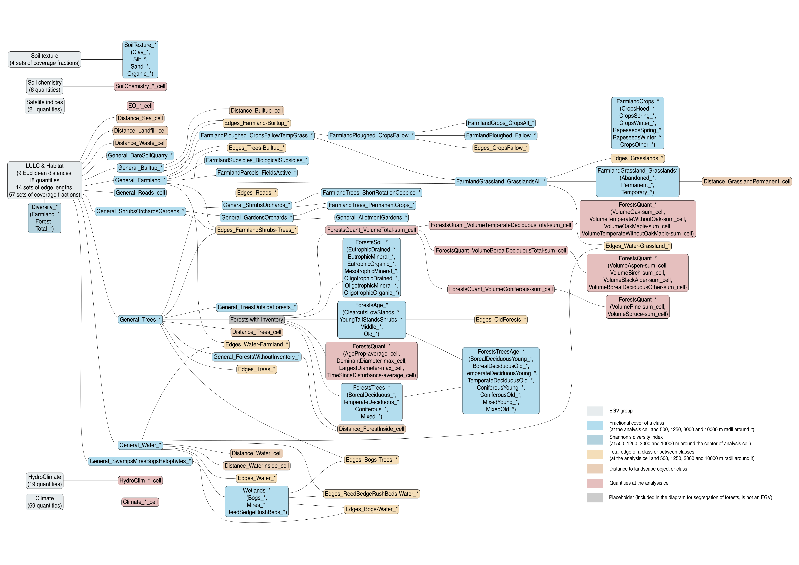
<p class="caption">(\#fig:flowchart)Relationships of ecogeographical variables created.</p>
</div>

<br>


In cover fraction and edge variables, we first calculated values at the analysis 
cell resolution and then used {exactextract} to summarise values from larger scales. 
This package uses pixel area weight to calculate weighted summary statistic, thus the 
error created due to aggregation is negligible, particularly at larger scales, but 
reduces computation time thousunds up to even hundreds of thousands times compared 
to input resolution (10 m). To further speed up the procedures, we used "sparse" 
mode in `egvtools::radius_function`, thus summarising zonal statistics every 300 m for 
3000 m radius buffers and every 1000 m for 10000 m buffers, obtaining near linear 
reduction in time relative to the number of zones (nine fold and 100 fold further 
computation time reduction), while loosing less than 0.001 % of variability altogether.

We used slightly different approach with diversity metrics - first we calculated 
Shanons diversity index at 25 ha raster grid cells as there is nearly no variability 
of landscape classes at 1 ha grid cells. Further on we calculated arithmetic mean as 
zonal statictics value ("sparse" mode with `egvtools::radius_function`), but we 
did not create this EGV at the analysis cells scale.


## Climate_CHELSAv2.1-bio1_cell	{#ch06.001}

**filename:** `Climate_CHELSAv2.1-bio1_cell.tif`	

**layername:** `egv_1`	

**English name:** Mean annual daily mean air temperature (°C) (CHELSA v2.1) within the analysis cell (1 ha)

**Latvian name:** Vidējā ikdienas gaisa temperatūra (°C) (CHELSA v2.1) analīzes šūnā (1 ha)

**Procedure:** Directly follows [CHELSA v2.1](#Ch04.11). EGV is prepared with the 
workflow `egvtools::downscale2egv()` with inverse distance weighted (power = 2) 
gap filling and soft smoothing (power = 0.5) over 5 km radius of every cell.


``` r
# libs ----
if(!require(egvtools)) {remotes::install_github("aavotins/egvtools"); require(egvtools)}

# job ----

localname="Climate_CHELSAv2.1-bio1_cell.tif"
layername="egv_1"
reading="./Geodata/2024/CHELSA/Climate_CHELSAv2.1-bio1_cell.tif"

df <- downscale2egv(
  template_path = "./Templates/TemplateRasters/LV100m_10km.tif",
  grid_path     = "./Templates/TemplateGrids/tikls1km_sauzeme.parquet",
  rawfile_path  = reading,
  out_path      = "./RasterGrids_100m/2024/RAW/",
  file_name     = localname,
  layer_name    = layername,
  fill_gaps     = TRUE,
  smooth        = TRUE,
  smooth_radius_km = 5,
  plot_result   = TRUE)
print(df)
```

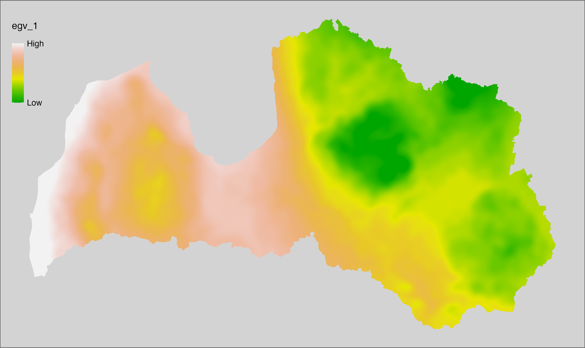


## Climate_CHELSAv2.1-bio10_cell	{#ch06.002}

**filename:** `Climate_CHELSAv2.1-bio10_cell.tif`	

**layername:** `egv_2`	

**English name:** Mean daily mean air temperatures (°C) of the warmest quarter (CHELSA v2.1) within the analysis cell (1 ha)

**Latvian name:** Gada siltākā ceturkšņa vidējā gaisa temperatūra (°C) (CHELSA v2.1) analīzes šūnā (1 ha)

**Procedure:** Directly follows [CHELSA v2.1](#Ch04.11). EGV is prepared with the 
workflow `egvtools::downscale2egv()` with inverse distance weighted (power = 2) 
gap filling and soft smoothing (power = 0.5) over 5 km radius of every cell.


``` r
# libs ----
if(!require(egvtools)) {remotes::install_github("aavotins/egvtools"); require(egvtools)}

# job ----

localname="Climate_CHELSAv2.1-bio10_cell.tif"
layername="egv_2"
reading="./Geodata/2024/CHELSA/Climate_CHELSAv2.1-bio10_cell.tif"

df <- downscale2egv(
  template_path = "./Templates/TemplateRasters/LV100m_10km.tif",
  grid_path     = "./Templates/TemplateGrids/tikls1km_sauzeme.parquet",
  rawfile_path  = reading,
  out_path      = "./RasterGrids_100m/2024/RAW/",
  file_name     = localname,
  layer_name    = layername,
  fill_gaps     = TRUE,
  smooth        = TRUE,
  smooth_radius_km = 5,
  plot_result   = TRUE)
print(df)
```

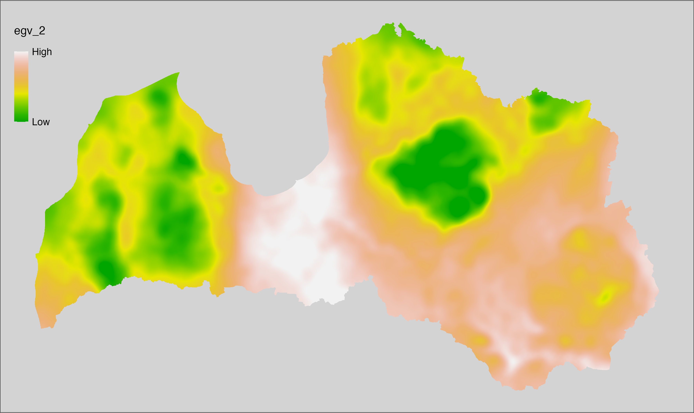


## Climate_CHELSAv2.1-bio11_cell	{#ch06.003}

**filename:** `Climate_CHELSAv2.1-bio11_cell.tif`	

**layername:** `egv_3`	

**English name:** Mean daily mean air temperatures (°C) of the coldest quarter (CHELSA v2.1) within the analysis cell (1 ha)

**Latvian name:** Gada aukstākā ceturkšņa vidējā gaisa temperatūra (°C) (CHELSA v2.1) analīzes šūnā (1 ha)

**Procedure:** Directly follows [CHELSA v2.1](#Ch04.11). EGV is prepared with the 
workflow `egvtools::downscale2egv()` with inverse distance weighted (power = 2) 
gap filling and soft smoothing (power = 0.5) over 5 km radius of every cell.


``` r
# libs ----
if(!require(egvtools)) {remotes::install_github("aavotins/egvtools"); require(egvtools)}

# job ----

localname="Climate_CHELSAv2.1-bio11_cell.tif"
layername="egv_3"
reading="./Geodata/2024/CHELSA/Climate_CHELSAv2.1-bio11_cell.tif"

df <- downscale2egv(
  template_path = "./Templates/TemplateRasters/LV100m_10km.tif",
  grid_path     = "./Templates/TemplateGrids/tikls1km_sauzeme.parquet",
  rawfile_path  = reading,
  out_path      = "./RasterGrids_100m/2024/RAW/",
  file_name     = localname,
  layer_name    = layername,
  fill_gaps     = TRUE,
  smooth        = TRUE,
  smooth_radius_km = 5,
  plot_result   = TRUE)
print(df)
```

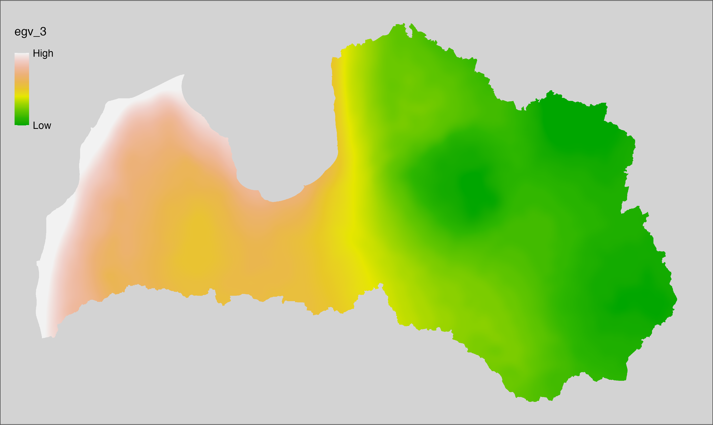


## Climate_CHELSAv2.1-bio12_cell	{#ch06.004}

**filename:** `Climate_CHELSAv2.1-bio12_cell.tif`	

**layername:** `egv_4`	

**English name:** Annual precipitation amount (kg m⁻² year⁻¹) (CHELSA v2.1) within the analysis cell (1 ha)

**Latvian name:** Gada nokrišņu daudzums (kg m⁻² gadā) (CHELSA v2.1) analīzes šūnā (1 ha)

**Procedure:** Directly follows [CHELSA v2.1](#Ch04.11). EGV is prepared with the 
workflow `egvtools::downscale2egv()` with inverse distance weighted (power = 2) 
gap filling and soft smoothing (power = 0.5) over 5 km radius of every cell.


``` r
# libs ----
if(!require(egvtools)) {remotes::install_github("aavotins/egvtools"); require(egvtools)}

# job ----

localname="Climate_CHELSAv2.1-bio12_cell.tif"
layername="egv_4"
reading="./Geodata/2024/CHELSA/Climate_CHELSAv2.1-bio12_cell.tif"

df <- downscale2egv(
  template_path = "./Templates/TemplateRasters/LV100m_10km.tif",
  grid_path     = "./Templates/TemplateGrids/tikls1km_sauzeme.parquet",
  rawfile_path  = reading,
  out_path      = "./RasterGrids_100m/2024/RAW/",
  file_name     = localname,
  layer_name    = layername,
  fill_gaps     = TRUE,
  smooth        = TRUE,
  smooth_radius_km = 5,
  plot_result   = TRUE)
print(df)
```

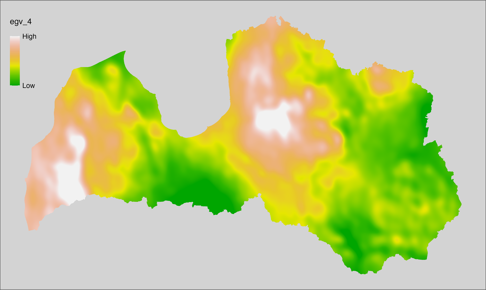


## Climate_CHELSAv2.1-bio13_cell	{#ch06.005}

**filename:** `Climate_CHELSAv2.1-bio13_cell.tif`	

**layername:** `egv_5`	

**English name:** Precipitation amount (kg m⁻² month⁻¹) of the wettest month (CHELSA v2.1) within the analysis cell (1 ha)

**Latvian name:** Slapjākā mēneša nokrišņu daudzums (kg m⁻² mēnesī) (CHELSA v2.1) analīzes šūnā (1 ha)

**Procedure:** Directly follows [CHELSA v2.1](#Ch04.11). EGV is prepared with the 
workflow `egvtools::downscale2egv()` with inverse distance weighted (power = 2) 
gap filling and soft smoothing (power = 0.5) over 5 km radius of every cell.


``` r
# libs ----
if(!require(egvtools)) {remotes::install_github("aavotins/egvtools"); require(egvtools)}

# job ----

localname="Climate_CHELSAv2.1-bio13_cell.tif"
layername="egv_5"
reading="./Geodata/2024/CHELSA/Climate_CHELSAv2.1-bio13_cell.tif"

df <- downscale2egv(
  template_path = "./Templates/TemplateRasters/LV100m_10km.tif",
  grid_path     = "./Templates/TemplateGrids/tikls1km_sauzeme.parquet",
  rawfile_path  = reading,
  out_path      = "./RasterGrids_100m/2024/RAW/",
  file_name     = localname,
  layer_name    = layername,
  fill_gaps     = TRUE,
  smooth        = TRUE,
  smooth_radius_km = 5,
  plot_result   = TRUE)
print(df)
```

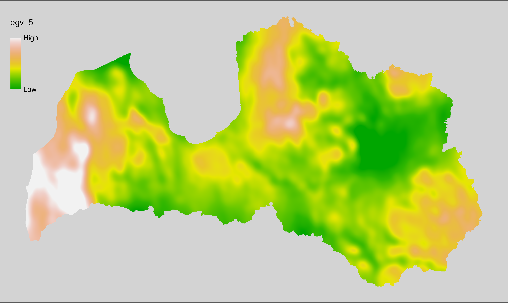


## Climate_CHELSAv2.1-bio14_cell	{#ch06.006}

**filename:** `Climate_CHELSAv2.1-bio14_cell.tif`	

**layername:** `egv_6`	

**English name:** Precipitation amount (kg m⁻² month⁻¹) of the driest month (CHELSA v2.1) within the analysis cell (1 ha)

**Latvian name:** Sausākā mēneša nokrišņu daudzums (kg m⁻² mēnesī) (CHELSA v2.1) analīzes šūnā (1 ha)

**Procedure:** Directly follows [CHELSA v2.1](#Ch04.11). EGV is prepared with the 
workflow `egvtools::downscale2egv()` with inverse distance weighted (power = 2) 
gap filling and soft smoothing (power = 0.5) over 5 km radius of every cell.


``` r
# libs ----
if(!require(egvtools)) {remotes::install_github("aavotins/egvtools"); require(egvtools)}

# job ----

localname="Climate_CHELSAv2.1-bio14_cell.tif"
layername="egv_6"
reading="./Geodata/2024/CHELSA/Climate_CHELSAv2.1-bio14_cell.tif"

df <- downscale2egv(
  template_path = "./Templates/TemplateRasters/LV100m_10km.tif",
  grid_path     = "./Templates/TemplateGrids/tikls1km_sauzeme.parquet",
  rawfile_path  = reading,
  out_path      = "./RasterGrids_100m/2024/RAW/",
  file_name     = localname,
  layer_name    = layername,
  fill_gaps     = TRUE,
  smooth        = TRUE,
  smooth_radius_km = 5,
  plot_result   = TRUE)
print(df)
```

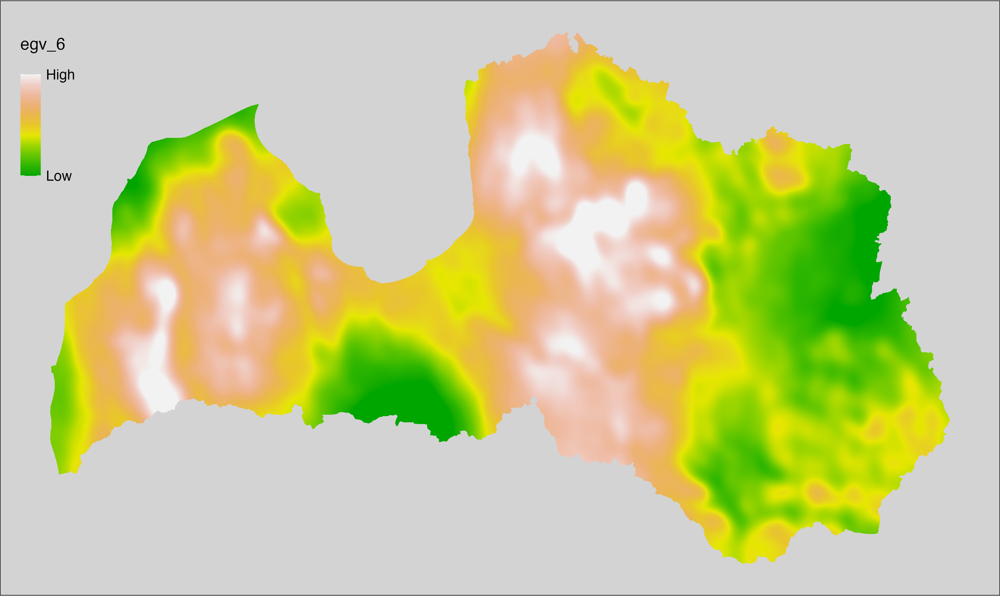


## Climate_CHELSAv2.1-bio15_cell	{#ch06.007}

**filename:** `Climate_CHELSAv2.1-bio15_cell.tif`	

**layername:** `egv_7`	

**English name:** Precipitation seasonality (kg m⁻²) (CHELSA v2.1) within the analysis cell (1 ha)

**Latvian name:** Nokrišņu sezonalitāte (kg m⁻²) (CHELSA v2.1) analīzes šūnā (1 ha)

**Procedure:** Directly follows [CHELSA v2.1](#Ch04.11). EGV is prepared with the 
workflow `egvtools::downscale2egv()` with inverse distance weighted (power = 2) 
gap filling and soft smoothing (power = 0.5) over 5 km radius of every cell.


``` r
# libs ----
if(!require(egvtools)) {remotes::install_github("aavotins/egvtools"); require(egvtools)}

# job ----

localname="Climate_CHELSAv2.1-bio15_cell.tif"
layername="egv_7"
reading="./Geodata/2024/CHELSA/Climate_CHELSAv2.1-bio15_cell.tif"

df <- downscale2egv(
  template_path = "./Templates/TemplateRasters/LV100m_10km.tif",
  grid_path     = "./Templates/TemplateGrids/tikls1km_sauzeme.parquet",
  rawfile_path  = reading,
  out_path      = "./RasterGrids_100m/2024/RAW/",
  file_name     = localname,
  layer_name    = layername,
  fill_gaps     = TRUE,
  smooth        = TRUE,
  smooth_radius_km = 5,
  plot_result   = TRUE)
print(df)
```

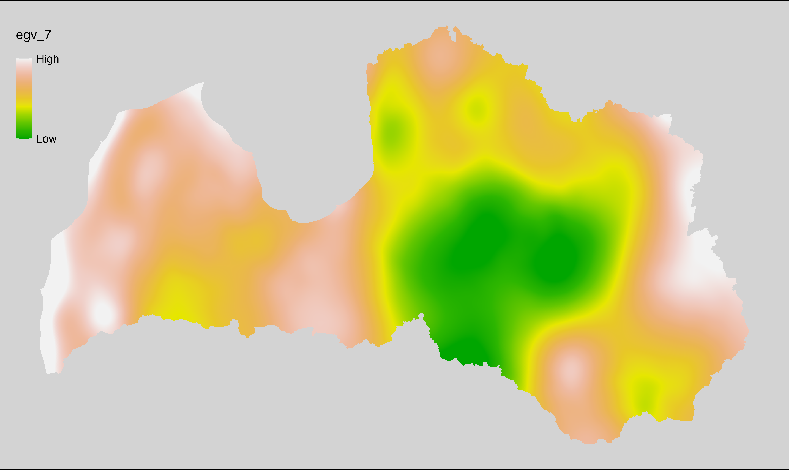


## Climate_CHELSAv2.1-bio16_cell	{#ch06.008}

**filename:** `Climate_CHELSAv2.1-bio16_cell.tif`	

**layername:** `egv_8`	

**English name:** Mean monthly precipitation amount (kg m⁻² month⁻¹) of the wettest quarter (CHELSA v2.1) within the analysis cell (1 ha)

**Latvian name:** Slapjākā ceturkšņa vidējais nokrišņu daudzums mēnesī (kg m⁻² mēnesī) (CHELSA v2.1) analīzes šūnā (1 ha)

**Procedure:** Directly follows [CHELSA v2.1](#Ch04.11). EGV is prepared with the 
workflow `egvtools::downscale2egv()` with inverse distance weighted (power = 2) 
gap filling and soft smoothing (power = 0.5) over 5 km radius of every cell.


``` r
# libs ----
if(!require(egvtools)) {remotes::install_github("aavotins/egvtools"); require(egvtools)}

# job ----

localname="Climate_CHELSAv2.1-bio16_cell.tif"
layername="egv_8"
reading="./Geodata/2024/CHELSA/Climate_CHELSAv2.1-bio16_cell.tif"

df <- downscale2egv(
  template_path = "./Templates/TemplateRasters/LV100m_10km.tif",
  grid_path     = "./Templates/TemplateGrids/tikls1km_sauzeme.parquet",
  rawfile_path  = reading,
  out_path      = "./RasterGrids_100m/2024/RAW/",
  file_name     = localname,
  layer_name    = layername,
  fill_gaps     = TRUE,
  smooth        = TRUE,
  smooth_radius_km = 5,
  plot_result   = TRUE)
print(df)
```

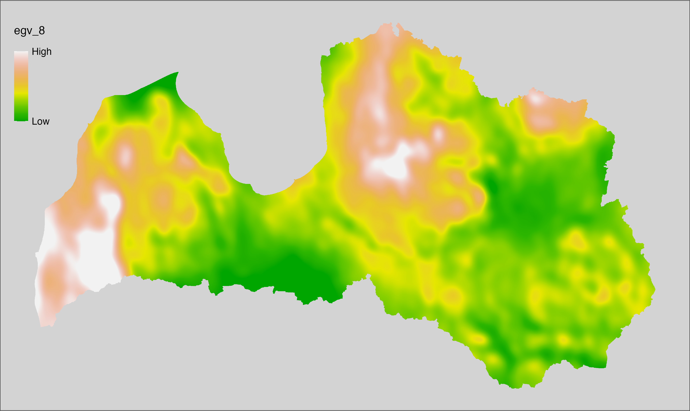


## Climate_CHELSAv2.1-bio17_cell	{#ch06.009}

**filename:** `Climate_CHELSAv2.1-bio17_cell.tif`	

**layername:** `egv_9`	

**English name:** Mean monthly precipitation amount (kg m⁻² month⁻¹) of the driest quarter (CHELSA v2.1) within the analysis cell (1 ha)

**Latvian name:** Sausākā ceturkšņa vidējais nokrišņu daudzums mēnesī (kg m⁻² mēnesī) (CHELSA v2.1) analīzes šūnā (1 ha)

**Procedure:** Directly follows [CHELSA v2.1](#Ch04.11). EGV is prepared with the 
workflow `egvtools::downscale2egv()` with inverse distance weighted (power = 2) 
gap filling and soft smoothing (power = 0.5) over 5 km radius of every cell.


``` r
# libs ----
if(!require(egvtools)) {remotes::install_github("aavotins/egvtools"); require(egvtools)}

# job ----

localname="Climate_CHELSAv2.1-bio17_cell.tif"
layername="egv_9"
reading="./Geodata/2024/CHELSA/Climate_CHELSAv2.1-bio17_cell.tif"

df <- downscale2egv(
  template_path = "./Templates/TemplateRasters/LV100m_10km.tif",
  grid_path     = "./Templates/TemplateGrids/tikls1km_sauzeme.parquet",
  rawfile_path  = reading,
  out_path      = "./RasterGrids_100m/2024/RAW/",
  file_name     = localname,
  layer_name    = layername,
  fill_gaps     = TRUE,
  smooth        = TRUE,
  smooth_radius_km = 5,
  plot_result   = TRUE)
print(df)
```

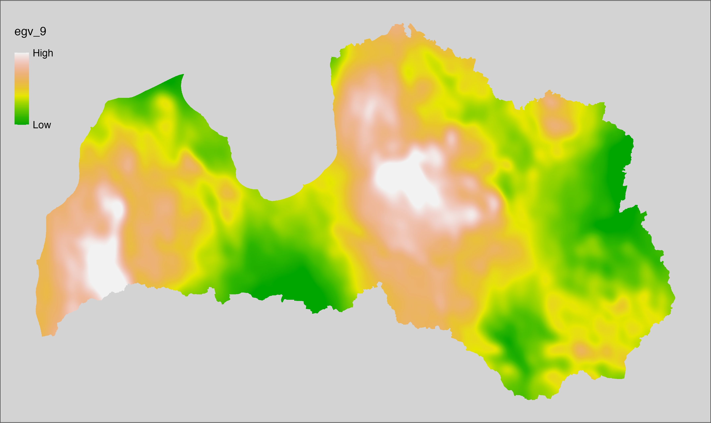


## Climate_CHELSAv2.1-bio18_cell	{#ch06.010}

**filename:** `Climate_CHELSAv2.1-bio18_cell.tif`	

**layername:** `egv_10`	

**English name:** Mean monthly precipitation amount (kg m⁻² month⁻¹) of the warmest quarter (CHELSA v2.1) within the analysis cell (1 ha)

**Latvian name:** Siltākā ceturkšņa vidējais nokrišņu daudzuma mēnesī (kg m⁻² mēnesī) (CHELSA v2.1) analīzes šūnā (1 ha)

**Procedure:** Directly follows [CHELSA v2.1](#Ch04.11). EGV is prepared with the 
workflow `egvtools::downscale2egv()` with inverse distance weighted (power = 2) 
gap filling and soft smoothing (power = 0.5) over 5 km radius of every cell.


``` r
# libs ----
if(!require(egvtools)) {remotes::install_github("aavotins/egvtools"); require(egvtools)}

# job ----

localname="Climate_CHELSAv2.1-bio18_cell.tif"
layername="egv_10"
reading="./Geodata/2024/CHELSA/Climate_CHELSAv2.1-bio18_cell.tif"

df <- downscale2egv(
  template_path = "./Templates/TemplateRasters/LV100m_10km.tif",
  grid_path     = "./Templates/TemplateGrids/tikls1km_sauzeme.parquet",
  rawfile_path  = reading,
  out_path      = "./RasterGrids_100m/2024/RAW/",
  file_name     = localname,
  layer_name    = layername,
  fill_gaps     = TRUE,
  smooth        = TRUE,
  smooth_radius_km = 5,
  plot_result   = TRUE)
print(df)
```

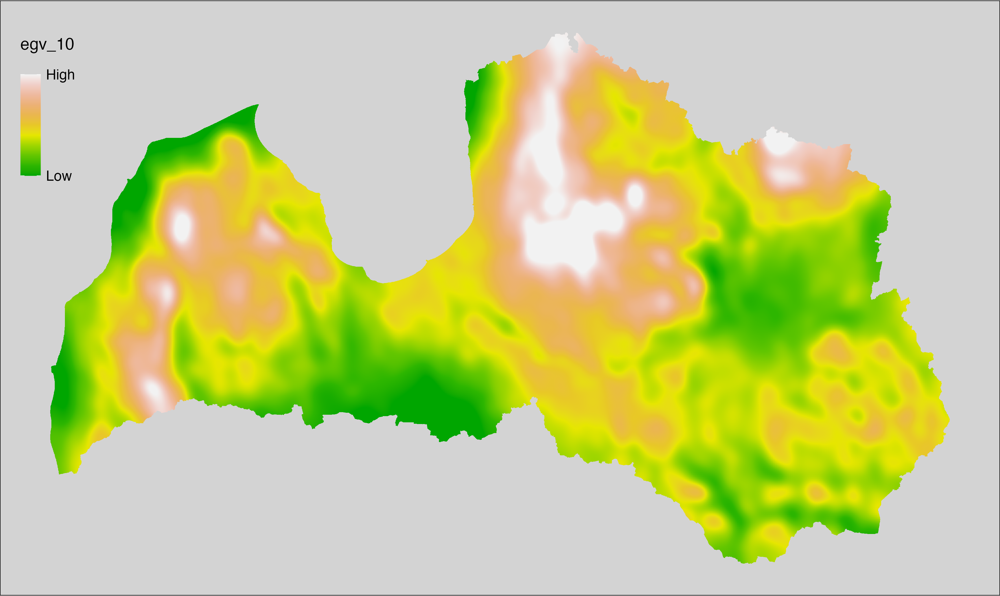


## Climate_CHELSAv2.1-bio19_cell	{#ch06.011}

**filename:** `Climate_CHELSAv2.1-bio19_cell.tif`	

**layername:** `egv_11`	

**English name:** Mean monthly precipitation amount (kg m⁻² month⁻¹) of the coldest quarter (CHELSA v2.1) within the analysis cell (1 ha)

**Latvian name:** Aukstākā ceturkšņa vidējais nokrišņu daudzums mēnesī (kg m⁻² mēnesī) (CHELSA v2.1) analīzes šūnā (1 ha)

**Procedure:** Directly follows [CHELSA v2.1](#Ch04.11). EGV is prepared with the 
workflow `egvtools::downscale2egv()` with inverse distance weighted (power = 2) 
gap filling and soft smoothing (power = 0.5) over 5 km radius of every cell.


``` r
# libs ----
if(!require(egvtools)) {remotes::install_github("aavotins/egvtools"); require(egvtools)}

# job ----

localname="Climate_CHELSAv2.1-bio19_cell.tif"
layername="egv_11"
reading="./Geodata/2024/CHELSA/Climate_CHELSAv2.1-bio19_cell.tif"

df <- downscale2egv(
  template_path = "./Templates/TemplateRasters/LV100m_10km.tif",
  grid_path     = "./Templates/TemplateGrids/tikls1km_sauzeme.parquet",
  rawfile_path  = reading,
  out_path      = "./RasterGrids_100m/2024/RAW/",
  file_name     = localname,
  layer_name    = layername,
  fill_gaps     = TRUE,
  smooth        = TRUE,
  smooth_radius_km = 5,
  plot_result   = TRUE)
print(df)
```

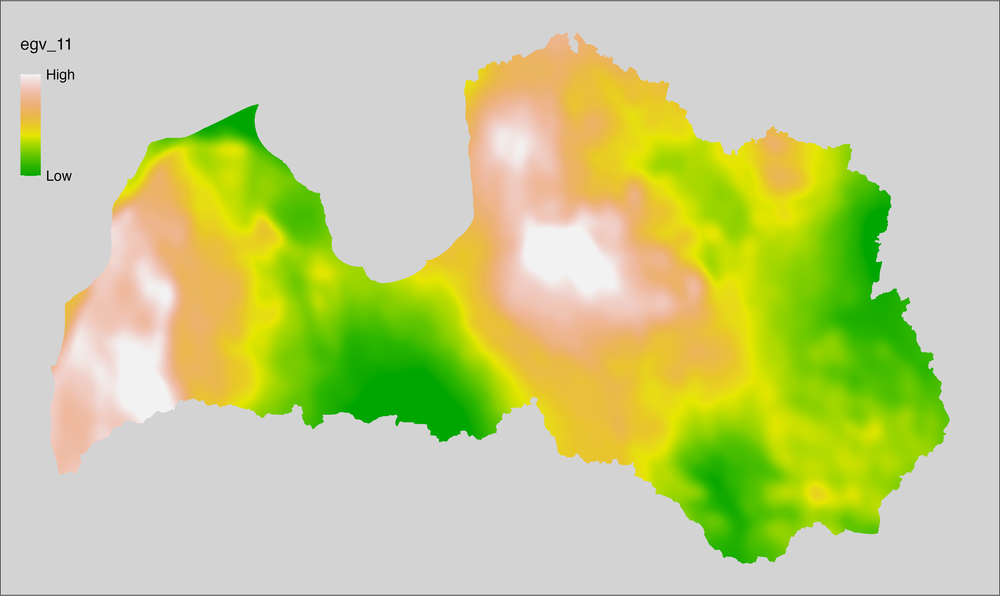


## Climate_CHELSAv2.1-bio2_cell	{#ch06.012}

**filename:** `Climate_CHELSAv2.1-bio2_cell.tif`	

**layername:** `egv_12`	

**English name:** Mean diurnal air temperature range (°C) (CHELSA v2.1) within the analysis cell (1 ha)

**Latvian name:** Diennakts temperatūru amplitūda (°C) (CHELSA v2.1) analīzes šūnā (1 ha)

**Procedure:** Directly follows [CHELSA v2.1](#Ch04.11). EGV is prepared with the 
workflow `egvtools::downscale2egv()` with inverse distance weighted (power = 2) 
gap filling and soft smoothing (power = 0.5) over 5 km radius of every cell.


``` r
# libs ----
if(!require(egvtools)) {remotes::install_github("aavotins/egvtools"); require(egvtools)}

# job ----

localname="Climate_CHELSAv2.1-bio2_cell.tif"
layername="egv_12"
reading="./Geodata/2024/CHELSA/Climate_CHELSAv2.1-bio2_cell.tif"

df <- downscale2egv(
  template_path = "./Templates/TemplateRasters/LV100m_10km.tif",
  grid_path     = "./Templates/TemplateGrids/tikls1km_sauzeme.parquet",
  rawfile_path  = reading,
  out_path      = "./RasterGrids_100m/2024/RAW/",
  file_name     = localname,
  layer_name    = layername,
  fill_gaps     = TRUE,
  smooth        = TRUE,
  smooth_radius_km = 5,
  plot_result   = TRUE)
print(df)
```

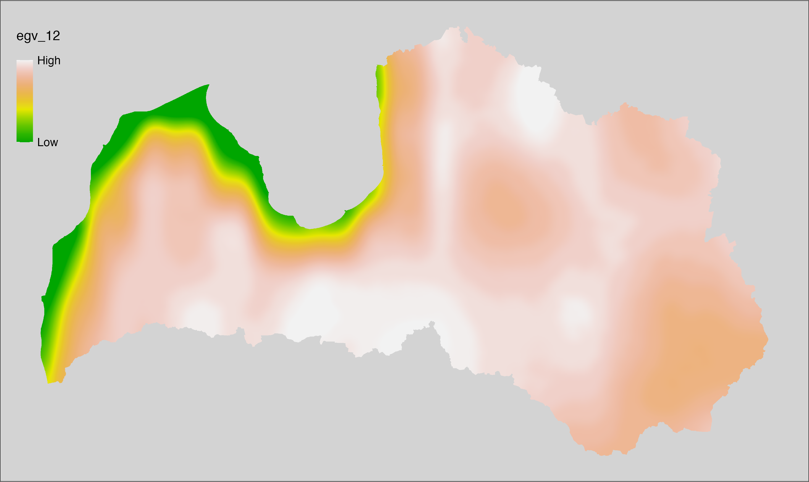


## Climate_CHELSAv2.1-bio3_cell	{#ch06.013}

**filename:** `Climate_CHELSAv2.1-bio3_cell.tif`	

**layername:** `egv_13`	

**English name:** Isothermality (ratio of diurnal variation to annual variation in temperatures) (°C) (CHELSA v2.1) within the analysis cell (1 ha)

**Latvian name:** Izotermalitāte (attiecība starp diennakts un gada temperatūras svārstībām) (°C) (CHELSA v2.1) analīzes šūnā (1 ha)

**Procedure:** Directly follows [CHELSA v2.1](#Ch04.11). EGV is prepared with the 
workflow `egvtools::downscale2egv()` with inverse distance weighted (power = 2) 
gap filling and soft smoothing (power = 0.5) over 5 km radius of every cell.


``` r
# libs ----
if(!require(egvtools)) {remotes::install_github("aavotins/egvtools"); require(egvtools)}

# job ----

localname="Climate_CHELSAv2.1-bio3_cell.tif"
layername="egv_13"
reading="./Geodata/2024/CHELSA/Climate_CHELSAv2.1-bio3_cell.tif"

df <- downscale2egv(
  template_path = "./Templates/TemplateRasters/LV100m_10km.tif",
  grid_path     = "./Templates/TemplateGrids/tikls1km_sauzeme.parquet",
  rawfile_path  = reading,
  out_path      = "./RasterGrids_100m/2024/RAW/",
  file_name     = localname,
  layer_name    = layername,
  fill_gaps     = TRUE,
  smooth        = TRUE,
  smooth_radius_km = 5,
  plot_result   = TRUE)
print(df)
```

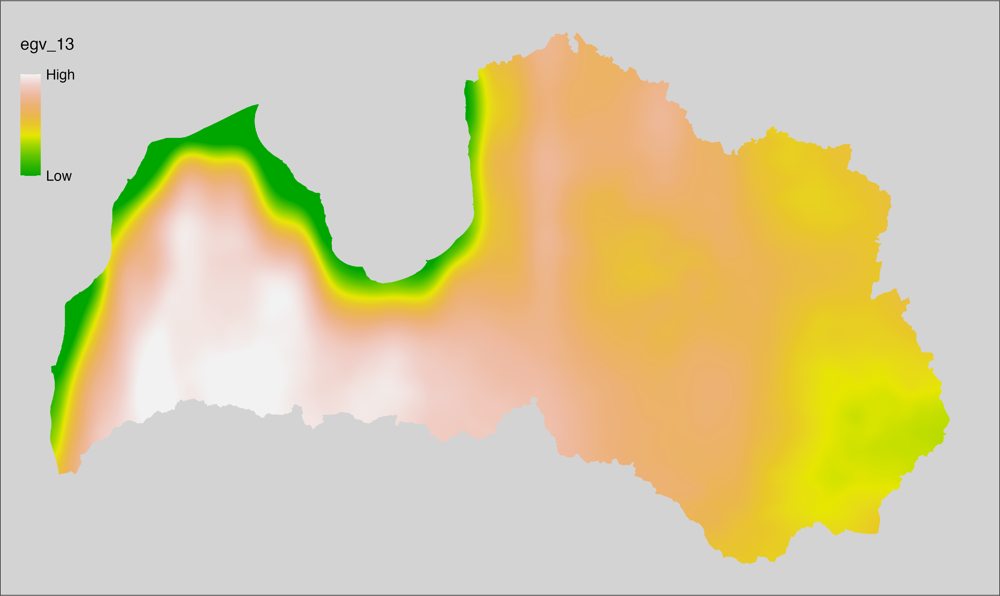


## Climate_CHELSAv2.1-bio4_cell	{#ch06.014}

**filename:** `Climate_CHELSAv2.1-bio4_cell.tif`	

**layername:** `egv_14`	

**English name:** Temperature seasonality (standard deviation of the monthly mean temperatures) (°C/100) (CHELSA v2.1) within the analysis cell (1 ha)

**Latvian name:** Temperatūru sezonalitāte (mēneša vidējo temperatūru standartnovirze) (°C/100) (CHELSA v2.1) analīzes šūnā (1 ha)

**Procedure:** Directly follows [CHELSA v2.1](#Ch04.11). EGV is prepared with the 
workflow `egvtools::downscale2egv()` with inverse distance weighted (power = 2) 
gap filling and soft smoothing (power = 0.5) over 5 km radius of every cell.


``` r
# libs ----
if(!require(egvtools)) {remotes::install_github("aavotins/egvtools"); require(egvtools)}

# job ----

localname="Climate_CHELSAv2.1-bio4_cell.tif"
layername="egv_14"
reading="./Geodata/2024/CHELSA/Climate_CHELSAv2.1-bio4_cell.tif"

df <- downscale2egv(
  template_path = "./Templates/TemplateRasters/LV100m_10km.tif",
  grid_path     = "./Templates/TemplateGrids/tikls1km_sauzeme.parquet",
  rawfile_path  = reading,
  out_path      = "./RasterGrids_100m/2024/RAW/",
  file_name     = localname,
  layer_name    = layername,
  fill_gaps     = TRUE,
  smooth        = TRUE,
  smooth_radius_km = 5,
  plot_result   = TRUE)
print(df)
```

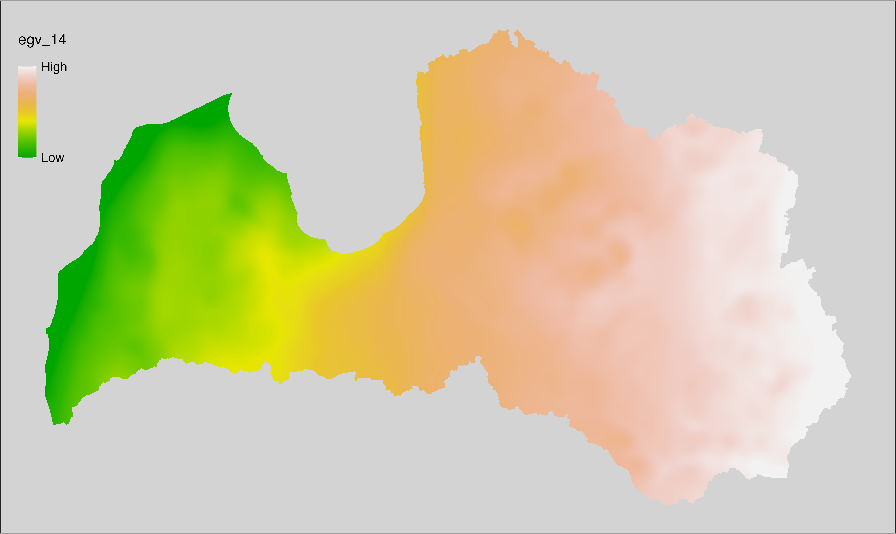


## Climate_CHELSAv2.1-bio5_cell	{#ch06.015}

**filename:** `Climate_CHELSAv2.1-bio5_cell.tif`	

**layername:** `egv_15`	

**English name:** Mean daily maximum air temperature (°C) of the warmest month (CHELSA v2.1) within the analysis cell (1 ha)

**Latvian name:** Siltākā mēneša vidējā ikdienas augstākā gaisa temperatūra (°C) (CHELSA v2.1) analīzes šūnā (1 ha)

**Procedure:** Directly follows [CHELSA v2.1](#Ch04.11). EGV is prepared with the 
workflow `egvtools::downscale2egv()` with inverse distance weighted (power = 2) 
gap filling and soft smoothing (power = 0.5) over 5 km radius of every cell.


``` r
# libs ----
if(!require(egvtools)) {remotes::install_github("aavotins/egvtools"); require(egvtools)}

# job ----

localname="Climate_CHELSAv2.1-bio5_cell.tif"
layername="egv_15"
reading="./Geodata/2024/CHELSA/Climate_CHELSAv2.1-bio5_cell.tif"

df <- downscale2egv(
  template_path = "./Templates/TemplateRasters/LV100m_10km.tif",
  grid_path     = "./Templates/TemplateGrids/tikls1km_sauzeme.parquet",
  rawfile_path  = reading,
  out_path      = "./RasterGrids_100m/2024/RAW/",
  file_name     = localname,
  layer_name    = layername,
  fill_gaps     = TRUE,
  smooth        = TRUE,
  smooth_radius_km = 5,
  plot_result   = TRUE)
print(df)
```

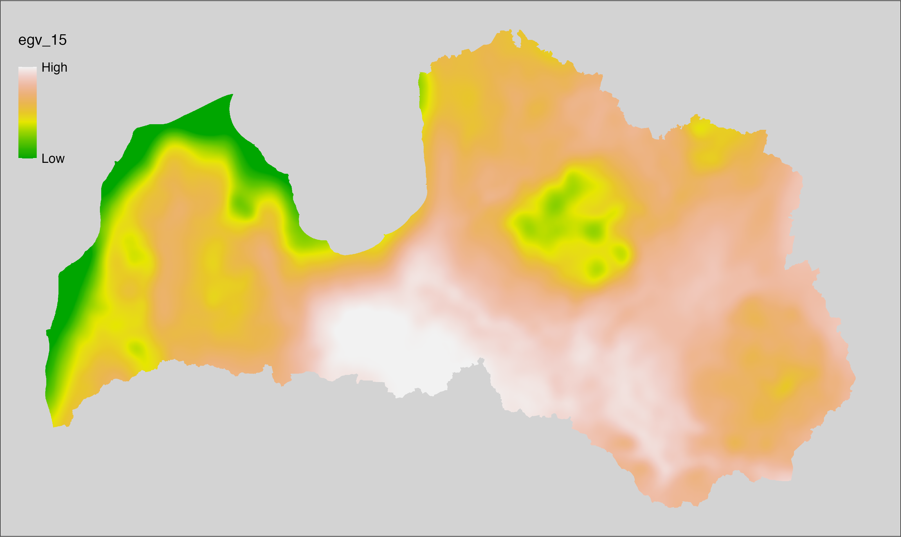


## Climate_CHELSAv2.1-bio6_cell	{#ch06.016}

**filename:** `Climate_CHELSAv2.1-bio6_cell.tif`	

**layername:** `egv_16`	

**English name:** Mean daily minimum air temperature (°C) of the coldest month (CHELSA v2.1) within the analysis cell (1 ha)

**Latvian name:** Aukstākā mēneša vidējā ikdienas zemākā gaisa temperatūra (°C) (CHELSA v2.1) analīzes šūnā (1 ha)

**Procedure:** Directly follows [CHELSA v2.1](#Ch04.11). EGV is prepared with the 
workflow `egvtools::downscale2egv()` with inverse distance weighted (power = 2) 
gap filling and soft smoothing (power = 0.5) over 5 km radius of every cell.


``` r
# libs ----
if(!require(egvtools)) {remotes::install_github("aavotins/egvtools"); require(egvtools)}

# job ----

localname="Climate_CHELSAv2.1-bio6_cell.tif"
layername="egv_16"
reading="./Geodata/2024/CHELSA/Climate_CHELSAv2.1-bio6_cell.tif"

df <- downscale2egv(
  template_path = "./Templates/TemplateRasters/LV100m_10km.tif",
  grid_path     = "./Templates/TemplateGrids/tikls1km_sauzeme.parquet",
  rawfile_path  = reading,
  out_path      = "./RasterGrids_100m/2024/RAW/",
  file_name     = localname,
  layer_name    = layername,
  fill_gaps     = TRUE,
  smooth        = TRUE,
  smooth_radius_km = 5,
  plot_result   = TRUE)
print(df)
```

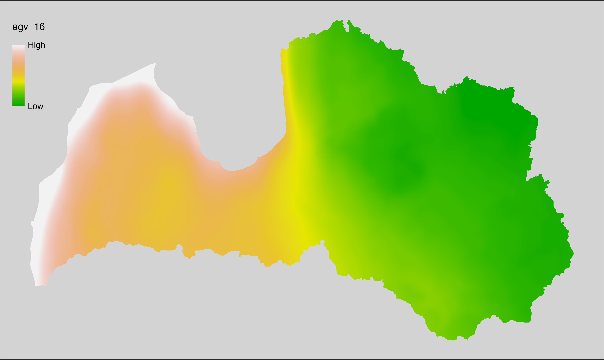


## Climate_CHELSAv2.1-bio7_cell	{#ch06.017}

**filename:** `Climate_CHELSAv2.1-bio7_cell.tif`	

**layername:** `egv_17`	

**English name:** Annual range of air temperature (°C) (CHELSA v2.1) within the analysis cell (1 ha)

**Latvian name:** Gada temperatūru amplitūda (°C) (CHELSA v2.1) analīzes šūnā (1 ha)

**Procedure:** Directly follows [CHELSA v2.1](#Ch04.11). EGV is prepared with the 
workflow `egvtools::downscale2egv()` with inverse distance weighted (power = 2) 
gap filling and soft smoothing (power = 0.5) over 5 km radius of every cell.


``` r
# libs ----
if(!require(egvtools)) {remotes::install_github("aavotins/egvtools"); require(egvtools)}

# job ----

localname="Climate_CHELSAv2.1-bio7_cell.tif"
layername="egv_17"
reading="./Geodata/2024/CHELSA/Climate_CHELSAv2.1-bio7_cell.tif"

df <- downscale2egv(
  template_path = "./Templates/TemplateRasters/LV100m_10km.tif",
  grid_path     = "./Templates/TemplateGrids/tikls1km_sauzeme.parquet",
  rawfile_path  = reading,
  out_path      = "./RasterGrids_100m/2024/RAW/",
  file_name     = localname,
  layer_name    = layername,
  fill_gaps     = TRUE,
  smooth        = TRUE,
  smooth_radius_km = 5,
  plot_result   = TRUE)
print(df)
```

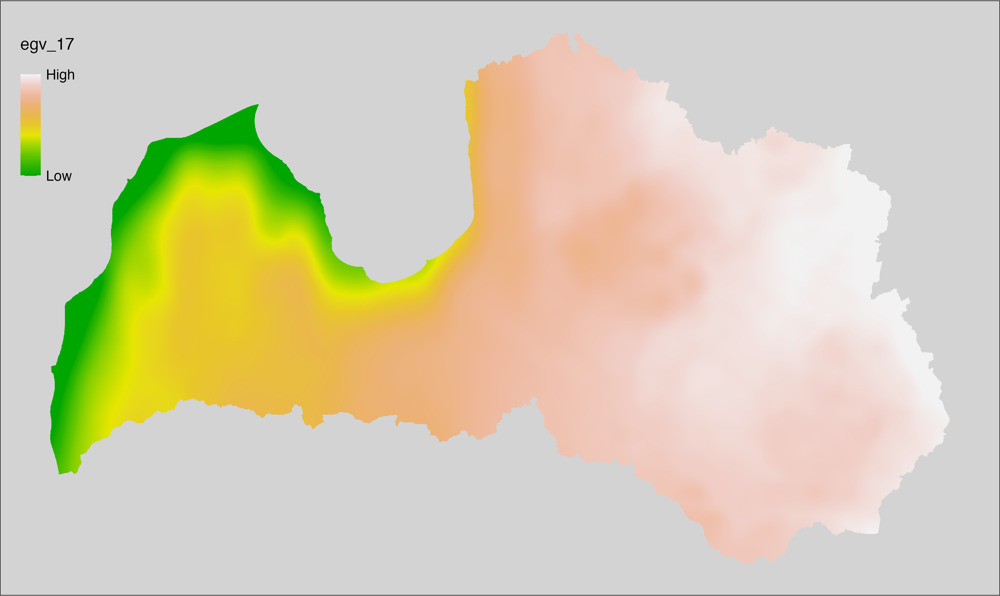


## Climate_CHELSAv2.1-bio8_cell	{#ch06.018}

**filename:** `Climate_CHELSAv2.1-bio8_cell.tif`	

**layername:** `egv_18`	

**English name:** Mean daily mean air temperatures (°C) of the wettest quarter (CHELSA v2.1) within the analysis cell (1 ha)

**Latvian name:** Slapjākā ceturkšņa vidējā ikdienas vidējā gaisa temperatūra (°C) (CHELSA v2.1) analīzes šūnā (1 ha)

**Procedure:** Directly follows [CHELSA v2.1](#Ch04.11). EGV is prepared with the 
workflow `egvtools::downscale2egv()` with inverse distance weighted (power = 2) 
gap filling and soft smoothing (power = 0.5) over 5 km radius of every cell.


``` r
# libs ----
if(!require(egvtools)) {remotes::install_github("aavotins/egvtools"); require(egvtools)}

# job ----

localname="Climate_CHELSAv2.1-bio8_cell.tif"
layername="egv_18"
reading="./Geodata/2024/CHELSA/Climate_CHELSAv2.1-bio8_cell.tif"

df <- downscale2egv(
  template_path = "./Templates/TemplateRasters/LV100m_10km.tif",
  grid_path     = "./Templates/TemplateGrids/tikls1km_sauzeme.parquet",
  rawfile_path  = reading,
  out_path      = "./RasterGrids_100m/2024/RAW/",
  file_name     = localname,
  layer_name    = layername,
  fill_gaps     = TRUE,
  smooth        = TRUE,
  smooth_radius_km = 5,
  plot_result   = TRUE)
print(df)
```

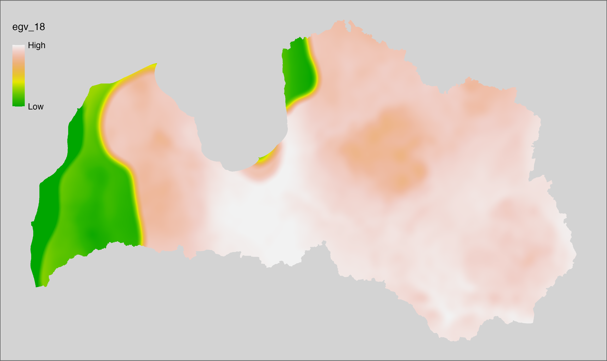


## Climate_CHELSAv2.1-bio9_cell	{#ch06.019}

**filename:** `Climate_CHELSAv2.1-bio9_cell.tif`	

**layername:** `egv_19`	

**English name:** Mean daily mean air temperatures (°C) of the driest quarter (CHELSA v2.1) within the analysis cell (1 ha)

**Latvian name:** Sausākā ceturkšņa vidējā ikdienas vidējā gaisa temperatūra (°C) (CHELSA v2.1) analīzes šūnā (1 ha)

**Procedure:** Directly follows [CHELSA v2.1](#Ch04.11). EGV is prepared with the 
workflow `egvtools::downscale2egv()` with inverse distance weighted (power = 2) 
gap filling and soft smoothing (power = 0.5) over 5 km radius of every cell.


``` r
# libs ----
if(!require(egvtools)) {remotes::install_github("aavotins/egvtools"); require(egvtools)}

# job ----

localname="Climate_CHELSAv2.1-bio9_cell.tif"
layername="egv_19"
reading="./Geodata/2024/CHELSA/Climate_CHELSAv2.1-bio9_cell.tif"

df <- downscale2egv(
  template_path = "./Templates/TemplateRasters/LV100m_10km.tif",
  grid_path     = "./Templates/TemplateGrids/tikls1km_sauzeme.parquet",
  rawfile_path  = reading,
  out_path      = "./RasterGrids_100m/2024/RAW/",
  file_name     = localname,
  layer_name    = layername,
  fill_gaps     = TRUE,
  smooth        = TRUE,
  smooth_radius_km = 5,
  plot_result   = TRUE)
print(df)
```

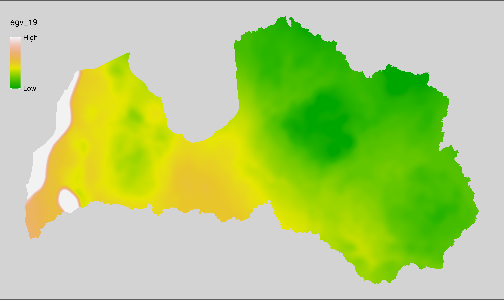


## Climate_CHELSAv2.1-clt-max_cell	{#ch06.020}

**filename:** `Climate_CHELSAv2.1-clt-max_cell.tif`	

**layername:** `egv_20`	

**English name:** Maximum monthly cloud area fraction (%) (CHELSA v2.1) within the analysis cell (1 ha)

**Latvian name:** Maksimālais mēneša vidējais mākoņu segums (%) (CHELSA v2.1) analīzes šūnā (1 ha)

**Procedure:** Directly follows [CHELSA v2.1](#Ch04.11). EGV is prepared with the 
workflow `egvtools::downscale2egv()` with inverse distance weighted (power = 2) 
gap filling and soft smoothing (power = 0.5) over 5 km radius of every cell.


``` r
# libs ----
if(!require(egvtools)) {remotes::install_github("aavotins/egvtools"); require(egvtools)}

# job ----

localname="Climate_CHELSAv2.1-clt-max_cell.tif"
layername="egv_20"
reading="./Geodata/2024/CHELSA/Climate_CHELSAv2.1-clt-max_cell.tif"

df <- downscale2egv(
  template_path = "./Templates/TemplateRasters/LV100m_10km.tif",
  grid_path     = "./Templates/TemplateGrids/tikls1km_sauzeme.parquet",
  rawfile_path  = reading,
  out_path      = "./RasterGrids_100m/2024/RAW/",
  file_name     = localname,
  layer_name    = layername,
  fill_gaps     = TRUE,
  smooth        = TRUE,
  smooth_radius_km = 5,
  plot_result   = TRUE)
print(df)
```

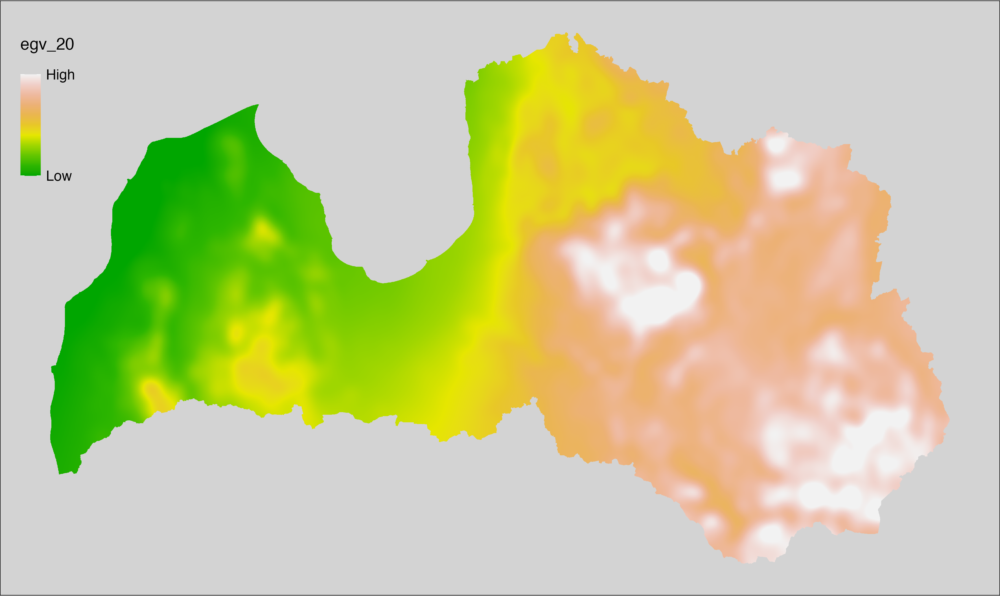


## Climate_CHELSAv2.1-clt-mean_cell	{#ch06.021}

**filename:** `Climate_CHELSAv2.1-clt-mean_cell.tif`	

**layername:** `egv_21`	

**English name:** Mean monthly cloud area fraction (%) (CHELSA v2.1) within the analysis cell (1 ha)

**Latvian name:** Vidējais mākoņu segums (%) (CHELSA v2.1) analīzes šūnā (1 ha)

**Procedure:** Directly follows [CHELSA v2.1](#Ch04.11). EGV is prepared with the 
workflow `egvtools::downscale2egv()` with inverse distance weighted (power = 2) 
gap filling and soft smoothing (power = 0.5) over 5 km radius of every cell.


``` r
# libs ----
if(!require(egvtools)) {remotes::install_github("aavotins/egvtools"); require(egvtools)}

# job ----

localname="Climate_CHELSAv2.1-clt-mean_cell.tif"
layername="egv_21"
reading="./Geodata/2024/CHELSA/Climate_CHELSAv2.1-clt-mean_cell.tif"

df <- downscale2egv(
  template_path = "./Templates/TemplateRasters/LV100m_10km.tif",
  grid_path     = "./Templates/TemplateGrids/tikls1km_sauzeme.parquet",
  rawfile_path  = reading,
  out_path      = "./RasterGrids_100m/2024/RAW/",
  file_name     = localname,
  layer_name    = layername,
  fill_gaps     = TRUE,
  smooth        = TRUE,
  smooth_radius_km = 5,
  plot_result   = TRUE)
print(df)
```

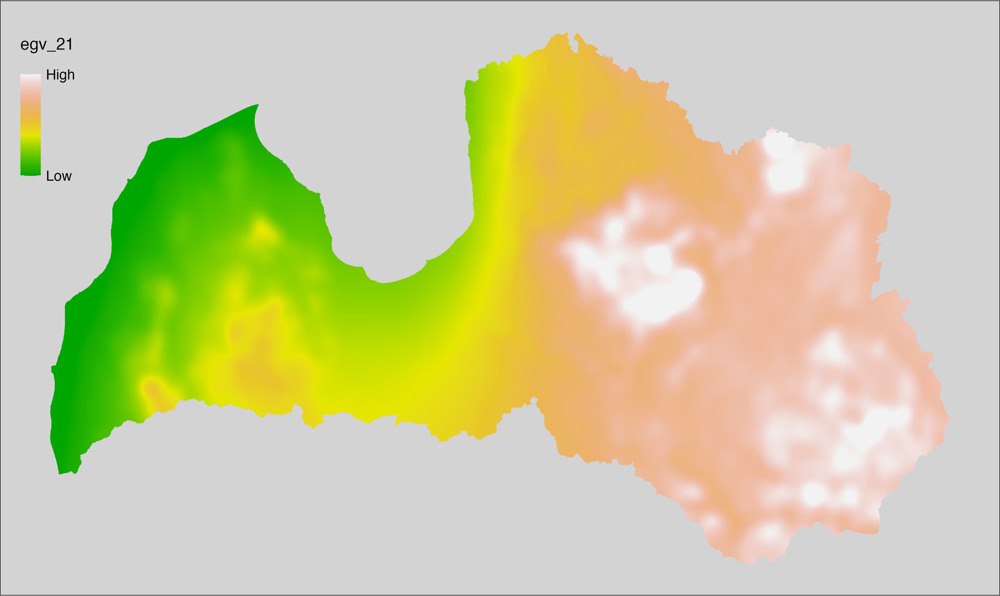


## Climate_CHELSAv2.1-clt-min_cell	{#ch06.022}

**filename:** `Climate_CHELSAv2.1-clt-min_cell.tif`	

**layername:** `egv_22`	

**English name:** Minimum monthly cloud area fraction (%) (CHELSA v2.1) within the analysis cell (1 ha)

**Latvian name:** Minimālais mēneša vidējais mākoņu segums (%) (CHELSA v2.1) analīzes šūnā (1 ha)

**Procedure:** Directly follows [CHELSA v2.1](#Ch04.11). EGV is prepared with the 
workflow `egvtools::downscale2egv()` with inverse distance weighted (power = 2) 
gap filling and soft smoothing (power = 0.5) over 5 km radius of every cell.


``` r
# libs ----
if(!require(egvtools)) {remotes::install_github("aavotins/egvtools"); require(egvtools)}

# job ----

localname="Climate_CHELSAv2.1-clt-min_cell.tif"
layername="egv_22"
reading="./Geodata/2024/CHELSA/Climate_CHELSAv2.1-clt-min_cell.tif"

df <- downscale2egv(
  template_path = "./Templates/TemplateRasters/LV100m_10km.tif",
  grid_path     = "./Templates/TemplateGrids/tikls1km_sauzeme.parquet",
  rawfile_path  = reading,
  out_path      = "./RasterGrids_100m/2024/RAW/",
  file_name     = localname,
  layer_name    = layername,
  fill_gaps     = TRUE,
  smooth        = TRUE,
  smooth_radius_km = 5,
  plot_result   = TRUE)
print(df)
```

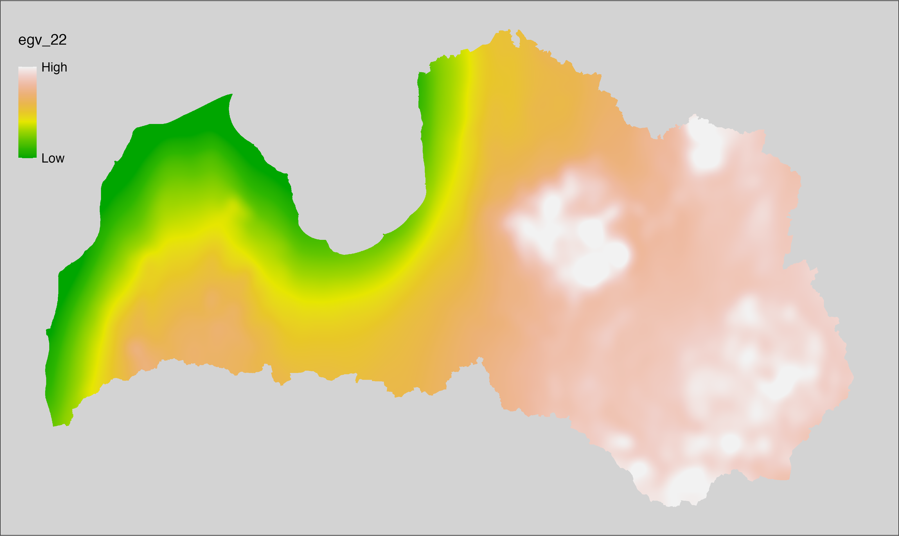


## Climate_CHELSAv2.1-clt-range_cell	{#ch06.023}

**filename:** `Climate_CHELSAv2.1-clt-range_cell.tif`	

**layername:** `egv_23`	

**English name:** Annual range of monthly cloud area fraction (%) (CHELSA v2.1) within the analysis cell (1 ha)

**Latvian name:** Gada mākoņu seguma amplitūda (%) (CHELSA v2.1) analīzes šūnā (1 ha)

**Procedure:** Directly follows [CHELSA v2.1](#Ch04.11). EGV is prepared with the 
workflow `egvtools::downscale2egv()` with inverse distance weighted (power = 2) 
gap filling and soft smoothing (power = 0.5) over 5 km radius of every cell.


``` r
# libs ----
if(!require(egvtools)) {remotes::install_github("aavotins/egvtools"); require(egvtools)}

# job ----

localname="Climate_CHELSAv2.1-clt-range_cell.tif"
layername="egv_23"
reading="./Geodata/2024/CHELSA/Climate_CHELSAv2.1-clt-range_cell.tif"

df <- downscale2egv(
  template_path = "./Templates/TemplateRasters/LV100m_10km.tif",
  grid_path     = "./Templates/TemplateGrids/tikls1km_sauzeme.parquet",
  rawfile_path  = reading,
  out_path      = "./RasterGrids_100m/2024/RAW/",
  file_name     = localname,
  layer_name    = layername,
  fill_gaps     = TRUE,
  smooth        = TRUE,
  smooth_radius_km = 5,
  plot_result   = TRUE)
print(df)
```

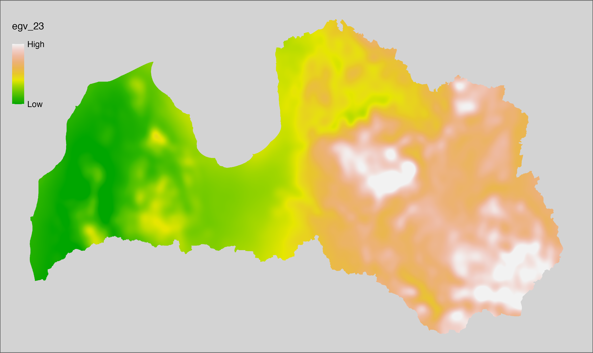


## Climate_CHELSAv2.1-cmi-max_cell	{#ch06.024}

**filename:** `Climate_CHELSAv2.1-cmi-max_cell.tif`	

**layername:** `egv_24`	

**English name:** Maximum monthly climate moisture index (kg m⁻² month⁻¹) (CHELSA v2.1) within the analysis cell (1 ha)

**Latvian name:** Maksimālais mēneša vidējais klimata mitruma indekss (kg m⁻² month⁻¹) (CHELSA v2.1) analīzes šūnā (1 ha)

**Procedure:** Directly follows [CHELSA v2.1](#Ch04.11). EGV is prepared with the 
workflow `egvtools::downscale2egv()` with inverse distance weighted (power = 2) 
gap filling and soft smoothing (power = 0.5) over 5 km radius of every cell.


``` r
# libs ----
if(!require(egvtools)) {remotes::install_github("aavotins/egvtools"); require(egvtools)}

# job ----

localname="Climate_CHELSAv2.1-cmi-max_cell.tif"
layername="egv_24"
reading="./Geodata/2024/CHELSA/Climate_CHELSAv2.1-cmi-max_cell.tif"

df <- downscale2egv(
  template_path = "./Templates/TemplateRasters/LV100m_10km.tif",
  grid_path     = "./Templates/TemplateGrids/tikls1km_sauzeme.parquet",
  rawfile_path  = reading,
  out_path      = "./RasterGrids_100m/2024/RAW/",
  file_name     = localname,
  layer_name    = layername,
  fill_gaps     = TRUE,
  smooth        = TRUE,
  smooth_radius_km = 5,
  plot_result   = TRUE)
print(df)
```

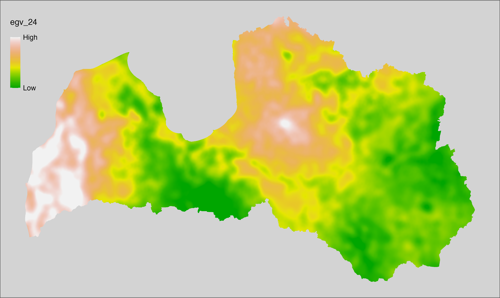


## Climate_CHELSAv2.1-cmi-mean_cell	{#ch06.025}

**filename:** `Climate_CHELSAv2.1-cmi-mean_cell.tif`	

**layername:** `egv_25`	

**English name:** Mean monthly climate moisture index (kg m⁻² month⁻¹) (CHELSA v2.1) within the analysis cell (1 ha)

**Latvian name:** Vidējais klimata mitruma indekss (kg m⁻² month⁻¹) (CHELSA v2.1) analīzes šūnā (1 ha)

**Procedure:** Directly follows [CHELSA v2.1](#Ch04.11). EGV is prepared with the 
workflow `egvtools::downscale2egv()` with inverse distance weighted (power = 2) 
gap filling and soft smoothing (power = 0.5) over 5 km radius of every cell.


``` r
# libs ----
if(!require(egvtools)) {remotes::install_github("aavotins/egvtools"); require(egvtools)}

# job ----

localname="Climate_CHELSAv2.1-cmi-mean_cell.tif"
layername="egv_25"
reading="./Geodata/2024/CHELSA/Climate_CHELSAv2.1-cmi-mean_cell.tif"

df <- downscale2egv(
  template_path = "./Templates/TemplateRasters/LV100m_10km.tif",
  grid_path     = "./Templates/TemplateGrids/tikls1km_sauzeme.parquet",
  rawfile_path  = reading,
  out_path      = "./RasterGrids_100m/2024/RAW/",
  file_name     = localname,
  layer_name    = layername,
  fill_gaps     = TRUE,
  smooth        = TRUE,
  smooth_radius_km = 5,
  plot_result   = TRUE)
print(df)
```

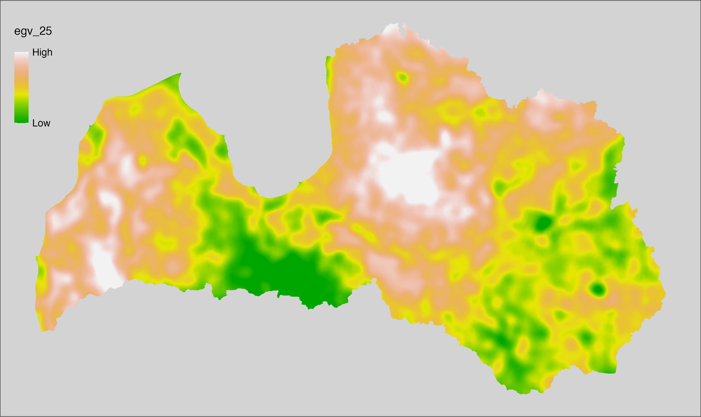


## Climate_CHELSAv2.1-cmi-min_cell	{#ch06.026}

**filename:** `Climate_CHELSAv2.1-cmi-min_cell.tif`	

**layername:** `egv_26`	

**English name:** Minimum monthly climate moisture index (kg m⁻² month⁻¹) (CHELSA v2.1) within the analysis cell (1 ha)

**Latvian name:** Minimālais mēneša vidējais klimata mitruma indekss (kg m⁻² month⁻¹) (CHELSA v2.1) analīzes šūnā (1 ha)

**Procedure:** Directly follows [CHELSA v2.1](#Ch04.11). EGV is prepared with the 
workflow `egvtools::downscale2egv()` with inverse distance weighted (power = 2) 
gap filling and soft smoothing (power = 0.5) over 5 km radius of every cell.


``` r
# libs ----
if(!require(egvtools)) {remotes::install_github("aavotins/egvtools"); require(egvtools)}

# job ----

localname="Climate_CHELSAv2.1-cmi-min_cell.tif"
layername="egv_26"
reading="./Geodata/2024/CHELSA/Climate_CHELSAv2.1-cmi-min_cell.tif"

df <- downscale2egv(
  template_path = "./Templates/TemplateRasters/LV100m_10km.tif",
  grid_path     = "./Templates/TemplateGrids/tikls1km_sauzeme.parquet",
  rawfile_path  = reading,
  out_path      = "./RasterGrids_100m/2024/RAW/",
  file_name     = localname,
  layer_name    = layername,
  fill_gaps     = TRUE,
  smooth        = TRUE,
  smooth_radius_km = 5,
  plot_result   = TRUE)
print(df)
```

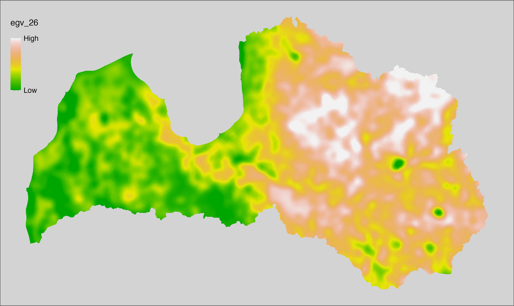


## Climate_CHELSAv2.1-cmi-range_cell	{#ch06.027}

**filename:** `Climate_CHELSAv2.1-cmi-range_cell.tif`	

**layername:** `egv_27`	

**English name:** Annual range of monthly climate moisture index (kg m⁻² month⁻¹) (CHELSA v2.1) within the analysis cell (1 ha)

**Latvian name:** Gada klimata mitruma indeksa amplitūda (kg m⁻² month⁻¹) (CHELSA v2.1) analīzes šūnā (1 ha)

**Procedure:** Directly follows [CHELSA v2.1](#Ch04.11). EGV is prepared with the 
workflow `egvtools::downscale2egv()` with inverse distance weighted (power = 2) 
gap filling and soft smoothing (power = 0.5) over 5 km radius of every cell.


``` r
# libs ----
if(!require(egvtools)) {remotes::install_github("aavotins/egvtools"); require(egvtools)}

# job ----

localname="Climate_CHELSAv2.1-cmi-range_cell.tif"
layername="egv_27"
reading="./Geodata/2024/CHELSA/Climate_CHELSAv2.1-cmi-range_cell.tif"

df <- downscale2egv(
  template_path = "./Templates/TemplateRasters/LV100m_10km.tif",
  grid_path     = "./Templates/TemplateGrids/tikls1km_sauzeme.parquet",
  rawfile_path  = reading,
  out_path      = "./RasterGrids_100m/2024/RAW/",
  file_name     = localname,
  layer_name    = layername,
  fill_gaps     = TRUE,
  smooth        = TRUE,
  smooth_radius_km = 5,
  plot_result   = TRUE)
print(df)
```

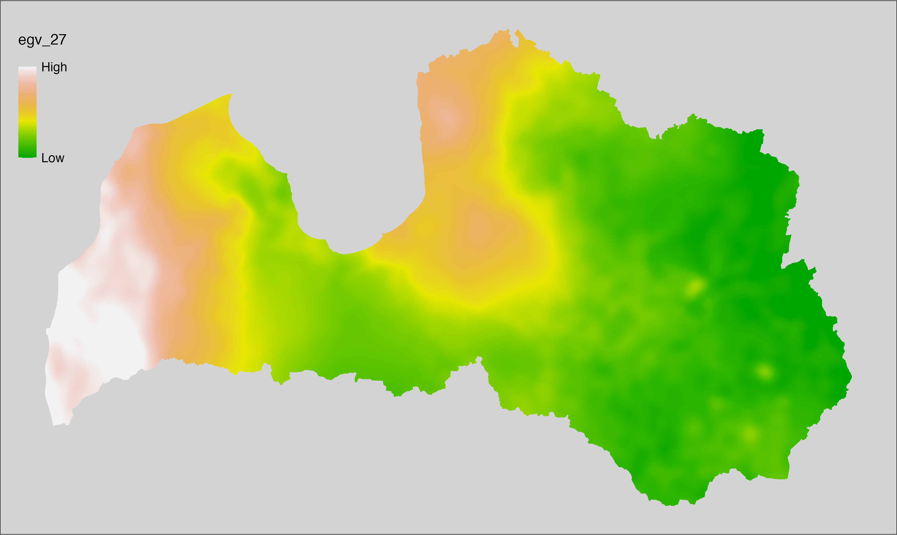


## Climate_CHELSAv2.1-fcf_cell	{#ch06.028}

**filename:** `Climate_CHELSAv2.1-fcf_cell.tif`	

**layername:** `egv_28`	

**English name:** Frost change frequency (number of events in which tmin or tmax go above or below 0°C) (CHELSA v2.1) within the analysis cell (1 ha)

**Latvian name:** Sasalšanas gadījumu biežums (zemākā vai augstākā temperatūra šķērso 0°C) (CHELSA v2.1) analīzes šūnā (1 ha)

**Procedure:** Directly follows [CHELSA v2.1](#Ch04.11). EGV is prepared with the 
workflow `egvtools::downscale2egv()` with inverse distance weighted (power = 2) 
gap filling and soft smoothing (power = 0.5) over 5 km radius of every cell.


``` r
# libs ----
if(!require(egvtools)) {remotes::install_github("aavotins/egvtools"); require(egvtools)}

# job ----

localname="Climate_CHELSAv2.1-fcf_cell.tif"
layername="egv_28"
reading="./Geodata/2024/CHELSA/Climate_CHELSAv2.1-fcf_cell.tif"

df <- downscale2egv(
  template_path = "./Templates/TemplateRasters/LV100m_10km.tif",
  grid_path     = "./Templates/TemplateGrids/tikls1km_sauzeme.parquet",
  rawfile_path  = reading,
  out_path      = "./RasterGrids_100m/2024/RAW/",
  file_name     = localname,
  layer_name    = layername,
  fill_gaps     = TRUE,
  smooth        = TRUE,
  smooth_radius_km = 5,
  plot_result   = TRUE)
print(df)
```


## Climate_CHELSAv2.1-fgd_cell	{#ch06.029}

**filename:** `Climate_CHELSAv2.1-fgd_cell.tif`	

**layername:** `egv_29`	

**English name:** First day of the growing season (TREELIM) (CHELSA v2.1) within the analysis cell (1 ha)

**Latvian name:** Veģetācijas sezonas pirmā diena (TREELIM) (CHELSA v2.1) analīzes šūnā (1 ha)

**Procedure:** Directly follows [CHELSA v2.1](#Ch04.11). EGV is prepared with the 
workflow `egvtools::downscale2egv()` with inverse distance weighted (power = 2) 
gap filling and soft smoothing (power = 0.5) over 5 km radius of every cell.


``` r
# libs ----
if(!require(egvtools)) {remotes::install_github("aavotins/egvtools"); require(egvtools)}

# job ----

localname="Climate_CHELSAv2.1-fgd_cell.tif"
layername="egv_29"
reading="./Geodata/2024/CHELSA/Climate_CHELSAv2.1-fgd_cell.tif"

df <- downscale2egv(
  template_path = "./Templates/TemplateRasters/LV100m_10km.tif",
  grid_path     = "./Templates/TemplateGrids/tikls1km_sauzeme.parquet",
  rawfile_path  = reading,
  out_path      = "./RasterGrids_100m/2024/RAW/",
  file_name     = localname,
  layer_name    = layername,
  fill_gaps     = TRUE,
  smooth        = TRUE,
  smooth_radius_km = 5,
  plot_result   = TRUE)
print(df)
```

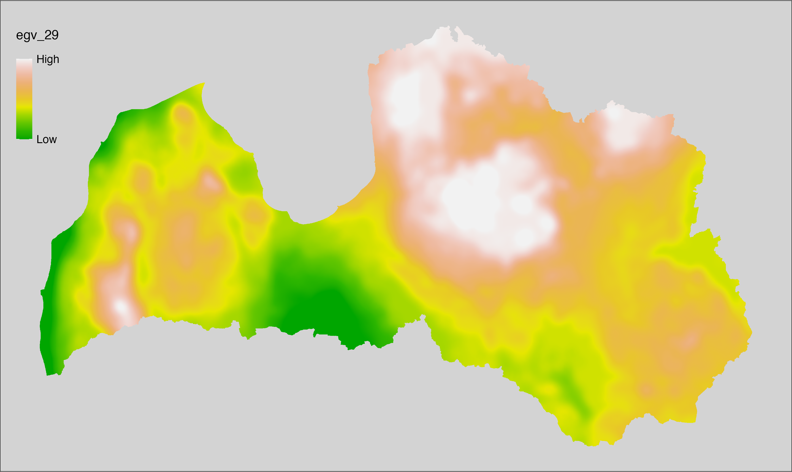


## Climate_CHELSAv2.1-gdd0_cell	{#ch06.030}

**filename:** `Climate_CHELSAv2.1-gdd0_cell.tif`	

**layername:** `egv_30`	

**English name:** Growing degree days heat sum above 0°C (CHELSA v2.1) within the analysis cell (1 ha)

**Latvian name:** Aktīvo temperatūru summa no 0°C (CHELSA v2.1) analīzes šūnā (1 ha)

**Procedure:** Directly follows [CHELSA v2.1](#Ch04.11). EGV is prepared with the 
workflow `egvtools::downscale2egv()` with inverse distance weighted (power = 2) 
gap filling and soft smoothing (power = 0.5) over 5 km radius of every cell.


``` r
# libs ----
if(!require(egvtools)) {remotes::install_github("aavotins/egvtools"); require(egvtools)}

# job ----

localname="Climate_CHELSAv2.1-gdd0_cell.tif"
layername="egv_30"
reading="./Geodata/2024/CHELSA/Climate_CHELSAv2.1-gdd0_cell.tif"

df <- downscale2egv(
  template_path = "./Templates/TemplateRasters/LV100m_10km.tif",
  grid_path     = "./Templates/TemplateGrids/tikls1km_sauzeme.parquet",
  rawfile_path  = reading,
  out_path      = "./RasterGrids_100m/2024/RAW/",
  file_name     = localname,
  layer_name    = layername,
  fill_gaps     = TRUE,
  smooth        = TRUE,
  smooth_radius_km = 5,
  plot_result   = TRUE)
print(df)
```

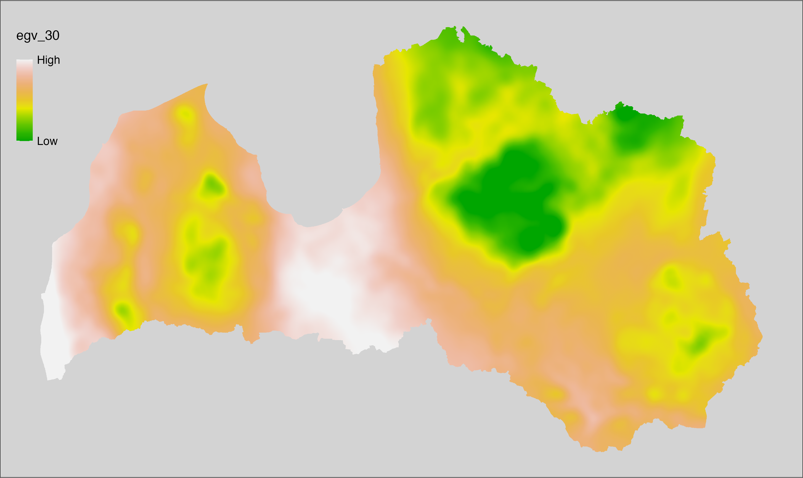


## Climate_CHELSAv2.1-gdd10_cell	{#ch06.031}

**filename:** `Climate_CHELSAv2.1-gdd10_cell.tif`	

**layername:** `egv_31`	

**English name:** Growing degree days heat sum above 10°C (CHELSA v2.1) within the analysis cell (1 ha)

**Latvian name:** Aktīvo temperatūru summa no 10°C (CHELSA v2.1) analīzes šūnā (1 ha)

**Procedure:** Directly follows [CHELSA v2.1](#Ch04.11). EGV is prepared with the 
workflow `egvtools::downscale2egv()` with inverse distance weighted (power = 2) 
gap filling and soft smoothing (power = 0.5) over 5 km radius of every cell.


``` r
# libs ----
if(!require(egvtools)) {remotes::install_github("aavotins/egvtools"); require(egvtools)}

# job ----

localname="Climate_CHELSAv2.1-gdd10_cell.tif"
layername="egv_31"
reading="./Geodata/2024/CHELSA/Climate_CHELSAv2.1-gdd10_cell.tif"

df <- downscale2egv(
  template_path = "./Templates/TemplateRasters/LV100m_10km.tif",
  grid_path     = "./Templates/TemplateGrids/tikls1km_sauzeme.parquet",
  rawfile_path  = reading,
  out_path      = "./RasterGrids_100m/2024/RAW/",
  file_name     = localname,
  layer_name    = layername,
  fill_gaps     = TRUE,
  smooth        = TRUE,
  smooth_radius_km = 5,
  plot_result   = TRUE)
print(df)
```

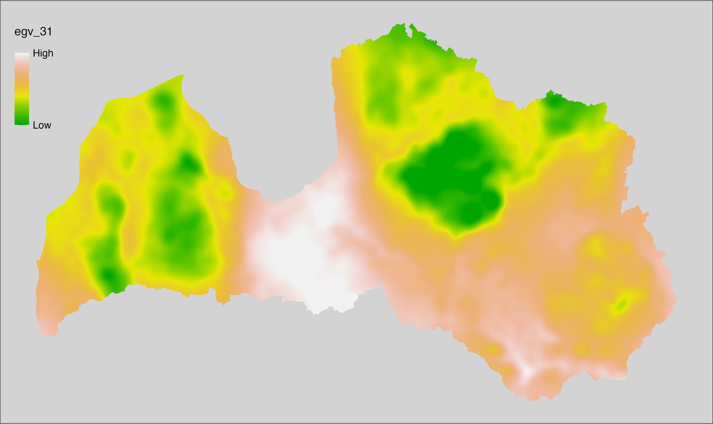


## Climate_CHELSAv2.1-gdd5_cell	{#ch06.032}

**filename:** `Climate_CHELSAv2.1-gdd5_cell.tif`	

**layername:** `egv_32`	

**English name:** Growing degree days heat sum above 5°C (CHELSA v2.1) within the analysis cell (1 ha)

**Latvian name:** Aktīvo temperatūru summa no 5°C (CHELSA v2.1) analīzes šūnā (1 ha)

**Procedure:** Directly follows [CHELSA v2.1](#Ch04.11). EGV is prepared with the 
workflow `egvtools::downscale2egv()` with inverse distance weighted (power = 2) 
gap filling and soft smoothing (power = 0.5) over 5 km radius of every cell.


``` r
# libs ----
if(!require(egvtools)) {remotes::install_github("aavotins/egvtools"); require(egvtools)}

# job ----

localname="Climate_CHELSAv2.1-gdd5_cell.tif"
layername="egv_32"
reading="./Geodata/2024/CHELSA/Climate_CHELSAv2.1-gdd5_cell.tif"

df <- downscale2egv(
  template_path = "./Templates/TemplateRasters/LV100m_10km.tif",
  grid_path     = "./Templates/TemplateGrids/tikls1km_sauzeme.parquet",
  rawfile_path  = reading,
  out_path      = "./RasterGrids_100m/2024/RAW/",
  file_name     = localname,
  layer_name    = layername,
  fill_gaps     = TRUE,
  smooth        = TRUE,
  smooth_radius_km = 5,
  plot_result   = TRUE)
print(df)
```

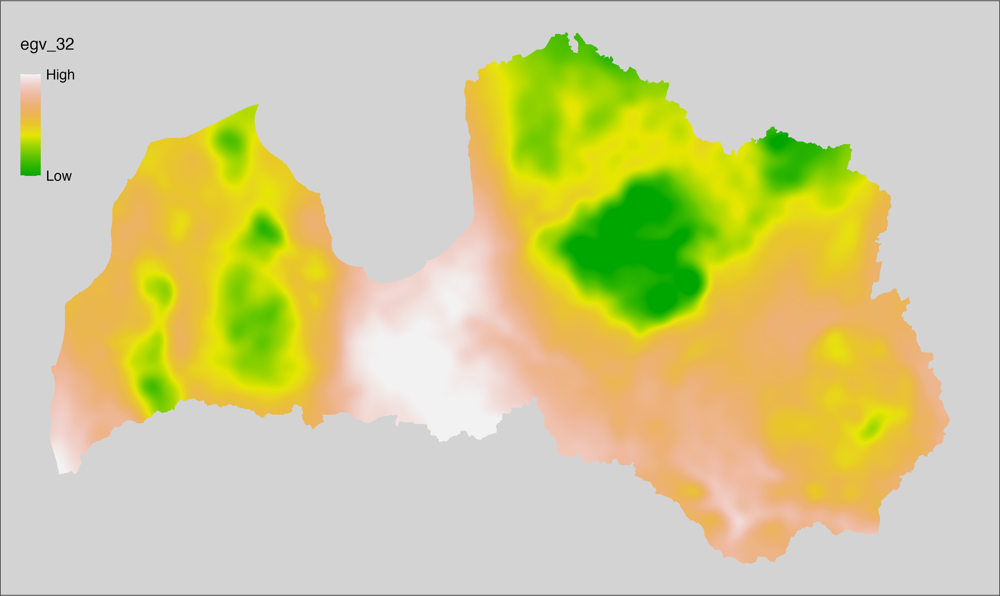


## Climate_CHELSAv2.1-gddlgd0_cell	{#ch06.033}

**filename:** `Climate_CHELSAv2.1-gddlgd0_cell.tif`	

**layername:** `egv_33`	

**English name:** Last growing degree day above 0°C (CHELSA v2.1) within the analysis cell (1 ha)

**Latvian name:** Veģetācijas sezonas pēdējā diena no 0°C (CHELSA v2.1) analīzes šūnā (1 ha)

**Procedure:** Directly follows [CHELSA v2.1](#Ch04.11). EGV is prepared with the 
workflow `egvtools::downscale2egv()` with inverse distance weighted (power = 2) 
gap filling and soft smoothing (power = 0.5) over 5 km radius of every cell.


``` r
# libs ----
if(!require(egvtools)) {remotes::install_github("aavotins/egvtools"); require(egvtools)}

# job ----

localname="Climate_CHELSAv2.1-gddlgd0_cell.tif"
layername="egv_33"
reading="./Geodata/2024/CHELSA/Climate_CHELSAv2.1-gddlgd0_cell.tif"

df <- downscale2egv(
  template_path = "./Templates/TemplateRasters/LV100m_10km.tif",
  grid_path     = "./Templates/TemplateGrids/tikls1km_sauzeme.parquet",
  rawfile_path  = reading,
  out_path      = "./RasterGrids_100m/2024/RAW/",
  file_name     = localname,
  layer_name    = layername,
  fill_gaps     = TRUE,
  smooth        = TRUE,
  smooth_radius_km = 5,
  plot_result   = TRUE)
print(df)
```

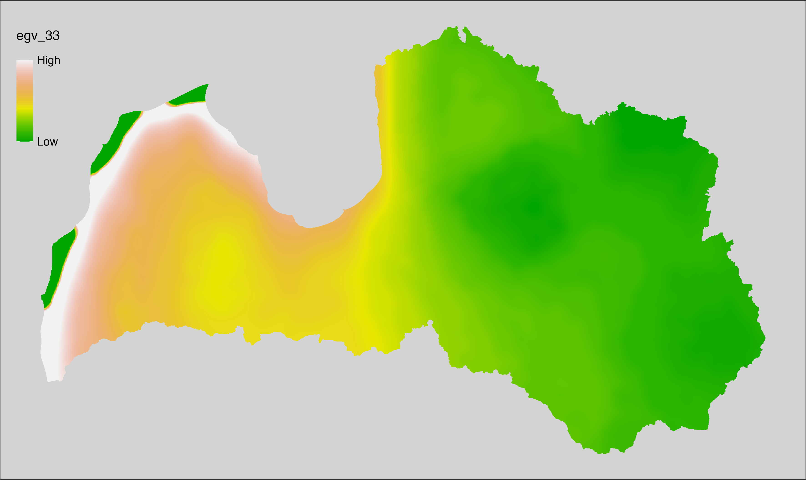


## Climate_CHELSAv2.1-gddlgd10_cell	{#ch06.034}

**filename:** `Climate_CHELSAv2.1-gddlgd10_cell.tif`	

**layername:** `egv_34`	

**English name:** Last growing degree day above 10°C (CHELSA v2.1) within the analysis cell (1 ha)

**Latvian name:** Veģetācijas sezonas pēdējā diena no 10°C (CHELSA v2.1) analīzes šūnā (1 ha)

**Procedure:** Directly follows [CHELSA v2.1](#Ch04.11). EGV is prepared with the 
workflow `egvtools::downscale2egv()` with inverse distance weighted (power = 2) 
gap filling and soft smoothing (power = 0.5) over 5 km radius of every cell.


``` r
# libs ----
if(!require(egvtools)) {remotes::install_github("aavotins/egvtools"); require(egvtools)}

# job ----

localname="Climate_CHELSAv2.1-gddlgd10_cell.tif"
layername="egv_34"
reading="./Geodata/2024/CHELSA/Climate_CHELSAv2.1-gddlgd10_cell.tif"

df <- downscale2egv(
  template_path = "./Templates/TemplateRasters/LV100m_10km.tif",
  grid_path     = "./Templates/TemplateGrids/tikls1km_sauzeme.parquet",
  rawfile_path  = reading,
  out_path      = "./RasterGrids_100m/2024/RAW/",
  file_name     = localname,
  layer_name    = layername,
  fill_gaps     = TRUE,
  smooth        = TRUE,
  smooth_radius_km = 5,
  plot_result   = TRUE)
print(df)
```

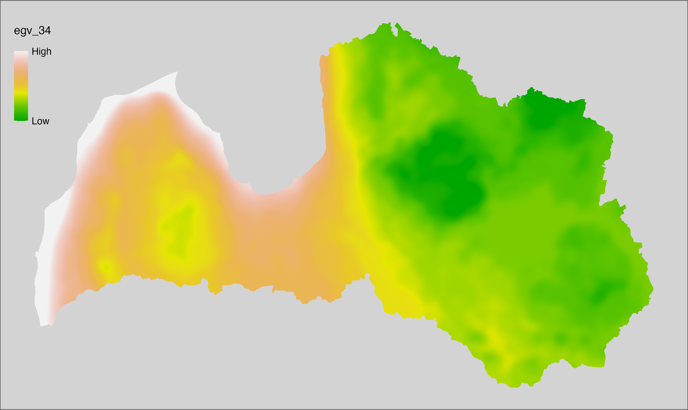


## Climate_CHELSAv2.1-gddlgd5_cell	{#ch06.035}

**filename:** `Climate_CHELSAv2.1-gddlgd5_cell.tif`	

**layername:** `egv_35`	

**English name:** Last growing degree day above 5°C (CHELSA v2.1) within the analysis cell (1 ha)

**Latvian name:** Veģetācijas sezonas pēdējā diena no 5°C (CHELSA v2.1) analīzes šūnā (1 ha)

**Procedure:** Directly follows [CHELSA v2.1](#Ch04.11). EGV is prepared with the 
workflow `egvtools::downscale2egv()` with inverse distance weighted (power = 2) 
gap filling and soft smoothing (power = 0.5) over 5 km radius of every cell.


``` r
# libs ----
if(!require(egvtools)) {remotes::install_github("aavotins/egvtools"); require(egvtools)}

# job ----

localname="Climate_CHELSAv2.1-gddlgd5_cell.tif"
layername="egv_35"
reading="./Geodata/2024/CHELSA/Climate_CHELSAv2.1-gddlgd5_cell.tif"

df <- downscale2egv(
  template_path = "./Templates/TemplateRasters/LV100m_10km.tif",
  grid_path     = "./Templates/TemplateGrids/tikls1km_sauzeme.parquet",
  rawfile_path  = reading,
  out_path      = "./RasterGrids_100m/2024/RAW/",
  file_name     = localname,
  layer_name    = layername,
  fill_gaps     = TRUE,
  smooth        = TRUE,
  smooth_radius_km = 5,
  plot_result   = TRUE)
print(df)
```

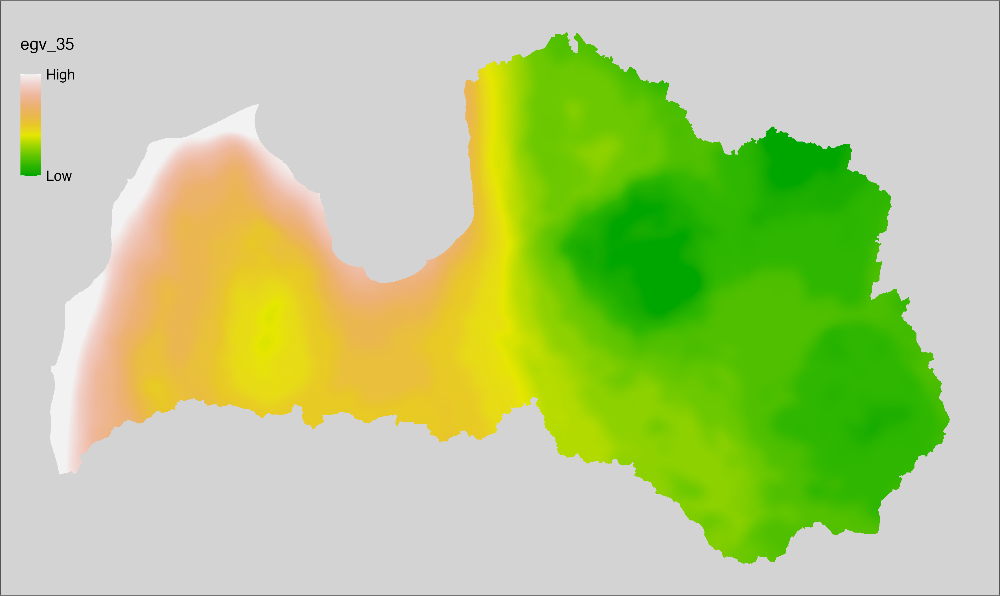


## Climate_CHELSAv2.1-gdgfgd0_cell	{#ch06.036}

**filename:** `Climate_CHELSAv2.1-gdgfgd0_cell.tif`	

**layername:** `egv_36`	

**English name:** First growing degree day above 0°C (CHELSA v2.1) within the analysis cell (1 ha)

**Latvian name:** Veģetācijas sezonas pirmā diena no 0°C (CHELSA v2.1) analīzes šūnā (1 ha)

**Procedure:** Directly follows [CHELSA v2.1](#Ch04.11). EGV is prepared with the 
workflow `egvtools::downscale2egv()` with inverse distance weighted (power = 2) 
gap filling and soft smoothing (power = 0.5) over 5 km radius of every cell.


``` r
# libs ----
if(!require(egvtools)) {remotes::install_github("aavotins/egvtools"); require(egvtools)}

# job ----

localname="Climate_CHELSAv2.1-gdgfgd0_cell.tif"
layername="egv_36"
reading="./Geodata/2024/CHELSA/Climate_CHELSAv2.1-gdgfgd0_cell.tif"

df <- downscale2egv(
  template_path = "./Templates/TemplateRasters/LV100m_10km.tif",
  grid_path     = "./Templates/TemplateGrids/tikls1km_sauzeme.parquet",
  rawfile_path  = reading,
  out_path      = "./RasterGrids_100m/2024/RAW/",
  file_name     = localname,
  layer_name    = layername,
  fill_gaps     = TRUE,
  smooth        = TRUE,
  smooth_radius_km = 5,
  plot_result   = TRUE)
print(df)
```

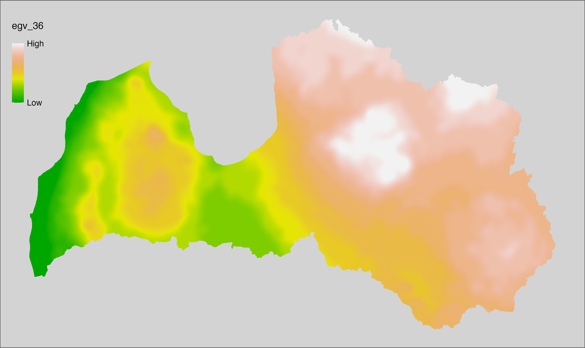


## Climate_CHELSAv2.1-gdgfgd10_cell	{#ch06.037}

**filename:** `Climate_CHELSAv2.1-gdgfgd10_cell.tif`	

**layername:** `egv_37`	

**English name:** First growing degree day above 10°C (CHELSA v2.1) within the analysis cell (1 ha)

**Latvian name:** Veģetācijas sezonas pirmā diena no 10°C (CHELSA v2.1) analīzes šūnā (1 ha)

**Procedure:** Directly follows [CHELSA v2.1](#Ch04.11). EGV is prepared with the 
workflow `egvtools::downscale2egv()` with inverse distance weighted (power = 2) 
gap filling and soft smoothing (power = 0.5) over 5 km radius of every cell.


``` r
# libs ----
if(!require(egvtools)) {remotes::install_github("aavotins/egvtools"); require(egvtools)}

# job ----

localname="Climate_CHELSAv2.1-gdgfgd10_cell.tif"
layername="egv_37"
reading="./Geodata/2024/CHELSA/Climate_CHELSAv2.1-gdgfgd10_cell.tif"

df <- downscale2egv(
  template_path = "./Templates/TemplateRasters/LV100m_10km.tif",
  grid_path     = "./Templates/TemplateGrids/tikls1km_sauzeme.parquet",
  rawfile_path  = reading,
  out_path      = "./RasterGrids_100m/2024/RAW/",
  file_name     = localname,
  layer_name    = layername,
  fill_gaps     = TRUE,
  smooth        = TRUE,
  smooth_radius_km = 5,
  plot_result   = TRUE)
print(df)
```

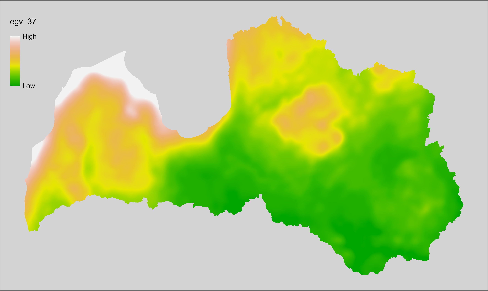


## Climate_CHELSAv2.1-gdgfgd5_cell	{#ch06.038}

**filename:** `Climate_CHELSAv2.1-gdgfgd5_cell.tif`	

**layername:** `egv_38`	

**English name:** First growing degree day above 5°C (CHELSA v2.1) within the analysis cell (1 ha)

**Latvian name:** Veģetācijas sezonas pirmā diena no 5°C (CHELSA v2.1) analīzes šūnā (1 ha)

**Procedure:** Directly follows [CHELSA v2.1](#Ch04.11). EGV is prepared with the 
workflow `egvtools::downscale2egv()` with inverse distance weighted (power = 2) 
gap filling and soft smoothing (power = 0.5) over 5 km radius of every cell.


``` r
# libs ----
if(!require(egvtools)) {remotes::install_github("aavotins/egvtools"); require(egvtools)}

# job ----

localname="Climate_CHELSAv2.1-gdgfgd5_cell.tif"
layername="egv_38"
reading="./Geodata/2024/CHELSA/Climate_CHELSAv2.1-gdgfgd5_cell.tif"

df <- downscale2egv(
  template_path = "./Templates/TemplateRasters/LV100m_10km.tif",
  grid_path     = "./Templates/TemplateGrids/tikls1km_sauzeme.parquet",
  rawfile_path  = reading,
  out_path      = "./RasterGrids_100m/2024/RAW/",
  file_name     = localname,
  layer_name    = layername,
  fill_gaps     = TRUE,
  smooth        = TRUE,
  smooth_radius_km = 5,
  plot_result   = TRUE)
print(df)
```

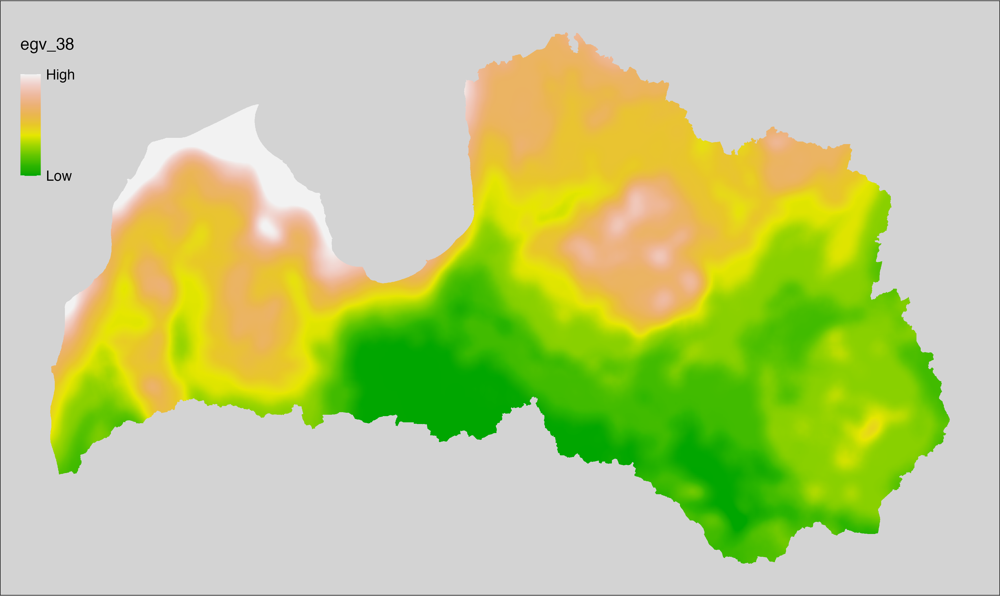


## Climate_CHELSAv2.1-gsl_cell	{#ch06.039}

**filename:** `Climate_CHELSAv2.1-gsl_cell.tif`	

**layername:** `egv_39`	

**English name:** Length of the growing season (TREELIM) (CHELSA v2.1) within the analysis cell (1 ha)

**Latvian name:** Veģetācijas sezonas garums (TREELIM) (CHELSA v2.1) analīzes šūnā (1 ha)

**Procedure:** Directly follows [CHELSA v2.1](#Ch04.11). EGV is prepared with the 
workflow `egvtools::downscale2egv()` with inverse distance weighted (power = 2) 
gap filling and soft smoothing (power = 0.5) over 5 km radius of every cell.


``` r
# libs ----
if(!require(egvtools)) {remotes::install_github("aavotins/egvtools"); require(egvtools)}

# job ----

localname="Climate_CHELSAv2.1-gsl_cell.tif"
layername="egv_39"
reading="./Geodata/2024/CHELSA/Climate_CHELSAv2.1-gsl_cell.tif"

df <- downscale2egv(
  template_path = "./Templates/TemplateRasters/LV100m_10km.tif",
  grid_path     = "./Templates/TemplateGrids/tikls1km_sauzeme.parquet",
  rawfile_path  = reading,
  out_path      = "./RasterGrids_100m/2024/RAW/",
  file_name     = localname,
  layer_name    = layername,
  fill_gaps     = TRUE,
  smooth        = TRUE,
  smooth_radius_km = 5,
  plot_result   = TRUE)
print(df)
```

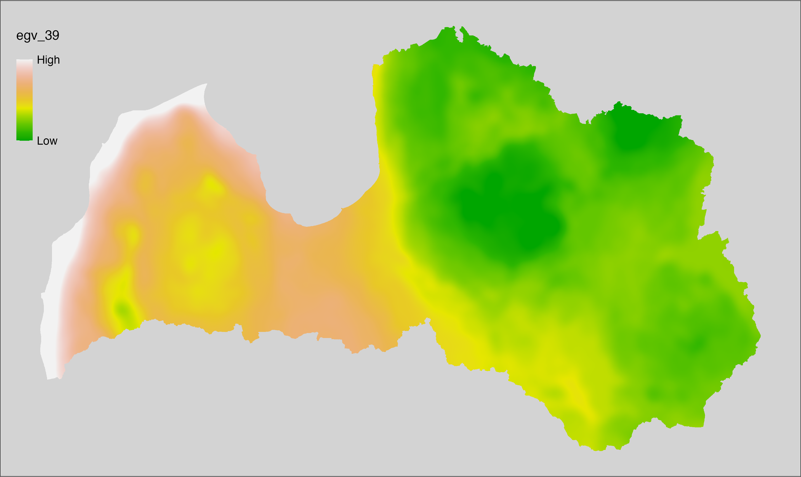


## Climate_CHELSAv2.1-gsp_cell	{#ch06.040}

**filename:** `Climate_CHELSAv2.1-gsp_cell.tif`	

**layername:** `egv_40`	

**English name:** Accumulated precipitation amount (kg m⁻² year⁻¹) on growing season days (TREELIM) (CHELSA v2.1) within the analysis cell (1 ha)

**Latvian name:** Veģetācijas sezonā (TREELIM) uzkrātais nokrišņu daudzums (kg m⁻² year⁻¹) (CHELSA v2.1) analīzes šūnā (1 ha)

**Procedure:** Directly follows [CHELSA v2.1](#Ch04.11). EGV is prepared with the 
workflow `egvtools::downscale2egv()` with inverse distance weighted (power = 2) 
gap filling and soft smoothing (power = 0.5) over 5 km radius of every cell.


``` r
# libs ----
if(!require(egvtools)) {remotes::install_github("aavotins/egvtools"); require(egvtools)}

# job ----

localname="Climate_CHELSAv2.1-gsp_cell.tif"
layername="egv_40"
reading="./Geodata/2024/CHELSA/Climate_CHELSAv2.1-gsp_cell.tif"

df <- downscale2egv(
  template_path = "./Templates/TemplateRasters/LV100m_10km.tif",
  grid_path     = "./Templates/TemplateGrids/tikls1km_sauzeme.parquet",
  rawfile_path  = reading,
  out_path      = "./RasterGrids_100m/2024/RAW/",
  file_name     = localname,
  layer_name    = layername,
  fill_gaps     = TRUE,
  smooth        = TRUE,
  smooth_radius_km = 5,
  plot_result   = TRUE)
print(df)
```

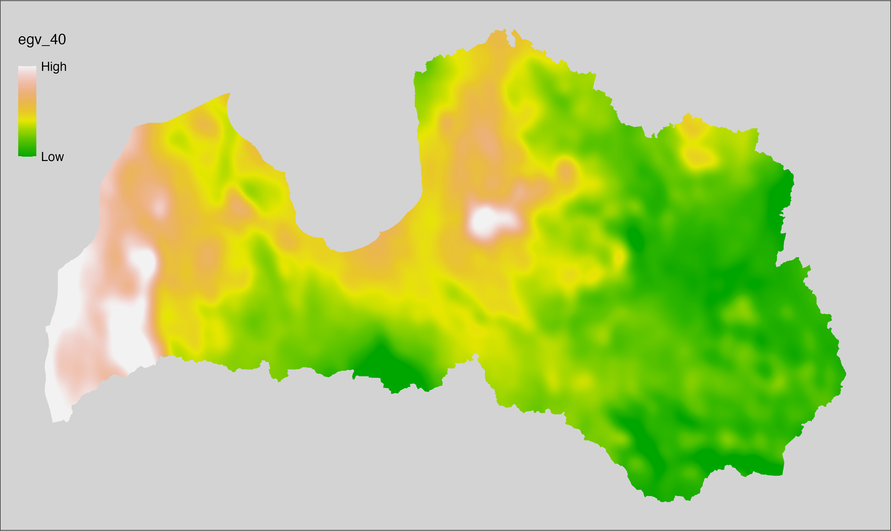


## Climate_CHELSAv2.1-gst_cell	{#ch06.041}

**filename:** `Climate_CHELSAv2.1-gst_cell.tif`	

**layername:** `egv_41`	

**English name:** Mean temperature of the growing season (TREELIM) (CHELSA v2.1) within the analysis cell (1 ha)

**Latvian name:** Vidējā ikdienas gaisa temperatūra (°C) veģetācijas sezonā (TREELIM) (CHELSA v2.1) analīzes šūnā (1 ha)

**Procedure:** Directly follows [CHELSA v2.1](#Ch04.11). EGV is prepared with the 
workflow `egvtools::downscale2egv()` with inverse distance weighted (power = 2) 
gap filling and soft smoothing (power = 0.5) over 5 km radius of every cell.


``` r
# libs ----
if(!require(egvtools)) {remotes::install_github("aavotins/egvtools"); require(egvtools)}

# job ----

localname="Climate_CHELSAv2.1-gst_cell.tif"
layername="egv_41"
reading="./Geodata/2024/CHELSA/Climate_CHELSAv2.1-gst_cell.tif"

df <- downscale2egv(
  template_path = "./Templates/TemplateRasters/LV100m_10km.tif",
  grid_path     = "./Templates/TemplateGrids/tikls1km_sauzeme.parquet",
  rawfile_path  = reading,
  out_path      = "./RasterGrids_100m/2024/RAW/",
  file_name     = localname,
  layer_name    = layername,
  fill_gaps     = TRUE,
  smooth        = TRUE,
  smooth_radius_km = 5,
  plot_result   = TRUE)
print(df)
```

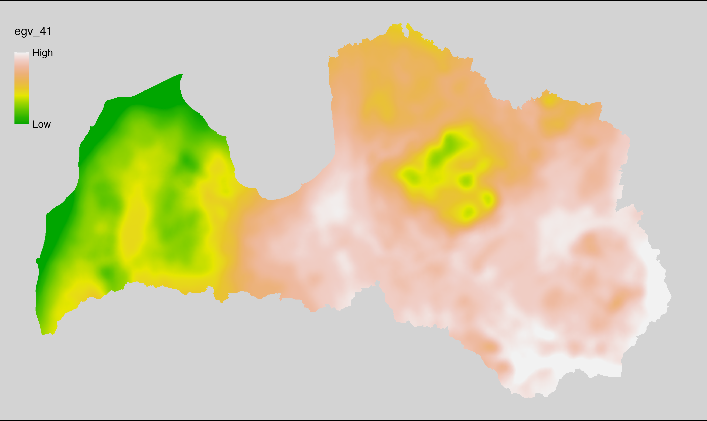


## Climate_CHELSAv2.1-hurs-max_cell	{#ch06.042}

**filename:** `Climate_CHELSAv2.1-hurs-max_cell.tif`	

**layername:** `egv_42`	

**English name:** Maximum monthly near-surface relative humidity (%) (CHELSA v2.1) within the analysis cell (1 ha)

**Latvian name:** Maksimālais mēneša vidējais gaisa mitrums (%) (CHELSA v2.1) analīzes šūnā (1 ha)

**Procedure:** Directly follows [CHELSA v2.1](#Ch04.11). EGV is prepared with the 
workflow `egvtools::downscale2egv()` with inverse distance weighted (power = 2) 
gap filling and soft smoothing (power = 0.5) over 5 km radius of every cell.


``` r
# libs ----
if(!require(egvtools)) {remotes::install_github("aavotins/egvtools"); require(egvtools)}

# job ----

localname="Climate_CHELSAv2.1-hurs-max_cell.tif"
layername="egv_42"
reading="./Geodata/2024/CHELSA/Climate_CHELSAv2.1-hurs-max_cell.tif"

df <- downscale2egv(
  template_path = "./Templates/TemplateRasters/LV100m_10km.tif",
  grid_path     = "./Templates/TemplateGrids/tikls1km_sauzeme.parquet",
  rawfile_path  = reading,
  out_path      = "./RasterGrids_100m/2024/RAW/",
  file_name     = localname,
  layer_name    = layername,
  fill_gaps     = TRUE,
  smooth        = TRUE,
  smooth_radius_km = 5,
  plot_result   = TRUE)
print(df)
```

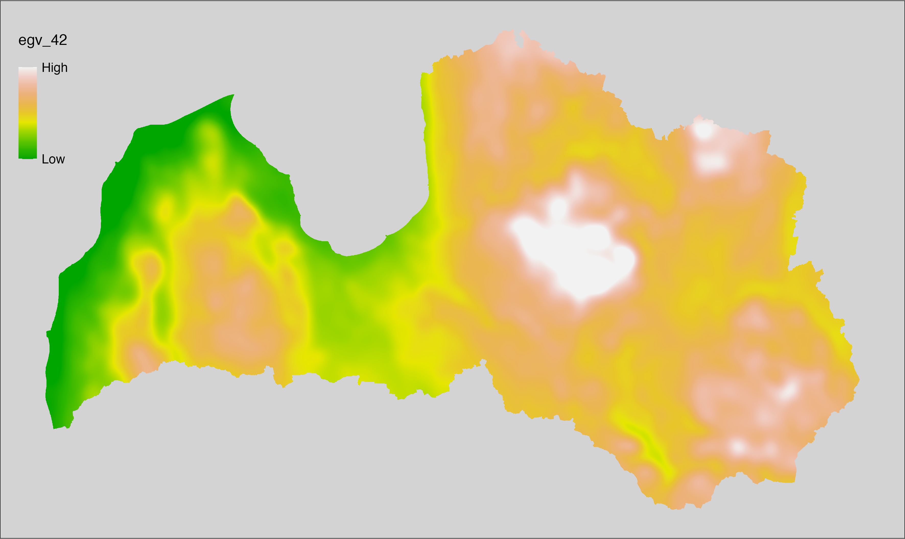


## Climate_CHELSAv2.1-hurs-mean_cell	{#ch06.043}

**filename:** `Climate_CHELSAv2.1-hurs-mean_cell.tif`	

**layername:** `egv_43`	

**English name:** Mean monthly near-surface relative humidity (%) (CHELSA v2.1) within the analysis cell (1 ha)

**Latvian name:** Vidējais ikmēneša gaisa mitrums (%) (CHELSA v2.1) analīzes šūnā (1 ha)

**Procedure:** Directly follows [CHELSA v2.1](#Ch04.11). EGV is prepared with the 
workflow `egvtools::downscale2egv()` with inverse distance weighted (power = 2) 
gap filling and soft smoothing (power = 0.5) over 5 km radius of every cell.


``` r
# libs ----
if(!require(egvtools)) {remotes::install_github("aavotins/egvtools"); require(egvtools)}

# job ----

localname="Climate_CHELSAv2.1-hurs-mean_cell.tif"
layername="egv_43"
reading="./Geodata/2024/CHELSA/Climate_CHELSAv2.1-hurs-mean_cell.tif"

df <- downscale2egv(
  template_path = "./Templates/TemplateRasters/LV100m_10km.tif",
  grid_path     = "./Templates/TemplateGrids/tikls1km_sauzeme.parquet",
  rawfile_path  = reading,
  out_path      = "./RasterGrids_100m/2024/RAW/",
  file_name     = localname,
  layer_name    = layername,
  fill_gaps     = TRUE,
  smooth        = TRUE,
  smooth_radius_km = 5,
  plot_result   = TRUE)
print(df)
```

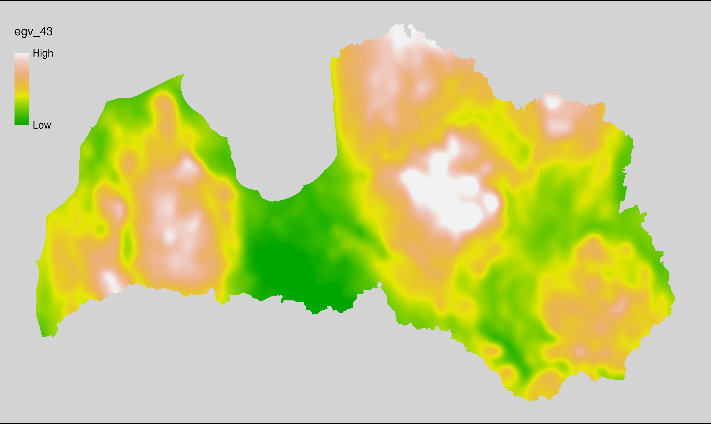


## Climate_CHELSAv2.1-hurs-min_cell	{#ch06.044}

**filename:** `Climate_CHELSAv2.1-hurs-min_cell.tif`	

**layername:** `egv_44`	

**English name:** Minimum monthly near-surface relative humidity (%) (CHELSA v2.1) within the analysis cell (1 ha)

**Latvian name:** Minimālais mēneša vidējais gaisa mitrums (%) (CHELSA v2.1) analīzes šūnā (1 ha)

**Procedure:** Directly follows [CHELSA v2.1](#Ch04.11). EGV is prepared with the 
workflow `egvtools::downscale2egv()` with inverse distance weighted (power = 2) 
gap filling and soft smoothing (power = 0.5) over 5 km radius of every cell.


``` r
# libs ----
if(!require(egvtools)) {remotes::install_github("aavotins/egvtools"); require(egvtools)}

# job ----

localname="Climate_CHELSAv2.1-hurs-min_cell.tif"
layername="egv_44"
reading="./Geodata/2024/CHELSA/Climate_CHELSAv2.1-hurs-min_cell.tif"

df <- downscale2egv(
  template_path = "./Templates/TemplateRasters/LV100m_10km.tif",
  grid_path     = "./Templates/TemplateGrids/tikls1km_sauzeme.parquet",
  rawfile_path  = reading,
  out_path      = "./RasterGrids_100m/2024/RAW/",
  file_name     = localname,
  layer_name    = layername,
  fill_gaps     = TRUE,
  smooth        = TRUE,
  smooth_radius_km = 5,
  plot_result   = TRUE)
print(df)
```

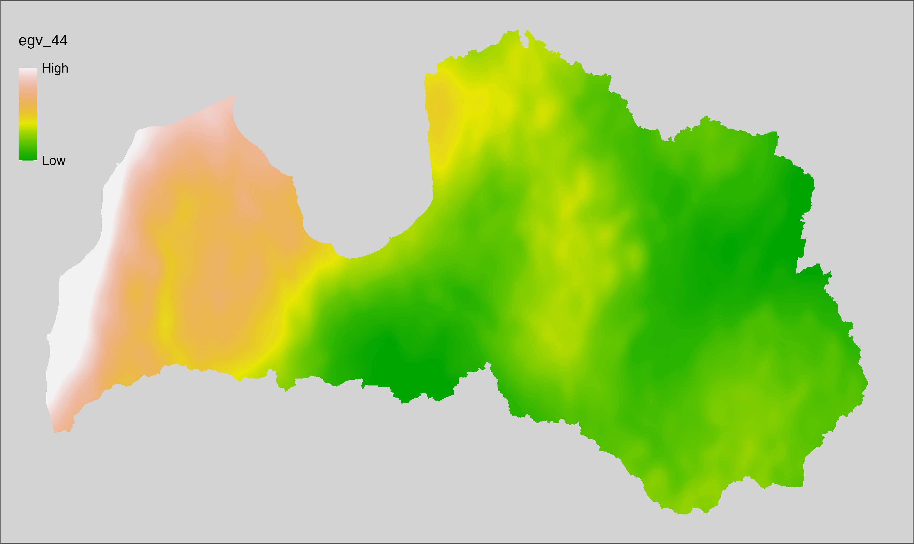


## Climate_CHELSAv2.1-hurs-range_cell	{#ch06.045}

**filename:** `Climate_CHELSAv2.1-hurs-range_cell.tif`	

**layername:** `egv_45`	

**English name:** Annual range of monthly near-surface relative humidity (%) (CHELSA v2.1) within the analysis cell (1 ha)

**Latvian name:** Gada gaisa mitruma amplitūda (%) (CHELSA v2.1) analīzes šūnā (1 ha)

**Procedure:** Directly follows [CHELSA v2.1](#Ch04.11). EGV is prepared with the 
workflow `egvtools::downscale2egv()` with inverse distance weighted (power = 2) 
gap filling and soft smoothing (power = 0.5) over 5 km radius of every cell.


``` r
# libs ----
if(!require(egvtools)) {remotes::install_github("aavotins/egvtools"); require(egvtools)}

# job ----

localname="Climate_CHELSAv2.1-hurs-range_cell.tif"
layername="egv_45"
reading="./Geodata/2024/CHELSA/Climate_CHELSAv2.1-hurs-range_cell.tif"

df <- downscale2egv(
  template_path = "./Templates/TemplateRasters/LV100m_10km.tif",
  grid_path     = "./Templates/TemplateGrids/tikls1km_sauzeme.parquet",
  rawfile_path  = reading,
  out_path      = "./RasterGrids_100m/2024/RAW/",
  file_name     = localname,
  layer_name    = layername,
  fill_gaps     = TRUE,
  smooth        = TRUE,
  smooth_radius_km = 5,
  plot_result   = TRUE)
print(df)
```

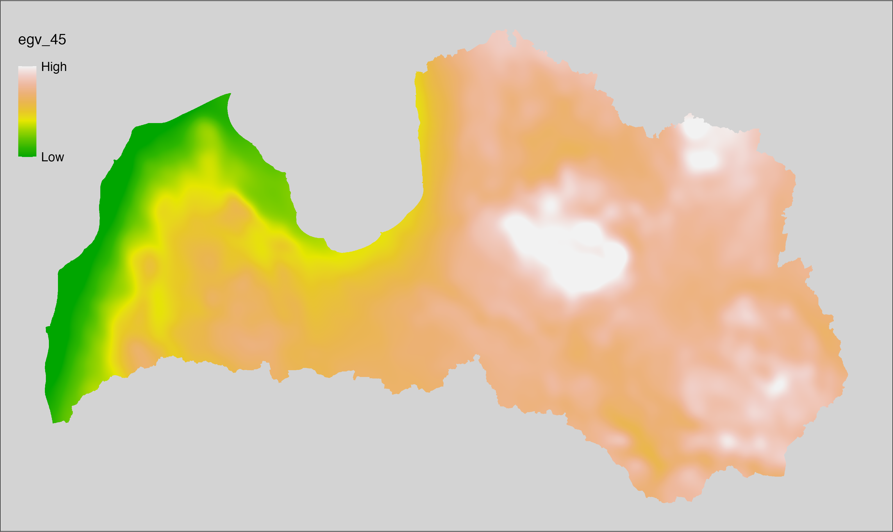


## Climate_CHELSAv2.1-lgd_cell	{#ch06.046}

**filename:** `Climate_CHELSAv2.1-lgd_cell.tif`	

**layername:** `egv_46`	

**English name:** Last day of the growing season (TREELIM) (CHELSA v2.1) within the analysis cell (1 ha)

**Latvian name:** Pēdējā veģetācijas sezonas diena (TREELIM) (CHELSA v2.1) analīzes šūnā (1 ha)

**Procedure:** Directly follows [CHELSA v2.1](#Ch04.11). EGV is prepared with the 
workflow `egvtools::downscale2egv()` with inverse distance weighted (power = 2) 
gap filling and soft smoothing (power = 0.5) over 5 km radius of every cell.


``` r
# libs ----
if(!require(egvtools)) {remotes::install_github("aavotins/egvtools"); require(egvtools)}

# job ----

localname="Climate_CHELSAv2.1-lgd_cell.tif"
layername="egv_46"
reading="./Geodata/2024/CHELSA/Climate_CHELSAv2.1-lgd_cell.tif"

df <- downscale2egv(
  template_path = "./Templates/TemplateRasters/LV100m_10km.tif",
  grid_path     = "./Templates/TemplateGrids/tikls1km_sauzeme.parquet",
  rawfile_path  = reading,
  out_path      = "./RasterGrids_100m/2024/RAW/",
  file_name     = localname,
  layer_name    = layername,
  fill_gaps     = TRUE,
  smooth        = TRUE,
  smooth_radius_km = 5,
  plot_result   = TRUE)
print(df)
```


## Climate_CHELSAv2.1-ngd0_cell	{#ch06.047}

**filename:** `Climate_CHELSAv2.1-ngd0_cell.tif`	

**layername:** `egv_47`	

**English name:** Number of days at which 2m air temperature > 0°C (CHELSA v2.1) within the analysis cell (1 ha)

**Latvian name:** Dienu skaits, kurā gaisa temperatūra 2 m augstumā pārsniedz 0°C (CHELSA v2.1) analīzes šūnā (1 ha)

**Procedure:** Directly follows [CHELSA v2.1](#Ch04.11). EGV is prepared with the 
workflow `egvtools::downscale2egv()` with inverse distance weighted (power = 2) 
gap filling and soft smoothing (power = 0.5) over 5 km radius of every cell.


``` r
# libs ----
if(!require(egvtools)) {remotes::install_github("aavotins/egvtools"); require(egvtools)}

# job ----

localname="Climate_CHELSAv2.1-ngd0_cell.tif"
layername="egv_47"
reading="./Geodata/2024/CHELSA/Climate_CHELSAv2.1-ngd0_cell.tif"

df <- downscale2egv(
  template_path = "./Templates/TemplateRasters/LV100m_10km.tif",
  grid_path     = "./Templates/TemplateGrids/tikls1km_sauzeme.parquet",
  rawfile_path  = reading,
  out_path      = "./RasterGrids_100m/2024/RAW/",
  file_name     = localname,
  layer_name    = layername,
  fill_gaps     = TRUE,
  smooth        = TRUE,
  smooth_radius_km = 5,
  plot_result   = TRUE)
print(df)
```

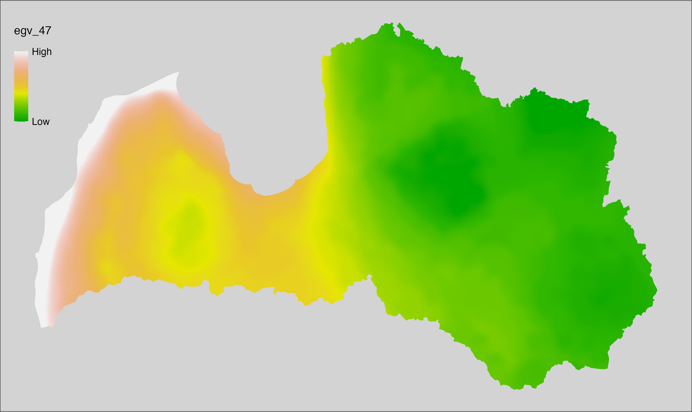


## Climate_CHELSAv2.1-ngd10_cell	{#ch06.048}

**filename:** `Climate_CHELSAv2.1-ngd10_cell.tif`	

**layername:** `egv_48`	

**English name:** Number of days at which 2m air temperature > 10°C (CHELSA v2.1) within the analysis cell (1 ha)

**Latvian name:** Dienu skaits, kurā gaisa temperatūra 2 m augstumā pārsniedz 10°C (CHELSA v2.1) analīzes šūnā (1 ha)

**Procedure:** Directly follows [CHELSA v2.1](#Ch04.11). EGV is prepared with the 
workflow `egvtools::downscale2egv()` with inverse distance weighted (power = 2) 
gap filling and soft smoothing (power = 0.5) over 5 km radius of every cell.


``` r
# libs ----
if(!require(egvtools)) {remotes::install_github("aavotins/egvtools"); require(egvtools)}

# job ----

localname="Climate_CHELSAv2.1-ngd10_cell.tif"
layername="egv_48"
reading="./Geodata/2024/CHELSA/Climate_CHELSAv2.1-ngd10_cell.tif"

df <- downscale2egv(
  template_path = "./Templates/TemplateRasters/LV100m_10km.tif",
  grid_path     = "./Templates/TemplateGrids/tikls1km_sauzeme.parquet",
  rawfile_path  = reading,
  out_path      = "./RasterGrids_100m/2024/RAW/",
  file_name     = localname,
  layer_name    = layername,
  fill_gaps     = TRUE,
  smooth        = TRUE,
  smooth_radius_km = 5,
  plot_result   = TRUE)
print(df)
```

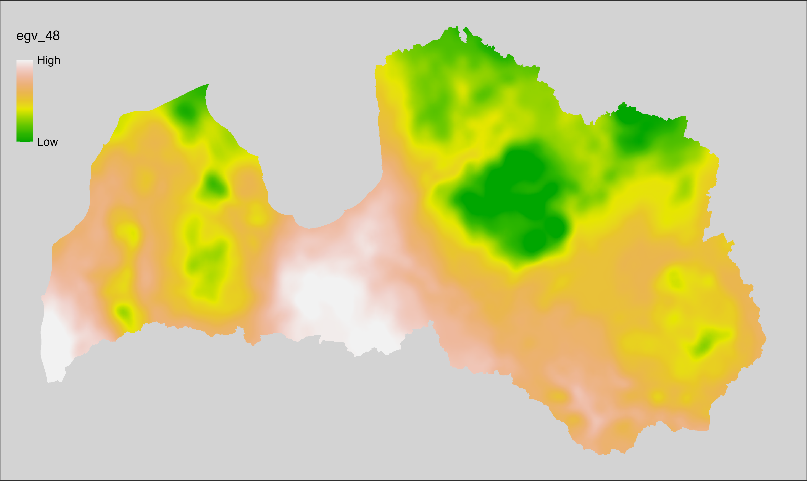


## Climate_CHELSAv2.1-ngd5_cell	{#ch06.049}

**filename:** `Climate_CHELSAv2.1-ngd5_cell.tif`	

**layername:** `egv_49`	

**English name:** Number of days at which 2m air temperature > 5°C (CHELSA v2.1) within the analysis cell (1 ha)

**Latvian name:** Dienu skaits, kurā gaisa temperatūra 2 m augstumā pārsniedz 5°C (CHELSA v2.1) analīzes šūnā (1 ha)

**Procedure:** Directly follows [CHELSA v2.1](#Ch04.11). EGV is prepared with the 
workflow `egvtools::downscale2egv()` with inverse distance weighted (power = 2) 
gap filling and soft smoothing (power = 0.5) over 5 km radius of every cell.


``` r
# libs ----
if(!require(egvtools)) {remotes::install_github("aavotins/egvtools"); require(egvtools)}

# job ----

localname="Climate_CHELSAv2.1-ngd5_cell.tif"
layername="egv_49"
reading="./Geodata/2024/CHELSA/Climate_CHELSAv2.1-ngd5_cell.tif"

df <- downscale2egv(
  template_path = "./Templates/TemplateRasters/LV100m_10km.tif",
  grid_path     = "./Templates/TemplateGrids/tikls1km_sauzeme.parquet",
  rawfile_path  = reading,
  out_path      = "./RasterGrids_100m/2024/RAW/",
  file_name     = localname,
  layer_name    = layername,
  fill_gaps     = TRUE,
  smooth        = TRUE,
  smooth_radius_km = 5,
  plot_result   = TRUE)
print(df)
```

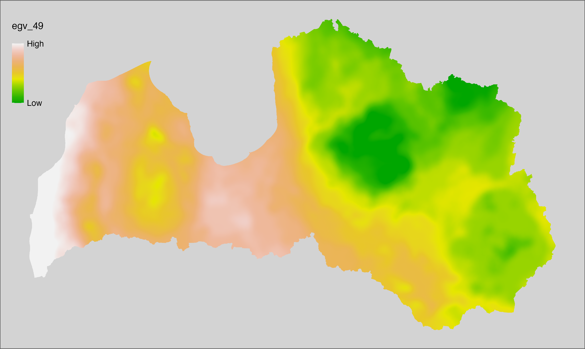


## Climate_CHELSAv2.1-npp_cell	{#ch06.050}

**filename:** `Climate_CHELSAv2.1-npp_cell.tif`	

**layername:** `egv_50`	

**English name:** Net primary productivity (g C m⁻² year⁻¹) (CHELSA v2.1) within the analysis cell (1 ha)

**Latvian name:** Neto primārā produkcija (g C m⁻² year⁻¹) (CHELSA v2.1) analīzes šūnā (1 ha)

**Procedure:** Directly follows [CHELSA v2.1](#Ch04.11). EGV is prepared with the 
workflow `egvtools::downscale2egv()` with inverse distance weighted (power = 2) 
gap filling and soft smoothing (power = 0.5) over 5 km radius of every cell.


``` r
# libs ----
if(!require(egvtools)) {remotes::install_github("aavotins/egvtools"); require(egvtools)}

# job ----

localname="Climate_CHELSAv2.1-npp_cell.tif"
layername="egv_50"
reading="./Geodata/2024/CHELSA/Climate_CHELSAv2.1-npp_cell.tif"

df <- downscale2egv(
  template_path = "./Templates/TemplateRasters/LV100m_10km.tif",
  grid_path     = "./Templates/TemplateGrids/tikls1km_sauzeme.parquet",
  rawfile_path  = reading,
  out_path      = "./RasterGrids_100m/2024/RAW/",
  file_name     = localname,
  layer_name    = layername,
  fill_gaps     = TRUE,
  smooth        = TRUE,
  smooth_radius_km = 5,
  plot_result   = TRUE)
print(df)
```

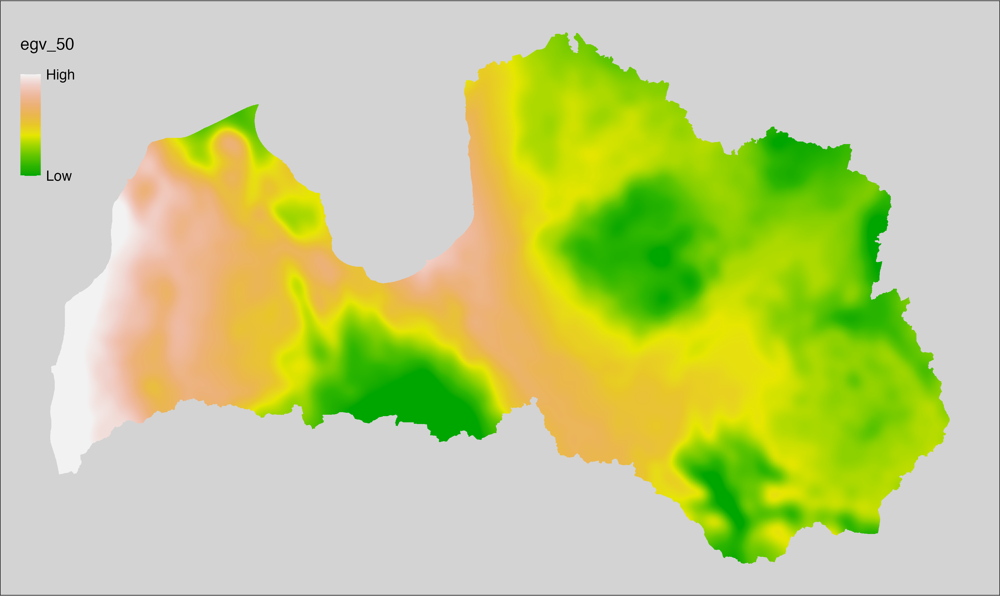


## Climate_CHELSAv2.1-pet-penman-max_cell	{#ch06.051}

**filename:** `Climate_CHELSAv2.1-pet-penman-max_cell.tif`	

**layername:** `egv_51`	

**English name:** Maximum monthly potential evapotranspiration (kg m⁻² month⁻¹) (CHELSA v2.1) within the analysis cell (1 ha)

**Latvian name:** Maksimālā mēneša potenciālā evapotranspirācija (kg m⁻² month⁻¹) (CHELSA v2.1) analīzes šūnā (1 ha)

**Procedure:** Directly follows [CHELSA v2.1](#Ch04.11). EGV is prepared with the 
workflow `egvtools::downscale2egv()` with inverse distance weighted (power = 2) 
gap filling and soft smoothing (power = 0.5) over 5 km radius of every cell.


``` r
# libs ----
if(!require(egvtools)) {remotes::install_github("aavotins/egvtools"); require(egvtools)}

# job ----

localname="Climate_CHELSAv2.1-pet-penman-max_cell.tif"
layername="egv_51"
reading="./Geodata/2024/CHELSA/Climate_CHELSAv2.1-pet-penman-max_cell.tif"

df <- downscale2egv(
  template_path = "./Templates/TemplateRasters/LV100m_10km.tif",
  grid_path     = "./Templates/TemplateGrids/tikls1km_sauzeme.parquet",
  rawfile_path  = reading,
  out_path      = "./RasterGrids_100m/2024/RAW/",
  file_name     = localname,
  layer_name    = layername,
  fill_gaps     = TRUE,
  smooth        = TRUE,
  smooth_radius_km = 5,
  plot_result   = TRUE)
print(df)
```

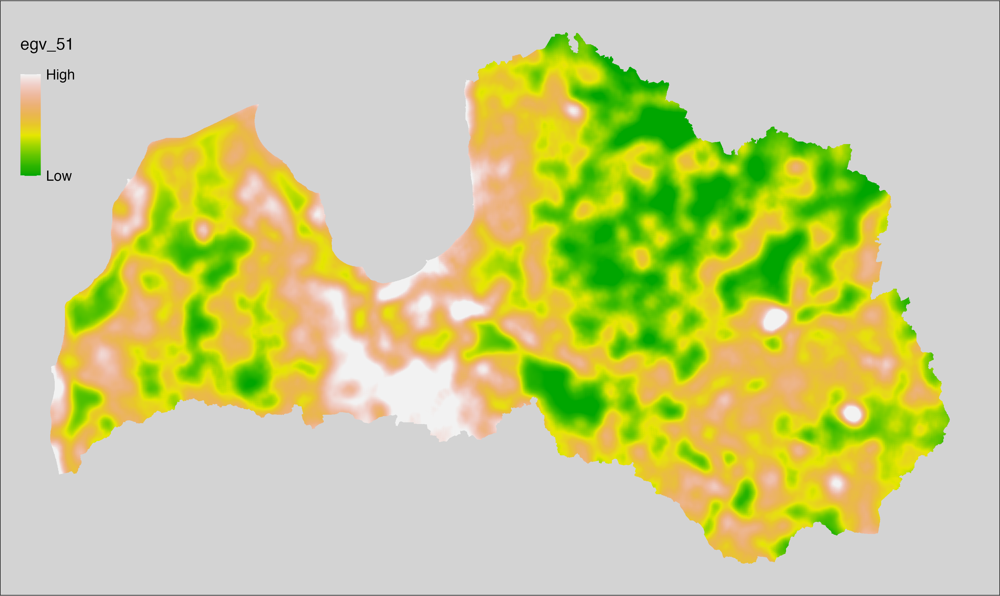


## Climate_CHELSAv2.1-pet-penman-mean_cell	{#ch06.052}

**filename:** `Climate_CHELSAv2.1-pet-penman-mean_cell.tif`	

**layername:** `egv_52`	

**English name:** Mean monthly potential evapotranspiration (kg m⁻² month⁻¹) (CHELSA v2.1) within the analysis cell (1 ha)

**Latvian name:** Vidējā mēneša potenciālā evapotranspirācija (kg m⁻² month⁻¹) (CHELSA v2.1) analīzes šūnā (1 ha)

**Procedure:** Directly follows [CHELSA v2.1](#Ch04.11). EGV is prepared with the 
workflow `egvtools::downscale2egv()` with inverse distance weighted (power = 2) 
gap filling and soft smoothing (power = 0.5) over 5 km radius of every cell.


``` r
# libs ----
if(!require(egvtools)) {remotes::install_github("aavotins/egvtools"); require(egvtools)}

# job ----

localname="Climate_CHELSAv2.1-pet-penman-mean_cell.tif"
layername="egv_52"
reading="./Geodata/2024/CHELSA/Climate_CHELSAv2.1-pet-penman-mean_cell.tif"

df <- downscale2egv(
  template_path = "./Templates/TemplateRasters/LV100m_10km.tif",
  grid_path     = "./Templates/TemplateGrids/tikls1km_sauzeme.parquet",
  rawfile_path  = reading,
  out_path      = "./RasterGrids_100m/2024/RAW/",
  file_name     = localname,
  layer_name    = layername,
  fill_gaps     = TRUE,
  smooth        = TRUE,
  smooth_radius_km = 5,
  plot_result   = TRUE)
print(df)
```

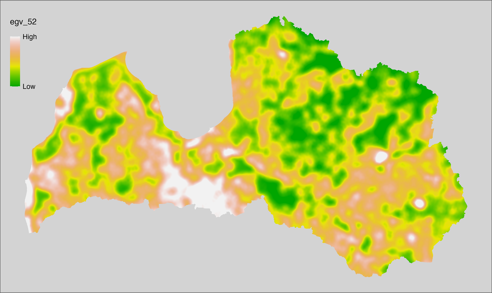


## Climate_CHELSAv2.1-pet-penman-min_cell	{#ch06.053}

**filename:** `Climate_CHELSAv2.1-pet-penman-min_cell.tif`	

**layername:** `egv_53`	

**English name:** Minimum monthly potential evapotranspiration (kg m⁻² month⁻¹) (CHELSA v2.1) within the analysis cell (1 ha)

**Latvian name:** Minimālā mēneša vidējā potenciālā evapotranspirācija (kg m⁻² month⁻¹) (CHELSA v2.1) analīzes šūnā (1 ha)

**Procedure:** Directly follows [CHELSA v2.1](#Ch04.11). EGV is prepared with the 
workflow `egvtools::downscale2egv()` with inverse distance weighted (power = 2) 
gap filling and soft smoothing (power = 0.5) over 5 km radius of every cell.


``` r
# libs ----
if(!require(egvtools)) {remotes::install_github("aavotins/egvtools"); require(egvtools)}

# job ----

localname="Climate_CHELSAv2.1-pet-penman-min_cell.tif"
layername="egv_53"
reading="./Geodata/2024/CHELSA/Climate_CHELSAv2.1-pet-penman-min_cell.tif"

df <- downscale2egv(
  template_path = "./Templates/TemplateRasters/LV100m_10km.tif",
  grid_path     = "./Templates/TemplateGrids/tikls1km_sauzeme.parquet",
  rawfile_path  = reading,
  out_path      = "./RasterGrids_100m/2024/RAW/",
  file_name     = localname,
  layer_name    = layername,
  fill_gaps     = TRUE,
  smooth        = TRUE,
  smooth_radius_km = 5,
  plot_result   = TRUE)
print(df)
```

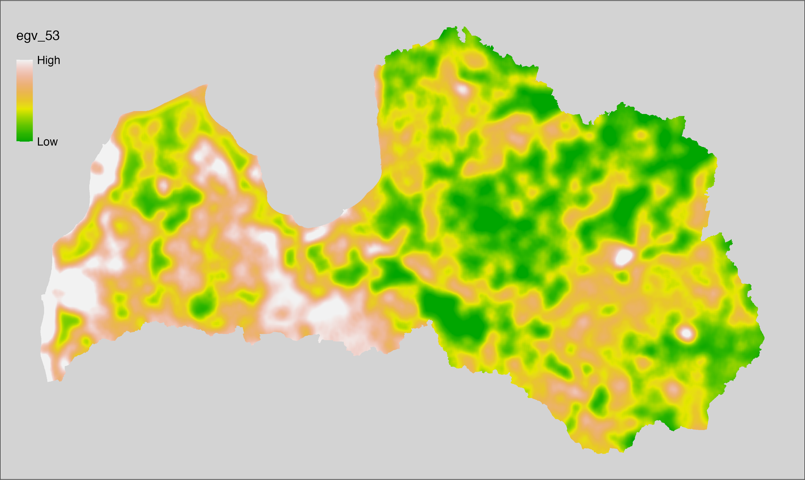


## Climate_CHELSAv2.1-pet-penman-range_cell	{#ch06.054}

**filename:** `Climate_CHELSAv2.1-pet-penman-range_cell.tif`	

**layername:** `egv_54`	

**English name:** Annual range of monthly potential evapotranspiration (kg m⁻² month⁻¹) (CHELSA v2.1) within the analysis cell (1 ha)

**Latvian name:** Gada potenciālā evapotranspirācijas amplitūda (kg m⁻² month⁻¹) (CHELSA v2.1) analīzes šūnā (1 ha)

**Procedure:** Directly follows [CHELSA v2.1](#Ch04.11). EGV is prepared with the 
workflow `egvtools::downscale2egv()` with inverse distance weighted (power = 2) 
gap filling and soft smoothing (power = 0.5) over 5 km radius of every cell.


``` r
# libs ----
if(!require(egvtools)) {remotes::install_github("aavotins/egvtools"); require(egvtools)}

# job ----

localname="Climate_CHELSAv2.1-pet-penman-range_cell.tif"
layername="egv_54"
reading="./Geodata/2024/CHELSA/Climate_CHELSAv2.1-pet-penman-range_cell.tif"

df <- downscale2egv(
  template_path = "./Templates/TemplateRasters/LV100m_10km.tif",
  grid_path     = "./Templates/TemplateGrids/tikls1km_sauzeme.parquet",
  rawfile_path  = reading,
  out_path      = "./RasterGrids_100m/2024/RAW/",
  file_name     = localname,
  layer_name    = layername,
  fill_gaps     = TRUE,
  smooth        = TRUE,
  smooth_radius_km = 5,
  plot_result   = TRUE)
print(df)
```

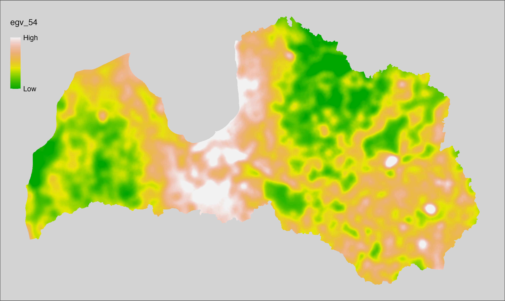


## Climate_CHELSAv2.1-rsds-max_cell	{#ch06.055}

**filename:** `Climate_CHELSAv2.1-rsds-max_cell.tif`	

**layername:** `egv_55`	

**English name:** Maximum monthly surface downwelling shortwave flux in air (MJ m⁻² d⁻¹) (CHELSA v2.1) within the analysis cell (1 ha)

**Latvian name:** Maksimālā mēneša vidējā Zemes virsmu sasniedzošā saules radiācija (MJ m⁻² d⁻¹) (CHELSA v2.1) analīzes šūnā (1 ha)

**Procedure:** Directly follows [CHELSA v2.1](#Ch04.11). EGV is prepared with the 
workflow `egvtools::downscale2egv()` with inverse distance weighted (power = 2) 
gap filling and soft smoothing (power = 0.5) over 5 km radius of every cell.


``` r
# libs ----
if(!require(egvtools)) {remotes::install_github("aavotins/egvtools"); require(egvtools)}

# job ----

localname="Climate_CHELSAv2.1-rsds-max_cell.tif"
layername="egv_55"
reading="./Geodata/2024/CHELSA/Climate_CHELSAv2.1-rsds-max_cell.tif"

df <- downscale2egv(
  template_path = "./Templates/TemplateRasters/LV100m_10km.tif",
  grid_path     = "./Templates/TemplateGrids/tikls1km_sauzeme.parquet",
  rawfile_path  = reading,
  out_path      = "./RasterGrids_100m/2024/RAW/",
  file_name     = localname,
  layer_name    = layername,
  fill_gaps     = TRUE,
  smooth        = TRUE,
  smooth_radius_km = 5,
  plot_result   = TRUE)
print(df)
```

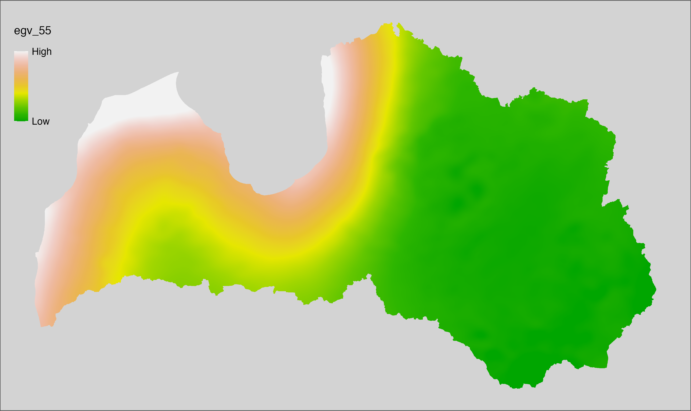


## Climate_CHELSAv2.1-rsds-mean_cell	{#ch06.056}

**filename:** `Climate_CHELSAv2.1-rsds-mean_cell.tif`	

**layername:** `egv_56`	

**English name:** Mean monthly surface downwelling shortwave flux in air (MJ m⁻² d⁻¹) (CHELSA v2.1) within the analysis cell (1 ha)

**Latvian name:** Vidējā Zemes virsmu sasniedzošā saules radiācija (MJ m⁻² d⁻¹) (CHELSA v2.1) analīzes šūnā (1 ha)

**Procedure:** Directly follows [CHELSA v2.1](#Ch04.11). EGV is prepared with the 
workflow `egvtools::downscale2egv()` with inverse distance weighted (power = 2) 
gap filling and soft smoothing (power = 0.5) over 5 km radius of every cell.


``` r
# libs ----
if(!require(egvtools)) {remotes::install_github("aavotins/egvtools"); require(egvtools)}

# job ----

localname="Climate_CHELSAv2.1-rsds-mean_cell.tif"
layername="egv_56"
reading="./Geodata/2024/CHELSA/Climate_CHELSAv2.1-rsds-mean_cell.tif"

df <- downscale2egv(
  template_path = "./Templates/TemplateRasters/LV100m_10km.tif",
  grid_path     = "./Templates/TemplateGrids/tikls1km_sauzeme.parquet",
  rawfile_path  = reading,
  out_path      = "./RasterGrids_100m/2024/RAW/",
  file_name     = localname,
  layer_name    = layername,
  fill_gaps     = TRUE,
  smooth        = TRUE,
  smooth_radius_km = 5,
  plot_result   = TRUE)
print(df)
```

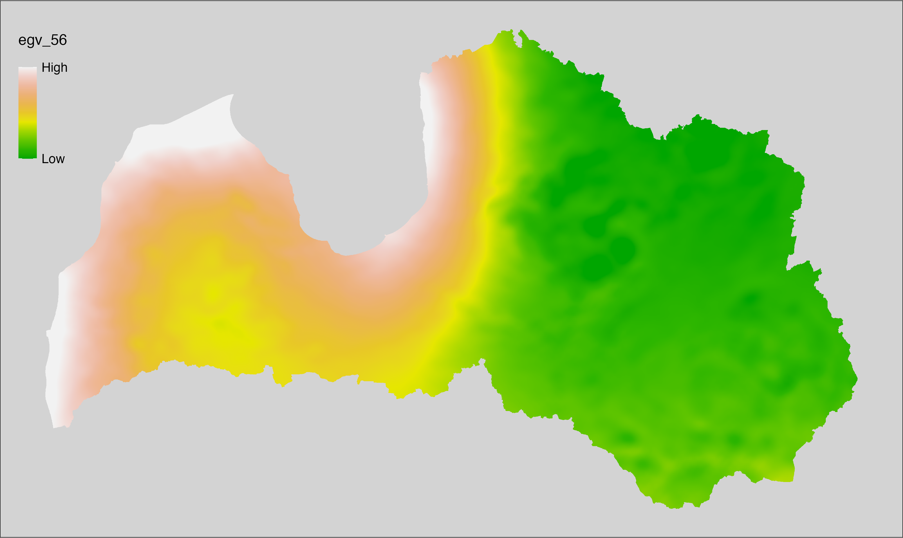


## Climate_CHELSAv2.1-rsds-min_cell	{#ch06.057}

**filename:** `Climate_CHELSAv2.1-rsds-min_cell.tif`	

**layername:** `egv_57`	

**English name:** Minimum monthly surface shortwave flux in air (MJ m⁻² d⁻¹) (CHELSA v2.1) within the analysis cell (1 ha)

**Latvian name:** Minimālā mēneša vidējā Zemes virsmu sasniedzošā saules radiācija (MJ m⁻² d⁻¹) (CHELSA v2.1) analīzes šūnā (1 ha)

**Procedure:** Directly follows [CHELSA v2.1](#Ch04.11). EGV is prepared with the 
workflow `egvtools::downscale2egv()` with inverse distance weighted (power = 2) 
gap filling and soft smoothing (power = 0.5) over 5 km radius of every cell.


``` r
# libs ----
if(!require(egvtools)) {remotes::install_github("aavotins/egvtools"); require(egvtools)}

# job ----

localname="Climate_CHELSAv2.1-rsds-min_cell.tif"
layername="egv_57"
reading="./Geodata/2024/CHELSA/Climate_CHELSAv2.1-rsds-min_cell.tif"

df <- downscale2egv(
  template_path = "./Templates/TemplateRasters/LV100m_10km.tif",
  grid_path     = "./Templates/TemplateGrids/tikls1km_sauzeme.parquet",
  rawfile_path  = reading,
  out_path      = "./RasterGrids_100m/2024/RAW/",
  file_name     = localname,
  layer_name    = layername,
  fill_gaps     = TRUE,
  smooth        = TRUE,
  smooth_radius_km = 5,
  plot_result   = TRUE)
print(df)
```

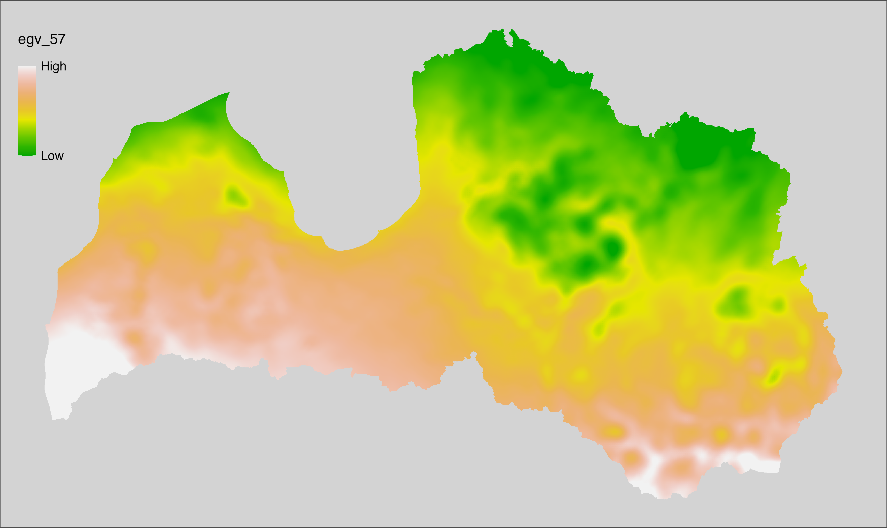


## Climate_CHELSAv2.1-rsds-range_cell	{#ch06.058}

**filename:** `Climate_CHELSAv2.1-rsds-range_cell.tif`	

**layername:** `egv_58`	

**English name:** Annual range of monthly surface downwelling shortwave flux in air (MJ m⁻² d⁻¹) (CHELSA v2.1) within the analysis cell (1 ha)

**Latvian name:** Gada amplitūda Zemes virsmu sasniedzošajai saules radiācijai (MJ m⁻² d⁻¹) (CHELSA v2.1) analīzes šūnā (1 ha)

**Procedure:** Directly follows [CHELSA v2.1](#Ch04.11). EGV is prepared with the 
workflow `egvtools::downscale2egv()` with inverse distance weighted (power = 2) 
gap filling and soft smoothing (power = 0.5) over 5 km radius of every cell.


``` r
# libs ----
if(!require(egvtools)) {remotes::install_github("aavotins/egvtools"); require(egvtools)}

# job ----

localname="Climate_CHELSAv2.1-rsds-range_cell.tif"
layername="egv_58"
reading="./Geodata/2024/CHELSA/Climate_CHELSAv2.1-rsds-range_cell.tif"

df <- downscale2egv(
  template_path = "./Templates/TemplateRasters/LV100m_10km.tif",
  grid_path     = "./Templates/TemplateGrids/tikls1km_sauzeme.parquet",
  rawfile_path  = reading,
  out_path      = "./RasterGrids_100m/2024/RAW/",
  file_name     = localname,
  layer_name    = layername,
  fill_gaps     = TRUE,
  smooth        = TRUE,
  smooth_radius_km = 5,
  plot_result   = TRUE)
print(df)
```

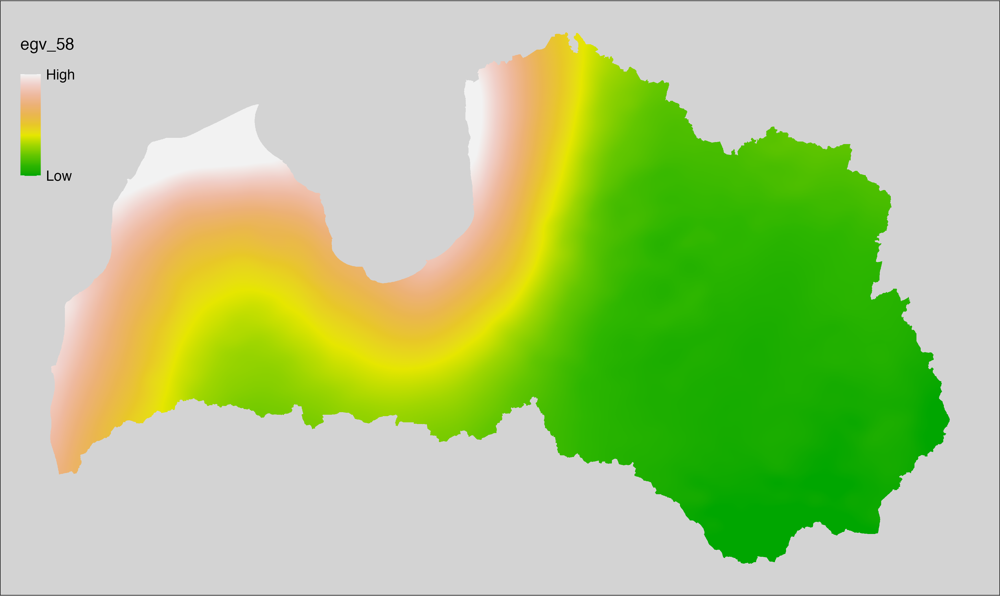


## Climate_CHELSAv2.1-scd_cell	{#ch06.059}

**filename:** `Climate_CHELSAv2.1-scd_cell.tif`	

**layername:** `egv_59`	

**English name:** Number of days with snow cover (TREELIM) (CHELSA v2.1) within the analysis cell (1 ha)

**Latvian name:** Dienu ar sniega segu skaits (TREELIM) (CHELSA v2.1) analīzes šūnā (1 ha)

**Procedure:** Directly follows [CHELSA v2.1](#Ch04.11). EGV is prepared with the 
workflow `egvtools::downscale2egv()` with inverse distance weighted (power = 2) 
gap filling and soft smoothing (power = 0.5) over 5 km radius of every cell.


``` r
# libs ----
if(!require(egvtools)) {remotes::install_github("aavotins/egvtools"); require(egvtools)}

# job ----

localname="Climate_CHELSAv2.1-scd_cell.tif"
layername="egv_59"
reading="./Geodata/2024/CHELSA/Climate_CHELSAv2.1-scd_cell.tif"

df <- downscale2egv(
  template_path = "./Templates/TemplateRasters/LV100m_10km.tif",
  grid_path     = "./Templates/TemplateGrids/tikls1km_sauzeme.parquet",
  rawfile_path  = reading,
  out_path      = "./RasterGrids_100m/2024/RAW/",
  file_name     = localname,
  layer_name    = layername,
  fill_gaps     = TRUE,
  smooth        = TRUE,
  smooth_radius_km = 5,
  plot_result   = TRUE)
print(df)
```

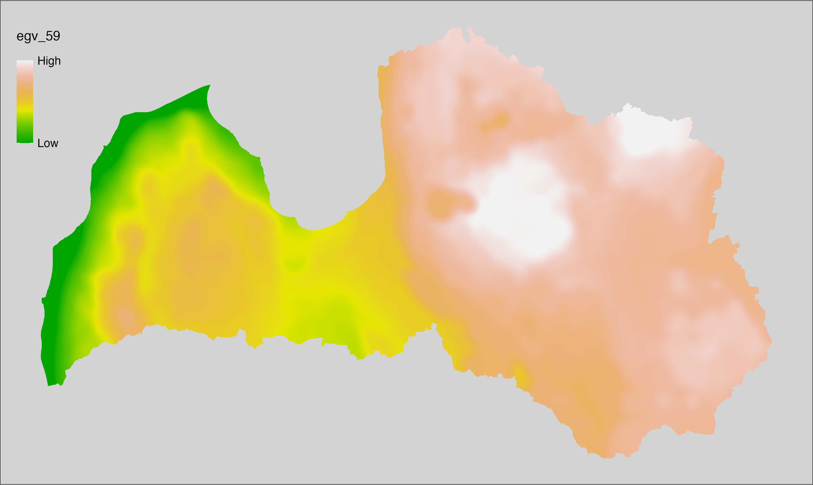


## Climate_CHELSAv2.1-sfcWind-max_cell	{#ch06.060}

**filename:** `Climate_CHELSAv2.1-sfcWind-max_cell.tif`	

**layername:** `egv_60`	

**English name:** Maximum monthly near-surface wind speed (m s⁻¹) (CHELSA v2.1) within the analysis cell (1 ha)

**Latvian name:** Maksimālais mēneša vidējais piezemes slāņa vēja ātrums (m s⁻¹) (CHELSA v2.1) analīzes šūnā (1 ha)

**Procedure:** Directly follows [CHELSA v2.1](#Ch04.11). EGV is prepared with the 
workflow `egvtools::downscale2egv()` with inverse distance weighted (power = 2) 
gap filling and soft smoothing (power = 0.5) over 5 km radius of every cell.


``` r
# libs ----
if(!require(egvtools)) {remotes::install_github("aavotins/egvtools"); require(egvtools)}

# job ----

localname="Climate_CHELSAv2.1-sfcWind-max_cell.tif"
layername="egv_60"
reading="./Geodata/2024/CHELSA/Climate_CHELSAv2.1-sfcWind-max_cell.tif"

df <- downscale2egv(
  template_path = "./Templates/TemplateRasters/LV100m_10km.tif",
  grid_path     = "./Templates/TemplateGrids/tikls1km_sauzeme.parquet",
  rawfile_path  = reading,
  out_path      = "./RasterGrids_100m/2024/RAW/",
  file_name     = localname,
  layer_name    = layername,
  fill_gaps     = TRUE,
  smooth        = TRUE,
  smooth_radius_km = 5,
  plot_result   = TRUE)
print(df)
```

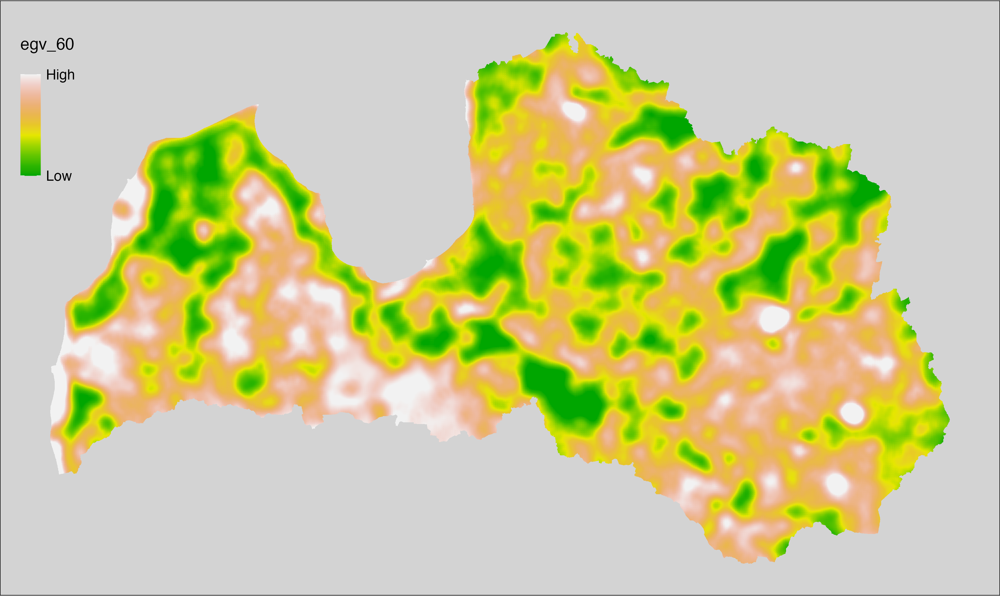


## Climate_CHELSAv2.1-sfcWind-mean_cell	{#ch06.061}

**filename:** `Climate_CHELSAv2.1-sfcWind-mean_cell.tif`	

**layername:** `egv_61`	

**English name:** Mean monthly near-surface wind speed (m s⁻¹) (CHELSA v2.1) within the analysis cell (1 ha)

**Latvian name:** Vidējais piezemes slāņa vēja ātrums (m s⁻¹) (CHELSA v2.1) analīzes šūnā (1 ha)

**Procedure:** Directly follows [CHELSA v2.1](#Ch04.11). EGV is prepared with the 
workflow `egvtools::downscale2egv()` with inverse distance weighted (power = 2) 
gap filling and soft smoothing (power = 0.5) over 5 km radius of every cell.


``` r
# libs ----
if(!require(egvtools)) {remotes::install_github("aavotins/egvtools"); require(egvtools)}

# job ----

localname="Climate_CHELSAv2.1-sfcWind-mean_cell.tif"
layername="egv_61"
reading="./Geodata/2024/CHELSA/Climate_CHELSAv2.1-sfcWind-mean_cell.tif"

df <- downscale2egv(
  template_path = "./Templates/TemplateRasters/LV100m_10km.tif",
  grid_path     = "./Templates/TemplateGrids/tikls1km_sauzeme.parquet",
  rawfile_path  = reading,
  out_path      = "./RasterGrids_100m/2024/RAW/",
  file_name     = localname,
  layer_name    = layername,
  fill_gaps     = TRUE,
  smooth        = TRUE,
  smooth_radius_km = 5,
  plot_result   = TRUE)
print(df)
```

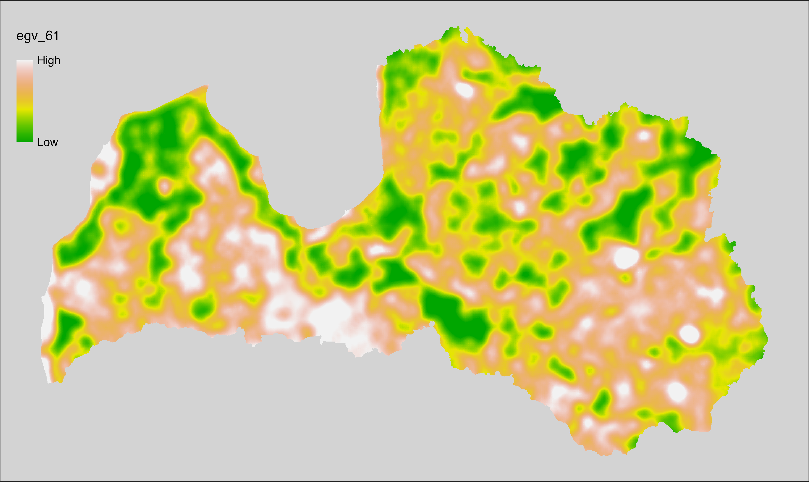


## Climate_CHELSAv2.1-sfcWind-min_cell	{#ch06.062}

**filename:** `Climate_CHELSAv2.1-sfcWind-min_cell.tif`	

**layername:** `egv_62`	

**English name:** Minimum monthly near-surface wind speed (m s⁻¹) (CHELSA v2.1) within the analysis cell (1 ha)

**Latvian name:** Minimālais mēneša vidējais piezemes slāņa vēja ātrums (m s⁻¹) (CHELSA v2.1) analīzes šūnā (1 ha)

**Procedure:** Directly follows [CHELSA v2.1](#Ch04.11). EGV is prepared with the 
workflow `egvtools::downscale2egv()` with inverse distance weighted (power = 2) 
gap filling and soft smoothing (power = 0.5) over 5 km radius of every cell.


``` r
# libs ----
if(!require(egvtools)) {remotes::install_github("aavotins/egvtools"); require(egvtools)}

# job ----

localname="Climate_CHELSAv2.1-sfcWind-min_cell.tif"
layername="egv_62"
reading="./Geodata/2024/CHELSA/Climate_CHELSAv2.1-sfcWind-min_cell.tif"

df <- downscale2egv(
  template_path = "./Templates/TemplateRasters/LV100m_10km.tif",
  grid_path     = "./Templates/TemplateGrids/tikls1km_sauzeme.parquet",
  rawfile_path  = reading,
  out_path      = "./RasterGrids_100m/2024/RAW/",
  file_name     = localname,
  layer_name    = layername,
  fill_gaps     = TRUE,
  smooth        = TRUE,
  smooth_radius_km = 5,
  plot_result   = TRUE)
print(df)
```

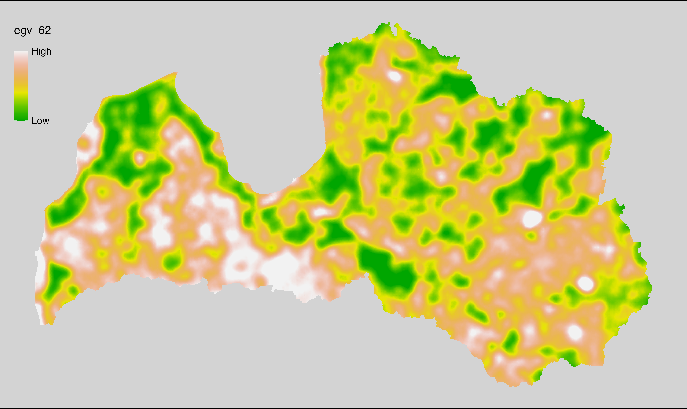


## Climate_CHELSAv2.1-sfcWind-range_cell	{#ch06.063}

**filename:** `Climate_CHELSAv2.1-sfcWind-range_cell.tif`	

**layername:** `egv_63`	

**English name:** Annual range of monthly near-surface wind speed (m s⁻¹) (CHELSA v2.1) within the analysis cell (1 ha)

**Latvian name:** Gada amplitūda vidējam piezemes slāņa vēja ātrumam (m s⁻¹) (CHELSA v2.1) analīzes šūnā (1 ha)

**Procedure:** Directly follows [CHELSA v2.1](#Ch04.11). EGV is prepared with the 
workflow `egvtools::downscale2egv()` with inverse distance weighted (power = 2) 
gap filling and soft smoothing (power = 0.5) over 5 km radius of every cell.


``` r
# libs ----
if(!require(egvtools)) {remotes::install_github("aavotins/egvtools"); require(egvtools)}

# job ----

localname="Climate_CHELSAv2.1-sfcWind-range_cell.tif"
layername="egv_63"
reading="./Geodata/2024/CHELSA/Climate_CHELSAv2.1-sfcWind-range_cell.tif"

df <- downscale2egv(
  template_path = "./Templates/TemplateRasters/LV100m_10km.tif",
  grid_path     = "./Templates/TemplateGrids/tikls1km_sauzeme.parquet",
  rawfile_path  = reading,
  out_path      = "./RasterGrids_100m/2024/RAW/",
  file_name     = localname,
  layer_name    = layername,
  fill_gaps     = TRUE,
  smooth        = TRUE,
  smooth_radius_km = 5,
  plot_result   = TRUE)
print(df)
```

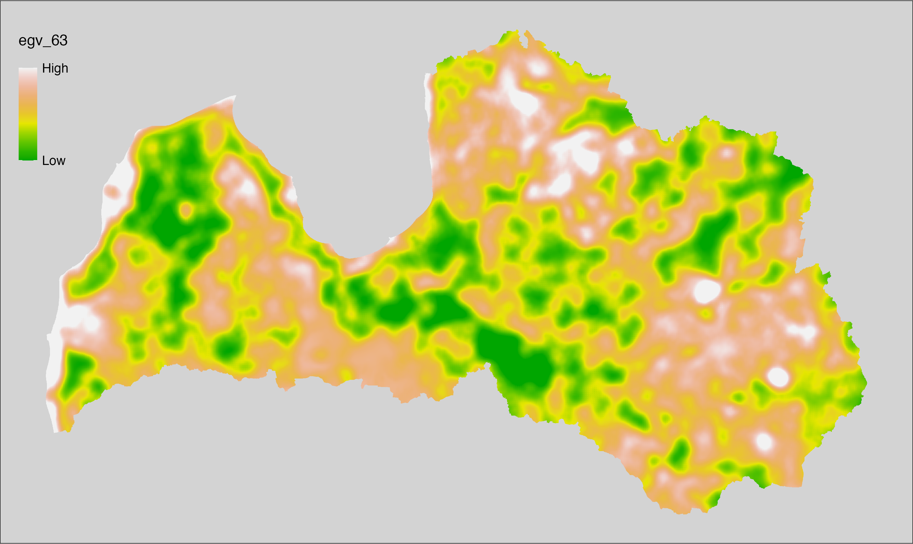


## Climate_CHELSAv2.1-swb_cell	{#ch06.064}

**filename:** `Climate_CHELSAv2.1-swb_cell.tif`	

**layername:** `egv_64`	

**English name:** Site water balance (kg m⁻² year⁻¹) (CHELSA v2.1) within the analysis cell (1 ha)

**Latvian name:** Ūdens bilance (kg m⁻² year⁻¹) (CHELSA v2.1) analīzes šūnā (1 ha)

**Procedure:** Directly follows [CHELSA v2.1](#Ch04.11). EGV is prepared with the 
workflow `egvtools::downscale2egv()` with inverse distance weighted (power = 2) 
gap filling and soft smoothing (power = 0.5) over 5 km radius of every cell.


``` r
# libs ----
if(!require(egvtools)) {remotes::install_github("aavotins/egvtools"); require(egvtools)}

# job ----

localname="Climate_CHELSAv2.1-swb_cell.tif"
layername="egv_64"
reading="./Geodata/2024/CHELSA/Climate_CHELSAv2.1-swb_cell.tif"

df <- downscale2egv(
  template_path = "./Templates/TemplateRasters/LV100m_10km.tif",
  grid_path     = "./Templates/TemplateGrids/tikls1km_sauzeme.parquet",
  rawfile_path  = reading,
  out_path      = "./RasterGrids_100m/2024/RAW/",
  file_name     = localname,
  layer_name    = layername,
  fill_gaps     = TRUE,
  smooth        = TRUE,
  smooth_radius_km = 5,
  plot_result   = TRUE)
print(df)
```

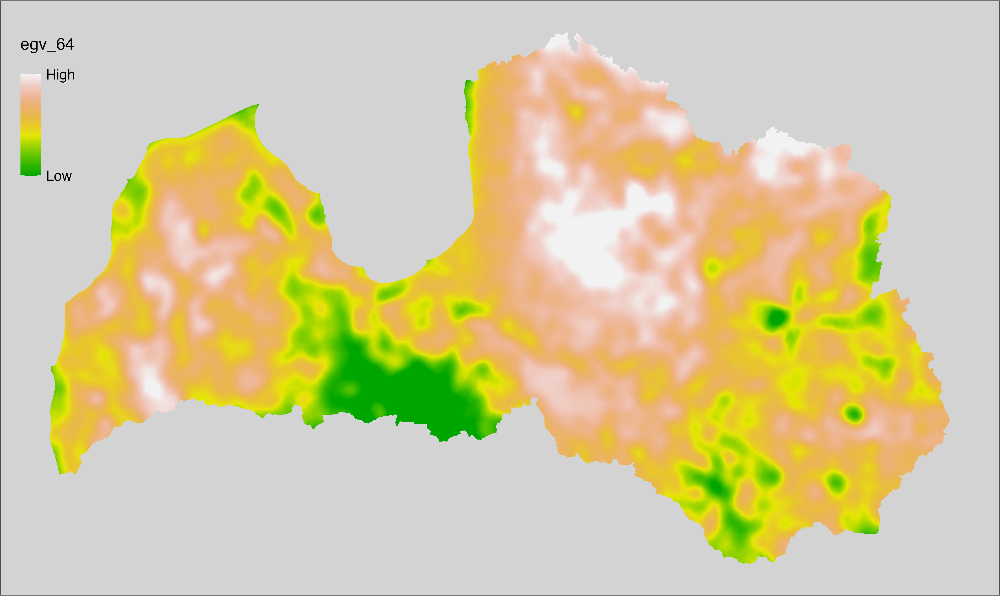


## Climate_CHELSAv2.1-swe_cell	{#ch06.065}

**filename:** `Climate_CHELSAv2.1-swe_cell.tif`	

**layername:** `egv_65`	

**English name:** Snow water equivalent (kg m⁻² year⁻¹) (CHELSA v2.1) within the analysis cell (1 ha)

**Latvian name:** Ūdens ekvivalents sniegā (kg m⁻² year⁻¹) (CHELSA v2.1) analīzes šūnā (1 ha)

**Procedure:** Directly follows [CHELSA v2.1](#Ch04.11). EGV is prepared with the 
workflow `egvtools::downscale2egv()` with inverse distance weighted (power = 2) 
gap filling and soft smoothing (power = 0.5) over 5 km radius of every cell.


``` r
# libs ----
if(!require(egvtools)) {remotes::install_github("aavotins/egvtools"); require(egvtools)}

# job ----

localname="Climate_CHELSAv2.1-swe_cell.tif"
layername="egv_65"
reading="./Geodata/2024/CHELSA/Climate_CHELSAv2.1-swe_cell.tif"

df <- downscale2egv(
  template_path = "./Templates/TemplateRasters/LV100m_10km.tif",
  grid_path     = "./Templates/TemplateGrids/tikls1km_sauzeme.parquet",
  rawfile_path  = reading,
  out_path      = "./RasterGrids_100m/2024/RAW/",
  file_name     = localname,
  layer_name    = layername,
  fill_gaps     = TRUE,
  smooth        = TRUE,
  smooth_radius_km = 5,
  plot_result   = TRUE)
print(df)
```

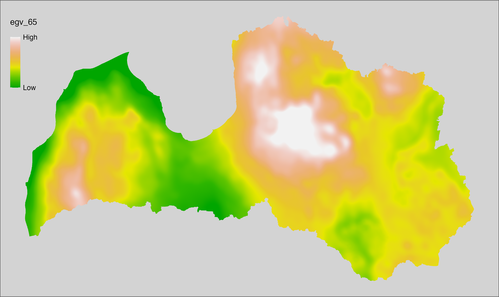


## Climate_CHELSAv2.1-vpd-max_cell	{#ch06.066}

**filename:** `Climate_CHELSAv2.1-vpd-max_cell.tif`	

**layername:** `egv_66`	

**English name:** Maximum monthly vapor pressure deficit (Pa) (CHELSA v2.1) within the analysis cell (1 ha)

**Latvian name:** Maksimālais mēneša vidējais iztvaikošanas spiediena deficīts (Pa) (CHELSA v2.1) analīzes šūnā (1 ha)

**Procedure:** Directly follows [CHELSA v2.1](#Ch04.11). EGV is prepared with the 
workflow `egvtools::downscale2egv()` with inverse distance weighted (power = 2) 
gap filling and soft smoothing (power = 0.5) over 5 km radius of every cell.


``` r
# libs ----
if(!require(egvtools)) {remotes::install_github("aavotins/egvtools"); require(egvtools)}

# job ----

localname="Climate_CHELSAv2.1-vpd-max_cell.tif"
layername="egv_66"
reading="./Geodata/2024/CHELSA/Climate_CHELSAv2.1-vpd-max_cell.tif"

df <- downscale2egv(
  template_path = "./Templates/TemplateRasters/LV100m_10km.tif",
  grid_path     = "./Templates/TemplateGrids/tikls1km_sauzeme.parquet",
  rawfile_path  = reading,
  out_path      = "./RasterGrids_100m/2024/RAW/",
  file_name     = localname,
  layer_name    = layername,
  fill_gaps     = TRUE,
  smooth        = TRUE,
  smooth_radius_km = 5,
  plot_result   = TRUE)
print(df)
```

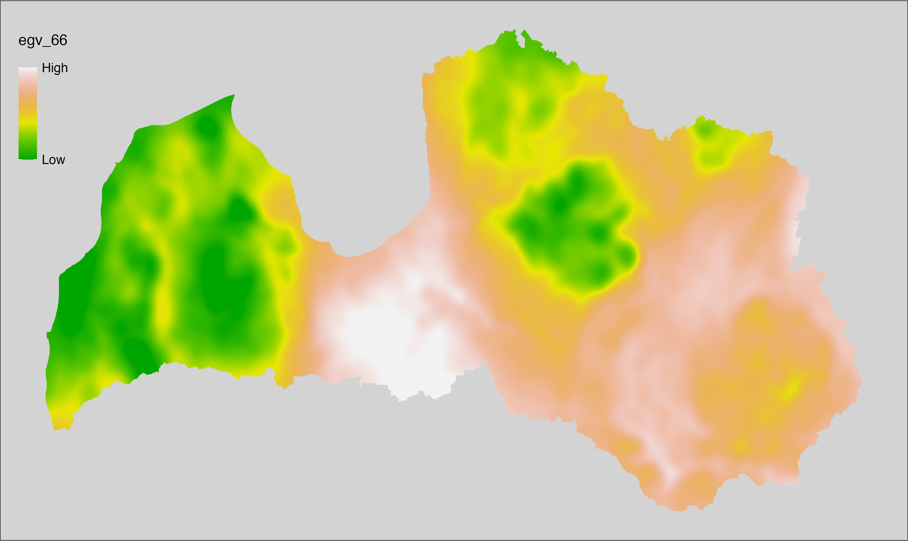


## Climate_CHELSAv2.1-vpd-mean_cell	{#ch06.067}

**filename:** `Climate_CHELSAv2.1-vpd-mean_cell.tif`	

**layername:** `egv_67`	

**English name:** Mean monthly vapor pressure deficit (Pa) (CHELSA v2.1) within the analysis cell (1 ha)

**Latvian name:** Vidējais iztvaikošanas spiediena deficīts (Pa) (CHELSA v2.1) analīzes šūnā (1 ha)

**Procedure:** Directly follows [CHELSA v2.1](#Ch04.11). EGV is prepared with the 
workflow `egvtools::downscale2egv()` with inverse distance weighted (power = 2) 
gap filling and soft smoothing (power = 0.5) over 5 km radius of every cell.


``` r
# libs ----
if(!require(egvtools)) {remotes::install_github("aavotins/egvtools"); require(egvtools)}

# job ----

localname="Climate_CHELSAv2.1-vpd-mean_cell.tif"
layername="egv_67"
reading="./Geodata/2024/CHELSA/Climate_CHELSAv2.1-vpd-mean_cell.tif"

df <- downscale2egv(
  template_path = "./Templates/TemplateRasters/LV100m_10km.tif",
  grid_path     = "./Templates/TemplateGrids/tikls1km_sauzeme.parquet",
  rawfile_path  = reading,
  out_path      = "./RasterGrids_100m/2024/RAW/",
  file_name     = localname,
  layer_name    = layername,
  fill_gaps     = TRUE,
  smooth        = TRUE,
  smooth_radius_km = 5,
  plot_result   = TRUE)
print(df)
```

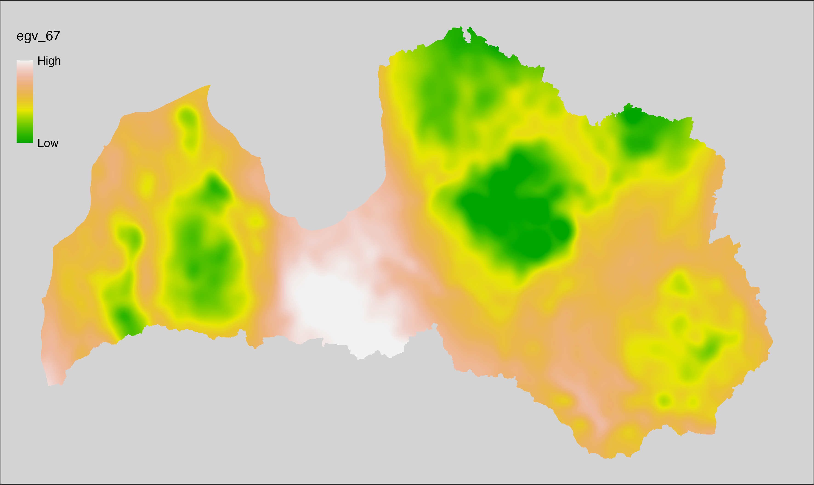


## Climate_CHELSAv2.1-vpd-min_cell	{#ch06.068}

**filename:** `Climate_CHELSAv2.1-vpd-min_cell.tif`	

**layername:** `egv_68`	

**English name:** Minimum monthly vapor pressure deficit (Pa) (CHELSA v2.1) within the analysis cell (1 ha)

**Latvian name:** Minimālais mēneša vidējais iztvaikošanas spiediena deficīts (Pa) (CHELSA v2.1) analīzes šūnā (1 ha)

**Procedure:** Directly follows [CHELSA v2.1](#Ch04.11). EGV is prepared with the 
workflow `egvtools::downscale2egv()` with inverse distance weighted (power = 2) 
gap filling and soft smoothing (power = 0.5) over 5 km radius of every cell.


``` r
# libs ----
if(!require(egvtools)) {remotes::install_github("aavotins/egvtools"); require(egvtools)}

# job ----

localname="Climate_CHELSAv2.1-vpd-min_cell.tif"
layername="egv_68"
reading="./Geodata/2024/CHELSA/Climate_CHELSAv2.1-vpd-min_cell.tif"

df <- downscale2egv(
  template_path = "./Templates/TemplateRasters/LV100m_10km.tif",
  grid_path     = "./Templates/TemplateGrids/tikls1km_sauzeme.parquet",
  rawfile_path  = reading,
  out_path      = "./RasterGrids_100m/2024/RAW/",
  file_name     = localname,
  layer_name    = layername,
  fill_gaps     = TRUE,
  smooth        = TRUE,
  smooth_radius_km = 5,
  plot_result   = TRUE)
print(df)
```

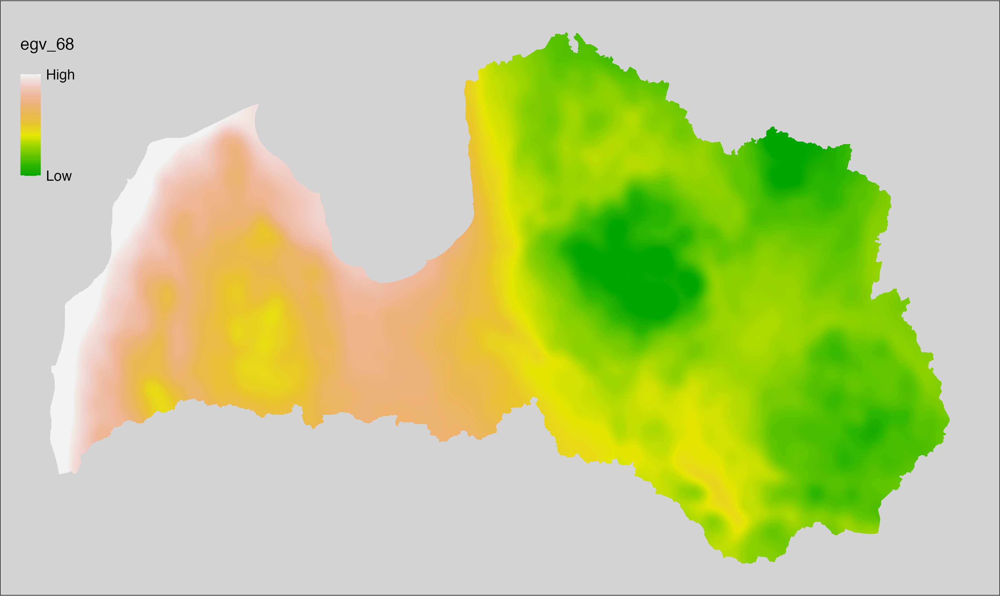


## Climate_CHELSAv2.1-vpd-range_cell	{#ch06.069}

**filename:** `Climate_CHELSAv2.1-vpd-range_cell.tif`	

**layername:** `egv_69`	

**English name:** Annual range of monthly vapor pressure deficit (Pa) (CHELSA v2.1) within the analysis cell (1 ha)

**Latvian name:** Gada iztvaikošanas spiediena deficīta amplitūda (Pa) (CHELSA v2.1) analīzes šūnā (1 ha)

**Procedure:** Directly follows [CHELSA v2.1](#Ch04.11). EGV is prepared with the 
workflow `egvtools::downscale2egv()` with inverse distance weighted (power = 2) 
gap filling and soft smoothing (power = 0.5) over 5 km radius of every cell.


``` r
# libs ----
if(!require(egvtools)) {remotes::install_github("aavotins/egvtools"); require(egvtools)}

# job ----

localname="Climate_CHELSAv2.1-vpd-range_cell.tif"
layername="egv_69"
reading="./Geodata/2024/CHELSA/Climate_CHELSAv2.1-vpd-range_cell.tif"

df <- downscale2egv(
  template_path = "./Templates/TemplateRasters/LV100m_10km.tif",
  grid_path     = "./Templates/TemplateGrids/tikls1km_sauzeme.parquet",
  rawfile_path  = reading,
  out_path      = "./RasterGrids_100m/2024/RAW/",
  file_name     = localname,
  layer_name    = layername,
  fill_gaps     = TRUE,
  smooth        = TRUE,
  smooth_radius_km = 5,
  plot_result   = TRUE)
print(df)
```

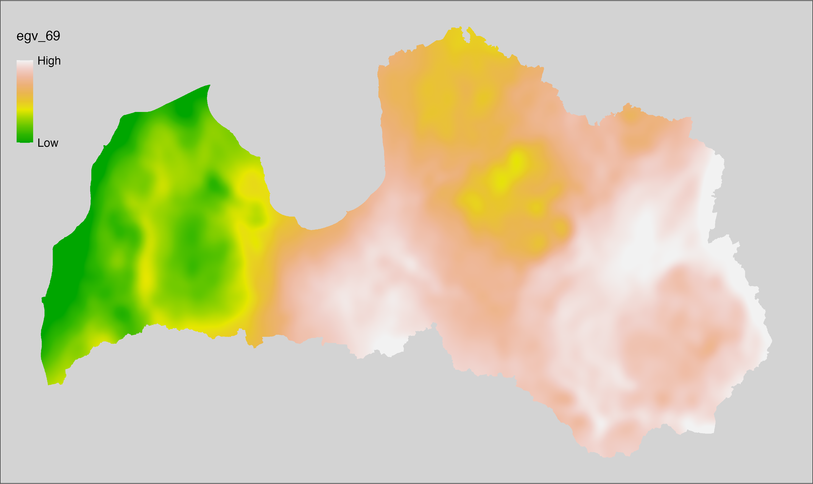


## HydroClim_01-max_cell	{#ch06.070}

**filename:** `HydroClim_01-max_cell.tif`	

**layername:** `egv_70`	

**English name:** Maximum per subcatchment upstream mean annual air temperature (°C) (HydroClim) within the analysis cell (1 ha)

**Latvian name:** Sateces apakšbaseina maksimālā vidējā gaisa temperatūra augštecē (°C) (HydroClim) analīzes šūnā (1 ha)

**Procedure:** Information - both basins and raster layers - from [HydroClim data](#Ch04.12) 
is used. First, basin CRS is transformed to epsg:3059. Then zonal statistics (per basin) with 
layer specific summary function - max - are calculated (`exactextractr::exact_extract()`) 
and then rasterized with `egvtools::polygon2input()`. Once rasterized to input data, 
EGV is created with `egvtools::input2egv()`. To prevent from gaps at the edges, 
inderse distance weighted (power = 2) gap filling is implemented. To save disk space, 
intermediate input layer is unlinked.


``` r
# libs ----
if(!require(egvtools)) {remotes::install_github("aavotins/egvtools"); require(egvtools)}
if(!require(terra)) {install.packages("terra"); require(terra)}
if(!require(tidyverse)) {install.packages("tidyverse"); require(tidyverse)}
if(!require(sf)) {install.packages("sf"); require(sf)}
if(!require(sfarrow)) {install.packages("sfarrow"); require(sfarrow)}
if(!require(exactextractr)) {install.packages("exactextractr"); require(exactextractr)}

# basins ----
level12=st_read("./Geodata/2024/HydroClim/hybas_lake_eu_lev01-12_v1c/hybas_lake_eu_lev12_v1c.shp")
grid_1km=sfarrow::st_read_parquet("./Templates/TemplateGrids/tikls1km_sauzeme.parquet")
grid_1km=st_transform(grid_1km,crs=3059)
level12=st_transform(level12,crs=3059)
level12=level12[grid_1km,,]

level12=st_make_valid(level12)

# job ----

localname="HydroClim_01-max_cell.tif"
layername="egv_70"
summary_function="max"
  
slanis=rast(paste0("./Geodata/2024/HydroClim/",localname))
level12$Hydro_values=exact_extract(slanis,level12,fun=summary_function)
  
polygon2input(vector_data = level12,
              template_path = "./Templates/TemplateRasters/LV10m_10km.tif",
              out_path = "./RasterGrids_10m/2024/",
              file_name = localname,
              value_field = "Hydro_values",
              fun="first",
              value_type = "continuous",
              prepare=FALSE,
              project_mode = "auto",
              check_na = FALSE,
              plot_result=FALSE,
              plot_gaps = FALSE,
              overwrite=TRUE)
  
egvrez=input2egv(input=paste0("./RasterGrids_10m/2024/",localname),
                 egv_template= "./Templates/TemplateRasters/LV100m_10km.tif",
                 summary_function = "average",
                 missing_job = "FillOutput",
                 input_template = "./Templates/TemplateRasters/LV10m_10km.tif",
                 outlocation = "./RasterGrids_100m/2024/RAW/",
                 outfilename = localname,
                 layername = layername,
                 idw_weight = 2,
                 plot_gaps = FALSE,plot_final = FALSE)
egvrez
  
unlink(paste0("./RasterGrids_10m/2024/",localname))
```

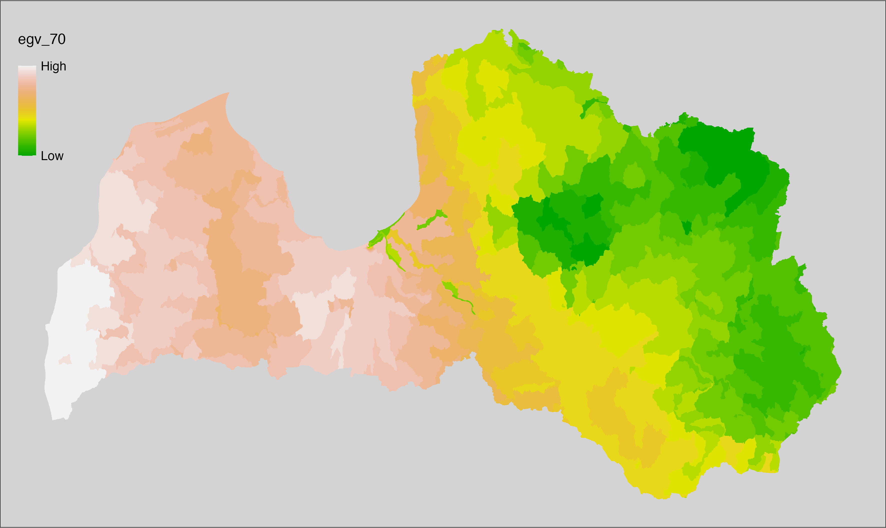


## HydroClim_02-max_cell	{#ch06.071}

**filename:** `HydroClim_02-max_cell.tif`	

**layername:** `egv_71`	

**English name:** Maximum per subcatchment upstream mean diurnal air temperature range (°C) (HydroClim) within the analysis cell (1 ha)

**Latvian name:** Sateces apakšbaseina maksimālā diennakts gaisa temperatūras amplitūda augštecē (°C) (HydroClim) analīzes šūnā (1 ha)

**Procedure:** Information - both basins and raster layers - from [HydroClim data](#Ch04.12) 
is used. First, basin CRS is transformed to epsg:3059. Then zonal statistics (per basin) with 
layer specific summary function - max - are calculated (`exactextractr::exact_extract()`) 
and then rasterized with `egvtools::polygon2input()`. Once rasterized to input data, 
EGV is created with `egvtools::input2egv()`. To prevent from gaps at the edges, 
inderse distance weighted (power = 2) gap filling is implemented. To save disk space, 
intermediate input layer is unlinked.


``` r
# libs ----
if(!require(egvtools)) {remotes::install_github("aavotins/egvtools"); require(egvtools)}
if(!require(terra)) {install.packages("terra"); require(terra)}
if(!require(tidyverse)) {install.packages("tidyverse"); require(tidyverse)}
if(!require(sf)) {install.packages("sf"); require(sf)}
if(!require(sfarrow)) {install.packages("sfarrow"); require(sfarrow)}
if(!require(exactextractr)) {install.packages("exactextractr"); require(exactextractr)}

# basins ----
level12=st_read("./Geodata/2024/HydroClim/hybas_lake_eu_lev01-12_v1c/hybas_lake_eu_lev12_v1c.shp")
grid_1km=sfarrow::st_read_parquet("./Templates/TemplateGrids/tikls1km_sauzeme.parquet")
grid_1km=st_transform(grid_1km,crs=3059)
level12=st_transform(level12,crs=3059)
level12=level12[grid_1km,,]

level12=st_make_valid(level12)

# job ----

localname="HydroClim_02-max_cell.tif"
layername="egv_71"
summary_function="max"
  
slanis=rast(paste0("./Geodata/2024/HydroClim/",localname))
level12$Hydro_values=exact_extract(slanis,level12,fun=summary_function)
  
polygon2input(vector_data = level12,
              template_path = "./Templates/TemplateRasters/LV10m_10km.tif",
              out_path = "./RasterGrids_10m/2024/",
              file_name = localname,
              value_field = "Hydro_values",
              fun="first",
              value_type = "continuous",
              prepare=FALSE,
              project_mode = "auto",
              check_na = FALSE,
              plot_result=FALSE,
              plot_gaps = FALSE,
              overwrite=TRUE)
  
egvrez=input2egv(input=paste0("./RasterGrids_10m/2024/",localname),
                 egv_template= "./Templates/TemplateRasters/LV100m_10km.tif",
                 summary_function = "average",
                 missing_job = "FillOutput",
                 input_template = "./Templates/TemplateRasters/LV10m_10km.tif",
                 outlocation = "./RasterGrids_100m/2024/RAW/",
                 outfilename = localname,
                 layername = layername,
                 idw_weight = 2,
                 plot_gaps = FALSE,plot_final = FALSE)
egvrez
  
unlink(paste0("./RasterGrids_10m/2024/",localname))
```

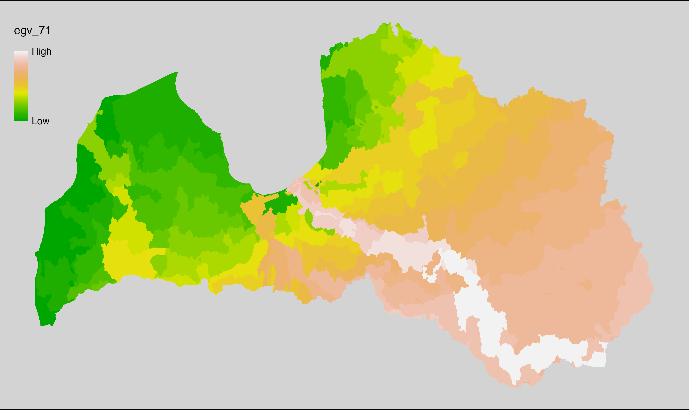


## HydroClim_03-max_cell	{#ch06.072}

**filename:** `HydroClim_03-max_cell.tif`	

**layername:** `egv_72`	

**English name:** Maximum per subcatchment upstream isothermality (ratio of diurnal variation to annual variation in temperatures) (°C) (HydroClim) within the analysis cell (1 ha)

**Latvian name:** Sateces apakšbaseina maksimālā izotermalitāte augštecē (°C) (HydroClim) analīzes šūnā (1 ha)

**Procedure:** Information - both basins and raster layers - from [HydroClim data](#Ch04.12) 
is used. First, basin CRS is transformed to epsg:3059. Then zonal statistics (per basin) with 
layer specific summary function - max - are calculated (`exactextractr::exact_extract()`) 
and then rasterized with `egvtools::polygon2input()`. Once rasterized to input data, 
EGV is created with `egvtools::input2egv()`. To prevent from gaps at the edges, 
inderse distance weighted (power = 2) gap filling is implemented. To save disk space, 
intermediate input layer is unlinked.


``` r
# libs ----
if(!require(egvtools)) {remotes::install_github("aavotins/egvtools"); require(egvtools)}
if(!require(terra)) {install.packages("terra"); require(terra)}
if(!require(tidyverse)) {install.packages("tidyverse"); require(tidyverse)}
if(!require(sf)) {install.packages("sf"); require(sf)}
if(!require(sfarrow)) {install.packages("sfarrow"); require(sfarrow)}
if(!require(exactextractr)) {install.packages("exactextractr"); require(exactextractr)}

# basins ----
level12=st_read("./Geodata/2024/HydroClim/hybas_lake_eu_lev01-12_v1c/hybas_lake_eu_lev12_v1c.shp")
grid_1km=sfarrow::st_read_parquet("./Templates/TemplateGrids/tikls1km_sauzeme.parquet")
grid_1km=st_transform(grid_1km,crs=3059)
level12=st_transform(level12,crs=3059)
level12=level12[grid_1km,,]

level12=st_make_valid(level12)

# job ----

localname="HydroClim_03-max_cell.tif"
layername="egv_72"
summary_function="max"
  
slanis=rast(paste0("./Geodata/2024/HydroClim/",localname))
level12$Hydro_values=exact_extract(slanis,level12,fun=summary_function)
  
polygon2input(vector_data = level12,
              template_path = "./Templates/TemplateRasters/LV10m_10km.tif",
              out_path = "./RasterGrids_10m/2024/",
              file_name = localname,
              value_field = "Hydro_values",
              fun="first",
              value_type = "continuous",
              prepare=FALSE,
              project_mode = "auto",
              check_na = FALSE,
              plot_result=FALSE,
              plot_gaps = FALSE,
              overwrite=TRUE)
  
egvrez=input2egv(input=paste0("./RasterGrids_10m/2024/",localname),
                 egv_template= "./Templates/TemplateRasters/LV100m_10km.tif",
                 summary_function = "average",
                 missing_job = "FillOutput",
                 input_template = "./Templates/TemplateRasters/LV10m_10km.tif",
                 outlocation = "./RasterGrids_100m/2024/RAW/",
                 outfilename = localname,
                 layername = layername,
                 idw_weight = 2,
                 plot_gaps = FALSE,plot_final = FALSE)
egvrez
  
unlink(paste0("./RasterGrids_10m/2024/",localname))
```


## HydroClim_04-max_cell	{#ch06.073}

**filename:** `HydroClim_04-max_cell.tif`	

**layername:** `egv_73`	

**English name:** Maximum per subcatchment upstream temperature seasonality (standard deviation of the monthly mean temperatures) (°C/100) (HydroClim) within the analysis cell (1 ha)

**Latvian name:** Sateces apakšbaseina maksimālā temperatūras sezonalitāte augštecē (°C/100) (HydroClim) analīzes šūnā (1 ha)

**Procedure:** Information - both basins and raster layers - from [HydroClim data](#Ch04.12) 
is used. First, basin CRS is transformed to epsg:3059. Then zonal statistics (per basin) with 
layer specific summary function - max - are calculated (`exactextractr::exact_extract()`) 
and then rasterized with `egvtools::polygon2input()`. Once rasterized to input data, 
EGV is created with `egvtools::input2egv()`. To prevent from gaps at the edges, 
inderse distance weighted (power = 2) gap filling is implemented. To save disk space, 
intermediate input layer is unlinked.


``` r
# libs ----
if(!require(egvtools)) {remotes::install_github("aavotins/egvtools"); require(egvtools)}
if(!require(terra)) {install.packages("terra"); require(terra)}
if(!require(tidyverse)) {install.packages("tidyverse"); require(tidyverse)}
if(!require(sf)) {install.packages("sf"); require(sf)}
if(!require(sfarrow)) {install.packages("sfarrow"); require(sfarrow)}
if(!require(exactextractr)) {install.packages("exactextractr"); require(exactextractr)}

# basins ----
level12=st_read("./Geodata/2024/HydroClim/hybas_lake_eu_lev01-12_v1c/hybas_lake_eu_lev12_v1c.shp")
grid_1km=sfarrow::st_read_parquet("./Templates/TemplateGrids/tikls1km_sauzeme.parquet")
grid_1km=st_transform(grid_1km,crs=3059)
level12=st_transform(level12,crs=3059)
level12=level12[grid_1km,,]

level12=st_make_valid(level12)

# job ----

localname="HydroClim_04-max_cell.tif"
layername="egv_73"
summary_function="max"
  
slanis=rast(paste0("./Geodata/2024/HydroClim/",localname))
level12$Hydro_values=exact_extract(slanis,level12,fun=summary_function)
  
polygon2input(vector_data = level12,
              template_path = "./Templates/TemplateRasters/LV10m_10km.tif",
              out_path = "./RasterGrids_10m/2024/",
              file_name = localname,
              value_field = "Hydro_values",
              fun="first",
              value_type = "continuous",
              prepare=FALSE,
              project_mode = "auto",
              check_na = FALSE,
              plot_result=FALSE,
              plot_gaps = FALSE,
              overwrite=TRUE)
  
egvrez=input2egv(input=paste0("./RasterGrids_10m/2024/",localname),
                 egv_template= "./Templates/TemplateRasters/LV100m_10km.tif",
                 summary_function = "average",
                 missing_job = "FillOutput",
                 input_template = "./Templates/TemplateRasters/LV10m_10km.tif",
                 outlocation = "./RasterGrids_100m/2024/RAW/",
                 outfilename = localname,
                 layername = layername,
                 idw_weight = 2,
                 plot_gaps = FALSE,plot_final = FALSE)
egvrez
  
unlink(paste0("./RasterGrids_10m/2024/",localname))
```

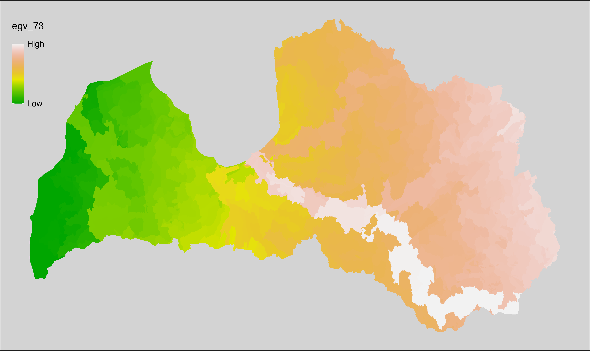


## HydroClim_05-max_cell	{#ch06.074}

**filename:** `HydroClim_05-max_cell.tif`	

**layername:** `egv_74`	

**English name:** Maximum per subcatchment upstream mean daily maximum air temperature (°C) of the warmest month (HydroClim) within the analysis cell (1 ha)

**Latvian name:** Sateces apakšbaseina maksimālā augšteces dienas vidējā gaisa temperatūra siltākajā mēnesī (°C) (HydroClim) analīzes šūnā (1 ha)

**Procedure:** Information - both basins and raster layers - from [HydroClim data](#Ch04.12) 
is used. First, basin CRS is transformed to epsg:3059. Then zonal statistics (per basin) with 
layer specific summary function - max - are calculated (`exactextractr::exact_extract()`) 
and then rasterized with `egvtools::polygon2input()`. Once rasterized to input data, 
EGV is created with `egvtools::input2egv()`. To prevent from gaps at the edges, 
inderse distance weighted (power = 2) gap filling is implemented. To save disk space, 
intermediate input layer is unlinked.


``` r
# libs ----
if(!require(egvtools)) {remotes::install_github("aavotins/egvtools"); require(egvtools)}
if(!require(terra)) {install.packages("terra"); require(terra)}
if(!require(tidyverse)) {install.packages("tidyverse"); require(tidyverse)}
if(!require(sf)) {install.packages("sf"); require(sf)}
if(!require(sfarrow)) {install.packages("sfarrow"); require(sfarrow)}
if(!require(exactextractr)) {install.packages("exactextractr"); require(exactextractr)}

# basins ----
level12=st_read("./Geodata/2024/HydroClim/hybas_lake_eu_lev01-12_v1c/hybas_lake_eu_lev12_v1c.shp")
grid_1km=sfarrow::st_read_parquet("./Templates/TemplateGrids/tikls1km_sauzeme.parquet")
grid_1km=st_transform(grid_1km,crs=3059)
level12=st_transform(level12,crs=3059)
level12=level12[grid_1km,,]

level12=st_make_valid(level12)

# job ----

localname="HydroClim_05-max_cell.tif"
layername="egv_74"
summary_function="max"
  
slanis=rast(paste0("./Geodata/2024/HydroClim/",localname))
level12$Hydro_values=exact_extract(slanis,level12,fun=summary_function)
  
polygon2input(vector_data = level12,
              template_path = "./Templates/TemplateRasters/LV10m_10km.tif",
              out_path = "./RasterGrids_10m/2024/",
              file_name = localname,
              value_field = "Hydro_values",
              fun="first",
              value_type = "continuous",
              prepare=FALSE,
              project_mode = "auto",
              check_na = FALSE,
              plot_result=FALSE,
              plot_gaps = FALSE,
              overwrite=TRUE)
  
egvrez=input2egv(input=paste0("./RasterGrids_10m/2024/",localname),
                 egv_template= "./Templates/TemplateRasters/LV100m_10km.tif",
                 summary_function = "average",
                 missing_job = "FillOutput",
                 input_template = "./Templates/TemplateRasters/LV10m_10km.tif",
                 outlocation = "./RasterGrids_100m/2024/RAW/",
                 outfilename = localname,
                 layername = layername,
                 idw_weight = 2,
                 plot_gaps = FALSE,plot_final = FALSE)
egvrez
  
unlink(paste0("./RasterGrids_10m/2024/",localname))
```

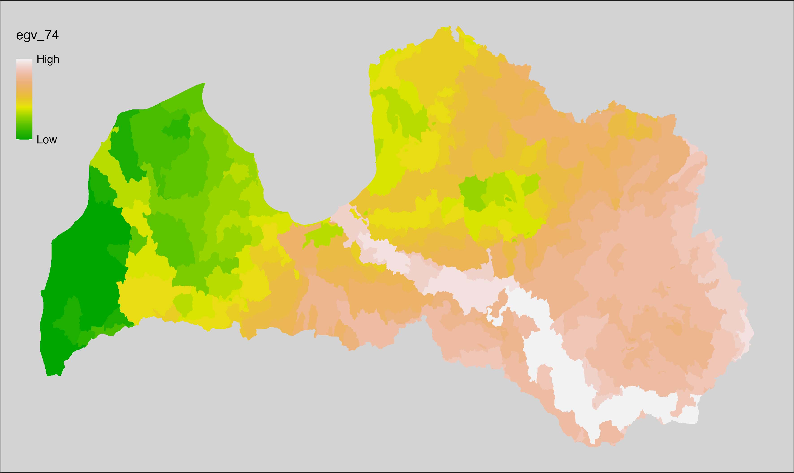


## HydroClim_06-min_cell	{#ch06.075}

**filename:** `HydroClim_06-min_cell.tif`	

**layername:** `egv_75`	

**English name:** Minimum per subcatchment upstream mean daily minimum air temperature (°C) of the coldest month (HydroClim) within the analysis cell (1 ha)

**Latvian name:** Sateces apakšbaseina minimālā augšteces dienas vidējā gaisa temperatūra vēsākajā mēnesī (°C) (HydroClim) analīzes šūnā (1 ha)

**Procedure:** Information - both basins and raster layers - from [HydroClim data](#Ch04.12) 
is used. First, basin CRS is transformed to epsg:3059. Then zonal statistics (per basin) with 
layer specific summary function - min - are calculated (`exactextractr::exact_extract()`) 
and then rasterized with `egvtools::polygon2input()`. Once rasterized to input data, 
EGV is created with `egvtools::input2egv()`. To prevent from gaps at the edges, 
inderse distance weighted (power = 2) gap filling is implemented. To save disk space, 
intermediate input layer is unlinked.


``` r
# libs ----
if(!require(egvtools)) {remotes::install_github("aavotins/egvtools"); require(egvtools)}
if(!require(terra)) {install.packages("terra"); require(terra)}
if(!require(tidyverse)) {install.packages("tidyverse"); require(tidyverse)}
if(!require(sf)) {install.packages("sf"); require(sf)}
if(!require(sfarrow)) {install.packages("sfarrow"); require(sfarrow)}
if(!require(exactextractr)) {install.packages("exactextractr"); require(exactextractr)}

# basins ----
level12=st_read("./Geodata/2024/HydroClim/hybas_lake_eu_lev01-12_v1c/hybas_lake_eu_lev12_v1c.shp")
grid_1km=sfarrow::st_read_parquet("./Templates/TemplateGrids/tikls1km_sauzeme.parquet")
grid_1km=st_transform(grid_1km,crs=3059)
level12=st_transform(level12,crs=3059)
level12=level12[grid_1km,,]

level12=st_make_valid(level12)

# job ----

localname="HydroClim_06-min_cell.tif"
layername="egv_75"
summary_function="min"
  
slanis=rast(paste0("./Geodata/2024/HydroClim/",localname))
level12$Hydro_values=exact_extract(slanis,level12,fun=summary_function)
  
polygon2input(vector_data = level12,
              template_path = "./Templates/TemplateRasters/LV10m_10km.tif",
              out_path = "./RasterGrids_10m/2024/",
              file_name = localname,
              value_field = "Hydro_values",
              fun="first",
              value_type = "continuous",
              prepare=FALSE,
              project_mode = "auto",
              check_na = FALSE,
              plot_result=FALSE,
              plot_gaps = FALSE,
              overwrite=TRUE)
  
egvrez=input2egv(input=paste0("./RasterGrids_10m/2024/",localname),
                 egv_template= "./Templates/TemplateRasters/LV100m_10km.tif",
                 summary_function = "average",
                 missing_job = "FillOutput",
                 input_template = "./Templates/TemplateRasters/LV10m_10km.tif",
                 outlocation = "./RasterGrids_100m/2024/RAW/",
                 outfilename = localname,
                 layername = layername,
                 idw_weight = 2,
                 plot_gaps = FALSE,plot_final = FALSE)
egvrez
  
unlink(paste0("./RasterGrids_10m/2024/",localname))
```

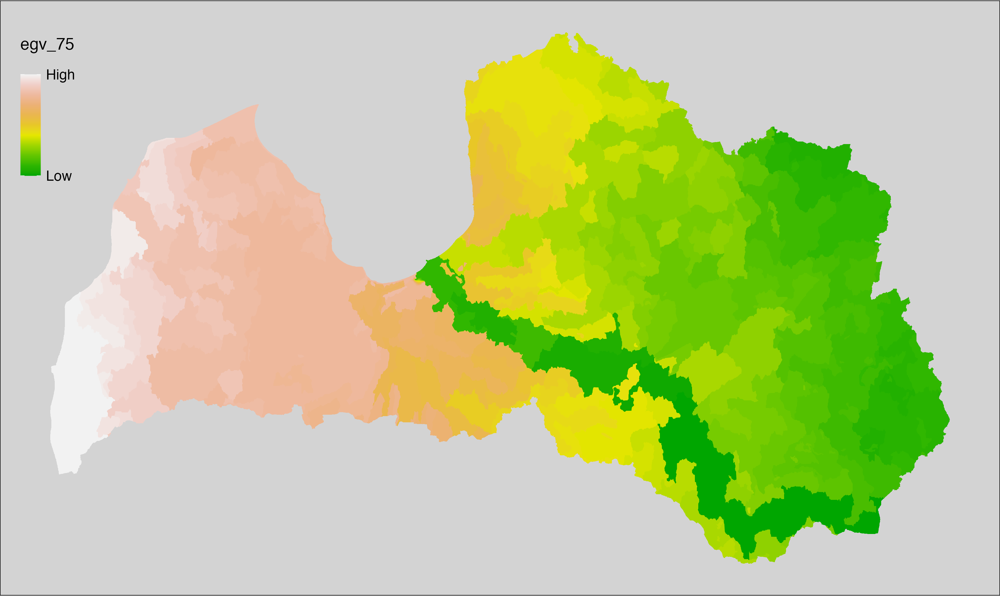


## HydroClim_07-max_cell	{#ch06.076}

**filename:** `HydroClim_07-max_cell.tif`	

**layername:** `egv_76`	

**English name:** Maximum per subcatchment upstream annual range of air temperature (°C) (HydroClim) within the analysis cell (1 ha)

**Latvian name:** Sateces apakšbaseina maksimālā augšteces gada gaisa temperatūru amplitūda (°C) (HydroClim) analīzes šūnā (1 ha)

**Procedure:** Information - both basins and raster layers - from [HydroClim data](#Ch04.12) 
is used. First, basin CRS is transformed to epsg:3059. Then zonal statistics (per basin) with 
layer specific summary function - max - are calculated (`exactextractr::exact_extract()`) 
and then rasterized with `egvtools::polygon2input()`. Once rasterized to input data, 
EGV is created with `egvtools::input2egv()`. To prevent from gaps at the edges, 
inderse distance weighted (power = 2) gap filling is implemented. To save disk space, 
intermediate input layer is unlinked.


``` r
# libs ----
if(!require(egvtools)) {remotes::install_github("aavotins/egvtools"); require(egvtools)}
if(!require(terra)) {install.packages("terra"); require(terra)}
if(!require(tidyverse)) {install.packages("tidyverse"); require(tidyverse)}
if(!require(sf)) {install.packages("sf"); require(sf)}
if(!require(sfarrow)) {install.packages("sfarrow"); require(sfarrow)}
if(!require(exactextractr)) {install.packages("exactextractr"); require(exactextractr)}

# basins ----
level12=st_read("./Geodata/2024/HydroClim/hybas_lake_eu_lev01-12_v1c/hybas_lake_eu_lev12_v1c.shp")
grid_1km=sfarrow::st_read_parquet("./Templates/TemplateGrids/tikls1km_sauzeme.parquet")
grid_1km=st_transform(grid_1km,crs=3059)
level12=st_transform(level12,crs=3059)
level12=level12[grid_1km,,]

level12=st_make_valid(level12)

# job ----

localname="HydroClim_07-max_cell.tif"
layername="egv_76"
summary_function="max"
  
slanis=rast(paste0("./Geodata/2024/HydroClim/",localname))
level12$Hydro_values=exact_extract(slanis,level12,fun=summary_function)
  
polygon2input(vector_data = level12,
              template_path = "./Templates/TemplateRasters/LV10m_10km.tif",
              out_path = "./RasterGrids_10m/2024/",
              file_name = localname,
              value_field = "Hydro_values",
              fun="first",
              value_type = "continuous",
              prepare=FALSE,
              project_mode = "auto",
              check_na = FALSE,
              plot_result=FALSE,
              plot_gaps = FALSE,
              overwrite=TRUE)
  
egvrez=input2egv(input=paste0("./RasterGrids_10m/2024/",localname),
                 egv_template= "./Templates/TemplateRasters/LV100m_10km.tif",
                 summary_function = "average",
                 missing_job = "FillOutput",
                 input_template = "./Templates/TemplateRasters/LV10m_10km.tif",
                 outlocation = "./RasterGrids_100m/2024/RAW/",
                 outfilename = localname,
                 layername = layername,
                 idw_weight = 2,
                 plot_gaps = FALSE,plot_final = FALSE)
egvrez
  
unlink(paste0("./RasterGrids_10m/2024/",localname))
```

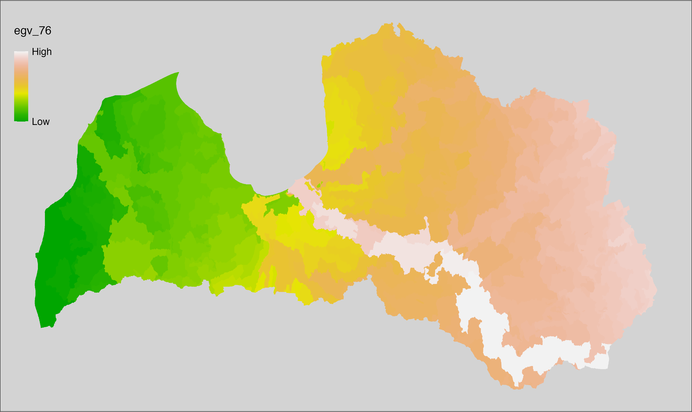


## HydroClim_08-max_cell	{#ch06.077}

**filename:** `HydroClim_08-max_cell.tif`	

**layername:** `egv_77`	

**English name:** Maximum per subcatchment upstream mean daily mean air temperatures (°C) of the wettest quarter (HydroClim) within the analysis cell (1 ha)

**Latvian name:** Sateces apakšbaseina maksimālā augšteces dienas vidējā gaisa temperatūra mitrākajā ceturksnī (°C) (HydroClim) analīzes šūnā (1 ha)

**Procedure:** Information - both basins and raster layers - from [HydroClim data](#Ch04.12) 
is used. First, basin CRS is transformed to epsg:3059. Then zonal statistics (per basin) with 
layer specific summary function - max - are calculated (`exactextractr::exact_extract()`) 
and then rasterized with `egvtools::polygon2input()`. Once rasterized to input data, 
EGV is created with `egvtools::input2egv()`. To prevent from gaps at the edges, 
inderse distance weighted (power = 2) gap filling is implemented. To save disk space, 
intermediate input layer is unlinked.


``` r
# libs ----
if(!require(egvtools)) {remotes::install_github("aavotins/egvtools"); require(egvtools)}
if(!require(terra)) {install.packages("terra"); require(terra)}
if(!require(tidyverse)) {install.packages("tidyverse"); require(tidyverse)}
if(!require(sf)) {install.packages("sf"); require(sf)}
if(!require(sfarrow)) {install.packages("sfarrow"); require(sfarrow)}
if(!require(exactextractr)) {install.packages("exactextractr"); require(exactextractr)}

# basins ----
level12=st_read("./Geodata/2024/HydroClim/hybas_lake_eu_lev01-12_v1c/hybas_lake_eu_lev12_v1c.shp")
grid_1km=sfarrow::st_read_parquet("./Templates/TemplateGrids/tikls1km_sauzeme.parquet")
grid_1km=st_transform(grid_1km,crs=3059)
level12=st_transform(level12,crs=3059)
level12=level12[grid_1km,,]

level12=st_make_valid(level12)

# job ----

localname="HydroClim_08-max_cell.tif"
layername="egv_77"
summary_function="max"
  
slanis=rast(paste0("./Geodata/2024/HydroClim/",localname))
level12$Hydro_values=exact_extract(slanis,level12,fun=summary_function)
  
polygon2input(vector_data = level12,
              template_path = "./Templates/TemplateRasters/LV10m_10km.tif",
              out_path = "./RasterGrids_10m/2024/",
              file_name = localname,
              value_field = "Hydro_values",
              fun="first",
              value_type = "continuous",
              prepare=FALSE,
              project_mode = "auto",
              check_na = FALSE,
              plot_result=FALSE,
              plot_gaps = FALSE,
              overwrite=TRUE)
  
egvrez=input2egv(input=paste0("./RasterGrids_10m/2024/",localname),
                 egv_template= "./Templates/TemplateRasters/LV100m_10km.tif",
                 summary_function = "average",
                 missing_job = "FillOutput",
                 input_template = "./Templates/TemplateRasters/LV10m_10km.tif",
                 outlocation = "./RasterGrids_100m/2024/RAW/",
                 outfilename = localname,
                 layername = layername,
                 idw_weight = 2,
                 plot_gaps = FALSE,plot_final = FALSE)
egvrez
  
unlink(paste0("./RasterGrids_10m/2024/",localname))
```


## HydroClim_09-min_cell	{#ch06.078}

**filename:** `HydroClim_09-min_cell.tif`	

**layername:** `egv_78`	

**English name:** Minimum per subcatchment upstream mean daily mean air temperatures (°C) of the driest quarter (HydroClim) within the analysis cell (1 ha)

**Latvian name:** Sateces apakšbaseina maksimālā augšteces dienas vidējā gaisa temperatūra sausākajā ceturksnī (°C) (HydroClim) analīzes šūnā (1 ha)

**Procedure:** Information - both basins and raster layers - from [HydroClim data](#Ch04.12) 
is used. First, basin CRS is transformed to epsg:3059. Then zonal statistics (per basin) with 
layer specific summary function - min - are calculated (`exactextractr::exact_extract()`) 
and then rasterized with `egvtools::polygon2input()`. Once rasterized to input data, 
EGV is created with `egvtools::input2egv()`. To prevent from gaps at the edges, 
inderse distance weighted (power = 2) gap filling is implemented. To save disk space, 
intermediate input layer is unlinked.


``` r
# libs ----
if(!require(egvtools)) {remotes::install_github("aavotins/egvtools"); require(egvtools)}
if(!require(terra)) {install.packages("terra"); require(terra)}
if(!require(tidyverse)) {install.packages("tidyverse"); require(tidyverse)}
if(!require(sf)) {install.packages("sf"); require(sf)}
if(!require(sfarrow)) {install.packages("sfarrow"); require(sfarrow)}
if(!require(exactextractr)) {install.packages("exactextractr"); require(exactextractr)}

# basins ----
level12=st_read("./Geodata/2024/HydroClim/hybas_lake_eu_lev01-12_v1c/hybas_lake_eu_lev12_v1c.shp")
grid_1km=sfarrow::st_read_parquet("./Templates/TemplateGrids/tikls1km_sauzeme.parquet")
grid_1km=st_transform(grid_1km,crs=3059)
level12=st_transform(level12,crs=3059)
level12=level12[grid_1km,,]

level12=st_make_valid(level12)

# job ----

localname="HydroClim_09-min_cell.tif"
layername="egv_78"
summary_function="min"
  
slanis=rast(paste0("./Geodata/2024/HydroClim/",localname))
level12$Hydro_values=exact_extract(slanis,level12,fun=summary_function)
  
polygon2input(vector_data = level12,
              template_path = "./Templates/TemplateRasters/LV10m_10km.tif",
              out_path = "./RasterGrids_10m/2024/",
              file_name = localname,
              value_field = "Hydro_values",
              fun="first",
              value_type = "continuous",
              prepare=FALSE,
              project_mode = "auto",
              check_na = FALSE,
              plot_result=FALSE,
              plot_gaps = FALSE,
              overwrite=TRUE)
  
egvrez=input2egv(input=paste0("./RasterGrids_10m/2024/",localname),
                 egv_template= "./Templates/TemplateRasters/LV100m_10km.tif",
                 summary_function = "average",
                 missing_job = "FillOutput",
                 input_template = "./Templates/TemplateRasters/LV10m_10km.tif",
                 outlocation = "./RasterGrids_100m/2024/RAW/",
                 outfilename = localname,
                 layername = layername,
                 idw_weight = 2,
                 plot_gaps = FALSE,plot_final = FALSE)
egvrez
  
unlink(paste0("./RasterGrids_10m/2024/",localname))
```

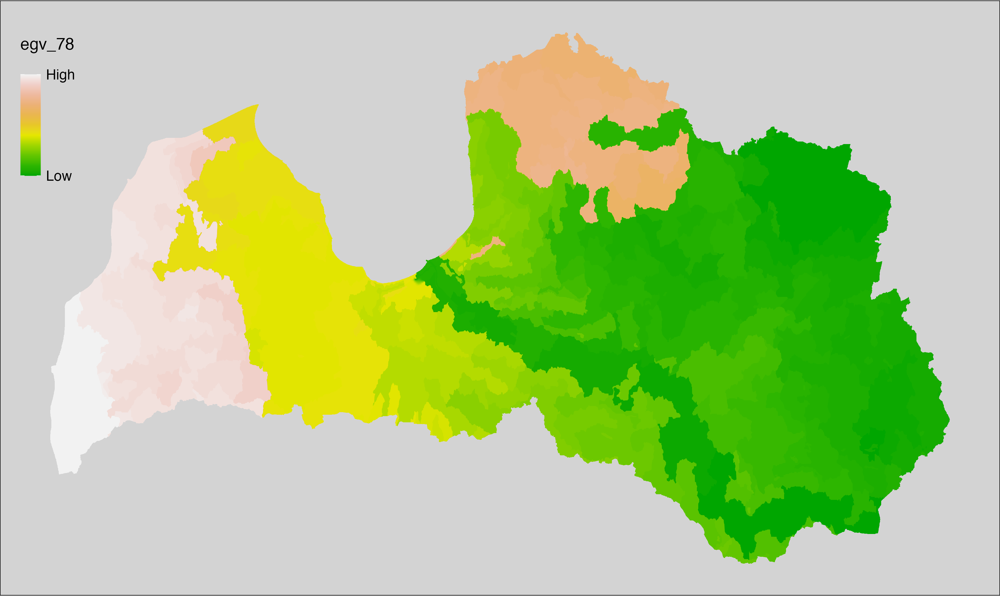


## HydroClim_10-max_cell	{#ch06.079}

**filename:** `HydroClim_10-max_cell.tif`	

**layername:** `egv_79`	

**English name:** Maximum per subcatchment upstream mean daily mean air temperatures (°C) of the warmest quarter (HydroClim) within the analysis cell (1 ha)

**Latvian name:** Sateces apakšbaseina maksimālā augšteces dienas vidējā gaisa temperatūra siltākajā ceturksnī (°C) (HydroClim) analīzes šūnā (1 ha)

**Procedure:** Information - both basins and raster layers - from [HydroClim data](#Ch04.12) 
is used. First, basin CRS is transformed to epsg:3059. Then zonal statistics (per basin) with 
layer specific summary function - max - are calculated (`exactextractr::exact_extract()`) 
and then rasterized with `egvtools::polygon2input()`. Once rasterized to input data, 
EGV is created with `egvtools::input2egv()`. To prevent from gaps at the edges, 
inderse distance weighted (power = 2) gap filling is implemented. To save disk space, 
intermediate input layer is unlinked.


``` r
# libs ----
if(!require(egvtools)) {remotes::install_github("aavotins/egvtools"); require(egvtools)}
if(!require(terra)) {install.packages("terra"); require(terra)}
if(!require(tidyverse)) {install.packages("tidyverse"); require(tidyverse)}
if(!require(sf)) {install.packages("sf"); require(sf)}
if(!require(sfarrow)) {install.packages("sfarrow"); require(sfarrow)}
if(!require(exactextractr)) {install.packages("exactextractr"); require(exactextractr)}

# basins ----
level12=st_read("./Geodata/2024/HydroClim/hybas_lake_eu_lev01-12_v1c/hybas_lake_eu_lev12_v1c.shp")
grid_1km=sfarrow::st_read_parquet("./Templates/TemplateGrids/tikls1km_sauzeme.parquet")
grid_1km=st_transform(grid_1km,crs=3059)
level12=st_transform(level12,crs=3059)
level12=level12[grid_1km,,]

level12=st_make_valid(level12)

# job ----

localname="HydroClim_10-max_cell.tif"
layername="egv_79"
summary_function="max"
  
slanis=rast(paste0("./Geodata/2024/HydroClim/",localname))
level12$Hydro_values=exact_extract(slanis,level12,fun=summary_function)
  
polygon2input(vector_data = level12,
              template_path = "./Templates/TemplateRasters/LV10m_10km.tif",
              out_path = "./RasterGrids_10m/2024/",
              file_name = localname,
              value_field = "Hydro_values",
              fun="first",
              value_type = "continuous",
              prepare=FALSE,
              project_mode = "auto",
              check_na = FALSE,
              plot_result=FALSE,
              plot_gaps = FALSE,
              overwrite=TRUE)
  
egvrez=input2egv(input=paste0("./RasterGrids_10m/2024/",localname),
                 egv_template= "./Templates/TemplateRasters/LV100m_10km.tif",
                 summary_function = "average",
                 missing_job = "FillOutput",
                 input_template = "./Templates/TemplateRasters/LV10m_10km.tif",
                 outlocation = "./RasterGrids_100m/2024/RAW/",
                 outfilename = localname,
                 layername = layername,
                 idw_weight = 2,
                 plot_gaps = FALSE,plot_final = FALSE)
egvrez
  
unlink(paste0("./RasterGrids_10m/2024/",localname))
```

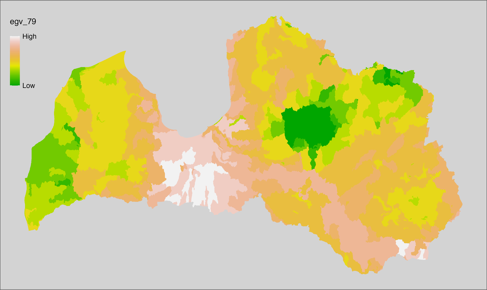


## HydroClim_11-min_cell	{#ch06.080}

**filename:** `HydroClim_11-min_cell.tif`	

**layername:** `egv_80`	

**English name:** Minimum per subcatchment upstream mean daily mean air temperatures (°C) of the coldest quarter (HydroClim) within the analysis cell (1 ha)

**Latvian name:** Sateces apakšbaseina maksimālā augšteces dienas vidējā gaisa temperatūra vēsākajā ceturksnī (°C) (HydroClim) analīzes šūnā (1 ha)

**Procedure:** Information - both basins and raster layers - from [HydroClim data](#Ch04.12) 
is used. First, basin CRS is transformed to epsg:3059. Then zonal statistics (per basin) with 
layer specific summary function - min - are calculated (`exactextractr::exact_extract()`) 
and then rasterized with `egvtools::polygon2input()`. Once rasterized to input data, 
EGV is created with `egvtools::input2egv()`. To prevent from gaps at the edges, 
inderse distance weighted (power = 2) gap filling is implemented. To save disk space, 
intermediate input layer is unlinked.


``` r
# libs ----
if(!require(egvtools)) {remotes::install_github("aavotins/egvtools"); require(egvtools)}
if(!require(terra)) {install.packages("terra"); require(terra)}
if(!require(tidyverse)) {install.packages("tidyverse"); require(tidyverse)}
if(!require(sf)) {install.packages("sf"); require(sf)}
if(!require(sfarrow)) {install.packages("sfarrow"); require(sfarrow)}
if(!require(exactextractr)) {install.packages("exactextractr"); require(exactextractr)}

# basins ----
level12=st_read("./Geodata/2024/HydroClim/hybas_lake_eu_lev01-12_v1c/hybas_lake_eu_lev12_v1c.shp")
grid_1km=sfarrow::st_read_parquet("./Templates/TemplateGrids/tikls1km_sauzeme.parquet")
grid_1km=st_transform(grid_1km,crs=3059)
level12=st_transform(level12,crs=3059)
level12=level12[grid_1km,,]

level12=st_make_valid(level12)

# job ----

localname="HydroClim_11-min_cell.tif"
layername="egv_80"
summary_function="min"
  
slanis=rast(paste0("./Geodata/2024/HydroClim/",localname))
level12$Hydro_values=exact_extract(slanis,level12,fun=summary_function)
  
polygon2input(vector_data = level12,
              template_path = "./Templates/TemplateRasters/LV10m_10km.tif",
              out_path = "./RasterGrids_10m/2024/",
              file_name = localname,
              value_field = "Hydro_values",
              fun="first",
              value_type = "continuous",
              prepare=FALSE,
              project_mode = "auto",
              check_na = FALSE,
              plot_result=FALSE,
              plot_gaps = FALSE,
              overwrite=TRUE)
  
egvrez=input2egv(input=paste0("./RasterGrids_10m/2024/",localname),
                 egv_template= "./Templates/TemplateRasters/LV100m_10km.tif",
                 summary_function = "average",
                 missing_job = "FillOutput",
                 input_template = "./Templates/TemplateRasters/LV10m_10km.tif",
                 outlocation = "./RasterGrids_100m/2024/RAW/",
                 outfilename = localname,
                 layername = layername,
                 idw_weight = 2,
                 plot_gaps = FALSE,plot_final = FALSE)
egvrez
  
unlink(paste0("./RasterGrids_10m/2024/",localname))
```

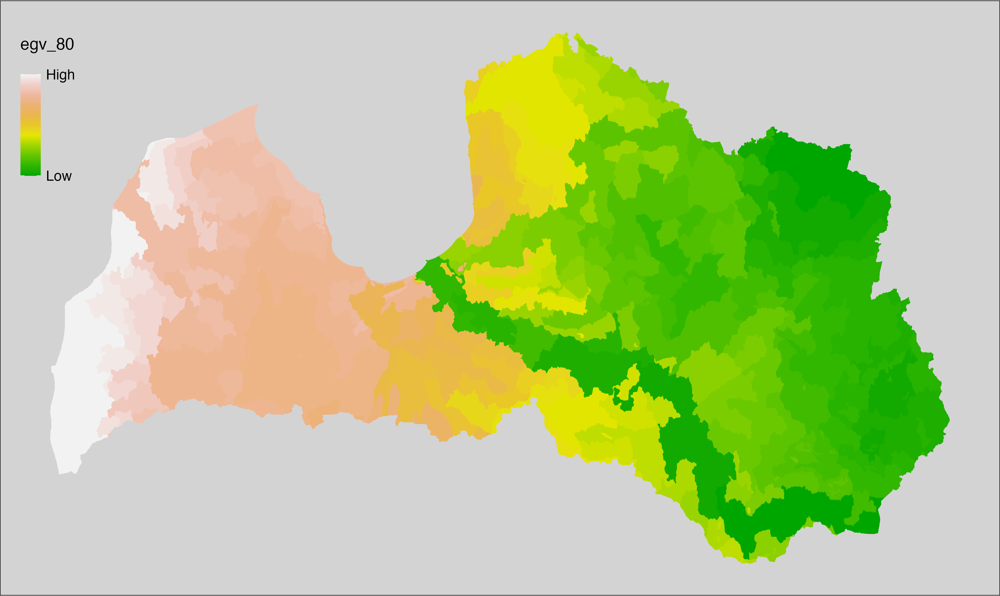


## HydroClim_12-max_cell	{#ch06.081}

**filename:** `HydroClim_12-max_cell.tif`	

**layername:** `egv_81`	

**English name:** Maximum per subcatchment upstream annual precipitation amount (kg m⁻² year⁻¹) (HydroClim) within the analysis cell (1 ha)

**Latvian name:** Sateces apakšbaseina maksimālais augšteces nokrišņu daudzums gadā (kg m⁻² year⁻¹) (HydroClim) analīzes šūnā (1 ha)

**Procedure:** Information - both basins and raster layers - from [HydroClim data](#Ch04.12) 
is used. First, basin CRS is transformed to epsg:3059. Then zonal statistics (per basin) with 
layer specific summary function - max - are calculated (`exactextractr::exact_extract()`) 
and then rasterized with `egvtools::polygon2input()`. Once rasterized to input data, 
EGV is created with `egvtools::input2egv()`. To prevent from gaps at the edges, 
inderse distance weighted (power = 2) gap filling is implemented. To save disk space, 
intermediate input layer is unlinked.


``` r
# libs ----
if(!require(egvtools)) {remotes::install_github("aavotins/egvtools"); require(egvtools)}
if(!require(terra)) {install.packages("terra"); require(terra)}
if(!require(tidyverse)) {install.packages("tidyverse"); require(tidyverse)}
if(!require(sf)) {install.packages("sf"); require(sf)}
if(!require(sfarrow)) {install.packages("sfarrow"); require(sfarrow)}
if(!require(exactextractr)) {install.packages("exactextractr"); require(exactextractr)}

# basins ----
level12=st_read("./Geodata/2024/HydroClim/hybas_lake_eu_lev01-12_v1c/hybas_lake_eu_lev12_v1c.shp")
grid_1km=sfarrow::st_read_parquet("./Templates/TemplateGrids/tikls1km_sauzeme.parquet")
grid_1km=st_transform(grid_1km,crs=3059)
level12=st_transform(level12,crs=3059)
level12=level12[grid_1km,,]

level12=st_make_valid(level12)

# job ----

localname="HydroClim_12-max_cell.tif"
layername="egv_81"
summary_function="max"
  
slanis=rast(paste0("./Geodata/2024/HydroClim/",localname))
level12$Hydro_values=exact_extract(slanis,level12,fun=summary_function)
  
polygon2input(vector_data = level12,
              template_path = "./Templates/TemplateRasters/LV10m_10km.tif",
              out_path = "./RasterGrids_10m/2024/",
              file_name = localname,
              value_field = "Hydro_values",
              fun="first",
              value_type = "continuous",
              prepare=FALSE,
              project_mode = "auto",
              check_na = FALSE,
              plot_result=FALSE,
              plot_gaps = FALSE,
              overwrite=TRUE)
  
egvrez=input2egv(input=paste0("./RasterGrids_10m/2024/",localname),
                 egv_template= "./Templates/TemplateRasters/LV100m_10km.tif",
                 summary_function = "average",
                 missing_job = "FillOutput",
                 input_template = "./Templates/TemplateRasters/LV10m_10km.tif",
                 outlocation = "./RasterGrids_100m/2024/RAW/",
                 outfilename = localname,
                 layername = layername,
                 idw_weight = 2,
                 plot_gaps = FALSE,plot_final = FALSE)
egvrez
  
unlink(paste0("./RasterGrids_10m/2024/",localname))
```


## HydroClim_13-max_cell	{#ch06.082}

**filename:** `HydroClim_13-max_cell.tif`	

**layername:** `egv_82`	

**English name:** Maximum per subcatchment upstream precipitation amount (kg m⁻² year⁻¹) of the wettest month (HydroClim) within the analysis cell (1 ha)

**Latvian name:** Sateces apakšbaseina maksimālais augšteces nokrišņu daudzums mitrākajā mēnesī (kg m⁻² year⁻¹) (HydroClim) analīzes šūnā (1 ha)

**Procedure:** Information - both basins and raster layers - from [HydroClim data](#Ch04.12) 
is used. First, basin CRS is transformed to epsg:3059. Then zonal statistics (per basin) with 
layer specific summary function - max - are calculated (`exactextractr::exact_extract()`) 
and then rasterized with `egvtools::polygon2input()`. Once rasterized to input data, 
EGV is created with `egvtools::input2egv()`. To prevent from gaps at the edges, 
inderse distance weighted (power = 2) gap filling is implemented. To save disk space, 
intermediate input layer is unlinked.


``` r
# libs ----
if(!require(egvtools)) {remotes::install_github("aavotins/egvtools"); require(egvtools)}
if(!require(terra)) {install.packages("terra"); require(terra)}
if(!require(tidyverse)) {install.packages("tidyverse"); require(tidyverse)}
if(!require(sf)) {install.packages("sf"); require(sf)}
if(!require(sfarrow)) {install.packages("sfarrow"); require(sfarrow)}
if(!require(exactextractr)) {install.packages("exactextractr"); require(exactextractr)}

# basins ----
level12=st_read("./Geodata/2024/HydroClim/hybas_lake_eu_lev01-12_v1c/hybas_lake_eu_lev12_v1c.shp")
grid_1km=sfarrow::st_read_parquet("./Templates/TemplateGrids/tikls1km_sauzeme.parquet")
grid_1km=st_transform(grid_1km,crs=3059)
level12=st_transform(level12,crs=3059)
level12=level12[grid_1km,,]

level12=st_make_valid(level12)

# job ----

localname="HydroClim_13-max_cell.tif"
layername="egv_82"
summary_function="max"
  
slanis=rast(paste0("./Geodata/2024/HydroClim/",localname))
level12$Hydro_values=exact_extract(slanis,level12,fun=summary_function)
  
polygon2input(vector_data = level12,
              template_path = "./Templates/TemplateRasters/LV10m_10km.tif",
              out_path = "./RasterGrids_10m/2024/",
              file_name = localname,
              value_field = "Hydro_values",
              fun="first",
              value_type = "continuous",
              prepare=FALSE,
              project_mode = "auto",
              check_na = FALSE,
              plot_result=FALSE,
              plot_gaps = FALSE,
              overwrite=TRUE)
  
egvrez=input2egv(input=paste0("./RasterGrids_10m/2024/",localname),
                 egv_template= "./Templates/TemplateRasters/LV100m_10km.tif",
                 summary_function = "average",
                 missing_job = "FillOutput",
                 input_template = "./Templates/TemplateRasters/LV10m_10km.tif",
                 outlocation = "./RasterGrids_100m/2024/RAW/",
                 outfilename = localname,
                 layername = layername,
                 idw_weight = 2,
                 plot_gaps = FALSE,plot_final = FALSE)
egvrez
  
unlink(paste0("./RasterGrids_10m/2024/",localname))
```


## HydroClim_14-max_cell	{#ch06.083}

**filename:** `HydroClim_14-max_cell.tif`	

**layername:** `egv_83`	

**English name:** Maximum per subcatchment upstream precipitation amount (kg m⁻² year⁻¹) of the driest month (HydroClim) within the analysis cell (1 ha)

**Latvian name:** Sateces apakšbaseina maksimālais augšteces nokrišņu daudzums sausākajā mēnesī (kg m⁻² year⁻¹) (HydroClim) analīzes šūnā (1 ha)

**Procedure:** Information - both basins and raster layers - from [HydroClim data](#Ch04.12) 
is used. First, basin CRS is transformed to epsg:3059. Then zonal statistics (per basin) with 
layer specific summary function - max - are calculated (`exactextractr::exact_extract()`) 
and then rasterized with `egvtools::polygon2input()`. Once rasterized to input data, 
EGV is created with `egvtools::input2egv()`. To prevent from gaps at the edges, 
inderse distance weighted (power = 2) gap filling is implemented. To save disk space, 
intermediate input layer is unlinked.


``` r
# libs ----
if(!require(egvtools)) {remotes::install_github("aavotins/egvtools"); require(egvtools)}
if(!require(terra)) {install.packages("terra"); require(terra)}
if(!require(tidyverse)) {install.packages("tidyverse"); require(tidyverse)}
if(!require(sf)) {install.packages("sf"); require(sf)}
if(!require(sfarrow)) {install.packages("sfarrow"); require(sfarrow)}
if(!require(exactextractr)) {install.packages("exactextractr"); require(exactextractr)}

# basins ----
level12=st_read("./Geodata/2024/HydroClim/hybas_lake_eu_lev01-12_v1c/hybas_lake_eu_lev12_v1c.shp")
grid_1km=sfarrow::st_read_parquet("./Templates/TemplateGrids/tikls1km_sauzeme.parquet")
grid_1km=st_transform(grid_1km,crs=3059)
level12=st_transform(level12,crs=3059)
level12=level12[grid_1km,,]

level12=st_make_valid(level12)

# job ----

localname="HydroClim_14-max_cell.tif"
layername="egv_83"
summary_function="max"
  
slanis=rast(paste0("./Geodata/2024/HydroClim/",localname))
level12$Hydro_values=exact_extract(slanis,level12,fun=summary_function)
  
polygon2input(vector_data = level12,
              template_path = "./Templates/TemplateRasters/LV10m_10km.tif",
              out_path = "./RasterGrids_10m/2024/",
              file_name = localname,
              value_field = "Hydro_values",
              fun="first",
              value_type = "continuous",
              prepare=FALSE,
              project_mode = "auto",
              check_na = FALSE,
              plot_result=FALSE,
              plot_gaps = FALSE,
              overwrite=TRUE)
  
egvrez=input2egv(input=paste0("./RasterGrids_10m/2024/",localname),
                 egv_template= "./Templates/TemplateRasters/LV100m_10km.tif",
                 summary_function = "average",
                 missing_job = "FillOutput",
                 input_template = "./Templates/TemplateRasters/LV10m_10km.tif",
                 outlocation = "./RasterGrids_100m/2024/RAW/",
                 outfilename = localname,
                 layername = layername,
                 idw_weight = 2,
                 plot_gaps = FALSE,plot_final = FALSE)
egvrez
  
unlink(paste0("./RasterGrids_10m/2024/",localname))
```

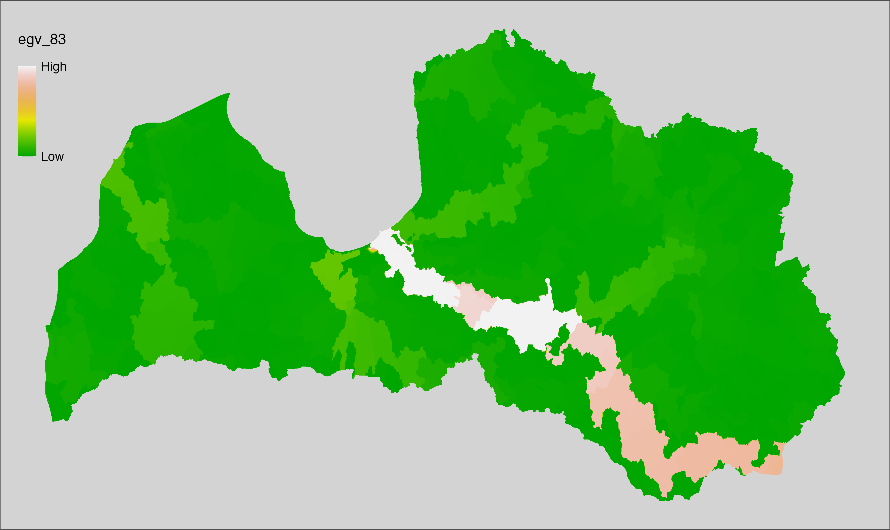


## HydroClim_15-max_cell	{#ch06.084}

**filename:** `HydroClim_15-max_cell.tif`	

**layername:** `egv_84`	

**English name:** Maximum per subcatchment upstream precipitation seasonality (kg m⁻²) (HydroClim) within the analysis cell (1 ha)

**Latvian name:** Sateces apakšbaseina maksimālais augšteces nokrišņu daudzuma sezonalitāte (kg m⁻²) (HydroClim) analīzes šūnā (1 ha)

**Procedure:** Information - both basins and raster layers - from [HydroClim data](#Ch04.12) 
is used. First, basin CRS is transformed to epsg:3059. Then zonal statistics (per basin) with 
layer specific summary function - max - are calculated (`exactextractr::exact_extract()`) 
and then rasterized with `egvtools::polygon2input()`. Once rasterized to input data, 
EGV is created with `egvtools::input2egv()`. To prevent from gaps at the edges, 
inderse distance weighted (power = 2) gap filling is implemented. To save disk space, 
intermediate input layer is unlinked.


``` r
# libs ----
if(!require(egvtools)) {remotes::install_github("aavotins/egvtools"); require(egvtools)}
if(!require(terra)) {install.packages("terra"); require(terra)}
if(!require(tidyverse)) {install.packages("tidyverse"); require(tidyverse)}
if(!require(sf)) {install.packages("sf"); require(sf)}
if(!require(sfarrow)) {install.packages("sfarrow"); require(sfarrow)}
if(!require(exactextractr)) {install.packages("exactextractr"); require(exactextractr)}

# basins ----
level12=st_read("./Geodata/2024/HydroClim/hybas_lake_eu_lev01-12_v1c/hybas_lake_eu_lev12_v1c.shp")
grid_1km=sfarrow::st_read_parquet("./Templates/TemplateGrids/tikls1km_sauzeme.parquet")
grid_1km=st_transform(grid_1km,crs=3059)
level12=st_transform(level12,crs=3059)
level12=level12[grid_1km,,]

level12=st_make_valid(level12)

# job ----

localname="HydroClim_15-max_cell.tif"
layername="egv_84"
summary_function="max"
  
slanis=rast(paste0("./Geodata/2024/HydroClim/",localname))
level12$Hydro_values=exact_extract(slanis,level12,fun=summary_function)
  
polygon2input(vector_data = level12,
              template_path = "./Templates/TemplateRasters/LV10m_10km.tif",
              out_path = "./RasterGrids_10m/2024/",
              file_name = localname,
              value_field = "Hydro_values",
              fun="first",
              value_type = "continuous",
              prepare=FALSE,
              project_mode = "auto",
              check_na = FALSE,
              plot_result=FALSE,
              plot_gaps = FALSE,
              overwrite=TRUE)
  
egvrez=input2egv(input=paste0("./RasterGrids_10m/2024/",localname),
                 egv_template= "./Templates/TemplateRasters/LV100m_10km.tif",
                 summary_function = "average",
                 missing_job = "FillOutput",
                 input_template = "./Templates/TemplateRasters/LV10m_10km.tif",
                 outlocation = "./RasterGrids_100m/2024/RAW/",
                 outfilename = localname,
                 layername = layername,
                 idw_weight = 2,
                 plot_gaps = FALSE,plot_final = FALSE)
egvrez
  
unlink(paste0("./RasterGrids_10m/2024/",localname))
```

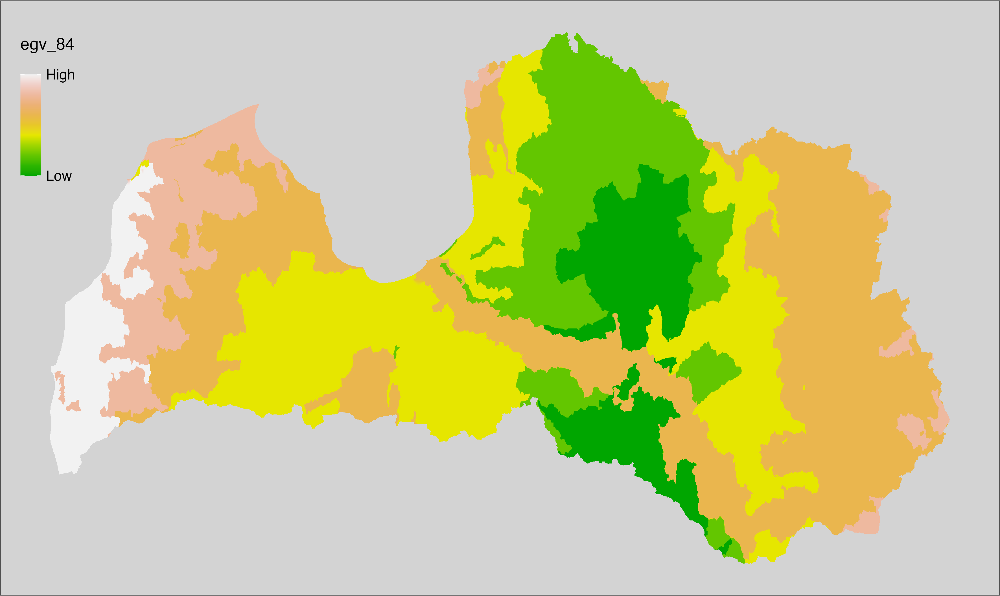


## HydroClim_16-max_cell	{#ch06.085}

**filename:** `HydroClim_16-max_cell.tif`	

**layername:** `egv_85`	

**English name:** Maximum per subcatchment upstream mean monthly precipitation amount (kg m⁻² year⁻¹) of the wettest quarter (HydroClim) within the analysis cell (1 ha)

**Latvian name:** Sateces apakšbaseina maksimālais augšteces nokrišņu daudzums mitrākajā ceturksnī (kg m⁻² year⁻¹) (HydroClim) analīzes šūnā (1 ha)

**Procedure:** Information - both basins and raster layers - from [HydroClim data](#Ch04.12) 
is used. First, basin CRS is transformed to epsg:3059. Then zonal statistics (per basin) with 
layer specific summary function - max - are calculated (`exactextractr::exact_extract()`) 
and then rasterized with `egvtools::polygon2input()`. Once rasterized to input data, 
EGV is created with `egvtools::input2egv()`. To prevent from gaps at the edges, 
inderse distance weighted (power = 2) gap filling is implemented. To save disk space, 
intermediate input layer is unlinked.


``` r
# libs ----
if(!require(egvtools)) {remotes::install_github("aavotins/egvtools"); require(egvtools)}
if(!require(terra)) {install.packages("terra"); require(terra)}
if(!require(tidyverse)) {install.packages("tidyverse"); require(tidyverse)}
if(!require(sf)) {install.packages("sf"); require(sf)}
if(!require(sfarrow)) {install.packages("sfarrow"); require(sfarrow)}
if(!require(exactextractr)) {install.packages("exactextractr"); require(exactextractr)}

# basins ----
level12=st_read("./Geodata/2024/HydroClim/hybas_lake_eu_lev01-12_v1c/hybas_lake_eu_lev12_v1c.shp")
grid_1km=sfarrow::st_read_parquet("./Templates/TemplateGrids/tikls1km_sauzeme.parquet")
grid_1km=st_transform(grid_1km,crs=3059)
level12=st_transform(level12,crs=3059)
level12=level12[grid_1km,,]

level12=st_make_valid(level12)

# job ----

localname="HydroClim_16-max_cell.tif"
layername="egv_85"
summary_function="max"
  
slanis=rast(paste0("./Geodata/2024/HydroClim/",localname))
level12$Hydro_values=exact_extract(slanis,level12,fun=summary_function)
  
polygon2input(vector_data = level12,
              template_path = "./Templates/TemplateRasters/LV10m_10km.tif",
              out_path = "./RasterGrids_10m/2024/",
              file_name = localname,
              value_field = "Hydro_values",
              fun="first",
              value_type = "continuous",
              prepare=FALSE,
              project_mode = "auto",
              check_na = FALSE,
              plot_result=FALSE,
              plot_gaps = FALSE,
              overwrite=TRUE)
  
egvrez=input2egv(input=paste0("./RasterGrids_10m/2024/",localname),
                 egv_template= "./Templates/TemplateRasters/LV100m_10km.tif",
                 summary_function = "average",
                 missing_job = "FillOutput",
                 input_template = "./Templates/TemplateRasters/LV10m_10km.tif",
                 outlocation = "./RasterGrids_100m/2024/RAW/",
                 outfilename = localname,
                 layername = layername,
                 idw_weight = 2,
                 plot_gaps = FALSE,plot_final = FALSE)
egvrez
  
unlink(paste0("./RasterGrids_10m/2024/",localname))
```


## HydroClim_17-max_cell	{#ch06.086}

**filename:** `HydroClim_17-max_cell.tif`	

**layername:** `egv_86`	

**English name:** Maximum per subcatchment upstream mean monthly precipitation amount (kg m⁻² year⁻¹) of the driest quarter (HydroClim) within the analysis cell (1 ha)

**Latvian name:** Sateces apakšbaseina maksimālais augšteces nokrišņu daudzums sausākajā ceturksnī (kg m⁻² year⁻¹) (HydroClim) analīzes šūnā (1 ha)

**Procedure:** Information - both basins and raster layers - from [HydroClim data](#Ch04.12) 
is used. First, basin CRS is transformed to epsg:3059. Then zonal statistics (per basin) with 
layer specific summary function - max - are calculated (`exactextractr::exact_extract()`) 
and then rasterized with `egvtools::polygon2input()`. Once rasterized to input data, 
EGV is created with `egvtools::input2egv()`. To prevent from gaps at the edges, 
inderse distance weighted (power = 2) gap filling is implemented. To save disk space, 
intermediate input layer is unlinked.


``` r
# libs ----
if(!require(egvtools)) {remotes::install_github("aavotins/egvtools"); require(egvtools)}
if(!require(terra)) {install.packages("terra"); require(terra)}
if(!require(tidyverse)) {install.packages("tidyverse"); require(tidyverse)}
if(!require(sf)) {install.packages("sf"); require(sf)}
if(!require(sfarrow)) {install.packages("sfarrow"); require(sfarrow)}
if(!require(exactextractr)) {install.packages("exactextractr"); require(exactextractr)}

# basins ----
level12=st_read("./Geodata/2024/HydroClim/hybas_lake_eu_lev01-12_v1c/hybas_lake_eu_lev12_v1c.shp")
grid_1km=sfarrow::st_read_parquet("./Templates/TemplateGrids/tikls1km_sauzeme.parquet")
grid_1km=st_transform(grid_1km,crs=3059)
level12=st_transform(level12,crs=3059)
level12=level12[grid_1km,,]

level12=st_make_valid(level12)

# job ----

localname="HydroClim_17-max_cell.tif"
layername="egv_86"
summary_function="max"
  
slanis=rast(paste0("./Geodata/2024/HydroClim/",localname))
level12$Hydro_values=exact_extract(slanis,level12,fun=summary_function)
  
polygon2input(vector_data = level12,
              template_path = "./Templates/TemplateRasters/LV10m_10km.tif",
              out_path = "./RasterGrids_10m/2024/",
              file_name = localname,
              value_field = "Hydro_values",
              fun="first",
              value_type = "continuous",
              prepare=FALSE,
              project_mode = "auto",
              check_na = FALSE,
              plot_result=FALSE,
              plot_gaps = FALSE,
              overwrite=TRUE)
  
egvrez=input2egv(input=paste0("./RasterGrids_10m/2024/",localname),
                 egv_template= "./Templates/TemplateRasters/LV100m_10km.tif",
                 summary_function = "average",
                 missing_job = "FillOutput",
                 input_template = "./Templates/TemplateRasters/LV10m_10km.tif",
                 outlocation = "./RasterGrids_100m/2024/RAW/",
                 outfilename = localname,
                 layername = layername,
                 idw_weight = 2,
                 plot_gaps = FALSE,plot_final = FALSE)
egvrez
  
unlink(paste0("./RasterGrids_10m/2024/",localname))
```

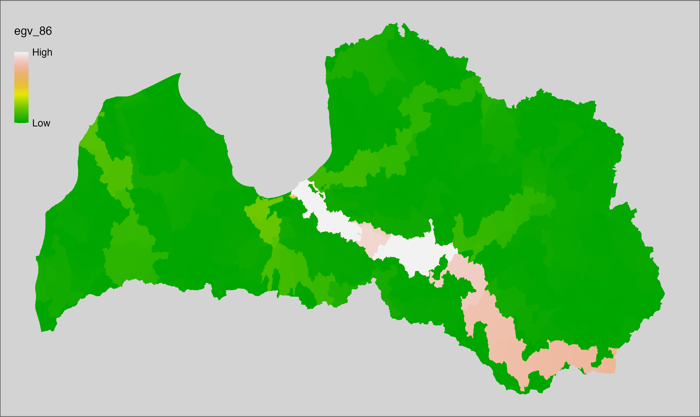


## HydroClim_18-max_cell	{#ch06.087}

**filename:** `HydroClim_18-max_cell.tif`	

**layername:** `egv_87`	

**English name:** Maximum per subcatchment upstream mean monthly precipitation amount (kg m⁻² year⁻¹) of the warmest quarter (HydroClim) within the analysis cell (1 ha)

**Latvian name:** Sateces apakšbaseina maksimālais augšteces nokrišņu daudzums siltākajā ceturksnī (kg m⁻² year⁻¹) (HydroClim) analīzes šūnā (1 ha)

**Procedure:** Information - both basins and raster layers - from [HydroClim data](#Ch04.12) 
is used. First, basin CRS is transformed to epsg:3059. Then zonal statistics (per basin) with 
layer specific summary function - max - are calculated (`exactextractr::exact_extract()`) 
and then rasterized with `egvtools::polygon2input()`. Once rasterized to input data, 
EGV is created with `egvtools::input2egv()`. To prevent from gaps at the edges, 
inderse distance weighted (power = 2) gap filling is implemented. To save disk space, 
intermediate input layer is unlinked.


``` r
# libs ----
if(!require(egvtools)) {remotes::install_github("aavotins/egvtools"); require(egvtools)}
if(!require(terra)) {install.packages("terra"); require(terra)}
if(!require(tidyverse)) {install.packages("tidyverse"); require(tidyverse)}
if(!require(sf)) {install.packages("sf"); require(sf)}
if(!require(sfarrow)) {install.packages("sfarrow"); require(sfarrow)}
if(!require(exactextractr)) {install.packages("exactextractr"); require(exactextractr)}

# basins ----
level12=st_read("./Geodata/2024/HydroClim/hybas_lake_eu_lev01-12_v1c/hybas_lake_eu_lev12_v1c.shp")
grid_1km=sfarrow::st_read_parquet("./Templates/TemplateGrids/tikls1km_sauzeme.parquet")
grid_1km=st_transform(grid_1km,crs=3059)
level12=st_transform(level12,crs=3059)
level12=level12[grid_1km,,]

level12=st_make_valid(level12)

# job ----

localname="HydroClim_18-max_cell.tif"
layername="egv_87"
summary_function="max"
  
slanis=rast(paste0("./Geodata/2024/HydroClim/",localname))
level12$Hydro_values=exact_extract(slanis,level12,fun=summary_function)
  
polygon2input(vector_data = level12,
              template_path = "./Templates/TemplateRasters/LV10m_10km.tif",
              out_path = "./RasterGrids_10m/2024/",
              file_name = localname,
              value_field = "Hydro_values",
              fun="first",
              value_type = "continuous",
              prepare=FALSE,
              project_mode = "auto",
              check_na = FALSE,
              plot_result=FALSE,
              plot_gaps = FALSE,
              overwrite=TRUE)
  
egvrez=input2egv(input=paste0("./RasterGrids_10m/2024/",localname),
                 egv_template= "./Templates/TemplateRasters/LV100m_10km.tif",
                 summary_function = "average",
                 missing_job = "FillOutput",
                 input_template = "./Templates/TemplateRasters/LV10m_10km.tif",
                 outlocation = "./RasterGrids_100m/2024/RAW/",
                 outfilename = localname,
                 layername = layername,
                 idw_weight = 2,
                 plot_gaps = FALSE,plot_final = FALSE)
egvrez
  
unlink(paste0("./RasterGrids_10m/2024/",localname))
```


## HydroClim_19-max_cell	{#ch06.088}

**filename:** `HydroClim_19-max_cell.tif`	

**layername:** `egv_88`	

**English name:** Maximum per subcatchment upstream mean monthly precipitation amount (kg m⁻² year⁻¹) of the coldest quarter (HydroClim) within the analysis cell (1 ha)

**Latvian name:** Sateces apakšbaseina maksimālais augšteces nokrišņu daudzums vēsākajā ceturksnī (kg m⁻² year⁻¹) (HydroClim) analīzes šūnā (1 ha)

**Procedure:** Information - both basins and raster layers - from [HydroClim data](#Ch04.12) 
is used. First, basin CRS is transformed to epsg:3059. Then zonal statistics (per basin) with 
layer specific summary function - max - are calculated (`exactextractr::exact_extract()`) 
and then rasterized with `egvtools::polygon2input()`. Once rasterized to input data, 
EGV is created with `egvtools::input2egv()`. To prevent from gaps at the edges, 
inderse distance weighted (power = 2) gap filling is implemented. To save disk space, 
intermediate input layer is unlinked.


``` r
# libs ----
if(!require(egvtools)) {remotes::install_github("aavotins/egvtools"); require(egvtools)}
if(!require(terra)) {install.packages("terra"); require(terra)}
if(!require(tidyverse)) {install.packages("tidyverse"); require(tidyverse)}
if(!require(sf)) {install.packages("sf"); require(sf)}
if(!require(sfarrow)) {install.packages("sfarrow"); require(sfarrow)}
if(!require(exactextractr)) {install.packages("exactextractr"); require(exactextractr)}

# basins ----
level12=st_read("./Geodata/2024/HydroClim/hybas_lake_eu_lev01-12_v1c/hybas_lake_eu_lev12_v1c.shp")
grid_1km=sfarrow::st_read_parquet("./Templates/TemplateGrids/tikls1km_sauzeme.parquet")
grid_1km=st_transform(grid_1km,crs=3059)
level12=st_transform(level12,crs=3059)
level12=level12[grid_1km,,]

level12=st_make_valid(level12)

# job ----

localname="HydroClim_19-max_cell.tif"
layername="egv_88"
summary_function="max"
  
slanis=rast(paste0("./Geodata/2024/HydroClim/",localname))
level12$Hydro_values=exact_extract(slanis,level12,fun=summary_function)
  
polygon2input(vector_data = level12,
              template_path = "./Templates/TemplateRasters/LV10m_10km.tif",
              out_path = "./RasterGrids_10m/2024/",
              file_name = localname,
              value_field = "Hydro_values",
              fun="first",
              value_type = "continuous",
              prepare=FALSE,
              project_mode = "auto",
              check_na = FALSE,
              plot_result=FALSE,
              plot_gaps = FALSE,
              overwrite=TRUE)
  
egvrez=input2egv(input=paste0("./RasterGrids_10m/2024/",localname),
                 egv_template= "./Templates/TemplateRasters/LV100m_10km.tif",
                 summary_function = "average",
                 missing_job = "FillOutput",
                 input_template = "./Templates/TemplateRasters/LV10m_10km.tif",
                 outlocation = "./RasterGrids_100m/2024/RAW/",
                 outfilename = localname,
                 layername = layername,
                 idw_weight = 2,
                 plot_gaps = FALSE,plot_final = FALSE)
egvrez
  
unlink(paste0("./RasterGrids_10m/2024/",localname))
```


## Distance_Builtup_cell	{#ch06.089}

**filename:** `Distance_Builtup_cell.tif`	

**layername:** `egv_89`	

**English name:** Distance to Built-Up features, average within the analysis cell (1 ha)

**Latvian name:** Attālums līdz apbūvei, vidējais analīzes šūnā (1 ha)

**Procedure:**   Derived from [Landscape classification](#Ch05.03) with class 
500 reclassified as 1 and others as 0. Processed 
with `egvtools::distance2egv()`. 
To protect against possible data loss at edge cells, inverse distance 
weighted (power = 2) gap filling is implemented. 


``` r
# libs ----
if(!require(terra)) {install.packages("terra"); require(terra)}
if(!require(egvtools)) {remotes::install_github("aavotins/egvtools"); require(egvtools)}

# Distance_Builtup_cell.tif	egv_89 ----
simple_landscape=rast("./RasterGrids_10m/2024/Ainava_vienk_mask.tif")
builtup=ifel(simple_landscape==500,1,0)
plot(builtup)
distegv=distance2egv(input = builtup,
                     template_egv = template100,
                     values_as_one = 1,
                     fill_gaps = TRUE, idw_weight = 2,
                     outlocation = "RasterGrids_100m/2024/RAW/",
                     outfilename = "Distance_Builtup_cell.tif",
                     layername = "egv_89")
distegv
plot(rast("RasterGrids_100m/2024/RAW/Distance_Builtup_cell.tif"))
rm(builtup)
rm(distegv)
```

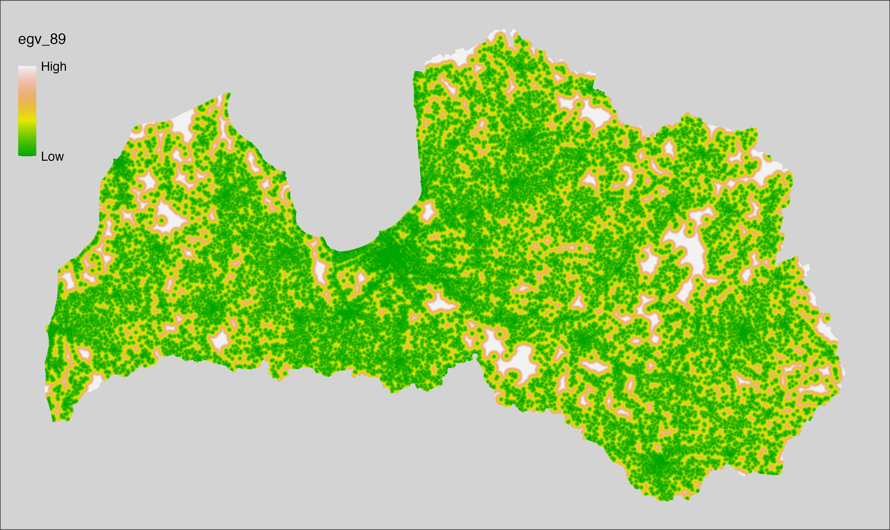


## Distance_ForestInside_cell	{#ch06.090}

**filename:** `Distance_ForestInside_cell.tif`	

**layername:** `egv_90`	

**English name:** Distance to Forest Edge Inside Forests, average within the analysis cell (1 ha)

**Latvian name:** Attālums līdz meža malai tā iekšienē, vidējais analīzes šūnā (1 ha)

**Procedure:**  Derived from [Landscape classification](#Ch05.03) with values in 
a range from 630 to 700 reclassified as 0 and others as 1. Processed 
with `egvtools::distance2egv()`. To protect against possible data loss at 
edge cells, inverse distance 
weighted (power = 2) gap filling is implemented.


``` r
# libs ----
if(!require(terra)) {install.packages("terra"); require(terra)}
if(!require(egvtools)) {remotes::install_github("aavotins/egvtools"); require(egvtools)}

# Distance_ForestInside_cell.tif	egv_90 ----
simple_landscape=rast("./RasterGrids_10m/2024/Ainava_vienk_mask.tif")
trees_inside=ifel(simple_landscape>=630&simple_landscape<700,0,1)
plot(trees_inside)
distegv=distance2egv(input = trees_inside,
                     template_egv = template100,
                     values_as_one = 1,
                     fill_gaps = TRUE, idw_weight = 2,
                     outlocation = "RasterGrids_100m/2024/RAW/",
                     outfilename = "Distance_ForestInside_cell.tif",
                     layername = "egv_90")
distegv
plot(rast("RasterGrids_100m/2024/RAW/Distance_ForestInside_cell.tif"))
rm(trees_inside)
rm(distegv)
```


## Distance_GrasslandPermanent_cell	{#ch06.091}

**filename:** `Distance_GrasslandPermanent_cell.tif`	

**layername:** `egv_91`	

**English name:** Distance to Permanent Grasslands, average within the analysis cell (1 ha)

**Latvian name:** Attālums līdz ilggadīgiem zālājiem, vidējais analīzes šūnā (1 ha)

**Procedure:** Derived from [Rural Support Service's information on declared fields](#Ch04.02) 
with `PRODUCT_CODE=="710"` classified as 1 and the rest of the country as 0. Processed 
with `egvtools::distance2egv()`. To protect against possible data loss at 
edge cells, inverse distance weighted (power = 2) gap filling is implemented.


``` r
# libs ----
if(!require(terra)) {install.packages("terra"); require(terra)}
if(!require(sf)) {install.packages("sf"); require(sf)}
if(!require(sfarrow)) {install.packages("sfarrow"); require(sfarrow)}
if(!require(tidyverse)) {install.packages("tidyverse"); require(tidyverse)}
if(!require(readxl)) {install.packages("readxl"); require(readxl)}
if(!require(raster)) {install.packages("raster"); require(raster)}
if(!require(fasterize)) {install.packages("fasterize"); require(fasterize)}
if(!require(egvtools)) {remotes::install_github("aavotins/egvtools"); require(egvtools)}

# templates ----
template10=rast("./Templates/TemplateRasters/LV10m_10km.tif")
nulls10=rast("./Templates/TemplateRasters/nulls_LV10m_10km.tif")

rastra_pamatne=raster(template10)

# Distance_GrasslandPermanent_cell.tif	egv_91 ----
kodes=read_excel("./Geodata/2024/LAD/KulturuKodi_2024.xlsx")
lad=sfarrow::st_read_parquet("./Geodata/2024/LAD/Lauki_2024.parquet")
permgrass=lad %>% 
  filter(PRODUCT_CODE=="710") %>% 
  mutate(yes=1)
permgrass_r=fasterize(permgrass,rastra_pamatne,field="yes",fun="first")
permgrass_t=rast(permgrass_r)
permgrass_t2=cover(permgrass_t,nulls10)
plot(permgrass_t2)
distegv=distance2egv(input = permgrass_t2,
                     template_egv = template100,
                     values_as_one = 1,
                     fill_gaps = TRUE, idw_weight = 2,
                     outlocation = "RasterGrids_100m/2024/RAW/",
                     outfilename = "Distance_GrasslandPermanent_cell.tif",
                     layername = "egv_91")
distegv
plot(rast("RasterGrids_100m/2024/RAW/Distance_GrasslandPermanent_cell.tif"))
rm(distegv)
rm(kodes)
rm(lad)
rm(permgrass)
rm(permgrass_r)
rm(permgrass_t)
rm(permgrass_t2)
```


## Distance_Landfill_cell	{#ch06.092}

**filename:** `Distance_Landfill_cell.tif`	

**layername:** `egv_92`	

**English name:** Distance to Landfills, average within the analysis cell (1 ha)

**Latvian name:** Attālums līdz atkritumu poligoniem, vidējais analīzes šūnā (1 ha)

**Procedure:** Directly follows [Waste and garbage disposal sites, landfills](#Ch04.14).
1. From the [attachaed file](https://github.com/aavotins/HiQBioDiv_EGVs/blob/main/Data/Geodata/2024/GarbageWasteLandfills/Atkritumi.xlsx) read sheet "Poligoni";

2. Create an `sf` object (epsg:3059);

3. Rasterize and cover so that cells of interest are 1 and others are 0;

4. create an egv with `egvtools::distance2egv()`. Expect warning regarding nothing 
to do with aggregation. It is because `egvtools::distance2egv()` already operate at 
egv-template not the input-template resolution. To protect against possible data loss at edge cells, 
inverse distance weighted (power = 2) gap filling is implemented. 


``` r
# libs ----
if(!require(terra)) {install.packages("terra"); require(terra)}
if(!require(sf)) {install.packages("sf"); require(sf)}
if(!require(tidyverse)) {install.packages("tidyverse"); require(tidyverse)}
if(!require(readxl)) {install.packages("readxl"); require(readxl)}
if(!require(egvtools)) {remotes::install_github("aavotins/egvtools"); require(egvtools)}

# templates ----
template100=rast("./Templates/TemplateRasters/LV100m_10km.tif")
nulls100=rast("./Templates/TemplateRasters/nulls_LV100m_10km.tif")

# Distance_Landfill_cell.tif egv_92 ----

# reading coordinates
landfills=read_excel("./Geodata/2024/GarbageWasteLandfills/Atkritumi.xlsx",sheet="Poligoni")
#sf object
landfills_sf=st_as_sf(landfills,coords=c("X","Y"),crs=3059)
# rasterize
landfills_rast=rasterize(landfills_sf,template100)
# raster to 1=Cell of interest, 0=background
landfills_bg=cover(landfills_rast,nulls100)

# create an egv
distegv=distance2egv(input = landfills_bg,
             template_egv = template100,
             values_as_one = 1,
             fill_gaps = TRUE, idw_weight = 2,
             outlocation = "RasterGrids_100m/2024/RAW/",
             outfilename = "Distance_Landfill_cell.tif",
             layername = "egv_92")
distegv
```

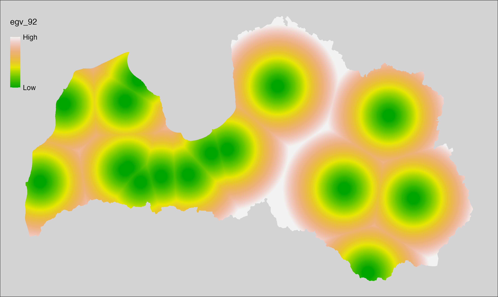


## Distance_Sea_cell	{#ch06.093}

**filename:** `Distance_Sea_cell.tif`	

**layername:** `egv_93`	

**English name:** Distance to Sea, average within the analysis cell (1 ha)

**Latvian name:** Attālums līdz jūrai, vidējais analīzes šūnā (1 ha)

**Procedure:**  Directly follows [Latvian Exclusive Economic Zone polygon](#Ch04.16).
1. Read layer as `sf` object (it already is epsg:3059);

2. Rasterize and cover so that cells of interest are 1 and others are 0;

3. create an egv with `egvtools::distance2egv()`. {fasterize} does not write CRS 
with `WKT` from epsg-string. Therefore it is better to use `project_to_template_input=TRUE` and
define input-template. However, the only difference is in how the CRS is stored, 
therefore this can ignored - distance will be calculated on the input CRS and only 
resulting layer will be projected to match egv-template (faster due to 10x aggregation of 
resolution). To protect against possible data loss at edge cells, 
inverse distance weighted (power = 2) gap filling is implemented. 


``` r
# libs ----
if(!require(terra)) {install.packages("terra"); require(terra)}
if(!require(sf)) {install.packages("sf"); require(sf)}
if(!require(egvtools)) {remotes::install_github("aavotins/egvtools"); require(egvtools)}
if(!require(raster)) {install.packages("raster"); require(raster)}
if(!require(fasterize)) {install.packages("fasterize"); require(fasterize)}


# templates ----
template10=rast("./Templates/TemplateRasters/LV10m_10km.tif")
nulls10=rast("./Templates/TemplateRasters/nulls_LV10m_10km.tif")
rastrs10=raster::raster(template10)


# Distance_Sea_cell.tif egv_93 ----

# sea layer, sf
sea=st_read("./Geodata/2024/LV_EEZ/LV_EEZ.shp")

# quick rasterization
sea_r=fasterize(sea,rastrs10,field="LV_EEZ")
sea_rast=rast(sea_r)

# # raster to 1=Cell of interest, 0=background
sea_bg=cover(sea_rast,nulls10)

# create an egv
distegv=distance2egv(input = sea_bg,
                     template_egv = "./Templates/TemplateRasters/LV100m_10km.tif",
                     values_as_one = 1,
                     project_to_template_input=TRUE, # fasterize stores CRS differently
                     template_input=template10,
                     fill_gaps = TRUE, idw_weight = 2,
                     outlocation = "RasterGrids_100m/2024/RAW/",
                     outfilename = "Distance_Sea_cell.tif",
                     layername = "egv_93")
distegv
```

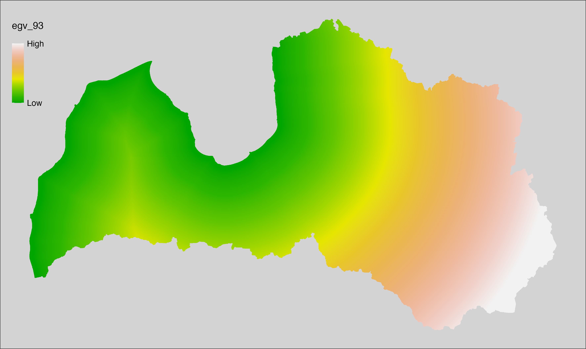


## Distance_Trees_cell	{#ch06.094}

**filename:** `Distance_Trees_cell.tif`	

**layername:** `egv_94`	

**English name:** Distance to Trees, average within the analysis cell (1 ha)

**Latvian name:** Attālums līdz kokiem, vidējais analīzes šūnā (1 ha)

**Procedure:** Derived from [Landscape classification](#Ch05.03) with values in 
a range from 630 to 700 reclassified as 1 and others as 0. Processed 
with `egvtools::distance2egv()`. To protect against possible data loss at 
edge cells, inverse distance 
weighted (power = 2) gap filling is implemented.


``` r
# libs ----
if(!require(terra)) {install.packages("terra"); require(terra)}
if(!require(egvtools)) {remotes::install_github("aavotins/egvtools"); require(egvtools)}

# Distance_Trees_cell.tif	egv_94 ----
simple_landscape=rast("./RasterGrids_10m/2024/Ainava_vienk_mask.tif")
trees=ifel(simple_landscape>=630&simple_landscape<700,1,0)
plot(trees)
distegv=distance2egv(input = trees,
                     template_egv = template100,
                     values_as_one = 1,
                     fill_gaps = TRUE, idw_weight = 2,
                     outlocation = "RasterGrids_100m/2024/RAW/",
                     outfilename = "Distance_Trees_cell.tif",
                     layername = "egv_94")
distegv
plot(rast("RasterGrids_100m/2024/RAW/Distance_Trees_cell.tif"))
rm(trees)
rm(distegv)
```


## Distance_Waste_cell	{#ch06.095}

**filename:** `Distance_Waste_cell.tif`	

**layername:** `egv_95`	

**English name:** Distance to Waste disposal sites, average within the analysis cell (1 ha)

**Latvian name:** Attālums līdz atkritumu šķirošanas un uzglabāšanas vietām, vidējais analīzes šūnā (1 ha)

**Procedure:** Directly follows [Waste and garbage disposal sites, landfills](#Ch04.14).
1. From the [attachaed file](https://github.com/aavotins/HiQBioDiv_EGVs/blob/main/Data/Geodata/2024/GarbageWasteLandfills/Atkritumi.xlsx) read sheet "AtkritumuVietas" and clean names;

2. Create an `sf` object (epsg:3059);

3. Filter to non-deposit collection locations;

4. Rasterize and cover so that cells of interest are 1 and others are 0;

5. create an egv with `egvtools::distance2egv()`. Expect warning regarding nothing 
to do with aggregation. It is because `egvtools::distance2egv()` already operate at 
egv-template not the input-template resolution. To protect against possible data loss at edge cells, 
inverse distance weighted (power = 2) gap filling is implemented. 


``` r
# libs ----
if(!require(terra)) {install.packages("terra"); require(terra)}
if(!require(sf)) {install.packages("sf"); require(sf)}
if(!require(tidyverse)) {install.packages("tidyverse"); require(tidyverse)}
if(!require(readxl)) {install.packages("readxl"); require(readxl)}
if(!require(egvtools)) {remotes::install_github("aavotins/egvtools"); require(egvtools)}

# templates ----
template100=rast("./Templates/TemplateRasters/LV100m_10km.tif")
nulls100=rast("./Templates/TemplateRasters/nulls_LV100m_10km.tif")


# Distance_Waste_cell.tif egv_95 ----

# reading coordinates
waste=read_excel("./Geodata/2024/GarbageWasteLandfills/Atkritumi.xlsx",sheet="AtkritumuVietas")
# cleaning names
waste2=janitor::clean_names(waste)
#sf object
waste_sf=st_as_sf(waste2,coords=c("y_koordinata_lks92_tm","x_koordinata_lks92_tm"),crs=3059)
# filtering to non-deposit
table(waste_sf$pienemsanas_vietas_tips)
waste_sf2=waste_sf %>% 
  filter(!str_detect(pienemsanas_vietas_tips,"Depozīta"))
# rasterize
waste_rast=rasterize(waste_sf2,template100)
# raster to 1=Cell of interest, 0=background
wastw_bg=cover(waste_rast,nulls100)

# create an egv
distegv=distance2egv(input = wastw_bg,
                     template_egv = template100,
                     values_as_one = 1,
                     fill_gaps = TRUE, idw_weight = 2,
                     outlocation = "RasterGrids_100m/2024/RAW/",
                     outfilename = "Distance_Waste_cell.tif",
                     layername = "egv_95")
distegv
```

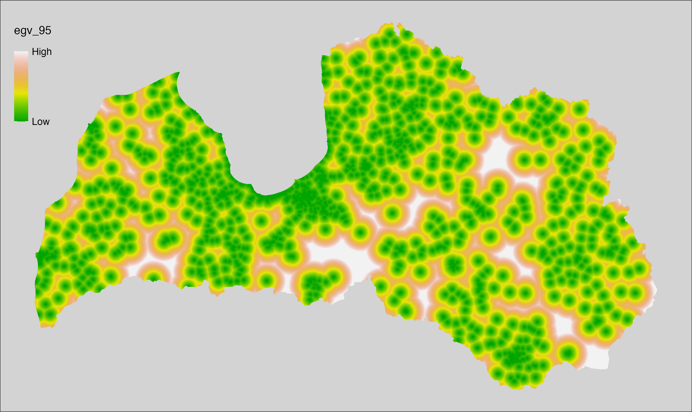


## Distance_Water_cell	{#ch06.096}

**filename:** `Distance_Water_cell.tif`	

**layername:** `egv_96`	

**English name:** Distance to Waterbodies, average within the analysis cell (1 ha)

**Latvian name:** Attālums līdz ūdenstilpēn, vidējais analīzes šūnā (1 ha)

**Procedure:** Derived from [Landscape classification](#Ch05.03) with class 200 
reclassified as 1 and others as 0. Processed with `egvtools::distance2egv()`. 
To protect against possible data loss at edge cells, inverse distance 
weighted (power = 2) gap filling is implemented.


``` r
# libs ----
if(!require(terra)) {install.packages("terra"); require(terra)}
if(!require(egvtools)) {remotes::install_github("aavotins/egvtools"); require(egvtools)}

# Distance_Water_cell.tif	egv_96 ----
simple_landscape=rast("./RasterGrids_10m/2024/Ainava_vienk_mask.tif")
water=ifel(simple_landscape==200,1,0)
plot(water)
distegv=distance2egv(input = water,
                     template_egv = template100,
                     values_as_one = 1,
                     fill_gaps = TRUE, idw_weight = 2,
                     outlocation = "RasterGrids_100m/2024/RAW/",
                     outfilename = "Distance_Water_cell.tif",
                     layername = "egv_96")
distegv
plot(rast("RasterGrids_100m/2024/RAW/Distance_Water_cell.tif"))
rm(water)
rm(distegv)
```


## Distance_WaterInside_cell	{#ch06.097}

**filename:** `Distance_WaterInside_cell.tif`	

**layername:** `egv_97`	

**English name:** Distance to Waterbody Edge Inside Waterbody, average within the analysis cell (1 ha)

**Latvian name:** Attālums līdz ūdenstilpes malai tās iekšienē, vidējais analīzes šūnā (1 ha)

**Procedure:** Derived from [Landscape classification](#Ch05.03) with class 200 
reclassified as 0 and others as 1. Processed with `egvtools::distance2egv()`. 
To protect against possible data loss at edge cells, inverse distance 
weighted (power = 2) gap filling is implemented. 


``` r
# libs ----
if(!require(terra)) {install.packages("terra"); require(terra)}
if(!require(egvtools)) {remotes::install_github("aavotins/egvtools"); require(egvtools)}

# Distance_WaterInside_cell.tif	egv_97 ----
simple_landscape=rast("./RasterGrids_10m/2024/Ainava_vienk_mask.tif")
water_outside=ifel(simple_landscape==200,0,1)
plot(water_outside)
distegv=distance2egv(input = water_outside,
                     template_egv = template100,
                     values_as_one = 1,
                     fill_gaps = TRUE, idw_weight = 2,
                     outlocation = "RasterGrids_100m/2024/RAW/",
                     outfilename = "Distance_WaterInside_cell.tif",
                     layername = "egv_97")
distegv
plot(rast("RasterGrids_100m/2024/RAW/Distance_WaterInside_cell.tif"))
rm(water_outside)
rm(distegv)
```

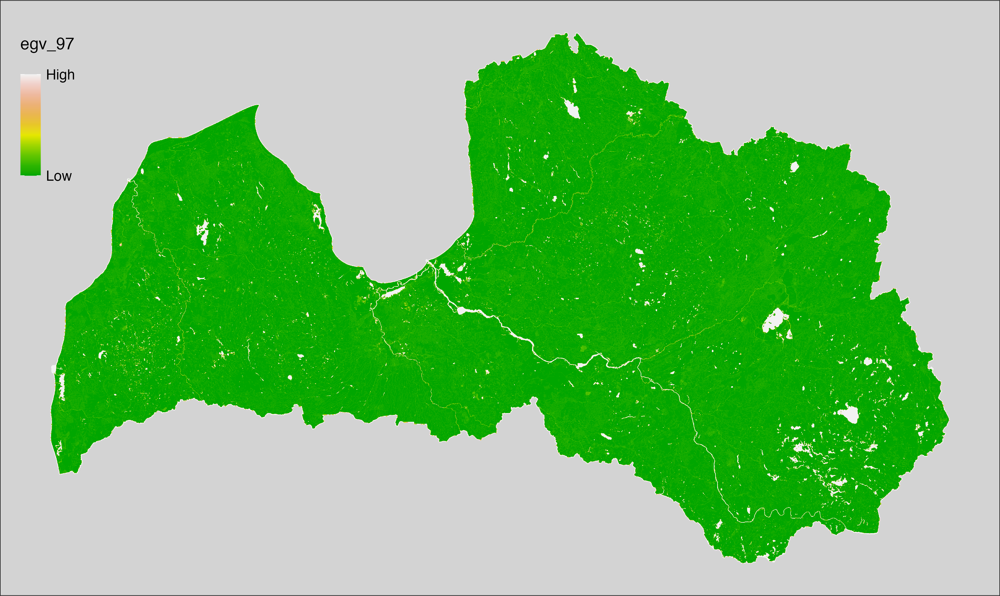


## Diversity_Farmland_r500	{#ch06.098}

**filename:** `Diversity_Farmland_r500.tif`	

**layername:** `egv_98`	

**English name:** Average farmland class α-diversity of 500 m grid cells within the 0.5 km landscape

**Latvian name:** Vidējā lauku ainavas klašu 500 m šūnu α-daudzveidība 0.5 km ainavā

**Procedure:** Derived from [Landscape diversity](#Ch05.04), more precisely 
[Farmland diversity](#Ch05.04.0). Average value of  25 ha 
cells diversity index values calculated with `egvtools::radius_function()`. To 
guard against missing values at the edges, inverse distance wieghted (power = 2) 
gap filling is allowed. File is written twice, to ensure layername.


``` r
# Libs ----
if(!require(egvtools)) {remotes::install_github("aavotins/egvtools"); require(egvtools)}
if(!require(terra)) {install.packages("terra"); require(terra)}

# templates ----
template100=rast("./Templates/TemplateRasters/LV100m_10km.tif")

# radii
radius_function(
  kvadrati_path  = "./Templates/TemplateGrids/tiles/",
  radii_path     = "./Templates/TemplateGridPoints/tiles/",
  tikls100_path  = "./Templates/TemplateGrids/tikls100_sauzeme.parquet",
  template_path  = "./Templates/TemplateRasters/LV100m_10km.tif",
  input_layers   = c("./RasterGrids_500m/2024/Diversity_Farmland_500x.tif"),
  layer_prefixes = c("Diversity_Farmland"),
  output_dir     = "./RasterGrids_100m/2024/RAW/",
  n_workers      = 12,
  radii          = c("r500"),
  radius_mode    = "sparse",
  extract_fun    = "mean",
  fill_missing   = TRUE,
  IDW_weight     = 2,
  future_max_size = 5 * 1024^3)

# Diversity_Farmland_r500.tif	egv_98
slanis=rast("./RasterGrids_100m/2024/RAW/Diversity_Farmland_r500.tif")
names(slanis)="egv_98"
slanis2=project(slanis,template100)
writeRaster(slanis2,
            "./RasterGrids_100m/2024/RAW/Diversity_Farmland_r500.tif",
            overwrite=TRUE)
```


## Diversity_Farmland_r1250	{#ch06.099}

**filename:** `Diversity_Farmland_r1250.tif`	

**layername:** `egv_99`	

**English name:** Average farmland class α-diversity of 500 m grid cells within the 1.25 km landscape

**Latvian name:** Vidējā lauku ainavas klašu 500 m šūnu α-daudzveidība 1.25 km ainavā

**Procedure:** Derived from [Landscape diversity](#Ch05.04), more precisely 
[Farmland diversity](#Ch05.04.0). Average value of  25 ha 
cells diversity index values calculated with `egvtools::radius_function()`. To 
guard against missing values at the edges, inverse distance wieghted (power = 2) 
gap filling is allowed. File is written twice, to ensure layername.


``` r
# Libs ----
if(!require(egvtools)) {remotes::install_github("aavotins/egvtools"); require(egvtools)}
if(!require(terra)) {install.packages("terra"); require(terra)}

# templates ----
template100=rast("./Templates/TemplateRasters/LV100m_10km.tif")

# radii
radius_function(
  kvadrati_path  = "./Templates/TemplateGrids/tiles/",
  radii_path     = "./Templates/TemplateGridPoints/tiles/",
  tikls100_path  = "./Templates/TemplateGrids/tikls100_sauzeme.parquet",
  template_path  = "./Templates/TemplateRasters/LV100m_10km.tif",
  input_layers   = c("./RasterGrids_500m/2024/Diversity_Farmland_500x.tif"),
  layer_prefixes = c("Diversity_Farmland"),
  output_dir     = "./RasterGrids_100m/2024/RAW/",
  n_workers      = 12,
  radii          = c("r1250"),
  radius_mode    = "sparse",
  extract_fun    = "mean",
  fill_missing   = TRUE,
  IDW_weight     = 2,
  future_max_size = 5 * 1024^3)

# Diversity_Farmland_r1250.tif	egv_99
slanis=rast("./RasterGrids_100m/2024/RAW/Diversity_Farmland_r1250.tif")
names(slanis)="egv_99"
slanis2=project(slanis,template100)
writeRaster(slanis2,
            "./RasterGrids_100m/2024/RAW/Diversity_Farmland_r1250.tif",
            overwrite=TRUE)
```

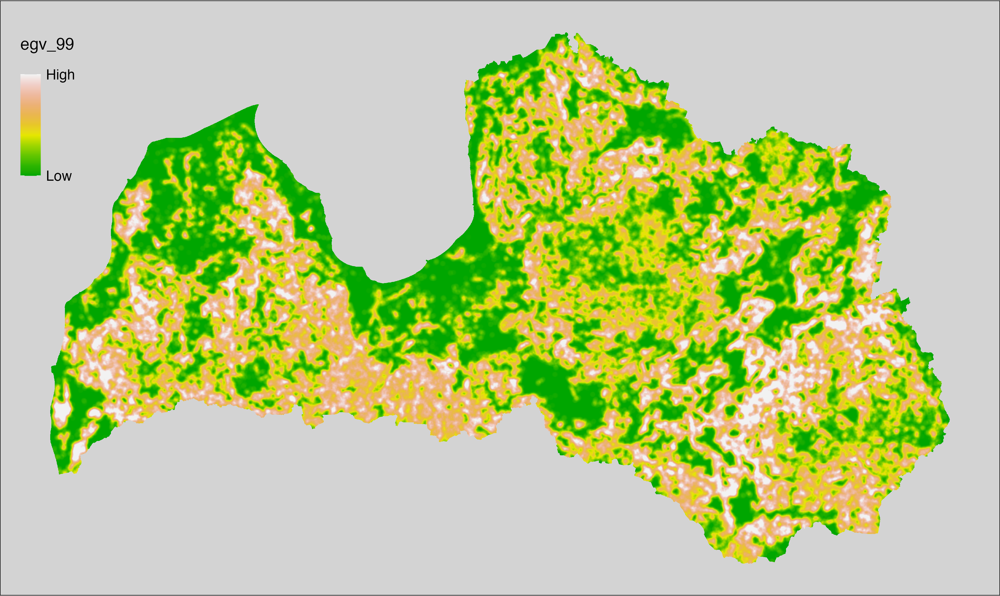


## Diversity_Farmland_r3000	{#ch06.100}

**filename:** `Diversity_Farmland_r3000.tif`	

**layername:** `egv_100`	

**English name:** Average farmland class α-diversity of 500 m grid cells within the 3 km landscape

**Latvian name:** Vidējā lauku ainavas klašu 500 m šūnu α-daudzveidība 3 km ainavā

**Procedure:** Derived from [Landscape diversity](#Ch05.04), more precisely 
[Farmland diversity](#Ch05.04.0). Average value of  25 ha 
cells diversity index values calculated with `egvtools::radius_function()`. To 
guard against missing values at the edges, inverse distance wieghted (power = 2) 
gap filling is allowed. File is written twice, to ensure layername.


``` r
# Libs ----
if(!require(egvtools)) {remotes::install_github("aavotins/egvtools"); require(egvtools)}
if(!require(terra)) {install.packages("terra"); require(terra)}

# templates ----
template100=rast("./Templates/TemplateRasters/LV100m_10km.tif")

# radii
radius_function(
  kvadrati_path  = "./Templates/TemplateGrids/tiles/",
  radii_path     = "./Templates/TemplateGridPoints/tiles/",
  tikls100_path  = "./Templates/TemplateGrids/tikls100_sauzeme.parquet",
  template_path  = "./Templates/TemplateRasters/LV100m_10km.tif",
  input_layers   = c("./RasterGrids_500m/2024/Diversity_Farmland_500x.tif"),
  layer_prefixes = c("Diversity_Farmland"),
  output_dir     = "./RasterGrids_100m/2024/RAW/",
  n_workers      = 12,
  radii          = c("r3000"),
  radius_mode    = "sparse",
  extract_fun    = "mean",
  fill_missing   = TRUE,
  IDW_weight     = 2,
  future_max_size = 5 * 1024^3)

# Diversity_Farmland_r3000.tif	egv_100
slanis=rast("./RasterGrids_100m/2024/RAW/Diversity_Farmland_r3000.tif")
names(slanis)="egv_100"
slanis2=project(slanis,template100)
writeRaster(slanis2,
            "./RasterGrids_100m/2024/RAW/Diversity_Farmland_r3000.tif",
            overwrite=TRUE)
```

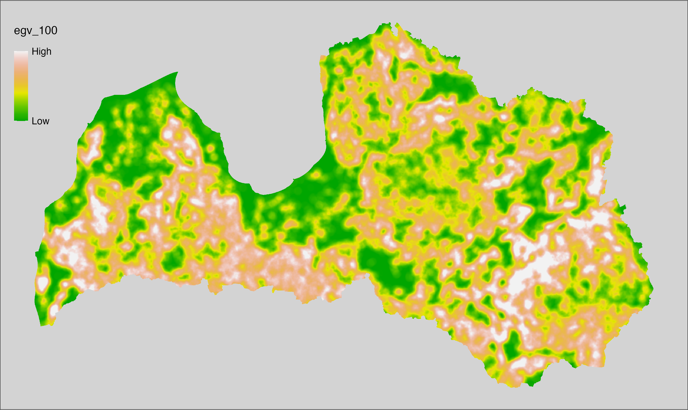


## Diversity_Farmland_r10000	{#ch06.101}

**filename:** `Diversity_Farmland_r10000.tif`	

**layername:** `egv_101`	

**English name:** Average farmland class α-diversity of 500 m grid cells within the 10 km landscape

**Latvian name:** Vidējā lauku ainavas klašu 500 m šūnu α-daudzveidība 10 km ainavā

**Procedure:** Derived from [Landscape diversity](#Ch05.04), more precisely 
[Farmland diversity](#Ch05.04.0). Average value of  25 ha 
cells diversity index values calculated with `egvtools::radius_function()`. To 
guard against missing values at the edges, inverse distance wieghted (power = 2) 
gap filling is allowed. File is written twice, to ensure layername.


``` r
# Libs ----
if(!require(egvtools)) {remotes::install_github("aavotins/egvtools"); require(egvtools)}
if(!require(terra)) {install.packages("terra"); require(terra)}

# templates ----
template100=rast("./Templates/TemplateRasters/LV100m_10km.tif")

# radii
radius_function(
  kvadrati_path  = "./Templates/TemplateGrids/tiles/",
  radii_path     = "./Templates/TemplateGridPoints/tiles/",
  tikls100_path  = "./Templates/TemplateGrids/tikls100_sauzeme.parquet",
  template_path  = "./Templates/TemplateRasters/LV100m_10km.tif",
  input_layers   = c("./RasterGrids_500m/2024/Diversity_Farmland_500x.tif"),
  layer_prefixes = c("Diversity_Farmland"),
  output_dir     = "./RasterGrids_100m/2024/RAW/",
  n_workers      = 12,
  radii          = c("r10000"),
  radius_mode    = "sparse",
  extract_fun    = "mean",
  fill_missing   = TRUE,
  IDW_weight     = 2,
  future_max_size = 5 * 1024^3)

# Diversity_Farmland_r10000.tif	egv_101
slanis=rast("./RasterGrids_100m/2024/RAW/Diversity_Farmland_r10000.tif")
names(slanis)="egv_101"
slanis2=project(slanis,template100)
writeRaster(slanis2,
            "./RasterGrids_100m/2024/RAW/Diversity_Farmland_r10000.tif",
            overwrite=TRUE)
```

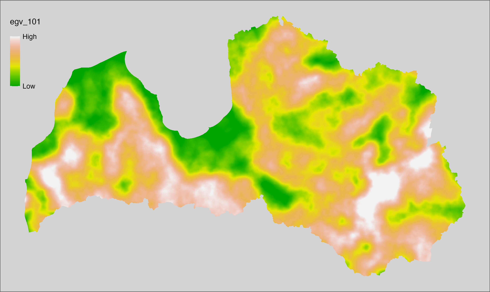


## Diversity_Forest_r500	{#ch06.102}

**filename:** `Diversity_Forest_r500.tif`	

**layername:** `egv_102`	

**English name:** Average forest class α-diversity of 500 m grid cells within the 0.5 km landscape

**Latvian name:** Vidējā mežu ainavas klašu 500 m šūnu α-daudzveidība 0.5 km ainavā

**Procedure:** Derived from [Landscape diversity](#Ch05.04), more precisely 
[Forest diversity](#Ch05.04.02). Average value of  25 ha 
cells diversity index values calculated with `egvtools::radius_function()`. To 
guard against missing values at the edges, inverse distance wieghted (power = 2) 
gap filling is allowed. File is written twice, to ensure layername.


``` r
# Libs ----
if(!require(egvtools)) {remotes::install_github("aavotins/egvtools"); require(egvtools)}
if(!require(terra)) {install.packages("terra"); require(terra)}

# templates ----
template100=rast("./Templates/TemplateRasters/LV100m_10km.tif")

# radii
radius_function(
  kvadrati_path  = "./Templates/TemplateGrids/tiles/",
  radii_path     = "./Templates/TemplateGridPoints/tiles/",
  tikls100_path  = "./Templates/TemplateGrids/tikls100_sauzeme.parquet",
  template_path  = "./Templates/TemplateRasters/LV100m_10km.tif",
  input_layers   = c("./RasterGrids_500m/2024/Diversity_Forests_500x.tif"),
  layer_prefixes = c("Diversity_Forest"),
  output_dir     = "./RasterGrids_100m/2024/RAW/",
  n_workers      = 12,
  radii          = c("r500"),
  radius_mode    = "sparse",
  extract_fun    = "mean",
  fill_missing   = TRUE,
  IDW_weight     = 2,
  future_max_size = 5 * 1024^3)

# Diversity_Forest_r500.tif	egv_102
slanis=rast("./RasterGrids_100m/2024/RAW/Diversity_Forest_r500.tif")
names(slanis)="egv_102"
slanis2=project(slanis,template100)
writeRaster(slanis2,
            "./RasterGrids_100m/2024/RAW/Diversity_Forest_r500.tif",
            overwrite=TRUE)
```


## Diversity_Forest_r1250	{#ch06.103}

**filename:** `Diversity_Forest_r1250.tif`	

**layername:** `egv_103`	

**English name:** Average forest class α-diversity of 500 m grid cells within the 1.25 km landscape

**Latvian name:** Vidējā mežu ainavas klašu 500 m šūnu α-daudzveidība 1.25 km ainavā

**Procedure:** Derived from [Landscape diversity](#Ch05.04), more precisely 
[Forest diversity](#Ch05.04.02). Average value of  25 ha 
cells diversity index values calculated with `egvtools::radius_function()`. To 
guard against missing values at the edges, inverse distance wieghted (power = 2) 
gap filling is allowed. File is written twice, to ensure layername.


``` r
# Libs ----
if(!require(egvtools)) {remotes::install_github("aavotins/egvtools"); require(egvtools)}
if(!require(terra)) {install.packages("terra"); require(terra)}

# templates ----
template100=rast("./Templates/TemplateRasters/LV100m_10km.tif")

# radii
radius_function(
  kvadrati_path  = "./Templates/TemplateGrids/tiles/",
  radii_path     = "./Templates/TemplateGridPoints/tiles/",
  tikls100_path  = "./Templates/TemplateGrids/tikls100_sauzeme.parquet",
  template_path  = "./Templates/TemplateRasters/LV100m_10km.tif",
  input_layers   = c("./RasterGrids_500m/2024/Diversity_Forests_500x.tif"),
  layer_prefixes = c("Diversity_Forest"),
  output_dir     = "./RasterGrids_100m/2024/RAW/",
  n_workers      = 12,
  radii          = c("r1250"),
  radius_mode    = "sparse",
  extract_fun    = "mean",
  fill_missing   = TRUE,
  IDW_weight     = 2,
  future_max_size = 5 * 1024^3)

# Diversity_Forest_r1250.tif	egv_103
slanis=rast("./RasterGrids_100m/2024/RAW/Diversity_Forest_r1250.tif")
names(slanis)="egv_103"
slanis2=project(slanis,template100)
writeRaster(slanis2,
            "./RasterGrids_100m/2024/RAW/Diversity_Forest_r1250.tif",
            overwrite=TRUE)
```

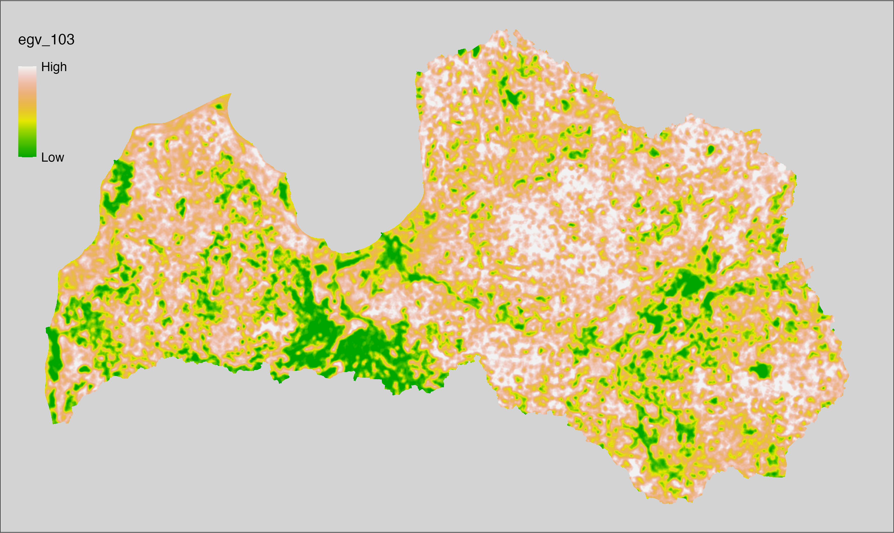


## Diversity_Forest_r3000	{#ch06.104}

**filename:** `Diversity_Forest_r3000.tif`	

**layername:** `egv_104`	

**English name:** Average forest class α-diversity of 500 m grid cells within the 3 km landscape

**Latvian name:** Vidējā mežu ainavas klašu 500 m šūnu α-daudzveidība 3 km ainavā

**Procedure:** Derived from [Landscape diversity](#Ch05.04), more precisely 
[Forest diversity](#Ch05.04.02). Average value of  25 ha 
cells diversity index values calculated with `egvtools::radius_function()`. To 
guard against missing values at the edges, inverse distance wieghted (power = 2) 
gap filling is allowed. File is written twice, to ensure layername.


``` r
# Libs ----
if(!require(egvtools)) {remotes::install_github("aavotins/egvtools"); require(egvtools)}
if(!require(terra)) {install.packages("terra"); require(terra)}

# templates ----
template100=rast("./Templates/TemplateRasters/LV100m_10km.tif")

# radii
radius_function(
  kvadrati_path  = "./Templates/TemplateGrids/tiles/",
  radii_path     = "./Templates/TemplateGridPoints/tiles/",
  tikls100_path  = "./Templates/TemplateGrids/tikls100_sauzeme.parquet",
  template_path  = "./Templates/TemplateRasters/LV100m_10km.tif",
  input_layers   = c("./RasterGrids_500m/2024/Diversity_Forests_500x.tif"),
  layer_prefixes = c("Diversity_Forest"),
  output_dir     = "./RasterGrids_100m/2024/RAW/",
  n_workers      = 12,
  radii          = c("r3000"),
  radius_mode    = "sparse",
  extract_fun    = "mean",
  fill_missing   = TRUE,
  IDW_weight     = 2,
  future_max_size = 5 * 1024^3)

# Diversity_Forest_r3000.tif	egv_104
slanis=rast("./RasterGrids_100m/2024/RAW/Diversity_Forest_r3000.tif")
names(slanis)="egv_104"
slanis2=project(slanis,template100)
writeRaster(slanis2,
            "./RasterGrids_100m/2024/RAW/Diversity_Forest_r3000.tif",
            overwrite=TRUE)
```

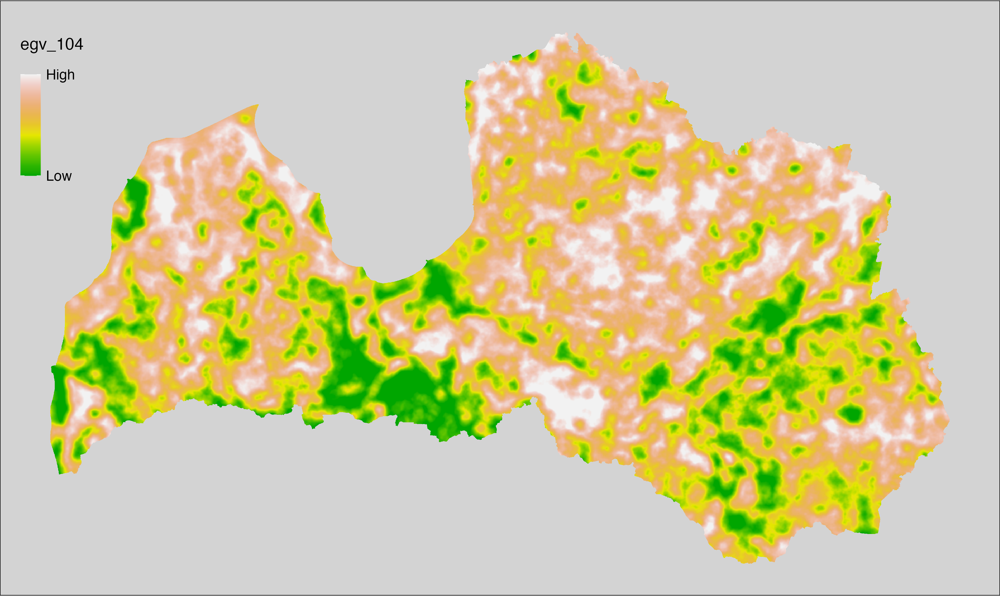


## Diversity_Forest_r10000	{#ch06.105}

**filename:** `Diversity_Forest_r10000.tif`	

**layername:** `egv_105`	

**English name:** Average forest class α-diversity of 500 m grid cells within the 10 km landscape

**Latvian name:** Vidējā mežu ainavas klašu 500 m šūnu α-daudzveidība 10 km ainavā

**Procedure:** Derived from [Landscape diversity](#Ch05.04), more precisely 
[Forest diversity](#Ch05.04.02). Average value of  25 ha 
cells diversity index values calculated with `egvtools::radius_function()`. To 
guard against missing values at the edges, inverse distance wieghted (power = 2) 
gap filling is allowed. File is written twice, to ensure layername.


``` r
# Libs ----
if(!require(egvtools)) {remotes::install_github("aavotins/egvtools"); require(egvtools)}
if(!require(terra)) {install.packages("terra"); require(terra)}

# templates ----
template100=rast("./Templates/TemplateRasters/LV100m_10km.tif")

# radii
radius_function(
  kvadrati_path  = "./Templates/TemplateGrids/tiles/",
  radii_path     = "./Templates/TemplateGridPoints/tiles/",
  tikls100_path  = "./Templates/TemplateGrids/tikls100_sauzeme.parquet",
  template_path  = "./Templates/TemplateRasters/LV100m_10km.tif",
  input_layers   = c("./RasterGrids_500m/2024/Diversity_Forests_500x.tif"),
  layer_prefixes = c("Diversity_Forest"),
  output_dir     = "./RasterGrids_100m/2024/RAW/",
  n_workers      = 12,
  radii          = c("r10000"),
  radius_mode    = "sparse",
  extract_fun    = "mean",
  fill_missing   = TRUE,
  IDW_weight     = 2,
  future_max_size = 5 * 1024^3)

# Diversity_Forest_r10000.tif	egv_105
slanis=rast("./RasterGrids_100m/2024/RAW/Diversity_Forest_r10000.tif")
names(slanis)="egv_105"
slanis2=project(slanis,template100)
writeRaster(slanis2,
            "./RasterGrids_100m/2024/RAW/Diversity_Forest_r10000.tif",
            overwrite=TRUE)
```

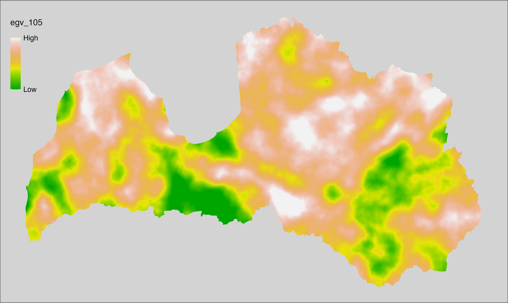


## Diversity_Total_r500	{#ch06.106}

**filename:** `Diversity_Total_r500.tif`	

**layername:** `egv_106`	

**English name:** Average combined landscape α-diversity of 500 m grid cells within the 0.5 km landscape

**Latvian name:** Vidējā visu ainavas klašu 500 m šūnu α-daudzveidība 0.5 km ainavā

**Procedure:** Derived from [Landscape diversity](#Ch05.04), more precisely 
[Landscape in general diversity](#Ch05.04.01). Average value of  25 ha 
cells diversity index values calculated with `egvtools::radius_function()`. To 
guard against missing values at the edges, inverse distance wieghted (power = 2) 
gap filling is allowed. File is written twice, to ensure layername.


``` r
# Libs ----
if(!require(egvtools)) {remotes::install_github("aavotins/egvtools"); require(egvtools)}
if(!require(terra)) {install.packages("terra"); require(terra)}

# templates ----
template100=rast("./Templates/TemplateRasters/LV100m_10km.tif")

# radii
radius_function(
  kvadrati_path  = "./Templates/TemplateGrids/tiles/",
  radii_path     = "./Templates/TemplateGridPoints/tiles/",
  tikls100_path  = "./Templates/TemplateGrids/tikls100_sauzeme.parquet",
  template_path  = "./Templates/TemplateRasters/LV100m_10km.tif",
  input_layers   = c("./RasterGrids_500m/2024/Diversity_GeneralLandscape_500x.tif"),
  layer_prefixes = c("Diversity_Total"),
  output_dir     = "./RasterGrids_100m/2024/RAW/",
  n_workers      = 12,
  radii          = c("r500"),
  radius_mode    = "sparse",
  extract_fun    = "mean",
  fill_missing   = TRUE,
  IDW_weight     = 2,
  future_max_size = 5 * 1024^3)

# Diversity_Total_r500.tif	egv_106
slanis=rast("./RasterGrids_100m/2024/RAW/Diversity_Total_r500.tif")
names(slanis)="egv_106"
slanis2=project(slanis,template100)
writeRaster(slanis2,
            "./RasterGrids_100m/2024/RAW/Diversity_Total_r500.tif",
            overwrite=TRUE)
```


## Diversity_Total_r1250	{#ch06.107}

**filename:** `Diversity_Total_r1250.tif`	

**layername:** `egv_107`	

**English name:** Average combined landscape α-diversity of 500 m grid cells within the 1.25 km landscape

**Latvian name:** Vidējā visu ainavas klašu 500 m šūnu α-daudzveidība 1.25 km ainavā

**Procedure:** Derived from [Landscape diversity](#Ch05.04), more precisely 
[Landscape in general diversity](#Ch05.04.01). Average value of  25 ha 
cells diversity index values calculated with `egvtools::radius_function()`. To 
guard against missing values at the edges, inverse distance wieghted (power = 2) 
gap filling is allowed. File is written twice, to ensure layername.


``` r
# Libs ----
if(!require(egvtools)) {remotes::install_github("aavotins/egvtools"); require(egvtools)}
if(!require(terra)) {install.packages("terra"); require(terra)}

# templates ----
template100=rast("./Templates/TemplateRasters/LV100m_10km.tif")

# radii
radius_function(
  kvadrati_path  = "./Templates/TemplateGrids/tiles/",
  radii_path     = "./Templates/TemplateGridPoints/tiles/",
  tikls100_path  = "./Templates/TemplateGrids/tikls100_sauzeme.parquet",
  template_path  = "./Templates/TemplateRasters/LV100m_10km.tif",
  input_layers   = c("./RasterGrids_500m/2024/Diversity_GeneralLandscape_500x.tif"),
  layer_prefixes = c("Diversity_Total"),
  output_dir     = "./RasterGrids_100m/2024/RAW/",
  n_workers      = 12,
  radii          = c("r1250"),
  radius_mode    = "sparse",
  extract_fun    = "mean",
  fill_missing   = TRUE,
  IDW_weight     = 2,
  future_max_size = 5 * 1024^3)

# Diversity_Total_r1250.tif	egv_107
slanis=rast("./RasterGrids_100m/2024/RAW/Diversity_Total_r1250.tif")
names(slanis)="egv_107"
slanis2=project(slanis,template100)
writeRaster(slanis2,
            "./RasterGrids_100m/2024/RAW/Diversity_Total_r1250.tif",
            overwrite=TRUE)
```

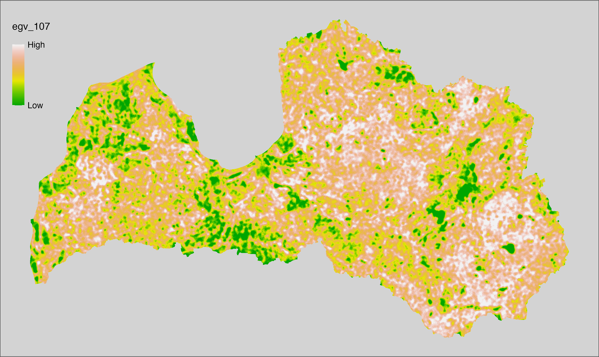


## Diversity_Total_r3000	{#ch06.108}

**filename:** `Diversity_Total_r3000.tif`	

**layername:** `egv_108`	

**English name:** Average combined landscape α-diversity of 500 m grid cells within the 3 km landscape

**Latvian name:** Vidējā visu ainavas klašu 500 m šūnu α-daudzveidība 3 km ainavā

**Procedure:** Derived from [Landscape diversity](#Ch05.04), more precisely 
[Landscape in general diversity](#Ch05.04.01). Average value of  25 ha 
cells diversity index values calculated with `egvtools::radius_function()`. To 
guard against missing values at the edges, inverse distance wieghted (power = 2) 
gap filling is allowed. File is written twice, to ensure layername.


``` r
# Libs ----
if(!require(egvtools)) {remotes::install_github("aavotins/egvtools"); require(egvtools)}
if(!require(terra)) {install.packages("terra"); require(terra)}

# templates ----
template100=rast("./Templates/TemplateRasters/LV100m_10km.tif")

# radii
radius_function(
  kvadrati_path  = "./Templates/TemplateGrids/tiles/",
  radii_path     = "./Templates/TemplateGridPoints/tiles/",
  tikls100_path  = "./Templates/TemplateGrids/tikls100_sauzeme.parquet",
  template_path  = "./Templates/TemplateRasters/LV100m_10km.tif",
  input_layers   = c("./RasterGrids_500m/2024/Diversity_GeneralLandscape_500x.tif"),
  layer_prefixes = c("Diversity_Total"),
  output_dir     = "./RasterGrids_100m/2024/RAW/",
  n_workers      = 12,
  radii          = c("r3000"),
  radius_mode    = "sparse",
  extract_fun    = "mean",
  fill_missing   = TRUE,
  IDW_weight     = 2,
  future_max_size = 5 * 1024^3)

# Diversity_Total_r3000.tif	egv_108
slanis=rast("./RasterGrids_100m/2024/RAW/Diversity_Total_r3000.tif")
names(slanis)="egv_108"
slanis2=project(slanis,template100)
writeRaster(slanis2,
            "./RasterGrids_100m/2024/RAW/Diversity_Total_r3000.tif",
            overwrite=TRUE)
```

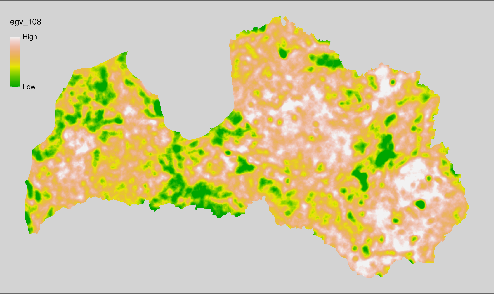


## Diversity_Total_r10000	{#ch06.109}

**filename:** `Diversity_Total_r10000.tif`	

**layername:** `egv_109`	

**English name:** Average combined landscape α-diversity of 500 m grid cells within the 10 km landscape

**Latvian name:** Vidējā visu ainavas klašu 500 m šūnu α-daudzveidība 10 km ainavā

**Procedure:** Derived from [Landscape diversity](#Ch05.04), more precisely 
[Landscape in general diversity](#Ch05.04.01). Average value of  25 ha 
cells diversity index values calculated with `egvtools::radius_function()`. To 
guard against missing values at the edges, inverse distance wieghted (power = 2) 
gap filling is allowed. File is written twice, to ensure layername.


``` r
# Libs ----
if(!require(egvtools)) {remotes::install_github("aavotins/egvtools"); require(egvtools)}
if(!require(terra)) {install.packages("terra"); require(terra)}

# templates ----
template100=rast("./Templates/TemplateRasters/LV100m_10km.tif")

# radii
radius_function(
  kvadrati_path  = "./Templates/TemplateGrids/tiles/",
  radii_path     = "./Templates/TemplateGridPoints/tiles/",
  tikls100_path  = "./Templates/TemplateGrids/tikls100_sauzeme.parquet",
  template_path  = "./Templates/TemplateRasters/LV100m_10km.tif",
  input_layers   = c("./RasterGrids_500m/2024/Diversity_GeneralLandscape_500x.tif"),
  layer_prefixes = c("Diversity_Total"),
  output_dir     = "./RasterGrids_100m/2024/RAW/",
  n_workers      = 12,
  radii          = c("r10000"),
  radius_mode    = "sparse",
  extract_fun    = "mean",
  fill_missing   = TRUE,
  IDW_weight     = 2,
  future_max_size = 5 * 1024^3)

# Diversity_Total_r10000.tif	egv_109
slanis=rast("./RasterGrids_100m/2024/RAW/Diversity_Total_r10000.tif")
names(slanis)="egv_109"
slanis2=project(slanis,template100)
writeRaster(slanis2,
            "./RasterGrids_100m/2024/RAW/Diversity_Total_r10000.tif",
            overwrite=TRUE)
```

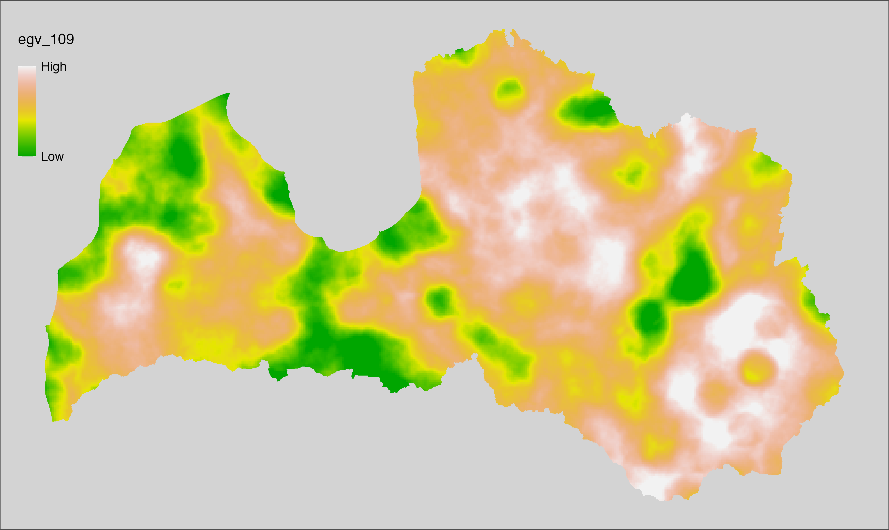


## Edges_Bogs-Trees_cell	{#ch06.110}

**filename:** `Edges_Bogs-Trees_cell.tif`	

**layername:** `egv_110`	

**English name:** Edge pixels of Bogs, Mires bordering with Trees within the analysis cell (1 ha)

**Latvian name:** Purvu malu ar kokiem garums analīzes šūnā (1 ha)

**Procedure:** First, values from 620 to 700 from [Landscape classification](#Ch05.03) are coded as 0 and everything else as NA. Then bog and transitional mire layers from [EDI](#Ch04.17) are reclassified to presence-only (value 1) and combined. Then, bog-and-mire layer (1=presence) is covered over 
tree layer (presence=0) and written to file (matching the input). Finally, with 
the function `egvtools::landscape_function()` total edge between the two classes 
is calculated. During calculation of landscape metric, inverse distance weighted (power = 2) gap filling on the output is initialized to ensure no missing values at the edges.


``` r
# Libs ----
if(!require(terra)) {install.packages("terra"); require(terra)}
if(!require(egvtools)) {remotes::install_github("aavotins/egvtools"); require(egvtools)}

if(!require(sf)) {install.packages("sf"); require(sf)}
if(!require(sfarrow)) {install.packages("sfarrow"); require(sfarrow)}
if(!require(raster)) {install.packages("raster"); require(raster)}
if(!require(fasterize)) {install.packages("fasterize"); require(fasterize)}
if(!require(tidyverse)) {install.packages("tidyverse"); require(tidyverse)}


# Templates -----
template10=rast("./Templates/TemplateRasters/LV10m_10km.tif")
nulls10=rast("./Templates/TemplateRasters/nulls_LV10m_10km.tif")

# simple landscape ----
simple_landscape=rast("./RasterGrids_10m/2024/Ainava_vienk_mask.tif")

# Edges_Bogs-Trees_input.tif ----

trees_from620=ifel(simple_landscape>=620 & simple_landscape<700,0,NA)
plot(trees_from620)

bogs=rast("./RasterGrids_10m/2024/EDI_BogsYN.tif")
bogs=subst(bogs,0,NA)
plot(bogs)
mires=rast("./RasterGrids_10m/2024/EDI_TransitionalMiresYN.tif")
mires=subst(mires,0,NA)
plot(mires)
bogs_mires=cover(bogs,mires)
plot(bogs_mires)

bm_trees=cover(bogs_mires,trees_from620)
plot(bm_trees)

edge_bm_trees=project(bm_trees,template10,
                      filename="./RasterGrids_10m/2024/Edges_Bogs-Trees_input.tif",
                      overwrite=TRUE)

rm(edge_bm_trees)
rm(bm_trees)

# Edges_Bogs-Trees_cell.tif	egv_110

landscape_function(
  landscape      = "./RasterGrids_10m/2024/Edges_Bogs-Trees_input.tif",
  zones          = "./Templates/TemplateGrids/tikls100_sauzeme.parquet",
  id_field       = "id",
  tile_field     = "tks50km",
  template       = "./Templates/TemplateRasters/LV100m_10km.tif",
  out_dir        = "./RasterGrids_100m/2024/RAW",
  out_filename   = "Edges_Bogs-Trees_cell.tif",
  out_layername  = "egv_110",
  what             = "lsm_l_te",
  lm_args          = list(count_boundary = FALSE),
  rasterize_engine = "fasterize",
  n_workers      = 12,
  future_max_size = 20 * 1024^3,
  fill_gaps      = TRUE,
  plot_gaps      = FALSE,
  plot_result    = FALSE
)
```


## Edges_Bogs-Trees_r500	{#ch06.111}

**filename:** `Edges_Bogs-Trees_r500.tif`	

**layername:** `egv_111`	

**English name:** Edge pixels of Bogs, Mires bordering with Trees within the 0.5 km landscape

**Latvian name:** Purvu malu ar kokiem garums 0,5 km ainavā

**Procedure:** Total edge at 500 m radius around the analysis grid cell, is calculated as the area-weighted sum of [analysis cells](#ch06.110) inside the buffer with `egvtools::radius_function`. During calculation of landscape metric, inverse distance weighted (power = 2) gap filling on the output is initialized to ensure no missing values at the edges. Finally, layer is rewritten to ensure layers name.


``` r
# Libs ----
if(!require(terra)) {install.packages("terra"); require(terra)}
if(!require(egvtools)) {remotes::install_github("aavotins/egvtools"); require(egvtools)}


# Templates -----
template100=rast("./Templates/TemplateRasters/LV100m_10km.tif")

# radii
radius_function(
  kvadrati_path  = "./Templates/TemplateGrids/tiles/",
  radii_path     = "./Templates/TemplateGridPoints/tiles/",
  tikls100_path  = "./Templates/TemplateGrids/tikls100_sauzeme.parquet",
  template_path  = "./Templates/TemplateRasters/LV100m_10km.tif",
  input_layers   = c("./RasterGrids_100m/2024/RAW/Edges_Bogs-Trees_cell.tif"),
  layer_prefixes = c("Edges_Bogs-Trees"),
  output_dir     = "./RasterGrids_100m/2024/RAW/",
  n_workers      = 4,
  radii          = c("r500"),
  radius_mode    = "sparse",
  extract_fun    = "sum",
  fill_missing   = TRUE,
  IDW_weight     = 2,
  future_max_size = 20 * 1024^3)

# Edges_Bogs-Trees_r500.tif	egv_111
slanis=rast("./RasterGrids_100m/2024/RAW/Edges_Bogs-Trees_r500.tif")
names(slanis)="egv_111"
slanis2=project(slanis,template100)
writeRaster(slanis2,
            "./RasterGrids_100m/2024/RAW/Edges_Bogs-Trees_r500.tif",
            overwrite=TRUE)
```

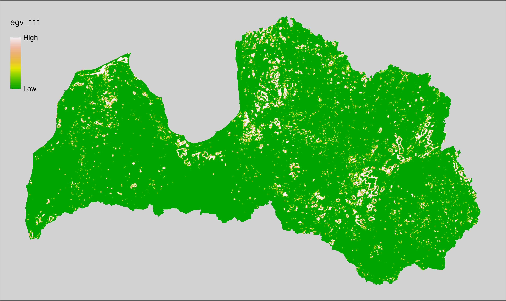


## Edges_Bogs-Trees_r1250	{#ch06.112}

**filename:** `Edges_Bogs-Trees_r1250.tif`	

**layername:** `egv_112`	

**English name:** Edge pixels of Bogs, Mires bordering with Trees within the 1.25 km landscape

**Latvian name:** Purvu malu ar kokiem garums 1,25 km ainavā

**Procedure:**  Total edge at 1250 m radius around the analysis grid cell, is calculated as the area-weighted sum of [analysis cells](#ch06.110) inside the buffer with `egvtools::radius_function`. During calculation of landscape metric, inverse distance weighted (power = 2) gap filling on the output is initialized to ensure no missing values at the edges. Finally, layer is rewritten to ensure layers name.


``` r
# Libs ----
if(!require(terra)) {install.packages("terra"); require(terra)}
if(!require(egvtools)) {remotes::install_github("aavotins/egvtools"); require(egvtools)}


# Templates -----
template100=rast("./Templates/TemplateRasters/LV100m_10km.tif")

# radii
radius_function(
  kvadrati_path  = "./Templates/TemplateGrids/tiles/",
  radii_path     = "./Templates/TemplateGridPoints/tiles/",
  tikls100_path  = "./Templates/TemplateGrids/tikls100_sauzeme.parquet",
  template_path  = "./Templates/TemplateRasters/LV100m_10km.tif",
  input_layers   = c("./RasterGrids_100m/2024/RAW/Edges_Bogs-Trees_cell.tif"),
  layer_prefixes = c("Edges_Bogs-Trees"),
  output_dir     = "./RasterGrids_100m/2024/RAW/",
  n_workers      = 4,
  radii          = c("r1250"),
  radius_mode    = "sparse",
  extract_fun    = "sum",
  fill_missing   = TRUE,
  IDW_weight     = 2,
  future_max_size = 20 * 1024^3)

# Edges_Bogs-Trees_r1250.tif	egv_112
slanis=rast("./RasterGrids_100m/2024/RAW/Edges_Bogs-Trees_r1250.tif")
names(slanis)="egv_112"
slanis2=project(slanis,template100)
writeRaster(slanis2,
            "./RasterGrids_100m/2024/RAW/Edges_Bogs-Trees_r1250.tif",
            overwrite=TRUE)
```

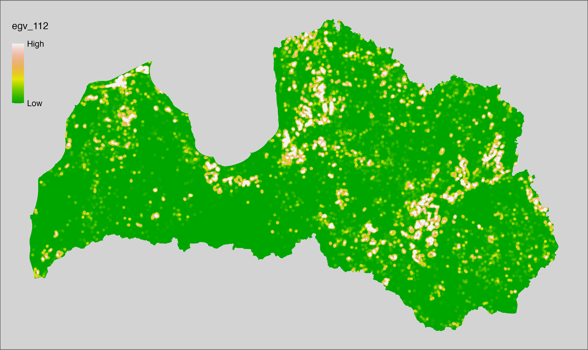


## Edges_Bogs-Trees_r3000	{#ch06.113}

**filename:** `Edges_Bogs-Trees_r3000.tif`	

**layername:** `egv_113`	

**English name:** Edge pixels of Bogs, Mires bordering with Trees within the 3 km landscape

**Latvian name:** Purvu malu ar kokiem garums 3 km ainavā

**Procedure:** Total edge at 3000 m radius around the analysis grid cell, is calculated as the area-weighted sum of [analysis cells](#ch06.110) inside the buffer with `egvtools::radius_function`. During calculation of landscape metric, inverse distance weighted (power = 2) gap filling on the output is initialized to ensure no missing values at the edges. Finally, layer is rewritten to ensure layers name.


``` r
# Libs ----
if(!require(terra)) {install.packages("terra"); require(terra)}
if(!require(egvtools)) {remotes::install_github("aavotins/egvtools"); require(egvtools)}


# Templates -----
template100=rast("./Templates/TemplateRasters/LV100m_10km.tif")

# radii
radius_function(
  kvadrati_path  = "./Templates/TemplateGrids/tiles/",
  radii_path     = "./Templates/TemplateGridPoints/tiles/",
  tikls100_path  = "./Templates/TemplateGrids/tikls100_sauzeme.parquet",
  template_path  = "./Templates/TemplateRasters/LV100m_10km.tif",
  input_layers   = c("./RasterGrids_100m/2024/RAW/Edges_Bogs-Trees_cell.tif"),
  layer_prefixes = c("Edges_Bogs-Trees"),
  output_dir     = "./RasterGrids_100m/2024/RAW/",
  n_workers      = 4,
  radii          = c("r3000"),
  radius_mode    = "sparse",
  extract_fun    = "sum",
  fill_missing   = TRUE,
  IDW_weight     = 2,
  future_max_size = 20 * 1024^3)

# Edges_Bogs-Trees_r3000.tif	egv_113
slanis=rast("./RasterGrids_100m/2024/RAW/Edges_Bogs-Trees_r3000.tif")
names(slanis)="egv_113"
slanis2=project(slanis,template100)
writeRaster(slanis2,
            "./RasterGrids_100m/2024/RAW/Edges_Bogs-Trees_r3000.tif",
            overwrite=TRUE)
```

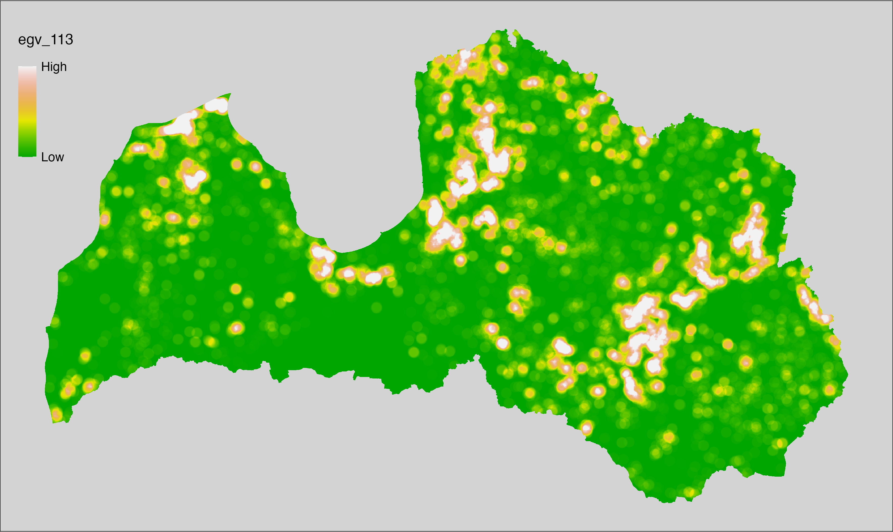


## Edges_Bogs-Trees_r10000	{#ch06.114}

**filename:** `Edges_Bogs-Trees_r10000.tif`	

**layername:** `egv_114`	

**English name:** Edge pixels of Bogs, Mires bordering with Trees within the 10 km landscape

**Latvian name:** Purvu malu ar kokiem garums 10 km ainavā

**Procedure:**Total edge at 10000 m radius around the analysis grid cell, is calculated as the area-weighted sum of [analysis cells](#ch06.110) inside the buffer with `egvtools::radius_function`. During calculation of landscape metric, inverse distance weighted (power = 2) gap filling on the output is initialized to ensure no missing values at the edges. Finally, layer is rewritten to ensure layers name.


``` r
# Libs ----
if(!require(terra)) {install.packages("terra"); require(terra)}
if(!require(egvtools)) {remotes::install_github("aavotins/egvtools"); require(egvtools)}


# Templates -----
template100=rast("./Templates/TemplateRasters/LV100m_10km.tif")

# radii
radius_function(
  kvadrati_path  = "./Templates/TemplateGrids/tiles/",
  radii_path     = "./Templates/TemplateGridPoints/tiles/",
  tikls100_path  = "./Templates/TemplateGrids/tikls100_sauzeme.parquet",
  template_path  = "./Templates/TemplateRasters/LV100m_10km.tif",
  input_layers   = c("./RasterGrids_100m/2024/RAW/Edges_Bogs-Trees_cell.tif"),
  layer_prefixes = c("Edges_Bogs-Trees"),
  output_dir     = "./RasterGrids_100m/2024/RAW/",
  n_workers      = 4,
  radii          = c("r10000"),
  radius_mode    = "sparse",
  extract_fun    = "sum",
  fill_missing   = TRUE,
  IDW_weight     = 2,
  future_max_size = 20 * 1024^3)

# Edges_Bogs-Trees_r10000.tif	egv_114
slanis=rast("./RasterGrids_100m/2024/RAW/Edges_Bogs-Trees_r10000.tif")
names(slanis)="egv_114"
slanis2=project(slanis,template100)
writeRaster(slanis2,
            "./RasterGrids_100m/2024/RAW/Edges_Bogs-Trees_r10000.tif",
            overwrite=TRUE)
```


## Edges_Bogs-Water_cell	{#ch06.115}

**filename:** `Edges_Bogs-Water_cell.tif`	

**layername:** `egv_115`	

**English name:** Edge pixels of Bogs, Mires bordering with Water within the analysis cell (1 ha)

**Latvian name:** Purvu malu ar ūdeni garums analīzes šūnā (1 ha)

**Procedure:** First, values 200 from [Landscape classification](#Ch05.03) are coded as 0 and everything else as NA. Then bog and transitional mire layers from [EDI](#Ch04.17) are reclassified to presence-only (value 1) and combined. Then, bog-and-mire layer (1=presence) is covered over 
water layer (presence=0) and written to file (matching the input). Finally, with 
the function `egvtools::landscape_function()` total edge between the two classes 
is calculated. During calculation of landscape metric, inverse distance weighted (power = 2) gap filling on the output is initialized to ensure no missing values at the edges.


``` r
# Libs ----
if(!require(terra)) {install.packages("terra"); require(terra)}
if(!require(egvtools)) {remotes::install_github("aavotins/egvtools"); require(egvtools)}

if(!require(sf)) {install.packages("sf"); require(sf)}
if(!require(sfarrow)) {install.packages("sfarrow"); require(sfarrow)}
if(!require(raster)) {install.packages("raster"); require(raster)}
if(!require(fasterize)) {install.packages("fasterize"); require(fasterize)}
if(!require(tidyverse)) {install.packages("tidyverse"); require(tidyverse)}


# Templates -----
template10=rast("./Templates/TemplateRasters/LV10m_10km.tif")
nulls10=rast("./Templates/TemplateRasters/nulls_LV10m_10km.tif")

# simple landscape ----
simple_landscape=rast("./RasterGrids_10m/2024/Ainava_vienk_mask.tif")

# Edges_Bogs-Water_input.tif ----
bogs=rast("./RasterGrids_10m/2024/EDI_BogsYN.tif")
bogs=subst(bogs,0,NA)
plot(bogs)
mires=rast("./RasterGrids_10m/2024/EDI_TransitionalMiresYN.tif")
mires=subst(mires,0,NA)
plot(mires)
bogs_mires=cover(bogs,mires)
plot(bogs_mires)

water=ifel(simple_landscape==200,0,NA)
plot(water)

bm_water=cover(bogs_mires,water)
plot(bm_water)

edge_bm_water=project(bm_water,template10,
                      filename="./RasterGrids_10m/2024/Edges_Bogs-Water_input.tif",
                      overwrite=TRUE)
rm(edge_bm_water)
rm(bm_water)


# Edges_Bogs-Water_cell.tif	egv_115 ----
landscape_function(
  landscape      = "./RasterGrids_10m/2024/Edges_Bogs-Water_input.tif",
  zones          = "./Templates/TemplateGrids/tikls100_sauzeme.parquet",
  id_field       = "id",
  tile_field     = "tks50km",
  template       = "./Templates/TemplateRasters/LV100m_10km.tif",
  out_dir        = "./RasterGrids_100m/2024/RAW",
  out_filename   = "Edges_Bogs-Water_cell.tif",
  out_layername  = "egv_115",
  what             = "lsm_l_te",
  lm_args          = list(count_boundary = FALSE),
  rasterize_engine = "fasterize",
  n_workers      = 12,
  future_max_size = 20 * 1024^3,
  fill_gaps      = TRUE,
  plot_gaps      = FALSE,
  plot_result    = FALSE
)
```

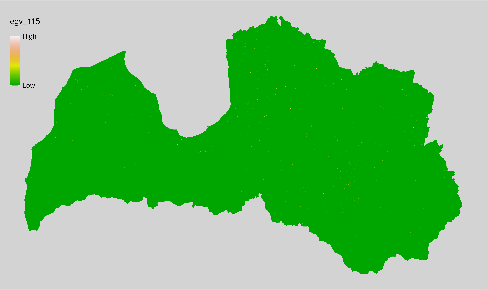


## Edges_Bogs-Water_r500	{#ch06.116}

**filename:** `Edges_Bogs-Water_r500.tif`	

**layername:** `egv_116`	

**English name:** Edge pixels of Bogs, Mires bordering with Water within the 0.5 km landscape

**Latvian name:** Purvu malu ar ūdeni garums 0,5 km ainavā

**Procedure:** Total edge at 500 m radius around the analysis grid cell, is calculated as the area-weighted sum of [analysis cells](#ch06.115) inside the buffer with `egvtools::radius_function`. During calculation of landscape metric, inverse distance weighted (power = 2) gap filling on the output is initialized to ensure no missing values at the edges. Finally, layer is rewritten to ensure layers name.


``` r
# Libs ----
if(!require(terra)) {install.packages("terra"); require(terra)}
if(!require(egvtools)) {remotes::install_github("aavotins/egvtools"); require(egvtools)}


# Templates -----
template100=rast("./Templates/TemplateRasters/LV100m_10km.tif")

# radii ----
radius_function(
  kvadrati_path  = "./Templates/TemplateGrids/tiles/",
  radii_path     = "./Templates/TemplateGridPoints/tiles/",
  tikls100_path  = "./Templates/TemplateGrids/tikls100_sauzeme.parquet",
  template_path  = "./Templates/TemplateRasters/LV100m_10km.tif",
  input_layers   = c("./RasterGrids_100m/2024/RAW/Edges_Bogs-Water_cell.tif"),
  layer_prefixes = c("Edges_Bogs-Water"),
  output_dir     = "./RasterGrids_100m/2024/RAW/",
  n_workers      = 12,
  radii          = c("r500"),
  radius_mode    = "sparse",
  extract_fun    = "sum",
  fill_missing   = TRUE,
  IDW_weight     = 2,
  future_max_size = 20 * 1024^3)

# Edges_Bogs-Water_r500.tif	egv_116
slanis=rast("./RasterGrids_100m/2024/RAW/Edges_Bogs-Water_r500.tif")
names(slanis)="egv_116"
slanis2=project(slanis,template100)
writeRaster(slanis2,
            "./RasterGrids_100m/2024/RAW/Edges_Bogs-Water_r500.tif",
            overwrite=TRUE)
```


## Edges_Bogs-Water_r1250	{#ch06.117}

**filename:** `Edges_Bogs-Water_r1250.tif`	

**layername:** `egv_117`	

**English name:** Edge pixels of Bogs, Mires bordering with Water within the 1.25 km landscape

**Latvian name:** Purvu malu ar ūdeni garums 1,25 km ainavā

**Procedure:** Total edge at 1250 m radius around the analysis grid cell, is calculated as the area-weighted sum of [analysis cells](#ch06.115) inside the buffer with `egvtools::radius_function`. During calculation of landscape metric, inverse distance weighted (power = 2) gap filling on the output is initialized to ensure no missing values at the edges. Finally, layer is rewritten to ensure layers name.


``` r
# Libs ----
if(!require(terra)) {install.packages("terra"); require(terra)}
if(!require(egvtools)) {remotes::install_github("aavotins/egvtools"); require(egvtools)}


# Templates -----
template100=rast("./Templates/TemplateRasters/LV100m_10km.tif")

# radii ----
radius_function(
  kvadrati_path  = "./Templates/TemplateGrids/tiles/",
  radii_path     = "./Templates/TemplateGridPoints/tiles/",
  tikls100_path  = "./Templates/TemplateGrids/tikls100_sauzeme.parquet",
  template_path  = "./Templates/TemplateRasters/LV100m_10km.tif",
  input_layers   = c("./RasterGrids_100m/2024/RAW/Edges_Bogs-Water_cell.tif"),
  layer_prefixes = c("Edges_Bogs-Water"),
  output_dir     = "./RasterGrids_100m/2024/RAW/",
  n_workers      = 12,
  radii          = c("r1250"),
  radius_mode    = "sparse",
  extract_fun    = "sum",
  fill_missing   = TRUE,
  IDW_weight     = 2,
  future_max_size = 20 * 1024^3)

# Edges_Bogs-Water_r1250.tif	egv_117
slanis=rast("./RasterGrids_100m/2024/RAW/Edges_Bogs-Water_r1250.tif")
names(slanis)="egv_117"
slanis2=project(slanis,template100)
writeRaster(slanis2,
            "./RasterGrids_100m/2024/RAW/Edges_Bogs-Water_r1250.tif",
            overwrite=TRUE)
```

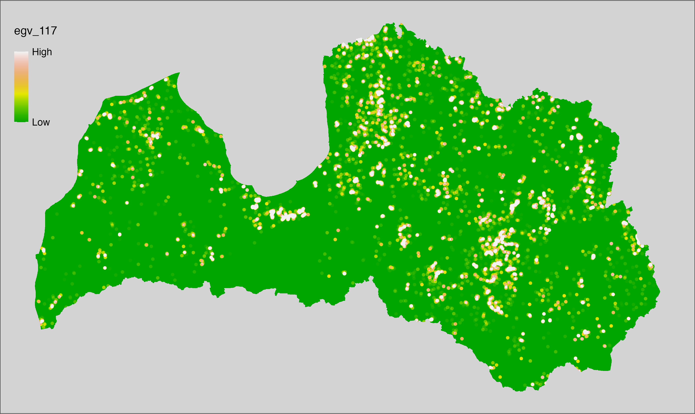


## Edges_Bogs-Water_r3000	{#ch06.118}

**filename:** `Edges_Bogs-Water_r3000.tif`	

**layername:** `egv_118`	

**English name:** Edge pixels of Bogs, Mires bordering with Water within the 3 km landscape

**Latvian name:** Purvu malu ar ūdeni garums 3 km ainavā

**Procedure:** Total edge at 3000 m radius around the analysis grid cell, is calculated as the area-weighted sum of [analysis cells](#ch06.115) inside the buffer with `egvtools::radius_function`. During calculation of landscape metric, inverse distance weighted (power = 2) gap filling on the output is initialized to ensure no missing values at the edges. Finally, layer is rewritten to ensure layers name.


``` r
# Libs ----
if(!require(terra)) {install.packages("terra"); require(terra)}
if(!require(egvtools)) {remotes::install_github("aavotins/egvtools"); require(egvtools)}


# Templates -----
template100=rast("./Templates/TemplateRasters/LV100m_10km.tif")

# radii ----
radius_function(
  kvadrati_path  = "./Templates/TemplateGrids/tiles/",
  radii_path     = "./Templates/TemplateGridPoints/tiles/",
  tikls100_path  = "./Templates/TemplateGrids/tikls100_sauzeme.parquet",
  template_path  = "./Templates/TemplateRasters/LV100m_10km.tif",
  input_layers   = c("./RasterGrids_100m/2024/RAW/Edges_Bogs-Water_cell.tif"),
  layer_prefixes = c("Edges_Bogs-Water"),
  output_dir     = "./RasterGrids_100m/2024/RAW/",
  n_workers      = 12,
  radii          = c("r3000"),
  radius_mode    = "sparse",
  extract_fun    = "sum",
  fill_missing   = TRUE,
  IDW_weight     = 2,
  future_max_size = 20 * 1024^3)

# Edges_Bogs-Water_r3000.tif	egv_118
slanis=rast("./RasterGrids_100m/2024/RAW/Edges_Bogs-Water_r3000.tif")
names(slanis)="egv_118"
slanis2=project(slanis,template100)
writeRaster(slanis2,
            "./RasterGrids_100m/2024/RAW/Edges_Bogs-Water_r3000.tif",
            overwrite=TRUE)
```

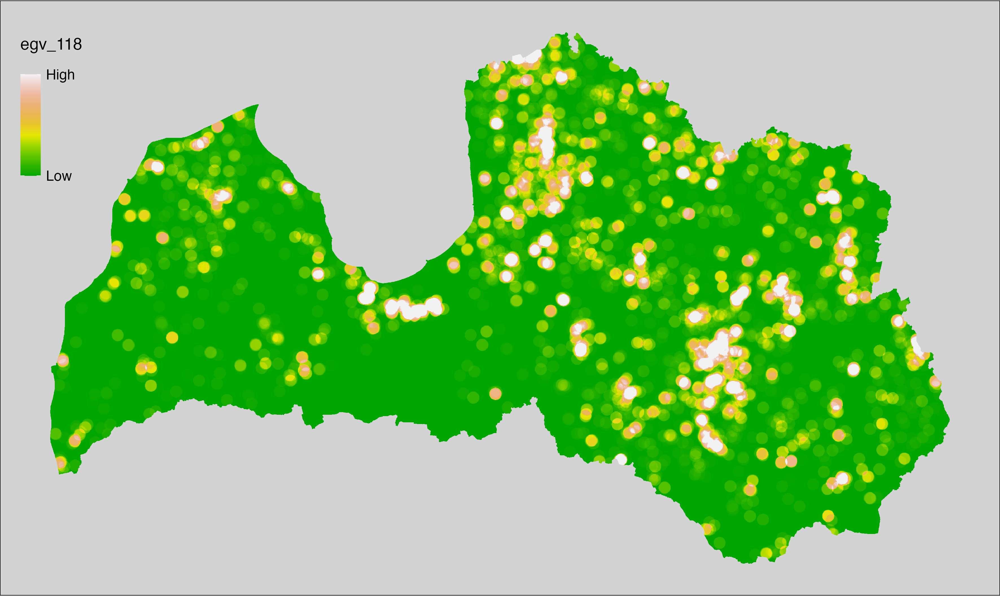


## Edges_Bogs-Water_r10000	{#ch06.119}

**filename:** `Edges_Bogs-Water_r10000.tif`	

**layername:** `egv_119`	

**English name:** Edge pixels of Bogs, Mires bordering with Water within the 10 km landscape

**Latvian name:** Purvu malu ar ūdeni garums 10 km ainavā

**Procedure:** Total edge at 10000 m radius around the analysis grid cell, is calculated as the area-weighted sum of [analysis cells](#ch06.115) inside the buffer with `egvtools::radius_function`. During calculation of landscape metric, inverse distance weighted (power = 2) gap filling on the output is initialized to ensure no missing values at the edges. Finally, layer is rewritten to ensure layers name.


``` r
# Libs ----
if(!require(terra)) {install.packages("terra"); require(terra)}
if(!require(egvtools)) {remotes::install_github("aavotins/egvtools"); require(egvtools)}


# Templates -----
template100=rast("./Templates/TemplateRasters/LV100m_10km.tif")

# radii ----
radius_function(
  kvadrati_path  = "./Templates/TemplateGrids/tiles/",
  radii_path     = "./Templates/TemplateGridPoints/tiles/",
  tikls100_path  = "./Templates/TemplateGrids/tikls100_sauzeme.parquet",
  template_path  = "./Templates/TemplateRasters/LV100m_10km.tif",
  input_layers   = c("./RasterGrids_100m/2024/RAW/Edges_Bogs-Water_cell.tif"),
  layer_prefixes = c("Edges_Bogs-Water"),
  output_dir     = "./RasterGrids_100m/2024/RAW/",
  n_workers      = 12,
  radii          = c("r10000"),
  radius_mode    = "sparse",
  extract_fun    = "sum",
  fill_missing   = TRUE,
  IDW_weight     = 2,
  future_max_size = 20 * 1024^3)

# Edges_Bogs-Water_r10000.tif	egv_119
slanis=rast("./RasterGrids_100m/2024/RAW/Edges_Bogs-Water_r10000.tif")
names(slanis)="egv_119"
slanis2=project(slanis,template100)
writeRaster(slanis2,
            "./RasterGrids_100m/2024/RAW/Edges_Bogs-Water_r10000.tif",
            overwrite=TRUE)
```

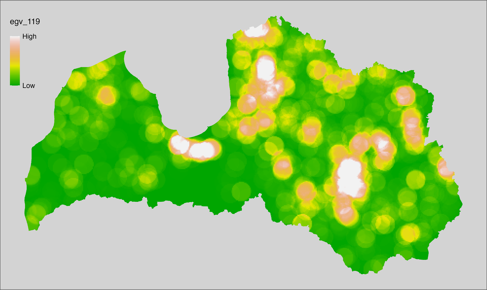


## Edges_Farmland-Builtup_cell	{#ch06.120}

**filename:** `Edges_Farmland-Builtup_cell.tif`	

**layername:** `egv_120`	

**English name:** Edge pixels of Farmland bordering with Built-Up areas within the analysis cell (1 ha)

**Latvian name:** Lauksaimniecības zemju malu ar apbūvi garums analīzes šūnā (1 ha)

**Procedure:** First, values larger than 300 and smaller than 400 from [Landscape classification](#Ch05.03) are coded as 1 and everything else as NA. Then values 500 from [Landscape classification](#Ch05.03) are coded as 0 and everything else as NA. Then, the first layer (1=presence) is covered over 
the second layer (presence=0) and written to file (matching the input). Finally, with 
the function `egvtools::landscape_function()` total edge between the two classes 
is calculated. During calculation of landscape metric, inverse distance weighted (power = 2) gap filling on the output is initialized to ensure no missing values at the edges.


``` r
# Libs ----
if(!require(terra)) {install.packages("terra"); require(terra)}
if(!require(egvtools)) {remotes::install_github("aavotins/egvtools"); require(egvtools)}

if(!require(sf)) {install.packages("sf"); require(sf)}
if(!require(sfarrow)) {install.packages("sfarrow"); require(sfarrow)}
if(!require(raster)) {install.packages("raster"); require(raster)}
if(!require(fasterize)) {install.packages("fasterize"); require(fasterize)}
if(!require(tidyverse)) {install.packages("tidyverse"); require(tidyverse)}


# Templates -----
template10=rast("./Templates/TemplateRasters/LV10m_10km.tif")
nulls10=rast("./Templates/TemplateRasters/nulls_LV10m_10km.tif")

# simple landscape ----
simple_landscape=rast("./RasterGrids_10m/2024/Ainava_vienk_mask.tif")

# Edges_Farmland-Builtup_input.tif ----
farmland=ifel(simple_landscape>300 & simple_landscape<400,1,NA)
plot(farmland)

builtup=ifel(simple_landscape==500,0,NA)
plot(builtup)

farmland_builtup=cover(farmland,builtup)
plot(farmland_builtup)

edge_farmland_builtup=project(farmland_builtup,template10,
                      filename="./RasterGrids_10m/2024/Edges_Farmland-Builtup_input.tif",
                      overwrite=TRUE)
rm(edge_farmland_builtup)
rm(farmland_builtup)


# Edges_Farmland-Builtup_cell.tif	egv_120 ----
landscape_function(
  landscape      = "./RasterGrids_10m/2024/Edges_Farmland-Builtup_input.tif",
  zones          = "./Templates/TemplateGrids/tikls100_sauzeme.parquet",
  id_field       = "id",
  tile_field     = "tks50km",
  template       = "./Templates/TemplateRasters/LV100m_10km.tif",
  out_dir        = "./RasterGrids_100m/2024/RAW",
  out_filename   = "Edges_Farmland-Builtup_cell.tif",
  out_layername  = "egv_120",
  what             = "lsm_l_te",
  lm_args          = list(count_boundary = FALSE),
  rasterize_engine = "fasterize",
  n_workers      = 12,
  future_max_size = 20 * 1024^3,
  fill_gaps      = TRUE,
  plot_gaps      = FALSE,
  plot_result    = FALSE
)
```


## Edges_Farmland-Builtup_r500	{#ch06.121}

**filename:** `Edges_Farmland-Builtup_r500.tif`	

**layername:** `egv_121`	

**English name:** Edge pixels of Farmland bordering with Built-Up areas within the 0.5 km landscape

**Latvian name:** Lauksaimniecības zemju malu ar apbūvi garums 0,5 km ainavā

**Procedure:** Total edge at 500 m radius around the analysis grid cell, is calculated as the area-weighted sum of [analysis cells](#ch06.120) inside the buffer with `egvtools::radius_function`. During calculation of landscape metric, inverse distance weighted (power = 2) gap filling on the output is initialized to ensure no missing values at the edges. Finally, layer is rewritten to ensure layers name.


``` r
# Libs ----
if(!require(terra)) {install.packages("terra"); require(terra)}
if(!require(egvtools)) {remotes::install_github("aavotins/egvtools"); require(egvtools)}


# Templates -----
template100=rast("./Templates/TemplateRasters/LV100m_10km.tif")

# radii ----
radius_function(
  kvadrati_path  = "./Templates/TemplateGrids/tiles/",
  radii_path     = "./Templates/TemplateGridPoints/tiles/",
  tikls100_path  = "./Templates/TemplateGrids/tikls100_sauzeme.parquet",
  template_path  = "./Templates/TemplateRasters/LV100m_10km.tif",
  input_layers   = c("./RasterGrids_100m/2024/RAW/Edges_Farmland-Builtup_cell.tif"),
  layer_prefixes = c("Edges_Farmland-Builtup"),
  output_dir     = "./RasterGrids_100m/2024/RAW/",
  n_workers      = 12,
  radii          = c("r500"),
  radius_mode    = "sparse",
  extract_fun    = "sum",
  fill_missing   = TRUE,
  IDW_weight     = 2,
  future_max_size = 20 * 1024^3)


# Edges_Farmland-Builtup_r500.tif	egv_121 ----
slanis=rast("./RasterGrids_100m/2024/RAW/Edges_Farmland-Builtup_r500.tif")
names(slanis)="egv_121"
slanis2=project(slanis,template100)
writeRaster(slanis2,
            "./RasterGrids_100m/2024/RAW/Edges_Farmland-Builtup_r500.tif",
            overwrite=TRUE)
```

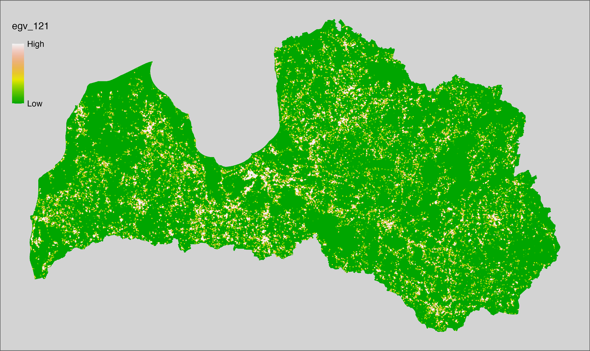


## Edges_Farmland-Builtup_r1250	{#ch06.122}

**filename:** `Edges_Farmland-Builtup_r1250.tif`	

**layername:** `egv_122`	

**English name:** Edge pixels of Farmland bordering with Built-Up areas within the 1.25 km landscape

**Latvian name:** Lauksaimniecības zemju malu ar apbūvi garums 1,25 km ainavā

**Procedure:** Total edge at 1250 m radius around the analysis grid cell, is calculated as the area-weighted sum of [analysis cells](#ch06.120) inside the buffer with `egvtools::radius_function`. During calculation of landscape metric, inverse distance weighted (power = 2) gap filling on the output is initialized to ensure no missing values at the edges. Finally, layer is rewritten to ensure layers name.


``` r
# Libs ----
if(!require(terra)) {install.packages("terra"); require(terra)}
if(!require(egvtools)) {remotes::install_github("aavotins/egvtools"); require(egvtools)}


# Templates -----
template100=rast("./Templates/TemplateRasters/LV100m_10km.tif")

# radii ----
radius_function(
  kvadrati_path  = "./Templates/TemplateGrids/tiles/",
  radii_path     = "./Templates/TemplateGridPoints/tiles/",
  tikls100_path  = "./Templates/TemplateGrids/tikls100_sauzeme.parquet",
  template_path  = "./Templates/TemplateRasters/LV100m_10km.tif",
  input_layers   = c("./RasterGrids_100m/2024/RAW/Edges_Farmland-Builtup_cell.tif"),
  layer_prefixes = c("Edges_Farmland-Builtup"),
  output_dir     = "./RasterGrids_100m/2024/RAW/",
  n_workers      = 12,
  radii          = c("r1250"),
  radius_mode    = "sparse",
  extract_fun    = "sum",
  fill_missing   = TRUE,
  IDW_weight     = 2,
  future_max_size = 20 * 1024^3)


# Edges_Farmland-Builtup_r1250.tif	egv_122 ----
slanis=rast("./RasterGrids_100m/2024/RAW/Edges_Farmland-Builtup_r1250.tif")
names(slanis)="egv_122"
slanis2=project(slanis,template100)
writeRaster(slanis2,
            "./RasterGrids_100m/2024/RAW/Edges_Farmland-Builtup_r1250.tif",
            overwrite=TRUE)
```

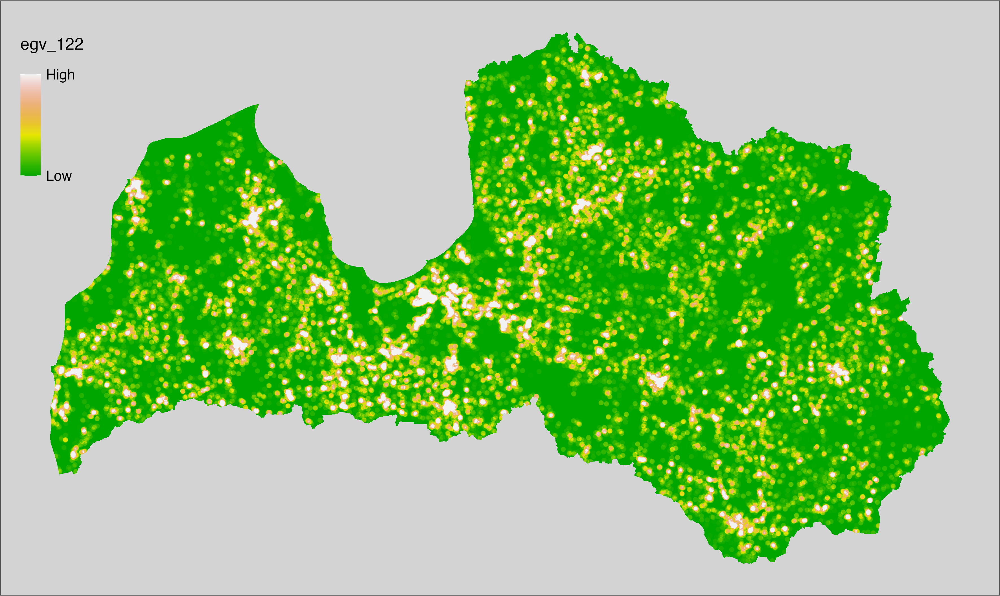


## Edges_Farmland-Builtup_r3000	{#ch06.123}

**filename:** `Edges_Farmland-Builtup_r3000.tif`	

**layername:** `egv_123`	

**English name:** Edge pixels of Farmland bordering with Built-Up areas within the 3 km landscape

**Latvian name:** Lauksaimniecības zemju malu ar apbūvi garums 3 km ainavā

**Procedure:** Total edge at 3000 m radius around the analysis grid cell, is calculated as the area-weighted sum of [analysis cells](#ch06.120) inside the buffer with `egvtools::radius_function`. During calculation of landscape metric, inverse distance weighted (power = 2) gap filling on the output is initialized to ensure no missing values at the edges. Finally, layer is rewritten to ensure layers name.


``` r
# Libs ----
if(!require(terra)) {install.packages("terra"); require(terra)}
if(!require(egvtools)) {remotes::install_github("aavotins/egvtools"); require(egvtools)}


# Templates -----
template100=rast("./Templates/TemplateRasters/LV100m_10km.tif")

# radii ----
radius_function(
  kvadrati_path  = "./Templates/TemplateGrids/tiles/",
  radii_path     = "./Templates/TemplateGridPoints/tiles/",
  tikls100_path  = "./Templates/TemplateGrids/tikls100_sauzeme.parquet",
  template_path  = "./Templates/TemplateRasters/LV100m_10km.tif",
  input_layers   = c("./RasterGrids_100m/2024/RAW/Edges_Farmland-Builtup_cell.tif"),
  layer_prefixes = c("Edges_Farmland-Builtup"),
  output_dir     = "./RasterGrids_100m/2024/RAW/",
  n_workers      = 12,
  radii          = c("r3000"),
  radius_mode    = "sparse",
  extract_fun    = "sum",
  fill_missing   = TRUE,
  IDW_weight     = 2,
  future_max_size = 20 * 1024^3)


# Edges_Farmland-Builtup_r3000.tif	egv_123 ----
slanis=rast("./RasterGrids_100m/2024/RAW/Edges_Farmland-Builtup_r3000.tif")
names(slanis)="egv_123"
slanis2=project(slanis,template100)
writeRaster(slanis2,
            "./RasterGrids_100m/2024/RAW/Edges_Farmland-Builtup_r3000.tif",
            overwrite=TRUE)
```

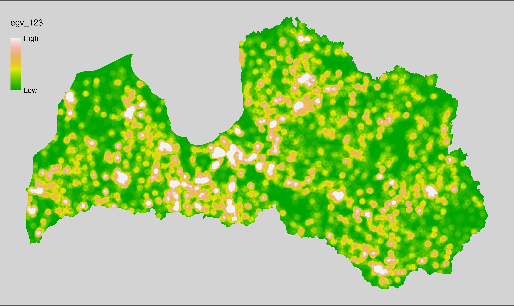


## Edges_Farmland-Builtup_r10000	{#ch06.124}

**filename:** `Edges_Farmland-Builtup_r10000.tif`	

**layername:** `egv_124`	

**English name:** Edge pixels of Farmland bordering with Built-Up areas within the 10 km landscape

**Latvian name:** Lauksaimniecības zemju malu ar apbūvi garums 10 km ainavā

**Procedure:** Total edge at 10000 m radius around the analysis grid cell, is calculated as the area-weighted sum of [analysis cells](#ch06.120) inside the buffer with `egvtools::radius_function`. During calculation of landscape metric, inverse distance weighted (power = 2) gap filling on the output is initialized to ensure no missing values at the edges. Finally, layer is rewritten to ensure layers name.


``` r
# Libs ----
if(!require(terra)) {install.packages("terra"); require(terra)}
if(!require(egvtools)) {remotes::install_github("aavotins/egvtools"); require(egvtools)}


# Templates -----
template100=rast("./Templates/TemplateRasters/LV100m_10km.tif")

# radii ----
radius_function(
  kvadrati_path  = "./Templates/TemplateGrids/tiles/",
  radii_path     = "./Templates/TemplateGridPoints/tiles/",
  tikls100_path  = "./Templates/TemplateGrids/tikls100_sauzeme.parquet",
  template_path  = "./Templates/TemplateRasters/LV100m_10km.tif",
  input_layers   = c("./RasterGrids_100m/2024/RAW/Edges_Farmland-Builtup_cell.tif"),
  layer_prefixes = c("Edges_Farmland-Builtup"),
  output_dir     = "./RasterGrids_100m/2024/RAW/",
  n_workers      = 12,
  radii          = c("r10000"),
  radius_mode    = "sparse",
  extract_fun    = "sum",
  fill_missing   = TRUE,
  IDW_weight     = 2,
  future_max_size = 20 * 1024^3)


# Edges_Farmland-Builtup_r10000.tif	egv_124 ----
slanis=rast("./RasterGrids_100m/2024/RAW/Edges_Farmland-Builtup_r10000.tif")
names(slanis)="egv_124"
slanis2=project(slanis,template100)
writeRaster(slanis2,
            "./RasterGrids_100m/2024/RAW/Edges_Farmland-Builtup_r10000.tif",
            overwrite=TRUE)
```

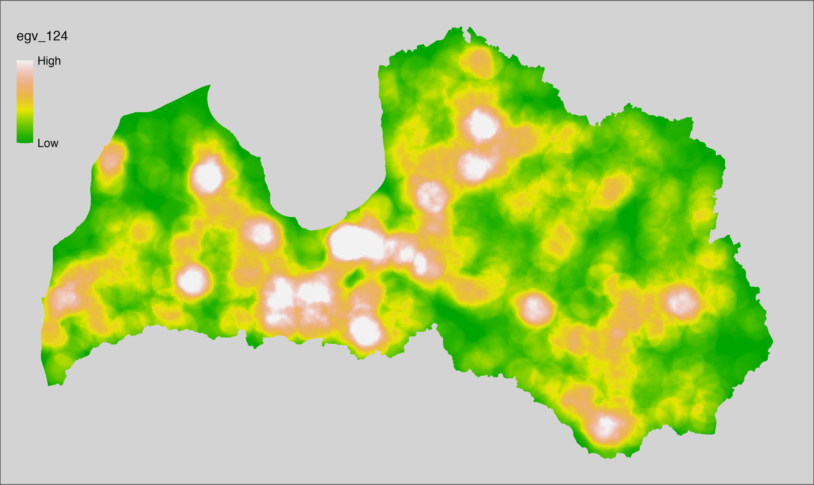


## Edges_Trees-Builtup_cell	{#ch06.125}

**filename:** `Edges_Trees-Builtup_cell.tif`	

**layername:** `egv_125`	

**English name:** Edge pixels of Trees bordering with Built-Up areas within the analysis cell (1 ha)

**Latvian name:** Koku malu ar apbūvi garums analīzes šūnā (1 ha)

**Procedure:** First, values larger than 630 and smaller than 700 from [Landscape classification](#Ch05.03) are coded as 1 and everything else as NA. Then values 500 from [Landscape classification](#Ch05.03) are coded as 0 and everything else as NA. Then, the first layer (1=presence) is covered over 
the second layer (presence=0) and written to file (matching the input). Finally, with 
the function `egvtools::landscape_function()` total edge between the two classes 
is calculated. During calculation of landscape metric, inverse distance weighted (power = 2) gap filling on the output is initialized to ensure no missing values at the edges.


``` r
# Libs ----
if(!require(terra)) {install.packages("terra"); require(terra)}
if(!require(egvtools)) {remotes::install_github("aavotins/egvtools"); require(egvtools)}

if(!require(sf)) {install.packages("sf"); require(sf)}
if(!require(sfarrow)) {install.packages("sfarrow"); require(sfarrow)}
if(!require(raster)) {install.packages("raster"); require(raster)}
if(!require(fasterize)) {install.packages("fasterize"); require(fasterize)}
if(!require(tidyverse)) {install.packages("tidyverse"); require(tidyverse)}


# Templates -----
template10=rast("./Templates/TemplateRasters/LV10m_10km.tif")
nulls10=rast("./Templates/TemplateRasters/nulls_LV10m_10km.tif")

# simple landscape ----
simple_landscape=rast("./RasterGrids_10m/2024/Ainava_vienk_mask.tif")

# Edges_Trees-Builtup_input.tif ----
trees_from630=ifel(simple_landscape>=630 & simple_landscape<700,1,NA)
plot(trees_from630)

builtup=ifel(simple_landscape==500,0,NA)
plot(builtup)

trees630_builtup=cover(trees_from630,builtup)
plot(trees630_builtup)

edge_trees630_builtup=project(trees630_builtup,template10,
                              filename="./RasterGrids_10m/2024/Edges_Trees-Builtup_input.tif",
                              overwrite=TRUE)
rm(edge_trees630_builtup)
rm(trees630_builtup)


# Edges_Trees-Builtup_cell.tif	egv_125 ----
landscape_function(
  landscape      = "./RasterGrids_10m/2024/Edges_Trees-Builtup_input.tif",
  zones          = "./Templates/TemplateGrids/tikls100_sauzeme.parquet",
  id_field       = "id",
  tile_field     = "tks50km",
  template       = "./Templates/TemplateRasters/LV100m_10km.tif",
  out_dir        = "./RasterGrids_100m/2024/RAW",
  out_filename   = "Edges_Trees-Builtup_cell.tif",
  out_layername  = "egv_125",
  what             = "lsm_l_te",
  lm_args          = list(count_boundary = FALSE),
  rasterize_engine = "fasterize",
  n_workers      = 12,
  future_max_size = 20 * 1024^3,
  fill_gaps      = TRUE,
  plot_gaps      = FALSE,
  plot_result    = FALSE
)
```


## Edges_Trees-Builtup_r500	{#ch06.126}

**filename:** `Edges_Trees-Builtup_r500.tif`	

**layername:** `egv_126`	

**English name:** Edge pixels of Trees bordering with Built-Up areas within the 0.5 km landscape

**Latvian name:** Koku malu ar apbūvi garums 0,5 km ainavā

**Procedure:** Total edge at 500 m radius around the analysis grid cell, is calculated as the area-weighted sum of [analysis cells](#ch06.125) inside the buffer with `egvtools::radius_function`. During calculation of landscape metric, inverse distance weighted (power = 2) gap filling on the output is initialized to ensure no missing values at the edges. Finally, layer is rewritten to ensure layers name.


``` r
# Libs ----
if(!require(terra)) {install.packages("terra"); require(terra)}
if(!require(egvtools)) {remotes::install_github("aavotins/egvtools"); require(egvtools)}


# Templates -----
template100=rast("./Templates/TemplateRasters/LV100m_10km.tif")

# radii ----
radius_function(
  kvadrati_path  = "./Templates/TemplateGrids/tiles/",
  radii_path     = "./Templates/TemplateGridPoints/tiles/",
  tikls100_path  = "./Templates/TemplateGrids/tikls100_sauzeme.parquet",
  template_path  = "./Templates/TemplateRasters/LV100m_10km.tif",
  input_layers   = c("./RasterGrids_100m/2024/RAW/Edges_Trees-Builtup_cell.tif"),
  layer_prefixes = c("Edges_Trees-Builtup"),
  output_dir     = "./RasterGrids_100m/2024/RAW/",
  n_workers      = 12,
  radii          = c("r500"),
  radius_mode    = "sparse",
  extract_fun    = "sum",
  fill_missing   = TRUE,
  IDW_weight     = 2,
  future_max_size = 20 * 1024^3)


# Edges_Trees-Builtup_r500.tif	egv_126 ----
slanis=rast("./RasterGrids_100m/2024/RAW/Edges_Trees-Builtup_r500.tif")
names(slanis)="egv_126"
slanis2=project(slanis,template100)
writeRaster(slanis2,
            "./RasterGrids_100m/2024/RAW/Edges_Trees-Builtup_r500.tif",
            overwrite=TRUE)
```


## Edges_Trees-Builtup_r1250	{#ch06.127}

**filename:** `Edges_Trees-Builtup_r1250.tif`	

**layername:** `egv_127`	

**English name:** Edge pixels of Trees bordering with Built-Up areas within the 1.25 km landscape

**Latvian name:** Koku malu ar apbūvi garums 1,25 km ainavā

**Procedure:** Total edge at 1250 m radius around the analysis grid cell, is calculated as the area-weighted sum of [analysis cells](#ch06.125) inside the buffer with `egvtools::radius_function`. During calculation of landscape metric, inverse distance weighted (power = 2) gap filling on the output is initialized to ensure no missing values at the edges. Finally, layer is rewritten to ensure layers name.


``` r
# Libs ----
if(!require(terra)) {install.packages("terra"); require(terra)}
if(!require(egvtools)) {remotes::install_github("aavotins/egvtools"); require(egvtools)}


# Templates -----
template100=rast("./Templates/TemplateRasters/LV100m_10km.tif")

# radii ----
radius_function(
  kvadrati_path  = "./Templates/TemplateGrids/tiles/",
  radii_path     = "./Templates/TemplateGridPoints/tiles/",
  tikls100_path  = "./Templates/TemplateGrids/tikls100_sauzeme.parquet",
  template_path  = "./Templates/TemplateRasters/LV100m_10km.tif",
  input_layers   = c("./RasterGrids_100m/2024/RAW/Edges_Trees-Builtup_cell.tif"),
  layer_prefixes = c("Edges_Trees-Builtup"),
  output_dir     = "./RasterGrids_100m/2024/RAW/",
  n_workers      = 12,
  radii          = c("r1250"),
  radius_mode    = "sparse",
  extract_fun    = "sum",
  fill_missing   = TRUE,
  IDW_weight     = 2,
  future_max_size = 20 * 1024^3)


# Edges_Trees-Builtup_r1250.tif	egv_127 ----
slanis=rast("./RasterGrids_100m/2024/RAW/Edges_Trees-Builtup_r1250.tif")
names(slanis)="egv_127"
slanis2=project(slanis,template100)
writeRaster(slanis2,
            "./RasterGrids_100m/2024/RAW/Edges_Trees-Builtup_r1250.tif",
            overwrite=TRUE)
```


## Edges_Trees-Builtup_r3000	{#ch06.128}

**filename:** `Edges_Trees-Builtup_r3000.tif`	

**layername:** `egv_128`	

**English name:** Edge pixels of Trees bordering with Built-Up areas within the 3 km landscape

**Latvian name:** Koku malu ar apbūvi garums 3 km ainavā

**Procedure:** Total edge at 3000 m radius around the analysis grid cell, is calculated as the area-weighted sum of [analysis cells](#ch06.125) inside the buffer with `egvtools::radius_function`. During calculation of landscape metric, inverse distance weighted (power = 2) gap filling on the output is initialized to ensure no missing values at the edges. Finally, layer is rewritten to ensure layers name.


``` r
# Libs ----
if(!require(terra)) {install.packages("terra"); require(terra)}
if(!require(egvtools)) {remotes::install_github("aavotins/egvtools"); require(egvtools)}


# Templates -----
template100=rast("./Templates/TemplateRasters/LV100m_10km.tif")

# radii ----
radius_function(
  kvadrati_path  = "./Templates/TemplateGrids/tiles/",
  radii_path     = "./Templates/TemplateGridPoints/tiles/",
  tikls100_path  = "./Templates/TemplateGrids/tikls100_sauzeme.parquet",
  template_path  = "./Templates/TemplateRasters/LV100m_10km.tif",
  input_layers   = c("./RasterGrids_100m/2024/RAW/Edges_Trees-Builtup_cell.tif"),
  layer_prefixes = c("Edges_Trees-Builtup"),
  output_dir     = "./RasterGrids_100m/2024/RAW/",
  n_workers      = 12,
  radii          = c("r3000"),
  radius_mode    = "sparse",
  extract_fun    = "sum",
  fill_missing   = TRUE,
  IDW_weight     = 2,
  future_max_size = 20 * 1024^3)


# Edges_Trees-Builtup_r3000.tif	egv_128 ----
slanis=rast("./RasterGrids_100m/2024/RAW/Edges_Trees-Builtup_r3000.tif")
names(slanis)="egv_128"
slanis2=project(slanis,template100)
writeRaster(slanis2,
            "./RasterGrids_100m/2024/RAW/Edges_Trees-Builtup_r3000.tif",
            overwrite=TRUE)
```

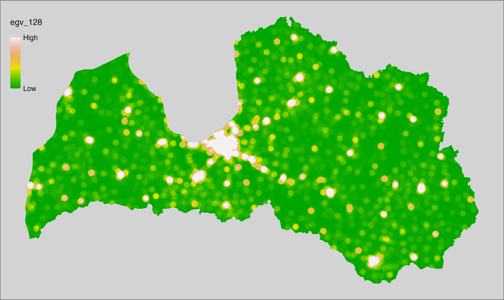


## Edges_Trees-Builtup_r10000	{#ch06.129}

**filename:** `Edges_Trees-Builtup_r10000.tif`	

**layername:** `egv_129`	

**English name:** Edge pixels of Trees bordering with Built-Up areas within the 10 km landscape

**Latvian name:** Koku malu ar apbūvi garums 10 km ainavā

**Procedure:** Total edge at 10000 m radius around the analysis grid cell, is calculated as the area-weighted sum of [analysis cells](#ch06.125) inside the buffer with `egvtools::radius_function`. During calculation of landscape metric, inverse distance weighted (power = 2) gap filling on the output is initialized to ensure no missing values at the edges. Finally, layer is rewritten to ensure layers name.


``` r
# Libs ----
if(!require(terra)) {install.packages("terra"); require(terra)}
if(!require(egvtools)) {remotes::install_github("aavotins/egvtools"); require(egvtools)}


# Templates -----
template100=rast("./Templates/TemplateRasters/LV100m_10km.tif")

# radii ----
radius_function(
  kvadrati_path  = "./Templates/TemplateGrids/tiles/",
  radii_path     = "./Templates/TemplateGridPoints/tiles/",
  tikls100_path  = "./Templates/TemplateGrids/tikls100_sauzeme.parquet",
  template_path  = "./Templates/TemplateRasters/LV100m_10km.tif",
  input_layers   = c("./RasterGrids_100m/2024/RAW/Edges_Trees-Builtup_cell.tif"),
  layer_prefixes = c("Edges_Trees-Builtup"),
  output_dir     = "./RasterGrids_100m/2024/RAW/",
  n_workers      = 12,
  radii          = c("r10000"),
  radius_mode    = "sparse",
  extract_fun    = "sum",
  fill_missing   = TRUE,
  IDW_weight     = 2,
  future_max_size = 20 * 1024^3)


# Edges_Trees-Builtup_r10000.tif	egv_129 ----
slanis=rast("./RasterGrids_100m/2024/RAW/Edges_Trees-Builtup_r10000.tif")
names(slanis)="egv_129"
slanis2=project(slanis,template100)
writeRaster(slanis2,
            "./RasterGrids_100m/2024/RAW/Edges_Trees-Builtup_r10000.tif",
            overwrite=TRUE)
```

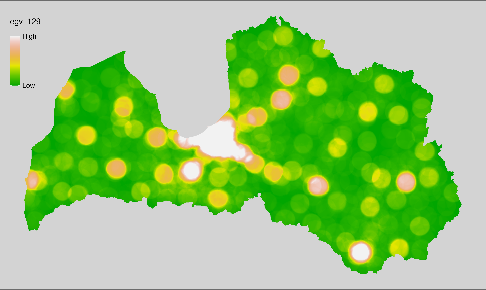


## Edges_CropsFallow_cell	{#ch06.130}

**filename:** `Edges_CropsFallow_cell.tif`	

**layername:** `egv_130`	

**English name:** Edge pixels of Cropland, Fallow land within the analysis cell (1 ha)

**Latvian name:** Aramzemju malu garums analīzes šūnā (1 ha)

**Procedure:** First, values larger than or equal to 310 and smaller than 325 from [Landscape classification](#Ch05.03) are coded as 1 and everything else as NA. Then, the layer (1=presence) is covered over 
the nulls layer (presence=0) and written to file (matching the input). Finally, with 
the function `egvtools::landscape_function()` total edge between the two classes 
is calculated. During calculation of landscape metric, inverse distance weighted (power = 2) gap filling on the output is initialized to ensure no missing values at the edges.


``` r
# Libs ----
if(!require(terra)) {install.packages("terra"); require(terra)}
if(!require(egvtools)) {remotes::install_github("aavotins/egvtools"); require(egvtools)}

if(!require(sf)) {install.packages("sf"); require(sf)}
if(!require(sfarrow)) {install.packages("sfarrow"); require(sfarrow)}
if(!require(raster)) {install.packages("raster"); require(raster)}
if(!require(fasterize)) {install.packages("fasterize"); require(fasterize)}
if(!require(tidyverse)) {install.packages("tidyverse"); require(tidyverse)}


# Templates -----
template10=rast("./Templates/TemplateRasters/LV10m_10km.tif")
nulls10=rast("./Templates/TemplateRasters/nulls_LV10m_10km.tif")

# simple landscape ----
simple_landscape=rast("./RasterGrids_10m/2024/Ainava_vienk_mask.tif")

# Edges_CropsFallow_input.tif ----
cropsfallow=ifel(simple_landscape>=310 & simple_landscape<325,1,NA)
plot(cropsfallow)
cropsfallow=cover(cropsfallow,nulls10)
plot(cropsfallow)

edge_cropsfallow=project(cropsfallow,template10,
                       filename="./RasterGrids_10m/2024/Edges_CropsFallow_input.tif",
                       overwrite=TRUE)
rm(edge_cropsfallow)


# Edges_CropsFallow_cell.tif	egv_130 ----
landscape_function(
  landscape      = "./RasterGrids_10m/2024/Edges_CropsFallow_input.tif",
  zones          = "./Templates/TemplateGrids/tikls100_sauzeme.parquet",
  id_field       = "id",
  tile_field     = "tks50km",
  template       = "./Templates/TemplateRasters/LV100m_10km.tif",
  out_dir        = "./RasterGrids_100m/2024/RAW",
  out_filename   = "Edges_CropsFallow_cell.tif",
  out_layername  = "egv_130",
  what             = "lsm_l_te",
  lm_args          = list(count_boundary = FALSE),
  rasterize_engine = "fasterize",
  n_workers      = 12,
  future_max_size = 20 * 1024^3,
  fill_gaps      = TRUE,
  plot_gaps      = FALSE,
  plot_result    = FALSE
)
```

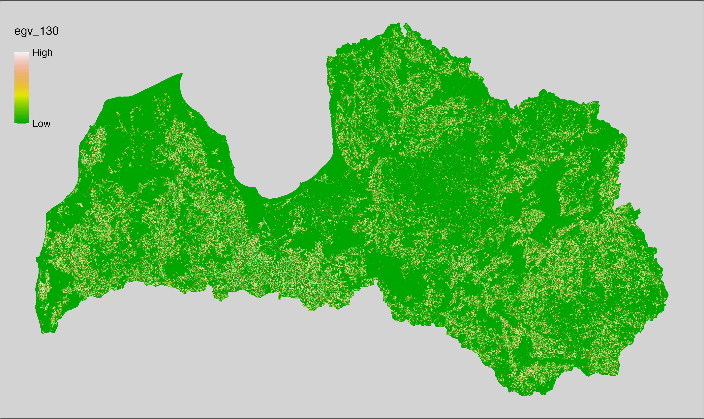


## Edges_CropsFallow_r500	{#ch06.131}

**filename:** `Edges_CropsFallow_r500.tif`	

**layername:** `egv_131`	

**English name:** Edge pixels of Cropland, Fallow land within the 0.5 km landscape

**Latvian name:** Aramzemju malu garums 0,5 km ainavā

**Procedure:** Total edge at 500 m radius around the analysis grid cell, is calculated as the area-weighted sum of [analysis cells](#ch06.130) inside the buffer with `egvtools::radius_function`. During calculation of landscape metric, inverse distance weighted (power = 2) gap filling on the output is initialized to ensure no missing values at the edges. Finally, layer is rewritten to ensure layers name.


``` r
# Libs ----
if(!require(terra)) {install.packages("terra"); require(terra)}
if(!require(egvtools)) {remotes::install_github("aavotins/egvtools"); require(egvtools)}


# Templates -----
template100=rast("./Templates/TemplateRasters/LV100m_10km.tif")

# radii ----
radius_function(
  kvadrati_path  = "./Templates/TemplateGrids/tiles/",
  radii_path     = "./Templates/TemplateGridPoints/tiles/",
  tikls100_path  = "./Templates/TemplateGrids/tikls100_sauzeme.parquet",
  template_path  = "./Templates/TemplateRasters/LV100m_10km.tif",
  input_layers   = c("./RasterGrids_100m/2024/RAW/Edges_CropsFallow_cell.tif"),
  layer_prefixes = c("Edges_CropsFallow"),
  output_dir     = "./RasterGrids_100m/2024/RAW/",
  n_workers      = 12,
  radii          = c("r500"),
  radius_mode    = "sparse",
  extract_fun    = "sum",
  fill_missing   = TRUE,
  IDW_weight     = 2,
  future_max_size = 20 * 1024^3)


# Edges_CropsFallow_r500.tif	egv_131 ----
slanis=rast("./RasterGrids_100m/2024/RAW/Edges_CropsFallow_r500.tif")
names(slanis)="egv_131"
slanis2=project(slanis,template100)
writeRaster(slanis2,
            "./RasterGrids_100m/2024/RAW/Edges_CropsFallow_r500.tif",
            overwrite=TRUE)
```


## Edges_CropsFallow_r1250	{#ch06.132}

**filename:** `Edges_CropsFallow_r1250.tif`	

**layername:** `egv_132`	

**English name:** Edge pixels of Cropland, Fallow land within the 1.25 km landscape

**Latvian name:** Aramzemju malu garums 1,25 km ainavā

**Procedure:** Total edge at 1250 m radius around the analysis grid cell, is calculated as the area-weighted sum of [analysis cells](#ch06.130) inside the buffer with `egvtools::radius_function`. During calculation of landscape metric, inverse distance weighted (power = 2) gap filling on the output is initialized to ensure no missing values at the edges. Finally, layer is rewritten to ensure layers name.


``` r
# Libs ----
if(!require(terra)) {install.packages("terra"); require(terra)}
if(!require(egvtools)) {remotes::install_github("aavotins/egvtools"); require(egvtools)}


# Templates -----
template100=rast("./Templates/TemplateRasters/LV100m_10km.tif")

# radii ----
radius_function(
  kvadrati_path  = "./Templates/TemplateGrids/tiles/",
  radii_path     = "./Templates/TemplateGridPoints/tiles/",
  tikls100_path  = "./Templates/TemplateGrids/tikls100_sauzeme.parquet",
  template_path  = "./Templates/TemplateRasters/LV100m_10km.tif",
  input_layers   = c("./RasterGrids_100m/2024/RAW/Edges_CropsFallow_cell.tif"),
  layer_prefixes = c("Edges_CropsFallow"),
  output_dir     = "./RasterGrids_100m/2024/RAW/",
  n_workers      = 12,
  radii          = c("r1250"),
  radius_mode    = "sparse",
  extract_fun    = "sum",
  fill_missing   = TRUE,
  IDW_weight     = 2,
  future_max_size = 20 * 1024^3)


# Edges_CropsFallow_r1250.tif	egv_132 ----
slanis=rast("./RasterGrids_100m/2024/RAW/Edges_CropsFallow_r1250.tif")
names(slanis)="egv_132"
slanis2=project(slanis,template100)
writeRaster(slanis2,
            "./RasterGrids_100m/2024/RAW/Edges_CropsFallow_r1250.tif",
            overwrite=TRUE)
```

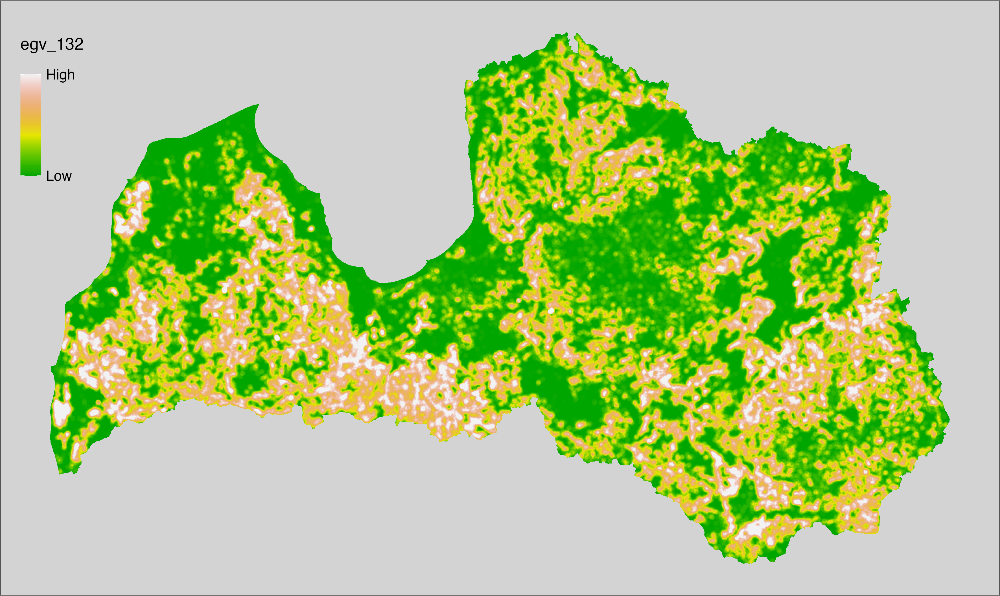


## Edges_CropsFallow_r3000	{#ch06.133}

**filename:** `Edges_CropsFallow_r3000.tif`	

**layername:** `egv_133`	

**English name:** Edge pixels of Cropland, Fallow land within the 3 km landscape

**Latvian name:** Aramzemju malu garums 3 km ainavā

**Procedure:** Total edge at 3000 m radius around the analysis grid cell, is calculated as the area-weighted sum of [analysis cells](#ch06.130) inside the buffer with `egvtools::radius_function`. During calculation of landscape metric, inverse distance weighted (power = 2) gap filling on the output is initialized to ensure no missing values at the edges. Finally, layer is rewritten to ensure layers name.


``` r
# Libs ----
if(!require(terra)) {install.packages("terra"); require(terra)}
if(!require(egvtools)) {remotes::install_github("aavotins/egvtools"); require(egvtools)}


# Templates -----
template100=rast("./Templates/TemplateRasters/LV100m_10km.tif")

# radii ----
radius_function(
  kvadrati_path  = "./Templates/TemplateGrids/tiles/",
  radii_path     = "./Templates/TemplateGridPoints/tiles/",
  tikls100_path  = "./Templates/TemplateGrids/tikls100_sauzeme.parquet",
  template_path  = "./Templates/TemplateRasters/LV100m_10km.tif",
  input_layers   = c("./RasterGrids_100m/2024/RAW/Edges_CropsFallow_cell.tif"),
  layer_prefixes = c("Edges_CropsFallow"),
  output_dir     = "./RasterGrids_100m/2024/RAW/",
  n_workers      = 12,
  radii          = c("r3000"),
  radius_mode    = "sparse",
  extract_fun    = "sum",
  fill_missing   = TRUE,
  IDW_weight     = 2,
  future_max_size = 20 * 1024^3)


# Edges_CropsFallow_r3000.tif	egv_133 ----
slanis=rast("./RasterGrids_100m/2024/RAW/Edges_CropsFallow_r3000.tif")
names(slanis)="egv_133"
slanis2=project(slanis,template100)
writeRaster(slanis2,
            "./RasterGrids_100m/2024/RAW/Edges_CropsFallow_r3000.tif",
            overwrite=TRUE)
```

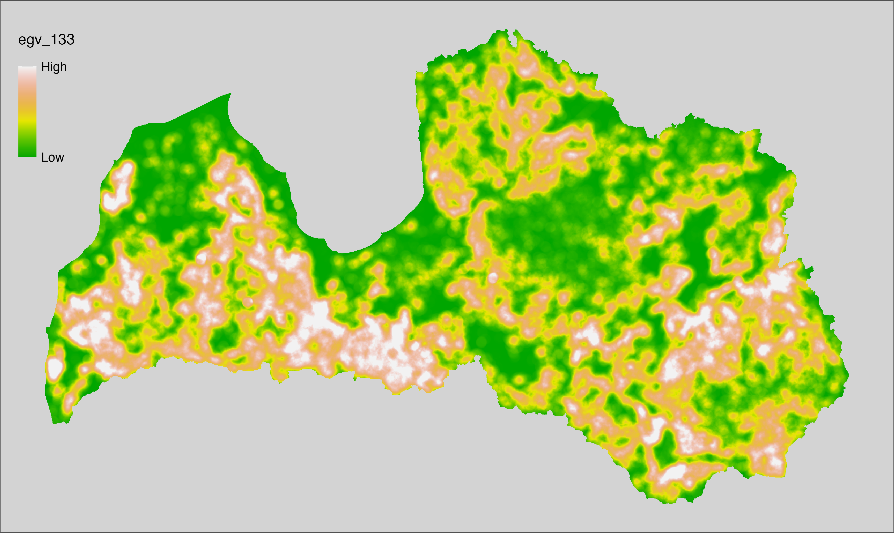


## Edges_CropsFallow_r10000	{#ch06.134}

**filename:** `Edges_CropsFallow_r10000.tif`	

**layername:** `egv_134`	

**English name:** Edge pixels of Cropland, Fallow land within the 10 km landscape

**Latvian name:** Aramzemju malu garums 10 km ainavā

**Procedure:** Total edge at 10000 m radius around the analysis grid cell, is calculated as the area-weighted sum of [analysis cells](#ch06.130) inside the buffer with `egvtools::radius_function`. During calculation of landscape metric, inverse distance weighted (power = 2) gap filling on the output is initialized to ensure no missing values at the edges. Finally, layer is rewritten to ensure layers name.


``` r
# Libs ----
if(!require(terra)) {install.packages("terra"); require(terra)}
if(!require(egvtools)) {remotes::install_github("aavotins/egvtools"); require(egvtools)}


# Templates -----
template100=rast("./Templates/TemplateRasters/LV100m_10km.tif")

# radii ----
radius_function(
  kvadrati_path  = "./Templates/TemplateGrids/tiles/",
  radii_path     = "./Templates/TemplateGridPoints/tiles/",
  tikls100_path  = "./Templates/TemplateGrids/tikls100_sauzeme.parquet",
  template_path  = "./Templates/TemplateRasters/LV100m_10km.tif",
  input_layers   = c("./RasterGrids_100m/2024/RAW/Edges_CropsFallow_cell.tif"),
  layer_prefixes = c("Edges_CropsFallow"),
  output_dir     = "./RasterGrids_100m/2024/RAW/",
  n_workers      = 12,
  radii          = c("r10000"),
  radius_mode    = "sparse",
  extract_fun    = "sum",
  fill_missing   = TRUE,
  IDW_weight     = 2,
  future_max_size = 20 * 1024^3)


# Edges_CropsFallow_r10000.tif	egv_134 ----
slanis=rast("./RasterGrids_100m/2024/RAW/Edges_CropsFallow_r10000.tif")
names(slanis)="egv_134"
slanis2=project(slanis,template100)
writeRaster(slanis2,
            "./RasterGrids_100m/2024/RAW/Edges_CropsFallow_r10000.tif",
            overwrite=TRUE)
```

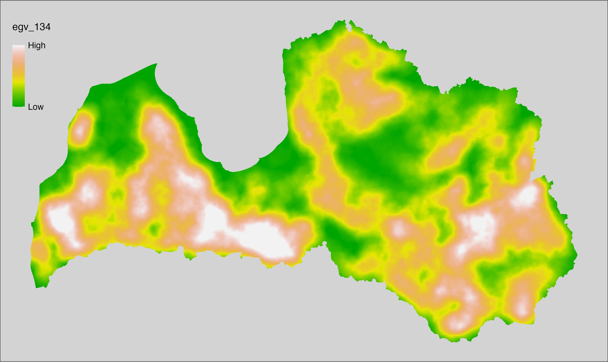


## Edges_FarmlandShrubs-Trees_cell	{#ch06.135}

**filename:** `Edges_FarmlandShrubs-Trees_cell.tif`	

**layername:** `egv_135`	

**English name:** Edge pixels of Farmland, Clear-Cuts, Shrubs bordering with Trees within the analysis cell (1 ha)

**Latvian name:** Lauksaimniecības zemju, izcirtumu, krūmu malu ar kokiem garums analīzes šūnā (1 ha)

**Procedure:** First, values between 300 and 400 and between 600 and 630 from [Landscape classification](#Ch05.03) are coded as 0 and everything else as NA. Then values larger than or equal to 630 to 700 from [Landscape classification](#Ch05.03) are coded as 1 and everything else as NA. Then, the first layer (1=presence) is covered over 
the second layer (presence=0) and written to file (matching the input). Finally, with 
the function `egvtools::landscape_function()` total edge between the two classes 
is calculated. During calculation of landscape metric, inverse distance weighted (power = 2) gap filling on the output is initialized to ensure no missing values at the edges.


``` r
# Libs ----
if(!require(terra)) {install.packages("terra"); require(terra)}
if(!require(egvtools)) {remotes::install_github("aavotins/egvtools"); require(egvtools)}

if(!require(sf)) {install.packages("sf"); require(sf)}
if(!require(sfarrow)) {install.packages("sfarrow"); require(sfarrow)}
if(!require(raster)) {install.packages("raster"); require(raster)}
if(!require(fasterize)) {install.packages("fasterize"); require(fasterize)}
if(!require(tidyverse)) {install.packages("tidyverse"); require(tidyverse)}


# Templates -----
template10=rast("./Templates/TemplateRasters/LV10m_10km.tif")
nulls10=rast("./Templates/TemplateRasters/nulls_LV10m_10km.tif")

# simple landscape ----
simple_landscape=rast("./RasterGrids_10m/2024/Ainava_vienk_mask.tif")

# Edges_FarmlandShrubs-Trees_input.tif ----
farmshrub=ifel((simple_landscape>300 & simple_landscape<400)|
                 (simple_landscape>600 & simple_landscape<630),0,NA)

trees_from630=ifel(simple_landscape>=630 & simple_landscape<700,1,NA)
plot(trees_from630)

farmshrub_trees630=cover(farmshrub,trees_from630)
plot(farmshrub_trees630)

edge_farmshrub_trees630=project(farmshrub_trees630,template10,
                              filename="./RasterGrids_10m/2024/Edges_FarmlandShrubs-Trees_input.tif",
                              overwrite=TRUE)
rm(edge_farmshrub_trees630)
rm(farmshrub_trees630)


# Edges_FarmlandShrubs-Trees_cell.tif	egv_135 ----
landscape_function(
  landscape      = "./RasterGrids_10m/2024/Edges_FarmlandShrubs-Trees_input.tif",
  zones          = "./Templates/TemplateGrids/tikls100_sauzeme.parquet",
  id_field       = "id",
  tile_field     = "tks50km",
  template       = "./Templates/TemplateRasters/LV100m_10km.tif",
  out_dir        = "./RasterGrids_100m/2024/RAW",
  out_filename   = "Edges_FarmlandShrubs-Trees_cell.tif",
  out_layername  = "egv_135",
  what             = "lsm_l_te",
  lm_args          = list(count_boundary = FALSE),
  rasterize_engine = "fasterize",
  n_workers      = 12,
  future_max_size = 20 * 1024^3,
  fill_gaps      = TRUE,
  plot_gaps      = FALSE,
  plot_result    = FALSE
)
```


## Edges_FarmlandShrubs-Trees_r500	{#ch06.136}

**filename:** `Edges_FarmlandShrubs-Trees_r500.tif`	

**layername:** `egv_136`	

**English name:** Edge pixels of Farmland, Clear-Cuts, Shrubs bordering with Trees within the 0.5 km landscape

**Latvian name:** Lauksaimniecības zemju, izcirtumu, krūmu malu ar kokiem garums 0,5 km ainavā

**Procedure:** Total edge at 500 m radius around the analysis grid cell, is calculated as the area-weighted sum of [analysis cells](#ch06.135) inside the buffer with `egvtools::radius_function`. During calculation of landscape metric, inverse distance weighted (power = 2) gap filling on the output is initialized to ensure no missing values at the edges. Finally, layer is rewritten to ensure layers name.


``` r
# Libs ----
if(!require(terra)) {install.packages("terra"); require(terra)}
if(!require(egvtools)) {remotes::install_github("aavotins/egvtools"); require(egvtools)}


# Templates -----
template100=rast("./Templates/TemplateRasters/LV100m_10km.tif")

# radii ----
radius_function(
  kvadrati_path  = "./Templates/TemplateGrids/tiles/",
  radii_path     = "./Templates/TemplateGridPoints/tiles/",
  tikls100_path  = "./Templates/TemplateGrids/tikls100_sauzeme.parquet",
  template_path  = "./Templates/TemplateRasters/LV100m_10km.tif",
  input_layers   = c("./RasterGrids_100m/2024/RAW/Edges_FarmlandShrubs-Trees_cell.tif"),
  layer_prefixes = c("Edges_FarmlandShrubs-Trees"),
  output_dir     = "./RasterGrids_100m/2024/RAW/",
  n_workers      = 12,
  radii          = c("r500"),
  radius_mode    = "sparse",
  extract_fun    = "sum",
  fill_missing   = TRUE,
  IDW_weight     = 2,
  future_max_size = 20 * 1024^3)


# Edges_FarmlandShrubs-Trees_r500.tif	egv_136 ----
slanis=rast("./RasterGrids_100m/2024/RAW/Edges_FarmlandShrubs-Trees_r500.tif")
names(slanis)="egv_136"
slanis2=project(slanis,template100)
writeRaster(slanis2,
            "./RasterGrids_100m/2024/RAW/Edges_FarmlandShrubs-Trees_r500.tif",
            overwrite=TRUE)
```


## Edges_FarmlandShrubs-Trees_r1250	{#ch06.137}

**filename:** `Edges_FarmlandShrubs-Trees_r1250.tif`	

**layername:** `egv_137`	

**English name:** Edge pixels of Farmland, Clear-Cuts, Shrubs bordering with Trees within the 1.25 km landscape

**Latvian name:** Lauksaimniecības zemju, izcirtumu, krūmu malu ar kokiem garums 1,25 km ainavā

**Procedure:** Total edge at 1250 m radius around the analysis grid cell, is calculated as the area-weighted sum of [analysis cells](#ch06.135) inside the buffer with `egvtools::radius_function`. During calculation of landscape metric, inverse distance weighted (power = 2) gap filling on the output is initialized to ensure no missing values at the edges. Finally, layer is rewritten to ensure layers name.


``` r
# Libs ----
if(!require(terra)) {install.packages("terra"); require(terra)}
if(!require(egvtools)) {remotes::install_github("aavotins/egvtools"); require(egvtools)}


# Templates -----
template100=rast("./Templates/TemplateRasters/LV100m_10km.tif")

# radii ----
radius_function(
  kvadrati_path  = "./Templates/TemplateGrids/tiles/",
  radii_path     = "./Templates/TemplateGridPoints/tiles/",
  tikls100_path  = "./Templates/TemplateGrids/tikls100_sauzeme.parquet",
  template_path  = "./Templates/TemplateRasters/LV100m_10km.tif",
  input_layers   = c("./RasterGrids_100m/2024/RAW/Edges_FarmlandShrubs-Trees_cell.tif"),
  layer_prefixes = c("Edges_FarmlandShrubs-Trees"),
  output_dir     = "./RasterGrids_100m/2024/RAW/",
  n_workers      = 12,
  radii          = c("r1250"),
  radius_mode    = "sparse",
  extract_fun    = "sum",
  fill_missing   = TRUE,
  IDW_weight     = 2,
  future_max_size = 20 * 1024^3)


# Edges_FarmlandShrubs-Trees_r1250.tif	egv_137 ----
slanis=rast("./RasterGrids_100m/2024/RAW/Edges_FarmlandShrubs-Trees_r1250.tif")
names(slanis)="egv_137"
slanis2=project(slanis,template100)
writeRaster(slanis2,
            "./RasterGrids_100m/2024/RAW/Edges_FarmlandShrubs-Trees_r1250.tif",
            overwrite=TRUE)
```


## Edges_FarmlandShrubs-Trees_r3000	{#ch06.138}

**filename:** `Edges_FarmlandShrubs-Trees_r3000.tif`	

**layername:** `egv_138`	

**English name:** Edge pixels of Farmland, Clear-Cuts, Shrubs bordering with Trees within the 3 km landscape

**Latvian name:** Lauksaimniecības zemju, izcirtumu, krūmu malu ar kokiem garums 3 km ainavā

**Procedure:** Total edge at 3000 m radius around the analysis grid cell, is calculated as the area-weighted sum of [analysis cells](#ch06.135) inside the buffer with `egvtools::radius_function`. During calculation of landscape metric, inverse distance weighted (power = 2) gap filling on the output is initialized to ensure no missing values at the edges. Finally, layer is rewritten to ensure layers name.


``` r
# Libs ----
if(!require(terra)) {install.packages("terra"); require(terra)}
if(!require(egvtools)) {remotes::install_github("aavotins/egvtools"); require(egvtools)}


# Templates -----
template100=rast("./Templates/TemplateRasters/LV100m_10km.tif")

# radii ----
radius_function(
  kvadrati_path  = "./Templates/TemplateGrids/tiles/",
  radii_path     = "./Templates/TemplateGridPoints/tiles/",
  tikls100_path  = "./Templates/TemplateGrids/tikls100_sauzeme.parquet",
  template_path  = "./Templates/TemplateRasters/LV100m_10km.tif",
  input_layers   = c("./RasterGrids_100m/2024/RAW/Edges_FarmlandShrubs-Trees_cell.tif"),
  layer_prefixes = c("Edges_FarmlandShrubs-Trees"),
  output_dir     = "./RasterGrids_100m/2024/RAW/",
  n_workers      = 12,
  radii          = c("r3000"),
  radius_mode    = "sparse",
  extract_fun    = "sum",
  fill_missing   = TRUE,
  IDW_weight     = 2,
  future_max_size = 20 * 1024^3)


# Edges_FarmlandShrubs-Trees_r3000.tif	egv_138 ----
slanis=rast("./RasterGrids_100m/2024/RAW/Edges_FarmlandShrubs-Trees_r3000.tif")
names(slanis)="egv_138"
slanis2=project(slanis,template100)
writeRaster(slanis2,
            "./RasterGrids_100m/2024/RAW/Edges_FarmlandShrubs-Trees_r3000.tif",
            overwrite=TRUE)
```

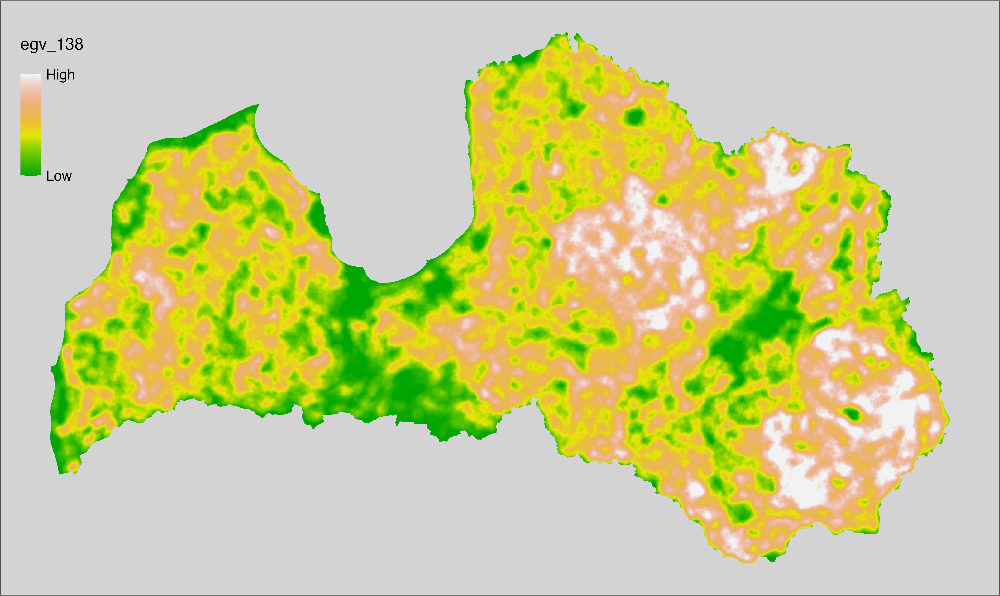


## Edges_FarmlandShrubs-Trees_r10000	{#ch06.139}

**filename:** `Edges_FarmlandShrubs-Trees_r10000.tif`	

**layername:** `egv_139`	

**English name:** Edge pixels of Farmland, Clear-Cuts, Shrubs bordering with Trees within the 10 km landscape

**Latvian name:** Lauksaimniecības zemju, izcirtumu, krūmu malu ar kokiem garums 10 km ainavā

**Procedure:** Total edge at 10000 m radius around the analysis grid cell, is calculated as the area-weighted sum of [analysis cells](#ch06.135) inside the buffer with `egvtools::radius_function`. During calculation of landscape metric, inverse distance weighted (power = 2) gap filling on the output is initialized to ensure no missing values at the edges. Finally, layer is rewritten to ensure layers name.


``` r
# Libs ----
if(!require(terra)) {install.packages("terra"); require(terra)}
if(!require(egvtools)) {remotes::install_github("aavotins/egvtools"); require(egvtools)}


# Templates -----
template100=rast("./Templates/TemplateRasters/LV100m_10km.tif")

# radii ----
radius_function(
  kvadrati_path  = "./Templates/TemplateGrids/tiles/",
  radii_path     = "./Templates/TemplateGridPoints/tiles/",
  tikls100_path  = "./Templates/TemplateGrids/tikls100_sauzeme.parquet",
  template_path  = "./Templates/TemplateRasters/LV100m_10km.tif",
  input_layers   = c("./RasterGrids_100m/2024/RAW/Edges_FarmlandShrubs-Trees_cell.tif"),
  layer_prefixes = c("Edges_FarmlandShrubs-Trees"),
  output_dir     = "./RasterGrids_100m/2024/RAW/",
  n_workers      = 12,
  radii          = c("r10000"),
  radius_mode    = "sparse",
  extract_fun    = "sum",
  fill_missing   = TRUE,
  IDW_weight     = 2,
  future_max_size = 20 * 1024^3)


# Edges_FarmlandShrubs-Trees_r10000.tif	egv_139 ----
slanis=rast("./RasterGrids_100m/2024/RAW/Edges_FarmlandShrubs-Trees_r10000.tif")
names(slanis)="egv_139"
slanis2=project(slanis,template100)
writeRaster(slanis2,
            "./RasterGrids_100m/2024/RAW/Edges_FarmlandShrubs-Trees_r10000.tif",
            overwrite=TRUE)
```

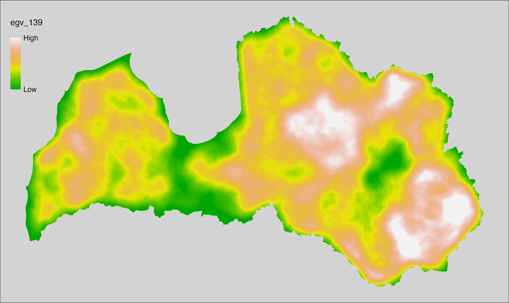


## Edges_Grasslands_cell	{#ch06.140}

**filename:** `Edges_Grasslands_cell.tif`	

**layername:** `egv_140`	

**English name:** Edge pixels of Grassland within the analysis cell (1 ha)

**Latvian name:** Zālāju malu garums analīzes šūnā (1 ha)

**Procedure:** First, values equal to 330 and from [Landscape classification](#Ch05.03) are coded as 1 and everything else as NA. Then, the layer (1=presence) is covered over 
the nulls layer (presence=0) and written to file (matching the input). Finally, with 
the function `egvtools::landscape_function()` total edge between the two classes 
is calculated. During calculation of landscape metric, inverse distance weighted (power = 2) gap filling on the output is initialized to ensure no missing values at the edges.


``` r
# Libs ----
if(!require(terra)) {install.packages("terra"); require(terra)}
if(!require(egvtools)) {remotes::install_github("aavotins/egvtools"); require(egvtools)}

if(!require(sf)) {install.packages("sf"); require(sf)}
if(!require(sfarrow)) {install.packages("sfarrow"); require(sfarrow)}
if(!require(raster)) {install.packages("raster"); require(raster)}
if(!require(fasterize)) {install.packages("fasterize"); require(fasterize)}
if(!require(tidyverse)) {install.packages("tidyverse"); require(tidyverse)}


# Templates -----
template10=rast("./Templates/TemplateRasters/LV10m_10km.tif")
nulls10=rast("./Templates/TemplateRasters/nulls_LV10m_10km.tif")

# simple landscape ----
simple_landscape=rast("./RasterGrids_10m/2024/Ainava_vienk_mask.tif")

# Edges_Grasslands_input.tif ----
grassland=ifel(simple_landscape==330,1,NA)
plot(grassland)
grassland=cover(grassland,nulls10)
plot(grassland)

edge_grassland=project(grassland,template10,
                           filename="./RasterGrids_10m/2024/Edges_Grasslands_input.tif",
                           overwrite=TRUE)
rm(edge_grassland)


# Edges_Grasslands_cell.tif	egv_140 ----
landscape_function(
  landscape      = "./RasterGrids_10m/2024/Edges_Grasslands_input.tif",
  zones          = "./Templates/TemplateGrids/tikls100_sauzeme.parquet",
  id_field       = "id",
  tile_field     = "tks50km",
  template       = "./Templates/TemplateRasters/LV100m_10km.tif",
  out_dir        = "./RasterGrids_100m/2024/RAW",
  out_filename   = "Edges_Grasslands_cell.tif",
  out_layername  = "egv_140",
  what             = "lsm_l_te",
  lm_args          = list(count_boundary = FALSE),
  rasterize_engine = "fasterize",
  n_workers      = 12,
  future_max_size = 20 * 1024^3,
  fill_gaps      = TRUE,
  plot_gaps      = FALSE,
  plot_result    = FALSE
)
```

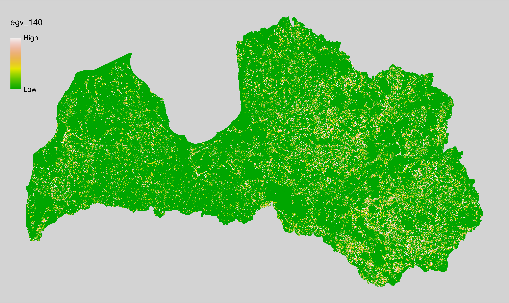


## Edges_Grasslands_r500	{#ch06.141}

**filename:** `Edges_Grasslands_r500.tif`	

**layername:** `egv_141`	

**English name:** Edge pixels of Grassland within the 0.5 km landscape

**Latvian name:** Zālāju malu garums 0,5 km ainavā

**Procedure:** Total edge at 500 m radius around the analysis grid cell, is calculated as the area-weighted sum of [analysis cells](#ch06.140) inside the buffer with `egvtools::radius_function`. During calculation of landscape metric, inverse distance weighted (power = 2) gap filling on the output is initialized to ensure no missing values at the edges. Finally, layer is rewritten to ensure layers name.


``` r
# Libs ----
if(!require(terra)) {install.packages("terra"); require(terra)}
if(!require(egvtools)) {remotes::install_github("aavotins/egvtools"); require(egvtools)}


# Templates -----
template100=rast("./Templates/TemplateRasters/LV100m_10km.tif")

# radii ----
radius_function(
  kvadrati_path  = "./Templates/TemplateGrids/tiles/",
  radii_path     = "./Templates/TemplateGridPoints/tiles/",
  tikls100_path  = "./Templates/TemplateGrids/tikls100_sauzeme.parquet",
  template_path  = "./Templates/TemplateRasters/LV100m_10km.tif",
  input_layers   = c("./RasterGrids_100m/2024/RAW/Edges_Grasslands_cell.tif"),
  layer_prefixes = c("Edges_Grasslands"),
  output_dir     = "./RasterGrids_100m/2024/RAW/",
  n_workers      = 12,
  radii          = c("r500"),
  radius_mode    = "sparse",
  extract_fun    = "sum",
  fill_missing   = TRUE,
  IDW_weight     = 2,
  future_max_size = 20 * 1024^3)


# Edges_Grasslands_r500.tif	egv_141 ----
slanis=rast("./RasterGrids_100m/2024/RAW/Edges_Grasslands_r500.tif")
names(slanis)="egv_141"
slanis2=project(slanis,template100)
writeRaster(slanis2,
            "./RasterGrids_100m/2024/RAW/Edges_Grasslands_r500.tif",
            overwrite=TRUE)
```


## Edges_Grasslands_r1250	{#ch06.142}

**filename:** `Edges_Grasslands_r1250.tif`	

**layername:** `egv_142`	

**English name:** Edge pixels of Grassland within the 1.25 km landscape

**Latvian name:** Zālāju malu garums 1,25 km ainavā

**Procedure:** Total edge at 1250 m radius around the analysis grid cell, is calculated as the area-weighted sum of [analysis cells](#ch06.140) inside the buffer with `egvtools::radius_function`. During calculation of landscape metric, inverse distance weighted (power = 2) gap filling on the output is initialized to ensure no missing values at the edges. Finally, layer is rewritten to ensure layers name.


``` r
# Libs ----
if(!require(terra)) {install.packages("terra"); require(terra)}
if(!require(egvtools)) {remotes::install_github("aavotins/egvtools"); require(egvtools)}


# Templates -----
template100=rast("./Templates/TemplateRasters/LV100m_10km.tif")

# radii ----
radius_function(
  kvadrati_path  = "./Templates/TemplateGrids/tiles/",
  radii_path     = "./Templates/TemplateGridPoints/tiles/",
  tikls100_path  = "./Templates/TemplateGrids/tikls100_sauzeme.parquet",
  template_path  = "./Templates/TemplateRasters/LV100m_10km.tif",
  input_layers   = c("./RasterGrids_100m/2024/RAW/Edges_Grasslands_cell.tif"),
  layer_prefixes = c("Edges_Grasslands"),
  output_dir     = "./RasterGrids_100m/2024/RAW/",
  n_workers      = 12,
  radii          = c("r1250"),
  radius_mode    = "sparse",
  extract_fun    = "sum",
  fill_missing   = TRUE,
  IDW_weight     = 2,
  future_max_size = 20 * 1024^3)


# Edges_Grasslands_r1250.tif	egv_142 ----
slanis=rast("./RasterGrids_100m/2024/RAW/Edges_Grasslands_r1250.tif")
names(slanis)="egv_142"
slanis2=project(slanis,template100)
writeRaster(slanis2,
            "./RasterGrids_100m/2024/RAW/Edges_Grasslands_r1250.tif",
            overwrite=TRUE)
```

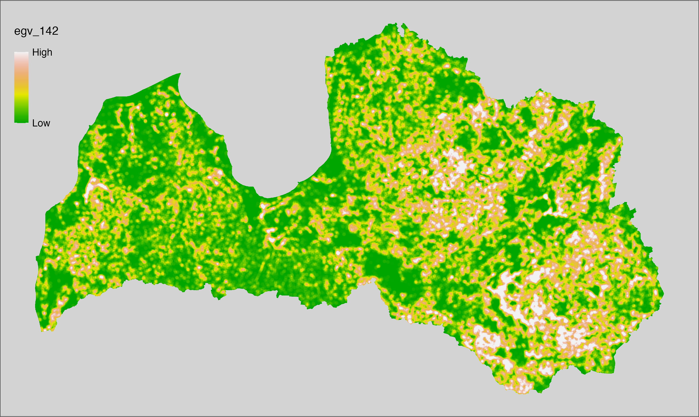


## Edges_Grasslands_r3000	{#ch06.143}

**filename:** `Edges_Grasslands_r3000.tif`	

**layername:** `egv_143`	

**English name:** Edge pixels of Grassland within the 3 km landscape

**Latvian name:** Zālāju malu garums 3 km ainavā

**Procedure:** Total edge at 3000 m radius around the analysis grid cell, is calculated as the area-weighted sum of [analysis cells](#ch06.140) inside the buffer with `egvtools::radius_function`. During calculation of landscape metric, inverse distance weighted (power = 2) gap filling on the output is initialized to ensure no missing values at the edges. Finally, layer is rewritten to ensure layers name.


``` r
# Libs ----
if(!require(terra)) {install.packages("terra"); require(terra)}
if(!require(egvtools)) {remotes::install_github("aavotins/egvtools"); require(egvtools)}


# Templates -----
template100=rast("./Templates/TemplateRasters/LV100m_10km.tif")

# radii ----
radius_function(
  kvadrati_path  = "./Templates/TemplateGrids/tiles/",
  radii_path     = "./Templates/TemplateGridPoints/tiles/",
  tikls100_path  = "./Templates/TemplateGrids/tikls100_sauzeme.parquet",
  template_path  = "./Templates/TemplateRasters/LV100m_10km.tif",
  input_layers   = c("./RasterGrids_100m/2024/RAW/Edges_Grasslands_cell.tif"),
  layer_prefixes = c("Edges_Grasslands"),
  output_dir     = "./RasterGrids_100m/2024/RAW/",
  n_workers      = 12,
  radii          = c("r3000"),
  radius_mode    = "sparse",
  extract_fun    = "sum",
  fill_missing   = TRUE,
  IDW_weight     = 2,
  future_max_size = 20 * 1024^3)


# Edges_Grasslands_r3000.tif	egv_143 ----
slanis=rast("./RasterGrids_100m/2024/RAW/Edges_Grasslands_r3000.tif")
names(slanis)="egv_143"
slanis2=project(slanis,template100)
writeRaster(slanis2,
            "./RasterGrids_100m/2024/RAW/Edges_Grasslands_r3000.tif",
            overwrite=TRUE)
```

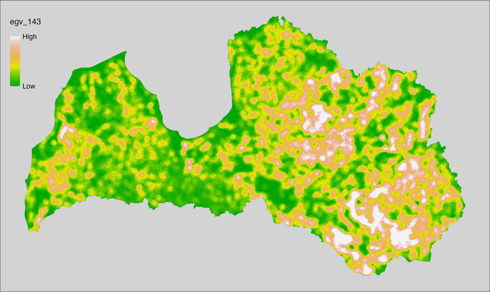


## Edges_Grasslands_r10000	{#ch06.144}

**filename:** `Edges_Grasslands_r10000.tif`	

**layername:** `egv_144`	

**English name:** Edge pixels of Grassland within the 10 km landscape

**Latvian name:** Zālāju malu garums 10 km ainavā

**Procedure:** Total edge at 10000 m radius around the analysis grid cell, is calculated as the area-weighted sum of [analysis cells](#ch06.140) inside the buffer with `egvtools::radius_function`. During calculation of landscape metric, inverse distance weighted (power = 2) gap filling on the output is initialized to ensure no missing values at the edges. Finally, layer is rewritten to ensure layers name.


``` r
# Libs ----
if(!require(terra)) {install.packages("terra"); require(terra)}
if(!require(egvtools)) {remotes::install_github("aavotins/egvtools"); require(egvtools)}


# Templates -----
template100=rast("./Templates/TemplateRasters/LV100m_10km.tif")

# radii ----
radius_function(
  kvadrati_path  = "./Templates/TemplateGrids/tiles/",
  radii_path     = "./Templates/TemplateGridPoints/tiles/",
  tikls100_path  = "./Templates/TemplateGrids/tikls100_sauzeme.parquet",
  template_path  = "./Templates/TemplateRasters/LV100m_10km.tif",
  input_layers   = c("./RasterGrids_100m/2024/RAW/Edges_Grasslands_cell.tif"),
  layer_prefixes = c("Edges_Grasslands"),
  output_dir     = "./RasterGrids_100m/2024/RAW/",
  n_workers      = 12,
  radii          = c("r10000"),
  radius_mode    = "sparse",
  extract_fun    = "sum",
  fill_missing   = TRUE,
  IDW_weight     = 2,
  future_max_size = 20 * 1024^3)


# Edges_Grasslands_r10000.tif	egv_144 ----
slanis=rast("./RasterGrids_100m/2024/RAW/Edges_Grasslands_r10000.tif")
names(slanis)="egv_144"
slanis2=project(slanis,template100)
writeRaster(slanis2,
            "./RasterGrids_100m/2024/RAW/Edges_Grasslands_r10000.tif",
            overwrite=TRUE)
```

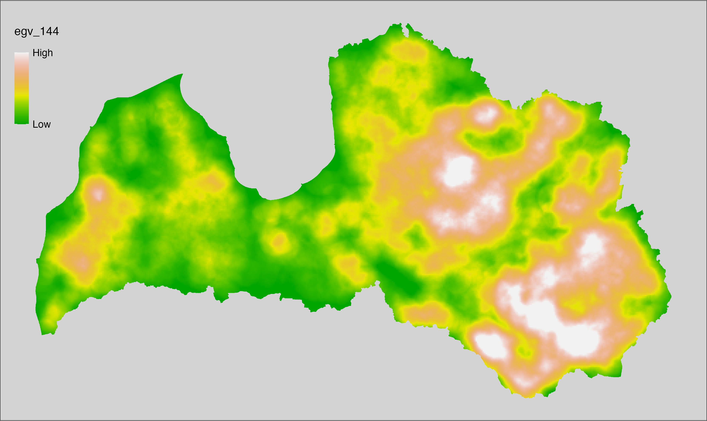


## Edges_OldForests_cell	{#ch06.145}

**filename:** `Edges_OldForests_cell.tif`	

**layername:** `egv_145`	

**English name:** Edge pixels of Forests Over Rotation Age within the analysis cell (1 ha)

**Latvian name:** Pieaugušo un pāraugušo mežaudžu malu garums analīzes šūnā (1 ha)

**Procedure:** First, raster layer with forest stands from [MVR](#Ch04.01) at age groups 4 and 5 is prepared (presence = 1, everything else = NA). Then, the layer (1=presence) is covered over 
the nulls layer (presence=0) and written to file (matching the input). Finally, with 
the function `egvtools::landscape_function()` total edge between the two classes 
is calculated. During calculation of landscape metric, inverse distance weighted (power = 2) gap filling on the output is initialized to ensure no missing values at the edges.


``` r
# Libs ----
if(!require(terra)) {install.packages("terra"); require(terra)}
if(!require(egvtools)) {remotes::install_github("aavotins/egvtools"); require(egvtools)}

if(!require(sf)) {install.packages("sf"); require(sf)}
if(!require(sfarrow)) {install.packages("sfarrow"); require(sfarrow)}
if(!require(raster)) {install.packages("raster"); require(raster)}
if(!require(fasterize)) {install.packages("fasterize"); require(fasterize)}
if(!require(tidyverse)) {install.packages("tidyverse"); require(tidyverse)}


# Templates -----
template10=rast("./Templates/TemplateRasters/LV10m_10km.tif")
nulls10=rast("./Templates/TemplateRasters/nulls_LV10m_10km.tif")

# simple landscape ----
simple_landscape=rast("./RasterGrids_10m/2024/Ainava_vienk_mask.tif")

# Edges_OldForests_input.tif ----
mvr=sfarrow::st_read_parquet("./Geodata/2024/MVR/nogabali_2024janv.parquet")
mvr2=mvr %>% 
  mutate(forest_age=ifelse(vgr=="4"|vgr=="5",1,NA)) %>% 
  filter(!is.na(forest_age))

rast_old=fasterize(mvr2,raster(template10),field="forest_age")
terra_old=rast(rast_old)
plot(terra_old)
terra_old=cover(terra_old,nulls10)
plot(terra_old)

edge_old=project(terra_old,template10,
                       filename="./RasterGrids_10m/2024/Edges_OldForests_input.tif",
                       overwrite=TRUE)
rm(mvr)
rm(mvr2)
rm(rast_old)
rm(terra_old)
rm(edge_old)


# Edges_OldForests_cell.tif	egv_145 ----
landscape_function(
  landscape      = "./RasterGrids_10m/2024/Edges_OldForests_input.tif",
  zones          = "./Templates/TemplateGrids/tikls100_sauzeme.parquet",
  id_field       = "id",
  tile_field     = "tks50km",
  template       = "./Templates/TemplateRasters/LV100m_10km.tif",
  out_dir        = "./RasterGrids_100m/2024/RAW",
  out_filename   = "Edges_OldForests_cell.tif",
  out_layername  = "egv_145",
  what             = "lsm_l_te",
  lm_args          = list(count_boundary = FALSE),
  rasterize_engine = "fasterize",
  n_workers      = 12,
  future_max_size = 20 * 1024^3,
  fill_gaps      = TRUE,
  plot_gaps      = FALSE,
  plot_result    = FALSE
)
```

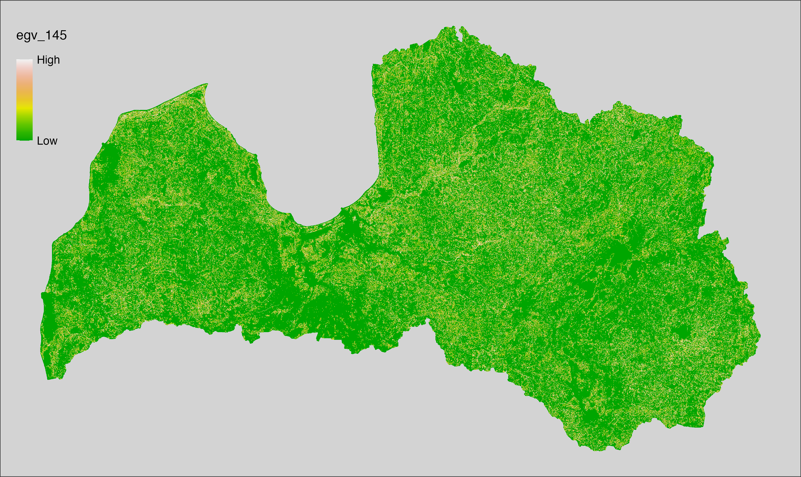


## Edges_OldForests_r500	{#ch06.146}

**filename:** `Edges_OldForests_r500.tif`	

**layername:** `egv_146`	

**English name:** Edge pixels of Forests Over Rotation Age within the 0.5 km landscape

**Latvian name:** Pieaugušo un pāraugušo mežaudžu malu garums 0,5 km ainavā

**Procedure:** Total edge at 500 m radius around the analysis grid cell, is calculated as the area-weighted sum of [analysis cells](#ch06.145) inside the buffer with `egvtools::radius_function`. During calculation of landscape metric, inverse distance weighted (power = 2) gap filling on the output is initialized to ensure no missing values at the edges. Finally, layer is rewritten to ensure layers name.


``` r
# Libs ----
if(!require(terra)) {install.packages("terra"); require(terra)}
if(!require(egvtools)) {remotes::install_github("aavotins/egvtools"); require(egvtools)}


# Templates -----
template100=rast("./Templates/TemplateRasters/LV100m_10km.tif")

# radii ----
radius_function(
  kvadrati_path  = "./Templates/TemplateGrids/tiles/",
  radii_path     = "./Templates/TemplateGridPoints/tiles/",
  tikls100_path  = "./Templates/TemplateGrids/tikls100_sauzeme.parquet",
  template_path  = "./Templates/TemplateRasters/LV100m_10km.tif",
  input_layers   = c("./RasterGrids_100m/2024/RAW/Edges_OldForests_cell.tif"),
  layer_prefixes = c("Edges_OldForests"),
  output_dir     = "./RasterGrids_100m/2024/RAW/",
  n_workers      = 12,
  radii          = c("r500"),
  radius_mode    = "sparse",
  extract_fun    = "sum",
  fill_missing   = TRUE,
  IDW_weight     = 2,
  future_max_size = 20 * 1024^3)


# Edges_OldForests_r500.tif	egv_146 ----
slanis=rast("./RasterGrids_100m/2024/RAW/Edges_OldForests_r500.tif")
names(slanis)="egv_146"
slanis2=project(slanis,template100)
writeRaster(slanis2,
            "./RasterGrids_100m/2024/RAW/Edges_OldForests_r500.tif",
            overwrite=TRUE)
```


## Edges_OldForests_r1250	{#ch06.147}

**filename:** `Edges_OldForests_r1250.tif`	

**layername:** `egv_147`	

**English name:** Edge pixels of Forests Over Rotation Age within the 1.25 km landscape

**Latvian name:** Pieaugušo un pāraugušo mežaudžu malu garums 1,25 km ainavā

**Procedure:** Total edge at 1250 m radius around the analysis grid cell, is calculated as the area-weighted sum of [analysis cells](#ch06.145) inside the buffer with `egvtools::radius_function`. During calculation of landscape metric, inverse distance weighted (power = 2) gap filling on the output is initialized to ensure no missing values at the edges. Finally, layer is rewritten to ensure layers name.


``` r
# Libs ----
if(!require(terra)) {install.packages("terra"); require(terra)}
if(!require(egvtools)) {remotes::install_github("aavotins/egvtools"); require(egvtools)}


# Templates -----
template100=rast("./Templates/TemplateRasters/LV100m_10km.tif")

# radii ----
radius_function(
  kvadrati_path  = "./Templates/TemplateGrids/tiles/",
  radii_path     = "./Templates/TemplateGridPoints/tiles/",
  tikls100_path  = "./Templates/TemplateGrids/tikls100_sauzeme.parquet",
  template_path  = "./Templates/TemplateRasters/LV100m_10km.tif",
  input_layers   = c("./RasterGrids_100m/2024/RAW/Edges_OldForests_cell.tif"),
  layer_prefixes = c("Edges_OldForests"),
  output_dir     = "./RasterGrids_100m/2024/RAW/",
  n_workers      = 12,
  radii          = c("r1250"),
  radius_mode    = "sparse",
  extract_fun    = "sum",
  fill_missing   = TRUE,
  IDW_weight     = 2,
  future_max_size = 20 * 1024^3)


# Edges_OldForests_r1250.tif	egv_147 ----
slanis=rast("./RasterGrids_100m/2024/RAW/Edges_OldForests_r1250.tif")
names(slanis)="egv_147"
slanis2=project(slanis,template100)
writeRaster(slanis2,
            "./RasterGrids_100m/2024/RAW/Edges_OldForests_r1250.tif",
            overwrite=TRUE)
```


## Edges_OldForests_r3000	{#ch06.148}

**filename:** `Edges_OldForests_r3000.tif`	

**layername:** `egv_148`	

**English name:** Edge pixels of Forests Over Rotation Age within the 3 km landscape

**Latvian name:** Pieaugušo un pāraugušo mežaudžu malu garums 3 km ainavā

**Procedure:** Total edge at 3000 m radius around the analysis grid cell, is calculated as the area-weighted sum of [analysis cells](#ch06.145) inside the buffer with `egvtools::radius_function`. During calculation of landscape metric, inverse distance weighted (power = 2) gap filling on the output is initialized to ensure no missing values at the edges. Finally, layer is rewritten to ensure layers name.


``` r
# Libs ----
if(!require(terra)) {install.packages("terra"); require(terra)}
if(!require(egvtools)) {remotes::install_github("aavotins/egvtools"); require(egvtools)}


# Templates -----
template100=rast("./Templates/TemplateRasters/LV100m_10km.tif")

# radii ----
radius_function(
  kvadrati_path  = "./Templates/TemplateGrids/tiles/",
  radii_path     = "./Templates/TemplateGridPoints/tiles/",
  tikls100_path  = "./Templates/TemplateGrids/tikls100_sauzeme.parquet",
  template_path  = "./Templates/TemplateRasters/LV100m_10km.tif",
  input_layers   = c("./RasterGrids_100m/2024/RAW/Edges_OldForests_cell.tif"),
  layer_prefixes = c("Edges_OldForests"),
  output_dir     = "./RasterGrids_100m/2024/RAW/",
  n_workers      = 12,
  radii          = c("r3000"),
  radius_mode    = "sparse",
  extract_fun    = "sum",
  fill_missing   = TRUE,
  IDW_weight     = 2,
  future_max_size = 20 * 1024^3)


# Edges_OldForests_r3000.tif	egv_148 ----
slanis=rast("./RasterGrids_100m/2024/RAW/Edges_OldForests_r3000.tif")
names(slanis)="egv_148"
slanis2=project(slanis,template100)
writeRaster(slanis2,
            "./RasterGrids_100m/2024/RAW/Edges_OldForests_r3000.tif",
            overwrite=TRUE)
```

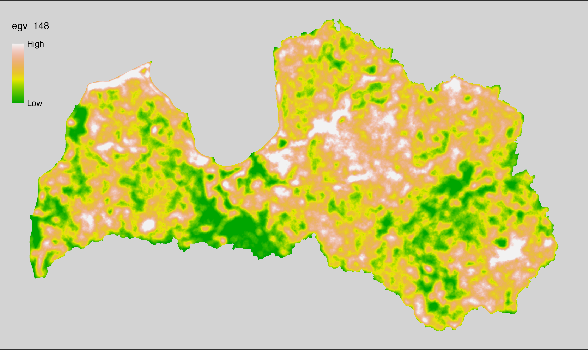


## Edges_OldForests_r10000	{#ch06.149}

**filename:** `Edges_OldForests_r10000.tif`	

**layername:** `egv_149`	

**English name:** Edge pixels of Forests Over Rotation Age within the 10 km landscape

**Latvian name:** Pieaugušo un pāraugušo mežaudžu malu garums 10 km ainavā

**Procedure:** Total edge at 10000 m radius around the analysis grid cell, is calculated as the area-weighted sum of [analysis cells](#ch06.145) inside the buffer with `egvtools::radius_function`. During calculation of landscape metric, inverse distance weighted (power = 2) gap filling on the output is initialized to ensure no missing values at the edges. Finally, layer is rewritten to ensure layers name.


``` r
# Libs ----
if(!require(terra)) {install.packages("terra"); require(terra)}
if(!require(egvtools)) {remotes::install_github("aavotins/egvtools"); require(egvtools)}


# Templates -----
template100=rast("./Templates/TemplateRasters/LV100m_10km.tif")

# radii ----
radius_function(
  kvadrati_path  = "./Templates/TemplateGrids/tiles/",
  radii_path     = "./Templates/TemplateGridPoints/tiles/",
  tikls100_path  = "./Templates/TemplateGrids/tikls100_sauzeme.parquet",
  template_path  = "./Templates/TemplateRasters/LV100m_10km.tif",
  input_layers   = c("./RasterGrids_100m/2024/RAW/Edges_OldForests_cell.tif"),
  layer_prefixes = c("Edges_OldForests"),
  output_dir     = "./RasterGrids_100m/2024/RAW/",
  n_workers      = 12,
  radii          = c("r10000"),
  radius_mode    = "sparse",
  extract_fun    = "sum",
  fill_missing   = TRUE,
  IDW_weight     = 2,
  future_max_size = 20 * 1024^3)


# Edges_OldForests_r10000.tif	egv_149 ----
slanis=rast("./RasterGrids_100m/2024/RAW/Edges_OldForests_r10000.tif")
names(slanis)="egv_149"
slanis2=project(slanis,template100)
writeRaster(slanis2,
            "./RasterGrids_100m/2024/RAW/Edges_OldForests_r10000.tif",
            overwrite=TRUE)
```

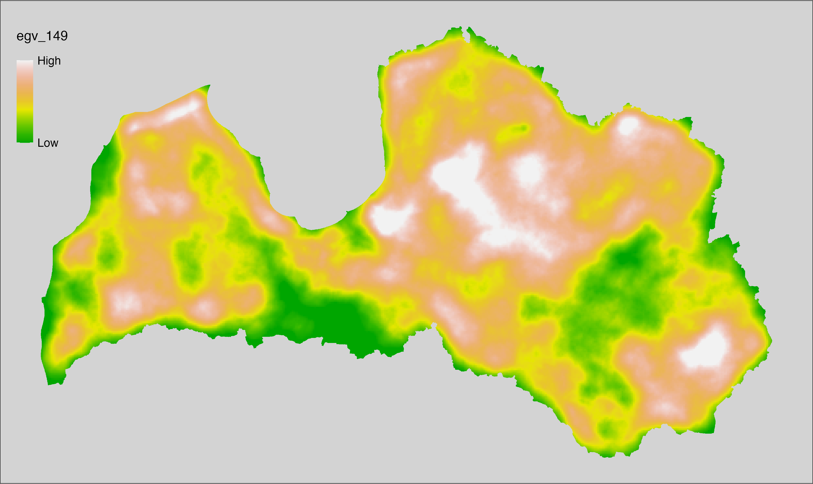


## Edges_Roads_cell	{#ch06.150}

**filename:** `Edges_Roads_cell.tif`	

**layername:** `egv_150`	

**English name:** Edge pixels of Roads within the analysis cell (1 ha)

**Latvian name:** Ceļu malu garums analīzes šūnā (1 ha)

**Procedure:** First, values equal to 100 and from [Landscape classification](#Ch05.03) are coded as 1 and everything else as NA. Then, the layer (1=presence) is covered over 
the nulls layer (presence=0) and written to file (matching the input). Finally, with 
the function `egvtools::landscape_function()` total edge between the two classes 
is calculated. During calculation of landscape metric, inverse distance weighted (power = 2) gap filling on the output is initialized to ensure no missing values at the edges.


``` r
# Libs ----
if(!require(terra)) {install.packages("terra"); require(terra)}
if(!require(egvtools)) {remotes::install_github("aavotins/egvtools"); require(egvtools)}

if(!require(sf)) {install.packages("sf"); require(sf)}
if(!require(sfarrow)) {install.packages("sfarrow"); require(sfarrow)}
if(!require(raster)) {install.packages("raster"); require(raster)}
if(!require(fasterize)) {install.packages("fasterize"); require(fasterize)}
if(!require(tidyverse)) {install.packages("tidyverse"); require(tidyverse)}


# Templates -----
template10=rast("./Templates/TemplateRasters/LV10m_10km.tif")
nulls10=rast("./Templates/TemplateRasters/nulls_LV10m_10km.tif")

# simple landscape ----
simple_landscape=rast("./RasterGrids_10m/2024/Ainava_vienk_mask.tif")

# Edges_Roads_input.tif ----
roads=ifel(simple_landscape==100,1,NA)
plot(roads)
roads=cover(roads,nulls10)
plot(roads)

edge_roads=project(roads,template10,
                   filename="./RasterGrids_10m/2024/Edges_Roads_input.tif",
                   overwrite=TRUE)
rm(edge_roads)


# Edges_Roads_cell.tif	egv_150 ----
landscape_function(
  landscape      = "./RasterGrids_10m/2024/Edges_Roads_input.tif",
  zones          = "./Templates/TemplateGrids/tikls100_sauzeme.parquet",
  id_field       = "id",
  tile_field     = "tks50km",
  template       = "./Templates/TemplateRasters/LV100m_10km.tif",
  out_dir        = "./RasterGrids_100m/2024/RAW",
  out_filename   = "Edges_Roads_cell.tif",
  out_layername  = "egv_150",
  what             = "lsm_l_te",
  lm_args          = list(count_boundary = FALSE),
  rasterize_engine = "fasterize",
  n_workers      = 12,
  future_max_size = 20 * 1024^3,
  fill_gaps      = TRUE,
  plot_gaps      = FALSE,
  plot_result    = FALSE
)
```

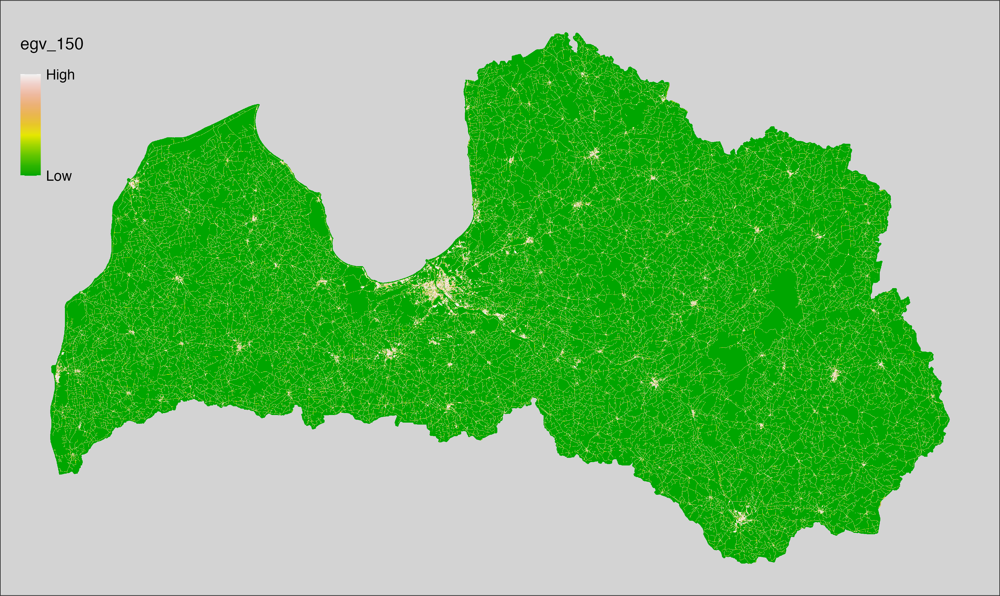


## Edges_Roads_r500	{#ch06.151}

**filename:** `Edges_Roads_r500.tif`	

**layername:** `egv_151`	

**English name:** Edge pixels of Roads within the 0.5 km landscape

**Latvian name:** Ceļu malu garums 0,5 km ainavā

**Procedure:** Total edge at 500 m radius around the analysis grid cell, is calculated as the area-weighted sum of [analysis cells](#ch06.145) inside the buffer with `egvtools::radius_function`. During calculation of landscape metric, inverse distance weighted (power = 2) gap filling on the output is initialized to ensure no missing values at the edges. Finally, layer is rewritten to ensure layers name.


``` r
# Libs ----
if(!require(terra)) {install.packages("terra"); require(terra)}
if(!require(egvtools)) {remotes::install_github("aavotins/egvtools"); require(egvtools)}


# Templates -----
template100=rast("./Templates/TemplateRasters/LV100m_10km.tif")

# radii ----
radius_function(
  kvadrati_path  = "./Templates/TemplateGrids/tiles/",
  radii_path     = "./Templates/TemplateGridPoints/tiles/",
  tikls100_path  = "./Templates/TemplateGrids/tikls100_sauzeme.parquet",
  template_path  = "./Templates/TemplateRasters/LV100m_10km.tif",
  input_layers   = c("./RasterGrids_100m/2024/RAW/Edges_Roads_cell.tif"),
  layer_prefixes = c("Edges_Roads"),
  output_dir     = "./RasterGrids_100m/2024/RAW/",
  n_workers      = 12,
  radii          = c("r500"),
  radius_mode    = "sparse",
  extract_fun    = "sum",
  fill_missing   = TRUE,
  IDW_weight     = 2,
  future_max_size = 20 * 1024^3)


# Edges_Roads_r500.tif	egv_151 ----
slanis=rast("./RasterGrids_100m/2024/RAW/Edges_Roads_r500.tif")
names(slanis)="egv_151"
slanis2=project(slanis,template100)
writeRaster(slanis2,
            "./RasterGrids_100m/2024/RAW/Edges_Roads_r500.tif",
            overwrite=TRUE)
```


## Edges_Roads_r1250	{#ch06.152}

**filename:** `Edges_Roads_r1250.tif`	

**layername:** `egv_152`	

**English name:** Edge pixels of Roads within the 1.25 km landscape

**Latvian name:** Ceļu malu garums 1,25 km ainavā

**Procedure:** Total edge at 1250 m radius around the analysis grid cell, is calculated as the area-weighted sum of [analysis cells](#ch06.145) inside the buffer with `egvtools::radius_function`. During calculation of landscape metric, inverse distance weighted (power = 2) gap filling on the output is initialized to ensure no missing values at the edges. Finally, layer is rewritten to ensure layers name.


``` r
# Libs ----
if(!require(terra)) {install.packages("terra"); require(terra)}
if(!require(egvtools)) {remotes::install_github("aavotins/egvtools"); require(egvtools)}


# Templates -----
template100=rast("./Templates/TemplateRasters/LV100m_10km.tif")

# radii ----
radius_function(
  kvadrati_path  = "./Templates/TemplateGrids/tiles/",
  radii_path     = "./Templates/TemplateGridPoints/tiles/",
  tikls100_path  = "./Templates/TemplateGrids/tikls100_sauzeme.parquet",
  template_path  = "./Templates/TemplateRasters/LV100m_10km.tif",
  input_layers   = c("./RasterGrids_100m/2024/RAW/Edges_Roads_cell.tif"),
  layer_prefixes = c("Edges_Roads"),
  output_dir     = "./RasterGrids_100m/2024/RAW/",
  n_workers      = 12,
  radii          = c("r1250"),
  radius_mode    = "sparse",
  extract_fun    = "sum",
  fill_missing   = TRUE,
  IDW_weight     = 2,
  future_max_size = 20 * 1024^3)


# Edges_Roads_r1250.tif	egv_152 ----
slanis=rast("./RasterGrids_100m/2024/RAW/Edges_Roads_r1250.tif")
names(slanis)="egv_152"
slanis2=project(slanis,template100)
writeRaster(slanis2,
            "./RasterGrids_100m/2024/RAW/Edges_Roads_r1250.tif",
            overwrite=TRUE)
```


## Edges_Roads_r3000	{#ch06.153}

**filename:** `Edges_Roads_r3000.tif`	

**layername:** `egv_153`	

**English name:** Edge pixels of Roads within the 3 km landscape

**Latvian name:** Ceļu malu garums 3 km ainavā

**Procedure:** Total edge at 3000 m radius around the analysis grid cell, is calculated as the area-weighted sum of [analysis cells](#ch06.145) inside the buffer with `egvtools::radius_function`. During calculation of landscape metric, inverse distance weighted (power = 2) gap filling on the output is initialized to ensure no missing values at the edges. Finally, layer is rewritten to ensure layers name.


``` r
# Libs ----
if(!require(terra)) {install.packages("terra"); require(terra)}
if(!require(egvtools)) {remotes::install_github("aavotins/egvtools"); require(egvtools)}


# Templates -----
template100=rast("./Templates/TemplateRasters/LV100m_10km.tif")

# radii ----
radius_function(
  kvadrati_path  = "./Templates/TemplateGrids/tiles/",
  radii_path     = "./Templates/TemplateGridPoints/tiles/",
  tikls100_path  = "./Templates/TemplateGrids/tikls100_sauzeme.parquet",
  template_path  = "./Templates/TemplateRasters/LV100m_10km.tif",
  input_layers   = c("./RasterGrids_100m/2024/RAW/Edges_Roads_cell.tif"),
  layer_prefixes = c("Edges_Roads"),
  output_dir     = "./RasterGrids_100m/2024/RAW/",
  n_workers      = 12,
  radii          = c("r3000"),
  radius_mode    = "sparse",
  extract_fun    = "sum",
  fill_missing   = TRUE,
  IDW_weight     = 2,
  future_max_size = 20 * 1024^3)


# Edges_Roads_r3000.tif	egv_153 ----
slanis=rast("./RasterGrids_100m/2024/RAW/Edges_Roads_r3000.tif")
names(slanis)="egv_153"
slanis2=project(slanis,template100)
writeRaster(slanis2,
            "./RasterGrids_100m/2024/RAW/Edges_Roads_r3000.tif",
            overwrite=TRUE)
```

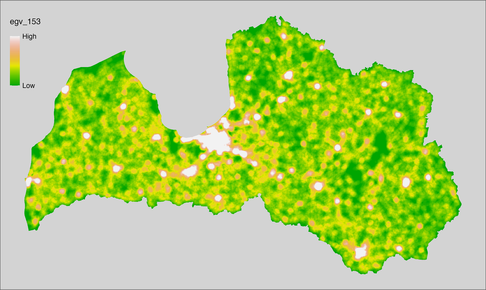


## Edges_Roads_r10000	{#ch06.154}

**filename:** `Edges_Roads_r10000.tif`	

**layername:** `egv_154`	

**English name:** Edge pixels of Roads within the 10 km landscape

**Latvian name:** Ceļu malu garums 10 km ainavā

**Procedure:** Total edge at 10000 m radius around the analysis grid cell, is calculated as the area-weighted sum of [analysis cells](#ch06.145) inside the buffer with `egvtools::radius_function`. During calculation of landscape metric, inverse distance weighted (power = 2) gap filling on the output is initialized to ensure no missing values at the edges. Finally, layer is rewritten to ensure layers name.


``` r
# Libs ----
if(!require(terra)) {install.packages("terra"); require(terra)}
if(!require(egvtools)) {remotes::install_github("aavotins/egvtools"); require(egvtools)}


# Templates -----
template100=rast("./Templates/TemplateRasters/LV100m_10km.tif")

# radii ----
radius_function(
  kvadrati_path  = "./Templates/TemplateGrids/tiles/",
  radii_path     = "./Templates/TemplateGridPoints/tiles/",
  tikls100_path  = "./Templates/TemplateGrids/tikls100_sauzeme.parquet",
  template_path  = "./Templates/TemplateRasters/LV100m_10km.tif",
  input_layers   = c("./RasterGrids_100m/2024/RAW/Edges_Roads_cell.tif"),
  layer_prefixes = c("Edges_Roads"),
  output_dir     = "./RasterGrids_100m/2024/RAW/",
  n_workers      = 12,
  radii          = c("r10000"),
  radius_mode    = "sparse",
  extract_fun    = "sum",
  fill_missing   = TRUE,
  IDW_weight     = 2,
  future_max_size = 20 * 1024^3)


# Edges_Roads_r10000.tif	egv_154 ----
slanis=rast("./RasterGrids_100m/2024/RAW/Edges_Roads_r10000.tif")
names(slanis)="egv_154"
slanis2=project(slanis,template100)
writeRaster(slanis2,
            "./RasterGrids_100m/2024/RAW/Edges_Roads_r10000.tif",
            overwrite=TRUE)
```

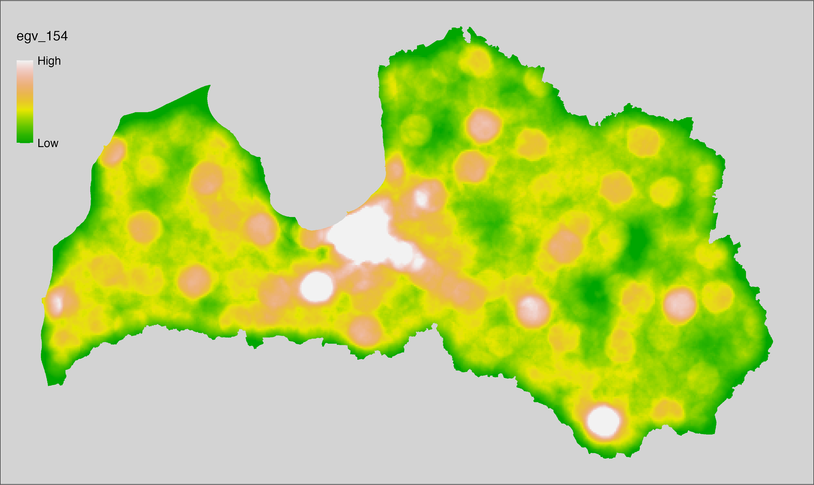


## Edges_Trees_cell	{#ch06.155}

**filename:** `Edges_Trees_cell.tif`	

**layername:** `egv_155`	

**English name:** Edge pixels of Trees within the analysis cell (1 ha)

**Latvian name:** Koku malu garums analīzes šūnā (1 ha)

**Procedure:** 


``` r
# libs ----
```


## Edges_Trees_r500	{#ch06.156}

**filename:** `Edges_Trees_r500.tif`	

**layername:** `egv_156`	

**English name:** Edge pixels of Trees within the 0.5 km landscape

**Latvian name:** Koku malu garums 0,5 km ainavā

**Procedure:** 


``` r
# libs ----
```


## Edges_Trees_r1250	{#ch06.157}

**filename:** `Edges_Trees_r1250.tif`	

**layername:** `egv_157`	

**English name:** Edge pixels of Trees within the 1.25 km landscape

**Latvian name:** Koku malu garums 1,25 km ainavā

**Procedure:** 


``` r
# libs ----
```


## Edges_Trees_r3000	{#ch06.158}

**filename:** `Edges_Trees_r3000.tif`	

**layername:** `egv_158`	

**English name:** Edge pixels of Trees within the 3 km landscape

**Latvian name:** Koku malu garums 3 km ainavā

**Procedure:** 


``` r
# libs ----
```


## Edges_Trees_r10000	{#ch06.159}

**filename:** `Edges_Trees_r10000.tif`	

**layername:** `egv_159`	

**English name:** Edge pixels of Trees within the 10 km landscape

**Latvian name:** Koku malu garums 10 km ainavā

**Procedure:** 


``` r
# libs ----
```


## Edges_Water_cell	{#ch06.160}

**filename:** `Edges_Water_cell.tif`	

**layername:** `egv_160`	

**English name:** Edge pixels of Water within the analysis cell (1 ha)

**Latvian name:** Ūdenstilpju malu garums nalīzes šūnā (1 ha)

**Procedure:** 


``` r
# libs ----
```


## Edges_Water_r500	{#ch06.161}

**filename:** `Edges_Water_r500.tif`	

**layername:** `egv_161`	

**English name:** Edge pixels of Water within the 0.5 km landscape

**Latvian name:** Ūdenstilpju malu garums 0,5 km ainavā

**Procedure:** 


``` r
# libs ----
```


## Edges_Water_r1250	{#ch06.162}

**filename:** `Edges_Water_r1250.tif`	

**layername:** `egv_162`	

**English name:** Edge pixels of Water within the 1.25 km landscape

**Latvian name:** Ūdenstilpju malu garums 1,25 km ainavā

**Procedure:** 


``` r
# libs ----
```


## Edges_Water_r3000	{#ch06.163}

**filename:** `Edges_Water_r3000.tif`	

**layername:** `egv_163`	

**English name:** Edge pixels of Water within the 3 km landscape

**Latvian name:** Ūdenstilpju malu garums 3 km ainavā

**Procedure:** 


``` r
# libs ----
```


## Edges_Water_r10000	{#ch06.164}

**filename:** `Edges_Water_r10000.tif`	

**layername:** `egv_164`	

**English name:** Edge pixels of Water within the 10 km landscape

**Latvian name:** Ūdenstilpju malu garums 10 km ainavā

**Procedure:** 


``` r
# libs ----
```


## Edges_Water-Farmland_cell	{#ch06.165}

**filename:** `Edges_Water-Farmland_cell.tif`	

**layername:** `egv_165`	

**English name:** Edge pixels of Water bordering with Farmland within the analysis cell (1 ha)

**Latvian name:** Ūdenstilpu malu ar lauksaimniecības zemēm garums analīzes šūnā (1 ha)

**Procedure:** 


``` r
# libs ----
```


## Edges_Water-Farmland_r500	{#ch06.166}

**filename:** `Edges_Water-Farmland_r500.tif`	

**layername:** `egv_166`	

**English name:** Edge pixels of Water bordering with Farmland within the 0.5 km landscape

**Latvian name:** Ūdenstilpu malu ar lauksaimniecības zemēm garums 0,5 km ainavā

**Procedure:** 


``` r
# libs ----
```


## Edges_Water-Farmland_r1250	{#ch06.167}

**filename:** `Edges_Water-Farmland_r1250.tif`	

**layername:** `egv_167`	

**English name:** Edge pixels of Water bordering with Farmland within the 1.25 km landscape

**Latvian name:** Ūdenstilpu malu ar lauksaimniecības zemēm garums 1,25 km ainavā

**Procedure:** 


``` r
# libs ----
```


## Edges_Water-Farmland_r3000	{#ch06.168}

**filename:** `Edges_Water-Farmland_r3000.tif`	

**layername:** `egv_168`	

**English name:** Edge pixels of Water bordering with Farmland within the 3 km landscape

**Latvian name:** Ūdenstilpu malu ar lauksaimniecības zemēm garums 3 km ainavā

**Procedure:** 


``` r
# libs ----
```


## Edges_Water-Farmland_r10000	{#ch06.169}

**filename:** `Edges_Water-Farmland_r10000.tif`	

**layername:** `egv_169`	

**English name:** Edge pixels of Water bordering with Farmland within the 10 km landscape

**Latvian name:** Ūdenstilpu malu ar lauksaimniecības zemēm garums 10 km ainavā

**Procedure:** 


``` r
# libs ----
```


## Edges_Water-Grassland_cell	{#ch06.170}

**filename:** `Edges_Water-Grassland_cell.tif`	

**layername:** `egv_170`	

**English name:** Edge pixels of Water bordering with Grassland within the analysis cell (1 ha)

**Latvian name:** Ūdenstilpu malu ar zālājiem garums analīzes šūnā (1 ha)

**Procedure:** 


``` r
# libs ----
```


## Edges_Water-Grassland_r500	{#ch06.171}

**filename:** `Edges_Water-Grassland_r500.tif`	

**layername:** `egv_171`	

**English name:** Edge pixels of Water bordering with Grassland within the 0.5 km landscape

**Latvian name:** Ūdenstilpu malu ar zālājiem garums 0,5 km ainavā

**Procedure:** 


``` r
# libs ----
```


## Edges_Water-Grassland_r1250	{#ch06.172}

**filename:** `Edges_Water-Grassland_r1250.tif`	

**layername:** `egv_172`	

**English name:** Edge pixels of Water bordering with Grassland within the 1.25 km landscape

**Latvian name:** Ūdenstilpu malu ar zālājiem garums 1,25 km ainavā

**Procedure:** 


``` r
# libs ----
```


## Edges_Water-Grassland_r3000	{#ch06.173}

**filename:** `Edges_Water-Grassland_r3000.tif`	

**layername:** `egv_173`	

**English name:** Edge pixels of Water bordering with Grassland within the 3 km landscape

**Latvian name:** Ūdenstilpu malu ar zālājiem garums 3 km ainavā

**Procedure:** 


``` r
# libs ----
```


## Edges_Water-Grassland_r10000	{#ch06.174}

**filename:** `Edges_Water-Grassland_r10000.tif`	

**layername:** `egv_174`	

**English name:** Edge pixels of Water bordering with Grassland within the 10 km landscape

**Latvian name:** Ūdenstilpu malu ar zālājiem garums 10 km ainavā

**Procedure:** 


``` r
# libs ----
```


## Edges_ReedSedgeRushBeds-Water_cell	{#ch06.175}

**filename:** `Edges_ReedSedgeRushBeds-Water_cell.tif`	

**layername:** `egv_175`	

**English name:** Edge pixels of Reed-, Sedge-, Rush- Beds bordering with Water within the analysis cell (1 ha)

**Latvian name:** Niedrāju, grīslāju, meldrāju malu ar ūdeni garums analīzes šūnā (1 ha)

**Procedure:** 


``` r
# libs ----
```


## Edges_ReedSedgeRushBeds-Water_r500	{#ch06.176}

**filename:** `Edges_ReedSedgeRushBeds-Water_r500.tif`	

**layername:** `egv_176`	

**English name:** Edge pixels of Reed-, Sedge-, Rush- Beds bordering with Water within the 0.5 km landscape

**Latvian name:** Niedrāju, grīslāju, meldrāju malu ar ūdeni garums 0,5 km ainavā

**Procedure:** 


``` r
# libs ----
```


## Edges_ReedSedgeRushBeds-Water_r1250	{#ch06.177}

**filename:** `Edges_ReedSedgeRushBeds-Water_r1250.tif`	

**layername:** `egv_177`	

**English name:** Edge pixels of Reed-, Sedge-, Rush- Beds bordering with Water within the 1.25 km landscape

**Latvian name:** Niedrāju, grīslāju, meldrāju malu ar ūdeni garums 1,25 km ainavā

**Procedure:** 


``` r
# libs ----
```


## Edges_ReedSedgeRushBeds-Water_r3000	{#ch06.178}

**filename:** `Edges_ReedSedgeRushBeds-Water_r3000.tif`	

**layername:** `egv_178`	

**English name:** Edge pixels of Reed-, Sedge-, Rush- Beds bordering with Water within the 3 km landscape

**Latvian name:** Niedrāju, grīslāju, meldrāju malu ar ūdeni garums 3 km ainavā

**Procedure:** 


``` r
# libs ----
```


## Edges_ReedSedgeRushBeds-Water_r10000	{#ch06.179}

**filename:** `Edges_ReedSedgeRushBeds-Water_r10000.tif`	

**layername:** `egv_179`	

**English name:** Edge pixels of Reed-, Sedge-, Rush- Beds bordering with Water within the 10 km landscape

**Latvian name:** Niedrāju, grīslāju, meldrāju malu ar ūdeni garums 10 km ainavā

**Procedure:** 


``` r
# libs ----
```


## FarmlandCrops_CropsAll_cell	{#ch06.180}

**filename:** `FarmlandCrops_CropsAll_cell.tif`	

**layername:** `egv_180`	

**English name:** Fractional cover of Crops (all types) within the analysis cell (1 ha)

**Latvian name:** Aramzemju (dažādu lauksaimniecības kultūru) platības īpatsvars analīzes šūnā (1 ha)

**Procedure:** 


``` r
# libs ----
```


## FarmlandCrops_CropsAll_r500	{#ch06.181}

**filename:** `FarmlandCrops_CropsAll_r500.tif`	

**layername:** `egv_181`	

**English name:** Fractional cover of Crops (all types) within the 0.5 km landscape

**Latvian name:** Aramzemju (dažādu lauksaimniecības kultūru) platības īpatsvars 0,5 km ainavā

**Procedure:** 


``` r
# libs ----
```


## FarmlandCrops_CropsAll_r1250	{#ch06.182}

**filename:** `FarmlandCrops_CropsAll_r1250.tif`	

**layername:** `egv_182`	

**English name:** Fractional cover of Crops (all types) within the 1.25 km landscape

**Latvian name:** Aramzemju (dažādu lauksaimniecības kultūru) platības īpatsvars 1,25 km ainavā

**Procedure:** 


``` r
# libs ----
```


## FarmlandCrops_CropsAll_r3000	{#ch06.183}

**filename:** `FarmlandCrops_CropsAll_r3000.tif`	

**layername:** `egv_183`	

**English name:** Fractional cover of Crops (all types) within the 3 km landscape

**Latvian name:** Aramzemju (dažādu lauksaimniecības kultūru) platības īpatsvars 3 km ainavā

**Procedure:** 


``` r
# libs ----
```


## FarmlandCrops_CropsAll_r10000	{#ch06.184}

**filename:** `FarmlandCrops_CropsAll_r10000.tif`	

**layername:** `egv_184`	

**English name:** Fractional cover of Crops (all types) within the 10 km landscape

**Latvian name:** Aramzemju (dažādu lauksaimniecības kultūru) platības īpatsvars 10 km ainavā

**Procedure:** 


``` r
# libs ----
```


## FarmlandCrops_CropsHoed_cell	{#ch06.185}

**filename:** `FarmlandCrops_CropsHoed_cell.tif`	

**layername:** `egv_185`	

**English name:** Fractional cover of Hoed Crops within the analysis cell (1 ha)

**Latvian name:** Vagu un rušināmkultūru platības īpatsvars analīzes šūnā (1 ha)

**Procedure:** 


``` r
# libs ----
```


## FarmlandCrops_CropsHoed_r500	{#ch06.186}

**filename:** `FarmlandCrops_CropsHoed_r500.tif`	

**layername:** `egv_186`	

**English name:** Fractional cover of Hoed Crops within the 0.5 km landscape

**Latvian name:** Vagu un rušināmkultūru platības īpatsvars 0,5 km ainavā

**Procedure:** 


``` r
# libs ----
```


## FarmlandCrops_CropsHoed_r1250	{#ch06.187}

**filename:** `FarmlandCrops_CropsHoed_r1250.tif`	

**layername:** `egv_187`	

**English name:** Fractional cover of Hoed Crops within the 1.25 km landscape

**Latvian name:** Vagu un rušināmkultūru platības īpatsvars 1,25 km ainavā

**Procedure:** 


``` r
# libs ----
```


## FarmlandCrops_CropsHoed_r3000	{#ch06.188}

**filename:** `FarmlandCrops_CropsHoed_r3000.tif`	

**layername:** `egv_188`	

**English name:** Fractional cover of Hoed Crops within the 3 km landscape

**Latvian name:** Vagu un rušināmkultūru platības īpatsvars 3 km ainavā

**Procedure:** 


``` r
# libs ----
```


## FarmlandCrops_CropsHoed_r10000	{#ch06.189}

**filename:** `FarmlandCrops_CropsHoed_r10000.tif`	

**layername:** `egv_189`	

**English name:** Fractional cover of Hoed Crops within the 10 km landscape

**Latvian name:** Vagu un rušināmkultūru platības īpatsvars 10 km ainavā

**Procedure:** 


``` r
# libs ----
```


## FarmlandCrops_CropsOther_cell	{#ch06.190}

**filename:** `FarmlandCrops_CropsOther_cell.tif`	

**layername:** `egv_190`	

**English name:** Fractional cover of Other Crops within the analysis cell (1 ha)

**Latvian name:** Citu lauksaimniecības kultūraugu aramzemēs platības īpatsvars analīzes šūnā (1 ha)

**Procedure:** 


``` r
# libs ----
```


## FarmlandCrops_CropsOther_r500	{#ch06.191}

**filename:** `FarmlandCrops_CropsOther_r500.tif`	

**layername:** `egv_191`	

**English name:** Fractional cover of Other Crops within the 0.5 km landscape

**Latvian name:** Citu lauksaimniecības kultūraugu aramzemēs platības īpatsvars 0,5 km ainavā

**Procedure:** 


``` r
# libs ----
```


## FarmlandCrops_CropsOther_r1250	{#ch06.192}

**filename:** `FarmlandCrops_CropsOther_r1250.tif`	

**layername:** `egv_192`	

**English name:** Fractional cover of Other Crops within the 1.25 km landscape

**Latvian name:** Citu lauksaimniecības kultūraugu aramzemēs platības īpatsvars 1,25 km ainavā

**Procedure:** 


``` r
# libs ----
```


## FarmlandCrops_CropsOther_r3000	{#ch06.193}

**filename:** `FarmlandCrops_CropsOther_r3000.tif`	

**layername:** `egv_193`	

**English name:** Fractional cover of Other Crops within the 3 km landscape

**Latvian name:** Citu lauksaimniecības kultūraugu aramzemēs platības īpatsvars 3 km ainavā

**Procedure:** 


``` r
# libs ----
```


## FarmlandCrops_CropsOther_r10000	{#ch06.194}

**filename:** `FarmlandCrops_CropsOther_r10000.tif`	

**layername:** `egv_194`	

**English name:** Fractional cover of Other Crops within the 10 km landscape

**Latvian name:** Citu lauksaimniecības kultūraugu aramzemēs platības īpatsvars 10 km ainavā

**Procedure:** 


``` r
# libs ----
```


## FarmlandCrops_CropsSpring_cell	{#ch06.195}

**filename:** `FarmlandCrops_CropsSpring_cell.tif`	

**layername:** `egv_195`	

**English name:** Fractional cover of Spring Sown Crops within the analysis cell (1 ha)

**Latvian name:** Vasarāju aramzemēs platības īpatsvars analīzes šūnā (1 ha)

**Procedure:** 


``` r
# libs ----
```


## FarmlandCrops_CropsSpring_r500	{#ch06.196}

**filename:** `FarmlandCrops_CropsSpring_r500.tif`	

**layername:** `egv_196`	

**English name:** Fractional cover of Spring Sown Crops within the 0.5 km landscape

**Latvian name:** Vasarāju aramzemēs platības īpatsvars 0,5 km ainavā

**Procedure:** 


``` r
# libs ----
```


## FarmlandCrops_CropsSpring_r1250	{#ch06.197}

**filename:** `FarmlandCrops_CropsSpring_r1250.tif`	

**layername:** `egv_197`	

**English name:** Fractional cover of Spring Sown Crops within the 1.25 km landscape

**Latvian name:** Vasarāju aramzemēs platības īpatsvars 1,25 km ainavā

**Procedure:** 


``` r
# libs ----
```


## FarmlandCrops_CropsSpring_r3000	{#ch06.198}

**filename:** `FarmlandCrops_CropsSpring_r3000.tif`	

**layername:** `egv_198`	

**English name:** Fractional cover of Spring Sown Crops within the 3 km landscape

**Latvian name:** Vasarāju aramzemēs platības īpatsvars 3 km ainavā

**Procedure:** 


``` r
# libs ----
```


## FarmlandCrops_CropsSpring_r10000	{#ch06.199}

**filename:** `FarmlandCrops_CropsSpring_r10000.tif`	

**layername:** `egv_199`	

**English name:** Fractional cover of Spring Sown Crops within the 10 km landscape

**Latvian name:** Vasarāju aramzemēs platības īpatsvars 10 km ainavā

**Procedure:** 


``` r
# libs ----
```


## FarmlandCrops_CropsWinter_cell	{#ch06.200}

**filename:** `FarmlandCrops_CropsWinter_cell.tif`	

**layername:** `egv_200`	

**English name:** Fractional cover of Winter Crops within the analysis cell (1 ha)

**Latvian name:** Ziemāju aramzemēs platības īpatsvars analīzes šūnā (1 ha)

**Procedure:** 


``` r
# libs ----
```


## FarmlandCrops_CropsWinter_r500	{#ch06.201}

**filename:** `FarmlandCrops_CropsWinter_r500.tif`	

**layername:** `egv_201`	

**English name:** Fractional cover of Winter Crops within the 0.5 km landscape

**Latvian name:** Ziemāju aramzemēs platības īpatsvars 0,5 km ainavā

**Procedure:** 


``` r
# libs ----
```


## FarmlandCrops_CropsWinter_r1250	{#ch06.202}

**filename:** `FarmlandCrops_CropsWinter_r1250.tif`	

**layername:** `egv_202`	

**English name:** Fractional cover of Winter Crops within the 1.25 km landscape

**Latvian name:** Ziemāju aramzemēs platības īpatsvars 1,25 km ainavā

**Procedure:** 


``` r
# libs ----
```


## FarmlandCrops_CropsWinter_r3000	{#ch06.203}

**filename:** `FarmlandCrops_CropsWinter_r3000.tif`	

**layername:** `egv_203`	

**English name:** Fractional cover of Winter Crops within the 3 km landscape

**Latvian name:** Ziemāju aramzemēs platības īpatsvars 3 km ainavā

**Procedure:** 


``` r
# libs ----
```


## FarmlandCrops_CropsWinter_r10000	{#ch06.204}

**filename:** `FarmlandCrops_CropsWinter_r10000.tif`	

**layername:** `egv_204`	

**English name:** Fractional cover of Winter Crops within the 10 km landscape

**Latvian name:** Ziemāju aramzemēs platības īpatsvars 10 km ainavā

**Procedure:** 


``` r
# libs ----
```


## FarmlandCrops_RapeseedsSpring_cell	{#ch06.205}

**filename:** `FarmlandCrops_RapeseedsSpring_cell.tif`	

**layername:** `egv_205`	

**English name:** Fractional cover of Spring Sown Rapeseed, Turnip, Corn within the analysis cell (1 ha)

**Latvian name:** Vasaras rapša, ripša, kukurūzas platība analīzes šūnā (1 ha)

**Procedure:** 


``` r
# libs ----
```


## FarmlandCrops_RapeseedsSpring_r500	{#ch06.206}

**filename:** `FarmlandCrops_RapeseedsSpring_r500.tif`	

**layername:** `egv_206`	

**English name:** Fractional cover of Spring Sown Rapeseed, Turnip, Corn within the 0.5 km landscape

**Latvian name:** Vasaras rapša, ripša, kukurūzas platība 0,5 km ainavā

**Procedure:** 


``` r
# libs ----
```


## FarmlandCrops_RapeseedsSpring_r1250	{#ch06.207}

**filename:** `FarmlandCrops_RapeseedsSpring_r1250.tif`	

**layername:** `egv_207`	

**English name:** Fractional cover of Spring Sown Rapeseed, Turnip, Corn within the 1.25 km landscape

**Latvian name:** Vasaras rapša, ripša, kukurūzas platība 1,25 km ainavā

**Procedure:** 


``` r
# libs ----
```


## FarmlandCrops_RapeseedsSpring_r3000	{#ch06.208}

**filename:** `FarmlandCrops_RapeseedsSpring_r3000.tif`	

**layername:** `egv_208`	

**English name:** Fractional cover of Spring Sown Rapeseed, Turnip, Corn within the 3 km landscape

**Latvian name:** Vasaras rapša, ripša, kukurūzas platība 3 km ainavā

**Procedure:** 


``` r
# libs ----
```


## FarmlandCrops_RapeseedsSpring_r10000	{#ch06.209}

**filename:** `FarmlandCrops_RapeseedsSpring_r10000.tif`	

**layername:** `egv_209`	

**English name:** Fractional cover of Spring Sown Rapeseed, Turnip, Corn within the 10 km landscape

**Latvian name:** Vasaras rapša, ripša, kukurūzas platība 10 km ainavā

**Procedure:** 


``` r
# libs ----
```


## FarmlandCrops_RapeseedsWinter_cell	{#ch06.210}

**filename:** `FarmlandCrops_RapeseedsWinter_cell.tif`	

**layername:** `egv_210`	

**English name:** Fractional cover of Winter Rapeseed, Turnip within the analysis cell (1 ha)

**Latvian name:** Ziemas rapša, ripša platības īpatsvars analīzes šūnā (1 ha)

**Procedure:** 


``` r
# libs ----
```


## FarmlandCrops_RapeseedsWinter_r500	{#ch06.211}

**filename:** `FarmlandCrops_RapeseedsWinter_r500.tif`	

**layername:** `egv_211`	

**English name:** Fractional cover of Winter Rapeseed, Turnip within the 0.5 km landscape

**Latvian name:** Ziemas rapša, ripša platības īpatsvars 0,5 km ainavā

**Procedure:** 


``` r
# libs ----
```


## FarmlandCrops_RapeseedsWinter_r1250	{#ch06.212}

**filename:** `FarmlandCrops_RapeseedsWinter_r1250.tif`	

**layername:** `egv_212`	

**English name:** Fractional cover of Winter Rapeseed, Turnip within the 1.25 km landscape

**Latvian name:** Ziemas rapša, ripša platības īpatsvars 1,25 km ainavā

**Procedure:** 


``` r
# libs ----
```


## FarmlandCrops_RapeseedsWinter_r3000	{#ch06.213}

**filename:** `FarmlandCrops_RapeseedsWinter_r3000.tif`	

**layername:** `egv_213`	

**English name:** Fractional cover of Winter Rapeseed, Turnip within the 3 km landscape

**Latvian name:** Ziemas rapša, ripša platības īpatsvars 3 km ainavā

**Procedure:** 


``` r
# libs ----
```


## FarmlandCrops_RapeseedsWinter_r10000	{#ch06.214}

**filename:** `FarmlandCrops_RapeseedsWinter_r10000.tif`	

**layername:** `egv_214`	

**English name:** Fractional cover of Winter Rapeseed, Turnip within the 10 km landscape

**Latvian name:** Ziemas rapša, ripša platības īpatsvars 10 km ainavā

**Procedure:** 


``` r
# libs ----
```


## FarmlandGrassland_GrasslandsAbandoned_cell	{#ch06.215}

**filename:** `FarmlandGrassland_GrasslandsAbandoned_cell.tif`	

**layername:** `egv_215`	

**English name:** Fractional cover of Abandoned Grassland within the analysis cell (1 ha)

**Latvian name:** Neapsaimniekotu zālāju platības īpatsvars analīzes šūnā (1 ha)

**Procedure:** 


``` r
# libs ----
```


## FarmlandGrassland_GrasslandsAbandoned_r500	{#ch06.216}

**filename:** `FarmlandGrassland_GrasslandsAbandoned_r500.tif`	

**layername:** `egv_216`	

**English name:** Fractional cover of Abandoned Grassland within the 0.5 km landscape

**Latvian name:** Neapsaimniekotu zālāju platības īpatsvars 0,5 km ainavā

**Procedure:** 


``` r
# libs ----
```


## FarmlandGrassland_GrasslandsAbandoned_r1250	{#ch06.217}

**filename:** `FarmlandGrassland_GrasslandsAbandoned_r1250.tif`	

**layername:** `egv_217`	

**English name:** Fractional cover of Abandoned Grassland within the 1.25 km landscape

**Latvian name:** Neapsaimniekotu zālāju platības īpatsvars 1,25 km ainavā

**Procedure:** 


``` r
# libs ----
```


## FarmlandGrassland_GrasslandsAbandoned_r3000	{#ch06.218}

**filename:** `FarmlandGrassland_GrasslandsAbandoned_r3000.tif`	

**layername:** `egv_218`	

**English name:** Fractional cover of Abandoned Grassland within the 3 km landscape

**Latvian name:** Neapsaimniekotu zālāju platības īpatsvars 3 km ainavā

**Procedure:** 


``` r
# libs ----
```


## FarmlandGrassland_GrasslandsAbandoned_r10000	{#ch06.219}

**filename:** `FarmlandGrassland_GrasslandsAbandoned_r10000.tif`	

**layername:** `egv_219`	

**English name:** Fractional cover of Abandoned Grassland within the 10 km landscape

**Latvian name:** Neapsaimniekotu zālāju platības īpatsvars 10 km ainavā

**Procedure:** 


``` r
# libs ----
```


## FarmlandGrassland_GrasslandsAll_cell	{#ch06.220}

**filename:** `FarmlandGrassland_GrasslandsAll_cell.tif`	

**layername:** `egv_220`	

**English name:** Fractional cover of any Grassland within the analysis cell (1 ha)

**Latvian name:** Zālāju (visu veidu) platības īpatsvars analīzes šūnā (1 ha)

**Procedure:** 


``` r
# libs ----
```


## FarmlandGrassland_GrasslandsAll_r500	{#ch06.221}

**filename:** `FarmlandGrassland_GrasslandsAll_r500.tif`	

**layername:** `egv_221`	

**English name:** Fractional cover of any Grassland within the 0.5 km landscape

**Latvian name:** Zālāju (visu veidu) platības īpatsvars 0,5 km ainavā

**Procedure:** 


``` r
# libs ----
```


## FarmlandGrassland_GrasslandsAll_r1250	{#ch06.222}

**filename:** `FarmlandGrassland_GrasslandsAll_r1250.tif`	

**layername:** `egv_222`	

**English name:** Fractional cover of any Grassland within the 1.25 km landscape

**Latvian name:** Zālāju (visu veidu) platības īpatsvars 1,25 km ainavā

**Procedure:** 


``` r
# libs ----
```


## FarmlandGrassland_GrasslandsAll_r3000	{#ch06.223}

**filename:** `FarmlandGrassland_GrasslandsAll_r3000.tif`	

**layername:** `egv_223`	

**English name:** Fractional cover of any Grassland within the 3 km landscape

**Latvian name:** Zālāju (visu veidu) platības īpatsvars 3 km ainavā

**Procedure:** 


``` r
# libs ----
```


## FarmlandGrassland_GrasslandsAll_r10000	{#ch06.224}

**filename:** `FarmlandGrassland_GrasslandsAll_r10000.tif`	

**layername:** `egv_224`	

**English name:** Fractional cover of any Grassland within the 10 km landscape

**Latvian name:** Zālāju (visu veidu) platības īpatsvars 10 km ainavā

**Procedure:** 


``` r
# libs ----
```


## FarmlandGrassland_GrasslandsPermanent_cell	{#ch06.225}

**filename:** `FarmlandGrassland_GrasslandsPermanent_cell.tif`	

**layername:** `egv_225`	

**English name:** Fractional cover of Permanent Grassland within the analysis cell (1 ha)

**Latvian name:** Ilggadīgu zālāju platības īpatsvars analīzes šūnā (1 ha)

**Procedure:** 


``` r
# libs ----
```


## FarmlandGrassland_GrasslandsPermanent_r500	{#ch06.226}

**filename:** `FarmlandGrassland_GrasslandsPermanent_r500.tif`	

**layername:** `egv_226`	

**English name:** Fractional cover of Permanent Grassland within the 0.5 km landscape

**Latvian name:** Ilggadīgu zālāju platības īpatsvars 0,5 km ainavā

**Procedure:** 


``` r
# libs ----
```


## FarmlandGrassland_GrasslandsPermanent_r1250	{#ch06.227}

**filename:** `FarmlandGrassland_GrasslandsPermanent_r1250.tif`	

**layername:** `egv_227`	

**English name:** Fractional cover of Permanent Grassland within the 1.25 km landscape

**Latvian name:** Ilggadīgu zālāju platības īpatsvars 1,25 km ainavā

**Procedure:** 


``` r
# libs ----
```


## FarmlandGrassland_GrasslandsPermanent_r3000	{#ch06.228}

**filename:** `FarmlandGrassland_GrasslandsPermanent_r3000.tif`	

**layername:** `egv_228`	

**English name:** Fractional cover of Permanent Grassland within the 3 km landscape

**Latvian name:** Ilggadīgu zālāju platības īpatsvars 3 km ainavā

**Procedure:** 


``` r
# libs ----
```


## FarmlandGrassland_GrasslandsPermanent_r10000	{#ch06.229}

**filename:** `FarmlandGrassland_GrasslandsPermanent_r10000.tif`	

**layername:** `egv_229`	

**English name:** Fractional cover of Permanent Grassland within the 10 km landscape

**Latvian name:** Ilggadīgu zālāju platības īpatsvars 10 km ainavā

**Procedure:** 


``` r
# libs ----
```


## FarmlandGrassland_GrasslandsTemporary_cell	{#ch06.230}

**filename:** `FarmlandGrassland_GrasslandsTemporary_cell.tif`	

**layername:** `egv_230`	

**English name:** Fractional cover of Temporary Grassland within the analysis cell (1 ha)

**Latvian name:** Zālāju-aramzemē platības īpatsvars analīzes šūnā (1 ha)

**Procedure:** 


``` r
# libs ----
```


## FarmlandGrassland_GrasslandsTemporary_r500	{#ch06.231}

**filename:** `FarmlandGrassland_GrasslandsTemporary_r500.tif`	

**layername:** `egv_231`	

**English name:** Fractional cover of Temporary Grassland within the 0.5 km landscape

**Latvian name:** Zālāju-aramzemē platības īpatsvars 0,5 km ainavā

**Procedure:** 


``` r
# libs ----
```


## FarmlandGrassland_GrasslandsTemporary_r1250	{#ch06.232}

**filename:** `FarmlandGrassland_GrasslandsTemporary_r1250.tif`	

**layername:** `egv_232`	

**English name:** Fractional cover of Temporary Grassland within the 1.25 km landscape

**Latvian name:** Zālāju-aramzemē platības īpatsvars 1,25 km ainavā

**Procedure:** 


``` r
# libs ----
```


## FarmlandGrassland_GrasslandsTemporary_r3000	{#ch06.233}

**filename:** `FarmlandGrassland_GrasslandsTemporary_r3000.tif`	

**layername:** `egv_233`	

**English name:** Fractional cover of Temporary Grassland within the 3 km landscape

**Latvian name:** Zālāju-aramzemē platības īpatsvars 3 km ainavā

**Procedure:** 


``` r
# libs ----
```


## FarmlandGrassland_GrasslandsTemporary_r10000	{#ch06.234}

**filename:** `FarmlandGrassland_GrasslandsTemporary_r10000.tif`	

**layername:** `egv_234`	

**English name:** Fractional cover of Temporary Grassland within the 10 km landscape

**Latvian name:** Zālāju-aramzemē platības īpatsvars 10 km ainavā

**Procedure:** 


``` r
# libs ----
```


## FarmlandParcels_FieldsActive_cell	{#ch06.235}

**filename:** `FarmlandParcels_FieldsActive_cell.tif`	

**layername:** `egv_235`	

**English name:** Fractional cover of Agricultural Land Parcels within the analysis cell (1 ha)

**Latvian name:** Lauku bloku platības īpatsvars analīzes šūnā (1 ha)

**Procedure:** 


``` r
# libs ----
```


## FarmlandParcels_FieldsActive_r500	{#ch06.236}

**filename:** `FarmlandParcels_FieldsActive_r500.tif`	

**layername:** `egv_236`	

**English name:** Fractional cover of Agricultural Land Parcels within the 0.5 km landscape

**Latvian name:** Lauku bloku platības īpatsvars 0,5 km ainavā

**Procedure:** 


``` r
# libs ----
```


## FarmlandParcels_FieldsActive_r1250	{#ch06.237}

**filename:** `FarmlandParcels_FieldsActive_r1250.tif`	

**layername:** `egv_237`	

**English name:** Fractional cover of Agricultural Land Parcels within the 1.25 km landscape

**Latvian name:** Lauku bloku platības īpatsvars 1,25 km ainavā

**Procedure:** 


``` r
# libs ----
```


## FarmlandParcels_FieldsActive_r3000	{#ch06.238}

**filename:** `FarmlandParcels_FieldsActive_r3000.tif`	

**layername:** `egv_238`	

**English name:** Fractional cover of Agricultural Land Parcels within the 3 km landscape

**Latvian name:** Lauku bloku platības īpatsvars 3 km ainavā

**Procedure:** 


``` r
# libs ----
```


## FarmlandParcels_FieldsActive_r10000	{#ch06.239}

**filename:** `FarmlandParcels_FieldsActive_r10000.tif`	

**layername:** `egv_239`	

**English name:** Fractional cover of Agricultural Land Parcels within the 10 km landscape

**Latvian name:** Lauku bloku platības īpatsvars 10 km ainavā

**Procedure:** 


``` r
# libs ----
```


## FarmlandPloughed_CropsFallow_cell	{#ch06.240}

**filename:** `FarmlandPloughed_CropsFallow_cell.tif`	

**layername:** `egv_240`	

**English name:** Fractional cover of Crop-, Fallow- Land within the analysis cell (1 ha)

**Latvian name:** Aramzemju, papuvju platības īpatsvars analīzes šūnā (1 ha)

**Procedure:** 


``` r
# libs ----
```


## FarmlandPloughed_CropsFallow_r500	{#ch06.241}

**filename:** `FarmlandPloughed_CropsFallow_r500.tif`	

**layername:** `egv_241`	

**English name:** Fractional cover of Crop-, Fallow- Land within the 0.5 km landscape

**Latvian name:** Aramzemju, papuvju platības īpatsvars 0,5 km ainavā

**Procedure:** 


``` r
# libs ----
```


## FarmlandPloughed_CropsFallow_r1250	{#ch06.242}

**filename:** `FarmlandPloughed_CropsFallow_r1250.tif`	

**layername:** `egv_242`	

**English name:** Fractional cover of Crop-, Fallow- Land within the 1.25 km landscape

**Latvian name:** Aramzemju, papuvju platības īpatsvars 1,25 km ainavā

**Procedure:** 


``` r
# libs ----
```


## FarmlandPloughed_CropsFallow_r3000	{#ch06.243}

**filename:** `FarmlandPloughed_CropsFallow_r3000.tif`	

**layername:** `egv_243`	

**English name:** Fractional cover of Crop-, Fallow- Land within the 3 km landscape

**Latvian name:** Aramzemju, papuvju platības īpatsvars 3 km ainavā

**Procedure:** 


``` r
# libs ----
```


## FarmlandPloughed_CropsFallow_r10000	{#ch06.244}

**filename:** `FarmlandPloughed_CropsFallow_r10000.tif`	

**layername:** `egv_244`	

**English name:** Fractional cover of Crop-, Fallow- Land within the 10 km landscape

**Latvian name:** Aramzemju, papuvju platības īpatsvars 10 km ainavā

**Procedure:** 


``` r
# libs ----
```


## FarmlandPloughed_CropsFallowTempGrass_cell	{#ch06.245}

**filename:** `FarmlandPloughed_CropsFallowTempGrass_cell.tif`	

**layername:** `egv_245`	

**English name:** Fractional cover of Crop-, Fallow-, Temporary Grass- Lands within the analysis cell (1 ha)

**Latvian name:** Aramzemju, papuvju, zālāju-aramzemē platības īpatsvars analīzes šūnā (1 ha)

**Procedure:** 


``` r
# libs ----
```


## FarmlandPloughed_CropsFallowTempGrass_r500	{#ch06.246}

**filename:** `FarmlandPloughed_CropsFallowTempGrass_r500.tif`	

**layername:** `egv_246`	

**English name:** Fractional cover of Crop-, Fallow-, Temporary Grass- Lands within the 0.5 km landscape

**Latvian name:** Aramzemju, papuvju, zālāju-aramzemē platības īpatsvars 0,5 km ainavā

**Procedure:** 


``` r
# libs ----
```


## FarmlandPloughed_CropsFallowTempGrass_r1250	{#ch06.247}

**filename:** `FarmlandPloughed_CropsFallowTempGrass_r1250.tif`	

**layername:** `egv_247`	

**English name:** Fractional cover of Crop-, Fallow-, Temporary Grass- Lands within the 1.25 km landscape

**Latvian name:** Aramzemju, papuvju, zālāju-aramzemē platības īpatsvars 1,25 km ainavā

**Procedure:** 


``` r
# libs ----
```


## FarmlandPloughed_CropsFallowTempGrass_r3000	{#ch06.248}

**filename:** `FarmlandPloughed_CropsFallowTempGrass_r3000.tif`	

**layername:** `egv_248`	

**English name:** Fractional cover of Crop-, Fallow-, Temporary Grass- Lands within the 3 km landscape

**Latvian name:** Aramzemju, papuvju, zālāju-aramzemē platības īpatsvars 3 km ainavā

**Procedure:** 


``` r
# libs ----
```


## FarmlandPloughed_CropsFallowTempGrass_r10000	{#ch06.249}

**filename:** `FarmlandPloughed_CropsFallowTempGrass_r10000.tif`	

**layername:** `egv_249`	

**English name:** Fractional cover of Crop-, Fallow-, Temporary Grass- Lands within the 10 km landscape

**Latvian name:** Aramzemju, papuvju, zālāju-aramzemē platības īpatsvars 10 km ainavā

**Procedure:** 


``` r
# libs ----
```


## FarmlandPloughed_Fallow_cell	{#ch06.250}

**filename:** `FarmlandPloughed_Fallow_cell.tif`	

**layername:** `egv_250`	

**English name:** Fractional cover of Fallow Land within the analysis cell (1 ha)

**Latvian name:** Papuvju platības īpatsvars analīzes šūnā (1 ha)

**Procedure:** 


``` r
# libs ----
```


## FarmlandPloughed_Fallow_r500	{#ch06.251}

**filename:** `FarmlandPloughed_Fallow_r500.tif`	

**layername:** `egv_251`	

**English name:** Fractional cover of Fallow Land within the 0.5 km landscape

**Latvian name:** Papuvju platības īpatsvars 0,5 km ainavā

**Procedure:** 


``` r
# libs ----
```


## FarmlandPloughed_Fallow_r1250	{#ch06.252}

**filename:** `FarmlandPloughed_Fallow_r1250.tif`	

**layername:** `egv_252`	

**English name:** Fractional cover of Fallow Land within the 1.25 km landscape

**Latvian name:** Papuvju platības īpatsvars 1,25 km ainavā

**Procedure:** 


``` r
# libs ----
```


## FarmlandPloughed_Fallow_r3000	{#ch06.253}

**filename:** `FarmlandPloughed_Fallow_r3000.tif`	

**layername:** `egv_253`	

**English name:** Fractional cover of Fallow Land within the 3 km landscape

**Latvian name:** Papuvju platības īpatsvars 3 km ainavā

**Procedure:** 


``` r
# libs ----
```


## FarmlandPloughed_Fallow_r10000	{#ch06.254}

**filename:** `FarmlandPloughed_Fallow_r10000.tif`	

**layername:** `egv_254`	

**English name:** Fractional cover of Fallow Land within the 10 km landscape

**Latvian name:** Papuvju platības īpatsvars 10 km ainavā

**Procedure:** 


``` r
# libs ----
```


## FarmlandSubsidies_BiologicalSubsidies_cell	{#ch06.255}

**filename:** `FarmlandSubsidies_BiologicalSubsidies_cell.tif`	

**layername:** `egv_255`	

**English name:** Fractional cover of Farmland receiving Subsidies for Biological Agriculture within the analysis cell (1 ha)

**Latvian name:** Bioloģiskās lauksaimniecības atbalstam pieteikto lauksaimniecības platību īpatsvars analīzes šūnā (1 ha)

**Procedure:** 


``` r
# libs ----
```


## FarmlandSubsidies_BiologicalSubsidies_r500	{#ch06.256}

**filename:** `FarmlandSubsidies_BiologicalSubsidies_r500.tif`	

**layername:** `egv_256`	

**English name:** Fractional cover of Farmland receiving Subsidies for Biological Agriculture within the 0.5 km landscape

**Latvian name:** Bioloģiskās lauksaimniecības atbalstam pieteikto lauksaimniecības platību īpatsvars 0,5 km ainavā

**Procedure:** 


``` r
# libs ----
```


## FarmlandSubsidies_BiologicalSubsidies_r1250	{#ch06.257}

**filename:** `FarmlandSubsidies_BiologicalSubsidies_r1250.tif`	

**layername:** `egv_257`	

**English name:** Fractional cover of Farmland receiving Subsidies for Biological Agriculture within the 1.25 km landscape

**Latvian name:** Bioloģiskās lauksaimniecības atbalstam pieteikto lauksaimniecības platību īpatsvars 1,25 km ainavā

**Procedure:** 


``` r
# libs ----
```


## FarmlandSubsidies_BiologicalSubsidies_r3000	{#ch06.258}

**filename:** `FarmlandSubsidies_BiologicalSubsidies_r3000.tif`	

**layername:** `egv_258`	

**English name:** Fractional cover of Farmland receiving Subsidies for Biological Agriculture within the 3 km landscape

**Latvian name:** Bioloģiskās lauksaimniecības atbalstam pieteikto lauksaimniecības platību īpatsvars 3 km ainavā

**Procedure:** 


``` r
# libs ----
```


## FarmlandSubsidies_BiologicalSubsidies_r10000	{#ch06.259}

**filename:** `FarmlandSubsidies_BiologicalSubsidies_r10000.tif`	

**layername:** `egv_259`	

**English name:** Fractional cover of Farmland receiving Subsidies for Biological Agriculture within the 10 km landscape

**Latvian name:** Bioloģiskās lauksaimniecības atbalstam pieteikto lauksaimniecības platību īpatsvars 10 km ainavā

**Procedure:** 


``` r
# libs ----
```


## FarmlandTrees_PermanentCrops_cell	{#ch06.260}

**filename:** `FarmlandTrees_PermanentCrops_cell.tif`	

**layername:** `egv_260`	

**English name:** Fractional cover of Permanent Crops within the analysis cell (1 ha)

**Latvian name:** Augļudārzu platības īpatsvars analīzes šūnā (1 ha)

**Procedure:** 


``` r
# libs ----
```


## FarmlandTrees_PermanentCrops_r500	{#ch06.261}

**filename:** `FarmlandTrees_PermanentCrops_r500.tif`	

**layername:** `egv_261`	

**English name:** Fractional cover of Permanent Crops within the 0.5 km landscape

**Latvian name:** Augļudārzu platības īpatsvars 0,5 km ainavā

**Procedure:** 


``` r
# libs ----
```


## FarmlandTrees_PermanentCrops_r1250	{#ch06.262}

**filename:** `FarmlandTrees_PermanentCrops_r1250.tif`	

**layername:** `egv_262`	

**English name:** Fractional cover of Permanent Crops within the 1.25 km landscape

**Latvian name:** Augļudārzu platības īpatsvars 1,25 km ainavā

**Procedure:** 


``` r
# libs ----
```


## FarmlandTrees_PermanentCrops_r3000	{#ch06.263}

**filename:** `FarmlandTrees_PermanentCrops_r3000.tif`	

**layername:** `egv_263`	

**English name:** Fractional cover of Permanent Crops within the 3 km landscape

**Latvian name:** Augļudārzu platības īpatsvars 3 km ainavā

**Procedure:** 


``` r
# libs ----
```


## FarmlandTrees_PermanentCrops_r10000	{#ch06.264}

**filename:** `FarmlandTrees_PermanentCrops_r10000.tif`	

**layername:** `egv_264`	

**English name:** Fractional cover of Permanent Crops within the 10 km landscape

**Latvian name:** Augļudārzu platības īpatsvars 10 km ainavā

**Procedure:** 


``` r
# libs ----
```


## FarmlandTrees_ShortRotationCoppice_cell	{#ch06.265}

**filename:** `FarmlandTrees_ShortRotationCoppice_cell.tif`	

**layername:** `egv_265`	

**English name:** Fractional cover of Short-rotation Coppice and Other Woody Energy Crops within the analysis cell (1 ha)

**Latvian name:** Īscirtmeta atvasāju un enerģijai audzētu kokaugu platības īpatsvars analīzes šūnā (1 ha)

**Procedure:** 


``` r
# libs ----
```


## FarmlandTrees_ShortRotationCoppice_r500	{#ch06.266}

**filename:** `FarmlandTrees_ShortRotationCoppice_r500.tif`	

**layername:** `egv_266`	

**English name:** Fractional cover of Short-rotation Coppice and Other Woody Energy Crops within the 0.5 km landscape

**Latvian name:** Īscirtmeta atvasāju un enerģijai audzētu kokaugu platības īpatsvars 0,5 km ainavā

**Procedure:** 


``` r
# libs ----
```


## FarmlandTrees_ShortRotationCoppice_r1250	{#ch06.267}

**filename:** `FarmlandTrees_ShortRotationCoppice_r1250.tif`	

**layername:** `egv_267`	

**English name:** Fractional cover of Short-rotation Coppice and Other Woody Energy Crops within the 1.25 km landscape

**Latvian name:** Īscirtmeta atvasāju un enerģijai audzētu kokaugu platības īpatsvars 1,25 km ainavā

**Procedure:** 


``` r
# libs ----
```


## FarmlandTrees_ShortRotationCoppice_r3000	{#ch06.268}

**filename:** `FarmlandTrees_ShortRotationCoppice_r3000.tif`	

**layername:** `egv_268`	

**English name:** Fractional cover of Short-rotation Coppice and Other Woody Energy Crops within the 3 km landscape

**Latvian name:** Īscirtmeta atvasāju un enerģijai audzētu kokaugu platības īpatsvars 3 km ainavā

**Procedure:** 


``` r
# libs ----
```


## FarmlandTrees_ShortRotationCoppice_r10000	{#ch06.269}

**filename:** `FarmlandTrees_ShortRotationCoppice_r10000.tif`	

**layername:** `egv_269`	

**English name:** Fractional cover of Short-rotation Coppice and Other Woody Energy Crops within the 10 km landscape

**Latvian name:** Īscirtmeta atvasāju un enerģijai audzētu kokaugu platības īpatsvars 10 km ainavā

**Procedure:** 


``` r
# libs ----
```


## ForestsAge_ClearcutsLowStands_cell	{#ch06.270}

**filename:** `ForestsAge_ClearcutsLowStands_cell.tif`	

**layername:** `egv_270`	

**English name:** Fractional cover of Clearcuts and Stands lower than 5 m within the analysis cell (1 ha)	

**Latvian name:** Izcirtumu un mežaudžu līdz 5 m augstumam platības īpatsvars analīzes šūnā (1 ha)

**Procedure:** 


``` r
# libs ----
```


## ForestsAge_ClearcutsLowStands_r500	{#ch06.271}

**filename:** `ForestsAge_ClearcutsLowStands_r500.tif`	

**layername:** `egv_271`	

**English name:** Fractional cover of Clearcuts and Stands lower than 5 m within the 0.5 km landscape	

**Latvian name:** Izcirtumu un mežaudžu līdz 5 m augstumam platības īpatsvars 0,5 km ainavā

**Procedure:** 


``` r
# libs ----
```


## ForestsAge_ClearcutsLowStands_r1250	{#ch06.272}

**filename:** `ForestsAge_ClearcutsLowStands_r1250.tif`	

**layername:** `egv_272`	

**English name:** Fractional cover of Clearcuts and Stands lower than 5 m within the 1.25 km landscape	

**Latvian name:** Izcirtumu un mežaudžu līdz 5 m augstumam platības īpatsvars 1,25 km ainavā

**Procedure:** 


``` r
# libs ----
```


## ForestsAge_ClearcutsLowStands_r3000	{#ch06.273}

**filename:** `ForestsAge_ClearcutsLowStands_r3000.tif`	

**layername:** `egv_273`	

**English name:** Fractional cover of Clearcuts and Stands lower than 5 m within the 3 km landscape	

**Latvian name:** Izcirtumu un mežaudžu līdz 5 m augstumam platības īpatsvars 3 km ainavā

**Procedure:** 


``` r
# libs ----
```


## ForestsAge_ClearcutsLowStands_r10000	{#ch06.274}

**filename:** `ForestsAge_ClearcutsLowStands_r10000.tif`	

**layername:** `egv_274`	

**English name:** Fractional cover of Clearcuts and Stands lower than 5 m within the 10 km landscape	

**Latvian name:** Izcirtumu un mežaudžu līdz 5 m augstumam platības īpatsvars 10 km ainavā

**Procedure:** 


``` r
# libs ----
```


## ForestsAge_Middle_cell	{#ch06.275}

**filename:** `ForestsAge_Middle_cell.tif`	

**layername:** `egv_275`	

**English name:** Fractional cover of Middle-Aged Forests within the analysis cell (1 ha)	

**Latvian name:** Vidēja vecuma un briestaudžu platības īpatsvars analīzes šūnā (1 ha)

**Procedure:** 


``` r
# libs ----
```


## ForestsAge_Middle_r500	{#ch06.276}

**filename:** `ForestsAge_Middle_r500.tif`	

**layername:** `egv_276`	

**English name:** Fractional cover of Middle-Aged Forests within the 0.5 km landscape	

**Latvian name:** Vidēja vecuma un briestaudžu platības īpatsvars 0,5 km ainavā

**Procedure:** 


``` r
# libs ----
```


## ForestsAge_Middle_r1250	{#ch06.277}

**filename:** `ForestsAge_Middle_r1250.tif`	

**layername:** `egv_277`	

**English name:** Fractional cover of Middle-Aged Forests within the 1.25 km landscape	

**Latvian name:** Vidēja vecuma un briestaudžu platības īpatsvars 1,25 km ainavā

**Procedure:** 


``` r
# libs ----
```


## ForestsAge_Middle_r3000	{#ch06.278}

**filename:** `ForestsAge_Middle_r3000.tif`	

**layername:** `egv_278`	

**English name:** Fractional cover of Middle-Aged Forests within the 3 km landscape	

**Latvian name:** Vidēja vecuma un briestaudžu platības īpatsvars 3 km ainavā

**Procedure:** 


``` r
# libs ----
```


## ForestsAge_Middle_r10000	{#ch06.279}

**filename:** `ForestsAge_Middle_r10000.tif`	

**layername:** `egv_279`	

**English name:** Fractional cover of Middle-Aged Forests within the 10 km landscape	

**Latvian name:** Vidēja vecuma un briestaudžu platības īpatsvars 10 km ainavā

**Procedure:** 


``` r
# libs ----
```


## ForestsAge_Old_cell	{#ch06.280}

**filename:** `ForestsAge_Old_cell.tif`	

**layername:** `egv_280`	

**English name:** Fractional cover of Old (over rotation age) Forests within the analysis cell (1 ha)	

**Latvian name:** Vecu (kopš cirtmeta) mežu platības īpatsvars analīzes šūnā (1 ha)

**Procedure:** 


``` r
# libs ----
```


## ForestsAge_Old_r500	{#ch06.281}

**filename:** `ForestsAge_Old_r500.tif`	

**layername:** `egv_281`	

**English name:** Fractional cover of Old (over rotation age) Forests within the 0.5 km landscape		

**Latvian name:** Vecu (kopš cirtmeta)mežu platības īpatsvars 0,5 km ainavā

**Procedure:** 


``` r
# libs ----
```


## ForestsAge_Old_r1250	{#ch06.282}

**filename:** `ForestsAge_Old_r1250.tif`	

**layername:** `egv_282`	

**English name:** Fractional cover of Old (over rotation age) Forests within the 1.25 km landscape	

**Latvian name:** Vecu (kopš cirtmeta) mežu platības īpatsvars 1,25 km ainavā

**Procedure:** 


``` r
# libs ----
```


## ForestsAge_Old_r3000	{#ch06.283}

**filename:** `ForestsAge_Old_r3000.tif`	

**layername:** `egv_283`	

**English name:** Fractional cover of Old (over rotation age) Forests within the 3 km landscape	

**Latvian name:** Vecu (kopš cirtmeta) mežu platības īpatsvars 3 km ainavā

**Procedure:** 


``` r
# libs ----
```


## ForestsAge_Old_r10000	{#ch06.284}

**filename:** `ForestsAge_Old_r10000.tif`	

**layername:** `egv_284`	

**English name:** Fractional cover of Old (over rotation age) Forests within the 10 km landscape	

**Latvian name:** Vecu (kopš cirtmeta) mežu platības īpatsvars 10 km ainavā

**Procedure:** 


``` r
# libs ----
```


## ForestsAge_YoungTallStandsShrubs_cell	{#ch06.285}

**filename:** `ForestsAge_YoungTallStandsShrubs_cell.tif`	

**layername:** `egv_285`	

**English name:** Fractional cover of Shrubs, Young Stands (at least 5 m tall) within the analysis cell (1 ha)	

**Latvian name:** Krūmāju un jaunaudžu (no 5 m augstuma) platības īpatsvars analīzes šūnā (1 ha)

**Procedure:** 


``` r
# libs ----
```


## ForestsAge_YoungTallStandsShrubs_r500	{#ch06.286}

**filename:** `ForestsAge_YoungTallStandsShrubs_r500.tif`	

**layername:** `egv_286`	

**English name:** Fractional cover of Shrubs, Young Stands (at least 5 m tall) within the 0.5 km landscape	

**Latvian name:** Krūmāju un jaunaudžu (no 5 m augstuma) platības īpatsvars 0,5 km ainavā

**Procedure:** 


``` r
# libs ----
```


## ForestsAge_YoungTallStandsShrubs_r1250	{#ch06.287}

**filename:** `ForestsAge_YoungTallStandsShrubs_r1250.tif`	

**layername:** `egv_287`	

**English name:** Fractional cover of Shrubs, Young Stands (at least 5 m tall) within the 1.25 km landscape	

**Latvian name:** Krūmāju un jaunaudžu (no 5 m augstuma) platības īpatsvars 1,25 km ainavā

**Procedure:** 


``` r
# libs ----
```


## ForestsAge_YoungTallStandsShrubs_r3000	{#ch06.288}

**filename:** `ForestsAge_YoungTallStandsShrubs_r3000.tif`	

**layername:** `egv_288`	

**English name:** Fractional cover of Shrubs, Young Stands (at least 5 m tall) within the 3 km landscape	

**Latvian name:** Krūmāju un jaunaudžu (no 5 m augstuma) platības īpatsvars 3 km ainavā

**Procedure:** 


``` r
# libs ----
```


## ForestsAge_YoungTallStandsShrubs_r10000	{#ch06.289}

**filename:** `ForestsAge_YoungTallStandsShrubs_r10000.tif`	

**layername:** `egv_289`	

**English name:** Fractional cover of Shrubs, Young Stands (at least 5 m tall) within the 10 km landscape	

**Latvian name:** Krūmāju un jaunaudžu (no 5 m augstuma) platības īpatsvars 10 km ainavā

**Procedure:** 


``` r
# libs ----
```


## ForestsQuant_AgeProp-average_cell	{#ch06.290}

**filename:** `ForestsQuant_AgeProp-average_cell.tif`	

**layername:** `egv_290`	

**English name:** Average stand age relative to rotation age within the analysis cell (1 ha)	

**Latvian name:** Mežaudzes vecuma attiecība pret cirtmetu, vidējais analīzes šūnā (1 ha)

**Procedure:** 


``` r
# libs ----
```


## ForestsQuant_DominantDiameter-max_cell	{#ch06.291}

**filename:** `ForestsQuant_DominantDiameter-max_cell.tif`	

**layername:** `egv_291`	

**English name:** Dominant tree trunk diameter, maximum within the analysis cell (1 ha)	

**Latvian name:** Koku stumbra diametrs, valdaudzes maksimālais analīzes šūnā (1 ha)

**Procedure:** 


``` r
# libs ----
```


## ForestsQuant_LargestDiameter-max_cell	{#ch06.292}

**filename:** `ForestsQuant_LargestDiameter-max_cell.tif`	

**layername:** `egv_292`	

**English name:** Largest tree trunk diameter within the analysis cell (1 ha)	

**Latvian name:** Lielākais koka stumbra diametrs analīzes šūnā (1 ha)

**Procedure:** 


``` r
# libs ----
```


## ForestsQuant_TimeSinceDisturbance-average_cell	{#ch06.293}

**filename:** `ForestsQuant_TimeSinceDisturbance-average_cell.tif`	

**layername:** `egv_293`	

**English name:** Time since last disturbance affecting tree growing within the analysis cell (1 ha)	

**Latvian name:** Laiks kopš pēdējā ar koku augšanu saistītā traucējuma analīzes šūnā (1 ha)

**Procedure:** 


``` r
# libs ----
```


## ForestsQuant_VolumeAspen-sum_cell	{#ch06.294}

**filename:** `ForestsQuant_VolumeAspen-sum_cell.tif`	

**layername:** `egv_294`	

**English name:** Timber volume of Aspens, Poplars within the analysis cell (1 ha)	

**Latvian name:** Apšu, papeļu krāja analīzes šūnā (1 ha)

**Procedure:** 


``` r
# libs ----
```


## ForestsQuant_VolumeBirch-sum_cell	{#ch06.295}

**filename:** `ForestsQuant_VolumeBirch-sum_cell.tif`	

**layername:** `egv_295`	

**English name:** Timber volume of Birches within the analysis cell (1 ha)	

**Latvian name:** Bērzu krāja analīzes šūnā (1 ha)

**Procedure:** 


``` r
# libs ----
```


## ForestsQuant_VolumeBlackAlder-sum_cell	{#ch06.296}

**filename:** `ForestsQuant_VolumeBlackAlder-sum_cell.tif`	

**layername:** `egv_296`	

**English name:** Timber volume of Black Alder within the analysis cell (1 ha)	

**Latvian name:** Melnalkšņu krāja analīzes šūnā (1 ha)

**Procedure:** 


``` r
# libs ----
```


## ForestsQuant_VolumeBorealDeciduousOther-sum_cell	{#ch06.297}

**filename:** `ForestsQuant_VolumeBorealDeciduousOther-sum_cell.tif`	

**layername:** `egv_297`	

**English name:** Timber volume of Other Boreal Deciduous trees within the analysis cell (1 ha)	

**Latvian name:** Citu šaurlapju krāja analīzes šūnā (1 ha)

**Procedure:** 


``` r
# libs ----
```


## ForestsQuant_VolumeBorealDeciduousTotal-sum_cell	{#ch06.298}

**filename:** `ForestsQuant_VolumeBorealDeciduousTotal-sum_cell.tif`	

**layername:** `egv_298`	

**English name:** Timber volume of Boreal Deciduous trees within the analysis cell (1 ha)	

**Latvian name:** Šaurlapju krāja analīzes šūnā (1 ha)

**Procedure:** 


``` r
# libs ----
```


## ForestsQuant_VolumeConiferous-sum_cell	{#ch06.299}

**filename:** `ForestsQuant_VolumeConiferous-sum_cell.tif`	

**layername:** `egv_299`	

**English name:** Timber volume of Coniferous trees within the analysis cell (1 ha)	

**Latvian name:** Skujkoku krāja analīzes šūnā (1 ha)

**Procedure:** 


``` r
# libs ----
```


## ForestsQuant_VolumeOak-sum_cell	{#ch06.300}

**filename:** `ForestsQuant_VolumeOak-sum_cell.tif`	

**layername:** `egv_300`	

**English name:** Timber volume of Oaks within the analysis cell (1 ha)	

**Latvian name:** Ozolu krāja analīzes šūnā (1 ha)

**Procedure:** 


``` r
# libs ----
```


## ForestsQuant_VolumeOakMaple-sum_cell	{#ch06.301}

**filename:** `ForestsQuant_VolumeOakMaple-sum_cell.tif`	

**layername:** `egv_301`	

**English name:** Timber volume of Oaks, Maples within the analysis cell (1 ha)	

**Latvian name:** Ozolu, kļavu krāja analīzes šūnā (1 ha)

**Procedure:** 


``` r
# libs ----
```


## ForestsQuant_VolumePine-sum_cell	{#ch06.302}

**filename:** `ForestsQuant_VolumePine-sum_cell.tif`	

**layername:** `egv_302`	

**English name:** Timber volume of Pines within the analysis cell (1 ha)	

**Latvian name:** Priežu krāja analīzes šūnā (1 ha)

**Procedure:** 


``` r
# libs ----
```


## ForestsQuant_VolumeSpruce-sum_cell	{#ch06.303}

**filename:** `ForestsQuant_VolumeSpruce-sum_cell.tif`	

**layername:** `egv_303`	

**English name:** Timber volume of Spruces within the analysis cell (1 ha)	

**Latvian name:** Egļu krāja analīzes šūnā (1 ha)

**Procedure:** 


``` r
# libs ----
```


## ForestsQuant_VolumeTemperateDeciduousTotal-sum_cell	{#ch06.304}

**filename:** `ForestsQuant_VolumeTemperateDeciduousTotal-sum_cell.tif`	

**layername:** `egv_304`	

**English name:** Timber volume of Temperate Deciduous trees within the analysis cell (1 ha)	

**Latvian name:** Platlapju krāja analīzes šūnā (1 ha)

**Procedure:** 


``` r
# libs ----
```


## ForestsQuant_VolumeTemperateWithoutOak-sum_cell	{#ch06.305}

**filename:** `ForestsQuant_VolumeTemperateWithoutOak-sum_cell.tif`	

**layername:** `egv_305`	

**English name:** Timber volume of Temperate Deciduous trees (without oaks) within the analysis cell (1 ha)	

**Latvian name:** Paltlapju (bez ozoliem) krāja analīzes šūnā (1 ha)

**Procedure:** 


``` r
# libs ----
```


## ForestsQuant_VolumeTemperateWithoutOakMaple-sum_cell	{#ch06.306}

**filename:** `ForestsQuant_VolumeTemperateWithoutOakMaple-sum_cell.tif`	

**layername:** `egv_306`	

**English name:** Timber volume of Temperate Deciduous trees (without oaks, maples) within the analysis cell (1 ha)	

**Latvian name:** Platlapju (bez ozoliem, kļavām) krāja analīzes šūnā (1 ha)

**Procedure:** 


``` r
# libs ----
```


## ForestsQuant_VolumeTotal-sum_cell	{#ch06.307}

**filename:** `ForestsQuant_VolumeTotal-sum_cell.tif`	

**layername:** `egv_307`	

**English name:** Timber volume within the analysis cell (1 ha)	

**Latvian name:** Kopējā krāja analīzes šūnā (1 ha)

**Procedure:** 


``` r
# libs ----
```


## ForestsSoil_EutrophicDrained_cell	{#ch06.308}

**filename:** `ForestsSoil_EutrophicDrained_cell.tif`	

**layername:** `egv_308`	

**English name:** Fractional cover of Drained Eutrophic Forests within the analysis cell (1 ha)	

**Latvian name:** Susinātu eitrofu mežu platības īpatsvars analīzes šūnā (1 ha)

**Procedure:** 


``` r
# libs ----
```


## ForestsSoil_EutrophicDrained_r500	{#ch06.309}

**filename:** `ForestsSoil_EutrophicDrained_r500.tif`	

**layername:** `egv_309`	

**English name:** Fractional cover of Drained Eutrophic Forests within the 0.5 km landscape	

**Latvian name:** Susinātu eitrofu mežu platības īpatsvars 0,5 km ainavā

**Procedure:** 


``` r
# libs ----
```


## ForestsSoil_EutrophicDrained_r1250	{#ch06.310}

**filename:** `ForestsSoil_EutrophicDrained_r1250.tif`	

**layername:** `egv_310`	

**English name:** Fractional cover of Drained Eutrophic Forests within the 1.25 km landscape	

**Latvian name:** Susinātu eitrofu mežu platības īpatsvars 1,25 km ainavā

**Procedure:** 


``` r
# libs ----
```


## ForestsSoil_EutrophicDrained_r3000	{#ch06.311}

**filename:** `ForestsSoil_EutrophicDrained_r3000.tif`	

**layername:** `egv_311`	

**English name:** Fractional cover of Drained Eutrophic Forests within the 3 km landscape	

**Latvian name:** Susinātu eitrofu mežu platības īpatsvars 3 km ainavā

**Procedure:** 


``` r
# libs ----
```


## ForestsSoil_EutrophicDrained_r10000	{#ch06.312}

**filename:** `ForestsSoil_EutrophicDrained_r10000.tif`	

**layername:** `egv_312`	

**English name:** Fractional cover of Drained Eutrophic Forests within the 10 km landscape	

**Latvian name:** Susinātu eitrofu mežu platības īpatsvars 10 km ainavā

**Procedure:** 


``` r
# libs ----
```


## ForestsSoil_EutrophicMineral_cell	{#ch06.313}

**filename:** `ForestsSoil_EutrophicMineral_cell.tif`	

**layername:** `egv_313`	

**English name:** Fractional cover of Eutrophic Forests on undrained Mineral Soils within the analysis cell (1 ha)	

**Latvian name:** Eitrofu mežu nesusinātās minerālaugsnēs platības īpatsvars analīzes šūnā (1 ha)

**Procedure:** 


``` r
# libs ----
```


## ForestsSoil_EutrophicMineral_r500	{#ch06.314}

**filename:** `ForestsSoil_EutrophicMineral_r500.tif`	

**layername:** `egv_314`	

**English name:** Fractional cover of Eutrophic Forests on undrained Mineral Soils within the 0.5 km landscape	

**Latvian name:** Eitrofu mežu nesusinātās minerālaugsnēs platības īpatsvars 0,5 km ainavā

**Procedure:** 


``` r
# libs ----
```


## ForestsSoil_EutrophicMineral_r1250	{#ch06.315}

**filename:** `ForestsSoil_EutrophicMineral_r1250.tif`	

**layername:** `egv_315`	

**English name:** Fractional cover of Eutrophic Forests on undrained Mineral Soils within the 1.25 km landscape	

**Latvian name:** Eitrofu mežu nesusinātās minerālaugsnēs platības īpatsvars 1,25 km ainavā

**Procedure:** 


``` r
# libs ----
```


## ForestsSoil_EutrophicMineral_r3000	{#ch06.316}

**filename:** `ForestsSoil_EutrophicMineral_r3000.tif`	

**layername:** `egv_316`	

**English name:** Fractional cover of Eutrophic Forests on undrained Mineral Soils within the 3 km landscape	

**Latvian name:** Eitrofu mežu nesusinātās minerālaugsnēs platības īpatsvars 3 km ainavā

**Procedure:** 


``` r
# libs ----
```


## ForestsSoil_EutrophicMineral_r10000	{#ch06.317}

**filename:** `ForestsSoil_EutrophicMineral_r10000.tif`	

**layername:** `egv_317`	

**English name:** Fractional cover of Eutrophic Forests on undrained Mineral Soils within the 10 km landscape	

**Latvian name:** Eitrofu mežu nesusinātās minerālaugsnēs platības īpatsvars 10 km ainavā

**Procedure:** 


``` r
# libs ----
```


## ForestsSoil_EutrophicOrganic_cell	{#ch06.318}

**filename:** `ForestsSoil_EutrophicOrganic_cell.tif`	

**layername:** `egv_318`	

**English name:** Fractional cover of Eutrophic Forests on undrained Organic Soils within the analysis cell (1 ha)	

**Latvian name:** Eitrofu mežu nesusinātās organiskajās augsnēs platības īpatsvars analīzes šūnā (1 ha)

**Procedure:** 


``` r
# libs ----
```


## ForestsSoil_EutrophicOrganic_r500	{#ch06.319}

**filename:** `ForestsSoil_EutrophicOrganic_r500.tif`	

**layername:** `egv_319`	

**English name:** Fractional cover of Eutrophic Forests on undrained Organic Soils within the 0.5 km landscape	

**Latvian name:** Eitrofu mežu nesusinātās organiskajās augsnēs platības īpatsvars 0,5 km ainavā

**Procedure:** 


``` r
# libs ----
```


## ForestsSoil_EutrophicOrganic_r1250	{#ch06.320}

**filename:** `ForestsSoil_EutrophicOrganic_r1250.tif`	

**layername:** `egv_320`	

**English name:** Fractional cover of Eutrophic Forests on undrained Organic Soils within the 1.25 km landscape	

**Latvian name:** Eitrofu mežu nesusinātās organiskajās augsnēs platības īpatsvars 1,25 km ainavā

**Procedure:** 


``` r
# libs ----
```


## ForestsSoil_EutrophicOrganic_r3000	{#ch06.321}

**filename:** `ForestsSoil_EutrophicOrganic_r3000.tif`	

**layername:** `egv_321`	

**English name:** Fractional cover of Eutrophic Forests on undrained Organic Soils within the 3 km landscape	

**Latvian name:** Eitrofu mežu nesusinātās organiskajās augsnēs platības īpatsvars 3 km ainavā

**Procedure:** 


``` r
# libs ----
```


## ForestsSoil_EutrophicOrganic_r10000	{#ch06.322}

**filename:** `ForestsSoil_EutrophicOrganic_r10000.tif`	

**layername:** `egv_322`	

**English name:** Fractional cover of Eutrophic Forests on undrained Organic Soils within the 10 km landscape	

**Latvian name:** Eitrofu mežu nesusinātās organiskajās augsnēs platības īpatsvars 10 km ainavā

**Procedure:** 


``` r
# libs ----
```


## ForestsSoil_MesotrophicMineral_cell	{#ch06.323}

**filename:** `ForestsSoil_MesotrophicMineral_cell.tif`	

**layername:** `egv_323`	

**English name:** Fractional cover of Mesotrophic Forests on undrained Mineral Soils within the analysis cell (1 ha)	

**Latvian name:** Mezotrofu mežu minerālaugsnēs platības īpatsvars analīzes šūnā (1 ha)

**Procedure:** 


``` r
# libs ----
```


## ForestsSoil_MesotrophicMineral_r500	{#ch06.324}

**filename:** `ForestsSoil_MesotrophicMineral_r500.tif`	

**layername:** `egv_324`	

**English name:** Fractional cover of Mesotrophic Forests on undrained Mineral Soils within the 0.5 km landscape	

**Latvian name:** Mezotrofu mežu nesusinātās minerālaugsnēs platības īpatsvars 0,5 km ainavā

**Procedure:** 


``` r
# libs ----
```


## ForestsSoil_MesotrophicMineral_r1250	{#ch06.325}

**filename:** `ForestsSoil_MesotrophicMineral_r1250.tif`	

**layername:** `egv_325`	

**English name:** Fractional cover of Mesotrophic Forests on undrained Mineral Soils within the 1.25 km landscape	

**Latvian name:** Mezotrofu mežu nesusinātās minerālaugsnēs platības īpatsvars 1,25 km ainavā

**Procedure:** 


``` r
# libs ----
```


## ForestsSoil_MesotrophicMineral_r3000	{#ch06.326}

**filename:** `ForestsSoil_MesotrophicMineral_r3000.tif`	

**layername:** `egv_326`	

**English name:** Fractional cover of Mesotrophic Forests on undrained Mineral Soils within the 3 km landscape	

**Latvian name:** Mezotrofu mežu nesusinātās minerālaugsnēs platības īpatsvars 3 km ainavā

**Procedure:** 


``` r
# libs ----
```


## ForestsSoil_MesotrophicMineral_r10000	{#ch06.327}

**filename:** `ForestsSoil_MesotrophicMineral_r10000.tif`	

**layername:** `egv_327`	

**English name:** Fractional cover of Mesotrophic Forests on undrained Mineral Soils within the 10 km landscape	

**Latvian name:** Mezotrofu mežu nesusinātās minerālaugsnēs platības īpatsvars 10 km ainavā

**Procedure:** 


``` r
# libs ----
```


## ForestsSoil_OligotrophicDrained_cell	{#ch06.328}

**filename:** `ForestsSoil_OligotrophicDrained_cell.tif`	

**layername:** `egv_328`	

**English name:** Fractional cover of Drained Oligotrophic Forests within the analysis cell (1 ha)	

**Latvian name:** Susinātu oligotrofu mežu platības īpatsvars analīzes šūnā (1 ha)

**Procedure:** 


``` r
# libs ----
```


## ForestsSoil_OligotrophicDrained_r500	{#ch06.329}

**filename:** `ForestsSoil_OligotrophicDrained_r500.tif`	

**layername:** `egv_329`	

**English name:** Fractional cover of Drained Oligotrophic Forests within the 0.5 km landscape	

**Latvian name:** Susinātu oligotrofu mežu platības īpatsvars 0,5 km ainavā

**Procedure:** 


``` r
# libs ----
```


## ForestsSoil_OligotrophicDrained_r1250	{#ch06.330}

**filename:** `ForestsSoil_OligotrophicDrained_r1250.tif`	

**layername:** `egv_330`	

**English name:** Fractional cover of Drained Oligotrophic Forests within the 1.25 km landscape	

**Latvian name:** Susinātu oligotrofu mežu platības īpatsvars 1,25 km ainavā

**Procedure:** 


``` r
# libs ----
```


## ForestsSoil_OligotrophicDrained_r3000	{#ch06.331}

**filename:** `ForestsSoil_OligotrophicDrained_r3000.tif`	

**layername:** `egv_331`	

**English name:** Fractional cover of Drained Oligotrophic Forests within the 3 km landscape	

**Latvian name:** Susinātu oligotrofu mežu platības īpatsvars 3 km ainavā

**Procedure:** 


``` r
# libs ----
```


## ForestsSoil_OligotrophicDrained_r10000	{#ch06.332}

**filename:** `ForestsSoil_OligotrophicDrained_r10000.tif`	

**layername:** `egv_332`	

**English name:** Fractional cover of Drained Oligotrophic Forests within the 10 km landscape	

**Latvian name:** Susinātu oligotrofu mežu platības īpatsvars 10 km ainavā

**Procedure:** 


``` r
# libs ----
```


## ForestsSoil_OligotrophicMineral_cell	{#ch06.333}

**filename:** `ForestsSoil_OligotrophicMineral_cell.tif`	

**layername:** `egv_333`	

**English name:** Fractional cover of Oligotrophic Forests on undrained Mineral Soils within the analysis cell (1 ha)	

**Latvian name:** Oligotrofu mežu nesusinātās minerālaugsnēs platības īpatsvars analīzes šūnā (1 ha)

**Procedure:** 


``` r
# libs ----
```


## ForestsSoil_OligotrophicMineral_r500	{#ch06.334}

**filename:** `ForestsSoil_OligotrophicMineral_r500.tif`	

**layername:** `egv_334`	

**English name:** Fractional cover of Oligotrophic Forests on undrained Mineral Soils within the 0.5 km landscape	

**Latvian name:** Oligotrofu mežu nesusinātās minerālaugsnēs platības īpatsvars 0,5 km ainavā

**Procedure:** 


``` r
# libs ----
```


## ForestsSoil_OligotrophicMineral_r1250	{#ch06.335}

**filename:** `ForestsSoil_OligotrophicMineral_r1250.tif`	

**layername:** `egv_335`	

**English name:** Fractional cover of Oligotrophic Forests on undrained Mineral Soils within the 1.25 km landscape	

**Latvian name:** Oligotrofu mežu nesusinātās minerālaugsnēs platības īpatsvars 1,25 km ainavā

**Procedure:** 


``` r
# libs ----
```


## ForestsSoil_OligotrophicMineral_r3000	{#ch06.336}

**filename:** `ForestsSoil_OligotrophicMineral_r3000.tif`	

**layername:** `egv_336`	

**English name:** Fractional cover of Oligotrophic Forests on undrained Mineral Soils within the 3 km landscape	

**Latvian name:** Oligotrofu mežu nesusinātās minerālaugsnēs platības īpatsvars 3 km ainavā

**Procedure:** 


``` r
# libs ----
```


## ForestsSoil_OligotrophicMineral_r10000	{#ch06.337}

**filename:** `ForestsSoil_OligotrophicMineral_r10000.tif`	

**layername:** `egv_337`	

**English name:** Fractional cover of Oligotrophic Forests on undrained Mineral Soils within the 10 km landscape	

**Latvian name:** Oligotrofu mežu nesusinātās minerālaugsnēs platības īpatsvars 10 km ainavā

**Procedure:** 


``` r
# libs ----
```


## ForestsSoil_OligotrophicOrganic_cell	{#ch06.338}

**filename:** `ForestsSoil_OligotrophicOrganic_cell.tif`	

**layername:** `egv_338`	

**English name:** Fractional cover of Oligotrophic Forests on undrained Organic Soils within the analysis cell (1 ha)	

**Latvian name:** Oligotrofu mežu nesusinātās organiskajās augsnēs platības īpatsvars analīzes šūnā (1 ha)

**Procedure:** 


``` r
# libs ----
```


## ForestsSoil_OligotrophicOrganic_r500	{#ch06.339}

**filename:** `ForestsSoil_OligotrophicOrganic_r500.tif`	

**layername:** `egv_339`	

**English name:** Fractional cover of Oligotrophic Forests on undrained Organic Soils within the 0.5 km landscape	

**Latvian name:** Oligotrofu mežu nesusinātās organiskajās augsnēs platības īpatsvars 0,5 km ainavā

**Procedure:** 


``` r
# libs ----
```


## ForestsSoil_OligotrophicOrganic_r1250	{#ch06.340}

**filename:** `ForestsSoil_OligotrophicOrganic_r1250.tif`	

**layername:** `egv_340`	

**English name:** Fractional cover of Oligotrophic Forests on undrained Organic Soils within the 1.25 km landscape	

**Latvian name:** Oligotrofu mežu nesusinātās organiskajās augsnēs platības īpatsvars 1,25 km ainavā

**Procedure:** 


``` r
# libs ----
```


## ForestsSoil_OligotrophicOrganic_r3000	{#ch06.341}

**filename:** `ForestsSoil_OligotrophicOrganic_r3000.tif`	

**layername:** `egv_341`	

**English name:** Fractional cover of Oligotrophic Forests on undrained Organic Soils within the 3 km landscape	

**Latvian name:** Oligotrofu mežu nesusinātās organiskajās augsnēs platības īpatsvars 3 km ainavā

**Procedure:** 


``` r
# libs ----
```


## ForestsSoil_OligotrophicOrganic_r10000	{#ch06.342}

**filename:** `ForestsSoil_OligotrophicOrganic_r10000.tif`	

**layername:** `egv_342`	

**English name:** Fractional cover of Oligotrophic Forests on undrained Organic Soils within the 10 km landscape	

**Latvian name:** Oligotrofu mežu nesusinātās organiskajās augsnēs platības īpatsvars 10 km ainavā

**Procedure:** 


``` r
# libs ----
```


## ForestsTreesAge_BorealDeciduousOld_cell	{#ch06.343}

**filename:** `ForestsTreesAge_BorealDeciduousOld_cell.tif`	

**layername:** `egv_343`	

**English name:** Fractional cover of Old (over rotation age) Boreal Deciduous Forests within the analysis cell (1 ha)	

**Latvian name:** Vecu (kopš cirtmeta) šaurlapju mežu platības īpatsvars analīzes šūnā (1 ha)

**Procedure:** 


``` r
# libs ----
```


## ForestsTreesAge_BorealDeciduousOld_r500	{#ch06.344}

**filename:** `ForestsTreesAge_BorealDeciduousOld_r500.tif`	

**layername:** `egv_344`	

**English name:** Fractional cover of Old (over rotation age) Boreal Deciduous Forests within the 0.5 km landscape	

**Latvian name:** Vecu (kopš cirtmeta) šaurlapju mežu platības īpatsvars 0,5 km ainavā

**Procedure:** 


``` r
# libs ----
```


## ForestsTreesAge_BorealDeciduousOld_r1250	{#ch06.345}

**filename:** `ForestsTreesAge_BorealDeciduousOld_r1250.tif`	

**layername:** `egv_345`	

**English name:** Fractional cover of Old (over rotation age) Boreal Deciduous Forests within the 1.25 km landscape	

**Latvian name:** Vecu (kopš cirtmeta) šaurlapju mežu platības īpatsvars 1,25 km ainavā

**Procedure:** 


``` r
# libs ----
```


## ForestsTreesAge_BorealDeciduousOld_r3000	{#ch06.346}

**filename:** `ForestsTreesAge_BorealDeciduousOld_r3000.tif`	

**layername:** `egv_346`	

**English name:** Fractional cover of Old (over rotation age) Boreal Deciduous Forests within the 3 km landscape	

**Latvian name:** Vecu (kopš cirtmeta) šaurlapju mežu platības īpatsvars 3 km ainavā

**Procedure:** 


``` r
# libs ----
```


## ForestsTreesAge_BorealDeciduousOld_r10000	{#ch06.347}

**filename:** `ForestsTreesAge_BorealDeciduousOld_r10000.tif`	

**layername:** `egv_347`	

**English name:** Fractional cover of Old (over rotation age) Boreal Deciduous Forests within the 10 km landscape	

**Latvian name:** Vecu (kopš cirtmeta) šaurlapju mežu platības īpatsvars 10 km ainavā

**Procedure:** 


``` r
# libs ----
```


## ForestsTreesAge_BorealDeciduousYoung_cell	{#ch06.348}

**filename:** `ForestsTreesAge_BorealDeciduousYoung_cell.tif`	

**layername:** `egv_348`	

**English name:** Fractional cover of Young (pre-rotation age) Boreal Deciduous Forests within the analysis cell (1 ha)	

**Latvian name:** Jaunu (pirms cirtmeta) šaurlapju mežu platības īpatsvars analīzes šūnā (1 ha)

**Procedure:** 


``` r
# libs ----
```


## ForestsTreesAge_BorealDeciduousYoung_r500	{#ch06.349}

**filename:** `ForestsTreesAge_BorealDeciduousYoung_r500.tif`	

**layername:** `egv_349`	

**English name:** Fractional cover of Young (pre-rotation age) Boreal Deciduous Forests within the 0.5 km landscape	

**Latvian name:** Jaunu (pirms cirtmeta) šaurlapju mežu platības īpatsvars 0,5 km ainavā

**Procedure:** 


``` r
# libs ----
```


## ForestsTreesAge_BorealDeciduousYoung_r1250	{#ch06.350}

**filename:** `ForestsTreesAge_BorealDeciduousYoung_r1250.tif`	

**layername:** `egv_350`	

**English name:** Fractional cover of Young (pre-rotation age) Boreal Deciduous Forests within the 1.25 km landscape	

**Latvian name:** Jaunu (pirms cirtmeta) šaurlapju mežu platības īpatsvars 1,25 km ainavā

**Procedure:** 


``` r
# libs ----
```


## ForestsTreesAge_BorealDeciduousYoung_r3000	{#ch06.351}

**filename:** `ForestsTreesAge_BorealDeciduousYoung_r3000.tif`	

**layername:** `egv_351`	

**English name:** Fractional cover of Young (pre-rotation age) Boreal Deciduous Forests within the 3 km landscape	

**Latvian name:** Jaunu (pirms cirtmeta) šaurlapju mežu platības īpatsvars 3 km ainavā

**Procedure:** 


``` r
# libs ----
```


## ForestsTreesAge_BorealDeciduousYoung_r10000	{#ch06.352}

**filename:** `ForestsTreesAge_BorealDeciduousYoung_r10000.tif`	

**layername:** `egv_352`	

**English name:** Fractional cover of Young (pre-rotation age) Boreal Deciduous Forests within the 10 km landscape	

**Latvian name:** Jaunu (pirms cirtmeta) šaurlapju mežu platības īpatsvars 10 km ainavā

**Procedure:** 


``` r
# libs ----
```


## ForestsTreesAge_ConiferousOld_cell	{#ch06.353}

**filename:** `ForestsTreesAge_ConiferousOld_cell.tif`	

**layername:** `egv_353`	

**English name:** Fractional cover of Old (over rotation age) Coniferous Forests within the analysis cell (1 ha)	

**Latvian name:** Vecu (kopš cirtmeta) skujkoku mežu platības īpatsvars analīzes šūnā (1 ha)

**Procedure:** 


``` r
# libs ----
```


## ForestsTreesAge_ConiferousOld_r500	{#ch06.354}

**filename:** `ForestsTreesAge_ConiferousOld_r500.tif`	

**layername:** `egv_354`	

**English name:** Fractional cover of Old (over rotation age) Coniferous Forests within the 0.5 km landscape	

**Latvian name:** Vecu (kopš cirtmeta) skujkoku mežu platības īpatsvars 0,5 km ainavā

**Procedure:** 


``` r
# libs ----
```


## ForestsTreesAge_ConiferousOld_r1250	{#ch06.355}

**filename:** `ForestsTreesAge_ConiferousOld_r1250.tif`	

**layername:** `egv_355`	

**English name:** Fractional cover of Old (over rotation age) Coniferous Forests within the 1.25 km landscape	

**Latvian name:** Vecu (kopš cirtmeta) skujkoku mežu platības īpatsvars 1,25 km ainavā

**Procedure:** 


``` r
# libs ----
```


## ForestsTreesAge_ConiferousOld_r3000	{#ch06.356}

**filename:** `ForestsTreesAge_ConiferousOld_r3000.tif`	

**layername:** `egv_356`	

**English name:** Fractional cover of Old (over rotation age) Coniferous Forests within the 3 km landscape	

**Latvian name:** Vecu (kopš cirtmeta) skujkoku mežu platības īpatsvars 3 km ainavā

**Procedure:** 


``` r
# libs ----
```


## ForestsTreesAge_ConiferousOld_r10000	{#ch06.357}

**filename:** `ForestsTreesAge_ConiferousOld_r10000.tif`	

**layername:** `egv_357`	

**English name:** Fractional cover of Old (over rotation age) Coniferous Forests within the 10 km landscape	

**Latvian name:** Vecu (kopš cirtmeta) skujkoku mežu platības īpatsvars 10 km ainavā

**Procedure:** 


``` r
# libs ----
```


## ForestsTreesAge_ConiferousYoung_cell	{#ch06.358}

**filename:** `ForestsTreesAge_ConiferousYoung_cell.tif`	

**layername:** `egv_358`	

**English name:** Fractional cover of Young (pre-rotation age) Coniferous Forests within the analysis cell (1 ha)	

**Latvian name:** Jaunu (pirms cirtmeta) skujkoku mežu platības īpatsvars analīzes šūnā (1 ha)

**Procedure:** 


``` r
# libs ----
```


## ForestsTreesAge_ConiferousYoung_r500	{#ch06.359}

**filename:** `ForestsTreesAge_ConiferousYoung_r500.tif`	

**layername:** `egv_359`	

**English name:** Fractional cover of Young (pre-rotation age) Coniferous Forests within the 0.5 km landscape	

**Latvian name:** Jaunu (pirms cirtmeta) skujkoku mežu platības īpatsvars 0,5 km ainavā

**Procedure:** 


``` r
# libs ----
```


## ForestsTreesAge_ConiferousYoung_r1250	{#ch06.360}

**filename:** `ForestsTreesAge_ConiferousYoung_r1250.tif`	

**layername:** `egv_360`	

**English name:** Fractional cover of Young (pre-rotation age) Coniferous Forests within the 1.25 km landscape	

**Latvian name:** Jaunu (pirms cirtmeta) skujkoku mežu platības īpatsvars 1,25 km ainavā

**Procedure:** 


``` r
# libs ----
```


## ForestsTreesAge_ConiferousYoung_r3000	{#ch06.361}

**filename:** `ForestsTreesAge_ConiferousYoung_r3000.tif`	

**layername:** `egv_361`	

**English name:** Fractional cover of Young (pre-rotation age) Coniferous Forests within the 3 km landscape	

**Latvian name:** Jaunu (pirms cirtmeta) skujkoku mežu platības īpatsvars 3 km ainavā

**Procedure:** 


``` r
# libs ----
```


## ForestsTreesAge_ConiferousYoung_r10000	{#ch06.362}

**filename:** `ForestsTreesAge_ConiferousYoung_r10000.tif`	

**layername:** `egv_362`	

**English name:** Fractional cover of Young (pre-rotation age) Coniferous Forests within the 10 km landscape	

**Latvian name:** Jaunu (pirms cirtmeta) skujkoku mežu platības īpatsvars 10 km ainavā

**Procedure:** 


``` r
# libs ----
```


## ForestsTreesAge_MixedOld_cell	{#ch06.363}

**filename:** `ForestsTreesAge_MixedOld_cell.tif`	

**layername:** `egv_363`	

**English name:** Fractional cover of Old (over rotation age) Mixed Forests within the analysis cell (1 ha)	

**Latvian name:** Vecu (kopš cirtmeta) jauktu koku mežu platības īpatsvars analīzes šūnā (1 ha)

**Procedure:** 


``` r
# libs ----
```


## ForestsTreesAge_MixedOld_r500	{#ch06.364}

**filename:** `ForestsTreesAge_MixedOld_r500.tif`	

**layername:** `egv_364`	

**English name:** Fractional cover of Old (over rotation age) Mixed Forests within the 0.5 km landscape	

**Latvian name:** Vecu (kopš cirtmeta) jauktu koku mežu platības īpatsvars 0,5 km ainavā

**Procedure:** 


``` r
# libs ----
```


## ForestsTreesAge_MixedOld_r1250	{#ch06.365}

**filename:** `ForestsTreesAge_MixedOld_r1250.tif`	

**layername:** `egv_365`	

**English name:** Fractional cover of Old (over rotation age) Mixed Forests within the 1.25 km landscape	

**Latvian name:** Vecu (kopš cirtmeta) jauktu koku mežu platības īpatsvars 1,25 km ainavā

**Procedure:** 


``` r
# libs ----
```


## ForestsTreesAge_MixedOld_r3000	{#ch06.366}

**filename:** `ForestsTreesAge_MixedOld_r3000.tif`	

**layername:** `egv_366`	

**English name:** Fractional cover of Old (over rotation age) Mixed Forests within the 3 km landscape	

**Latvian name:** Vecu (kopš cirtmeta) jauktu koku mežu platības īpatsvars 3 km ainavā

**Procedure:** 


``` r
# libs ----
```


## ForestsTreesAge_MixedOld_r10000	{#ch06.367}

**filename:** `ForestsTreesAge_MixedOld_r10000.tif`	

**layername:** `egv_367`	

**English name:** Fractional cover of Old (over rotation age) Mixed Forests within the 10 km landscape	

**Latvian name:** Vecu (kopš cirtmeta) jauktu koku mežu platības īpatsvars 10 km ainavā

**Procedure:** 


``` r
# libs ----
```


## ForestsTreesAge_MixedYoung_cell	{#ch06.368}

**filename:** `ForestsTreesAge_MixedYoung_cell.tif`	

**layername:** `egv_368`	

**English name:** Fractional cover of Young (pre-rotation age) Mixed Forests within the analysis cell (1 ha)	

**Latvian name:** Jaunu (pirms cirtmeta) jauktu koku mežu platības īpatsvars analīzes šūnā (1 ha)

**Procedure:** 


``` r
# libs ----
```


## ForestsTreesAge_MixedYoung_r500	{#ch06.369}

**filename:** `ForestsTreesAge_MixedYoung_r500.tif`	

**layername:** `egv_369`	

**English name:** Fractional cover of Young (pre-rotation age) Mixed Forests within the 0.5 km landscape	

**Latvian name:** Jaunu (pirms cirtmeta) jauktu koku mežu platības īpatsvars 0,5 km ainavā

**Procedure:** 


``` r
# libs ----
```


## ForestsTreesAge_MixedYoung_r1250	{#ch06.370}

**filename:** `ForestsTreesAge_MixedYoung_r1250.tif`	

**layername:** `egv_370`	

**English name:** Fractional cover of Young (pre-rotation age) Mixed Forests within the 1.25 km landscape	

**Latvian name:** Jaunu (pirms cirtmeta) jauktu koku mežu platības īpatsvars 1,25 km ainavā

**Procedure:** 


``` r
# libs ----
```


## ForestsTreesAge_MixedYoung_r3000	{#ch06.371}

**filename:** `ForestsTreesAge_MixedYoung_r3000.tif`	

**layername:** `egv_371`	

**English name:** Fractional cover of Young (pre-rotation age) Mixed Forests within the 3 km landscape	

**Latvian name:** Jaunu (pirms cirtmeta) jauktu koku mežu platības īpatsvars 3 km ainavā

**Procedure:** 


``` r
# libs ----
```


## ForestsTreesAge_MixedYoung_r10000	{#ch06.372}

**filename:** `ForestsTreesAge_MixedYoung_r10000.tif`	

**layername:** `egv_372`	

**English name:** Fractional cover of Young (pre-rotation age) Mixed Forests within the 10 km landscape	

**Latvian name:** Jaunu (pirms cirtmeta) jauktu koku mežu platības īpatsvars 10 km ainavā

**Procedure:** 


``` r
# libs ----
```


## ForestsTreesAge_TemperateDeciduousOld_cell	{#ch06.373}

**filename:** `ForestsTreesAge_TemperateDeciduousOld_cell.tif`	

**layername:** `egv_373`	

**English name:** Fractional cover of Old (over rotation age) Temperate Deciduous Forests within the analysis cell (1 ha)	

**Latvian name:** Vecu (kopš cirtmeta) platlapju mežu platības īpatsvars analīzes šūnā (1 ha)

**Procedure:** 


``` r
# libs ----
```


## ForestsTreesAge_TemperateDeciduousOld_r500	{#ch06.374}

**filename:** `ForestsTreesAge_TemperateDeciduousOld_r500.tif`	

**layername:** `egv_374`	

**English name:** Fractional cover of Old (over rotation age) Temperate Deciduous Forests within the 0.5 km landscape	

**Latvian name:** Vecu (kopš cirtmeta) platlapju mežu platības īpatsvars 0,5 km ainavā

**Procedure:** 


``` r
# libs ----
```


## ForestsTreesAge_TemperateDeciduousOld_r1250	{#ch06.375}

**filename:** `ForestsTreesAge_TemperateDeciduousOld_r1250.tif`	

**layername:** `egv_375`	

**English name:** Fractional cover of Old (over rotation age) Temperate Deciduous Forests within the 1.25 km landscape	

**Latvian name:** Vecu (kopš cirtmeta) platlapju mežu platības īpatsvars 1,25 km ainavā

**Procedure:** 


``` r
# libs ----
```


## ForestsTreesAge_TemperateDeciduousOld_r3000	{#ch06.376}

**filename:** `ForestsTreesAge_TemperateDeciduousOld_r3000.tif`	

**layername:** `egv_376`	

**English name:** Fractional cover of Old (over rotation age) Temperate Deciduous Forests within the 3 km landscape	

**Latvian name:** Vecu (kopš cirtmeta) platlapju mežu platības īpatsvars 3 km ainavā

**Procedure:** 


``` r
# libs ----
```


## ForestsTreesAge_TemperateDeciduousOld_r10000	{#ch06.377}

**filename:** `ForestsTreesAge_TemperateDeciduousOld_r10000.tif`	

**layername:** `egv_377`	

**English name:** Fractional cover of Old (over rotation age) Temperate Deciduous Forests within the 10 km landscape	

**Latvian name:** Vecu (kopš cirtmeta) platlapju mežu platības īpatsvars 10 km ainavā

**Procedure:** 


``` r
# libs ----
```


## ForestsTreesAge_TemperateDeciduousYoung_cell	{#ch06.378}

**filename:** `ForestsTreesAge_TemperateDeciduousYoung_cell.tif`	

**layername:** `egv_378`	

**English name:** Fractional cover of Young (pre-rotation age) Temperate Deciduous Forests within the analysis cell (1 ha)	

**Latvian name:** Jaunu (pirms cirtmeta) platlapju mežu platības īpatsvars analīzes šūnā (1 ha)

**Procedure:** 


``` r
# libs ----
```


## ForestsTreesAge_TemperateDeciduousYoung_r500	{#ch06.379}

**filename:** `ForestsTreesAge_TemperateDeciduousYoung_r500.tif`	

**layername:** `egv_379`	

**English name:** Fractional cover of Young (pre-rotation age) Temperate Deciduous Forests within the 0.5 km landscape	

**Latvian name:** Jaunu (pirms cirtmeta) platlapju mežu platības īpatsvars 0,5 km ainavā

**Procedure:** 


``` r
# libs ----
```


## ForestsTreesAge_TemperateDeciduousYoung_r1250	{#ch06.380}

**filename:** `ForestsTreesAge_TemperateDeciduousYoung_r1250.tif`	

**layername:** `egv_380`	

**English name:** Fractional cover of Young (pre-rotation age) Temperate Deciduous Forests within the 1.25 km landscape	

**Latvian name:** Jaunu (pirms cirtmeta) platlapju mežu platības īpatsvars 1,25 km ainavā

**Procedure:** 


``` r
# libs ----
```


## ForestsTreesAge_TemperateDeciduousYoung_r3000	{#ch06.381}

**filename:** `ForestsTreesAge_TemperateDeciduousYoung_r3000.tif`	

**layername:** `egv_381`	

**English name:** Fractional cover of Young (pre-rotation age) Temperate Deciduous Forests within the 3 km landscape	

**Latvian name:** Jaunu (pirms cirtmeta) platlapju mežu platības īpatsvars 3 km ainavā

**Procedure:** 


``` r
# libs ----
```


## ForestsTreesAge_TemperateDeciduousYoung_r10000	{#ch06.382}

**filename:** `ForestsTreesAge_TemperateDeciduousYoung_r10000.tif`	

**layername:** `egv_382`	

**English name:** Fractional cover of Young (pre-rotation age) Temperate Deciduous Forests within the 10 km landscape	

**Latvian name:** Jaunu (pirms cirtmeta) platlapju mežu platības īpatsvars 10 km ainavā

**Procedure:** 


``` r
# libs ----
```


## ForestsTrees_BorealDeciduous_cell	{#ch06.383}

**filename:** `ForestsTrees_BorealDeciduous_cell.tif`	

**layername:** `egv_383`	

**English name:** Fractional cover of Boeral Deciduous Forests within the analysis cell (1 ha)	

**Latvian name:** Šaurlapju mežu platības īpatsvars analīzes šūnā (1 ha)

**Procedure:** 


``` r
# libs ----
```


## ForestsTrees_BorealDeciduous_r500	{#ch06.384}

**filename:** `ForestsTrees_BorealDeciduous_r500.tif`	

**layername:** `egv_384`	

**English name:** Fractional cover of Boreal Deciduous Forests within the 0.5 km landscape	

**Latvian name:** Šaurlapju mežu platības īpatsvars 0,5 km ainavā

**Procedure:** 


``` r
# libs ----
```


## ForestsTrees_BorealDeciduous_r1250	{#ch06.385}

**filename:** `ForestsTrees_BorealDeciduous_r1250.tif`	

**layername:** `egv_385`	

**English name:** Fractional cover of Boreal Deciduous Forests within the 1.25 km landscape	

**Latvian name:** Šaurlapju mežu platības īpatsvars 1,25 km ainavā

**Procedure:** 


``` r
# libs ----
```


## ForestsTrees_BorealDeciduous_r3000	{#ch06.386}

**filename:** `ForestsTrees_BorealDeciduous_r3000.tif`	

**layername:** `egv_386`	

**English name:** Fractional cover of Boreal Deciduous Forests within the 3 km landscape	

**Latvian name:** Šaurlapju mežu platības īpatsvars 3 km ainavā

**Procedure:** 


``` r
# libs ----
```


## ForestsTrees_BorealDeciduous_r10000	{#ch06.387}

**filename:** `ForestsTrees_BorealDeciduous_r10000.tif`	

**layername:** `egv_387`	

**English name:** Fractional cover of Boreal Deciduous Forests within the 10 km landscape	

**Latvian name:** Šaurlapju mežu platības īpatsvars 10 km ainavā

**Procedure:** 


``` r
# libs ----
```


## ForestsTrees_Coniferous_cell	{#ch06.388}

**filename:** `ForestsTrees_Coniferous_cell.tif`	

**layername:** `egv_388`	

**English name:** Fractional cover of Coniferous Forests within the analysis cell (1 ha)	

**Latvian name:** Skujkoku mežu platības īpatsvars analīzes šūnā (1 ha)

**Procedure:** 


``` r
# libs ----
```


## ForestsTrees_Coniferous_r500	{#ch06.389}

**filename:** `ForestsTrees_Coniferous_r500.tif`	

**layername:** `egv_389`	

**English name:** Fractional cover of Coniferous Forests within the 0.5 km landscape	

**Latvian name:** Skujkoku mežu platības īpatsvars 0,5 km ainavā

**Procedure:** 


``` r
# libs ----
```


## ForestsTrees_Coniferous_r1250	{#ch06.390}

**filename:** `ForestsTrees_Coniferous_r1250.tif`	

**layername:** `egv_390`	

**English name:** Fractional cover of Coniferous Forests within the 1.25 km landscape	

**Latvian name:** Skujkoku mežu platības īpatsvars 1,25 km ainavā

**Procedure:** 


``` r
# libs ----
```


## ForestsTrees_Coniferous_r3000	{#ch06.391}

**filename:** `ForestsTrees_Coniferous_r3000.tif`	

**layername:** `egv_391`	

**English name:** Fractional cover of Coniferous Forests within the 3 km landscape	

**Latvian name:** Skujkoku mežu platības īpatsvars 3 km ainavā

**Procedure:** 


``` r
# libs ----
```


## ForestsTrees_Coniferous_r10000	{#ch06.392}

**filename:** `ForestsTrees_Coniferous_r10000.tif`	

**layername:** `egv_392`	

**English name:** Fractional cover of Coniferous Forests within the 10 km landscape	

**Latvian name:** Skujkoku mežu platības īpatsvars 10 km ainavā

**Procedure:** 


``` r
# libs ----
```


## ForestsTrees_Mixed_cell	{#ch06.393}

**filename:** `ForestsTrees_Mixed_cell.tif`	

**layername:** `egv_393`	

**English name:** Fractional cover of Mixed Forests within the analysis cell (1 ha)	

**Latvian name:** Jauktu koku mežu platības īpatsvars analīzes šūnā (1 ha)

**Procedure:** 


``` r
# libs ----
```


## ForestsTrees_Mixed_r500	{#ch06.394}

**filename:** `ForestsTrees_Mixed_r500.tif`	

**layername:** `egv_394`	

**English name:** Fractional cover of Mixed Forests within the 0.5 km landscape	

**Latvian name:** Jauktu koku mežu platības īpatsvars 0,5 km ainavā

**Procedure:** 


``` r
# libs ----
```


## ForestsTrees_Mixed_r1250	{#ch06.395}

**filename:** `ForestsTrees_Mixed_r1250.tif`	

**layername:** `egv_395`	

**English name:** Fractional cover of Mixed Forests within the 1.25 km landscape	

**Latvian name:** Jauktu koku mežu platības īpatsvars 1,25 km ainavā

**Procedure:** 


``` r
# libs ----
```


## ForestsTrees_Mixed_r3000	{#ch06.396}

**filename:** `ForestsTrees_Mixed_r3000.tif`	

**layername:** `egv_396`	

**English name:** Fractional cover of Mixed Forests within the 3 km landscape	

**Latvian name:** Jauktu koku mežu platības īpatsvars 3 km ainavā

**Procedure:** 


``` r
# libs ----
```


## ForestsTrees_Mixed_r10000	{#ch06.397}

**filename:** `ForestsTrees_Mixed_r10000.tif`	

**layername:** `egv_397`	

**English name:** Fractional cover of Mixed Forests within the 10 km landscape	

**Latvian name:** Jauktu koku mežu platības īpatsvars 10 km ainavā

**Procedure:** 


``` r
# libs ----
```


## ForestsTrees_TemperateDeciduous_cell	{#ch06.398}

**filename:** `ForestsTrees_TemperateDeciduous_cell.tif`	

**layername:** `egv_398`	

**English name:** Fractional cover of Temperate Deciduous Forests within the analysis cell (1 ha)	

**Latvian name:** Platlapju mežu platības īpatsvars analīzes šūnā (1 ha)

**Procedure:** 


``` r
# libs ----
```


## ForestsTrees_TemperateDeciduous_r500	{#ch06.399}

**filename:** `ForestsTrees_TemperateDeciduous_r500.tif`	

**layername:** `egv_399`	

**English name:** Fractional cover of Temperate Deciduous Forests within the 0.5 km landscape	

**Latvian name:** Platlapju mežu platības īpatsvars 0,5 km ainavā

**Procedure:** 


``` r
# libs ----
```


## ForestsTrees_TemperateDeciduous_r1250	{#ch06.400}

**filename:** `ForestsTrees_TemperateDeciduous_r1250.tif`	

**layername:** `egv_400`	

**English name:** Fractional cover of Temperate Deciduous Forests within the 1.25 km landscape	

**Latvian name:** Platlapju mežu platības īpatsvars 1,25 km ainavā

**Procedure:** 


``` r
# libs ----
```


## ForestsTrees_TemperateDeciduous_r3000	{#ch06.401}

**filename:** `ForestsTrees_TemperateDeciduous_r3000.tif`	

**layername:** `egv_401`	

**English name:** Fractional cover of Temperate Deciduous Forests within the 3 km landscape	

**Latvian name:** Platlapju mežu platības īpatsvars 3 km ainavā

**Procedure:** 


``` r
# libs ----
```


## ForestsTrees_TemperateDeciduous_r10000	{#ch06.402}

**filename:** `ForestsTrees_TemperateDeciduous_r10000.tif`	

**layername:** `egv_402`	

**English name:** Fractional cover of Temperate Deciduous Forests within the 10 km landscape	

**Latvian name:** Platlapju mežu platības īpatsvars 10 km ainavā

**Procedure:** 


``` r
# libs ----
```


## General_AllotmentGardens_cell	{#ch06.403}

**filename:** `General_AllotmentGardens_cell.tif`	

**layername:** `egv_403`	

**English name:** Fractional cover of Allotment gardens within the analysis cell (1 ha)	

**Latvian name:** Vasarnīcu kompleksu platības īpatsvars analīzes šūnā (1 ha)

**Procedure:** 


``` r
# libs ----
```


## General_AllotmentGardens_r500	{#ch06.404}

**filename:** `General_AllotmentGardens_r500.tif`	

**layername:** `egv_404`	

**English name:** Fractional cover of Allotment gardens within the 0.5 km landscape	

**Latvian name:** Vasarnīcu kompleksu platības īpatsvars 0,5 km ainavā

**Procedure:** 


``` r
# libs ----
```


## General_AllotmentGardens_r1250	{#ch06.405}

**filename:** `General_AllotmentGardens_r1250.tif`	

**layername:** `egv_405`	

**English name:** Fractional cover of Allotment gardens within the 1.25 km landscape	

**Latvian name:** Vasarnīcu kompleksu platības īpatsvars 1,25 km ainavā

**Procedure:** 


``` r
# libs ----
```


## General_AllotmentGardens_r3000	{#ch06.406}

**filename:** `General_AllotmentGardens_r3000.tif`	

**layername:** `egv_406`	

**English name:** Fractional cover of Allotment gardens within the 3 km landscape	

**Latvian name:** Vasarnīcu kompleksu platības īpatsvars 3 km ainavā

**Procedure:** 


``` r
# libs ----
```


## General_AllotmentGardens_r10000	{#ch06.407}

**filename:** `General_AllotmentGardens_r10000.tif`	

**layername:** `egv_407`	

**English name:** Fractional cover of Allotment gardens within the 10 km landscape	

**Latvian name:** Vasarnīcu kompleksu platības īpatsvars 10 km ainavā

**Procedure:** 


``` r
# libs ----
```


## General_BareSoilQuarry_cell	{#ch06.408}

**filename:** `General_BareSoilQuarry_cell.tif`	

**layername:** `egv_408`	

**English name:** Fractional cover of areas with Bare Soil, Quarries within the analysis cell (1 ha)	

**Latvian name:** Atklātas augsnes un karjeru platības īpatsvars analīzes šūnā (1 ha)

**Procedure:** 


``` r
# libs ----
```


## General_BareSoilQuarry_r500	{#ch06.409}

**filename:** `General_BareSoilQuarry_r500.tif`	

**layername:** `egv_409`	

**English name:** Fractional cover of areas with Bare Soil, Quarries within the 0.5 km landscape	

**Latvian name:** Atklātas augsnes un karjeru platības īpatsvars 0,5 km ainavā

**Procedure:** 


``` r
# libs ----
```


## General_BareSoilQuarry_r1250	{#ch06.410}

**filename:** `General_BareSoilQuarry_r1250.tif`	

**layername:** `egv_410`	

**English name:** Fractional cover of areas with Bare Soil, Quarries within the 1.25 km landscape	

**Latvian name:** Atklātas augsnes un karjeru platības īpatsvars 1,25 km ainavā

**Procedure:** 


``` r
# libs ----
```


## General_BareSoilQuarry_r3000	{#ch06.411}

**filename:** `General_BareSoilQuarry_r3000.tif`	

**layername:** `egv_411`	

**English name:** Fractional cover of areas with Bare Soil, Quarries within the 3 km landscape	

**Latvian name:** Atklātas augsnes un karjeru platības īpatsvars 3 km ainavā

**Procedure:** 


``` r
# libs ----
```


## General_BareSoilQuarry_r10000	{#ch06.412}

**filename:** `General_BareSoilQuarry_r10000.tif`	

**layername:** `egv_412`	

**English name:** Fractional cover of areas with Bare Soil, Quarries within the 10 km landscape	

**Latvian name:** Atklātas augsnes un karjeru platības īpatsvars 10 km ainavā

**Procedure:** 


``` r
# libs ----
```


## General_Builtup_cell	{#ch06.413}

**filename:** `General_Builtup_cell.tif`	

**layername:** `egv_413`	

**English name:** Fractional cover of Built-Up areas within the analysis cell (1 ha)	

**Latvian name:** Apbūves platības īpatsvars analīzes šūnā (1 ha)

**Procedure:** 


``` r
# libs ----
```


## General_Builtup_r500	{#ch06.414}

**filename:** `General_Builtup_r500.tif`	

**layername:** `egv_414`	

**English name:** Fractional cover of Built-Up areas within the 0.5 km landscape	

**Latvian name:** Apbūves platības īpatsvars 0,5 km ainavā

**Procedure:** 


``` r
# libs ----
```


## General_Builtup_r1250	{#ch06.415}

**filename:** `General_Builtup_r1250.tif`	

**layername:** `egv_415`	

**English name:** Fractional cover of Built-Up areas within the 1.25 km landscape	

**Latvian name:** Apbūves platības īpatsvars 1,25 km ainavā

**Procedure:** 


``` r
# libs ----
```


## General_Builtup_r3000	{#ch06.416}

**filename:** `General_Builtup_r3000.tif`	

**layername:** `egv_416`	

**English name:** Fractional cover of Built-Up areas within the 3 km landscape	

**Latvian name:** Apbūves platības īpatsvars 3 km ainavā

**Procedure:** 


``` r
# libs ----
```


## General_Builtup_r10000	{#ch06.417}

**filename:** `General_Builtup_r10000.tif`	

**layername:** `egv_417`	

**English name:** Fractional cover of Built-Up areas within the 10 km landscape	

**Latvian name:** Apbūves platības īpatsvars 10 km ainavā

**Procedure:** 


``` r
# libs ----
```


## General_Farmland_cell	{#ch06.418}

**filename:** `General_Farmland_cell.tif`	

**layername:** `egv_418`	

**English name:** Fractional cover of Farmland within the analysis cell (1 ha)	

**Latvian name:** Lauksaimniecībā izmantojamo zemju platības īpatsvars analīzes šūnā (1 ha)

**Procedure:** 


``` r
# libs ----
```


## General_Farmland_r500	{#ch06.419}

**filename:** `General_Farmland_r500.tif`	

**layername:** `egv_419`	

**English name:** Fractional cover of Farmland within the 0.5 km landscape	

**Latvian name:** Lauksaimniecībā izmantojamo zemju platības īpatsvars 0,5 km ainavā

**Procedure:** 


``` r
# libs ----
```


## General_Farmland_r1250	{#ch06.420}

**filename:** `General_Farmland_r1250.tif`	

**layername:** `egv_420`	

**English name:** Fractional cover of Farmland within the 1.25 km landscape	

**Latvian name:** Lauksaimniecībā izmantojamo zemju platības īpatsvars 1,25 km ainavā

**Procedure:** 


``` r
# libs ----
```


## General_Farmland_r3000	{#ch06.421}

**filename:** `General_Farmland_r3000.tif`	

**layername:** `egv_421`	

**English name:** Fractional cover of Farmland within the 3 km landscape	

**Latvian name:** Lauksaimniecībā izmantojamo zemju platības īpatsvars 3 km ainavā

**Procedure:** 


``` r
# libs ----
```


## General_Farmland_r10000	{#ch06.422}

**filename:** `General_Farmland_r10000.tif`	

**layername:** `egv_422`	

**English name:** Fractional cover of Farmland within the 10 km landscape	

**Latvian name:** Lauksaimniecībā izmantojamo zemju platības īpatsvars 10 km ainavā

**Procedure:** 


``` r
# libs ----
```


## General_ForestsWithoutInventory_cell	{#ch06.423}

**filename:** `General_ForestsWithoutInventory_cell.tif`	

**layername:** `egv_423`	

**English name:** Fractional cover of Forests Without Inventory within the analysis cell (1 ha)	

**Latvian name:** Netaksēto mežu platības īpatsvars analīzes šūnā (1 ha)

**Procedure:** 


``` r
# libs ----
```


## General_ForestsWithoutInventory_r500	{#ch06.424}

**filename:** `General_ForestsWithoutInventory_r500.tif`	

**layername:** `egv_424`	

**English name:** Fractional cover of Forests Without Inventory within the 0.5 km landscape	

**Latvian name:** Netaksēto mežu platības īpatsvars 0,5 km ainavā

**Procedure:** 


``` r
# libs ----
```


## General_ForestsWithoutInventory_r1250	{#ch06.425}

**filename:** `General_ForestsWithoutInventory_r1250.tif`	

**layername:** `egv_425`	

**English name:** Fractional cover of Forests Without Inventory within the 1.25 km landscape	

**Latvian name:** Netaksēto mežu platības īpatsvars 1,25 km ainavā

**Procedure:** 


``` r
# libs ----
```


## General_ForestsWithoutInventory_r3000	{#ch06.426}

**filename:** `General_ForestsWithoutInventory_r3000.tif`	

**layername:** `egv_426`	

**English name:** Fractional cover of Forests Without Inventory within the 3 km landscape	

**Latvian name:** Netaksēto mežu platības īpatsvars 3 km ainavā

**Procedure:** 


``` r
# libs ----
```


## General_ForestsWithoutInventory_r10000	{#ch06.427}

**filename:** `General_ForestsWithoutInventory_r10000.tif`	

**layername:** `egv_427`	

**English name:** Fractional cover of Forests Without Inventory within the 10 km landscape	

**Latvian name:** Netaksēto mežu platības īpatsvars 10 km ainavā

**Procedure:** 


``` r
# libs ----
```


## General_GardensOrchards_cell	{#ch06.428}

**filename:** `General_GardensOrchards_cell.tif`	

**layername:** `egv_428`	

**English name:** Fractional cover of Allotment gardens, Orchards within the analysis cell (1 ha)	

**Latvian name:** Vasarnīcu kompleksu un augļudārzu platības īpatsvars analīzes šūnā (1 ha)

**Procedure:** 


``` r
# libs ----
```


## General_GardensOrchards_r500	{#ch06.429}

**filename:** `General_GardensOrchards_r500.tif`	

**layername:** `egv_429`	

**English name:** Fractional cover of Allotment gardens, Orchards within the 0.5 km landscape	

**Latvian name:** Vasarnīcu kompleksu un augļudārzu platības īpatsvars 0,5 km ainavā

**Procedure:** 


``` r
# libs ----
```


## General_GardensOrchards_r1250	{#ch06.430}

**filename:** `General_GardensOrchards_r1250.tif`	

**layername:** `egv_430`	

**English name:** Fractional cover of Allotment gardens, Orchards within the 1.25 km landscape	

**Latvian name:** Vasarnīcu kompleksu un augļudārzu platības īpatsvars 1,25 km ainavā

**Procedure:** 


``` r
# libs ----
```


## General_GardensOrchards_r3000	{#ch06.431}

**filename:** `General_GardensOrchards_r3000.tif`	

**layername:** `egv_431`	

**English name:** Fractional cover of Allotment gardens, Orchards within the 3 km landscape	

**Latvian name:** Vasarnīcu kompleksu un augļudārzu platības īpatsvars 3 km ainavā

**Procedure:** 


``` r
# libs ----
```


## General_GardensOrchards_r10000	{#ch06.432}

**filename:** `General_GardensOrchards_r10000.tif`	

**layername:** `egv_432`	

**English name:** Fractional cover of Allotment gardens, Orchards within the 10 km landscape	

**Latvian name:** Vasarnīcu kompleksu un augļudārzu platības īpatsvars 10 km ainavā

**Procedure:** 


``` r
# libs ----
```


## General_Roads_cell	{#ch06.433}

**filename:** `General_Roads_cell.tif`	

**layername:** `egv_433`	

**English name:** Fractional cover of Roads within the analysis cell (1 ha)	

**Latvian name:** Ceļu platības īpatsvars analīzes šūnā (1 ha)

**Procedure:** 


``` r
# libs ----
```


## General_ShrubsOrchards_cell	{#ch06.434}

**filename:** `General_ShrubsOrchards_cell.tif`	

**layername:** `egv_434`	

**English name:** Fractional cover of Shrubs, Young stands, Orchards within the analysis cell (1 ha)	

**Latvian name:** Krūmāju, jaunaudžu un augļudārzu platības īpatsvars analīzes šūnā (1 ha)

**Procedure:** 


``` r
# libs ----
```


## General_ShrubsOrchards_r500	{#ch06.435}

**filename:** `General_ShrubsOrchards_r500.tif`	

**layername:** `egv_435`	

**English name:** Fractional cover of Shrubs, Young stands, Orchards within the 0.5 km landscape	

**Latvian name:** Krūmāju, jaunaudžu un augļudārzu platības īpatsvars 0,5 km ainavā

**Procedure:** 


``` r
# libs ----
```


## General_ShrubsOrchards_r1250	{#ch06.436}

**filename:** `General_ShrubsOrchards_r1250.tif`	

**layername:** `egv_436`	

**English name:** Fractional cover of Shrubs, Young stands, Orchards within the 1.25 km landscape	

**Latvian name:** Krūmāju, jaunaudžu un augļudārzu platības īpatsvars 1,25 km ainavā

**Procedure:** 


``` r
# libs ----
```


## General_ShrubsOrchards_r3000	{#ch06.437}

**filename:** `General_ShrubsOrchards_r3000.tif`	

**layername:** `egv_437`	

**English name:** Fractional cover of Shrubs, Young stands, Orchards within the 3 km landscape	

**Latvian name:** Krūmāju, jaunaudžu un augļudārzu platības īpatsvars 3 km ainavā

**Procedure:** 


``` r
# libs ----
```


## General_ShrubsOrchards_r10000	{#ch06.438}

**filename:** `General_ShrubsOrchards_r10000.tif`	

**layername:** `egv_438`	

**English name:** Fractional cover of Shrubs, Young stands, Orchards within the 10 km landscape	

**Latvian name:** Krūmāju, jaunaudžu un augļudārzu platības īpatsvars 10 km ainavā

**Procedure:** 


``` r
# libs ----
```


## General_ShrubsOrchardsGardens_cell	{#ch06.439}

**filename:** `General_ShrubsOrchardsGardens_cell.tif`	

**layername:** `egv_439`	

**English name:** Fractional cover of Shrubs, Young stands, Orchards, Allotment gardens within the analysis cell (1 ha)	

**Latvian name:** Krūmāju, jaunaudžu, augļudārzu un vasarnīcu kompleksu platības īpatsvars analīzes šūnā (1 ha)

**Procedure:** 


``` r
# libs ----
```


## General_ShrubsOrchardsGardens_r500	{#ch06.440}

**filename:** `General_ShrubsOrchardsGardens_r500.tif`	

**layername:** `egv_440`	

**English name:** Fractional cover of Shrubs, Young stands, Orchards, Allotment gardens within the 0.5 km landscape	

**Latvian name:** Krūmāju, jaunaudžu, augļudārzu un vasarnīcu kompleksu platības īpatsvars 0,5 km ainavā

**Procedure:** 


``` r
# libs ----
```


## General_ShrubsOrchardsGardens_r1250	{#ch06.441}

**filename:** `General_ShrubsOrchardsGardens_r1250.tif`	

**layername:** `egv_441`	

**English name:** Fractional cover of Shrubs, Young stands, Orchards, Allotment gardens within the 1.25 km landscape	

**Latvian name:** Krūmāju, jaunaudžu, augļudārzu un vasarnīcu kompleksu platības īpatsvars 1,25 km ainavā

**Procedure:** 


``` r
# libs ----
```


## General_ShrubsOrchardsGardens_r3000	{#ch06.442}

**filename:** `General_ShrubsOrchardsGardens_r3000.tif`	

**layername:** `egv_442`	

**English name:** Fractional cover of Shrubs, Young stands, Orchards, Allotment gardens within the 3 km landscape	

**Latvian name:** Krūmāju, jaunaudžu, augļudārzu un vasarnīcu kompleksu platības īpatsvars 3 km ainavā

**Procedure:** 


``` r
# libs ----
```


## General_ShrubsOrchardsGardens_r10000	{#ch06.443}

**filename:** `General_ShrubsOrchardsGardens_r10000.tif`	

**layername:** `egv_443`	

**English name:** Fractional cover of Shrubs, Young stands, Orchards, Allotment gardens within the 10 km landscape	

**Latvian name:** Krūmāju, jaunaudžu, augļudārzu un vasarnīcu kompleksu platības īpatsvars 10 km ainavā

**Procedure:** 


``` r
# libs ----
```


## General_SwampsMiresBogsHelophytes_cell	{#ch06.444}

**filename:** `General_SwampsMiresBogsHelophytes_cell.tif`	

**layername:** `egv_444`	

**English name:** Fractional cover of Swamps, Mires, Bogs, Reed-, Sedge-, Rush- Beds within the analysis cell (1 ha)	

**Latvian name:** Purvu, niedrāju, grīslāju, meldrāju platības īpatsvars analīzes šūnā (1 ha)

**Procedure:** 


``` r
# libs ----
```


## General_SwampsMiresBogsHelophytes_r500	{#ch06.445}

**filename:** `General_SwampsMiresBogsHelophytes_r500.tif`	

**layername:** `egv_445`	

**English name:** Fractional cover of Swamps, Mires, Bogs, Reed-, Sedge-, Rush- Beds within the 0.5 km landscape	

**Latvian name:** Purvu, niedrāju, grīslāju, meldrāju platības īpatsvars 0,5 km ainavā

**Procedure:** 


``` r
# libs ----
```


## General_SwampsMiresBogsHelophytes_r1250	{#ch06.446}

**filename:** `General_SwampsMiresBogsHelophytes_r1250.tif`	

**layername:** `egv_446`	

**English name:** Fractional cover of Swamps, Mires, Bogs, Reed-, Sedge-, Rush- Beds within the 1.25 km landscape	

**Latvian name:** Purvu, niedrāju, grīslāju, meldrāju platības īpatsvars 1,25 km ainavā

**Procedure:** 


``` r
# libs ----
```


## General_SwampsMiresBogsHelophytes_r3000	{#ch06.447}

**filename:** `General_SwampsMiresBogsHelophytes_r3000.tif`	

**layername:** `egv_447`	

**English name:** Fractional cover of Swamps, Mires, Bogs, Reed-, Sedge-, Rush- Beds within the 3 km landscape	

**Latvian name:** Purvu, niedrāju, grīslāju, meldrāju platības īpatsvars 3 km ainavā

**Procedure:** 


``` r
# libs ----
```


## General_SwampsMiresBogsHelophytes_r10000	{#ch06.448}

**filename:** `General_SwampsMiresBogsHelophytes_r10000.tif`	

**layername:** `egv_448`	

**English name:** Fractional cover of Swamps, Mires, Bogs, Reed-, Sedge-, Rush- Beds within the 10 km landscape	

**Latvian name:** Purvu, niedrāju, grīslāju, meldrāju platības īpatsvars 10 km ainavā

**Procedure:** 


``` r
# libs ----
```


## General_Trees_cell	{#ch06.449}

**filename:** `General_Trees_cell.tif`	

**layername:** `egv_449`	

**English name:** Fractional cover of Trees, Shrubs, Clear-cuts within the analysis cell (1 ha)	

**Latvian name:** Koku, krūmu un izcirtumu platības īpatsvars analīzes šūnā (1 ha)

**Procedure:** 


``` r
# libs ----
```


## General_Trees_r500	{#ch06.450}

**filename:** `General_Trees_r500.tif`	

**layername:** `egv_450`	

**English name:** Fractional cover of Trees, Shrubs, Clear-cuts within the 0.5 km landscape	

**Latvian name:** Koku, krūmu un izcirtumu platības īpatsvars 0,5 km ainavā

**Procedure:** 


``` r
# libs ----
```


## General_Trees_r1250	{#ch06.451}

**filename:** `General_Trees_r1250.tif`	

**layername:** `egv_451`	

**English name:** Fractional cover of Trees, Shrubs, Clear-cuts within the 1.25 km landscape	

**Latvian name:** Koku, krūmu un izcirtumu platības īpatsvars 1,25 km ainavā

**Procedure:** 


``` r
# libs ----
```


## General_Trees_r3000	{#ch06.452}

**filename:** `General_Trees_r3000.tif`	

**layername:** `egv_452`	

**English name:** Fractional cover of Trees, Shrubs, Clear-cuts within the 3 km landscape	

**Latvian name:** Koku, krūmu un izcirtumu platības īpatsvars 3 km ainavā

**Procedure:** 


``` r
# libs ----
```


## General_Trees_r10000	{#ch06.453}

**filename:** `General_Trees_r10000.tif`	

**layername:** `egv_453`	

**English name:** Fractional cover of Trees, Shrubs, Clear-cuts within the 10 km landscape	

**Latvian name:** Koku, krūmu un izcirtumu platības īpatsvars 10 km ainavā

**Procedure:** 


``` r
# libs ----
```


## General_TreesOutsideForests_cell	{#ch06.454}

**filename:** `General_TreesOutsideForests_cell.tif`	

**layername:** `egv_454`	

**English name:** Fractional cover of Tree covered areas Outside Forests within the analysis cell (1 ha)	

**Latvian name:** Ar kokiem klāto teritoriju ārpus mežiem platības īpatsvars analīzes šūnā (1 ha)

**Procedure:** 


``` r
# libs ----
```


## General_TreesOutsideForests_r500	{#ch06.455}

**filename:** `General_TreesOutsideForests_r500.tif`	

**layername:** `egv_455`	

**English name:** Fractional cover of Tree covered areas Outside Forests within the 0.5 km landscape	

**Latvian name:** Ar kokiem klāto teritoriju ārpus mežiem platības īpatsvars 0,5 km ainavā

**Procedure:** 


``` r
# libs ----
```


## General_TreesOutsideForests_r1250	{#ch06.456}

**filename:** `General_TreesOutsideForests_r1250.tif`	

**layername:** `egv_456`	

**English name:** Fractional cover of Tree covered areas Outside Forests within the 1.25 km landscape	

**Latvian name:** Ar kokiem klāto teritoriju ārpus mežiem platības īpatsvars 1,25 km ainavā

**Procedure:** 


``` r
# libs ----
```


## General_TreesOutsideForests_r3000	{#ch06.457}

**filename:** `General_TreesOutsideForests_r3000.tif`	

**layername:** `egv_457`	

**English name:** Fractional cover of Tree covered areas Outside Forests within the 3 km landscape	

**Latvian name:** Ar kokiem klāto teritoriju ārpus mežiem platības īpatsvars 3 km ainavā

**Procedure:** 


``` r
# libs ----
```


## General_TreesOutsideForests_r10000	{#ch06.458}

**filename:** `General_TreesOutsideForests_r10000.tif`	

**layername:** `egv_458`	

**English name:** Fractional cover of Tree covered areas Outside Forests within the 10 km landscape	

**Latvian name:** Ar kokiem klāto teritoriju ārpus mežiem platības īpatsvars 10 km ainavā

**Procedure:** 


``` r
# libs ----
```


## General_Water_cell	{#ch06.459}

**filename:** `General_Water_cell.tif`	

**layername:** `egv_459`	

**English name:** Fractional cover of Waterbodies within the analysis cell (1 ha)	

**Latvian name:** Ūdenstilpju platības īpatsvars analīzes šūnā (1 ha)

**Procedure:** 


``` r
# libs ----
```


## General_Water_r500	{#ch06.460}

**filename:** `General_Water_r500.tif`	

**layername:** `egv_460`	

**English name:** Fractional cover of Waterbodies within the 0.5 km landscape	

**Latvian name:** Ūdenstilpju platības īpatsvars 0,5 km ainavā

**Procedure:** 


``` r
# libs ----
```


## General_Water_r1250	{#ch06.461}

**filename:** `General_Water_r1250.tif`	

**layername:** `egv_461`	

**English name:** Fractional cover of Waterbodies within the 1.25 km landscape	

**Latvian name:** Ūdenstilpju platības īpatsvars 1,25 km ainavā

**Procedure:** 


``` r
# libs ----
```


## General_Water_r3000	{#ch06.462}

**filename:** `General_Water_r3000.tif`	

**layername:** `egv_462`	

**English name:** Fractional cover of Waterbodies within the 3 km landscape	

**Latvian name:** Ūdenstilpju platības īpatsvars 3 km ainavā

**Procedure:** 


``` r
# libs ----
```


## General_Water_r10000	{#ch06.463}

**filename:** `General_Water_r10000.tif`	

**layername:** `egv_463`	

**English name:** Fractional cover of Waterbodies within the 10 km landscape	

**Latvian name:** Ūdenstilpju platības īpatsvars 10 km ainavā

**Procedure:** 


``` r
# libs ----
```


## Wetlands_Bogs_cell	{#ch06.464}

**filename:** `Wetlands_Bogs_cell.tif`	

**layername:** `egv_464`	

**English name:** Fractional cover of Raised Bogs within the analysis cell (1 ha)	

**Latvian name:** Augsto purvu platības īpatsvars analīzes šūnā (1 ha)

**Procedure:** 


``` r
# libs ----
```


## Wetlands_Bogs_r500	{#ch06.465}

**filename:** `Wetlands_Bogs_r500.tif`	

**layername:** `egv_465`	

**English name:** Fractional cover of Raised Bogs within the 0.5 km landscape	

**Latvian name:** Augsto purvu platības īpatsvars 0,5 km ainavā

**Procedure:** 


``` r
# libs ----
```


## Wetlands_Bogs_r1250	{#ch06.466}

**filename:** `Wetlands_Bogs_r1250.tif`	

**layername:** `egv_466`	

**English name:** Fractional cover of Raised Bogs within the 1.25 km landscape	

**Latvian name:** Augsto purvu platības īpatsvars 1,25 km ainavā

**Procedure:** 


``` r
# libs ----
```


## Wetlands_Bogs_r3000	{#ch06.467}

**filename:** `Wetlands_Bogs_r3000.tif`	

**layername:** `egv_467`	

**English name:** Fractional cover of Raised Bogs within the 3 km landscape	

**Latvian name:** Augsto purvu platības īpatsvars 3 km ainavā

**Procedure:** 


``` r
# libs ----
```


## Wetlands_Bogs_r10000	{#ch06.468}

**filename:** `Wetlands_Bogs_r10000.tif`	

**layername:** `egv_468`	

**English name:** Fractional cover of Raised Bogs within the 10 km landscape	

**Latvian name:** Augsto purvu platības īpatsvars 10 km ainavā

**Procedure:** 


``` r
# libs ----
```


## Wetlands_Mires_cell	{#ch06.469}

**filename:** `Wetlands_Mires_cell.tif`	

**layername:** `egv_469`	

**English name:** Fractional cover of Transitional Mires within the analysis cell (1 ha)	

**Latvian name:** Pārejas purvu platības īpatsvars analīzes šūnā (1 ha)

**Procedure:** 


``` r
# libs ----
```


## Wetlands_Mires_r500	{#ch06.470}

**filename:** `Wetlands_Mires_r500.tif`	

**layername:** `egv_470`	

**English name:** Fractional cover of Transitional Mires within the 0.5 km landscape	

**Latvian name:** Pārejas purvu platības īpatsvars 0,5 km ainavā

**Procedure:** 


``` r
# libs ----
```


## Wetlands_Mires_r1250	{#ch06.471}

**filename:** `Wetlands_Mires_r1250.tif`	

**layername:** `egv_471`	

**English name:** Fractional cover of Transitional Mires within the 1.25 km landscape	

**Latvian name:** Pārejas purvu platības īpatsvars 1,25 km ainavā

**Procedure:** 


``` r
# libs ----
```


## Wetlands_Mires_r3000	{#ch06.472}

**filename:** `Wetlands_Mires_r3000.tif`	

**layername:** `egv_472`	

**English name:** Fractional cover of Transitional Mires within the 3 km landscape	

**Latvian name:** Pārejas purvu platības īpatsvars 3 km ainavā

**Procedure:** 


``` r
# libs ----
```


## Wetlands_Mires_r10000	{#ch06.473}

**filename:** `Wetlands_Mires_r10000.tif`	

**layername:** `egv_473`	

**English name:** Fractional cover of Transitional Mires within the 10 km landscape	

**Latvian name:** Pārejas purvu platības īpatsvars 10 km ainavā

**Procedure:** 


``` r
# libs ----
```


## Wetlands_ReedSedgeRushBeds_cell	{#ch06.474}

**filename:** `Wetlands_ReedSedgeRushBeds_cell.tif`	

**layername:** `egv_474`	

**English name:** Fractional cover of Reed-, Sedge-, Rush-, Beds within the analysis cell (1 ha)	

**Latvian name:** Niedrāju, grīslāju, meldrāju platības īpatsvars analīzes šūnā (1 ha)

**Procedure:** 


``` r
# libs ----
```


## Wetlands_ReedSedgeRushBeds_r500	{#ch06.475}

**filename:** `Wetlands_ReedSedgeRushBeds_r500.tif`	

**layername:** `egv_475`	

**English name:** Fractional cover of Reed-, Sedge-, Rush-, Beds within the 0.5 km landscape	

**Latvian name:** Niedrāju, grīslāju, meldrāju platības īpatsvars 0,5 km ainavā

**Procedure:** 


``` r
# libs ----
```


## Wetlands_ReedSedgeRushBeds_r1250	{#ch06.476}

**filename:** `Wetlands_ReedSedgeRushBeds_r1250.tif`	

**layername:** `egv_476`	

**English name:** Fractional cover of Reed-, Sedge-, Rush-, Beds within the 1.25 km landscape	

**Latvian name:** Niedrāju, grīslāju, meldrāju platības īpatsvars 1,25 km ainavā

**Procedure:** 


``` r
# libs ----
```


## Wetlands_ReedSedgeRushBeds_r3000	{#ch06.477}

**filename:** `Wetlands_ReedSedgeRushBeds_r3000.tif`	

**layername:** `egv_477`	

**English name:** Fractional cover of Reed-, Sedge-, Rush-, Beds within the 3 km landscape	

**Latvian name:** Niedrāju, grīslāju, meldrāju platības īpatsvars 3 km ainavā

**Procedure:** 


``` r
# libs ----
```


## Wetlands_ReedSedgeRushBeds_r10000	{#ch06.478}

**filename:** `Wetlands_ReedSedgeRushBeds_r10000.tif`	

**layername:** `egv_478`	

**English name:** Fractional cover of Reed-, Sedge-, Rush-, Beds within the 10 km landscape	

**Latvian name:** Niedrāju, grīslāju, meldrāju platības īpatsvars 10 km ainavā

**Procedure:** 


``` r
# libs ----
```


## EO_NDMI-LYmed-average_cell	{#ch06.479}

**filename:** `EO_NDMI-LYmed-average_cell.tif`	

**layername:** `egv_479`	

**English name:** Median vegetation water content (NDMI) for the last year within the analysis cell (1 ha)	

**Latvian name:** Mediānā pēdējā gada ūdens satura veģetācijā indeksa (NDMI) vērtība, vidējais analīzes šūnā (1 ha)

**Procedure:** Directly follows [preprocessing](#Ch04.13). Arithmetic mean value at analysis cell 
calculated with `egvtools::input2egv()`. To protect against possible data loss at edge cells, 
inverse distance weighted (power = 2) gap filling is implemented. Last year is 2024.


``` r
# libs ----
if(!require(egvtools)) {remotes::install_github("aavotins/egvtools"); require(egvtools)}

# EO_NDMI-LYmed-average_cell.tif ----
egvrez=input2egv(input="./Geodata/2024/S2indices/Mosaics/EO_NDMI-LYmedian.tif",
                 egv_template= "./Templates/TemplateRasters/LV100m_10km.tif",
                 summary_function = "average",
                 missing_job = "FillOutput",
                 outlocation = "./RasterGrids_100m/2024/RAW/",
                 outfilename = "EO_NDMI-LYmed-average_cell.tif",
                 layername = "egv_479",
                 idw_weight = 2,
                 plot_gaps = FALSE,
                 plot_final = FALSE)
egvrez
```


## EO_NDMI-LYmedian-iqr_cell	{#ch06.480}

**filename:** `EO_NDMI-LYmedian-iqr_cell.tif`	

**layername:** `egv_480`	

**English name:** Spatial variability of last year's median vegetation water content (NDMI) within the analysis cell (1 ha)	

**Latvian name:** Telpiskā variabilitāte pēdējā gada mediānajai ūdens saturam veģetācijā indeksa (NDMI) vērtībai, starpkvartiļu apgabals analīzes šūnā (1 ha)

**Procedure:**  Directly follows [preprocessing](#Ch04.13). First Q1 and then Q3 
is calculated for every cell with `egvtools::input2egv()`. Finally, subtracting 
Q1 from Q3 and writing final raster with specified layername. To protect against possible data loss at edge cells, 
inverse distance weighted (power = 2) gap filling is implemented. Last year is 2024.


``` r
# libs ----
if(!require(egvtools)) {remotes::install_github("aavotins/egvtools"); require(egvtools)}

# EO_NDMI-LYmedian-iqr_cell.tif ----

p25rez=input2egv(input="./Geodata/2024/S2indices/Mosaics/EO_NDMI-LYmedian.tif",
                 egv_template= "./Templates/TemplateRasters/LV100m_10km.tif",
                 summary_function = "q1",
                 missing_job = "FillOutput",
                 outlocation = "./RasterGrids_100m/2024/",
                 outfilename = "draza_p25.tif",
                 layername = "egv_480",
                 idw_weight = 2,
                 plot_gaps = FALSE,
                 plot_final = FALSE)
p25rez_r=rast("./RasterGrids_100m/2024/draza_p25.tif")


p75rez=input2egv(input="./Geodata/2024/S2indices/Mosaics/EO_NDMI-LYmedian.tif",
                 egv_template= "./Templates/TemplateRasters/LV100m_10km.tif",
                 summary_function = "q3",
                 missing_job = "FillOutput",
                 outlocation = "./RasterGrids_100m/2024/",
                 outfilename = "draza_p75.tif",
                 layername = "egv_480",
                 idw_weight = 2,
                 plot_gaps = FALSE,
                 plot_final = FALSE)
p75rez_r=rast("./RasterGrids_100m/2024/draza_p75.tif")

iqr_rez=p75rez_r-p25rez_r
iqr_rez
plot(iqr_rez)

writeRaster(iqr_rez,
            "./RasterGrids_100m/2024/RAW/EO_NDMI-LYmedian-iqr_cell.tif",
            overwrite=TRUE)

unlink("./RasterGrids_100m/2024/draza_p75.tif")
unlink("./RasterGrids_100m/2024/draza_p25.tif")
```


## EO_NDMI-STiqr-median_cell	{#ch06.481}

**filename:** `EO_NDMI-STiqr-median_cell.tif`	

**layername:** `egv_481`	

**English name:** Average short-term seasonality of vegetation water content (NDMI) within the analysis cell (1 ha)	

**Latvian name:** Sezonalitāte pēdējo piecu gadu vidējam ūdens satura veģetācijā indeksa (NDMI) vērtībai, vidējais analīzes šūnā (1 ha)

**Procedure:** Directly follows [preprocessing](#Ch04.13). Arithmetic mean value at analysis cell 
calculated with `egvtools::input2egv()`. To protect against possible data loss at edge cells, 
inverse distance weighted (power = 2) gap filling is implemented. Short-term is last five years (2020-2024).


``` r
# libs ----
if(!require(egvtools)) {remotes::install_github("aavotins/egvtools"); require(egvtools)}


# EO_NDMI-STiqr-median_cell.tif ----

egvrez=input2egv(input="./Geodata/2024/S2indices/Mosaics/EO_NDMI-STiqr.tif",
                 egv_template= "./Templates/TemplateRasters/LV100m_10km.tif",
                 summary_function = "average",
                 missing_job = "FillOutput",
                 outlocation = "./RasterGrids_100m/2024/RAW/",
                 outfilename = "EO_NDMI-STiqr-median_cell.tif",
                 layername = "egv_481",
                 idw_weight = 2,
                 plot_gaps = FALSE,
                 plot_final = FALSE)
egvrez
```


## EO_NDMI-STmedian-average_cell	{#ch06.482}

**filename:** `EO_NDMI-STmedian-average_cell.tif`	

**layername:** `egv_482`	

**English name:** Median short-term vegetation water content (NDMI) within the analysis cell (1 ha)	

**Latvian name:** Mediānā pēdējo piecu gadu ūdens satura veģetācijā indeksa (NDMI) vērtība, vidējais analīzes šūnā (1 ha)

**Procedure:** Directly follows [preprocessing](#Ch04.13). Arithmetic mean value at analysis cell 
calculated with `egvtools::input2egv()`. To protect against possible data loss at edge cells, 
inverse distance weighted (power = 2) gap filling is implemented. Short-term is last five years (2020-2024).


``` r
# libs ----
if(!require(egvtools)) {remotes::install_github("aavotins/egvtools"); require(egvtools)}

# EO_NDMI-STmedian-average_cell.tif ----

egvrez=input2egv(input="./Geodata/2024/S2indices/Mosaics/EO_NDMI-STmedian.tif",
                 egv_template= "./Templates/TemplateRasters/LV100m_10km.tif",
                 summary_function = "average",
                 missing_job = "FillOutput",
                 outlocation = "./RasterGrids_100m/2024/RAW/",
                 outfilename = "EO_NDMI-STmedian-average_cell.tif",
                 layername = "egv_482",
                 idw_weight = 2,
                 plot_gaps = FALSE,
                 plot_final = FALSE)
egvrez
```


## EO_NDMI-STmedian-iqr_cell	{#ch06.483}

**filename:** `EO_NDMI-STmedian-iqr_cell.tif`	

**layername:** `egv_483`	

**English name:** Spatial variability of short-term median vegetation water content (NDMI) within the analysis cell (1 ha)	

**Latvian name:** Telpiskā variabilitāte pēdējo piecu gadu mediānajai ūdens saturam veģetācijā indeksa (NDMI) vērtībai, starpkvartiļu apgabals analīzes šūnā (1 ha)

**Procedure:** Directly follows [preprocessing](#Ch04.13). First Q1 and then Q3 
is calculated for every cell with `egvtools::input2egv()`. Finally, subtracting 
Q1 from Q3 and writing final raster with specified layername. To protect against possible data loss at edge cells, 
inverse distance weighted (power = 2) gap filling is implemented. Short-term corresponds 
to last five years (2020-2024).


``` r
# libs ----
if(!require(egvtools)) {remotes::install_github("aavotins/egvtools"); require(egvtools)}


# EO_NDMI-STmedian-iqr_cell.tif ----


p25rez=input2egv(input="./Geodata/2024/S2indices/Mosaics/EO_NDMI-STmedian.tif",
                 egv_template= "./Templates/TemplateRasters/LV100m_10km.tif",
                 summary_function = "q1",
                 missing_job = "FillOutput",
                 outlocation = "./RasterGrids_100m/2024/",
                 outfilename = "draza_p25.tif",
                 layername = "egv_483",
                 idw_weight = 2,
                 plot_gaps = FALSE,
                 plot_final = FALSE)
p25rez_r=rast("./RasterGrids_100m/2024/draza_p25.tif")


p75rez=input2egv(input="./Geodata/2024/S2indices/Mosaics/EO_NDMI-STmedian.tif",
                 egv_template= "./Templates/TemplateRasters/LV100m_10km.tif",
                 summary_function = "q3",
                 missing_job = "FillOutput",
                 outlocation = "./RasterGrids_100m/2024/",
                 outfilename = "draza_p75.tif",
                 layername = "egv_483",
                 idw_weight = 2,
                 plot_gaps = FALSE,
                 plot_final = FALSE)
p75rez_r=rast("./RasterGrids_100m/2024/draza_p75.tif")

iqr_rez=p75rez_r-p25rez_r
iqr_rez
plot(iqr_rez)

writeRaster(iqr_rez,
            "./RasterGrids_100m/2024/RAW/EO_NDMI-STmedian-iqr_cell.tif",
            overwrite=TRUE)

unlink("./RasterGrids_100m/2024/draza_p75.tif")
unlink("./RasterGrids_100m/2024/draza_p25.tif")
```


## EO_NDMI-STp25-min_cell	{#ch06.484}

**filename:** `EO_NDMI-STp25-min_cell.tif`	

**layername:** `egv_484`	

**English name:** Minimum short-term 25th percentile of vegetation water content (NDMI) within the analysis cell (1 ha)	

**Latvian name:** Minimālā 25. procentiles pēdējo piecu gadu ūdens satura veģetācijā indeksa (NDMI) vērtība, vidējais analīzes šūnā (1 ha)

**Procedure:** Directly follows [preprocessing](#Ch04.13). Minimum value at analysis cell 
calculated with `egvtools::input2egv()`. To protect against possible data loss at edge cells, 
inverse distance weighted (power = 2) gap filling is implemented. Short-term is last five years (2020-2024).


``` r
# libs ----
if(!require(egvtools)) {remotes::install_github("aavotins/egvtools"); require(egvtools)}


# EO_NDMI-STp25-min_cell.tif ----


egvrez=input2egv(input="./Geodata/2024/S2indices/Mosaics/EO_NDMI-STp25.tif",
                 egv_template= "./Templates/TemplateRasters/LV100m_10km.tif",
                 summary_function = "min",
                 missing_job = "FillOutput",
                 outlocation = "./RasterGrids_100m/2024/RAW/",
                 outfilename = "EO_NDMI-STp25-min_cell.tif",
                 layername = "egv_484",
                 idw_weight = 2,
                 plot_gaps = FALSE,
                 plot_final = FALSE)
egvrez
```


## EO_NDMI-STp75-max_cell	{#ch06.485}

**filename:** `EO_NDMI-STp75-max_cell.tif`	

**layername:** `egv_485`	

**English name:** Maximum short-term 75th percentile of vegetation water content (NDMI) within the analysis cell (1 ha)	

**Latvian name:** Maksimālā 75. procentiles pēdējo piecu gadu ūdens satura veģetācijā indeksa (NDMI) vērtība, vidējais analīzes šūnā (1 ha)

**Procedure:** Directly follows [preprocessing](#Ch04.13). Maximum value at analysis cell 
calculated with `egvtools::input2egv()`. To protect against possible data loss at edge cells, 
inverse distance weighted (power = 2) gap filling is implemented. Short-term is last five years (2020-2024).


``` r
# libs ----
if(!require(egvtools)) {remotes::install_github("aavotins/egvtools"); require(egvtools)}

# EO_NDMI-STp75-max_cell.tif ----

egvrez=input2egv(input="./Geodata/2024/S2indices/Mosaics/EO_NDMI-STp75.tif",
                 egv_template= "./Templates/TemplateRasters/LV100m_10km.tif",
                 summary_function = "min",
                 missing_job = "FillOutput",
                 outlocation = "./RasterGrids_100m/2024/RAW/",
                 outfilename = "EO_NDMI-STp75-max_cell.tif",
                 layername = "egv_485",
                 idw_weight = 2,
                 plot_gaps = FALSE,
                 plot_final = FALSE)
egvrez
```


## EO_NDVI-LYmedian-average_cell	{#ch06.486}

**filename:** `EO_NDVI-LYmedian-average_cell.tif`	

**layername:** `egv_486`	

**English name:** Median vegetation index (NDVI) for the last year within the analysis cell (1 ha)	

**Latvian name:** Mediānā pēdējā gada veģetācijas indeksa (NDVI) vērtība, vidējais analīzes šūnā (1 ha)

**Procedure:** Directly follows [preprocessing](#Ch04.13). Arithmetic mean value at analysis cell 
calculated with `egvtools::input2egv()`. To protect against possible data loss at edge cells, 
inverse distance weighted (power = 2) gap filling is implemented. Last year is 2024.


``` r
# libs ----
if(!require(egvtools)) {remotes::install_github("aavotins/egvtools"); require(egvtools)}

# EO_NDVI-LYmedian-average_cell.tif ----

egvrez=input2egv(input="./Geodata/2024/S2indices/Mosaics/EO_NDVI-LYmedian.tif",
                 egv_template= "./Templates/TemplateRasters/LV100m_10km.tif",
                 summary_function = "average",
                 missing_job = "FillOutput",
                 outlocation = "./RasterGrids_100m/2024/RAW/",
                 outfilename = "EO_NDVI-LYmedian-average_cell.tif",
                 layername = "egv_486",
                 idw_weight = 2,
                 plot_gaps = FALSE,
                 plot_final = FALSE)
egvrez
```


## EO_NDVI-LYmedian-iqr_cell	{#ch06.487}

**filename:** `EO_NDVI-LYmedian-iqr_cell.tif`	

**layername:** `egv_487`	

**English name:** Spatial variability of last year's median vegetation index (NDVI) within the analysis cell (1 ha)	

**Latvian name:** Telpiskā variabilitāte pēdējā gada mediānajai veģetācijas indeksa (NDVI) vērtībai, starpkvartiļu apgabals analīzes šūnā (1 ha)

**Procedure:**  Directly follows [preprocessing](#Ch04.13). First Q1 and then Q3 
is calculated for every cell with `egvtools::input2egv()`. Finally, subtracting 
Q1 from Q3 and writing final raster with specified layername. To protect against possible data loss at edge cells, 
inverse distance weighted (power = 2) gap filling is implemented. Last year is 2024.


``` r
# libs ----
if(!require(egvtools)) {remotes::install_github("aavotins/egvtools"); require(egvtools)}


# EO_NDVI-LYmedian-iqr_cell.tif ----


p25rez=input2egv(input="./Geodata/2024/S2indices/Mosaics/EO_NDVI-LYmedian.tif",
                 egv_template= "./Templates/TemplateRasters/LV100m_10km.tif",
                 summary_function = "q1",
                 missing_job = "FillOutput",
                 outlocation = "./RasterGrids_100m/2024/",
                 outfilename = "draza_p25.tif",
                 layername = "egv_487",
                 idw_weight = 2,
                 plot_gaps = FALSE,
                 plot_final = FALSE)
p25rez_r=rast("./RasterGrids_100m/2024/draza_p25.tif")


p75rez=input2egv(input="./Geodata/2024/S2indices/Mosaics/EO_NDVI-LYmedian.tif",
                 egv_template= "./Templates/TemplateRasters/LV100m_10km.tif",
                 summary_function = "q3",
                 missing_job = "FillOutput",
                 outlocation = "./RasterGrids_100m/2024/",
                 outfilename = "draza_p75.tif",
                 layername = "egv_487",
                 idw_weight = 2,
                 plot_gaps = FALSE,
                 plot_final = FALSE)
p75rez_r=rast("./RasterGrids_100m/2024/draza_p75.tif")

iqr_rez=p75rez_r-p25rez_r
iqr_rez
plot(iqr_rez)

writeRaster(iqr_rez,
            "./RasterGrids_100m/2024/RAW/EO_NDVI-LYmedian-iqr_cell.tif",
            overwrite=TRUE)

unlink("./RasterGrids_100m/2024/draza_p75.tif")
unlink("./RasterGrids_100m/2024/draza_p25.tif")
```


## EO_NDVI-STiqr-median_cell	{#ch06.488}

**filename:** `EO_NDVI-STiqr-median_cell.tif`	

**layername:** `egv_488`	

**English name:** Average short-term seasonality of vegetation index (NDVI) within the analysis cell (1 ha)	

**Latvian name:** Sezonalitāte pēdējo piecu gadu vidējam veģetācijas indeksa (NDVI) vērtībai, vidējais analīzes šūnā (1 ha)

**Procedure:** Directly follows [preprocessing](#Ch04.13). Arithmetic mean value at analysis cell 
calculated with `egvtools::input2egv()`. To protect against possible data loss at edge cells, 
inverse distance weighted (power = 2) gap filling is implemented. Short-term is last five years (2020-2024).


``` r
# libs ----
if(!require(egvtools)) {remotes::install_github("aavotins/egvtools"); require(egvtools)}

# EO_NDVI-STiqr-median_cell.tif ----

egvrez=input2egv(input="./Geodata/2024/S2indices/Mosaics/EO_NDVI-STiqr.tif",
                 egv_template= "./Templates/TemplateRasters/LV100m_10km.tif",
                 summary_function = "average",
                 missing_job = "FillOutput",
                 outlocation = "./RasterGrids_100m/2024/RAW/",
                 outfilename = "EO_NDVI-STiqr-median_cell.tif",
                 layername = "egv_488",
                 idw_weight = 2,
                 plot_gaps = FALSE,
                 plot_final = FALSE)
egvrez
```


## EO_NDVI-STmedian-average_cell	{#ch06.489}

**filename:** `EO_NDVI-STmedian-average_cell.tif`	

**layername:** `egv_489`	

**English name:** Median short-term vegetation index (NDVI) within the analysis cell (1 ha)	

**Latvian name:** Mediānā pēdējo piecu gadu veģetācijas indeksa (NDVI) vērtība, vidējais analīzes šūnā (1 ha)

**Procedure:** Directly follows [preprocessing](#Ch04.13). Arithmetic mean value at analysis cell 
calculated with `egvtools::input2egv()`. To protect against possible data loss at edge cells, 
inverse distance weighted (power = 2) gap filling is implemented. Short-term is last five years (2020-2024).


``` r
# libs ----
if(!require(egvtools)) {remotes::install_github("aavotins/egvtools"); require(egvtools)}

# EO_NDVI-STmedian-average_cell.tif ----

egvrez=input2egv(input="./Geodata/2024/S2indices/Mosaics/EO_NDVI-STmedian.tif",
                 egv_template= "./Templates/TemplateRasters/LV100m_10km.tif",
                 summary_function = "average",
                 missing_job = "FillOutput",
                 outlocation = "./RasterGrids_100m/2024/RAW/",
                 outfilename = "EO_NDVI-STmedian-average_cell.tif",
                 layername = "egv_489",
                 idw_weight = 2,
                 plot_gaps = FALSE,
                 plot_final = FALSE)
egvrez
```


## EO_NDVI-STmedian-iqr_cell	{#ch06.490}

**filename:** `EO_NDVI-STmedian-iqr_cell.tif`	

**layername:** `egv_490`	

**English name:** Spatial variability of short-term median vegetation index (NDVI) within the analysis cell (1 ha)	

**Latvian name:** Telpiskā variabilitāte pēdējo piecu gadu mediānajai veģetācijas indeksa (NDVI) vērtībai, starpkvartiļu apgabals analīzes šūnā (1 ha)

**Procedure:** Directly follows [preprocessing](#Ch04.13). First Q1 and then Q3 
is calculated for every cell with `egvtools::input2egv()`. Finally, subtracting 
Q1 from Q3 and writing final raster with specified layername. To protect against possible data loss at edge cells, 
inverse distance weighted (power = 2) gap filling is implemented. Short-term corresponds 
to last five years (2020-2024).


``` r
# libs ----
if(!require(egvtools)) {remotes::install_github("aavotins/egvtools"); require(egvtools)}


# EO_NDVI-STmedian-iqr_cell.tif ----


p25rez=input2egv(input="./Geodata/2024/S2indices/Mosaics/EO_NDVI-STmedian.tif",
                 egv_template= "./Templates/TemplateRasters/LV100m_10km.tif",
                 summary_function = "q1",
                 missing_job = "FillOutput",
                 outlocation = "./RasterGrids_100m/2024/",
                 outfilename = "draza_p25.tif",
                 layername = "egv_490",
                 idw_weight = 2,
                 plot_gaps = FALSE,
                 plot_final = FALSE)
p25rez_r=rast("./RasterGrids_100m/2024/draza_p25.tif")


p75rez=input2egv(input="./Geodata/2024/S2indices/Mosaics/EO_NDVI-STmedian.tif",
                 egv_template= "./Templates/TemplateRasters/LV100m_10km.tif",
                 summary_function = "q3",
                 missing_job = "FillOutput",
                 outlocation = "./RasterGrids_100m/2024/",
                 outfilename = "draza_p75.tif",
                 layername = "egv_490",
                 idw_weight = 2,
                 plot_gaps = FALSE,
                 plot_final = FALSE)
p75rez_r=rast("./RasterGrids_100m/2024/draza_p75.tif")

iqr_rez=p75rez_r-p25rez_r
iqr_rez
plot(iqr_rez)

writeRaster(iqr_rez,
            "./RasterGrids_100m/2024/RAW/EO_NDVI-STmedian-iqr_cell.tif",
            overwrite=TRUE)

unlink("./RasterGrids_100m/2024/draza_p75.tif")
unlink("./RasterGrids_100m/2024/draza_p25.tif")
```


## EO_NDVI-STp25-min_cell	{#ch06.491}

**filename:** `EO_NDVI-STp25-min_cell.tif`	

**layername:** `egv_491`	

**English name:** Minimum short-term 25th percentile of vegetation index (NDVI) within the analysis cell (1 ha)	

**Latvian name:** Minimālā 25. procentiles pēdējo piecu gadu veģetācijas indeksa (NDVI) vērtība, vidējais analīzes šūnā (1 ha)

**Procedure:** Directly follows [preprocessing](#Ch04.13). Minimum value at analysis cell 
calculated with `egvtools::input2egv()`. To protect against possible data loss at edge cells, 
inverse distance weighted (power = 2) gap filling is implemented. Short-term is last five years (2020-2024).


``` r
# libs ----
if(!require(egvtools)) {remotes::install_github("aavotins/egvtools"); require(egvtools)}

# EO_NDVI-STp25-min_cell.tif ----

egvrez=input2egv(input="./Geodata/2024/S2indices/Mosaics/EO_NDVI-STp25.tif",
                 egv_template= "./Templates/TemplateRasters/LV100m_10km.tif",
                 summary_function = "min",
                 missing_job = "FillOutput",
                 outlocation = "./RasterGrids_100m/2024/RAW/",
                 outfilename = "EO_NDVI-STp25-min_cell.tif",
                 layername = "egv_491",
                 idw_weight = 2,
                 plot_gaps = FALSE,
                 plot_final = FALSE)
egvrez
```


## EO_NDVI-STp75-max_cell	{#ch06.492}

**filename:** `EO_NDVI-STp75-max_cell.tif`	

**layername:** `egv_492`	

**English name:** Maximum short-term 75th percentile of vegetation index (NDVI) within the analysis cell (1 ha)	

**Latvian name:** Maksimālā 75. procentiles pēdējo piecu gadu veģetācijas indeksa (NDVI) vērtība, vidējais analīzes šūnā (1 ha)

**Procedure:** Directly follows [preprocessing](#Ch04.13). Maximum value at analysis cell 
calculated with `egvtools::input2egv()`. To protect against possible data loss at edge cells, 
inverse distance weighted (power = 2) gap filling is implemented. Short-term is last five years (2020-2024).


``` r
# libs ----
if(!require(egvtools)) {remotes::install_github("aavotins/egvtools"); require(egvtools)}

# EO_NDVI-STp75-max_cell.tif ----

egvrez=input2egv(input="./Geodata/2024/S2indices/Mosaics/EO_NDVI-STp75.tif",
                 egv_template= "./Templates/TemplateRasters/LV100m_10km.tif",
                 summary_function = "min",
                 missing_job = "FillOutput",
                 outlocation = "./RasterGrids_100m/2024/RAW/",
                 outfilename = "EO_NDVI-STp75-max_cell.tif",
                 layername = "egv_492",
                 idw_weight = 2,
                 plot_gaps = FALSE,
                 plot_final = FALSE)
egvrez
```


## EO_NDWI-LYmedian-average_cell	{#ch06.493}

**filename:** `EO_NDWI-LYmedian-average_cell.tif`	

**layername:** `egv_493`	

**English name:** Median water index (NDWI) for the last year within the analysis cell (1 ha)	

**Latvian name:** Mediānā pēdējā gada ūdens indeksa (NDWI) vērtība, vidējais analīzes šūnā (1 ha)

**Procedure:** Directly follows [preprocessing](#Ch04.13). Arithmetic mean value at analysis cell 
calculated with `egvtools::input2egv()`. To protect against possible data loss at edge cells, 
inverse distance weighted (power = 2) gap filling is implemented. Last year is 2024.


``` r
# libs ----
if(!require(egvtools)) {remotes::install_github("aavotins/egvtools"); require(egvtools)}

egvrez=input2egv(input="./Geodata/2024/S2indices/Mosaics/EO_NDWI-LYmedian.tif",
                 egv_template= "./Templates/TemplateRasters/LV100m_10km.tif",
                 summary_function = "average",
                 missing_job = "FillOutput",
                 outlocation = "./RasterGrids_100m/2024/RAW/",
                 outfilename = "EO_NDWI-LYmedian-average_cell.tif",
                 layername = "egv_493",
                 idw_weight = 2,
                 plot_gaps = FALSE,
                 plot_final = FALSE)
egvrez
```


## EO_NDWI-LYmedian-iqr_cell	{#ch06.494}

**filename:** `EO_NDWI-LYmedian-iqr_cell.tif`	

**layername:** `egv_494`	

**English name:** Spatial variability of last year's median water index (NDWI) within the analysis cell (1 ha)	

**Latvian name:** Telpiskā variabilitāte pēdējā gada mediānajai ūdens indeksa (NDWI) vērtībai, starpkvartiļu apgabals analīzes šūnā (1 ha)

**Procedure:** Directly follows [preprocessing](#Ch04.13). First Q1 and then Q3 
is calculated for every cell with `egvtools::input2egv()`. Finally, subtracting 
Q1 from Q3 and writing final raster with specified layername. To protect against possible data loss at edge cells, 
inverse distance weighted (power = 2) gap filling is implemented. Last year is 2024.


``` r
# libs ----
if(!require(egvtools)) {remotes::install_github("aavotins/egvtools"); require(egvtools)}

# EO_NDWI-LYmedian-iqr_cell.tif ----


p25rez=input2egv(input="./Geodata/2024/S2indices/Mosaics/EO_NDWI-LYmedian.tif",
                 egv_template= "./Templates/TemplateRasters/LV100m_10km.tif",
                 summary_function = "q1",
                 missing_job = "FillOutput",
                 outlocation = "./RasterGrids_100m/2024/",
                 outfilename = "draza_p25.tif",
                 layername = "egv_494",
                 idw_weight = 2,
                 plot_gaps = FALSE,
                 plot_final = FALSE)
p25rez_r=rast("./RasterGrids_100m/2024/draza_p25.tif")


p75rez=input2egv(input="./Geodata/2024/S2indices/Mosaics/EO_NDWI-LYmedian.tif",
                 egv_template= "./Templates/TemplateRasters/LV100m_10km.tif",
                 summary_function = "q3",
                 missing_job = "FillOutput",
                 outlocation = "./RasterGrids_100m/2024/",
                 outfilename = "draza_p75.tif",
                 layername = "egv_494",
                 idw_weight = 2,
                 plot_gaps = FALSE,
                 plot_final = FALSE)
p75rez_r=rast("./RasterGrids_100m/2024/draza_p75.tif")

iqr_rez=p75rez_r-p25rez_r
iqr_rez
plot(iqr_rez)

writeRaster(iqr_rez,
            "./RasterGrids_100m/2024/RAW/EO_NDWI-LYmedian-iqr_cell.tif",
            overwrite=TRUE)

unlink("./RasterGrids_100m/2024/draza_p75.tif")
unlink("./RasterGrids_100m/2024/draza_p25.tif")
```


## EO_NDWI-STiqr-median_cell	{#ch06.495}

**filename:** `EO_NDWI-STiqr-median_cell.tif`	

**layername:** `egv_495`	

**English name:** Average short-term seasonality of water index (NDWI) within the analysis cell (1 ha)	

**Latvian name:** Sezonalitāte pēdējo piecu gadu vidējam ūdens indeksa (NDWI) vērtībai, vidējais analīzes šūnā (1 ha)

**Procedure:** Directly follows [preprocessing](#Ch04.13). Arithmetic mean value at analysis cell 
calculated with `egvtools::input2egv()`. To protect against possible data loss at edge cells, 
inverse distance weighted (power = 2) gap filling is implemented. Short-term is last five years (2020-2024).


``` r
# libs ----
if(!require(egvtools)) {remotes::install_github("aavotins/egvtools"); require(egvtools)}

# EO_NDWI-STiqr-median_cell.tif ----

egvrez=input2egv(input="./Geodata/2024/S2indices/Mosaics/EO_NDWI-STiqr.tif",
                 egv_template= "./Templates/TemplateRasters/LV100m_10km.tif",
                 summary_function = "average",
                 missing_job = "FillOutput",
                 outlocation = "./RasterGrids_100m/2024/RAW/",
                 outfilename = "EO_NDWI-STiqr-median_cell.tif",
                 layername = "egv_495",
                 idw_weight = 2,
                 plot_gaps = FALSE,
                 plot_final = FALSE)
egvrez
```


## EO_NDWI-STmedian-average_cell	{#ch06.496}

**filename:** `EO_NDWI-STmedian-average_cell.tif`	

**layername:** `egv_496`	

**English name:** Median short-term water index (NDWI) within the analysis cell (1 ha)	

**Latvian name:** Mediānā pēdējo piecu gadu ūdens indeksa (NDWI) vērtība, vidējais analīzes šūnā (1 ha)

**Procedure:** Directly follows [preprocessing](#Ch04.13). Arithmetic mean value at analysis cell 
calculated with `egvtools::input2egv()`. To protect against possible data loss at edge cells, 
inverse distance weighted (power = 2) gap filling is implemented. Short-term is last five years (2020-2024).


``` r
# libs ----
if(!require(egvtools)) {remotes::install_github("aavotins/egvtools"); require(egvtools)}

# EO_NDWI-STmedian-average_cell.tif ----

egvrez=input2egv(input="./Geodata/2024/S2indices/Mosaics/EO_NDWI-STmedian.tif",
                 egv_template= "./Templates/TemplateRasters/LV100m_10km.tif",
                 summary_function = "average",
                 missing_job = "FillOutput",
                 outlocation = "./RasterGrids_100m/2024/RAW/",
                 outfilename = "EO_NDWI-STmedian-average_cell.tif",
                 layername = "egv_496",
                 idw_weight = 2,
                 plot_gaps = FALSE,
                 plot_final = FALSE)
egvrez
```


## EO_NDWI-STmedian-iqr_cell	{#ch06.497}

**filename:** `EO_NDWI-STmedian-iqr_cell.tif`	

**layername:** `egv_497`	

**English name:** Spatial variability of short-term median water index (NDWI) within the analysis cell (1 ha)	

**Latvian name:** Telpiskā variabilitāte pēdējo piecu gadu mediānajai ūdens indeksa (NDWI) vērtībai, starpkvartiļu apgabals analīzes šūnā (1 ha)

**Procedure:** Directly follows [preprocessing](#Ch04.13). First Q1 and then Q3 
is calculated for every cell with `egvtools::input2egv()`. Finally, subtracting 
Q1 from Q3 and writing final raster with specified layername. To protect against possible data loss at edge cells, 
inverse distance weighted (power = 2) gap filling is implemented. Short-term corresponds 
to last five years (2020-2024).


``` r
# libs ----
if(!require(egvtools)) {remotes::install_github("aavotins/egvtools"); require(egvtools)}


# EO_NDWI-STmedian-iqr_cell.tif ----

p25rez=input2egv(input="./Geodata/2024/S2indices/Mosaics/EO_NDWI-STmedian.tif",
                 egv_template= "./Templates/TemplateRasters/LV100m_10km.tif",
                 summary_function = "q1",
                 missing_job = "FillOutput",
                 outlocation = "./RasterGrids_100m/2024/",
                 outfilename = "draza_p25.tif",
                 layername = "egv_497",
                 idw_weight = 2,
                 plot_gaps = FALSE,
                 plot_final = FALSE)
p25rez_r=rast("./RasterGrids_100m/2024/draza_p25.tif")


p75rez=input2egv(input="./Geodata/2024/S2indices/Mosaics/EO_NDWI-STmedian.tif",
                 egv_template= "./Templates/TemplateRasters/LV100m_10km.tif",
                 summary_function = "q3",
                 missing_job = "FillOutput",
                 outlocation = "./RasterGrids_100m/2024/",
                 outfilename = "draza_p75.tif",
                 layername = "egv_497",
                 idw_weight = 2,
                 plot_gaps = FALSE,
                 plot_final = FALSE)
p75rez_r=rast("./RasterGrids_100m/2024/draza_p75.tif")

iqr_rez=p75rez_r-p25rez_r
iqr_rez
plot(iqr_rez)

writeRaster(iqr_rez,
            "./RasterGrids_100m/2024/RAW/EO_NDWI-STmedian-iqr_cell.tif",
            overwrite=TRUE)

unlink("./RasterGrids_100m/2024/draza_p75.tif")
unlink("./RasterGrids_100m/2024/draza_p25.tif")
```


## EO_NDWI-STp25-min_cell	{#ch06.498}

**filename:** `EO_NDWI-STp25-min_cell.tif`	

**layername:** `egv_498`	

**English name:** Minimum short-term 25th percentile of water index (NDWI) within the analysis cell (1 ha)	

**Latvian name:** Minimālā 25. procentiles pēdējo piecu gadu ūdens indeksa (NDWI) vērtība, vidējais analīzes šūnā (1 ha)

**Procedure:** Directly follows [preprocessing](#Ch04.13). Minimum value at analysis cell 
calculated with `egvtools::input2egv()`. To protect against possible data loss at edge cells, 
inverse distance weighted (power = 2) gap filling is implemented. Short-term is last five years (2020-2024).


``` r
# libs ----
if(!require(egvtools)) {remotes::install_github("aavotins/egvtools"); require(egvtools)}

# EO_NDWI-STp25-min_cell.tif ----

egvrez=input2egv(input="./Geodata/2024/S2indices/Mosaics/EO_NDWI-STp25.tif",
                 egv_template= "./Templates/TemplateRasters/LV100m_10km.tif",
                 summary_function = "min",
                 missing_job = "FillOutput",
                 outlocation = "./RasterGrids_100m/2024/RAW/",
                 outfilename = "EO_NDWI-STp25-min_cell.tif",
                 layername = "egv_498",
                 idw_weight = 2,
                 plot_gaps = FALSE,
                 plot_final = FALSE)
egvrez
```


## EO_NDWI-STp75-max_cell	{#ch06.499}

**filename:** `EO_NDWI-STp75-max_cell.tif`	

**layername:** `egv_499`	

**English name:** Maximum short-term 75th percentile of water index (NDWI) within the analysis cell (1 ha)	

**Latvian name:** Maksimālā 75. procentiles pēdējo piecu gadu ūdens indeksa (NDWI) vērtība, vidējais analīzes šūnā (1 ha)

**Procedure:** Directly follows [preprocessing](#Ch04.13). Maximum value at analysis cell 
calculated with `egvtools::input2egv()`. To protect against possible data loss at edge cells, 
inverse distance weighted (power = 2) gap filling is implemented. Short-term is last five years (2020-2024).


``` r
# libs ----
if(!require(egvtools)) {remotes::install_github("aavotins/egvtools"); require(egvtools)}


# EO_NDWI-STp75-max_cell.tif ----

egvrez=input2egv(input="./Geodata/2024/S2indices/Mosaics/EO_NDWI-STp75.tif",
                 egv_template= "./Templates/TemplateRasters/LV100m_10km.tif",
                 summary_function = "min",
                 missing_job = "FillOutput",
                 outlocation = "./RasterGrids_100m/2024/RAW/",
                 outfilename = "EO_NDWI-STp75-max_cell.tif",
                 layername = "egv_499",
                 idw_weight = 2,
                 plot_gaps = FALSE,
                 plot_final = FALSE)
egvrez
```


## SoilChemistry_ESDAC-CN_cell	{#ch06.500}

**filename:** `SoilChemistry_ESDAC-CN_cell.tif`	

**layername:** `egv_500`	

**English name:** Average value of Topsoil Carbon-Nitrogen ratio (ESDAC v2.0) within the analysis cell (1 ha)	

**Latvian name:** Augsnes virskārtas oglekļa-slāpekļa attiecība (ESDAC v2.0) analīzes šūnā (1 ha)

**Procedure:** Directly derived from [Soil chemistry](#Ch04.07.01). Processed 
with `egvtools::downscale2egv()` with `fill gaps = TRUE` performing inverse 
distance weighted (power = 2) filling of gaps at the border and `smooth = FALSE` 
to keep as original values as reasonable (there is bilinear interpolation 
involved when projecting from 500 m to 100 m resolution of different CRS).


``` r
# libs ----
if(!require(egvtools)) {remotes::install_github("aavotins/egvtools"); require(egvtools)}


# CN ----

egv=downscale2egv(
  template_path = "./Templates/TemplateRasters/LV100m_10km.tif",
  grid_path     = "./Templates/TemplateGrids/tikls1km_sauzeme.parquet",
  rawfile_path  = "./Geodata/2024/Soils/ESDAC/chemistry/chemistry/CN/CN.tif",
  out_path      = "./RasterGrids_100m/2024/RAW/",
  file_name     = "SoilChemistry_ESDAC-CN_cell.tif",
  layer_name    = "egv_500",
  fill_gaps     = TRUE,
  smooth        = FALSE,
  plot_result   = TRUE)
egv
```


## SoilChemistry_ESDAC-CaCo3_cell	{#ch06.501}

**filename:** `SoilChemistry_ESDAC-CaCo3_cell.tif`	

**layername:** `egv_501`	

**English name:** Average value of Topsoil Calcium Carbonates Content (ESDAC v2.0) within the analysis cell (1 ha)	

**Latvian name:** Augsnes virskārtas kalcija karbonātu apjoms (ESDAC v2.0) analīzes šūnā (1 ha)

**Procedure:** Directly derived from [Soil chemistry](#Ch04.07.01). Processed 
with `egvtools::downscale2egv()` with `fill gaps = TRUE` performing inverse 
distance weighted (power = 2) filling of gaps at the border and `smooth = FALSE` 
to keep as original values as reasonable (there is bilinear interpolation 
involved when projecting from 500 m to 100 m resolution of different CRS).


``` r
# libs ----
if(!require(egvtools)) {remotes::install_github("aavotins/egvtools"); require(egvtools)}


# CaCO3 ----


egv=downscale2egv(
  template_path = "./Templates/TemplateRasters/LV100m_10km.tif",
  grid_path     = "./Templates/TemplateGrids/tikls1km_sauzeme.parquet",
  rawfile_path  = "./Geodata/2024/Soils/ESDAC/chemistry/chemistry/Caco3/CaCO3.tif",
  out_path      = "./RasterGrids_100m/2024/RAW/",
  file_name     = "SoilChemistry_ESDAC-CaCo3_cell.tif",
  layer_name    = "egv_501",
  fill_gaps     = TRUE,
  smooth        = FALSE,
  plot_result   = TRUE)
egv
```


## SoilChemistry_ESDAC-K_cell	{#ch06.502}

**filename:** `SoilChemistry_ESDAC-K_cell.tif`	

**layername:** `egv_502`	

**English name:** Average value of Topsoil Sodium Content (ESDAC v2.0) within the analysis cell (1 ha)	

**Latvian name:** Augsnes virskārtas kālija apjoms (ESDAC v2.0) analīzes šūnā (1 ha)

**Procedure:** Directly derived from [Soil chemistry](#Ch04.07.01). Processed 
with `egvtools::downscale2egv()` with `fill gaps = TRUE` performing inverse 
distance weighted (power = 2) filling of gaps at the border and `smooth = FALSE` 
to keep as original values as reasonable (there is bilinear interpolation 
involved when projecting from 500 m to 100 m resolution of different CRS).


``` r
# libs ----
if(!require(egvtools)) {remotes::install_github("aavotins/egvtools"); require(egvtools)}


# K ----

egv=downscale2egv(
  template_path = "./Templates/TemplateRasters/LV100m_10km.tif",
  grid_path     = "./Templates/TemplateGrids/tikls1km_sauzeme.parquet",
  rawfile_path  = "./Geodata/2024/Soils/ESDAC/chemistry/chemistry/K/K.tif",
  out_path      = "./RasterGrids_100m/2024/RAW/",
  file_name     = "SoilChemistry_ESDAC-K_cell.tif",
  layer_name    = "egv_502",
  fill_gaps     = TRUE,
  smooth        = FALSE,
  plot_result   = TRUE)
egv
```


## SoilChemistry_ESDAC-N_cell	{#ch06.503}

**filename:** `SoilChemistry_ESDAC-N_cell.tif`	

**layername:** `egv_503`	

**English name:** Average value of Topsoil Nitrogen Content (ESDAC v2.0) within the analysis cell (1 ha)	

**Latvian name:** Augsnes virskārtas slāpekļa apjoms (ESDAC v2.0) analīzes šūnā (1 ha)

**Procedure:** Directly derived from [Soil chemistry](#Ch04.07.01). Processed 
with `egvtools::downscale2egv()` with `fill gaps = TRUE` performing inverse 
distance weighted (power = 2) filling of gaps at the border and `smooth = FALSE` 
to keep as original values as reasonable (there is bilinear interpolation 
involved when projecting from 500 m to 100 m resolution of different CRS).


``` r
# libs ----
if(!require(egvtools)) {remotes::install_github("aavotins/egvtools"); require(egvtools)}


# N ----

egv=downscale2egv(
  template_path = "./Templates/TemplateRasters/LV100m_10km.tif",
  grid_path     = "./Templates/TemplateGrids/tikls1km_sauzeme.parquet",
  rawfile_path  = "./Geodata/2024/Soils/ESDAC/chemistry/chemistry/N/N.tif",
  out_path      = "./RasterGrids_100m/2024/RAW/",
  file_name     = "SoilChemistry_ESDAC-N_cell.tif",
  layer_name    = "egv_503",
  fill_gaps     = TRUE,
  smooth        = FALSE,
  plot_result   = TRUE)
egv
```


## SoilChemistry_ESDAC-P_cell	{#ch06.504}

**filename:** `SoilChemistry_ESDAC-P_cell.tif`	

**layername:** `egv_504`	

**English name:** Average value of Topsoil Phosphorous Content (ESDAC v2.0) within the analysis cell (1 ha)	

**Latvian name:** Augsnes virskārtas fosfora apjoms (ESDAC v2.0) analīzes šūnā (1 ha)

**Procedure:** Directly derived from [Soil chemistry](#Ch04.07.01). Processed 
with `egvtools::downscale2egv()` with `fill gaps = TRUE` performing inverse 
distance weighted (power = 2) filling of gaps at the border and `smooth = FALSE` 
to keep as original values as reasonable (there is bilinear interpolation 
involved when projecting from 500 m to 100 m resolution of different CRS).


``` r
# libs ----
if(!require(egvtools)) {remotes::install_github("aavotins/egvtools"); require(egvtools)}

# P ----

egv=downscale2egv(
  template_path = "./Templates/TemplateRasters/LV100m_10km.tif",
  grid_path     = "./Templates/TemplateGrids/tikls1km_sauzeme.parquet",
  rawfile_path  = "./Geodata/2024/Soils/ESDAC/chemistry/chemistry/P/P.tif",
  out_path      = "./RasterGrids_100m/2024/RAW/",
  file_name     = "SoilChemistry_ESDAC-P_cell.tif",
  layer_name    = "egv_504",
  fill_gaps     = TRUE,
  smooth        = FALSE,
  plot_result   = TRUE)
egv
```


## SoilChemistry_ESDAC-phH2O_cell	{#ch06.505}

**filename:** `SoilChemistry_ESDAC-phH2O_cell.tif`	

**layername:** `egv_505`	

**English name:** Average value of Topsoil pH reaction in water (ESDAC v2.0) within the analysis cell (1 ha)	

**Latvian name:** Augsnes virskārtas reakcija (pH) ūdens šķīdumā (ESDAC v2.0) analīzes šūnā (1 ha)

**Procedure:** Directly derived from [Soil chemistry](#Ch04.07.01). Processed 
with `egvtools::downscale2egv()` with `fill gaps = TRUE` performing inverse 
distance weighted (power = 2) filling of gaps at the border and `smooth = FALSE` 
to keep as original values as reasonable (there is bilinear interpolation 
involved when projecting from 500 m to 100 m resolution of different CRS).


``` r
# libs ----
if(!require(egvtools)) {remotes::install_github("aavotins/egvtools"); require(egvtools)}


# pH_H2O ----

egv=downscale2egv(
  template_path = "./Templates/TemplateRasters/LV100m_10km.tif",
  grid_path     = "./Templates/TemplateGrids/tikls1km_sauzeme.parquet",
  rawfile_path  = "./Geodata/2024/Soils/ESDAC/chemistry/chemistry/pH_H2O/pH_H2O.tif",
  out_path      = "./RasterGrids_100m/2024/RAW/",
  file_name     = "SoilChemistry_ESDAC-phH2O_cell.tif",
  layer_name    = "egv_505",
  fill_gaps     = TRUE,
  smooth        = FALSE,
  plot_result   = TRUE)
egv
```


## SoilTexture_Clay_cell	{#ch06.506}

**filename:** `SoilTexture_Clay_cell.tif`	

**layername:** `egv_506`	

**English name:** Fractional cover of Clay Soils within the analysis cell (1 ha)	

**Latvian name:** Augsnes granulometriskās klases "māls" platības īpatsvars analīzes šūnā (1 ha)

**Procedure:** Derived from [Soil texture product](#Ch05.02). First, layer is 
reclassified so that class of interest is 1, other classes are 0. Then processed 
with `egvtools::input2egv()` with `fill gaps = TRUE` performing inverse 
distance weighted (power = 2) filling of gaps at the border.


``` r
# libs ----
if(!require(terra)) {install.packages("terra"); require(terra)}
if(!require(egvtools)) {remotes::install_github("aavotins/egvtools"); require(egvtools)}

# templates ----
template10=rast("./Templates/TemplateRasters/LV10m_10km.tif")
template100=rast("./Templates/TemplateRasters/LV100m_10km.tif")

# input ----
combtext=rast("./RasterGrids_10m/2024/SoilTXT_combined.tif")

# EGVs cell ----

# SoilTexture_Clay_cell.tif	egv_506

clay10=ifel(combtext==3,1,0)

input2egv(input=clay10,
          egv_template="./Templates/TemplateRasters/LV100m_10km.tif",
          summary_function = "average",
          missing_job = "FillOutput",
          idw_weight = 2,
          outlocation = "./RasterGrids_100m/2024/RAW/",
          outfilename = "SoilTexture_Clay_cell.tif",
          layername="egv_506",
          return_visible = TRUE)
```


## SoilTexture_Clay_r500	{#ch06.507}

**filename:** `SoilTexture_Clay_r500.tif`	

**layername:** `egv_507`	

**English name:** Fractional cover of Clay Soils within the 0.5 km landscape	

**Latvian name:** Augsnes granulometriskās klases "māls" platības īpatsvars 0,5 km ainavā

**Procedure:** Derived from [SoilTexture_Clay_cell](#ch06.506). First processed 
with `egvtools::radius_function()`, then rewritten to ensure layername. To protect against 
possible data loss at edge cells, inverse distance weighted (power = 2) gap filling 
is implemented. 


``` r
# libs ----
if(!require(terra)) {install.packages("terra"); require(terra)}
if(!require(egvtools)) {remotes::install_github("aavotins/egvtools"); require(egvtools)}

# EGVs radii ----

radius_function(
  kvadrati_path  = "./Templates/TemplateGrids/tiles/",
  radii_path     = "./Templates/TemplateGridPoints/tiles/",
  tikls100_path  = "./Templates/TemplateGrids/tikls100_sauzeme.parquet",
  template_path  = "./Templates/TemplateRasters/LV100m_10km.tif",
  input_layers   = c("./RasterGrids_100m/2024/RAW/SoilTexture_Clay_cell.tif"),
  layer_prefixes = c("SoilTexture_Clay"),
  output_dir     = "./RasterGrids_100m/2024/RAW/",
  n_workers      = 5,
  radii          = c("r500"),
  radius_mode    = "sparse",
  extract_fun    = "mean",
  fill_missing   = TRUE,
  IDW_weight     = 2,
  future_max_size = 5 * 1024^3)

# SoilTexture_Clay_r500.tif	egv_507

slanis=rast("./RasterGrids_100m/2024/RAW/SoilTexture_Clay_r500.tif")
names(slanis)="egv_507"
slanis2=project(slanis,template100)
writeRaster(slanis2,
            "./RasterGrids_100m/2024/RAW/SoilTexture_Clay_r500.tif",
            overwrite=TRUE)
```


## SoilTexture_Clay_r1250	{#ch06.508}

**filename:** `SoilTexture_Clay_r1250.tif`	

**layername:** `egv_508`	

**English name:** Fractional cover of Clay Soils within the 1.25 km landscape	

**Latvian name:** Augsnes granulometriskās klases "māls" platības īpatsvars 1,25 km ainavā

**Procedure:** Derived from [SoilTexture_Clay_cell](#ch06.506). First processed 
with `egvtools::radius_function()`, then rewritten to ensure layername. To protect against 
possible data loss at edge cells, inverse distance weighted (power = 2) gap filling 
is implemented. 


``` r
# libs ----
if(!require(terra)) {install.packages("terra"); require(terra)}
if(!require(egvtools)) {remotes::install_github("aavotins/egvtools"); require(egvtools)}

# EGVs radii ----

radius_function(
  kvadrati_path  = "./Templates/TemplateGrids/tiles/",
  radii_path     = "./Templates/TemplateGridPoints/tiles/",
  tikls100_path  = "./Templates/TemplateGrids/tikls100_sauzeme.parquet",
  template_path  = "./Templates/TemplateRasters/LV100m_10km.tif",
  input_layers   = c("./RasterGrids_100m/2024/RAW/SoilTexture_Clay_cell.tif"),
  layer_prefixes = c("SoilTexture_Clay"),
  output_dir     = "./RasterGrids_100m/2024/RAW/",
  n_workers      = 5,
  radii          = c("r1250"),
  radius_mode    = "sparse",
  extract_fun    = "mean",
  fill_missing   = TRUE,
  IDW_weight     = 2,
  future_max_size = 5 * 1024^3)


# SoilTexture_Clay_r1250.tif	egv_508

slanis=rast("./RasterGrids_100m/2024/RAW/SoilTexture_Clay_r1250.tif")
names(slanis)="egv_508"
slanis2=project(slanis,template100)
writeRaster(slanis2,
            "./RasterGrids_100m/2024/RAW/SoilTexture_Clay_r1250.tif",
            overwrite=TRUE)
```


## SoilTexture_Clay_r3000	{#ch06.509}

**filename:** `SoilTexture_Clay_r3000.tif`	

**layername:** `egv_509`	

**English name:** Fractional cover of Clay Soils within the 3 km landscape	

**Latvian name:** Augsnes granulometriskās klases "māls" platības īpatsvars 3 km ainavā

**Procedure:** Derived from [SoilTexture_Clay_cell](#ch06.506). First processed 
with `egvtools::radius_function()`, then rewritten to ensure layername. To protect against 
possible data loss at edge cells, inverse distance weighted (power = 2) gap filling 
is implemented. 


``` r
# libs ----
if(!require(terra)) {install.packages("terra"); require(terra)}
if(!require(egvtools)) {remotes::install_github("aavotins/egvtools"); require(egvtools)}

# EGVs radii ----

radius_function(
  kvadrati_path  = "./Templates/TemplateGrids/tiles/",
  radii_path     = "./Templates/TemplateGridPoints/tiles/",
  tikls100_path  = "./Templates/TemplateGrids/tikls100_sauzeme.parquet",
  template_path  = "./Templates/TemplateRasters/LV100m_10km.tif",
  input_layers   = c("./RasterGrids_100m/2024/RAW/SoilTexture_Clay_cell.tif"),
  layer_prefixes = c("SoilTexture_Clay"),
  output_dir     = "./RasterGrids_100m/2024/RAW/",
  n_workers      = 5,
  radii          = c("r3000"),
  radius_mode    = "sparse",
  extract_fun    = "mean",
  fill_missing   = TRUE,
  IDW_weight     = 2,
  future_max_size = 5 * 1024^3)

# SoilTexture_Clay_r3000.tif	egv_509

slanis=rast("./RasterGrids_100m/2024/RAW/SoilTexture_Clay_r3000.tif")
names(slanis)="egv_509"
slanis2=project(slanis,template100)
writeRaster(slanis2,
            "./RasterGrids_100m/2024/RAW/SoilTexture_Clay_r3000.tif",
            overwrite=TRUE)
```


## SoilTexture_Clay_r10000	{#ch06.510}

**filename:** `SoilTexture_Clay_r10000.tif`	

**layername:** `egv_510`	

**English name:** Fractional cover of Clay Soils within the 10 km landscape	

**Latvian name:** Augsnes granulometriskās klases "māls" platības īpatsvars 10 km ainavā

**Procedure:** Derived from [SoilTexture_Clay_cell](#ch06.506). First processed 
with `egvtools::radius_function()`, then rewritten to ensure layername. To protect against 
possible data loss at edge cells, inverse distance weighted (power = 2) gap filling 
is implemented. 


``` r
# libs ----
if(!require(terra)) {install.packages("terra"); require(terra)}
if(!require(egvtools)) {remotes::install_github("aavotins/egvtools"); require(egvtools)}

# EGVs radii ----

radius_function(
  kvadrati_path  = "./Templates/TemplateGrids/tiles/",
  radii_path     = "./Templates/TemplateGridPoints/tiles/",
  tikls100_path  = "./Templates/TemplateGrids/tikls100_sauzeme.parquet",
  template_path  = "./Templates/TemplateRasters/LV100m_10km.tif",
  input_layers   = c("./RasterGrids_100m/2024/RAW/SoilTexture_Clay_cell.tif"),
  layer_prefixes = c("SoilTexture_Clay"),
  output_dir     = "./RasterGrids_100m/2024/RAW/",
  n_workers      = 5,
  radii          = c("r10000"),
  radius_mode    = "sparse",
  extract_fun    = "mean",
  fill_missing   = TRUE,
  IDW_weight     = 2,
  future_max_size = 5 * 1024^3)


# SoilTexture_Clay_r10000.tif	egv_510

slanis=rast("./RasterGrids_100m/2024/RAW/SoilTexture_Clay_r10000.tif")
names(slanis)="egv_510"
slanis2=project(slanis,template100)
writeRaster(slanis2,
            "./RasterGrids_100m/2024/RAW/SoilTexture_Clay_r10000.tif",
            overwrite=TRUE)
```


## SoilTexture_Organic_cell	{#ch06.511}

**filename:** `SoilTexture_Organic_cell.tif`	

**layername:** `egv_511`	

**English name:** Fractional cover of Organic Soils within the analysis cell (1 ha)	

**Latvian name:** Augsnes granulometriskās klases "organiskās augsnes" platības īpatsvars analīzes šūnā (1 ha)

**Procedure:** Derived from [Soil texture product](#Ch05.02). First, layer is 
reclassified so that class of interest is 1, other classes are 0. Then processed 
with `egvtools::input2egv()` with `fill gaps = TRUE` performing inverse 
distance weighted (power = 2) filling of gaps at the border.


``` r
# libs ----
if(!require(terra)) {install.packages("terra"); require(terra)}
if(!require(egvtools)) {remotes::install_github("aavotins/egvtools"); require(egvtools)}

# templates ----
template10=rast("./Templates/TemplateRasters/LV10m_10km.tif")
template100=rast("./Templates/TemplateRasters/LV100m_10km.tif")

# input ----
combtext=rast("./RasterGrids_10m/2024/SoilTXT_combined.tif")

# EGVs cell ----

# SoilTexture_Organic_cell.tif	egv_511

org10=ifel(combtext==4,1,0)

input2egv(input=org10,
          egv_template="./Templates/TemplateRasters/LV100m_10km.tif",
          summary_function = "average",
          missing_job = "FillOutput",
          idw_weight = 2,
          outlocation = "./RasterGrids_100m/2024/RAW/",
          outfilename = "SoilTexture_Organic_cell.tif",
          layername="egv_511",
          return_visible = TRUE)
```


## SoilTexture_Organic_r500	{#ch06.512}

**filename:** `SoilTexture_Organic_r500.tif`	

**layername:** `egv_512`	

**English name:** Fractional cover of Organic Soils within the 0.5 km landscape	

**Latvian name:** Augsnes granulometriskās klases "organiskās augsnes" platības īpatsvars 0,5 km ainavā

**Procedure:** Derived from [SoilTexture_Organic_cell](#ch06.511). First processed 
with `egvtools::radius_function()`, then rewritten to ensure layername. To protect against 
possible data loss at edge cells, inverse distance weighted (power = 2) gap filling 
is implemented. 


``` r
# libs ----
if(!require(terra)) {install.packages("terra"); require(terra)}
if(!require(egvtools)) {remotes::install_github("aavotins/egvtools"); require(egvtools)}

# EGVs radii ----

radius_function(
  kvadrati_path  = "./Templates/TemplateGrids/tiles/",
  radii_path     = "./Templates/TemplateGridPoints/tiles/",
  tikls100_path  = "./Templates/TemplateGrids/tikls100_sauzeme.parquet",
  template_path  = "./Templates/TemplateRasters/LV100m_10km.tif",
  input_layers   = c("./RasterGrids_100m/2024/RAW/SoilTexture_Organic_cell.tif"),
  layer_prefixes = c("SoilTexture_Organic"),
  output_dir     = "./RasterGrids_100m/2024/RAW/",
  n_workers      = 5,
  radii          = c("r500"),
  radius_mode    = "sparse",
  extract_fun    = "mean",
  fill_missing   = TRUE,
  IDW_weight     = 2,
  future_max_size = 5 * 1024^3)

# SoilTexture_Organic_r500.tif	egv_512

slanis=rast("./RasterGrids_100m/2024/RAW/SoilTexture_Organic_r500.tif")
names(slanis)="egv_512"
slanis2=project(slanis,template100)
writeRaster(slanis2,
            "./RasterGrids_100m/2024/RAW/SoilTexture_Organic_r500.tif",
            overwrite=TRUE)
```


## SoilTexture_Organic_r1250	{#ch06.513}

**filename:** `SoilTexture_Organic_r1250.tif`	

**layername:** `egv_513`	

**English name:** Fractional cover of Organic Soils within the 1.25 km landscape	

**Latvian name:** Augsnes granulometriskās klases "organiskās augsnes" platības īpatsvars 1,25 km ainavā

**Procedure:** Derived from [SoilTexture_Organic_cell](#ch06.511). First processed 
with `egvtools::radius_function()`, then rewritten to ensure layername. To protect against 
possible data loss at edge cells, inverse distance weighted (power = 2) gap filling 
is implemented. 


``` r
# libs ----
if(!require(terra)) {install.packages("terra"); require(terra)}
if(!require(egvtools)) {remotes::install_github("aavotins/egvtools"); require(egvtools)}

# EGVs radii ----

radius_function(
  kvadrati_path  = "./Templates/TemplateGrids/tiles/",
  radii_path     = "./Templates/TemplateGridPoints/tiles/",
  tikls100_path  = "./Templates/TemplateGrids/tikls100_sauzeme.parquet",
  template_path  = "./Templates/TemplateRasters/LV100m_10km.tif",
  input_layers   = c("./RasterGrids_100m/2024/RAW/SoilTexture_Organic_cell.tif"),
  layer_prefixes = c("SoilTexture_Organic"),
  output_dir     = "./RasterGrids_100m/2024/RAW/",
  n_workers      = 5,
  radii          = c("r1250"),
  radius_mode    = "sparse",
  extract_fun    = "mean",
  fill_missing   = TRUE,
  IDW_weight     = 2,
  future_max_size = 5 * 1024^3)


# SoilTexture_Organic_r1250.tif	egv_513

slanis=rast("./RasterGrids_100m/2024/RAW/SoilTexture_Organic_r1250.tif")
names(slanis)="egv_513"
slanis2=project(slanis,template100)
writeRaster(slanis2,
            "./RasterGrids_100m/2024/RAW/SoilTexture_Organic_r1250.tif",
            overwrite=TRUE)
```


## SoilTexture_Organic_r3000	{#ch06.514}

**filename:** `SoilTexture_Organic_r3000.tif`	

**layername:** `egv_514`	

**English name:** Fractional cover of Organic Soils within the 3 km landscape	

**Latvian name:** Augsnes granulometriskās klases "organiskās augsnes" platības īpatsvars 3 km ainavā

**Procedure:** Derived from [SoilTexture_Organic_cell](#ch06.511). First processed 
with `egvtools::radius_function()`, then rewritten to ensure layername. To protect against 
possible data loss at edge cells, inverse distance weighted (power = 2) gap filling 
is implemented. 


``` r
# libs ----
if(!require(terra)) {install.packages("terra"); require(terra)}
if(!require(egvtools)) {remotes::install_github("aavotins/egvtools"); require(egvtools)}

# EGVs radii ----

radius_function(
  kvadrati_path  = "./Templates/TemplateGrids/tiles/",
  radii_path     = "./Templates/TemplateGridPoints/tiles/",
  tikls100_path  = "./Templates/TemplateGrids/tikls100_sauzeme.parquet",
  template_path  = "./Templates/TemplateRasters/LV100m_10km.tif",
  input_layers   = c("./RasterGrids_100m/2024/RAW/SoilTexture_Organic_cell.tif"),
  layer_prefixes = c("SoilTexture_Organic"),
  output_dir     = "./RasterGrids_100m/2024/RAW/",
  n_workers      = 5,
  radii          = c("r3000"),
  radius_mode    = "sparse",
  extract_fun    = "mean",
  fill_missing   = TRUE,
  IDW_weight     = 2,
  future_max_size = 5 * 1024^3)

# SoilTexture_Organic_r3000.tif	egv_514

slanis=rast("./RasterGrids_100m/2024/RAW/SoilTexture_Organic_r3000.tif")
names(slanis)="egv_514"
slanis2=project(slanis,template100)
writeRaster(slanis2,
            "./RasterGrids_100m/2024/RAW/SoilTexture_Organic_r3000.tif",
            overwrite=TRUE)
```


## SoilTexture_Organic_r10000	{#ch06.515}

**filename:** `SoilTexture_Organic_r10000.tif`	

**layername:** `egv_515`	

**English name:** Fractional cover of Organic Soils within the 10 km landscape	

**Latvian name:** Augsnes granulometriskās klases "organiskās augsnes" platības īpatsvars 10 km ainavā

**Procedure:** Derived from [SoilTexture_Organic_cell](#ch06.511). First processed 
with `egvtools::radius_function()`, then rewritten to ensure layername. To protect against 
possible data loss at edge cells, inverse distance weighted (power = 2) gap filling 
is implemented. 


``` r
# libs ----
if(!require(terra)) {install.packages("terra"); require(terra)}
if(!require(egvtools)) {remotes::install_github("aavotins/egvtools"); require(egvtools)}

# EGVs radii ----

radius_function(
  kvadrati_path  = "./Templates/TemplateGrids/tiles/",
  radii_path     = "./Templates/TemplateGridPoints/tiles/",
  tikls100_path  = "./Templates/TemplateGrids/tikls100_sauzeme.parquet",
  template_path  = "./Templates/TemplateRasters/LV100m_10km.tif",
  input_layers   = c("./RasterGrids_100m/2024/RAW/SoilTexture_Organic_cell.tif"),
  layer_prefixes = c("SoilTexture_Organic"),
  output_dir     = "./RasterGrids_100m/2024/RAW/",
  n_workers      = 5,
  radii          = c("r10000"),
  radius_mode    = "sparse",
  extract_fun    = "mean",
  fill_missing   = TRUE,
  IDW_weight     = 2,
  future_max_size = 5 * 1024^3)

# SoilTexture_Organic_r10000.tif	egv_515

slanis=rast("./RasterGrids_100m/2024/RAW/SoilTexture_Organic_r10000.tif")
names(slanis)="egv_515"
slanis2=project(slanis,template100)
writeRaster(slanis2,
            "./RasterGrids_100m/2024/RAW/SoilTexture_Organic_r10000.tif",
            overwrite=TRUE)
```


## SoilTexture_Sand_cell	{#ch06.516}

**filename:** `SoilTexture_Sand_cell.tif`	

**layername:** `egv_516`	

**English name:** Fractional cover of Sand Soils within the analysis cell (1 ha)	

**Latvian name:** Augsnes granulometriskās klases "smilts" platības īpatsvars analīzes šūnā (1 ha)

**Procedure:** Derived from [Soil texture product](#Ch05.02). First, layer is 
reclassified so that class of interest is 1, other classes are 0. Then processed 
with `egvtools::input2egv()` with `fill gaps = TRUE` performing inverse 
distance weighted (power = 2) filling of gaps at the border.


``` r
# libs ----
if(!require(terra)) {install.packages("terra"); require(terra)}
if(!require(egvtools)) {remotes::install_github("aavotins/egvtools"); require(egvtools)}

# templates ----
template10=rast("./Templates/TemplateRasters/LV10m_10km.tif")
template100=rast("./Templates/TemplateRasters/LV100m_10km.tif")

# input ----
combtext=rast("./RasterGrids_10m/2024/SoilTXT_combined.tif")

# EGVs cell ----

# SoilTexture_Sand_cell.tif	egv_516

sand10=ifel(combtext==1,1,0)
plot(sand10)

input2egv(input=sand10,
          egv_template="./Templates/TemplateRasters/LV100m_10km.tif",
          summary_function = "average",
          missing_job = "FillOutput",
          idw_weight = 2,
          outlocation = "./RasterGrids_100m/2024/RAW/",
          outfilename = "SoilTexture_Sand_cell.tif",
          layername="egv_516",
          return_visible = TRUE)
```


## SoilTexture_Sand_r500	{#ch06.517}

**filename:** `SoilTexture_Sand_r500.tif`	

**layername:** `egv_517`	

**English name:** Fractional cover of Sand Soils within the 0.5 km landscape	

**Latvian name:** Augsnes granulometriskās klases "smilts" platības īpatsvars 0,5 km ainavā

**Procedure:** Derived from [SoilTexture_Sand_cell](#ch06.516). First processed 
with `egvtools::radius_function()`, then rewritten to ensure layername. To protect against 
possible data loss at edge cells, inverse distance weighted (power = 2) gap filling 
is implemented. 


``` r
# libs ----
if(!require(terra)) {install.packages("terra"); require(terra)}
if(!require(egvtools)) {remotes::install_github("aavotins/egvtools"); require(egvtools)}

# EGVs radii ----

radius_function(
  kvadrati_path  = "./Templates/TemplateGrids/tiles/",
  radii_path     = "./Templates/TemplateGridPoints/tiles/",
  tikls100_path  = "./Templates/TemplateGrids/tikls100_sauzeme.parquet",
  template_path  = "./Templates/TemplateRasters/LV100m_10km.tif",
  input_layers   = c("./RasterGrids_100m/2024/RAW/SoilTexture_Sand_cell.tif"),
  layer_prefixes = c("SoilTexture_Sand"),
  output_dir     = "./RasterGrids_100m/2024/RAW/",
  n_workers      = 5,
  radii          = c("r500"),
  radius_mode    = "sparse",
  extract_fun    = "mean",
  fill_missing   = TRUE,
  IDW_weight     = 2,
  future_max_size = 5 * 1024^3)

# SoilTexture_Sand_r500.tif	egv_517

slanis=rast("./RasterGrids_100m/2024/RAW/SoilTexture_Sand_r500.tif")
names(slanis)="egv_517"
slanis2=project(slanis,template100)
writeRaster(slanis2,
            "./RasterGrids_100m/2024/RAW/SoilTexture_Sand_r500.tif",
            overwrite=TRUE)
```


## SoilTexture_Sand_r1250	{#ch06.518}

**filename:** `SoilTexture_Sand_r1250.tif`	

**layername:** `egv_518`	

**English name:** Fractional cover of Sand Soils within the 1.25 km landscape	

**Latvian name:** Augsnes granulometriskās klases "smilts" platības īpatsvars 1,25 km ainavā

**Procedure:** Derived from [SoilTexture_Sand_cell](#ch06.516). First processed 
with `egvtools::radius_function()`, then rewritten to ensure layername. To protect against 
possible data loss at edge cells, inverse distance weighted (power = 2) gap filling 
is implemented. 


``` r
# libs ----
if(!require(terra)) {install.packages("terra"); require(terra)}
if(!require(egvtools)) {remotes::install_github("aavotins/egvtools"); require(egvtools)}

# EGVs radii ----

radius_function(
  kvadrati_path  = "./Templates/TemplateGrids/tiles/",
  radii_path     = "./Templates/TemplateGridPoints/tiles/",
  tikls100_path  = "./Templates/TemplateGrids/tikls100_sauzeme.parquet",
  template_path  = "./Templates/TemplateRasters/LV100m_10km.tif",
  input_layers   = c("./RasterGrids_100m/2024/RAW/SoilTexture_Sand_cell.tif"),
  layer_prefixes = c("SoilTexture_Sand"),
  output_dir     = "./RasterGrids_100m/2024/RAW/",
  n_workers      = 5,
  radii          = c("r1250"),
  radius_mode    = "sparse",
  extract_fun    = "mean",
  fill_missing   = TRUE,
  IDW_weight     = 2,
  future_max_size = 5 * 1024^3)

# SoilTexture_Sand_r1250.tif	egv_518

slanis=rast("./RasterGrids_100m/2024/RAW/SoilTexture_Sand_r1250.tif")
names(slanis)="egv_518"
slanis2=project(slanis,template100)
writeRaster(slanis2,
            "./RasterGrids_100m/2024/RAW/SoilTexture_Sand_r1250.tif",
            overwrite=TRUE)
```


## SoilTexture_Sand_r3000	{#ch06.519}

**filename:** `SoilTexture_Sand_r3000.tif`	

**layername:** `egv_519`	

**English name:** Fractional cover of Sand Soils within the 3 km landscape	

**Latvian name:** Augsnes granulometriskās klases "smilts" platības īpatsvars 3 km ainavā

**Procedure:** Derived from [SoilTexture_Sand_cell](#ch06.516). First processed 
with `egvtools::radius_function()`, then rewritten to ensure layername. To protect against 
possible data loss at edge cells, inverse distance weighted (power = 2) gap filling 
is implemented. 


``` r
# libs ----
if(!require(terra)) {install.packages("terra"); require(terra)}
if(!require(egvtools)) {remotes::install_github("aavotins/egvtools"); require(egvtools)}

# EGVs radii ----

radius_function(
  kvadrati_path  = "./Templates/TemplateGrids/tiles/",
  radii_path     = "./Templates/TemplateGridPoints/tiles/",
  tikls100_path  = "./Templates/TemplateGrids/tikls100_sauzeme.parquet",
  template_path  = "./Templates/TemplateRasters/LV100m_10km.tif",
  input_layers   = c("./RasterGrids_100m/2024/RAW/SoilTexture_Sand_cell.tif"),
  layer_prefixes = c("SoilTexture_Sand"),
  output_dir     = "./RasterGrids_100m/2024/RAW/",
  n_workers      = 5,
  radii          = c("r3000"),
  radius_mode    = "sparse",
  extract_fun    = "mean",
  fill_missing   = TRUE,
  IDW_weight     = 2,
  future_max_size = 5 * 1024^3)

# SoilTexture_Sand_r3000.tif	egv_519

slanis=rast("./RasterGrids_100m/2024/RAW/SoilTexture_Sand_r3000.tif")
names(slanis)="egv_519"
slanis2=project(slanis,template100)
writeRaster(slanis2,
            "./RasterGrids_100m/2024/RAW/SoilTexture_Sand_r3000.tif",
            overwrite=TRUE)
```


## SoilTexture_Sand_r10000	{#ch06.520}

**filename:** `SoilTexture_Sand_r10000.tif`	

**layername:** `egv_520`	

**English name:** Fractional cover of Sand Soils within the 10 km landscape	

**Latvian name:** Augsnes granulometriskās klases "smilts" platības īpatsvars 10 km ainavā

**Procedure:** Derived from [SoilTexture_Sand_cell](#ch06.516). First processed 
with `egvtools::radius_function()`, then rewritten to ensure layername. To protect against 
possible data loss at edge cells, inverse distance weighted (power = 2) gap filling 
is implemented. 


``` r
# libs ----
if(!require(terra)) {install.packages("terra"); require(terra)}
if(!require(egvtools)) {remotes::install_github("aavotins/egvtools"); require(egvtools)}

# EGVs radii ----

radius_function(
  kvadrati_path  = "./Templates/TemplateGrids/tiles/",
  radii_path     = "./Templates/TemplateGridPoints/tiles/",
  tikls100_path  = "./Templates/TemplateGrids/tikls100_sauzeme.parquet",
  template_path  = "./Templates/TemplateRasters/LV100m_10km.tif",
  input_layers   = c("./RasterGrids_100m/2024/RAW/SoilTexture_Sand_cell.tif"),
  layer_prefixes = c("SoilTexture_Sand"),
  output_dir     = "./RasterGrids_100m/2024/RAW/",
  n_workers      = 5,
  radii          = c("r10000"),
  radius_mode    = "sparse",
  extract_fun    = "mean",
  fill_missing   = TRUE,
  IDW_weight     = 2,
  future_max_size = 5 * 1024^3)

# SoilTexture_Sand_r10000.tif	egv_520

slanis=rast("./RasterGrids_100m/2024/RAW/SoilTexture_Sand_r10000.tif")
names(slanis)="egv_520"
slanis2=project(slanis,template100)
writeRaster(slanis2,
            "./RasterGrids_100m/2024/RAW/SoilTexture_Sand_r10000.tif",
            overwrite=TRUE)
```


## SoilTexture_Silt_cell	{#ch06.521}

**filename:** `SoilTexture_Silt_cell.tif`	

**layername:** `egv_521`	

**English name:** Fractional cover of Silt Soils within the analysis cell (1 ha)	

**Latvian name:** Augsnes granulometriskās klases "smilšmāls un mālsmilts" platības īpatsvars analīzes šūnā (1 ha)

**Procedure:** Derived from [Soil texture product](#Ch05.02). First, layer is 
reclassified so that class of interest is 1, other classes are 0. Then processed 
with `egvtools::input2egv()` with `fill gaps = TRUE` performing inverse 
distance weighted (power = 2) filling of gaps at the border.


``` r
# libs ----
if(!require(terra)) {install.packages("terra"); require(terra)}
if(!require(egvtools)) {remotes::install_github("aavotins/egvtools"); require(egvtools)}

# templates ----
template10=rast("./Templates/TemplateRasters/LV10m_10km.tif")
template100=rast("./Templates/TemplateRasters/LV100m_10km.tif")

# input ----
combtext=rast("./RasterGrids_10m/2024/SoilTXT_combined.tif")

# EGVs cell ----

# SoilTexture_Silt_cell.tif	egv_521

silt10=ifel(combtext==2,1,0)

input2egv(input=silt10,
          egv_template="./Templates/TemplateRasters/LV100m_10km.tif",
          summary_function = "average",
          missing_job = "FillOutput",
          idw_weight = 2,
          outlocation = "./RasterGrids_100m/2024/RAW/",
          outfilename = "SoilTexture_Silt_cell.tif",
          layername="egv_521",
          return_visible = TRUE)
```


## SoilTexture_Silt_r500	{#ch06.522}

**filename:** `SoilTexture_Silt_r500.tif`	

**layername:** `egv_522`	

**English name:** Fractional cover of Silt Soils within the 0.5 km landscape	

**Latvian name:** Augsnes granulometriskās klases "smilšmāls un mālsmilts" platības īpatsvars 0,5 km ainavā

**Procedure:** Derived from [SoilTexture_Silt_cell](#ch06.521). First processed 
with `egvtools::radius_function()`, then rewritten to ensure layername. To protect against 
possible data loss at edge cells, inverse distance weighted (power = 2) gap filling 
is implemented. 


``` r
# libs ----
if(!require(terra)) {install.packages("terra"); require(terra)}
if(!require(egvtools)) {remotes::install_github("aavotins/egvtools"); require(egvtools)}

# EGVs radii ----

radius_function(
  kvadrati_path  = "./Templates/TemplateGrids/tiles/",
  radii_path     = "./Templates/TemplateGridPoints/tiles/",
  tikls100_path  = "./Templates/TemplateGrids/tikls100_sauzeme.parquet",
  template_path  = "./Templates/TemplateRasters/LV100m_10km.tif",
  input_layers   = c("./RasterGrids_100m/2024/RAW/SoilTexture_Silt_cell.tif"),
  layer_prefixes = c("SoilTexture_Silt"),
  output_dir     = "./RasterGrids_100m/2024/RAW/",
  n_workers      = 5,
  radii          = c("r500"),
  radius_mode    = "sparse",
  extract_fun    = "mean",
  fill_missing   = TRUE,
  IDW_weight     = 2,
  future_max_size = 5 * 1024^3)

# SoilTexture_Silt_r500.tif	egv_522

slanis=rast("./RasterGrids_100m/2024/RAW/SoilTexture_Silt_r500.tif")
names(slanis)="egv_522"
slanis2=project(slanis,template100)
writeRaster(slanis2,
            "./RasterGrids_100m/2024/RAW/SoilTexture_Silt_r500.tif",
            overwrite=TRUE)
```


## SoilTexture_Silt_r1250	{#ch06.523}

**filename:** `SoilTexture_Silt_r1250.tif`	

**layername:** `egv_523`	

**English name:** Fractional cover of Silt Soils within the 1.25 km landscape	

**Latvian name:** Augsnes granulometriskās klases "smilšmāls un mālsmilts" platības īpatsvars 1,25 km ainavā

**Procedure:** Derived from [SoilTexture_Silt_cell](#ch06.521). First processed 
with `egvtools::radius_function()`, then rewritten to ensure layername. To protect against 
possible data loss at edge cells, inverse distance weighted (power = 2) gap filling 
is implemented. 


``` r
# libs ----
if(!require(terra)) {install.packages("terra"); require(terra)}
if(!require(egvtools)) {remotes::install_github("aavotins/egvtools"); require(egvtools)}

# EGVs radii ----

radius_function(
  kvadrati_path  = "./Templates/TemplateGrids/tiles/",
  radii_path     = "./Templates/TemplateGridPoints/tiles/",
  tikls100_path  = "./Templates/TemplateGrids/tikls100_sauzeme.parquet",
  template_path  = "./Templates/TemplateRasters/LV100m_10km.tif",
  input_layers   = c("./RasterGrids_100m/2024/RAW/SoilTexture_Silt_cell.tif"),
  layer_prefixes = c("SoilTexture_Silt"),
  output_dir     = "./RasterGrids_100m/2024/RAW/",
  n_workers      = 5,
  radii          = c("r1250"),
  radius_mode    = "sparse",
  extract_fun    = "mean",
  fill_missing   = TRUE,
  IDW_weight     = 2,
  future_max_size = 5 * 1024^3)

# SoilTexture_Silt_r1250.tif	egv_523

slanis=rast("./RasterGrids_100m/2024/RAW/SoilTexture_Silt_r1250.tif")
names(slanis)="egv_523"
slanis2=project(slanis,template100)
writeRaster(slanis2,
            "./RasterGrids_100m/2024/RAW/SoilTexture_Silt_r1250.tif",
            overwrite=TRUE)
```


## SoilTexture_Silt_r3000	{#ch06.524}

**filename:** `SoilTexture_Silt_r3000.tif`	

**layername:** `egv_524`	

**English name:** Fractional cover of Silt Soils within the 3 km landscape	

**Latvian name:** Augsnes granulometriskās klases "smilšmāls un mālsmilts" platības īpatsvars 3 km ainavā

**Procedure:** Derived from [SoilTexture_Silt_cell](#ch06.521). First processed 
with `egvtools::radius_function()`, then rewritten to ensure layername. To protect against 
possible data loss at edge cells, inverse distance weighted (power = 2) gap filling 
is implemented. 


``` r
# libs ----
if(!require(terra)) {install.packages("terra"); require(terra)}
if(!require(egvtools)) {remotes::install_github("aavotins/egvtools"); require(egvtools)}

# EGVs radii ----

radius_function(
  kvadrati_path  = "./Templates/TemplateGrids/tiles/",
  radii_path     = "./Templates/TemplateGridPoints/tiles/",
  tikls100_path  = "./Templates/TemplateGrids/tikls100_sauzeme.parquet",
  template_path  = "./Templates/TemplateRasters/LV100m_10km.tif",
  input_layers   = c("./RasterGrids_100m/2024/RAW/SoilTexture_Silt_cell.tif"),
  layer_prefixes = c("SoilTexture_Silt"),
  output_dir     = "./RasterGrids_100m/2024/RAW/",
  n_workers      = 5,
  radii          = c("r3000"),
  radius_mode    = "sparse",
  extract_fun    = "mean",
  fill_missing   = TRUE,
  IDW_weight     = 2,
  future_max_size = 5 * 1024^3)


# SoilTexture_Silt_r3000.tif	egv_524

slanis=rast("./RasterGrids_100m/2024/RAW/SoilTexture_Silt_r3000.tif")
names(slanis)="egv_524"
slanis2=project(slanis,template100)
writeRaster(slanis2,
            "./RasterGrids_100m/2024/RAW/SoilTexture_Silt_r3000.tif",
            overwrite=TRUE)
```


## SoilTexture_Silt_r10000	{#ch06.525}

**filename:** `SoilTexture_Silt_r10000.tif`	

**layername:** `egv_525`	

**English name:** Fractional cover of Silt Soils within the 10 km landscape	

**Latvian name:** Augsnes granulometriskās klases "smilšmāls un mālsmilts" platības īpatsvars 10 km ainavā

**Procedure:** Derived from [SoilTexture_Silt_cell](#ch06.521). First processed 
with `egvtools::radius_function()`, then rewritten to ensure layername. To protect against 
possible data loss at edge cells, inverse distance weighted (power = 2) gap filling 
is implemented. 


``` r
# libs ----
if(!require(terra)) {install.packages("terra"); require(terra)}
if(!require(egvtools)) {remotes::install_github("aavotins/egvtools"); require(egvtools)}

# EGVs radii ----

radius_function(
  kvadrati_path  = "./Templates/TemplateGrids/tiles/",
  radii_path     = "./Templates/TemplateGridPoints/tiles/",
  tikls100_path  = "./Templates/TemplateGrids/tikls100_sauzeme.parquet",
  template_path  = "./Templates/TemplateRasters/LV100m_10km.tif",
  input_layers   = c("./RasterGrids_100m/2024/RAW/SoilTexture_Silt_cell.tif"),
  layer_prefixes = c("SoilTexture_Silt"),
  output_dir     = "./RasterGrids_100m/2024/RAW/",
  n_workers      = 5,
  radii          = c("r10000"),
  radius_mode    = "sparse",
  extract_fun    = "mean",
  fill_missing   = TRUE,
  IDW_weight     = 2,
  future_max_size = 5 * 1024^3)

# SoilTexture_Silt_r10000.tif	egv_525

slanis=rast("./RasterGrids_100m/2024/RAW/SoilTexture_Silt_r10000.tif")
names(slanis)="egv_525"
slanis2=project(slanis,template100)
writeRaster(slanis2,
            "./RasterGrids_100m/2024/RAW/SoilTexture_Silt_r10000.tif",
            overwrite=TRUE)
```


## Terrain_ASL-average_cell	{#ch06.526}

**filename:** `Terrain_ASL-average_cell.tif`	

**layername:** `egv_526`	

**English name:** Average value of height Above Sea Level (m) within the analysis cell (1 ha)	

**Latvian name:** Augstums virs jūras līmeņa (m) analīzes šūnā (1 ha)

**Procedure:**  Derived from [Digital elevation/terrain models](#Ch04.15). Processed 
with `egvtools::input2egv()`. To protect against 
possible data loss at edge cells, inverse distance weighted (power = 2) gap filling 
is implemented. 


``` r
# libs ----
if(!require(terra)) {install.packages("terra"); require(terra)}
if(!require(egvtools)) {remotes::install_github("aavotins/egvtools"); require(egvtools)}

# templates ----
template100=rast("./Templates/TemplateRasters/LV100m_10km.tif")

# Terrain_ASL-average_cell.tif	egv_526

input2egv(input="./Geodata/2024/DEM/mozDEM_10m.tif",
          egv_template="./Templates/TemplateRasters/LV100m_10km.tif",
          summary_function = "average",
          missing_job = "FillOutput",
          idw_weight = 2,
          outlocation = "./RasterGrids_100m/2024/RAW/",
          outfilename = "Terrain_ASL-average_cell.tif",
          layername="egv_526",
          return_visible = TRUE,
          plot_final = TRUE)
```


## Terrain_Aspect-average_cell	{#ch06.527}

**filename:** `Terrain_Aspect-average_cell.tif`	

**layername:** `egv_527`	

**English name:** Average value of Terrain Aspect (degree) within the analysis cell (1 ha)	

**Latvian name:** Nogāzes vidējais vērsuma virziens analīzes šūnā (1 ha)

**Procedure:**  Derived from [Terrain products](#Ch05.01). Processed 
with `egvtools::input2egv()`.  To protect against 
possible data loss at edge cells, inverse distance weighted (power = 2) gap filling 
is implemented. 


``` r
# libs ----
if(!require(terra)) {install.packages("terra"); require(terra)}
if(!require(egvtools)) {remotes::install_github("aavotins/egvtools"); require(egvtools)}

# templates ----
template100=rast("./Templates/TemplateRasters/LV100m_10km.tif")


# Terrain_Aspect-average_cell.tif	egv_527
input2egv(input="./RasterGrids_10m/2024/Terrain_Aspect_udeni2_10m.tif",
          egv_template="./Templates/TemplateRasters/LV100m_10km.tif",
          summary_function = "average",
          missing_job = "FillOutput",
          idw_weight = 2,
          outlocation = "./RasterGrids_100m/2024/RAW/",
          outfilename = "Terrain_Aspect-average_cell.tif",
          layername="egv_527",
          return_visible = TRUE,
          plot_final = TRUE)
```


## Terrain_Aspect-iqr_cell	{#ch06.528}

**filename:** `Terrain_Aspect-iqr_cell.tif`	

**layername:** `egv_528`	

**English name:** Variability of Terrain Aspect (degree) within the analysis cell (1 ha)	

**Latvian name:** Nogāzes vērsuma variabilitāte analīzes šūnā (1 ha)

**Procedure:** Derived from [Terrain products](#Ch05.01). First Q1 and then Q3 
is calculated for every cell with `egvtools::input2egv()`. Finally, subtracting 
Q1 from Q3 and writing final raster with specified layername. To protect against 
possible data loss at edge cells, inverse distance weighted (power = 2) gap filling 
is implemented. 


``` r
# libs ----
if(!require(terra)) {install.packages("terra"); require(terra)}
if(!require(egvtools)) {remotes::install_github("aavotins/egvtools"); require(egvtools)}

# templates ----
template100=rast("./Templates/TemplateRasters/LV100m_10km.tif")


# Terrain_Aspect-iqr_cell.tif	egv_528
p25rez=input2egv(input="./RasterGrids_10m/2024/Terrain_Aspect_udeni2_10m.tif",
                 egv_template= "./Templates/TemplateRasters/LV100m_10km.tif",
                 summary_function = "q1",
                 missing_job = "FillOutput",
                 outlocation = "./RasterGrids_100m/2024/",
                 outfilename = "draza_p25.tif",
                 layername = "egv_528",
                 idw_weight = 2)
p25rez_r=rast("./RasterGrids_100m/2024/draza_p25.tif")


p75rez=input2egv(input="./RasterGrids_10m/2024/Terrain_Aspect_udeni2_10m.tif",
                 egv_template= "./Templates/TemplateRasters/LV100m_10km.tif",
                 summary_function = "q3",
                 missing_job = "FillOutput",
                 outlocation = "./RasterGrids_100m/2024/",
                 outfilename = "draza_p75.tif",
                 layername = "egv_528",
                 idw_weight = 2)
p75rez_r=rast("./RasterGrids_100m/2024/draza_p75.tif")

iqr_rez=p75rez_r-p25rez_r
iqr_rez
plot(iqr_rez)

writeRaster(iqr_rez,
            "./RasterGrids_100m/2024/RAW/Terrain_Aspect-iqr_cell.tif",
            overwrite=TRUE)

unlink("./RasterGrids_100m/2024/draza_p75.tif")
unlink("./RasterGrids_100m/2024/draza_p25.tif")
```


## Terrain_DiS-area_cell	{#ch06.529}

**filename:** `Terrain_DiS-area_cell.tif`	

**layername:** `egv_529`	

**English name:** Fractional cover of Terrain Sinks within the analysis cell (1 ha)	

**Latvian name:** Reljefa depresiju bez virszemes noteces platības īpatsvars analīzes šūnā (1 ha)

**Procedure:**  Derived from [Terrain products](#Ch05.01). Processed 
with `egvtools::input2egv()`.  To protect against 
possible data loss at edge cells, inverse distance weighted (power = 2) gap filling 
is implemented. 


``` r
# libs ----
if(!require(terra)) {install.packages("terra"); require(terra)}
if(!require(egvtools)) {remotes::install_github("aavotins/egvtools"); require(egvtools)}

# templates ----
template100=rast("./Templates/TemplateRasters/LV100m_10km.tif")


# Terrain_DiS-area_cell.tif	egv_529
dis=rast("./RasterGrids_10m/2024/Terrain_DiS_udeni2_10m.tif")
dis2=ifel(dis>0,1,dis)

input2egv(input=dis2,
          egv_template="./Templates/TemplateRasters/LV100m_10km.tif",
          summary_function = "average",
          missing_job = "FillOutput",
          idw_weight = 2,
          outlocation = "./RasterGrids_100m/2024/RAW/",
          outfilename = "Terrain_DiS-area_cell.tif",
          layername="egv_529",
          return_visible = TRUE,
          plot_final = TRUE)
```


## Terrain_DiS-area_r500	{#ch06.530}

**filename:** `Terrain_DiS-area_r500.tif`	

**layername:** `egv_530`	

**English name:** Fractional cover of Terrain Sinks within the 0.5 km landscape	

**Latvian name:** Reljefa depresiju bez virszemes noteces platības īpatsvars 0,5 km ainavā

**Procedure:** Derived from [Terrain products](#Ch05.01). Processed 
with `egvtools::radius_function()`.  To protect against 
possible data loss at edge cells, inverse distance weighted (power = 2) gap filling 
is implemented. After zonal statistics, file is rewritten to ensure layername.


``` r
# libs ----
if(!require(terra)) {install.packages("terra"); require(terra)}
if(!require(egvtools)) {remotes::install_github("aavotins/egvtools"); require(egvtools)}

# templates ----
template100=rast("./Templates/TemplateRasters/LV100m_10km.tif")


# radii
radius_function(
  kvadrati_path  = "./Templates/TemplateGrids/tiles/",
  radii_path     = "./Templates/TemplateGridPoints/tiles/",
  tikls100_path  = "./Templates/TemplateGrids/tikls100_sauzeme.parquet",
  template_path  = "./Templates/TemplateRasters/LV100m_10km.tif",
  input_layers   = c("./RasterGrids_100m/2024/RAW/Terrain_DiS-area_cell.tif"),
  layer_prefixes = c("Terrain_DiS-area"),
  output_dir     = "./RasterGrids_100m/2024/RAW/",
  n_workers      = 5,
  radii          = c("r500"),
  radius_mode    = "sparse",
  extract_fun    = "mean",
  fill_missing   = TRUE,
  IDW_weight     = 2,
  future_max_size = 5 * 1024^3)


# Terrain_DiS-area_r500.tif	egv_530
slanis=rast("./RasterGrids_100m/2024/RAW/Terrain_DiS-area_r500.tif")
names(slanis)="egv_530"
slanis2=project(slanis,template100)
writeRaster(slanis2,
            "./RasterGrids_100m/2024/RAW/Terrain_DiS-area_r500.tif",
            overwrite=TRUE)
```


## Terrain_DiS-area_r1250	{#ch06.531}

**filename:** `Terrain_DiS-area_r1250.tif`	

**layername:** `egv_531`	

**English name:** Fractional cover of Terrain Sinks within the 1.25 km landscape	

**Latvian name:** Reljefa depresiju bez virszemes noteces platības īpatsvars 1,25 km ainavā

**Procedure:** Derived from [Terrain products](#Ch05.01). Processed 
with `egvtools::radius_function()`.  To protect against 
possible data loss at edge cells, inverse distance weighted (power = 2) gap filling 
is implemented. After zonal statistics, file is rewritten to ensure layername.


``` r
# libs ----
if(!require(terra)) {install.packages("terra"); require(terra)}
if(!require(egvtools)) {remotes::install_github("aavotins/egvtools"); require(egvtools)}

# templates ----
template100=rast("./Templates/TemplateRasters/LV100m_10km.tif")


# radii
radius_function(
  kvadrati_path  = "./Templates/TemplateGrids/tiles/",
  radii_path     = "./Templates/TemplateGridPoints/tiles/",
  tikls100_path  = "./Templates/TemplateGrids/tikls100_sauzeme.parquet",
  template_path  = "./Templates/TemplateRasters/LV100m_10km.tif",
  input_layers   = c("./RasterGrids_100m/2024/RAW/Terrain_DiS-area_cell.tif"),
  layer_prefixes = c("Terrain_DiS-area"),
  output_dir     = "./RasterGrids_100m/2024/RAW/",
  n_workers      = 5,
  radii          = c("r1250"),
  radius_mode    = "sparse",
  extract_fun    = "mean",
  fill_missing   = TRUE,
  IDW_weight     = 2,
  future_max_size = 5 * 1024^3)

# Terrain_DiS-area_r1250.tif	egv_531
slanis=rast("./RasterGrids_100m/2024/RAW/Terrain_DiS-area_r1250.tif")
names(slanis)="egv_531"
slanis2=project(slanis,template100)
writeRaster(slanis2,
            "./RasterGrids_100m/2024/RAW/Terrain_DiS-area_r1250.tif",
            overwrite=TRUE)
```


## Terrain_DiS-area_r3000	{#ch06.532}

**filename:** `Terrain_DiS-area_r3000.tif`	

**layername:** `egv_532`	

**English name:** Fractional cover of Terrain Sinks within the 3 km landscape	

**Latvian name:** Reljefa depresiju bez virszemes noteces platības īpatsvars 3 km ainavā

**Procedure:** Derived from [Terrain products](#Ch05.01). Processed 
with `egvtools::radius_function()`.  To protect against 
possible data loss at edge cells, inverse distance weighted (power = 2) gap filling 
is implemented. After zonal statistics, file is rewritten to ensure layername.


``` r
# libs ----
if(!require(terra)) {install.packages("terra"); require(terra)}
if(!require(egvtools)) {remotes::install_github("aavotins/egvtools"); require(egvtools)}

# templates ----
template100=rast("./Templates/TemplateRasters/LV100m_10km.tif")


# radii
radius_function(
  kvadrati_path  = "./Templates/TemplateGrids/tiles/",
  radii_path     = "./Templates/TemplateGridPoints/tiles/",
  tikls100_path  = "./Templates/TemplateGrids/tikls100_sauzeme.parquet",
  template_path  = "./Templates/TemplateRasters/LV100m_10km.tif",
  input_layers   = c("./RasterGrids_100m/2024/RAW/Terrain_DiS-area_cell.tif"),
  layer_prefixes = c("Terrain_DiS-area"),
  output_dir     = "./RasterGrids_100m/2024/RAW/",
  n_workers      = 5,
  radii          = c("r3000"),
  radius_mode    = "sparse",
  extract_fun    = "mean",
  fill_missing   = TRUE,
  IDW_weight     = 2,
  future_max_size = 5 * 1024^3)


# Terrain_DiS-area_r3000.tif	egv_532
slanis=rast("./RasterGrids_100m/2024/RAW/Terrain_DiS-area_r3000.tif")
names(slanis)="egv_532"
slanis2=project(slanis,template100)
writeRaster(slanis2,
            "./RasterGrids_100m/2024/RAW/Terrain_DiS-area_r3000.tif",
            overwrite=TRUE)
```


## Terrain_DiS-area_r10000	{#ch06.533}

**filename:** `Terrain_DiS-area_r10000.tif`	

**layername:** `egv_533`	

**English name:** Fractional cover of Terrain Sinks within the 10 km landscape	

**Latvian name:** Reljefa depresiju bez virszemes noteces platības īpatsvars 10 km ainavā

**Procedure:** Derived from [Terrain products](#Ch05.01). Processed 
with `egvtools::radius_function()`.  To protect against 
possible data loss at edge cells, inverse distance weighted (power = 2) gap filling 
is implemented. After zonal statistics, file is rewritten to ensure layername.


``` r
# libs ----
if(!require(terra)) {install.packages("terra"); require(terra)}
if(!require(egvtools)) {remotes::install_github("aavotins/egvtools"); require(egvtools)}

# templates ----
template100=rast("./Templates/TemplateRasters/LV100m_10km.tif")


# radii
radius_function(
  kvadrati_path  = "./Templates/TemplateGrids/tiles/",
  radii_path     = "./Templates/TemplateGridPoints/tiles/",
  tikls100_path  = "./Templates/TemplateGrids/tikls100_sauzeme.parquet",
  template_path  = "./Templates/TemplateRasters/LV100m_10km.tif",
  input_layers   = c("./RasterGrids_100m/2024/RAW/Terrain_DiS-area_cell.tif"),
  layer_prefixes = c("Terrain_DiS-area"),
  output_dir     = "./RasterGrids_100m/2024/RAW/",
  n_workers      = 5,
  radii          = c("r10000"),
  radius_mode    = "sparse",
  extract_fun    = "mean",
  fill_missing   = TRUE,
  IDW_weight     = 2,
  future_max_size = 5 * 1024^3)


# Terrain_DiS-area_r10000.tif	egv_533
slanis=rast("./RasterGrids_100m/2024/RAW/Terrain_DiS-area_r10000.tif")
names(slanis)="egv_533"
slanis2=project(slanis,template100)
writeRaster(slanis2,
            "./RasterGrids_100m/2024/RAW/Terrain_DiS-area_r10000.tif",
            overwrite=TRUE)
```


## Terrain_DiS-max_cell	{#ch06.534}	

**filename:** `Terrain_DiS-max_cell.tif`	

**layername:** `egv_534`	

**English name:** Maximum Depth in Terrain Sink within the analysis cell (1 ha)	

**Latvian name:** Reljefa depresiju lielākais dziļums analīzes šūnā (1 ha)

**Procedure:**  Derived from [Terrain products](#Ch05.01). Processed 
with `egvtools::input2egv()`.  To protect against 
possible data loss at edge cells, inverse distance weighted (power = 2) gap filling 
is implemented. 


``` r
# libs ----
if(!require(terra)) {install.packages("terra"); require(terra)}
if(!require(egvtools)) {remotes::install_github("aavotins/egvtools"); require(egvtools)}

# templates ----
template100=rast("./Templates/TemplateRasters/LV100m_10km.tif")


# Terrain_DiS-max_cell.tif	egv_534
input2egv(input="./RasterGrids_10m/2024/Terrain_DiS_udeni2_10m.tif",
          egv_template="./Templates/TemplateRasters/LV100m_10km.tif",
          summary_function = "max",
          missing_job = "FillOutput",
          idw_weight = 2,
          outlocation = "./RasterGrids_100m/2024/RAW/",
          outfilename = "Terrain_DiS-max_cell.tif",
          layername="egv_534",
          return_visible = TRUE,
          plot_final = TRUE)
```


## Terrain_DiS-mean_cell	{#ch06.535}	

**filename:** `Terrain_DiS-mean_cell.tif`	

**layername:** `egv_535`	

**English name:** Average Depth in Terrain Sink within the analysis cell (1 ha)	

**Latvian name:** Reljefa depresiju vidējais dziļums analīzes šūnā (1 ha)

**Procedure:**  Derived from [Terrain products](#Ch05.01). Processed 
with `egvtools::input2egv()`.  To protect against 
possible data loss at edge cells, inverse distance weighted (power = 2) gap filling 
is implemented. 


``` r
# libs ----
if(!require(terra)) {install.packages("terra"); require(terra)}
if(!require(egvtools)) {remotes::install_github("aavotins/egvtools"); require(egvtools)}

# templates ----
template100=rast("./Templates/TemplateRasters/LV100m_10km.tif")


# Terrain_DiS-mean_cell.tif	egv_535
input2egv(input="./RasterGrids_10m/2024/Terrain_DiS_udeni2_10m.tif",
          egv_template="./Templates/TemplateRasters/LV100m_10km.tif",
          summary_function = "average",
          missing_job = "FillOutput",
          idw_weight = 2,
          outlocation = "./RasterGrids_100m/2024/RAW/",
          outfilename = "Terrain_DiS-mean_cell.tif",
          layername="egv_535",
          return_visible = TRUE,
          plot_final = TRUE)
```


## Terrain_Slope-average_cell	{#ch06.536}	

**filename:** `Terrain_Slope-average_cell.tif`	

**layername:** `egv_536`	

**English name:** Average value of Terrain Slope (degree) within the analysis cell (1 ha)	

**Latvian name:** Nogāzes slīpuma vidējā vērtība analīzes šūnā (1 ha)

**Procedure:**  Derived from [Terrain products](#Ch05.01). Processed 
with `egvtools::input2egv()`.  To protect against 
possible data loss at edge cells, inverse distance weighted (power = 2) gap filling 
is implemented. 


``` r
# libs ----
if(!require(terra)) {install.packages("terra"); require(terra)}
if(!require(egvtools)) {remotes::install_github("aavotins/egvtools"); require(egvtools)}

# templates ----
template100=rast("./Templates/TemplateRasters/LV100m_10km.tif")


# Terrain_Slope-average_cell.tif	egv_536
input2egv(input="./RasterGrids_10m/2024/Terrain_Slope_udeni2_10m.tif",
          egv_template="./Templates/TemplateRasters/LV100m_10km.tif",
          summary_function = "average",
          missing_job = "FillOutput",
          idw_weight = 2,
          outlocation = "./RasterGrids_100m/2024/RAW/",
          outfilename = "Terrain_Slope-average_cell.tif",
          layername="egv_536",
          return_visible = TRUE,
          plot_final = TRUE)
```


## Terrain_Slope-iqr_cell	{#ch06.537}	

**filename:** `Terrain_Slope-iqr_cell.tif`	

**layername:** `egv_537`	

**English name:** Variability of Terrain Slope (degree) within the analysis cell (1 ha)	

**Latvian name:** Nogāzes slīpuma variabilitāte analīzes šūnā (1 ha)

**Procedure:** Derived from [Terrain products](#Ch05.01). First Q1 and then Q3 
is calculated for every cell with `egvtools::input2egv()`. Finally, subtracting 
Q1 from Q3 and writing final raster with specified layername. To protect against 
possible data loss at edge cells, inverse distance weighted (power = 2) gap filling 
is implemented. 


``` r
# libs ----
if(!require(terra)) {install.packages("terra"); require(terra)}
if(!require(egvtools)) {remotes::install_github("aavotins/egvtools"); require(egvtools)}

# templates ----
template100=rast("./Templates/TemplateRasters/LV100m_10km.tif")


# Terrain_Slope-iqr_cell.tif	egv_537
p25rez=input2egv(input="./RasterGrids_10m/2024/Terrain_Slope_udeni2_10m.tif",
                 egv_template= "./Templates/TemplateRasters/LV100m_10km.tif",
                 summary_function = "q1",
                 missing_job = "FillOutput",
                 outlocation = "./RasterGrids_100m/2024/",
                 outfilename = "draza_p25.tif",
                 layername = "egv_537",
                 idw_weight = 2)
p25rez_r=rast("./RasterGrids_100m/2024/draza_p25.tif")


p75rez=input2egv(input="./RasterGrids_10m/2024/Terrain_Slope_udeni2_10m.tif",
                 egv_template= "./Templates/TemplateRasters/LV100m_10km.tif",
                 summary_function = "q3",
                 missing_job = "FillOutput",
                 outlocation = "./RasterGrids_100m/2024/",
                 outfilename = "draza_p75.tif",
                 layername = "egv_537",
                 idw_weight = 2)
p75rez_r=rast("./RasterGrids_100m/2024/draza_p75.tif")

iqr_rez=p75rez_r-p25rez_r
iqr_rez
plot(iqr_rez)

writeRaster(iqr_rez,
            "./RasterGrids_100m/2024/RAW/Terrain_Slope-iqr_cell.tif",
            overwrite=TRUE)

unlink("./RasterGrids_100m/2024/draza_p75.tif")
unlink("./RasterGrids_100m/2024/draza_p25.tif")
```


## Terrain_TWI-average_cell	{#ch06.538}	

**filename:** `Terrain_TWI-average_cell.tif`	

**layername:** `egv_538`	

**English name:** Average value of Topographic Wetness Index (TWI) within the analysis cell (1 ha)	

**Latvian name:** Topogrāfiskā mitruma indeksa vidējā vērtība analīzes šūnā (1 ha)

**Procedure:**  Derived from [Terrain products](#Ch05.01). Processed 
with `egvtools::input2egv()`.  To protect against 
possible data loss at edge cells, inverse distance weighted (power = 2) gap filling 
is implemented. 


``` r
# libs ----
if(!require(terra)) {install.packages("terra"); require(terra)}
if(!require(egvtools)) {remotes::install_github("aavotins/egvtools"); require(egvtools)}

# templates ----
template100=rast("./Templates/TemplateRasters/LV100m_10km.tif")


# Terrain_TWI-average_cell.tif	egv_538
input2egv(input="./RasterGrids_10m/2024/Terrain_TWI_udeni2_10m.tif",
          egv_template="./Templates/TemplateRasters/LV100m_10km.tif",
          summary_function = "average",
          missing_job = "FillOutput",
          idw_weight = 2,
          outlocation = "./RasterGrids_100m/2024/RAW/",
          outfilename = "Terrain_TWI-average_cell.tif",
          layername="egv_538",
          return_visible = TRUE,
          plot_final = TRUE)
```


